# Business Domain Model

**Document:** `ai-docs/53-business-domain-model.md`
**Project:** Arwal — The District Super App
**Stage:** 2 — Product & Business Strategy
**Phase:** 54 — Business Domain Model
**Status:** Approved for Product & Engineering Reference
**Audience:** CEO, CPO, CTO, Chief Enterprise Architect, Architecture Review Board, Domain Architects, Product Managers, Government Digital Transformation Partners, Engineering Directors

> **Callout — Purpose of This Document**
> `ai-docs/00-project-vision.md` established why Arwal exists. `ai-docs/01-product-goals.md` translated that into measurable goals. `ai-docs/50-product-vision-business-strategy.md` established what Arwal is and how it wins. `ai-docs/51-stakeholder-analysis.md` established who Arwal serves. `ai-docs/52-user-personas-user-segmentation.md` made those stakeholders specific, evidence-grounded people. None of those documents answers the question every future engineering, architecture, and AI decision now depends on: **what are the discrete business domains Arwal is actually made of, where does one end and another begin, and who owns each one?** This document is that answer — the authoritative Business Domain Model every future service boundary, module, and capability traces back to.

---

# Purpose of this Document

### Why Business Domains Exist

A district super app spanning identity, government services, agriculture, healthcare, education, jobs, marketplace commerce, food and grocery delivery, logistics, property, payments, community, AI, notifications, and search cannot be reasoned about, built, or governed as one undifferentiated whole. Business domains exist to divide that whole into coherent, independently understandable, independently ownable units — each one a genuine business concern with its own vocabulary, its own rules, and its own reason to change, entirely independent of any technology, service, or database decision.

This document is deliberately **pre-technical**. It answers "what is Government Services, as a business concern, responsible for, and who owns it?" — never "what microservice implements it, what table stores it, or what framework renders it." `ai-docs/03-system-architecture-principles.md` already establishes that Arwal's technical architecture is built around Bounded Contexts and Domain-Driven Design; this document is the business-first input that architecture depends on, not a restatement of it. A bounded context drawn without a clear business domain underneath it is a technical decision with no business justification — exactly the God Object / arbitrary-boundary failure `ai-docs/03-system-architecture-principles.md` already rejects, one level up.

### Why This Matters at Arwal's Scale

Arwal's roadmap anticipates ~420 handbook phases, hundreds of engineers, and eventual multi-district and state-level expansion. Without an explicit, stable Business Domain Model:

1. **Teams draw their own boundaries.** Per `ai-docs/47-engineering-organizational-scaling-standards.md`'s Conway's Law Awareness, organizational structure will shape technical architecture whether or not it is deliberate. A business domain model gives organizational design something correct to mirror.
2. **The same business concept gets modeled twice.** Without one authoritative definition of "what is an Application," Civic Services and Healthcare independently invent slightly different concepts that quietly diverge — the exact Duplicate Business Logic anti-pattern this document exists to prevent.
3. **Ownership becomes ambiguous.** Per `ai-docs/47-engineering-organizational-scaling-standards.md`'s Ownership Model, every system needs exactly one accountable owner. That guarantee is meaningless without a prior, stable definition of what "a system" actually is at the business level.
4. **Expansion inherits confusion, not clarity.** A second district or a state-level deployment (per `ai-docs/50-product-vision-business-strategy.md`'s Strategic Expansion Principles) must replicate a *model*, not reverse-engineer one from whatever accumulated organically in the first district.

### Scope Boundary

This document does not define microservices, APIs, database schemas, technology choices, UI, or backend implementation. Every one of those remains the exclusive territory of `ai-docs/03-system-architecture-principles.md`, `ai-docs/09-tech-stack.md`, `ai-docs/13-api-design-guidelines.md`, and `ai-docs/14-database-design-guidelines.md`. This document's exclusive territory is **business domain identity, boundary, ownership, capability, and relationship** — the input those technical documents consume, never a re-derivation of what they already govern.

---

# Domain Modeling Philosophy

Every principle below exists because a business domain model drawn carelessly does not fail abstractly — it produces exactly the ownership ambiguity, duplicated logic, and organizational drift `ai-docs/47-engineering-organizational-scaling-standards.md` names as Arwal's core scaling risks.

### High Cohesion

**Why it exists:** Everything within a domain should change for the same reasons and be understood as one coherent business concern. A domain that bundles unrelated concerns (e.g., "Commerce" including government fee collection) forces every reader to understand two unrelated things to understand one, and forces every change to risk breaking the unrelated part.

### Low Coupling

**Why it exists:** Domains that depend heavily on each other's internal details cannot evolve independently — the same Tight Coupling anti-pattern already rejected in `ai-docs/03-system-architecture-principles.md`, applied here at the business-concept level before a single line of code exists. Low coupling between domains is what lets Healthcare's business rules evolve without requiring Agriculture's team to even be consulted.

### Business-First

**Why it exists:** A domain boundary must trace to a real business concern a citizen, merchant, or government partner would recognize — never to a convenient technical grouping. Business-First is the same discipline `ai-docs/03-system-architecture-principles.md` applies via Domain-Driven Design, elevated here to the level where the business concern is defined before any technical concern exists to influence it.

### Stable Boundaries

**Why it exists:** A domain boundary that shifts every quarter destroys the very ownership clarity domains exist to create. Boundaries are drawn to be durable across years and across the eventual multi-district, multi-state expansion horizon — changed only through the deliberate Domain Lifecycle and Change Impact Assessment processes defined below, never informally.

### Single Source of Truth

**Why it exists:** Every business fact (what a "Booking" is, who owns "Reputation") has exactly one authoritative domain, mirroring the identical Single Source of Truth principle already established in `ai-docs/02-engineering-principles.md` and `ai-docs/03-system-architecture-principles.md`. A concept owned by two domains is a concept that will eventually disagree with itself.

### Independent Evolution

**Why it exists:** A domain must be able to change its own rules, add its own capabilities, and grow its own team without requiring simultaneous, coordinated change in an unrelated domain. Independent evolution is what makes Arwal's ~420-phase roadmap tractable — each phase can deepen one domain without destabilizing the rest.

### Clear Ownership

**Why it exists:** Per `ai-docs/47-engineering-organizational-scaling-standards.md`'s Clear Ownership principle, every domain has exactly one accountable owner at all times. A domain with ambiguous or shared ownership degrades into the same "no one's responsibility" failure mode already named there.

### Explicit Responsibilities

**Why it exists:** A domain's responsibilities — what it must do, and just as importantly, what it must never do — are written down, never inferred from convention. An implicit responsibility is a responsibility that will eventually be assumed by the wrong domain, or by no domain at all.

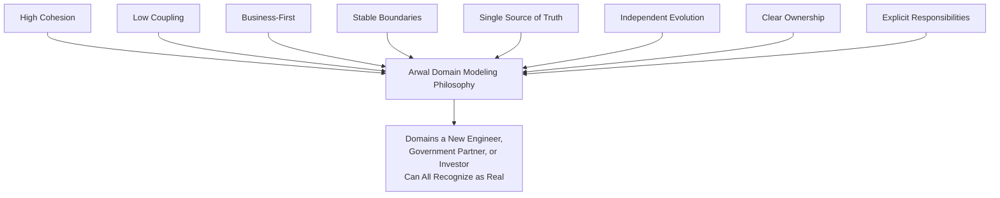

> **Callout — The One-Sentence Domain Modeling Philosophy**
> *"A domain boundary that cannot be explained to a citizen in one sentence, and defended to an engineer in one review, is not a boundary — it is a guess wearing an org chart."*

---

# Business Domain Hierarchy

Every domain in the Domain Catalog below is classified into exactly one of five tiers. Classification determines governance weight, review cadence, and change-approval authority (see Cross-Domain Governance).

| Tier | Definition | Characteristic |
|---|---|---|
| **Core Domains** | Domains that directly deliver Arwal's primary differentiated value and mission — the reason a citizen opens the app. | High strategic investment; owned by senior, named domain leadership; changes here are Strategic-or-Architectural classified per `ai-docs/29-engineering-governance-decision-authority.md`. |
| **Supporting Domains** | Domains necessary for Core Domains to function well, but not themselves the reason a citizen opens the app. | Important but not differentiating; may consume commodity patterns; still owned, still reviewed, lower strategic-investment ceiling than Core. |
| **Shared Domains** | Domains providing a capability consumed identically across many Core and Supporting Domains. | Governed with Platform Engineering discipline per `ai-docs/47-engineering-organizational-scaling-standards.md`'s Platform-First Enablement; a shared domain is never permitted a bespoke, per-consumer variant. |
| **Cross-Cutting Domains** | Domains whose concern applies *across* every other domain rather than owning a distinct business capability of their own. | Never a "vertical" in the citizen's mental model; enforced consistently everywhere rather than consumed selectively. |
| **Future Domains** | Domains anticipated by Arwal's expansion strategy but not yet active. | Tracked for readiness; not yet subject to active capability investment or dedicated ownership. |

```mermaid
graph TD
    Root[Arwal Business Domain Hierarchy] --> Core[Core Domains]
    Root --> Supporting[Supporting Domains]
    Root --> Shared[Shared Domains]
    Root --> CrossCutting[Cross-Cutting Domains]
    Root --> Future[Future Domains]

    Core --> C1[Government Services]
    Core --> C2[Agriculture]
    Core --> C3[Healthcare]
    Core --> C4[Education]
    Core --> C5[Jobs]
    Core --> C6[Commerce Marketplace]
    Core --> C7[Food Delivery]
    Core --> C8[Grocery]
    Core --> C9[Property]
    Core --> C10[Community]

    Supporting --> S1[Logistics]
    Supporting --> S2[Payments]
    Supporting --> S3[Trust & Safety]

    Shared --> SH1[Identity]
    Shared --> SH2[Search]
    Shared --> SH3[Notifications]
    Shared --> SH4[AI Assistant]

    CrossCutting --> CC1[Citizen]
    CrossCutting --> CC2[Analytics]
    CrossCutting --> CC3[Administration]

    Future --> F1[Fintech/Micro-Lending]
    Future --> F2[Multi-District Configuration]
    Future --> F3[State-Level Government Integration]
```

> **Callout — Why "Citizen" Is Cross-Cutting, Not Core**
> Citizen identity, reputation, and relationship data are consumed by *every* domain — Commerce, Healthcare, Civic, Agriculture all reference the same citizen. Modeling Citizen as a Core Domain would wrongly imply it is one differentiated business capability among many; modeling it as Cross-Cutting correctly reflects that it is a concern every other domain depends on and must honor consistently.

---

# Domain Registry

Every domain carries a permanent, sequential, never-reused Domain ID — mirroring the identical Registry discipline already established for Stakeholders (`ai-docs/51-stakeholder-analysis.md`) and Ownership (`ai-docs/47-engineering-organizational-scaling-standards.md`).

| Domain ID | Name | Tier | Lifecycle Status | Domain Owner |
|---|---|---|---|---|
| DOM-001 | Identity | Shared | Active | Head of Platform Engineering |
| DOM-002 | Citizen | Cross-Cutting | Active | CPO (delegated: Head of Citizen Experience) |
| DOM-003 | Government Services | Core | Active | Head of Government Partnerships |
| DOM-004 | Agriculture | Core | Active | Head of Agriculture Vertical |
| DOM-005 | Healthcare | Core | Active | Head of Healthcare Vertical |
| DOM-006 | Education | Core | Active | Head of Education Vertical |
| DOM-007 | Jobs | Core | Active | Head of Jobs Vertical |
| DOM-008 | Commerce Marketplace | Core | Active | Head of Merchant Success |
| DOM-009 | Food Delivery | Core | Active | Head of Food & Grocery |
| DOM-010 | Grocery | Core | Active | Head of Food & Grocery |
| DOM-011 | Logistics | Supporting | Active | Head of Logistics |
| DOM-012 | Property | Core | Active | Head of Classifieds/Property |
| DOM-013 | Payments | Supporting | Active | Head of Payments |
| DOM-014 | Community | Core | Active | Head of Community Engagement |
| DOM-015 | Search | Shared | Active | Head of Platform Engineering |
| DOM-016 | Notifications | Shared | Active | Head of Platform Engineering |
| DOM-017 | AI Assistant | Shared | Active | Head of AI Platform |
| DOM-018 | Analytics | Cross-Cutting | Active | Head of Data/Analytics |
| DOM-019 | Administration | Cross-Cutting | Active | Head of Operations |
| DOM-020 | Trust & Safety | Supporting | Active | Head of Trust & Safety |
| DOM-021 | Fintech / Micro-Lending | Future | Anticipated | CFO / Head of Payments (future) |
| DOM-022 | Multi-District Configuration | Future | Anticipated | CTO / Head of Expansion (future) |
| DOM-023 | State-Level Government Integration | Future | Anticipated | CEO / Head of Government Partnerships (future) |

> **Callout — Lifecycle Status Values**
> `Anticipated` (named, not yet resourced) → `Active` (resourced, owned, capabilities delivered) → `Maturing` (capability depth actively growing) → `Stable` (capability set mature, low change rate) → `Deprecated` (marked for retirement, migration path stated) → `Retired` (archived, ID never reused). Every domain's current status is reviewed at the Quarterly Domain Review (see Domain Governance).

---

# Domain Catalog

Each domain below follows an identical structure. Where a domain's business capability overlaps conceptually with another (e.g., Food Delivery and Grocery both being "commerce"), the Domain Boundaries section later in this document makes the distinction explicit.

## DOM-001 — Identity

| Field | Detail |
|---|---|
| **Purpose** | Establish and maintain one authoritative, verifiable digital identity per citizen, merchant, service provider, delivery partner, and government officer, usable across every other domain. |
| **Responsibilities** | Identity creation and verification (KYC/OTP); credential and session lifecycle; role assignment (citizen, merchant, provider, officer, admin); identity linkage across household/delegated-access scenarios. |
| **Business Capabilities** | Identity Verification; Role & Profile Management; Delegated/Assisted Access Management; Cross-Domain Identity Resolution. |
| **Primary Personas** | PER-019 Devendra (delegated access), PER-001 Rahul, PER-010 Suresh, PER-017 Priya (officer identity). |
| **Primary Stakeholders** | STK-001 Citizens, STK-010 Local Businesses, STK-017 Government Officials. |
| **Inputs** | Government ID documents; phone number; biometric/OTP confirmation; delegation authorization from a household member. |
| **Outputs** | A verified Citizen Identity record; a Role Assignment; an Assisted-Access Grant. |
| **Business Events** | `IdentityVerified`, `RoleAssigned`, `DelegatedAccessGranted`, `DelegatedAccessRevoked`. |
| **Dependencies** | Downstream consumer for every other domain (Citizen, Commerce, Healthcare, Civic, etc.); upstream dependency on government ID verification sources. |
| **Domain Owner** | Head of Platform Engineering. |
| **Success Metrics** | Verification completion rate; identity-fraud incident rate; delegated-access satisfaction (Devendra persona). |
| **Future Evolution** | State-level single-sign-on integration; cross-district identity portability. |

## DOM-002 — Citizen

| Field | Detail |
|---|---|
| **Purpose** | Own the citizen's unified profile, preferences, cross-vertical reputation, and relationship history — the concept every other domain references but never owns. |
| **Responsibilities** | Maintaining one profile per citizen across every vertical; aggregating cross-domain reputation signals; managing consent and data-sharing preferences per module. |
| **Business Capabilities** | Unified Profile Management; Cross-Vertical Reputation Aggregation; Consent & Preference Management. |
| **Primary Personas** | PER-001 Rahul, PER-002 Meena, PER-021 Lakshmi. |
| **Primary Stakeholders** | STK-001 Citizens, STK-029 Senior Citizens, STK-031 Low-Literacy Users. |
| **Inputs** | Identity-verified profile from DOM-001; activity/reputation signals from every consuming domain. |
| **Outputs** | A composite Citizen Profile; a Reputation Score usable (never owned) by consuming domains. |
| **Business Events** | `ProfileUpdated`, `ReputationRecalculated`, `ConsentChanged`. |
| **Dependencies** | Upstream: Identity. Downstream: every Core/Supporting domain that displays or acts on citizen reputation. |
| **Domain Owner** | CPO (delegated: Head of Citizen Experience). |
| **Success Metrics** | Cross-Vertical Adoption Depth (`ai-docs/50`); District Trust Signal. |
| **Future Evolution** | Portable, citizen-controlled data export as regulatory maturity permits. |

## DOM-003 — Government Services

| Field | Detail |
|---|---|
| **Purpose** | Digitize government application intake, processing, status tracking, and citizen communication for participating departments. |
| **Responsibilities** | Application submission and lifecycle; department-specific workflow configuration; officer queue management; immutable audit trail of civic decisions. |
| **Business Capabilities** | Application Intake; Department Workflow Configuration; Officer Case Management; Civic Audit Trail; Grievance Redress. |
| **Primary Personas** | PER-017 Priya, PER-018 Mr. Singh, PER-019 Devendra. |
| **Primary Stakeholders** | STK-017 Government Officials, STK-018 District Administration. |
| **Inputs** | Citizen-submitted application data and documents; department-defined workflow rules. |
| **Outputs** | Application status updates; issued certificates/approvals; audit records. |
| **Business Events** | `ApplicationSubmitted`, `ApplicationStatusChanged`, `ApplicationApproved`, `ApplicationRejected`, `GrievanceRaised`, `GrievanceResolved`. |
| **Dependencies** | Upstream: Identity, Citizen. Downstream: Notifications, Analytics, Trust & Safety (dispute escalation). |
| **Domain Owner** | Head of Government Partnerships. |
| **Success Metrics** | Government Efficiency KPI — reduction in average service completion time. |
| **Future Evolution** | State-level department integration (DOM-023); AI-assisted eligibility pre-screening. |

## DOM-004 — Agriculture

| Field | Detail |
|---|---|
| **Purpose** | Give farmers direct access to market pricing, weather intelligence, government scheme discovery, and a direct-to-buyer produce marketplace. |
| **Responsibilities** | Mandi price aggregation; weather-alert delivery; scheme-eligibility discovery; farmer-to-buyer listing and negotiation support. |
| **Business Capabilities** | Market Price Intelligence; Weather Advisory; Scheme Discovery; Direct-to-Buyer Marketplace. |
| **Primary Personas** | PER-002 Meena. |
| **Primary Stakeholders** | STK-002 Farmers, STK-023 Farmer Cooperatives. |
| **Inputs** | External mandi price feeds; weather data; government scheme catalogs; farmer produce listings. |
| **Outputs** | Voice/text price and weather advisories; scheme-eligibility results; buyer connections. |
| **Business Events** | `PriceUpdated`, `WeatherAlertIssued`, `SchemeEligibilityMatched`, `ProduceListed`, `ProduceSold`. |
| **Dependencies** | Upstream: Identity, Citizen, Government Services (schemes). Downstream: Payments, Notifications, Logistics. |
| **Domain Owner** | Head of Agriculture Vertical. |
| **Success Metrics** | Farmer Empowerment KPI — % of registered farmers using price/weather/scheme features monthly. |
| **Future Evolution** | Cooperative-level aggregation tooling; predictive yield/price AI advisory. |

## DOM-005 — Healthcare

| Field | Detail |
|---|---|
| **Purpose** | Enable discovery, booking, and trust-verified access to local doctors, clinics, hospitals, and pharmacies. |
| **Responsibilities** | Provider discovery and verification; appointment scheduling; institutional (clinic/hospital) profile management; pharmacy stock-visibility. |
| **Business Capabilities** | Provider Discovery; Appointment Scheduling; Institutional Profile Management; Pharmacy Availability. |
| **Primary Personas** | PER-006 Dr. Kavita, PER-007 Ramesh, PER-008 Anjali, PER-009 Vikash. |
| **Primary Stakeholders** | STK-006 Doctors, STK-007 Clinics, STK-008 Hospitals, STK-009 Pharmacies. |
| **Inputs** | Provider verification documents; appointment availability; stock data. |
| **Outputs** | Bookings; verified provider profiles; stock-visibility results. |
| **Business Events** | `ProviderVerified`, `AppointmentBooked`, `AppointmentCancelled`, `AppointmentCompleted`, `StockUpdated`. |
| **Dependencies** | Upstream: Identity, Citizen. Downstream: Payments, Notifications, Trust & Safety. |
| **Domain Owner** | Head of Healthcare Vertical. |
| **Success Metrics** | Healthcare Access KPI — reduced time-to-appointment; no-show rate reduction. |
| **Future Evolution** | Telehealth/remote consultation; diagnostic-report integration. |

## DOM-006 — Education

| Field | Detail |
|---|---|
| **Purpose** | Connect students and parents to local tutors, coaching centers, and skill-development resources. |
| **Responsibilities** | Tutor/coaching-center discovery and verification; scheduling; scholarship/opportunity discovery. |
| **Business Capabilities** | Tutor Discovery; Session Scheduling; Reputation Management; Scholarship Discovery. |
| **Primary Personas** | PER-003 Aisha, PER-004 Manoj, PER-005 Sunita. |
| **Primary Stakeholders** | STK-003 Students, STK-004 Teachers, STK-005 Parents, STK-022 Educational Institutions. |
| **Inputs** | Tutor/institution profiles; scholarship listings. |
| **Outputs** | Bookings; ratings; scholarship matches. |
| **Business Events** | `TutorVerified`, `SessionBooked`, `SessionCompleted`, `ScholarshipMatched`. |
| **Dependencies** | Upstream: Identity, Citizen. Downstream: Payments, Notifications. |
| **Domain Owner** | Head of Education Vertical. |
| **Success Metrics** | Education Improvement KPI — students connected to tutors/resources. |
| **Future Evolution** | Skill-certification tracking; employer-linked skill pathways (with Jobs). |

## DOM-007 — Jobs

| Field | Detail |
|---|---|
| **Purpose** | Connect job seekers with local employers for formal, informal, and gig opportunities. |
| **Responsibilities** | Job/gig posting; candidate discovery; application tracking; anti-exploitation listing verification. |
| **Business Capabilities** | Job Posting; Candidate Matching; Application Tracking; Listing Verification. |
| **Primary Personas** | PER-015 Rakesh, PER-016 Neha, PER-023 Iqbal. |
| **Primary Stakeholders** | STK-015 Job Seekers, STK-016 Employers, STK-032 Migrant Workers. |
| **Inputs** | Employer job postings; candidate profiles. |
| **Outputs** | Matches; application status; verified listings. |
| **Business Events** | `JobPosted`, `ApplicationSubmitted`, `CandidateShortlisted`, `HireConfirmed`. |
| **Dependencies** | Upstream: Identity, Citizen. Downstream: Notifications, Trust & Safety (fraud/exploitation review). |
| **Domain Owner** | Head of Jobs Vertical. |
| **Success Metrics** | Employment Generation KPI — verified jobs/gigs fulfilled per quarter. |
| **Future Evolution** | Skills-verification integration with Education domain. |

## DOM-008 — Commerce Marketplace

| Field | Detail |
|---|---|
| **Purpose** | Provide local shops, wholesalers, and classifieds sellers an affordable digital storefront and citizens a trusted local shopping experience. |
| **Responsibilities** | Catalog management; cart/checkout; order lifecycle; merchant onboarding and dashboard; returns/refunds. |
| **Business Capabilities** | Catalog Management; Order Lifecycle; Merchant Onboarding; Returns & Refunds. |
| **Primary Personas** | PER-010 Suresh, PER-011 Priyanka, PER-001 Rahul. |
| **Primary Stakeholders** | STK-010 Local Businesses, STK-011 Merchants. |
| **Inputs** | Merchant catalogs; citizen orders. |
| **Outputs** | Confirmed orders; fulfillment requests to Logistics; payout requests to Payments. |
| **Business Events** | `OrderPlaced`, `OrderConfirmed`, `OrderFulfilled`, `OrderReturned`, `MerchantOnboarded`. |
| **Dependencies** | Upstream: Identity, Citizen. Downstream: Logistics, Payments, Notifications, Trust & Safety. |
| **Domain Owner** | Head of Merchant Success. |
| **Success Metrics** | Business Enablement KPI; GMV with healthy contribution margin. |
| **Future Evolution** | B2B/Wholesale marketplace depth. |

## DOM-009 — Food Delivery

| Field | Detail |
|---|---|
| **Purpose** | Enable restaurant and food-vendor discovery, ordering, and delivery tracking. |
| **Responsibilities** | Menu management; order placement and tracking; restaurant onboarding. |
| **Business Capabilities** | Menu Discovery; Order Placement; Delivery Tracking; Restaurant Onboarding. |
| **Primary Personas** | PER-001 Rahul. |
| **Primary Stakeholders** | STK-010 Local Businesses (restaurants), STK-012 Delivery Partners. |
| **Inputs** | Restaurant menus; citizen orders. |
| **Outputs** | Confirmed food orders; fulfillment requests to Logistics. |
| **Business Events** | `FoodOrderPlaced`, `FoodOrderPrepared`, `FoodOrderDelivered`. |
| **Dependencies** | Upstream: Identity, Citizen. Downstream: Logistics, Payments, Notifications. |
| **Domain Owner** | Head of Food & Grocery. |
| **Success Metrics** | Order-fulfillment time; repeat-order rate. |
| **Future Evolution** | Dynamic delivery-time prediction. |

## DOM-010 — Grocery

| Field | Detail |
|---|---|
| **Purpose** | Enable grocery discovery, ordering, and same-day fulfillment distinct from restaurant food ordering. |
| **Responsibilities** | Grocery catalog management; bulk/recurring order support; grocer onboarding. |
| **Business Capabilities** | Grocery Catalog Management; Recurring Order Support; Grocer Onboarding. |
| **Primary Personas** | PER-001 Rahul, PER-021 Lakshmi. |
| **Primary Stakeholders** | STK-010 Local Businesses (grocers). |
| **Inputs** | Grocer catalogs; citizen orders. |
| **Outputs** | Confirmed grocery orders; fulfillment requests to Logistics. |
| **Business Events** | `GroceryOrderPlaced`, `GroceryOrderPacked`, `GroceryOrderDelivered`. |
| **Dependencies** | Upstream: Identity, Citizen. Downstream: Logistics, Payments, Notifications. |
| **Domain Owner** | Head of Food & Grocery. |
| **Success Metrics** | Same-day fulfillment rate; recurring-order retention. |
| **Future Evolution** | Subscription/recurring-basket automation. |

## DOM-011 — Logistics

| Field | Detail |
|---|---|
| **Purpose** | Provide the shared delivery/fulfillment layer underpinning Commerce, Food, and Grocery. |
| **Responsibilities** | Route assignment; delivery-partner earnings calculation; delivery tracking; capacity coordination across fulfillment domains. |
| **Business Capabilities** | Route Assignment; Earnings Calculation; Delivery Tracking; Capacity Coordination. |
| **Primary Personas** | PER-012 Vikram. |
| **Primary Stakeholders** | STK-012 Delivery Partners, STK-025 Logistics Partners. |
| **Inputs** | Fulfillment requests from Commerce/Food/Grocery; delivery-partner availability. |
| **Outputs** | Assigned routes; delivery-status events; earnings records. |
| **Business Events** | `DeliveryAssigned`, `DeliveryPickedUp`, `DeliveryCompleted`, `EarningsCalculated`. |
| **Dependencies** | Upstream: Commerce Marketplace, Food Delivery, Grocery. Downstream: Payments, Notifications. |
| **Domain Owner** | Head of Logistics. |
| **Success Metrics** | On-time delivery rate; earnings-transparency satisfaction. |
| **Future Evolution** | Cross-district logistics network; third-party logistics-partner integration. |

## DOM-012 — Property

| Field | Detail |
|---|---|
| **Purpose** | Enable property sale/rental listing, discovery, and verified-inquiry connection. |
| **Responsibilities** | Listing management; lister/inquirer verification; spam/fraud filtering. |
| **Business Capabilities** | Listing Management; Verification; Inquiry Matching. |
| **Primary Personas** | PER-013 Ashok, PER-014 Farida. |
| **Primary Stakeholders** | STK-013 Property Owners, STK-014 Tenants. |
| **Inputs** | Property listings; inquiries. |
| **Outputs** | Verified listings; connected inquiries. |
| **Business Events** | `PropertyListed`, `ListingVerified`, `InquirySubmitted`, `ListingClosed`. |
| **Dependencies** | Upstream: Identity, Citizen. Downstream: Notifications, Trust & Safety. |
| **Domain Owner** | Head of Classifieds/Property. |
| **Success Metrics** | Listing-to-transaction conversion; fraud/report rate. |
| **Future Evolution** | Rental-agreement digitization. |

## DOM-013 — Payments

| Field | Detail |
|---|---|
| **Purpose** | Provide the single, secure money-movement layer — wallet, transaction processing, and payout — underlying every domain. |
| **Responsibilities** | Wallet balance management; transaction processing; merchant/provider/partner payout; refund processing. |
| **Business Capabilities** | Wallet Management; Transaction Processing; Payout Processing; Refund Handling. |
| **Primary Personas** | All transacting personas. |
| **Primary Stakeholders** | STK-020 Banks, STK-021 Payment Providers. |
| **Inputs** | Transaction requests from every consuming domain. |
| **Outputs** | Settled transactions; payout confirmations; refunds. |
| **Business Events** | `PaymentInitiated`, `PaymentSettled`, `PaymentFailed`, `RefundIssued`, `PayoutProcessed`. |
| **Dependencies** | Upstream: Identity. Downstream: consumed by every transacting domain (Commerce, Food, Grocery, Healthcare, Education, Agriculture, Property, Government fee facilitation). |
| **Domain Owner** | Head of Payments. |
| **Success Metrics** | Transaction success rate; settlement latency; dispute/chargeback rate. |
| **Future Evolution** | Fintech/micro-lending (DOM-021), once trust and compliance maturity justify it. |

## DOM-014 — Community

| Field | Detail |
|---|---|
| **Purpose** | Support community-level engagement — NGO/SHG-linked economic activity, group onboarding, and local collective participation. |
| **Responsibilities** | Group-account patterns; cooperative/SHG-linked verification; community-event/engagement support. |
| **Business Capabilities** | Group Account Management; Cooperative-Linked Verification; Community Engagement Coordination. |
| **Primary Personas** | PER-022 Radha's SHG, PER-024 Fr. Thomas. |
| **Primary Stakeholders** | STK-019 NGOs, STK-024 Self-Help Groups, STK-033 Women's Self-Help Groups. |
| **Inputs** | Group registration data; field-agent onboarding records. |
| **Outputs** | Group listings; amplified beneficiary reach. |
| **Business Events** | `GroupRegistered`, `GroupListingPublished`, `FieldOnboardingCompleted`. |
| **Dependencies** | Upstream: Identity. Downstream: Commerce Marketplace (group listings), Trust & Safety. |
| **Domain Owner** | Head of Community Engagement. |
| **Success Metrics** | Beneficiary reach amplified through Arwal. |
| **Future Evolution** | Cooperative-level aggregated commerce tooling. |

## DOM-015 — Search

| Field | Detail |
|---|---|
| **Purpose** | Provide hyperlocal, ranked discovery across every catalog, listing, and provider domain. |
| **Responsibilities** | Query understanding; ranking; hyperlocal relevance; cross-domain result aggregation. |
| **Business Capabilities** | Query Understanding; Ranking; Cross-Domain Discovery Aggregation. |
| **Primary Personas** | All discovery-driven personas. |
| **Primary Stakeholders** | All Primary Stakeholders. |
| **Inputs** | Citizen queries; catalog/listing data from every consuming domain. |
| **Outputs** | Ranked, explainable search results. |
| **Business Events** | `SearchQueryExecuted`, `SearchResultSelected`. |
| **Dependencies** | Upstream: every domain with discoverable content. Downstream: Analytics, AI Assistant. |
| **Domain Owner** | Head of Platform Engineering. |
| **Success Metrics** | Search-to-action conversion rate. |
| **Future Evolution** | Voice-first search maturity for low-literacy personas. |

## DOM-016 — Notifications

| Field | Detail |
|---|---|
| **Purpose** | Deliver unified, preference-aware notifications across every citizen-facing event, regardless of originating domain. |
| **Responsibilities** | Channel abstraction (SMS/push/WhatsApp/in-app); preference management; delivery reliability. |
| **Business Capabilities** | Channel Abstraction; Preference Management; Delivery Assurance. |
| **Primary Personas** | All personas. |
| **Primary Stakeholders** | All Primary Stakeholders. |
| **Inputs** | Business events from every domain. |
| **Outputs** | Delivered notifications. |
| **Business Events** | `NotificationQueued`, `NotificationDelivered`, `NotificationFailed`. |
| **Dependencies** | Upstream: every domain publishing an event. Downstream: none (terminal). |
| **Domain Owner** | Head of Platform Engineering. |
| **Success Metrics** | Delivery success rate; preference-honoring rate. |
| **Future Evolution** | Zero-rated data partnerships for low-connectivity delivery. |

## DOM-017 — AI Assistant

| Field | Detail |
|---|---|
| **Purpose** | Provide conversational, voice-capable, human-overseen assistance across civic, discovery, and advisory tasks. |
| **Responsibilities** | Prompt-mediated assistance; cross-domain reasoning; human-override enforcement. |
| **Business Capabilities** | Conversational Assistance; Cross-Domain Reasoning; Human-Override Enforcement. |
| **Primary Personas** | PER-002 Meena, PER-021 Lakshmi, PER-019 Devendra. |
| **Primary Stakeholders** | STK-001 Citizens, STK-017 Government Officials. |
| **Inputs** | Citizen queries; domain data (read-only, mediated). |
| **Outputs** | Guided assistance; pre-screened recommendations (never final decisions). |
| **Business Events** | `AssistantSessionStarted`, `AssistantRecommendationIssued`, `HumanOverrideInvoked`. |
| **Dependencies** | Upstream: Search, Citizen, every advisory-relevant domain. Downstream: Notifications. |
| **Domain Owner** | Head of AI Platform. |
| **Success Metrics** | Human-override-path availability (100% for civic/financial decisions); assistant task-completion rate. |
| **Future Evolution** | Full civic-assistant maturity per `ai-docs/48-engineering-strategic-planning-standards.md`'s AI Capability Maturity scale. |

## DOM-018 — Analytics

| Field | Detail |
|---|---|
| **Purpose** | Aggregate cross-domain data into trustworthy metrics for product, operational, and executive decision-making. |
| **Responsibilities** | Metric computation; dashboard data provisioning; trend analysis. |
| **Business Capabilities** | Metric Computation; Dashboard Provisioning; Trend Analysis. |
| **Primary Personas** | Internal (Leadership, Product). |
| **Primary Stakeholders** | STK-044 Leadership, STK-045 Investors. |
| **Inputs** | Business events from every domain. |
| **Outputs** | Dashboards; KPI reports. |
| **Business Events** | `MetricComputed`, `DashboardRefreshed`. |
| **Dependencies** | Upstream: every domain. Downstream: Executive Dashboards (below). |
| **Domain Owner** | Head of Data/Analytics. |
| **Success Metrics** | Metric-freshness/latency; dashboard adoption rate. |
| **Future Evolution** | Predictive/forecasting analytics layered onto historical trend data. |

## DOM-019 — Administration

| Field | Detail |
|---|---|
| **Purpose** | Provide internal operational tooling for platform administrators to manage verification, fraud, and policy enforcement. |
| **Responsibilities** | Merchant/provider verification workflows; fraud-signal monitoring; policy-enforcement tooling. |
| **Business Capabilities** | Verification Workflow Management; Fraud Monitoring; Policy Enforcement Tooling. |
| **Primary Personas** | Internal (Operations, Trust & Safety). |
| **Primary Stakeholders** | STK-039 Customer Support, STK-040 Operations. |
| **Inputs** | Verification requests; fraud signals from Trust & Safety. |
| **Outputs** | Verification decisions; enforcement actions. |
| **Business Events** | `VerificationApproved`, `VerificationRejected`, `PolicyActionTaken`. |
| **Dependencies** | Upstream: Trust & Safety, every domain requiring verification. Downstream: Notifications. |
| **Domain Owner** | Head of Operations. |
| **Success Metrics** | Verification turnaround time; policy-enforcement consistency. |
| **Future Evolution** | AI-assisted verification triage (human-approved). |

## DOM-020 — Trust & Safety

| Field | Detail |
|---|---|
| **Purpose** | Provide the shared dispute-resolution, fraud-detection, and reputation-integrity capability every transacting domain depends on. |
| **Responsibilities** | Dispute intake and resolution; fraud/anomaly detection; reputation-integrity enforcement (anti-review-manipulation). |
| **Business Capabilities** | Dispute Resolution; Fraud Detection; Reputation Integrity Enforcement. |
| **Primary Personas** | All transacting personas (as beneficiaries). |
| **Primary Stakeholders** | STK-001 Citizens, STK-011 Merchants. |
| **Inputs** | Dispute filings; anomaly signals from every domain. |
| **Outputs** | Dispute resolutions; fraud flags; reputation adjustments. |
| **Business Events** | `DisputeFiled`, `DisputeResolved`, `FraudFlagRaised`, `ReputationAdjusted`. |
| **Dependencies** | Upstream: every transacting domain. Downstream: Citizen (reputation), Administration. |
| **Domain Owner** | Head of Trust & Safety. |
| **Success Metrics** | Dispute-resolution time; fraud-incident rate. |
| **Future Evolution** | AI-assisted anomaly detection, always human-reviewable. |

---

# Business Capability Map

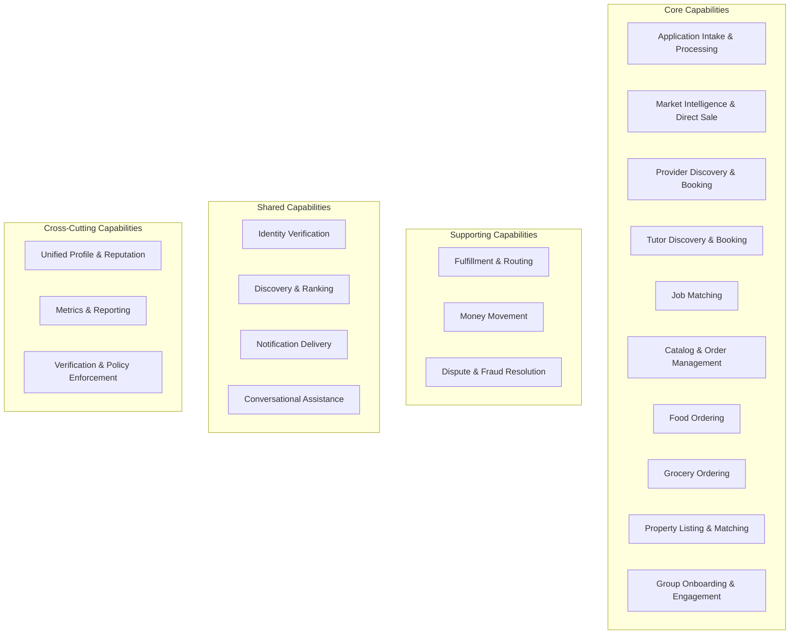

| Capability | Owning Domain | Consumed By |
|---|---|---|
| Application Intake & Processing | Government Services | Citizen, Notifications, Analytics |
| Market Intelligence & Direct Sale | Agriculture | Citizen, Payments, Logistics |
| Provider Discovery & Booking | Healthcare | Citizen, Payments, Notifications |
| Tutor Discovery & Booking | Education | Citizen, Payments, Notifications |
| Job Matching | Jobs | Citizen, Trust & Safety, Notifications |
| Catalog & Order Management | Commerce Marketplace | Logistics, Payments, Trust & Safety |
| Food Ordering | Food Delivery | Logistics, Payments, Notifications |
| Grocery Ordering | Grocery | Logistics, Payments, Notifications |
| Property Listing & Matching | Property | Trust & Safety, Notifications |
| Group Onboarding & Engagement | Community | Commerce Marketplace, Trust & Safety |
| Fulfillment & Routing | Logistics | Commerce, Food, Grocery |
| Money Movement | Payments | Every transacting domain |
| Dispute & Fraud Resolution | Trust & Safety | Every transacting domain, Citizen |
| Identity Verification | Identity | Every domain |
| Discovery & Ranking | Search | Every content-owning domain |
| Notification Delivery | Notifications | Every domain |
| Conversational Assistance | AI Assistant | Citizen, Government Services, Agriculture |
| Unified Profile & Reputation | Citizen | Every domain |
| Metrics & Reporting | Analytics | Leadership, all domains |
| Verification & Policy Enforcement | Administration | Every domain requiring verification |

---

# Domain Relationships

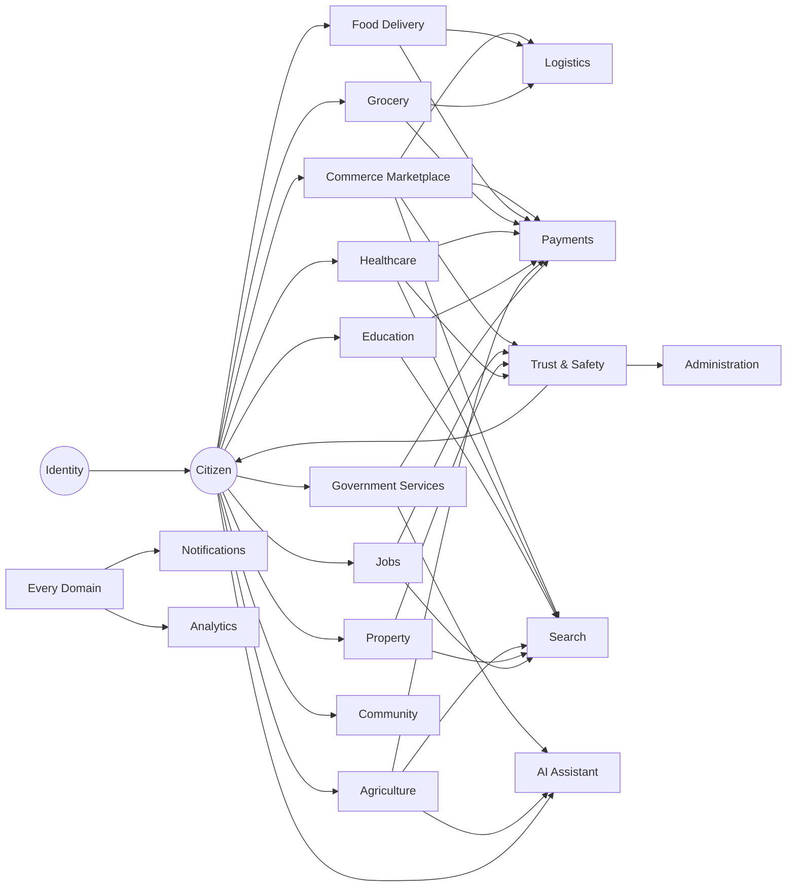

---

# Shared Business Concepts (Ubiquitous Language)

Per the governance improvement this document incorporates, every core business concept below carries exactly one authoritative definition, cited by name — never redefined informally by a consuming domain.

| Concept | Definition | Owning Domain |
|---|---|---|
| **Citizen** | A verified individual with a unified Arwal identity, usable across every domain. | Identity / Citizen |
| **Merchant** | A verified business entity offering goods or services for sale through Commerce, Food, or Grocery. | Commerce Marketplace |
| **Order** | A citizen's confirmed request to purchase goods from a Commerce, Food, or Grocery domain, tracked through a defined lifecycle. | Commerce Marketplace / Food Delivery / Grocery (each owns its own Order concept, distinct by domain) |
| **Booking** | A citizen's confirmed reservation of a time-bound service (a healthcare appointment, a tutoring session). | Healthcare / Education (each owns its own Booking concept, distinct by domain) |
| **Property** | A listed unit of real estate available for sale or rental. | Property |
| **Payment** | A single, atomic movement of money between two parties, mediated by the platform. | Payments |
| **Application** | A citizen's formal submission to a government department for a service, certificate, or benefit. | Government Services |
| **Notification** | A single, delivered message informing a citizen or partner of an event relevant to them. | Notifications |
| **Identity** | The verified, authoritative representation of a person or entity's right to act on the platform. | Identity |
| **Reputation** | A citizen's or provider's aggregated trust signal, compounding across every domain they participate in. | Citizen (aggregation); Trust & Safety (integrity enforcement) |
| **Trust** | The platform-wide property that verification, dispute resolution, and transparency are genuinely, not nominally, in effect. | Trust & Safety (enforcement); Citizen (signal) |
| **Review** | A citizen's or provider's feedback on a completed transaction or service. | Trust & Safety |
| **Document** | A verifiable artifact (a government ID, a certificate, a listing photo) attached to an Identity, Application, or Listing. | Identity (KYC docs); Government Services (civic docs); domain-specific for others |

> **Callout — Why "Order" and "Booking" Are Deliberately Not Unified**
> Per the DDD reasoning already established in `ai-docs/03-system-architecture-principles.md`, a "Booking" in Healthcare and an "Order" in Commerce are genuinely different business concepts with different lifecycles and rules, even though both represent "a citizen committing to a transaction." Forcing them into one shared concept purely for terminological tidiness would be the exact false-coupling anti-pattern that document already warns against.

---

# Domain Boundaries

For each domain, the table below states one clarifying inclusion and one clarifying exclusion — the specific boundary decision most likely to be mis-drawn in practice.

| Domain | Explicitly Inside | Explicitly Outside |
|---|---|---|
| Government Services | Application workflow, officer case management, civic audit trail | Payment processing (belongs to Payments); citizen identity verification (belongs to Identity) |
| Agriculture | Price/weather advisory, scheme discovery, farmer listings | Delivery of sold produce (belongs to Logistics); payment settlement (belongs to Payments) |
| Healthcare | Provider discovery, appointment scheduling, institutional profiles | Payment collection (belongs to Payments); pharmacy order fulfillment logistics (belongs to Logistics) |
| Commerce Marketplace | Catalog, cart, checkout, merchant dashboard | Delivery routing (belongs to Logistics); dispute adjudication (belongs to Trust & Safety) |
| Food Delivery | Menu discovery, food-specific order lifecycle | Delivery-partner earnings calculation (belongs to Logistics) |
| Logistics | Route assignment, delivery-partner earnings, delivery tracking | Order creation (belongs to the originating Commerce/Food/Grocery domain) |
| Payments | Wallet, transaction processing, payout, refund | Fee-structure/commission policy decisions (belong to the originating domain; Payments only executes) |
| Trust & Safety | Dispute resolution, fraud detection, reputation-integrity enforcement | Reputation *display* to a citizen (belongs to Citizen domain, which aggregates the signal Trust & Safety maintains integrity over) |
| Search | Query understanding, ranking, aggregation | Catalog/content ownership (each domain owns its own discoverable content; Search only indexes and ranks it) |
| AI Assistant | Conversational mediation, cross-domain recommendation, human-override enforcement | Final decision authority on any civic, financial, or reputation outcome (always retained by the owning domain and a human) |

---

# Domain Event Catalog

| Event | Publishing Domain | Consuming Domain(s) |
|---|---|---|
| `IdentityVerified` | Identity | Citizen, every domain requiring verified access |
| `ProfileUpdated` | Citizen | Analytics, Search |
| `ApplicationSubmitted` | Government Services | Notifications, Analytics |
| `ApplicationStatusChanged` | Government Services | Notifications, Citizen, Analytics |
| `PriceUpdated` | Agriculture | Notifications, AI Assistant |
| `ProviderVerified` | Healthcare | Search, Trust & Safety |
| `AppointmentBooked` | Healthcare | Payments, Notifications, Logistics (where applicable) |
| `SessionBooked` | Education | Payments, Notifications |
| `JobPosted` | Jobs | Search, Notifications |
| `OrderPlaced` | Commerce Marketplace / Food Delivery / Grocery | Logistics, Payments, Notifications |
| `DeliveryAssigned` | Logistics | Notifications, Payments (earnings accrual) |
| `PaymentSettled` | Payments | Originating domain, Citizen (reputation signal), Analytics |
| `DisputeFiled` | Trust & Safety | Administration, Citizen, Notifications |
| `DisputeResolved` | Trust & Safety | Citizen, Notifications, Analytics |
| `PropertyListed` | Property | Search, Trust & Safety |
| `GroupRegistered` | Community | Commerce Marketplace, Identity |
| `AssistantRecommendationIssued` | AI Assistant | Consuming domain, Trust & Safety (for audit) |
| `VerificationApproved` | Administration | Originating domain, Notifications |

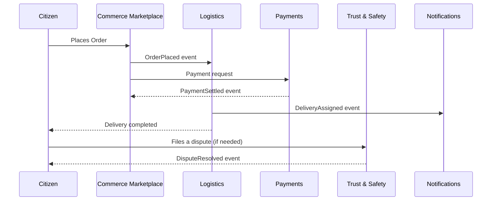

---

# Domain Dependency Map

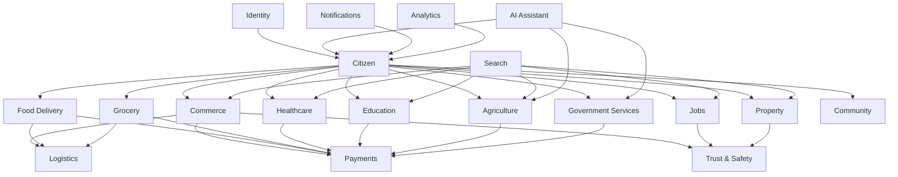

### Upstream / Downstream Table (Selected Domains)

| Domain | Upstream Dependencies (relies on) | Downstream Dependents (relied upon by) |
|---|---|---|
| Identity | Government ID verification sources (external) | Every domain |
| Citizen | Identity | Every transacting domain, Search, AI Assistant |
| Commerce Marketplace | Identity, Citizen | Logistics, Payments, Trust & Safety, Search |
| Logistics | Commerce, Food, Grocery | Payments, Notifications |
| Payments | Identity | Every transacting domain |
| Trust & Safety | Every transacting domain (dispute/fraud signals) | Citizen (reputation), Administration |
| Search | Every content-owning domain | AI Assistant, Analytics |
| AI Assistant | Search, Citizen, advisory-relevant domains | Notifications |

---

# Domain Lifecycle

Every domain moves through the same four stages — mirroring the identical lifecycle discipline already established for Documents (`ai-docs/49`) and Personas (`ai-docs/52`).

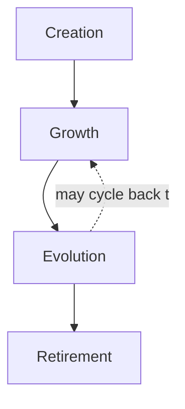

| Stage | Meaning | Governance Trigger |
|---|---|---|
| **Creation** | A domain is formally proposed, classified, and assigned an owner. | New Domain Proposal, per Domain Governance below. |
| **Growth** | The domain actively expands its business capabilities and maturity level. | Ongoing, tracked via Domain Maturity Levels. |
| **Evolution** | The domain's boundary or responsibilities are deliberately revised in response to evidence. | Domain Change Impact Assessment, per Cross-Domain Governance. |
| **Retirement** | The domain's business need has ended or been absorbed elsewhere. | Formal retirement decision, archived per Domain Registry, ID never reused. |

### Domain Maturity Levels

| Level | Characteristics | Readiness Criteria |
|---|---|---|
| **1 — Nascent** | Domain named and scoped; no active capability delivered yet. | Domain Owner assigned; Purpose and Responsibilities documented. |
| **2 — Emerging** | Core capabilities delivered but narrow; low citizen adoption. | At least one Business Event flowing in production. |
| **3 — Established** | Full capability set delivered; stable adoption; KPIs tracked. | Domain KPIs (below) actively measured for 2+ consecutive quarters. |
| **4 — Mature** | Capability set deepened; cross-domain integration proven reliable. | Dependency Map entries verified accurate at Quarterly Domain Review. |
| **5 — Optimized** | Domain actively informs strategic planning; proactive evolution. | Domain feeds Analytics-driven strategic input per `ai-docs/48-engineering-strategic-planning-standards.md`. |

---

# Cross-Domain Governance

### Ownership

Every domain has exactly one named Domain Owner per the Domain Registry — mirroring the identical Clear Ownership principle already established in `ai-docs/47-engineering-organizational-scaling-standards.md`. Shared or collective domain ownership is never permitted.

### Domain Responsibility Matrix (RACI, Selected Domains)

| Domain | Responsible | Accountable | Consulted | Informed |
|---|---|---|---|---|
| Government Services | Government Partnerships team | Head of Government Partnerships | Compliance, Trust & Safety | CPO, Leadership |
| Healthcare | Healthcare vertical team | Head of Healthcare Vertical | Compliance, Trust & Safety | CPO |
| Commerce Marketplace | Merchant Success team | Head of Merchant Success | Payments, Logistics, Trust & Safety | CPO |
| Payments | Payments team | Head of Payments | Compliance, Security | CFO, CPO |
| Trust & Safety | Trust & Safety team | Head of Trust & Safety | Every transacting domain | CPO, Leadership |
| Identity | Platform Engineering | Head of Platform Engineering | Security Team | CTO |

### Decision Authority

Domain boundary decisions (create, split, merge, retire) follow the identical classification-based authority already established in `ai-docs/29-engineering-governance-decision-authority.md` — a new Core Domain requires Architecture Review Board plus CPO approval; a Supporting or Shared Domain boundary change requires the Domain Owner plus Principal Architect sign-off.

### Conflict Resolution

A dispute between two Domain Owners over a boundary or a shared concept follows the identical Escalation Process already established in `ai-docs/29-engineering-governance-decision-authority.md` — direct discussion first, escalating to the Architecture Review Board, then to CPO/CTO jointly, never left unresolved.

### Change Management

Every domain boundary or responsibility change is documented per a **Domain Change Impact Assessment**, required before the change is approved:

| Field | Description |
|---|---|
| **Domain(s) Affected** | The domain being changed and every domain with a dependency relationship to it. |
| **Nature of Change** | Boundary shift, capability addition/removal, ownership transfer, retirement. |
| **Upstream Impact** | Which domains this domain depends on are affected. |
| **Downstream Impact** | Which domains depending on this domain are affected. |
| **Shared Concept Impact** | Whether any Ubiquitous Language concept's definition or ownership changes. |
| **Migration Plan** | How dependent domains adapt without a coordinated, simultaneous rewrite. |
| **Approval Authority** | Per the Decision Authority table above, scaled to the domain's Tier. |

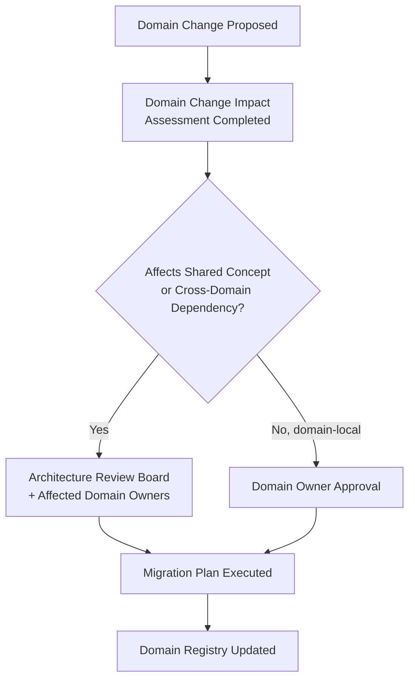

### Criteria for Introducing, Splitting, Merging, or Retiring a Domain

| Action | Criteria |
|---|---|
| **Introduce** | A genuine, distinct business concern exists with no current owning domain; a named owner and Tier classification are ready at proposal time. |
| **Split** | A domain has accumulated two or more clusters of responsibility with low mutual cohesion, evidenced by Domain Maturity or Compliance review findings. |
| **Merge** | Two domains show sustained, high-coupling interdependence that repeatedly requires coordinated change, mirroring the identical Team Merge Criteria already established in `ai-docs/47-engineering-organizational-scaling-standards.md`. |
| **Retire** | The business need the domain served no longer exists, or has been fully absorbed by another domain via a formal Merge decision. |

---

# Domain KPIs

| Domain | KPI |
|---|---|
| Identity | Verification completion rate; identity-fraud incident rate |
| Citizen | Cross-Vertical Adoption Depth; District Trust Signal |
| Government Services | Government Efficiency KPI (service completion time reduction) |
| Agriculture | Farmer Empowerment KPI (monthly active feature use) |
| Healthcare | Healthcare Access KPI (time-to-appointment, no-show rate) |
| Education | Education Improvement KPI (students connected) |
| Jobs | Employment Generation KPI (verified jobs/gigs fulfilled) |
| Commerce Marketplace | GMV with healthy contribution margin; Business Enablement KPI |
| Food Delivery / Grocery | Order-fulfillment time; repeat-order rate |
| Logistics | On-time delivery rate; earnings-transparency satisfaction |
| Property | Listing-to-transaction conversion; fraud/report rate |
| Payments | Transaction success rate; settlement latency |
| Community | Beneficiary reach amplified |
| Search | Search-to-action conversion rate |
| Notifications | Delivery success rate |
| AI Assistant | Human-override-path availability (100% target); task-completion rate |
| Analytics | Metric freshness/latency; dashboard adoption |
| Administration | Verification turnaround time |
| Trust & Safety | Dispute-resolution time; fraud-incident rate |

---

# Executive Dashboards

### CEO Dashboard
- District Trust Signal; Cross-Vertical Adoption Depth
- Domain Maturity distribution across all Core Domains
- Government Efficiency KPI trend
- Domain retirement/merge decisions this quarter

### CPO Dashboard
- Domain KPI summary across all Core Domains
- Persona-to-Domain traceability gaps (see below)
- Domain Change Impact Assessments in flight

### Enterprise Architecture Dashboard
- Domain Registry status (Active/Maturing/Deprecated counts)
- Domain Dependency Map health (circular-dependency alerts)
- Boundary-leakage findings from Domain Governance reviews

### Government Partners Dashboard
- Government Services domain KPI trend
- Civic Audit Trail completeness
- State-level integration readiness (DOM-023 status)

### Operations Dashboard
- Administration and Trust & Safety domain KPIs
- Verification turnaround and fraud-incident trend
- Cross-domain dispute volume by originating domain

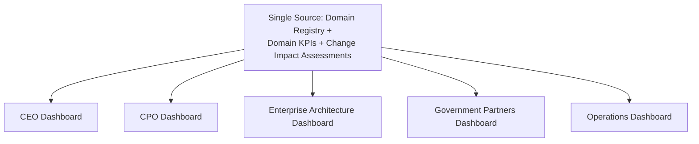

---

# AI & Domain Intelligence

### Domain Recommendations

An AI tool may recommend a candidate domain boundary, flag a likely capability overlap between two domains, or suggest a Domain Maturity Level assessment — every recommendation is a lead for the Domain Owner and Architecture Review Board to independently verify.

### Cross-Domain Reasoning

The AI Assistant domain (DOM-017) itself performs cross-domain reasoning on a citizen's behalf (e.g., connecting an Agriculture scheme eligibility question to a Government Services application) — this reasoning is always mediated through each domain's own published capability, never by AI directly manipulating another domain's internal data.

### AI Orchestration

Where an AI-assisted workflow spans multiple domains, orchestration logic itself lives in the AI Assistant domain's own boundary, calling each contributing domain's capability explicitly — never quietly reaching across a domain boundary the way `ai-docs/03-system-architecture-principles.md` already forbids at the technical layer.

### Human Approval

No domain boundary, merger, split, or retirement decision is made on the basis of AI analysis alone — every such decision requires the named human Domain Owner and, where Tier-appropriate, Architecture Review Board approval, identical to the Human Oversight standard already established consistently across this handbook.

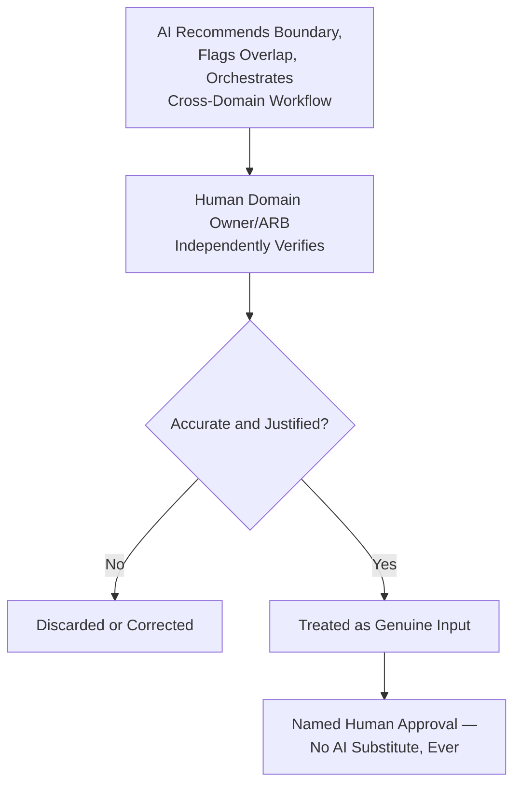

---

# Domain Anti-Patterns

| Anti-Pattern | Description | Why It's Rejected |
|---|---|---|
| **God Domain** | A single domain accumulating unrelated responsibilities (e.g., Commerce absorbing Payments and Logistics directly). | Violates High Cohesion and Single Responsibility at the business level; mirrors the God Object anti-pattern already rejected in `ai-docs/03-system-architecture-principles.md`. |
| **Circular Dependencies** | Domain A depends on Domain B, which depends back on Domain A. | Makes independent evolution impossible; always resolved by introducing a proper shared concept or event-based decoupling. |
| **Shared Ownership** | Two Domain Owners both claim (or both disclaim) accountability for the same domain. | Violates Clear Ownership; produces exactly the ambiguity `ai-docs/47-engineering-organizational-scaling-standards.md` names as a root cause of unresolved incidents. |
| **Duplicate Business Logic** | Two domains independently define the same business rule (e.g., two different cancellation-window rules for conceptually similar bookings). | Violates Single Source of Truth; the two definitions inevitably drift apart. |
| **Boundary Leakage** | A domain reaches into another domain's internal concept without going through its published capability. | Defeats Low Coupling; makes the "boundary" nominal rather than real. |

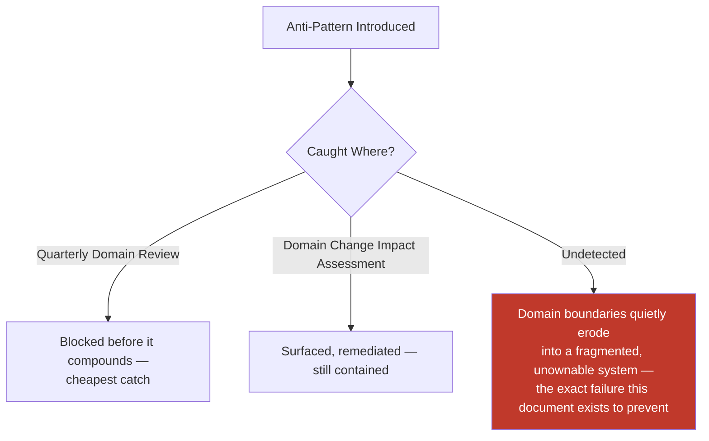

---

# Persona-to-Domain and Stakeholder-to-Domain Traceability

| Domain | Primary Personas (Phase 53) | Primary Stakeholders (Phase 52) |
|---|---|---|
| Identity | PER-019 Devendra | STK-001 Citizens |
| Citizen | PER-001 Rahul, PER-002 Meena | STK-001 Citizens |
| Government Services | PER-017 Priya, PER-018 Mr. Singh | STK-017, STK-018 |
| Agriculture | PER-002 Meena | STK-002 Farmers |
| Healthcare | PER-006 Dr. Kavita, PER-007, PER-008, PER-009 | STK-006, STK-007, STK-008, STK-009 |
| Education | PER-003 Aisha, PER-004 Manoj, PER-005 Sunita | STK-003, STK-004, STK-005 |
| Jobs | PER-015 Rakesh, PER-016 Neha, PER-023 Iqbal | STK-015, STK-016, STK-032 |
| Commerce Marketplace | PER-010 Suresh, PER-011 Priyanka | STK-010, STK-011 |
| Food Delivery / Grocery | PER-001 Rahul | STK-010 |
| Logistics | PER-012 Vikram | STK-012, STK-025 |
| Property | PER-013 Ashok, PER-014 Farida | STK-013, STK-014 |
| Payments | (cross-cutting) | STK-020, STK-021 |
| Community | PER-022 Radha's SHG, PER-024 Fr. Thomas | STK-019, STK-024, STK-033 |
| AI Assistant | PER-002 Meena, PER-021 Lakshmi, PER-019 Devendra | STK-001 |
| Trust & Safety | (cross-cutting, all transacting personas) | STK-001, STK-011 |

A domain with no traceable persona or stakeholder entry is treated as unjustified scope, per the identical Traceability discipline already established in `ai-docs/52-user-personas-user-segmentation.md`.

---

# Domain Governance

| Review | Cadence | Owner | Purpose |
|---|---|---|---|
| **Quarterly Domain Review** | Quarterly | Chief Enterprise Architect, CPO | Domain Registry accuracy, maturity-level progression, boundary-leakage findings |
| **Boundary Validation** | Quarterly | Architecture Review Board | Confirms domain boundaries still match actual system behavior, per the Fitness Function discipline in `ai-docs/46-engineering-architecture-governance-standards.md` |
| **Capability Review** | Semi-Annual | Domain Owners, CPO | Confirms Business Capability Map remains accurate as capabilities deepen |
| **Domain Ownership Review** | Quarterly | VP Engineering, CPO | Confirms every domain has a current, active named owner; escalates any ownerless domain |

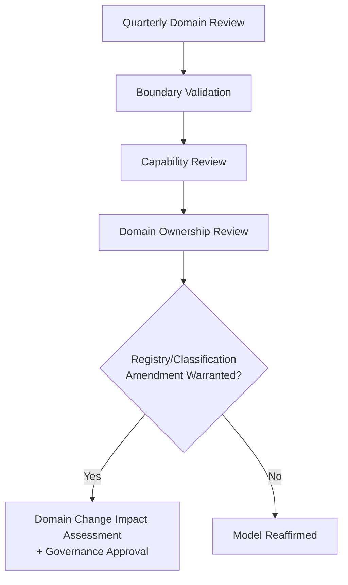

---

# Relationship with Previous Standards

### Project Vision & Product Goals

`ai-docs/00-project-vision.md` and `ai-docs/01-product-goals.md` establish the founding mission and measurable goals every domain in this catalog ultimately serves; no domain exists that cannot trace to a goal already established there.

### Product Vision & Business Strategy

`ai-docs/50-product-vision-business-strategy.md` establishes Strategic Objectives and the Product Strategy Dependency Map at a summary level; this document is the detailed business-domain decomposition beneath that map — every node in that document's dependency diagram corresponds to a full Domain Catalog entry here.

### Stakeholder Analysis & User Personas

`ai-docs/51-stakeholder-analysis.md` and `ai-docs/52-user-personas-user-segmentation.md` establish who Arwal serves, at the stakeholder-category and individual-persona level. This document is their direct successor at the business-domain level — every domain's Primary Personas and Primary Stakeholders fields trace back to entries in those two documents, never inventing a new stakeholder or persona independently.

### System Architecture Principles

`ai-docs/03-system-architecture-principles.md` owns the complete technical Bounded Context, DDD, and dependency-direction discipline. This document supplies the business-first input that document's architecture consumes — every future Bounded Context is expected to map to a domain (or a deliberate sub-division of one) defined here.

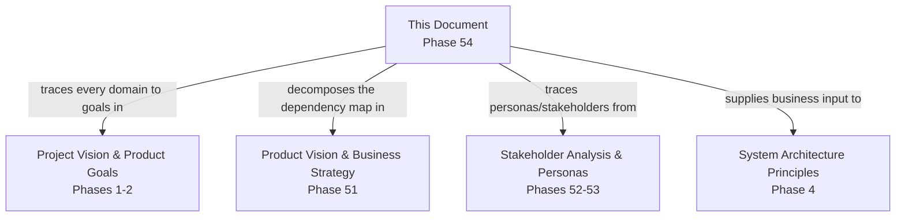

---

# Closing Statement

> **Callout — Closing Statement**
> A district super app spanning identity, government services, agriculture, healthcare, education, jobs, commerce, logistics, property, payments, and community cannot be built, owned, or governed as one undifferentiated thing — it must be understood as a coherent set of business domains, each with its own purpose, its own owner, its own vocabulary, and its own reason to change. Stable, well-governed business domains are what let Arwal's architecture evolve, its organization scale, and its product deepen across roughly 420 handbook phases without collapsing into ambiguity — because every future engineer, architect, and product decision-maker can ask "which domain owns this?" and get exactly one confident answer. Where a future phase must deviate from a domain boundary, ownership, or classification stated here, that deviation is made explicitly — through the Domain Change Impact Assessment and the Cross-Domain Governance process above — never silently, and never by default.

This document, `ai-docs/53-business-domain-model.md`, is Phase 54 of approximately 420. Every future service boundary, module, capability, and cross-domain integration is expected to trace back to a domain defined here, or to justify its deviation in writing.

**End of Phase 54 — `ai-docs/53-business-domain-model.md`**