# Product Module Catalog

**Document:** `ai-docs/54-product-module-catalog.md`
**Project:** Arwal — The District Super App
**Stage:** 2 — Product & Business Strategy
**Phase:** 55 — Product Module Catalog
**Status:** Approved for Product & Engineering Reference
**Audience:** CPO, Chief Enterprise Architect, VP Product Management, UX Strategy Lead, Domain Architects, Platform Architects, Product Managers, Government Digital Transformation Partners, Engineering Directors

> **Callout — Purpose of This Document**
> `ai-docs/00-project-vision.md` established why Arwal exists. `ai-docs/01-product-goals.md` translated that into measurable goals. `ai-docs/50-product-vision-business-strategy.md` established what Arwal is. `ai-docs/51-stakeholder-analysis.md` established who Arwal serves. `ai-docs/52-user-personas-user-segmentation.md` made those stakeholders specific, evidence-grounded people. `ai-docs/53-business-domain-model.md` established the discrete business domains Arwal is made of, and who owns each one. None of those documents answers the question every future UX, product-planning, roadmap, and (eventually) technical-implementation decision now depends on: **what are the concrete, user-visible product capabilities — the modules — that citizens, merchants, providers, and government officers will actually open, tap, and depend on, and how do they map back to the business domains that own them?** This document is that answer — the authoritative Product Module Catalog every future feature, screen, and roadmap item traces back to.

---

# Purpose of this Document

### Why Product Modules Exist

`ai-docs/53-business-domain-model.md` answers "what is Healthcare, as a business concern, responsible for, and who owns it?" It deliberately does not answer "what does a citizen actually open on their phone to book a doctor?" That second question is what a **Product Module** answers. A business domain is an organizational and business-ownership concept — stable, coarse-grained, rarely changing. A product module is a **user-visible product capability** — the granularity at which a Product Manager plans a roadmap, a UX Strategist designs an information architecture, and a citizen forms a mental model of "the thing I use to do X." Domains and modules are related but not identical: a single domain (Healthcare) may be expressed to citizens as several distinct modules (Doctor Directory, Appointment Booking, Hospitals, Pharmacies), each with its own adoption curve, its own KPI, and its own release cadence, while still being owned, governed, and data-sourced by the same domain underneath.

### The Relationship Chain

This document sits at a specific, deliberate point in a chain that must never be reordered or collapsed:

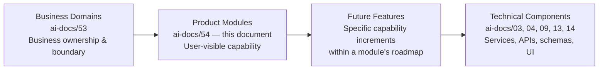

| Layer | Question It Answers | Granularity | Changes How Often |
|---|---|---|---|
| **Business Domain** (`ai-docs/53`) | Who owns this business concern, and what is its boundary? | Coarse — ~20 domains | Rarely — years |
| **Product Module** (this document) | What does a citizen/merchant/officer actually use? | Medium — ~50 modules | Occasionally — a module matures, splits, or merges over quarters |
| **Feature** (future roadmap items, not catalogued here) | What specific capability ships this quarter? | Fine — hundreds per module over time | Continuously |
| **Technical Component** (`ai-docs/03`, `04`, `09`, `13`, `14`) | What service, API, schema, or UI component implements this? | Finest | Continuously, per the Modular Monolith and DDD discipline already established |

A module is never redefined here as a technical artifact — it has no API shape, no database schema, no UI wireframe. Those remain the exclusive territory of the architecture, API design, and database design documents already established. This document's exclusive territory is **module identity, purpose, business value, capability, and traceability** — the input those technical documents and every future UX and roadmap document consume.

### Why This Matters at Arwal's Scale

Without an explicit Product Module Catalog:

1. **Product Managers re-derive scope independently.** Two PMs working adjacent to each other in Healthcare and Civic Services would otherwise draw module boundaries differently, producing inconsistent navigation, inconsistent naming, and duplicated capability.
2. **Roadmaps cannot be compared across verticals.** Without a shared module registry, "how mature is Agriculture compared to Jobs?" has no answerable basis.
3. **UX consistency collapses.** A citizen who understands "Orders" in Marketplace should recognize the same interaction pattern in Food Delivery — this only holds if both are modeled, named, and governed as siblings in one catalog.
4. **Expansion inherits ambiguity, not clarity.** A second district (per `ai-docs/50-product-vision-business-strategy.md`'s Strategic Expansion Principles) must replicate a *defined module set*, never reverse-engineer one from whatever a founding team happened to ship.

### Scope Boundary

This document does not redesign business domains (`ai-docs/53-business-domain-model.md`, unchanged), does not describe implementation (`ai-docs/03-system-architecture-principles.md`), does not define APIs (`ai-docs/13-api-design-guidelines.md`), does not define database schemas (`ai-docs/14-database-design-guidelines.md`), and does not define UI wireframes (a future UX-phase document's territory). Every one of those remains fully authoritative for its own layer. This document's territory is strictly: module identity, purpose, ownership, capability, dependency, and traceability back to Domains, Personas, and Stakeholders.

---

# Module Design Philosophy

Every principle below exists because a module boundary drawn carelessly does not fail abstractly — it produces exactly the navigation confusion, duplicated screens, and unowned features this document exists to prevent.

### Citizen-First

**Why it exists:** A module exists because a citizen (or a merchant, provider, or officer) needs to accomplish something — never because it is a convenient internal grouping of code or data. Every module in this catalog states its Business Value in terms a citizen would recognize, never in terms of a database table or a service boundary.

### Modular Design

**Why it exists:** Each module must be independently understandable, buildable, and improvable, mirroring the identical Modular Monolith and Bounded Context discipline already established in `ai-docs/03-system-architecture-principles.md` and `ai-docs/53-business-domain-model.md`, applied here one layer up at the product-experience level. A modular product is what makes a modular architecture possible — the two must mirror each other, per Conway's Law already invoked in `ai-docs/47-engineering-organizational-scaling-standards.md`.

### Single Responsibility

**Why it exists:** A module that tries to be two things at once (e.g., "Orders" trying to also be "Delivery Tracking") becomes impossible to reason about, roadmap, or hand off cleanly. Single Responsibility at the module level is the same discipline `ai-docs/02-engineering-principles.md`'s SRP applies to a class, elevated to the product-capability level.

### Reusability

**Why it exists:** A capability genuinely needed by more than one vertical (Search, Notifications, Payments, AI Assistant) is built once as a Shared Module and consumed everywhere — never rebuilt per vertical. This is DRY (`ai-docs/02-engineering-principles.md`) applied to product capability, not just code.

### Scalability

**Why it exists:** A module must be designed assuming Arwal's eventual multi-district, multi-state, million-plus-user scale from the outset (per `ai-docs/00-project-vision.md`'s Scalability Vision) — a module scoped only for the founding district's current volume is a module that will need a disruptive redesign, not a graceful evolution, the moment expansion begins.

### Independent Evolution

**Why it exists:** A module must be able to mature, add capability, or even be retired without requiring simultaneous, coordinated change across every other module. This is what makes Arwal's roadmap of ~420 handbook phases tractable — each phase can deepen one module without destabilizing the rest.

### Discoverability

**Why it exists:** A citizen must be able to find a module through an obvious, predictable path — never through hidden menus or inconsistent entry points. A module a citizen cannot find is, functionally, a module that does not exist, mirroring the identical Documentation Searchability reasoning already established in `ai-docs/24-documentation-standards.md`, applied here to product surface area.

### Accessibility

**Why it exists:** Every module must be usable by the full range of Arwal's population — first-generation smartphone users, low-literacy citizens, elderly citizens using assisted mode, and citizens using a screen reader — per the non-negotiable floor already established in `ai-docs/12-accessibility-standards.md`. A module that is accessible only to a digitally fluent minority has failed its civic mandate regardless of its commercial performance.

### Consistency

**Why it exists:** The same category of interaction (an order, a booking, a listing, a dispute) should look and behave the same way across every module that has one, mirroring the identical Consistency Over Local Preference principle already established in `ai-docs/04-folder-guidelines.md` and `ai-docs/13-api-design-guidelines.md`, applied here to the citizen-facing surface.

### Business Alignment

**Why it exists:** Every module must trace to a Strategic Objective (`ai-docs/50-product-vision-business-strategy.md`), a Business Domain (`ai-docs/53-business-domain-model.md`), and at least one Persona (`ai-docs/52-user-personas-user-segmentation.md`) — a module that cannot be traced is a module built on assumption, not evidence, per the identical Traceability discipline already established throughout Stage 2.

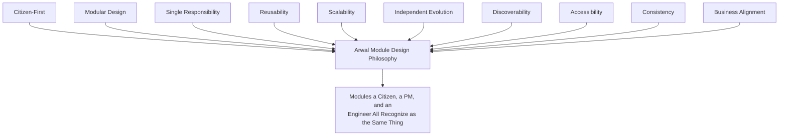

> **Callout — The One-Sentence Module Design Philosophy**
> *"A module is what a citizen calls the thing they opened to get something done — if the engineering team and the citizen would draw the boundary differently, the module is wrong, not the citizen."*

---

# Product Module Hierarchy

Every module in the Master Module Registry is classified into exactly one of six tiers, mirroring — but never duplicating — the Business Domain Hierarchy tiers already established in `ai-docs/53-business-domain-model.md`.

| Tier | Definition | Characteristic |
|---|---|---|
| **Core Modules** | Modules delivering Arwal's primary, differentiated, citizen-facing value — the reason a citizen opens the app for a specific vertical need. | High product investment; a dedicated roadmap; a named Product Owner. |
| **Supporting Modules** | Modules necessary for Core Modules to function well but not themselves the primary reason a citizen opens the app. | Important, lower differentiation ceiling than Core. |
| **Shared Modules** | Modules providing a capability consumed identically across many Core and Supporting Modules. | Platform-governed; never a bespoke per-vertical variant. |
| **Administrative Modules** | Modules serving internal operators, government officers, or platform administrators rather than citizens directly. | Governed with elevated security/audit rigor per `ai-docs/10-security-standards.md`. |
| **Platform Modules** | Modules providing foundational, invisible-to-the-citizen product infrastructure (Identity, Settings) that every other module depends on. | Never independently marketed; always present. |
| **Future Modules** | Modules anticipated by Arwal's roadmap but not yet active. | Tracked for readiness, not yet resourced. |

```mermaid
graph TD
    Root[Arwal Product Module Hierarchy] --> Core[Core Modules]
    Root --> Supporting[Supporting Modules]
    Root --> Shared[Shared Modules]
    Root --> Admin[Administrative Modules]
    Root --> Platform[Platform Modules]
    Root --> Future[Future Modules]

    Core --> C1[Government Services Cluster]
    Core --> C2[Agriculture Cluster]
    Core --> C3[Healthcare Cluster]
    Core --> C4[Education Cluster]
    Core --> C5[Jobs Cluster]
    Core --> C6[Marketplace Cluster]
    Core --> C7[Food Delivery Cluster]
    Core --> C8[Grocery Cluster]
    Core --> C9[Property Cluster]
    Core --> C10[Community Cluster]

    Supporting --> S1[Logistics Cluster]
    Supporting --> S2[Payments Cluster]
    Supporting --> S3[Trust & Safety Cluster]

    Shared --> SH1[Search]
    Shared --> SH2[Notifications]
    Shared --> SH3[AI Assistant]

    Admin --> A1[Administration Cluster]
    Admin --> A2[Analytics Cluster]

    Platform --> P1[Identity]
    Platform --> P2[Citizen Profile]
    Platform --> P3[Settings]
    Platform --> P4[Help Center]

    Future --> F1[Fintech/Micro-Lending Modules]
    Future --> F2[B2B/Wholesale Depth Modules]
    Future --> F3[Multi-District Configuration Modules]
```

---

# Master Module Registry

Every module carries a permanent, sequential, never-reused Module ID, mirroring the identical Registry discipline already established for Domains (`ai-docs/53`), Personas (`ai-docs/52`), and Stakeholders (`ai-docs/51`).

| Module ID | Module Name | Classification | Lifecycle Status | Primary Domain (Ph.54) | Business Owner | Product Owner |
|---|---|---|---|---|---|---|
| MOD-001 | Identity & Verification | Platform | Active | Identity (DOM-001) | Head of Platform Engineering | Platform PM |
| MOD-002 | Citizen Profile | Platform | Active | Citizen (DOM-002) | CPO (delegate: Head of Citizen Experience) | Citizen Experience PM |
| MOD-003 | Delegated & Assisted Access | Platform | Active | Identity (DOM-001) | Head of Accessibility & Inclusion | Accessibility PM |
| MOD-004 | Certificates | Core | Active | Government Services (DOM-003) | Head of Government Partnerships | Civic Services PM |
| MOD-005 | Applications | Core | Active | Government Services (DOM-003) | Head of Government Partnerships | Civic Services PM |
| MOD-006 | Grievances | Core | Active | Government Services (DOM-003) | Head of Government Partnerships | Civic Services PM |
| MOD-007 | Officer Case Management | Administrative | Active | Government Services (DOM-003) | Head of Government Partnerships | Civic Services PM |
| MOD-008 | Mandi Prices | Core | Active | Agriculture (DOM-004) | Head of Agriculture Vertical | Agriculture PM |
| MOD-009 | Weather Advisory | Core | Active | Agriculture (DOM-004) | Head of Agriculture Vertical | Agriculture PM |
| MOD-010 | Government Schemes Discovery | Core | Active | Agriculture (DOM-004) / Government Services (DOM-003) | Head of Agriculture Vertical | Agriculture PM |
| MOD-011 | Direct-to-Buyer Produce Marketplace | Core | Maturing | Agriculture (DOM-004) | Head of Agriculture Vertical | Agriculture PM |
| MOD-012 | Doctor Directory | Core | Active | Healthcare (DOM-005) | Head of Healthcare Vertical | Healthcare PM |
| MOD-013 | Appointment Booking | Core | Active | Healthcare (DOM-005) | Head of Healthcare Vertical | Healthcare PM |
| MOD-014 | Hospitals | Core | Active | Healthcare (DOM-005) | Head of Healthcare Vertical | Healthcare PM |
| MOD-015 | Pharmacies | Core | Active | Healthcare (DOM-005) | Head of Healthcare Vertical | Healthcare PM |
| MOD-016 | Tutors | Core | Active | Education (DOM-006) | Head of Education Vertical | Education PM |
| MOD-017 | Coaching Centers | Core | Active | Education (DOM-006) | Head of Education Vertical | Education PM |
| MOD-018 | Scholarships & Opportunities | Core | Maturing | Education (DOM-006) | Head of Education Vertical | Education PM |
| MOD-019 | Job Search | Core | Active | Jobs (DOM-007) | Head of Jobs Vertical | Jobs PM |
| MOD-020 | Employer Portal | Core | Active | Jobs (DOM-007) | Head of Jobs Vertical | Jobs PM |
| MOD-021 | Merchant Store | Core | Active | Commerce Marketplace (DOM-008) | Head of Merchant Success | Marketplace PM |
| MOD-022 | Cart | Core | Active | Commerce Marketplace (DOM-008) | Head of Merchant Success | Marketplace PM |
| MOD-023 | Orders (Marketplace) | Core | Active | Commerce Marketplace (DOM-008) | Head of Merchant Success | Marketplace PM |
| MOD-024 | Restaurants & Menu | Core | Active | Food Delivery (DOM-009) | Head of Food & Grocery | Food Delivery PM |
| MOD-025 | Orders (Food) | Core | Active | Food Delivery (DOM-009) | Head of Food & Grocery | Food Delivery PM |
| MOD-026 | Grocery Store Catalog | Core | Active | Grocery (DOM-010) | Head of Food & Grocery | Grocery PM |
| MOD-027 | Orders (Grocery) | Core | Active | Grocery (DOM-010) | Head of Food & Grocery | Grocery PM |
| MOD-028 | Delivery Tracking | Supporting | Active | Logistics (DOM-011) | Head of Logistics | Logistics PM |
| MOD-029 | Delivery Partner Earnings | Supporting | Active | Logistics (DOM-011) | Head of Logistics | Logistics PM |
| MOD-030 | Property — Buy | Core | Active | Property (DOM-012) | Head of Classifieds/Property | Property PM |
| MOD-031 | Property — Rent | Core | Active | Property (DOM-012) | Head of Classifieds/Property | Property PM |
| MOD-032 | Wallet | Supporting | Active | Payments (DOM-013) | Head of Payments | Payments PM |
| MOD-033 | Transactions & Statements | Supporting | Active | Payments (DOM-013) | Head of Payments | Payments PM |
| MOD-034 | Payouts & Refunds | Supporting | Active | Payments (DOM-013) | Head of Payments | Payments PM |
| MOD-035 | NGO & SHG Groups | Core | Maturing | Community (DOM-014) | Head of Community Engagement | Community PM |
| MOD-036 | Community Engagement Feed | Core | Nascent | Community (DOM-014) | Head of Community Engagement | Community PM |
| MOD-037 | Search | Shared | Active | Search (DOM-015) | Head of Platform Engineering | Platform PM |
| MOD-038 | Notifications | Shared | Active | Notifications (DOM-016) | Head of Platform Engineering | Platform PM |
| MOD-039 | AI Assistant | Shared | Maturing | AI Assistant (DOM-017) | Head of AI Platform | AI Platform PM |
| MOD-040 | Analytics & Reporting | Administrative | Active | Analytics (DOM-018) | Head of Data/Analytics | Analytics PM |
| MOD-041 | Merchant/Provider Verification | Administrative | Active | Administration (DOM-019) | Head of Operations | Operations PM |
| MOD-042 | Policy & Fraud Enforcement Console | Administrative | Active | Administration (DOM-019) | Head of Operations | Operations PM |
| MOD-043 | Trust & Safety — Disputes | Supporting | Active | Trust & Safety (DOM-020) | Head of Trust & Safety | Trust & Safety PM |
| MOD-044 | Trust & Safety — Reviews & Ratings | Supporting | Active | Trust & Safety (DOM-020) | Head of Trust & Safety | Trust & Safety PM |
| MOD-045 | Settings | Platform | Active | Citizen (DOM-002) | CPO (delegate: Head of Citizen Experience) | Citizen Experience PM |
| MOD-046 | Help Center & Support | Platform | Active | Citizen (DOM-002) | Head of Customer Success | Support PM |
| MOD-047 | Government Officer Dashboard | Administrative | Active | Government Services (DOM-003) | Head of Government Partnerships | Civic Services PM |
| MOD-048 | B2B/Wholesale Marketplace | Future | Anticipated | Commerce Marketplace (DOM-008) | Head of Merchant Success | Marketplace PM (future) |
| MOD-049 | Micro-Lending & Fintech | Future | Anticipated | Payments (DOM-013) | CFO / Head of Payments | Payments PM (future) |
| MOD-050 | Multi-District Configuration Console | Future | Anticipated | (cross-cutting, future) | CTO / Head of Expansion | Platform PM (future) |

> **Callout — Lifecycle Status Values**
> `Anticipated` (named, not yet resourced) → `Nascent` (in active development, not yet released) → `Active` (released, in daily use) → `Maturing` (capability depth actively growing) → `Stable` (mature, low change rate) → `Deprecated` (marked for retirement) → `Retired` (archived, ID never reused). Status is reviewed at the Quarterly Module Review (see Module Governance).

---

# Product Module Catalog

Each module below follows an identical structure for comparability. Field values reference, and never contradict, the corresponding Domain (`ai-docs/53`), Persona (`ai-docs/52`), and Stakeholder (`ai-docs/51`) entries.

## MOD-001 — Identity & Verification

| Field | Detail |
|---|---|
| **Purpose** | Let a citizen, merchant, provider, delivery partner, or officer establish one verified digital identity, usable across every module. |
| **Business Value** | Removes the "reset your profile per app" friction that fragments a citizen's digital life, directly serving the One Identity, Infinite Utility pillar in `ai-docs/50-product-vision-business-strategy.md`. |
| **Primary Domain** | Identity (DOM-001) |
| **Secondary Domains** | Citizen (DOM-002) |
| **Responsibilities** | Identity creation, OTP/KYC verification, credential lifecycle, role assignment. |
| **Capabilities** | Sign-up/login; OTP verification; role selection (citizen/merchant/provider/officer); session management. |
| **Major User Actions** | Register; verify phone/ID; log in; manage active sessions; log out. |
| **Inputs** | Phone number; government ID document; biometric/OTP confirmation. |
| **Outputs** | A verified Identity record; an issued session/token. |
| **Business Events** | `IdentityVerified`, `RoleAssigned`, `SessionRevoked`. |
| **Dependencies** | Upstream: none (foundational). Downstream: every other module. |
| **AI Opportunities** | Document-fraud detection during KYC (human-reviewed, never auto-rejecting). |
| **Accessibility Considerations** | OTP-first for low-literacy citizens per PER-021 Lakshmi; large-target UI per PER-019 Devendra. |
| **Security Considerations** | RS256 JWTs, short-lived access tokens, rotating refresh tokens per `ai-docs/10-security-standards.md`. |
| **Privacy Considerations** | Government ID data is Restricted-tier per `ai-docs/10-security-standards.md`'s Data Classification; never logged in plaintext. |
| **KPIs** | Verification completion rate; identity-fraud incident rate. |
| **Future Evolution** | State-level SSO integration (MOD-050 readiness). |

## MOD-002 — Citizen Profile

| Field | Detail |
|---|---|
| **Purpose** | Give every citizen one unified profile, preference set, and cross-vertical reputation view. |
| **Business Value** | The concrete product expression of Arwal's structural trust-compounding advantage. |
| **Primary Domain** | Citizen (DOM-002) |
| **Secondary Domains** | Identity (DOM-001), Trust & Safety (DOM-020) |
| **Responsibilities** | Profile display/edit; consent and preference management; cross-vertical reputation aggregation display. |
| **Capabilities** | Edit profile; manage data-sharing consent per module; view aggregated reputation/rating history. |
| **Major User Actions** | Update profile; adjust notification/data preferences; view "my activity across Arwal." |
| **Inputs** | Verified identity from MOD-001; activity signals from every module. |
| **Outputs** | Displayed profile; consent state. |
| **Business Events** | `ProfileUpdated`, `ConsentChanged`. |
| **Dependencies** | Upstream: Identity (MOD-001). Downstream: every citizen-facing module. |
| **AI Opportunities** | Personalized "recommended next module" surfacing (human-explainable). |
| **Accessibility Considerations** | Simplified-language mode toggle; assisted-mode entry point for PER-019/PER-021. |
| **Security Considerations** | Role-scoped data access; profile edits require re-authentication for sensitive fields. |
| **Privacy Considerations** | Consent-first data sharing per module, per `ai-docs/00-project-vision.md`'s Data Minimization & Consent principle. |
| **KPIs** | Cross-Vertical Adoption Depth; profile-completeness rate. |
| **Future Evolution** | Citizen-controlled data export. |

## MOD-003 — Delegated & Assisted Access

| Field | Detail |
|---|---|
| **Purpose** | Let a family member or field agent safely act on behalf of an elderly, low-literacy, or first-time citizen. |
| **Business Value** | Directly serves PER-019 Devendra and PER-021 Lakshmi's core Jobs-To-Be-Done; a civic-dignity requirement, not an optional feature. |
| **Primary Domain** | Identity (DOM-001) |
| **Secondary Domains** | Citizen (DOM-002) |
| **Responsibilities** | Delegation grant/revoke; assisted-session audit logging. |
| **Capabilities** | Grant a delegate; time-bound or scoped delegation; revoke access; view an audit trail of delegated actions. |
| **Major User Actions** | Add a delegate; approve/deny a delegated action; review delegated-action history. |
| **Inputs** | Delegator's authorization; delegate's identity. |
| **Outputs** | An active Delegated-Access Grant; an audit log entry per delegated action. |
| **Business Events** | `DelegatedAccessGranted`, `DelegatedAccessRevoked`, `DelegatedActionPerformed`. |
| **Dependencies** | Upstream: Identity (MOD-001). Downstream: Government Services, Healthcare, Commerce modules where delegated actions occur. |
| **AI Opportunities** | Voice-guided delegated-flow completion in local dialect. |
| **Accessibility Considerations** | The single most accessibility-critical module in the catalog — designed first for PER-019 Devendra. |
| **Security Considerations** | Every delegated action is transparently logged and reversible; delegation never bypasses authentication entirely. |
| **Privacy Considerations** | The delegator retains full visibility and revocation power at all times. |
| **KPIs** | Delegated-flow completion rate; delegate-abuse incident rate (target: zero). |
| **Future Evolution** | Multi-delegate household patterns. |

## MOD-004 — Certificates

| Field | Detail |
|---|---|
| **Purpose** | Let a citizen apply for, track, and receive a government-issued certificate without a physical office visit. |
| **Business Value** | Directly serves the Government Efficiency Strategic Objective in `ai-docs/50-product-vision-business-strategy.md`. |
| **Primary Domain** | Government Services (DOM-003) |
| **Secondary Domains** | Citizen (DOM-002), Payments (DOM-013, fee facilitation) |
| **Responsibilities** | Certificate-type catalog; application form rendering per department configuration; status display. |
| **Capabilities** | Browse certificate types; complete a department-defined form; upload supporting documents; track status; download an issued certificate. |
| **Major User Actions** | Apply for a certificate; upload a document; check status; download the result. |
| **Inputs** | Citizen-entered form data; uploaded documents. |
| **Outputs** | A submitted Application (MOD-005); an issued certificate artifact. |
| **Business Events** | `ApplicationSubmitted` (shared with MOD-005), `CertificateIssued`. |
| **Dependencies** | Upstream: Identity, Citizen Profile. Downstream: Applications (MOD-005), Notifications (MOD-038). |
| **AI Opportunities** | Pre-filling a form from the citizen's verified profile data; eligibility pre-screening. |
| **Accessibility Considerations** | Voice-guided form completion; assisted-mode entry via MOD-003 for PER-019. |
| **Security Considerations** | Document upload validated per `ai-docs/10-security-standards.md`'s File Upload Validation standard. |
| **Privacy Considerations** | Document data is Restricted-tier; retained per government audit-retention requirements, never longer. |
| **KPIs** | Application-to-issuance time; % completed without a physical visit. |
| **Future Evolution** | Auto-renewal reminders for time-bound certificates. |

## MOD-005 — Applications

| Field | Detail |
|---|---|
| **Purpose** | Provide the shared application-lifecycle experience underlying every government-service request (certificates, scheme enrollment, licenses). |
| **Business Value** | A single, consistent "track my application" experience across every civic service, avoiding a fragmented per-service tracker. |
| **Primary Domain** | Government Services (DOM-003) |
| **Secondary Domains** | Citizen (DOM-002) |
| **Responsibilities** | Application status lifecycle; department routing; citizen-facing status history. |
| **Capabilities** | View all applications in one list; filter by status/department; view a single application's full timeline. |
| **Major User Actions** | View application list; view application detail/timeline; respond to an officer's information request. |
| **Inputs** | Application submissions from MOD-004 and other civic sub-modules. |
| **Outputs** | Status updates; a consolidated application history. |
| **Business Events** | `ApplicationSubmitted`, `ApplicationStatusChanged`, `ApplicationApproved`, `ApplicationRejected`. |
| **Dependencies** | Upstream: Certificates (MOD-004), Officer Case Management (MOD-007). Downstream: Notifications (MOD-038), Analytics (MOD-040). |
| **AI Opportunities** | Predictive "likely processing time" estimate based on department history. |
| **Accessibility Considerations** | Status conveyed via icon + text + color (never color alone), per `ai-docs/12-accessibility-standards.md`. |
| **Security Considerations** | Role/ownership check ensures a citizen only sees their own applications. |
| **Privacy Considerations** | Application content shared only with the processing department, never cross-department without consent. |
| **KPIs** | Government Efficiency KPI — average completion-time reduction. |
| **Future Evolution** | Multi-department joint-application support. |

## MOD-006 — Grievances

| Field | Detail |
|---|---|
| **Purpose** | Let a citizen raise, track, and get resolution on a civic-service complaint. |
| **Business Value** | Closes the "no dead ends" product principle from `ai-docs/00-project-vision.md` for the civic vertical specifically. |
| **Primary Domain** | Government Services (DOM-003) |
| **Secondary Domains** | Trust & Safety (DOM-020) |
| **Responsibilities** | Grievance intake; routing to the correct department; resolution tracking. |
| **Capabilities** | File a grievance; attach evidence; track resolution status; escalate an unresolved grievance. |
| **Major User Actions** | Raise a grievance; check status; escalate. |
| **Inputs** | Citizen-submitted complaint text/evidence. |
| **Outputs** | A tracked grievance record; a resolution outcome. |
| **Business Events** | `GrievanceRaised`, `GrievanceResolved`, `GrievanceEscalated`. |
| **Dependencies** | Upstream: Applications (MOD-005) where grievance relates to a specific application. Downstream: Officer Case Management (MOD-007), Notifications (MOD-038). |
| **AI Opportunities** | Auto-routing a grievance to the correct department from its text content (human-confirmed). |
| **Accessibility Considerations** | Voice-input grievance filing for low-literacy citizens. |
| **Security Considerations** | Grievance evidence stored per the same Restricted-tier standard as Applications. |
| **Privacy Considerations** | Grievance content visible only to the citizen and the assigned officer. |
| **KPIs** | Grievance resolution time; escalation rate. |
| **Future Evolution** | Public, anonymized grievance-pattern dashboards for transparency reporting. |

## MOD-007 — Officer Case Management

| Field | Detail |
|---|---|
| **Purpose** | Give a government officer a structured queue to process applications and grievances assigned to their department. |
| **Business Value** | Directly serves PER-017 Priya's Jobs-To-Be-Done — reduce backlog, maintain auditability. |
| **Primary Domain** | Government Services (DOM-003) |
| **Secondary Domains** | Administration (DOM-019) |
| **Responsibilities** | Queue management; approval/rejection workflow; audit-trail generation. |
| **Capabilities** | View assigned queue; approve/reject with a documented reason; reassign; view department-level metrics. |
| **Major User Actions** | Process a queue item; approve/reject; add a note; escalate to a supervisor. |
| **Inputs** | Applications (MOD-005) and Grievances (MOD-006) routed to the officer's department. |
| **Outputs** | Approval/rejection decisions; immutable audit records. |
| **Business Events** | `ApplicationApproved`, `ApplicationRejected`, `PolicyActionTaken`. |
| **Dependencies** | Upstream: Applications (MOD-005), Grievances (MOD-006). Downstream: Analytics (MOD-040), Notifications (MOD-038). |
| **AI Opportunities** | Application-triage/routing suggestion — never autonomous approval, per the AI Principle in `ai-docs/00-project-vision.md`. |
| **Accessibility Considerations** | Standard WCAG 2.2 AA floor for the admin dashboard. |
| **Security Considerations** | Role-scoped to the officer's own department only; every action immutably audit-logged. |
| **Privacy Considerations** | An officer sees only the data genuinely required for their department's function, per Data Minimization. |
| **KPIs** | Government Efficiency KPI; audit-log completeness. |
| **Future Evolution** | Cross-department workflow automation. |

## MOD-008 — Mandi Prices

| Field | Detail |
|---|---|
| **Purpose** | Give a farmer real-time, trustworthy market pricing for their crop. |
| **Business Value** | Directly serves the Farmer Empowerment Strategic Objective; PER-002 Meena's core Jobs-To-Be-Done. |
| **Primary Domain** | Agriculture (DOM-004) |
| **Secondary Domains** | Citizen (DOM-002) |
| **Responsibilities** | Price feed aggregation and display; voice-based price query. |
| **Capabilities** | Check today's price by crop/mandi; receive a price-change alert; hear a price via voice. |
| **Major User Actions** | Query a price (voice or text); subscribe to a crop's price alerts. |
| **Inputs** | External mandi price feeds. |
| **Outputs** | A displayed or spoken current price; a price-change notification. |
| **Business Events** | `PriceUpdated`. |
| **Dependencies** | Upstream: external mandi data sources. Downstream: Notifications (MOD-038), AI Assistant (MOD-039). |
| **AI Opportunities** | Voice-based natural-language price query in regional dialect. |
| **Accessibility Considerations** | Voice-first by design, per PER-002's Accessibility Requirements; offline price caching for intermittent connectivity. |
| **Security Considerations** | Read-only, low-sensitivity data; minimal attack surface. |
| **Privacy Considerations** | Public-tier data per `ai-docs/10-security-standards.md`'s classification table; no citizen-identifying data required to query. |
| **KPIs** | Farmer Empowerment KPI — monthly active use. |
| **Future Evolution** | Predictive price-trend AI advisory. |

## MOD-009 — Weather Advisory

| Field | Detail |
|---|---|
| **Purpose** | Deliver timely, localized weather alerts to help a farmer protect a harvest. |
| **Business Value** | Directly serves PER-002 Meena's secondary goal of protecting the harvest from weather loss. |
| **Primary Domain** | Agriculture (DOM-004) |
| **Secondary Domains** | Notifications (DOM-016) |
| **Responsibilities** | Weather data aggregation; alert thresholding and delivery. |
| **Capabilities** | View current/forecast weather for the citizen's village/ward; receive a severe-weather alert. |
| **Major User Actions** | Check weather; receive and acknowledge an alert. |
| **Inputs** | External weather data feeds; citizen's registered location. |
| **Outputs** | A displayed forecast; a delivered alert. |
| **Business Events** | `WeatherAlertIssued`. |
| **Dependencies** | Upstream: external weather sources. Downstream: Notifications (MOD-038). |
| **AI Opportunities** | Localized, crop-specific advisory generation from raw forecast data. |
| **Accessibility Considerations** | Voice-read alerts for low-literacy citizens. |
| **Security Considerations** | Location data treated as Confidential-tier. |
| **Privacy Considerations** | Location used only for advisory relevance, never shared outside the Agriculture domain without consent. |
| **KPIs** | Alert-delivery success rate; Farmer Empowerment KPI contribution. |
| **Future Evolution** | Hyperlocal, field-level microclimate advisory. |

## MOD-010 — Government Schemes Discovery

| Field | Detail |
|---|---|
| **Purpose** | Help a farmer (and eventually any citizen) discover government subsidy/scheme eligibility relevant to them. |
| **Business Value** | Closes the "scheme information rarely reaches her directly" pain point named for PER-002 Meena in `ai-docs/51-stakeholder-analysis.md`. |
| **Primary Domain** | Agriculture (DOM-004) |
| **Secondary Domains** | Government Services (DOM-003) |
| **Responsibilities** | Scheme catalog maintenance; eligibility-matching logic display. |
| **Capabilities** | Browse schemes; check personal eligibility; initiate an application (handed to MOD-005). |
| **Major User Actions** | Search schemes; check eligibility; start an application. |
| **Inputs** | Scheme catalog data; citizen profile attributes (with consent). |
| **Outputs** | A list of matched schemes; an eligibility result. |
| **Business Events** | `SchemeEligibilityMatched`. |
| **Dependencies** | Upstream: Government Services (DOM-003) scheme catalog. Downstream: Applications (MOD-005). |
| **AI Opportunities** | Eligibility pre-screening via the AI Assistant (MOD-039) in local dialect. |
| **Accessibility Considerations** | Simplified-language mode; voice-first query. |
| **Security Considerations** | Eligibility computed from consented profile attributes only. |
| **Privacy Considerations** | No profile attribute used for eligibility scoring without explicit, per-scheme consent. |
| **KPIs** | Scheme-eligibility-to-application conversion rate. |
| **Future Evolution** | Proactive, notification-driven scheme matching as new schemes are added. |

## MOD-011 — Direct-to-Buyer Produce Marketplace

| Field | Detail |
|---|---|
| **Purpose** | Let a farmer list produce directly to buyers, reducing middleman dependency. |
| **Business Value** | The commercial deepening of the Farmer Empowerment objective, per `ai-docs/50`'s Product Evolution Roadmap Year 3 focus. |
| **Primary Domain** | Agriculture (DOM-004) |
| **Secondary Domains** | Commerce Marketplace (DOM-008), Logistics (DOM-011), Payments (DOM-013) |
| **Responsibilities** | Produce listing management; buyer-farmer connection facilitation. |
| **Capabilities** | List produce for sale; browse/negotiate as a buyer; confirm a sale. |
| **Major User Actions** | Create a listing; respond to a buyer inquiry; confirm sale terms. |
| **Inputs** | Farmer-entered produce details (crop, quantity, price expectation). |
| **Outputs** | A published listing; a confirmed sale record. |
| **Business Events** | `ProduceListed`, `ProduceSold`. |
| **Dependencies** | Upstream: Mandi Prices (MOD-008, for price-reference context). Downstream: Payments (MOD-032), Delivery Tracking (MOD-028). |
| **AI Opportunities** | Fair-price suggestion drawn from current mandi data. |
| **Accessibility Considerations** | Voice-assisted listing creation for low-literacy farmers. |
| **Security Considerations** | Buyer identity verified before a farmer's contact details are exchanged. |
| **Privacy Considerations** | Farmer location shared with a matched buyer only after mutual confirmation. |
| **KPIs** | Listing-to-sale conversion rate. |
| **Future Evolution** | Cooperative-level bulk-listing aggregation. |

## MOD-012 — Doctor Directory

| Field | Detail |
|---|---|
| **Purpose** | Let a citizen discover verified local doctors by specialty, location, and rating. |
| **Business Value** | Directly serves the Healthcare Access Strategic Objective. |
| **Primary Domain** | Healthcare (DOM-005) |
| **Secondary Domains** | Trust & Safety (DOM-020), Search (DOM-015) |
| **Responsibilities** | Verified-provider profile display; specialty/location search and filtering. |
| **Capabilities** | Search doctors by specialty/location; view a verified profile and ratings; save a favorite. |
| **Major User Actions** | Search; filter; view profile; initiate a booking (handed to MOD-013). |
| **Inputs** | Doctor-submitted and verified profile data. |
| **Outputs** | A ranked, filterable list of doctors. |
| **Business Events** | `ProviderVerified` (consumed from DOM-005). |
| **Dependencies** | Upstream: Search (MOD-037), Trust & Safety (MOD-044 for ratings). Downstream: Appointment Booking (MOD-013). |
| **AI Opportunities** | Personalized ranking by proximity, specialty match, and past-citizen satisfaction. |
| **Accessibility Considerations** | Screen-reader-correct profile cards per PER-020 Arvind. |
| **Security Considerations** | Provider verification status displayed prominently and cannot be spoofed by an unverified provider. |
| **Privacy Considerations** | Only provider-disclosed public profile information is shown. |
| **KPIs** | Search-to-booking conversion rate. |
| **Future Evolution** | Telehealth/remote-consultation directory extension. |

## MOD-013 — Appointment Booking

| Field | Detail |
|---|---|
| **Purpose** | Let a citizen book, reschedule, or cancel a healthcare appointment. |
| **Business Value** | Directly reduces time-to-appointment, per the Healthcare Access KPI. |
| **Primary Domain** | Healthcare (DOM-005) |
| **Secondary Domains** | Payments (DOM-013), Notifications (DOM-016) |
| **Responsibilities** | Slot availability display; booking confirmation; cancellation-window enforcement. |
| **Capabilities** | View available slots; book; reschedule; cancel (subject to a cancellation window); pay a consultation fee. |
| **Major User Actions** | Select a slot; confirm booking; cancel/reschedule. |
| **Inputs** | Provider-published availability; citizen's slot selection. |
| **Outputs** | A confirmed Booking record; a payment request (to MOD-032). |
| **Business Events** | `AppointmentBooked`, `AppointmentCancelled`, `AppointmentCompleted`. |
| **Dependencies** | Upstream: Doctor Directory (MOD-012). Downstream: Wallet/Payments (MOD-032), Notifications (MOD-038), Delivery Tracking (not applicable). |
| **AI Opportunities** | No-show prediction and proactive reminder nudges. |
| **Accessibility Considerations** | Clear, unambiguous slot-selection UI given the stakes of a missed appointment. |
| **Security Considerations** | Idempotency-key-protected booking creation per `ai-docs/13-api-design-guidelines.md`, preventing duplicate bookings on retry. |
| **Privacy Considerations** | Appointment reason/notes are Restricted-tier health data. |
| **KPIs** | Time-to-appointment; no-show rate. |
| **Future Evolution** | Telehealth session scheduling. |

## MOD-014 — Hospitals

| Field | Detail |
|---|---|
| **Purpose** | Provide institutional-level discovery and referral visibility for multi-practitioner hospitals. |
| **Business Value** | Serves PER-008 Anjali's institutional-integration needs and district-wide referral visibility. |
| **Primary Domain** | Healthcare (DOM-005) |
| **Secondary Domains** | Administration (DOM-019) |
| **Responsibilities** | Institutional profile management; multi-practitioner scheduling coordination display. |
| **Capabilities** | View institutional profile; view department/practitioner list; initiate a referral-linked booking. |
| **Major User Actions** | Browse hospital departments; view practitioner roster; book via MOD-013. |
| **Inputs** | Hospital-submitted institutional data. |
| **Outputs** | A displayed institutional profile; referral-linked bookings. |
| **Business Events** | Consumes `ProviderVerified`; no unique event of its own beyond institutional profile updates. |
| **Dependencies** | Upstream: Doctor Directory (MOD-012). Downstream: Appointment Booking (MOD-013), Analytics (MOD-040). |
| **AI Opportunities** | District-wide referral-pattern analytics for institutional administrators. |
| **Accessibility Considerations** | Standard WCAG 2.2 AA floor for any citizen-facing hospital page. |
| **Security Considerations** | Institutional access to referral data is role-scoped per staff role. |
| **Privacy Considerations** | Data-sharing agreements formalized per `ai-docs/40-engineering-compliance-audit-standards.md` before referral integration. |
| **KPIs** | Referral/appointment volume through Arwal. |
| **Future Evolution** | Diagnostic-report visibility integration. |

## MOD-015 — Pharmacies

| Field | Detail |
|---|---|
| **Purpose** | Give citizens visibility into medicine availability at local pharmacies. |
| **Business Value** | Reduces the phone-call-inquiry burden named for PER-009 Vikash. |
| **Primary Domain** | Healthcare (DOM-005) |
| **Secondary Domains** | Commerce Marketplace (DOM-008) |
| **Responsibilities** | Stock-visibility display; pharmacy-side inventory update tooling. |
| **Capabilities** | Search medicine availability nearby; view a pharmacy's profile; (pharmacy-side) update stock status. |
| **Major User Actions** | Search a medicine; view nearest available pharmacy; update stock (pharmacy side). |
| **Inputs** | Pharmacy-submitted stock data. |
| **Outputs** | A displayed stock-availability result. |
| **Business Events** | `StockUpdated`. |
| **Dependencies** | Upstream: none beyond pharmacy input. Downstream: Notifications (MOD-038), Analytics (MOD-040). |
| **AI Opportunities** | Auto-suggested restock alerts based on inquiry-pattern history. |
| **Accessibility Considerations** | Radically simplified pharmacy-side UI per PER-009's Accessibility Requirements. |
| **Security Considerations** | No prescription-level data handled by this module in its current scope. |
| **Privacy Considerations** | Stock queries are anonymous; no citizen identity required to check availability. |
| **KPIs** | Stock-check-to-visit conversion. |
| **Future Evolution** | Regulated fulfillment integration where law permits. |

## MOD-016 — Tutors

| Field | Detail |
|---|---|
| **Purpose** | Let a student or parent discover and book an independent tutor. |
| **Business Value** | Directly serves the Education Improvement Strategic Objective. |
| **Primary Domain** | Education (DOM-006) |
| **Secondary Domains** | Trust & Safety (DOM-020) |
| **Responsibilities** | Tutor profile/verification display; subject/budget-based search. |
| **Capabilities** | Search tutors by subject/budget/location; view verified profile and ratings; book a session. |
| **Major User Actions** | Search; view profile; book. |
| **Inputs** | Tutor-submitted profile data. |
| **Outputs** | A ranked tutor list; a session booking. |
| **Business Events** | `TutorVerified`, `SessionBooked`. |
| **Dependencies** | Upstream: Search (MOD-037). Downstream: Payments (MOD-032), Notifications (MOD-038). |
| **AI Opportunities** | Personalized resource/tutor matching by subject and budget. |
| **Accessibility Considerations** | Simplified-language mode for PER-003 Aisha. |
| **Security Considerations** | Given minor-involving flows (PER-005 Sunita's oversight), a parental-visibility option is supported. |
| **Privacy Considerations** | Minimal data collection for minor-involving bookings, per the Parents stakeholder's stated Trust Expectations. |
| **KPIs** | Education Improvement KPI. |
| **Future Evolution** | Skill-certification tracking linked to Jobs (MOD-019). |

## MOD-017 — Coaching Centers

| Field | Detail |
|---|---|
| **Purpose** | Let a student discover and enroll with a local coaching center (an institutional variant of Tutors). |
| **Business Value** | Extends Education Improvement to institutional-scale providers. |
| **Primary Domain** | Education (DOM-006) |
| **Secondary Domains** | Trust & Safety (DOM-020) |
| **Responsibilities** | Institutional profile management; multi-batch scheduling display. |
| **Capabilities** | Browse coaching centers; view batch schedules; enroll. |
| **Major User Actions** | Browse; view schedule; enroll. |
| **Inputs** | Coaching-center-submitted profile and batch data. |
| **Outputs** | A displayed institutional listing; an enrollment record. |
| **Business Events** | Shares `SessionBooked` semantics with MOD-016 at institutional scale. |
| **Dependencies** | Upstream: Search (MOD-037). Downstream: Payments (MOD-032). |
| **AI Opportunities** | Batch-fill optimization suggestions for the coaching center. |
| **Accessibility Considerations** | Standard WCAG 2.2 AA floor. |
| **Security Considerations** | Institutional verification held to the same rigor as individual tutor verification. |
| **Privacy Considerations** | Same minor-involving data-minimization standard as MOD-016. |
| **KPIs** | Enrollment-fill rate. |
| **Future Evolution** | Institutional analytics dashboard for coaching-center administrators. |

## MOD-018 — Scholarships & Opportunities

| Field | Detail |
|---|---|
| **Purpose** | Surface locally relevant scholarships and skill-development opportunities to students. |
| **Business Value** | Closes an information gap national platforms structurally ignore for district-level students. |
| **Primary Domain** | Education (DOM-006) |
| **Secondary Domains** | Government Services (DOM-003), Jobs (DOM-007) |
| **Responsibilities** | Scholarship/opportunity catalog; eligibility matching display. |
| **Capabilities** | Browse opportunities; check eligibility; apply. |
| **Major User Actions** | Search; check eligibility; apply. |
| **Inputs** | Scholarship/opportunity catalog data. |
| **Outputs** | A matched opportunity list; an application submission. |
| **Business Events** | `ScholarshipMatched`. |
| **Dependencies** | Upstream: Government Schemes Discovery (MOD-010) for civic-funded scholarships. Downstream: Applications (MOD-005). |
| **AI Opportunities** | Personalized opportunity matching by academic profile. |
| **Accessibility Considerations** | Simplified-language mode. |
| **Security Considerations** | Standard authentication; no elevated sensitivity beyond profile data already governed by MOD-002. |
| **Privacy Considerations** | Eligibility computed from consented profile attributes only. |
| **KPIs** | Education Improvement KPI — students connected to resources. |
| **Future Evolution** | Employer-linked skill-pathway integration with Jobs (MOD-019). |

## MOD-019 — Job Search

| Field | Detail |
|---|---|
| **Purpose** | Let a job seeker discover and apply to genuine, locally relevant jobs and gigs. |
| **Business Value** | Directly serves the Employment Generation Strategic Objective. |
| **Primary Domain** | Jobs (DOM-007) |
| **Secondary Domains** | Trust & Safety (DOM-020) |
| **Responsibilities** | Job/gig listing search; application tracking; listing-fraud filtering. |
| **Capabilities** | Search jobs; apply; track application status; report a suspicious listing. |
| **Major User Actions** | Search; apply; track; report. |
| **Inputs** | Employer-posted listings; job seeker's application. |
| **Outputs** | A ranked listing set; a tracked application. |
| **Business Events** | `ApplicationSubmitted` (Jobs-scoped), `CandidateShortlisted`, `HireConfirmed`. |
| **Dependencies** | Upstream: Search (MOD-037), Employer Portal (MOD-020). Downstream: Notifications (MOD-038), Trust & Safety (MOD-043). |
| **AI Opportunities** | Locally-relevant job matching; application-status nudges. |
| **Accessibility Considerations** | Voice-first and SMS fallback for PER-015 Rakesh and PER-023 Iqbal. |
| **Security Considerations** | Listing verification gate before publication, per Trust & Safety's Listing Verification capability. |
| **Privacy Considerations** | Minimal personal data exposure during initial application, per PER-015's stated Accessibility/Trust needs. |
| **KPIs** | Employment Generation KPI. |
| **Future Evolution** | Skills-verification integration with Education (MOD-016/017). |

## MOD-020 — Employer Portal

| Field | Detail |
|---|---|
| **Purpose** | Let an employer post roles and manage applicant review. |
| **Business Value** | Supply-side enablement for the Jobs vertical. |
| **Primary Domain** | Jobs (DOM-007) |
| **Secondary Domains** | Trust & Safety (DOM-020) |
| **Responsibilities** | Job posting management; applicant review tooling; listing-verification submission. |
| **Capabilities** | Post a job/gig; review applicants; shortlist; confirm a hire. |
| **Major User Actions** | Post; review applicants; shortlist; hire. |
| **Inputs** | Employer-entered job details. |
| **Outputs** | A published, verified listing; hire confirmations. |
| **Business Events** | `JobPosted`, `CandidateShortlisted`, `HireConfirmed`. |
| **Dependencies** | Upstream: Identity (MOD-001), Merchant/Provider Verification (MOD-041). Downstream: Job Search (MOD-019). |
| **AI Opportunities** | Bias-audited candidate-fit suggestions, per the Anti-Discrimination Safeguards in `ai-docs/52-user-personas-user-segmentation.md`. |
| **Accessibility Considerations** | Standard WCAG 2.2 AA floor. |
| **Security Considerations** | Listing subject to fraud/exploitation review before publication. |
| **Privacy Considerations** | No discriminatory filtering permitted, per PER-016's stated Trust Expectations. |
| **KPIs** | Fill-rate for posted roles. |
| **Future Evolution** | Recurring/bulk-hiring workflow support. |

## MOD-021 — Merchant Store

| Field | Detail |
|---|---|
| **Purpose** | Give a local merchant an affordable, low-effort digital storefront. |
| **Business Value** | Directly serves the Business Enablement Strategic Objective and PER-010 Suresh's core need. |
| **Primary Domain** | Commerce Marketplace (DOM-008) |
| **Secondary Domains** | Trust & Safety (DOM-020) |
| **Responsibilities** | Catalog/inventory management; merchant onboarding; order-notification receipt. |
| **Capabilities** | Create/edit product listings; manage inventory; receive and confirm orders. |
| **Major User Actions** | Add a product; edit stock; confirm an order. |
| **Inputs** | Merchant-entered catalog data. |
| **Outputs** | A published storefront; order confirmations. |
| **Business Events** | `MerchantOnboarded`. |
| **Dependencies** | Upstream: Identity (MOD-001), Merchant/Provider Verification (MOD-041). Downstream: Cart (MOD-022), Orders (MOD-023). |
| **AI Opportunities** | Auto-categorized product listing from a photo. |
| **Accessibility Considerations** | Radically simplified dashboard per PER-010's Accessibility Requirements. |
| **Security Considerations** | Verification gate before a store can accept live orders. |
| **Privacy Considerations** | Merchant financial details never exposed to a citizen beyond what checkout requires. |
| **KPIs** | Business Enablement KPI — reported income improvement. |
| **Future Evolution** | Bulk-catalog import tooling for larger sellers. |

## MOD-022 — Cart

| Field | Detail |
|---|---|
| **Purpose** | Let a citizen collect items across a merchant's catalog before checkout. |
| **Business Value** | The shared, familiar shopping-cart experience underlying Marketplace, Food, and Grocery. |
| **Primary Domain** | Commerce Marketplace (DOM-008) |
| **Secondary Domains** | Food Delivery (DOM-009), Grocery (DOM-010) |
| **Responsibilities** | Cart-state management; offline-cart persistence. |
| **Capabilities** | Add/remove items; adjust quantity; view running total; persist a cart across sessions/offline. |
| **Major User Actions** | Add to cart; edit cart; proceed to checkout. |
| **Inputs** | Citizen's product selections. |
| **Outputs** | A checkout-ready cart passed to Orders. |
| **Business Events** | None uniquely published — an internal, pre-order state. |
| **Dependencies** | Upstream: Merchant Store (MOD-021), Restaurants & Menu (MOD-024), Grocery Store Catalog (MOD-026). Downstream: Orders (MOD-023/025/027). |
| **AI Opportunities** | "Frequently bought together" suggestions. |
| **Accessibility Considerations** | Offline-first persistence per `ai-docs/00-project-vision.md`'s Offline-First commitment, critical for 2G/3G citizens. |
| **Security Considerations** | Cart contents are low-sensitivity; no special controls beyond standard session security. |
| **Privacy Considerations** | Cart data not shared with a merchant until checkout is confirmed. |
| **KPIs** | Cart-to-checkout conversion rate; cart-abandonment rate. |
| **Future Evolution** | Shared/collaborative cart for household ordering. |

## MOD-023 — Orders (Marketplace)

| Field | Detail |
|---|---|
| **Purpose** | Manage the full lifecycle of a commerce-marketplace order from checkout to delivery/return. |
| **Business Value** | The trust-critical "did my order arrive" experience underlying commerce adoption. |
| **Primary Domain** | Commerce Marketplace (DOM-008) |
| **Secondary Domains** | Logistics (DOM-011), Payments (DOM-013), Trust & Safety (DOM-020) |
| **Responsibilities** | Checkout; order-status lifecycle; returns/refunds initiation. |
| **Capabilities** | Checkout; track order status; initiate a return; view order history. |
| **Major User Actions** | Checkout; track; return; reorder. |
| **Inputs** | A confirmed Cart (MOD-022); payment confirmation. |
| **Outputs** | A confirmed Order; a fulfillment request to Logistics; a payout request to Payments. |
| **Business Events** | `OrderPlaced`, `OrderConfirmed`, `OrderFulfilled`, `OrderReturned`. |
| **Dependencies** | Upstream: Cart (MOD-022). Downstream: Delivery Tracking (MOD-028), Wallet (MOD-032), Trust & Safety — Disputes (MOD-043). |
| **AI Opportunities** | Delivery-time prediction; reorder suggestions. |
| **Accessibility Considerations** | Status conveyed via icon + text, never color alone. |
| **Security Considerations** | Idempotency-key-protected order creation, preventing duplicate charges on retry. |
| **Privacy Considerations** | Delivery address shared only with the assigned delivery partner and fulfilling merchant. |
| **KPIs** | GMV with healthy contribution margin; order-fulfillment time. |
| **Future Evolution** | Subscription/recurring-order automation. |

## MOD-024 — Restaurants & Menu

| Field | Detail |
|---|---|
| **Purpose** | Let a citizen discover restaurant menus and place a food order. |
| **Business Value** | Directly serves PER-001 Rahul's daily food-ordering need. |
| **Primary Domain** | Food Delivery (DOM-009) |
| **Secondary Domains** | Trust & Safety (DOM-020) |
| **Responsibilities** | Menu display; restaurant onboarding; food-specific catalog management. |
| **Capabilities** | Browse restaurants/menus; add items to Cart (MOD-022); view restaurant ratings. |
| **Major User Actions** | Browse; select menu items; add to cart. |
| **Inputs** | Restaurant-submitted menu data. |
| **Outputs** | A displayed menu; cart additions. |
| **Business Events** | None unique — feeds into `OrderPlaced` (Food-scoped) via Cart/Orders. |
| **Dependencies** | Upstream: Search (MOD-037). Downstream: Cart (MOD-022), Orders (Food) (MOD-025). |
| **AI Opportunities** | Personalized restaurant/menu-item ranking. |
| **Accessibility Considerations** | Menu items described in text, never image-only, for screen-reader users. |
| **Security Considerations** | Standard merchant-verification gate shared with MOD-041. |
| **Privacy Considerations** | No special sensitivity beyond standard commerce data handling. |
| **KPIs** | Order-fulfillment time; repeat-order rate. |
| **Future Evolution** | Dynamic delivery-time prediction per restaurant kitchen load. |

## MOD-025 — Orders (Food)

| Field | Detail |
|---|---|
| **Purpose** | Manage the food-order-specific lifecycle from placement to delivery. |
| **Business Value** | Time-sensitive fulfillment tracking a citizen relies on for a hot meal. |
| **Primary Domain** | Food Delivery (DOM-009) |
| **Secondary Domains** | Logistics (DOM-011), Payments (DOM-013) |
| **Responsibilities** | Food-order status lifecycle (placed → prepared → delivered). |
| **Capabilities** | Track a food order in near-real-time; reorder a past meal. |
| **Major User Actions** | Track; reorder. |
| **Inputs** | A confirmed Cart (MOD-022) with restaurant items. |
| **Outputs** | A confirmed food order; a fulfillment request to Logistics. |
| **Business Events** | `FoodOrderPlaced`, `FoodOrderPrepared`, `FoodOrderDelivered`. |
| **Dependencies** | Upstream: Restaurants & Menu (MOD-024), Cart (MOD-022). Downstream: Delivery Tracking (MOD-028), Wallet (MOD-032). |
| **AI Opportunities** | Real-time ETA recalculation. |
| **Accessibility Considerations** | Live-region status announcements for screen-reader users tracking an active order. |
| **Security Considerations** | Idempotency-protected order placement. |
| **Privacy Considerations** | Delivery address shared only with the assigned delivery partner. |
| **KPIs** | Order-fulfillment time; repeat-order rate. |
| **Future Evolution** | Group-ordering support for office/household orders. |

## MOD-026 — Grocery Store Catalog

| Field | Detail |
|---|---|
| **Purpose** | Let a citizen browse and order from a local grocer's catalog. |
| **Business Value** | Same-day household-essentials fulfillment, distinct from restaurant food. |
| **Primary Domain** | Grocery (DOM-010) |
| **Secondary Domains** | Trust & Safety (DOM-020) |
| **Responsibilities** | Grocery catalog management; recurring/bulk order support display. |
| **Capabilities** | Browse grocery catalog; add to Cart (MOD-022); set up a recurring order. |
| **Major User Actions** | Browse; add to cart; configure recurrence. |
| **Inputs** | Grocer-submitted catalog data. |
| **Outputs** | Cart additions; a recurring-order configuration. |
| **Business Events** | Feeds into `OrderPlaced` (Grocery-scoped) via Cart/Orders. |
| **Dependencies** | Upstream: Search (MOD-037). Downstream: Cart (MOD-022), Orders (Grocery) (MOD-027). |
| **AI Opportunities** | Recurring-basket suggestion based on past-purchase pattern. |
| **Accessibility Considerations** | Same catalog-accessibility standard as MOD-021/024. |
| **Security Considerations** | Shared merchant-verification gate with MOD-041. |
| **Privacy Considerations** | Purchase history used for recurrence suggestions only with consent. |
| **KPIs** | Same-day fulfillment rate; recurring-order retention. |
| **Future Evolution** | Subscription/recurring-basket full automation. |

## MOD-027 — Orders (Grocery)

| Field | Detail |
|---|---|
| **Purpose** | Manage the grocery-order-specific lifecycle. |
| **Business Value** | Reliable, same-day household-essentials delivery. |
| **Primary Domain** | Grocery (DOM-010) |
| **Secondary Domains** | Logistics (DOM-011), Payments (DOM-013) |
| **Responsibilities** | Grocery-order status lifecycle (placed → packed → delivered). |
| **Capabilities** | Track a grocery order; manage a recurring order's next delivery. |
| **Major User Actions** | Track; adjust a recurring order. |
| **Inputs** | A confirmed Cart (MOD-022) with grocery items. |
| **Outputs** | A confirmed grocery order; a fulfillment request to Logistics. |
| **Business Events** | `GroceryOrderPlaced`, `GroceryOrderPacked`, `GroceryOrderDelivered`. |
| **Dependencies** | Upstream: Grocery Store Catalog (MOD-026), Cart (MOD-022). Downstream: Delivery Tracking (MOD-028), Wallet (MOD-032). |
| **AI Opportunities** | Substitution suggestions for an out-of-stock item. |
| **Accessibility Considerations** | Live-region status announcements. |
| **Security Considerations** | Idempotency-protected order placement. |
| **Privacy Considerations** | Delivery address shared only with the assigned delivery partner. |
| **KPIs** | Same-day fulfillment rate. |
| **Future Evolution** | Full subscription-basket automation. |

## MOD-028 — Delivery Tracking

| Field | Detail |
|---|---|
| **Purpose** | Provide the shared route-assignment and real-time tracking layer underlying Marketplace, Food, and Grocery fulfillment. |
| **Business Value** | The single "where is my order" experience shared across every fulfillment-dependent module. |
| **Primary Domain** | Logistics (DOM-011) |
| **Secondary Domains** | Commerce Marketplace (DOM-008), Food Delivery (DOM-009), Grocery (DOM-010) |
| **Responsibilities** | Route assignment; real-time location/status tracking; capacity coordination. |
| **Capabilities** | View live delivery-partner location/ETA; receive delivery-status updates; contact the delivery partner. |
| **Major User Actions** | View live tracking map; contact delivery partner. |
| **Inputs** | Fulfillment requests from MOD-023/025/027. |
| **Outputs** | An assigned route; delivery-status events. |
| **Business Events** | `DeliveryAssigned`, `DeliveryPickedUp`, `DeliveryCompleted`. |
| **Dependencies** | Upstream: Orders (MOD-023/025/027). Downstream: Delivery Partner Earnings (MOD-029), Notifications (MOD-038). |
| **AI Opportunities** | Route optimization respecting time and fuel cost, per PER-012 Vikram's stated needs. |
| **Accessibility Considerations** | Text-based status alternative to a map for low-bandwidth citizens. |
| **Security Considerations** | Live location shared only for the duration of an active delivery. |
| **Privacy Considerations** | Delivery-partner location visible only to the citizen with an active order from them. |
| **KPIs** | On-time delivery rate. |
| **Future Evolution** | Cross-district logistics network extension. |

## MOD-029 — Delivery Partner Earnings

| Field | Detail |
|---|---|
| **Purpose** | Give a delivery partner a transparent, verifiable view of their earnings. |
| **Business Value** | Directly serves PER-012 Vikram's core Trust Expectation — payout calculations that match what was promised. |
| **Primary Domain** | Logistics (DOM-011) |
| **Secondary Domains** | Payments (DOM-013) |
| **Responsibilities** | Earnings calculation display; shift/route history. |
| **Capabilities** | View per-delivery earnings; view shift summary; view payout schedule. |
| **Major User Actions** | View earnings dashboard; view payout history. |
| **Inputs** | Completed deliveries from MOD-028. |
| **Outputs** | An earnings record; a payout request to MOD-034. |
| **Business Events** | `EarningsCalculated`. |
| **Dependencies** | Upstream: Delivery Tracking (MOD-028). Downstream: Payouts & Refunds (MOD-034). |
| **AI Opportunities** | Earnings-optimization suggestions (e.g., best shift times). |
| **Accessibility Considerations** | Simplified earnings display, low-bandwidth-optimized per PER-012's device profile. |
| **Security Considerations** | Earnings figures verifiable and immutable once a delivery is confirmed complete. |
| **Privacy Considerations** | Individual earnings visible only to the delivery partner themselves and authorized Administration staff. |
| **KPIs** | Earnings-transparency satisfaction. |
| **Future Evolution** | Insurance/benefit touchpoint integration. |

## MOD-030 — Property — Buy

| Field | Detail |
|---|---|
| **Purpose** | Let a citizen list or search property available for sale. |
| **Business Value** | A trustworthy alternative to fraud-prone informal property-sale channels. |
| **Primary Domain** | Property (DOM-012) |
| **Secondary Domains** | Trust & Safety (DOM-020) |
| **Responsibilities** | Sale-listing management; verified-inquiry matching. |
| **Capabilities** | Create a sale listing; search sale listings; contact a verified lister. |
| **Major User Actions** | List a property; search; inquire. |
| **Inputs** | Owner-submitted listing data; buyer inquiries. |
| **Outputs** | A published listing; a connected inquiry. |
| **Business Events** | `PropertyListed`, `InquirySubmitted`, `ListingClosed`. |
| **Dependencies** | Upstream: Search (MOD-037), Merchant/Provider Verification (MOD-041). Downstream: Trust & Safety (MOD-043). |
| **AI Opportunities** | Fraud-pattern detection on listings. |
| **Accessibility Considerations** | Standard WCAG 2.2 AA floor. |
| **Security Considerations** | Both lister and inquirer identity-verified before contact-detail exchange. |
| **Privacy Considerations** | Contact details exchanged only after mutual confirmation. |
| **KPIs** | Listing-to-transaction conversion. |
| **Future Evolution** | Digitized sale-agreement support. |

## MOD-031 — Property — Rent

| Field | Detail |
|---|---|
| **Purpose** | Let a citizen list or search rental property listings. |
| **Business Value** | Serves PER-013 Ashok and PER-014 Farida with genuine, verified listings, closing the fraud gap of informal channels. |
| **Primary Domain** | Property (DOM-012) |
| **Secondary Domains** | Trust & Safety (DOM-020) |
| **Responsibilities** | Rental-listing management; verified-inquiry matching. |
| **Capabilities** | Create a rental listing; search rentals; contact a verified owner. |
| **Major User Actions** | List; search; inquire; arrange a viewing. |
| **Inputs** | Owner-submitted listing data; tenant inquiries. |
| **Outputs** | A published listing; a connected inquiry. |
| **Business Events** | `PropertyListed`, `InquirySubmitted`, `ListingClosed`. |
| **Dependencies** | Upstream: Search (MOD-037), Merchant/Provider Verification (MOD-041). Downstream: Trust & Safety (MOD-043). |
| **AI Opportunities** | Fraud/spam-inquiry filtering. |
| **Accessibility Considerations** | Multilingual support given a potential migrant-tenant population (PER-023 Iqbal). |
| **Security Considerations** | Safe, in-platform, verified communication channel with prospects. |
| **Privacy Considerations** | Fee disclosure is transparent and mandatory before any transaction. |
| **KPIs** | Verified-listing search-to-contact rate; fraud-report rate. |
| **Future Evolution** | Digitized rental-agreement support. |

## MOD-032 — Wallet

| Field | Detail |
|---|---|
| **Purpose** | Give every citizen and provider one secure wallet for all Arwal-mediated payments. |
| **Business Value** | The Unified Wallet & Payments product pillar underlying every transacting module. |
| **Primary Domain** | Payments (DOM-013) |
| **Secondary Domains** | Identity (DOM-001) |
| **Responsibilities** | Balance management; payment-method management; transaction initiation. |
| **Capabilities** | View balance; add/manage a payment method; authorize a payment. |
| **Major User Actions** | View wallet; add a payment method; authorize/confirm a payment. |
| **Inputs** | Payment requests from every transacting module. |
| **Outputs** | A settled or failed payment result. |
| **Business Events** | `PaymentInitiated`, `PaymentSettled`, `PaymentFailed`. |
| **Dependencies** | Upstream: Identity (MOD-001). Downstream: every transacting module; Transactions & Statements (MOD-033). |
| **AI Opportunities** | Fraud-anomaly flagging (human-reviewed). |
| **Accessibility Considerations** | Simple, low-friction authentication (OTP, not complex 2FA) for citizen-facing flows. |
| **Security Considerations** | RS256 JWT-authenticated, idempotency-key-protected, PCI-adjacent handling per `ai-docs/10-security-standards.md`. |
| **Privacy Considerations** | Payment-instrument data is Restricted-tier; never logged in plaintext. |
| **KPIs** | Transaction success rate. |
| **Future Evolution** | Fintech/micro-lending extension (MOD-049), once trust/compliance maturity justifies it. |

## MOD-033 — Transactions & Statements

| Field | Detail |
|---|---|
| **Purpose** | Give every citizen and provider a clear, auditable transaction history. |
| **Business Value** | Trust-building transparency underlying every payment-bearing module. |
| **Primary Domain** | Payments (DOM-013) |
| **Secondary Domains** | Citizen (DOM-002) |
| **Responsibilities** | Transaction-history display; statement generation. |
| **Capabilities** | View transaction history; filter by module/date; download a statement. |
| **Major User Actions** | View history; download statement. |
| **Inputs** | Settled payments from Wallet (MOD-032). |
| **Outputs** | A displayed/downloadable transaction record. |
| **Business Events** | None unique — a read model over Payments events. |
| **Dependencies** | Upstream: Wallet (MOD-032). Downstream: none (terminal, citizen-facing). |
| **AI Opportunities** | Spending-pattern summarization (opt-in only). |
| **Accessibility Considerations** | Tabular data rendered per `ai-docs/12-accessibility-standards.md`'s Table standards (`<th scope>`, captions). |
| **Security Considerations** | Role/ownership check ensures a citizen sees only their own transactions. |
| **Privacy Considerations** | Never shared with a third party without explicit consent. |
| **KPIs** | Statement-download usage; dispute-rate correlation. |
| **Future Evolution** | Tax-reporting-ready export formats for merchants. |

## MOD-034 — Payouts & Refunds

| Field | Detail |
|---|---|
| **Purpose** | Process payouts to merchants/providers/delivery partners and refunds to citizens. |
| **Business Value** | Directly serves every supply-side stakeholder's Trust Expectation around fair, timely payment. |
| **Primary Domain** | Payments (DOM-013) |
| **Secondary Domains** | Trust & Safety (DOM-020) |
| **Responsibilities** | Payout scheduling and execution; refund processing tied to a dispute or return. |
| **Capabilities** | View payout schedule/status; initiate a refund (Trust & Safety-approved); view payout history. |
| **Major User Actions** | View payout status; (provider) request an early payout where supported. |
| **Inputs** | Completed transactions; approved refund/dispute decisions from MOD-043. |
| **Outputs** | A processed payout; a processed refund. |
| **Business Events** | `RefundIssued`, `PayoutProcessed`. |
| **Dependencies** | Upstream: Wallet (MOD-032), Trust & Safety — Disputes (MOD-043). Downstream: none (terminal). |
| **AI Opportunities** | Payout-anomaly detection (human-reviewed). |
| **Accessibility Considerations** | Clear, itemized payout records per PER-010 Suresh's stated Security Expectations. |
| **Security Considerations** | Every payout/refund is idempotent and immutably audit-logged. |
| **Privacy Considerations** | Payout details visible only to the receiving party. |
| **KPIs** | Settlement latency; dispute/chargeback rate. |
| **Future Evolution** | Instant-payout options for high-trust providers. |

## MOD-035 — NGO & SHG Groups

| Field | Detail |
|---|---|
| **Purpose** | Let a collective (NGO-supported group or Self-Help Group) register and act as a unified economic entity on Arwal. |
| **Business Value** | Directly serves PER-022 Radha's SHG and the Community stakeholder's need for group-account patterns. |
| **Primary Domain** | Community (DOM-014) |
| **Secondary Domains** | Identity (DOM-001), Commerce Marketplace (DOM-008) |
| **Responsibilities** | Group registration; representative-authorization management; cooperative-linked verification. |
| **Capabilities** | Register a group; designate an authorized representative; link to a commerce listing. |
| **Major User Actions** | Register; assign representative; manage group listing. |
| **Inputs** | Group registration data; field-agent onboarding records. |
| **Outputs** | A registered Group entity; an authorized-representative grant. |
| **Business Events** | `GroupRegistered`. |
| **Dependencies** | Upstream: Identity (MOD-001). Downstream: Merchant Store (MOD-021, group listings). |
| **AI Opportunities** | Group-level demand-aggregation tooling. |
| **Accessibility Considerations** | Field-agent-assisted onboarding per the SHG stakeholder's stated needs. |
| **Security Considerations** | Clear delineation of which member is authorized to act for the group at any time. |
| **Privacy Considerations** | Individual member data not exposed beyond what the group's designated representative requires. |
| **KPIs** | Beneficiary reach amplified through Arwal. |
| **Future Evolution** | Cooperative-level aggregated commerce tooling. |

## MOD-036 — Community Engagement Feed

| Field | Detail |
|---|---|
| **Purpose** | Surface community-level events, announcements, and local collective activity. |
| **Business Value** | Nascent capability supporting local collective participation per the Community domain's mandate. |
| **Primary Domain** | Community (DOM-014) |
| **Secondary Domains** | Notifications (DOM-016) |
| **Responsibilities** | Community-content display; local-event/engagement coordination. |
| **Capabilities** | View local community updates; RSVP to a community event. |
| **Major User Actions** | Browse feed; RSVP. |
| **Inputs** | NGO/SHG/field-agent-submitted community content. |
| **Outputs** | A displayed feed; an RSVP record. |
| **Business Events** | None yet published beyond internal content updates (Nascent status). |
| **Dependencies** | Upstream: NGO & SHG Groups (MOD-035). Downstream: Notifications (MOD-038). |
| **AI Opportunities** | Personalized relevance ranking of community content. |
| **Accessibility Considerations** | Voice-read summaries for low-literacy citizens. |
| **Security Considerations** | Content moderated per Trust & Safety's policy-enforcement capability before publication. |
| **Privacy Considerations** | No individual citizen attendance data shared publicly without consent. |
| **KPIs** | Beneficiary reach amplified through Arwal. |
| **Future Evolution** | Graduation to a fully independent Core Module once maturity criteria (see Module Lifecycle) are met. |

## MOD-037 — Search

| Field | Detail |
|---|---|
| **Purpose** | Provide the shared, hyperlocal, ranked discovery layer across every catalog, listing, and provider module. |
| **Business Value** | The single "find anything" experience that makes cross-vertical adoption feel coherent rather than fragmented. |
| **Primary Domain** | Search (DOM-015) |
| **Secondary Domains** | AI Assistant (DOM-017) |
| **Responsibilities** | Query understanding; ranking; cross-module result aggregation. |
| **Capabilities** | Text search; voice search; filter/sort results; view aggregated cross-module results. |
| **Major User Actions** | Search; filter; select a result. |
| **Inputs** | Citizen queries; catalog/listing data from every content-owning module. |
| **Outputs** | Ranked, explainable search results. |
| **Business Events** | `SearchQueryExecuted`, `SearchResultSelected`. |
| **Dependencies** | Upstream: every content-owning module. Downstream: Analytics (MOD-040), AI Assistant (MOD-039). |
| **AI Opportunities** | Voice-first search maturity for low-literacy citizens; personalized ranking. |
| **Accessibility Considerations** | Voice-search as a first-class, not secondary, input mode. |
| **Security Considerations** | No unrecognized filter parameter silently ignored, per `ai-docs/13-api-design-guidelines.md`'s Filtering standard, applied at the product level to avoid a citizen believing a filter (e.g., "verified only") was applied when it was not. |
| **Privacy Considerations** | Search history used for personalization only with consent. |
| **KPIs** | Search-to-action conversion rate. |
| **Future Evolution** | Deeper AI-Assistant-mediated conversational search. |

## MOD-038 — Notifications

| Field | Detail |
|---|---|
| **Purpose** | Deliver unified, preference-aware notifications across every module's events. |
| **Business Value** | The single channel a citizen manages once, rather than per-module notification settings. |
| **Primary Domain** | Notifications (DOM-016) |
| **Secondary Domains** | Citizen (DOM-002) |
| **Responsibilities** | Channel abstraction (SMS/push/WhatsApp/in-app); preference management; delivery-reliability tracking. |
| **Capabilities** | View notification inbox; manage per-category preferences; receive an alert via the citizen's preferred channel. |
| **Major User Actions** | View inbox; adjust preferences. |
| **Inputs** | Business events from every module. |
| **Outputs** | A delivered notification. |
| **Business Events** | `NotificationQueued`, `NotificationDelivered`, `NotificationFailed`. |
| **Dependencies** | Upstream: every event-publishing module. Downstream: none (terminal). |
| **AI Opportunities** | Optimal-send-time prediction per citizen behavior pattern. |
| **Accessibility Considerations** | SMS/voice fallback for citizens without reliable app/push connectivity. |
| **Security Considerations** | No Restricted-tier data (a document, a payment instrument number) ever included in a notification payload. |
| **Privacy Considerations** | Preference-honoring is mandatory — an opted-out category is never delivered. |
| **KPIs** | Delivery success rate; preference-honoring rate. |
| **Future Evolution** | Zero-rated data partnerships for low-connectivity delivery. |

## MOD-039 — AI Assistant

| Field | Detail |
|---|---|
| **Purpose** | Provide conversational, voice-capable, human-overseen assistance across civic, discovery, and advisory tasks. |
| **Business Value** | The Civic Assistant vision from `ai-docs/00-project-vision.md`, made concrete as a product module. |
| **Primary Domain** | AI Assistant (DOM-017) |
| **Secondary Domains** | Search (DOM-015), Citizen (DOM-002) |
| **Responsibilities** | Prompt-mediated cross-module assistance; human-override enforcement. |
| **Capabilities** | Ask a question in natural language/voice; receive guided, step-by-step assistance; escalate to a human. |
| **Major User Actions** | Start an assistant session; ask a question; accept/reject a recommendation; escalate to a human. |
| **Inputs** | Citizen queries; read-only, mediated access to relevant module data. |
| **Outputs** | Guided assistance; pre-screened recommendations — never a final civic/financial decision. |
| **Business Events** | `AssistantSessionStarted`, `AssistantRecommendationIssued`, `HumanOverrideInvoked`. |
| **Dependencies** | Upstream: Search (MOD-037), Citizen Profile (MOD-002), every advisory-relevant module (Agriculture, Government Services). Downstream: Notifications (MOD-038). |
| **AI Opportunities** | This module *is* the AI opportunity layer; its own evolution is tracked against the AI Capability Maturity scale in `ai-docs/48-engineering-strategic-planning-standards.md`. |
| **Accessibility Considerations** | Voice-first by design; the primary interaction mode for PER-002 Meena and PER-021 Lakshmi. |
| **Security Considerations** | Prompt-injection defenses per `ai-docs/10-security-standards.md`'s AI Security standards; never granted unmediated access to a sensitive operation. |
| **Privacy Considerations** | No citizen-sensitive data sent to an external model provider without a reviewed data-processing justification. |
| **KPIs** | Human-override-path availability (100% target); task-completion rate. |
| **Future Evolution** | Full civic-assistant maturity (Level 5, per `ai-docs/48`'s AI Capability Maturity scale). |

## MOD-040 — Analytics & Reporting

| Field | Detail |
|---|---|
| **Purpose** | Aggregate cross-module data into trustworthy dashboards for product, operational, and executive decision-making. |
| **Business Value** | The evidence base every governance review in this handbook depends on. |
| **Primary Domain** | Analytics (DOM-018) |
| **Secondary Domains** | (cross-cutting) |
| **Responsibilities** | Metric computation; dashboard provisioning; trend analysis. |
| **Capabilities** | View a role-appropriate dashboard; export a report; drill into a metric's underlying trend. |
| **Major User Actions** | View dashboard; export report. |
| **Inputs** | Business events from every module. |
| **Outputs** | Computed metrics; dashboards; reports. |
| **Business Events** | `MetricComputed`, `DashboardRefreshed`. |
| **Dependencies** | Upstream: every module. Downstream: Executive Dashboards (below). |
| **AI Opportunities** | Predictive/forecasting analytics layered onto historical trend data. |
| **Accessibility Considerations** | Data visualizations paired with an accessible tabular alternative. |
| **Security Considerations** | Role-scoped dashboard access — an officer sees only their department's data. |
| **Privacy Considerations** | Aggregated/anonymized wherever individual-level detail is not genuinely required. |
| **KPIs** | Metric-freshness/latency; dashboard adoption rate. |
| **Future Evolution** | Self-service, ad hoc analytics for verified internal stakeholders. |

## MOD-041 — Merchant/Provider Verification

| Field | Detail |
|---|---|
| **Purpose** | Give a platform administrator the tooling to verify a merchant, provider, or listing before it goes live. |
| **Business Value** | The trust gate underlying every supply-side module's credibility. |
| **Primary Domain** | Administration (DOM-019) |
| **Secondary Domains** | Trust & Safety (DOM-020) |
| **Responsibilities** | Verification workflow management; document review. |
| **Capabilities** | Review a submitted verification request; approve/reject with a reason; flag for escalation. |
| **Major User Actions** | Review; approve/reject. |
| **Inputs** | Merchant/provider-submitted verification documents. |
| **Outputs** | A verification decision. |
| **Business Events** | `VerificationApproved`, `VerificationRejected`. |
| **Dependencies** | Upstream: Identity (MOD-001), Merchant Store (MOD-021), Doctor Directory (MOD-012), Job Employer Portal (MOD-020), Property (MOD-030/031). Downstream: Notifications (MOD-038). |
| **AI Opportunities** | AI-assisted document-fraud triage (always human-approved). |
| **Accessibility Considerations** | Standard WCAG 2.2 AA floor for the admin console. |
| **Security Considerations** | Every decision immutably audit-logged per `ai-docs/10-security-standards.md`. |
| **Privacy Considerations** | Verification documents are Restricted-tier and never retained longer than the applicable regulatory window. |
| **KPIs** | Verification turnaround time. |
| **Future Evolution** | Risk-tiered auto-triage with mandatory human sign-off. |

## MOD-042 — Policy & Fraud Enforcement Console

| Field | Detail |
|---|---|
| **Purpose** | Give a platform administrator the tooling to monitor fraud signals and enforce platform policy consistently. |
| **Business Value** | Protects the trust layer every other module's success depends on. |
| **Primary Domain** | Administration (DOM-019) |
| **Secondary Domains** | Trust & Safety (DOM-020) |
| **Responsibilities** | Fraud-signal monitoring; policy-enforcement action execution. |
| **Capabilities** | View fraud/anomaly signal queue; take a policy-enforcement action (suspend, warn, restrict); review action history. |
| **Major User Actions** | Review a flagged case; take an enforcement action. |
| **Inputs** | Fraud/anomaly signals from Trust & Safety (DOM-020) across every module. |
| **Outputs** | An enforcement action; an updated case status. |
| **Business Events** | `PolicyActionTaken`. |
| **Dependencies** | Upstream: Trust & Safety — Disputes (MOD-043), Trust & Safety — Reviews & Ratings (MOD-044). Downstream: Notifications (MOD-038). |
| **AI Opportunities** | Anomaly-detection scoring (always human-reviewable before action). |
| **Accessibility Considerations** | Standard WCAG 2.2 AA floor. |
| **Security Considerations** | Four-eyes approval for the highest-severity enforcement actions per `ai-docs/10-security-standards.md`'s Admin Privileges standard. |
| **Privacy Considerations** | Case data restricted to Trust & Safety and Administration roles only. |
| **KPIs** | Policy-enforcement consistency; fraud-incident rate. |
| **Future Evolution** | Predictive fraud-pattern modeling. |

## MOD-043 — Trust & Safety — Disputes

| Field | Detail |
|---|---|
| **Purpose** | Let a citizen or merchant file and resolve a transaction dispute. |
| **Business Value** | The dispute-resolution mechanism every transacting stakeholder's Trust Expectation depends on. |
| **Primary Domain** | Trust & Safety (DOM-020) |
| **Secondary Domains** | Payments (DOM-013), every transacting module |
| **Responsibilities** | Dispute intake; investigation coordination; resolution and refund triggering. |
| **Capabilities** | File a dispute; attach evidence; track resolution; appeal a decision. |
| **Major User Actions** | File; track; appeal. |
| **Inputs** | Dispute filings and evidence. |
| **Outputs** | A resolution decision; a refund trigger to MOD-034. |
| **Business Events** | `DisputeFiled`, `DisputeResolved`. |
| **Dependencies** | Upstream: every transacting module. Downstream: Payouts & Refunds (MOD-034), Citizen Profile (MOD-002, reputation signal), Policy & Fraud Enforcement Console (MOD-042). |
| **AI Opportunities** | Dispute-categorization triage (human-decided outcome). |
| **Accessibility Considerations** | Voice/simplified-language dispute filing. |
| **Security Considerations** | Evidence handled per the same Restricted-tier standard as identity documents. |
| **Privacy Considerations** | Dispute content visible only to the involved parties and the assigned reviewer. |
| **KPIs** | Dispute-resolution time. |
| **Future Evolution** | AI-assisted anomaly detection feeding proactive dispute prevention. |

## MOD-044 — Trust & Safety — Reviews & Ratings

| Field | Detail |
|---|---|
| **Purpose** | Let a citizen leave, and every module display, genuine, unmanipulated reviews and ratings. |
| **Business Value** | The reputation signal that compounds across every vertical — Arwal's core structural trust advantage. |
| **Primary Domain** | Trust & Safety (DOM-020) |
| **Secondary Domains** | Citizen (DOM-002) |
| **Responsibilities** | Review submission; anti-manipulation enforcement; aggregated rating display. |
| **Capabilities** | Leave a review/rating after a completed transaction; report a suspected fake review; view an aggregated rating. |
| **Major User Actions** | Rate; review; report. |
| **Inputs** | Citizen-submitted review content following a completed transaction. |
| **Outputs** | A published review; an aggregated rating feeding Citizen Profile (MOD-002) and every discovery module. |
| **Business Events** | `ReputationAdjusted`. |
| **Dependencies** | Upstream: every completed-transaction module. Downstream: Citizen Profile (MOD-002), Doctor Directory (MOD-012), Merchant Store (MOD-021), Tutors (MOD-016), etc. |
| **AI Opportunities** | Fake-review-pattern detection. |
| **Accessibility Considerations** | Rating conveyed via icon + numeric + text, never a color-only star fill. |
| **Security Considerations** | A review is only permitted following a verified, completed transaction — never open, unauthenticated review submission. |
| **Privacy Considerations** | Reviewer identity may be pseudonymized in public display per platform policy, while remaining attributable internally for moderation. |
| **KPIs** | Fraud-incident rate; verified-provider ratio. |
| **Future Evolution** | Cross-district reputation portability. |

## MOD-045 — Settings

| Field | Detail |
|---|---|
| **Purpose** | Give every citizen one place to manage language, accessibility, notification, and account preferences. |
| **Business Value** | Removes the "settings scattered across ten screens" friction common in poorly modularized apps. |
| **Primary Domain** | Citizen (DOM-002) |
| **Secondary Domains** | Identity (DOM-001), Notifications (DOM-016) |
| **Responsibilities** | Preference storage and application; language/accessibility-mode toggling. |
| **Capabilities** | Change language; toggle high-contrast/large-target mode; manage notification preferences; manage linked payment methods (deep-link to Wallet). |
| **Major User Actions** | Change language; toggle accessibility mode; update preferences. |
| **Inputs** | Citizen preference selections. |
| **Outputs** | Applied preference state across every module. |
| **Business Events** | `ConsentChanged` (shared with MOD-002). |
| **Dependencies** | Upstream: Identity (MOD-001), Citizen Profile (MOD-002). Downstream: every module (preference application). |
| **AI Opportunities** | None — a deliberately non-AI, fully deterministic module by design. |
| **Accessibility Considerations** | The canonical home for every accessibility toggle described in `ai-docs/12-accessibility-standards.md`. |
| **Security Considerations** | Sensitive preference changes (e.g., delegation grants) require re-authentication. |
| **Privacy Considerations** | Consent toggles here are authoritative and immediately enforced platform-wide. |
| **KPIs** | Accessibility-mode adoption rate. |
| **Future Evolution** | Per-district configuration surfacing as multi-district expansion matures. |

## MOD-046 — Help Center & Support

| Field | Detail |
|---|---|
| **Purpose** | Give every stakeholder a low-friction path to get help or report an issue. |
| **Business Value** | The concrete expression of the "No Dead Ends" product principle from `ai-docs/00-project-vision.md`. |
| **Primary Domain** | Citizen (DOM-002) |
| **Secondary Domains** | Trust & Safety (DOM-020), Administration (DOM-019) |
| **Responsibilities** | Help-content delivery; support-ticket intake; escalation routing. |
| **Capabilities** | Browse help articles; contact support (chat/call/IVR); track a support ticket. |
| **Major User Actions** | Search help; contact support; track a ticket. |
| **Inputs** | Citizen queries/complaints. |
| **Outputs** | A resolved or escalated support ticket. |
| **Business Events** | None uniquely published beyond internal ticketing state. |
| **Dependencies** | Upstream: every module (a support entry point can originate from anywhere). Downstream: Trust & Safety — Disputes (MOD-043) for transaction-specific issues. |
| **AI Opportunities** | AI-assisted first-response triage, with a guaranteed human-escalation path. |
| **Accessibility Considerations** | IVR/phone support for citizens without reliable app access, per PER-002 and PER-021's stated channel preferences. |
| **Security Considerations** | Support-agent access to citizen data is role-scoped and audit-logged. |
| **Privacy Considerations** | Support tickets accessible only to the citizen and assigned support staff. |
| **KPIs** | Support-ticket resolution time; CSAT. |
| **Future Evolution** | Proactive, AI-flagged support outreach before a citizen has to ask. |

## MOD-047 — Government Officer Dashboard

| Field | Detail |
|---|---|
| **Purpose** | Give a government officer and district administrator a consolidated operational view across every civic-service sub-module. |
| **Business Value** | Directly serves PER-017 Priya and PER-018 Mr. Singh's institutional oversight needs. |
| **Primary Domain** | Government Services (DOM-003) |
| **Secondary Domains** | Administration (DOM-019), Analytics (DOM-018) |
| **Responsibilities** | Cross-sub-module civic operational view; department-level configuration. |
| **Capabilities** | View department-wide queue and metrics; configure department workflow rules; export a compliance report. |
| **Major User Actions** | View dashboard; configure workflow; export report. |
| **Inputs** | Data from Certificates (MOD-004), Applications (MOD-005), Grievances (MOD-006), Officer Case Management (MOD-007). |
| **Outputs** | A department-level operational view; workflow configuration changes. |
| **Business Events** | None uniquely published — a read/configuration layer over MOD-004–007's events. |
| **Dependencies** | Upstream: MOD-004, MOD-005, MOD-006, MOD-007. Downstream: Analytics (MOD-040). |
| **AI Opportunities** | District-wide civic-impact analytics. |
| **Accessibility Considerations** | Standard WCAG 2.2 AA floor. |
| **Security Considerations** | Scoped strictly to the officer's own department; district-administrator role sees a cross-department rollup only. |
| **Privacy Considerations** | No cross-department citizen data visible without an explicit, documented data-sharing agreement. |
| **KPIs** | Government Efficiency KPI; formal government partnership sustainment. |
| **Future Evolution** | State-level department integration readiness. |

## MOD-048 — B2B/Wholesale Marketplace *(Future)*

| Field | Detail |
|---|---|
| **Purpose** | Extend Commerce Marketplace to business-to-business wholesale trade discovery and transaction. |
| **Business Value** | Deepens the Commerce Marketplace domain per its stated Future Evolution in `ai-docs/53-business-domain-model.md`. |
| **Primary Domain** | Commerce Marketplace (DOM-008) |
| **Lifecycle Status** | Anticipated — not yet resourced. |
| **Relationship to Existing Modules** | Extends Merchant Store (MOD-021), Cart (MOD-022), Orders (MOD-023) with B2B-specific bulk-pricing and invoicing capability. |
| **Future Evolution Trigger** | Activated once Commerce Marketplace reaches Domain Maturity Level 4 per `ai-docs/53`. |

## MOD-049 — Micro-Lending & Fintech *(Future)*

| Field | Detail |
|---|---|
| **Purpose** | Provide responsible micro-lending and expanded financial services once trust and compliance maturity justify it. |
| **Business Value** | Deepens the Payments domain per `ai-docs/50-product-vision-business-strategy.md`'s Long-Term Product Evolution. |
| **Primary Domain** | Payments (DOM-013) |
| **Lifecycle Status** | Anticipated — explicitly Out of Scope for early phases per `ai-docs/01-product-goals.md`. |
| **Relationship to Existing Modules** | Extends Wallet (MOD-032), Transactions & Statements (MOD-033). |
| **Future Evolution Trigger** | Gated on regulatory review and multi-year trust-maturity evidence, never launched ahead of that evidence. |

## MOD-050 — Multi-District Configuration Console *(Future)*

| Field | Detail |
|---|---|
| **Purpose** | Give Arwal's internal operators a configuration-driven way to deploy the platform to a new district without a rebuild. |
| **Business Value** | The direct product expression of the Configuration-Driven Expansion Model in `ai-docs/50-product-vision-business-strategy.md`. |
| **Primary Domain** | (cross-cutting, future DOM-022 Multi-District Configuration per `ai-docs/53`) |
| **Lifecycle Status** | Anticipated. |
| **Relationship to Existing Modules** | A configuration layer over every module's language, geography, and local-partner settings. |
| **Future Evolution Trigger** | Activated when the founding-district trust and unit-economics criteria in `ai-docs/50`'s Strategic Expansion Principles are met. |

---

# Module Capability Matrix

| Business Capability (per `ai-docs/53`) | Delivering Module(s) |
|---|---|
| Application Intake & Processing | Certificates (MOD-004), Applications (MOD-005), Grievances (MOD-006) |
| Officer Case Management | Officer Case Management (MOD-007), Government Officer Dashboard (MOD-047) |
| Market Price Intelligence | Mandi Prices (MOD-008) |
| Weather Advisory | Weather Advisory (MOD-009) |
| Scheme Discovery | Government Schemes Discovery (MOD-010) |
| Direct-to-Buyer Marketplace | Direct-to-Buyer Produce Marketplace (MOD-011) |
| Provider Discovery & Booking | Doctor Directory (MOD-012), Appointment Booking (MOD-013), Hospitals (MOD-014), Pharmacies (MOD-015) |
| Tutor Discovery & Booking | Tutors (MOD-016), Coaching Centers (MOD-017), Scholarships & Opportunities (MOD-018) |
| Job Matching | Job Search (MOD-019), Employer Portal (MOD-020) |
| Catalog & Order Management | Merchant Store (MOD-021), Cart (MOD-022), Orders (MOD-023) |
| Food Ordering | Restaurants & Menu (MOD-024), Orders — Food (MOD-025) |
| Grocery Ordering | Grocery Store Catalog (MOD-026), Orders — Grocery (MOD-027) |
| Fulfillment & Routing | Delivery Tracking (MOD-028), Delivery Partner Earnings (MOD-029) |
| Property Listing & Matching | Property — Buy (MOD-030), Property — Rent (MOD-031) |
| Money Movement | Wallet (MOD-032), Transactions & Statements (MOD-033), Payouts & Refunds (MOD-034) |
| Group Onboarding & Engagement | NGO & SHG Groups (MOD-035), Community Engagement Feed (MOD-036) |
| Discovery & Ranking | Search (MOD-037) |
| Notification Delivery | Notifications (MOD-038) |
| Conversational Assistance | AI Assistant (MOD-039) |
| Metrics & Reporting | Analytics & Reporting (MOD-040) |
| Verification & Policy Enforcement | Merchant/Provider Verification (MOD-041), Policy & Fraud Enforcement Console (MOD-042) |
| Dispute & Fraud Resolution | Trust & Safety — Disputes (MOD-043), Trust & Safety — Reviews & Ratings (MOD-044) |
| Unified Profile & Reputation | Citizen Profile (MOD-002), Trust & Safety — Reviews & Ratings (MOD-044) |
| Identity Verification | Identity & Verification (MOD-001), Delegated & Assisted Access (MOD-003) |

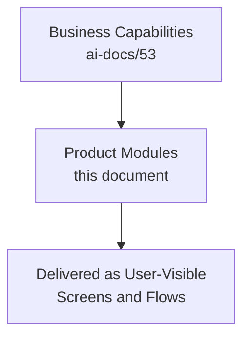

---

# Module Dependency Map

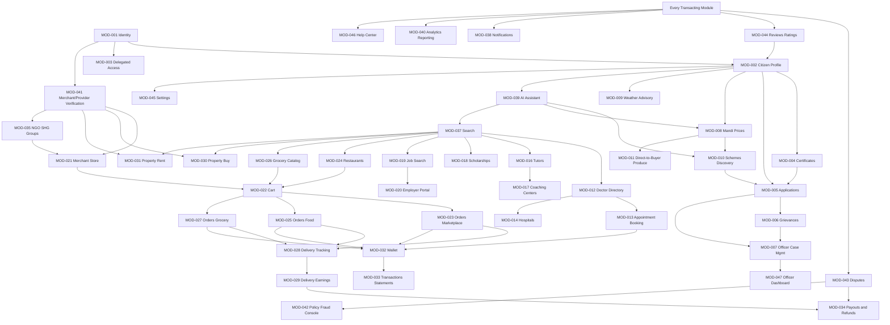

### Module Dependency Heat Map

Per the governance improvement this catalog incorporates, dependency **fan-in** (how many modules depend on it) is tracked so a change to a high-fan-in module is reviewed with proportionally elevated rigor, mirroring the Portfolio Dependency Heat Map already established in `ai-docs/38-engineering-portfolio-program-management-standards.md`.

| Module | Fan-In (Depended On By) | Criticality |
|---|---|---|
| MOD-001 Identity & Verification | All 49 other modules | Critical |
| MOD-032 Wallet | ~15 transacting modules | Critical |
| MOD-037 Search | ~10 discovery modules | High |
| MOD-038 Notifications | All modules (terminal consumer) | High |
| MOD-002 Citizen Profile | ~20 modules | High |
| MOD-022 Cart | 3 fulfillment modules (Orders variants) | Medium |
| MOD-028 Delivery Tracking | 3 order modules | Medium |
| MOD-041 Merchant/Provider Verification | 6 supply-side modules | Medium |
| MOD-044 Reviews & Ratings | ~8 discovery/profile modules | Medium |
| MOD-035 NGO & SHG Groups | 1 module (Merchant Store) | Low |

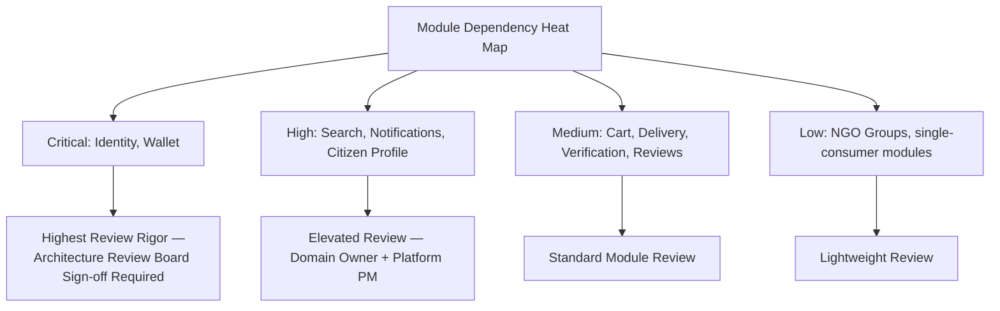

---

# Cross-Module Workflows

### Citizen Applies for a Certificate

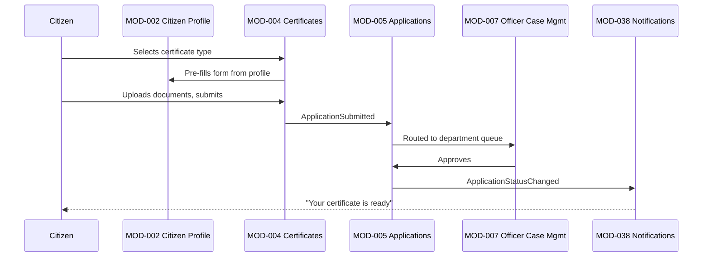

### Citizen Books a Doctor

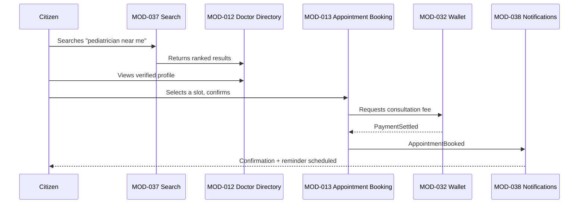

### Citizen Orders Groceries

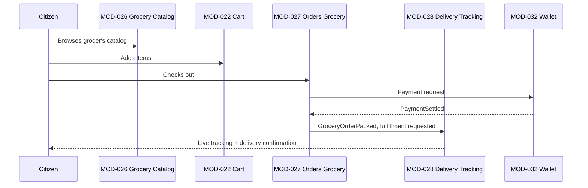

### Merchant Fulfills an Order

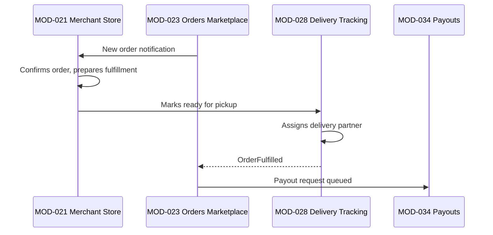

### Farmer Checks Mandi Prices

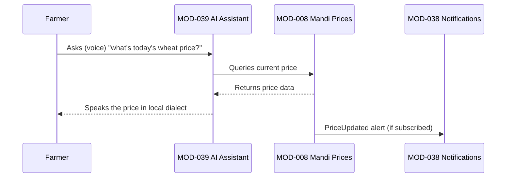

### Job Seeker Applies for a Job

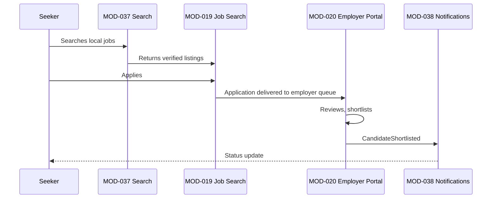

---

# Module Lifecycle

Every module moves through the same six stages, mirroring the identical lifecycle discipline already established for Domains (`ai-docs/53`) and Documents (`ai-docs/49`).

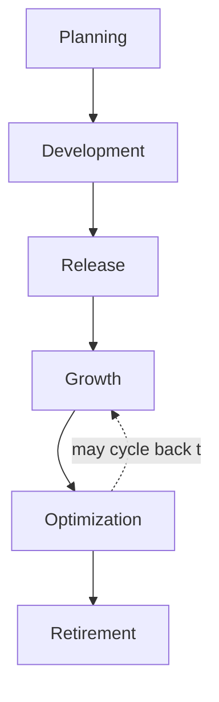

| Stage | Meaning | Exit Criterion |
|---|---|---|
| **Planning** | Module scoped, Domain-traced, Persona-traced, Product Owner assigned. | Module Onboarding Checklist (below) fully satisfied. |
| **Development** | Module actively built per the Feature layer beneath this catalog. | Meets Release Readiness Criteria (below). |
| **Release** | Module launched to citizens/providers. | First Business Event flowing in production. |
| **Growth** | Module capability actively deepens; adoption climbs. | Module KPIs tracked for 2+ consecutive quarters. |
| **Optimization** | Module mature; focus shifts to refinement, performance, and edge-case coverage. | Module Maturity Level 4+ (below) sustained. |
| **Retirement** | Module's business need has ended or been absorbed elsewhere. | Module Retirement Checklist (below) fully satisfied. |

### Module Maturity Levels

| Level | Characteristics |
|---|---|
| **1 — Nascent** | Named and scoped; not yet released. |
| **2 — Emerging** | Released with a narrow capability set; low adoption. |
| **3 — Established** | Full capability set delivered; stable adoption; KPIs tracked. |
| **4 — Mature** | Capability deepened; cross-module integration proven reliable at scale. |
| **5 — Optimized** | Module actively informs strategic planning; proactive, evidence-driven evolution. |

### Module Criticality Levels

Per the governance improvement this catalog incorporates, every module additionally carries a **Criticality Level**, distinct from Maturity — a module can be highly mature yet low-criticality (Property listings), or nascent yet high-criticality (Identity, from day one).

| Criticality | Definition | Example Modules | Review Rigor |
|---|---|---|---|
| **Critical** | A citizen-facing outage or data incident here has civic, financial, or safety consequences. | Identity (MOD-001), Wallet (MOD-032), Certificates (MOD-004), Appointment Booking (MOD-013) | Elevated — Architecture Review Board + Security Review per `ai-docs/29-engineering-governance-decision-authority.md`. |
| **High** | A failure here materially degrades trust or commerce but is not civic/safety-critical. | Search (MOD-037), Orders variants, Notifications (MOD-038) | Domain Owner + Platform PM sign-off. |
| **Medium** | A failure here is inconvenient but has a workaround or limited blast radius. | Coaching Centers (MOD-017), Scholarships (MOD-018) | Standard Product review. |
| **Low** | A failure here has minimal citizen impact. | Community Engagement Feed (MOD-036) | Lightweight review. |

---

# Module Governance

### Ownership

Every module has exactly one named Business Owner and one named Product Owner per the Master Module Registry — mirroring the identical Clear Ownership principle already established in `ai-docs/47-engineering-organizational-scaling-standards.md` and applied to Domains in `ai-docs/53-business-domain-model.md`. A module with ambiguous or shared ownership is treated as a governance defect, surfaced at the Quarterly Module Review.

### Module Ownership RACI

| Activity | Responsible | Accountable | Consulted | Informed |
|---|---|---|---|---|
| Module roadmap planning | Product Owner | Business Owner | Domain Owner (`ai-docs/53`), UX Strategy Lead | Engineering Leadership |
| Module release decision | Product Owner | Business Owner | QA Lead, Accessibility Lead | Analytics, Support |
| Module retirement decision | Product Owner | CPO | Business Owner, Architecture Review Board | All Engineering |
| Module boundary change (split/merge) | Product Owner + Domain Owner jointly | CPO | Architecture Review Board | All Product |
| Module KPI target-setting | Product Owner | Business Owner | Analytics Lead | Engineering Leadership Council |

### Review Cadence

| Review | Cadence | Owner | Purpose |
|---|---|---|---|
| **Quarterly Module Review** | Quarterly | CPO, Chief Enterprise Architect | Registry accuracy, maturity/criticality-level progression, dependency-heat-map accuracy. |
| **Module Capability Review** | Semi-Annual | Product Owners, Domain Owners | Confirms the Module Capability Matrix remains accurate as capabilities deepen. |
| **Module Ownership Review** | Quarterly | VP Product, CPO | Confirms every module has a current, active named owner; escalates any ownerless module. |
| **Cross-Module UX Consistency Review** | Semi-Annual | UX Strategy Lead | Confirms shared interaction patterns (Cart, Orders, Reviews) remain consistent across every consuming module. |

### Approval Workflow

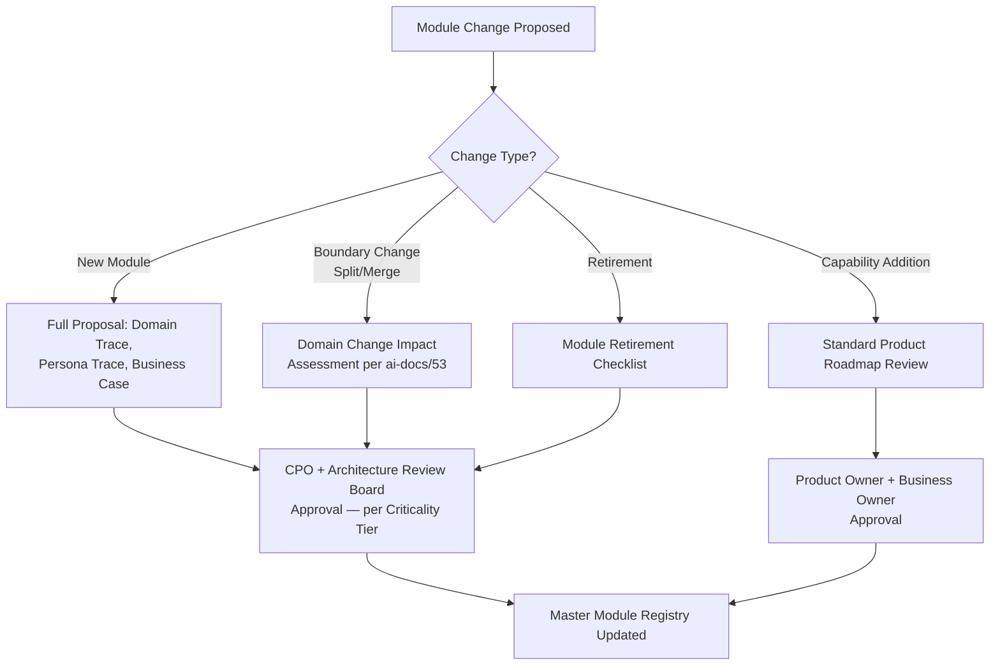

### Change Management and Versioning

Every module's Registry entry carries an implicit version via its last-updated date; a material change to a module's Purpose, Primary Domain, or Classification is treated as a new version requiring CPO sign-off, never a silent in-place edit — mirroring the identical Versioning discipline already established in `ai-docs/49-engineering-handbook-governance-evolution-standards.md` and `ai-docs/52-user-personas-user-segmentation.md`.

### Module Naming Standards

- Module names are citizen-recognizable nouns or short noun phrases ("Doctor Directory," never "Healthcare Provider Discovery Microservice").
- Names are never technology-flavored (no "API," "Service," or "Engine" in a module name — that belongs to the technical-component layer).
- Where two modules share a pattern (Orders, Cart) across verticals, the shared noun is kept identical, with the vertical stated only where genuinely necessary for disambiguation (e.g., "Orders (Food)").

### Module Versioning Policy

A module's **capability set** changes continuously via its feature roadmap (not tracked in this catalog). This catalog's Registry entry changes only when the module's **identity** changes: its Purpose, Classification, Primary Domain, or Lifecycle Status. Each such change is recorded with a date and approving authority in the module's governance history, mirroring `ai-docs/49-engineering-handbook-governance-evolution-standards.md`'s Change History discipline.

### Module Onboarding Checklist

Before a new module enters Development (per Module Lifecycle above):

- [ ] Traces to an existing Business Domain (`ai-docs/53`) — never invented independently.
- [ ] At least one Persona (`ai-docs/52`) and Stakeholder (`ai-docs/51`) named as primary beneficiary.
- [ ] Classification (Core/Supporting/Shared/Administrative/Platform/Future) assigned.
- [ ] Business Owner and Product Owner named.
- [ ] Purpose and Business Value stated in citizen-recognizable language.
- [ ] Dependencies on existing modules identified and added to the Dependency Map.
- [ ] KPIs defined before release, never retrofitted after launch.
- [ ] Accessibility and Security/Privacy considerations documented per the Catalog template.

### Module Retirement Checklist

Before a module is marked Retired:

- [ ] Business need confirmed absent for two consecutive Quarterly Module Reviews, or explicitly merged into another module.
- [ ] Every dependent module's Dependency Map entry updated to remove or redirect the dependency.
- [ ] A migration path communicated to affected citizens/providers, per `ai-docs/34-engineering-communication-standards.md`'s classification tiers.
- [ ] Module ID archived, never reused, per the Archive, Never Delete principle already established throughout this handbook.
- [ ] Historical data-retention obligations (per `ai-docs/10-security-standards.md`) satisfied before any underlying data is purged.

### Release Readiness Criteria

A module is not released to citizens until:

- [ ] It satisfies every item on the Module Onboarding Checklist above.
- [ ] It meets the accessibility floor in `ai-docs/12-accessibility-standards.md` for its criticality tier.
- [ ] It has a functioning Notifications (MOD-038) integration for its key business events.
- [ ] It has a Help Center (MOD-046) entry point for citizen support.
- [ ] Its dependencies are all at least Established (Maturity Level 3) or the module explicitly accepts and documents a dependency risk.

### Module Extensibility Guidelines

A module is designed so a *future* capability (a new sub-feature, a new persona segment) can be added without requiring a boundary change — extensibility is achieved through clean internal composition within the module's already-approved Responsibilities, never through speculative, YAGNI-violating pre-building of unused capability, per `ai-docs/02-engineering-principles.md`'s YAGNI principle applied here at the product layer.

### Feature Grouping Strategy

Features within a module are grouped by the citizen task they support (e.g., within Orders: "track," "return," "reorder"), never by the internal team that happens to build them — ensuring a citizen's mental model of the module stays stable even as the org chart behind it evolves.

### Cross-Module Navigation Principles

- A citizen can always reach any module from a consistent, predictable global entry point (search, a home-screen module tile, or a notification deep-link).
- A module never requires a citizen to exit and re-enter the app to reach a related module (e.g., completing a Healthcare booking flows directly into Wallet for payment, never out to a separate payment app).
- Every module's navigation is screen-reader-correct and keyboard-operable per `ai-docs/12-accessibility-standards.md`.

---

# Module KPIs

| Module | KPI |
|---|---|
| Identity & Verification (MOD-001) | Verification completion rate |
| Citizen Profile (MOD-002) | Cross-Vertical Adoption Depth |
| Delegated & Assisted Access (MOD-003) | Delegated-flow completion rate |
| Certificates (MOD-004) | Application-to-issuance time |
| Applications (MOD-005) | Government Efficiency KPI |
| Grievances (MOD-006) | Grievance resolution time |
| Officer Case Management (MOD-007) | Audit-log completeness |
| Mandi Prices (MOD-008) | Farmer Empowerment KPI |
| Weather Advisory (MOD-009) | Alert-delivery success rate |
| Government Schemes Discovery (MOD-010) | Scheme-eligibility-to-application conversion |
| Direct-to-Buyer Produce Marketplace (MOD-011) | Listing-to-sale conversion |
| Doctor Directory (MOD-012) | Search-to-booking conversion |
| Appointment Booking (MOD-013) | Time-to-appointment; no-show rate |
| Hospitals (MOD-014) | Referral/appointment volume |
| Pharmacies (MOD-015) | Stock-check-to-visit conversion |
| Tutors (MOD-016) | Education Improvement KPI |
| Coaching Centers (MOD-017) | Enrollment-fill rate |
| Scholarships & Opportunities (MOD-018) | Students connected to resources |
| Job Search (MOD-019) | Employment Generation KPI |
| Employer Portal (MOD-020) | Fill-rate for posted roles |
| Merchant Store (MOD-021) | Business Enablement KPI |
| Cart (MOD-022) | Cart-to-checkout conversion |
| Orders — Marketplace (MOD-023) | GMV with healthy contribution margin |
| Restaurants & Menu (MOD-024) | Order-fulfillment time |
| Orders — Food (MOD-025) | Repeat-order rate |
| Grocery Store Catalog (MOD-026) | Same-day fulfillment rate |
| Orders — Grocery (MOD-027) | Recurring-order retention |
| Delivery Tracking (MOD-028) | On-time delivery rate |
| Delivery Partner Earnings (MOD-029) | Earnings-transparency satisfaction |
| Property — Buy (MOD-030) | Listing-to-transaction conversion |
| Property — Rent (MOD-031) | Verified-listing search-to-contact rate |
| Wallet (MOD-032) | Transaction success rate |
| Transactions & Statements (MOD-033) | Statement-download usage |
| Payouts & Refunds (MOD-034) | Settlement latency |
| NGO & SHG Groups (MOD-035) | Beneficiary reach amplified |
| Community Engagement Feed (MOD-036) | Feed engagement rate |
| Search (MOD-037) | Search-to-action conversion rate |
| Notifications (MOD-038) | Delivery success rate |
| AI Assistant (MOD-039) | Human-override-path availability (100% target) |
| Analytics & Reporting (MOD-040) | Dashboard adoption rate |
| Merchant/Provider Verification (MOD-041) | Verification turnaround time |
| Policy & Fraud Enforcement Console (MOD-042) | Fraud-incident rate |
| Trust & Safety — Disputes (MOD-043) | Dispute-resolution time |
| Trust & Safety — Reviews & Ratings (MOD-044) | Verified-provider ratio |
| Settings (MOD-045) | Accessibility-mode adoption rate |
| Help Center & Support (MOD-046) | Support-ticket resolution time |
| Government Officer Dashboard (MOD-047) | Government Efficiency KPI |

---

# Executive Dashboards

### CEO Dashboard
- District Trust Signal; Cross-Vertical Adoption Depth (aggregated across all Core Modules)
- Module Maturity distribution across Core Modules
- Government Efficiency KPI trend (civic module cluster)
- Module retirement/merge decisions this quarter

### CPO Dashboard
- Module KPI summary across all Core and Supporting Modules
- Persona-to-Module traceability gaps
- Module Onboarding pipeline (Planning → Development → Release)
- Cross-Module UX Consistency findings

### Engineering Dashboard
- Module Dependency Heat Map with Criticality overlay
- Module Release Readiness status per in-flight module
- Fitness-function/architecture-compliance signals per module (cross-referenced with `ai-docs/46`)

### Government Partners Dashboard
- Government Services module cluster KPI trend (MOD-004–007, MOD-047)
- Civic Audit Trail completeness
- State-level integration readiness

### Operations Dashboard
- Merchant/Provider Verification (MOD-041) and Fraud Console (MOD-042) KPIs
- Support-ticket volume and resolution time (MOD-046)
- Dispute (MOD-043) and Reviews (MOD-044) volume trend

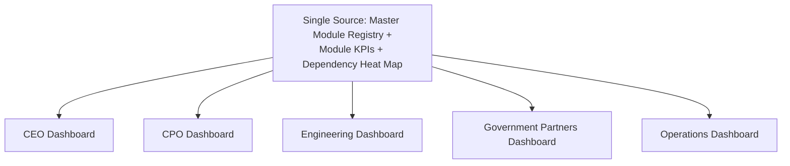

---

# AI Module Strategy

### Personalization

Every discovery-oriented module (Search, Doctor Directory, Tutors, Job Search) personalizes ranking per persona-cluster, never on a single undifferentiated population model, mirroring the identical AI Personalization Strategy already established in `ai-docs/52-user-personas-user-segmentation.md`.

### Recommendations

Recommendation surfaces (reorder suggestions in Cart, tutor matching, job matching) are scoped to a module's stated Primary Goal for its persona — never introduced merely because a model can technically predict something, per the identical discipline already established in `ai-docs/52`.

### Automation

Automation (auto-categorized listings, auto-routed grievances, auto-suggested restock alerts) accelerates a module's core task but never removes the citizen's or officer's final decision authority over a civic, financial, or reputation-affecting outcome.

### Human Oversight

Per the AI Principle already established in `ai-docs/00-project-vision.md` and reaffirmed throughout `ai-docs/50-product-vision-business-strategy.md`: no module's AI-assisted feature may deny a citizen a service, block a transaction, or determine reputation without a human-reachable override path. This is absolute for every module carrying an AI Opportunity in its Catalog entry above, with no exception for a "low-risk" module.

### Responsible AI

Every module's AI Opportunity is evaluated against the Anti-Discrimination Safeguards already established in `ai-docs/52-user-personas-user-segmentation.md` — no sensitive-attribute targeting, no proxy discrimination, an equal-quality floor across every persona segment, and an explainability requirement for any recommendation materially affecting access to a service.

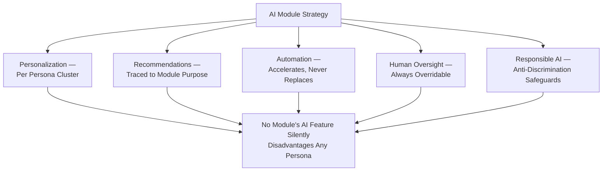

---

# Module Anti-Patterns

| Anti-Pattern | Description | Why It's Rejected |
|---|---|---|
| **Monolithic module** | A single module accumulating unrelated responsibilities (e.g., "Commerce" absorbing Payments and Logistics directly). | Violates Single Responsibility above; mirrors the God Object anti-pattern already rejected in `ai-docs/03-system-architecture-principles.md` and the God Domain anti-pattern in `ai-docs/53-business-domain-model.md`, one layer up. |
| **Duplicate functionality** | Two modules independently building the same capability (e.g., Food Delivery building its own cart instead of using MOD-022). | Violates Reusability above; produces inconsistent citizen experience and duplicated maintenance cost. |
| **Overlapping ownership** | Two Product Owners both claim, or both disclaim, accountability for the same module. | Violates the Ownership discipline above; produces exactly the ambiguity `ai-docs/47-engineering-organizational-scaling-standards.md` names as a root cause of unresolved incidents. |
| **Hidden dependencies** | A module silently depends on another module's internal behavior without that dependency being reflected in the Module Dependency Map. | Makes independent evolution impossible and produces surprise breakage when the depended-upon module changes. |
| **Feature bloat** | A module accumulating capability that no longer traces to its stated Purpose or a Persona's Jobs-To-Be-Done. | Violates Business Alignment above and the Product Anti-Pattern "feature bloat" already rejected in `ai-docs/50-product-vision-business-strategy.md`. |
| **Poor discoverability** | A module a citizen cannot find through an obvious navigation path or search query. | Violates Discoverability above; a module that cannot be found is functionally absent from the product. |

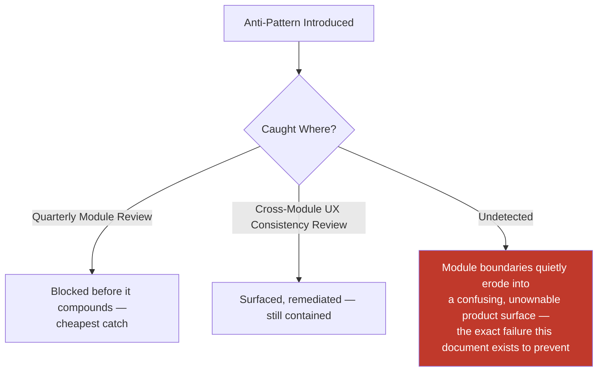

---

# Module Review Checklist

Every module proposal, capability addition, boundary change, or retirement is checked against the following before it is considered catalog-compliant:

- [ ] **Traceable to a Business Domain** — Never invented independently of `ai-docs/53-business-domain-model.md`.
- [ ] **Traceable to at least one Persona and Stakeholder** — Per `ai-docs/52` and `ai-docs/51`.
- [ ] **Correctly classified** — Core/Supporting/Shared/Administrative/Platform/Future.
- [ ] **Single Responsibility respected** — The module does one coherent, citizen-recognizable thing.
- [ ] **Dependencies documented** — Reflected accurately in the Module Dependency Map and Heat Map.
- [ ] **Accessibility considerations stated** — Per `ai-docs/12-accessibility-standards.md`'s floor, scaled to the module's criticality.
- [ ] **Security and Privacy considerations stated** — Per `ai-docs/10-security-standards.md`'s Data Classification tiers.
- [ ] **KPIs defined before release** — Never retrofitted after launch.
- [ ] **AI Opportunities, if any, carry a human-override path** — Per AI Module Strategy above.
- [ ] **Naming follows the Module Naming Standards** — Citizen-recognizable, never technology-flavored.
- [ ] **No anti-pattern present** — No monolithic module, duplicate functionality, overlapping ownership, hidden dependency, feature bloat, or poor discoverability.
- [ ] **No duplication of Business Domain Model, Persona, or Stakeholder governance** — Any such concern deferred entirely to its owning phase document, never redefined here.

A module failing any item above is not considered catalog-compliant until resolved — this checklist carries the same non-negotiable authority as every other review checklist established in the preceding phase documents.

---

# Future Module Roadmap

| Module | Trigger for Activation | Anticipated Horizon (per `ai-docs/50`) |
|---|---|---|
| B2B/Wholesale Marketplace (MOD-048) | Commerce Marketplace domain reaches Maturity Level 4 | Year 2–3 |
| Micro-Lending & Fintech (MOD-049) | Trust and regulatory-compliance maturity confirmed | Year 7–8 (per `ai-docs/00`'s 10-Year Vision Arc) |
| Multi-District Configuration Console (MOD-050) | Founding-district trust and unit-economics criteria met | Year 5 |
| Telehealth/Remote Consultation (extension of MOD-013) | Healthcare domain reaches Maturity Level 4 | Year 3 |
| Full Civic Assistant Maturity (extension of MOD-039) | AI Capability Maturity Level 5 reached, per `ai-docs/48` | Year 3–4 |

---

# Traceability

### Domain → Module Matrix

| Domain (Ph.54) | Module(s) |
|---|---|
| Identity (DOM-001) | Identity & Verification (MOD-001), Delegated & Assisted Access (MOD-003) |
| Citizen (DOM-002) | Citizen Profile (MOD-002), Settings (MOD-045), Help Center (MOD-046) |
| Government Services (DOM-003) | Certificates (MOD-004), Applications (MOD-005), Grievances (MOD-006), Officer Case Management (MOD-007), Government Officer Dashboard (MOD-047) |
| Agriculture (DOM-004) | Mandi Prices (MOD-008), Weather Advisory (MOD-009), Government Schemes Discovery (MOD-010), Direct-to-Buyer Produce Marketplace (MOD-011) |
| Healthcare (DOM-005) | Doctor Directory (MOD-012), Appointment Booking (MOD-013), Hospitals (MOD-014), Pharmacies (MOD-015) |
| Education (DOM-006) | Tutors (MOD-016), Coaching Centers (MOD-017), Scholarships & Opportunities (MOD-018) |
| Jobs (DOM-007) | Job Search (MOD-019), Employer Portal (MOD-020) |
| Commerce Marketplace (DOM-008) | Merchant Store (MOD-021), Cart (MOD-022), Orders — Marketplace (MOD-023), B2B/Wholesale (MOD-048, future) |
| Food Delivery (DOM-009) | Restaurants & Menu (MOD-024), Orders — Food (MOD-025) |
| Grocery (DOM-010) | Grocery Store Catalog (MOD-026), Orders — Grocery (MOD-027) |
| Logistics (DOM-011) | Delivery Tracking (MOD-028), Delivery Partner Earnings (MOD-029) |
| Property (DOM-012) | Property — Buy (MOD-030), Property — Rent (MOD-031) |
| Payments (DOM-013) | Wallet (MOD-032), Transactions & Statements (MOD-033), Payouts & Refunds (MOD-034), Micro-Lending (MOD-049, future) |
| Community (DOM-014) | NGO & SHG Groups (MOD-035), Community Engagement Feed (MOD-036) |
| Search (DOM-015) | Search (MOD-037) |
| Notifications (DOM-016) | Notifications (MOD-038) |
| AI Assistant (DOM-017) | AI Assistant (MOD-039) |
| Analytics (DOM-018) | Analytics & Reporting (MOD-040) |
| Administration (DOM-019) | Merchant/Provider Verification (MOD-041), Policy & Fraud Enforcement Console (MOD-042) |
| Trust & Safety (DOM-020) | Trust & Safety — Disputes (MOD-043), Trust & Safety — Reviews & Ratings (MOD-044) |

### Persona → Module Matrix

| Persona (Ph.53) | Primary Module(s) |
|---|---|
| PER-001 Rahul | Merchant Store (021), Cart (022), Orders — Marketplace (023), Restaurants (024), Orders — Food (025), Grocery Catalog (026), Orders — Grocery (027) |
| PER-002 Meena | Mandi Prices (008), Weather Advisory (009), Government Schemes Discovery (010), AI Assistant (039) |
| PER-003 Aisha | Tutors (016), Scholarships & Opportunities (018) |
| PER-004 Manoj | Tutors (016) |
| PER-005 Sunita | Tutors (016), Grievances (006, assisted) |
| PER-006 Dr. Kavita | Doctor Directory (012), Appointment Booking (013) |
| PER-007 Ramesh | Hospitals (014), Appointment Booking (013) |
| PER-008 Anjali | Hospitals (014), Analytics & Reporting (040) |
| PER-009 Vikash | Pharmacies (015) |
| PER-010 Suresh | Merchant Store (021) |
| PER-011 Priyanka | Merchant Store (021), B2B/Wholesale (048, future) |
| PER-012 Vikram | Delivery Tracking (028), Delivery Partner Earnings (029) |
| PER-013 Ashok | Property — Buy (030) |
| PER-014 Farida | Property — Rent (031) |
| PER-015 Rakesh | Job Search (019) |
| PER-016 Neha | Employer Portal (020) |
| PER-017 Priya | Officer Case Management (007), Government Officer Dashboard (047) |
| PER-018 Mr. Singh | Government Officer Dashboard (047) |
| PER-019 Devendra | Delegated & Assisted Access (003), Certificates (004), Applications (005) |
| PER-020 Arvind | Cross-cutting — every module (accessibility floor) |
| PER-021 Lakshmi | Cross-cutting — Merchant Store (021), Certificates (004), Mandi Prices (008), AI Assistant (039) |
| PER-022 Radha's SHG | NGO & SHG Groups (035) |
| PER-023 Iqbal | Job Search (019), Property — Rent (031) |
| PER-024 Fr. Thomas | NGO & SHG Groups (035), Community Engagement Feed (036) |

### Stakeholder → Module Matrix

| Stakeholder (Ph.52) | Primary Module(s) |
|---|---|
| STK-001 Citizens | Identity (001), Citizen Profile (002), Settings (045), Help Center (046) |
| STK-002 Farmers | Mandi Prices (008), Weather Advisory (009), Direct-to-Buyer Produce (011) |
| STK-006 Doctors | Doctor Directory (012), Appointment Booking (013) |
| STK-010 Local Businesses | Merchant Store (021) |
| STK-012 Delivery Partners | Delivery Tracking (028), Delivery Partner Earnings (029) |
| STK-017 Government Officials | Officer Case Management (007), Government Officer Dashboard (047) |
| STK-020/021 Banks/Payment Providers | Wallet (032), Payouts & Refunds (034) |
| STK-029 Senior Citizens | Delegated & Assisted Access (003), Settings (045) |
| STK-030 Persons with Disabilities | Cross-cutting accessibility floor across every module |
| STK-039 Customer Support | Help Center & Support (046) |
| STK-040 Operations | Merchant/Provider Verification (041), Policy & Fraud Enforcement Console (042) |

### Business Capability → Module Matrix

See Module Capability Matrix above — reproduced here by reference per Single Source of Truth, never duplicated.

---

# Relationship with Previous Standards

### Project Vision

`ai-docs/00-project-vision.md` establishes the founding mission every module ultimately serves — no module in this catalog exists that cannot trace, through a Domain and a Persona, back to a commitment already made there.

### Product Goals

`ai-docs/01-product-goals.md` establishes the Functional Goals cluster list (Unified Identity, Commerce Marketplace, Local Services Marketplace, Civic Services, etc.) at a summary level. This document is the detailed, module-level decomposition of that cluster list — every Functional Goal maps to one or more modules cataloged here.

### Stakeholder Analysis

`ai-docs/51-stakeholder-analysis.md` establishes who Arwal serves and what each stakeholder needs. Every module's Primary Stakeholders field traces directly to that registry, never inventing a new stakeholder independently.

### User Personas

`ai-docs/52-user-personas-user-segmentation.md` makes stakeholders specific, evidence-grounded people. Every module's Primary Personas field and Accessibility Considerations trace directly to a persona's stated Jobs-To-Be-Done and Accessibility Requirements.

### Business Domain Model

`ai-docs/53-business-domain-model.md` establishes the business domains this catalog's modules express as user-visible capability. Every module's Primary Domain field is a direct citation into that document's Domain Registry — this document never redraws a domain boundary, it only expresses domains as citizen-facing product surface area.

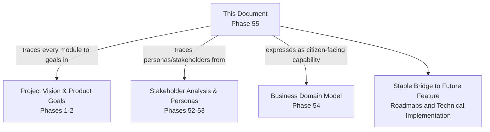

---

# Closing Statement

> **Callout — Closing Statement**
> A business domain tells the organization who owns a concern; a persona tells a designer who they are building for; a product module is where those two truths meet the actual screen a citizen taps. Without a stable, well-governed module catalog, the same business domain gets expressed inconsistently by different teams, the same interaction pattern (an order, a booking, a review) drifts into a dozen subtly different shapes, and a citizen's mental model of "the app I use for everything" quietly fractures back into the fragmented, twenty-app reality Arwal exists to replace. This catalog is the stable, citable bridge between the business architecture established in Phases 51 through 54 and every future feature roadmap, UX flow, and technical implementation still to come across the remaining phases of this handbook — a Product Manager, a designer, and an engineer can each open this document and find the same fifty modules, the same boundaries, and the same traceable reasons those boundaries exist. Where a future phase must deviate from a module boundary, classification, or ownership stated here, that deviation is made explicitly — through the Module Governance approval workflow above — never silently, and never by default.

This document, `ai-docs/54-product-module-catalog.md`, is Phase 55 of approximately 420. Every future feature, screen, workflow, and technical component is expected to trace back to a module defined here, or to justify its deviation in writing.

**End of Phase 55 — `ai-docs/54-product-module-catalog.md`**
