# Business Capability Map

**Document:** `ai-docs/55-business-capability-map.md`
**Project:** Arwal — The District Super App
**Stage:** 2 — Product & Business Strategy
**Phase:** 56 — Business Capability Map
**Status:** Approved for Product & Engineering Reference
**Audience:** CEO, CPO, CTO, Chief Enterprise Architect, Architecture Review Board, Domain Architects, Product Managers, Government Digital Transformation Partners, Engineering Directors, Investors

> **Callout — Purpose of This Document**
> `ai-docs/00-project-vision.md` established why Arwal exists. `ai-docs/01-product-goals.md` translated that into measurable goals. `ai-docs/50-product-vision-business-strategy.md` established what Arwal is. `ai-docs/51-stakeholder-analysis.md` established who Arwal serves. `ai-docs/52-user-personas-user-segmentation.md` made those stakeholders specific, evidence-grounded people. `ai-docs/53-business-domain-model.md` established the discrete business domains Arwal is made of. `ai-docs/54-product-module-catalog.md` established the user-visible product modules citizens actually open. None of those documents answers the question every future service, API, database, team, and AI investment now depends on: **what can Arwal actually *do*, independent of any technology, any UI, any team, and any org chart — and how stable is that list expected to be across a decade of change?** This document is that answer — the authoritative Business Capability Map.

---

# Purpose of this Document

### Why Business Capabilities Are More Stable Than Features, Modules, Teams, or Technology

Every layer defined so far in this handbook has a different half-life. `ai-docs/54-product-module-catalog.md`'s modules ("Doctor Directory," "Cart") change when a UX redesign reshapes navigation. Features beneath a module change every sprint. Teams reorganize every year or two as Arwal scales, per `ai-docs/47-engineering-organizational-scaling-standards.md`. Technology choices (`ai-docs/09-tech-stack.md`) are explicitly designed to be revisited via the Technology Adoption Process whenever evidence warrants. None of these layers is wrong to change — they are *supposed* to change, because they are the layers closest to implementation, and implementation must adapt to circumstance.

A **Business Capability** answers a different, much more durable question: **what is the organization able to do, as a matter of business fact, regardless of who does it, how it is built, or what it is called this quarter?** "Verify a citizen's identity" is a capability Arwal has needed since Phase 1 and will still need at Phase 420, whether it is delivered by an OTP flow today or a biometric-plus-federated-SSO flow after state-level integration matures (per `ai-docs/48-engineering-strategic-planning-standards.md`'s Technology Radar). The capability does not change; only its *realization* changes. This is precisely the distinction `ai-docs/03-system-architecture-principles.md` draws between a Bounded Context's stable boundary and the technology inside it — applied here one layer above even the business domain, at the level of "ability," not "ownership."

Capabilities are more stable than:

| Layer | Typical Half-Life | Why It Changes |
|---|---|---|
| **Technology** (`ai-docs/09`) | Months to a few years | Frameworks age, better tools emerge, vendor terms shift. |
| **Teams** (`ai-docs/47`) | 1–3 years | Org design responds to headcount, Conway's Law, hiring reality. |
| **Modules** (`ai-docs/54`) | 1–2 years | UX patterns, navigation, and citizen mental models evolve. |
| **Features** (roadmap items beneath modules) | Weeks to a quarter | Continuous iteration is the entire point of a product roadmap. |
| **Business Domains** (`ai-docs/53`) | Years | Boundaries are stable but can split/merge as the business genuinely grows. |
| **Business Capabilities** (this document) | A decade or more | A capability is a fact about what the *business* — not the software — must be able to do; it changes only when the underlying business model itself changes. |

### Why This Distinction Matters at Arwal's Scale

Without an explicit Business Capability Map:

1. **Every reorganization looks like starting over.** If "what Arwal can do" is only ever expressed in terms of teams or modules, a team merge or a UX redesign appears to threaten capabilities that were never actually at risk — capabilities are the fixed point every reorganization can be checked against, per the identical Stable Boundaries reasoning already established in `ai-docs/53-business-domain-model.md`.
2. **Investment planning has no durable unit.** `ai-docs/48-engineering-strategic-planning-standards.md`'s multi-year Strategic Themes need something more granular than a Theme but more durable than a sprint's feature list to reason about — a capability is exactly that unit: "we need to invest in Fraud Detection capability maturity" survives a technology migration, a team reshuffle, and a UI rewrite untouched.
3. **Gap analysis becomes impossible.** Without a capability inventory, "what is Arwal missing before it can serve a second district?" has no answerable basis — a capability gap (e.g., no Multi-Language Content Management capability yet) can be named and closed deliberately, rather than discovered as a missing feature mid-expansion.
4. **AI and automation strategy has no stable target.** `ai-docs/48`'s AI Vision and `ai-docs/54`'s AI Module Strategy both describe *where* AI assists — but AI orchestration ultimately calls *capabilities*, not modules or services, because a capability is the durable unit of "a thing the business can do" that an AI agent, a human officer, or a future automated pipeline can all invoke identically.
5. **Expansion inherits a capability set, not a codebase.** Per `ai-docs/50-product-vision-business-strategy.md`'s Strategic Expansion Principles, a second district's replication is fundamentally a question of "does this district need every capability the founding district has, or a subset?" — a question this document, not `ai-docs/53` or `ai-docs/54`, is built to answer.

### The Relationship Chain

This document occupies a distinct, non-overlapping position in the layer chain already established across Stage 2:

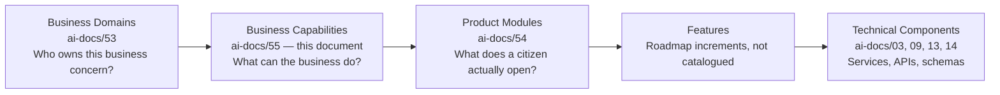

> **Callout — Capabilities Are Not "Domains Renamed"**
> A Business Domain (`ai-docs/53`) is an *organizational and ownership* concept — it answers "who is accountable, and what is their boundary?" A Business Capability is an *ability* concept — it answers "what can be done?" A single domain typically realizes several capabilities (Healthcare realizes Healthcare Discovery, Appointment Scheduling, *and* Provider Verification), and a single capability can, in principle, be realized by more than one domain collaborating (Fraud Detection draws on signals from Commerce, Jobs, and Property simultaneously, even though Trust & Safety is its primary owning domain). Collapsing capabilities into domains, or domains into modules, would destroy exactly the independent-stability property this document exists to protect.

### Scope Boundary

This document does not define APIs, services, databases, UI, or team structure — every one of those remains the exclusive territory of `ai-docs/03`, `ai-docs/09`, `ai-docs/13`, `ai-docs/14`, and `ai-docs/47`. This document's exclusive territory is **capability identity, business value, business rules, dependency, ownership, and traceability** — the stable input every technology decision, team design, and module implementation is measured against, never the reverse.

---

# Capability Modeling Philosophy

Every principle below exists because a capability map drawn carelessly does not merely produce a bad diagram — it produces exactly the strategic-planning blindness, duplicated investment, and unowned-gap failure modes this document exists to prevent.

### Business-First

**Why it exists:** A capability must be nameable and defensible to a CEO, a government partner, or an investor without reference to any technology — "Verify a citizen's identity" makes sense to all three; "run the KYC microservice" does not. Business-First is what keeps this document readable at the executive register `ai-docs/50-product-vision-business-strategy.md` already establishes as necessary for the highest-level artifacts in this handbook.

### Technology Independent

**Why it exists:** A capability's definition must survive any technology migration untouched — the Payment Processing capability existed before NestJS/PostgreSQL was chosen in `ai-docs/09-tech-stack.md` and will exist after any future technology stack replaces it. If a capability's description mentions a framework, a database, or an API shape, it has been defined at the wrong layer.

### Stable Over Time

**Why it exists:** A capability changes only when the underlying business model itself changes — not when a team reorganizes, not when a UI is redesigned, not when a new library is adopted. Stability is the entire reason this layer exists; a capability map that needs quarterly rewrites has failed to find the right level of abstraction.

### Composable

**Why it exists:** A complex citizen outcome (a certificate issued, an order delivered) is never delivered by one capability alone — it is composed from several capabilities working together, mirroring the identical Composition over Inheritance principle already established in `ai-docs/02-engineering-principles.md`, applied here at the business layer instead of the code layer. Composability is what lets a single new capability (e.g., a future Multi-Language Content Management capability) immediately benefit every existing workflow that could use it, without a bespoke integration per workflow.

### Reusable

**Why it exists:** A capability genuinely needed across several domains and modules (Notifications, Search, Identity Verification) is modeled once and consumed everywhere — never redefined per vertical. This is DRY (`ai-docs/02-engineering-principles.md`) applied one layer above even the Shared Module discipline already established in `ai-docs/54-product-module-catalog.md`.

### Observable

**Why it exists:** A capability that cannot report on its own health — is it being used, is it succeeding, is it degrading — is a capability leadership cannot manage. Every capability in this catalog carries explicit Success Metrics and a place in the Capability KPIs and Executive Dashboards sections below, mirroring the Actionable Metrics principle already established throughout `ai-docs/18-observability-standards.md` and every governance chapter since.

### Measurable

**Why it exists:** "The business can do X" is a testable claim, not a slogan — every capability's maturity, criticality, and health are scored against explicit, checkable criteria (see Capability Maturity Model, Capability Criticality Scoring, and Capability Health Scoring below), never assessed by impression alone.

### Scalable

**Why it exists:** Every capability in this catalog is defined assuming Arwal's eventual multi-district, multi-state, million-plus-user scale from the outset, per `ai-docs/00-project-vision.md`'s Scalability Vision — a capability scoped only to the founding district's current volume is a capability that will need a disruptive redefinition, not a graceful evolution, the moment expansion begins.

### Governed

**Why it exists:** Every capability has exactly one named Business Owner and one named Capability Owner (see Capability Ownership below) — an ungoverned capability degrades identically to an unowned domain in `ai-docs/53-business-domain-model.md` or an unowned document in `ai-docs/49-engineering-handbook-governance-evolution-standards.md`: nobody notices when it silently fails until a citizen or partner escalates loudly enough to force attention.

### Customer-Value Driven

**Why it exists:** Every capability traces to a real citizen, merchant, provider, or government-officer need — never to an internal convenience or a technically interesting grouping. A capability that cannot state, in one sentence, which persona (`ai-docs/52`) or stakeholder (`ai-docs/51`) it ultimately serves is a capability built on assumption, not evidence, per the identical Traceability discipline already established throughout Stage 2.

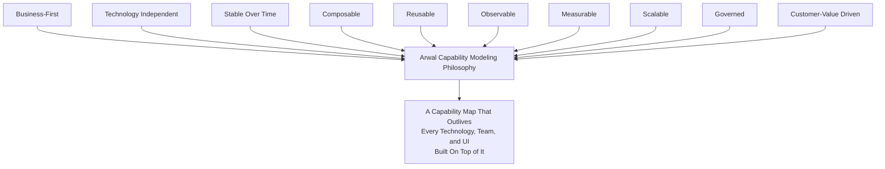

> **Callout — The One-Sentence Capability Modeling Philosophy**
> *"If a capability's name would need to change because we swapped a database, reorganized a team, or redesigned a screen, it was never a capability — it was an implementation detail wearing a capability's name."*

---

# Capability Hierarchy

Every capability in the Master Capability Registry is classified into exactly one of five tiers — mirroring, but never duplicating, the Business Domain Hierarchy tiers already established in `ai-docs/53-business-domain-model.md`. A capability's tier reflects its role in Arwal's value proposition, not its owning domain's tier (a capability can be Core even where its owning domain is Supporting, if the capability itself is differentiating — see Trust Integrity below).

| Tier | Definition | Characteristic |
|---|---|---|
| **Enterprise Capabilities** | The handful of capability clusters so foundational that every other capability ultimately depends on them existing at all. | Cross-cutting, invisible to the citizen, existentially required — Identity, Trust, Payments, Data & Analytics. |
| **Business Capabilities** | Capabilities directly delivering Arwal's differentiated, citizen-facing value per vertical. | High strategic investment; the reason a citizen opens the app for a specific need. |
| **Supporting Capabilities** | Capabilities necessary for Business Capabilities to function well but not themselves differentiating. | Important, but commodity-adjacent; may be satisfied by a well-governed third-party integration per `ai-docs/09-tech-stack.md`'s Third-Party Service Policy. |
| **Shared Capabilities** | Capabilities consumed identically across many Business and Supporting Capabilities. | Governed with platform discipline; never a bespoke per-vertical variant. |
| **Future Capabilities** | Capabilities anticipated by Arwal's roadmap but not yet resourced. | Tracked for readiness; not yet subject to active investment. |

```mermaid
graph TD
    Root[Arwal Business Capability Hierarchy] --> Enterprise[Enterprise Capabilities]
    Root --> Business[Business Capabilities]
    Root --> Supporting[Supporting Capabilities]
    Root --> Shared[Shared Capabilities]
    Root --> Future[Future Capabilities]

    Enterprise --> E1[Identity & Trust]
    Enterprise --> E2[Payments & Money Movement]
    Enterprise --> E3[Data & Analytics]
    Enterprise --> E4[Trust & Safety Integrity]

    Business --> B1[Government Services Capabilities]
    Business --> B2[Agriculture Capabilities]
    Business --> B3[Healthcare Capabilities]
    Business --> B4[Education Capabilities]
    Business --> B5[Jobs Capabilities]
    Business --> B6[Commerce Capabilities]
    Business --> B7[Food & Grocery Capabilities]
    Business --> B8[Property Capabilities]
    Business --> B9[Community Capabilities]

    Supporting --> S1[Delivery Coordination]
    Supporting --> S2[Refund Management]
    Supporting --> S3[Content Moderation]
    Supporting --> S4[Help & Support]

    Shared --> SH1[Search]
    Shared --> SH2[Notifications]
    Shared --> SH3[Recommendation Engine]
    Shared --> SH4[AI Assistance]
    Shared --> SH5[Configuration Management]

    Future --> F1[Micro-Lending Capabilities]
    Future --> F2[Multi-District Configuration Capabilities]
    Future --> F3[State-Level Integration Capabilities]
```

> **Callout — Why Trust & Safety Integrity Is Enterprise, Not Business**
> Fraud Detection, Content Moderation, and Reputation Integrity are not the reason a citizen opens the app — but every other capability's trustworthiness depends on them existing and working, exactly as `ai-docs/00-project-vision.md`'s Trust over Growth-at-all-costs pillar demands. Classifying Trust Integrity as Enterprise (not merely Supporting) reflects that its failure would compromise every Business Capability simultaneously, not just its own domain.

### Capability Taxonomy

Beyond tier, every capability is additionally tagged along three cross-cutting taxonomy axes, so a capability can be found by more than one mental model:

| Axis | Values | Purpose |
|---|---|---|
| **Nature** | Transactional (executes a business action); Informational (surfaces knowledge); Advisory (guides a decision); Governance (enforces a rule/policy) | Distinguishes "does something" from "tells you something," relevant to how a capability is measured. |
| **Actor Orientation** | Citizen-facing; Merchant/Provider-facing; Officer/Administrator-facing; System-internal | Distinguishes who directly invokes the capability, independent of which domain owns it. |
| **Value Chain Position** | Acquisition (bringing a new participant in); Fulfillment (delivering the core value exchange); Retention (sustaining ongoing trust and use); Governance (protecting the system itself) | Distinguishes where in a participant's lifecycle the capability operates. |

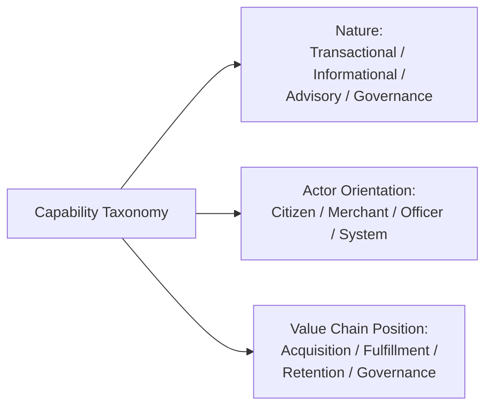

### Capability Decomposition Guidance

A capability is decomposed into two or more narrower capabilities only when **all** of the following hold — mirroring the identical Split criteria already established for Domains in `ai-docs/53-business-domain-model.md`:

1. The combined capability serves two genuinely distinct business rules or success metrics that do not move together.
2. At least one consuming module or workflow needs only one of the two halves, never both.
3. The combined capability's Business Owner cannot coherently answer for both halves in one sentence.

A capability is **not** decomposed merely because it has many features beneath it (per `ai-docs/54-product-module-catalog.md`'s Feature Grouping Strategy) — feature-level granularity is expected and healthy; capability-level granularity should feel coarse by comparison.

---

# Master Capability Registry

Every capability carries a permanent, sequential, never-reused Capability ID — mirroring the identical Registry discipline already established for Domains (`ai-docs/53`), Modules (`ai-docs/54`), Personas (`ai-docs/52`), and Stakeholders (`ai-docs/51`).

| Cap ID | Capability Name | Classification | Lifecycle Status | Primary Domain | Primary Modules | Criticality | Maturity |
|---|---|---|---|---|---|---|---|
| CAP-001 | Identity Verification | Enterprise | Operational | Identity (DOM-001) | MOD-001 | Mission Critical | Optimized |
| CAP-002 | Authentication | Enterprise | Operational | Identity (DOM-001) | MOD-001 | Mission Critical | Optimized |
| CAP-003 | Citizen Profile Management | Enterprise | Operational | Citizen (DOM-002) | MOD-002, MOD-045 | High | Defined |
| CAP-004 | Consent Management | Enterprise | Operational | Citizen (DOM-002) | MOD-002, MOD-045 | Mission Critical | Managed |
| CAP-005 | Delegated & Assisted Access | Business | Operational | Identity (DOM-001) | MOD-003 | High | Defined |
| CAP-006 | Government Application Processing | Business | Operational | Government Services (DOM-003) | MOD-005 | Mission Critical | Defined |
| CAP-007 | Certificate Issuance | Business | Operational | Government Services (DOM-003) | MOD-004 | Mission Critical | Defined |
| CAP-008 | Grievance Resolution | Business | Operational | Government Services (DOM-003) | MOD-006 | High | Managed |
| CAP-009 | Officer Case Management | Business | Operational | Government Services (DOM-003) | MOD-007, MOD-047 | Mission Critical | Defined |
| CAP-010 | Scheme Eligibility Assessment | Business | Operational | Government Services (DOM-003) / Agriculture (DOM-004) | MOD-010 | High | Managed |
| CAP-011 | Farmer Advisory | Business | Operational | Agriculture (DOM-004) | MOD-008, MOD-009 | High | Defined |
| CAP-012 | Market Intelligence | Business | Operational | Agriculture (DOM-004) | MOD-008 | High | Defined |
| CAP-013 | Direct-to-Buyer Marketplace | Business | Operational | Agriculture (DOM-004) | MOD-011 | Medium | Managed |
| CAP-014 | Healthcare Discovery | Business | Operational | Healthcare (DOM-005) | MOD-012, MOD-014, MOD-015 | Mission Critical | Defined |
| CAP-015 | Appointment Scheduling | Business | Operational | Healthcare (DOM-005) / Education (DOM-006) | MOD-013, MOD-016, MOD-017 | Mission Critical | Defined |
| CAP-016 | Provider Verification | Supporting | Operational | Administration (DOM-019) | MOD-041 | Mission Critical | Defined |
| CAP-017 | Education Discovery | Business | Operational | Education (DOM-006) | MOD-016, MOD-017 | High | Managed |
| CAP-018 | Scholarship Matching | Business | Operational | Education (DOM-006) | MOD-018 | Medium | Managed |
| CAP-019 | Job Matching | Business | Operational | Jobs (DOM-007) | MOD-019 | High | Defined |
| CAP-020 | Employer Recruitment | Business | Operational | Jobs (DOM-007) | MOD-020 | High | Defined |
| CAP-021 | Merchant Onboarding | Business | Operational | Commerce Marketplace (DOM-008) | MOD-021 | Mission Critical | Defined |
| CAP-022 | Catalog Management | Business | Operational | Commerce Marketplace (DOM-008) / Food (DOM-009) / Grocery (DOM-010) | MOD-021, MOD-024, MOD-026 | High | Defined |
| CAP-023 | Inventory Management | Supporting | Operational | Commerce Marketplace (DOM-008) | MOD-021, MOD-026 | High | Managed |
| CAP-024 | Shopping Cart | Shared | Operational | Commerce Marketplace (DOM-008) | MOD-022 | High | Optimized |
| CAP-025 | Order Management | Business | Operational | Commerce/Food/Grocery (DOM-008/009/010) | MOD-023, MOD-025, MOD-027 | Mission Critical | Defined |
| CAP-026 | Delivery Coordination | Supporting | Operational | Logistics (DOM-011) | MOD-028, MOD-029 | Mission Critical | Defined |
| CAP-027 | Payment Processing | Enterprise | Operational | Payments (DOM-013) | MOD-032 | Mission Critical | Optimized |
| CAP-028 | Refund Management | Supporting | Operational | Payments (DOM-013) / Trust & Safety (DOM-020) | MOD-034 | High | Managed |
| CAP-029 | Property Listing Management | Business | Operational | Property (DOM-012) | MOD-030, MOD-031 | Medium | Managed |
| CAP-030 | Search | Shared | Operational | Search (DOM-015) | MOD-037 | Mission Critical | Optimized |
| CAP-031 | Notifications | Shared | Operational | Notifications (DOM-016) | MOD-038 | Mission Critical | Optimized |
| CAP-032 | Recommendation Engine | Shared | Operational | Search (DOM-015) / AI Assistant (DOM-017) | MOD-037, MOD-039 | High | Managed |
| CAP-033 | AI Assistance | Shared | Operational | AI Assistant (DOM-017) | MOD-039 | High | Managed |
| CAP-034 | Analytics | Enterprise | Operational | Analytics (DOM-018) | MOD-040 | Mission Critical | Defined |
| CAP-035 | Audit Logging | Enterprise | Operational | (cross-cutting, all domains) | MOD-007, MOD-040 | Mission Critical | Optimized |
| CAP-036 | Trust & Safety | Enterprise | Operational | Trust & Safety (DOM-020) | MOD-043, MOD-044 | Mission Critical | Defined |
| CAP-037 | Content Moderation | Supporting | Operational | Trust & Safety (DOM-020) / Community (DOM-014) | MOD-036, MOD-044 | High | Managed |
| CAP-038 | Fraud Detection | Enterprise | Operational | Trust & Safety (DOM-020) | MOD-042, MOD-043 | Mission Critical | Managed |
| CAP-039 | Administration | Supporting | Operational | Administration (DOM-019) | MOD-041, MOD-042 | High | Defined |
| CAP-040 | Configuration Management | Shared | Operational | (cross-cutting, future DOM-022) | MOD-045, MOD-050 (future) | Medium | Managed |
| CAP-041 | Help & Support | Supporting | Operational | Citizen (DOM-002) | MOD-046 | High | Managed |
| CAP-042 | Settings Management | Shared | Operational | Citizen (DOM-002) | MOD-045 | Medium | Optimized |
| CAP-043 | Group & Cooperative Enablement | Business | Operational | Community (DOM-014) | MOD-035 | Medium | Managed |
| CAP-044 | Community Engagement | Business | Nascent | Community (DOM-014) | MOD-036 | Low | Initial |
| CAP-045 | Reputation & Rating Management | Enterprise | Operational | Citizen (DOM-002) / Trust & Safety (DOM-020) | MOD-002, MOD-044 | Mission Critical | Defined |
| CAP-046 | Micro-Lending & Credit Assessment | Future | Anticipated | Payments (DOM-013, future) | MOD-049 (future) | Low (today) | Initial |
| CAP-047 | Multi-District Configuration | Future | Anticipated | (future DOM-022) | MOD-050 (future) | Low (today) | Initial |
| CAP-048 | State-Level Government Integration | Future | Anticipated | (future DOM-023) | (future) | Low (today) | Initial |
| CAP-049 | Multi-Language Content Management | Future | Anticipated | (cross-cutting, future) | (future) | Medium (today) | Initial |

> **Callout — Lifecycle Status Values**
> `Anticipated` (named, not yet resourced) → `Ideation` (business case being validated) → `Nascent` (in active build, not yet released) → `Operational` (live, in daily use) → `Optimizing` (actively being matured/hardened) → `Deprecated` (marked for retirement) → `Retired` (archived, ID never reused). See Capability Lifecycle below for the full state machine.

---

# Business Capability Catalog

Each capability below follows an identical structure. Fields cite, and never contradict, the corresponding Domain (`ai-docs/53`), Module (`ai-docs/54`), Persona (`ai-docs/52`), and Stakeholder (`ai-docs/51`) entries.

## CAP-001 — Identity Verification

| Field | Detail |
|---|---|
| **Purpose** | Establish that a person or entity is genuinely who they claim to be, before granting them any role on the platform. |
| **Business Value** | The trust foundation every other capability depends on; without it, no capability's output can be trusted to belong to a real, accountable party. |
| **Responsibilities** | Document/OTP/biometric verification; verification-status lifecycle; re-verification triggers. |
| **Business Rules** | A role (citizen, merchant, provider, officer) is never granted before verification succeeds; a failed verification is retryable but never silently bypassed. |
| **Inputs** | Government ID documents; phone number; biometric/OTP confirmation. |
| **Outputs** | A verified Identity record with a verification-confidence level. |
| **Dependencies** | Upstream: government ID verification sources (external). Downstream: every other capability in this catalog. |
| **Related Modules** | MOD-001 |
| **Related Domains** | Identity (DOM-001) |
| **Related Personas** | PER-019 Devendra (delegated verification), PER-001 Rahul |
| **Related Stakeholders** | STK-001 Citizens, STK-010 Local Businesses, STK-017 Government Officials |
| **Business Events** | `IdentityVerified`, `VerificationFailed`, `ReVerificationTriggered` |
| **Success Metrics** | Verification completion rate; identity-fraud incident rate |
| **AI Opportunities** | Document-fraud pattern detection (human-reviewed, never auto-rejecting) |
| **Accessibility Considerations** | OTP-first for low-literacy citizens per PER-021 Lakshmi |
| **Privacy Considerations** | Government ID data is Restricted-tier per `ai-docs/10-security-standards.md`'s Data Classification |
| **Security Considerations** | Verification documents never retained longer than the regulatory-required window |
| **Future Evolution** | State-level SSO integration (CAP-048 readiness) |

## CAP-002 — Authentication

| Field | Detail |
|---|---|
| **Purpose** | Confirm, on every subsequent visit, that the person acting is the same verified identity from CAP-001. |
| **Business Value** | Protects every other capability's actions from being performed by an impersonator. |
| **Responsibilities** | Session/credential issuance; session lifecycle; re-authentication for sensitive actions. |
| **Business Rules** | A sensitive action (payment, government submission, identity change) requires a recently-issued credential, never an old-but-unexpired one. |
| **Inputs** | Login credential (OTP, password for administrative roles); session token. |
| **Outputs** | An active, time-bound session. |
| **Dependencies** | Upstream: Identity Verification (CAP-001). Downstream: every capability requiring an authenticated actor. |
| **Related Modules** | MOD-001 |
| **Related Domains** | Identity (DOM-001) |
| **Related Personas** | All personas |
| **Related Stakeholders** | STK-001 Citizens, STK-017 Government Officials |
| **Business Events** | `SessionEstablished`, `SessionRevoked`, `ReAuthenticationRequired` |
| **Success Metrics** | Authentication success rate; account-takeover incident rate |
| **AI Opportunities** | Anomalous-login pattern flagging (human-reviewed) |
| **Accessibility Considerations** | Simple, low-friction re-authentication for low-literacy citizens |
| **Privacy Considerations** | Session data never exposed beyond the owning citizen |
| **Security Considerations** | Short-lived credentials, rotating refresh tokens |
| **Future Evolution** | Federated cross-district single sign-on |

## CAP-003 — Citizen Profile Management

| Field | Detail |
|---|---|
| **Purpose** | Maintain one coherent, editable profile per citizen, usable across every vertical. |
| **Business Value** | The concrete expression of "one identity, everything in one place" — Arwal's core structural advantage. |
| **Responsibilities** | Profile data storage/edit; preference storage; cross-vertical profile presentation. |
| **Business Rules** | A profile field is editable only by its owning citizen or an authorized delegate (CAP-005). |
| **Inputs** | Citizen-entered profile data; verified identity attributes from CAP-001. |
| **Outputs** | A displayable, consistent citizen profile. |
| **Dependencies** | Upstream: Identity Verification (CAP-001). Downstream: every citizen-facing capability. |
| **Related Modules** | MOD-002, MOD-045 |
| **Related Domains** | Citizen (DOM-002) |
| **Related Personas** | PER-001 Rahul, PER-002 Meena |
| **Related Stakeholders** | STK-001 Citizens |
| **Business Events** | `ProfileUpdated` |
| **Success Metrics** | Profile-completeness rate; Cross-Vertical Adoption Depth |
| **AI Opportunities** | Personalized "recommended next capability" surfacing |
| **Accessibility Considerations** | Simplified-language toggle, assisted-mode entry point |
| **Privacy Considerations** | Data-sharing consent per module, never wholesale |
| **Security Considerations** | Sensitive field edits require fresh authentication |
| **Future Evolution** | Citizen-controlled portable data export |

## CAP-004 — Consent Management

| Field | Detail |
|---|---|
| **Purpose** | Let a citizen explicitly control what data is shared with which capability or external partner. |
| **Business Value** | The mechanism that makes Data Minimization & Consent (`ai-docs/00-project-vision.md`) an operating fact, not an aspiration. |
| **Responsibilities** | Consent capture; consent-state storage; consent-withdrawal enforcement. |
| **Business Rules** | No capability may access a citizen's data beyond a granted consent's scope; a withdrawn consent takes effect immediately, never with a grace period that continues sharing. |
| **Inputs** | Citizen's consent decisions. |
| **Outputs** | An enforceable consent record, checked by every consuming capability. |
| **Dependencies** | Upstream: Identity Verification (CAP-001). Downstream: every capability handling personal data, especially Healthcare Discovery (CAP-014) and Government Application Processing (CAP-006). |
| **Related Modules** | MOD-002, MOD-045 |
| **Related Domains** | Citizen (DOM-002) |
| **Related Personas** | PER-002 Meena, PER-021 Lakshmi |
| **Related Stakeholders** | STK-001 Citizens, STK-008 Hospitals |
| **Business Events** | `ConsentChanged`, `ConsentWithdrawn` |
| **Success Metrics** | Consent-honoring compliance rate (target: 100%) |
| **AI Opportunities** | None — a deliberately non-AI, fully deterministic capability by design |
| **Accessibility Considerations** | Plain-language consent prompts, never legal jargon |
| **Privacy Considerations** | The capability's entire purpose is privacy protection |
| **Security Considerations** | Consent records are immutable, append-only history |
| **Future Evolution** | Granular, per-field consent as regulatory maturity permits |

## CAP-005 — Delegated & Assisted Access

| Field | Detail |
|---|---|
| **Purpose** | Let a family member or field agent safely act on behalf of a citizen who cannot act independently. |
| **Business Value** | Directly serves civic dignity for PER-019 Devendra and PER-021 Lakshmi; a non-negotiable inclusion requirement. |
| **Responsibilities** | Delegation grant/revoke; delegated-action audit trail. |
| **Business Rules** | Every delegated action is logged and visible to the delegator; a delegation is always revocable instantly. |
| **Inputs** | Delegator's authorization; delegate's verified identity. |
| **Outputs** | An active, scoped Delegated-Access Grant. |
| **Dependencies** | Upstream: Identity Verification (CAP-001), Authentication (CAP-002). Downstream: Government Application Processing (CAP-006), Healthcare Discovery (CAP-014). |
| **Related Modules** | MOD-003 |
| **Related Domains** | Identity (DOM-001) |
| **Related Personas** | PER-019 Devendra |
| **Related Stakeholders** | STK-029 Senior Citizens |
| **Business Events** | `DelegatedAccessGranted`, `DelegatedAccessRevoked` |
| **Success Metrics** | Delegated-flow completion rate; delegate-abuse incident rate (target: zero) |
| **AI Opportunities** | Voice-guided delegated-flow completion in local dialect |
| **Accessibility Considerations** | The single most accessibility-critical capability in the catalog |
| **Privacy Considerations** | Delegator retains full visibility and revocation power at all times |
| **Security Considerations** | Delegation never bypasses authentication entirely |
| **Future Evolution** | Multi-delegate household patterns |

## CAP-006 — Government Application Processing

| Field | Detail |
|---|---|
| **Purpose** | Take a citizen's request for a government service through intake, review, and decision without a physical office visit. |
| **Business Value** | Directly serves the Government Efficiency Strategic Objective. |
| **Responsibilities** | Application intake; department-specific workflow execution; status lifecycle management. |
| **Business Rules** | An application is never silently dropped — every state transition is logged and citizen-visible. |
| **Inputs** | Citizen-submitted form data and documents. |
| **Outputs** | A processed application with a final or interim decision. |
| **Dependencies** | Upstream: Citizen Profile Management (CAP-003), Consent Management (CAP-004). Downstream: Certificate Issuance (CAP-007), Officer Case Management (CAP-009), Notifications (CAP-031). |
| **Related Modules** | MOD-005 |
| **Related Domains** | Government Services (DOM-003) |
| **Related Personas** | PER-017 Priya, PER-019 Devendra |
| **Related Stakeholders** | STK-017 Government Officials, STK-018 District Administration |
| **Business Events** | `ApplicationSubmitted`, `ApplicationStatusChanged`, `ApplicationApproved`, `ApplicationRejected` |
| **Success Metrics** | Government Efficiency KPI — average completion-time reduction |
| **AI Opportunities** | Eligibility pre-screening, application-triage suggestion — never autonomous approval |
| **Accessibility Considerations** | Voice-guided form completion |
| **Privacy Considerations** | Application content shared only with the processing department |
| **Security Considerations** | Document upload validated per `ai-docs/10-security-standards.md` |
| **Future Evolution** | Multi-department joint-application support |

## CAP-007 — Certificate Issuance

| Field | Detail |
|---|---|
| **Purpose** | Produce a government-recognized, verifiable certificate as the output of an approved application. |
| **Business Value** | The tangible civic outcome a citizen ultimately came to Arwal for. |
| **Responsibilities** | Certificate rendering; issuance record-keeping; re-download/reissue support. |
| **Business Rules** | A certificate is issued only after a documented departmental approval; every issued certificate is permanently retrievable by its citizen. |
| **Inputs** | An approved Government Application Processing (CAP-006) outcome. |
| **Outputs** | An issued, verifiable certificate artifact. |
| **Dependencies** | Upstream: Government Application Processing (CAP-006). Downstream: Notifications (CAP-031), Audit Logging (CAP-035). |
| **Related Modules** | MOD-004 |
| **Related Domains** | Government Services (DOM-003) |
| **Related Personas** | PER-019 Devendra |
| **Related Stakeholders** | STK-017 Government Officials |
| **Business Events** | `CertificateIssued` |
| **Success Metrics** | Application-to-issuance time; % completed without a physical visit |
| **AI Opportunities** | Auto-renewal reminders for time-bound certificates |
| **Accessibility Considerations** | Downloadable in a screen-reader-compatible format |
| **Privacy Considerations** | Certificate content is Restricted-tier |
| **Security Considerations** | Tamper-evident issuance record |
| **Future Evolution** | Cross-department certificate reuse (no re-submission of already-verified facts) |

## CAP-008 — Grievance Resolution

| Field | Detail |
|---|---|
| **Purpose** | Let a citizen raise a civic-service complaint and see it through to resolution. |
| **Business Value** | Closes the "no dead ends" product principle for the civic vertical. |
| **Responsibilities** | Grievance intake; department routing; resolution tracking and escalation. |
| **Business Rules** | Every grievance receives a tracked resolution outcome; an unresolved grievance past a defined window auto-escalates. |
| **Inputs** | Citizen-submitted complaint text/evidence. |
| **Outputs** | A resolution decision. |
| **Dependencies** | Upstream: Government Application Processing (CAP-006, where grievance-linked). Downstream: Officer Case Management (CAP-009), Trust & Safety (CAP-036). |
| **Related Modules** | MOD-006 |
| **Related Domains** | Government Services (DOM-003) |
| **Related Personas** | PER-017 Priya |
| **Related Stakeholders** | STK-017 Government Officials |
| **Business Events** | `GrievanceRaised`, `GrievanceResolved`, `GrievanceEscalated` |
| **Success Metrics** | Grievance resolution time; escalation rate |
| **AI Opportunities** | Auto-routing to the correct department (human-confirmed) |
| **Accessibility Considerations** | Voice-input grievance filing |
| **Privacy Considerations** | Grievance content visible only to the citizen and assigned officer |
| **Security Considerations** | Restricted-tier evidence handling |
| **Future Evolution** | Anonymized public grievance-pattern transparency reporting |

## CAP-009 — Officer Case Management

| Field | Detail |
|---|---|
| **Purpose** | Give a government officer a structured, auditable way to process their department's assigned workload. |
| **Business Value** | Directly reduces backlog and builds departmental accountability. |
| **Responsibilities** | Queue management; approval/rejection decisioning; immutable audit-trail generation. |
| **Business Rules** | Every decision requires a documented reason; every action is immutably logged. |
| **Inputs** | Routed applications and grievances. |
| **Outputs** | Approval/rejection decisions; audit records. |
| **Dependencies** | Upstream: Government Application Processing (CAP-006), Grievance Resolution (CAP-008). Downstream: Analytics (CAP-034), Audit Logging (CAP-035). |
| **Related Modules** | MOD-007, MOD-047 |
| **Related Domains** | Government Services (DOM-003) |
| **Related Personas** | PER-017 Priya, PER-018 Mr. Singh |
| **Related Stakeholders** | STK-017 Government Officials, STK-018 District Administration |
| **Business Events** | `ApplicationApproved`, `ApplicationRejected`, `PolicyActionTaken` |
| **Success Metrics** | Government Efficiency KPI; audit-log completeness |
| **AI Opportunities** | Triage/routing suggestion, never autonomous approval |
| **Accessibility Considerations** | Standard WCAG 2.2 AA floor for the officer dashboard |
| **Privacy Considerations** | An officer sees only data genuinely required for their department |
| **Security Considerations** | Role-scoped to the officer's own department only |
| **Future Evolution** | Cross-department workflow automation |

## CAP-010 — Scheme Eligibility Assessment

| Field | Detail |
|---|---|
| **Purpose** | Determine, from consented profile attributes, which government schemes a citizen qualifies for. |
| **Business Value** | Closes the information-asymmetry gap that leaves eligible citizens unaware of benefits they qualify for. |
| **Responsibilities** | Eligibility-rule evaluation; scheme-catalog matching. |
| **Business Rules** | Eligibility is computed only from explicitly consented attributes; a "not eligible" result always states the specific unmet criterion. |
| **Inputs** | Scheme catalog rules; consented citizen profile attributes. |
| **Outputs** | A list of matched, eligible schemes. |
| **Dependencies** | Upstream: Citizen Profile Management (CAP-003), Consent Management (CAP-004). Downstream: Government Application Processing (CAP-006). |
| **Related Modules** | MOD-010 |
| **Related Domains** | Government Services (DOM-003), Agriculture (DOM-004) |
| **Related Personas** | PER-002 Meena |
| **Related Stakeholders** | STK-002 Farmers |
| **Business Events** | `SchemeEligibilityMatched` |
| **Success Metrics** | Scheme-eligibility-to-application conversion rate |
| **AI Opportunities** | Eligibility pre-screening via AI Assistance (CAP-033) in local dialect |
| **Accessibility Considerations** | Simplified-language, voice-first query |
| **Privacy Considerations** | No attribute used without per-scheme consent |
| **Security Considerations** | Standard authenticated access |
| **Future Evolution** | Proactive, notification-driven matching as new schemes are added |

## CAP-011 — Farmer Advisory

| Field | Detail |
|---|---|
| **Purpose** | Deliver actionable, timely agricultural guidance (weather, scheme eligibility, market timing) to a farmer. |
| **Business Value** | Directly serves the Farmer Empowerment Strategic Objective. |
| **Responsibilities** | Advisory synthesis from weather and market data; alert thresholding and delivery. |
| **Business Rules** | A severe-weather alert is never delayed for batching; advisory content is always locally and seasonally relevant. |
| **Inputs** | External weather feeds; Market Intelligence (CAP-012) output; citizen's registered location. |
| **Outputs** | A delivered advisory or alert. |
| **Dependencies** | Upstream: Market Intelligence (CAP-012). Downstream: Notifications (CAP-031), AI Assistance (CAP-033). |
| **Related Modules** | MOD-008, MOD-009 |
| **Related Domains** | Agriculture (DOM-004) |
| **Related Personas** | PER-002 Meena |
| **Related Stakeholders** | STK-002 Farmers, STK-023 Farmer Cooperatives |
| **Business Events** | `WeatherAlertIssued` |
| **Success Metrics** | Farmer Empowerment KPI |
| **AI Opportunities** | Localized, crop-specific advisory generation |
| **Accessibility Considerations** | Voice-first, offline-cached delivery |
| **Privacy Considerations** | Location used only for advisory relevance |
| **Security Considerations** | Location treated as Confidential-tier |
| **Future Evolution** | Hyperlocal, field-level microclimate advisory |

## CAP-012 — Market Intelligence

| Field | Detail |
|---|---|
| **Purpose** | Aggregate and present real-time, trustworthy market (mandi) pricing. |
| **Business Value** | Directly reduces middleman-driven price exploitation. |
| **Responsibilities** | Price-feed aggregation; historical trend retention. |
| **Business Rules** | Price data displayed is never platform-adjusted or buyer-favored. |
| **Inputs** | External mandi price feeds. |
| **Outputs** | A current, trustworthy price per crop/mandi. |
| **Dependencies** | Upstream: external data sources. Downstream: Farmer Advisory (CAP-011), Direct-to-Buyer Marketplace (CAP-013). |
| **Related Modules** | MOD-008 |
| **Related Domains** | Agriculture (DOM-004) |
| **Related Personas** | PER-002 Meena |
| **Related Stakeholders** | STK-002 Farmers |
| **Business Events** | `PriceUpdated` |
| **Success Metrics** | Farmer Empowerment KPI — monthly active use |
| **AI Opportunities** | Predictive price-trend advisory |
| **Accessibility Considerations** | Voice-read prices |
| **Privacy Considerations** | Public-tier data; no citizen identity required to query |
| **Security Considerations** | Read-only, low-sensitivity data |
| **Future Evolution** | Cooperative-level aggregated pricing insight |

## CAP-013 — Direct-to-Buyer Marketplace

| Field | Detail |
|---|---|
| **Purpose** | Let a farmer list produce for sale directly to a buyer, bypassing informal middlemen. |
| **Business Value** | The commercial deepening of Farmer Empowerment. |
| **Responsibilities** | Listing lifecycle; buyer-farmer connection facilitation. |
| **Business Rules** | Buyer identity is verified before contact-detail exchange with the farmer. |
| **Inputs** | Farmer-entered produce details. |
| **Outputs** | A published listing; a confirmed sale record. |
| **Dependencies** | Upstream: Market Intelligence (CAP-012), Identity Verification (CAP-001). Downstream: Payment Processing (CAP-027), Delivery Coordination (CAP-026). |
| **Related Modules** | MOD-011 |
| **Related Domains** | Agriculture (DOM-004) |
| **Related Personas** | PER-002 Meena |
| **Related Stakeholders** | STK-002 Farmers |
| **Business Events** | `ProduceListed`, `ProduceSold` |
| **Success Metrics** | Listing-to-sale conversion rate |
| **AI Opportunities** | Fair-price suggestion from Market Intelligence data |
| **Accessibility Considerations** | Voice-assisted listing creation |
| **Privacy Considerations** | Farmer location shared only after mutual confirmation |
| **Security Considerations** | Buyer verification gate |
| **Future Evolution** | Cooperative-level bulk-listing aggregation |

## CAP-014 — Healthcare Discovery

| Field | Detail |
|---|---|
| **Purpose** | Let a citizen find a verified local doctor, clinic, hospital, or pharmacy. |
| **Business Value** | Directly serves the Healthcare Access Strategic Objective. |
| **Responsibilities** | Provider profile presentation; specialty/location-based search integration. |
| **Business Rules** | Verification status is always visible and cannot be spoofed by an unverified provider. |
| **Inputs** | Provider Verification (CAP-016) output; citizen search query. |
| **Outputs** | A ranked, filterable set of discoverable providers. |
| **Dependencies** | Upstream: Search (CAP-030), Provider Verification (CAP-016). Downstream: Appointment Scheduling (CAP-015). |
| **Related Modules** | MOD-012, MOD-014, MOD-015 |
| **Related Domains** | Healthcare (DOM-005) |
| **Related Personas** | PER-006 Dr. Kavita, PER-009 Vikash |
| **Related Stakeholders** | STK-006 Doctors, STK-008 Hospitals, STK-009 Pharmacies |
| **Business Events** | (consumes `ProviderVerified`) |
| **Success Metrics** | Search-to-booking conversion rate |
| **AI Opportunities** | Personalized ranking by proximity, specialty, and past satisfaction |
| **Accessibility Considerations** | Screen-reader-correct profile presentation |
| **Privacy Considerations** | Only provider-disclosed public information shown |
| **Security Considerations** | Verification badge integrity |
| **Future Evolution** | Telehealth/remote-consultation discovery extension |

## CAP-015 — Appointment Scheduling

| Field | Detail |
|---|---|
| **Purpose** | Let a citizen book, reschedule, or cancel a time-bound service appointment (healthcare or education). |
| **Business Value** | Directly reduces time-to-appointment and no-show rates. |
| **Responsibilities** | Slot availability management; booking confirmation; cancellation-window enforcement. |
| **Business Rules** | A cancellation within the defined window is rejected with a clear, citizen-safe reason; a booking is never duplicated on client retry. |
| **Inputs** | Provider-published availability; citizen's slot selection. |
| **Outputs** | A confirmed Booking record. |
| **Dependencies** | Upstream: Healthcare Discovery (CAP-014), Education Discovery (CAP-017). Downstream: Payment Processing (CAP-027), Notifications (CAP-031). |
| **Related Modules** | MOD-013, MOD-016, MOD-017 |
| **Related Domains** | Healthcare (DOM-005), Education (DOM-006) |
| **Related Personas** | PER-006 Dr. Kavita, PER-003 Aisha |
| **Related Stakeholders** | STK-006 Doctors, STK-003 Students |
| **Business Events** | `AppointmentBooked`, `SessionBooked`, `AppointmentCancelled`, `AppointmentCompleted` |
| **Success Metrics** | Time-to-appointment; no-show rate |
| **AI Opportunities** | No-show prediction and proactive reminders |
| **Accessibility Considerations** | Clear, unambiguous slot-selection UI |
| **Privacy Considerations** | Appointment reason/notes are Restricted-tier for healthcare |
| **Security Considerations** | Idempotency-key-protected booking creation |
| **Future Evolution** | Telehealth session scheduling |

## CAP-016 — Provider Verification

| Field | Detail |
|---|---|
| **Purpose** | Confirm a healthcare provider, tutor, merchant, or property lister is genuinely who and what they claim to be before appearing live. |
| **Business Value** | The trust gate underlying every supply-side capability's credibility. |
| **Responsibilities** | Verification-document review; approval/rejection decisioning. |
| **Business Rules** | No provider appears in discovery before verification succeeds; a rejected verification states the specific deficiency. |
| **Inputs** | Provider-submitted credentials/documents. |
| **Outputs** | A verification decision. |
| **Dependencies** | Upstream: Identity Verification (CAP-001). Downstream: Healthcare Discovery (CAP-014), Merchant Onboarding (CAP-021), Job Matching (CAP-019), Property Listing Management (CAP-029). |
| **Related Modules** | MOD-041 |
| **Related Domains** | Administration (DOM-019) |
| **Related Personas** | (internal, Operations) |
| **Related Stakeholders** | STK-040 Operations |
| **Business Events** | `VerificationApproved`, `VerificationRejected` |
| **Success Metrics** | Verification turnaround time |
| **AI Opportunities** | AI-assisted document-fraud triage (always human-approved) |
| **Accessibility Considerations** | Standard WCAG 2.2 AA floor for the admin console |
| **Privacy Considerations** | Verification documents are Restricted-tier, retained only per regulatory window |
| **Security Considerations** | Every decision immutably audit-logged |
| **Future Evolution** | Risk-tiered auto-triage with mandatory human sign-off |

## CAP-017 — Education Discovery

| Field | Detail |
|---|---|
| **Purpose** | Let a student or parent find a verified local tutor or coaching center. |
| **Business Value** | Directly serves the Education Improvement Strategic Objective. |
| **Responsibilities** | Tutor/institution profile presentation; subject/budget-based search integration. |
| **Business Rules** | Ratings displayed are genuine and unmanipulated, per Reputation & Rating Management (CAP-045). |
| **Inputs** | Provider Verification (CAP-016) output; citizen search query. |
| **Outputs** | A ranked, filterable set of tutors/coaching centers. |
| **Dependencies** | Upstream: Search (CAP-030), Provider Verification (CAP-016). Downstream: Appointment Scheduling (CAP-015). |
| **Related Modules** | MOD-016, MOD-017 |
| **Related Domains** | Education (DOM-006) |
| **Related Personas** | PER-003 Aisha, PER-004 Manoj |
| **Related Stakeholders** | STK-003 Students, STK-004 Teachers |
| **Business Events** | `TutorVerified` |
| **Success Metrics** | Search-to-booking conversion |
| **AI Opportunities** | Personalized resource/tutor matching by subject and budget |
| **Accessibility Considerations** | Simplified-language mode |
| **Privacy Considerations** | Minor-involving flows use minimal data collection |
| **Security Considerations** | Verification held to the same rigor as individual and institutional providers |
| **Future Evolution** | Skill-certification tracking linked to Job Matching (CAP-019) |

## CAP-018 — Scholarship Matching

| Field | Detail |
|---|---|
| **Purpose** | Surface locally relevant scholarships and skill-development opportunities to eligible students. |
| **Business Value** | Closes an information gap national platforms structurally ignore for district-level students. |
| **Responsibilities** | Opportunity-catalog matching against a student profile. |
| **Business Rules** | Eligibility computed from consented profile attributes only. |
| **Inputs** | Scholarship catalog data; consented student profile attributes. |
| **Outputs** | A matched opportunity list. |
| **Dependencies** | Upstream: Scheme Eligibility Assessment (CAP-010, for civic-funded scholarships), Citizen Profile Management (CAP-003). Downstream: Government Application Processing (CAP-006). |
| **Related Modules** | MOD-018 |
| **Related Domains** | Education (DOM-006) |
| **Related Personas** | PER-003 Aisha |
| **Related Stakeholders** | STK-003 Students |
| **Business Events** | `ScholarshipMatched` |
| **Success Metrics** | Education Improvement KPI — students connected to resources |
| **AI Opportunities** | Personalized opportunity matching by academic profile |
| **Accessibility Considerations** | Simplified-language mode |
| **Privacy Considerations** | Consented attributes only |
| **Security Considerations** | Standard authenticated access |
| **Future Evolution** | Employer-linked skill-pathway integration |

## CAP-019 — Job Matching

| Field | Detail |
|---|---|
| **Purpose** | Connect a job seeker to genuine, locally relevant employment and gig opportunities. |
| **Business Value** | Directly serves the Employment Generation Strategic Objective. |
| **Responsibilities** | Listing search and ranking; application tracking. |
| **Business Rules** | A listing is discoverable only after passing fraud/exploitation review. |
| **Inputs** | Employer Recruitment (CAP-020) listings; job seeker's application. |
| **Outputs** | A ranked listing set; a tracked application. |
| **Dependencies** | Upstream: Search (CAP-030), Employer Recruitment (CAP-020), Fraud Detection (CAP-038). Downstream: Notifications (CAP-031). |
| **Related Modules** | MOD-019 |
| **Related Domains** | Jobs (DOM-007) |
| **Related Personas** | PER-015 Rakesh, PER-023 Iqbal |
| **Related Stakeholders** | STK-015 Job Seekers, STK-032 Migrant Workers |
| **Business Events** | `ApplicationSubmitted` (Jobs-scoped), `CandidateShortlisted`, `HireConfirmed` |
| **Success Metrics** | Employment Generation KPI |
| **AI Opportunities** | Locally-relevant job matching; application-status nudges |
| **Accessibility Considerations** | Voice-first and SMS fallback |
| **Privacy Considerations** | Minimal personal-data exposure during initial application |
| **Security Considerations** | Listing-verification gate before publication |
| **Future Evolution** | Skills-verification integration with Education Discovery (CAP-017) |

## CAP-020 — Employer Recruitment

| Field | Detail |
|---|---|
| **Purpose** | Let an employer post roles and review applicants. |
| **Business Value** | Supply-side enablement for the Jobs vertical. |
| **Responsibilities** | Job posting management; applicant review; listing-verification submission. |
| **Business Rules** | No discriminatory filtering permitted; every posting subject to fraud/exploitation review. |
| **Inputs** | Employer-entered job details. |
| **Outputs** | A published, verified listing; hire confirmations. |
| **Dependencies** | Upstream: Identity Verification (CAP-001), Provider Verification (CAP-016). Downstream: Job Matching (CAP-019). |
| **Related Modules** | MOD-020 |
| **Related Domains** | Jobs (DOM-007) |
| **Related Personas** | PER-016 Neha |
| **Related Stakeholders** | STK-016 Employers |
| **Business Events** | `JobPosted`, `CandidateShortlisted`, `HireConfirmed` |
| **Success Metrics** | Fill-rate for posted roles |
| **AI Opportunities** | Bias-audited candidate-fit suggestions |
| **Accessibility Considerations** | Standard WCAG 2.2 AA floor |
| **Privacy Considerations** | No discriminatory data use |
| **Security Considerations** | Verification gate before publication |
| **Future Evolution** | Recurring/bulk-hiring workflow support |

## CAP-021 — Merchant Onboarding

| Field | Detail |
|---|---|
| **Purpose** | Get a local merchant from first interest to a verified, live digital storefront with minimal friction. |
| **Business Value** | Directly serves the Business Enablement Strategic Objective; supply-side density is foundational. |
| **Responsibilities** | Onboarding-flow orchestration; verification handoff; initial catalog setup assistance. |
| **Business Rules** | Onboarding is zero/low-cost by design; a store cannot accept live orders before verification succeeds. |
| **Inputs** | Merchant-entered business data. |
| **Outputs** | A verified, live storefront. |
| **Dependencies** | Upstream: Identity Verification (CAP-001), Provider Verification (CAP-016). Downstream: Catalog Management (CAP-022). |
| **Related Modules** | MOD-021 |
| **Related Domains** | Commerce Marketplace (DOM-008) |
| **Related Personas** | PER-010 Suresh |
| **Related Stakeholders** | STK-010 Local Businesses |
| **Business Events** | `MerchantOnboarded` |
| **Success Metrics** | Business Enablement KPI — reported income improvement |
| **AI Opportunities** | Auto-categorized product listing from a photo |
| **Accessibility Considerations** | Radically simplified onboarding flow |
| **Privacy Considerations** | Merchant financial details never exposed beyond checkout necessity |
| **Security Considerations** | Verification gate before live acceptance of orders |
| **Future Evolution** | Bulk-catalog import tooling for larger sellers |

## CAP-022 — Catalog Management

| Field | Detail |
|---|---|
| **Purpose** | Let a merchant, restaurant, or grocer maintain an accurate, discoverable product/menu catalog. |
| **Business Value** | The foundation of every discovery and ordering experience across three verticals. |
| **Responsibilities** | Item creation/edit; category structuring; availability toggling. |
| **Business Rules** | An out-of-stock item is never presented as available. |
| **Inputs** | Merchant/restaurant/grocer-entered item data. |
| **Outputs** | A current, accurate catalog. |
| **Dependencies** | Upstream: Merchant Onboarding (CAP-021). Downstream: Search (CAP-030), Shopping Cart (CAP-024). |
| **Related Modules** | MOD-021, MOD-024, MOD-026 |
| **Related Domains** | Commerce (DOM-008), Food Delivery (DOM-009), Grocery (DOM-010) |
| **Related Personas** | PER-010 Suresh, PER-011 Priyanka |
| **Related Stakeholders** | STK-010 Local Businesses, STK-011 Merchants |
| **Business Events** | (feeds discovery; no unique top-level event) |
| **Success Metrics** | Catalog freshness/accuracy rate |
| **AI Opportunities** | Auto-categorization from photo; demand-based listing suggestions |
| **Accessibility Considerations** | Simplified item-entry flow |
| **Privacy Considerations** | No special sensitivity beyond standard commerce data |
| **Security Considerations** | Edits restricted to the verified owning merchant |
| **Future Evolution** | Bulk/wholesale catalog depth (B2B) |

## CAP-023 — Inventory Management

| Field | Detail |
|---|---|
| **Purpose** | Track real-time stock levels so a citizen never orders an unavailable item. |
| **Business Value** | Prevents the trust-eroding experience of an order that cannot actually be fulfilled. |
| **Responsibilities** | Stock-level tracking; low-stock/out-of-stock signaling. |
| **Business Rules** | Stock decrements atomically with order confirmation; never allows overselling. |
| **Inputs** | Merchant-updated stock counts; confirmed order consumption. |
| **Outputs** | An accurate, current stock signal. |
| **Dependencies** | Upstream: Catalog Management (CAP-022). Downstream: Order Management (CAP-025), Shopping Cart (CAP-024). |
| **Related Modules** | MOD-021, MOD-026 |
| **Related Domains** | Commerce Marketplace (DOM-008) |
| **Related Personas** | PER-010 Suresh |
| **Related Stakeholders** | STK-010 Local Businesses |
| **Business Events** | `StockUpdated` |
| **Success Metrics** | Overselling incident rate (target: zero) |
| **AI Opportunities** | Auto-suggested restock alerts based on demand pattern |
| **Accessibility Considerations** | Radically simplified stock-update UI |
| **Privacy Considerations** | No special sensitivity |
| **Security Considerations** | Concurrency-safe stock decrement to prevent race-condition overselling |
| **Future Evolution** | Predictive restock forecasting |

## CAP-024 — Shopping Cart

| Field | Detail |
|---|---|
| **Purpose** | Let a citizen collect items across a catalog before committing to an order. |
| **Business Value** | The shared, familiar pre-purchase experience underlying Marketplace, Food, and Grocery. |
| **Responsibilities** | Cart-state management; offline persistence. |
| **Business Rules** | A cart's contents are never shared with a merchant until checkout is confirmed. |
| **Inputs** | Citizen's item selections. |
| **Outputs** | A checkout-ready cart. |
| **Dependencies** | Upstream: Catalog Management (CAP-022). Downstream: Order Management (CAP-025). |
| **Related Modules** | MOD-022 |
| **Related Domains** | Commerce (DOM-008), Food (DOM-009), Grocery (DOM-010) |
| **Related Personas** | PER-001 Rahul |
| **Related Stakeholders** | STK-001 Citizens |
| **Business Events** | (internal, pre-order state) |
| **Success Metrics** | Cart-to-checkout conversion rate; cart-abandonment rate |
| **AI Opportunities** | "Frequently bought together" suggestions |
| **Accessibility Considerations** | Offline-first persistence, critical for 2G/3G citizens |
| **Privacy Considerations** | Not shared with a merchant pre-checkout |
| **Security Considerations** | Low-sensitivity, standard session security |
| **Future Evolution** | Shared/collaborative household cart |

## CAP-025 — Order Management

| Field | Detail |
|---|---|
| **Purpose** | Manage the full lifecycle of a commerce, food, or grocery order from checkout to delivery/return. |
| **Business Value** | The trust-critical "did my order arrive correctly" experience underlying commerce adoption. |
| **Responsibilities** | Checkout orchestration; status-lifecycle tracking; returns/refunds initiation. |
| **Business Rules** | An order is never duplicated on client retry (idempotency-protected); status is always citizen-visible. |
| **Inputs** | A confirmed Shopping Cart (CAP-024); payment confirmation. |
| **Outputs** | A confirmed order; a fulfillment request; a payout request. |
| **Dependencies** | Upstream: Shopping Cart (CAP-024), Payment Processing (CAP-027). Downstream: Delivery Coordination (CAP-026), Refund Management (CAP-028), Trust & Safety (CAP-036). |
| **Related Modules** | MOD-023, MOD-025, MOD-027 |
| **Related Domains** | Commerce (DOM-008), Food (DOM-009), Grocery (DOM-010) |
| **Related Personas** | PER-001 Rahul, PER-010 Suresh |
| **Related Stakeholders** | STK-010 Local Businesses, STK-011 Merchants |
| **Business Events** | `OrderPlaced`, `OrderConfirmed`, `OrderFulfilled`, `OrderReturned` |
| **Success Metrics** | GMV with healthy contribution margin; order-fulfillment time |
| **AI Opportunities** | Delivery-time prediction; reorder suggestions |
| **Accessibility Considerations** | Status conveyed via icon + text, never color alone |
| **Privacy Considerations** | Delivery address shared only with the fulfilling parties |
| **Security Considerations** | Idempotency-key-protected order creation |
| **Future Evolution** | Subscription/recurring-order automation |

## CAP-026 — Delivery Coordination

| Field | Detail |
|---|---|
| **Purpose** | Route, track, and fairly compensate the fulfillment of every commerce, food, and grocery order. |
| **Business Value** | The single "where is my order" and "am I paid fairly" experience shared across every fulfillment-dependent capability. |
| **Responsibilities** | Route assignment; real-time tracking; earnings calculation. |
| **Business Rules** | Earnings calculations are verifiable and immutable once a delivery is confirmed complete. |
| **Inputs** | Fulfillment requests from Order Management (CAP-025). |
| **Outputs** | An assigned route; delivery-status events; an earnings record. |
| **Dependencies** | Upstream: Order Management (CAP-025). Downstream: Payment Processing (CAP-027), Notifications (CAP-031). |
| **Related Modules** | MOD-028, MOD-029 |
| **Related Domains** | Logistics (DOM-011) |
| **Related Personas** | PER-012 Vikram |
| **Related Stakeholders** | STK-012 Delivery Partners |
| **Business Events** | `DeliveryAssigned`, `DeliveryPickedUp`, `DeliveryCompleted`, `EarningsCalculated` |
| **Success Metrics** | On-time delivery rate; earnings-transparency satisfaction |
| **AI Opportunities** | Route optimization respecting time and fuel cost |
| **Accessibility Considerations** | Text-based tracking alternative to a map for low-bandwidth citizens |
| **Privacy Considerations** | Live location shared only for the duration of an active delivery |
| **Security Considerations** | Location visible only to the citizen with an active order |
| **Future Evolution** | Cross-district logistics network extension |

## CAP-027 — Payment Processing

| Field | Detail |
|---|---|
| **Purpose** | Move money safely and reliably between any two parties transacting on Arwal. |
| **Business Value** | The single trust-critical mechanism underlying every monetized capability. |
| **Responsibilities** | Wallet balance management; transaction execution; payment-gateway integration. |
| **Business Rules** | A payment is never processed twice for the same client-supplied idempotency key; a failed payment never silently retries without citizen visibility. |
| **Inputs** | Payment requests from every transacting capability. |
| **Outputs** | A settled or failed payment outcome. |
| **Dependencies** | Upstream: Identity Verification (CAP-001), Authentication (CAP-002). Downstream: every transacting capability; Refund Management (CAP-028); Audit Logging (CAP-035). |
| **Related Modules** | MOD-032 |
| **Related Domains** | Payments (DOM-013) |
| **Related Personas** | All transacting personas |
| **Related Stakeholders** | STK-020 Banks, STK-021 Payment Providers |
| **Business Events** | `PaymentInitiated`, `PaymentSettled`, `PaymentFailed` |
| **Success Metrics** | Transaction success rate; settlement latency |
| **AI Opportunities** | Fraud-anomaly flagging (human-reviewed) |
| **Accessibility Considerations** | Simple, low-friction OTP-based authorization |
| **Privacy Considerations** | Payment-instrument data is Restricted-tier, never logged in plaintext |
| **Security Considerations** | RS256 JWT-authenticated, idempotency-key-protected |
| **Future Evolution** | Micro-Lending & Credit Assessment extension (CAP-046) |

## CAP-028 — Refund Management

| Field | Detail |
|---|---|
| **Purpose** | Process a refund tied to a dispute, cancellation, or return, fairly and promptly. |
| **Business Value** | Directly serves every transacting stakeholder's Trust Expectation around fair treatment. |
| **Responsibilities** | Refund eligibility checking; refund execution. |
| **Business Rules** | A refund executes only after an approved dispute/return decision; every refund is immutably audit-logged. |
| **Inputs** | Approved dispute/return decisions. |
| **Outputs** | A processed refund. |
| **Dependencies** | Upstream: Trust & Safety (CAP-036), Payment Processing (CAP-027). Downstream: Audit Logging (CAP-035). |
| **Related Modules** | MOD-034 |
| **Related Domains** | Payments (DOM-013), Trust & Safety (DOM-020) |
| **Related Personas** | PER-001 Rahul |
| **Related Stakeholders** | STK-001 Citizens, STK-011 Merchants |
| **Business Events** | `RefundIssued` |
| **Success Metrics** | Refund processing time; dispute/chargeback rate |
| **AI Opportunities** | Refund-anomaly detection (human-reviewed) |
| **Accessibility Considerations** | Clear, itemized refund confirmation |
| **Privacy Considerations** | Refund details visible only to the receiving party |
| **Security Considerations** | Idempotent, immutably audit-logged execution |
| **Future Evolution** | Instant-refund options for high-trust transaction classes |

## CAP-029 — Property Listing Management

| Field | Detail |
|---|---|
| **Purpose** | Let a property owner list, and a citizen discover, genuine sale/rental listings. |
| **Business Value** | A trustworthy alternative to fraud-prone informal property channels. |
| **Responsibilities** | Listing lifecycle management; verified-inquiry matching. |
| **Business Rules** | Both lister and inquirer are identity-verified before contact-detail exchange. |
| **Inputs** | Owner-submitted listing data; buyer/tenant inquiries. |
| **Outputs** | A published, verified listing; a connected inquiry. |
| **Dependencies** | Upstream: Identity Verification (CAP-001), Provider Verification (CAP-016). Downstream: Trust & Safety (CAP-036). |
| **Related Modules** | MOD-030, MOD-031 |
| **Related Domains** | Property (DOM-012) |
| **Related Personas** | PER-013 Ashok, PER-014 Farida |
| **Related Stakeholders** | STK-013 Property Owners, STK-014 Tenants |
| **Business Events** | `PropertyListed`, `InquirySubmitted`, `ListingClosed` |
| **Success Metrics** | Listing-to-transaction conversion; fraud/report rate |
| **AI Opportunities** | Fraud-pattern detection on listings |
| **Accessibility Considerations** | Multilingual support for migrant-tenant populations |
| **Privacy Considerations** | Contact details exchanged only after mutual confirmation |
| **Security Considerations** | Verified communication channel |
| **Future Evolution** | Digitized sale/rental-agreement support |

## CAP-030 — Search

| Field | Detail |
|---|---|
| **Purpose** | Provide hyperlocal, ranked discovery across every catalog, listing, and provider capability. |
| **Business Value** | The single "find anything" ability that makes cross-vertical adoption feel coherent. |
| **Responsibilities** | Query understanding; ranking; cross-capability result aggregation. |
| **Business Rules** | An unrecognized filter is never silently ignored — it is rejected explicitly. |
| **Inputs** | Citizen queries; content from every content-owning capability. |
| **Outputs** | Ranked, explainable results. |
| **Dependencies** | Upstream: every content-producing capability. Downstream: Recommendation Engine (CAP-032), AI Assistance (CAP-033), Analytics (CAP-034). |
| **Related Modules** | MOD-037 |
| **Related Domains** | Search (DOM-015) |
| **Related Personas** | All discovery-driven personas |
| **Related Stakeholders** | All Primary Stakeholders |
| **Business Events** | `SearchQueryExecuted`, `SearchResultSelected` |
| **Success Metrics** | Search-to-action conversion rate |
| **AI Opportunities** | Voice-first search maturity; personalized ranking |
| **Accessibility Considerations** | Voice search as a first-class input mode |
| **Privacy Considerations** | Search history used for personalization only with consent |
| **Security Considerations** | No unrecognized filter silently ignored (mass-assignment-style risk) |
| **Future Evolution** | Deeper AI-Assistance-mediated conversational search |

## CAP-031 — Notifications

| Field | Detail |
|---|---|
| **Purpose** | Deliver unified, preference-aware alerts across every capability's events. |
| **Business Value** | The single channel a citizen manages once, rather than per-vertical settings. |
| **Responsibilities** | Channel abstraction (SMS/push/WhatsApp/in-app); preference enforcement; delivery-reliability tracking. |
| **Business Rules** | An opted-out category is never delivered; no Restricted-tier data appears in a notification payload. |
| **Inputs** | Business events from every capability. |
| **Outputs** | A delivered notification. |
| **Dependencies** | Upstream: every event-publishing capability. Downstream: none (terminal). |
| **Related Modules** | MOD-038 |
| **Related Domains** | Notifications (DOM-016) |
| **Related Personas** | All personas |
| **Related Stakeholders** | All Primary Stakeholders |
| **Business Events** | `NotificationQueued`, `NotificationDelivered`, `NotificationFailed` |
| **Success Metrics** | Delivery success rate; preference-honoring rate |
| **AI Opportunities** | Optimal-send-time prediction |
| **Accessibility Considerations** | SMS/voice fallback for low-connectivity citizens |
| **Privacy Considerations** | Preference-honoring is mandatory |
| **Security Considerations** | No sensitive data in payload |
| **Future Evolution** | Zero-rated data partnerships for low-connectivity delivery |

## CAP-032 — Recommendation Engine

| Field | Detail |
|---|---|
| **Purpose** | Surface personalized, relevant content and options across discovery surfaces. |
| **Business Value** | Improves discovery efficiency without displacing citizen agency. |
| **Responsibilities** | Persona-cluster-aware ranking; recommendation generation. |
| **Business Rules** | No sensitive attribute (gender, religion, caste, disability, migrant status) used as a direct ranking input; every recommendation is explainable in plain language. |
| **Inputs** | Search (CAP-030) signals; citizen behavior (with consent). |
| **Outputs** | A ranked or suggested set of options. |
| **Dependencies** | Upstream: Search (CAP-030), Citizen Profile Management (CAP-003). Downstream: every discovery-oriented capability. |
| **Related Modules** | MOD-037, MOD-039 |
| **Related Domains** | Search (DOM-015), AI Assistant (DOM-017) |
| **Related Personas** | All personas |
| **Related Stakeholders** | STK-001 Citizens |
| **Business Events** | (internal to Search/AI Assistance events) |
| **Success Metrics** | Recommendation-acceptance rate; disparate-outcome audit pass rate |
| **AI Opportunities** | This capability is itself the AI-ranking layer |
| **Accessibility Considerations** | Equal-quality floor across every persona segment, per `ai-docs/52`'s Anti-Discrimination Safeguards |
| **Privacy Considerations** | No proxy discrimination via device/geography signals |
| **Security Considerations** | Periodic bias audit |
| **Future Evolution** | Cross-vertical, cross-district recommendation transfer |

## CAP-033 — AI Assistance

| Field | Detail |
|---|---|
| **Purpose** | Provide conversational, voice-capable, human-overseen assistance across civic, discovery, and advisory tasks. |
| **Business Value** | The Civic Assistant vision made a concrete, reusable capability. |
| **Responsibilities** | Prompt-mediated cross-capability orchestration; human-override enforcement. |
| **Business Rules** | Never grants itself unmediated access to a sensitive operation; every civic/financial/reputation-affecting recommendation carries a human-override path. |
| **Inputs** | Citizen queries; read-only, mediated access to relevant capability data. |
| **Outputs** | Guided assistance; pre-screened recommendations — never a final decision. |
| **Dependencies** | Upstream: Search (CAP-030), Citizen Profile Management (CAP-003), every advisory-relevant capability. Downstream: Notifications (CAP-031). |
| **Related Modules** | MOD-039 |
| **Related Domains** | AI Assistant (DOM-017) |
| **Related Personas** | PER-002 Meena, PER-021 Lakshmi, PER-019 Devendra |
| **Related Stakeholders** | STK-001 Citizens, STK-017 Government Officials |
| **Business Events** | `AssistantSessionStarted`, `AssistantRecommendationIssued`, `HumanOverrideInvoked` |
| **Success Metrics** | Human-override-path availability (100% target); task-completion rate |
| **AI Opportunities** | This capability's own maturity is tracked against `ai-docs/48`'s AI Capability Maturity scale |
| **Accessibility Considerations** | Voice-first by design |
| **Privacy Considerations** | No sensitive data to an external provider without reviewed justification |
| **Security Considerations** | Prompt-injection defenses per `ai-docs/10-security-standards.md` |
| **Future Evolution** | Full civic-assistant maturity (Level 5) |

## CAP-034 — Analytics

| Field | Detail |
|---|---|
| **Purpose** | Turn cross-capability business events into trustworthy, actionable metrics. |
| **Business Value** | The evidence base every governance review across this handbook depends on. |
| **Responsibilities** | Metric computation; trend analysis; dashboard data provisioning. |
| **Business Rules** | Aggregated/anonymized wherever individual-level detail is not genuinely required. |
| **Inputs** | Business events from every capability. |
| **Outputs** | Computed metrics; dashboards. |
| **Dependencies** | Upstream: every capability. Downstream: Executive Dashboards (below). |
| **Related Modules** | MOD-040 |
| **Related Domains** | Analytics (DOM-018) |
| **Related Personas** | (internal, Leadership) |
| **Related Stakeholders** | STK-044 Leadership, STK-045 Investors |
| **Business Events** | `MetricComputed`, `DashboardRefreshed` |
| **Success Metrics** | Metric-freshness/latency; dashboard adoption rate |
| **AI Opportunities** | Predictive/forecasting analytics |
| **Accessibility Considerations** | Accessible tabular alternative to every visualization |
| **Privacy Considerations** | Role-scoped, aggregated by default |
| **Security Considerations** | Role-scoped dashboard access |
| **Future Evolution** | Self-service ad hoc analytics for verified internal stakeholders |

## CAP-035 — Audit Logging

| Field | Detail |
|---|---|
| **Purpose** | Record, immutably, every sensitive state change across the platform. |
| **Business Value** | The mechanism that makes every other capability's accountability claims verifiable, not merely asserted. |
| **Responsibilities** | Immutable, append-only event capture; retention enforcement. |
| **Business Rules** | An audit record is never modifiable or deletable by any application code path, including administrative ones. |
| **Inputs** | Sensitive-action events from every capability. |
| **Outputs** | An immutable audit trail. |
| **Dependencies** | Upstream: every capability handling sensitive data. Downstream: `ai-docs/40-engineering-compliance-audit-standards.md`'s Evidence Catalog. |
| **Related Modules** | MOD-007, MOD-040 |
| **Related Domains** | (cross-cutting, all domains) |
| **Related Personas** | (internal) |
| **Related Stakeholders** | STK-042 Security Team, STK-043 Compliance Team |
| **Business Events** | (consumes every other capability's sensitive-action events) |
| **Success Metrics** | Audit-log completeness; tamper-detection incident rate (target: zero) |
| **AI Opportunities** | Anomalous-pattern surfacing for human security review |
| **Accessibility Considerations** | N/A — internal capability |
| **Privacy Considerations** | Restricted/Confidential-tier data masked per classification |
| **Security Considerations** | Write-once storage; database-level `REVOKE UPDATE, DELETE` |
| **Future Evolution** | Cryptographically chained tamper-evidence |

## CAP-036 — Trust & Safety

| Field | Detail |
|---|---|
| **Purpose** | Resolve disputes and maintain reputation integrity across every transacting capability. |
| **Business Value** | The dispute-resolution mechanism every transacting stakeholder's trust depends on. |
| **Responsibilities** | Dispute intake and resolution; reputation-integrity enforcement. |
| **Business Rules** | Every dispute receives a tracked resolution; a review is accepted only following a verified, completed transaction. |
| **Inputs** | Dispute filings; transaction completion signals. |
| **Outputs** | A resolution decision; a reputation adjustment. |
| **Dependencies** | Upstream: every transacting capability. Downstream: Refund Management (CAP-028), Reputation & Rating Management (CAP-045), Administration (CAP-039). |
| **Related Modules** | MOD-043, MOD-044 |
| **Related Domains** | Trust & Safety (DOM-020) |
| **Related Personas** | All transacting personas (as beneficiaries) |
| **Related Stakeholders** | STK-001 Citizens, STK-011 Merchants |
| **Business Events** | `DisputeFiled`, `DisputeResolved`, `ReputationAdjusted` |
| **Success Metrics** | Dispute-resolution time; fraud-incident rate |
| **AI Opportunities** | Dispute-categorization triage (human-decided outcome) |
| **Accessibility Considerations** | Voice/simplified-language dispute filing |
| **Privacy Considerations** | Dispute content visible only to involved parties and the assigned reviewer |
| **Security Considerations** | Restricted-tier evidence handling |
| **Future Evolution** | AI-assisted anomaly detection feeding proactive dispute prevention |

## CAP-037 — Content Moderation

| Field | Detail |
|---|---|
| **Purpose** | Keep citizen-generated content (reviews, community posts, listings) free of abuse, spam, and manipulation. |
| **Business Value** | Protects the integrity of every discovery and community capability. |
| **Responsibilities** | Content screening; policy-violation flagging. |
| **Business Rules** | Automated flags are always human-reviewable before a punitive action is taken. |
| **Inputs** | Citizen-generated content across modules. |
| **Outputs** | An approved, flagged, or removed content decision. |
| **Dependencies** | Upstream: Reputation & Rating Management (CAP-045), Community Engagement (CAP-044). Downstream: Administration (CAP-039). |
| **Related Modules** | MOD-036, MOD-044 |
| **Related Domains** | Trust & Safety (DOM-020), Community (DOM-014) |
| **Related Personas** | (internal, Trust & Safety) |
| **Related Stakeholders** | STK-001 Citizens |
| **Business Events** | `PolicyActionTaken` (shared with Administration) |
| **Success Metrics** | Fraud/abuse-incident rate; moderation turnaround time |
| **AI Opportunities** | Fake-review and abusive-content pattern detection |
| **Accessibility Considerations** | N/A — internal capability |
| **Privacy Considerations** | Reviewer identity handled per platform pseudonymization policy |
| **Security Considerations** | Four-eyes approval for high-severity actions |
| **Future Evolution** | Proactive, pre-publication content screening |

## CAP-038 — Fraud Detection

| Field | Detail |
|---|---|
| **Purpose** | Identify and flag anomalous, fraudulent, or exploitative activity across every transacting and listing capability. |
| **Business Value** | Protects citizens, merchants, and the platform's own financial integrity. |
| **Responsibilities** | Anomaly-signal monitoring; risk scoring. |
| **Business Rules** | No account is suspended by an automated decision alone — every enforcement action has a human sign-off, per the AI Principle in `ai-docs/00-project-vision.md`. |
| **Inputs** | Transaction, listing, and behavioral signals from every capability. |
| **Outputs** | A risk-scored flag for human review. |
| **Dependencies** | Upstream: Payment Processing (CAP-027), Order Management (CAP-025), Job Matching (CAP-019), Property Listing Management (CAP-029). Downstream: Administration (CAP-039), Trust & Safety (CAP-036). |
| **Related Modules** | MOD-042, MOD-043 |
| **Related Domains** | Trust & Safety (DOM-020) |
| **Related Personas** | (internal, Trust & Safety, Operations) |
| **Related Stakeholders** | STK-001 Citizens, STK-011 Merchants |
| **Business Events** | `FraudFlagRaised` |
| **Success Metrics** | Fraud-incident rate; false-positive rate |
| **AI Opportunities** | This capability is itself the primary AI-anomaly-detection layer, always human-reviewable |
| **Accessibility Considerations** | N/A — internal capability |
| **Privacy Considerations** | Case data restricted to Trust & Safety and Administration roles |
| **Security Considerations** | Four-eyes approval for highest-severity enforcement |
| **Future Evolution** | Predictive, cross-vertical fraud-pattern modeling |

## CAP-039 — Administration

| Field | Detail |
|---|---|
| **Purpose** | Give internal operators the tooling to manage verification, enforcement, and platform operational health. |
| **Business Value** | The operational backbone that keeps every other capability trustworthy at scale. |
| **Responsibilities** | Verification workflow orchestration; policy-enforcement action execution. |
| **Business Rules** | Every administrative action is immutably audit-logged; the highest-severity actions require four-eyes approval. |
| **Inputs** | Verification requests; fraud/moderation signals. |
| **Outputs** | Verification decisions; enforcement actions. |
| **Dependencies** | Upstream: Fraud Detection (CAP-038), Content Moderation (CAP-037), Provider Verification (CAP-016). Downstream: Notifications (CAP-031). |
| **Related Modules** | MOD-041, MOD-042 |
| **Related Domains** | Administration (DOM-019) |
| **Related Personas** | (internal, Operations) |
| **Related Stakeholders** | STK-039 Customer Support, STK-040 Operations |
| **Business Events** | `PolicyActionTaken` |
| **Success Metrics** | Verification turnaround time; policy-enforcement consistency |
| **AI Opportunities** | AI-assisted triage (always human-approved) |
| **Accessibility Considerations** | Standard WCAG 2.2 AA floor |
| **Privacy Considerations** | Restricted access, role-scoped |
| **Security Considerations** | Immutable audit trail for every action |
| **Future Evolution** | Risk-tiered auto-triage with mandatory human sign-off |

## CAP-040 — Configuration Management

| Field | Detail |
|---|---|
| **Purpose** | Externalize language, geography, and district-specific settings so the platform can expand without a rebuild. |
| **Business Value** | The direct enabler of the Configuration-Driven Expansion Model in `ai-docs/50-product-vision-business-strategy.md`. |
| **Responsibilities** | Configuration storage; per-district/per-language toggling. |
| **Business Rules** | A configuration change never requires an application code deployment. |
| **Inputs** | District/language/partner configuration values. |
| **Outputs** | Applied configuration across every consuming capability. |
| **Dependencies** | Upstream: none (foundational). Downstream: every capability with district- or language-specific behavior. |
| **Related Modules** | MOD-045, MOD-050 (future) |
| **Related Domains** | (cross-cutting, future DOM-022) |
| **Related Personas** | (internal, Platform) |
| **Related Stakeholders** | STK-036 Engineering |
| **Business Events** | (internal configuration-change events) |
| **Success Metrics** | Configuration-change deployment time |
| **AI Opportunities** | None — a deliberately deterministic capability |
| **Accessibility Considerations** | N/A — internal capability |
| **Privacy Considerations** | N/A |
| **Security Considerations** | Configuration changes are reviewed and audit-logged |
| **Future Evolution** | Full Multi-District Configuration capability (CAP-047) |

## CAP-041 — Help & Support

| Field | Detail |
|---|---|
| **Purpose** | Give every stakeholder a low-friction path to get help or report an issue. |
| **Business Value** | The concrete expression of the "No Dead Ends" product principle. |
| **Responsibilities** | Help-content delivery; support-ticket intake and routing. |
| **Business Rules** | Every ticket receives a tracked resolution or escalation; support-agent access is role-scoped and logged. |
| **Inputs** | Citizen/partner queries and complaints. |
| **Outputs** | A resolved or escalated support ticket. |
| **Dependencies** | Upstream: every capability (support can originate from anywhere). Downstream: Trust & Safety (CAP-036) for transaction-specific issues. |
| **Related Modules** | MOD-046 |
| **Related Domains** | Citizen (DOM-002) |
| **Related Personas** | (all personas, as needed) |
| **Related Stakeholders** | STK-039 Customer Support |
| **Business Events** | (internal ticketing events) |
| **Success Metrics** | Support-ticket resolution time; CSAT |
| **AI Opportunities** | AI-assisted first-response triage with guaranteed human escalation |
| **Accessibility Considerations** | IVR/phone support for citizens without reliable app access |
| **Privacy Considerations** | Tickets accessible only to the citizen and assigned staff |
| **Security Considerations** | Role-scoped, audit-logged agent access |
| **Future Evolution** | Proactive, AI-flagged support outreach |

## CAP-042 — Settings Management

| Field | Detail |
|---|---|
| **Purpose** | Give every citizen one place to manage language, accessibility, and notification preferences. |
| **Business Value** | Removes settings-fragmentation friction across every module. |
| **Responsibilities** | Preference storage; preference application across every consuming capability. |
| **Business Rules** | A preference change takes effect immediately, platform-wide. |
| **Inputs** | Citizen preference selections. |
| **Outputs** | Applied preference state. |
| **Dependencies** | Upstream: Identity Verification (CAP-001), Citizen Profile Management (CAP-003). Downstream: every capability applying a citizen preference. |
| **Related Modules** | MOD-045 |
| **Related Domains** | Citizen (DOM-002) |
| **Related Personas** | All personas |
| **Related Stakeholders** | STK-001 Citizens |
| **Business Events** | `ConsentChanged` (shared with CAP-004) |
| **Success Metrics** | Accessibility-mode adoption rate |
| **AI Opportunities** | None — a deliberately deterministic capability |
| **Accessibility Considerations** | The canonical home for every accessibility toggle |
| **Privacy Considerations** | Consent toggles authoritative and immediately enforced |
| **Security Considerations** | Sensitive changes require re-authentication |
| **Future Evolution** | Per-district configuration surfacing |

## CAP-043 — Group & Cooperative Enablement

| Field | Detail |
|---|---|
| **Purpose** | Let a collective (SHG, NGO-supported group, cooperative) act as a unified economic entity on Arwal. |
| **Business Value** | Directly serves the Community stakeholder's need for group-account patterns. |
| **Responsibilities** | Group registration; authorized-representative management. |
| **Business Rules** | Only the designated representative may act commercially on behalf of the group at any time. |
| **Inputs** | Group registration data; field-agent onboarding records. |
| **Outputs** | A registered Group entity; an authorized-representative grant. |
| **Dependencies** | Upstream: Identity Verification (CAP-001). Downstream: Catalog Management (CAP-022, group listings). |
| **Related Modules** | MOD-035 |
| **Related Domains** | Community (DOM-014) |
| **Related Personas** | PER-022 Radha's SHG |
| **Related Stakeholders** | STK-024 Self-Help Groups, STK-033 Women's SHGs |
| **Business Events** | `GroupRegistered` |
| **Success Metrics** | Beneficiary reach amplified through Arwal |
| **AI Opportunities** | Group-level demand-aggregation tooling |
| **Accessibility Considerations** | Field-agent-assisted onboarding |
| **Privacy Considerations** | Individual member data not exposed beyond representative need |
| **Security Considerations** | Clear delineation of representative authority |
| **Future Evolution** | Cooperative-level aggregated commerce tooling |

## CAP-044 — Community Engagement

| Field | Detail |
|---|---|
| **Purpose** | Surface community-level events, announcements, and local collective activity. |
| **Business Value** | Nascent capability supporting local collective participation. |
| **Responsibilities** | Community-content curation and display. |
| **Business Rules** | Content is moderated per Content Moderation (CAP-037) before publication. |
| **Inputs** | NGO/SHG/field-agent-submitted content. |
| **Outputs** | A displayed community feed. |
| **Dependencies** | Upstream: Group & Cooperative Enablement (CAP-043). Downstream: Notifications (CAP-031). |
| **Related Modules** | MOD-036 |
| **Related Domains** | Community (DOM-014) |
| **Related Personas** | PER-024 Fr. Thomas |
| **Related Stakeholders** | STK-019 NGOs |
| **Business Events** | (internal content-update events) |
| **Success Metrics** | Beneficiary reach amplified through Arwal |
| **AI Opportunities** | Personalized relevance ranking |
| **Accessibility Considerations** | Voice-read summaries |
| **Privacy Considerations** | No individual attendance data shared without consent |
| **Security Considerations** | Content moderated before publication |
| **Future Evolution** | Graduation to a fully mature capability as adoption grows |

## CAP-045 — Reputation & Rating Management

| Field | Detail |
|---|---|
| **Purpose** | Let a citizen leave, and every capability display, genuine, unmanipulated reviews and aggregated reputation. |
| **Business Value** | The reputation signal that compounds across every vertical — Arwal's core structural trust advantage. |
| **Responsibilities** | Review submission; anti-manipulation enforcement; aggregated rating computation. |
| **Business Rules** | A review is accepted only following a verified, completed transaction. |
| **Inputs** | Citizen-submitted review content. |
| **Outputs** | A published review; an aggregated rating. |
| **Dependencies** | Upstream: every completed-transaction capability. Downstream: Citizen Profile Management (CAP-003), Healthcare Discovery (CAP-014), Education Discovery (CAP-017), Merchant Onboarding (CAP-021). |
| **Related Modules** | MOD-002, MOD-044 |
| **Related Domains** | Citizen (DOM-002), Trust & Safety (DOM-020) |
| **Related Personas** | All transacting personas |
| **Related Stakeholders** | STK-001 Citizens, STK-011 Merchants |
| **Business Events** | `ReputationAdjusted` |
| **Success Metrics** | Fraud-incident rate; verified-provider ratio |
| **AI Opportunities** | Fake-review-pattern detection |
| **Accessibility Considerations** | Rating conveyed via icon + numeric + text, never color-only |
| **Privacy Considerations** | Reviewer identity may be pseudonymized publicly while attributable internally |
| **Security Considerations** | Open, unauthenticated review submission is never permitted |
| **Future Evolution** | Cross-district reputation portability |

## CAP-046 — Micro-Lending & Credit Assessment *(Future)*

| Field | Detail |
|---|---|
| **Purpose** | Provide responsible micro-lending and credit-risk assessment once trust and regulatory maturity justify it. |
| **Business Value** | Deepens Payment Processing (CAP-027) per `ai-docs/50`'s Long-Term Product Evolution. |
| **Lifecycle Status** | Anticipated — explicitly out of scope for early phases per `ai-docs/01-product-goals.md`. |
| **Related Domains** | Payments (DOM-013, future) |
| **Activation Trigger** | Multi-year trust and regulatory-compliance evidence confirmed, per `ai-docs/00-project-vision.md`'s 10-Year Vision Arc Year 7–8. |

## CAP-047 — Multi-District Configuration *(Future)*

| Field | Detail |
|---|---|
| **Purpose** | Mature Configuration Management (CAP-040) into a full deployment-console capability for a second district. |
| **Business Value** | The direct product expression of the Configuration-Driven Expansion Model. |
| **Lifecycle Status** | Anticipated. |
| **Related Domains** | (future DOM-022) |
| **Activation Trigger** | Founding-district trust and unit-economics criteria met, per `ai-docs/50`'s Strategic Expansion Principles. |

## CAP-048 — State-Level Government Integration *(Future)*

| Field | Detail |
|---|---|
| **Purpose** | Extend Government Application Processing (CAP-006) and Identity Verification (CAP-001) to state-level departments and SSO. |
| **Business Value** | The civic capstone of Arwal's expansion strategy. |
| **Lifecycle Status** | Anticipated. |
| **Related Domains** | (future DOM-023) |
| **Activation Trigger** | District-level civic modules demonstrate reliability and trust at real scale. |

## CAP-049 — Multi-Language Content Management *(Future)*

| Field | Detail |
|---|---|
| **Purpose** | Manage content translation, localization, and dialect variants across every capability at scale. |
| **Business Value** | Prerequisite for genuine multi-district, multi-language expansion beyond the founding district's dominant regional language. |
| **Lifecycle Status** | Anticipated; today satisfied ad hoc within individual capabilities. |
| **Related Domains** | (cross-cutting, future) |
| **Activation Trigger** | A second district with a materially different dominant language is scheduled for deployment. |

---

# Capability Heat Map

Per the governance improvement this document incorporates, every capability is scored on **Criticality** (business consequence of failure) — distinct from Maturity (how developed the capability is today).

```mermaid
graph TD
    A[Capability Heat Map] --> B[Mission Critical]
    A --> C[High]
    A --> D[Medium]
    A --> E[Low]

    B --> B1[Identity Verification]
    B --> B2[Authentication]
    B --> B3[Payment Processing]
    B --> B4[Consent Management]
    B --> B5[Certificate Issuance]
    B --> B6[Government Application Processing]
    B --> B7[Officer Case Management]
    B --> B8[Provider Verification]
    B --> B9[Order Management]
    B --> B10[Search]
    B --> B11[Notifications]
    B --> B12[Analytics]
    B --> B13[Audit Logging]
    B --> B14[Trust & Safety]
    B --> B15[Fraud Detection]
    B --> B16[Reputation & Rating Management]
    B --> B17[Healthcare Discovery]
    B --> B18[Appointment Scheduling]
    B --> B19[Delivery Coordination]
    B --> B20[Merchant Onboarding]

    C --> C1[Citizen Profile Management]
    C --> C2[Delegated & Assisted Access]
    C --> C3[Grievance Resolution]
    C --> C4[Scheme Eligibility Assessment]
    C --> C5[Farmer Advisory]
    C --> C6[Market Intelligence]
    C --> C7[Education Discovery]
    C --> C8[Job Matching]
    C --> C9[Employer Recruitment]
    C --> C10[Catalog Management]
    C --> C11[Inventory Management]
    C --> C12[Shopping Cart]
    C --> C13[Refund Management]
    C --> C14[Recommendation Engine]
    C --> C15[AI Assistance]
    C --> C16[Content Moderation]
    C --> C17[Administration]
    C --> C18[Help & Support]

    D --> D1[Direct-to-Buyer Marketplace]
    D --> D2[Scholarship Matching]
    D --> D3[Property Listing Management]
    D --> D4[Configuration Management]
    D --> D5[Settings Management]
    D --> D6[Group & Cooperative Enablement]
    D --> D7[Multi-Language Content Management — future]

    E --> E1[Community Engagement]
    E --> E2[Micro-Lending — future]
    E --> E3[Multi-District Configuration — future]
    E --> E4[State-Level Integration — future]
```

### Capability Criticality Scoring

Per the governance improvement this document incorporates, criticality is scored explicitly against four dimensions, never assigned by impression:

| Dimension | Weight | Question |
|---|---|---|
| **Citizen Safety/Financial Impact** | 40% | Could failure cause direct harm to a citizen's safety, health, or money? |
| **Trust Blast Radius** | 25% | Would failure erode trust beyond the immediately affected capability? |
| **Regulatory/Compliance Exposure** | 20% | Would failure trigger a regulatory, contractual, or government-partnership consequence? |
| **Reversibility** | 15% | How quickly and cleanly can a failure be corrected? |

A composite score above 85% is **Mission Critical**; 65–84% is **High**; 40–64% is **Medium**; below 40% is **Low**. Scores are recalculated at every Quarterly Capability Review (see Governance below).

### Capability Health Scoring

Distinct from Criticality, **Health** measures a capability's *current operating condition* against its own stated Success Metrics:

| Health Band | Definition | Trigger |
|---|---|---|
| **Healthy** | Meeting or exceeding its stated Success Metrics for 2+ consecutive review cycles. | No action required. |
| **Watch** | Trending below target on one or more Success Metrics, not yet critical. | Flagged to the Capability Owner for a remediation plan. |
| **At Risk** | Materially below target, or a Mission Critical capability trending downward. | Escalated to the Capability Review Board (see Governance). |
| **Failing** | Actively failing to deliver its core business rule (e.g., overselling occurring in Inventory Management). | Immediate executive escalation, per `ai-docs/29-engineering-governance-decision-authority.md`'s Emergency classification. |

---

# Capability Dependency Map

```mermaid
graph TD
    Identity[CAP-001 Identity Verification] --> Auth[CAP-002 Authentication]
    Auth --> Profile[CAP-003 Citizen Profile Mgmt]
    Profile --> Consent[CAP-004 Consent Management]
    Auth --> Delegated[CAP-005 Delegated Access]

    Profile --> GovApp[CAP-006 Gov Application Processing]
    GovApp --> CertIssuance[CAP-007 Certificate Issuance]
    GovApp --> Grievance[CAP-008 Grievance Resolution]
    GovApp --> OfficerCM[CAP-009 Officer Case Mgmt]
    Grievance --> OfficerCM
    Consent --> SchemeElig[CAP-010 Scheme Eligibility]
    SchemeElig --> GovApp

    MarketIntel[CAP-012 Market Intelligence] --> FarmerAdv[CAP-011 Farmer Advisory]
    MarketIntel --> D2B[CAP-013 Direct-to-Buyer]
    Identity --> D2B

    ProvVerify[CAP-016 Provider Verification] --> HealthDisc[CAP-014 Healthcare Discovery]
    Search[CAP-030 Search] --> HealthDisc
    HealthDisc --> ApptSched[CAP-015 Appointment Scheduling]
    Search --> EduDisc[CAP-017 Education Discovery]
    EduDisc --> ApptSched
    SchemeElig --> ScholMatch[CAP-018 Scholarship Matching]

    Search --> JobMatch[CAP-019 Job Matching]
    EmpRecruit[CAP-020 Employer Recruitment] --> JobMatch
    Identity --> EmpRecruit
    ProvVerify --> EmpRecruit

    Identity --> MerchOnboard[CAP-021 Merchant Onboarding]
    ProvVerify --> MerchOnboard
    MerchOnboard --> Catalog[CAP-022 Catalog Management]
    Catalog --> Inventory[CAP-023 Inventory Management]
    Catalog --> Cart[CAP-024 Shopping Cart]
    Cart --> OrderMgmt[CAP-025 Order Management]
    Inventory --> OrderMgmt

    OrderMgmt --> Delivery[CAP-026 Delivery Coordination]
    PayProc[CAP-027 Payment Processing] --> OrderMgmt
    Auth --> PayProc
    OrderMgmt --> RefundMgmt[CAP-028 Refund Management]
    PayProc --> RefundMgmt

    Identity --> PropListing[CAP-029 Property Listing Mgmt]
    ProvVerify --> PropListing

    Search --> RecoEngine[CAP-032 Recommendation Engine]
    Profile --> RecoEngine
    Search --> AIAssist[CAP-033 AI Assistance]
    Profile --> AIAssist

    Every[Every Capability] --> Analytics[CAP-034 Analytics]
    Every --> AuditLog[CAP-035 Audit Logging]
    Every --> Notif[CAP-031 Notifications]

    Every --> TrustSafety[CAP-036 Trust & Safety]
    TrustSafety --> RefundMgmt
    TrustSafety --> RepMgmt[CAP-045 Reputation & Rating Mgmt]
    RepMgmt --> Profile
    TrustSafety --> ContentMod[CAP-037 Content Moderation]
    Every --> FraudDetect[CAP-038 Fraud Detection]
    FraudDetect --> Admin[CAP-039 Administration]
    ContentMod --> Admin
    ProvVerify --> Admin

    Identity --> GroupEnable[CAP-043 Group & Cooperative Enablement]
    GroupEnable --> Catalog
    GroupEnable --> CommEngage[CAP-044 Community Engagement]
    ContentMod --> CommEngage
```

### Upstream/Downstream Fan-In Table (Selected Capabilities)

| Capability | Upstream Dependencies | Downstream Dependents (Fan-In) |
|---|---|---|
| CAP-001 Identity Verification | External ID sources | All 48 other capabilities |
| CAP-027 Payment Processing | Identity, Authentication | ~18 transacting capabilities |
| CAP-030 Search | Every content-producing capability | Recommendation Engine, AI Assistance, Analytics |
| CAP-031 Notifications | Every event-publishing capability | None (terminal) |
| CAP-034 Analytics | Every capability | Executive Dashboards |
| CAP-035 Audit Logging | Every sensitive-action capability | Compliance Evidence Catalog (`ai-docs/40`) |
| CAP-036 Trust & Safety | Every transacting capability | Refund Management, Reputation Management, Administration |
| CAP-016 Provider Verification | Identity Verification | Healthcare Discovery, Merchant Onboarding, Employer Recruitment, Property Listing Management |

---

# Capability Interaction Matrix

Per the governance improvement this document incorporates, the matrix below shows which capability *pairs* collaborate frequently in real citizen workflows — distinct from the strict dependency direction above, since two capabilities can interact bidirectionally within a single workflow.

| Capability A | Capability B | Interaction Frequency | Interaction Nature |
|---|---|---|---|
| Identity Verification | Authentication | Continuous | Every session |
| Citizen Profile Management | Consent Management | Continuous | Every data-sharing decision |
| Search | Recommendation Engine | Continuous | Every discovery query |
| Order Management | Payment Processing | Very High | Every checkout |
| Order Management | Delivery Coordination | Very High | Every fulfillment |
| Order Management | Trust & Safety | Medium | Disputes/returns only |
| Government Application Processing | Officer Case Management | Very High | Every application |
| Government Application Processing | Certificate Issuance | High | Every approved application |
| Healthcare Discovery | Appointment Scheduling | Very High | Every booking |
| Appointment Scheduling | Payment Processing | High | Every paid consultation |
| AI Assistance | Scheme Eligibility Assessment | Medium | Every assisted eligibility check |
| AI Assistance | Farmer Advisory | Medium | Every voice query |
| Fraud Detection | Trust & Safety | High | Every flagged anomaly |
| Fraud Detection | Administration | High | Every enforcement decision |
| Reputation & Rating Management | Healthcare Discovery / Education Discovery / Merchant Onboarding | High | Every ranking computation |
| Notifications | Every transacting capability | Very High | Every business event |
| Analytics | Every capability | Continuous | Every metric computation |

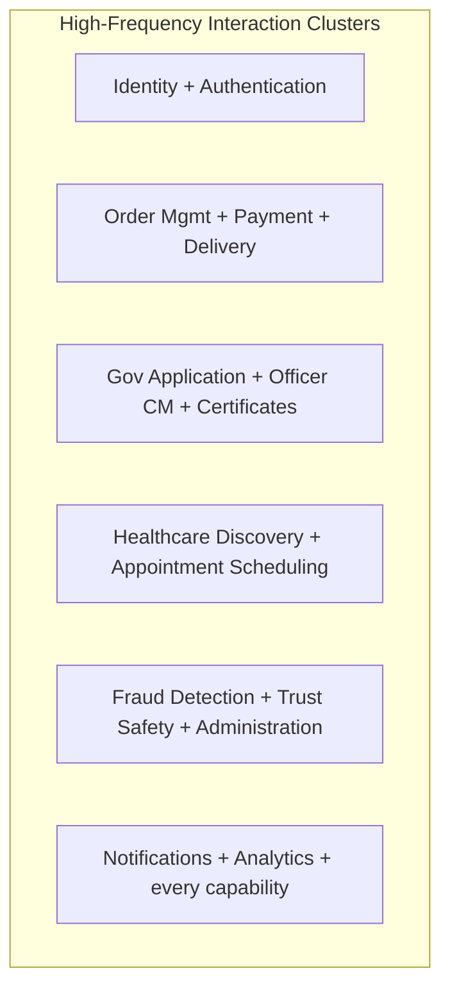

---

# Cross-Capability Workflows

### Citizen Onboarding

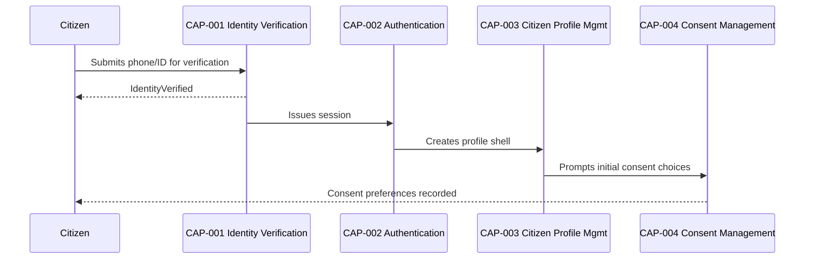

### Certificate Application

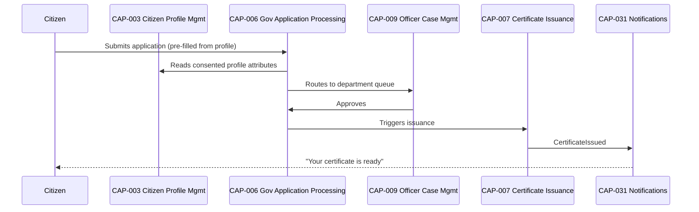

### Doctor Appointment

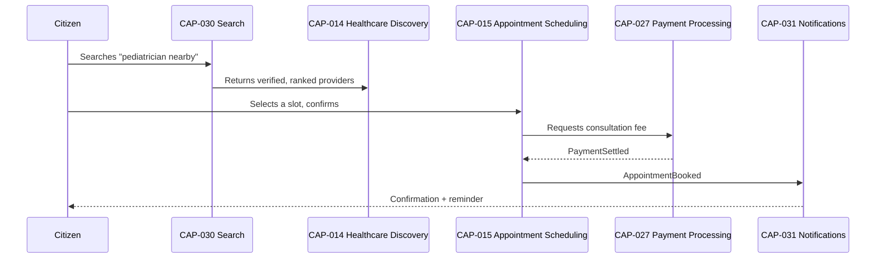

### Marketplace Purchase

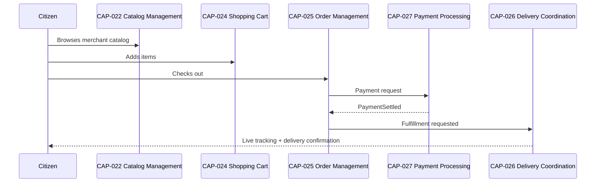

### Food Delivery

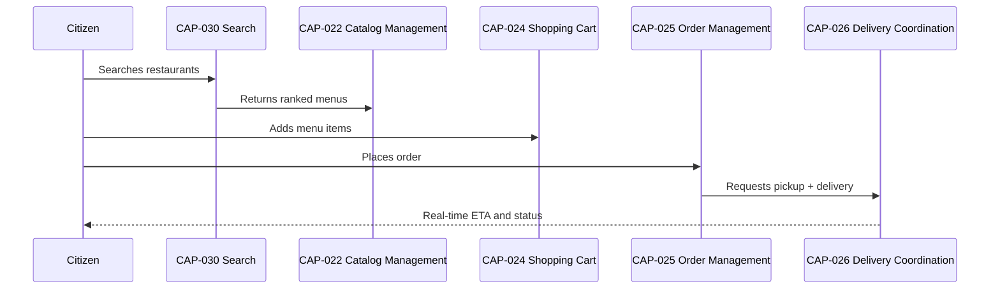

### Job Application

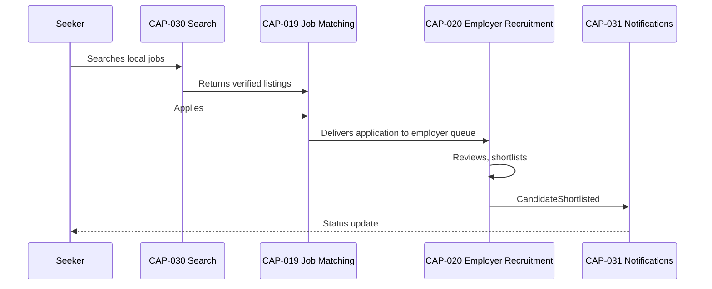

### Farmer Advisory

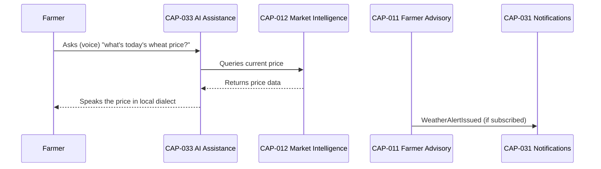

---

# Capability Ownership

### Ownership Roles

| Role | Responsibility |
|---|---|
| **Business Owner** | Accountable for the capability's business value and continued relevance — typically the vertical Head named in `ai-docs/53-business-domain-model.md`'s Domain Registry. |
| **Capability Owner** | Accountable for the capability's operational health, KPI trend, and maturity progression day to day — may be the same individual as the Business Owner for a narrow capability, or a delegated Product/Platform lead for a Shared/Enterprise capability. |

### Capability Ownership RACI

| Activity | Responsible | Accountable | Consulted | Informed |
|---|---|---|---|---|
| Capability definition/registration | Capability Owner | Business Owner | Domain Owner (`ai-docs/53`), Architecture Review Board | All Product |
| KPI target-setting | Capability Owner | Business Owner | Analytics Lead | Engineering Leadership Council |
| Capability maturity assessment | Capability Owner | CPO | Architecture Review Board | Business Owner |
| Capability retirement decision | Capability Owner | CPO | Business Owner, Architecture Review Board | All Engineering |
| Capability boundary change (split/merge) | Capability Owner + Domain Owner jointly | CPO | Architecture Review Board | All Product |
| Cross-capability workflow design | Product Owners of involved capabilities | CPO | UX Strategy Lead | Engineering Leadership |

### Decision Authority

Capability boundary decisions (create, split, merge, retire) follow the identical classification-based authority already established in `ai-docs/29-engineering-governance-decision-authority.md` — a new Enterprise or Business Capability requires Architecture Review Board plus CPO approval; a Supporting or Shared Capability boundary change requires the Capability Owner plus Principal Architect sign-off, mirroring the identical authority table already established for Domains in `ai-docs/53-business-domain-model.md`.

### Review Frequency

Every capability's ownership, health, and maturity are reviewed at the Quarterly Capability Review (see Governance below); a Mission Critical capability additionally receives a monthly health check.

### Approval Process

A new capability proposal follows the identical Domain Change Impact Assessment discipline already established in `ai-docs/53-business-domain-model.md`, extended here to name: the proposed Capability ID, its Classification and Tier, its Business Owner and Capability Owner, its dependency set, and its initial Success Metrics — no capability is registered without every field complete.

---

# Capability Lifecycle

Every capability moves through the same five stages — mirroring, but distinct from, the Module Lifecycle already established in `ai-docs/54-product-module-catalog.md` (a capability's lifecycle tracks business maturity, not release engineering).

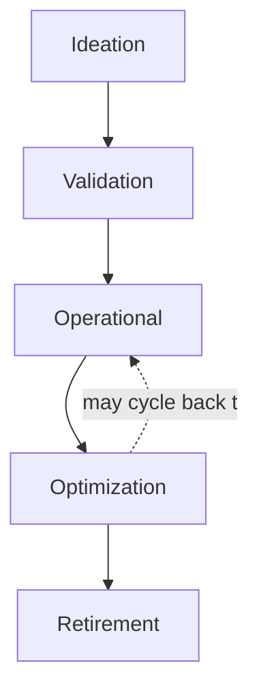

| Stage | Meaning | Exit Criterion |
|---|---|---|
| **Ideation** | A capability gap is identified; a business case is drafted. | Capability Onboarding Checklist (below) initiated. |
| **Validation** | The capability's business rules, dependencies, and success metrics are confirmed against real evidence (a pilot, a research finding). | Business Owner and Capability Owner both sign off; entry added to the Master Capability Registry. |
| **Operational** | The capability delivers real business value in production. | Success Metrics tracked for 2+ consecutive quarters. |
| **Optimization** | The capability is mature; focus shifts to refinement, resilience, and expanding reach. | Maturity Level 4+ sustained (see Capability Maturity Model). |
| **Retirement** | The capability's business need has ended or been fully absorbed by another capability. | Capability Retirement Checklist (below) fully satisfied. |

### Capability Lifecycle Checklist

- [ ] Business case documented with a named Business Owner before Ideation exits.
- [ ] At least one Business Domain (`ai-docs/53`), Persona (`ai-docs/52`), and Stakeholder (`ai-docs/51`) traced before Validation exits.
- [ ] Success Metrics defined before the capability enters Operational status — never retrofitted after launch.
- [ ] Dependency Map entry added and cross-checked against the Capability Dependency Map before Operational status.
- [ ] Criticality and initial Maturity Level scored before Operational status.
- [ ] A Capability Owner distinct from (or explicitly identical to) the Business Owner is named before Operational status.

---

# Capability KPIs

| Capability | KPI |
|---|---|
| Identity Verification | Verification completion rate; identity-fraud incident rate |
| Authentication | Authentication success rate; account-takeover incident rate |
| Citizen Profile Management | Profile-completeness rate; Cross-Vertical Adoption Depth |
| Consent Management | Consent-honoring compliance rate (target: 100%) |
| Delegated & Assisted Access | Delegated-flow completion rate |
| Government Application Processing | Government Efficiency KPI |
| Certificate Issuance | Application-to-issuance time |
| Grievance Resolution | Grievance resolution time; escalation rate |
| Officer Case Management | Audit-log completeness |
| Scheme Eligibility Assessment | Scheme-eligibility-to-application conversion |
| Farmer Advisory | Farmer Empowerment KPI |
| Market Intelligence | Monthly active price-check use |
| Direct-to-Buyer Marketplace | Listing-to-sale conversion |
| Healthcare Discovery | Search-to-booking conversion |
| Appointment Scheduling | Time-to-appointment; no-show rate |
| Provider Verification | Verification turnaround time |
| Education Discovery | Search-to-booking conversion |
| Scholarship Matching | Students connected to resources |
| Job Matching | Employment Generation KPI |
| Employer Recruitment | Fill-rate for posted roles |
| Merchant Onboarding | Business Enablement KPI |
| Catalog Management | Catalog freshness/accuracy rate |
| Inventory Management | Overselling incident rate (target: zero) |
| Shopping Cart | Cart-to-checkout conversion rate |
| Order Management | GMV with healthy contribution margin |
| Delivery Coordination | On-time delivery rate |
| Payment Processing | Transaction success rate |
| Refund Management | Refund processing time |
| Property Listing Management | Listing-to-transaction conversion |
| Search | Search-to-action conversion rate |
| Notifications | Delivery success rate |
| Recommendation Engine | Recommendation-acceptance rate |
| AI Assistance | Human-override-path availability (100% target) |
| Analytics | Dashboard adoption rate |
| Audit Logging | Audit-log completeness; tamper-detection incidents (target: zero) |
| Trust & Safety | Dispute-resolution time |
| Content Moderation | Moderation turnaround time |
| Fraud Detection | Fraud-incident rate; false-positive rate |
| Administration | Verification turnaround time |
| Configuration Management | Configuration-change deployment time |
| Help & Support | Support-ticket resolution time; CSAT |
| Settings Management | Accessibility-mode adoption rate |
| Group & Cooperative Enablement | Beneficiary reach amplified |
| Community Engagement | Feed engagement rate |
| Reputation & Rating Management | Verified-provider ratio |

---

# Capability Maturity Model

| Level | Name | Characteristics |
|---|---|---|
| **1 — Initial** | Capability exists informally, undocumented, delivered ad hoc within a module without a distinct business rule or owner. | High variance; no measurable Success Metrics tracked. |
| **2 — Managed** | Capability is named, owned, and has at least one tracked KPI, but its business rules are inconsistently enforced across consuming modules. | Basic registry entry exists; review cadence is reactive. |
| **3 — Defined** | Capability's business rules, dependencies, and KPIs are fully documented and consistently enforced everywhere it is consumed. | This document's full Catalog entry is complete and accurate. |
| **4 — Measured** | Capability health and criticality are actively tracked against explicit thresholds; deviations trigger a defined response. | Health Scoring (above) is live and reviewed quarterly at minimum. |
| **5 — Optimized** | Capability actively informs strategic planning (`ai-docs/48`); its evolution is evidence-driven and proactive rather than reactive. | Feeds Technology Radar and Strategic Theme planning directly. |

Arwal's target state at the completion of Stage 2 is **Level 3 (Defined)** for every Enterprise and Business Capability, with **Level 4 (Measured)** targeted as Stage 3 tooling investment matures — mirroring the identical staged-target pattern already established in `ai-docs/46-engineering-architecture-governance-standards.md`'s Architecture Maturity Model.

---

# Executive Dashboards

### CEO Dashboard
- District Trust Signal; Cross-Vertical Adoption Depth (rolled up across all Business Capabilities)
- Capability Heat Map summary (Mission Critical count at each Health Band)
- Government Efficiency KPI trend (civic capability cluster)
- Capability retirement/merge decisions this quarter

### CPO Dashboard
- Capability KPI summary across all Business and Enterprise Capabilities
- Persona-to-Capability and Stakeholder-to-Capability traceability gaps
- Capability Lifecycle pipeline (Ideation → Validation → Operational)
- Capability Health Band distribution

### Enterprise Architecture Dashboard
- Master Capability Registry status (Operational/Optimizing/Deprecated counts)
- Capability Dependency Map health (circular-dependency alerts)
- Capability Maturity Level distribution
- Boundary-leakage findings from Capability Review Board sessions

### Operations Dashboard
- Administration and Fraud Detection capability KPIs
- Verification turnaround and fraud-incident trend
- Support-ticket volume and resolution time

### Government Partners Dashboard
- Government Services capability cluster KPI trend (CAP-006 through CAP-009)
- Civic Audit Trail completeness (CAP-035)
- State-Level Integration readiness (CAP-048 status)

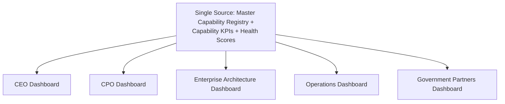

---

# AI Capability Strategy

### Capability Orchestration

AI Assistance (CAP-033) is the only capability permitted to orchestrate a workflow *across* multiple other capabilities on a citizen's behalf — and even then, it does so by explicitly invoking each contributing capability's own published behavior, never by reaching into another capability's internal state, mirroring the identical AI Orchestration discipline already established in `ai-docs/53-business-domain-model.md`.

### Automation Boundaries

Automation is permitted to accelerate a capability's routine, low-risk work (auto-categorizing a catalog listing, auto-routing a grievance) but never to make a final, unreviewable determination on a civic, financial, or reputation-affecting outcome — this boundary is absolute across every capability in this catalog, with no "low-risk capability" exception.

### Human Approval

Per the AI Principle already established in `ai-docs/00-project-vision.md`: no capability's AI-assisted feature may deny a citizen a service, block a transaction, or determine reputation without a human-reachable override path. Every capability carrying an AI Opportunity field above is subject to this requirement without exception.

### Responsible AI

Every capability's AI Opportunity is evaluated against the Anti-Discrimination Safeguards already established in `ai-docs/52-user-personas-user-segmentation.md` — no sensitive-attribute targeting, no proxy discrimination, an equal-quality floor across every persona segment, and an explainability requirement for any output materially affecting access to a service.

### Auditability

Every AI-influenced capability output that reaches a citizen is logged through Audit Logging (CAP-035), so a future review can reconstruct exactly what was recommended, by which model version, and what the human-override outcome was — an AI-influenced decision with no audit trail is treated with the same severity as an undocumented governance decision in `ai-docs/29-engineering-governance-decision-authority.md`.

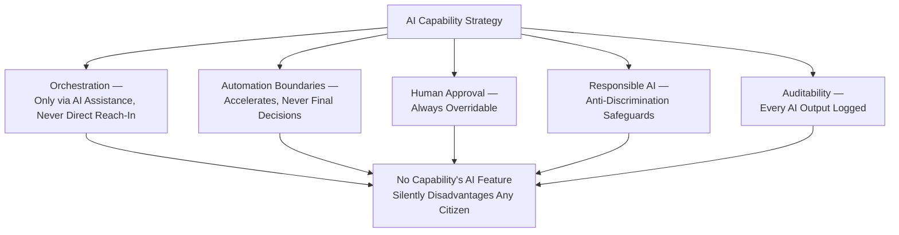

---

# Capability Anti-Patterns

| Anti-Pattern | Description | Why It's Rejected |
|---|---|---|
| **Duplicate capabilities** | Two capabilities independently solving the same business need (e.g., Healthcare and Education each building their own scheduling logic instead of sharing Appointment Scheduling). | Violates Reusable and Single Source of Truth above; the two implementations inevitably drift apart. |
| **Hidden capabilities** | A real business ability that exists in production but has no Registry entry, no owner, and no tracked KPI. | Makes gap analysis and expansion planning impossible; the exact failure this document exists to prevent. |
| **Technology-defined capabilities** | A capability named after a technology or component ("Redis Cache Capability") rather than a business ability. | Violates Technology Independent above; guarantees the capability's name becomes obsolete the moment the technology changes. |
| **Unowned capabilities** | A capability with no current, active named Business Owner or Capability Owner. | Violates Governed above; produces exactly the ambiguity `ai-docs/47-engineering-organizational-scaling-standards.md` names as a root cause of unresolved incidents. |
| **Overlapping capabilities** | Two capabilities whose Responsibilities and Business Rules meaningfully overlap, with no clear boundary between them. | Violates the Decomposition Guidance above; produces confusion about which capability's rule governs a given scenario. |
| **Capability sprawl** | New capabilities created for narrow, one-off needs that could reasonably have extended an existing capability. | Violates Stable Over Time and dilutes the Registry's usefulness as a durable reference. |

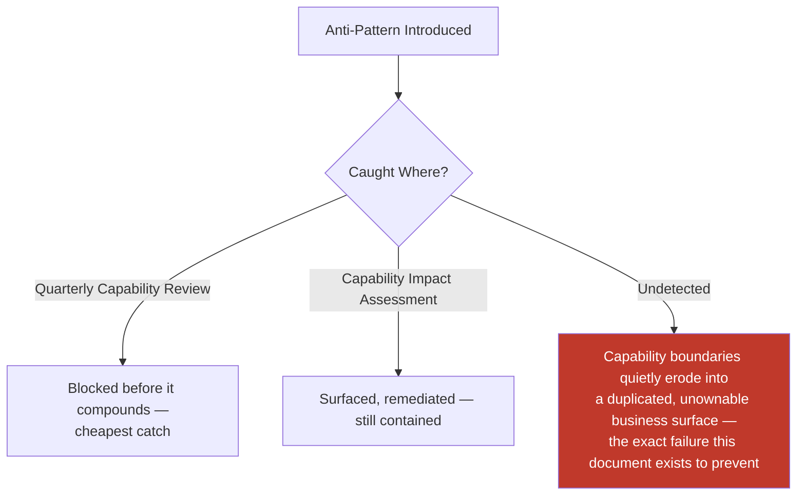

---

# Traceability

### Domain → Capability Matrix

| Domain (`ai-docs/53`) | Capability(ies) |
|---|---|
| Identity (DOM-001) | Identity Verification (001), Authentication (002), Delegated & Assisted Access (005) |
| Citizen (DOM-002) | Citizen Profile Management (003), Consent Management (004), Settings Management (042), Help & Support (041), Reputation & Rating Management (045, shared) |
| Government Services (DOM-003) | Government Application Processing (006), Certificate Issuance (007), Grievance Resolution (008), Officer Case Management (009), Scheme Eligibility Assessment (010, shared) |
| Agriculture (DOM-004) | Farmer Advisory (011), Market Intelligence (012), Direct-to-Buyer Marketplace (013), Scheme Eligibility Assessment (010, shared) |
| Healthcare (DOM-005) | Healthcare Discovery (014), Appointment Scheduling (015, shared) |
| Education (DOM-006) | Education Discovery (017), Scholarship Matching (018), Appointment Scheduling (015, shared) |
| Jobs (DOM-007) | Job Matching (019), Employer Recruitment (020) |
| Commerce Marketplace (DOM-008) | Merchant Onboarding (021), Catalog Management (022, shared), Inventory Management (023), Shopping Cart (024, shared), Order Management (025, shared) |
| Food Delivery (DOM-009) | Catalog Management (022, shared), Order Management (025, shared) |
| Grocery (DOM-010) | Catalog Management (022, shared), Inventory Management (023, shared), Order Management (025, shared) |
| Logistics (DOM-011) | Delivery Coordination (026) |
| Property (DOM-012) | Property Listing Management (029) |
| Payments (DOM-013) | Payment Processing (027), Refund Management (028), Micro-Lending (046, future) |
| Community (DOM-014) | Group & Cooperative Enablement (043), Community Engagement (044) |
| Search (DOM-015) | Search (030), Recommendation Engine (032, shared) |
| Notifications (DOM-016) | Notifications (031) |
| AI Assistant (DOM-017) | AI Assistance (033), Recommendation Engine (032, shared) |
| Analytics (DOM-018) | Analytics (034) |
| Administration (DOM-019) | Provider Verification (016), Administration (039) |
| Trust & Safety (DOM-020) | Trust & Safety (036), Content Moderation (037), Fraud Detection (038), Reputation & Rating Management (045) |

### Module → Capability Matrix

| Module (`ai-docs/54`) | Capability(ies) Delivered |
|---|---|
| MOD-001 Identity & Verification | Identity Verification (001), Authentication (002) |
| MOD-002 Citizen Profile | Citizen Profile Management (003), Reputation & Rating Management (045) |
| MOD-003 Delegated & Assisted Access | Delegated & Assisted Access (005) |
| MOD-004 Certificates | Certificate Issuance (007) |
| MOD-005 Applications | Government Application Processing (006) |
| MOD-006 Grievances | Grievance Resolution (008) |
| MOD-007 Officer Case Management | Officer Case Management (009), Audit Logging (035, shared) |
| MOD-008 Mandi Prices | Market Intelligence (012) |
| MOD-009 Weather Advisory | Farmer Advisory (011) |
| MOD-010 Government Schemes Discovery | Scheme Eligibility Assessment (010) |
| MOD-011 Direct-to-Buyer Produce Marketplace | Direct-to-Buyer Marketplace (013) |
| MOD-012 Doctor Directory | Healthcare Discovery (014) |
| MOD-013 Appointment Booking | Appointment Scheduling (015) |
| MOD-016 Tutors | Education Discovery (017) |
| MOD-018 Scholarships & Opportunities | Scholarship Matching (018) |
| MOD-019 Job Search | Job Matching (019) |
| MOD-020 Employer Portal | Employer Recruitment (020) |
| MOD-021 Merchant Store | Merchant Onboarding (021), Catalog Management (022), Inventory Management (023) |
| MOD-022 Cart | Shopping Cart (024) |
| MOD-023/025/027 Orders | Order Management (025) |
| MOD-028 Delivery Tracking | Delivery Coordination (026) |
| MOD-030/031 Property | Property Listing Management (029) |
| MOD-032 Wallet | Payment Processing (027) |
| MOD-034 Payouts & Refunds | Refund Management (028) |
| MOD-035 NGO & SHG Groups | Group & Cooperative Enablement (043) |
| MOD-037 Search | Search (030), Recommendation Engine (032) |
| MOD-038 Notifications | Notifications (031) |
| MOD-039 AI Assistant | AI Assistance (033) |
| MOD-040 Analytics & Reporting | Analytics (034) |
| MOD-041 Merchant/Provider Verification | Provider Verification (016) |
| MOD-042 Policy & Fraud Enforcement Console | Fraud Detection (038), Administration (039) |
| MOD-043/044 Trust & Safety | Trust & Safety (036), Content Moderation (037), Reputation & Rating Management (045) |
| MOD-045 Settings | Settings Management (042), Consent Management (004) |
| MOD-046 Help Center & Support | Help & Support (041) |

### Persona → Capability Matrix

| Persona (`ai-docs/52`) | Primary Capability(ies) |
|---|---|
| PER-001 Rahul | Catalog Management, Shopping Cart, Order Management, Payment Processing |
| PER-002 Meena | Market Intelligence, Farmer Advisory, Scheme Eligibility Assessment, AI Assistance |
| PER-003 Aisha | Education Discovery, Scholarship Matching |
| PER-006 Dr. Kavita | Healthcare Discovery, Appointment Scheduling |
| PER-010 Suresh | Merchant Onboarding, Catalog Management, Inventory Management |
| PER-012 Vikram | Delivery Coordination |
| PER-015 Rakesh | Job Matching |
| PER-016 Neha | Employer Recruitment |
| PER-017 Priya | Government Application Processing, Officer Case Management |
| PER-019 Devendra | Delegated & Assisted Access, Certificate Issuance |
| PER-021 Lakshmi | AI Assistance, Consent Management |
| PER-022 Radha's SHG | Group & Cooperative Enablement |

### Stakeholder → Capability Matrix

| Stakeholder (`ai-docs/51`) | Primary Capability(ies) |
|---|---|
| STK-001 Citizens | Identity Verification, Citizen Profile Management, Search, Notifications |
| STK-002 Farmers | Market Intelligence, Farmer Advisory, Direct-to-Buyer Marketplace |
| STK-006 Doctors | Healthcare Discovery, Appointment Scheduling |
| STK-010 Local Businesses | Merchant Onboarding, Catalog Management |
| STK-012 Delivery Partners | Delivery Coordination |
| STK-017 Government Officials | Government Application Processing, Officer Case Management |
| STK-020/021 Banks/Payment Providers | Payment Processing, Refund Management |
| STK-029 Senior Citizens | Delegated & Assisted Access |
| STK-040 Operations | Administration, Provider Verification, Fraud Detection |

### Strategic Goal → Capability Matrix

| Strategic Objective (`ai-docs/50-product-vision-business-strategy.md`) | Supporting Capability(ies) |
|---|---|
| Citizen Adoption | Search, Recommendation Engine, Citizen Profile Management |
| Service Digitization | Government Application Processing, Certificate Issuance, Officer Case Management |
| Economic Growth | Order Management, Payment Processing, Merchant Onboarding |
| Farmer Empowerment | Farmer Advisory, Market Intelligence, Direct-to-Buyer Marketplace, Scheme Eligibility Assessment |
| Healthcare Access | Healthcare Discovery, Appointment Scheduling, Provider Verification |
| Education Improvement | Education Discovery, Scholarship Matching |
| Employment Generation | Job Matching, Employer Recruitment |
| Business Enablement | Merchant Onboarding, Catalog Management, Inventory Management |
| Government Efficiency | Government Application Processing, Officer Case Management, Audit Logging |

---

# Governance

### Capability Review Board

A dedicated **Capability Review Board** — chaired by the Chief Enterprise Architect, with the CPO, Principal Architects, and rotating Business Owners as members — holds approval authority for any new Enterprise or Business Capability, any capability split/merge, and any capability retirement, mirroring the identical Board structure already established for Architecture (`ai-docs/46`) and Domains (`ai-docs/53`). The Board meets monthly, with ad hoc sessions for a Mission Critical capability's Health Band downgrade to "At Risk" or "Failing."

### Versioning Policy

Every capability's Registry entry carries an implicit version via its last-updated date; a material change to a capability's Purpose, Classification, or Business Rules is treated as a new version requiring Capability Review Board sign-off, never a silent in-place edit — mirroring the identical Versioning discipline already established in `ai-docs/49-engineering-handbook-governance-evolution-standards.md`.

### Naming Standards

Capability names are noun phrases describing an *ability*, never a technology, a team, or a UI screen ("Payment Processing," never "Wallet Service" or "Payments Team's Backlog"). A capability name is chosen so that a CEO, a government partner, and an engineer would all recognize it as describing the same thing.

### Change Management

Every capability boundary or business-rule change is documented per a **Capability Impact Assessment**, mirroring the identical Domain Change Impact Assessment already established in `ai-docs/53-business-domain-model.md`:

| Field | Description |
|---|---|
| **Capability(ies) Affected** | The capability being changed and every capability with a dependency relationship to it. |
| **Nature of Change** | Boundary shift, business-rule addition/removal, ownership transfer, retirement. |
| **Upstream Impact** | Which capabilities this one depends on are affected. |
| **Downstream Impact** | Which capabilities depending on this one are affected. |
| **Module/Domain Impact** | Whether any Module (`ai-docs/54`) or Domain (`ai-docs/53`) mapping changes. |
| **Migration Plan** | How dependent capabilities adapt without a coordinated, simultaneous rewrite. |
| **Approval Authority** | Capability Review Board for Enterprise/Business tier; Capability Owner + Principal Architect for Supporting/Shared tier. |

### Capability Audits

Every capability is audited semi-annually against its stated Business Rules, Success Metrics, and Dependency Map entries — a capability found to be silently violating one of its own stated Business Rules (e.g., Inventory Management allowing an oversell) is treated as a Failing Health Band finding, escalated immediately per the Capability Heat Map's Health Scoring above.

### Impact Assessment

No capability boundary, business-rule, or ownership change is implemented without a completed Capability Impact Assessment, per the identical non-negotiable discipline already established for Domain changes in `ai-docs/53-business-domain-model.md`.

### Capability Reuse Strategy

Before any new capability is proposed, the proposer must demonstrate — as part of the Ideation stage — that no existing capability in the Master Capability Registry can be reasonably extended to cover the need. A genuinely novel need is registered as a new capability only after this reuse check fails explicitly, mirroring the identical New Document/New Domain Creation Criteria already established in `ai-docs/49` and `ai-docs/53`.

### Capability Consolidation Strategy

Two capabilities showing sustained, high-frequency interaction (per the Capability Interaction Matrix above) and increasingly overlapping Business Rules are candidates for merge — evaluated at the Quarterly Capability Review using the identical Merge Criteria already established for Domains in `ai-docs/53-business-domain-model.md`.

### Capability Retirement Criteria

A capability is retired when: (1) its business need is confirmed absent for two consecutive Quarterly Capability Reviews, or (2) it has been fully absorbed into another capability via a formal Merge decision. Retirement follows the identical Capability Retirement Checklist below.

### Capability Retirement Checklist

- [ ] Business need confirmed absent, or merge target confirmed, for two consecutive Quarterly Capability Reviews.
- [ ] Every dependent capability's Dependency Map entry updated to remove or redirect the dependency.
- [ ] A migration path communicated to every affected Module Owner (`ai-docs/54`), per `ai-docs/34-engineering-communication-standards.md`'s classification tiers.
- [ ] Capability ID archived, never reused, per the Archive, Never Delete principle established throughout this handbook.
- [ ] Historical data-retention obligations (`ai-docs/10-security-standards.md`) satisfied before any underlying data is purged.

### Business Capability Glossary

| Term | Definition |
|---|---|
| **Capability** | A stable ability the business has, independent of technology, team, or UI. |
| **Business Rule** | A non-negotiable constraint a capability enforces regardless of how it is implemented. |
| **Criticality** | The business consequence of a capability's failure. |
| **Maturity** | How developed and evidence-backed a capability's operation is today. |
| **Health** | A capability's current operating condition against its own stated Success Metrics. |
| **Fan-In** | The count of other capabilities that depend on a given capability — a proxy for review rigor required on any change. |
| **Ideation** | The earliest lifecycle stage, where a capability gap is identified but not yet validated. |

### Capability Readiness Criteria

A capability is eligible to move from Validation to Operational status only when: its Business Rules are fully documented, its dependencies are registered in the Dependency Map, its Success Metrics are defined (never retrofitted), and a named Business Owner and Capability Owner are both confirmed.

### Capability Review Checklist

Every capability proposal, boundary change, or retirement is checked against the following before it is considered catalog-compliant:

- [ ] **Traceable to a Business Domain, Module, Persona, and Stakeholder** — never invented independently.
- [ ] **Business-First and Technology Independent** — the name and description contain no technology, service, or UI reference.
- [ ] **Single Responsibility respected** — the capability describes one coherent business ability.
- [ ] **Dependencies documented** — reflected accurately in the Capability Dependency Map.
- [ ] **Business Rules explicitly stated** — never left implicit.
- [ ] **Success Metrics defined before Operational status** — never retrofitted after launch.
- [ ] **Criticality and Maturity scored** — using the explicit scoring dimensions above, never assigned by impression.
- [ ] **AI Opportunities, if any, carry a human-override path** — per AI Capability Strategy above.
- [ ] **Accessibility, Privacy, and Security considerations stated** — per `ai-docs/12` and `ai-docs/10`.
- [ ] **No anti-pattern present** — no duplicate, hidden, technology-defined, unowned, overlapping, or sprawling capability.
- [ ] **No duplication of Domain Model, Module Catalog, Persona, or Stakeholder governance** — any such concern deferred entirely to its owning phase document.

A capability failing any item above is not considered catalog-compliant until resolved — this checklist carries the same non-negotiable authority as every other review checklist established in the preceding phase documents.

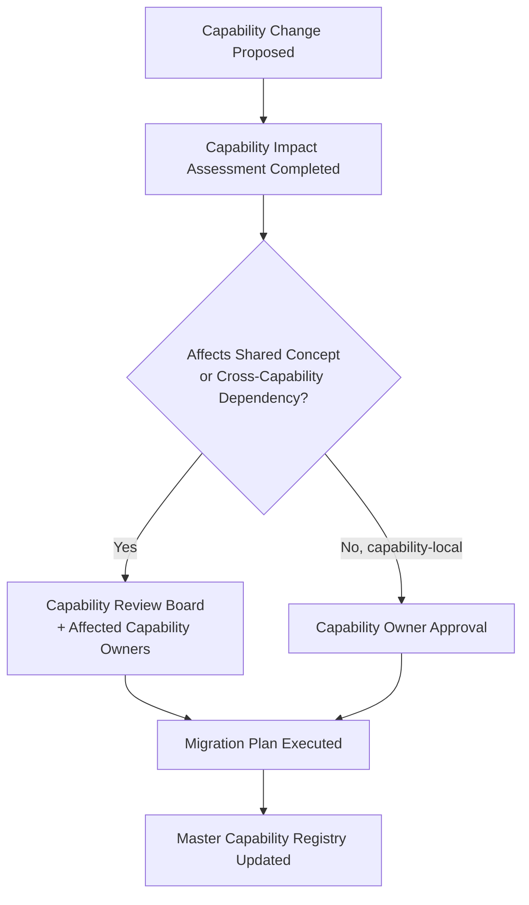

---

# Relationship with Previous Standards

### Project Vision & Product Goals

`ai-docs/00-project-vision.md` and `ai-docs/01-product-goals.md` establish the founding mission and measurable goals every capability in this catalog ultimately serves — no capability exists that cannot trace, through a Strategic Objective, back to a commitment already made there.

### Stakeholder Analysis & User Personas

`ai-docs/51-stakeholder-analysis.md` and `ai-docs/52-user-personas-user-segmentation.md` establish who Arwal serves and what each stakeholder/persona needs. Every capability's Related Personas and Related Stakeholders fields trace directly to those registries, never inventing a new stakeholder or persona independently.

### Business Domain Model

`ai-docs/53-business-domain-model.md` establishes who owns each business concern and its organizational boundary. This document's capabilities are the *abilities* those domains realize — a domain typically realizes several capabilities, and this document never redraws a domain boundary, only expresses what that domain-owned territory can *do*.

### Product Module Catalog

`ai-docs/54-product-module-catalog.md` establishes the user-visible product surface a citizen actually opens. This document's capabilities are the stable business abilities those modules express to a citizen through a specific UI and technology — a module changes when navigation or UX changes; the capability beneath it does not.

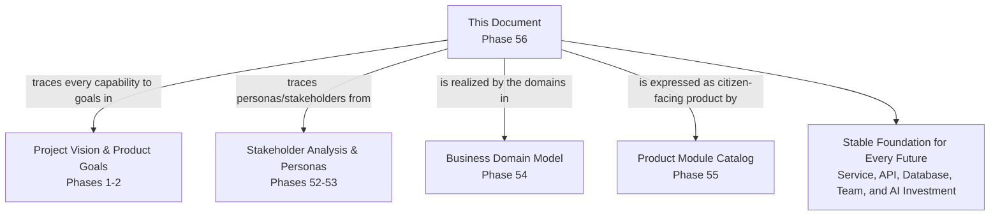

---

# Closing Statement

> **Callout — Closing Statement**
> A business domain tells the organization who owns a concern; a product module tells a citizen what they tap to get something done; a business capability tells everyone — the CEO, the government partner, the investor, the architect, and the engineer — what Arwal can actually *do*, in language that survives every technology migration, every reorganization, and every UI redesign still to come across this handbook's remaining phases. Verify an identity. Process a government application. Move money safely. Resolve a dispute fairly. These abilities do not change because a framework was replaced or a team was restructured — they are the stable bedrock every future service, API, schema, and AI investment is built on top of, and the durable unit against which Arwal can honestly ask, before ever entering a second district: do we actually have everything we need to do this again, somewhere else, for someone new? Where a future phase must deviate from a capability boundary, ownership, or classification stated here, that deviation is made explicitly — through the Capability Review Board's approval workflow above — never silently, and never by default.

This document, `ai-docs/55-business-capability-map.md`, is Phase 56 of approximately 420. Every future service, API, database, team structure, and AI investment is expected to trace back to a capability defined here, or to justify its deviation in writing.

**End of Phase 56 — `ai-docs/55-business-capability-map.md`**