# User Journey Standards

**Document:** `ai-docs/56-user-journey-standards.md`
**Project:** Arwal — The District Super App
**Stage:** 2 — Product & Business Strategy
**Phase:** 57 — User Journey Standards
**Status:** Approved for Product & Engineering Reference
**Audience:** CEO, CPO, CTO, UX Director, Enterprise Architect, Service Designers, Customer Journey Architects, Accessibility Specialists, Government Digital Transformation Partners, AI Product Strategists, Product Managers, Engineering Directors

> **Callout — Purpose of This Document**
> `ai-docs/00-project-vision.md` established why Arwal exists. `ai-docs/01-product-goals.md` translated that into measurable goals. `ai-docs/50-product-vision-business-strategy.md` established what Arwal is. `ai-docs/51-stakeholder-analysis.md` established who Arwal serves. `ai-docs/52-user-personas-user-segmentation.md` made those stakeholders specific, evidence-grounded people. `ai-docs/53-business-domain-model.md` established the discrete business domains Arwal is made of. `ai-docs/54-product-module-catalog.md` established the user-visible product modules citizens actually open. `ai-docs/55-business-capability-map.md` established the stable business abilities underneath all of it. None of those documents answers the question every future UX flow, wireframe, prototype, and usability test now depends on: **what does it actually feel like, step by step, decision by decision, for Meena to check a mandi price, for Devendra's son to renew a certificate, for a fraudulent listing to be rejected — from the moment the need arises to the moment it is resolved, including every place it could go wrong?** This document is that answer — the authoritative User Journey Standards every future UX, prototyping, and usability decision traces back to.

---

# Purpose of this Document

### Why User Journeys Are a Distinct Layer

`ai-docs/55-business-capability-map.md` established that a Business Capability answers "what can Arwal do?" independent of any technology, team, or UI. `ai-docs/54-product-module-catalog.md` established that a Product Module answers "what does a citizen open?" A **User Journey** answers a third, distinct question neither layer is built to answer: **what does it feel like to actually go through this, from a real person's point of view, including the moment they hesitate, the moment they get confused, and the moment they finally trust the result?** A capability can be perfectly defined and a module perfectly scoped, and the experience built on top of them can still fail a citizen — through too many steps, an unclear error, a dead end, or a moment of anxiety nobody designed for. Journeys exist to make that experience itself a governed, citable, testable artifact, exactly as capabilities and modules already are for their own layers.

### The Relationship Chain

This document occupies a specific, deliberate position in the chain established across Stage 2 — it is the layer where business architecture finally becomes human experience:

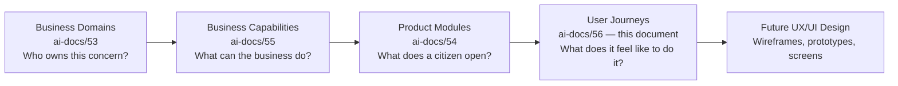

| Layer | Question It Answers | Granularity | Owner |
|---|---|---|---|
| Business Domain (`ai-docs/53`) | Who owns this? | Coarse | Domain Owner |
| Business Capability (`ai-docs/55`) | What can be done? | Medium-coarse | Capability Owner |
| Product Module (`ai-docs/54`) | What does a citizen open? | Medium | Product Owner |
| **User Journey** (this document) | What does it feel like, step by step? | Fine — sequence, decision, emotion | Journey Owner |
| Future UX/UI | What does it look like on a screen? | Finest | Design |

> **Callout — A Journey Is Not a Wireframe**
> This document deliberately excludes UI screens, page layouts, APIs, databases, and implementation, per the Document Purpose established for this phase. A journey describes the *shape of the experience* — the goal, the sequence, the decision points, the failure paths, the emotional arc — never the pixels. This is the identical discipline `ai-docs/53-business-domain-model.md` applies to keep business concerns pre-technical, applied here to keep experience design pre-visual: a journey that has already decided where a button goes has skipped the thinking a journey exists to force.

### Why This Matters at Arwal's Scale

Without an explicit, governed journey layer:

1. **Usability failures are discovered in production, not design.** A capability and a module can both be "done" while the actual sequence a citizen must follow is needlessly long, confusing, or anxiety-inducing — and nobody catches it until adoption data shows a drop-off, per the Journey Analytics discipline below.
2. **Accessibility and inclusion get bolted on, not designed in.** `ai-docs/12-accessibility-standards.md` and `ai-docs/52-user-personas-user-segmentation.md` both establish accessibility as a floor — but a floor only holds if the *journey itself* was designed for PER-019 Devendra's assisted flow or PER-021 Lakshmi's voice-first flow from the first step, not retrofitted after a sighted-user journey was already locked in.
3. **Emotional experience is invisible without being named.** A citizen filing a grievance is anxious in a way a citizen browsing a restaurant menu is not — a journey standard that never names this cannot design for it, per the Emotional Experience discipline below.
4. **AI assistance has no defined insertion points.** `ai-docs/55`'s AI Assistance capability (CAP-033) needs to know *where in a journey* a citizen is most likely to need help, most likely to be confused, or most likely to benefit from a shortcut — a journey map is what makes that insertion point explicit and reviewable rather than guessed.
5. **Expansion inherits a felt experience, not just a feature list.** Per `ai-docs/50-product-vision-business-strategy.md`'s Strategic Expansion Principles, a second district must replicate not only Arwal's capabilities and modules but the *quality of experience* that earned the founding district's trust — a journey catalog is what makes that experience specifiable and testable elsewhere.

### Scope Boundary

This document does not redefine Business Domains (`ai-docs/53`), Business Capabilities (`ai-docs/55`), Product Modules (`ai-docs/54`), Personas (`ai-docs/52`), or Stakeholders (`ai-docs/51`) — every one of those remains fully authoritative for its own layer, cited here by reference. This document's exclusive territory is **journey identity, sequence, decision points, failure and recovery paths, emotional experience, and traceability** — the input every future UX, prototyping, and usability-testing phase document consumes, never redefines from scratch.

---

# Journey Design Philosophy

Every principle below exists because a journey designed carelessly does not fail abstractly — it fails a specific citizen, at a specific moment, for a specific reason this document exists to prevent.

### Citizen-First

**Why it exists:** A journey exists to get a citizen (or merchant, provider, officer) to their goal — never to expose every feature a module happens to offer. Where a journey step serves an internal convenience (a data field useful to Analytics, an upsell opportunity) rather than the citizen's own goal, that step is either deferred, made optional, or removed, mirroring the Citizen-First tie-breaker already established throughout `ai-docs/51-stakeholder-analysis.md` and `ai-docs/52-user-personas-user-segmentation.md`.

### Task Completion Over Feature Exposure

**Why it exists:** A journey is measured by whether the citizen's task got done, not by how much of the product they were shown along the way. A journey that maximizes screen time or feature discovery at the expense of a fast, clear path to completion has optimized for the wrong outcome, per the identical Simplicity as a Design Discipline principle already established in `ai-docs/00-project-vision.md`'s Product Culture.

### Minimal Cognitive Load

**Why it exists:** Every decision a journey asks a citizen to make is a real cost — attention, confidence, time — and that cost falls hardest on exactly the citizens Arwal exists to serve first: a first-generation smartphone user, a low-literacy farmer, an anxious elderly citizen. A journey asks only the questions it genuinely needs answered, in the order the citizen would naturally think of them, never front-loading complexity a later, simpler step could resolve.

### Progressive Disclosure

**Why it exists:** A journey reveals complexity only as it becomes relevant — an advanced option, a rarely-needed field, or a power-user shortcut is available but never forced on a citizen who does not yet need it, mirroring the Progressive Complexity product principle already established in `ai-docs/00-project-vision.md`: "the interface is simple by default and reveals power-user depth only as needed."

### Accessibility by Default

**Why it exists:** A journey is not accessible because an accessible *component* was used somewhere inside it — it is accessible because the sequence, the decision points, and the recovery paths were designed, from the first step, for a citizen using a screen reader, a citizen with low vision, or a citizen navigating by voice, per the non-negotiable floor already established in `ai-docs/12-accessibility-standards.md`. Accessibility is a property of the journey's shape, not a pass applied afterward.

### Trust and Transparency

**Why it exists:** A citizen who does not understand what will happen next, what data is being used, or why a decision was made will not trust the outcome even if it is correct. Every journey states, at each consequential step, what happens next and why — never leaving a citizen to guess whether an action is reversible, whether money has moved, or whether a submission actually went through.

### Privacy-First

**Why it exists:** A journey requests only the data it genuinely needs for the citizen's stated goal, at the moment it is needed — never speculatively, never "while we're at it," per the identical Data Minimization & Consent principle already established in `ai-docs/00-project-vision.md`'s Security Vision and operationalized by Consent Management (CAP-004) in `ai-docs/55-business-capability-map.md`.

### Error Recovery

**Why it exists:** A citizen will make mistakes, lose connectivity, and abandon a journey partway through — this is a certainty, not an edge case. Every journey defines an explicit recovery path for every failure scenario it names, per the No Dead Ends product principle already established in `ai-docs/00-project-vision.md`: "every user flow has a clear resolution path; nothing terminates in ambiguity."

### Offline Resilience

**Why it exists:** A meaningful share of Arwal's population experiences intermittent 2G/3G connectivity, per `ai-docs/01-product-goals.md`'s Target Audience. A journey that assumes constant connectivity fails exactly the citizens most dependent on Arwal's civic and commercial value — every journey below states explicitly which of its steps must degrade gracefully, queue for later sync, or remain available offline.

### Consistency

**Why it exists:** A citizen who has learned how "track an order" works in Marketplace should not have to relearn it in Food Delivery — journeys reuse the same interaction shapes for the same category of task across every module that has one, mirroring the identical Consistency principle already established in `ai-docs/54-product-module-catalog.md`'s Module Design Philosophy.

### Human Assistance

**Why it exists:** No journey is ever the only path to a citizen's goal — a human-assisted alternative (a field agent, a phone/IVR support line, a family member's delegated access) is always reachable from within the journey, per the Assisted/Delegated Access commitment already established in `ai-docs/00-project-vision.md`'s Accessibility Vision. A journey that quietly assumes full digital self-sufficiency has excluded a real, substantial share of Arwal's population.

### Inclusive Design

**Why it exists:** A journey is designed *with* the full range of literacy, language, device, and ability variation present in Arwal's actual population, per the Inclusive Design principle already established in `ai-docs/12-accessibility-standards.md` and `ai-docs/52-user-personas-user-segmentation.md` — never designed for an assumed "average" citizen and patched with exceptions later.

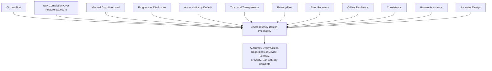

> **Callout — The One-Sentence Journey Philosophy**
> *"A journey is not designed until it has been designed for the citizen most likely to struggle with it — every citizen who finds it easier after that is a bonus, never the baseline."*

---

# User Journey Hierarchy

Every journey in the Master Journey Registry is classified into exactly one of ten categories, mirroring — but never duplicating — the classification disciplines already established for Domains, Modules, and Capabilities.

| Classification | Definition | Characteristic |
|---|---|---|
| **Core Citizen Journeys** | Foundational journeys every citizen passes through regardless of which vertical they use first. | High priority; gates access to every other journey. |
| **Commerce Journeys** | Journeys realizing Commerce, Food, and Grocery value exchange. | High-frequency, transactional. |
| **Healthcare Journeys** | Journeys realizing discovery and booking of healthcare services. | High-stakes; time-sensitive. |
| **Education Journeys** | Journeys realizing tutor, coaching, and scholarship discovery. | Moderate frequency; often minor-involving. |
| **Employment Journeys** | Journeys realizing job discovery and recruitment. | Bursty, need-triggered. |
| **Government Service Journeys** | Journeys realizing civic application, certificate, and grievance flows. | Highest trust sensitivity; regulated. |
| **Community Journeys** | Journeys realizing group/cooperative and community engagement. | Field-agent-assisted; collective. |
| **Administrative Journeys** | Journeys realizing internal verification, moderation, and operational workflows. | Officer/operator-facing, not citizen-facing. |
| **AI-Assisted Journeys** | Journeys where conversational AI mediates or accelerates another journey. | Cross-cutting; always paired with a human-override path. |
| **Future Journeys** | Journeys anticipated by Arwal's roadmap but not yet active. | Tracked for readiness, not yet resourced. |

```mermaid
graph TD
    Root[Arwal User Journey Hierarchy] --> Core[Core Citizen Journeys]
    Root --> Commerce[Commerce Journeys]
    Root --> Health[Healthcare Journeys]
    Root --> Edu[Education Journeys]
    Root --> Employ[Employment Journeys]
    Root --> Gov[Government Service Journeys]
    Root --> Comm[Community Journeys]
    Root --> Admin[Administrative Journeys]
    Root --> AI[AI-Assisted Journeys]
    Root --> Future[Future Journeys]

    Core --> C1[Citizen Registration]
    Core --> C2[Identity Verification]
    Core --> C3[Profile Completion]
    Core --> C4[Search]
    Core --> C5[Notification Management]
    Core --> C6[Help and Support]
    Core --> C7[Settings Management]
    Core --> C8[Payment]
    Core --> C9[Refund]

    Commerce --> M1[Merchant Onboarding]
    Commerce --> M2[Store Management]
    Commerce --> M3[Marketplace Purchase]
    Commerce --> M4[Food Ordering]
    Commerce --> M5[Grocery Ordering]
    Commerce --> M6[Delivery Tracking]
    Commerce --> M7[Property Search]
    Commerce --> M8[Property Listing]

    Health --> H1[Doctor Search]
    Health --> H2[Appointment Booking]
    Health --> H3[Medicine Discovery]

    Edu --> E1[Tutor Search]
    Edu --> E2[Scholarship Discovery]

    Employ --> J1[Job Search]
    Employ --> J2[Job Application]

    Gov --> G1[Government Certificate Application]
    Gov --> G2[Scheme Eligibility Check]
    Gov --> G3[Grievance Submission]

    Comm --> CM1[Community Participation]

    AI --> A1[AI Assistant Interaction]
```

---

# Master Journey Registry

Every journey carries a permanent, sequential, never-reused Journey ID, mirroring the identical Registry discipline already established for Domains, Modules, and Capabilities.

| Journey ID | Journey Name | Classification | Primary Persona | Business Owner | Journey Owner | Status | Criticality | Frequency |
|---|---|---|---|---|---|---|---|---|
| JRN-001 | Citizen Registration | Core Citizen | PER-001 Rahul | CPO | Citizen Experience PM | Active | Mission Critical | Once per citizen |
| JRN-002 | Identity Verification | Core Citizen | PER-019 Devendra | Head of Platform Engineering | Platform PM | Active | Mission Critical | Once, re-triggered rarely |
| JRN-003 | Profile Completion | Core Citizen | PER-001 Rahul | CPO | Citizen Experience PM | Active | High | Once, edited occasionally |
| JRN-004 | Government Certificate Application | Government Service | PER-019 Devendra | Head of Government Partnerships | Civic Services PM | Active | Mission Critical | Occasional |
| JRN-005 | Scheme Eligibility Check | Government Service | PER-002 Meena | Head of Agriculture Vertical | Agriculture PM | Active | High | Occasional |
| JRN-006 | Grievance Submission | Government Service | PER-017 Priya (recipient) | Head of Government Partnerships | Civic Services PM | Active | High | Rare |
| JRN-007 | Doctor Search | Healthcare | PER-006 Dr. Kavita (supply) / Citizen (demand) | Head of Healthcare Vertical | Healthcare PM | Active | Mission Critical | Occasional to frequent |
| JRN-008 | Appointment Booking | Healthcare | PER-001 Rahul | Head of Healthcare Vertical | Healthcare PM | Active | Mission Critical | Occasional |
| JRN-009 | Medicine Discovery | Healthcare | PER-009 Vikash (supply) | Head of Healthcare Vertical | Healthcare PM | Active | High | Occasional |
| JRN-010 | Tutor Search | Education | PER-003 Aisha | Head of Education Vertical | Education PM | Active | High | Occasional |
| JRN-011 | Scholarship Discovery | Education | PER-003 Aisha | Head of Education Vertical | Education PM | Active | Medium | Rare |
| JRN-012 | Job Search | Employment | PER-015 Rakesh | Head of Jobs Vertical | Jobs PM | Active | High | Frequent during search |
| JRN-013 | Job Application | Employment | PER-015 Rakesh | Head of Jobs Vertical | Jobs PM | Active | High | Frequent during search |
| JRN-014 | Merchant Onboarding | Commerce | PER-010 Suresh | Head of Merchant Success | Marketplace PM | Active | Mission Critical | Once per merchant |
| JRN-015 | Store Management | Commerce | PER-010 Suresh | Head of Merchant Success | Marketplace PM | Active | High | Daily |
| JRN-016 | Marketplace Purchase | Commerce | PER-001 Rahul | Head of Merchant Success | Marketplace PM | Active | Mission Critical | Daily/Weekly |
| JRN-017 | Food Ordering | Commerce | PER-001 Rahul | Head of Food & Grocery | Food Delivery PM | Active | Mission Critical | Daily |
| JRN-018 | Grocery Ordering | Commerce | PER-021 Lakshmi | Head of Food & Grocery | Grocery PM | Active | Mission Critical | Weekly |
| JRN-019 | Property Search | Commerce | PER-014 Farida | Head of Classifieds/Property | Property PM | Active | Medium | Bursty |
| JRN-020 | Property Listing | Commerce | PER-013 Ashok | Head of Classifieds/Property | Property PM | Active | Medium | Rare |
| JRN-021 | Payment | Core Citizen | All transacting personas | Head of Payments | Payments PM | Active | Mission Critical | Continuous |
| JRN-022 | Refund | Core Citizen | PER-001 Rahul | Head of Payments | Payments PM | Active | High | Occasional |
| JRN-023 | Delivery Tracking | Commerce | PER-012 Vikram (fulfiller) | Head of Logistics | Logistics PM | Active | High | Daily |
| JRN-024 | Community Participation | Community | PER-022 Radha's SHG | Head of Community Engagement | Community PM | Nascent | Low | Occasional |
| JRN-025 | Notification Management | Core Citizen | All personas | CPO | Citizen Experience PM | Active | High | Continuous |
| JRN-026 | Search | Core Citizen | All personas | Head of Platform Engineering | Platform PM | Active | Mission Critical | Continuous |
| JRN-027 | AI Assistant Interaction | AI-Assisted | PER-002 Meena, PER-021 Lakshmi | Head of AI Platform | AI Platform PM | Maturing | High | Occasional to frequent |
| JRN-028 | Help & Support | Core Citizen | All personas | Head of Customer Success | Support PM | Active | High | Occasional |
| JRN-029 | Settings Management | Core Citizen | All personas | CPO | Citizen Experience PM | Active | Medium | Rare |

> **Callout — Registry Is a Living Document**
> The Master Journey Registry is reviewed and updated at every Quarterly Journey Review (see Journey Governance below); a journey added, merged, or retired outside that cadence is treated as an exception requiring CPO sign-off, mirroring the identical Registry Governance discipline already established in `ai-docs/53-business-domain-model.md` and `ai-docs/55-business-capability-map.md`.

---

# User Journey Catalog

Each journey below follows an identical field structure for comparability. Every field cites, and never contradicts, the corresponding Domain (`ai-docs/53`), Module (`ai-docs/54`), Capability (`ai-docs/55`), Persona (`ai-docs/52`), and Stakeholder (`ai-docs/51`) entries.

## JRN-001 — Citizen Registration

| Field | Detail |
|---|---|
| **Purpose** | Let a new citizen establish their presence on Arwal for the first time. |
| **Trigger** | A citizen downloads/opens Arwal, or a field agent initiates registration on their behalf. |
| **Preconditions** | The citizen has a phone number reachable by SMS/OTP; a device capable of running the app or being assisted by a field agent. |
| **Primary Persona** | PER-001 Rahul (self-registration); PER-002 Meena / PER-021 Lakshmi (assisted registration). |
| **Stakeholders** | STK-001 Citizens. |
| **Entry Points** | App first-launch; a field-agent-initiated flow; a shared-device household flow. |
| **User Goal** | "I want to start using Arwal for whatever I need today." |
| **Journey Steps** | 1) Choose language. 2) Enter phone number. 3) Receive and enter OTP. 4) Accept baseline consent. 5) Land on a minimal home experience. |
| **Decision Points** | Self-register vs. request field-agent assistance; register independently vs. as a delegated/assisted account (routes to JRN-002's Delegated Access variant). |
| **Alternative Paths** | Field-agent-assisted registration for a low-literacy or first-time citizen (per PER-021 Lakshmi); household shared-device registration (per PER-019 Devendra, routes into Delegated & Assisted Access, CAP-005). |
| **Failure Scenarios** | OTP not received; phone number already registered; no connectivity during OTP step. |
| **Recovery Paths** | Resend OTP with a visible cooldown timer; offer a call-based OTP fallback; offline-queued registration that completes on reconnect, per Offline Resilience above. |
| **Business Rules** | A role is never granted before Identity Verification (CAP-001) at least partially completes; registration is free and never gated behind a payment. |
| **Capabilities Used** | Identity Verification (CAP-001), Authentication (CAP-002), Consent Management (CAP-004). |
| **Modules Used** | MOD-001 Identity & Verification. |
| **Domains Used** | Identity (DOM-001). |
| **Notifications Generated** | Welcome notification confirming registration. |
| **AI Assistance Opportunities** | Language-detection assistance; voice-guided OTP entry for low-literacy citizens. |
| **Accessibility Requirements** | Large-target OTP entry; voice-read instructions; regional-language selection as the very first step. |
| **Privacy Considerations** | Only a phone number is required at this stage; no other personal data requested until genuinely needed by a later journey. |
| **Security Considerations** | OTP rate-limited per `ai-docs/10-security-standards.md`; no password created at this stage. |
| **Success Criteria** | A verified session exists and the citizen reaches the home experience. |
| **KPIs** | Registration completion rate; time-to-first-session. |
| **Future Evolution** | Biometric registration option once state-level identity integration (CAP-048) matures. |

## JRN-002 — Identity Verification

| Field | Detail |
|---|---|
| **Purpose** | Confirm a citizen, merchant, provider, or officer is genuinely who they claim to be before granting a sensitive role or capability. |
| **Trigger** | Registration (JRN-001) reaching a role requiring verification; a merchant/provider onboarding flow; a periodic re-verification trigger. |
| **Preconditions** | A registered account exists; the citizen has access to a government ID document where required. |
| **Primary Persona** | PER-019 Devendra (delegated verification via a family member); PER-010 Suresh (merchant-tier verification). |
| **Stakeholders** | STK-001 Citizens, STK-010 Local Businesses, STK-017 Government Officials. |
| **Entry Points** | Continuation of JRN-001; a module-specific verification prompt (e.g., before Merchant Onboarding). |
| **User Goal** | "I want the platform to trust that I am who I say I am, so I can do more than browse." |
| **Journey Steps** | 1) Select ID document type. 2) Capture/upload document. 3) Confirm auto-extracted details or correct them. 4) Submit for verification. 5) Receive a verification outcome. |
| **Decision Points** | Self-verify vs. delegate to a family member/field agent; accept auto-extracted data vs. manually correct it. |
| **Alternative Paths** | Delegated verification (a son verifies on Devendra's behalf, per CAP-005); alternate-ID pathways for a citizen lacking standard documentation (per PER-023 Iqbal, where legally permissible). |
| **Failure Scenarios** | Document image unreadable; details mismatch between document and entered data; verification rejected. |
| **Recovery Paths** | Re-capture with in-app image-quality guidance; a stated, specific rejection reason with a retry path; escalation to a field agent for manual assistance. |
| **Business Rules** | No sensitive role is granted before verification succeeds; a rejected verification never silently dead-ends — it always states why and how to retry. |
| **Capabilities Used** | Identity Verification (CAP-001), Delegated & Assisted Access (CAP-005). |
| **Modules Used** | MOD-001 Identity & Verification, MOD-003 Delegated & Assisted Access. |
| **Domains Used** | Identity (DOM-001). |
| **Notifications Generated** | Verification submitted; verification approved/rejected. |
| **AI Assistance Opportunities** | Document-fraud pattern detection (human-reviewed, never auto-rejecting), per `ai-docs/55`'s CAP-001 AI Opportunity. |
| **Accessibility Requirements** | Camera-capture guidance with audio cues; large-target confirmation buttons. |
| **Privacy Considerations** | ID document data is Restricted-tier per `ai-docs/10-security-standards.md`; retained only per the regulatory window. |
| **Security Considerations** | Document upload validated per `ai-docs/10-security-standards.md`'s File Upload Validation standard. |
| **Success Criteria** | Verification status reaches "Verified" and the citizen's role is activated. |
| **KPIs** | Verification completion rate; identity-fraud incident rate. |
| **Future Evolution** | Biometric or state-level SSO-based verification (CAP-048). |

## JRN-003 — Profile Completion

| Field | Detail |
|---|---|
| **Purpose** | Let a citizen build out their profile — preferences, household context, delegate relationships — beyond the bare minimum needed to register. |
| **Trigger** | Post-registration prompt; a module requesting a profile field it needs (e.g., delivery address before first order). |
| **Preconditions** | JRN-001 complete. |
| **Primary Persona** | PER-001 Rahul. |
| **Stakeholders** | STK-001 Citizens. |
| **Entry Points** | Home-screen prompt; a module-triggered "complete your profile to continue" moment. |
| **User Goal** | "I want the app to know enough about me that it stops asking me the same thing twice." |
| **Journey Steps** | 1) View current profile completeness. 2) Add/edit a field (name, address, language, accessibility preference). 3) Save. |
| **Decision Points** | Complete now vs. defer to a later "just-in-time" prompt when a specific module needs the field. |
| **Alternative Paths** | Assisted profile completion via a delegate (CAP-005); field-agent-assisted completion for PER-021 Lakshmi. |
| **Failure Scenarios** | A required field rejected by validation (e.g., an invalid address format); connectivity loss mid-edit. |
| **Recovery Paths** | Inline, field-level validation guidance; local draft persistence so an interrupted edit is never lost. |
| **Business Rules** | No field is mandatory unless a specific downstream journey genuinely requires it; profile data is never shared cross-module without consent (CAP-004). |
| **Capabilities Used** | Citizen Profile Management (CAP-003), Consent Management (CAP-004). |
| **Modules Used** | MOD-002 Citizen Profile, MOD-045 Settings. |
| **Domains Used** | Citizen (DOM-002). |
| **Notifications Generated** | None routine; a confirmation toast on save. |
| **AI Assistance Opportunities** | Suggested profile fields based on the citizen's active modules. |
| **Accessibility Requirements** | Simplified-language mode toggle available at this step. |
| **Privacy Considerations** | Every field's consent scope is visible and independently revocable. |
| **Security Considerations** | Sensitive field edits (e.g., linked payment identity) require fresh authentication. |
| **Success Criteria** | Profile-completeness percentage increases; no required downstream field is missing when needed. |
| **KPIs** | Profile-completeness rate. |
| **Future Evolution** | Citizen-controlled data export from this same journey. |

## JRN-004 — Government Certificate Application

| Field | Detail |
|---|---|
| **Purpose** | Take a citizen from "I need a certificate" to "I have it," without a physical office visit. |
| **Trigger** | A citizen searches or is guided to a specific certificate type. |
| **Preconditions** | Identity Verification (JRN-002) complete; consent for relevant profile data sharing granted. |
| **Primary Persona** | PER-019 Devendra (assisted); PER-017 Priya (processing side). |
| **Stakeholders** | STK-017 Government Officials, STK-018 District Administration, STK-029 Senior Citizens. |
| **Entry Points** | Search (JRN-026); a Government Services module tile; an AI Assistant suggestion. |
| **User Goal** | "I want my certificate renewed or issued without standing in a queue." |
| **Journey Steps** | 1) Select certificate type. 2) Review pre-filled details from profile. 3) Upload supporting documents. 4) Submit. 5) Track status. 6) Receive and download the issued certificate. |
| **Decision Points** | Apply independently vs. delegate to a family member (routes into CAP-005); correct pre-filled data vs. accept it as-is. |
| **Alternative Paths** | Voice-guided form completion for a low-literacy citizen; field-agent-assisted submission. |
| **Failure Scenarios** | A required document rejected on upload; the application rejected by the department with a stated reason; a stalled application past its expected processing window. |
| **Recovery Paths** | Re-upload guidance with format/size hints; a clear, actionable rejection reason with a resubmission path; an automatic escalation prompt if processing exceeds its expected window, routing into Grievance Submission (JRN-006) if needed. |
| **Business Rules** | An application state transition is never silent — every change is citizen-visible and notified; a certificate is issued only after a documented departmental approval. |
| **Capabilities Used** | Government Application Processing (CAP-006), Certificate Issuance (CAP-007), Officer Case Management (CAP-009), Delegated & Assisted Access (CAP-005). |
| **Modules Used** | MOD-004 Certificates, MOD-005 Applications, MOD-007 Officer Case Management. |
| **Domains Used** | Government Services (DOM-003). |
| **Notifications Generated** | Application submitted; status changed; certificate issued. |
| **AI Assistance Opportunities** | Form pre-filling from verified profile data; eligibility pre-screening before submission. |
| **Accessibility Requirements** | Voice-guided completion; assisted-mode entry via JRN-002's delegated path; status conveyed via icon + text, never color alone. |
| **Privacy Considerations** | Document data is Restricted-tier; shared only with the processing department. |
| **Security Considerations** | Document upload validated per `ai-docs/10-security-standards.md`; idempotency-protected submission. |
| **Success Criteria** | A certificate is issued and downloadable, or a clear, actionable rejection is delivered. |
| **KPIs** | Application-to-issuance time; % completed without a physical visit. |
| **Future Evolution** | Auto-renewal reminders for time-bound certificates; multi-department joint applications. |

## JRN-005 — Scheme Eligibility Check

| Field | Detail |
|---|---|
| **Purpose** | Help a citizen — especially a farmer — discover which government schemes they qualify for, without needing to already know the scheme exists. |
| **Trigger** | A citizen browses the Government Schemes Discovery module; an AI Assistant proactive suggestion. |
| **Preconditions** | Consent granted for the profile attributes needed to assess eligibility. |
| **Primary Persona** | PER-002 Meena. |
| **Stakeholders** | STK-002 Farmers. |
| **Entry Points** | Agriculture module; Search (JRN-026); AI Assistant Interaction (JRN-027). |
| **User Goal** | "I want to know if there's a government benefit I qualify for that I don't already know about." |
| **Journey Steps** | 1) Browse or voice-query available schemes. 2) Consent to the specific attributes needed for a match. 3) Receive a matched/unmatched result with the specific reason. 4) Optionally proceed to apply (routes into JRN-004). |
| **Decision Points** | Browse all schemes vs. ask a specific voice question; grant consent for eligibility-checking vs. decline. |
| **Alternative Paths** | Voice-first query via AI Assistant in local dialect. |
| **Failure Scenarios** | No scheme matches; consent declined, blocking an eligibility check. |
| **Recovery Paths** | A "not eligible" result always states the specific unmet criterion, never a bare rejection; a citizen can decline consent and still browse schemes generically without personalized matching. |
| **Business Rules** | Eligibility is computed only from explicitly consented attributes, per CAP-010's Business Rules. |
| **Capabilities Used** | Scheme Eligibility Assessment (CAP-010), Consent Management (CAP-004), AI Assistance (CAP-033). |
| **Modules Used** | MOD-010 Government Schemes Discovery. |
| **Domains Used** | Government Services (DOM-003), Agriculture (DOM-004). |
| **Notifications Generated** | A proactive notification when a new scheme matches an already-consented profile. |
| **AI Assistance Opportunities** | Full voice-driven eligibility pre-screening in regional dialect. |
| **Accessibility Requirements** | Voice-first as a first-class input, per PER-002's stated Accessibility Requirements. |
| **Privacy Considerations** | Per-scheme, granular consent — never a blanket profile-sharing grant. |
| **Security Considerations** | Standard authenticated access. |
| **Success Criteria** | The citizen receives an accurate, explained eligibility result. |
| **KPIs** | Scheme-eligibility-to-application conversion rate. |
| **Future Evolution** | Proactive, notification-driven matching as new schemes are added. |

## JRN-006 — Grievance Submission

| Field | Detail |
|---|---|
| **Purpose** | Let a citizen raise a civic-service complaint and see it through to a resolution. |
| **Trigger** | A citizen is dissatisfied with a government service outcome, or an application stalls past its expected window. |
| **Preconditions** | Identity Verification (JRN-002) complete. |
| **Primary Persona** | PER-019 Devendra (filer); PER-017 Priya (resolver). |
| **Stakeholders** | STK-017 Government Officials. |
| **Entry Points** | An escalation prompt from JRN-004; a standalone Grievances module entry. |
| **User Goal** | "Something went wrong and I want it fixed, with someone accountable for fixing it." |
| **Journey Steps** | 1) Describe the issue (text or voice). 2) Attach evidence if relevant. 3) Submit. 4) Track resolution status. 5) Escalate if unresolved past a defined window. |
| **Decision Points** | Link the grievance to a specific application vs. file it standalone; escalate vs. wait. |
| **Alternative Paths** | Voice-input grievance filing for a low-literacy citizen. |
| **Failure Scenarios** | The grievance is misrouted to the wrong department; resolution stalls past the expected window. |
| **Recovery Paths** | Auto-routing correction on department review; automatic escalation after a defined grace period, per Grievance Resolution's (CAP-008) Business Rules. |
| **Business Rules** | Every grievance receives a tracked resolution outcome — it is never silently closed without a citizen-visible reason. |
| **Capabilities Used** | Grievance Resolution (CAP-008), Officer Case Management (CAP-009). |
| **Modules Used** | MOD-006 Grievances, MOD-007 Officer Case Management. |
| **Domains Used** | Government Services (DOM-003). |
| **Notifications Generated** | Grievance filed; status changed; resolution outcome. |
| **AI Assistance Opportunities** | Auto-routing a grievance to the correct department from its text content (human-confirmed). |
| **Accessibility Requirements** | Voice/simplified-language filing. |
| **Privacy Considerations** | Grievance content visible only to the citizen and the assigned officer. |
| **Security Considerations** | Evidence handled per the same Restricted-tier standard as identity documents. |
| **Success Criteria** | A resolution decision is delivered, whether or not it favors the citizen. |
| **KPIs** | Grievance resolution time; escalation rate. |
| **Future Evolution** | Anonymized public grievance-pattern transparency reporting. |

## JRN-007 — Doctor Search

| Field | Detail |
|---|---|
| **Purpose** | Let a citizen find a verified local doctor matching their need. |
| **Trigger** | A citizen or family member needs healthcare and does not yet have a known provider. |
| **Preconditions** | None beyond a registered account; verification not required to search, only to book. |
| **Primary Persona** | PER-001 Rahul (on behalf of family); demand side of PER-006 Dr. Kavita's supply. |
| **Stakeholders** | STK-006 Doctors, STK-001 Citizens. |
| **Entry Points** | Search (JRN-026); a Healthcare module tile. |
| **User Goal** | "I want to find a doctor I can trust, near me, who can see me soon." |
| **Journey Steps** | 1) Enter a specialty/symptom or browse by category. 2) Filter by location/availability. 3) View a verified profile with ratings. 4) Proceed to book (routes into JRN-008) or save for later. |
| **Decision Points** | Search by specialty vs. browse a general directory; view an individual doctor vs. an institutional (hospital/clinic) listing. |
| **Alternative Paths** | AI Assistant-mediated search ("find a pediatrician near me," routes through JRN-027). |
| **Failure Scenarios** | No matching provider found nearby; all matching providers fully booked. |
| **Recovery Paths** | Suggest an expanded search radius; suggest a related specialty; offer a "notify me when available" fallback. |
| **Business Rules** | Only verified providers (per Provider Verification, CAP-016) are discoverable; verification status is always visible. |
| **Capabilities Used** | Healthcare Discovery (CAP-014), Search (CAP-030), Reputation & Rating Management (CAP-045). |
| **Modules Used** | MOD-012 Doctor Directory, MOD-037 Search. |
| **Domains Used** | Healthcare (DOM-005), Search (DOM-015). |
| **Notifications Generated** | None routine; an optional "provider now available" alert. |
| **AI Assistance Opportunities** | Personalized ranking by proximity, specialty match, and past citizen satisfaction. |
| **Accessibility Requirements** | Screen-reader-correct profile cards per PER-020 Arvind. |
| **Privacy Considerations** | Only provider-disclosed public information is shown. |
| **Security Considerations** | A verification badge cannot be spoofed by an unverified provider. |
| **Success Criteria** | The citizen identifies a provider they trust enough to proceed to booking. |
| **KPIs** | Search-to-booking conversion rate. |
| **Future Evolution** | Telehealth/remote-consultation discovery extension. |

## JRN-008 — Appointment Booking

| Field | Detail |
|---|---|
| **Purpose** | Let a citizen convert a found provider (healthcare or education) into a confirmed, paid appointment. |
| **Trigger** | Completion of JRN-007 or JRN-010 with a selected provider. |
| **Preconditions** | Identity Verification (JRN-002) complete; a payment method available (or cash-on-visit where supported). |
| **Primary Persona** | PER-001 Rahul; PER-006 Dr. Kavita (recipient side). |
| **Stakeholders** | STK-006 Doctors, STK-003 Students. |
| **Entry Points** | A provider's profile page (from JRN-007/JRN-010). |
| **User Goal** | "I want a confirmed time slot, and I want to know it's actually locked in." |
| **Journey Steps** | 1) View available slots. 2) Select a slot. 3) Confirm and pay any required fee. 4) Receive a confirmation with a reminder scheduled. |
| **Decision Points** | Pay now vs. pay at the visit (where the provider supports it); reschedule vs. cancel if a conflict arises. |
| **Alternative Paths** | Rescheduling within the allowed window; cancellation outside the cancellation cutoff. |
| **Failure Scenarios** | The selected slot is taken by another citizen in a race condition; payment fails; a cancellation is attempted within the non-refundable window. |
| **Recovery Paths** | Idempotency-protected booking prevents duplicate charges on retry; an immediate, clear "slot no longer available, choose another" message rather than a silent failure; a clear, upfront statement of the cancellation policy before confirmation. |
| **Business Rules** | A booking is never duplicated on client retry; a cancellation within the defined window is rejected with a clear, citizen-safe reason. |
| **Capabilities Used** | Appointment Scheduling (CAP-015), Payment Processing (CAP-027), Notifications (CAP-031). |
| **Modules Used** | MOD-013 Appointment Booking, MOD-016/017 (education variant). |
| **Domains Used** | Healthcare (DOM-005), Education (DOM-006). |
| **Notifications Generated** | Booking confirmed; reminder before the appointment; cancellation confirmation. |
| **AI Assistance Opportunities** | No-show prediction and proactive reminder nudges. |
| **Accessibility Requirements** | Clear, unambiguous slot-selection UI given the stakes of a missed appointment. |
| **Privacy Considerations** | Appointment reason/notes are Restricted-tier health data. |
| **Security Considerations** | Idempotency-key-protected booking creation. |
| **Success Criteria** | A confirmed booking exists and a reminder is scheduled. |
| **KPIs** | Time-to-appointment; no-show rate. |
| **Future Evolution** | Telehealth session scheduling. |

## JRN-009 — Medicine Discovery

| Field | Detail |
|---|---|
| **Purpose** | Let a citizen check whether a needed medicine is available at a nearby pharmacy before traveling there. |
| **Trigger** | A citizen needs a specific medicine, often urgently. |
| **Preconditions** | None — anonymous querying is supported. |
| **Primary Persona** | Citizen (demand side); PER-009 Vikash (supply side). |
| **Stakeholders** | STK-009 Pharmacies. |
| **Entry Points** | Search (JRN-026); a Pharmacies module tile. |
| **User Goal** | "I want to know, before I go, whether the medicine I need is actually in stock nearby." |
| **Journey Steps** | 1) Search a medicine name. 2) View nearest pharmacies with current stock status. 3) Optionally view pharmacy contact/hours. |
| **Decision Points** | Search by medicine name vs. browse a pharmacy's full stock. |
| **Alternative Paths** | None — this journey is deliberately short and low-friction. |
| **Failure Scenarios** | No nearby pharmacy has the medicine in stock. |
| **Recovery Paths** | Suggest the nearest pharmacy carrying it at an expanded radius; suggest a generic-equivalent query where appropriate (non-medical-advice framing only). |
| **Business Rules** | Stock queries are anonymous; no citizen identity required. |
| **Capabilities Used** | Healthcare Discovery (CAP-014, pharmacy variant). |
| **Modules Used** | MOD-015 Pharmacies. |
| **Domains Used** | Healthcare (DOM-005). |
| **Notifications Generated** | None. |
| **AI Assistance Opportunities** | None material at this stage — deliberately simple. |
| **Accessibility Requirements** | Text-based results readable without images. |
| **Privacy Considerations** | No citizen identity attached to a stock query. |
| **Security Considerations** | No prescription-level data handled by this journey. |
| **Success Criteria** | The citizen learns, accurately, whether the medicine is available nearby. |
| **KPIs** | Stock-check-to-visit conversion. |
| **Future Evolution** | Regulated fulfillment/delivery integration where law permits. |

## JRN-010 — Tutor Search

| Field | Detail |
|---|---|
| **Purpose** | Let a student or parent find a verified, affordable local tutor. |
| **Trigger** | A student needs help with a subject or exam preparation. |
| **Preconditions** | None beyond a registered account. |
| **Primary Persona** | PER-003 Aisha; PER-005 Sunita (parental oversight). |
| **Stakeholders** | STK-003 Students, STK-004 Teachers, STK-005 Parents. |
| **Entry Points** | Search (JRN-026); an Education module tile. |
| **User Goal** | "I want to find a tutor I can afford, who is actually good, near me." |
| **Journey Steps** | 1) Search by subject/budget/location. 2) View a verified profile with genuine ratings. 3) Proceed to book (routes into JRN-008) or contact the tutor directly. |
| **Decision Points** | Individual tutor vs. coaching center; book directly vs. inquire first. |
| **Alternative Paths** | Parental-oversight mode for a minor-involving search, per PER-005 Sunita's stated needs. |
| **Failure Scenarios** | No matching tutor within budget/location. |
| **Recovery Paths** | Suggest an expanded budget or location range; suggest a coaching center as an alternative. |
| **Business Rules** | Ratings are genuine and unmanipulated, per Reputation & Rating Management's (CAP-045) Business Rules. |
| **Capabilities Used** | Education Discovery (CAP-017), Search (CAP-030). |
| **Modules Used** | MOD-016 Tutors, MOD-017 Coaching Centers. |
| **Domains Used** | Education (DOM-006). |
| **Notifications Generated** | None routine. |
| **AI Assistance Opportunities** | Personalized resource/tutor matching by subject and budget. |
| **Accessibility Requirements** | Simplified-language mode for PER-003 Aisha. |
| **Privacy Considerations** | Minor-involving flows use minimal data collection. |
| **Security Considerations** | Given minor-involving flows, a parental-visibility option is supported. |
| **Success Criteria** | The student identifies a tutor they can proceed to book. |
| **KPIs** | Search-to-booking conversion. |
| **Future Evolution** | Skill-certification tracking linked to Job Matching. |

## JRN-011 — Scholarship Discovery

| Field | Detail |
|---|---|
| **Purpose** | Surface locally relevant scholarships and skill-development opportunities to an eligible student. |
| **Trigger** | A student browses opportunities, or an AI Assistant proactively suggests a match. |
| **Preconditions** | Consent granted for the profile attributes needed for eligibility matching. |
| **Primary Persona** | PER-003 Aisha. |
| **Stakeholders** | STK-003 Students. |
| **Entry Points** | Education module; AI Assistant Interaction (JRN-027). |
| **User Goal** | "I want to know about a scholarship or opportunity I'd otherwise never hear about." |
| **Journey Steps** | 1) Browse opportunities. 2) Check personal eligibility. 3) Apply (routes into a Government Application Processing-style flow). |
| **Decision Points** | Browse generically vs. check personalized eligibility. |
| **Alternative Paths** | None material — a straightforward discovery flow. |
| **Failure Scenarios** | No matching opportunity found. |
| **Recovery Paths** | A "no current match" result states what would need to change (e.g., a future academic year) rather than a bare dead end. |
| **Business Rules** | Eligibility computed only from consented profile attributes. |
| **Capabilities Used** | Scholarship Matching (CAP-018), Consent Management (CAP-004). |
| **Modules Used** | MOD-018 Scholarships & Opportunities. |
| **Domains Used** | Education (DOM-006). |
| **Notifications Generated** | A proactive alert when a new opportunity matches. |
| **AI Assistance Opportunities** | Personalized opportunity matching by academic profile. |
| **Accessibility Requirements** | Simplified-language mode. |
| **Privacy Considerations** | Consented attributes only. |
| **Security Considerations** | Standard authenticated access. |
| **Success Criteria** | The student is connected to at least one genuinely relevant opportunity. |
| **KPIs** | Students connected to resources. |
| **Future Evolution** | Employer-linked skill-pathway integration. |

## JRN-012 — Job Search

| Field | Detail |
|---|---|
| **Purpose** | Let a job seeker discover genuine, locally relevant employment and gig opportunities. |
| **Trigger** | A citizen needs work. |
| **Preconditions** | None beyond a registered account. |
| **Primary Persona** | PER-015 Rakesh; PER-023 Iqbal. |
| **Stakeholders** | STK-015 Job Seekers, STK-032 Migrant Workers. |
| **Entry Points** | Search (JRN-026); a Jobs module tile. |
| **User Goal** | "I want to find real work near me, without being scammed." |
| **Journey Steps** | 1) Search or browse listings. 2) Filter by category/location. 3) View a verified listing. 4) Proceed to apply (routes into JRN-013). |
| **Decision Points** | Search formal employment vs. gig work; report a suspicious listing. |
| **Alternative Paths** | SMS-fallback search for a low-connectivity citizen. |
| **Failure Scenarios** | No matching listing nearby; a listing later found to be fraudulent. |
| **Recovery Paths** | Expand the search radius/category; a one-tap "report this listing" path feeding Fraud Detection (CAP-038). |
| **Business Rules** | A listing is discoverable only after passing fraud/exploitation review. |
| **Capabilities Used** | Job Matching (CAP-019), Search (CAP-030), Fraud Detection (CAP-038). |
| **Modules Used** | MOD-019 Job Search. |
| **Domains Used** | Jobs (DOM-007). |
| **Notifications Generated** | New matching listing alert. |
| **AI Assistance Opportunities** | Locally-relevant job matching. |
| **Accessibility Requirements** | Voice-first and SMS fallback for PER-015 and PER-023. |
| **Privacy Considerations** | Minimal personal-data exposure during browsing. |
| **Security Considerations** | Listing-verification gate before publication. |
| **Success Criteria** | The job seeker identifies at least one genuine, relevant listing. |
| **KPIs** | Employment Generation KPI contribution. |
| **Future Evolution** | Skills-verification integration with Education Discovery. |

## JRN-013 — Job Application

| Field | Detail |
|---|---|
| **Purpose** | Let a job seeker formally apply to a listing and track the outcome. |
| **Trigger** | Completion of JRN-012 with a selected listing. |
| **Preconditions** | Identity Verification (JRN-002) at least minimally complete. |
| **Primary Persona** | PER-015 Rakesh; PER-016 Neha (employer side). |
| **Stakeholders** | STK-015 Job Seekers, STK-016 Employers. |
| **Entry Points** | A job listing's detail page. |
| **User Goal** | "I want to apply with minimal friction and know where my application stands." |
| **Journey Steps** | 1) Review the listing. 2) Submit an application (minimal required fields). 3) Track status. 4) Receive a shortlist/hire outcome. |
| **Decision Points** | Apply with a minimal profile vs. an enriched one. |
| **Alternative Paths** | None material. |
| **Failure Scenarios** | The employer never responds; the listing is later removed as fraudulent. |
| **Recovery Paths** | A visible "no response yet" status rather than silence; an automatic notice if a listing the citizen applied to is later removed for fraud. |
| **Business Rules** | Minimal personal data exposure during initial application, per PER-015's stated Trust Expectations. |
| **Capabilities Used** | Job Matching (CAP-019), Employer Recruitment (CAP-020), Notifications (CAP-031). |
| **Modules Used** | MOD-019 Job Search, MOD-020 Employer Portal. |
| **Domains Used** | Jobs (DOM-007). |
| **Notifications Generated** | Application submitted; shortlisted; hire confirmed. |
| **AI Assistance Opportunities** | Application-status nudges. |
| **Accessibility Requirements** | Voice-first and SMS fallback. |
| **Privacy Considerations** | No discriminatory data use by the employer side. |
| **Security Considerations** | Listing-verification gate already enforced upstream. |
| **Success Criteria** | The job seeker reaches a clear outcome (shortlisted, hired, or not selected — never silence). |
| **KPIs** | Employment Generation KPI. |
| **Future Evolution** | Recurring/bulk-hiring workflow support (employer side). |

## JRN-014 — Merchant Onboarding

| Field | Detail |
|---|---|
| **Purpose** | Get a local merchant from first interest to a verified, live digital storefront with minimal friction. |
| **Trigger** | A merchant discovers Arwal, often via field-agent outreach. |
| **Preconditions** | The merchant has a phone number and a physical business. |
| **Primary Persona** | PER-010 Suresh. |
| **Stakeholders** | STK-010 Local Businesses, STK-011 Merchants. |
| **Entry Points** | Field-agent-initiated onboarding; self-service sign-up. |
| **User Goal** | "I want a simple digital shop, without needing to hire someone technical." |
| **Journey Steps** | 1) Register and verify identity (JRN-001/JRN-002). 2) Submit business verification. 3) Add initial catalog items. 4) Go live. |
| **Decision Points** | Self-service onboarding vs. field-agent-assisted; add a full catalog now vs. a minimal starter catalog. |
| **Alternative Paths** | Field-agent-assisted onboarding for PER-010's stated low digital-literacy profile. |
| **Failure Scenarios** | Business verification rejected; the merchant abandons onboarding mid-catalog-setup. |
| **Recovery Paths** | A specific, actionable rejection reason with a resubmission path; a saved draft that resumes exactly where the merchant left off. |
| **Business Rules** | Onboarding is zero/low-cost by design; a store cannot accept live orders before verification succeeds. |
| **Capabilities Used** | Identity Verification (CAP-001), Provider Verification (CAP-016), Merchant Onboarding (CAP-021). |
| **Modules Used** | MOD-021 Merchant Store, MOD-041 Merchant/Provider Verification. |
| **Domains Used** | Commerce Marketplace (DOM-008), Administration (DOM-019). |
| **Notifications Generated** | Verification submitted; verification approved; store live. |
| **AI Assistance Opportunities** | Auto-categorized product listing from a photo. |
| **Accessibility Requirements** | Radically simplified onboarding flow, per PER-010's Accessibility Requirements. |
| **Privacy Considerations** | Merchant financial details never exposed beyond checkout necessity. |
| **Security Considerations** | Verification gate before live acceptance of orders. |
| **Success Criteria** | A verified storefront is live and discoverable. |
| **KPIs** | Business Enablement KPI. |
| **Future Evolution** | Bulk-catalog import tooling for larger sellers. |

## JRN-015 — Store Management

| Field | Detail |
|---|---|
| **Purpose** | Let a merchant maintain their catalog, inventory, and incoming orders day to day. |
| **Trigger** | A daily/routine merchant session. |
| **Preconditions** | JRN-014 complete. |
| **Primary Persona** | PER-010 Suresh; PER-011 Priyanka. |
| **Stakeholders** | STK-010 Local Businesses, STK-011 Merchants. |
| **Entry Points** | Merchant dashboard home. |
| **User Goal** | "I want to keep my shop accurate and never miss an order." |
| **Journey Steps** | 1) Review new orders. 2) Confirm or reject an order. 3) Update stock/catalog. 4) View basic sales summary. |
| **Decision Points** | Confirm vs. reject an order (e.g., an item is unexpectedly out of stock). |
| **Alternative Paths** | Bulk stock update for a larger seller (PER-011 Priyanka). |
| **Failure Scenarios** | A merchant confirms an order for an item that is actually out of stock. |
| **Recovery Paths** | An immediate overselling-prevention warning at confirmation time, feeding into Inventory Management (CAP-023); a guided "notify the citizen and offer a substitute or refund" path. |
| **Business Rules** | Stock decrements atomically with order confirmation; never allows overselling. |
| **Capabilities Used** | Catalog Management (CAP-022), Inventory Management (CAP-023), Order Management (CAP-025). |
| **Modules Used** | MOD-021 Merchant Store. |
| **Domains Used** | Commerce Marketplace (DOM-008). |
| **Notifications Generated** | New order received; low-stock alert. |
| **AI Assistance Opportunities** | Auto-suggested restock alerts based on demand pattern. |
| **Accessibility Requirements** | Radically simplified dashboard. |
| **Privacy Considerations** | No special sensitivity beyond standard commerce data. |
| **Security Considerations** | Edits restricted to the verified owning merchant. |
| **Success Criteria** | Orders are processed accurately and on time; stock stays current. |
| **KPIs** | Business Enablement KPI; order-fulfillment time. |
| **Future Evolution** | Bulk-catalog and analytics tooling as merchant sophistication grows. |

## JRN-016 — Marketplace Purchase

| Field | Detail |
|---|---|
| **Purpose** | Let a citizen browse, buy, and receive a product from a local merchant. |
| **Trigger** | A citizen needs to buy something not urgent enough for same-hour food delivery. |
| **Preconditions** | Identity Verification (JRN-002) sufficient for checkout; a payment method available. |
| **Primary Persona** | PER-001 Rahul. |
| **Stakeholders** | STK-010 Local Businesses, STK-011 Merchants, STK-012 Delivery Partners. |
| **Entry Points** | Search (JRN-026); a Merchant Store profile. |
| **User Goal** | "I want to buy this and know exactly when and how it will arrive." |
| **Journey Steps** | 1) Browse a catalog. 2) Add items to cart. 3) Review cart and checkout. 4) Pay (routes into JRN-021). 5) Track delivery (routes into JRN-023). 6) Confirm receipt or initiate a return. |
| **Decision Points** | Continue shopping vs. checkout now; request a return vs. accept the order. |
| **Alternative Paths** | Reordering a past purchase; initiating a return/refund (routes into JRN-022). |
| **Failure Scenarios** | An item goes out of stock between cart addition and checkout; payment fails; delivery fails. |
| **Recovery Paths** | A clear, immediate cart-conflict notice with a substitute suggestion; a retry-safe payment flow (idempotency-protected); a delivery-failure notice with a re-attempt or refund path. |
| **Business Rules** | An order is never duplicated on client retry; status is always citizen-visible. |
| **Capabilities Used** | Catalog Management (CAP-022), Shopping Cart (CAP-024), Order Management (CAP-025), Payment Processing (CAP-027), Delivery Coordination (CAP-026). |
| **Modules Used** | MOD-021 Merchant Store, MOD-022 Cart, MOD-023 Orders (Marketplace), MOD-028 Delivery Tracking. |
| **Domains Used** | Commerce Marketplace (DOM-008), Logistics (DOM-011), Payments (DOM-013). |
| **Notifications Generated** | Order confirmed; order fulfilled; delivery status updates. |
| **AI Assistance Opportunities** | "Frequently bought together" suggestions; delivery-time prediction. |
| **Accessibility Requirements** | Offline-first cart persistence, critical for 2G/3G citizens; status conveyed via icon + text, never color alone. |
| **Privacy Considerations** | Delivery address shared only with the fulfilling merchant and delivery partner. |
| **Security Considerations** | Idempotency-key-protected order creation. |
| **Success Criteria** | The order is delivered and confirmed, or resolved via a clean return/refund. |
| **KPIs** | GMV with healthy contribution margin; order-fulfillment time. |
| **Future Evolution** | Subscription/recurring-order automation. |

## JRN-017 — Food Ordering

| Field | Detail |
|---|---|
| **Purpose** | Let a citizen order a hot meal and receive it while it is still fresh. |
| **Trigger** | A citizen is hungry and wants a meal delivered. |
| **Preconditions** | A registered account; a payment method or cash-on-delivery availability. |
| **Primary Persona** | PER-001 Rahul. |
| **Stakeholders** | STK-010 Local Businesses (restaurants), STK-012 Delivery Partners. |
| **Entry Points** | Search (JRN-026); a Restaurants module tile. |
| **User Goal** | "I want food, and I want to know exactly when it's coming." |
| **Journey Steps** | 1) Browse restaurants/menus. 2) Add items to cart. 3) Checkout and pay. 4) Track real-time preparation/delivery status. 5) Receive the order. |
| **Decision Points** | Order from a new restaurant vs. reorder a favorite. |
| **Alternative Paths** | Group ordering for a household/office (future evolution). |
| **Failure Scenarios** | The restaurant is unexpectedly closed/unavailable; an item is out of stock; delivery is delayed. |
| **Recovery Paths** | Real-time status showing "preparing," "delayed," with an updated ETA rather than silence; a one-tap substitute or cancel-with-refund path. |
| **Business Rules** | Idempotency-protected order placement; no duplicate charge on retry. |
| **Capabilities Used** | Catalog Management (CAP-022), Order Management (CAP-025), Delivery Coordination (CAP-026), Payment Processing (CAP-027). |
| **Modules Used** | MOD-024 Restaurants & Menu, MOD-022 Cart, MOD-025 Orders (Food), MOD-028 Delivery Tracking. |
| **Domains Used** | Food Delivery (DOM-009), Logistics (DOM-011). |
| **Notifications Generated** | Order placed; prepared; out for delivery; delivered. |
| **AI Assistance Opportunities** | Real-time ETA recalculation; personalized restaurant ranking. |
| **Accessibility Requirements** | Live-region status announcements for screen-reader users tracking an active order. |
| **Privacy Considerations** | Delivery address shared only with the assigned delivery partner. |
| **Security Considerations** | Idempotency-protected order placement. |
| **Success Criteria** | The meal is delivered while still reasonably fresh, matching the tracked ETA. |
| **KPIs** | Order-fulfillment time; repeat-order rate. |
| **Future Evolution** | Group-ordering support. |

## JRN-018 — Grocery Ordering

| Field | Detail |
|---|---|
| **Purpose** | Let a citizen order household essentials for same-day or scheduled delivery. |
| **Trigger** | A household's grocery need, often recurring. |
| **Preconditions** | A registered account; a payment method or cash-on-delivery availability. |
| **Primary Persona** | PER-021 Lakshmi; PER-001 Rahul. |
| **Stakeholders** | STK-010 Local Businesses (grocers). |
| **Entry Points** | Search (JRN-026); a Grocery module tile. |
| **User Goal** | "I want to restock my household without a special trip." |
| **Journey Steps** | 1) Browse a grocer's catalog. 2) Add items to cart. 3) Checkout and pay. 4) Optionally set up a recurring order. 5) Track and receive the delivery. |
| **Decision Points** | One-time order vs. recurring order; accept a substitution for an out-of-stock item vs. remove it. |
| **Alternative Paths** | Voice-assisted browsing for a low-literacy citizen, per PER-021's Accessibility Requirements. |
| **Failure Scenarios** | An item is out of stock at packing time. |
| **Recovery Paths** | A substitution-suggestion flow with the citizen's explicit approval before it is applied, never a silent swap. |
| **Business Rules** | Idempotency-protected order placement. |
| **Capabilities Used** | Catalog Management (CAP-022), Inventory Management (CAP-023), Order Management (CAP-025), Delivery Coordination (CAP-026). |
| **Modules Used** | MOD-026 Grocery Store Catalog, MOD-022 Cart, MOD-027 Orders (Grocery), MOD-028 Delivery Tracking. |
| **Domains Used** | Grocery (DOM-010), Logistics (DOM-011). |
| **Notifications Generated** | Order placed; packed; delivered; recurring-order reminder. |
| **AI Assistance Opportunities** | Recurring-basket suggestion based on past-purchase pattern; substitution suggestions. |
| **Accessibility Requirements** | Voice-first browsing; live-region status announcements. |
| **Privacy Considerations** | Purchase history used for recurrence suggestions only with consent. |
| **Security Considerations** | Idempotency-protected order placement. |
| **Success Criteria** | Household essentials arrive complete, or with an explicitly approved substitution. |
| **KPIs** | Same-day fulfillment rate; recurring-order retention. |
| **Future Evolution** | Full subscription-basket automation. |

## JRN-019 — Property Search

| Field | Detail |
|---|---|
| **Purpose** | Let a citizen find a genuine, verified property listing to buy or rent. |
| **Trigger** | A citizen needs housing or a commercial property. |
| **Preconditions** | None beyond a registered account for browsing; verification required to contact a lister. |
| **Primary Persona** | PER-014 Farida. |
| **Stakeholders** | STK-013 Property Owners, STK-014 Tenants. |
| **Entry Points** | Search (JRN-026); a Property module tile. |
| **User Goal** | "I want a genuine listing, not a scam, and a safe way to reach the owner." |
| **Journey Steps** | 1) Search/filter by location, budget, type. 2) View a verified listing. 3) Contact the owner via an in-platform channel. 4) Arrange a viewing. |
| **Decision Points** | Buy vs. rent search; contact vs. save for later. |
| **Alternative Paths** | Multilingual search for a migrant-tenant citizen, per PER-023 Iqbal's needs. |
| **Failure Scenarios** | No matching listing; a listing turns out to be stale or fraudulent. |
| **Recovery Paths** | Suggest an expanded search radius/budget; a one-tap "report this listing" path. |
| **Business Rules** | Both lister and inquirer are identity-verified before contact-detail exchange. |
| **Capabilities Used** | Property Listing Management (CAP-029), Search (CAP-030), Identity Verification (CAP-001). |
| **Modules Used** | MOD-030 Property — Buy, MOD-031 Property — Rent. |
| **Domains Used** | Property (DOM-012). |
| **Notifications Generated** | New matching listing alert. |
| **AI Assistance Opportunities** | Fraud-pattern detection on listings. |
| **Accessibility Requirements** | Multilingual support given a potential migrant-tenant population. |
| **Privacy Considerations** | Contact details exchanged only after mutual confirmation. |
| **Security Considerations** | Safe, in-platform, verified communication channel with prospects. |
| **Success Criteria** | The citizen connects with a genuine lister and arranges a viewing. |
| **KPIs** | Verified-listing search-to-contact rate; fraud-report rate. |
| **Future Evolution** | Digitized rental-agreement support. |

## JRN-020 — Property Listing

| Field | Detail |
|---|---|
| **Purpose** | Let a property owner list a property for sale or rent and manage inquiries. |
| **Trigger** | An owner has a property to sell or rent. |
| **Preconditions** | Identity Verification (JRN-002) complete. |
| **Primary Persona** | PER-013 Ashok. |
| **Stakeholders** | STK-013 Property Owners. |
| **Entry Points** | A Property module "List a property" entry point. |
| **User Goal** | "I want genuine inquiries, not spam or fraud." |
| **Journey Steps** | 1) Enter property details and photos. 2) Submit for listing verification. 3) Go live. 4) Review and respond to inquiries. 5) Close the listing once transacted. |
| **Decision Points** | List for sale vs. rent; respond to an inquiry vs. decline it. |
| **Alternative Paths** | None material. |
| **Failure Scenarios** | Verification rejected (e.g., ownership cannot be confirmed); spam inquiries received. |
| **Recovery Paths** | A specific rejection reason with a resubmission path; a spam-inquiry filtering and reporting mechanism. |
| **Business Rules** | Both lister and inquirer are identity-verified before contact-detail exchange. |
| **Capabilities Used** | Property Listing Management (CAP-029), Identity Verification (CAP-001). |
| **Modules Used** | MOD-030 Property — Buy, MOD-031 Property — Rent. |
| **Domains Used** | Property (DOM-012). |
| **Notifications Generated** | Listing verified; new inquiry received. |
| **AI Assistance Opportunities** | Fraud/spam-inquiry filtering. |
| **Accessibility Requirements** | Standard WCAG 2.2 AA floor. |
| **Privacy Considerations** | Fee disclosure transparent and mandatory before any transaction. |
| **Security Considerations** | Verified communication channel with prospects. |
| **Success Criteria** | The listing is published, receives genuine inquiries, and eventually closes. |
| **KPIs** | Listing-to-transaction conversion. |
| **Future Evolution** | Digitized sale-agreement support. |

## JRN-021 — Payment

| Field | Detail |
|---|---|
| **Purpose** | Move money safely and confidently between any two parties transacting on Arwal. |
| **Trigger** | Any checkout or fee-payment moment across every transacting journey. |
| **Preconditions** | A verified identity; a linked payment method. |
| **Primary Persona** | All transacting personas. |
| **Stakeholders** | STK-020 Banks, STK-021 Payment Providers. |
| **Entry Points** | Checkout within any commerce/healthcare/education journey. |
| **User Goal** | "I want to pay with confidence that I won't be double-charged and that the amount is correct." |
| **Journey Steps** | 1) Review the exact amount and what it is for. 2) Select or confirm a payment method. 3) Authorize (OTP or equivalent). 4) Receive an immediate confirmation. |
| **Decision Points** | Use a saved payment method vs. add a new one; retry a failed payment vs. cancel. |
| **Alternative Paths** | Cash-on-delivery/visit where a module supports it. |
| **Failure Scenarios** | Payment gateway timeout; insufficient balance; a duplicate submission via network retry. |
| **Recovery Paths** | An idempotency-key-protected retry that never double-charges; a clear, specific failure reason (never a generic "something went wrong"); an easy path to try an alternate payment method. |
| **Business Rules** | A payment is never processed twice for the same client-supplied idempotency key; a failed payment never silently retries without citizen visibility. |
| **Capabilities Used** | Payment Processing (CAP-027), Authentication (CAP-002). |
| **Modules Used** | MOD-032 Wallet. |
| **Domains Used** | Payments (DOM-013). |
| **Notifications Generated** | Payment confirmation; payment failure. |
| **AI Assistance Opportunities** | Fraud-anomaly flagging (human-reviewed). |
| **Accessibility Requirements** | Simple, low-friction OTP-based authorization, never a complex multi-factor flow for a routine payment. |
| **Privacy Considerations** | Payment-instrument data is Restricted-tier; never logged in plaintext. |
| **Security Considerations** | RS256 JWT-authenticated, idempotency-key-protected, PCI-adjacent handling per `ai-docs/10-security-standards.md`. |
| **Success Criteria** | The exact correct amount settles once, with an immediate, visible confirmation. |
| **KPIs** | Transaction success rate; settlement latency. |
| **Future Evolution** | Micro-Lending & Credit Assessment extension (CAP-046). |

## JRN-022 — Refund

| Field | Detail |
|---|---|
| **Purpose** | Return money fairly and promptly to a citizen following a dispute, cancellation, or return. |
| **Trigger** | An approved dispute (JRN-006-adjacent Trust & Safety flow), a cancellation, or a merchant-approved return. |
| **Preconditions** | An eligible, completed transaction exists. |
| **Primary Persona** | PER-001 Rahul. |
| **Stakeholders** | STK-001 Citizens, STK-011 Merchants. |
| **Entry Points** | An order's "request a return" action; a dispute resolution outcome. |
| **User Goal** | "I want my money back, and I want to see exactly when and how much." |
| **Journey Steps** | 1) Initiate a return/dispute. 2) Await a decision. 3) Receive a refund with a clear breakdown. |
| **Decision Points** | Accept a partial refund/store credit vs. escalate to a full dispute. |
| **Alternative Paths** | An automatic refund for a merchant-side cancellation, with no citizen action required. |
| **Failure Scenarios** | A refund is delayed past its expected window; the refund amount is disputed by the citizen. |
| **Recovery Paths** | A visible refund-status tracker; an escalation path into Grievance Submission-equivalent Trust & Safety review if the citizen disputes the amount. |
| **Business Rules** | A refund executes only after an approved dispute/return decision; every refund is immutably audit-logged. |
| **Capabilities Used** | Refund Management (CAP-028), Trust & Safety (CAP-036), Payment Processing (CAP-027). |
| **Modules Used** | MOD-034 Payouts & Refunds, MOD-043 Trust & Safety — Disputes. |
| **Domains Used** | Payments (DOM-013), Trust & Safety (DOM-020). |
| **Notifications Generated** | Refund initiated; refund processed. |
| **AI Assistance Opportunities** | Refund-anomaly detection (human-reviewed). |
| **Accessibility Requirements** | Clear, itemized refund confirmation. |
| **Privacy Considerations** | Refund details visible only to the receiving party. |
| **Security Considerations** | Idempotent, immutably audit-logged execution. |
| **Success Criteria** | The refund arrives at the correct amount within a citizen-visible expected window. |
| **KPIs** | Refund processing time; dispute/chargeback rate. |
| **Future Evolution** | Instant-refund options for high-trust transaction classes. |

## JRN-023 — Delivery Tracking

| Field | Detail |
|---|---|
| **Purpose** | Let a citizen see, in real time, where their order is and when it will arrive. |
| **Trigger** | An order enters the fulfillment stage across Marketplace, Food, or Grocery. |
| **Preconditions** | A confirmed order exists. |
| **Primary Persona** | PER-001 Rahul (citizen view); PER-012 Vikram (delivery-partner view). |
| **Stakeholders** | STK-012 Delivery Partners. |
| **Entry Points** | An order's tracking view, reached from a notification or order history. |
| **User Goal** | "I want to know exactly how far away my order is, without needing to ask anyone." |
| **Journey Steps** | 1) View live status/ETA. 2) Optionally contact the delivery partner. 3) Receive a delivered confirmation. |
| **Decision Points** | Contact the delivery partner vs. wait; report a delivery problem. |
| **Alternative Paths** | Text-based status for a citizen on low bandwidth, without a live map. |
| **Failure Scenarios** | A delivery is delayed beyond the estimated window; a delivery partner cannot reach the address. |
| **Recovery Paths** | A proactive delay notification with a revised ETA, never silence; a "delivery partner needs help finding you" contact prompt. |
| **Business Rules** | Live location shared only for the duration of an active delivery. |
| **Capabilities Used** | Delivery Coordination (CAP-026), Notifications (CAP-031). |
| **Modules Used** | MOD-028 Delivery Tracking. |
| **Domains Used** | Logistics (DOM-011). |
| **Notifications Generated** | Picked up; en route; delivered. |
| **AI Assistance Opportunities** | Route optimization respecting time and fuel cost; real-time ETA recalculation. |
| **Accessibility Requirements** | Text-based status alternative to a map for low-bandwidth citizens. |
| **Privacy Considerations** | Delivery-partner location visible only to the citizen with an active order from them. |
| **Security Considerations** | Live location access expires the moment the delivery completes. |
| **Success Criteria** | The citizen always knows the current, accurate status without needing to ask support. |
| **KPIs** | On-time delivery rate. |
| **Future Evolution** | Cross-district logistics network extension. |

## JRN-024 — Community Participation

| Field | Detail |
|---|---|
| **Purpose** | Let a citizen or group (SHG, NGO-supported collective) engage with local community content and register as a collective economic entity. |
| **Trigger** | A field agent introduces Arwal to a group; a citizen browses local community content. |
| **Preconditions** | Identity Verification (JRN-002) for a designated group representative. |
| **Primary Persona** | PER-022 Radha's SHG; PER-024 Fr. Thomas (field-agent facilitator). |
| **Stakeholders** | STK-019 NGOs, STK-024 Self-Help Groups, STK-033 Women's SHGs. |
| **Entry Points** | Field-agent-initiated group registration; a Community module feed. |
| **User Goal** | "I want our group to be visible and able to sell together, with one trusted person acting for all of us." |
| **Journey Steps** | 1) Register the group with a designated representative. 2) Link to a commerce listing. 3) Browse/RSVP to community content. |
| **Decision Points** | Designate a representative; participate as an individual vs. a group. |
| **Alternative Paths** | Field-agent-assisted registration for a group with limited individual smartphone access. |
| **Failure Scenarios** | Ambiguity over who is authorized to act for the group. |
| **Recovery Paths** | A clear, visible statement of the current authorized representative, changeable only through an explicit group-level action. |
| **Business Rules** | Only the designated representative may act commercially on behalf of the group at any time. |
| **Capabilities Used** | Group & Cooperative Enablement (CAP-043), Community Engagement (CAP-044). |
| **Modules Used** | MOD-035 NGO & SHG Groups, MOD-036 Community Engagement Feed. |
| **Domains Used** | Community (DOM-014). |
| **Notifications Generated** | Group registered; new community content. |
| **AI Assistance Opportunities** | Group-level demand-aggregation tooling. |
| **Accessibility Requirements** | Field-agent-assisted onboarding; voice-read summaries. |
| **Privacy Considerations** | Individual member data not exposed beyond representative need. |
| **Security Considerations** | Clear delineation of representative authority. |
| **Success Criteria** | The group is registered and able to act collectively with clear authority. |
| **KPIs** | Beneficiary reach amplified through Arwal. |
| **Future Evolution** | Cooperative-level aggregated commerce tooling. |

## JRN-025 — Notification Management

| Field | Detail |
|---|---|
| **Purpose** | Let a citizen see, and control, every alert Arwal sends them. |
| **Trigger** | Any business event across any module; a citizen adjusting preferences. |
| **Preconditions** | A registered account. |
| **Primary Persona** | All personas. |
| **Stakeholders** | All Primary Stakeholders. |
| **Entry Points** | A notification inbox; Settings (JRN-029). |
| **User Goal** | "I want to know what matters to me, and stop hearing about what doesn't." |
| **Journey Steps** | 1) View the notification inbox. 2) Act on or dismiss a notification. 3) Adjust per-category preferences. |
| **Decision Points** | Adjust channel (SMS/push/WhatsApp/in-app) per category; opt out of a non-essential category entirely. |
| **Alternative Paths** | SMS/voice fallback for a citizen without reliable app/push connectivity. |
| **Failure Scenarios** | A notification fails to deliver; a citizen misses a time-sensitive alert. |
| **Recovery Paths** | A retry across a fallback channel for a Mission Critical notification (e.g., a payment failure); the inbox always retains a durable, in-app record even if a push notification was missed. |
| **Business Rules** | An opted-out category is never delivered; no Restricted-tier data ever appears in a notification payload. |
| **Capabilities Used** | Notifications (CAP-031). |
| **Modules Used** | MOD-038 Notifications, MOD-045 Settings. |
| **Domains Used** | Notifications (DOM-016). |
| **Notifications Generated** | N/A — this journey manages notifications themselves. |
| **AI Assistance Opportunities** | Optimal-send-time prediction per citizen behavior pattern. |
| **Accessibility Requirements** | SMS/voice fallback for low-connectivity citizens. |
| **Privacy Considerations** | Preference-honoring is mandatory. |
| **Security Considerations** | No sensitive data in a notification payload. |
| **Success Criteria** | The citizen sees what matters and is never surprised by an unwanted alert. |
| **KPIs** | Delivery success rate; preference-honoring rate. |
| **Future Evolution** | Zero-rated data partnerships for low-connectivity delivery. |

## JRN-026 — Search

| Field | Detail |
|---|---|
| **Purpose** | Let a citizen find anything discoverable on Arwal from a single, trusted entry point. |
| **Trigger** | Any citizen need to find a provider, product, listing, or piece of information. |
| **Preconditions** | None. |
| **Primary Persona** | All personas. |
| **Stakeholders** | All Primary Stakeholders. |
| **Entry Points** | The global search entry point, reachable from every screen. |
| **User Goal** | "I want to find what I need without knowing exactly which module it lives in." |
| **Journey Steps** | 1) Enter a text or voice query. 2) View aggregated, ranked results across relevant modules. 3) Filter/refine. 4) Select a result. |
| **Decision Points** | Text vs. voice query; apply a filter vs. browse unranked. |
| **Alternative Paths** | AI Assistant-mediated conversational search (routes into JRN-027). |
| **Failure Scenarios** | No results found; a filter silently returns zero matches with no explanation. |
| **Recovery Paths** | A "no results — try broadening your search" suggestion; every applied filter is explicitly shown, never silently dropped. |
| **Business Rules** | An unrecognized filter is never silently ignored — it is rejected explicitly. |
| **Capabilities Used** | Search (CAP-030), Recommendation Engine (CAP-032). |
| **Modules Used** | MOD-037 Search. |
| **Domains Used** | Search (DOM-015). |
| **Notifications Generated** | None. |
| **AI Assistance Opportunities** | Voice-first search maturity; personalized ranking. |
| **Accessibility Requirements** | Voice search as a first-class, not secondary, input mode. |
| **Privacy Considerations** | Search history used for personalization only with consent. |
| **Security Considerations** | No unrecognized filter parameter silently ignored. |
| **Success Criteria** | The citizen finds and selects a relevant result. |
| **KPIs** | Search-to-action conversion rate. |
| **Future Evolution** | Deeper AI-Assistant-mediated conversational search. |

## JRN-027 — AI Assistant Interaction

| Field | Detail |
|---|---|
| **Purpose** | Let a citizen accomplish a task or get guidance through natural, conversational (often voice) interaction, with a guaranteed human-override path. |
| **Trigger** | A citizen taps/speaks to the AI Assistant entry point. |
| **Preconditions** | None — deliberately low-friction to invoke. |
| **Primary Persona** | PER-002 Meena; PER-021 Lakshmi; PER-019 Devendra. |
| **Stakeholders** | STK-001 Citizens, STK-017 Government Officials. |
| **Entry Points** | A persistent assistant entry point available from every screen. |
| **User Goal** | "I want to just ask, in my own words, and get real help — or a real person if the assistant can't help." |
| **Journey Steps** | 1) Ask a question or state a need (text or voice). 2) Receive a guided response or recommendation. 3) Accept the recommendation, ask a follow-up, or escalate to a human. |
| **Decision Points** | Accept an AI recommendation vs. request human escalation; continue the conversation vs. exit to a standard flow. |
| **Alternative Paths** | Escalation to Help & Support (JRN-028) at any point. |
| **Failure Scenarios** | The assistant misunderstands the query; the assistant recommends something the citizen does not trust. |
| **Recovery Paths** | An explicit "I didn't understand — try again or talk to a person" fallback; every recommendation is explained in plain language and always accompanied by a visible human-escalation option. |
| **Business Rules** | The assistant never grants itself unmediated access to a sensitive operation; every civic/financial/reputation-affecting recommendation carries a human-override path, per the AI Principle in `ai-docs/00-project-vision.md`. |
| **Capabilities Used** | AI Assistance (CAP-033), Search (CAP-030). |
| **Modules Used** | MOD-039 AI Assistant. |
| **Domains Used** | AI Assistant (DOM-017). |
| **Notifications Generated** | None routine. |
| **AI Assistance Opportunities** | This journey *is* the AI-assistance layer; its own maturity is tracked against `ai-docs/48-engineering-strategic-planning-standards.md`'s AI Capability Maturity scale. |
| **Accessibility Requirements** | Voice-first by design — the primary interaction mode for PER-002 and PER-021. |
| **Privacy Considerations** | No citizen-sensitive data sent to an external model provider without a reviewed data-processing justification. |
| **Security Considerations** | Prompt-injection defenses per `ai-docs/10-security-standards.md`'s AI Security standards. |
| **Success Criteria** | The citizen's need is resolved directly, or they are cleanly handed to a human path. |
| **KPIs** | Human-override-path availability (100% target); task-completion rate. |
| **Future Evolution** | Full civic-assistant maturity (Level 5, per `ai-docs/48`). |

## JRN-028 — Help & Support

| Field | Detail |
|---|---|
| **Purpose** | Give any stakeholder a low-friction path to get help or report an issue, whenever every other path has failed or been insufficient. |
| **Trigger** | A citizen is stuck, confused, or has a complaint not addressed by a self-service journey. |
| **Preconditions** | None. |
| **Primary Persona** | All personas, especially PER-002 Meena and PER-021 Lakshmi via IVR/phone channels. |
| **Stakeholders** | STK-039 Customer Support. |
| **Entry Points** | A persistent help entry point; an escalation from any other journey; AI Assistant Interaction (JRN-027). |
| **User Goal** | "I want a real answer, from a real channel I can use, and I want to know someone is actually looking into it." |
| **Journey Steps** | 1) Browse help articles or contact support directly. 2) Describe the issue. 3) Receive a first response. 4) Track the ticket to resolution. |
| **Decision Points** | Self-serve via help articles vs. contact a human directly; chat vs. phone/IVR. |
| **Alternative Paths** | IVR/phone support for a citizen without reliable app access, per PER-002 and PER-021's stated channel preferences. |
| **Failure Scenarios** | A ticket goes unanswered past the expected window; the citizen's issue requires an escalation beyond first-line support. |
| **Recovery Paths** | An automatic escalation past a defined grace period; a visible ticket status the citizen can check without re-explaining the issue. |
| **Business Rules** | Every ticket receives a tracked resolution or escalation; support-agent access to citizen data is role-scoped and audit-logged. |
| **Capabilities Used** | Help & Support (CAP-041). |
| **Modules Used** | MOD-046 Help Center & Support. |
| **Domains Used** | Citizen (DOM-002). |
| **Notifications Generated** | Ticket received; ticket updated; ticket resolved. |
| **AI Assistance Opportunities** | AI-assisted first-response triage, with a guaranteed human-escalation path. |
| **Accessibility Requirements** | IVR/phone support as a first-class channel, never an afterthought. |
| **Privacy Considerations** | Tickets accessible only to the citizen and assigned support staff. |
| **Security Considerations** | Support-agent access to citizen data is role-scoped and audit-logged. |
| **Success Criteria** | The citizen's issue is resolved, or clearly and visibly escalated with a stated next step. |
| **KPIs** | Support-ticket resolution time; CSAT. |
| **Future Evolution** | Proactive, AI-flagged support outreach before a citizen has to ask. |

## JRN-029 — Settings Management

| Field | Detail |
|---|---|
| **Purpose** | Give every citizen one place to manage language, accessibility, notification, and account preferences. |
| **Trigger** | A citizen wants to change how the app looks, sounds, or behaves for them. |
| **Preconditions** | A registered account. |
| **Primary Persona** | All personas. |
| **Stakeholders** | STK-001 Citizens. |
| **Entry Points** | A persistent Settings entry point. |
| **User Goal** | "I want the app to work the way I need it to, once, and have that stick everywhere." |
| **Journey Steps** | 1) Open Settings. 2) Change language, accessibility mode, or notification preferences. 3) Confirm — the change applies immediately, platform-wide. |
| **Decision Points** | Which accessibility mode to enable (high-contrast, large-target, simplified-language, voice-first). |
| **Alternative Paths** | Assisted settings configuration via a delegate (CAP-005) for PER-019 Devendra. |
| **Failure Scenarios** | A setting fails to apply consistently across a module. |
| **Recovery Paths** | A visible confirmation that the change was applied; a "report this if something looks wrong" path feeding Help & Support (JRN-028). |
| **Business Rules** | A preference change takes effect immediately, platform-wide; sensitive changes (e.g., a delegation grant) require re-authentication. |
| **Capabilities Used** | Settings Management (CAP-042), Consent Management (CAP-004). |
| **Modules Used** | MOD-045 Settings. |
| **Domains Used** | Citizen (DOM-002). |
| **Notifications Generated** | None routine; a confirmation toast on save. |
| **AI Assistance Opportunities** | None — a deliberately non-AI, fully deterministic journey by design. |
| **Accessibility Requirements** | The canonical home for every accessibility toggle described in `ai-docs/12-accessibility-standards.md`. |
| **Privacy Considerations** | Consent toggles here are authoritative and immediately enforced platform-wide. |
| **Security Considerations** | Sensitive preference changes require re-authentication. |
| **Success Criteria** | Every applicable module reflects the new preference immediately. |
| **KPIs** | Accessibility-mode adoption rate. |
| **Future Evolution** | Per-district configuration surfacing as multi-district expansion matures. |

---

# Cross-Journey Flows

These end-to-end examples show how individually catalogued journeys chain together into the real, lived experiences Arwal exists to deliver.

### New Citizen Onboarding

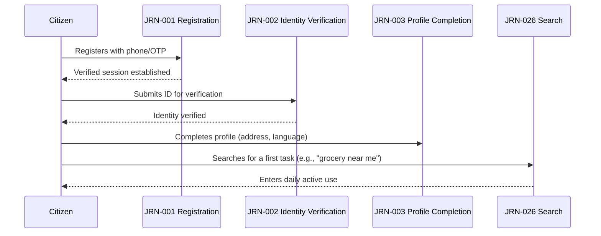

### Farmer Selling Produce

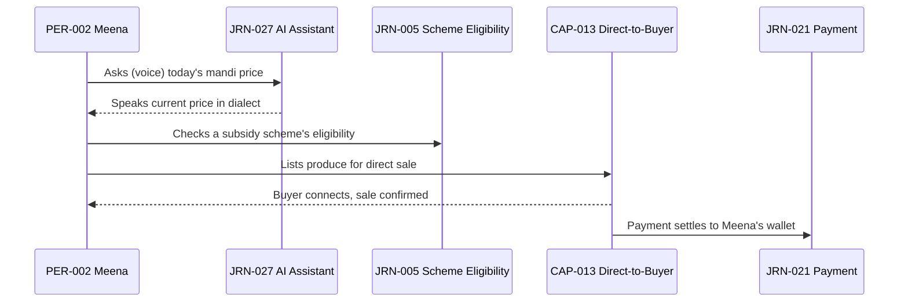

### Patient Finding a Doctor

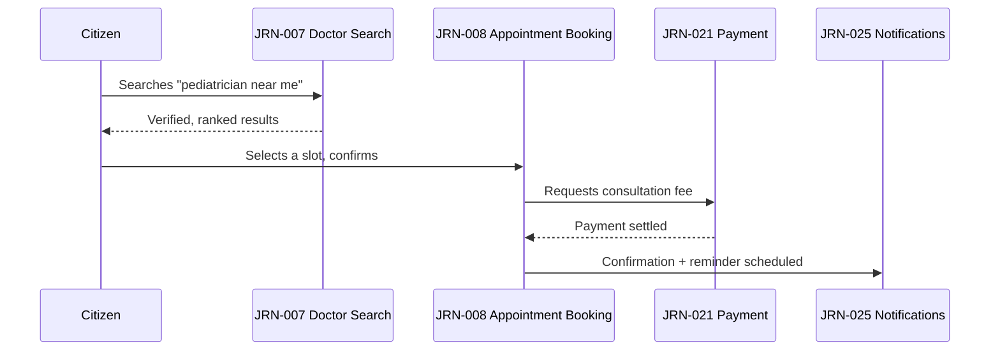

### Student Finding a Tutor

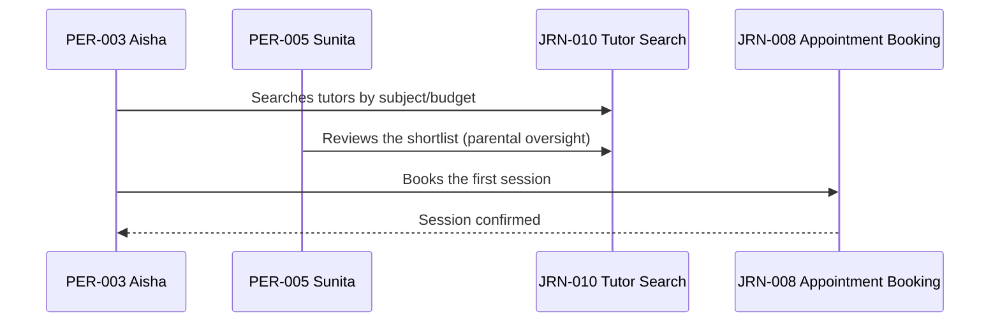

### Job Seeker to Employment

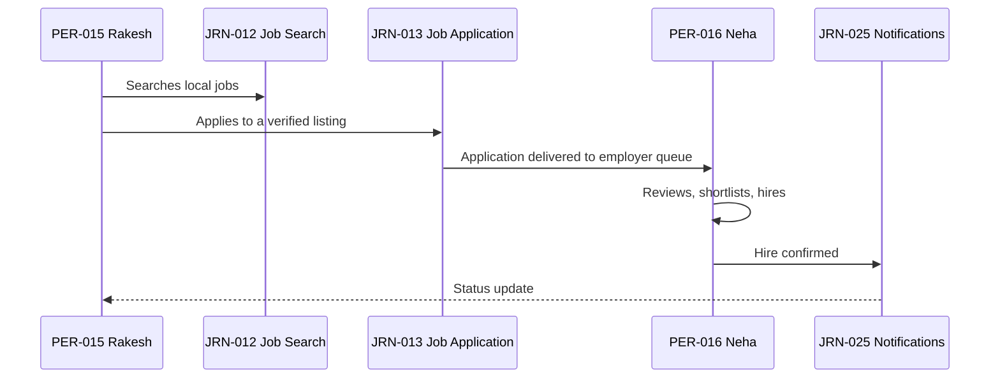

### Merchant Receiving Orders

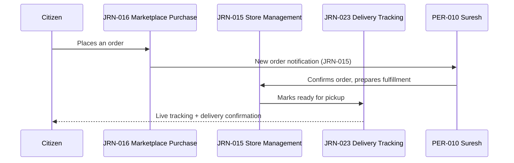

### Government Certificate Lifecycle

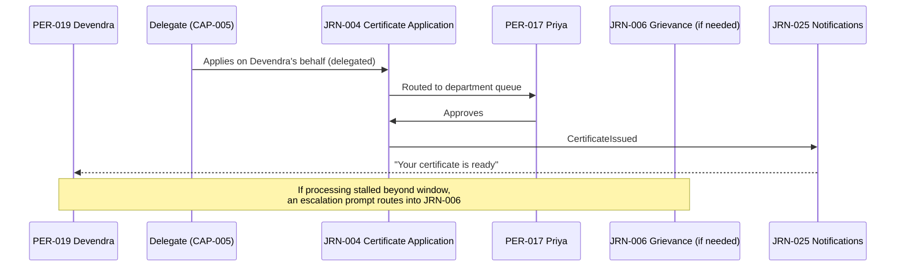

---

# Journey State Model

Every journey, regardless of classification, moves through the same lifecycle state machine — mirroring the identical single-state-machine discipline already established for Domains, Modules, and Capabilities, applied here to an individual citizen's traversal of a journey (distinct from the journey *definition's* own governance lifecycle, see Journey Governance below).

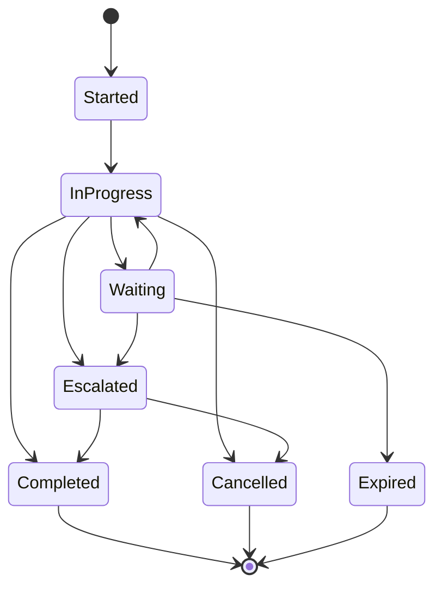

| State | Meaning | Example |
|---|---|---|
| **Started** | The citizen has begun the journey but not yet reached a meaningful decision point. | Opened the Certificate Application form. |
| **In Progress** | The citizen is actively working through journey steps. | Uploading documents. |
| **Waiting** | The journey is paused pending an external party (an officer, a provider, a payment gateway). | Application under departmental review. |
| **Completed** | The journey's stated Success Criteria are met. | Certificate issued and downloaded. |
| **Cancelled** | The citizen deliberately exits before completion. | Abandoning a cart. |
| **Expired** | The journey timed out without citizen or external action, per a defined grace window. | An unclaimed OTP session. |
| **Escalated** | The journey could not resolve through its normal path and requires human or supervisory intervention. | A stalled application escalating to Grievance Submission. |

---

# Journey Governance

### Ownership

Every journey has exactly one named Business Owner and one named Journey Owner per the Master Journey Registry — mirroring the identical Clear Ownership principle already established in `ai-docs/47-engineering-organizational-scaling-standards.md` and applied consistently to Domains, Modules, and Capabilities. **Why this rule exists:** a journey with ambiguous ownership degrades identically to an unowned capability — nobody notices a rising drop-off rate until a citizen or partner escalates loudly enough to force attention.

### Journey Ownership RACI

| Activity | Responsible | Accountable | Consulted | Informed |
|---|---|---|---|---|
| Journey definition/registration | Journey Owner | Business Owner | Domain Owner, Module Product Owner, UX Strategy Lead | All Product |
| Journey KPI target-setting | Journey Owner | Business Owner | Analytics Lead | Engineering Leadership Council |
| Journey usability testing | Journey Owner | CPO | Accessibility Lead, QA Lead | Business Owner |
| Journey retirement decision | Journey Owner | CPO | Business Owner, Architecture Review Board | All Product |
| Cross-journey flow design | Journey Owners of involved journeys | CPO | UX Strategy Lead | Engineering Leadership |

**Why this RACI exists:** a journey frequently spans more than one module or domain (per the Cross-Journey Flows above); without an explicit RACI, a citizen-facing failure at a hand-off point (e.g., between Marketplace Purchase and Delivery Tracking) has no single accountable party to fix it.

### Review Cadence

| Review | Cadence | Owner | Purpose |
|---|---|---|---|
| **Quarterly Journey Review** | Quarterly | CPO, UX Strategy Lead | Registry accuracy, journey health scores, drop-off trend review. |
| **Journey Usability Testing** | Before any major change to a Vulnerable-persona-primary journey | Accessibility Lead | Confirms the journey remains genuinely usable by the persona it names as primary, mirroring `ai-docs/52-user-personas-user-segmentation.md`'s Usability Testing requirement. |
| **Journey Ownership Review** | Quarterly | VP Product, CPO | Confirms every journey has a current, active named owner; escalates any ownerless journey. |
| **Cross-Journey Consistency Review** | Semi-Annual | UX Strategy Lead | Confirms shared interaction patterns (payment, tracking, status) remain consistent across every journey that has one. |

**Why this cadence exists:** a journey that was well-designed at launch drifts as modules evolve independently — the same risk `ai-docs/24-documentation-standards.md` names for documentation, applied here to lived experience, which decays even more silently because no compiler or linter catches it.

### Approval Process

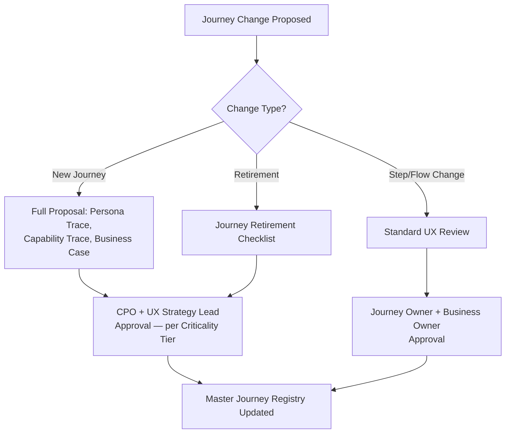

### Journey Versioning

A journey's Registry entry carries an implicit version via its last-updated date; a material change to a journey's Purpose, Steps, or Failure/Recovery Paths is treated as a new version requiring CPO sign-off, never a silent in-place edit — mirroring the identical Versioning discipline already established in `ai-docs/49-engineering-handbook-governance-evolution-standards.md`. **Why this rule exists:** a journey silently changed without a version record is a journey a usability-testing history, an analytics baseline, or an accessibility audit can no longer be trusted to describe.

### Quality Gates

A journey is not released or materially changed until it passes:

- [ ] Every field in its Catalog entry is complete and internally consistent.
- [ ] At least one Failure Scenario and its corresponding Recovery Path are defined for every Decision Point.
- [ ] Accessibility Requirements are validated against its Primary Persona's actual stated needs (`ai-docs/52`), not a generic floor alone.
- [ ] Every step's data collection is checked against Privacy Considerations for genuine necessity.
- [ ] KPIs are defined before the journey enters production use — never retrofitted after launch.

**Why quality gates exist:** a journey that ships without a defined recovery path for its own named failure scenario has, by definition, created a dead end — the exact anti-pattern this document exists to prevent, per the No Dead Ends principle in `ai-docs/00-project-vision.md`.

---

# Journey Analytics

Per the Actionable Metrics principle already established throughout `ai-docs/18-observability-standards.md` and every subsequent governance chapter, every journey metric below ties to a real question a Journey Owner or the CPO will actually ask.

| Metric | Definition | Why It Matters |
|---|---|---|
| **Drop-off rate** | % of citizens entering a journey who exit before reaching a Decision Point or Completed state. | A high drop-off at a specific step names exactly where the journey is failing a real citizen. |
| **Completion rate** | % of started journeys that reach Completed. | The single clearest signal of whether a journey actually works. |
| **Average completion time** | Median and p95 time from Started to Completed. | A journey taking meaningfully longer than its design intent signals friction not yet understood. |
| **Error rate** | % of journey attempts encountering a named Failure Scenario. | Surfaces which failure paths are actually being hit in practice, prioritizing recovery-path investment. |
| **Accessibility completion parity** | Completion rate for a Vulnerable-persona-primary journey compared to the general population, per `ai-docs/52-user-personas-user-segmentation.md`'s Persona Analytics Framework. | A parity gap is a direct, measurable accessibility failure, not a subjective impression. |
| **AI usage rate** | % of a journey's completions that involved AI Assistant mediation (JRN-027). | Tracks whether AI assistance is genuinely reducing friction where it is offered. |
| **Citizen satisfaction** | Post-completion CSAT/NPS-equivalent per journey. | Measures the felt experience, not merely the mechanical outcome. |
| **Escalation rate** | % of journeys reaching the Escalated state. | A rising rate signals the journey's own recovery paths are insufficient, per Journey Health Scoring below. |

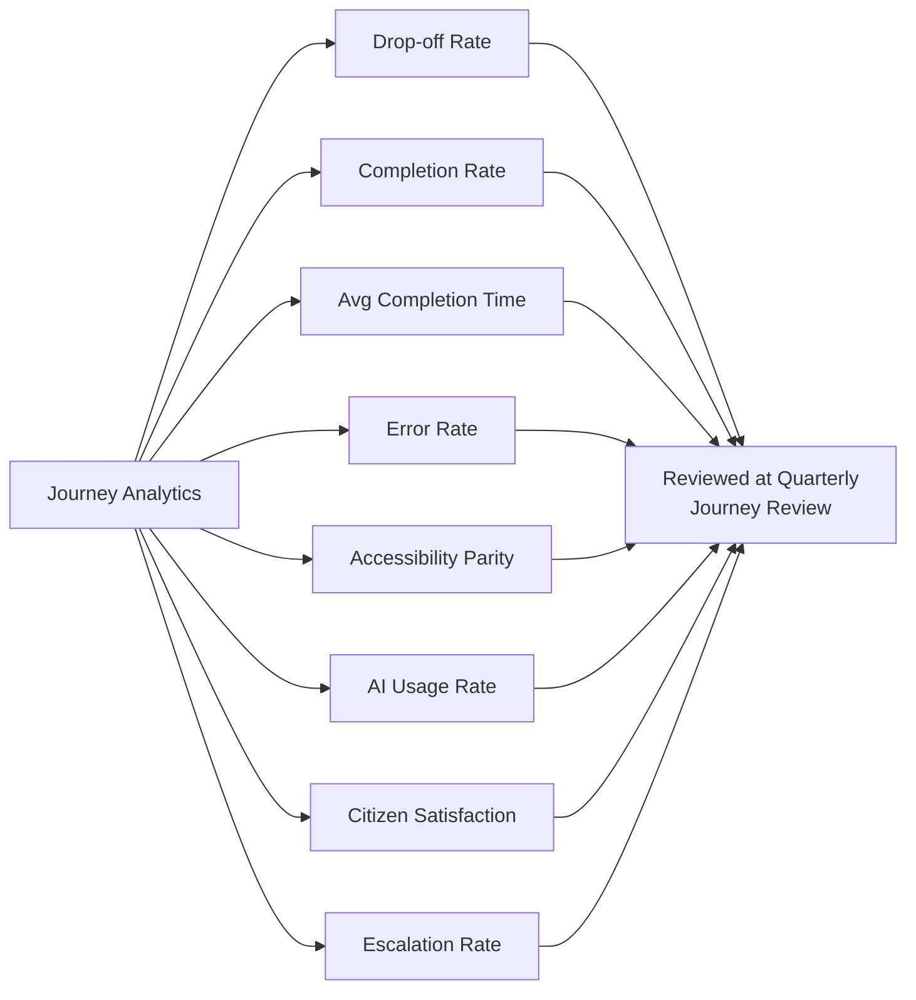

---

# Emotional Experience

Per the Journey Design Philosophy above, every major journey is designed with its emotional arc named explicitly — a journey standard that never names the feeling cannot design for it.

| Journey | User Emotions | Pain Points | Moments of Trust | Moments of Anxiety | Moments of Delight | Recovery Expectations |
|---|---|---|---|---|---|---|
| JRN-002 Identity Verification | Cautious, slightly exposed | Uncertainty over what happens to a submitted document | A clear statement of retention policy | "Did my document actually go through?" | An instant, plain-language "verified" confirmation | A rejected verification always explains exactly why and how to fix it. |
| JRN-004 Certificate Application | Hopeful but wary, per a lifetime of physical-queue frustration | Not knowing where an application actually stands | A visible, timestamped status history | "Is this actually going to work, or will I still need to visit the office?" | A downloadable certificate arriving without ever having left home | A stalled application proactively offers escalation, never leaving the citizen to wonder. |
| JRN-006 Grievance Submission | Frustrated, sometimes distressed | Feeling unheard by "the system" | Every state change is visible and explained | "Will this actually be looked at, or is it a black hole?" | A specific, personalized resolution rather than a form letter | An unresolved grievance auto-escalates rather than requiring the citizen to chase it. |
| JRN-008 Appointment Booking | Relieved once booked, mildly anxious before | Fear of a booking that "didn't really go through" | An immediate, unambiguous confirmation with a reminder | "Did I actually get the slot, or will I show up to nothing?" | A same-day slot found where none seemed available | A failed booking states plainly it failed and offers the next available slot immediately. |
| JRN-014 Merchant Onboarding | Intimidated by "technology," hopeful about income | Fear of "breaking something" in an unfamiliar dashboard | A radically simple flow that never asks for more than needed | "Am I doing this right?" | The first order notification arriving | A rejected verification never leaves the merchant guessing what to fix. |
| JRN-016 Marketplace Purchase | Convenience-seeking, low emotional stakes until something goes wrong | Anxiety spikes sharply the moment a delivery is late or an item is missing | Real-time tracking that matches reality | "Where is my order, and did I get charged correctly?" | A delivery arriving earlier than the estimate | A delayed delivery is proactively flagged, never discovered by the citizen checking repeatedly. |
| JRN-021 Payment | High vigilance regardless of amount | Fear of being double-charged or silently failing | An idempotency-protected retry and an instant confirmation | "Did that actually go through, or did it just take my money?" | A payment that settles visibly within seconds | A failed payment states clearly that no money moved, with a retry path. |
| JRN-027 AI Assistant Interaction | Curious but skeptical on first use | Fear of "talking to a robot that won't actually help" | A visible, always-available human-escalation option | "Is this actually going to understand what I'm asking?" | The assistant correctly understanding a voice query in local dialect | A misunderstood query always offers an immediate path to a human, never a repeated failure loop. |

---

# AI Journey Strategy

### Journey Guidance

The AI Assistant (JRN-027, CAP-033) is positioned to offer guidance at the specific decision points named in each journey's catalog entry above — never inserted generically across every screen. A journey's AI Assistance Opportunities field is the authoritative list of where AI guidance is appropriate; an insertion point not named there requires a Journey Impact Assessment before it is added, mirroring the identical Capability Impact Assessment discipline already established in `ai-docs/55-business-capability-map.md`.

### Context-Aware Assistance

AI guidance is scoped to the citizen's actual current journey state (per the Journey State Model above) — an assistant responding to a citizen mid-Certificate-Application knows the application's current status without the citizen re-explaining it, per the Context Awareness principle already established in `ai-docs/52-user-personas-user-segmentation.md`'s AI Personalization Strategy.

### Human Escalation

Every AI-mediated journey step names an explicit, always-visible path to a human — Help & Support (JRN-028) or a domain-specific officer/support channel — per the absolute AI Principle already established in `ai-docs/00-project-vision.md`: no citizen may be denied a service, blocked from a transaction, or penalized in reputation solely by an opaque automated decision without a human appeal path. This requirement has no exception for a "low-stakes" journey.

### Responsible AI

Every journey's AI Assistance Opportunity is evaluated against the Anti-Discrimination Safeguards already established in `ai-docs/52-user-personas-user-segmentation.md` — no sensitive-attribute targeting, no proxy discrimination, an equal-quality floor across every persona segment attempting the same journey.

### Explainability

An AI recommendation surfaced within a journey (a suggested slot, a matched scheme, a ranked search result) states, in plain language appropriate to the citizen's literacy level, why it was made — never a bare, unexplained suggestion, per the identical Explainability requirement already established in `ai-docs/55-business-capability-map.md`'s AI Capability Strategy.

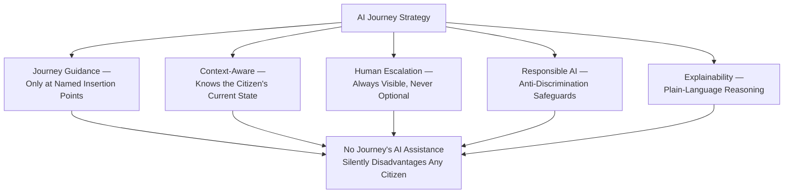

---

# Accessibility Journey Standards

Every journey above is designed against the following standards as a floor, extending `ai-docs/12-accessibility-standards.md` from the component level to the journey level.

| Standard | Requirement | Why It Exists |
|---|---|---|
| **Screen Readers** | Every journey step is navigable and announces its purpose correctly via a screen reader, per `ai-docs/12`'s Screen Reader Support standards. | PER-020 Arvind must complete every journey independently, at parity with a sighted citizen. |
| **Keyboard Navigation** | Every journey is completable via keyboard alone, in a logical order, with no dead end. | Serves citizens using external keyboards, switch-access, or voice-control software on Android devices. |
| **Voice Interaction** | Every Core Citizen and high-frequency journey (Search, AI Assistant, Mandi Prices) supports voice as a first-class input, not a fallback. | PER-002 Meena and PER-021 Lakshmi's primary interaction mode is voice, not text. |
| **Low Literacy Support** | Every journey step avoids unexplained jargon, pairs icons with text, and offers a simplified-language mode. | A meaningful share of Arwal's population has limited formal schooling, per `ai-docs/01-product-goals.md`'s Target Audience. |
| **Regional Language Support** | Every journey is available in Hindi and the founding district's dominant regional dialect from first release, never as a later localization pass. | Per the Language Constraint already established in `ai-docs/01-product-goals.md`. |
| **Offline Behavior** | Every journey states which of its steps must persist locally and sync on reconnect (per its Offline Resilience field above). | A citizen on intermittent 2G/3G must never lose progress mid-journey. |
| **Low Bandwidth Behavior** | Every journey degrades gracefully — text-first alternatives to maps/images, no step that silently fails on a slow connection. | Serves the majority of Arwal's population on entry-level devices and constrained networks. |

---

# Anti-Patterns

| Anti-Pattern | Description | Why It's Rejected |
|---|---|---|
| **Too many steps** | A journey asks for more decisions or data entries than its stated User Goal genuinely requires. | Violates Minimal Cognitive Load above; every unnecessary step is a real cost paid disproportionately by the citizens Arwal exists to serve first. |
| **Hidden actions** | A meaningful action (cancel, escalate, contact support) exists but is not discoverable from within the journey. | Violates Discoverability already established in `ai-docs/54-product-module-catalog.md`, applied here at the journey level; a hidden action is functionally absent. |
| **Dead ends** | A journey reaches a state with no defined next step, recovery path, or escalation. | Directly violates the No Dead Ends product principle already established in `ai-docs/00-project-vision.md`. |
| **Unrecoverable errors** | A failure scenario has no corresponding recovery path. | Violates Error Recovery above and the Quality Gates requirement that every Decision Point name a Failure Scenario and Recovery Path. |
| **Repeated data entry** | A journey asks a citizen to re-enter data Arwal already has, consented and available. | Violates Minimal Cognitive Load and the "one identity" product principle already established in `ai-docs/50-product-vision-business-strategy.md`. |
| **Confusing terminology** | A journey uses internal, technical, or ambiguous language a citizen would not recognize. | Violates Trust and Transparency above and the Terminology discipline already established in `ai-docs/24-documentation-standards.md`, applied here to citizen-facing language. |
| **Unclear status** | A citizen cannot tell, at a glance, what state their journey is currently in. | Violates the Journey State Model above; an unclear status is indistinguishable, from the citizen's perspective, from a failure. |
| **Dark patterns** | A journey step nudges a citizen toward an outcome that serves Arwal's commercial interest over their own stated goal (a disguised upsell, a hard-to-find cancel option). | Directly violates Citizen-First above and the Trust over Growth-at-all-costs pillar already established in `ai-docs/00-project-vision.md`. |

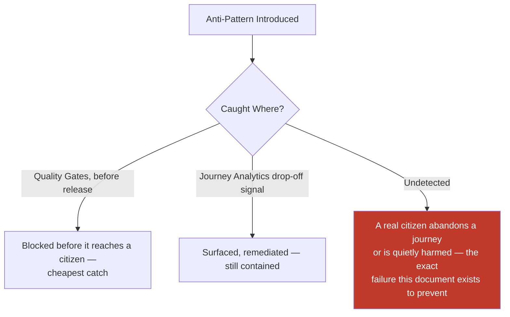

---

# Journey Maturity Model, Criticality, and Health

### Journey Maturity Model

| Level | Name | Characteristics |
|---|---|---|
| **1 — Initial** | Journey exists informally, undocumented, delivered ad hoc without a distinct Catalog entry or owner. | High variance; no tracked KPIs. |
| **2 — Managed** | Journey is named, owned, and has at least one tracked metric, but its failure/recovery paths are incomplete. | Basic Registry entry exists; reactive review cadence. |
| **3 — Defined** | Journey's full Catalog entry is complete — every Decision Point has a named Failure Scenario and Recovery Path. | This document's standard is fully met. |
| **4 — Measured** | Journey health and drop-off are actively tracked against explicit thresholds; deviations trigger a defined response. | Journey Analytics (above) is live and reviewed quarterly at minimum. |
| **5 — Optimized** | Journey actively informs product strategy; its evolution is evidence-driven, with AI-assisted insertion points continuously refined. | Feeds `ai-docs/48-engineering-strategic-planning-standards.md`'s Strategic Theme planning directly. |

Arwal's target state at the completion of Stage 2 is **Level 3 (Defined)** for every Core Citizen and Mission Critical journey, with **Level 4 (Measured)** targeted as Stage 3 analytics tooling matures.

### Journey Criticality Scoring

Mirroring the identical scoring discipline already established for Capabilities in `ai-docs/55-business-capability-map.md`:

| Dimension | Weight | Question |
|---|---|---|
| **Citizen Safety/Financial Impact** | 40% | Could a failure in this journey cause direct harm to a citizen's safety, health, or money? |
| **Trust Blast Radius** | 25% | Would a failure here erode trust in Arwal beyond this single journey? |
| **Regulatory/Compliance Exposure** | 20% | Would a failure trigger a regulatory or government-partnership consequence? |
| **Reversibility** | 15% | How quickly and cleanly can a mid-journey failure be corrected? |

A composite score above 85% is **Mission Critical**; 65–84% is **High**; 40–64% is **Medium**; below 40% is **Low**.

### Journey Health Scoring

| Health Band | Definition | Trigger |
|---|---|---|
| **Healthy** | Meeting or exceeding its stated KPIs for 2+ consecutive review cycles. | No action required. |
| **Watch** | Trending below target on one or more metrics, not yet critical. | Flagged to the Journey Owner for a remediation plan. |
| **At Risk** | Materially below target, or a Mission Critical journey trending downward. | Escalated to the Quarterly Journey Review. |
| **Failing** | Actively failing its core Success Criteria (e.g., a payment journey with a rising unrecovered-failure rate). | Immediate executive escalation, per `ai-docs/29-engineering-governance-decision-authority.md`'s Emergency classification. |

---

# Journey Review Checklists

### Journey Review Checklist

- [ ] Traceable to a Business Domain, Module, Capability, Persona, and Stakeholder — never invented independently.
- [ ] Correctly classified per the User Journey Hierarchy above.
- [ ] Every Decision Point names at least one Failure Scenario and its Recovery Path.
- [ ] Success Criteria and KPIs are defined before the journey enters production use.
- [ ] Criticality and Maturity are scored using the explicit dimensions above, never assigned by impression.
- [ ] AI Assistance Opportunities, if any, carry a human-override path per AI Journey Strategy.
- [ ] No anti-pattern present, per the Anti-Patterns table above.

### Journey Acceptance Criteria

A journey is accepted into production use only when:

- [ ] It has been usability-tested with a representative of its Primary Persona, per `ai-docs/52-user-personas-user-segmentation.md`'s Usability Testing requirement.
- [ ] Its Completion Rate in testing meets or exceeds its stated target for its Criticality tier.
- [ ] Its offline and low-bandwidth behavior has been verified against Arwal's target device/network profile.

### Journey Accessibility Checklist

- [ ] Screen-reader navigable start to finish, with no unlabeled control.
- [ ] Fully keyboard-operable with no trap or dead end.
- [ ] Voice interaction available wherever the journey is classified Core Citizen or high-frequency.
- [ ] Simplified-language mode available.
- [ ] Verified against the specific accessibility needs of its named Primary Persona, not a generic floor alone.

### Journey Privacy Checklist

- [ ] Every data field requested is genuinely necessary for the stated User Goal.
- [ ] Consent is captured at the point of need, never bundled or assumed.
- [ ] No Restricted-tier data appears in a notification, log, or AI-model-provider payload without a reviewed justification.

### Journey Security Checklist

- [ ] Every state-mutating step (payment, submission, verification) is idempotency-protected.
- [ ] Sensitive actions require fresh authentication, per `ai-docs/10-security-standards.md`.
- [ ] Every failure state is logged for audit without exposing sensitive detail to the citizen-facing error message.

---

# Journey Optimization Framework

Every journey is optimized against a fixed, explicit priority order — never an ad hoc trade-off decided per change:

1. **Accessibility and inclusion** — a journey is never optimized for speed or conversion at the cost of excluding a persona it names as primary.
2. **Trust and correctness** — a faster journey that is less transparent about status or more error-prone is rejected in favor of a slower, trustworthy one.
3. **Cognitive load reduction** — fewer, clearer decisions before raw step-count reduction, since a shorter journey that is more confusing is not actually simpler.
4. **Completion time** — optimized only after the above three are satisfied, never traded against them.

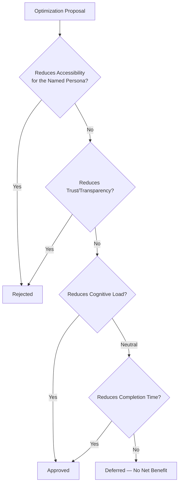

**Why this ordering exists:** a naive optimization framework that treats completion time as the primary metric will, predictably, produce a journey that is fast for a digitally fluent urban citizen and quietly broken for exactly the citizens `ai-docs/00-project-vision.md`'s Inclusion over Optimization pillar exists to protect.

---

# Journey Naming Conventions

- Journey names are citizen-recognizable verb phrases describing the task, never a technology or internal team name ("Doctor Search," never "Healthcare Discovery Query Flow").
- Where two journeys share a pattern across verticals (Marketplace Purchase, Food Ordering, Grocery Ordering), the shared verb structure is kept consistent, with the vertical named only for disambiguation.
- A journey name is never reused after retirement, mirroring the Immutable Numbers principle already established throughout this handbook.

**Why this rule exists:** a citizen, a designer, and an engineer must all recognize the same journey from its name alone — a technology-flavored or ambiguous name defeats the entire purpose of a shared, citable catalog.

---

# Journey Dependency Map

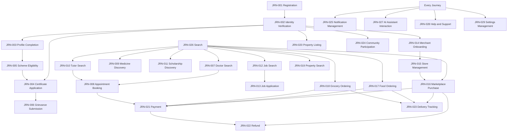

### Fan-In Table (Selected Journeys)

| Journey | Fan-In (Depended On By) | Review Rigor |
|---|---|---|
| JRN-001 Registration | Every other journey | Highest — CPO + Architecture Review Board sign-off for any change |
| JRN-002 Identity Verification | ~15 journeys | Highest |
| JRN-021 Payment | ~8 transacting journeys | High |
| JRN-026 Search | ~10 discovery journeys | High |
| JRN-025 Notification Management | Every journey (terminal consumer) | High |
| JRN-028 Help & Support | Every journey (escalation target) | High |
| JRN-009 Medicine Discovery | 0 (leaf journey) | Standard |

**Why this map exists:** a change to a high-fan-in journey (Registration, Identity Verification, Payment) risks breaking every journey downstream of it — this map is what makes that blast radius visible before a change is approved, mirroring the identical Dependency Heat Map discipline already established in `ai-docs/54-product-module-catalog.md`.

---

# Journey Reuse Strategy

Before a new journey is proposed, the proposer must demonstrate that no existing journey can be reasonably extended to cover the need — mirroring the identical Capability Reuse Strategy already established in `ai-docs/55-business-capability-map.md`. In particular:

- A new "browse and select a provider" need is expressed as a variant of Doctor Search / Tutor Search's shared pattern, never a bespoke new journey.
- A new "checkout and pay" need is expressed as a variant of Payment (JRN-021), never a per-module reimplementation.
- A new "track a fulfillment" need is expressed as a variant of Delivery Tracking (JRN-023).

**Why this rule exists:** duplicated journey patterns are the experience-layer equivalent of duplicated capabilities — they inevitably drift apart, and a citizen who learned one pattern in Marketplace should never have to relearn a subtly different one in Grocery.

---

# Journey Lifecycle Roadmap

| Journey / Capability | Trigger for Activation | Anticipated Horizon |
|---|---|---|
| Full AI Assistant Interaction maturity (JRN-027) | AI Capability Maturity Level 5, per `ai-docs/48` | Year 3–4 |
| Telehealth-extended Appointment Booking (JRN-008) | Healthcare domain reaches Maturity Level 4 | Year 3 |
| B2B/Wholesale variant of Marketplace Purchase (JRN-016) | Commerce Marketplace domain reaches Maturity Level 4 | Year 2–3 |
| Multi-district-configured Registration (JRN-001) | Founding-district trust and unit-economics criteria met | Year 5 |
| Micro-Lending-extended Payment (JRN-021) | Trust and regulatory-compliance maturity confirmed | Year 7–8 |

---

# Journey Glossary

| Term | Definition |
|---|---|
| **Journey** | A citizen-experienced sequence of steps, decisions, and outcomes accomplishing a stated goal, independent of any specific UI. |
| **Decision Point** | A moment within a journey where the citizen (or the system, on their behalf) must choose between two or more paths. |
| **Failure Scenario** | A specific, named way a journey step can go wrong. |
| **Recovery Path** | The defined, designed response to a Failure Scenario, ensuring no dead end. |
| **Drop-off** | A citizen exiting a journey before reaching Completed status. |
| **Escalation** | A journey transitioning to human or supervisory intervention because its normal path could not resolve the citizen's need. |
| **Emotional Arc** | The sequence of feelings a citizen is expected to move through across a journey, from trigger to completion. |
| **Journey Health** | A journey's current operating condition against its own stated KPIs, distinct from its structural Maturity. |

---

# Traceability

### Persona → Journey Matrix

| Persona (`ai-docs/52`) | Primary Journey(s) |
|---|---|
| PER-001 Rahul | Marketplace Purchase (016), Food Ordering (017), Appointment Booking (008), Payment (021) |
| PER-002 Meena | Scheme Eligibility Check (005), AI Assistant Interaction (027) |
| PER-003 Aisha | Tutor Search (010), Scholarship Discovery (011) |
| PER-006 Dr. Kavita | Doctor Search (007, supply side), Appointment Booking (008) |
| PER-009 Vikash | Medicine Discovery (009, supply side) |
| PER-010 Suresh | Merchant Onboarding (014), Store Management (015) |
| PER-012 Vikram | Delivery Tracking (023, fulfiller side) |
| PER-013 Ashok | Property Listing (020) |
| PER-014 Farida | Property Search (019) |
| PER-015 Rakesh | Job Search (012), Job Application (013) |
| PER-016 Neha | Job Application (013, employer side) |
| PER-017 Priya | Government Certificate Application (004, processing side), Grievance Submission (006, resolver side) |
| PER-019 Devendra | Identity Verification (002, delegated), Government Certificate Application (004) |
| PER-020 Arvind | Cross-cutting — every journey (accessibility floor) |
| PER-021 Lakshmi | Grocery Ordering (018), AI Assistant Interaction (027) |
| PER-022 Radha's SHG | Community Participation (024) |
| PER-023 Iqbal | Job Search (012), Property Search (019) |
| PER-024 Fr. Thomas | Community Participation (024, facilitator side) |

### Journey → Capability Matrix

| Journey | Primary Capability(ies) |
|---|---|
| JRN-001 Registration | Identity Verification (CAP-001), Authentication (CAP-002) |
| JRN-002 Identity Verification | Identity Verification (CAP-001), Delegated & Assisted Access (CAP-005) |
| JRN-004 Certificate Application | Government Application Processing (CAP-006), Certificate Issuance (CAP-007) |
| JRN-005 Scheme Eligibility Check | Scheme Eligibility Assessment (CAP-010) |
| JRN-006 Grievance Submission | Grievance Resolution (CAP-008) |
| JRN-007 Doctor Search | Healthcare Discovery (CAP-014), Search (CAP-030) |
| JRN-008 Appointment Booking | Appointment Scheduling (CAP-015), Payment Processing (CAP-027) |
| JRN-012/013 Job Search/Application | Job Matching (CAP-019), Employer Recruitment (CAP-020) |
| JRN-014 Merchant Onboarding | Merchant Onboarding (CAP-021), Provider Verification (CAP-016) |
| JRN-016/017/018 Purchase/Food/Grocery | Order Management (CAP-025), Shopping Cart (CAP-024) |
| JRN-021 Payment | Payment Processing (CAP-027) |
| JRN-022 Refund | Refund Management (CAP-028) |
| JRN-023 Delivery Tracking | Delivery Coordination (CAP-026) |
| JRN-026 Search | Search (CAP-030), Recommendation Engine (CAP-032) |
| JRN-027 AI Assistant Interaction | AI Assistance (CAP-033) |
| JRN-028 Help & Support | Help & Support (CAP-041) |

### Journey → Module Matrix

| Journey | Primary Module(s) |
|---|---|
| JRN-001/002/003 | MOD-001, MOD-002, MOD-003 |
| JRN-004/005/006 | MOD-004, MOD-005, MOD-006, MOD-010 |
| JRN-007/008/009 | MOD-012, MOD-013, MOD-014, MOD-015 |
| JRN-010/011 | MOD-016, MOD-017, MOD-018 |
| JRN-012/013 | MOD-019, MOD-020 |
| JRN-014/015 | MOD-021 |
| JRN-016 | MOD-022, MOD-023 |
| JRN-017 | MOD-024, MOD-025 |
| JRN-018 | MOD-026, MOD-027 |
| JRN-019/020 | MOD-030, MOD-031 |
| JRN-021/022 | MOD-032, MOD-034 |
| JRN-023 | MOD-028, MOD-029 |
| JRN-024 | MOD-035, MOD-036 |
| JRN-025 | MOD-038 |
| JRN-026 | MOD-037 |
| JRN-027 | MOD-039 |
| JRN-028 | MOD-046 |
| JRN-029 | MOD-045 |

### Journey → Domain Matrix

| Journey | Primary Domain(s) |
|---|---|
| JRN-001/002/003 | Identity (DOM-001), Citizen (DOM-002) |
| JRN-004/005/006 | Government Services (DOM-003), Agriculture (DOM-004) |
| JRN-007/008/009 | Healthcare (DOM-005) |
| JRN-010/011 | Education (DOM-006) |
| JRN-012/013 | Jobs (DOM-007) |
| JRN-014/015/016 | Commerce Marketplace (DOM-008) |
| JRN-017 | Food Delivery (DOM-009) |
| JRN-018 | Grocery (DOM-010) |
| JRN-019/020 | Property (DOM-012) |
| JRN-021/022 | Payments (DOM-013) |
| JRN-023 | Logistics (DOM-011) |
| JRN-024 | Community (DOM-014) |
| JRN-026 | Search (DOM-015) |
| JRN-027 | AI Assistant (DOM-017) |

### Journey → Strategic Goal Matrix

| Journey | Strategic Objective (`ai-docs/50`) |
|---|---|
| JRN-001/002/003 | Citizen Adoption |
| JRN-004/006 | Government Efficiency, Service Digitization |
| JRN-005 | Farmer Empowerment |
| JRN-007/008/009 | Healthcare Access |
| JRN-010/011 | Education Improvement |
| JRN-012/013 | Employment Generation |
| JRN-014/015/016/017/018 | Economic Growth, Business Enablement |
| JRN-019/020 | Economic Growth |
| JRN-021/022 | Sustainable Growth |
| JRN-024 | Farmer Empowerment (SHG-adjacent), Cross-Vertical Adoption Depth |

---

# Executive Dashboards

### CEO Dashboard
- District Trust Signal contributions from Core Citizen Journey completion rates
- Journey Health Band distribution across Mission Critical journeys
- Government Efficiency KPI trend (civic journey cluster)

### CPO Dashboard
- Journey KPI summary across all classifications
- Persona-to-Journey traceability gaps
- Drop-off rate trend per journey, ranked by Criticality

### UX Strategy Dashboard
- Cross-Journey Consistency findings
- Accessibility completion parity per Vulnerable-persona-primary journey
- Journey Maturity Level distribution

### Engineering Dashboard
- Journey Dependency Heat Map with Criticality overlay
- Error rate and idempotency-related incident trend for Mission Critical journeys

### Government Partners Dashboard
- Government Service Journey cluster completion time and escalation rate
- Grievance resolution time trend

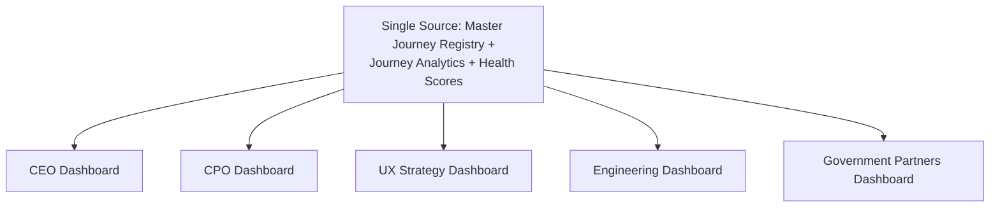

---

# Relationship with Previous Standards

### Project Vision & Product Goals

`ai-docs/00-project-vision.md` and `ai-docs/01-product-goals.md` establish the founding mission, guiding principles, and early personas every journey in this catalog ultimately serves. No journey exists that cannot trace, through a Strategic Objective, back to a commitment already made there.

### Stakeholder Analysis & User Personas

`ai-docs/51-stakeholder-analysis.md` and `ai-docs/52-user-personas-user-segmentation.md` establish who Arwal serves and what each stakeholder/persona needs, fears, and expects. Every journey's Primary Persona, Stakeholders, Accessibility Requirements, and Emotional Experience fields trace directly to those registries, never inventing a new persona or need independently.

### Business Domain Model

`ai-docs/53-business-domain-model.md` establishes who owns each business concern. Every journey's Domains Used field is a direct citation into that document's Domain Registry — this document never redraws a domain boundary, only shows how a citizen actually experiences moving through one or several of them.

### Product Module Catalog

`ai-docs/54-product-module-catalog.md` establishes the user-visible product surface a citizen opens. Every journey's Modules Used field cites that Registry directly — a journey is the lived sequence a citizen follows *across* one or more modules, never a redefinition of any single module's own scope.

### Business Capability Map

`ai-docs/55-business-capability-map.md` establishes the stable business abilities underneath every module. Every journey's Capabilities Used field cites that Registry directly — a journey shows *how* a citizen actually invokes a capability, in what sequence, and with what emotional and accessibility considerations, never a redefinition of the capability's own business rules.

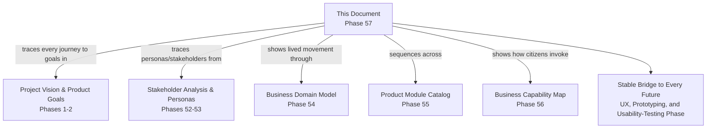

---

# Closing Statement

> **Callout — Closing Statement**
> A business domain tells the organization who owns a concern. A business capability tells everyone what Arwal can actually do. A product module tells a citizen what they tap. A user journey is where all three become a lived, human experience — the specific sequence of steps, the exact moment of anxiety before a payment confirms, the precise wording of a rejection that either builds trust or destroys it. Without this layer, a perfectly defined capability and a perfectly scoped module can still fail Meena in a field with one bar of signal, fail Devendra's son trying to renew a certificate without a queue, or fail a citizen who simply wanted to know if a delivery was still coming. This document exists so that every future wireframe, prototype, and usability test has something real to be measured against — not a guess about what a citizen might want, but a documented, evidence-traceable, accessibility-verified account of what the experience must actually be. A journey is the bridge between business architecture and human dignity: it is where Arwal either keeps its founding promise — that a farmer with a basic Android phone and a merchant with a flagship device can both complete their task with equal reliability — or quietly breaks it, one unrecoverable error at a time. Where a future phase must deviate from a journey defined here, that deviation is made explicitly — through the Journey Governance approval workflow above — never silently, and never by default.

This document, `ai-docs/56-user-journey-standards.md`, is Phase 57 of approximately 420. Every future UX flow, wireframe, prototype, and usability test is expected to trace back to a journey defined here, or to justify its deviation in writing.

**End of Phase 57 — `ai-docs/56-user-journey-standards.md`**
