# Business Process Standards

**Document:** `ai-docs/57-business-process-standards.md`
**Project:** Arwal — The District Super App
**Stage:** 2 — Product & Business Strategy
**Phase:** 58 — Business Process Standards
**Status:** Approved for Product & Engineering Reference
**Audience:** CEO, COO, CPO, CTO, Chief Enterprise Architect, Business Process Architects, Government Digital Transformation Partners, Compliance Officers, Operations Excellence Leads, Product Managers, Engineering Directors

> **Callout — Purpose of This Document**
> `ai-docs/00-project-vision.md` through `ai-docs/56-user-journey-standards.md` established why Arwal exists, what it must achieve, who it serves, what it can do, what a citizen opens, and what it feels like to use. None of those documents answers the question every operations leader, government partner, and compliance officer now depends on: **how does Arwal actually *run* — as an organization — day after day, decision after decision, approval after approval, independent of any screen or any line of code?** This document is that answer — the authoritative Business Process Standards every future operational workflow, approval chain, escalation path, and compliance procedure traces back to.

---

# Purpose of this Document

### Why Business Processes Are a Distinct Layer

`ai-docs/55-business-capability-map.md` established what Arwal can *do*. `ai-docs/56-user-journey-standards.md` established what it *feels like* for a citizen to do it. Neither document answers a third, organizationally essential question: **who, inside Arwal, does what, in what order, with what authority, and with what accountability, to make a capability real and a journey trustworthy?** A capability like Certificate Issuance (CAP-007) is an ability; a journey like Government Certificate Application (JRN-004) is an experience. Neither one, by itself, tells an officer what to do when a document looks forged, tells a compliance auditor what evidence proves the approval was legitimate, or tells a new Operations Manager how a disputed refund actually gets resolved inside the organization. A **Business Process** is the organizational discipline that makes a capability dependable and a journey trustworthy — the specific, governed sequence of human and system actions, approvals, and escalations that stands behind every "Completed" state a citizen ever sees.

### Processes Are Technology-Independent, On Purpose

Consistent with the discipline already established for Domains (`ai-docs/53`), Capabilities (`ai-docs/55`), and Modules (`ai-docs/54`), this document describes **operational workflows, approvals, reviews, decisions, governance, escalations, compliance, and ownership** — never APIs, databases, UI, or implementation. A process that names a database table or an endpoint has been defined at the wrong layer; the moment Arwal's technology stack changes, per `ai-docs/09-tech-stack.md`'s Technology Adoption Process, every process in this catalog must remain true without a single word changing.

### The Relationship Chain

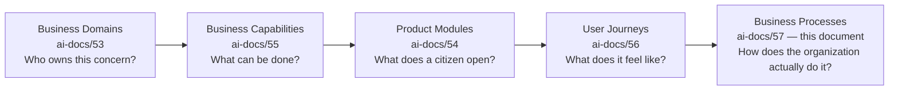

| Layer | Question It Answers | Owner |
|---|---|---|
| Business Domain (`ai-docs/53`) | Who owns this? | Domain Owner |
| Business Capability (`ai-docs/55`) | What can be done? | Capability Owner |
| Product Module (`ai-docs/54`) | What does a citizen open? | Product Owner |
| User Journey (`ai-docs/56`) | What does it feel like? | Journey Owner |
| **Business Process** (this document) | How does the organization actually do it — approvals, escalations, evidence? | Process Owner |

> **Callout — A Process Is Not a Journey Restated**
> `ai-docs/56-user-journey-standards.md`'s JRN-004 describes what Devendra experiences applying for a certificate. This document's PROC-004 describes what happens *behind* that journey — which officer reviews it, what evidence is required to approve it, what happens if two reviewers disagree, and how an auditor later proves the approval was legitimate. The journey is the citizen's story; the process is the organization's discipline. Every process below cites its supporting journey rather than re-describing the citizen's experience.

### Why This Matters at Arwal's Scale

Without an explicit Business Process layer:

1. **Approvals happen invisibly.** A certificate gets approved, a merchant gets verified, a refund gets issued — but nobody can point to the rule that made it legitimate, and an auditor has nothing to check.
2. **Escalation becomes tribal knowledge.** "Who do I call when a grievance stalls?" has no written answer, and the answer changes depending on who is asked.
3. **Government and regulatory partners cannot trust the platform.** A district administration granting Arwal authority over certificate issuance needs a defensible, documented process — not a promise that "the team handles it."
4. **Compliance and audit have nothing to audit against.** `ai-docs/40-engineering-compliance-audit-standards.md`'s Evidence Catalog requires that every control be traceable to a defined process; a process nobody wrote down is a control nobody can prove exists.
5. **Scale multiplies the cost of ambiguity.** At a million users and multiple districts, an undocumented process that "worked because the founding team just knew" collapses the moment that team is not in the room.

### Scope Boundary

This document does not redefine Domains, Capabilities, Modules, Journeys, Personas, or Stakeholders — each remains fully authoritative for its own layer, cited here by reference. It does not redefine Engineering Governance (`ai-docs/29`), Compliance & Audit (`ai-docs/40`), or Handbook Governance (`ai-docs/49`) — this document's processes operate *within* those authority structures, never replacing them. This document's exclusive territory is: **process identity, sequence, actors, decisions, approvals, escalation, compliance, evidence, and traceability** — the organizational discipline standing behind every capability, module, and journey already catalogued.

---

# Process Design Principles

Every principle below exists because a process designed carelessly does not fail abstractly — it fails a citizen waiting on a certificate, a merchant waiting on a payout, or a government partner waiting on proof that Arwal can be trusted with public authority.

### Citizen Value First

**Why it exists:** A process exists to deliver a citizen, merchant, or provider's stated outcome — never to protect an internal convenience at their expense. Where a process step serves internal reporting rather than the outcome the process exists to deliver, that step is deferred, automated invisibly, or removed, mirroring the identical Citizen-First principle already established throughout `ai-docs/50` through `ai-docs/56`.

### Operational Consistency

**Why it exists:** A citizen's certificate should be processed the same way whether the officer handling it is in their first week or their tenth year, and whether it is filed on a Monday or during a surge. Consistency is what makes Arwal's civic and commercial promises reliable rather than dependent on who happens to be on duty.

### Clear Ownership

**Why it exists:** Every process has exactly one accountable Business Owner and one accountable Process Owner (see Process Governance below) — mirroring the identical Clear Ownership discipline already established for Domains, Capabilities, and Modules. A process with ambiguous ownership degrades identically: nobody notices it drifting out of compliance until a citizen or auditor escalates loudly enough to force attention.

### Accountability

**Why it exists:** Every decision a process makes — an approval, a rejection, an escalation — is traceable to a named actor or role, never a diffuse "the system decided." Accountability is what lets Arwal answer, honestly, "who approved this, and on what basis?" for any outcome, at any time.

### Compliance

**Why it exists:** Arwal operates in domains — government services, healthcare, payments — with real legal and regulatory consequence. A process that cannot demonstrate compliance with `ai-docs/10-security-standards.md`, `ai-docs/40-engineering-compliance-audit-standards.md`, and applicable government agreements is a liability regardless of how well it otherwise functions.

### Transparency

**Why it exists:** A citizen or partner affected by a process outcome can see, in plain terms, what happened and why — never left to infer a decision from silence. Transparency is what makes a rejected application or a denied claim feel like a fair process rather than an opaque one, per the Trust and Transparency journey principle already established in `ai-docs/56-user-journey-standards.md`.

### Auditability

**Why it exists:** Every process produces evidence — a timestamped decision, a named approver, a documented reason — sufficient for an internal or government auditor to reconstruct exactly what happened without relying on memory, per the Evidence Catalog discipline already established in `ai-docs/40-engineering-compliance-audit-standards.md`.

### Scalability

**Why it exists:** A process built assuming a handful of officers and a few thousand citizens breaks the moment Arwal reaches a million users and multiple districts. Every process in this catalog is designed to scale by adding capacity (more reviewers, more automation), never by abandoning its own rules under load.

### Automation Where Appropriate

**Why it exists:** Manual work that a machine can do reliably, consistently, and transparently should be automated — freeing human judgment for the decisions that genuinely require it. Automation is pursued deliberately, per AI Process Strategy below, never as a way to quietly remove accountability.

### Human Oversight

**Why it exists:** Per the AI Principle already established in `ai-docs/00-project-vision.md` and reaffirmed throughout `ai-docs/50` through `ai-docs/56`, no citizen may be denied a service, blocked from a transaction, or penalized in reputation solely by an opaque automated decision without a human appeal path. Every process in this catalog names, explicitly, where human judgment is mandatory and irreducible.

### Continuous Improvement

**Why it exists:** A process that is correct today will not remain correct forever — volumes grow, fraud patterns evolve, regulations change. Every process carries a defined review cadence and a Continuous Improvement Opportunities field, so improvement is a scheduled discipline, not an accident.

### Risk Management

**Why it exists:** Every process carries some risk of error, fraud, or harm; that risk is named explicitly, scored, and mitigated deliberately — never discovered for the first time during an incident, mirroring the Risk-Based discipline already established in `ai-docs/30-engineering-risk-management-standards.md`.

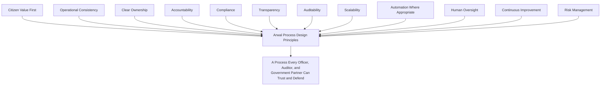

> **Callout — The One-Sentence Process Philosophy**
> *"A process that cannot be explained to an auditor, defended to a citizen, and repeated by a stranger is not yet a process — it is one person's habit wearing an org chart."*

---

# Process Hierarchy

Every process in the Master Process Registry is classified into exactly one of eleven categories.

| Classification | Definition | Characteristic |
|---|---|---|
| **Core Business Processes** | Foundational organizational processes every vertical depends on. | Cross-cutting, highest review rigor. |
| **Government Processes** | Processes realizing civic application, certificate, scheme, and grievance workflows. | Regulated, government-partner-facing. |
| **Commerce Processes** | Processes realizing merchant, order, and fulfillment workflows. | High-frequency, transactional. |
| **Healthcare Processes** | Processes realizing provider verification and appointment integrity. | High-stakes, time-sensitive. |
| **Education Processes** | Processes realizing tutor/institution verification and scholarship review. | Moderate frequency, minor-involving safeguards. |
| **Employment Processes** | Processes realizing job/listing verification and recruitment integrity. | Fraud/exploitation-sensitive. |
| **Community Processes** | Processes realizing group/cooperative registration and moderation. | Field-agent-mediated. |
| **Administrative Processes** | Internal operational workflows (verification, moderation, support). | Officer/operator-facing. |
| **Compliance Processes** | Processes enforcing regulatory, audit, and governance obligations. | Non-negotiable, evidence-producing. |
| **AI-Supported Processes** | Processes where automation/AI materially accelerates a workflow, always human-overseen. | Cross-cutting, explainability-bound. |
| **Future Processes** | Processes anticipated by Arwal's roadmap but not yet resourced. | Tracked for readiness. |

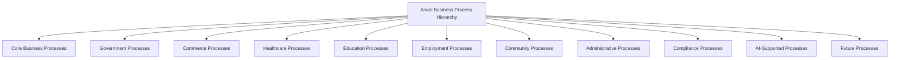

### Process Taxonomy

Beyond tier, every process carries three cross-cutting tags:

| Axis | Values |
|---|---|
| **Nature** | Transactional; Approval; Investigative; Advisory; Reporting |
| **Decision Type** | Rule-Based (deterministic); Judgment-Based (human discretion); Hybrid (AI-assisted, human-confirmed) |
| **Risk Tier** | Critical; High; Medium; Low — mirroring `ai-docs/44-engineering-business-continuity-disaster-recovery-standards.md`'s Service Classification, applied here to organizational risk rather than technical availability |

---

# Master Process Registry

Every process carries a permanent, sequential, never-reused Process ID.

| Process ID | Process Name | Classification | Business Owner | Process Owner | Primary Domain | Status | Criticality | Review Frequency |
|---|---|---|---|---|---|---|---|---|
| PROC-001 | Citizen Registration Processing | Core | CPO | Citizen Experience Ops Lead | Identity (DOM-001) | Active | Mission Critical | Quarterly |
| PROC-002 | Identity Verification Processing | Core | Head of Platform Engineering | Verification Ops Lead | Identity (DOM-001) | Active | Mission Critical | Monthly |
| PROC-003 | Consent Management | Core | CPO | Privacy Ops Lead | Citizen (DOM-002) | Active | Mission Critical | Quarterly |
| PROC-004 | Government Application Processing | Government | Head of Government Partnerships | Civic Ops Lead | Government Services (DOM-003) | Active | Mission Critical | Monthly |
| PROC-005 | Certificate Approval | Government | Head of Government Partnerships | Civic Ops Lead | Government Services (DOM-003) | Active | Mission Critical | Monthly |
| PROC-006 | Grievance Resolution | Government | Head of Government Partnerships | Civic Ops Lead | Government Services (DOM-003) | Active | High | Quarterly |
| PROC-007 | Officer Case Review | Government | Head of Government Partnerships | Civic Ops Lead | Government Services (DOM-003) | Active | Mission Critical | Quarterly |
| PROC-008 | Merchant Verification | Commerce | Head of Merchant Success | Trust Ops Lead | Administration (DOM-019) | Active | Mission Critical | Monthly |
| PROC-009 | Provider Verification | Healthcare | Head of Healthcare Vertical | Trust Ops Lead | Administration (DOM-019) | Active | Mission Critical | Monthly |
| PROC-010 | Product/Listing Approval | Commerce | Head of Merchant Success | Trust Ops Lead | Commerce Marketplace (DOM-008) | Active | High | Quarterly |
| PROC-011 | Order Fulfillment | Commerce | Head of Merchant Success | Fulfillment Ops Lead | Commerce/Food/Grocery (DOM-008/9/10) | Active | Mission Critical | Quarterly |
| PROC-012 | Delivery Coordination | Commerce | Head of Logistics | Logistics Ops Lead | Logistics (DOM-011) | Active | Mission Critical | Quarterly |
| PROC-013 | Refund Processing | Commerce | Head of Payments | Payments Ops Lead | Payments (DOM-013) | Active | High | Quarterly |
| PROC-014 | Payment Reconciliation | Compliance | Head of Payments | Finance Ops Lead | Payments (DOM-013) | Active | Mission Critical | Monthly |
| PROC-015 | Fraud Investigation | Compliance | Head of Trust & Safety | Trust Ops Lead | Trust & Safety (DOM-020) | Active | Mission Critical | Monthly |
| PROC-016 | Content Moderation | Administrative | Head of Trust & Safety | Trust Ops Lead | Trust & Safety (DOM-020) | Active | High | Quarterly |
| PROC-017 | Customer Support | Administrative | Head of Customer Success | Support Ops Lead | Citizen (DOM-002) | Active | High | Quarterly |
| PROC-018 | Notification Processing | Administrative | Head of Platform Engineering | Platform Ops Lead | Notifications (DOM-016) | Active | High | Quarterly |
| PROC-019 | Analytics Reporting | Administrative | Head of Data/Analytics | Analytics Ops Lead | Analytics (DOM-018) | Active | Medium | Quarterly |
| PROC-020 | AI Escalation | AI-Supported | Head of AI Platform | AI Ops Lead | AI Assistant (DOM-017) | Maturing | High | Monthly |
| PROC-021 | Audit Management | Compliance | Compliance Officer | Audit Lead | (cross-cutting) | Active | Mission Critical | Monthly |
| PROC-022 | Configuration Change Approval | Administrative | Head of Platform Engineering | Platform Ops Lead | (cross-cutting) | Active | High | Quarterly |
| PROC-023 | Employer/Listing Verification | Employment | Head of Jobs Vertical | Trust Ops Lead | Jobs (DOM-007) | Active | High | Quarterly |
| PROC-024 | Property Listing Verification | Commerce | Head of Classifieds/Property | Trust Ops Lead | Property (DOM-012) | Active | Medium | Quarterly |
| PROC-025 | Community Group Registration | Community | Head of Community Engagement | Community Ops Lead | Community (DOM-014) | Nascent | Medium | Semi-Annual |
| PROC-026 | Education Provider Verification | Education | Head of Education Vertical | Trust Ops Lead | Education (DOM-006) | Active | High | Quarterly |
| PROC-027 | Scholarship/Scheme Eligibility Review | Government/Education | Head of Government Partnerships | Civic Ops Lead | Government Services (DOM-003) | Active | Medium | Quarterly |
| PROC-028 | Delegated Access Authorization | Core | Head of Accessibility & Inclusion | Verification Ops Lead | Identity (DOM-001) | Active | High | Quarterly |

> **Callout — Registry Governance**
> This Registry is reviewed and updated at every Quarterly Process Review (see Process Governance below); a process added, merged, or retired outside that cadence requires COO sign-off, mirroring the identical Registry discipline already established for Domains (`ai-docs/53`), Capabilities (`ai-docs/55`), and Journeys (`ai-docs/56`).

---

# Business Process Catalog

Each process below follows an identical field structure. Every field cites, and never contradicts, the corresponding Domain, Capability, Module, Journey, Persona, and Stakeholder entries.

## PROC-001 — Citizen Registration Processing

| Field | Detail |
|---|---|
| **Purpose** | Convert a citizen's registration attempt into a verified, active account through a governed, monitored process. |
| **Business Objective** | Maximize legitimate registration completion while preventing fraudulent or duplicate account creation. |
| **Trigger** | A citizen completes JRN-001 Registration's OTP step. |
| **Inputs** | Phone number, OTP confirmation, baseline consent. |
| **Outputs** | An active citizen account in "Registered" state. |
| **Actors** | Citizen, Platform System, Verification Ops Lead (exception handling only). |
| **Roles** | Citizen (self-service); Field Agent (assisted registration). |
| **Responsibilities** | The Platform System processes the majority of registrations automatically; the Verification Ops Lead reviews only flagged anomalies (e.g., a phone number reused suspiciously often). |
| **Preconditions** | A reachable phone number; baseline consent presented. |
| **Process Steps** | 1) Citizen submits phone number. 2) System issues OTP. 3) Citizen confirms OTP. 4) System checks for duplicate/fraud signals. 5) Account activated, or flagged for manual review. |
| **Decision Points** | Automatic activation vs. manual fraud review. |
| **Approvals** | None required for standard registration; a flagged registration requires Verification Ops Lead sign-off. |
| **Escalation Rules** | A registration flagged 3+ times for the same underlying signal escalates to Fraud Investigation (PROC-015). |
| **Business Rules** | No role is granted before at least baseline registration succeeds; registration is always free. |
| **Dependencies** | Identity Verification Processing (PROC-002) for role-granting registrations. |
| **Related Journeys** | JRN-001 Citizen Registration. |
| **Related Capabilities** | Identity Verification (CAP-001), Authentication (CAP-002). |
| **Related Modules** | MOD-001 Identity & Verification. |
| **Related Domains** | Identity (DOM-001). |
| **Compliance Requirements** | Data collected limited to what registration genuinely requires, per `ai-docs/00-project-vision.md`'s Data Minimization. |
| **Audit Requirements** | Every flagged-then-resolved registration is logged with the resolving officer and reason. |
| **KPIs** | Registration completion rate; fraud-flag rate. |
| **SLAs** | Automatic activation within seconds; manual review resolved within 1 business day. |
| **AI Opportunities** | Duplicate/fraud-signal detection (human-reviewed before rejection). |
| **Accessibility Considerations** | Field-agent-assisted path for PER-021 Lakshmi. |
| **Security Considerations** | OTP rate-limiting per `ai-docs/10-security-standards.md`. |
| **Privacy Considerations** | Only a phone number required at this stage. |
| **Failure Scenarios** | OTP delivery failure; duplicate-number dispute. |
| **Recovery Procedures** | SMS-to-call OTP fallback; a documented dispute-resolution path for a contested duplicate flag. |
| **Continuous Improvement Opportunities** | Reduce false-positive fraud-flag rate through periodic model retraining review. |
| **Future Evolution** | Biometric registration once state-level identity integration matures. |

## PROC-002 — Identity Verification Processing

| Field | Detail |
|---|---|
| **Purpose** | Confirm a citizen, merchant, or provider's claimed identity through a documented, auditable review. |
| **Business Objective** | Ensure only genuinely verified actors hold sensitive roles, minimizing impersonation and fraud. |
| **Trigger** | A citizen submits an ID document for verification (JRN-002). |
| **Inputs** | Government ID document, phone/biometric confirmation. |
| **Outputs** | A verification decision (Approved/Rejected) with a stated confidence level. |
| **Actors** | Citizen, Verification System (automated first pass), Verification Ops Lead (manual review). |
| **Roles** | First-line automated reviewer (document/OCR match); Second-line human reviewer for ambiguous cases. |
| **Responsibilities** | Automated system handles clear-match cases; a human reviewer resolves any case flagged as ambiguous or high-risk. |
| **Preconditions** | Registration (PROC-001) complete. |
| **Process Steps** | 1) Document submitted. 2) Automated extraction/match. 3) High-confidence match auto-approved. 4) Low-confidence or flagged match routed to human review. 5) Human reviewer approves/rejects with a stated reason. |
| **Decision Points** | Auto-approve vs. route to human review; approve vs. reject with reason. |
| **Approvals** | Verification Ops Lead approval required for any manually reviewed case. |
| **Escalation Rules** | A rejected verification appealed twice escalates to a senior Verification Ops reviewer; a suspected forged document escalates immediately to Fraud Investigation (PROC-015). |
| **Business Rules** | No sensitive role is granted before verification succeeds; a rejection always states the specific deficiency. |
| **Dependencies** | Citizen Registration Processing (PROC-001); feeds Merchant Verification (PROC-008), Provider Verification (PROC-009). |
| **Related Journeys** | JRN-002 Identity Verification. |
| **Related Capabilities** | Identity Verification (CAP-001), Provider Verification (CAP-016). |
| **Related Modules** | MOD-001 Identity & Verification. |
| **Related Domains** | Identity (DOM-001), Administration (DOM-019). |
| **Compliance Requirements** | ID documents classified Restricted-tier per `ai-docs/10-security-standards.md`; retained only per the regulatory window. |
| **Audit Requirements** | Every decision immutably logged with reviewer identity and reason. |
| **KPIs** | Verification completion rate; identity-fraud incident rate; false-rejection rate. |
| **SLAs** | Automated decision within minutes; manual review within 1 business day. |
| **AI Opportunities** | Document-fraud pattern detection, always human-confirmed before rejection. |
| **Accessibility Considerations** | Delegated verification for PER-019 Devendra. |
| **Security Considerations** | File upload validated per `ai-docs/10-security-standards.md`. |
| **Privacy Considerations** | Documents purged per retention policy after the verification window closes. |
| **Failure Scenarios** | Unreadable document image; mismatched details. |
| **Recovery Procedures** | Guided re-capture; a stated, specific correction path. |
| **Continuous Improvement Opportunities** | Periodic false-rejection-rate review to recalibrate automated thresholds. |
| **Future Evolution** | Biometric/state-level SSO-based verification. |

## PROC-003 — Consent Management

| Field | Detail |
|---|---|
| **Purpose** | Capture, enforce, and honor a citizen's explicit choices about what data is shared with which capability or partner. |
| **Business Objective** | Make Data Minimization & Consent an operating, auditable fact, not an aspiration. |
| **Trigger** | Any moment a capability requires a new category of citizen data. |
| **Inputs** | Citizen's consent decision. |
| **Outputs** | An enforceable, versioned consent record. |
| **Actors** | Citizen, Platform System, Privacy Ops Lead (exception handling). |
| **Roles** | Citizen (grants/withdraws); Privacy Ops Lead (audits enforcement). |
| **Responsibilities** | The system enforces consent automatically at every data-access point; the Privacy Ops Lead audits for enforcement gaps. |
| **Preconditions** | Registered account. |
| **Process Steps** | 1) Consent prompt presented at point of need. 2) Citizen grants or declines. 3) Decision recorded immutably. 4) Every consuming capability checks consent before access. 5) Withdrawal takes effect immediately. |
| **Decision Points** | Grant vs. decline; scope of grant. |
| **Approvals** | None — a citizen's own decision is authoritative; only a *change to the consent framework itself* requires Compliance Officer approval. |
| **Escalation Rules** | A detected enforcement gap (data accessed without consent) escalates immediately to the Privacy Ops Lead and is treated as a Sev 1 compliance incident. |
| **Business Rules** | No capability accesses data beyond a granted consent's scope; a withdrawal is never delayed. |
| **Dependencies** | Every capability handling personal data. |
| **Related Journeys** | JRN-003 Profile Completion, JRN-029 Settings Management. |
| **Related Capabilities** | Consent Management (CAP-004). |
| **Related Modules** | MOD-002 Citizen Profile, MOD-045 Settings. |
| **Related Domains** | Citizen (DOM-002). |
| **Compliance Requirements** | Consent records are immutable, append-only. |
| **Audit Requirements** | Every grant/withdrawal timestamped and retained per `ai-docs/40`'s Evidence Catalog. |
| **KPIs** | Consent-honoring compliance rate (target: 100%). |
| **SLAs** | Withdrawal takes effect immediately, no grace period. |
| **AI Opportunities** | None — a deliberately deterministic process by design. |
| **Accessibility Considerations** | Plain-language consent prompts, never legal jargon. |
| **Security Considerations** | Consent records write-once, tamper-evident. |
| **Privacy Considerations** | The process's entire purpose is privacy protection. |
| **Failure Scenarios** | A capability accesses data before consent is checked. |
| **Recovery Procedures** | Immediate access revocation, incident logged, root cause reviewed. |
| **Continuous Improvement Opportunities** | Periodic audit of every capability's consent-check implementation. |
| **Future Evolution** | Granular, per-field consent as regulatory maturity permits. |

## PROC-004 — Government Application Processing

| Field | Detail |
|---|---|
| **Purpose** | Take a citizen's government service request from submission to a documented departmental decision. |
| **Business Objective** | Reduce physical-office dependency while preserving the legal integrity of government decision-making. |
| **Trigger** | A citizen submits an application via JRN-004. |
| **Inputs** | Application form data, supporting documents. |
| **Outputs** | An approval, rejection, or request for more information. |
| **Actors** | Citizen, Government Officer, Officer Case Review (PROC-007) as the decisioning sub-process. |
| **Roles** | Citizen (submitter); Government Officer (reviewer/decider); District Administrator (oversight). |
| **Responsibilities** | The officer reviews and decides within their department's scope; the citizen is kept informed at every state change. |
| **Preconditions** | Identity Verification (PROC-002) complete for the submitting citizen. |
| **Process Steps** | 1) Application submitted. 2) Routed to the correct department queue. 3) Officer reviews (may request more information). 4) Officer approves or rejects with a documented reason. 5) Outcome triggers Certificate Approval (PROC-005) where applicable. |
| **Decision Points** | Approve / reject / request more information. |
| **Approvals** | Officer decision is authoritative for standard cases; a high-value or contested case requires supervisor co-sign. |
| **Escalation Rules** | An application unresolved past its department's stated SLA auto-escalates to a supervisor; a citizen may escalate via Grievance Resolution (PROC-006). |
| **Business Rules** | Every state transition is citizen-visible and logged; an application is never silently dropped. |
| **Dependencies** | Certificate Approval (PROC-005), Officer Case Review (PROC-007), Grievance Resolution (PROC-006). |
| **Related Journeys** | JRN-004 Government Certificate Application. |
| **Related Capabilities** | Government Application Processing (CAP-006). |
| **Related Modules** | MOD-005 Applications. |
| **Related Domains** | Government Services (DOM-003). |
| **Compliance Requirements** | Departmental workflow rules configured per government agreement; document data Restricted-tier. |
| **Audit Requirements** | Full state-transition history retained, including officer identity and reason for every decision. |
| **KPIs** | Government Efficiency KPI (completion-time reduction). |
| **SLAs** | Per-department, government-agreed processing window. |
| **AI Opportunities** | Eligibility pre-screening, application-triage suggestion — never autonomous approval. |
| **Accessibility Considerations** | Delegated submission for PER-019 Devendra. |
| **Security Considerations** | Document upload validated; idempotency-protected submission. |
| **Privacy Considerations** | Data shared only with the processing department. |
| **Failure Scenarios** | A required document rejected; department backlog exceeds SLA. |
| **Recovery Procedures** | Re-upload guidance; automatic supervisor escalation on SLA breach. |
| **Continuous Improvement Opportunities** | Quarterly review of department-level cycle time against SLA. |
| **Future Evolution** | Multi-department joint-application support. |

## PROC-005 — Certificate Approval

| Field | Detail |
|---|---|
| **Purpose** | Produce a government-recognized, verifiable certificate as the documented output of an approved application. |
| **Business Objective** | Guarantee every issued certificate is defensible, traceable, and legally sound. |
| **Trigger** | Government Application Processing (PROC-004) reaches "Approved." |
| **Inputs** | An approved application decision. |
| **Outputs** | An issued, verifiable certificate artifact. |
| **Actors** | Government Officer (approver), Department Supervisor (co-sign for high-value certificates). |
| **Roles** | Approving Officer; Supervisor (dual control for defined certificate classes). |
| **Responsibilities** | The officer confirms the decision basis; the supervisor co-signs where the certificate class requires dual control. |
| **Preconditions** | Application approved via PROC-004. |
| **Process Steps** | 1) Approval confirmed. 2) Certificate rendered per departmental template. 3) Dual-control co-sign where required. 4) Certificate issued and made permanently retrievable. |
| **Decision Points** | Standard issuance vs. dual-control issuance (by certificate class). |
| **Approvals** | Single officer for standard classes; officer + supervisor for high-value/high-risk classes. |
| **Escalation Rules** | A disputed certificate (citizen claims an error) routes to Grievance Resolution (PROC-006). |
| **Business Rules** | A certificate is issued only after a documented departmental approval; every issued certificate is permanently retrievable. |
| **Dependencies** | Government Application Processing (PROC-004). |
| **Related Journeys** | JRN-004 Government Certificate Application. |
| **Related Capabilities** | Certificate Issuance (CAP-007). |
| **Related Modules** | MOD-004 Certificates. |
| **Related Domains** | Government Services (DOM-003). |
| **Compliance Requirements** | Certificate templates and dual-control classes defined per government agreement. |
| **Audit Requirements** | Tamper-evident issuance record with approver identity/identities. |
| **KPIs** | Application-to-issuance time. |
| **SLAs** | Per-department, government-agreed window. |
| **AI Opportunities** | Auto-renewal reminders for time-bound certificates. |
| **Accessibility Considerations** | Certificate downloadable in a screen-reader-compatible format. |
| **Security Considerations** | Tamper-evident issuance record. |
| **Privacy Considerations** | Certificate content is Restricted-tier. |
| **Failure Scenarios** | Rendering error; dual-control co-signer unavailable. |
| **Recovery Procedures** | Automated re-render on error; a defined backup co-signer per department. |
| **Continuous Improvement Opportunities** | Review of which certificate classes genuinely require dual control vs. single-officer sufficiency. |
| **Future Evolution** | Cross-department certificate reuse (no re-submission of already-verified facts). |

## PROC-006 — Grievance Resolution

| Field | Detail |
|---|---|
| **Purpose** | Give a citizen a formal, accountable path to raise and resolve a civic-service complaint. |
| **Business Objective** | Preserve citizen trust by ensuring no civic-service failure goes unaddressed. |
| **Trigger** | A citizen files a grievance (JRN-006), or an application auto-escalates past its SLA. |
| **Inputs** | Grievance description, evidence. |
| **Outputs** | A documented resolution decision. |
| **Actors** | Citizen, Government Officer, District Administrator (escalation tier). |
| **Roles** | First-line Officer (initial review); District Administrator (escalated review). |
| **Responsibilities** | The first-line officer resolves within a defined window; unresolved cases escalate automatically. |
| **Preconditions** | An identity-verified citizen account. |
| **Process Steps** | 1) Grievance filed. 2) Routed to the relevant department. 3) Officer investigates and responds. 4) Citizen notified of the outcome. 5) Unresolved-past-window cases auto-escalate. |
| **Decision Points** | Resolve at first line vs. escalate. |
| **Approvals** | First-line officer decision is final unless escalated; District Administrator decision is final at that tier. |
| **Escalation Rules** | Unresolved past a defined grace window auto-escalates one tier; a citizen may explicitly request escalation at any time. |
| **Business Rules** | Every grievance receives a tracked resolution outcome — never silently closed. |
| **Dependencies** | Government Application Processing (PROC-004), Officer Case Review (PROC-007). |
| **Related Journeys** | JRN-006 Grievance Submission. |
| **Related Capabilities** | Grievance Resolution (CAP-008). |
| **Related Modules** | MOD-006 Grievances. |
| **Related Domains** | Government Services (DOM-003). |
| **Compliance Requirements** | Grievance evidence handled as Restricted-tier. |
| **Audit Requirements** | Full resolution history retained, including escalation timestamps. |
| **KPIs** | Grievance resolution time; escalation rate. |
| **SLAs** | First-line resolution within a defined window (department-specific); escalation resolution within a shorter, defined window. |
| **AI Opportunities** | Auto-routing to the correct department from grievance text (human-confirmed). |
| **Accessibility Considerations** | Voice/simplified-language filing. |
| **Security Considerations** | Restricted-tier evidence handling. |
| **Privacy Considerations** | Content visible only to the citizen and assigned officer. |
| **Failure Scenarios** | Misrouted grievance; repeated escalation without resolution. |
| **Recovery Procedures** | Manual re-routing on department review; a mandatory postmortem for any grievance escalated twice. |
| **Continuous Improvement Opportunities** | Pattern analysis of recurring grievance types feeding process/product fixes. |
| **Future Evolution** | Anonymized public grievance-pattern transparency reporting. |

## PROC-007 — Officer Case Review

| Field | Detail |
|---|---|
| **Purpose** | Give a government officer a structured, auditable procedure for processing their department's assigned workload. |
| **Business Objective** | Reduce backlog while ensuring every decision is defensible. |
| **Trigger** | A new application or grievance enters the officer's queue. |
| **Inputs** | Routed applications/grievances. |
| **Outputs** | Approval/rejection decisions with documented reasons. |
| **Actors** | Government Officer, Department Supervisor. |
| **Roles** | Case-handling Officer; Supervisor (spot-audits and dispute resolution). |
| **Responsibilities** | The officer processes each case on its merits within SLA; the supervisor spot-audits a sample for consistency. |
| **Preconditions** | A routed case exists in the officer's queue. |
| **Process Steps** | 1) Officer opens a case. 2) Reviews evidence. 3) Requests more information if needed. 4) Decides, documenting the reason. 5) Case closed or forwarded (e.g., to Certificate Approval). |
| **Decision Points** | Approve / reject / request more information. |
| **Approvals** | Officer decision authoritative unless flagged for supervisor review. |
| **Escalation Rules** | A case aging past SLA is flagged to the supervisor automatically. |
| **Business Rules** | Every decision requires a documented reason; every action immutably logged. |
| **Dependencies** | Government Application Processing (PROC-004), Grievance Resolution (PROC-006), Certificate Approval (PROC-005). |
| **Related Journeys** | JRN-004, JRN-006. |
| **Related Capabilities** | Officer Case Management (CAP-009). |
| **Related Modules** | MOD-007 Officer Case Management, MOD-047 Government Officer Dashboard. |
| **Related Domains** | Government Services (DOM-003). |
| **Compliance Requirements** | Role-scoped to the officer's own department only. |
| **Audit Requirements** | Full audit-log completeness, per `ai-docs/40`'s Evidence Catalog. |
| **KPIs** | Government Efficiency KPI; audit-log completeness. |
| **SLAs** | Department-specific case-aging threshold. |
| **AI Opportunities** | Triage/routing suggestion, never autonomous approval. |
| **Accessibility Considerations** | Standard WCAG 2.2 AA floor for the dashboard. |
| **Security Considerations** | Role-scoped access; immutable audit logging. |
| **Privacy Considerations** | An officer sees only data genuinely required for their department. |
| **Failure Scenarios** | Case backlog exceeding officer capacity. |
| **Recovery Procedures** | Supervisor-triggered case reassignment; temporary capacity reallocation. |
| **Continuous Improvement Opportunities** | Consistency spot-audits feeding officer training updates. |
| **Future Evolution** | Cross-department workflow automation. |

## PROC-008 — Merchant Verification

| Field | Detail |
|---|---|
| **Purpose** | Confirm a merchant is a genuine business before their storefront can accept live orders. |
| **Business Objective** | Protect citizen trust in the marketplace by excluding fraudulent or unverifiable sellers. |
| **Trigger** | A merchant submits business verification during onboarding (JRN-014). |
| **Inputs** | Business registration documents, identity verification (PROC-002) output. |
| **Outputs** | A verification decision. |
| **Actors** | Merchant, Trust Ops Lead. |
| **Roles** | First-line automated document check; Trust Ops Lead for manual review. |
| **Responsibilities** | Automated checks handle clear cases; Trust Ops reviews ambiguous or high-risk submissions. |
| **Preconditions** | Identity Verification (PROC-002) complete for the merchant. |
| **Process Steps** | 1) Business documents submitted. 2) Automated document check. 3) High-confidence cases auto-approved. 4) Ambiguous cases routed to Trust Ops. 5) Decision issued with a stated reason. |
| **Decision Points** | Auto-approve vs. manual review; approve vs. reject. |
| **Approvals** | Trust Ops Lead sign-off for manually reviewed cases. |
| **Escalation Rules** | Suspected fraudulent registration escalates to Fraud Investigation (PROC-015). |
| **Business Rules** | A store cannot accept live orders before verification succeeds. |
| **Dependencies** | Identity Verification (PROC-002); feeds Product/Listing Approval (PROC-010). |
| **Related Journeys** | JRN-014 Merchant Onboarding. |
| **Related Capabilities** | Provider Verification (CAP-016), Merchant Onboarding (CAP-021). |
| **Related Modules** | MOD-041 Merchant/Provider Verification. |
| **Related Domains** | Administration (DOM-019). |
| **Compliance Requirements** | Verification documents Restricted-tier, retained only per regulatory window. |
| **Audit Requirements** | Every decision immutably logged. |
| **KPIs** | Verification turnaround time. |
| **SLAs** | Auto-decision within hours; manual review within 2 business days. |
| **AI Opportunities** | AI-assisted document-fraud triage, always human-approved. |
| **Accessibility Considerations** | Radically simplified submission flow per PER-010 Suresh's needs. |
| **Security Considerations** | Immutable audit trail for every decision. |
| **Privacy Considerations** | Merchant financial details never exposed beyond checkout necessity. |
| **Failure Scenarios** | Rejected verification with an unclear reason. |
| **Recovery Procedures** | A specific, actionable rejection reason with a resubmission path. |
| **Continuous Improvement Opportunities** | Review of auto-approval threshold accuracy against downstream fraud rate. |
| **Future Evolution** | Risk-tiered auto-triage with mandatory human sign-off. |

## PROC-009 — Provider Verification

| Field | Detail |
|---|---|
| **Purpose** | Confirm a healthcare provider, tutor, or coaching institution's credentials before they appear in discovery. |
| **Business Objective** | Protect citizen safety and trust in high-stakes discovery domains. |
| **Trigger** | A provider submits credentials during onboarding. |
| **Inputs** | Professional credentials/licenses, identity verification output. |
| **Outputs** | A verification decision. |
| **Actors** | Provider, Trust Ops Lead, domain-specific reviewer (e.g., healthcare credential specialist). |
| **Roles** | Domain-specific credential reviewer; Trust Ops Lead (final sign-off). |
| **Responsibilities** | A domain specialist confirms credential validity where genuine domain expertise is required (e.g., a medical license). |
| **Preconditions** | Identity Verification (PROC-002) complete. |
| **Process Steps** | 1) Credentials submitted. 2) Domain-specific validity check. 3) Trust Ops final review. 4) Decision issued. |
| **Decision Points** | Approve / reject / request additional credentials. |
| **Approvals** | Domain reviewer + Trust Ops Lead dual sign-off for Healthcare-tier providers. |
| **Escalation Rules** | Suspected credential fraud escalates to Fraud Investigation (PROC-015). |
| **Business Rules** | No provider appears in discovery before verification succeeds; a rejection states the specific deficiency. |
| **Dependencies** | Identity Verification (PROC-002); feeds Healthcare Discovery (CAP-014), Education Discovery (CAP-017). |
| **Related Journeys** | JRN-007 Doctor Search, JRN-010 Tutor Search. |
| **Related Capabilities** | Provider Verification (CAP-016). |
| **Related Modules** | MOD-041 Merchant/Provider Verification. |
| **Related Domains** | Administration (DOM-019), Healthcare (DOM-005), Education (DOM-006). |
| **Compliance Requirements** | Credential data Restricted-tier; healthcare credentials verified against the applicable licensing authority where feasible. |
| **Audit Requirements** | Dual sign-off recorded for Healthcare-tier decisions. |
| **KPIs** | Verification turnaround time. |
| **SLAs** | 2–5 business days depending on credential complexity. |
| **AI Opportunities** | Document-fraud triage, always human-approved. |
| **Accessibility Considerations** | Standard WCAG 2.2 AA floor for the review console. |
| **Security Considerations** | Immutable audit trail. |
| **Privacy Considerations** | Documents retained only per regulatory window. |
| **Failure Scenarios** | Credential authority unreachable for verification. |
| **Recovery Procedures** | A documented fallback manual-verification path with elevated scrutiny. |
| **Continuous Improvement Opportunities** | Periodic review of rejection reasons to identify systemic onboarding friction. |
| **Future Evolution** | Direct licensing-authority API integration. |

## PROC-010 — Product/Listing Approval

| Field | Detail |
|---|---|
| **Purpose** | Ensure a merchant's catalog listings meet platform policy before becoming publicly discoverable. |
| **Business Objective** | Prevent prohibited, misleading, or unsafe listings from reaching citizens. |
| **Trigger** | A merchant adds or edits a catalog listing. |
| **Inputs** | Listing content (title, description, images, price). |
| **Outputs** | An approved, flagged, or rejected listing. |
| **Actors** | Merchant, Content Moderation system, Trust Ops Lead. |
| **Roles** | Automated policy screen; Trust Ops Lead for flagged content. |
| **Responsibilities** | Automated screening handles the vast majority; a human reviews only flagged listings. |
| **Preconditions** | A verified merchant (PROC-008). |
| **Process Steps** | 1) Listing submitted. 2) Automated policy screen. 3) Clean listings publish immediately. 4) Flagged listings held pending human review. 5) Reviewer approves/rejects with reason. |
| **Decision Points** | Auto-publish vs. hold for review; approve vs. reject. |
| **Approvals** | Trust Ops Lead sign-off for flagged listings. |
| **Escalation Rules** | Repeated policy violations by the same merchant escalate to Merchant Verification (PROC-008) re-review. |
| **Business Rules** | An out-of-stock or prohibited item is never presented as available/permitted. |
| **Dependencies** | Merchant Verification (PROC-008); feeds Content Moderation (PROC-016). |
| **Related Journeys** | JRN-015 Store Management. |
| **Related Capabilities** | Catalog Management (CAP-022), Content Moderation (CAP-037). |
| **Related Modules** | MOD-021 Merchant Store. |
| **Related Domains** | Commerce Marketplace (DOM-008), Trust & Safety (DOM-020). |
| **Compliance Requirements** | Listings comply with applicable product/advertising regulation. |
| **Audit Requirements** | Every flagged decision logged with reviewer and reason. |
| **KPIs** | Moderation turnaround time; policy-violation recurrence rate. |
| **SLAs** | Auto-publish immediate; flagged review within 1 business day. |
| **AI Opportunities** | Policy-violation pattern detection. |
| **Accessibility Considerations** | Simplified listing-entry flow. |
| **Security Considerations** | No injection of unsafe content through listing fields. |
| **Privacy Considerations** | No special sensitivity beyond standard commerce data. |
| **Failure Scenarios** | A prohibited listing slips through automated screening. |
| **Recovery Procedures** | Immediate takedown on discovery, root-cause review of the screening gap. |
| **Continuous Improvement Opportunities** | Periodic recalibration of the automated policy screen. |
| **Future Evolution** | Bulk/wholesale listing review tooling for B2B. |

## PROC-011 — Order Fulfillment

| Field | Detail |
|---|---|
| **Purpose** | Ensure a confirmed order is prepared, handed off, and delivered correctly. |
| **Business Objective** | Protect the GMV-underlying trust that an order placed is an order received. |
| **Trigger** | Order Management (CAP-025) confirms an order. |
| **Inputs** | Confirmed order, merchant stock confirmation. |
| **Outputs** | A fulfilled or exception-handled order. |
| **Actors** | Merchant, Delivery Partner, Fulfillment Ops Lead (exception handling). |
| **Roles** | Merchant (preparer); Delivery Partner (fulfiller); Fulfillment Ops Lead (exception resolver). |
| **Responsibilities** | The merchant confirms and prepares; the delivery partner completes handoff; Ops resolves any exception. |
| **Preconditions** | A confirmed, paid order. |
| **Process Steps** | 1) Merchant confirms and prepares. 2) Delivery partner assigned (Delivery Coordination, PROC-012). 3) Handoff and delivery. 4) Citizen confirms receipt or reports an issue. |
| **Decision Points** | Fulfill as ordered vs. flag an exception (stock unavailable, address issue). |
| **Approvals** | None routine; a merchant-initiated cancellation requires a documented reason. |
| **Escalation Rules** | An unresolved fulfillment exception past a defined window escalates to Fulfillment Ops Lead. |
| **Business Rules** | Stock decrements atomically; overselling is never permitted. |
| **Dependencies** | Delivery Coordination (PROC-012); feeds Refund Processing (PROC-013) on failure. |
| **Related Journeys** | JRN-016 Marketplace Purchase, JRN-017 Food Ordering, JRN-018 Grocery Ordering. |
| **Related Capabilities** | Order Management (CAP-025), Inventory Management (CAP-023). |
| **Related Modules** | MOD-023/025/027 Orders. |
| **Related Domains** | Commerce (DOM-008), Food (DOM-009), Grocery (DOM-010). |
| **Compliance Requirements** | Delivery address data handled per privacy classification. |
| **Audit Requirements** | Full order-state history retained. |
| **KPIs** | Order-fulfillment time; overselling incident rate. |
| **SLAs** | Per-vertical fulfillment window (same-hour for food, same-day for grocery/marketplace). |
| **AI Opportunities** | Delivery-time prediction. |
| **Accessibility Considerations** | Status conveyed via icon + text, never color alone. |
| **Security Considerations** | Idempotency-protected confirmation. |
| **Privacy Considerations** | Delivery address shared only with fulfilling parties. |
| **Failure Scenarios** | Stock unavailable post-confirmation; delivery partner shortage. |
| **Recovery Procedures** | Substitution-with-approval flow; escalation to alternate delivery capacity. |
| **Continuous Improvement Opportunities** | Root-cause review of recurring overselling incidents. |
| **Future Evolution** | Subscription/recurring-order automation. |

## PROC-012 — Delivery Coordination

| Field | Detail |
|---|---|
| **Purpose** | Route, track, and fairly compensate every fulfillment delivery. |
| **Business Objective** | Deliver reliably while ensuring delivery partners are paid transparently. |
| **Trigger** | An order enters fulfillment (PROC-011). |
| **Inputs** | Fulfillment request, delivery-partner availability. |
| **Outputs** | A completed or exception-flagged delivery; an earnings record. |
| **Actors** | Delivery Partner, Logistics Ops Lead. |
| **Roles** | Delivery Partner (executor); Logistics Ops Lead (exception/dispute resolver). |
| **Responsibilities** | The delivery partner completes the assigned route; Ops resolves disputes over earnings or delivery failure. |
| **Preconditions** | An order confirmed and ready for handoff. |
| **Process Steps** | 1) Route assigned. 2) Pickup confirmed. 3) In-transit tracking. 4) Delivery confirmed or exception flagged. 5) Earnings calculated. |
| **Decision Points** | Accept vs. decline an assignment; confirm delivery vs. flag an issue. |
| **Approvals** | Logistics Ops Lead sign-off on any disputed earnings adjustment. |
| **Escalation Rules** | A delivery-partner earnings dispute unresolved within a defined window escalates to Logistics Ops Lead. |
| **Business Rules** | Earnings calculations are verifiable and immutable once confirmed complete. |
| **Dependencies** | Order Fulfillment (PROC-011); feeds Refund Processing (PROC-013). |
| **Related Journeys** | JRN-023 Delivery Tracking. |
| **Related Capabilities** | Delivery Coordination (CAP-026). |
| **Related Modules** | MOD-028 Delivery Tracking, MOD-029 Delivery Partner Earnings. |
| **Related Domains** | Logistics (DOM-011). |
| **Compliance Requirements** | Location data handled per privacy classification, active-delivery scope only. |
| **Audit Requirements** | Immutable earnings record per delivery. |
| **KPIs** | On-time delivery rate; earnings-transparency satisfaction. |
| **SLAs** | Per-vertical delivery window. |
| **AI Opportunities** | Route optimization respecting time/fuel cost. |
| **Accessibility Considerations** | Text-based tracking alternative to a map. |
| **Security Considerations** | Live location expires at delivery completion. |
| **Privacy Considerations** | Location visible only to the citizen with an active order. |
| **Failure Scenarios** | Delivery partner unable to locate the address. |
| **Recovery Procedures** | A defined citizen-contact prompt; alternate-partner reassignment. |
| **Continuous Improvement Opportunities** | Route-efficiency review feeding assignment-algorithm tuning. |
| **Future Evolution** | Cross-district logistics network extension. |

## PROC-013 — Refund Processing

| Field | Detail |
|---|---|
| **Purpose** | Return money fairly and promptly following an approved dispute, cancellation, or return. |
| **Business Objective** | Preserve citizen and merchant trust through fast, correct, transparent refunds. |
| **Trigger** | An approved dispute, cancellation, or return decision. |
| **Inputs** | The approved decision, original transaction reference. |
| **Outputs** | A processed refund. |
| **Actors** | Payments Ops Lead, Trust & Safety (decision source). |
| **Roles** | Payments Ops Lead (executor); Trust & Safety reviewer (decision authority for disputes). |
| **Responsibilities** | Payments Ops executes only against an already-approved decision; it never independently decides refund eligibility. |
| **Preconditions** | An approved dispute/return/cancellation decision exists. |
| **Process Steps** | 1) Refund eligibility confirmed against the approved decision. 2) Refund executed. 3) Confirmation issued with an itemized breakdown. |
| **Decision Points** | Full refund vs. partial refund per the approved decision's terms. |
| **Approvals** | The refund *decision* is approved upstream (Fraud Investigation / Trust & Safety); execution requires no separate approval unless above a defined value threshold, which requires Payments Ops Lead sign-off. |
| **Escalation Rules** | A refund delayed past SLA escalates to Payments Ops Lead automatically. |
| **Business Rules** | A refund executes only after an approved decision; every refund is immutably audit-logged. |
| **Dependencies** | Fraud Investigation (PROC-015) or Order Fulfillment exception (PROC-011) as the approval source. |
| **Related Journeys** | JRN-022 Refund. |
| **Related Capabilities** | Refund Management (CAP-028). |
| **Related Modules** | MOD-034 Payouts & Refunds. |
| **Related Domains** | Payments (DOM-013), Trust & Safety (DOM-020). |
| **Compliance Requirements** | Refund records retained per financial audit requirements. |
| **Audit Requirements** | Immutable, itemized refund record. |
| **KPIs** | Refund processing time; dispute/chargeback rate. |
| **SLAs** | Refund executed within a defined window of approval (e.g., 2 business days). |
| **AI Opportunities** | Refund-anomaly detection (human-reviewed). |
| **Accessibility Considerations** | Clear, itemized refund confirmation. |
| **Security Considerations** | Idempotent execution. |
| **Privacy Considerations** | Refund details visible only to the receiving party. |
| **Failure Scenarios** | Refund execution failure at the payment gateway. |
| **Recovery Procedures** | Automated retry with citizen visibility; manual gateway escalation if retries exhaust. |
| **Continuous Improvement Opportunities** | Review of refund-value thresholds requiring elevated sign-off. |
| **Future Evolution** | Instant-refund options for high-trust transaction classes. |

## PROC-014 — Payment Reconciliation

| Field | Detail |
|---|---|
| **Purpose** | Confirm that every recorded transaction matches the actual money movement across Arwal's wallet and external payment gateways. |
| **Business Objective** | Guarantee financial integrity and detect discrepancies before they compound. |
| **Trigger** | Scheduled (daily) reconciliation cycle; an ad hoc discrepancy report. |
| **Inputs** | Internal transaction ledger, external gateway settlement reports. |
| **Outputs** | A reconciled ledger, or a documented discrepancy investigation. |
| **Actors** | Finance Ops Lead, Payments Ops Lead. |
| **Roles** | Finance Ops Lead (reconciliation execution); Payments Ops Lead (discrepancy resolution). |
| **Responsibilities** | Finance Ops runs the reconciliation; Payments Ops investigates and resolves any mismatch. |
| **Preconditions** | A completed settlement cycle from the external gateway. |
| **Process Steps** | 1) Pull internal ledger and gateway settlement data. 2) Automated match. 3) Flag mismatches. 4) Investigate and resolve each flagged item. 5) Close the reconciliation cycle with a signed-off report. |
| **Decision Points** | Auto-matched vs. flagged for investigation. |
| **Approvals** | Finance Ops Lead sign-off closes each reconciliation cycle. |
| **Escalation Rules** | A discrepancy above a defined value threshold escalates immediately to CFO/Head of Payments. |
| **Business Rules** | No reconciliation cycle closes with an unresolved, unexplained discrepancy. |
| **Dependencies** | Payment Processing (CAP-027), Refund Processing (PROC-013). |
| **Related Journeys** | JRN-021 Payment. |
| **Related Capabilities** | Payment Processing (CAP-027). |
| **Related Modules** | MOD-032 Wallet, MOD-033 Transactions & Statements. |
| **Related Domains** | Payments (DOM-013). |
| **Compliance Requirements** | Financial record retention per applicable regulation. |
| **Audit Requirements** | Signed-off reconciliation report per cycle, retained per `ai-docs/40`. |
| **KPIs** | Reconciliation match rate; discrepancy resolution time. |
| **SLAs** | Daily cycle closed within 24 hours. |
| **AI Opportunities** | Discrepancy-pattern flagging. |
| **Accessibility Considerations** | N/A — internal process. |
| **Security Considerations** | Reconciliation data role-scoped to Finance/Payments Ops. |
| **Privacy Considerations** | Aggregated financial data, no unnecessary citizen-level exposure. |
| **Failure Scenarios** | A persistent, unexplained discrepancy across multiple cycles. |
| **Recovery Procedures** | Escalation to gateway vendor per `ai-docs/44`'s Third-Party Recovery; formal incident if unresolved. |
| **Continuous Improvement Opportunities** | Automation of increasingly complex matching rules to reduce manual investigation volume. |
| **Future Evolution** | Real-time reconciliation as transaction volume grows. |

## PROC-015 — Fraud Investigation

| Field | Detail |
|---|---|
| **Purpose** | Investigate and resolve flagged anomalous or fraudulent activity across every transacting and listing capability. |
| **Business Objective** | Protect citizens, merchants, and platform integrity from exploitation. |
| **Trigger** | Fraud Detection (CAP-038) raises a flag; a citizen/merchant report. |
| **Inputs** | Flagged transaction/account/listing signals, supporting evidence. |
| **Outputs** | A resolution: cleared, warned, suspended, or referred for legal action. |
| **Actors** | Trust Ops Lead, a second reviewer (four-eyes for high-severity cases). |
| **Roles** | Primary Investigator; Second Reviewer (mandatory for suspension/legal referral). |
| **Responsibilities** | The primary investigator gathers evidence and proposes an action; the second reviewer independently confirms before high-severity action is taken. |
| **Preconditions** | A flagged case exists. |
| **Process Steps** | 1) Flag received. 2) Evidence gathered. 3) Risk-scored. 4) Action proposed. 5) Second-reviewer sign-off for suspension/legal referral. 6) Action executed and logged. |
| **Decision Points** | Clear / warn / suspend / refer for legal action. |
| **Approvals** | Second-reviewer four-eyes sign-off mandatory for suspension or legal referral, per `ai-docs/10-security-standards.md`'s Admin Privileges standard. |
| **Escalation Rules** | A case involving payments/identity/civic-services domains escalates automatically to a senior Trust & Safety reviewer. |
| **Business Rules** | No account is suspended by an automated decision alone; every enforcement action has a documented human sign-off. |
| **Dependencies** | Fraud Detection (CAP-038); feeds Administration (PROC-022-adjacent), Refund Processing (PROC-013). |
| **Related Journeys** | (protective, cross-cutting — no single citizen-facing journey). |
| **Related Capabilities** | Fraud Detection (CAP-038), Trust & Safety (CAP-036). |
| **Related Modules** | MOD-042 Policy & Fraud Enforcement Console. |
| **Related Domains** | Trust & Safety (DOM-020). |
| **Compliance Requirements** | Investigation evidence Restricted-tier. |
| **Audit Requirements** | Immutable case file with every reviewer's determination. |
| **KPIs** | Fraud-incident rate; false-positive rate. |
| **SLAs** | Initial triage within 24 hours; resolution within a defined window scaled by severity. |
| **AI Opportunities** | Anomaly-detection scoring, always human-reviewable before action. |
| **Accessibility Considerations** | N/A — internal process. |
| **Security Considerations** | Four-eyes approval for highest-severity actions. |
| **Privacy Considerations** | Case data restricted to Trust & Safety and Administration roles. |
| **Failure Scenarios** | A false positive resulting in an unwarranted suspension. |
| **Recovery Procedures** | An expedited appeal path with priority re-review. |
| **Continuous Improvement Opportunities** | Periodic false-positive-rate review feeding detection-model recalibration. |
| **Future Evolution** | Predictive, cross-vertical fraud-pattern modeling. |

## PROC-016 — Content Moderation

| Field | Detail |
|---|---|
| **Purpose** | Keep citizen-generated content free of abuse, spam, and manipulation. |
| **Business Objective** | Protect the integrity of every discovery and community surface. |
| **Trigger** | New citizen-generated content (a review, a community post) is submitted. |
| **Inputs** | Submitted content. |
| **Outputs** | An approved, flagged, or removed content decision. |
| **Actors** | Trust Ops Lead, automated moderation system. |
| **Roles** | Automated first-pass screen; Trust Ops Lead for flagged content. |
| **Responsibilities** | Automated screening handles routine cases; a human reviews flagged content before punitive action. |
| **Preconditions** | Content submitted following a verified, completed transaction (for reviews). |
| **Process Steps** | 1) Content submitted. 2) Automated screen. 3) Clean content publishes. 4) Flagged content held pending review. 5) Reviewer decides. |
| **Decision Points** | Publish / hold / remove. |
| **Approvals** | Trust Ops Lead sign-off for removal actions. |
| **Escalation Rules** | A pattern of manipulated reviews from one account escalates to Fraud Investigation (PROC-015). |
| **Business Rules** | A review is accepted only following a verified, completed transaction. |
| **Dependencies** | Reputation & Rating Management (CAP-045). |
| **Related Journeys** | (cross-cutting, embedded in every transacting journey's review step). |
| **Related Capabilities** | Content Moderation (CAP-037). |
| **Related Modules** | MOD-036 Community Engagement Feed, MOD-044 Reviews & Ratings. |
| **Related Domains** | Trust & Safety (DOM-020), Community (DOM-014). |
| **Compliance Requirements** | Reviewer identity handled per platform pseudonymization policy. |
| **Audit Requirements** | Every removal decision logged with reason. |
| **KPIs** | Moderation turnaround time; fraud/abuse-incident rate. |
| **SLAs** | Automated screen instant; flagged review within 1 business day. |
| **AI Opportunities** | Fake-review and abusive-content pattern detection. |
| **Accessibility Considerations** | N/A — internal process. |
| **Security Considerations** | Four-eyes approval for high-severity content actions. |
| **Privacy Considerations** | Reviewer identity pseudonymized publicly, attributable internally. |
| **Failure Scenarios** | A manipulated review slips through automated screening. |
| **Recovery Procedures** | Retroactive removal on discovery; reputation-score correction. |
| **Continuous Improvement Opportunities** | Periodic screen recalibration. |
| **Future Evolution** | Proactive, pre-publication content screening. |

## PROC-017 — Customer Support

| Field | Detail |
|---|---|
| **Purpose** | Give any stakeholder a governed path to get help or report an issue. |
| **Business Objective** | Ensure no citizen or partner is left without a resolution or a clear next step. |
| **Trigger** | A citizen contacts support via any channel (in-app, IVR, phone). |
| **Inputs** | A support query or complaint. |
| **Outputs** | A resolved or escalated ticket. |
| **Actors** | Citizen, Support Agent, Support Ops Lead (escalation tier). |
| **Roles** | First-line Support Agent; Support Ops Lead (escalation). |
| **Responsibilities** | The agent resolves within their authority; unresolved issues escalate per a defined tier structure. |
| **Preconditions** | None. |
| **Process Steps** | 1) Ticket created. 2) First-response triage. 3) Resolution attempted. 4) Escalation if unresolved. 5) Ticket closed with a citizen-visible outcome. |
| **Decision Points** | Resolve at first line vs. escalate. |
| **Approvals** | None routine; a goodwill compensation above a defined value requires Support Ops Lead sign-off. |
| **Escalation Rules** | A ticket unresolved past its SLA auto-escalates. |
| **Business Rules** | Every ticket receives a tracked resolution or escalation. |
| **Dependencies** | Feeds Fraud Investigation (PROC-015), Refund Processing (PROC-013), Grievance Resolution (PROC-006) as appropriate. |
| **Related Journeys** | JRN-028 Help & Support. |
| **Related Capabilities** | Help & Support (CAP-041). |
| **Related Modules** | MOD-046 Help Center & Support. |
| **Related Domains** | Citizen (DOM-002). |
| **Compliance Requirements** | Support-agent access role-scoped, audit-logged. |
| **Audit Requirements** | Full ticket history retained. |
| **KPIs** | Support-ticket resolution time; CSAT. |
| **SLAs** | First response within 1 hour; resolution within a defined window by ticket category. |
| **AI Opportunities** | AI-assisted first-response triage with guaranteed human escalation. |
| **Accessibility Considerations** | IVR/phone as a first-class channel. |
| **Security Considerations** | Role-scoped, audit-logged agent access. |
| **Privacy Considerations** | Tickets accessible only to the citizen and assigned staff. |
| **Failure Scenarios** | A ticket repeatedly bounced between agents without resolution. |
| **Recovery Procedures** | Mandatory single-owner assignment after a second bounce. |
| **Continuous Improvement Opportunities** | Root-cause analysis of recurring ticket categories feeding product fixes. |
| **Future Evolution** | Proactive, AI-flagged support outreach. |

## PROC-018 — Notification Processing

| Field | Detail |
|---|---|
| **Purpose** | Ensure every business event reaches the right citizen through the right channel, honoring their preferences. |
| **Business Objective** | Preserve citizen trust in Arwal's communications while avoiding notification fatigue. |
| **Trigger** | Any business event across any capability. |
| **Inputs** | Business event, citizen preference/consent state. |
| **Outputs** | A delivered (or intentionally suppressed) notification. |
| **Actors** | Platform System, Platform Ops Lead (delivery-failure investigation). |
| **Roles** | Automated delivery pipeline; Platform Ops Lead for systemic delivery failures. |
| **Responsibilities** | The system delivers automatically per preference; Ops investigates sustained delivery failures. |
| **Preconditions** | A citizen consent/preference state exists. |
| **Process Steps** | 1) Event received. 2) Preference/consent checked. 3) Channel selected. 4) Delivery attempted. 5) Failure triggers a fallback channel where defined. |
| **Decision Points** | Deliver vs. suppress (opted-out); channel selection. |
| **Approvals** | None routine; a new notification *category* requires Platform Ops Lead sign-off before activation. |
| **Escalation Rules** | A sustained delivery-failure rate above a defined threshold escalates to Platform Ops Lead. |
| **Business Rules** | An opted-out category is never delivered; no Restricted-tier data in a payload. |
| **Dependencies** | Every event-publishing capability. |
| **Related Journeys** | JRN-025 Notification Management. |
| **Related Capabilities** | Notifications (CAP-031). |
| **Related Modules** | MOD-038 Notifications. |
| **Related Domains** | Notifications (DOM-016). |
| **Compliance Requirements** | Preference-honoring is mandatory (100%). |
| **Audit Requirements** | Delivery-attempt logs retained per operational retention policy. |
| **KPIs** | Delivery success rate; preference-honoring rate. |
| **SLAs** | Mission Critical notifications delivered within minutes. |
| **AI Opportunities** | Optimal-send-time prediction. |
| **Accessibility Considerations** | SMS/voice fallback for low-connectivity citizens. |
| **Security Considerations** | No sensitive data in payload. |
| **Privacy Considerations** | Preference-honoring mandatory. |
| **Failure Scenarios** | A channel provider outage. |
| **Recovery Procedures** | Automatic fallback to a secondary channel per `ai-docs/44`'s Third-Party Recovery. |
| **Continuous Improvement Opportunities** | Periodic review of notification categories for genuine citizen value vs. fatigue risk. |
| **Future Evolution** | Zero-rated data partnerships for low-connectivity delivery. |

## PROC-019 — Analytics Reporting

| Field | Detail |
|---|---|
| **Purpose** | Turn cross-capability business events into trustworthy, decision-ready metrics and reports. |
| **Business Objective** | Give leadership and government partners an evidence base for every governance decision. |
| **Trigger** | A scheduled reporting cycle; an ad hoc leadership request. |
| **Inputs** | Business events across every domain. |
| **Outputs** | A published dashboard or report. |
| **Actors** | Analytics Ops Lead. |
| **Roles** | Analytics Ops Lead (report owner); domain Business Owners (data validation). |
| **Responsibilities** | Analytics Ops computes and publishes; domain owners validate accuracy for their own domain's metrics. |
| **Preconditions** | Underlying event data available and current. |
| **Process Steps** | 1) Data aggregated. 2) Metrics computed. 3) Domain owner validation. 4) Report/dashboard published. |
| **Decision Points** | None routine — a reporting anomaly triggers a data-quality investigation before publication. |
| **Approvals** | Analytics Ops Lead sign-off before any externally-shared (government-partner-facing) report is released. |
| **Escalation Rules** | A data-quality anomaly escalates to the relevant domain's Business Owner before publication. |
| **Business Rules** | Aggregated/anonymized wherever individual-level detail is not genuinely required. |
| **Dependencies** | Every business-event-publishing capability. |
| **Related Journeys** | (internal, no citizen-facing journey). |
| **Related Capabilities** | Analytics (CAP-034). |
| **Related Modules** | MOD-040 Analytics & Reporting. |
| **Related Domains** | Analytics (DOM-018). |
| **Compliance Requirements** | Role-scoped access; no citizen-identifiable data in an externally-shared report without justification. |
| **Audit Requirements** | Report generation logged, including data sources and computation date. |
| **KPIs** | Metric-freshness/latency; dashboard adoption rate. |
| **SLAs** | Standing dashboards refreshed per their defined cadence; ad hoc reports within 3 business days. |
| **AI Opportunities** | Predictive/forecasting analytics. |
| **Accessibility Considerations** | Accessible tabular alternative to every visualization. |
| **Security Considerations** | Role-scoped dashboard access. |
| **Privacy Considerations** | Aggregated by default. |
| **Failure Scenarios** | A stale or incorrect data source producing a misleading report. |
| **Recovery Procedures** | Immediate report retraction and correction notice. |
| **Continuous Improvement Opportunities** | Periodic review of which metrics remain genuinely actionable. |
| **Future Evolution** | Self-service ad hoc analytics for verified internal stakeholders. |

## PROC-020 — AI Escalation

| Field | Detail |
|---|---|
| **Purpose** | Ensure every AI Assistant interaction that cannot be resolved, or that touches a civic/financial/reputation-affecting decision, reaches a human promptly. |
| **Business Objective** | Guarantee the AI Principle's human-override commitment is operationally real, not aspirational. |
| **Trigger** | The AI Assistant (CAP-033) cannot resolve a query, or a citizen requests human escalation. |
| **Inputs** | The AI session context, the citizen's stated need. |
| **Outputs** | A handoff to Customer Support (PROC-017) or the relevant domain process. |
| **Actors** | AI Assistant system, Support Agent, AI Ops Lead (pattern review). |
| **Roles** | AI system (initial handling); Support Agent (human resolution); AI Ops Lead (systemic pattern review). |
| **Responsibilities** | The AI system hands off cleanly with full context; the human agent resolves without requiring the citizen to re-explain. |
| **Preconditions** | An active AI Assistant session (JRN-027). |
| **Process Steps** | 1) AI determines it cannot resolve, or citizen requests a human. 2) Session context packaged. 3) Handed to Customer Support (PROC-017) or the relevant domain queue. 4) Human resolves. |
| **Decision Points** | AI continues vs. escalates. |
| **Approvals** | None routine — escalation is always available, never gated. |
| **Escalation Rules** | Any civic/financial/reputation-affecting recommendation is escalated by design, never resolved by AI alone. |
| **Business Rules** | The AI never grants itself unmediated access to a sensitive operation. |
| **Dependencies** | Customer Support (PROC-017). |
| **Related Journeys** | JRN-027 AI Assistant Interaction. |
| **Related Capabilities** | AI Assistance (CAP-033). |
| **Related Modules** | MOD-039 AI Assistant. |
| **Related Domains** | AI Assistant (DOM-017). |
| **Compliance Requirements** | Prompt-injection defenses per `ai-docs/10-security-standards.md`. |
| **Audit Requirements** | Every AI recommendation and its human-override outcome logged via Audit Logging (CAP-035). |
| **KPIs** | Human-override-path availability (100% target); escalation resolution time. |
| **SLAs** | Escalation handoff within seconds; human resolution per Customer Support's SLA. |
| **AI Opportunities** | This process *is* the AI-oversight mechanism itself. |
| **Accessibility Considerations** | Voice-first escalation for PER-002 and PER-021. |
| **Security Considerations** | No sensitive data sent to an external model provider without justification. |
| **Privacy Considerations** | Session context shared with the human agent only as needed to resolve. |
| **Failure Scenarios** | The AI fails to recognize it should escalate. |
| **Recovery Procedures** | An always-visible manual "talk to a person" option independent of AI judgment. |
| **Continuous Improvement Opportunities** | Periodic review of escalation-trigger accuracy. |
| **Future Evolution** | Full civic-assistant maturity per `ai-docs/48`'s AI Capability Maturity scale. |

## PROC-021 — Audit Management

| Field | Detail |
|---|---|
| **Purpose** | Plan, execute, and close internal and external audits per `ai-docs/40-engineering-compliance-audit-standards.md`. |
| **Business Objective** | Prove, continuously, that Arwal's actual practice matches its stated standards. |
| **Trigger** | The audit calendar (scheduled) or a trigger-based audit (major release, incident). |
| **Inputs** | The Evidence Catalog, prior audit findings. |
| **Outputs** | A closed audit with findings and corrective actions. |
| **Actors** | Compliance Officer, Audit Lead, domain Evidence Owners. |
| **Roles** | Audit Lead (execution); Evidence Owners (evidence production); Compliance Officer (final sign-off). |
| **Responsibilities** | Evidence Owners produce evidence on request; the Audit Lead evaluates; the Compliance Officer closes the audit. |
| **Preconditions** | Audit scope and type defined per `ai-docs/40`'s Section 4. |
| **Process Steps** | Per `ai-docs/40`'s 8-stage Audit Lifecycle: Planning → Preparation → Evidence Collection → Execution → Findings → Corrective Actions → Verification → Closure. |
| **Decision Points** | Full vs. sampled audit scope; finding severity classification. |
| **Approvals** | Compliance Officer sign-off at Closure. |
| **Escalation Rules** | Per `ai-docs/40`'s Severity Matrix, escalating to CTO/CISO/Compliance Officer for Critical findings. |
| **Business Rules** | Evidence failing the Quality Bar (`ai-docs/40` §6.3) is treated as absent, never counted as weak-but-present. |
| **Dependencies** | Every process in this catalog is a potential audit subject. |
| **Related Journeys** | (internal, no citizen-facing journey). |
| **Related Capabilities** | Audit Logging (CAP-035). |
| **Related Modules** | MOD-040 Analytics & Reporting (evidence sourcing). |
| **Related Domains** | (cross-cutting). |
| **Compliance Requirements** | Full alignment with `ai-docs/40-engineering-compliance-audit-standards.md`. |
| **Audit Requirements** | This process is itself the audit-producing mechanism. |
| **KPIs** | Audit Pass Rate; Findings by Severity; CAPA Completion Rate (per `ai-docs/40` §11). |
| **SLAs** | Per `ai-docs/40`'s Finding severity response times. |
| **AI Opportunities** | Evidence discovery, audit-prep drafting — never evidence itself, per `ai-docs/40` §13. |
| **Accessibility Considerations** | N/A — internal process. |
| **Security Considerations** | Evidence handled per its own classification tier. |
| **Privacy Considerations** | Evidence access role-scoped to the audit team. |
| **Failure Scenarios** | Evidence gap discovered mid-audit. |
| **Recovery Procedures** | Logged even if resolved before the audit closes, per `ai-docs/40` §7.1. |
| **Continuous Improvement Opportunities** | Lessons-learned feed the Operational Excellence Improvement Backlog per `ai-docs/40` §17. |
| **Future Evolution** | Increasingly automated continuous-compliance monitoring reducing manual audit-prep burden. |

## PROC-022 — Configuration Change Approval

| Field | Detail |
|---|---|
| **Purpose** | Ensure a change to platform-wide configuration (language, district settings, feature flags) is reviewed before taking effect. |
| **Business Objective** | Prevent an unreviewed configuration change from silently breaking a citizen-facing flow or a compliance control. |
| **Trigger** | An engineer or product owner proposes a configuration change. |
| **Inputs** | The proposed configuration change and its stated rationale. |
| **Outputs** | An approved and deployed, or rejected, configuration change. |
| **Actors** | Proposing Engineer/PM, Platform Ops Lead. |
| **Roles** | Proposer; Platform Ops Lead (reviewer/approver). |
| **Responsibilities** | The proposer documents the rationale and impact; Platform Ops confirms no unreviewed risk before approval. |
| **Preconditions** | A configuration change is proposed, per `ai-docs/21-configuration-management-standards.md`. |
| **Process Steps** | 1) Change proposed with rationale. 2) Impact reviewed (citizen-facing, compliance, security). 3) Approved or rejected. 4) Deployed and monitored. |
| **Decision Points** | Approve / reject / request modification. |
| **Approvals** | Platform Ops Lead for Medium/Low impact; Architecture Review Board for High/Critical impact, per `ai-docs/29-engineering-governance-decision-authority.md`'s Operational classification. |
| **Escalation Rules** | A change affecting a Mission Critical capability escalates to Architecture Review Board regardless of apparent simplicity. |
| **Business Rules** | A configuration change never requires an application code deployment (per CAP-040's Business Rules); every change is reviewed and audit-logged. |
| **Dependencies** | Configuration Management (CAP-040). |
| **Related Journeys** | (internal, no citizen-facing journey). |
| **Related Capabilities** | Configuration Management (CAP-040). |
| **Related Modules** | MOD-045 Settings, MOD-050 (future). |
| **Related Domains** | (cross-cutting). |
| **Compliance Requirements** | Change approved per its classification tier, per `ai-docs/29`. |
| **Audit Requirements** | Every change logged with proposer, approver, and rationale. |
| **KPIs** | Configuration-change deployment time; rollback rate. |
| **SLAs** | Standard changes reviewed within 1 business day. |
| **AI Opportunities** | None — a deliberately deterministic process. |
| **Accessibility Considerations** | N/A — internal process. |
| **Security Considerations** | Configuration changes never embed secrets, per `ai-docs/10-security-standards.md`. |
| **Privacy Considerations** | N/A. |
| **Failure Scenarios** | A deployed change causes an unforeseen citizen-facing regression. |
| **Recovery Procedures** | Immediate rollback per `ai-docs/16-deployment-standards.md`; incident review. |
| **Continuous Improvement Opportunities** | Periodic review of which change categories genuinely need elevated approval vs. standard review. |
| **Future Evolution** | Multi-District Configuration Console (CAP-047) as expansion matures. |

## PROC-023 — Employer/Listing Verification

| Field | Detail |
|---|---|
| **Purpose** | Confirm a job/gig listing is genuine and non-exploitative before publication. |
| **Business Objective** | Protect job seekers, especially vulnerable populations, from fraudulent recruitment. |
| **Trigger** | An employer posts a job/gig listing. |
| **Inputs** | Listing content, employer verification status. |
| **Outputs** | A published, held, or rejected listing. |
| **Actors** | Employer, Trust Ops Lead. |
| **Roles** | Automated screen; Trust Ops Lead for flagged listings. |
| **Responsibilities** | Automated screening catches routine violations; Trust Ops reviews anything flagged for exploitation risk. |
| **Preconditions** | Employer identity verified. |
| **Process Steps** | 1) Listing submitted. 2) Automated policy/exploitation screen. 3) Clean listings publish. 4) Flagged listings held for review. 5) Decision issued. |
| **Decision Points** | Publish / hold / reject. |
| **Approvals** | Trust Ops Lead sign-off for flagged listings. |
| **Escalation Rules** | A confirmed exploitative listing escalates to Fraud Investigation (PROC-015) and the employer's account is reviewed. |
| **Business Rules** | A listing is discoverable only after passing fraud/exploitation review. |
| **Dependencies** | Identity Verification (PROC-002); feeds Job Matching (CAP-019). |
| **Related Journeys** | JRN-012 Job Search, JRN-013 Job Application. |
| **Related Capabilities** | Employer Recruitment (CAP-020), Fraud Detection (CAP-038). |
| **Related Modules** | MOD-020 Employer Portal. |
| **Related Domains** | Jobs (DOM-007), Trust & Safety (DOM-020). |
| **Compliance Requirements** | No discriminatory filtering permitted in listing content. |
| **Audit Requirements** | Every rejection logged with reason. |
| **KPIs** | Fill-rate; fraud/exploitation-incident rate. |
| **SLAs** | Auto-publish immediate; flagged review within 1 business day. |
| **AI Opportunities** | Bias-audited candidate-fit suggestions (separate from listing verification itself). |
| **Accessibility Considerations** | Standard WCAG 2.2 AA floor. |
| **Security Considerations** | Verification gate before publication. |
| **Privacy Considerations** | Minimal applicant-data exposure at listing stage. |
| **Failure Scenarios** | An exploitative listing published before detection. |
| **Recovery Procedures** | Immediate takedown, applicant notification, employer account review. |
| **Continuous Improvement Opportunities** | Periodic review of exploitation-pattern detection accuracy. |
| **Future Evolution** | Skills-verification integration with Education Discovery. |

## PROC-024 — Property Listing Verification

| Field | Detail |
|---|---|
| **Purpose** | Confirm a property listing and its lister are genuine before publication. |
| **Business Objective** | Prevent fraud in a category with historically weak informal-channel verification. |
| **Trigger** | An owner submits a property listing. |
| **Inputs** | Listing details, ownership evidence, identity verification status. |
| **Outputs** | A verified/published or rejected listing. |
| **Actors** | Property Owner, Trust Ops Lead. |
| **Roles** | Automated document check; Trust Ops Lead for manual review. |
| **Responsibilities** | Trust Ops confirms ownership evidence is credible before publication. |
| **Preconditions** | Owner identity verified. |
| **Process Steps** | 1) Listing and ownership evidence submitted. 2) Automated check. 3) Manual review for ambiguous ownership evidence. 4) Decision issued. |
| **Decision Points** | Approve / reject / request additional evidence. |
| **Approvals** | Trust Ops Lead sign-off. |
| **Escalation Rules** | Suspected ownership fraud escalates to Fraud Investigation (PROC-015). |
| **Business Rules** | Both lister and inquirer are identity-verified before contact-detail exchange. |
| **Dependencies** | Identity Verification (PROC-002); feeds Property Listing Management (CAP-029). |
| **Related Journeys** | JRN-019 Property Search, JRN-020 Property Listing. |
| **Related Capabilities** | Property Listing Management (CAP-029). |
| **Related Modules** | MOD-030/031 Property. |
| **Related Domains** | Property (DOM-012), Trust & Safety (DOM-020). |
| **Compliance Requirements** | Ownership evidence Restricted-tier. |
| **Audit Requirements** | Every decision logged with reason. |
| **KPIs** | Listing-to-transaction conversion; fraud/report rate. |
| **SLAs** | Review within 2 business days. |
| **AI Opportunities** | Fraud-pattern detection on listings. |
| **Accessibility Considerations** | Multilingual submission support for migrant-owner scenarios. |
| **Security Considerations** | Verified communication channel with prospects. |
| **Privacy Considerations** | Contact details exchanged only after mutual confirmation. |
| **Failure Scenarios** | A stale listing left live after a property transacts elsewhere. |
| **Recovery Procedures** | Periodic listing-freshness re-verification. |
| **Continuous Improvement Opportunities** | Review of ownership-evidence types accepted. |
| **Future Evolution** | Digitized sale/rental-agreement support. |

## PROC-025 — Community Group Registration

| Field | Detail |
|---|---|
| **Purpose** | Register an SHG, NGO-supported group, or cooperative as a unified economic entity with a clearly authorized representative. |
| **Business Objective** | Extend Arwal's economic access to collectives without individual smartphone ownership per member. |
| **Trigger** | A field agent initiates group registration. |
| **Inputs** | Group details, designated representative's verified identity. |
| **Outputs** | A registered Group entity. |
| **Actors** | Field Agent, Group Representative, Community Ops Lead. |
| **Roles** | Field Agent (facilitator); Community Ops Lead (registration approver). |
| **Responsibilities** | The field agent facilitates on the ground; Community Ops confirms the registration meets baseline criteria. |
| **Preconditions** | A designated representative with verified identity. |
| **Process Steps** | 1) Group details and representative submitted. 2) Community Ops review. 3) Group registered with authorized-representative grant. |
| **Decision Points** | Approve / request clarification on representative authority. |
| **Approvals** | Community Ops Lead sign-off. |
| **Escalation Rules** | A dispute over representative authority escalates to Head of Community Engagement. |
| **Business Rules** | Only the designated representative may act commercially on behalf of the group at any time. |
| **Dependencies** | Identity Verification (PROC-002); feeds Catalog Management (CAP-022, group listings). |
| **Related Journeys** | JRN-024 Community Participation. |
| **Related Capabilities** | Group & Cooperative Enablement (CAP-043). |
| **Related Modules** | MOD-035 NGO & SHG Groups. |
| **Related Domains** | Community (DOM-014). |
| **Compliance Requirements** | Individual member data not exposed beyond representative need. |
| **Audit Requirements** | Registration decision and representative-authority record retained. |
| **KPIs** | Beneficiary reach amplified through Arwal. |
| **SLAs** | Registration reviewed within 3 business days. |
| **AI Opportunities** | Group-level demand-aggregation tooling (post-registration). |
| **Accessibility Considerations** | Field-agent-assisted registration by design. |
| **Security Considerations** | Clear delineation of representative authority. |
| **Privacy Considerations** | Individual member data protected. |
| **Failure Scenarios** | Ambiguity over which member is the genuine representative. |
| **Recovery Procedures** | A documented group-level re-designation process. |
| **Continuous Improvement Opportunities** | Review of field-agent onboarding friction. |
| **Future Evolution** | Cooperative-level aggregated commerce tooling. |

## PROC-026 — Education Provider Verification

| Field | Detail |
|---|---|
| **Purpose** | Confirm a tutor or coaching center's credentials and legitimacy before appearing in discovery, with elevated scrutiny given potential minor involvement. |
| **Business Objective** | Protect students and parents from unverified or unsafe education providers. |
| **Trigger** | A tutor/coaching center submits credentials during onboarding. |
| **Inputs** | Credentials, identity verification status. |
| **Outputs** | A verification decision. |
| **Actors** | Provider, Trust Ops Lead. |
| **Roles** | Automated check; Trust Ops Lead for manual review. |
| **Responsibilities** | Trust Ops applies elevated scrutiny given potential minor-involving interactions. |
| **Preconditions** | Identity verified. |
| **Process Steps** | 1) Credentials submitted. 2) Automated check. 3) Manual review. 4) Decision issued. |
| **Decision Points** | Approve / reject / request additional evidence. |
| **Approvals** | Trust Ops Lead sign-off. |
| **Escalation Rules** | Any safety-relevant concern (not merely a credential gap) escalates immediately to Head of Trust & Safety. |
| **Business Rules** | Verification held to the same rigor as individual and institutional healthcare providers, given minor-involving risk. |
| **Dependencies** | Identity Verification (PROC-002); feeds Education Discovery (CAP-017). |
| **Related Journeys** | JRN-010 Tutor Search. |
| **Related Capabilities** | Education Discovery (CAP-017), Provider Verification (CAP-016). |
| **Related Modules** | MOD-016/017 Tutors/Coaching Centers. |
| **Related Domains** | Education (DOM-006), Administration (DOM-019). |
| **Compliance Requirements** | Elevated scrutiny given minor-involving flows. |
| **Audit Requirements** | Every decision logged with reason. |
| **KPIs** | Verification turnaround time. |
| **SLAs** | Review within 3 business days. |
| **AI Opportunities** | Document-fraud triage, human-approved. |
| **Accessibility Considerations** | Standard WCAG 2.2 AA floor. |
| **Security Considerations** | Immutable audit trail. |
| **Privacy Considerations** | Minimal data collection given minor-involving context. |
| **Failure Scenarios** | A safety concern surfaces after publication. |
| **Recovery Procedures** | Immediate suspension pending investigation. |
| **Continuous Improvement Opportunities** | Periodic review of safety-screening thoroughness. |
| **Future Evolution** | Skill-certification tracking linked to Jobs. |

## PROC-027 — Scholarship/Scheme Eligibility Review

| Field | Detail |
|---|---|
| **Purpose** | Confirm a citizen's eligibility for a government scheme or scholarship against consented attributes, and process the resulting application where the citizen proceeds. |
| **Business Objective** | Ensure eligible citizens are neither wrongly denied nor incorrectly granted benefits. |
| **Trigger** | A citizen's eligibility check (JRN-005) proceeds to formal application. |
| **Inputs** | Consented profile attributes, scheme/scholarship eligibility rules. |
| **Outputs** | An eligibility determination and, where applicable, a routed application. |
| **Actors** | Platform System (automated matching), Civic Ops Lead (dispute review). |
| **Roles** | Automated eligibility engine; Civic Ops Lead (dispute resolver). |
| **Responsibilities** | The system computes eligibility deterministically from published rules; Civic Ops resolves any citizen dispute over a "not eligible" result. |
| **Preconditions** | Consent granted for relevant attributes. |
| **Process Steps** | 1) Citizen requests an eligibility check. 2) System evaluates against published rules. 3) Result delivered with a stated reason. 4) Citizen proceeds to Government Application Processing (PROC-004) if eligible. 5) Disputes reviewed by Civic Ops. |
| **Decision Points** | Eligible / not eligible (with stated reason). |
| **Approvals** | None routine; a disputed determination requires Civic Ops Lead review. |
| **Escalation Rules** | A pattern of disputed determinations for the same scheme escalates to a rule-accuracy review. |
| **Business Rules** | Eligibility computed only from explicitly consented attributes; a "not eligible" result always states the specific unmet criterion. |
| **Dependencies** | Consent Management (PROC-003); feeds Government Application Processing (PROC-004). |
| **Related Journeys** | JRN-005 Scheme Eligibility Check, JRN-011 Scholarship Discovery. |
| **Related Capabilities** | Scheme Eligibility Assessment (CAP-010), Scholarship Matching (CAP-018). |
| **Related Modules** | MOD-010 Government Schemes Discovery, MOD-018 Scholarships & Opportunities. |
| **Related Domains** | Government Services (DOM-003), Agriculture (DOM-004), Education (DOM-006). |
| **Compliance Requirements** | Per-scheme, granular consent — never a blanket profile-sharing grant. |
| **Audit Requirements** | Every determination logged with the rule version applied. |
| **KPIs** | Scheme-eligibility-to-application conversion rate. |
| **SLAs** | Instant automated determination; dispute review within 3 business days. |
| **AI Opportunities** | Voice-driven eligibility pre-screening in regional dialect. |
| **Accessibility Considerations** | Voice-first as a first-class input. |
| **Security Considerations** | Standard authenticated access. |
| **Privacy Considerations** | Consented attributes only. |
| **Failure Scenarios** | An outdated eligibility rule producing an incorrect determination. |
| **Recovery Procedures** | Rule-version audit and re-determination for affected citizens. |
| **Continuous Improvement Opportunities** | Proactive, notification-driven matching as new schemes are added. |
| **Future Evolution** | Employer-linked skill-pathway integration for scholarships. |

## PROC-028 — Delegated Access Authorization

| Field | Detail |
|---|---|
| **Purpose** | Govern the grant, use, and revocation of delegated access allowing a family member or field agent to act on a citizen's behalf. |
| **Business Objective** | Preserve civic dignity for citizens who cannot act independently, without opening a fraud/abuse vector. |
| **Trigger** | A citizen initiates a delegation grant (JRN-002/JRN-003 delegated path). |
| **Inputs** | Delegator's authorization, delegate's verified identity. |
| **Outputs** | An active, scoped Delegated-Access Grant, or a revocation. |
| **Actors** | Citizen (delegator), Delegate, Verification Ops Lead (abuse investigation). |
| **Roles** | Delegator (grants/revokes); Delegate (acts within scope); Verification Ops Lead (abuse investigator). |
| **Responsibilities** | The delegator retains full visibility and revocation power; Verification Ops investigates any suspected abuse. |
| **Preconditions** | Both delegator and delegate identity-verified. |
| **Process Steps** | 1) Delegator initiates a grant. 2) Delegate identity confirmed. 3) Scope and duration set. 4) Grant active; every delegated action logged. 5) Delegator revokes at will, or grant expires. |
| **Decision Points** | Grant scope (full vs. limited); revoke vs. continue. |
| **Approvals** | None beyond the delegator's own authorization for a standard grant; a suspected-abuse case requires Verification Ops Lead review before any account action. |
| **Escalation Rules** | A pattern suggesting delegate abuse (e.g., actions outside the granted scope) escalates immediately to Verification Ops Lead. |
| **Business Rules** | Every delegated action is logged and visible to the delegator; a delegation is always revocable instantly; delegation never bypasses authentication entirely. |
| **Dependencies** | Identity Verification (PROC-002). |
| **Related Journeys** | JRN-002 Identity Verification (delegated path). |
| **Related Capabilities** | Delegated & Assisted Access (CAP-005). |
| **Related Modules** | MOD-003 Delegated & Assisted Access. |
| **Related Domains** | Identity (DOM-001). |
| **Compliance Requirements** | Delegated actions treated with the same audit rigor as the delegator's own actions. |
| **Audit Requirements** | Full delegated-action audit trail retained. |
| **KPIs** | Delegated-flow completion rate; delegate-abuse incident rate (target: zero). |
| **SLAs** | Grant/revocation takes effect immediately. |
| **AI Opportunities** | Voice-guided delegated-flow completion in local dialect. |
| **Accessibility Considerations** | The single most accessibility-critical process in this catalog, per `ai-docs/56`'s treatment of CAP-005. |
| **Security Considerations** | Delegation scope is never silently expanded. |
| **Privacy Considerations** | Delegator retains full visibility at all times. |
| **Failure Scenarios** | Suspected delegate abuse. |
| **Recovery Procedures** | Immediate grant suspension pending investigation, delegator notified. |
| **Continuous Improvement Opportunities** | Review of grant-scope granularity to reduce over-broad delegations. |
| **Future Evolution** | Multi-delegate household patterns. |

---

# End-to-End Business Processes

### Government Certificate Lifecycle

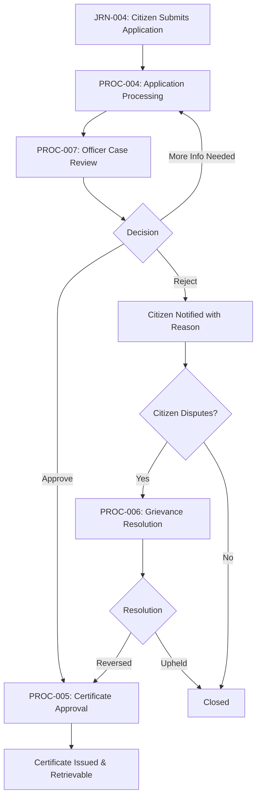

### Merchant Onboarding Lifecycle

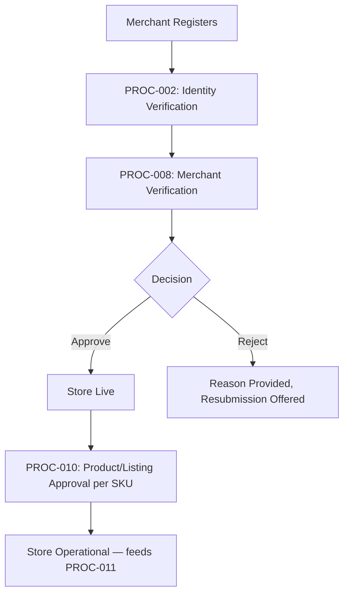

### Order Lifecycle

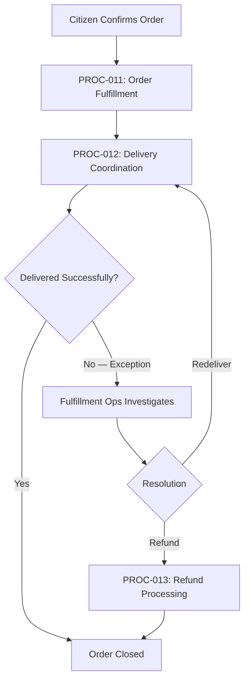

### Healthcare Appointment Lifecycle

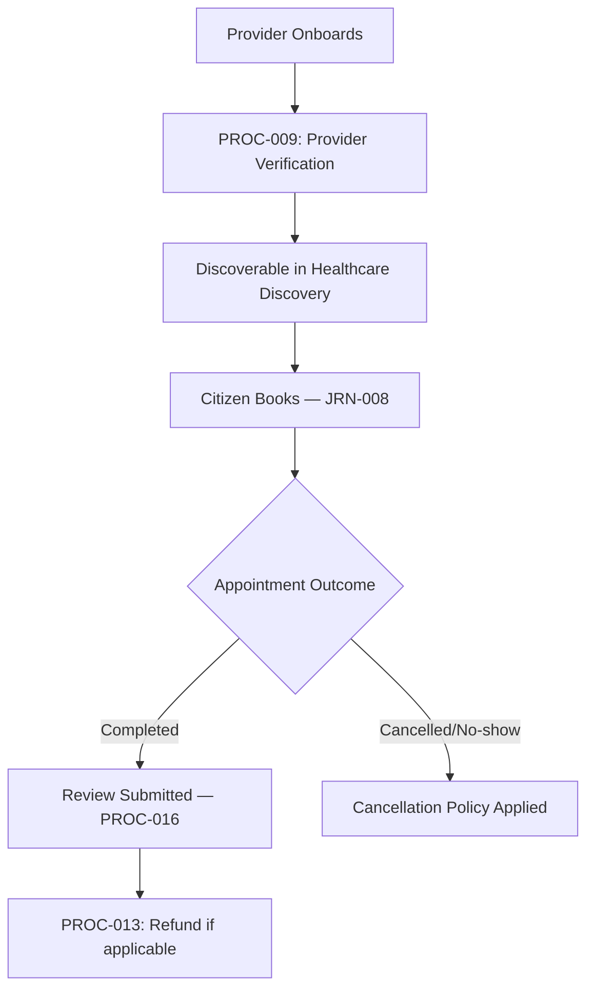

### Job Application Lifecycle

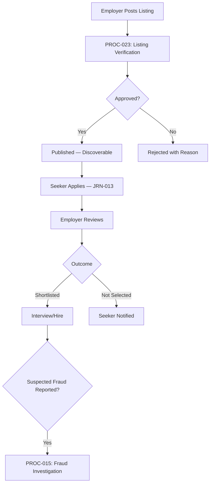

### Citizen Grievance Lifecycle

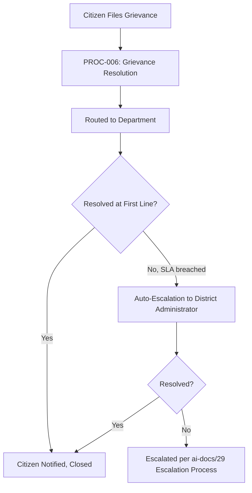

---

# Process State Model

Every process, regardless of classification, moves through the same lifecycle state machine — distinct from a process *definition's* own governance lifecycle (see Process Governance below).

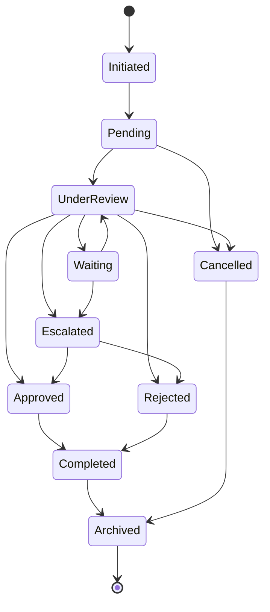

| State | Meaning |
|---|---|
| **Initiated** | The process instance has been triggered. |
| **Pending** | Awaiting the first actor's action. |
| **Under Review** | An actor is actively evaluating the case. |
| **Approved** | A positive decision has been made. |
| **Rejected** | A negative decision has been made, with a documented reason. |
| **Waiting** | Paused pending an external party or additional information. |
| **Escalated** | Could not resolve through the normal path; requires higher-tier intervention. |
| **Completed** | The process instance has reached its final outcome. |
| **Cancelled** | Deliberately terminated before completion (e.g., citizen withdraws). |
| **Archived** | Retained permanently for audit, excluded from active-case views. |

---

# Process Governance

### Process Ownership

Every process has exactly one named Business Owner and one named Process Owner per the Master Process Registry — mirroring the identical Clear Ownership discipline established for Domains, Capabilities, Modules, and Journeys. **Why this rule exists:** a process with ambiguous ownership degrades identically to every unowned artifact already named in this handbook — nobody notices drift until an auditor or citizen forces attention.

### Process Ownership RACI

| Activity | Responsible | Accountable | Consulted | Informed |
|---|---|---|---|---|
| Process definition/registration | Process Owner | Business Owner | Domain Owner, Compliance Officer | All Operations |
| Process SLA target-setting | Process Owner | Business Owner | Analytics Lead | Engineering Leadership Council |
| Process compliance review | Process Owner | Compliance Officer | Audit Lead | Business Owner |
| Process retirement decision | Process Owner | COO | Business Owner, Architecture Review Board | All Operations |
| Cross-process workflow redesign | Process Owners of involved processes | COO | UX Strategy Lead, Compliance Officer | Engineering Leadership |

### Review Cadence

| Review | Cadence | Owner | Purpose |
|---|---|---|---|
| **Quarterly Process Review** | Quarterly | COO, Chief Enterprise Architect | Registry accuracy, health scores, SLA-compliance trend. |
| **Compliance Review** | Aligned with `ai-docs/40`'s Quarterly Compliance Review | Compliance Officer | Confirms every Compliance/Government process meets its regulatory obligation. |
| **Process Ownership Review** | Quarterly | COO | Confirms every process has a current, active named owner; escalates any ownerless process. |
| **Cross-Process Consistency Review** | Semi-Annual | Chief Enterprise Architect | Confirms shared patterns (verification, approval, escalation) remain consistent across every process that has one. |

**Why this cadence exists:** a process well-designed at launch drifts as volumes, fraud patterns, and regulation evolve — the same risk `ai-docs/24-documentation-standards.md` names for documentation, applied here to lived organizational discipline.

### Approval Authority

Process changes follow the identical classification-based authority already established in `ai-docs/29-engineering-governance-decision-authority.md`: a new Core or Government/Compliance process requires COO + Compliance Officer approval; a Supporting/Administrative process change requires the Process Owner plus Business Owner sign-off.

### Version Control

Every process's Registry entry carries an implicit version via its last-updated date; a material change to a process's Steps, Approvals, or Business Rules is treated as a new version requiring the classification-appropriate approval above, never a silent in-place edit — mirroring `ai-docs/49-engineering-handbook-governance-evolution-standards.md`'s Version Management.

### Process Audits

Every process is audited per `ai-docs/40-engineering-compliance-audit-standards.md`'s Audit Types and cadence, with Mission Critical and Government processes subject to at least a monthly evidence-freshness check.

### Continuous Improvement Cycle

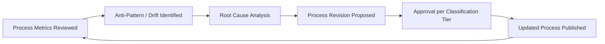

**Why this cycle exists:** a process that is only revised reactively, after a failure, is a process that fails citizens repeatedly before it improves — a scheduled continuous-improvement loop catches drift before it compounds.

---

# Process Metrics

| Metric | Definition | Why It Matters |
|---|---|---|
| **Cycle time** | Time from Initiated to Completed for a process instance. | The clearest signal of whether a process is actually efficient. |
| **Lead time** | Time from a citizen's trigger action to the first meaningful process response. | Measures responsiveness distinct from total resolution time. |
| **Resolution time** | Time from Under Review to a final Approved/Rejected decision. | Isolates the decisioning step's own efficiency from queueing delay. |
| **Error rate** | % of process instances requiring correction after an initial decision. | Surfaces where a process's own rules or execution are unreliable. |
| **Rework rate** | % of process instances re-processed due to an initial error or omission. | A high rate signals a process design flaw, not merely individual error. |
| **Compliance rate** | % of process instances meeting every applicable compliance requirement. | Directly threatens Arwal's trustworthiness if it declines. |
| **Automation rate** | % of process instances resolved without human intervention. | Tracks automation progress against the AI Process Strategy boundaries below. |
| **Citizen satisfaction** | Post-process CSAT/NPS-equivalent, where a citizen-facing outcome exists. | Measures the felt experience, not merely the mechanical outcome. |

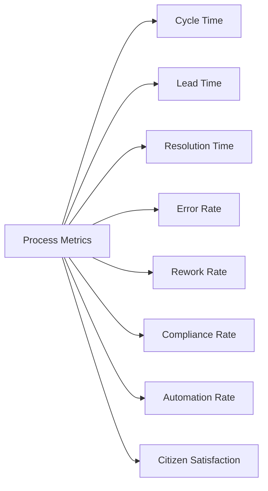

---

# AI Process Strategy

### Automation Boundaries

Automation is permitted to accelerate a process's routine, low-risk work (document extraction, duplicate detection, first-pass content screening) but never to make a final, unreviewable determination on a civic, financial, or reputation-affecting outcome — this boundary is absolute across every process in this catalog, mirroring the identical AI Capability Strategy already established in `ai-docs/55-business-capability-map.md`.

### Human Approval

Per the AI Principle already established in `ai-docs/00-project-vision.md`: no process's AI-assisted step may deny a citizen a service, block a transaction, or determine reputation without a human-reachable override path. Every process above naming an AI Opportunity is subject to this requirement without exception.

### Risk Controls

Every AI-assisted process step carries a defined fallback to full human review, a documented false-positive/false-negative tolerance, and a periodic recalibration review, per the Continuous Improvement discipline above.

### Explainability

An AI-influenced process outcome (a triage suggestion, a fraud flag, an eligibility pre-screen) states, in terms a human reviewer or an affected citizen can understand, why it was surfaced — never a bare, unexplained score.

### Responsible AI

Every AI-assisted process is evaluated against the Anti-Discrimination Safeguards already established in `ai-docs/52-user-personas-user-segmentation.md` — no sensitive-attribute targeting, no proxy discrimination, an equal-quality floor across every persona segment.

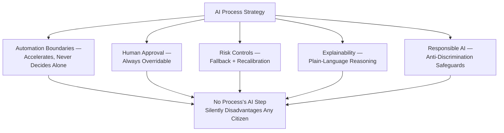

---

# Process Maturity Model

| Level | Name | Characteristics |
|---|---|---|
| **1 — Initial** | Process exists informally, undocumented, executed ad hoc without a distinct Catalog entry or owner. | High variance; no tracked metrics. |
| **2 — Managed** | Process is named, owned, and has at least one tracked metric, but decision criteria are inconsistently applied. | Basic Registry entry exists; reactive review cadence. |
| **3 — Defined** | Process's full Catalog entry is complete — every decision point has documented criteria, approvals, and escalation rules. | This document's standard is fully met. |
| **4 — Measured** | Process health is actively tracked against explicit thresholds; deviations trigger a defined response. | Process Metrics (above) is live and reviewed quarterly at minimum. |
| **5 — Optimized** | Process actively informs organizational strategy; its evolution is evidence-driven and proactive. | Feeds `ai-docs/48-engineering-strategic-planning-standards.md`'s Strategic Theme planning directly. |

Arwal's target state at the completion of Stage 2 is **Level 3 (Defined)** for every Core and Government process, with **Level 4 (Measured)** targeted as Stage 3 analytics tooling matures.

### Process Criticality Scoring

| Dimension | Weight | Question |
|---|---|---|
| **Citizen Safety/Financial Impact** | 40% | Could a process failure cause direct harm to a citizen's safety, health, or money? |
| **Trust Blast Radius** | 25% | Would a failure erode trust beyond this single process? |
| **Regulatory/Compliance Exposure** | 20% | Would a failure trigger a regulatory or government-partnership consequence? |
| **Reversibility** | 15% | How quickly and cleanly can a process failure be corrected? |

A composite score above 85% is **Mission Critical**; 65–84% is **High**; 40–64% is **Medium**; below 40% is **Low**.

### Process Health Scoring

| Health Band | Definition | Trigger |
|---|---|---|
| **Healthy** | Meeting or exceeding its stated SLAs/KPIs for 2+ consecutive review cycles. | No action required. |
| **Watch** | Trending below target on one or more metrics, not yet critical. | Flagged to the Process Owner for a remediation plan. |
| **At Risk** | Materially below target, or a Mission Critical process trending downward. | Escalated to the Quarterly Process Review. |
| **Failing** | Actively failing its core Business Objective (e.g., a certificate backlog growing unbounded). | Immediate executive escalation, per `ai-docs/29`'s Emergency classification. |

---

# Anti-Patterns

| Anti-Pattern | Description | Why It's Rejected |
|---|---|---|
| **Duplicate approvals** | Two roles independently re-approving the same decision with no added value. | Wastes capacity and obscures who is actually accountable; violates Clear Ownership. |
| **Unclear ownership** | A process with no current, active named Business Owner or Process Owner. | Produces exactly the drift `ai-docs/47-engineering-organizational-scaling-standards.md` names as a root cause of unresolved incidents. |
| **Manual bottlenecks** | A high-volume, low-risk decision requiring manual review that could be safely automated. | Violates Automation Where Appropriate; degrades citizen experience without a corresponding trust benefit. |
| **Hidden decisions** | A consequential decision made without a documented rule or reviewer. | Violates Accountability and Auditability; leaves nothing for a citizen or auditor to check. |
| **Untracked escalations** | An escalation that happens informally (a phone call, a hallway conversation) with no record. | Recreates the exact Undocumented Decisions anti-pattern already rejected in `ai-docs/29-engineering-governance-decision-authority.md`. |
| **Shadow processes** | A team maintaining its own informal, unpublished procedure that diverges from the documented process. | Violates Single Source of Truth and Transparency; recreates the Shadow Governance anti-pattern already rejected in `ai-docs/29`. |
| **Compliance gaps** | A process step that silently fails to meet a regulatory or audit requirement. | Directly threatens Arwal's civic mandate and government partnerships. |
| **Over-automation** | Removing human judgment from a decision that genuinely requires it (e.g., a suspension with no human sign-off). | Violates Human Oversight and the AI Principle's non-negotiable override requirement. |

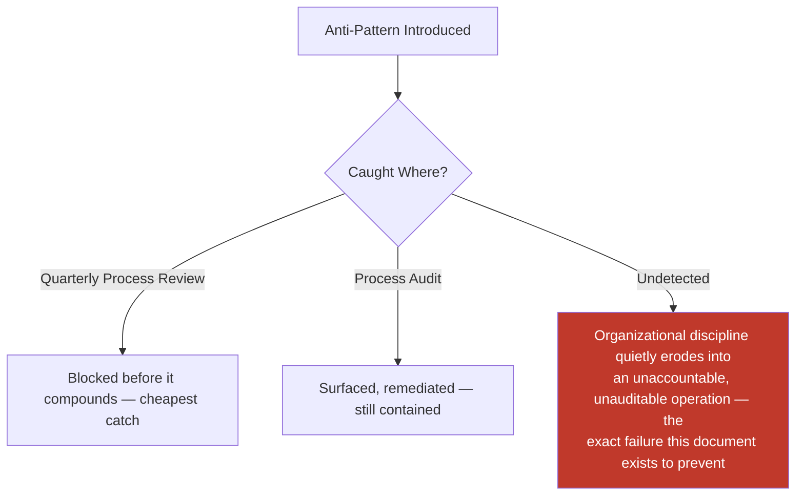

---

# Process Optimization Framework

Every process is optimized against a fixed, explicit priority order, mirroring the identical discipline already established in `ai-docs/56-user-journey-standards.md`'s Journey Optimization Framework:

1. **Compliance and correctness** — never traded for speed.
2. **Accountability and auditability** — a faster process that removes a documented decision trail is rejected.
3. **Citizen/partner experience** — reduced cycle time and clearer communication, once the above two are satisfied.
4. **Operational cost** — optimized last, never at the expense of the three above.

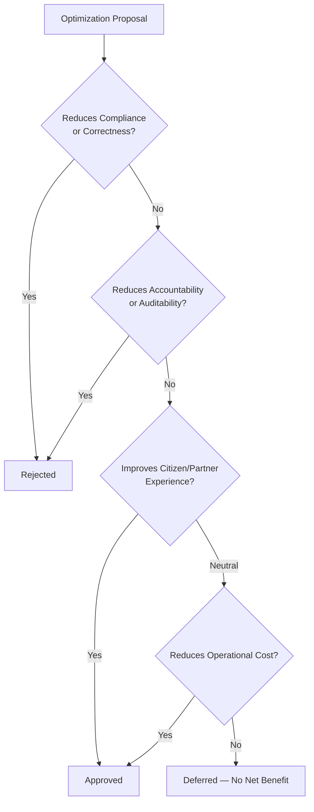

---

# Process Dependency Map

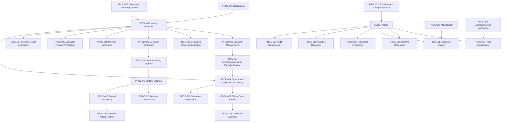

### Fan-In Table (Selected Processes)

| Process | Fan-In (Depended On By) | Review Rigor |
|---|---|---|
| PROC-001 Registration | Every other process | Highest |
| PROC-002 Identity Verification | ~10 processes | Highest |
| PROC-015 Fraud Investigation | Every transacting/verification process | High |
| PROC-017 Customer Support | Every citizen-facing process (escalation target) | High |
| PROC-021 Audit Management | Every process (audit subject) | High |

**Why this map exists:** a change to a high-fan-in process (Registration, Identity Verification) risks breaking every downstream process — this map makes that blast radius visible before a change is approved, mirroring `ai-docs/54-product-module-catalog.md`'s Module Dependency Heat Map.

---

# Process Reuse Strategy

Before a new process is proposed, the proposer must demonstrate that no existing process can be reasonably extended — mirroring the identical Capability Reuse Strategy already established in `ai-docs/55-business-capability-map.md`. In particular:

- A new "verify a supply-side actor" need is expressed as a variant of the shared verification pattern (PROC-008/009/023/024/026), never a bespoke new process.
- A new "resolve a dispute" need is expressed as a variant of Fraud Investigation (PROC-015) or Grievance Resolution (PROC-006), never duplicated.
- A new "approve a change" need is expressed as a variant of Configuration Change Approval (PROC-022), never a parallel, undocumented sign-off habit.

**Why this rule exists:** duplicated process patterns drift apart identically to duplicated capabilities — an officer trained on one verification pattern should be able to recognize the same discipline in every other verification process.

---

# Process Naming Conventions

- Process names are noun phrases describing an organizational action, never a technology or team name ("Certificate Approval," never "Civic Backend Workflow").
- Where two processes share a pattern (verification, approval, escalation), the shared structure is kept consistent, with the domain named only for disambiguation.
- A process name is never reused after retirement, mirroring the Immutable Numbers principle already established throughout this handbook.

---

# Process Lifecycle Roadmap

| Process / Capability | Trigger for Activation | Anticipated Horizon |
|---|---|---|
| Multi-District Configuration Change Approval (extension of PROC-022) | Founding-district trust and unit-economics criteria met | Year 5 |
| State-Level Government Application Processing (extension of PROC-004) | District-level civic modules demonstrate reliability at scale | Year 7–8 |
| Full AI Escalation maturity (PROC-020) | AI Capability Maturity Level 5, per `ai-docs/48` | Year 3–4 |
| Real-time Payment Reconciliation (PROC-014) | Transaction volume crosses a defined threshold | Year 2–3 |

---

# Process Glossary

| Term | Definition |
|---|---|
| **Process** | A governed, repeatable organizational sequence of actions, decisions, and approvals delivering a capability, independent of technology. |
| **Decision Point** | A moment within a process where an actor chooses between two or more outcomes. |
| **Escalation** | A process transitioning to a higher-authority or specialist actor because the normal path could not resolve it. |
| **Four-Eyes Approval** | A dual sign-off requirement for a high-severity decision, ensuring no single actor can unilaterally take a consequential action. |
| **Process Health** | A process's current operating condition against its own stated KPIs/SLAs, distinct from its structural Maturity. |
| **Evidence** | A retained, auditable artifact proving a process step occurred as documented. |

---

# Traceability

### Process → Journey Matrix

| Process | Related Journey(s) |
|---|---|
| PROC-001/002/003/028 | JRN-001, JRN-002, JRN-003 |
| PROC-004/005/006/007/027 | JRN-004, JRN-005, JRN-006 |
| PROC-008/009/023/024/026 | JRN-014, JRN-007, JRN-010, JRN-012, JRN-019/020 |
| PROC-010/011/012/013 | JRN-015, JRN-016, JRN-017, JRN-018, JRN-023, JRN-022 |
| PROC-014 | JRN-021 |
| PROC-015/016 | (cross-cutting, embedded in every transacting journey) |
| PROC-017 | JRN-028 |
| PROC-018 | JRN-025 |
| PROC-020 | JRN-027 |
| PROC-025 | JRN-024 |

### Process → Capability Matrix

| Process | Primary Capability(ies) |
|---|---|
| PROC-001 | Identity Verification (CAP-001), Authentication (CAP-002) |
| PROC-002 | Identity Verification (CAP-001), Delegated & Assisted Access (CAP-005) |
| PROC-003 | Consent Management (CAP-004) |
| PROC-004 | Government Application Processing (CAP-006) |
| PROC-005 | Certificate Issuance (CAP-007) |
| PROC-006 | Grievance Resolution (CAP-008) |
| PROC-007 | Officer Case Management (CAP-009) |
| PROC-008/009/023/024/026 | Provider Verification (CAP-016) |
| PROC-010 | Catalog Management (CAP-022), Content Moderation (CAP-037) |
| PROC-011 | Order Management (CAP-025), Inventory Management (CAP-023) |
| PROC-012 | Delivery Coordination (CAP-026) |
| PROC-013 | Refund Management (CAP-028) |
| PROC-014 | Payment Processing (CAP-027) |
| PROC-015 | Fraud Detection (CAP-038) |
| PROC-016 | Content Moderation (CAP-037) |
| PROC-017 | Help & Support (CAP-041) |
| PROC-018 | Notifications (CAP-031) |
| PROC-019 | Analytics (CAP-034) |
| PROC-020 | AI Assistance (CAP-033) |
| PROC-021 | Audit Logging (CAP-035) |
| PROC-022 | Configuration Management (CAP-040) |
| PROC-025 | Group & Cooperative Enablement (CAP-043) |
| PROC-027 | Scheme Eligibility Assessment (CAP-010), Scholarship Matching (CAP-018) |
| PROC-028 | Delegated & Assisted Access (CAP-005) |

### Process → Module Matrix

| Process | Primary Module(s) |
|---|---|
| PROC-001/002/003/028 | MOD-001, MOD-002, MOD-003, MOD-045 |
| PROC-004/005/006/007/027 | MOD-004, MOD-005, MOD-006, MOD-007, MOD-010, MOD-018, MOD-047 |
| PROC-008/009/023/024/026 | MOD-041 |
| PROC-010 | MOD-021 |
| PROC-011 | MOD-023, MOD-025, MOD-027 |
| PROC-012 | MOD-028, MOD-029 |
| PROC-013 | MOD-034 |
| PROC-014 | MOD-032, MOD-033 |
| PROC-015/016 | MOD-042, MOD-043, MOD-044 |
| PROC-017 | MOD-046 |
| PROC-018 | MOD-038 |
| PROC-019 | MOD-040 |
| PROC-020 | MOD-039 |
| PROC-022 | MOD-045, MOD-050 |
| PROC-025 | MOD-035, MOD-036 |

### Process → Domain Matrix

| Process | Primary Domain(s) |
|---|---|
| PROC-001/002/003/028 | Identity (DOM-001), Citizen (DOM-002) |
| PROC-004/005/006/007/027 | Government Services (DOM-003), Agriculture (DOM-004), Education (DOM-006) |
| PROC-008/009/010/023/024/026 | Administration (DOM-019), Trust & Safety (DOM-020) |
| PROC-011/012 | Commerce (DOM-008), Food (DOM-009), Grocery (DOM-010), Logistics (DOM-011) |
| PROC-013/014 | Payments (DOM-013) |
| PROC-015/016 | Trust & Safety (DOM-020) |
| PROC-017 | Citizen (DOM-002) |
| PROC-018 | Notifications (DOM-016) |
| PROC-019 | Analytics (DOM-018) |
| PROC-020 | AI Assistant (DOM-017) |
| PROC-025 | Community (DOM-014) |

### Process → Strategic Goal Matrix

| Process | Strategic Objective (`ai-docs/50`) |
|---|---|
| PROC-004/005/006/007 | Government Efficiency, Service Digitization |
| PROC-027 | Farmer Empowerment, Education Improvement |
| PROC-008/010/011/012/013 | Economic Growth, Business Enablement |
| PROC-009/026 | Healthcare Access, Education Improvement |
| PROC-023 | Employment Generation |
| PROC-015/016 | Sustainable Growth (trust dimension) |
| PROC-021 | Sustainable Growth, Government Efficiency (compliance dimension) |
| PROC-025 | Farmer Empowerment (SHG-adjacent), Cross-Vertical Adoption Depth |

---

# Executive Dashboards

### CEO Dashboard
- District Trust Signal contribution from process-level compliance/error rates
- Process Health Band distribution across Mission Critical processes
- Government Efficiency KPI trend (Government process cluster)

### COO Dashboard
- Process KPI summary across every classification
- Process ownership completeness (no ownerless process)
- Cycle time / resolution time trend by process, ranked by Criticality

### Compliance Dashboard
- Compliance rate per Compliance/Government process
- Open audit findings tied to a specific process
- CAPA completion rate feeding from `ai-docs/40`

### Trust & Safety Operations Dashboard
- Fraud Investigation (PROC-015) and Content Moderation (PROC-016) volume/turnaround
- Verification (PROC-008/009/023/024/026) turnaround and rejection-rate trend

### Government Partners Dashboard
- Government process cluster (PROC-004/005/006/007) completion time and escalation rate
- Grievance resolution time trend

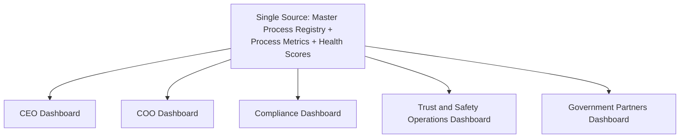

---

# Process Review Checklists

### Process Review Checklist

- [ ] Traceable to a Business Domain, Capability, Module, and Journey — never invented independently.
- [ ] Correctly classified per the Process Hierarchy above.
- [ ] Every Decision Point names its Approvals and Escalation Rules explicitly.
- [ ] KPIs and SLAs are defined before the process enters production use.
- [ ] Criticality and Maturity are scored using the explicit dimensions above, never assigned by impression.
- [ ] AI Opportunities, if any, carry a human-override path per AI Process Strategy.
- [ ] No anti-pattern present, per the Anti-Patterns table above.

### Process Compliance Checklist

- [ ] Every applicable regulatory or government-agreement obligation is named in Compliance Requirements.
- [ ] Restricted/Confidential-tier data handling matches `ai-docs/10-security-standards.md`'s classification.
- [ ] Every sensitive decision has a documented, named approver.
- [ ] No process step silently bypasses a required approval under time pressure.

### Process Audit Checklist

- [ ] Every decision produces evidence meeting `ai-docs/40`'s Quality Bar (contemporaneous, attributable, immutable, traceable).
- [ ] Evidence Owner is named and retention period matches `ai-docs/40`'s Evidence Catalog.
- [ ] The process's most recent audit findings (if any) are closed or have an active CAPA.

---

# Relationship with Previous Standards

### Project Vision & Product Goals

`ai-docs/00-project-vision.md` and `ai-docs/01-product-goals.md` establish the founding mission and measurable goals every process in this catalog ultimately serves. No process exists that cannot trace, through a Strategic Objective, back to a commitment already made there.

### Stakeholder Analysis & User Personas

`ai-docs/51-stakeholder-analysis.md` and `ai-docs/52-user-personas-user-segmentation.md` establish who Arwal serves and what each stakeholder/persona needs. Every process's citizen-facing steps are designed around the accessibility and trust needs already documented there, never inventing a new need independently.

### Business Domain Model

`ai-docs/53-business-domain-model.md` establishes who owns each business concern. Every process's Related Domains field cites that Registry directly — this document never redraws a domain boundary, only shows how the organization actually executes work within it.

### Product Module Catalog

`ai-docs/54-product-module-catalog.md` establishes the user-visible product surface. Every process's Related Modules field cites that Registry — a process is the organizational discipline standing behind a module's operation, never a redefinition of the module's own scope.

### Business Capability Map

`ai-docs/55-business-capability-map.md` establishes the stable business abilities underneath every module. Every process realizes one or more capabilities through governed human and system action — the capability is the *ability*; the process is *how the organization exercises it responsibly*.

### User Journey Standards

`ai-docs/56-user-journey-standards.md` establishes what it feels like for a citizen to move through Arwal. Every process's Related Journeys field cites that Registry — the journey is the citizen's lived experience; the process is the organization's accountable machinery standing behind it.

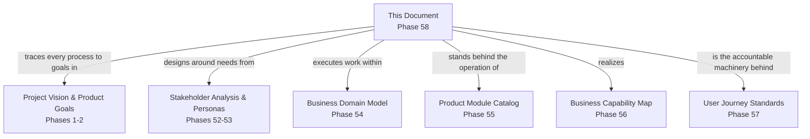

---

# Closing Statement

> **Callout — Closing Statement**
> A business capability tells everyone what Arwal can do. A user journey tells a citizen what it feels like to do it. A business process is the organizational discipline that makes both of those things trustworthy, repeatable, and defensible — the specific, named officer who approved a certificate, the documented reason a merchant was rejected, the four-eyes sign-off before an account is suspended, the evidence trail an auditor can follow without ever needing to ask "but how do we actually know this happened?" Business Processes transform Arwal's capabilities from things the platform *could* do into things the organization reliably, accountably, and transparently *does* — every day, at every scale, independent of which technology stack renders the screen or which team happens to be on shift. This is what allows Arwal to grow from a founding district to a state without losing the thing that earned it trust in the first place: not a feature list, but a governed way of working that a citizen, an auditor, and a government partner can all rely on equally. Where a future phase must deviate from a process defined here, that deviation is made explicitly — through the Process Governance approval workflow above — never silently, and never by default.

This document, `ai-docs/57-business-process-standards.md`, is Phase 58 of approximately 420. Every future operational workflow, approval chain, escalation path, and compliance procedure is expected to trace back to a process defined here, or to justify its deviation in writing.

**End of Phase 58 — `ai-docs/57-business-process-standards.md`**
