# Business Rules & Policies

**Document:** `ai-docs/58-business-rules-policies.md`
**Project:** Arwal — The District Super App
**Stage:** 2 — Product & Business Strategy
**Phase:** 59 — Business Rules & Policies
**Status:** Approved for Product & Engineering Reference
**Audience:** CEO, COO, CPO, CTO, Chief Enterprise Architect, Governance Director, Compliance Officer, Trust & Safety Lead, Government Digital Transformation Partners, Risk Management Consultants, Business Rules Architects, Product Managers, Engineering Directors

> **Callout — Purpose of This Document**
> `ai-docs/00-project-vision.md` through `ai-docs/57-business-process-standards.md` established why Arwal exists, what it can do, who it serves, what it feels like to use, and how the organization actually executes work. None of those documents answers a question every eligibility check, every approval, every rejection, and every exception now depends on: **what, precisely, is the rule?** A capability says Arwal *can* verify identity. A process says *who* verifies it and *in what sequence*. This document says the actual, citable rule an officer, a citizen, an auditor, and an engineer can all read identically: a citizen must be at least a specific age, must present one of a defined set of documents, and a rejection must state one of a fixed set of stated reasons. This document is that answer — the authoritative Business Rules & Policies every eligibility decision, approval, exception, and appeal traces back to.

---

# Purpose of this Document

### Why Business Rules Are a Distinct Layer

`ai-docs/57-business-process-standards.md` established the organizational sequence — who reviews an application, what approvals are required, how an escalation works. It deliberately left one thing unstated: the actual **rule** a reviewing officer applies to decide "approve" or "reject." A process tells you *who decides and in what order*; a Business Rule tells you *the precise logic they decide with*. Two officers following the same process but applying rules from memory will drift into different outcomes for the same fact pattern — this is precisely the inconsistency that erodes government-partner trust and citizen trust simultaneously. A Business Rule is the layer that makes a decision **repeatable**: the same facts, evaluated by any officer, any system, any future AI-assisted triage, produce the same outcome, every time, for a reason that can be quoted verbatim.

### The Relationship Chain

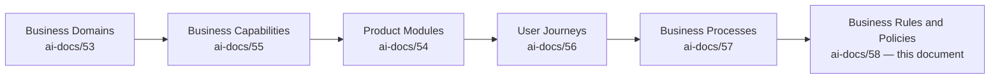

| Layer | Question It Answers |
|---|---|
| Domain | Who owns this concern? |
| Capability | What can be done? |
| Module | What does a citizen open? |
| Journey | What does it feel like? |
| Process | How does the organization do it — approvals, escalations, evidence? |
| **Business Rule** (this document) | **What, precisely, is the eligibility, validation, or decision logic?** |

> **Callout — A Rule Is Not a Process Restated**
> PROC-004 (`ai-docs/57`) describes the sequence a Government Application follows — routing, review, approval, escalation. RULE-014 (this document) describes the actual eligibility test the officer applies at the review step: which documents qualify, what age threshold applies, what disqualifies an applicant outright. The process is the machine; the rule is the logic running inside it. Every rule below cites its enacting process rather than re-describing the workflow.

### Why This Matters at Arwal's Scale

Without an explicit Business Rules layer:

1. **The same fact pattern produces different outcomes** depending on which officer, module, or AI model happens to evaluate it — an unacceptable inconsistency for a platform issuing government certificates and processing payments.
2. **Rules live only in code**, readable by nobody but an engineer, making it impossible for a government partner or auditor to verify Arwal's actual policy without reading source.
3. **Undocumented exceptions accumulate** into a shadow rulebook that contradicts the stated one, exactly the Hidden Capabilities and Shadow Processes failure modes already rejected in `ai-docs/55` and `ai-docs/57`.
4. **Regulatory change has no single place to land** — a new data-protection requirement must update one rule, not be hunted down across a hundred scattered `if` statements.
5. **AI-assisted decisioning has no explicit target** — an AI triage model can only be trained, evaluated, and bounded against a rule that is written down, versioned, and owned.

### Scope Boundary

This document does not redefine Domains, Capabilities, Modules, Journeys, or Processes — each remains fully authoritative for its own layer, cited here by reference. It does not define APIs, databases, UI, or implementation; a rule that names a table or an endpoint has been written at the wrong layer, exactly as `ai-docs/53` through `ai-docs/57` reject the same mistake at their own layers. This document's exclusive territory is: **eligibility, validation, permission, constraint, decision logic, obligation, and operational policy** — the logic every process executes and every module enforces, never redefined locally, always traced back here.

---

# Business Rule Principles

Every principle below exists because a rulebook assembled carelessly does not fail abstractly — it fails a citizen denied a certificate for no explainable reason, or an auditor unable to prove a decision was legitimate.

### Consistency
**Why it exists:** The same facts must produce the same outcome regardless of which officer, module, or AI model evaluates them. Consistency is what makes a rejection defensible and an approval trustworthy — inconsistency is functionally indistinguishable from arbitrariness to the citizen on the receiving end.

### Single Source of Truth
**Why it exists:** Every rule has exactly one authoritative statement, in exactly one place. A business rule re-implemented independently in two modules will drift the moment one is updated and the other is not — the identical Single Source of Truth discipline already established in `ai-docs/02-engineering-principles.md`, applied here to policy rather than code.

### Business-First Decisions
**Why it exists:** A rule is expressed in the language a citizen, officer, or government partner would recognize — never in terms of a database column or an API parameter. A rule that can only be understood by reading source code has failed its purpose as a governance artifact.

### Technology Independence
**Why it exists:** A rule must survive any technology migration untouched, mirroring the identical Technology Independent principle already established in `ai-docs/55-business-capability-map.md`. Arwal's eligibility rules for a certificate do not change because the backend framework changed.

### Auditability
**Why it exists:** Every rule application produces evidence sufficient to reconstruct, after the fact, exactly which rule fired, on what facts, with what outcome — per the Evidence Catalog discipline already established in `ai-docs/40-engineering-compliance-audit-standards.md`.

### Transparency
**Why it exists:** A citizen affected by a rule can see, in plain language, what the rule requires and why they did or did not meet it — never left to infer policy from a bare rejection, per the Trust and Transparency journey principle already established in `ai-docs/56-user-journey-standards.md`.

### Policy-Driven Governance
**Why it exists:** Operational decisions trace to a written, approved policy — never to informal precedent or "how we've always done it." A decision that cannot cite a rule is a decision made on assumption, not governance.

### Privacy-First
**Why it exists:** A rule requests and evaluates only the data genuinely required for its decision, per the Data Minimization & Consent principle already established in `ai-docs/00-project-vision.md`. A rule is never written to justify collecting more data than its own decision logic requires.

### Security-First
**Why it exists:** A rule's evaluation, storage, and audit trail are held to the data-classification standard of the sensitive-tier data it touches, per `ai-docs/10-security-standards.md` — a rule involving identity documents is never handled with the same laxity as a rule about a public catalog listing.

### Least Privilege
**Why it exists:** Only the actor genuinely required to apply or approve a rule may do so — a rule's Applies To and approval authority are scoped narrowly, mirroring the identical Least Privilege principle already established in `ai-docs/10-security-standards.md`.

### Accessibility
**Why it exists:** A rule's validation criteria and rejection language must be understandable and actionable by a low-literacy or assisted citizen, per `ai-docs/12-accessibility-standards.md` — a technically correct rule expressed in jargon has failed a meaningful share of Arwal's population.

### Fairness
**Why it exists:** A rule is evaluated identically regardless of a citizen's gender, caste, religion, disability, or migrant status, per the Anti-Discrimination Safeguards already established in `ai-docs/52-user-personas-user-segmentation.md`. A rule that produces disparate outcomes across protected groups is a defect, not an acceptable variance.

### Human Oversight
**Why it exists:** Per the AI Principle already established in `ai-docs/00-project-vision.md`, no rule may deny a citizen a service, block a transaction, or determine reputation through an automated decision alone, without a human-reachable override path.

### Regulatory Compliance
**Why it exists:** A rule touching government services, healthcare, or payments carries real legal consequence — every such rule is written to meet or exceed its applicable regulatory floor, never merely approximate it.

### Version Control
**Why it exists:** A rule silently changed is a rule an auditor, a citizen, or a downstream process can no longer trust to describe what actually happened at the time a decision was made — every rule change is versioned, dated, and attributable.

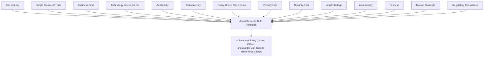

> **Callout — The One-Sentence Rule Philosophy**
> *"If two officers, applying this rule to the same facts on the same day, could reach different outcomes, it is not yet a rule — it is a suggestion wearing a rule's authority."*

---

# Rule Hierarchy

Every rule in the Master Rule Registry belongs to exactly one of fourteen classifications.

| Classification | Definition |
|---|---|
| **Enterprise Rules** | Cross-cutting rules every other classification depends on (identity, consent, audit). |
| **Identity Rules** | Registration, verification, delegation, and role-assignment logic. |
| **Citizen Rules** | Profile, preference, and citizen-rights logic. |
| **Government Service Rules** | Application eligibility, certificate issuance, scheme eligibility, grievance logic. |
| **Commerce Rules** | Merchant onboarding, listing, order, and fulfillment logic. |
| **Healthcare Rules** | Provider verification and appointment-integrity logic. |
| **Education Rules** | Provider verification and minor-safeguard logic. |
| **Employment Rules** | Listing verification and anti-exploitation logic. |
| **Payments Rules** | Transaction validation, refund eligibility, wallet logic. |
| **Community Rules** | Group registration and participation logic. |
| **AI Governance Rules** | Automation boundaries, explainability, human-override requirements. |
| **Compliance Rules** | Data retention, audit evidence, regulatory-obligation logic. |
| **Administrative Rules** | Account suspension, fraud handling, configuration-change logic. |
| **Future Rules** | Anticipated rules not yet active. |

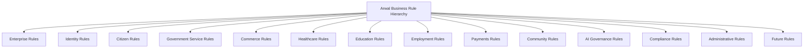

### Rule Taxonomy

| Axis | Values |
|---|---|
| **Nature** | Eligibility; Validation; Permission; Constraint; Decision Logic; Obligation |
| **Enforcement** | Deterministic (system-enforced); Judgment-Assisted (human applies, system checks); Advisory (guidance, not blocking) |
| **Risk Tier** | Critical; High; Medium; Low |

### Rule Naming Conventions

- A rule name is a plain-language statement of the constraint it enforces ("Minimum Age for Independent Registration"), never a technical or internal name.
- Where two rules share a pattern across verticals (verification, eligibility), the shared structure is kept consistent, disambiguated only by domain.
- A Rule ID is never reused after retirement, mirroring the Immutable Numbers principle already established throughout this handbook.

---

# Master Rule Registry

| Rule ID | Rule Name | Classification | Business Owner | Policy Owner | Criticality | Status | Review Frequency |
|---|---|---|---|---|---|---|---|
| RULE-001 | Minimum Age for Independent Registration | Identity | CPO | Compliance Officer | High | Active | Annual |
| RULE-002 | Identity Document Acceptance Criteria | Identity | Head of Platform Engineering | Compliance Officer | Mission Critical | Active | Semi-Annual |
| RULE-003 | Consent Requirement Before Data Use | Enterprise | CPO | Privacy Ops Lead | Mission Critical | Active | Quarterly |
| RULE-004 | Delegated Access Scope Limitation | Identity | Head of Accessibility & Inclusion | Verification Ops Lead | High | Active | Quarterly |
| RULE-005 | Account Dormancy and Reactivation | Citizen | CPO | Citizen Experience PM | Medium | Active | Annual |
| RULE-006 | Government Application Eligibility Baseline | Government Service | Head of Government Partnerships | Civic Ops Lead | Mission Critical | Active | Quarterly |
| RULE-007 | Certificate Issuance Approval Threshold | Government Service | Head of Government Partnerships | Civic Ops Lead | Mission Critical | Active | Quarterly |
| RULE-008 | Scheme Eligibility Determination | Government Service | Head of Government Partnerships | Civic Ops Lead | High | Active | Quarterly |
| RULE-009 | Grievance Escalation Window | Government Service | Head of Government Partnerships | Civic Ops Lead | High | Active | Semi-Annual |
| RULE-010 | Merchant Onboarding Eligibility | Commerce | Head of Merchant Success | Trust Ops Lead | Mission Critical | Active | Quarterly |
| RULE-011 | Product Listing Prohibited Content | Commerce | Head of Merchant Success | Trust Ops Lead | High | Active | Quarterly |
| RULE-012 | Order Cancellation Window | Commerce | Head of Merchant Success | Fulfillment Ops Lead | High | Active | Semi-Annual |
| RULE-013 | Refund Eligibility Criteria | Payments | Head of Payments | Payments Ops Lead | Mission Critical | Active | Quarterly |
| RULE-014 | Healthcare Provider Verification Standard | Healthcare | Head of Healthcare Vertical | Trust Ops Lead | Mission Critical | Active | Quarterly |
| RULE-015 | Appointment Cancellation Cutoff | Healthcare | Head of Healthcare Vertical | Trust Ops Lead | High | Active | Semi-Annual |
| RULE-016 | Education Provider Minor-Safeguard Standard | Education | Head of Education Vertical | Trust Ops Lead | High | Active | Quarterly |
| RULE-017 | Employment Listing Anti-Exploitation Standard | Employment | Head of Jobs Vertical | Trust Ops Lead | High | Active | Quarterly |
| RULE-018 | Payment Idempotency Enforcement | Payments | Head of Payments | Payments Ops Lead | Mission Critical | Active | Quarterly |
| RULE-019 | Wallet Balance and Transaction Limits | Payments | Head of Payments | Finance Ops Lead | High | Active | Semi-Annual |
| RULE-020 | Delivery Partner Eligibility | Commerce | Head of Logistics | Logistics Ops Lead | High | Active | Semi-Annual |
| RULE-021 | Community Group Representative Authority | Community | Head of Community Engagement | Community Ops Lead | Medium | Active | Semi-Annual |
| RULE-022 | Content Moderation Standard | Enterprise | Head of Trust & Safety | Trust Ops Lead | High | Active | Quarterly |
| RULE-023 | Notification Consent and Category Rules | Citizen | CPO | Platform Ops Lead | Medium | Active | Annual |
| RULE-024 | AI Automation Boundary | AI Governance | Head of AI Platform | AI Ops Lead | Mission Critical | Active | Quarterly |
| RULE-025 | Data Retention by Classification Tier | Compliance | Compliance Officer | Audit Lead | Mission Critical | Active | Semi-Annual |
| RULE-026 | Account Suspension Standard | Administrative | Head of Trust & Safety | Trust Ops Lead | Mission Critical | Active | Quarterly |
| RULE-027 | Fraud Enforcement Four-Eyes Requirement | Administrative | Head of Trust & Safety | Trust Ops Lead | Mission Critical | Active | Quarterly |
| RULE-028 | Appeal Rights and Window | Enterprise | Compliance Officer | Trust Ops Lead | High | Active | Semi-Annual |
| RULE-029 | Audit Evidence Sufficiency Standard | Compliance | Compliance Officer | Audit Lead | Mission Critical | Active | Semi-Annual |
| RULE-030 | Configuration Change Risk Classification | Administrative | Head of Platform Engineering | Platform Ops Lead | High | Active | Quarterly |
| RULE-031 | Role Assignment and Role Change Authority | Identity | Head of Platform Engineering | Verification Ops Lead | Mission Critical | Active | Quarterly |
| RULE-032 | Accessibility Non-Negotiable Floor | Enterprise | Head of Accessibility & Inclusion | Accessibility Lead | Mission Critical | Active | Annual |

> **Callout — Registry Governance**
> This Registry is reviewed at every Quarterly Rule Review (see Rule Governance below); a rule added, merged, or retired outside that cadence requires COO + Compliance Officer sign-off, mirroring the identical Registry discipline already established for Domains, Capabilities, Modules, Journeys, and Processes.

---

# Business Rule Catalog

## RULE-001 — Minimum Age for Independent Registration

| Field | Detail |
|---|---|
| **Purpose** | Determine the minimum age at which a citizen may independently register and hold an Arwal identity. |
| **Business Objective** | Protect minors while preserving genuine access for the majority of the population. |
| **Rule Statement** | A citizen must be at least 18 years old to independently register. A citizen aged 13–17 may only hold an account through a Delegated & Assisted Access grant (RULE-004) under a parent or guardian's supervision. A citizen under 13 may not hold an individual account under any circumstance. |
| **Scope** | Every registration attempt across every module. |
| **Applies To** | All prospective citizen accounts. |
| **Exceptions** | None — this rule has no discretionary override. |
| **Inputs** | Declared date of birth; where available, an ID document's stated date of birth. |
| **Outputs** | Registration permitted, registration routed to delegated-access flow, or registration blocked. |
| **Validation Criteria** | Declared age ≥ 18 → independent registration; 13 ≤ age < 18 → delegated flow only; age < 13 → blocked. |
| **Decision Logic** | See decision tree below. |
| **Dependencies** | Identity Document Acceptance Criteria (RULE-002). |
| **Related Processes** | PROC-001 Citizen Registration Processing. |
| **Related Journeys** | JRN-001 Citizen Registration. |
| **Related Capabilities** | Identity Verification (CAP-001). |
| **Related Modules** | MOD-001 Identity & Verification. |
| **Related Domains** | Identity (DOM-001). |
| **Compliance Requirements** | Aligned with applicable minor-data-protection regulation. |
| **Audit Requirements** | Every blocked or delegated-routed registration attempt logged with the declared age and outcome. |
| **Security Requirements** | Declared age is not solely self-attested where an ID document is available for cross-check. |
| **Privacy Requirements** | Date of birth is Confidential-tier; used only for this determination. |
| **Accessibility Considerations** | The age-gate message is plain-language and offers the delegated-access path directly, never a bare block. |
| **Risk Level** | High — an incorrect determination either excludes an eligible adult or exposes a minor. |
| **Violation Handling** | An account discovered to be held by an under-13 citizen is immediately suspended pending guardian contact. |
| **Escalation** | Ambiguous age evidence escalates to Verification Ops Lead. |
| **KPIs** | Age-gate accuracy; delegated-flow conversion rate for 13–17 cohort. |
| **Review Frequency** | Annual, or upon regulatory change. |
| **Versioning** | v1.0.0. |
| **Future Evolution** | State-level identity integration may enable direct age verification against a government source. |

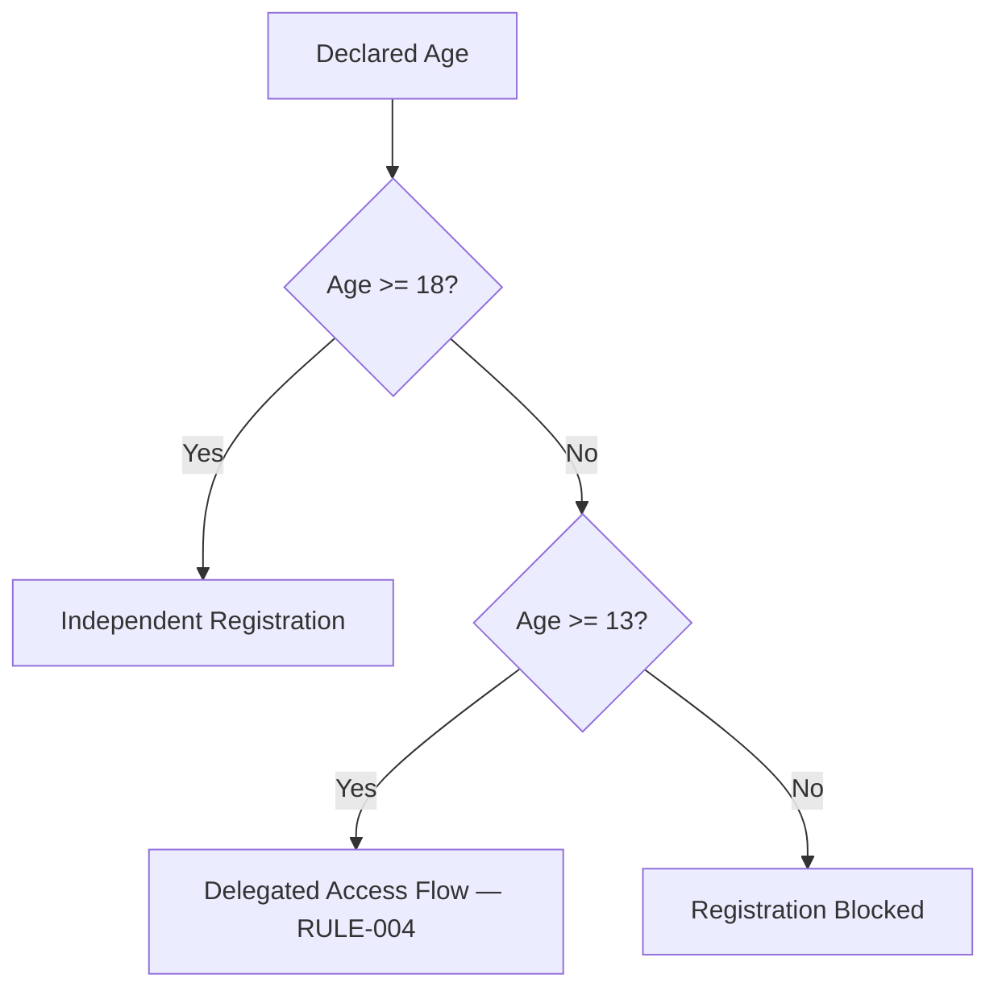

## RULE-002 — Identity Document Acceptance Criteria

| Field | Detail |
|---|---|
| **Purpose** | Define which documents are acceptable evidence of identity for verification. |
| **Business Objective** | Balance inclusion (accepting the documents citizens actually possess) against fraud prevention. |
| **Rule Statement** | An accepted primary document is one of: a government-issued photo ID, a government-issued non-photo ID paired with a secondary confirmation, or — where legally permissible and no standard document exists — an alternate-ID pathway per Delegated Access or field-agent attestation. A document must be legible, unexpired (where applicable), and match the declared name within a defined tolerance for transliteration variance. |
| **Scope** | Every identity, merchant, and provider verification event. |
| **Applies To** | PROC-002 Identity Verification Processing. |
| **Exceptions** | A citizen lacking any standard document may be verified via field-agent attestation, requiring dual sign-off (attesting agent + Verification Ops Lead). |
| **Inputs** | A submitted document image; declared name and date of birth. |
| **Outputs** | Accepted, rejected with a stated deficiency, or routed to the alternate-ID exception path. |
| **Validation Criteria** | Document type is on the accepted list; image legible; not expired; name match within tolerance. |
| **Decision Logic** | Automated first-pass match → high-confidence auto-accept; low-confidence or flagged → human review per PROC-002. |
| **Dependencies** | None. |
| **Related Processes** | PROC-002 Identity Verification Processing. |
| **Related Journeys** | JRN-002 Identity Verification. |
| **Related Capabilities** | Identity Verification (CAP-001), Provider Verification (CAP-016). |
| **Related Modules** | MOD-001 Identity & Verification. |
| **Related Domains** | Identity (DOM-001). |
| **Compliance Requirements** | Document classified Restricted-tier per `ai-docs/10-security-standards.md`. |
| **Audit Requirements** | Every decision immutably logged with reviewer identity and stated reason. |
| **Security Requirements** | File upload validated per `ai-docs/10-security-standards.md`'s File Upload Validation standard. |
| **Privacy Requirements** | Document retained only per the applicable regulatory retention window (RULE-025). |
| **Accessibility Considerations** | Camera-capture guidance with audio cues; delegated submission permitted. |
| **Risk Level** | Mission Critical — the trust foundation for every downstream role. |
| **Violation Handling** | A forged or manipulated document triggers immediate escalation to Fraud Investigation (PROC-015). |
| **Escalation** | Ambiguous document authenticity escalates to a senior Verification Ops reviewer. |
| **KPIs** | Verification completion rate; false-rejection rate; identity-fraud incident rate. |
| **Review Frequency** | Semi-Annual. |
| **Versioning** | v1.1.0. |
| **Future Evolution** | Direct government ID-database cross-check once state-level integration matures. |

## RULE-003 — Consent Requirement Before Data Use

| Field | Detail |
|---|---|
| **Purpose** | Ensure no capability accesses a category of citizen data without an explicit, current consent grant. |
| **Business Objective** | Make Data Minimization & Consent an enforceable, auditable operating fact. |
| **Rule Statement** | A capability may read or act on a category of citizen data only if an active, unexpired, unwithdrawn consent grant exists for that specific category and purpose. Consent is never inherited across unrelated purposes, and a withdrawal takes effect immediately with no grace period. |
| **Scope** | Every capability handling personal data of any classification tier. |
| **Applies To** | All citizen-facing and internal capabilities. |
| **Exceptions** | Data required for a legal or regulatory obligation (e.g., audit retention) may be retained even after consent withdrawal, but is never used for any purpose beyond that obligation. |
| **Inputs** | A citizen's consent decision; the requesting capability's declared purpose. |
| **Outputs** | Access granted, access denied, or an access attempt logged as a violation. |
| **Validation Criteria** | An active grant exists, matching both category and purpose. |
| **Decision Logic** | See decision tree below. |
| **Dependencies** | None — this is a foundational, cross-cutting rule. |
| **Related Processes** | PROC-003 Consent Management. |
| **Related Journeys** | JRN-003 Profile Completion, JRN-029 Settings Management. |
| **Related Capabilities** | Consent Management (CAP-004). |
| **Related Modules** | MOD-002 Citizen Profile, MOD-045 Settings. |
| **Related Domains** | Citizen (DOM-002). |
| **Compliance Requirements** | Consent records immutable and append-only. |
| **Audit Requirements** | Every grant, withdrawal, and access-check outcome logged. |
| **Security Requirements** | Consent enforcement checked at every data-access point, never only at intake. |
| **Privacy Requirements** | This rule's entire purpose is privacy enforcement. |
| **Accessibility Considerations** | Consent prompts are plain-language, never legal jargon. |
| **Risk Level** | Mission Critical. |
| **Violation Handling** | An access without matching consent is a Sev 1 compliance incident, escalated immediately per `ai-docs/40`. |
| **Escalation** | Detected enforcement gap escalates to Privacy Ops Lead and Compliance Officer immediately. |
| **KPIs** | Consent-honoring compliance rate (target: 100%). |
| **Review Frequency** | Quarterly. |
| **Versioning** | v1.0.0. |
| **Future Evolution** | Granular, per-field consent as regulatory maturity permits. |

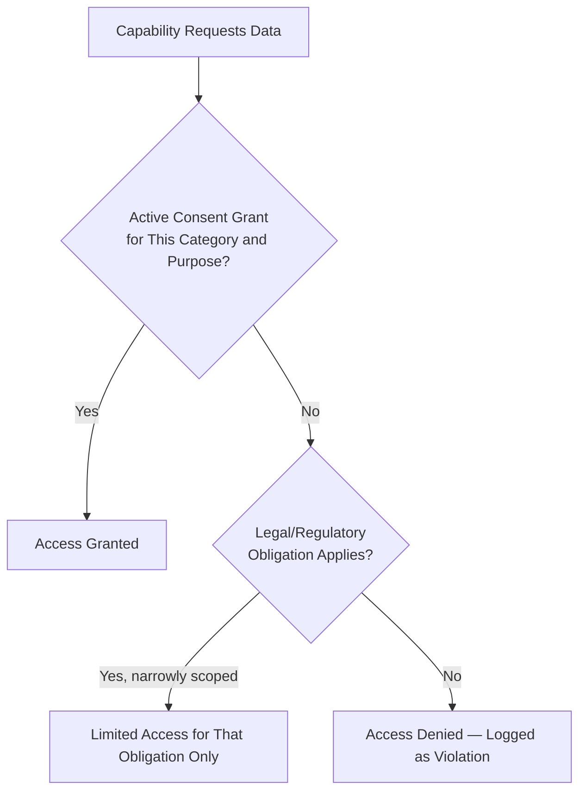

## RULE-004 — Delegated Access Scope Limitation

| Field | Detail |
|---|---|
| **Purpose** | Bound what a delegate may do on a citizen's behalf, preventing abuse while preserving genuine assistance. |
| **Business Objective** | Serve PER-019 Devendra and PER-021 Lakshmi's needs without opening a fraud vector. |
| **Rule Statement** | A delegation grant is always scoped (full or limited) and time-bound or indefinite-but-revocable; a delegate may never perform an action outside the granted scope, and every delegated action is logged and visible to the delegator. A delegate cannot grant further delegation (no sub-delegation) without the original delegator's explicit re-authorization. |
| **Scope** | Every action performed under a Delegated & Assisted Access grant. |
| **Applies To** | Government service applications, commerce purchases, and any capability the delegator's scope covers. |
| **Exceptions** | None — scope is never silently expanded. |
| **Inputs** | The delegation grant's declared scope; the delegate's attempted action. |
| **Outputs** | Action permitted or blocked with a stated reason. |
| **Validation Criteria** | The attempted action falls within the granted scope and the grant has not expired or been revoked. |
| **Decision Logic** | An out-of-scope attempt is blocked and flagged for Verification Ops review. |
| **Dependencies** | Minimum Age for Independent Registration (RULE-001) for the delegator. |
| **Related Processes** | PROC-028 Delegated Access Authorization. |
| **Related Journeys** | JRN-002 Identity Verification (delegated path). |
| **Related Capabilities** | Delegated & Assisted Access (CAP-005). |
| **Related Modules** | MOD-003 Delegated & Assisted Access. |
| **Related Domains** | Identity (DOM-001). |
| **Compliance Requirements** | Delegated actions audited with the same rigor as the delegator's own actions. |
| **Audit Requirements** | Full delegated-action audit trail retained per RULE-025. |
| **Security Requirements** | Delegation never bypasses authentication entirely. |
| **Privacy Requirements** | Delegator retains full visibility and revocation power at all times. |
| **Accessibility Considerations** | The single most accessibility-critical rule in this catalog, per `ai-docs/56`'s treatment of CAP-005. |
| **Risk Level** | High. |
| **Violation Handling** | A pattern suggesting delegate abuse triggers immediate grant suspension pending investigation. |
| **Escalation** | Suspected abuse escalates to Verification Ops Lead. |
| **KPIs** | Delegated-flow completion rate; delegate-abuse incident rate (target: zero). |
| **Review Frequency** | Quarterly. |
| **Versioning** | v1.0.0. |
| **Future Evolution** | Multi-delegate household patterns. |

## RULE-005 — Account Dormancy and Reactivation

| Field | Detail |
|---|---|
| **Purpose** | Define when an inactive account is marked dormant and how it is reactivated. |
| **Business Objective** | Balance data-minimization (not retaining active-state data indefinitely) against a genuine returning citizen's convenience. |
| **Rule Statement** | An account with no activity for 12 consecutive months is marked Dormant. A Dormant account retains its verified identity and history but is excluded from active-engagement metrics and marketing communication. Reactivation requires only a successful login (OTP), never re-verification, unless the account's verification itself has separately expired. |
| **Scope** | Every citizen account. |
| **Applies To** | All registered citizens. |
| **Exceptions** | A merchant or provider account is never marked dormant while it holds a live, unresolved order or booking. |
| **Inputs** | Last-activity timestamp. |
| **Outputs** | Active, Dormant, or Reactivated status. |
| **Validation Criteria** | 12 months with no login or transaction. |
| **Decision Logic** | Automated, scheduled evaluation; no human review required for standard dormancy marking. |
| **Dependencies** | None. |
| **Related Processes** | PROC-001 Citizen Registration Processing (adjacent). |
| **Related Journeys** | JRN-001 Citizen Registration. |
| **Related Capabilities** | Citizen Profile Management (CAP-003). |
| **Related Modules** | MOD-002 Citizen Profile. |
| **Related Domains** | Citizen (DOM-002). |
| **Compliance Requirements** | Dormant-account data handled per its original classification tier, never downgraded. |
| **Audit Requirements** | Dormancy and reactivation events logged. |
| **Security Requirements** | Reactivation requires standard OTP authentication. |
| **Privacy Requirements** | Dormant data is not proactively purged before its retention window (RULE-025) closes. |
| **Accessibility Considerations** | A reactivation prompt is plain-language, never framed as a re-verification burden. |
| **Risk Level** | Medium. |
| **Violation Handling** | N/A — a deterministic, low-risk rule. |
| **Escalation** | None routine. |
| **KPIs** | Reactivation rate. |
| **Review Frequency** | Annual. |
| **Versioning** | v1.0.0. |
| **Future Evolution** | Configurable dormancy windows per district as expansion matures. |

## RULE-006 — Government Application Eligibility Baseline

| Field | Detail |
|---|---|
| **Purpose** | Define the minimum baseline every government application must meet before it can enter departmental review. |
| **Business Objective** | Prevent incomplete or ineligible applications from consuming officer review capacity. |
| **Rule Statement** | An application is eligible for departmental review only if: (1) the submitting citizen's identity is verified (RULE-002), (2) every department-declared mandatory field is complete, (3) every mandatory supporting document is attached and legible, and (4) any department-specific baseline eligibility criterion (e.g., residency) is met. An application failing any criterion is returned to the citizen with the specific unmet criterion stated, never routed to an officer's queue incomplete. |
| **Scope** | Every government service application across every department. |
| **Applies To** | PROC-004 Government Application Processing. |
| **Exceptions** | A department may, via a documented departmental configuration, permit a defined subset of fields to be completed after initial submission (e.g., a pending inspection report) — this exception must be explicitly configured, never assumed. |
| **Inputs** | Submitted form data, attached documents, verification status. |
| **Outputs** | Eligible for review, or returned with a stated deficiency. |
| **Validation Criteria** | All four baseline criteria satisfied. |
| **Decision Logic** | Automated pre-check before an application is added to an officer's queue. |
| **Dependencies** | Identity Document Acceptance Criteria (RULE-002). |
| **Related Processes** | PROC-004 Government Application Processing. |
| **Related Journeys** | JRN-004 Government Certificate Application. |
| **Related Capabilities** | Government Application Processing (CAP-006). |
| **Related Modules** | MOD-005 Applications. |
| **Related Domains** | Government Services (DOM-003). |
| **Compliance Requirements** | Baseline criteria configured per government agreement, never unilaterally by Arwal. |
| **Audit Requirements** | Every returned application logged with the specific unmet criterion. |
| **Security Requirements** | Document upload validated per `ai-docs/10-security-standards.md`. |
| **Privacy Requirements** | Document data Restricted-tier. |
| **Accessibility Considerations** | Delegated submission permitted per RULE-004. |
| **Risk Level** | Mission Critical. |
| **Violation Handling** | A misconfigured baseline that incorrectly blocks eligible citizens is treated as a Sev 2 incident. |
| **Escalation** | A citizen disputing a "returned" determination may escalate via Grievance Submission (JRN-006). |
| **KPIs** | % of applications passing baseline on first submission. |
| **Review Frequency** | Quarterly. |
| **Versioning** | v1.0.0. |
| **Future Evolution** | Multi-department joint-application baseline criteria. |

## RULE-007 — Certificate Issuance Approval Threshold

| Field | Detail |
|---|---|
| **Purpose** | Define which certificate classes require single-officer approval versus dual-control (four-eyes) approval. |
| **Business Objective** | Apply elevated scrutiny proportional to a certificate's downstream consequence, without slowing every certificate to the highest standard. |
| **Rule Statement** | A certificate class is classified Standard (single-officer approval sufficient) or Elevated (requires officer + supervisor co-sign) at the time the department configures it. A certificate conferring a financial benefit, a legal status change, or a government-benefit eligibility is Elevated by default; a purely informational or low-consequence certificate is Standard by default. A department may not reclassify Elevated to Standard without Compliance Officer sign-off. |
| **Scope** | Every certificate class across every department. |
| **Applies To** | PROC-005 Certificate Approval. |
| **Exceptions** | None on the Elevated default without explicit Compliance Officer sign-off. |
| **Inputs** | The certificate class's configured classification. |
| **Outputs** | Single-approval or dual-control issuance path. |
| **Validation Criteria** | Classification matches the default unless an approved exception exists. |
| **Decision Logic** | See decision tree below. |
| **Dependencies** | Government Application Eligibility Baseline (RULE-006). |
| **Related Processes** | PROC-005 Certificate Approval. |
| **Related Journeys** | JRN-004 Government Certificate Application. |
| **Related Capabilities** | Certificate Issuance (CAP-007). |
| **Related Modules** | MOD-004 Certificates. |
| **Related Domains** | Government Services (DOM-003). |
| **Compliance Requirements** | Classification reviewed at Certificate Approval's Quarterly review, per `ai-docs/57`. |
| **Audit Requirements** | Tamper-evident issuance record with every approver's identity. |
| **Security Requirements** | Dual-control co-signer independence verified (not the same individual acting twice). |
| **Privacy Requirements** | Certificate content Restricted-tier. |
| **Accessibility Considerations** | N/A — internal decision logic. |
| **Risk Level** | Mission Critical. |
| **Violation Handling** | An Elevated certificate issued via a single approval is treated as a Critical audit finding. |
| **Escalation** | A disputed classification escalates to Compliance Officer. |
| **KPIs** | Application-to-issuance time by classification tier. |
| **Review Frequency** | Quarterly. |
| **Versioning** | v1.0.0. |
| **Future Evolution** | Risk-tiered auto-triage with mandatory human sign-off retained. |

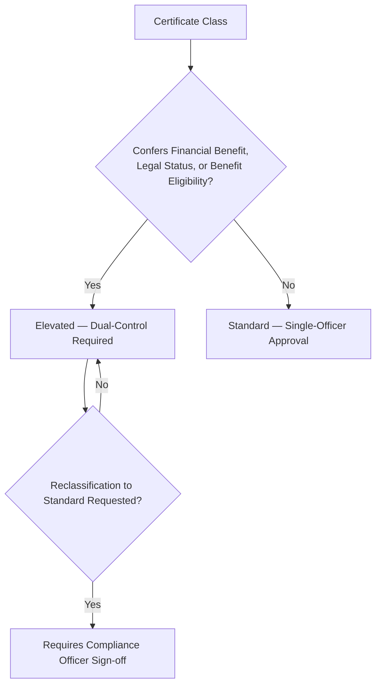

## RULE-008 — Scheme Eligibility Determination

| Field | Detail |
|---|---|
| **Purpose** | Define how a citizen's eligibility for a government scheme or scholarship is computed. |
| **Business Objective** | Ensure eligible citizens are never wrongly excluded and ineligible citizens are never wrongly approved. |
| **Rule Statement** | Eligibility is computed strictly from the scheme's published, versioned rule set, applied only to explicitly consented citizen attributes (RULE-003). A "not eligible" determination always states the specific unmet criterion by name. A determination is recalculated, never assumed static, whenever either the underlying scheme rule or the citizen's consented attribute changes. |
| **Scope** | Every scheme and scholarship eligibility check. |
| **Applies To** | PROC-027 Scholarship/Scheme Eligibility Review. |
| **Exceptions** | None — no discretionary override of a published rule without a formal rule-version change. |
| **Inputs** | Scheme rule set (versioned); consented citizen attributes. |
| **Outputs** | Eligible, not eligible (with stated reason), or indeterminate (missing consent for a required attribute). |
| **Validation Criteria** | Every scheme criterion evaluated against a consented, current attribute. |
| **Decision Logic** | Deterministic rule evaluation; no AI substitution for the determination itself (AI may pre-screen, per RULE-024). |
| **Dependencies** | Consent Requirement Before Data Use (RULE-003). |
| **Related Processes** | PROC-027 Scholarship/Scheme Eligibility Review. |
| **Related Journeys** | JRN-005 Scheme Eligibility Check, JRN-011 Scholarship Discovery. |
| **Related Capabilities** | Scheme Eligibility Assessment (CAP-010), Scholarship Matching (CAP-018). |
| **Related Modules** | MOD-010 Government Schemes Discovery, MOD-018 Scholarships & Opportunities. |
| **Related Domains** | Government Services (DOM-003), Agriculture (DOM-004), Education (DOM-006). |
| **Compliance Requirements** | Per-scheme, granular consent — never a blanket profile-sharing grant. |
| **Audit Requirements** | Every determination logged with the rule version applied. |
| **Security Requirements** | Standard authenticated access. |
| **Privacy Requirements** | Consented attributes only. |
| **Accessibility Considerations** | Voice-first query supported per PER-002 Meena's needs. |
| **Risk Level** | High. |
| **Violation Handling** | A pattern of disputed determinations for one scheme triggers a rule-accuracy review. |
| **Escalation** | Disputed determinations escalate to Civic Ops Lead. |
| **KPIs** | Scheme-eligibility-to-application conversion rate. |
| **Review Frequency** | Quarterly. |
| **Versioning** | v1.0.0. |
| **Future Evolution** | Proactive, notification-driven matching as new schemes are added. |

## RULE-009 — Grievance Escalation Window

| Field | Detail |
|---|---|
| **Purpose** | Define the maximum time a grievance may remain unresolved before automatic escalation. |
| **Business Objective** | Guarantee no civic complaint is silently abandoned. |
| **Rule Statement** | A grievance unresolved 10 business days after filing auto-escalates from the first-line officer to the District Administrator tier. A citizen may request escalation manually at any time regardless of the elapsed window. |
| **Scope** | Every filed grievance. |
| **Applies To** | PROC-006 Grievance Resolution. |
| **Exceptions** | A grievance explicitly marked "awaiting citizen response" pauses the window until the citizen replies. |
| **Inputs** | Grievance filing timestamp; current resolution status. |
| **Outputs** | Escalated or remains at first line. |
| **Validation Criteria** | 10 business days elapsed with no resolution and no citizen-response pause active. |
| **Decision Logic** | Automated, scheduled check. |
| **Dependencies** | None. |
| **Related Processes** | PROC-006 Grievance Resolution. |
| **Related Journeys** | JRN-006 Grievance Submission. |
| **Related Capabilities** | Grievance Resolution (CAP-008). |
| **Related Modules** | MOD-006 Grievances. |
| **Related Domains** | Government Services (DOM-003). |
| **Compliance Requirements** | Window aligned with any government-agreement SLA, taking the shorter of the two. |
| **Audit Requirements** | Escalation timestamp logged. |
| **Security Requirements** | N/A. |
| **Privacy Requirements** | Grievance content visible only to the citizen and assigned officer/administrator. |
| **Accessibility Considerations** | Escalation status visible in plain language. |
| **Risk Level** | High. |
| **Violation Handling** | A grievance escalated twice without resolution triggers a mandatory postmortem. |
| **Escalation** | Per the rule itself. |
| **KPIs** | Grievance resolution time; escalation rate. |
| **Review Frequency** | Semi-Annual. |
| **Versioning** | v1.0.0. |
| **Future Evolution** | Department-specific windows as civic maturity grows. |

## RULE-010 — Merchant Onboarding Eligibility

| Field | Detail |
|---|---|
| **Purpose** | Define the minimum requirements for a merchant to be approved to sell on Arwal. |
| **Business Objective** | Protect citizen trust in the marketplace while keeping onboarding radically simple, per `ai-docs/50`'s Business Enablement objective. |
| **Rule Statement** | A merchant is eligible for a live storefront only if: (1) the merchant's own identity is verified (RULE-002), (2) business-existence evidence is provided (a registration document, or — for an informal sole proprietor — a field-agent attestation), and (3) the merchant has not been previously suspended for fraud under RULE-026 within the prior 12 months. |
| **Scope** | Every prospective merchant account. |
| **Applies To** | PROC-008 Merchant Verification. |
| **Exceptions** | A previously suspended merchant may reapply after 12 months with Trust Ops Lead review. |
| **Inputs** | Identity verification status; business-existence evidence; suspension history. |
| **Outputs** | Approved, rejected with stated reason, or routed to manual review. |
| **Validation Criteria** | All three criteria satisfied. |
| **Decision Logic** | Automated check for clear cases; manual Trust Ops review for ambiguous evidence. |
| **Dependencies** | Identity Document Acceptance Criteria (RULE-002), Account Suspension Standard (RULE-026). |
| **Related Processes** | PROC-008 Merchant Verification. |
| **Related Journeys** | JRN-014 Merchant Onboarding. |
| **Related Capabilities** | Merchant Onboarding (CAP-021), Provider Verification (CAP-016). |
| **Related Modules** | MOD-041 Merchant/Provider Verification. |
| **Related Domains** | Administration (DOM-019), Commerce Marketplace (DOM-008). |
| **Compliance Requirements** | Verification documents Restricted-tier. |
| **Audit Requirements** | Every decision immutably logged. |
| **Security Requirements** | A store cannot accept live orders before this rule's outcome is Approved. |
| **Privacy Requirements** | Merchant financial details never exposed beyond checkout necessity. |
| **Accessibility Considerations** | Radically simplified submission per PER-010 Suresh's needs. |
| **Risk Level** | Mission Critical. |
| **Violation Handling** | An unverified merchant found live is immediately suspended pending re-verification. |
| **Escalation** | Ambiguous business-existence evidence escalates to Trust Ops Lead. |
| **KPIs** | Verification turnaround time. |
| **Review Frequency** | Quarterly. |
| **Versioning** | v1.0.0. |
| **Future Evolution** | Risk-tiered auto-triage with mandatory human sign-off. |

## RULE-011 — Product Listing Prohibited Content

| Field | Detail |
|---|---|
| **Purpose** | Define what a merchant may never list on Arwal. |
| **Business Objective** | Protect citizen safety and platform legality. |
| **Rule Statement** | A listing is prohibited if it depicts or offers: an illegal good or service under applicable law; a counterfeit or misrepresented product; a good requiring a regulated license the merchant has not demonstrated (e.g., certain pharmaceuticals); or content that is misleading about price, availability, or origin. A prohibited listing is never published, regardless of automated-screen confidence — any ambiguous case defaults to held-for-review, never auto-published. |
| **Scope** | Every catalog listing across Commerce, Food, and Grocery. |
| **Applies To** | PROC-010 Product/Listing Approval. |
| **Exceptions** | None — the prohibited-content list itself may only be amended via Compliance Officer sign-off. |
| **Inputs** | Listing content (title, description, images, category, price). |
| **Outputs** | Published, held for review, or rejected. |
| **Validation Criteria** | No prohibited-category match; no misleading-content flag. |
| **Decision Logic** | Automated screen with a fail-closed default for ambiguous cases. |
| **Dependencies** | Merchant Onboarding Eligibility (RULE-010). |
| **Related Processes** | PROC-010 Product/Listing Approval. |
| **Related Journeys** | JRN-015 Store Management. |
| **Related Capabilities** | Catalog Management (CAP-022), Content Moderation (CAP-037). |
| **Related Modules** | MOD-021 Merchant Store. |
| **Related Domains** | Commerce Marketplace (DOM-008), Trust & Safety (DOM-020). |
| **Compliance Requirements** | Aligned with applicable product and advertising regulation. |
| **Audit Requirements** | Every held/rejected decision logged with reason. |
| **Security Requirements** | No injection of unsafe content through listing fields. |
| **Privacy Requirements** | N/A. |
| **Accessibility Considerations** | Simplified listing-entry flow with clear prohibited-category guidance shown upfront. |
| **Risk Level** | High. |
| **Violation Handling** | Repeated violations escalate to Merchant Verification re-review (RULE-010) and possible suspension (RULE-026). |
| **Escalation** | Ambiguous cases escalate to Trust Ops Lead. |
| **KPIs** | Moderation turnaround time; policy-violation recurrence rate. |
| **Review Frequency** | Quarterly. |
| **Versioning** | v1.0.0. |
| **Future Evolution** | Bulk/wholesale listing review depth for B2B. |

## RULE-012 — Order Cancellation Window

| Field | Detail |
|---|---|
| **Purpose** | Define when a citizen or merchant may cancel an order without penalty. |
| **Business Objective** | Balance citizen flexibility against merchant fulfillment-cost fairness. |
| **Rule Statement** | A citizen may cancel a Commerce or Grocery order free of charge before the merchant marks it "preparing/packing." A Food order may be cancelled free of charge only within 2 minutes of placement, given immediate kitchen-preparation start. A merchant-initiated cancellation (e.g., stock unavailable) is always free to the citizen and triggers an automatic full refund. |
| **Scope** | Every order across Marketplace, Food, and Grocery. |
| **Applies To** | PROC-011 Order Fulfillment. |
| **Exceptions** | A citizen with a documented emergency (e.g., a failed delivery address) may request a Fulfillment Ops Lead exception beyond the standard window. |
| **Inputs** | Order timestamp; current fulfillment state; cancellation request timestamp. |
| **Outputs** | Free cancellation, penalized cancellation, or cancellation denied with a stated reason. |
| **Validation Criteria** | Fulfillment state has not passed the defined cutoff. |
| **Decision Logic** | Deterministic, state-based check. |
| **Dependencies** | None. |
| **Related Processes** | PROC-011 Order Fulfillment. |
| **Related Journeys** | JRN-016/017/018 Purchase/Food/Grocery Ordering. |
| **Related Capabilities** | Order Management (CAP-025). |
| **Related Modules** | MOD-023/025/027 Orders. |
| **Related Domains** | Commerce (DOM-008), Food (DOM-009), Grocery (DOM-010). |
| **Compliance Requirements** | Cancellation policy disclosed to the citizen before checkout confirmation. |
| **Audit Requirements** | Cancellation reason and timestamp logged. |
| **Security Requirements** | Idempotency-protected cancellation processing. |
| **Privacy Requirements** | N/A. |
| **Accessibility Considerations** | Cancellation policy stated in plain language before purchase confirmation, never buried in terms. |
| **Risk Level** | Medium. |
| **Violation Handling** | A merchant systematically cancelling after the free-cancellation window (to avoid stock loss) is flagged for Fraud Investigation (PROC-015). |
| **Escalation** | Disputed cancellation eligibility escalates to Fulfillment Ops Lead. |
| **KPIs** | Cancellation rate; cancellation-dispute rate. |
| **Review Frequency** | Semi-Annual. |
| **Versioning** | v1.0.0. |
| **Future Evolution** | Vertical-specific cutoff tuning based on observed fulfillment-speed data. |

## RULE-013 — Refund Eligibility Criteria

| Field | Detail |
|---|---|
| **Purpose** | Define when a citizen is entitled to a refund. |
| **Business Objective** | Preserve citizen and merchant trust through a fair, predictable, non-arbitrary refund standard. |
| **Rule Statement** | A citizen is entitled to a full refund where: the order was cancelled per RULE-012's free-cancellation terms; the delivered item materially differs from its listing; the item was not delivered within a defined maximum window past its estimated time; or a dispute investigation (PROC-015) confirms merchant fault. A partial refund applies where a citizen accepts a substitution at a lower value, or where a merchant demonstrates partial fulfillment occurred. A refund request outside these categories is routed to Trust & Safety for a case-by-case determination — never auto-denied. |
| **Scope** | Every completed order across every commerce vertical. |
| **Applies To** | PROC-013 Refund Processing. |
| **Exceptions** | A citizen-caused issue (e.g., an incorrect delivery address they entered) is not automatically refund-eligible but may still be reviewed case-by-case. |
| **Inputs** | Order state, delivery confirmation status, dispute findings. |
| **Outputs** | Full refund, partial refund, denied with stated reason, or routed to case-by-case review. |
| **Validation Criteria** | Matches one of the defined eligibility categories. |
| **Decision Logic** | Deterministic for the defined categories; human-judgment-assisted for everything else. |
| **Dependencies** | Order Cancellation Window (RULE-012). |
| **Related Processes** | PROC-013 Refund Processing. |
| **Related Journeys** | JRN-022 Refund. |
| **Related Capabilities** | Refund Management (CAP-028). |
| **Related Modules** | MOD-034 Payouts & Refunds. |
| **Related Domains** | Payments (DOM-013), Trust & Safety (DOM-020). |
| **Compliance Requirements** | Refund records retained per financial audit requirements. |
| **Audit Requirements** | Immutable, itemized refund record. |
| **Security Requirements** | Idempotent execution. |
| **Privacy Requirements** | Refund details visible only to the receiving party. |
| **Accessibility Considerations** | A denial always states the specific reason and the appeal path (RULE-028). |
| **Risk Level** | High. |
| **Violation Handling** | A pattern of denied-then-appealed-and-overturned refunds triggers a rule-accuracy review. |
| **Escalation** | Any denial may be appealed per RULE-028. |
| **KPIs** | Refund processing time; dispute/chargeback rate. |
| **Review Frequency** | Quarterly. |
| **Versioning** | v1.0.0. |
| **Future Evolution** | Instant-refund options for high-trust transaction classes. |

## RULE-014 — Healthcare Provider Verification Standard

| Field | Detail |
|---|---|
| **Purpose** | Define the credential standard a healthcare provider must meet before appearing in discovery. |
| **Business Objective** | Protect citizen safety in the highest-stakes discovery domain. |
| **Rule Statement** | A healthcare provider must present a valid, current professional license/registration from the applicable licensing authority, cross-checked where a direct verification channel exists. A provider whose license cannot be confirmed is never published, even provisionally. Verification requires dual sign-off: a domain-competent reviewer and a Trust Ops Lead. |
| **Scope** | Every doctor, clinic, and hospital provider profile. |
| **Applies To** | PROC-009 Provider Verification. |
| **Exceptions** | None on the dual sign-off requirement. |
| **Inputs** | Professional license/registration documentation. |
| **Outputs** | Verified, rejected with stated deficiency, or routed to extended review pending licensing-authority confirmation. |
| **Validation Criteria** | Valid, current, cross-checkable license. |
| **Decision Logic** | Domain reviewer confirms validity; Trust Ops Lead confirms process compliance; both required. |
| **Dependencies** | Identity Document Acceptance Criteria (RULE-002). |
| **Related Processes** | PROC-009 Provider Verification. |
| **Related Journeys** | JRN-007 Doctor Search. |
| **Related Capabilities** | Provider Verification (CAP-016), Healthcare Discovery (CAP-014). |
| **Related Modules** | MOD-041 Merchant/Provider Verification. |
| **Related Domains** | Healthcare (DOM-005), Administration (DOM-019). |
| **Compliance Requirements** | Credential data Restricted-tier; verified against the applicable licensing authority where feasible. |
| **Audit Requirements** | Dual sign-off recorded for every decision. |
| **Security Requirements** | Immutable audit trail. |
| **Privacy Requirements** | Documents retained only per regulatory window (RULE-025). |
| **Accessibility Considerations** | Standard WCAG 2.2 AA floor for the review console. |
| **Risk Level** | Mission Critical. |
| **Violation Handling** | A provider discovered unverified is immediately delisted pending re-verification. |
| **Escalation** | A licensing authority unreachable for confirmation escalates to a documented fallback manual-verification path with elevated scrutiny. |
| **KPIs** | Verification turnaround time. |
| **Review Frequency** | Quarterly. |
| **Versioning** | v1.0.0. |
| **Future Evolution** | Direct licensing-authority API integration. |

## RULE-015 — Appointment Cancellation Cutoff

| Field | Detail |
|---|---|
| **Purpose** | Define the window within which a healthcare or education appointment may be cancelled without penalty. |
| **Business Objective** | Reduce no-shows while remaining fair to a citizen with a genuine last-minute need. |
| **Rule Statement** | A citizen may cancel a booked appointment free of charge up to 2 hours before the scheduled time. A cancellation within that window forfeits any pre-paid consultation fee to the provider, unless the provider voluntarily waives it. A provider-initiated cancellation is always free to the citizen and refunded in full. |
| **Scope** | Every healthcare and education appointment booking. |
| **Applies To** | PROC-011-adjacent booking flows within Appointment Scheduling. |
| **Exceptions** | A documented medical emergency may be reviewed case-by-case by the provider or Healthcare Ops. |
| **Inputs** | Appointment scheduled time; cancellation request timestamp. |
| **Outputs** | Free cancellation, forfeited-fee cancellation, or provider-side free cancellation with refund. |
| **Validation Criteria** | Elapsed time relative to the scheduled slot. |
| **Decision Logic** | Deterministic, time-based check. |
| **Dependencies** | None. |
| **Related Processes** | (embedded within Appointment Scheduling, CAP-015). |
| **Related Journeys** | JRN-008 Appointment Booking. |
| **Related Capabilities** | Appointment Scheduling (CAP-015). |
| **Related Modules** | MOD-013 Appointment Booking. |
| **Related Domains** | Healthcare (DOM-005), Education (DOM-006). |
| **Compliance Requirements** | Cancellation policy disclosed before booking confirmation. |
| **Audit Requirements** | Cancellation timestamp and outcome logged. |
| **Security Requirements** | Idempotency-protected booking/cancellation state transitions. |
| **Privacy Requirements** | N/A. |
| **Accessibility Considerations** | The policy is stated clearly at the point of booking, never only in fine print. |
| **Risk Level** | Medium. |
| **Violation Handling** | A provider systematically cancelling to avoid low-value appointments is flagged for review. |
| **Escalation** | Disputed forfeiture escalates to Trust Ops Lead. |
| **KPIs** | No-show rate; cancellation-dispute rate. |
| **Review Frequency** | Semi-Annual. |
| **Versioning** | v1.0.0. |
| **Future Evolution** | Provider-configurable cutoff within a bounded range. |

## RULE-016 — Education Provider Minor-Safeguard Standard

| Field | Detail |
|---|---|
| **Purpose** | Apply elevated scrutiny to a tutor or coaching-center provider given potential minor involvement. |
| **Business Objective** | Protect students, particularly minors, from unverified or unsafe providers. |
| **Rule Statement** | An education provider is verified per Identity Document Acceptance Criteria (RULE-002) at a minimum, and additionally must have no confirmed safety-relevant finding in Trust & Safety's records. Any safety-relevant complaint (not merely a service-quality complaint) against a provider triggers immediate suspension pending investigation, regardless of the provider's verification status or tenure. |
| **Scope** | Every tutor and coaching-center provider. |
| **Applies To** | PROC-026 Education Provider Verification. |
| **Exceptions** | None on the immediate-suspension response to a safety-relevant complaint. |
| **Inputs** | Identity verification status; Trust & Safety complaint history. |
| **Outputs** | Verified, rejected, or suspended pending investigation. |
| **Validation Criteria** | Clean safety record and valid identity verification. |
| **Decision Logic** | A safety-relevant flag overrides all other status immediately. |
| **Dependencies** | Identity Document Acceptance Criteria (RULE-002), Account Suspension Standard (RULE-026). |
| **Related Processes** | PROC-026 Education Provider Verification. |
| **Related Journeys** | JRN-010 Tutor Search. |
| **Related Capabilities** | Education Discovery (CAP-017), Provider Verification (CAP-016). |
| **Related Modules** | MOD-016/017 Tutors/Coaching Centers. |
| **Related Domains** | Education (DOM-006), Administration (DOM-019). |
| **Compliance Requirements** | Elevated scrutiny given minor-involving flows. |
| **Audit Requirements** | Every decision logged with reason. |
| **Security Requirements** | Immutable audit trail. |
| **Privacy Requirements** | Minimal data collection given minor-involving context. |
| **Accessibility Considerations** | Standard WCAG 2.2 AA floor. |
| **Risk Level** | High. |
| **Violation Handling** | Any confirmed safety violation results in permanent removal, never a reinstatement path. |
| **Escalation** | Any safety concern escalates immediately to Head of Trust & Safety. |
| **KPIs** | Verification turnaround time; safety-incident rate (target: zero). |
| **Review Frequency** | Quarterly. |
| **Versioning** | v1.0.0. |
| **Future Evolution** | Skill-certification tracking linked to Jobs. |

## RULE-017 — Employment Listing Anti-Exploitation Standard

| Field | Detail |
|---|---|
| **Purpose** | Define what disqualifies a job/gig listing from publication. |
| **Business Objective** | Protect job seekers, especially vulnerable populations, from fraudulent or exploitative recruitment. |
| **Rule Statement** | A listing is disqualified if it: requires an upfront payment from the applicant; offers compensation below the applicable minimum-wage standard where one applies; conceals the true nature of the work; or requests sensitive personal data (e.g., full ID copy) before an offer is extended. A disqualified listing is never published, and the posting employer's account is flagged for review. |
| **Scope** | Every job/gig listing. |
| **Applies To** | PROC-023 Employer/Listing Verification. |
| **Exceptions** | None. |
| **Inputs** | Listing content, compensation terms, data-request fields. |
| **Outputs** | Published, held for review, or rejected with employer flagged. |
| **Validation Criteria** | No disqualifying pattern present. |
| **Decision Logic** | Automated screen with human review for any flagged listing. |
| **Dependencies** | Identity Document Acceptance Criteria (RULE-002) for the employer. |
| **Related Processes** | PROC-023 Employer/Listing Verification. |
| **Related Journeys** | JRN-012 Job Search, JRN-013 Job Application. |
| **Related Capabilities** | Employer Recruitment (CAP-020), Fraud Detection (CAP-038). |
| **Related Modules** | MOD-020 Employer Portal. |
| **Related Domains** | Jobs (DOM-007), Trust & Safety (DOM-020). |
| **Compliance Requirements** | No discriminatory filtering permitted in listing content. |
| **Audit Requirements** | Every rejection logged with reason. |
| **Security Requirements** | N/A. |
| **Privacy Requirements** | Minimal applicant-data exposure at listing stage. |
| **Accessibility Considerations** | Standard WCAG 2.2 AA floor. |
| **Risk Level** | High. |
| **Violation Handling** | A confirmed exploitative listing triggers employer account suspension (RULE-026) and Fraud Investigation. |
| **Escalation** | Flagged listings escalate to Trust Ops Lead. |
| **KPIs** | Fill-rate; fraud/exploitation-incident rate. |
| **Review Frequency** | Quarterly. |
| **Versioning** | v1.0.0. |
| **Future Evolution** | Skills-verification integration with Education Discovery. |

## RULE-018 — Payment Idempotency Enforcement

| Field | Detail |
|---|---|
| **Purpose** | Guarantee a citizen is never charged twice for the same intended transaction. |
| **Business Objective** | Preserve absolute payment trust — the single most reputation-critical rule in the catalog. |
| **Rule Statement** | Every payment request carries a client-supplied idempotency key. A payment is processed at most once per unique idempotency key, regardless of how many times the request is retried due to network conditions. A retried request with an already-processed key returns the original outcome, never a new charge. |
| **Scope** | Every payment across every capability. |
| **Applies To** | Payment Processing (CAP-027) and every consuming journey. |
| **Exceptions** | None — absolute. |
| **Inputs** | Payment request, idempotency key. |
| **Outputs** | A single settled or failed outcome per key. |
| **Validation Criteria** | Key uniqueness enforced before any monetary action is taken. |
| **Decision Logic** | Deterministic — no human judgment involved. |
| **Dependencies** | None. |
| **Related Processes** | PROC-014 Payment Reconciliation. |
| **Related Journeys** | JRN-021 Payment. |
| **Related Capabilities** | Payment Processing (CAP-027). |
| **Related Modules** | MOD-032 Wallet. |
| **Related Domains** | Payments (DOM-013). |
| **Compliance Requirements** | Financial record retention per applicable regulation. |
| **Audit Requirements** | Every key and its outcome logged. |
| **Security Requirements** | RS256 JWT-authenticated, per `ai-docs/10-security-standards.md`. |
| **Privacy Requirements** | Payment-instrument data Restricted-tier, never logged in plaintext. |
| **Accessibility Considerations** | A retry is transparent to the citizen — no confusing duplicate-confirmation messaging. |
| **Risk Level** | Mission Critical. |
| **Violation Handling** | Any confirmed double-charge is treated as a Sev 1 incident with immediate refund and root-cause review. |
| **Escalation** | Immediate CTO/CISO awareness for any idempotency-enforcement gap discovered. |
| **KPIs** | Duplicate-charge incident rate (target: zero). |
| **Review Frequency** | Quarterly. |
| **Versioning** | v1.0.0. |
| **Future Evolution** | None anticipated — this rule is intended to remain permanently absolute. |

## RULE-019 — Wallet Balance and Transaction Limits

| Field | Detail |
|---|---|
| **Purpose** | Define maximum wallet balance and per-transaction limits appropriate to Arwal's verification tiers. |
| **Business Objective** | Limit fraud and money-laundering exposure while remaining usable for genuine commerce. |
| **Rule Statement** | A citizen verified only to baseline (OTP + minimal ID) holds a lower wallet balance ceiling and per-transaction limit than a citizen with full KYC-tier verification. Limits are published and citizen-visible; a transaction exceeding the applicable limit is blocked with a clear explanation and an upgrade path to higher verification. |
| **Scope** | Every citizen wallet. |
| **Applies To** | MOD-032 Wallet. |
| **Exceptions** | A merchant/provider wallet (receiving payouts) is governed by a separate, higher limit schedule reflecting genuine business need, reviewed by Head of Payments. |
| **Inputs** | Citizen's current verification tier; attempted transaction/balance amount. |
| **Outputs** | Permitted or blocked with a stated limit and upgrade path. |
| **Validation Criteria** | Amount within the tier's published ceiling. |
| **Decision Logic** | Deterministic tier lookup. |
| **Dependencies** | Identity Document Acceptance Criteria (RULE-002). |
| **Related Processes** | PROC-014 Payment Reconciliation. |
| **Related Journeys** | JRN-021 Payment. |
| **Related Capabilities** | Payment Processing (CAP-027). |
| **Related Modules** | MOD-032 Wallet. |
| **Related Domains** | Payments (DOM-013). |
| **Compliance Requirements** | Limits set per applicable financial-services regulation. |
| **Audit Requirements** | Blocked-transaction attempts logged. |
| **Security Requirements** | Limits enforced server-side, never trusted to a client-side check alone. |
| **Privacy Requirements** | N/A. |
| **Accessibility Considerations** | The block message states the exact limit and how to raise it. |
| **Risk Level** | High. |
| **Violation Handling** | A detected limit-bypass attempt escalates to Fraud Investigation (PROC-015). |
| **Escalation** | Escalates to Finance Ops Lead for any systemic bypass pattern. |
| **KPIs** | Limit-related transaction friction rate. |
| **Review Frequency** | Semi-Annual. |
| **Versioning** | v1.0.0. |
| **Future Evolution** | Extension into Micro-Lending & Credit Assessment (CAP-046) tiers. |

## RULE-020 — Delivery Partner Eligibility

| Field | Detail |
|---|---|
| **Purpose** | Define who may register as a delivery partner. |
| **Business Objective** | Protect citizens and merchants while keeping the fulfillment workforce accessible. |
| **Rule Statement** | A delivery partner must be identity-verified (RULE-002), at least 18 years old (RULE-001), and hold no active suspension under RULE-026. A vehicle-based delivery partner additionally provides valid vehicle documentation where legally required. |
| **Scope** | Every delivery partner registration. |
| **Applies To** | Delivery Coordination (CAP-026) onboarding. |
| **Exceptions** | None on the age or identity-verification requirement. |
| **Inputs** | Identity verification status, age, suspension history, vehicle documentation where applicable. |
| **Outputs** | Approved or rejected with stated reason. |
| **Validation Criteria** | All applicable criteria satisfied. |
| **Decision Logic** | Deterministic checklist evaluation. |
| **Dependencies** | Minimum Age for Independent Registration (RULE-001), Identity Document Acceptance Criteria (RULE-002). |
| **Related Processes** | PROC-012 Delivery Coordination (onboarding-adjacent). |
| **Related Journeys** | JRN-023 Delivery Tracking (fulfiller side). |
| **Related Capabilities** | Delivery Coordination (CAP-026). |
| **Related Modules** | MOD-028/029 Delivery Tracking/Earnings. |
| **Related Domains** | Logistics (DOM-011). |
| **Compliance Requirements** | Vehicle documentation per applicable local transport regulation. |
| **Audit Requirements** | Onboarding decision logged. |
| **Security Requirements** | Standard identity verification. |
| **Privacy Requirements** | Documentation retained per RULE-025. |
| **Accessibility Considerations** | Simplified onboarding for an entry-level-device user. |
| **Risk Level** | High. |
| **Violation Handling** | An ineligible partner discovered active is immediately deactivated. |
| **Escalation** | Ambiguous documentation escalates to Logistics Ops Lead. |
| **KPIs** | Onboarding completion rate. |
| **Review Frequency** | Semi-Annual. |
| **Versioning** | v1.0.0. |
| **Future Evolution** | Cross-district partner portability. |

## RULE-021 — Community Group Representative Authority

| Field | Detail |
|---|---|
| **Purpose** | Define who may act commercially on behalf of a registered group (SHG, NGO-supported collective). |
| **Business Objective** | Enable genuine collective economic activity while preventing unauthorized action in a group's name. |
| **Rule Statement** | Only the group's currently designated representative, identity-verified in their own right, may perform a commercial action (listing, order confirmation, payout request) for the group. A representative change requires an explicit group-level action, never a unilateral claim by an individual member. |
| **Scope** | Every registered community group. |
| **Applies To** | PROC-025 Community Group Registration. |
| **Exceptions** | None. |
| **Inputs** | The group's current representative record; the acting individual's identity. |
| **Outputs** | Action permitted or blocked. |
| **Validation Criteria** | The acting individual matches the current designated representative. |
| **Decision Logic** | Deterministic lookup. |
| **Dependencies** | Identity Document Acceptance Criteria (RULE-002). |
| **Related Processes** | PROC-025 Community Group Registration. |
| **Related Journeys** | JRN-024 Community Participation. |
| **Related Capabilities** | Group & Cooperative Enablement (CAP-043). |
| **Related Modules** | MOD-035 NGO & SHG Groups. |
| **Related Domains** | Community (DOM-014). |
| **Compliance Requirements** | Individual member data not exposed beyond representative need. |
| **Audit Requirements** | Representative-change events logged. |
| **Security Requirements** | Clear delineation of representative authority. |
| **Privacy Requirements** | Individual member data protected. |
| **Accessibility Considerations** | Field-agent-assisted registration and representative-change process. |
| **Risk Level** | Medium. |
| **Violation Handling** | A disputed representative-authority claim pauses group commercial activity pending resolution. |
| **Escalation** | Escalates to Head of Community Engagement. |
| **KPIs** | Beneficiary reach amplified through Arwal. |
| **Review Frequency** | Semi-Annual. |
| **Versioning** | v1.0.0. |
| **Future Evolution** | Multi-representative patterns for larger cooperatives. |

## RULE-022 — Content Moderation Standard

| Field | Detail |
|---|---|
| **Purpose** | Define what citizen-generated content (reviews, community posts) is permitted. |
| **Business Objective** | Protect the integrity of every discovery and community surface. |
| **Rule Statement** | Content is prohibited if it contains harassment, hate speech, sexual content, incitement to violence, or manipulated/fake reviews (a review is accepted only following a verified, completed transaction). Automated screening flags a violation for human review before removal — no automated removal without human confirmation, except for content matching a confirmed-illegal-content signature, which is removed immediately and reported per applicable law. |
| **Scope** | Every piece of citizen-generated content. |
| **Applies To** | PROC-016 Content Moderation. |
| **Exceptions** | Immediate removal without prior human review applies only to confirmed-illegal content categories. |
| **Inputs** | Submitted content; transaction-completion status for reviews. |
| **Outputs** | Published, held for review, or removed. |
| **Validation Criteria** | No prohibited-content match; review linked to a verified completed transaction. |
| **Decision Logic** | Automated first pass; human confirmation before any non-illegal-content removal. |
| **Dependencies** | None. |
| **Related Processes** | PROC-016 Content Moderation. |
| **Related Journeys** | (cross-cutting, embedded in every transacting journey's review step). |
| **Related Capabilities** | Content Moderation (CAP-037). |
| **Related Modules** | MOD-036 Community Engagement Feed, MOD-044 Reviews & Ratings. |
| **Related Domains** | Trust & Safety (DOM-020), Community (DOM-014). |
| **Compliance Requirements** | Reviewer identity pseudonymized publicly, attributable internally. |
| **Audit Requirements** | Every removal decision logged with reason. |
| **Security Requirements** | Four-eyes approval for high-severity content actions. |
| **Privacy Requirements** | Reviewer identity handled per pseudonymization policy. |
| **Accessibility Considerations** | N/A — internal decision logic. |
| **Risk Level** | High. |
| **Violation Handling** | A pattern of manipulated reviews from one account escalates to Fraud Investigation (PROC-015). |
| **Escalation** | Flagged content escalates to Trust Ops Lead. |
| **KPIs** | Moderation turnaround time; fraud/abuse-incident rate. |
| **Review Frequency** | Quarterly. |
| **Versioning** | v1.0.0. |
| **Future Evolution** | Proactive, pre-publication content screening. |

## RULE-023 — Notification Consent and Category Rules

| Field | Detail |
|---|---|
| **Purpose** | Define which notification categories require opt-in versus which are Mission-Critical and always delivered. |
| **Business Objective** | Preserve citizen trust in communications while avoiding notification fatigue. |
| **Rule Statement** | Transactional and safety-relevant notifications (payment confirmation, security alert, appointment reminder) are always delivered and cannot be opted out of. Marketing, promotional, and discovery-suggestion notifications require explicit opt-in per category and may be withdrawn at any time, taking effect immediately. |
| **Scope** | Every notification category. |
| **Applies To** | PROC-018 Notification Processing. |
| **Exceptions** | None on the Mission-Critical category's non-optional status. |
| **Inputs** | Notification category; citizen's opt-in state for optional categories. |
| **Outputs** | Delivered or suppressed. |
| **Validation Criteria** | Category classification and, for optional categories, an active opt-in. |
| **Decision Logic** | Deterministic per-category check. |
| **Dependencies** | Consent Requirement Before Data Use (RULE-003). |
| **Related Processes** | PROC-018 Notification Processing. |
| **Related Journeys** | JRN-025 Notification Management. |
| **Related Capabilities** | Notifications (CAP-031). |
| **Related Modules** | MOD-038 Notifications. |
| **Related Domains** | Notifications (DOM-016). |
| **Compliance Requirements** | Preference-honoring mandatory (100%). |
| **Audit Requirements** | Delivery-attempt logs retained per operational policy. |
| **Security Requirements** | No Restricted-tier data in a payload. |
| **Privacy Requirements** | Preference-honoring mandatory. |
| **Accessibility Considerations** | SMS/voice fallback for low-connectivity citizens for Mission-Critical categories. |
| **Risk Level** | Medium. |
| **Violation Handling** | Delivery to an opted-out category is a compliance violation, escalated per RULE-003. |
| **Escalation** | Escalates to Platform Ops Lead. |
| **KPIs** | Delivery success rate; preference-honoring rate. |
| **Review Frequency** | Annual. |
| **Versioning** | v1.0.0. |
| **Future Evolution** | Zero-rated data partnerships for low-connectivity delivery. |

## RULE-024 — AI Automation Boundary

| Field | Detail |
|---|---|
| **Purpose** | Define the absolute limit on what an AI or automated system may decide unsupervised. |
| **Business Objective** | Operationalize the AI Principle established in `ai-docs/00-project-vision.md` as an enforceable rule. |
| **Rule Statement** | An AI or automated system may pre-screen, triage, rank, or recommend, but may never itself issue a final determination that denies a citizen a government service, blocks a financial transaction, or adjusts reputation, without a human-reachable override path that is genuinely available (not merely nominal) at the point of decision. Every AI-influenced determination states, in plain language, why it was made. |
| **Scope** | Every AI-assisted capability, process, and journey. |
| **Applies To** | AI Assistance (CAP-033), Fraud Detection (CAP-038), and every other automation surface. |
| **Exceptions** | None — this boundary has no discretionary override. |
| **Inputs** | An AI-generated recommendation or flag. |
| **Outputs** | A human-confirmed determination, always. |
| **Validation Criteria** | A human sign-off exists on record for every civic/financial/reputation-affecting outcome. |
| **Decision Logic** | Structural — enforced by process design (PROC-015, PROC-020), never by AI self-restraint alone. |
| **Dependencies** | None — foundational. |
| **Related Processes** | PROC-015 Fraud Investigation, PROC-020 AI Escalation. |
| **Related Journeys** | JRN-027 AI Assistant Interaction. |
| **Related Capabilities** | AI Assistance (CAP-033), Fraud Detection (CAP-038). |
| **Related Modules** | MOD-039 AI Assistant, MOD-042 Policy & Fraud Enforcement Console. |
| **Related Domains** | AI Assistant (DOM-017), Trust & Safety (DOM-020). |
| **Compliance Requirements** | Explainability requirement for every AI-influenced outcome. |
| **Audit Requirements** | Every AI recommendation and its human-override outcome logged via Audit Logging (CAP-035). |
| **Security Requirements** | Prompt-injection defenses per `ai-docs/10-security-standards.md`. |
| **Privacy Requirements** | No sensitive data to an external model provider without reviewed justification. |
| **Accessibility Considerations** | Human-escalation path always visible and voice-accessible. |
| **Risk Level** | Mission Critical. |
| **Violation Handling** | An unsupervised final determination discovered post hoc is treated as a Critical audit finding and the affected citizen's outcome is immediately re-reviewed by a human. |
| **Escalation** | Any suspected boundary breach escalates immediately to Head of AI Platform and Compliance Officer. |
| **KPIs** | Human-override-path availability (100% target). |
| **Review Frequency** | Quarterly. |
| **Versioning** | v1.0.0. |
| **Future Evolution** | Boundary is intended to remain permanent even as AI Capability Maturity increases. |

## RULE-025 — Data Retention by Classification Tier

| Field | Detail |
|---|---|
| **Purpose** | Define how long each data classification tier is retained before deletion. |
| **Business Objective** | Balance regulatory/audit obligation against the Data Minimization principle. |
| **Rule Statement** | Restricted-tier identity/verification documents are retained only for the regulatory-required window, then purged automatically. Audit logs (CAP-035) are retained per `ai-docs/40`'s Evidence Catalog schedule (typically 3 years). Operational logs are retained per `ai-docs/19-logging-standards.md`'s window. Confidential-tier profile data is retained for the life of the account plus a defined post-closure window, then purged unless a legal hold applies. |
| **Scope** | Every data category across every classification tier. |
| **Applies To** | Every capability storing citizen, merchant, provider, or officer data. |
| **Exceptions** | A legal hold (active dispute, government investigation) suspends automatic purge until the hold is lifted. |
| **Inputs** | Data classification tier; creation/last-relevant-event timestamp. |
| **Outputs** | Retained, purged, or held pending legal-hold resolution. |
| **Validation Criteria** | Elapsed time versus the tier's defined window, with no active legal hold. |
| **Decision Logic** | Automated, scheduled purge job with a legal-hold check gate. |
| **Dependencies** | None. |
| **Related Processes** | PROC-021 Audit Management. |
| **Related Journeys** | (internal, no citizen-facing journey). |
| **Related Capabilities** | Audit Logging (CAP-035). |
| **Related Modules** | MOD-040 Analytics & Reporting. |
| **Related Domains** | (cross-cutting). |
| **Compliance Requirements** | Per `ai-docs/10-security-standards.md`'s Data Classification table and applicable regulation. |
| **Audit Requirements** | Every purge event logged (what was purged, when, per which rule version). |
| **Security Requirements** | Purge is irreversible and logged before execution, never silent. |
| **Privacy Requirements** | This rule's entire purpose is privacy-respecting minimization. |
| **Accessibility Considerations** | N/A — internal rule. |
| **Risk Level** | Mission Critical. |
| **Violation Handling** | Data retained past its window without a valid legal hold is a Critical compliance finding. |
| **Escalation** | Escalates to Compliance Officer. |
| **KPIs** | Retention-compliance rate (target: 100%). |
| **Review Frequency** | Semi-Annual. |
| **Versioning** | v1.0.0. |
| **Future Evolution** | Per-district retention variance as multi-state regulatory diversity emerges. |

## RULE-026 — Account Suspension Standard

| Field | Detail |
|---|---|
| **Purpose** | Define when and how an account may be suspended. |
| **Business Objective** | Protect the platform and other citizens from harm while ensuring no suspension is arbitrary. |
| **Rule Statement** | An account may be suspended for: a confirmed fraud finding (PROC-015), a confirmed safety violation (RULE-016-adjacent), a confirmed prohibited-listing pattern (RULE-011), or a court/government order. No account is suspended by an automated decision alone (RULE-024) — every suspension requires a named human approver, and a suspension above Medium severity requires four-eyes sign-off (RULE-027). A suspended citizen is notified of the reason and their appeal right (RULE-028) within 24 hours. |
| **Scope** | Every citizen, merchant, provider, and delivery-partner account. |
| **Applies To** | PROC-015 Fraud Investigation, PROC-016 Content Moderation. |
| **Exceptions** | An emergency suspension for an active, ongoing safety threat may be actioned by a single Trust Ops Lead immediately, with mandatory retroactive four-eyes ratification within 24 hours. |
| **Inputs** | The confirmed finding triggering suspension. |
| **Outputs** | Account suspended, with a stated reason and appeal path. |
| **Validation Criteria** | A confirmed finding exists, per the applicable investigation process. |
| **Decision Logic** | Human-decided, never AI-decided alone, per RULE-024. |
| **Dependencies** | AI Automation Boundary (RULE-024), Fraud Enforcement Four-Eyes Requirement (RULE-027). |
| **Related Processes** | PROC-015 Fraud Investigation, PROC-016 Content Moderation. |
| **Related Journeys** | (protective, cross-cutting). |
| **Related Capabilities** | Fraud Detection (CAP-038), Administration (CAP-039). |
| **Related Modules** | MOD-042 Policy & Fraud Enforcement Console. |
| **Related Domains** | Trust & Safety (DOM-020), Administration (DOM-019). |
| **Compliance Requirements** | Suspension evidence Restricted-tier. |
| **Audit Requirements** | Immutable suspension record with approver identity/identities and reason. |
| **Security Requirements** | Four-eyes approval for suspension above Medium severity. |
| **Privacy Requirements** | Suspension case data restricted to Trust & Safety and Administration roles. |
| **Accessibility Considerations** | Suspension notice is plain-language, stating the reason and how to appeal. |
| **Risk Level** | Mission Critical. |
| **Violation Handling** | An improperly executed suspension (missing sign-off, no stated reason) is immediately reversible upon discovery and treated as a Critical finding. |
| **Escalation** | Every suspension notice includes the appeal path (RULE-028). |
| **KPIs** | Suspension accuracy (overturned-on-appeal rate); false-positive rate. |
| **Review Frequency** | Quarterly. |
| **Versioning** | v1.0.0. |
| **Future Evolution** | Risk-tiered graduated response (warning before suspension) for lower-severity findings. |

## RULE-027 — Fraud Enforcement Four-Eyes Requirement

| Field | Detail |
|---|---|
| **Purpose** | Require independent dual confirmation before a high-severity enforcement action. |
| **Business Objective** | Prevent a single actor — human or automated — from unilaterally imposing a severe consequence. |
| **Rule Statement** | Any enforcement action classified High or Critical severity (per `ai-docs/40`'s Severity Matrix) — account suspension, legal referral, large-value refund reversal — requires a primary investigator's recommendation plus an independent second reviewer's confirmation before execution. The second reviewer must not be the same individual who raised the original flag. |
| **Scope** | Every High/Critical-severity enforcement action. |
| **Applies To** | PROC-015 Fraud Investigation. |
| **Exceptions** | The emergency single-approver path defined in RULE-026, with mandatory retroactive ratification. |
| **Inputs** | The primary investigator's proposed action and evidence. |
| **Outputs** | Action executed (with dual sign-off recorded) or returned for further investigation. |
| **Validation Criteria** | Two independent, named reviewers concur. |
| **Decision Logic** | Human-judgment-based, structurally enforced (the system will not execute the action without both sign-offs recorded). |
| **Dependencies** | Account Suspension Standard (RULE-026). |
| **Related Processes** | PROC-015 Fraud Investigation. |
| **Related Journeys** | (protective, cross-cutting). |
| **Related Capabilities** | Fraud Detection (CAP-038). |
| **Related Modules** | MOD-042 Policy & Fraud Enforcement Console. |
| **Related Domains** | Trust & Safety (DOM-020). |
| **Compliance Requirements** | Per `ai-docs/10-security-standards.md`'s Admin Privileges standard. |
| **Audit Requirements** | Both reviewers' identities and reasoning recorded immutably. |
| **Security Requirements** | Reviewer independence enforced structurally (role-based, not merely by convention). |
| **Privacy Requirements** | Case data restricted to Trust & Safety and Administration roles. |
| **Accessibility Considerations** | N/A — internal rule. |
| **Risk Level** | Mission Critical. |
| **Violation Handling** | A High/Critical action executed without dual sign-off is immediately reversed and treated as a Critical governance finding. |
| **Escalation** | Escalates to Head of Trust & Safety and CISO. |
| **KPIs** | Four-eyes compliance rate (target: 100%). |
| **Review Frequency** | Quarterly. |
| **Versioning** | v1.0.0. |
| **Future Evolution** | None anticipated. |

## RULE-028 — Appeal Rights and Window

| Field | Detail |
|---|---|
| **Purpose** | Guarantee every citizen, merchant, or provider affected by an adverse determination has a genuine path to contest it. |
| **Business Objective** | Ensure fairness and give a legitimate wrongly-affected party recourse. |
| **Rule Statement** | Any adverse determination — a rejection, a suspension, a denied refund, a fraud flag — carries a stated appeal path, reachable within the notice itself. An appeal must be filed within 30 days of the notice (90 days for a Mission Critical civic determination, e.g., a certificate rejection). An appeal is reviewed by a reviewer distinct from the original decision-maker. |
| **Scope** | Every adverse determination across every domain. |
| **Applies To** | Every process producing a Rejected, Suspended, or Denied outcome. |
| **Exceptions** | A determination made by an external government authority beyond Arwal's own decision scope is routed to that authority's own appeal channel, with Arwal facilitating the handoff. |
| **Inputs** | The original adverse determination; the citizen's appeal submission. |
| **Outputs** | Overturned, upheld, or requires further evidence. |
| **Validation Criteria** | Filed within the applicable window; reviewed by an independent reviewer. |
| **Decision Logic** | Human-judgment-based, per the domain's applicable process. |
| **Dependencies** | Account Suspension Standard (RULE-026), Refund Eligibility Criteria (RULE-013). |
| **Related Processes** | PROC-006 Grievance Resolution (civic), PROC-015 Fraud Investigation (enforcement). |
| **Related Journeys** | JRN-006 Grievance Submission. |
| **Related Capabilities** | Grievance Resolution (CAP-008), Trust & Safety (CAP-036). |
| **Related Modules** | MOD-006 Grievances, MOD-043 Trust & Safety — Disputes. |
| **Related Domains** | Government Services (DOM-003), Trust & Safety (DOM-020). |
| **Compliance Requirements** | Appeal window meets or exceeds any applicable regulatory minimum. |
| **Audit Requirements** | Every appeal and its outcome logged, including the independent reviewer's identity. |
| **Security Requirements** | Appeal-reviewer independence enforced. |
| **Privacy Requirements** | Appeal content visible only to the appellant and assigned reviewer. |
| **Accessibility Considerations** | Voice/simplified-language appeal filing. |
| **Risk Level** | High. |
| **Violation Handling** | A missing or unreachable appeal path on an adverse notice is itself a Critical finding. |
| **Escalation** | An appeal denied twice may escalate to the next governance tier per `ai-docs/29-engineering-governance-decision-authority.md`. |
| **KPIs** | Appeal rate; appeal-overturn rate; appeal resolution time. |
| **Review Frequency** | Semi-Annual. |
| **Versioning** | v1.0.0. |
| **Future Evolution** | Standardized cross-domain appeal tracking dashboard. |

## RULE-029 — Audit Evidence Sufficiency Standard

| Field | Detail |
|---|---|
| **Purpose** | Define what counts as sufficient evidence for any rule-driven decision to withstand audit. |
| **Business Objective** | Make "we believe we complied" structurally insufficient — evidence is the only accepted proof. |
| **Rule Statement** | Evidence supporting a rule's application is valid only if it is contemporaneous (created at the time), attributable (tied to a named actor or system), immutable or version-controlled, and traceable to the specific rule version applied — mirroring the identical Evidence Quality Bar already established in `ai-docs/40-engineering-compliance-audit-standards.md`. Evidence failing any of these four tests is treated as absent, not merely weak. |
| **Scope** | Every decision made under any rule in this catalog. |
| **Applies To** | Every process and capability producing a governed decision. |
| **Exceptions** | None. |
| **Inputs** | The decision record and its supporting artifacts. |
| **Outputs** | Evidence accepted or treated as absent (requiring re-verification). |
| **Validation Criteria** | All four quality-bar tests satisfied. |
| **Decision Logic** | Deterministic checklist, applied at audit time (PROC-021). |
| **Dependencies** | Audit Evidence Sufficiency Standard traces directly to `ai-docs/40`'s Evidence Catalog. |
| **Related Processes** | PROC-021 Audit Management. |
| **Related Journeys** | (internal, no citizen-facing journey). |
| **Related Capabilities** | Audit Logging (CAP-035). |
| **Related Modules** | MOD-040 Analytics & Reporting. |
| **Related Domains** | (cross-cutting). |
| **Compliance Requirements** | Full alignment with `ai-docs/40-engineering-compliance-audit-standards.md`. |
| **Audit Requirements** | This rule is itself the audit-evidence standard. |
| **Security Requirements** | Evidence storage tamper-evident. |
| **Privacy Requirements** | Evidence access role-scoped to the audit team. |
| **Accessibility Considerations** | N/A — internal rule. |
| **Risk Level** | Mission Critical. |
| **Violation Handling** | A control lacking sufficient evidence is treated as not proven, regardless of whether it was actually followed. |
| **Escalation** | Escalates to Compliance Officer per `ai-docs/40`'s Audit Findings process. |
| **KPIs** | Evidence Completeness (per `ai-docs/40` §11). |
| **Review Frequency** | Semi-Annual. |
| **Versioning** | v1.0.0. |
| **Future Evolution** | Increasingly automated continuous evidence-freshness monitoring. |

## RULE-030 — Configuration Change Risk Classification

| Field | Detail |
|---|---|
| **Purpose** | Define the review rigor required for a configuration change based on its potential citizen-facing or compliance impact. |
| **Business Objective** | Prevent an unreviewed configuration change from silently breaking a citizen-facing flow or bypassing a compliance control. |
| **Rule Statement** | A configuration change touching a Mission Critical capability's behavior (per `ai-docs/55`'s Capability Heat Map) is classified High/Critical impact and requires Architecture Review Board sign-off. All other configuration changes are classified Medium/Low impact and require Platform Ops Lead sign-off only. A change's classification cannot be self-assigned by its proposer without independent confirmation. |
| **Scope** | Every configuration change across the platform. |
| **Applies To** | PROC-022 Configuration Change Approval. |
| **Exceptions** | None on the independent-confirmation requirement. |
| **Inputs** | The proposed change and the capability/module it affects. |
| **Outputs** | Approved, rejected, or requires modification. |
| **Validation Criteria** | Classification matches the affected capability's criticality tier. |
| **Decision Logic** | Deterministic classification lookup, followed by human review at the appropriate tier. |
| **Dependencies** | None. |
| **Related Processes** | PROC-022 Configuration Change Approval. |
| **Related Journeys** | (internal, no citizen-facing journey). |
| **Related Capabilities** | Configuration Management (CAP-040). |
| **Related Modules** | MOD-045 Settings, MOD-050 (future). |
| **Related Domains** | (cross-cutting). |
| **Compliance Requirements** | Change approved per its classification tier, per `ai-docs/29-engineering-governance-decision-authority.md`. |
| **Audit Requirements** | Every change logged with proposer, approver, and rationale. |
| **Security Requirements** | Configuration changes never embed secrets, per `ai-docs/10-security-standards.md`. |
| **Privacy Requirements** | N/A. |
| **Accessibility Considerations** | N/A — internal rule. |
| **Risk Level** | High. |
| **Violation Handling** | A deployed change causing an unforeseen citizen-facing regression triggers immediate rollback and incident review. |
| **Escalation** | Escalates to Architecture Review Board for any misclassified High/Critical change discovered post-deployment. |
| **KPIs** | Configuration-change deployment time; rollback rate. |
| **Review Frequency** | Quarterly. |
| **Versioning** | v1.0.0. |
| **Future Evolution** | Multi-District Configuration Console (CAP-047) classification extension. |

## RULE-031 — Role Assignment and Role Change Authority

| Field | Detail |
|---|---|
| **Purpose** | Define who may grant or change a citizen's role (citizen, merchant, provider, officer, admin). |
| **Business Objective** | Prevent unauthorized privilege escalation. |
| **Rule Statement** | A role is granted only after the corresponding verification standard for that role is satisfied (RULE-002, RULE-010, RULE-014, etc.). A role change to an Administrative or Government-Officer tier requires explicit sign-off from the relevant department/organizational lead, never a self-service upgrade. No individual may grant themselves an elevated role. |
| **Scope** | Every role assignment or change. |
| **Applies To** | Identity Verification (CAP-001), Role & Profile Management. |
| **Exceptions** | None on the self-grant prohibition. |
| **Inputs** | The requested role; the requesting actor's current verification status. |
| **Outputs** | Role granted, denied, or routed to the applicable department lead for sign-off. |
| **Validation Criteria** | The applicable verification standard is satisfied and, for elevated roles, an authorized sign-off exists. |
| **Decision Logic** | Deterministic for standard roles; human-approval-gated for elevated roles. |
| **Dependencies** | Identity Document Acceptance Criteria (RULE-002), Merchant Onboarding Eligibility (RULE-010), Healthcare Provider Verification Standard (RULE-014). |
| **Related Processes** | PROC-002 Identity Verification Processing. |
| **Related Journeys** | JRN-002 Identity Verification. |
| **Related Capabilities** | Identity Verification (CAP-001), Authentication (CAP-002). |
| **Related Modules** | MOD-001 Identity & Verification. |
| **Related Domains** | Identity (DOM-001). |
| **Compliance Requirements** | Role-change events auditable per RULE-029. |
| **Audit Requirements** | Every role grant/change immutably logged. |
| **Security Requirements** | Least-privilege enforced — a role's granted permissions are scoped narrowly to its actual function. |
| **Privacy Requirements** | N/A. |
| **Accessibility Considerations** | N/A — internal rule. |
| **Risk Level** | Mission Critical. |
| **Violation Handling** | An unauthorized role escalation discovered post hoc triggers immediate role revocation and a security incident review. |
| **Escalation** | Escalates to CISO for any elevated-role anomaly. |
| **KPIs** | Role-change audit-completeness rate. |
| **Review Frequency** | Quarterly. |
| **Versioning** | v1.0.0. |
| **Future Evolution** | Attribute-based, department-scoped role granularity as government integration deepens. |

## RULE-032 — Accessibility Non-Negotiable Floor

| Field | Detail |
|---|---|
| **Purpose** | Establish the minimum accessibility standard every rule's citizen-facing outcome must meet. |
| **Business Objective** | Ensure no rule's implementation excludes a citizen based on literacy, language, device, or ability. |
| **Rule Statement** | Every citizen-facing rule outcome (an approval, a rejection, a limit notice, an appeal instruction) is delivered in plain language, available in the citizen's registered language/dialect, and never conveyed by color or icon alone. A rule's validation criteria may never assume a citizen can read fluently, hold a smartphone independently, or navigate a text-heavy form unassisted — every rule's citizen-facing path has an assisted/voice-accessible equivalent, per `ai-docs/12-accessibility-standards.md`. |
| **Scope** | Every rule in this catalog with a citizen-facing outcome. |
| **Applies To** | All Government Service, Commerce, Healthcare, Education, Employment, Payments, and Community rules. |
| **Exceptions** | None — this is the handbook's accessibility floor, restated here as an enforceable rule rather than a design aspiration. |
| **Inputs** | A rule's outcome message and delivery channel. |
| **Outputs** | A compliant, accessible notice, or a flagged non-compliant rule implementation requiring remediation. |
| **Validation Criteria** | Plain language; registered-language availability; non-color-only status conveyance; assisted/voice path available. |
| **Decision Logic** | Verified at Journey Acceptance Criteria (`ai-docs/56`) and Rule Review (below). |
| **Dependencies** | None — foundational, cross-cutting. |
| **Related Processes** | Every process in `ai-docs/57` producing a citizen-facing outcome. |
| **Related Journeys** | Every journey in `ai-docs/56`. |
| **Related Capabilities** | Every capability with a citizen-facing decision. |
| **Related Modules** | MOD-045 Settings (accessibility toggles). |
| **Related Domains** | Citizen (DOM-002). |
| **Compliance Requirements** | WCAG 2.2 AA per `ai-docs/12-accessibility-standards.md`. |
| **Audit Requirements** | Accessibility compliance checked at every rule's Quarterly Review. |
| **Security Requirements** | N/A. |
| **Privacy Requirements** | N/A. |
| **Accessibility Considerations** | This rule *is* the accessibility standard. |
| **Risk Level** | Mission Critical. |
| **Violation Handling** | A rule implementation found non-compliant is treated with the same severity as any other Mission Critical finding. |
| **Escalation** | Escalates to Head of Accessibility & Inclusion. |
| **KPIs** | Accessibility-parity completion rate across rule-driven outcomes. |
| **Review Frequency** | Annual. |
| **Versioning** | v1.0.0. |
| **Future Evolution** | Extended to additional regional languages as multi-district expansion proceeds. |

---

# Policy Framework

Organizational policies translate the rule catalog above into standing institutional commitments per domain.

| Policy Area | Policy Statement |
|---|---|
| **Identity** | Arwal verifies before it trusts; no role is granted without meeting the applicable verification rule; verification data is never repurposed beyond its stated need. |
| **Privacy** | Data is collected only for a stated, consented purpose; consent is granular, revocable, and immediately effective on withdrawal. |
| **Security** | Every sensitive action is authenticated, authorized, and logged; secrets are never embedded in configuration or code. |
| **Citizen Rights** | Every citizen may access, correct, and — where not overridden by a legal retention obligation — request deletion of their own data; every adverse determination carries a stated reason and appeal path. |
| **Government Collaboration** | Civic rules are configured jointly with the relevant department and never unilaterally altered by Arwal without documented sign-off. |
| **Merchant Governance** | Onboarding is radically simple; policy enforcement is applied consistently regardless of merchant size or tenure. |
| **Provider Governance** | Verification rigor scales with the domain's stakes — healthcare and education carry the highest bar. |
| **Payments** | No duplicate charge, ever; every refund traces to an approved decision; limits scale with verification tier. |
| **Trust & Safety** | No suspension without a named human approver; high-severity action requires independent dual sign-off. |
| **Community** | Group commercial authority is always traceable to one current, verified representative. |
| **Accessibility** | WCAG 2.2 AA is the floor for every citizen-facing rule outcome, not the target. |
| **AI** | AI accelerates; it never decides alone on a civic, financial, or reputation-affecting outcome. |
| **Compliance** | Evidence over assumption; a control without evidence is treated as unproven. |
| **Operations** | Every operational decision traces to a rule, a process, or an approved exception — never to informal precedent. |
| **Risk Management** | Every rule names its own risk level and violation-handling path before it enters production use. |

---

# Decision Frameworks

### Eligibility Decision Framework

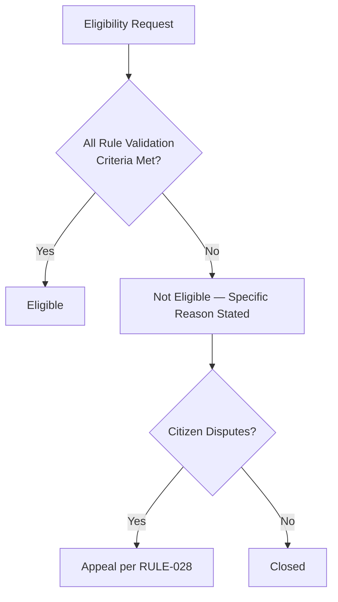

### Approval Decision Framework

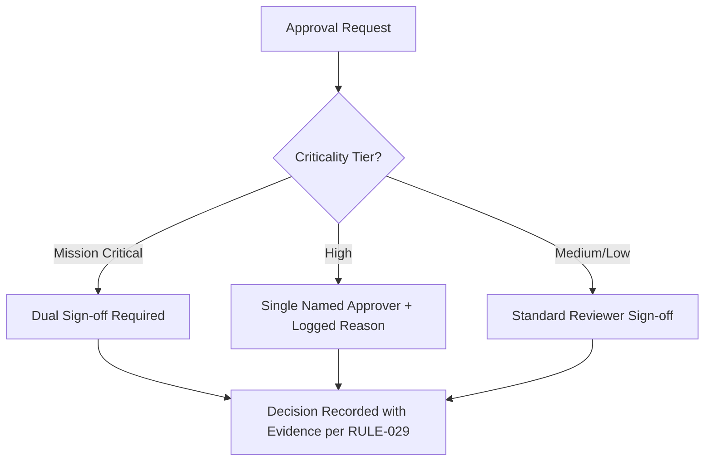

### Exception Handling Framework

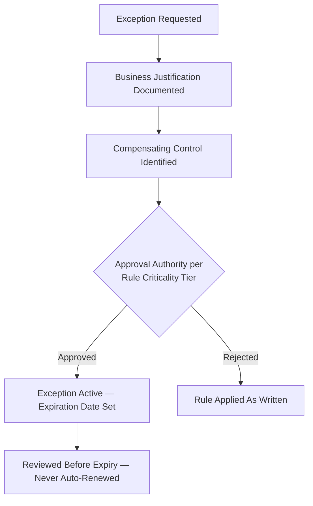

### Appeal Decision Framework

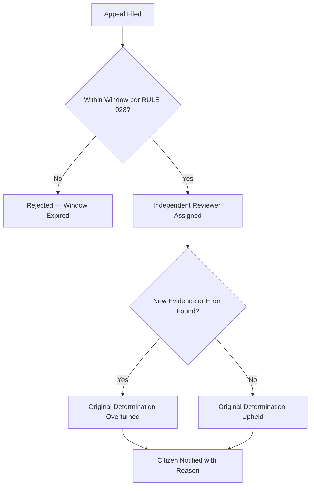

### Conflict Resolution Framework

Where two rules appear to conflict (e.g., a data-minimization rule and an audit-retention rule), the more specific, higher-criticality rule governs, and the conflict is logged as a Rule Governance finding requiring explicit reconciliation — never silently resolved by whichever engineer encounters it first, mirroring the identical Conflict-of-Interest Governance discipline already established in `ai-docs/51-stakeholder-analysis.md`.

---

# Rule Lifecycle

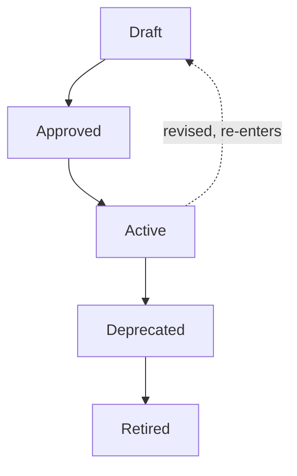

| Stage | Meaning | Exit Criterion |
|---|---|---|
| **Draft** | A rule is proposed with full field completeness per the Catalog template. | Technical and Compliance review complete. |
| **Approved** | The rule's classification-appropriate authority has signed off. | Recorded in the Master Rule Registry. |
| **Active** | The rule governs live decisions. | Continuously, until deprecation. |
| **Deprecated** | The rule no longer reflects current policy but remains referenced for historical/audit purposes. | A sunset date is published and a successor rule (if any) is named. |
| **Retired** | The rule is archived, its ID never reused. | Fully superseded, no active reference remains. |

---

# Rule Governance

### Ownership
Every rule has exactly one named Business Owner and one named Policy Owner, per the Master Rule Registry — mirroring the identical Clear Ownership principle already established for Domains, Capabilities, Modules, Journeys, and Processes. **Why this exists:** a rule with ambiguous ownership degrades identically to every other unowned artifact in this handbook.

### Approval Authority

| Rule Criticality | Approval Authority |
|---|---|
| Mission Critical | COO + Compliance Officer (joint) |
| High | Business Owner + Compliance Officer |
| Medium | Policy Owner |
| Low | Policy Owner, informational notice to Compliance Officer |

### Review Cadence

| Review | Cadence | Owner |
|---|---|---|
| Quarterly Rule Review | Quarterly | COO, Compliance Officer |
| Annual Full Rulebook Audit | Annual | Compliance Officer, CTO, CPO |
| Regulatory-Triggered Review | Upon any regulatory change affecting a rule's domain | Compliance Officer |

### Version Control
Every rule's Registry entry carries an explicit version (Major.Minor.Patch); a change to a rule's Rule Statement, Validation Criteria, or Risk Level is a Major revision requiring the classification-appropriate Approval Authority above — never a silent in-place edit, mirroring `ai-docs/49-engineering-handbook-governance-evolution-standards.md`'s Version Management.

### Policy Change Process

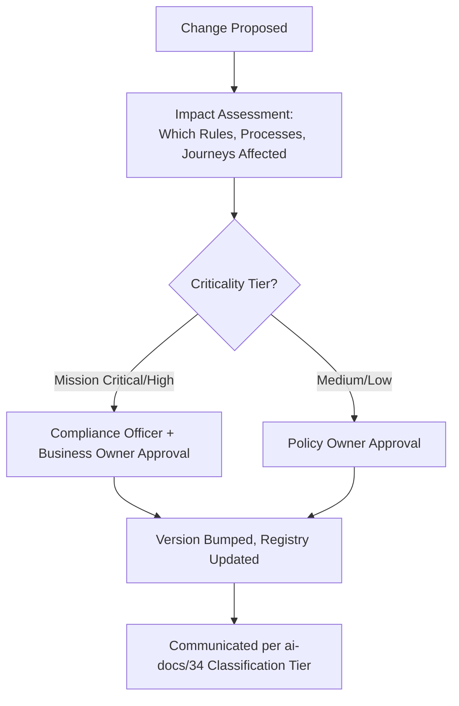

### Exception Approval
An exception to an Active rule is time-boxed, requires a documented business justification and a compensating control, and is approved per the same Approval Authority table above scaled to the affected rule's criticality — mirroring the identical Compliance Exception Governance already established in `ai-docs/40-engineering-compliance-audit-standards.md`. No exception is ever granted indefinitely or auto-renewed.

### Compliance Verification
Every Mission Critical and High rule is verified for live compliance at the Quarterly Rule Review, with evidence meeting the Audit Evidence Sufficiency Standard (RULE-029) — a rule "believed" to be followed without evidence is treated as unverified.

---

# Rule Metrics

| Metric | Definition |
|---|---|
| **Compliance rate** | % of rule applications meeting the rule's stated Validation Criteria correctly. |
| **Violation rate** | % of rule applications resulting in a logged violation. |
| **Exception rate** | % of rule applications proceeding under an approved exception rather than the rule as written. |
| **Appeal rate** | % of adverse determinations that are appealed. |
| **Appeal-overturn rate** | % of appeals resulting in the original determination being reversed. |
| **Review completion rate** | % of rules reviewed within their stated Review Frequency window. |
| **Policy adoption rate** | % of affected teams confirming awareness/adoption of a Major rule revision within 30 days. |

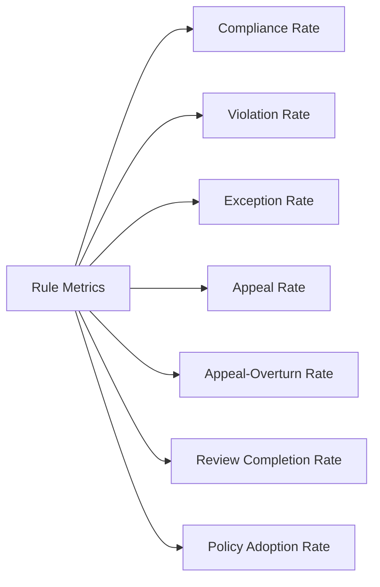

---

# Rule Criticality and Health Scoring

### Criticality Scoring

| Dimension | Weight | Question |
|---|---|---|
| Citizen Safety/Financial Impact | 40% | Could a violation cause direct harm to a citizen's safety, health, or money? |
| Trust Blast Radius | 25% | Would a violation erode trust beyond this single rule's domain? |
| Regulatory/Compliance Exposure | 20% | Would a violation trigger a regulatory or government-partnership consequence? |
| Reversibility | 15% | How quickly and cleanly can a violation's effect be corrected? |

Composite > 85% = Mission Critical; 65–84% = High; 40–64% = Medium; below 40% = Low.

### Health Scoring

| Health Band | Definition | Trigger |
|---|---|---|
| **Healthy** | Compliance rate meeting target for 2+ consecutive review cycles. | No action required. |
| **Watch** | Trending below target, not yet critical. | Flagged to Policy Owner for a remediation plan. |
| **At Risk** | Materially below target, or a Mission Critical rule trending downward. | Escalated to Quarterly Rule Review. |
| **Failing** | Actively producing incorrect outcomes at scale. | Immediate executive escalation per `ai-docs/29`'s Emergency classification. |

---

# AI Policy

### Responsible AI
Every AI-assisted rule application is evaluated against the Anti-Discrimination Safeguards already established in `ai-docs/52-user-personas-user-segmentation.md` — no sensitive-attribute targeting, no proxy discrimination, an equal-quality floor across every persona segment.

### Human Oversight
Per RULE-024, no AI system may issue a final civic, financial, or reputation-affecting determination unsupervised. This is the single most load-bearing rule in this catalog and has no exception.

### Explainability
Every AI-influenced rule outcome states, in plain language appropriate to the citizen's literacy level, the specific factor(s) that produced the recommendation — never a bare, unexplained score.

### Bias Mitigation
AI-assisted triage and recommendation outputs are periodically audited across persona segments for disparate outcome rates, per `ai-docs/52`'s Periodic Bias Audit — a rising disparity is treated as a rule-implementation defect, not an acceptable statistical variance.

### Appeal Rights
An AI-influenced determination carries the identical appeal right as any human determination, per RULE-028 — a citizen is never told an AI decision cannot be appealed.

### Auditability
Every AI recommendation and its eventual human-confirmed outcome is logged via Audit Logging (CAP-035), satisfying the Audit Evidence Sufficiency Standard (RULE-029).

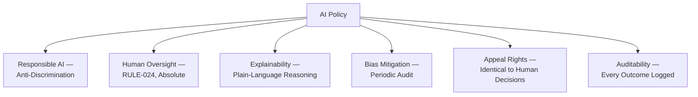

---

# Anti-Patterns

| Anti-Pattern | Description | Why It's Rejected |
|---|---|---|
| **Conflicting rules** | Two rules give incompatible guidance for the same fact pattern. | Violates Consistency; forces an officer to guess, per the Conflict Resolution Framework above. |
| **Hidden policies** | An unwritten practice governs real decisions while the published rule says otherwise. | Violates Transparency and Single Source of Truth; recreates the Shadow Governance anti-pattern already rejected in `ai-docs/29`. |
| **Undocumented exceptions** | A rule is bypassed informally without a logged, approved exception. | Violates Auditability; an unlogged exception is functionally indistinguishable from a violation. |
| **Technology-specific rules** | A rule references a database field, an API, or a specific vendor. | Violates Technology Independence; the rule becomes obsolete the moment the technology changes. |
| **Ambiguous wording** | A rule's Validation Criteria admits more than one reasonable reading. | Violates Consistency directly — the entire purpose of a written rule is defeated. |
| **Duplicate policies** | The same constraint is independently restated in two rules, inevitably drifting apart. | Violates Single Source of Truth. |
| **Rule drift** | A rule's actual enforcement diverges from its written statement over time, uncorrected. | Violates Version Control and Auditability; caught only by the Quarterly Rule Review if that review is genuinely performed. |
| **Policy bypass** | An actor circumvents a rule's approval chain "just this once." | Violates Least Privilege and Human Oversight; the single most dangerous anti-pattern in this catalog because it compounds silently. |

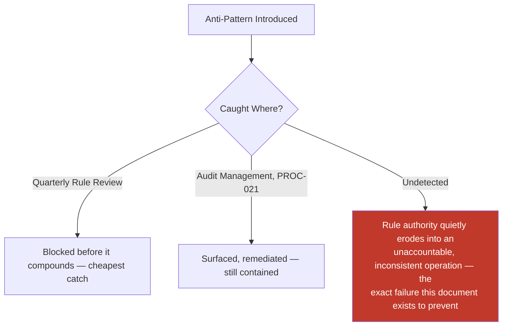

---

# Rule Review, Compliance, Audit, and Exception Checklists

### Rule Review Checklist
- [ ] Traceable to a Process, Journey, Capability, Module, and Domain.
- [ ] Every field in the Catalog template is complete.
- [ ] Rule Statement is unambiguous — a second reviewer reaches the same interpretation independently.
- [ ] Criticality and Risk Level scored using the explicit dimensions above, never assigned by impression.
- [ ] Violation Handling and Escalation are named explicitly.
- [ ] Accessibility considerations meet RULE-032's floor.

### Rule Compliance Checklist
- [ ] Every applicable regulatory obligation is named in Compliance Requirements.
- [ ] Restricted/Confidential-tier data handling matches `ai-docs/10-security-standards.md`.
- [ ] No rule application bypasses a required approval under time pressure.

### Rule Audit Checklist
- [ ] Every decision produces evidence meeting RULE-029's Quality Bar.
- [ ] Evidence Owner is named and retention period matches RULE-025.
- [ ] The rule's most recent audit findings (if any) are closed or have an active CAPA per `ai-docs/40`.

### Rule Exception Framework
Every exception carries: a written business justification, a named compensating control, an approval matching the rule's criticality tier (per Rule Governance above), and a mandatory expiration date — never granted indefinitely, mirroring `ai-docs/40-engineering-compliance-audit-standards.md`'s Section 10 in full.

---

# Policy Glossary

| Term | Definition |
|---|---|
| **Rule** | A precise, citable statement of eligibility, validation, permission, constraint, decision logic, or obligation, independent of technology. |
| **Policy** | An organizational commitment translating one or more rules into a standing institutional posture. |
| **Validation Criteria** | The specific, checkable test a rule applies to determine its outcome. |
| **Exception** | A time-boxed, approved deviation from a rule as written, never silent or indefinite. |
| **Appeal** | A citizen's or partner's formal request for independent re-review of an adverse determination. |
| **Four-Eyes Approval** | Independent dual sign-off required before a high-severity action. |
| **Rule Health** | A rule's current compliance condition against its own stated metrics, distinct from its Criticality. |

---

# Traceability

### Rule → Process Matrix

| Rule | Related Process(es) |
|---|---|
| RULE-001/002/031 | PROC-001, PROC-002 |
| RULE-003 | PROC-003 |
| RULE-004 | PROC-028 |
| RULE-006/007/008/009 | PROC-004, PROC-005, PROC-006, PROC-007, PROC-027 |
| RULE-010/011 | PROC-008, PROC-010 |
| RULE-012/013 | PROC-011, PROC-013 |
| RULE-014 | PROC-009 |
| RULE-015 | (Appointment Scheduling, embedded in CAP-015) |
| RULE-016 | PROC-026 |
| RULE-017 | PROC-023 |
| RULE-018/019 | PROC-014 |
| RULE-020 | PROC-012 |
| RULE-021 | PROC-025 |
| RULE-022 | PROC-016 |
| RULE-023 | PROC-018 |
| RULE-024 | PROC-015, PROC-020 |
| RULE-025/029 | PROC-021 |
| RULE-026/027 | PROC-015 |
| RULE-028 | PROC-006, PROC-015 |
| RULE-030 | PROC-022 |
| RULE-032 | (cross-cutting, all citizen-facing processes) |

### Rule → Journey Matrix

| Rule | Related Journey(s) |
|---|---|
| RULE-001/002/031 | JRN-001, JRN-002 |
| RULE-003 | JRN-003, JRN-029 |
| RULE-004 | JRN-002 (delegated path) |
| RULE-006/007/009 | JRN-004, JRN-006 |
| RULE-008 | JRN-005, JRN-011 |
| RULE-010/011 | JRN-014, JRN-015 |
| RULE-012/013 | JRN-016, JRN-017, JRN-018, JRN-022 |
| RULE-014/015 | JRN-007, JRN-008 |
| RULE-016 | JRN-010 |
| RULE-017 | JRN-012, JRN-013 |
| RULE-018/019 | JRN-021 |
| RULE-020 | JRN-023 |
| RULE-021 | JRN-024 |
| RULE-023 | JRN-025 |
| RULE-024 | JRN-027 |
| RULE-028 | JRN-006 |
| RULE-032 | (cross-cutting, every journey) |

### Rule → Capability Matrix

| Rule | Related Capability(ies) |
|---|---|
| RULE-001/002/004/031 | Identity Verification (CAP-001), Delegated & Assisted Access (CAP-005) |
| RULE-003 | Consent Management (CAP-004) |
| RULE-006/007 | Government Application Processing (CAP-006), Certificate Issuance (CAP-007) |
| RULE-008 | Scheme Eligibility Assessment (CAP-010), Scholarship Matching (CAP-018) |
| RULE-009 | Grievance Resolution (CAP-008) |
| RULE-010/011 | Merchant Onboarding (CAP-021), Catalog Management (CAP-022) |
| RULE-012/013 | Order Management (CAP-025), Refund Management (CAP-028) |
| RULE-014/016 | Provider Verification (CAP-016) |
| RULE-015 | Appointment Scheduling (CAP-015) |
| RULE-017 | Employer Recruitment (CAP-020) |
| RULE-018/019 | Payment Processing (CAP-027) |
| RULE-020 | Delivery Coordination (CAP-026) |
| RULE-021 | Group & Cooperative Enablement (CAP-043) |
| RULE-022 | Content Moderation (CAP-037) |
| RULE-023 | Notifications (CAP-031) |
| RULE-024 | AI Assistance (CAP-033) |
| RULE-025/029 | Audit Logging (CAP-035) |
| RULE-026/027 | Fraud Detection (CAP-038), Trust & Safety (CAP-036) |
| RULE-028 | Grievance Resolution (CAP-008), Trust & Safety (CAP-036) |
| RULE-030 | Configuration Management (CAP-040) |

### Rule → Module Matrix

| Rule | Related Module(s) |
|---|---|
| RULE-001/002/004/031 | MOD-001, MOD-003 |
| RULE-003/023 | MOD-002, MOD-038, MOD-045 |
| RULE-006/007/008/009 | MOD-004, MOD-005, MOD-006, MOD-010, MOD-018 |
| RULE-010/011 | MOD-021, MOD-041 |
| RULE-012/013 | MOD-023, MOD-025, MOD-027, MOD-034 |
| RULE-014/016 | MOD-041 |
| RULE-015 | MOD-013 |
| RULE-017 | MOD-020 |
| RULE-018/019 | MOD-032 |
| RULE-020 | MOD-028, MOD-029 |
| RULE-021 | MOD-035 |
| RULE-022 | MOD-036, MOD-044 |
| RULE-024 | MOD-039 |
| RULE-025/029 | MOD-040 |
| RULE-026/027 | MOD-042 |
| RULE-030 | MOD-045, MOD-050 |

### Rule → Domain Matrix

| Rule | Related Domain(s) |
|---|---|
| RULE-001/002/003/004/031 | Identity (DOM-001), Citizen (DOM-002) |
| RULE-006/007/008/009 | Government Services (DOM-003), Agriculture (DOM-004), Education (DOM-006) |
| RULE-010/011/012/013 | Commerce Marketplace (DOM-008), Food Delivery (DOM-009), Grocery (DOM-010), Payments (DOM-013) |
| RULE-014/015/016 | Healthcare (DOM-005), Education (DOM-006), Administration (DOM-019) |
| RULE-017 | Jobs (DOM-007), Trust & Safety (DOM-020) |
| RULE-018/019 | Payments (DOM-013) |
| RULE-020 | Logistics (DOM-011) |
| RULE-021 | Community (DOM-014) |
| RULE-022/026/027/028 | Trust & Safety (DOM-020) |
| RULE-024 | AI Assistant (DOM-017) |
| RULE-025/029/030 | (cross-cutting) |
| RULE-032 | Citizen (DOM-002) |

### Rule → Strategic Goal Matrix

| Rule | Strategic Objective (`ai-docs/50`) |
|---|---|
| RULE-006/007/008/009 | Government Efficiency, Service Digitization |
| RULE-010/011/012/013 | Economic Growth, Business Enablement |
| RULE-014/015/016 | Healthcare Access, Education Improvement |
| RULE-017 | Employment Generation |
| RULE-018/019 | Sustainable Growth |
| RULE-022/026/027/028 | Sustainable Growth (trust dimension) |
| RULE-024 | Sustainable Growth, AI-Ready responsible innovation |
| RULE-025/029 | Government Efficiency, Sustainable Growth (compliance dimension) |
| RULE-032 | Citizen Adoption, Farmer Empowerment (inclusion dimension) |

---

# Relationship with Previous Standards

### Project Vision & Product Goals
`ai-docs/00-project-vision.md` and `ai-docs/01-product-goals.md` establish the founding mission and measurable goals every rule ultimately serves; no rule exists that cannot trace, through a Strategic Objective, back to a commitment already made there.

### Stakeholder Analysis & User Personas
`ai-docs/51-stakeholder-analysis.md` and `ai-docs/52-user-personas-user-segmentation.md` establish who Arwal serves and what each needs — every rule's accessibility and fairness considerations trace directly to those registries.

### Business Domain Model
`ai-docs/53-business-domain-model.md` establishes who owns each business concern; every rule's Related Domains field cites that Registry directly.

### Product Module Catalog
`ai-docs/54-product-module-catalog.md` establishes the user-visible product surface; every rule's Related Modules field cites that Registry.

### Business Capability Map
`ai-docs/55-business-capability-map.md` establishes the stable business abilities underneath every module; every rule realizes the Business Rules field already named for its owning capability.

### User Journey Standards
`ai-docs/56-user-journey-standards.md` establishes what it feels like for a citizen to move through Arwal; every rule's citizen-facing outcome is designed to meet that document's Trust and Transparency and Accessibility by Default principles.

### Business Process Standards
`ai-docs/57-business-process-standards.md` establishes the organizational sequence and approvals; every rule in this document is the precise logic that process executes at each Decision Point.

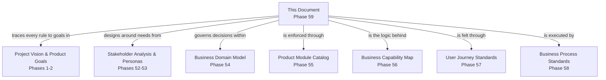

---

# Executive Dashboards

### CEO Dashboard
- District Trust Signal contribution from rule-compliance rates
- Rule Health Band distribution across Mission Critical rules
- Appeal-overturn rate trend (fairness signal)

### COO Dashboard
- Rule KPI summary across every classification
- Rule ownership completeness (no ownerless rule)
- Exception rate trend, ranked by Criticality

### Compliance Dashboard
- Compliance rate per Mission Critical/High rule
- Open audit findings tied to a specific rule
- Evidence Completeness per RULE-029

### Trust & Safety Dashboard
- Suspension and four-eyes compliance rate (RULE-026/027)
- Appeal volume and outcome trend

### Government Partners Dashboard
- Government Service rule cluster compliance and appeal-resolution trend

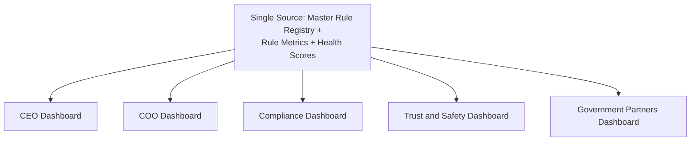

---

# Closing Statement

> **Callout — Closing Statement**
> A business process tells the organization who decides and in what order. A business rule tells everyone — the citizen, the officer, the auditor, the engineer, and any future AI system — precisely what the decision must be, given the facts, every time. Business Rules & Policies are the governance layer that makes Arwal's every operational decision consistent, compliant, fair, transparent, and technology-independent: the same eligibility test applied to Meena and to a citizen not yet onboarded five years from now in a second district; the same refund standard whether a citizen orders on the founding district's first day or its millionth user's daily order; the same human-oversight boundary whether an AI model is a simple heuristic today or a far more capable system years from now. Rules are what let Arwal keep a promise across a decade and across a scale no single team will ever fully hold in memory — not because every engineer remembers every policy, but because every policy is written down, versioned, owned, and citable by name. Where a future phase must deviate from a rule stated here, that deviation is made explicitly — through the Rule Governance approval workflow above — never silently, and never by default.

This document, `ai-docs/58-business-rules-policies.md`, is Phase 59 of approximately 420. Every future eligibility check, approval, exception, and appeal is expected to trace back to a rule defined here, or to justify its deviation in writing.

**End of Phase 59 — `ai-docs/58-business-rules-policies.md`**