# Business Glossary

**Document:** `ai-docs/59-business-glossary.md`
**Project:** Arwal — The District Super App
**Stage:** 2 — Product & Business Strategy
**Phase:** 60 — Business Glossary
**Status:** Approved for Product & Engineering Reference
**Audience:** CEO, COO, CPO, CTO, Chief Enterprise Architect, Chief Knowledge Officer, Governance Director, Compliance Officer, Government Digital Transformation Partners, Business Rules Architects, Product Managers, Engineering Directors, Technical Writers, AI/Analytics Teams

> **Callout — Purpose of This Document**
> `ai-docs/00-project-vision.md` through `ai-docs/58-business-rules-policies.md` established why Arwal exists, what it can do, who it serves, what it feels like to use, how the organization executes work, and the precise rules that govern every decision. Every one of those documents uses words — Citizen, Application, Verification, Eligibility, Approval — as if their meaning were self-evident. It is not. A word used with five subtly different meanings across fifty-nine documents is not a shared vocabulary; it is fifty-nine private dialects wearing one language's clothing. This document is that language, made explicit, singular, and citable — the authoritative Business Glossary every future handbook document, screen, contract, and government agreement must reference rather than redefine.

---

# Purpose of this Document

### Why a Business Glossary Is Not Optional at This Scale

A handbook of fifty-nine preceding documents, authored across a multi-year roadmap by many hands, accumulates vocabulary the way any large system accumulates entropy: not through carelessness, but through the ordinary fact that different authors, solving different problems on different days, reach for the nearest available word. `ai-docs/53-business-domain-model.md` calls it a "Booking" in Healthcare; the same document calls it an "Order" in Commerce, deliberately, because the two are genuinely different concepts. That distinction is correct — but it is only correct, and only trustworthy six months from now, if someone has written down, once, why "Booking" and "Order" are not synonyms, and what each one specifically means. Absent that written record, a new engineer, a new government partner, or a new AI model has no way to know whether the difference was a deliberate design decision or an accident nobody caught.

### Glossaries Are the Load-Bearing Layer Beneath Every Other Document

Every preceding Stage 2 document assumes this glossary already exists, even though it did not until now. `ai-docs/53-business-domain-model.md`'s Shared Business Concepts section states that "Citizen," "Merchant," "Order," "Booking," "Payment," "Application," "Identity," "Reputation," and "Trust" each carry exactly one authoritative definition — but it names the owning domain, not the full definition itself. `ai-docs/58-business-rules-policies.md` uses "Eligibility," "Approval," "Rejection," and "Appeal" dozens of times as if their meaning were obvious — and it mostly is, colloquially, which is exactly the risk: a term that feels obvious is a term nobody double-checks, and a term nobody double-checks is a term that silently drifts. This document is where that implicit assumption becomes an explicit, versioned, owned artifact — the vocabulary layer every other layer in this handbook has been quietly depending on.

### Why This Matters for a Civic-Commercial Platform Specifically

Arwal is not a single-purpose consumer app where a vocabulary mismatch merely produces an awkward support ticket. It is civic-commercial infrastructure, per `ai-docs/00-project-vision.md`, meaning its vocabulary is read by four audiences with very different stakes in getting it right:

1. **Citizens**, for whom "Verification," "Eligibility," and "Appeal" are not abstractions — they are the difference between a certificate arriving and a certificate never arriving.
2. **Government partners**, for whom Arwal's terminology must map cleanly onto their own statutory and administrative vocabulary, or every integration conversation restarts from a vocabulary negotiation instead of a substantive one.
3. **Engineers and AI systems**, for whom an ambiguous term is not merely confusing but actively dangerous — an AI model reasoning about "Eligibility" without a precise, singular definition will silently invent its own, per the exact risk `ai-docs/58-business-rules-policies.md`'s RULE-024 AI Automation Boundary exists to bound.
4. **Auditors and compliance reviewers**, for whom a term used inconsistently across two documents is, per `ai-docs/40-engineering-compliance-audit-standards.md`'s Evidence Quality Bar, grounds to treat both documents' claims as unverified.

### Scope Boundary

This document does not describe implementation, APIs, databases, or UI. A glossary entry that references a table name, an endpoint, or a screen has been written at the wrong layer — exactly the mistake `ai-docs/53` through `ai-docs/58` each reject at their own layer, applied here to vocabulary itself. This document's exclusive territory is: **term identity, definition, business meaning, scope, relationships, synonyms, and ownership** — the shared language every other document, screen, contract, and AI system is expected to use, never redefine locally.

---

# Glossary Principles

Every principle below exists because a glossary assembled carelessly does not fail abstractly — it fails the moment two people, reading the same word in two different documents, walk away with two different understandings and never discover the gap until it costs something.

### Single Source of Truth

**Why it exists:** Every term has exactly one authoritative definition, in exactly one place — this document. A term independently defined a second time, even consistently at first, will drift the moment one definition is updated and the other is not, per the identical Single Source of Truth discipline already established in `ai-docs/02-engineering-principles.md` and restated for rules in `ai-docs/58-business-rules-policies.md`. Every other handbook document is expected to *cite* a term from here, never redefine it locally.

### Business-First Language

**Why it exists:** A glossary entry is written in the language a citizen, a government officer, or an investor would recognize — never in the language of a database schema or an API contract. A definition that can only be understood by an engineer has already failed its purpose as a shared vocabulary, per the identical Business-First discipline already established in `ai-docs/55-business-capability-map.md` and `ai-docs/58-business-rules-policies.md`.

### Technology Independence

**Why it exists:** A term's meaning must survive every technology migration Arwal will ever undergo. "Verification" meant the same thing before `ai-docs/09-tech-stack.md` chose a technology stack and will mean the same thing after that stack is eventually replaced. A definition that mentions a specific tool, vendor, or implementation pattern has been written at the wrong layer.

### Consistency

**Why it exists:** The same term must mean the same thing everywhere it appears — in a government contract, an engineering document, a citizen-facing screen, and an AI model's reasoning. Inconsistent terminology is functionally indistinguishable, to the reader, from inconsistent policy — even when the underlying policy was actually consistent the whole time.

### Plain Language

**Why it exists:** A glossary exists to remove ambiguity, not add it. A definition written in denser prose than the term it defines has failed its own purpose. Every definition in this document is written so that a first-time reader — a new engineer, a government liaison unfamiliar with Arwal, a citizen advocate — can read it once and understand it correctly, mirroring the identical Plain Language discipline already established in `ai-docs/24-documentation-standards.md`'s Writing Style Guide.

### No Ambiguity

**Why it exists:** A term admitting two reasonable readings is not yet defined — it is a placeholder wearing a definition's format. Every entry in this document is reviewed, per Quality Rules below, specifically for whether an independent second reader would interpret it identically to the first.

### Cross-Domain Reuse

**Why it exists:** A concept genuinely shared across domains (Identity, Consent, Trust) is defined once here and referenced by every domain that uses it — never redefined per-domain with a slightly different shade of meaning, mirroring the identical Reusability principle already established in `ai-docs/54-product-module-catalog.md` and `ai-docs/55-business-capability-map.md`.

### Government-Friendly Terminology

**Why it exists:** Arwal's civic mandate depends on government partners recognizing Arwal's vocabulary as compatible with their own — "Application," "Certificate," and "Grievance" are chosen deliberately to match the vocabulary a district administration already uses, rather than inventing Arwal-specific jargon a government officer must learn from scratch, per the identical Government-Friendly discipline already implicit in `ai-docs/50-product-vision-business-strategy.md`'s Public-Private Collaboration strategy.

### Accessibility

**Why it exists:** A glossary entry's plain-language definition is itself an accessibility artifact — it is what a citizen-facing error message, a rejection notice, or an AI Assistant's explanation ultimately draws its own language from, per RULE-032's Accessibility Non-Negotiable Floor in `ai-docs/58-business-rules-policies.md`. A jargon-heavy glossary produces jargon-heavy citizen communication downstream.

### Future Scalability

**Why it exists:** Every term is defined so that it remains true at Arwal's eventual multi-district, multi-state, million-plus-user scale, per `ai-docs/00-project-vision.md`'s Scalability Vision — a definition scoped only to the founding district's current reality is a definition that will need a disruptive rewrite, not a graceful extension, the moment expansion begins.

### Versioned Definitions

**Why it exists:** A term's meaning can legitimately evolve — but a change to an already-published definition is a governed event, not a silent edit, mirroring the identical Version Management discipline already established in `ai-docs/49-engineering-handbook-governance-evolution-standards.md` and `ai-docs/58-business-rules-policies.md`.

### Authoritative Ownership

**Why it exists:** Every term has exactly one named owner accountable for its continued accuracy — an unowned term degrades identically to every other unowned artifact already named throughout this handbook, drifting silently until a citizen, auditor, or partner is confused enough to force attention.

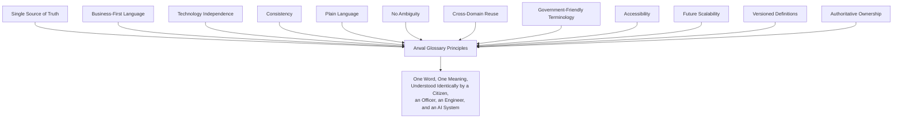

> **Callout — The One-Sentence Glossary Philosophy**
> *"If a citizen, a government officer, and an engineer would each explain a term differently, the term is not yet defined — it is three private guesses sharing one label."*

---

# Term Classification

Every term in the Master Glossary Registry belongs to exactly one of nineteen sections, mirroring the classification discipline already established for Domains (`ai-docs/53`), Modules (`ai-docs/54`), Capabilities (`ai-docs/55`), Journeys (`ai-docs/56`), Processes (`ai-docs/57`), and Rules (`ai-docs/58`).

| Section | Definition |
|---|---|
| **Strategic Terms** | Vocabulary describing Arwal's mission, positioning, and multi-year direction. |
| **Business Terms** | Cross-cutting organizational and architectural vocabulary. |
| **Citizen Terms** | Vocabulary describing the individuals Arwal serves. |
| **Government Terms** | Vocabulary describing civic services and government interaction. |
| **Commerce Terms** | Vocabulary describing marketplace, food, and grocery exchange. |
| **Healthcare Terms** | Vocabulary describing provider discovery and appointment integrity. |
| **Education Terms** | Vocabulary describing tutor, coaching, and scholarship discovery. |
| **Employment Terms** | Vocabulary describing job discovery and recruitment. |
| **Agriculture Terms** | Vocabulary describing farmer-facing market and scheme intelligence. |
| **Property Terms** | Vocabulary describing listing and rental/sale discovery. |
| **Community Terms** | Vocabulary describing collective and group economic activity. |
| **Payments Terms** | Vocabulary describing money movement. |
| **AI Terms** | Vocabulary describing automated and AI-assisted capability. |
| **Compliance Terms** | Vocabulary describing regulatory and audit obligation. |
| **Operations Terms** | Vocabulary describing day-to-day organizational execution. |
| **Governance Terms** | Vocabulary describing decision authority and oversight. |
| **Analytics Terms** | Vocabulary describing measurement and reporting. |
| **Platform Terms** | Vocabulary describing shared, cross-cutting product infrastructure. |
| **Future Terms** | Vocabulary anticipated but not yet active. |

```mermaid
graph TD
    Root[Arwal Business Glossary] --> Strategic[Strategic Terms]
    Root --> Business[Business Terms]
    Root --> Citizen[Citizen Terms]
    Root --> Government[Government Terms]
    Root --> Commerce[Commerce Terms]
    Root --> Health[Healthcare Terms]
    Root --> Edu[Education Terms]
    Root --> Employ[Employment Terms]
    Root --> Agri[Agriculture Terms]
    Root --> Prop[Property Terms]
    Root --> Comm[Community Terms]
    Root --> Pay[Payments Terms]
    Root --> AI[AI Terms]
    Root --> Compliance[Compliance Terms]
    Root --> Ops[Operations Terms]
    Root --> Gov[Governance Terms]
    Root --> Analytics[Analytics Terms]
    Root --> Platform[Platform Terms]
    Root --> Future[Future Terms]
```

---

# Master Glossary Registry

Every term carries a permanent, sequential, never-reused Glossary ID.

| Glossary ID | Official Term | Section | Owner | Status |
|---|---|---|---|---|
| GLOSS-001 | Citizen | Citizen | CPO | Active |
| GLOSS-002 | Resident | Citizen | CPO | Active |
| GLOSS-003 | Visitor | Citizen | CPO | Active |
| GLOSS-004 | Farmer | Agriculture | Head of Agriculture Vertical | Active |
| GLOSS-005 | Merchant | Commerce | Head of Merchant Success | Active |
| GLOSS-006 | Vendor | Commerce | Head of Merchant Success | Active |
| GLOSS-007 | Service Provider | Business | Head of Trust & Safety | Active |
| GLOSS-008 | Healthcare Provider | Healthcare | Head of Healthcare Vertical | Active |
| GLOSS-009 | School | Education | Head of Education Vertical | Active |
| GLOSS-010 | Tutor | Education | Head of Education Vertical | Active |
| GLOSS-011 | Employer | Employment | Head of Jobs Vertical | Active |
| GLOSS-012 | Job Seeker | Employment | Head of Jobs Vertical | Active |
| GLOSS-013 | Property Owner | Property | Head of Classifieds/Property | Active |
| GLOSS-014 | Tenant | Property | Head of Classifieds/Property | Active |
| GLOSS-015 | Application | Government | Head of Government Partnerships | Active |
| GLOSS-016 | Certificate | Government | Head of Government Partnerships | Active |
| GLOSS-017 | Verification | Business | Head of Platform Engineering | Active |
| GLOSS-018 | Identity | Business | Head of Platform Engineering | Active |
| GLOSS-019 | Consent | Business | CPO | Active |
| GLOSS-020 | Eligibility | Business | Compliance Officer | Active |
| GLOSS-021 | Approval | Governance | Compliance Officer | Active |
| GLOSS-022 | Rejection | Governance | Compliance Officer | Active |
| GLOSS-023 | Appeal | Governance | Compliance Officer | Active |
| GLOSS-024 | Delegated Access | Citizen | Head of Accessibility & Inclusion | Active |
| GLOSS-025 | Business Capability | Business | Chief Enterprise Architect | Active |
| GLOSS-026 | Business Domain | Business | Chief Enterprise Architect | Active |
| GLOSS-027 | Business Process | Business | Chief Enterprise Architect | Active |
| GLOSS-028 | Business Rule | Business | Compliance Officer | Active |
| GLOSS-029 | User Journey | Business | CPO | Active |
| GLOSS-030 | Product Module | Business | CPO | Active |
| GLOSS-031 | Policy | Governance | Compliance Officer | Active |
| GLOSS-032 | Governance | Governance | COO | Active |
| GLOSS-033 | Compliance | Compliance | Compliance Officer | Active |
| GLOSS-034 | Trust | Business | Head of Trust & Safety | Active |
| GLOSS-035 | Fraud | Compliance | Head of Trust & Safety | Active |
| GLOSS-036 | Audit | Compliance | Compliance Officer | Active |
| GLOSS-037 | Risk | Governance | COO | Active |
| GLOSS-038 | Marketplace | Commerce | Head of Merchant Success | Active |
| GLOSS-039 | Order | Commerce | Head of Merchant Success | Active |
| GLOSS-040 | Booking | Healthcare | Head of Healthcare Vertical | Active |
| GLOSS-041 | Appointment | Healthcare | Head of Healthcare Vertical | Active |
| GLOSS-042 | Delivery | Commerce | Head of Logistics | Active |
| GLOSS-043 | Refund | Payments | Head of Payments | Active |
| GLOSS-044 | Settlement | Payments | Head of Payments | Active |
| GLOSS-045 | Wallet | Payments | Head of Payments | Active |
| GLOSS-046 | Notification | Platform | Head of Platform Engineering | Active |
| GLOSS-047 | Profile | Citizen | CPO | Active |
| GLOSS-048 | AI Assistant | AI | Head of AI Platform | Active |
| GLOSS-049 | Recommendation | AI | Head of AI Platform | Active |
| GLOSS-050 | Knowledge Base | AI | Head of AI Platform | Active |
| GLOSS-051 | Administrator | Operations | Head of Operations | Active |
| GLOSS-052 | Moderator | Operations | Head of Trust & Safety | Active |
| GLOSS-053 | District Officer | Government | Head of Government Partnerships | Active |
| GLOSS-054 | State Administrator | Government | Head of Government Partnerships | Active |
| GLOSS-055 | Dashboard | Analytics | Head of Data/Analytics | Active |
| GLOSS-056 | Analytics | Analytics | Head of Data/Analytics | Active |
| GLOSS-057 | KPI | Analytics | Head of Data/Analytics | Active |
| GLOSS-058 | SLA | Operations | COO | Active |
| GLOSS-059 | Scheme | Government | Head of Government Partnerships | Active |
| GLOSS-060 | Grievance | Government | Head of Government Partnerships | Active |
| GLOSS-061 | Group / Cooperative | Community | Head of Community Engagement | Active |
| GLOSS-062 | Listing | Business | Chief Enterprise Architect | Active |
| GLOSS-063 | Reputation | Business | Head of Trust & Safety | Active |
| GLOSS-064 | Dispute | Compliance | Head of Trust & Safety | Active |
| GLOSS-065 | Suspension | Governance | Head of Trust & Safety | Active |
| GLOSS-066 | District | Strategic | CEO | Active |

> **Callout — Registry Governance**
> This Registry is the single authoritative index for every term. A term added, merged, or retired outside the Quarterly Glossary Review below is treated as an exception requiring Chief Knowledge Officer sign-off, mirroring the identical Registry Governance discipline already established across `ai-docs/53` through `ai-docs/58`.

---

# Business Glossary

Each entry below follows an identical structure. Every "Related Terms" reference cites another Glossary ID from this same document; every domain/capability/process/rule reference cites the authoritative Registry it belongs to, never restating that Registry's own content.

## Strategic Terms

### GLOSS-066 — District

| Field | Detail |
|---|---|
| **Official Definition** | The founding administrative and geographic unit — Arwal District, Bihar — within which the platform operates at full depth before any expansion decision is made. |
| **Business Meaning** | The unit of trust, government partnership, and unit-economics validation Arwal must prove before replicating anywhere else. |
| **Business Purpose** | Anchors the Depth Before Breadth expansion discipline already established in `ai-docs/50-product-vision-business-strategy.md`. |
| **Usage Guidelines** | Always capitalized when referring to Arwal District specifically; lowercase "district" when used generically (e.g., "a second district"). |
| **Included Concepts** | The founding district's full administrative boundary; any future district Arwal expands into, once activated. |
| **Excluded Concepts** | A ward, block, or village (a sub-unit of a district — see `ai-docs/53`'s future Multi-District Configuration domain for sub-unit vocabulary). |
| **Related Terms** | GLOSS-053 District Officer, GLOSS-054 State Administrator. |
| **Common Misunderstandings** | "District" is sometimes confused with a commercial "market" or "territory" — it is specifically the administrative/geographic unit, not a sales region. |
| **Examples** | "Arwal District" (the founding district); "the second district" (a future expansion district, not yet named). |
| **Owner** | CEO. |
| **Review Cycle** | Annual. |
| **Version** | v1.0.0. |

### Trust (see GLOSS-034, cross-referenced under Business Terms)

### District Super App

| Field | Detail |
|---|---|
| **Official Definition** | Arwal's product category: a single, unified, mobile-first application unifying commerce, local services, civic/government services, healthcare discovery, education, agriculture intelligence, logistics, payments, and community engagement under one citizen identity, per `ai-docs/50-product-vision-business-strategy.md`. |
| **Business Meaning** | The category Arwal deliberately created rather than joined — neither a government portal, a standalone service app, nor a generic national marketplace. |
| **Business Purpose** | Distinguishes Arwal's positioning from every adjacent app category, per `ai-docs/50`'s Market Positioning. |
| **Usage Guidelines** | Used in external and strategic communication; not used as a citizen-facing feature name. |
| **Included Concepts** | The unified, cross-vertical, single-identity product model. |
| **Excluded Concepts** | Any single-vertical competitor, regardless of scale. |
| **Related Terms** | GLOSS-001 Citizen, GLOSS-034 Trust. |
| **Common Misunderstandings** | Not a synonym for "super app" generically — Arwal's district-first, government-equal-to-commerce design is definitional, not incidental. |
| **Examples** | "Arwal is the district super app for Arwal District." |
| **Owner** | CEO. |
| **Review Cycle** | Annual. |
| **Version** | v1.0.0. |

---

## Business Terms

### GLOSS-025 — Business Capability

| Field | Detail |
|---|---|
| **Official Definition** | A stable, technology-independent ability the business has, regardless of who performs it, how it is built, or what it is called this quarter, per `ai-docs/55-business-capability-map.md`. |
| **Business Meaning** | The answer to "what can Arwal do?" — the durable unit that survives a technology migration, a reorganization, and a UI redesign untouched. |
| **Business Purpose** | Provides the stable target for investment planning, gap analysis, and AI orchestration, per `ai-docs/55`'s Purpose section. |
| **Usage Guidelines** | Always cited by its Capability ID (`CAP-###`) and name together on first use in any document. |
| **Included Concepts** | Identity Verification, Payment Processing, Certificate Issuance, and every other entry in `ai-docs/55`'s Master Capability Registry. |
| **Excluded Concepts** | A specific screen, API, or service — those are Technical Components, per `ai-docs/55`'s Relationship Chain. |
| **Related Terms** | GLOSS-026 Business Domain, GLOSS-030 Product Module. |
| **Common Misunderstandings** | Frequently conflated with a "feature" — a Capability is coarser and far more stable than any single feature. |
| **Examples** | "Identity Verification" (CAP-001); "Certificate Issuance" (CAP-007). |
| **Owner** | Chief Enterprise Architect. |
| **Review Cycle** | Quarterly, per `ai-docs/55`'s Capability Review Board cadence. |
| **Version** | v1.0.0. |

### GLOSS-026 — Business Domain

| Field | Detail |
|---|---|
| **Official Definition** | A discrete, organizationally-owned business concern with its own vocabulary, rules, and reason to change, independent of technology, per `ai-docs/53-business-domain-model.md`. |
| **Business Meaning** | The answer to "who owns this?" — the organizational and boundary concept every Capability, Module, and Rule ultimately sits within. |
| **Business Purpose** | Prevents ownership ambiguity and duplicated business logic across teams, per `ai-docs/53`'s Purpose section. |
| **Usage Guidelines** | Always cited by its Domain ID (`DOM-###`) and name together on first use. |
| **Included Concepts** | Identity, Citizen, Government Services, Agriculture, Healthcare, and every other entry in `ai-docs/53`'s Domain Registry. |
| **Excluded Concepts** | A team name or an org-chart box — a Domain is a business concern, not a reporting line, per `ai-docs/53`'s "Organization Chart Is Not Decision Authority" callout applied here. |
| **Related Terms** | GLOSS-025 Business Capability, GLOSS-027 Business Process. |
| **Common Misunderstandings** | Confused with a Business Capability — a Domain answers ownership, a Capability answers ability; see `ai-docs/55`'s "Capabilities Are Not Domains Renamed" callout. |
| **Examples** | "Government Services" (DOM-003); "Payments" (DOM-013). |
| **Owner** | Chief Enterprise Architect. |
| **Review Cycle** | Quarterly, per `ai-docs/53`'s Domain Governance cadence. |
| **Version** | v1.0.0. |

### GLOSS-027 — Business Process

| Field | Detail |
|---|---|
| **Official Definition** | A governed, repeatable organizational sequence of actions, decisions, and approvals delivering a Business Capability, independent of technology, per `ai-docs/57-business-process-standards.md`. |
| **Business Meaning** | The answer to "how does the organization actually do it?" — who reviews, who approves, what evidence is produced. |
| **Business Purpose** | Makes Arwal's operational discipline auditable and repeatable regardless of who is on duty, per `ai-docs/57`'s Purpose section. |
| **Usage Guidelines** | Always cited by its Process ID (`PROC-###`) and name together on first use. |
| **Included Concepts** | Government Application Processing, Merchant Verification, Refund Processing, and every other entry in `ai-docs/57`'s Master Process Registry. |
| **Excluded Concepts** | The decision logic a process executes — that is a Business Rule, per GLOSS-028. |
| **Related Terms** | GLOSS-028 Business Rule, GLOSS-029 User Journey. |
| **Common Misunderstandings** | Confused with a User Journey — a Process is the organization's internal machine; a Journey is the citizen's lived experience of it, per `ai-docs/57`'s "A Process Is Not a Journey Restated" callout. |
| **Examples** | "Certificate Approval" (PROC-005); "Fraud Investigation" (PROC-015). |
| **Owner** | Chief Enterprise Architect. |
| **Review Cycle** | Quarterly, per `ai-docs/57`'s Process Governance cadence. |
| **Version** | v1.0.0. |

### GLOSS-028 — Business Rule

| Field | Detail |
|---|---|
| **Official Definition** | A precise, citable statement of eligibility, validation, permission, constraint, decision logic, or obligation, independent of technology, per `ai-docs/58-business-rules-policies.md`. |
| **Business Meaning** | The answer to "what, precisely, is the rule?" — the exact logic a Process executes at a Decision Point. |
| **Business Purpose** | Guarantees the same facts produce the same outcome regardless of which officer, module, or AI model evaluates them, per `ai-docs/58`'s Purpose section. |
| **Usage Guidelines** | Always cited by its Rule ID (`RULE-###`) and name together on first use. |
| **Included Concepts** | Minimum Age for Independent Registration, Refund Eligibility Criteria, and every other entry in `ai-docs/58`'s Master Rule Registry. |
| **Excluded Concepts** | The workflow that applies the rule — that is a Business Process, per GLOSS-027. |
| **Related Terms** | GLOSS-020 Eligibility, GLOSS-031 Policy. |
| **Common Misunderstandings** | A Business Rule is not the same as a Policy — a Rule is a single, precise, testable statement; a Policy is a broader institutional commitment a rule set supports, per `ai-docs/58`'s Policy Framework section. |
| **Examples** | "Payment Idempotency Enforcement" (RULE-018); "Refund Eligibility Criteria" (RULE-013). |
| **Owner** | Compliance Officer. |
| **Review Cycle** | Quarterly, per `ai-docs/58`'s Rule Governance cadence. |
| **Version** | v1.0.0. |

### GLOSS-029 — User Journey

| Field | Detail |
|---|---|
| **Official Definition** | A citizen-experienced sequence of steps, decisions, and outcomes accomplishing a stated goal, independent of any specific UI, per `ai-docs/56-user-journey-standards.md`. |
| **Business Meaning** | The answer to "what does it feel like?" — the lived experience of moving through one or more Modules. |
| **Business Purpose** | Makes the felt quality of Arwal's experience a governed, testable artifact, per `ai-docs/56`'s Purpose section. |
| **Usage Guidelines** | Always cited by its Journey ID (`JRN-###`) and name together on first use. |
| **Included Concepts** | Citizen Registration, Government Certificate Application, and every other entry in `ai-docs/56`'s Master Journey Registry. |
| **Excluded Concepts** | A wireframe, a page layout, or a UI component — a Journey is the shape of the experience, never the pixels, per `ai-docs/56`'s "A Journey Is Not a Wireframe" callout. |
| **Related Terms** | GLOSS-030 Product Module, GLOSS-027 Business Process. |
| **Common Misunderstandings** | Frequently conflated with a screen flow — a Journey may span several Modules and Processes across a much longer time horizon than a single session. |
| **Examples** | "Government Certificate Application" (JRN-004); "Marketplace Purchase" (JRN-016). |
| **Owner** | CPO. |
| **Review Cycle** | Quarterly, per `ai-docs/56`'s Journey Governance cadence. |
| **Version** | v1.0.0. |

### GLOSS-030 — Product Module

| Field | Detail |
|---|---|
| **Official Definition** | A user-visible product capability — the granularity at which a citizen forms a mental model of "the thing I use to do X," per `ai-docs/54-product-module-catalog.md`. |
| **Business Meaning** | The answer to "what does a citizen open?" — the concrete surface a Capability is expressed through. |
| **Business Purpose** | Prevents navigation confusion, duplicated screens, and unowned features, per `ai-docs/54`'s Purpose section. |
| **Usage Guidelines** | Always cited by its Module ID (`MOD-###`) and name together on first use. |
| **Included Concepts** | Doctor Directory, Merchant Store, Wallet, and every other entry in `ai-docs/54`'s Master Module Registry. |
| **Excluded Concepts** | A Business Capability's underlying ability — a Module changes when UX changes; the Capability beneath it does not, per `ai-docs/54`'s Relationship Chain. |
| **Related Terms** | GLOSS-025 Business Capability, GLOSS-029 User Journey. |
| **Common Misunderstandings** | A Module is not a technical service — its name is always a citizen-recognizable noun, never a technology or team name, per `ai-docs/54`'s Module Naming Standards. |
| **Examples** | "Doctor Directory" (MOD-012); "Wallet" (MOD-032). |
| **Owner** | CPO. |
| **Review Cycle** | Quarterly, per `ai-docs/54`'s Module Governance cadence. |
| **Version** | v1.0.0. |

### GLOSS-017 — Verification

| Field | Detail |
|---|---|
| **Official Definition** | The confirmed, evidenced determination that a citizen, merchant, provider, or piece of documentation is genuinely what or who it claims to be. |
| **Business Meaning** | The trust gate every sensitive role and every discoverable listing must pass through before it is granted or published. |
| **Business Purpose** | Protects citizens from impersonation, fraud, and unqualified providers, per `ai-docs/55`'s CAP-001 and CAP-016. |
| **Usage Guidelines** | Always paired with what is being verified (identity, business existence, professional credential) — "Verification" alone, unqualified, is ambiguous. |
| **Included Concepts** | Identity Verification, Merchant Verification, Provider Verification, Listing Verification. |
| **Excluded Concepts** | Authentication (confirming an already-verified identity is present in a session — see login/session vocabulary, not separately glossed as it is a platform mechanic, not a business term). |
| **Related Terms** | GLOSS-018 Identity, GLOSS-020 Eligibility. |
| **Common Misunderstandings** | "Verified" is not a permanent, one-time state for every context — a provider's verification may lapse and require renewal, per `ai-docs/58`'s RULE-014. |
| **Examples** | "The doctor's profile displays a Verified badge." |
| **Owner** | Head of Platform Engineering. |
| **Review Cycle** | Semi-Annual. |
| **Version** | v1.0.0. |

### GLOSS-018 — Identity

| Field | Detail |
|---|---|
| **Official Definition** | The verified, authoritative representation of a person or entity's right to act on the platform, per `ai-docs/53-business-domain-model.md`'s Ubiquitous Language. |
| **Business Meaning** | The foundation every other business concept — Profile, Reputation, Role — is built on top of. |
| **Business Purpose** | Establishes the single, unified identity that lets a citizen's history compound across every vertical, per `ai-docs/50-product-vision-business-strategy.md`'s "One Identity, Infinite Utility" pillar. |
| **Usage Guidelines** | "Identity" refers to the verified fact of who someone is; "Profile" (GLOSS-047) refers to the editable data describing them. The two are never used interchangeably. |
| **Included Concepts** | A citizen's, merchant's, provider's, delivery partner's, or officer's verified identity record. |
| **Excluded Concepts** | A Profile's preferences or a Reputation score — those are separate, related concepts owned by the Citizen domain. |
| **Related Terms** | GLOSS-017 Verification, GLOSS-047 Profile, GLOSS-024 Delegated Access. |
| **Common Misunderstandings** | "Identity" and "Account" are sometimes used interchangeably in casual speech; in Arwal's vocabulary, Identity is the verified fact, while an account is the broader technical/business relationship built on top of it. |
| **Examples** | "The citizen's identity was verified via a government-issued ID." |
| **Owner** | Head of Platform Engineering. |
| **Review Cycle** | Semi-Annual. |
| **Version** | v1.0.0. |

### GLOSS-019 — Consent

| Field | Detail |
|---|---|
| **Official Definition** | A citizen's explicit, current, revocable authorization for a specific category of their data to be used for a specific, stated purpose. |
| **Business Meaning** | The mechanism that makes Data Minimization a live, enforceable fact rather than a stated aspiration, per `ai-docs/00-project-vision.md`'s Security Vision. |
| **Business Purpose** | Protects citizen privacy while enabling personalized, useful capability, per RULE-003 in `ai-docs/58-business-rules-policies.md`. |
| **Usage Guidelines** | Consent is always scoped to a category and purpose — "the citizen consented" is incomplete; "the citizen consented to share location for delivery tracking" is complete. |
| **Included Concepts** | A grant, a withdrawal, and the enforcement of both at every data-access point. |
| **Excluded Concepts** | A legal or regulatory data-retention obligation, which may persist narrowly even after a consent withdrawal, per RULE-003's stated exception. |
| **Related Terms** | GLOSS-018 Identity, GLOSS-047 Profile. |
| **Common Misunderstandings** | Consent is never a one-time, blanket grant — it is granular, per-category, and immediately revocable, never inherited across unrelated purposes. |
| **Examples** | "Consent was granted for scheme-eligibility matching but not for marketing communication." |
| **Owner** | CPO. |
| **Review Cycle** | Quarterly. |
| **Version** | v1.0.0. |

### GLOSS-020 — Eligibility

| Field | Detail |
|---|---|
| **Official Definition** | The determination, computed strictly against a published, versioned rule set and a citizen's consented attributes, of whether that citizen qualifies for a specific service, scheme, or benefit. |
| **Business Meaning** | The bridge between a citizen's real circumstances and the specific benefits or services those circumstances entitle them to. |
| **Business Purpose** | Ensures eligible citizens are never wrongly excluded and ineligible citizens are never wrongly approved, per RULE-008 in `ai-docs/58-business-rules-policies.md`. |
| **Usage Guidelines** | An eligibility determination always states its specific basis — never a bare "eligible" or "not eligible" with no stated reason. |
| **Included Concepts** | Scheme eligibility, scholarship eligibility, merchant onboarding eligibility, delivery partner eligibility. |
| **Excluded Concepts** | An Approval (GLOSS-021), which is a distinct, subsequent decision that may still require officer judgment even where baseline eligibility is met. |
| **Related Terms** | GLOSS-021 Approval, GLOSS-028 Business Rule. |
| **Common Misunderstandings** | "Eligible" does not always mean "approved" — eligibility is a necessary precondition, not always a sufficient one, particularly for Government Service Rules requiring officer review. |
| **Examples** | "Meena's eligibility for the crop-insurance scheme was confirmed against her consented land-holding attribute." |
| **Owner** | Compliance Officer. |
| **Review Cycle** | Quarterly. |
| **Version** | v1.0.0. |

### GLOSS-021 — Approval

| Field | Detail |
|---|---|
| **Official Definition** | A positive, documented, attributable decision by a named human (or a rule-governed automated system operating within its bounded authority) that a request, application, or listing may proceed. |
| **Business Meaning** | The affirmative outcome of a governed decision point, always traceable to a specific approver and a specific reason. |
| **Business Purpose** | Makes every positive outcome defensible and auditable, per RULE-029's Audit Evidence Sufficiency Standard. |
| **Usage Guidelines** | Always paired with the approver's identity and the criteria satisfied — "approved" alone, without that context, does not meet Arwal's evidence standard. |
| **Included Concepts** | Certificate approval, merchant verification approval, refund approval. |
| **Excluded Concepts** | An automated pass-through with no rule applied — see GLOSS-020 Eligibility for the distinction between meeting criteria and receiving a formal approval. |
| **Related Terms** | GLOSS-022 Rejection, GLOSS-036 Audit. |
| **Common Misunderstandings** | An AI system may never issue a final Approval alone on a civic, financial, or reputation-affecting matter, per RULE-024 — an AI recommendation is not an Approval until a human confirms it. |
| **Examples** | "The certificate was approved by the district officer on record." |
| **Owner** | Compliance Officer. |
| **Review Cycle** | Quarterly. |
| **Version** | v1.0.0. |

### GLOSS-022 — Rejection

| Field | Detail |
|---|---|
| **Official Definition** | A negative, documented, attributable decision that a request, application, or listing does not proceed, always accompanied by a specific, citizen-safe stated reason. |
| **Business Meaning** | A rejection is never a bare "no" — it is a decision that names exactly what was unmet, so the affected citizen or partner knows what to correct or how to appeal. |
| **Business Purpose** | Preserves citizen trust and dignity even in an unfavorable outcome, per `ai-docs/56-user-journey-standards.md`'s Trust and Transparency principle. |
| **Usage Guidelines** | Every Rejection is paired with a citation to the specific unmet Business Rule or criterion, never a generic message. |
| **Included Concepts** | Application rejection, verification rejection, listing rejection. |
| **Excluded Concepts** | A Suspension (GLOSS-065), which is a distinct, more severe action applied to an already-active account or listing, not a fresh request. |
| **Related Terms** | GLOSS-021 Approval, GLOSS-023 Appeal. |
| **Common Misunderstandings** | A Rejection is never final by default — nearly every Rejection carries an Appeal right, per RULE-028. |
| **Examples** | "The application was rejected because the residency document was expired." |
| **Owner** | Compliance Officer. |
| **Review Cycle** | Quarterly. |
| **Version** | v1.0.0. |

### GLOSS-023 — Appeal

| Field | Detail |
|---|---|
| **Official Definition** | A citizen's, merchant's, or provider's formal request for independent re-review of an adverse determination, filed within a stated window and reviewed by someone other than the original decision-maker. |
| **Business Meaning** | The structural guarantee that no adverse outcome is final without a genuine, reachable path to contest it. |
| **Business Purpose** | Ensures fairness and gives a legitimately wronged party recourse, per RULE-028 in `ai-docs/58-business-rules-policies.md`. |
| **Usage Guidelines** | An Appeal is always reviewed by an independent reviewer, distinct from the original approver/rejector — never the same individual re-confirming their own decision. |
| **Included Concepts** | Appeal of a rejected application, a denied refund, a suspension, or a fraud flag. |
| **Excluded Concepts** | A Grievance (GLOSS-060), which addresses a broader civic-service complaint, not necessarily tied to a specific adverse decision — the two may overlap but are not synonyms. |
| **Related Terms** | GLOSS-022 Rejection, GLOSS-065 Suspension. |
| **Common Misunderstandings** | An AI-influenced determination carries the identical Appeal right as a human determination — a citizen is never told an AI decision cannot be appealed, per RULE-024. |
| **Examples** | "The merchant filed an appeal against the account suspension within the 30-day window." |
| **Owner** | Compliance Officer. |
| **Review Cycle** | Semi-Annual. |
| **Version** | v1.0.0. |

### GLOSS-024 — Delegated Access

| Field | Detail |
|---|---|
| **Official Definition** | A scoped, revocable, fully-logged grant allowing one identity-verified individual (a delegate) to act on behalf of another (the delegator) who cannot or prefers not to act independently. |
| **Business Meaning** | The mechanism that preserves civic dignity for an elderly citizen, a low-literacy citizen, or anyone else who needs assistance without surrendering control of their own account. |
| **Business Purpose** | Serves PER-019 Devendra and PER-021 Lakshmi's Jobs-To-Be-Done without opening a fraud vector, per RULE-004 in `ai-docs/58-business-rules-policies.md`. |
| **Usage Guidelines** | Always described with its scope (full or limited) and its revocability — never described as an unconditional handover of an account. |
| **Included Concepts** | A family member completing a certificate application on a citizen's behalf; a field agent assisting a first-time registrant. |
| **Excluded Concepts** | Sub-delegation (a delegate granting further delegation) — this is explicitly disallowed without the original delegator's re-authorization. |
| **Related Terms** | GLOSS-018 Identity, GLOSS-001 Citizen. |
| **Common Misunderstandings** | Delegation never bypasses authentication entirely — the delegate is always their own verified identity acting within a bounded scope, not a shared password. |
| **Examples** | "Devendra's son holds Delegated Access to submit and track his father's certificate applications." |
| **Owner** | Head of Accessibility & Inclusion. |
| **Review Cycle** | Quarterly. |
| **Version** | v1.0.0. |

### GLOSS-062 — Listing

| Field | Detail |
|---|---|
| **Official Definition** | A discoverable, published record — a product, a property, a job, a provider profile — offered by a merchant, owner, employer, or provider for a citizen to find and act on. |
| **Business Meaning** | The generic term for anything a supply-side actor makes discoverable on the platform, before it is specialized into a Product Listing, a Property Listing, or a Job Listing. |
| **Business Purpose** | Provides one shared vocabulary for the verification and moderation discipline every discoverable item is held to, per `ai-docs/57`'s PROC-010, PROC-023, and PROC-024. |
| **Usage Guidelines** | Always qualified by its domain when precision matters ("a product listing," "a property listing") — "Listing" alone is acceptable only in cross-domain discussion. |
| **Included Concepts** | A merchant's catalog item, a property-for-sale record, a job posting. |
| **Excluded Concepts** | A Profile (GLOSS-047), which describes a person or entity rather than an offer. |
| **Related Terms** | GLOSS-005 Merchant, GLOSS-013 Property Owner, GLOSS-011 Employer. |
| **Common Misunderstandings** | A Listing is not live/discoverable merely because it was submitted — it must pass its applicable verification rule first, per RULE-010, RULE-011, RULE-017, and RULE-024's related rules. |
| **Examples** | "The property listing was held for review pending ownership evidence." |
| **Owner** | Chief Enterprise Architect. |
| **Review Cycle** | Semi-Annual. |
| **Version** | v1.0.0. |

### GLOSS-063 — Reputation

| Field | Detail |
|---|---|
| **Official Definition** | A citizen's or provider's aggregated trust signal, compounding across every domain they participate in, derived from genuine, transaction-verified reviews and ratings. |
| **Business Meaning** | Arwal's core structural advantage — a reputation earned in one vertical carries forward and is visible in every other vertical, never resetting per module. |
| **Business Purpose** | Directly serves the trust-compounding differentiator named in `ai-docs/50-product-vision-business-strategy.md`'s Market Positioning. |
| **Usage Guidelines** | Reputation is a composite, aggregated signal owned by the Citizen domain — its integrity (anti-manipulation) is a separate, related concern owned by Trust & Safety. |
| **Included Concepts** | A merchant's star rating, a doctor's aggregated patient feedback, a delivery partner's on-time record. |
| **Excluded Concepts** | A single, individual review — that is a distinct, atomic artifact contributing to the aggregate Reputation score. |
| **Related Terms** | GLOSS-034 Trust, GLOSS-047 Profile. |
| **Common Misunderstandings** | A review is only accepted toward Reputation following a verified, completed transaction — an unauthenticated or unverified review is never counted. |
| **Examples** | "The tutor's reputation reflects three years of verified, completed sessions." |
| **Owner** | Head of Trust & Safety. |
| **Review Cycle** | Quarterly. |
| **Version** | v1.0.0. |

---

## Citizen Terms

### GLOSS-001 — Citizen

| Field | Detail |
|---|---|
| **Official Definition** | A verified individual with a unified Arwal identity, usable across every business domain, per `ai-docs/53-business-domain-model.md`'s Ubiquitous Language. |
| **Business Meaning** | The foundational stakeholder every other stakeholder ultimately exists to serve or work alongside, per `ai-docs/51-stakeholder-analysis.md`. |
| **Business Purpose** | Names the person Arwal's entire civic-commercial mission exists to serve, per `ai-docs/00-project-vision.md`. |
| **Usage Guidelines** | "Citizen" is Arwal's default term for a general platform user; it is used even where the individual is, in a specific moment, acting as a shopper, a patient, or an applicant — those are roles a Citizen adopts, not separate identities. |
| **Included Concepts** | Every registered individual using Arwal in a personal, non-institutional capacity. |
| **Excluded Concepts** | A Merchant, Employer, or Government Officer acting in their institutional capacity — though the same person may hold both a Citizen identity and a supply-side role simultaneously. |
| **Related Terms** | GLOSS-002 Resident, GLOSS-018 Identity, GLOSS-047 Profile. |
| **Deprecated Terms** | "User" is a deprecated, generic term — see Synonym Policy below. |
| **Owner** | CPO. |
| **Review Cycle** | Semi-Annual. |
| **Version** | v1.0.0. |

### GLOSS-002 — Resident

| Field | Detail |
|---|---|
| **Official Definition** | A Citizen whose declared or verified primary residence is within Arwal District (or, following expansion, any active Arwal district). |
| **Business Meaning** | The subset of Citizens whose district-specific eligibility (a local government scheme, a district-specific certificate) is directly relevant. |
| **Business Purpose** | Distinguishes district-specific eligibility from platform-wide access, particularly for Government Service Rules. |
| **Usage Guidelines** | Used specifically where residency itself is a criterion (e.g., a scheme's eligibility rule); "Citizen" is used elsewhere. |
| **Included Concepts** | A citizen with a confirmed residential address within the district. |
| **Excluded Concepts** | A Visitor (GLOSS-003), who may use commerce and discovery features without residency. |
| **Related Terms** | GLOSS-001 Citizen, GLOSS-066 District. |
| **Common Misunderstandings** | "Resident" is not a separate account type — it is an attribute of a Citizen's Profile. |
| **Examples** | "Only Residents of Arwal District are eligible for this local scheme." |
| **Owner** | CPO. |
| **Review Cycle** | Annual. |
| **Version** | v1.0.0. |

### GLOSS-003 — Visitor

| Field | Detail |
|---|---|
| **Official Definition** | A Citizen or unregistered individual browsing Arwal's discovery surfaces without a residency claim or without having completed registration. |
| **Business Meaning** | The broadest population Arwal's public discovery content (search, public listings) may reach, prior to any commitment to register. |
| **Business Purpose** | Distinguishes anonymous/pre-registration browsing from an authenticated Citizen's activity, relevant to Consent (GLOSS-019) and data-collection scope. |
| **Usage Guidelines** | Used specifically in discussions of public/anonymous access; never used interchangeably with "Citizen" once registration is complete. |
| **Included Concepts** | An unregistered individual searching public listings; a Citizen from outside the district browsing without a residency claim. |
| **Excluded Concepts** | A registered, verified Citizen. |
| **Related Terms** | GLOSS-001 Citizen, GLOSS-019 Consent. |
| **Common Misunderstandings** | A Visitor is not synonymous with a "guest account" — Arwal does not maintain a persistent guest identity; a Visitor is simply pre-registration. |
| **Examples** | "A Visitor may browse public property listings without registering." |
| **Owner** | CPO. |
| **Review Cycle** | Annual. |
| **Version** | v1.0.0. |

### GLOSS-047 — Profile

| Field | Detail |
|---|---|
| **Official Definition** | The editable set of data — preferences, contact details, household context — a Citizen maintains about themselves, distinct from their verified Identity. |
| **Business Meaning** | The concrete, unified record that makes "one identity, everything in one place" a lived reality across every vertical. |
| **Business Purpose** | Removes repeated data entry and gives a citizen one place to manage how Arwal knows and communicates with them, per `ai-docs/54`'s MOD-002 Citizen Profile. |
| **Usage Guidelines** | "Profile" refers to editable, citizen-controlled data; "Identity" (GLOSS-018) refers to the verified fact of who someone is — the two are related but never interchangeable. |
| **Included Concepts** | Name, address, language preference, notification preferences, accessibility settings. |
| **Excluded Concepts** | Verified ID documents (owned by Identity Verification) and Reputation (a separately-aggregated signal, GLOSS-063). |
| **Related Terms** | GLOSS-018 Identity, GLOSS-019 Consent, GLOSS-046 Notification. |
| **Common Misunderstandings** | Editing a Profile field does not itself grant new Consent for that field's use elsewhere — Consent is a separate, explicit grant per RULE-003. |
| **Examples** | "Rahul updated his delivery address in his Profile." |
| **Owner** | CPO. |
| **Review Cycle** | Semi-Annual. |
| **Version** | v1.0.0. |

---

## Government Terms

### GLOSS-015 — Application

| Field | Detail |
|---|---|
| **Official Definition** | A citizen's formal submission to a government department for a service, certificate, or benefit, per `ai-docs/53-business-domain-model.md`'s Ubiquitous Language. |
| **Business Meaning** | The civic-domain unit of "a citizen committing to a transaction," distinct from — and never conflated with — a commerce Order or a healthcare Booking, per the same reasoning `ai-docs/53` applies to keeping those concepts separate. |
| **Business Purpose** | Provides the shared, consistent lifecycle every government service request follows, per RULE-006's Government Application Eligibility Baseline. |
| **Usage Guidelines** | "Application" always refers to a government-service submission; a commerce purchase is never called an Application. |
| **Included Concepts** | A certificate application, a scheme enrollment application, a licensing application. |
| **Excluded Concepts** | An Order (GLOSS-039) or a Booking (GLOSS-040), each a domain-specific equivalent for a different vertical. |
| **Related Terms** | GLOSS-016 Certificate, GLOSS-020 Eligibility, GLOSS-053 District Officer. |
| **Common Misunderstandings** | An Application entering a department's queue does not imply it has met eligibility — see RULE-006's baseline gate, which returns an incomplete Application before it reaches an officer. |
| **Examples** | "Devendra's certificate renewal Application was submitted and routed to the relevant department." |
| **Owner** | Head of Government Partnerships. |
| **Review Cycle** | Quarterly. |
| **Version** | v1.0.0. |

### GLOSS-016 — Certificate

| Field | Detail |
|---|---|
| **Official Definition** | A government-recognized, verifiable document issued as the documented output of an approved Application. |
| **Business Meaning** | The tangible civic outcome a citizen ultimately came to Arwal's Government Services domain for. |
| **Business Purpose** | Represents the completed promise of "renew a certificate without a physical office visit," per `ai-docs/00-project-vision.md`'s founding mission. |
| **Usage Guidelines** | "Certificate" refers specifically to the issued artifact, distinct from the Application that produced it. |
| **Included Concepts** | A residency certificate, an income certificate, a caste certificate, or any similar government-issued document Arwal facilitates. |
| **Excluded Concepts** | An approval decision itself (GLOSS-021), which precedes and enables Certificate issuance but is not the Certificate. |
| **Related Terms** | GLOSS-015 Application, GLOSS-021 Approval. |
| **Common Misunderstandings** | Not every Certificate class carries the same approval rigor — see RULE-007's Standard versus Elevated (dual-control) classification. |
| **Examples** | "The Certificate was issued and made permanently retrievable in the citizen's account." |
| **Owner** | Head of Government Partnerships. |
| **Review Cycle** | Quarterly. |
| **Version** | v1.0.0. |

### GLOSS-059 — Scheme

| Field | Detail |
|---|---|
| **Official Definition** | A government-administered benefit, subsidy, or program a citizen may qualify for based on published, versioned eligibility criteria. |
| **Business Meaning** | The specific civic benefit information asymmetry Arwal's Agriculture and Government Services domains exist to close, particularly for farmers per PER-002 Meena. |
| **Business Purpose** | Closes the "scheme information rarely reaches her directly" gap explicitly named for PER-002 Meena in `ai-docs/51-stakeholder-analysis.md`. |
| **Usage Guidelines** | "Scheme" refers to the government program itself; "Eligibility" (GLOSS-020) refers to a citizen's specific qualification status against it. |
| **Included Concepts** | An agricultural subsidy scheme, a scholarship scheme, a welfare benefit scheme. |
| **Excluded Concepts** | A Scholarship (a specific instance handled by the Education domain, closely related but tracked as its own capability, CAP-018). |
| **Related Terms** | GLOSS-020 Eligibility, GLOSS-015 Application. |
| **Common Misunderstandings** | A Scheme's eligibility rule is published and versioned — Arwal never applies undocumented, informal eligibility criteria. |
| **Examples** | "The crop-insurance Scheme's eligibility was checked against Meena's consented land-holding data." |
| **Owner** | Head of Government Partnerships. |
| **Review Cycle** | Quarterly. |
| **Version** | v1.0.0. |

### GLOSS-060 — Grievance

| Field | Detail |
|---|---|
| **Official Definition** | A citizen's formal complaint about a civic-service outcome or process, distinct from a routine Support ticket, filed for tracked, accountable resolution. |
| **Business Meaning** | The mechanism that closes the "no dead ends" product principle specifically for the civic vertical, per `ai-docs/00-project-vision.md`. |
| **Business Purpose** | Guarantees no civic-service failure is silently abandoned, per RULE-009's Grievance Escalation Window. |
| **Usage Guidelines** | "Grievance" is reserved for civic/government-service complaints; a commerce or healthcare complaint uses Dispute (GLOSS-064) or standard Customer Support vocabulary instead. |
| **Included Concepts** | A complaint about a stalled Application, an unresolved civic-service failure. |
| **Excluded Concepts** | A commerce Dispute (GLOSS-064), which follows a distinct Trust & Safety process. |
| **Related Terms** | GLOSS-015 Application, GLOSS-023 Appeal. |
| **Common Misunderstandings** | A Grievance is not the same as an Appeal — an Appeal contests a specific adverse decision; a Grievance may address a broader process failure with no single decision to contest. |
| **Examples** | "The citizen filed a Grievance after their Application remained unprocessed past the expected window." |
| **Owner** | Head of Government Partnerships. |
| **Review Cycle** | Semi-Annual. |
| **Version** | v1.0.0. |

### GLOSS-053 — District Officer

| Field | Detail |
|---|---|
| **Official Definition** | A government employee authorized to review, approve, or reject Applications and Grievances within their department's defined scope. |
| **Business Meaning** | The human decision-maker standing behind every civic determination a citizen receives. |
| **Business Purpose** | Represents PER-017 Priya's role in `ai-docs/52-user-personas-user-segmentation.md`, the primary institutional partner for the Government Services domain. |
| **Usage Guidelines** | "District Officer" refers to a department-level reviewer; "State Administrator" (GLOSS-054) refers to a higher, state-level authority — the two are never conflated. |
| **Included Concepts** | A department case-handling officer; a supervisor within that department. |
| **Excluded Concepts** | Arwal's own internal Administrator (GLOSS-051), an entirely distinct, non-governmental role. |
| **Related Terms** | GLOSS-015 Application, GLOSS-060 Grievance, GLOSS-054 State Administrator. |
| **Common Misunderstandings** | A District Officer's access is always scoped to their own department's data, never platform-wide, per RULE-031's Least Privilege enforcement. |
| **Examples** | "Priya, a District Officer, reviewed and approved the certificate application." |
| **Owner** | Head of Government Partnerships. |
| **Review Cycle** | Semi-Annual. |
| **Version** | v1.0.0. |

### GLOSS-054 — State Administrator

| Field | Detail |
|---|---|
| **Official Definition** | A government official at the state level with oversight or integration authority spanning multiple districts, anticipated as Arwal's civic partnerships mature beyond the founding district. |
| **Business Meaning** | The future institutional counterpart for state-level government integration, per `ai-docs/50-product-vision-business-strategy.md`'s long-term roadmap. |
| **Business Purpose** | Names the eventual partner for the Strategic Expansion Principles' "state integration follows, never leads" commitment. |
| **Usage Guidelines** | Used primarily in strategic and future-planning contexts until state-level integration is active. |
| **Included Concepts** | A state department head overseeing multi-district civic integration. |
| **Excluded Concepts** | A District Officer (GLOSS-053), scoped to a single district's department-level review. |
| **Related Terms** | GLOSS-053 District Officer, GLOSS-066 District. |
| **Common Misunderstandings** | This role does not yet exist operationally within Arwal's founding-district phase — it is a Future Term. |
| **Examples** | "State Administrator engagement is anticipated once district-level civic modules demonstrate reliability at scale." |
| **Owner** | Head of Government Partnerships. |
| **Review Cycle** | Annual. |
| **Version** | v1.0.0. |

---

## Commerce Terms

### GLOSS-038 — Marketplace

| Field | Detail |
|---|---|
| **Official Definition** | The Arwal surface where local Merchants list products for discovery, purchase, and fulfillment by Citizens, distinct from Food Delivery and Grocery, per `ai-docs/53`'s Domain Boundaries. |
| **Business Meaning** | Arwal's general commerce vertical — a Merchant's affordable digital storefront and a Citizen's trusted local shopping surface. |
| **Business Purpose** | Directly serves the Business Enablement and Economic Growth Strategic Objectives named in `ai-docs/50-product-vision-business-strategy.md`. |
| **Usage Guidelines** | "Marketplace" refers specifically to the Commerce Marketplace domain (DOM-008), never used loosely to mean "the whole platform." |
| **Included Concepts** | General retail, wholesale, and classifieds-adjacent commerce. |
| **Excluded Concepts** | Food Delivery (DOM-009) and Grocery (DOM-010), each a distinct, sibling domain with its own Order lifecycle. |
| **Related Terms** | GLOSS-005 Merchant, GLOSS-039 Order. |
| **Common Misunderstandings** | "Marketplace" is not synonymous with "e-commerce platform" generically — it specifically excludes Food and Grocery, which are separately governed. |
| **Examples** | "Suresh's shop is listed on the Marketplace." |
| **Owner** | Head of Merchant Success. |
| **Review Cycle** | Semi-Annual. |
| **Version** | v1.0.0. |

### GLOSS-039 — Order

| Field | Detail |
|---|---|
| **Official Definition** | A citizen's confirmed request to purchase goods from Commerce, Food, or Grocery, tracked through a defined lifecycle, per `ai-docs/53`'s Ubiquitous Language. |
| **Business Meaning** | The commerce-domain unit of "a citizen committing to a transaction" — deliberately distinct from a civic Application or a healthcare Booking. |
| **Business Purpose** | Provides a consistent lifecycle (placed, confirmed, fulfilled, delivered/returned) shared across three sibling verticals, per `ai-docs/57`'s PROC-011 Order Fulfillment. |
| **Usage Guidelines** | Each of Commerce, Food, and Grocery owns its own distinct Order concept, sharing the same lifecycle shape but never sharing a single record, per `ai-docs/53`'s explicit design decision. |
| **Included Concepts** | A marketplace purchase order, a food order, a grocery order. |
| **Excluded Concepts** | A Booking (GLOSS-040) or an Application (GLOSS-015). |
| **Related Terms** | GLOSS-042 Delivery, GLOSS-043 Refund. |
| **Common Misunderstandings** | "Order" is never used for a healthcare or education transaction — those use "Booking" instead, deliberately, per `ai-docs/53`'s "Why Order and Booking Are Deliberately Not Unified" callout. |
| **Examples** | "Rahul's grocery Order was packed and handed to a delivery partner." |
| **Owner** | Head of Merchant Success. |
| **Review Cycle** | Quarterly. |
| **Version** | v1.0.0. |

### GLOSS-042 — Delivery

| Field | Detail |
|---|---|
| **Official Definition** | The fulfillment act of transporting a confirmed Order from its origin (merchant, restaurant, grocer) to the citizen, coordinated and tracked by the Logistics domain. |
| **Business Meaning** | The trust-critical "did my order arrive" experience underlying commerce adoption, shared across Marketplace, Food, and Grocery. |
| **Business Purpose** | Delivers on the "reach customers with same-day/same-hour fulfillment potential" commitment named in `ai-docs/00-project-vision.md`. |
| **Usage Guidelines** | "Delivery" refers to the fulfillment act itself; "Delivery Partner" refers to the individual performing it — the two are never conflated. |
| **Included Concepts** | Route assignment, in-transit tracking, delivery confirmation. |
| **Excluded Concepts** | The Order itself, which the Delivery fulfills but does not define. |
| **Related Terms** | GLOSS-039 Order, GLOSS-012 Job Seeker (a Delivery Partner is a distinct supply-side role, not separately glossed as it is covered under Stakeholder vocabulary in `ai-docs/51`). |
| **Common Misunderstandings** | Delivery-partner location visibility is scoped strictly to the duration of an active Delivery — it never persists beyond completion. |
| **Examples** | "The Delivery was completed within the estimated window." |
| **Owner** | Head of Logistics. |
| **Review Cycle** | Semi-Annual. |
| **Version** | v1.0.0. |

### GLOSS-005 — Merchant

| Field | Detail |
|---|---|
| **Official Definition** | A verified business entity offering goods or services for sale through Commerce, Food, or Grocery, per `ai-docs/53`'s Ubiquitous Language. |
| **Business Meaning** | The supply-side actor whose onboarding simplicity and reputation portability are treated as a Must-Have priority, per `ai-docs/01-product-goals.md`. |
| **Business Purpose** | Names the local business Arwal exists to give an affordable digital storefront to, per the Business Enablement Strategic Objective. |
| **Usage Guidelines** | "Merchant" is used broadly across Commerce, Food (restaurant), and Grocery (grocer) contexts; a domain-specific qualifier ("restaurant," "grocer") is added only where the distinction matters. |
| **Included Concepts** | A local shop owner, a restaurant, a grocer, a wholesale seller. |
| **Excluded Concepts** | A Service Provider (GLOSS-007), a distinct supply-side role for time-bound services rather than goods. |
| **Related Terms** | GLOSS-006 Vendor, GLOSS-038 Marketplace. |
| **Common Misunderstandings** | A Merchant may not accept live Orders until Merchant Verification (RULE-010) succeeds — a registered but unverified Merchant is not yet discoverable. |
| **Examples** | "Suresh registered as a Merchant and completed onboarding." |
| **Owner** | Head of Merchant Success. |
| **Review Cycle** | Quarterly. |
| **Version** | v1.0.0. |

### GLOSS-006 — Vendor

| Field | Detail |
|---|---|
| **Official Definition** | A synonym-adjacent but distinct term reserved for a larger-scale or wholesale-oriented Merchant, or for a third-party technology/service supplier to Arwal itself (see `ai-docs/28-dependency-governance-standards.md`'s Vendor Risk vocabulary). |
| **Business Meaning** | Disambiguates a business-facing commercial seller (closer to "Merchant") from an Arwal-facing technology/infrastructure supplier. |
| **Business Purpose** | Prevents confusion between citizen-facing commerce vocabulary and internal supply-chain/technology vocabulary. |
| **Usage Guidelines** | In citizen-facing and product contexts, "Vendor" is used sparingly, generally in favor of "Merchant"; in engineering-governance contexts (e.g., `ai-docs/09`'s Third-Party Service Policy), "Vendor" refers to a technology/infrastructure supplier. |
| **Included Concepts** | A wholesale seller (business context); a cloud infrastructure supplier (technology context). |
| **Excluded Concepts** | A general local Merchant, for which "Merchant" is the preferred term. |
| **Related Terms** | GLOSS-005 Merchant. |
| **Common Misunderstandings** | Using "Vendor" and "Merchant" interchangeably in citizen-facing content is discouraged — see Synonym Policy below. |
| **Examples** | "The B2B/Wholesale Marketplace module (future) connects Vendors and bulk buyers." |
| **Owner** | Head of Merchant Success. |
| **Review Cycle** | Annual. |
| **Version** | v1.0.0. |

---

## Healthcare Terms

### GLOSS-008 — Healthcare Provider

| Field | Detail |
|---|---|
| **Official Definition** | A verified doctor, clinic, hospital, or pharmacy discoverable and bookable through Arwal's Healthcare domain. |
| **Business Meaning** | The supply-side actor whose credential verification is held to Arwal's highest scrutiny standard, given direct citizen-safety stakes. |
| **Business Purpose** | Directly serves the Healthcare Access Strategic Objective, per `ai-docs/50-product-vision-business-strategy.md`. |
| **Usage Guidelines** | "Healthcare Provider" is the umbrella term; "Doctor," "Clinic," "Hospital," and "Pharmacy" are used where the specific institutional type matters. |
| **Included Concepts** | An independent physician, an institutional clinic, a hospital, a pharmacy. |
| **Excluded Concepts** | A tutor or education provider — held to a distinct, education-specific verification standard (RULE-016). |
| **Related Terms** | GLOSS-017 Verification, GLOSS-041 Appointment. |
| **Common Misunderstandings** | A Healthcare Provider is never published to discovery before dual-sign-off verification succeeds, per RULE-014 — there is no "provisional" listing state. |
| **Examples** | "Dr. Kavita is a verified Healthcare Provider discoverable in the Doctor Directory." |
| **Owner** | Head of Healthcare Vertical. |
| **Review Cycle** | Quarterly. |
| **Version** | v1.0.0. |

### GLOSS-040 — Booking

| Field | Detail |
|---|---|
| **Official Definition** | A citizen's confirmed reservation of a time-bound service — a healthcare appointment or an education session — per `ai-docs/53`'s Ubiquitous Language. |
| **Business Meaning** | The healthcare/education-domain unit of "a citizen committing to a transaction," deliberately distinct from a commerce Order. |
| **Business Purpose** | Provides a consistent scheduling lifecycle shared across Healthcare and Education, per `ai-docs/55`'s CAP-015 Appointment Scheduling. |
| **Usage Guidelines** | "Booking" is the general term; "Appointment" (GLOSS-041) is used specifically for the healthcare/education scheduling instance itself. |
| **Included Concepts** | A doctor's appointment slot reservation, a tutoring session reservation. |
| **Excluded Concepts** | A commerce Order (GLOSS-039). |
| **Related Terms** | GLOSS-041 Appointment, GLOSS-039 Order. |
| **Common Misunderstandings** | A Booking is idempotency-protected — a network retry never produces a duplicate Booking, per RULE-018's payment-adjacent enforcement pattern applied to scheduling. |
| **Examples** | "Rahul's Booking with Dr. Kavita was confirmed for 4:00 PM." |
| **Owner** | Head of Healthcare Vertical. |
| **Review Cycle** | Quarterly. |
| **Version** | v1.0.0. |

### GLOSS-041 — Appointment

| Field | Detail |
|---|---|
| **Official Definition** | The specific scheduled instance of a Booking — a defined date, time, and provider. |
| **Business Meaning** | The concrete moment a citizen and a provider have both committed to, carrying real-world consequence if mishandled (a missed slot, a no-show). |
| **Business Purpose** | Anchors the Appointment Cancellation Cutoff rule (RULE-015) and the Healthcare Access KPI. |
| **Usage Guidelines** | "Appointment" refers to the specific scheduled instance; "Booking" (GLOSS-040) refers to the broader act of reserving it. |
| **Included Concepts** | A confirmed date/time slot with a specific Healthcare Provider or Tutor. |
| **Excluded Concepts** | The general scheduling capability itself (CAP-015), which enables Appointments but is not one. |
| **Related Terms** | GLOSS-040 Booking, GLOSS-008 Healthcare Provider. |
| **Common Misunderstandings** | Cancellation terms differ by cutoff window (RULE-015) — an Appointment is not universally free to cancel at any time. |
| **Examples** | "The Appointment was cancelled within the free-cancellation window." |
| **Owner** | Head of Healthcare Vertical. |
| **Review Cycle** | Quarterly. |
| **Version** | v1.0.0. |

---

## Education Terms

### GLOSS-009 — School

| Field | Detail |
|---|---|
| **Official Definition** | A formal educational institution referenced as context for a Student's or Education Provider's profile, distinct from a Coaching Center (a commercial tutoring institution Arwal directly onboards). |
| **Business Meaning** | Provides context for a student's academic standing without implying Arwal directly manages or verifies schools themselves, which remain outside Arwal's direct verification scope in early phases. |
| **Business Purpose** | Supports accurate, contextual matching for Tutor Search and Scholarship Discovery. |
| **Usage Guidelines** | "School" is descriptive/contextual data, not a verified, onboarded Education Provider entity in the same sense as a Tutor or Coaching Center. |
| **Included Concepts** | A student's declared current school for context. |
| **Excluded Concepts** | A Coaching Center, which is a distinct, Arwal-verified, discoverable Education Provider. |
| **Related Terms** | GLOSS-010 Tutor. |
| **Common Misunderstandings** | Arwal does not currently verify or rank Schools themselves — only Tutors and Coaching Centers are subject to Provider Verification. |
| **Examples** | "Aisha's profile lists her current School for context in scholarship matching." |
| **Owner** | Head of Education Vertical. |
| **Review Cycle** | Annual. |
| **Version** | v1.0.0. |

### GLOSS-010 — Tutor

| Field | Detail |
|---|---|
| **Official Definition** | An independent, verified education provider offering subject-specific instruction, discoverable and bookable through Arwal's Education domain. |
| **Business Meaning** | The supply-side actor whose verification carries elevated minor-safeguard scrutiny given frequent involvement with students under 18. |
| **Business Purpose** | Directly serves the Education Improvement Strategic Objective, per `ai-docs/50-product-vision-business-strategy.md`. |
| **Usage Guidelines** | "Tutor" refers to an individual provider; "Coaching Center" refers to the institutional variant, each verified per RULE-016's Education Provider Minor-Safeguard Standard. |
| **Included Concepts** | An independent subject tutor. |
| **Excluded Concepts** | A Coaching Center (institutional), or a School (GLOSS-009, contextual only). |
| **Related Terms** | GLOSS-017 Verification, GLOSS-040 Booking. |
| **Common Misunderstandings** | Any safety-relevant complaint against a Tutor triggers immediate suspension pending investigation, regardless of tenure or prior verification status, per RULE-016. |
| **Examples** | "Manoj is a verified Tutor discoverable by subject and budget." |
| **Owner** | Head of Education Vertical. |
| **Review Cycle** | Quarterly. |
| **Version** | v1.0.0. |

---

## Employment Terms

### GLOSS-011 — Employer

| Field | Detail |
|---|---|
| **Official Definition** | A verified individual or business entity posting job or gig opportunities on Arwal's Jobs domain. |
| **Business Meaning** | The supply-side actor for the Employment Generation Strategic Objective, per `ai-docs/50-product-vision-business-strategy.md`. |
| **Business Purpose** | Names the local business or individual seeking to fill a role through Arwal's hyperlocal job matching. |
| **Usage Guidelines** | "Employer" is used regardless of formal/informal employment type — both formal-sector and gig-economy postings use the same term. |
| **Included Concepts** | A small business posting a role, an individual seeking a service worker. |
| **Excluded Concepts** | A Merchant (GLOSS-005), a distinct supply-side role for goods/services sale rather than employment. |
| **Related Terms** | GLOSS-012 Job Seeker, GLOSS-062 Listing. |
| **Common Misunderstandings** | An Employer's Listing is never published before passing the Employment Listing Anti-Exploitation Standard, RULE-017. |
| **Examples** | "Neha, an Employer, posted a job Listing for a shop assistant." |
| **Owner** | Head of Jobs Vertical. |
| **Review Cycle** | Quarterly. |
| **Version** | v1.0.0. |

### GLOSS-012 — Job Seeker

| Field | Detail |
|---|---|
| **Official Definition** | A Citizen searching for and applying to job or gig opportunities discoverable through Arwal's Jobs domain. |
| **Business Meaning** | The demand-side counterpart to an Employer, often overlapping with the Migrant Worker and Tenant stakeholder categories. |
| **Business Purpose** | Names the individual the Employment Generation Strategic Objective directly serves. |
| **Usage Guidelines** | "Job Seeker" is used specifically within the Jobs domain context; the same individual is simply a "Citizen" elsewhere on the platform. |
| **Included Concepts** | A citizen actively searching and applying to listings. |
| **Excluded Concepts** | An Employer (GLOSS-011), the supply-side counterpart. |
| **Related Terms** | GLOSS-011 Employer, GLOSS-001 Citizen. |
| **Common Misunderstandings** | A Job Seeker's initial application exposes minimal personal data, per RULE-017 — full detail is shared only as the process progresses. |
| **Examples** | "Rakesh, a Job Seeker, applied to a verified listing." |
| **Owner** | Head of Jobs Vertical. |
| **Review Cycle** | Quarterly. |
| **Version** | v1.0.0. |

---

## Agriculture Terms

### GLOSS-004 — Farmer

| Field | Detail |
|---|---|
| **Official Definition** | A Citizen engaged in agricultural production who uses Arwal's Agriculture domain for market pricing, weather advisory, scheme eligibility, and direct-to-buyer sale. |
| **Business Meaning** | A Primary, often Vulnerable-adjacent stakeholder whose neglect would directly contradict Arwal's founding Inclusion-over-Optimization pillar, per `ai-docs/00-project-vision.md`. |
| **Business Purpose** | Names the individual the Farmer Empowerment Strategic Objective directly serves. |
| **Usage Guidelines** | "Farmer" refers specifically to the Agriculture-domain role; the same individual is a "Citizen" in every other domain context. |
| **Included Concepts** | A smallholder farmer, a farmer participating in a Group/Cooperative. |
| **Excluded Concepts** | A Farmer Cooperative itself (GLOSS-061), a distinct, collective entity a Farmer may belong to. |
| **Related Terms** | GLOSS-059 Scheme, GLOSS-061 Group/Cooperative. |
| **Common Misunderstandings** | Market price data displayed to a Farmer is never platform-adjusted or buyer-favored, per the Market Intelligence capability's Business Rules. |
| **Examples** | "Meena, a Farmer, checked today's mandi price via voice query." |
| **Owner** | Head of Agriculture Vertical. |
| **Review Cycle** | Quarterly. |
| **Version** | v1.0.0. |

---

## Property Terms

### GLOSS-013 — Property Owner

| Field | Detail |
|---|---|
| **Official Definition** | A verified individual listing a property for sale or rental through Arwal's Property domain. |
| **Business Meaning** | The supply-side actor whose ownership evidence must be verified before contact-detail exchange with any prospective buyer or tenant, per RULE-024's related Property Listing Verification rule. |
| **Business Purpose** | Provides a trustworthy alternative to fraud-prone informal property channels, per `ai-docs/51-stakeholder-analysis.md`. |
| **Usage Guidelines** | "Property Owner" is used regardless of sale or rental context; the transaction type is specified separately. |
| **Included Concepts** | An individual listing a residential or commercial property for sale or rent. |
| **Excluded Concepts** | A Tenant (GLOSS-014), the demand-side counterpart. |
| **Related Terms** | GLOSS-014 Tenant, GLOSS-062 Listing. |
| **Common Misunderstandings** | Both a Property Owner and an inquiring Tenant must be identity-verified before contact details are exchanged — verification is bidirectional, per PROC-024. |
| **Examples** | "Ashok, a Property Owner, listed his flat for sale after verification." |
| **Owner** | Head of Classifieds/Property. |
| **Review Cycle** | Semi-Annual. |
| **Version** | v1.0.0. |

### GLOSS-014 — Tenant

| Field | Detail |
|---|---|
| **Official Definition** | A Citizen searching for and inquiring about rental property listings through Arwal's Property domain. |
| **Business Meaning** | The demand-side counterpart to a Property Owner, frequently overlapping with the Migrant Worker stakeholder category. |
| **Business Purpose** | Names the individual the Property domain's rental-search capability serves. |
| **Usage Guidelines** | "Tenant" refers specifically to a rental-context inquirer; a buyer inquiring about a sale listing is simply a "Citizen" or "buyer" in context. |
| **Included Concepts** | A citizen searching rental listings and arranging a viewing. |
| **Excluded Concepts** | A Property Owner (GLOSS-013). |
| **Related Terms** | GLOSS-013 Property Owner. |
| **Common Misunderstandings** | Fee disclosure to a Tenant is mandatory and transparent before any transaction, per the Property domain's Business Rules. |
| **Examples** | "Farida, a Tenant, contacted a verified owner through the in-platform channel." |
| **Owner** | Head of Classifieds/Property. |
| **Review Cycle** | Semi-Annual. |
| **Version** | v1.0.0. |

---

## Community Terms

### GLOSS-061 — Group / Cooperative

| Field | Detail |
|---|---|
| **Official Definition** | A registered collective (a Self-Help Group, an NGO-supported group, or a cooperative) acting as a unified economic entity on Arwal through a single, currently-designated authorized representative. |
| **Business Meaning** | The mechanism that extends Arwal's economic access to citizens who participate collectively rather than individually, per PER-022 Radha's SHG. |
| **Business Purpose** | Serves the Community domain's mandate for group-account patterns, per `ai-docs/53`'s DOM-014 and RULE-021's Community Group Representative Authority. |
| **Usage Guidelines** | "Group" and "Cooperative" are used interchangeably in general product language; "Cooperative" is preferred in Agriculture-adjacent contexts (a farmer cooperative). |
| **Included Concepts** | A Women's Self-Help Group, an NGO-facilitated collective, a farmer cooperative. |
| **Excluded Concepts** | An individual Farmer or Citizen acting alone. |
| **Related Terms** | GLOSS-004 Farmer, GLOSS-024 Delegated Access. |
| **Common Misunderstandings** | Only the currently designated representative may act commercially for the Group — never any individual member unilaterally, per RULE-021. |
| **Examples** | "Radha's SHG registered as a Group with a designated representative." |
| **Owner** | Head of Community Engagement. |
| **Review Cycle** | Semi-Annual. |
| **Version** | v1.0.0. |

---

## Payments Terms

### GLOSS-045 — Wallet

| Field | Detail |
|---|---|
| **Official Definition** | A citizen's, merchant's, or provider's single, secure account for holding balance and executing every Arwal-mediated payment. |
| **Business Meaning** | The concrete expression of "one wallet, everything in one place" — the Payments-domain counterpart to Identity's "one identity" promise. |
| **Business Purpose** | Provides the single, trusted money-movement mechanism underlying every transacting domain, per `ai-docs/53`'s DOM-013. |
| **Usage Guidelines** | "Wallet" refers to the account/balance concept, distinct from a "Payment" (a single transaction event) or "Settlement" (GLOSS-044, the reconciliation process). |
| **Included Concepts** | A citizen's balance and linked payment methods; a merchant's payout-receiving account. |
| **Excluded Concepts** | An individual transaction, which moves money into or out of a Wallet but is not itself the Wallet. |
| **Related Terms** | GLOSS-044 Settlement, GLOSS-043 Refund. |
| **Common Misunderstandings** | Wallet balance and per-transaction limits scale with a citizen's verification tier, per RULE-019 — not every Wallet has the same ceiling. |
| **Examples** | "Payment settled directly to the merchant's Wallet." |
| **Owner** | Head of Payments. |
| **Review Cycle** | Semi-Annual. |
| **Version** | v1.0.0. |

### GLOSS-043 — Refund

| Field | Detail |
|---|---|
| **Official Definition** | The return of money to a citizen following an approved cancellation, dispute, or return, executed per RULE-013's Refund Eligibility Criteria. |
| **Business Meaning** | The trust-critical guarantee that a citizen's money is returned fairly and promptly when a transaction does not complete as promised. |
| **Business Purpose** | Preserves citizen and merchant trust through a fair, predictable, non-arbitrary refund standard, per `ai-docs/57`'s PROC-013. |
| **Usage Guidelines** | A Refund is always executed only after an already-approved decision — Payments never independently decides refund eligibility, per PROC-013's Responsibilities field. |
| **Included Concepts** | A full refund, a partial refund, an automatic merchant-initiated cancellation refund. |
| **Excluded Concepts** | A Payout (a distinct, related concept — money paid to a Merchant or Delivery Partner rather than returned to a citizen). |
| **Related Terms** | GLOSS-039 Order, GLOSS-064 Dispute, GLOSS-044 Settlement. |
| **Common Misunderstandings** | A denied Refund always states its specific reason and appeal path — a bare denial is never issued, per RULE-013's Accessibility Considerations. |
| **Examples** | "Rahul received a full Refund after the delivered item materially differed from its listing." |
| **Owner** | Head of Payments. |
| **Review Cycle** | Quarterly. |
| **Version** | v1.0.0. |

### GLOSS-044 — Settlement

| Field | Detail |
|---|---|
| **Official Definition** | The confirmation that a payment has fully and correctly completed money movement between the involved parties, including reconciliation against any external payment gateway. |
| **Business Meaning** | The point at which a Payment moves from "in process" to "final" — the moment a citizen, merchant, or delivery partner can trust the transaction genuinely occurred. |
| **Business Purpose** | Anchors Payment Reconciliation (PROC-014) and the platform's financial-integrity guarantee. |
| **Usage Guidelines** | "Settlement" refers to the confirmed completion event; "Wallet" (GLOSS-045) refers to the account balance a Settlement updates. |
| **Included Concepts** | A confirmed, reconciled payment transaction. |
| **Excluded Concepts** | A pending or failed payment attempt, which has not yet settled. |
| **Related Terms** | GLOSS-045 Wallet, GLOSS-043 Refund. |
| **Common Misunderstandings** | Settlement is never assumed from a client-side confirmation alone — it is confirmed server-side and reconciled against gateway records, per PROC-014. |
| **Examples** | "PaymentSettled" is the business event marking successful Settlement. |
| **Owner** | Head of Payments. |
| **Review Cycle** | Semi-Annual. |
| **Version** | v1.0.0. |

---

## AI Terms

### GLOSS-048 — AI Assistant

| Field | Detail |
|---|---|
| **Official Definition** | Arwal's conversational, voice-capable, human-overseen capability providing guidance and cross-domain assistance to a citizen, always subject to a mandatory human-override path, per RULE-024. |
| **Business Meaning** | The concrete product expression of the Civic Assistant vision named in `ai-docs/00-project-vision.md`, and the primary interaction mode for PER-002 Meena and PER-021 Lakshmi. |
| **Business Purpose** | Reduces friction for voice-first, low-literacy citizens without ever removing a human decision-maker from a consequential outcome. |
| **Usage Guidelines** | "AI Assistant" always refers to the conversational, mediating capability itself — never used as a synonym for "automation" generally. |
| **Included Concepts** | Voice-guided task completion, natural-language search mediation, eligibility pre-screening. |
| **Excluded Concepts** | Fraud Detection's anomaly scoring, a distinct, non-conversational AI capability governed by the same AI Automation Boundary but not itself an "AI Assistant." |
| **Related Terms** | GLOSS-049 Recommendation, GLOSS-050 Knowledge Base. |
| **Common Misunderstandings** | The AI Assistant may never itself issue a final civic, financial, or reputation-affecting determination, per RULE-024 — it recommends; a human confirms. |
| **Examples** | "Meena asked the AI Assistant today's wheat price via voice." |
| **Owner** | Head of AI Platform. |
| **Review Cycle** | Quarterly. |
| **Version** | v1.0.0. |

### GLOSS-049 — Recommendation

| Field | Detail |
|---|---|
| **Official Definition** | A personalized, ranked, or suggested option surfaced to a citizen by an automated or AI-assisted system, always explainable in plain language and never itself a final decision. |
| **Business Meaning** | The mechanism that improves discovery efficiency without displacing citizen agency, per `ai-docs/55`'s CAP-032 Recommendation Engine. |
| **Business Purpose** | Personalizes search ranking, tutor matching, and job matching while remaining bounded by RULE-024's AI Automation Boundary. |
| **Usage Guidelines** | A Recommendation is never described as a decision or determination — it is a suggestion a citizen or officer may accept, ignore, or override. |
| **Included Concepts** | A ranked search result, a matched scheme suggestion, a candidate-fit suggestion. |
| **Excluded Concepts** | An Approval (GLOSS-021), a distinct, human-confirmed final outcome. |
| **Related Terms** | GLOSS-048 AI Assistant, GLOSS-020 Eligibility. |
| **Common Misunderstandings** | A Recommendation is periodically audited for disparate outcomes across persona segments — it is never assumed neutral by default, per `ai-docs/52`'s Anti-Discrimination Safeguards. |
| **Examples** | "The Recommendation ranked nearby verified doctors by proximity and specialty match." |
| **Owner** | Head of AI Platform. |
| **Review Cycle** | Quarterly. |
| **Version** | v1.0.0. |

### GLOSS-050 — Knowledge Base

| Field | Detail |
|---|---|
| **Official Definition** | The curated, citizen-facing collection of help articles and guidance content a citizen or the AI Assistant may draw on to answer a question or complete a task. |
| **Business Meaning** | The self-service complement to Customer Support, reducing friction for common, repeatable questions. |
| **Business Purpose** | Supports Help & Support (CAP-041) and reduces avoidable escalation volume. |
| **Usage Guidelines** | "Knowledge Base" refers specifically to citizen-facing help content; it is not used to describe Arwal's internal engineering documentation (`ai-docs/*`), a separate, internal artifact. |
| **Included Concepts** | Help articles, frequently asked questions, guided walkthroughs. |
| **Excluded Concepts** | The internal Engineering Handbook (`ai-docs/*`), an entirely distinct, non-citizen-facing corpus. |
| **Related Terms** | GLOSS-048 AI Assistant. |
| **Common Misunderstandings** | Not to be confused with `ai-docs/33-engineering-knowledge-management-standards.md`'s internal knowledge-management discipline — that document governs engineering knowledge, not citizen-facing help content. |
| **Examples** | "The AI Assistant drew on the Knowledge Base to answer a routine question before offering human escalation." |
| **Owner** | Head of Customer Success. |
| **Review Cycle** | Annual. |
| **Version** | v1.0.0. |

---

## Compliance Terms

### GLOSS-033 — Compliance

| Field | Detail |
|---|---|
| **Official Definition** | The demonstrable, evidence-backed state of Arwal's actual practice matching its stated standards, regulatory obligations, and government agreements, per `ai-docs/40-engineering-compliance-audit-standards.md`. |
| **Business Meaning** | The condition that makes every one of Arwal's civic and financial commitments trustworthy to a government partner, regulator, or auditor. |
| **Business Purpose** | Converts "we believe we are compliant" into "here is the evidence," per `ai-docs/40`'s central discipline. |
| **Usage Guidelines** | "Compliance" is never claimed without evidence meeting RULE-029's Audit Evidence Sufficiency Standard. |
| **Included Concepts** | Regulatory compliance, government-agreement compliance, internal-standard compliance. |
| **Excluded Concepts** | A Policy (GLOSS-031) itself, which Compliance measures adherence to, but is not synonymous with. |
| **Related Terms** | GLOSS-036 Audit, GLOSS-031 Policy, GLOSS-028 Business Rule. |
| **Common Misunderstandings** | Compliance is continuously monitored, never a point-in-time certification achieved once and assumed to persist. |
| **Examples** | "The Government Services domain's Compliance was verified at the Quarterly Audit." |
| **Owner** | Compliance Officer. |
| **Review Cycle** | Quarterly. |
| **Version** | v1.0.0. |

### GLOSS-036 — Audit

| Field | Detail |
|---|---|
| **Official Definition** | A structured, evidence-based examination confirming that Arwal's actual practice matches a stated standard, rule, or regulatory obligation, per `ai-docs/40-engineering-compliance-audit-standards.md`'s Audit Lifecycle. |
| **Business Meaning** | The mechanism that converts a compliance claim into a verified fact. |
| **Business Purpose** | Provides the periodic, independent verification underlying Compliance (GLOSS-033) and Risk (GLOSS-037) management. |
| **Usage Guidelines** | "Audit" refers to the formal examination process, always producing Findings and, where applicable, Corrective Actions. |
| **Included Concepts** | An internal engineering audit, a security audit, a government audit. |
| **Excluded Concepts** | An informal internal review lacking a documented scope and evidence trail — that does not meet the definition of an Audit. |
| **Related Terms** | GLOSS-033 Compliance, GLOSS-037 Risk. |
| **Common Misunderstandings** | An Audit finding requires a documented root-cause analysis and a named corrective-action owner before it can be closed — a symptom fix alone is insufficient. |
| **Examples** | "The Government Audit confirmed evidence completeness for the Certificate Approval process." |
| **Owner** | Compliance Officer. |
| **Review Cycle** | Quarterly. |
| **Version** | v1.0.0. |

### GLOSS-035 — Fraud

| Field | Detail |
|---|---|
| **Official Definition** | Deliberate deception or manipulation of Arwal's platform, documentation, or processes to obtain an unauthorized benefit, avoid a legitimate obligation, or harm another party. |
| **Business Meaning** | The threat category Trust & Safety's Fraud Detection capability (CAP-038) and Fraud Investigation process (PROC-015) exist to identify and resolve. |
| **Business Purpose** | Protects citizens, merchants, and the platform's own financial integrity, per `ai-docs/55`'s CAP-038. |
| **Usage Guidelines** | A "Fraud" determination is always confirmed by a human investigation, never asserted by an automated system alone, per RULE-024. |
| **Included Concepts** | A forged identity document, a manipulated review, an exploitative job listing, a payment scheme designed to bypass limits. |
| **Excluded Concepts** | A genuine, good-faith Dispute (GLOSS-064) over service quality — not every disagreement is Fraud. |
| **Related Terms** | GLOSS-064 Dispute, GLOSS-065 Suspension. |
| **Common Misunderstandings** | A Fraud finding at High or Critical severity requires independent dual sign-off (four-eyes) before enforcement, per RULE-027 — never a single reviewer's unilateral call. |
| **Examples** | "The forged document triggered an immediate Fraud Investigation." |
| **Owner** | Head of Trust & Safety. |
| **Review Cycle** | Quarterly. |
| **Version** | v1.0.0. |

### GLOSS-064 — Dispute

| Field | Detail |
|---|---|
| **Official Definition** | A citizen's or merchant's formal disagreement over a completed or in-progress transaction, raised for structured investigation and resolution by Trust & Safety. |
| **Business Meaning** | The commerce/healthcare-domain counterpart to a civic Grievance — a good-faith disagreement, distinct from a confirmed Fraud finding. |
| **Business Purpose** | Provides the dispute-resolution mechanism every transacting stakeholder's Trust Expectation depends on, per `ai-docs/55`'s CAP-036. |
| **Usage Guidelines** | "Dispute" is used for a good-faith transactional disagreement; "Grievance" (GLOSS-060) is reserved for civic-service complaints. |
| **Included Concepts** | An order-quality dispute, a delivery-failure dispute, a payment-amount dispute. |
| **Excluded Concepts** | A confirmed Fraud (GLOSS-035) finding, a distinct, more severe category. |
| **Related Terms** | GLOSS-043 Refund, GLOSS-060 Grievance. |
| **Common Misunderstandings** | A Dispute does not presume fault by either party — it is an investigation, not an accusation. |
| **Examples** | "Rahul filed a Dispute over an item that never arrived." |
| **Owner** | Head of Trust & Safety. |
| **Review Cycle** | Quarterly. |
| **Version** | v1.0.0. |

---

## Operations Terms

### GLOSS-051 — Administrator

| Field | Detail |
|---|---|
| **Official Definition** | An internal Arwal operations staff member with elevated, role-scoped access to manage verification, fraud enforcement, and platform-operational tooling. |
| **Business Meaning** | Arwal's own internal operational role, entirely distinct from a government District Officer (GLOSS-053), which belongs to an external government partner. |
| **Business Purpose** | Names the internal actor accountable for Merchant/Provider Verification and Fraud Enforcement processes, per `ai-docs/55`'s CAP-039. |
| **Usage Guidelines** | "Administrator" always refers to an internal Arwal role; never used to describe a government official — see GLOSS-053 and GLOSS-054 for those roles. |
| **Included Concepts** | A Trust Ops Lead, a Verification Ops Lead, a Platform Ops Lead. |
| **Excluded Concepts** | A District Officer or State Administrator, both external, governmental roles. |
| **Related Terms** | GLOSS-052 Moderator, GLOSS-017 Verification. |
| **Common Misunderstandings** | An Administrator's access is scoped narrowly to their specific function — least privilege, never a blanket "admin" credential, per RULE-031. |
| **Examples** | "The Administrator reviewed the flagged merchant verification case." |
| **Owner** | Head of Operations. |
| **Review Cycle** | Quarterly. |
| **Version** | v1.0.0. |

### GLOSS-052 — Moderator

| Field | Detail |
|---|---|
| **Official Definition** | An internal Trust & Safety staff member responsible for reviewing flagged citizen-generated content per the Content Moderation Standard, RULE-022. |
| **Business Meaning** | The human decision-maker standing behind every content-removal or content-retention decision on Arwal. |
| **Business Purpose** | Ensures no automated removal occurs without human confirmation, except for confirmed-illegal content, per RULE-022's stated exception. |
| **Usage Guidelines** | "Moderator" is a specialized subtype of Administrator, used specifically in Content Moderation contexts. |
| **Included Concepts** | A reviewer confirming or reversing an automated content flag. |
| **Excluded Concepts** | A Fraud investigator, a related but distinct role governed by PROC-015 rather than PROC-016. |
| **Related Terms** | GLOSS-051 Administrator, GLOSS-022 Rejection. |
| **Common Misunderstandings** | A Moderator's removal decision is always logged with a stated reason — content is never silently removed. |
| **Examples** | "A Moderator confirmed the flagged review was manipulated before removal." |
| **Owner** | Head of Trust & Safety. |
| **Review Cycle** | Quarterly. |
| **Version** | v1.0.0. |

### GLOSS-058 — SLA

| Field | Detail |
|---|---|
| **Official Definition** | Service Level Agreement — a published, committed maximum time window within which a Process, response, or resolution is expected to complete. |
| **Business Meaning** | The concrete, citable promise underlying every "how long will this take" question a citizen, merchant, or government partner might ask. |
| **Business Purpose** | Converts vague expectations into measurable, auditable commitments, per `ai-docs/57-business-process-standards.md`'s per-process SLA fields. |
| **Usage Guidelines** | Always paired with the specific Process or capability it applies to — "the SLA" alone, unqualified, is ambiguous. |
| **Included Concepts** | A grievance-resolution SLA, a merchant-verification-turnaround SLA, a support first-response SLA. |
| **Excluded Concepts** | A KPI (GLOSS-057), a distinct, ongoing performance metric rather than a per-instance time commitment. |
| **Related Terms** | GLOSS-027 Business Process, GLOSS-057 KPI. |
| **Common Misunderstandings** | An SLA is a target commitment, not a guarantee that automatically triggers a remedy — see the specific Process's Escalation Rules for what happens when an SLA is missed. |
| **Examples** | "The merchant verification SLA is 2 business days for manual review." |
| **Owner** | COO. |
| **Review Cycle** | Semi-Annual. |
| **Version** | v1.0.0. |

---

## Governance Terms

### GLOSS-032 — Governance

| Field | Detail |
|---|---|
| **Official Definition** | The organizational discipline of who proposes, reviews, approves, escalates, and retires a decision, standard, or artifact, per `ai-docs/29-engineering-governance-decision-authority.md`. |
| **Business Meaning** | The structural answer to "who gets to decide?" — applied consistently across engineering, product, and business artifacts alike. |
| **Business Purpose** | Prevents decision authority from defaulting to whoever is loudest or most senior, per `ai-docs/29`'s Purpose section. |
| **Usage Guidelines** | "Governance" refers to the decision-authority discipline itself, distinct from a specific Policy (GLOSS-031) it produces. |
| **Included Concepts** | Approval authority, escalation paths, review cadence, exception governance. |
| **Excluded Concepts** | A specific Business Rule (GLOSS-028), which Governance produces and approves but is not itself. |
| **Related Terms** | GLOSS-031 Policy, GLOSS-037 Risk. |
| **Common Misunderstandings** | Governance is not bureaucracy for its own sake — every governance step exists because skipping it has a known, specific failure mode, per `ai-docs/29`'s philosophy. |
| **Examples** | "The new Business Rule followed the Rule Governance approval workflow before publication." |
| **Owner** | COO. |
| **Review Cycle** | Quarterly. |
| **Version** | v1.0.0. |

### GLOSS-031 — Policy

| Field | Detail |
|---|---|
| **Official Definition** | A standing organizational commitment, translating one or more Business Rules into an institutional posture, per `ai-docs/58-business-rules-policies.md`'s Policy Framework. |
| **Business Meaning** | The broader "what Arwal stands for" statement a specific Rule's precise logic exists to enforce. |
| **Business Purpose** | Bridges Arwal's founding principles (`ai-docs/00`) and the precise, testable Business Rules that operationalize them. |
| **Usage Guidelines** | A Policy is described in institutional-commitment language ("Arwal verifies before it trusts"); a Rule is described in precise, testable logic — the two are never conflated. |
| **Included Concepts** | The Identity Policy, the Privacy Policy, the AI Policy, and every other entry in `ai-docs/58`'s Policy Framework. |
| **Excluded Concepts** | A Business Rule (GLOSS-028), the precise logic a Policy is built from. |
| **Related Terms** | GLOSS-028 Business Rule, GLOSS-032 Governance. |
| **Common Misunderstandings** | A Policy is not itself directly enforceable by a system — it is the rules beneath it that are, per `ai-docs/58`'s Relationship Chain. |
| **Examples** | "The Trust & Safety Policy states that no suspension occurs without a named human approver." |
| **Owner** | Compliance Officer. |
| **Review Cycle** | Quarterly. |
| **Version** | v1.0.0. |

### GLOSS-037 — Risk

| Field | Detail |
|---|---|
| **Official Definition** | A condition or uncertainty that has not yet materialized but carries a non-trivial probability of causing harm if left unaddressed, per `ai-docs/30-engineering-risk-management-standards.md`. |
| **Business Meaning** | The category of thing Arwal manages deliberately, before it becomes an Incident — a risk seen and owned is a problem already being solved. |
| **Business Purpose** | Keeps the population of unmanaged uncertainties small and visible, per `ai-docs/30`'s Purpose section. |
| **Usage Guidelines** | "Risk" is distinct from an "Incident" (a risk that has already materialized) and an "Issue" (a risk beginning to manifest) — see `ai-docs/30`'s Risk vs. Incident table for the full distinction. |
| **Included Concepts** | A security risk, an operational risk, a compliance risk, a reputational risk. |
| **Excluded Concepts** | An active Incident, governed entirely by a distinct Incident Response process, not this vocabulary. |
| **Related Terms** | GLOSS-036 Audit, GLOSS-032 Governance. |
| **Common Misunderstandings** | A Risk is never left unmonitored merely because it is currently Low-tier — every Risk carries a defined review cadence proportional to its tier. |
| **Examples** | "The single-vendor payment-gateway dependency was logged as a High-tier Risk." |
| **Owner** | COO. |
| **Review Cycle** | Quarterly. |
| **Version** | v1.0.0. |

### GLOSS-065 — Suspension

| Field | Detail |
|---|---|
| **Official Definition** | The removal of an already-active account's or listing's platform access, following a confirmed finding, per RULE-026's Account Suspension Standard. |
| **Business Meaning** | The most severe standard enforcement action Arwal takes against an already-onboarded actor, always requiring a named human approver and, above Medium severity, independent dual sign-off. |
| **Business Purpose** | Protects citizens and the platform from harm while ensuring no suspension is arbitrary, per RULE-026 and RULE-027. |
| **Usage Guidelines** | "Suspension" is distinct from a Rejection (GLOSS-022) — a Rejection applies to a fresh request that never proceeded; a Suspension removes access already granted. |
| **Included Concepts** | A merchant account suspension, a citizen account suspension, an emergency single-approver suspension pending ratification. |
| **Excluded Concepts** | A Rejection of a new Application or Listing, which never had active access to remove. |
| **Related Terms** | GLOSS-022 Rejection, GLOSS-023 Appeal, GLOSS-035 Fraud. |
| **Common Misunderstandings** | A Suspension is never issued by an automated decision alone, per RULE-024 and RULE-026 — a named human approver is always on record. |
| **Examples** | "The merchant's account Suspension was ratified retroactively within 24 hours per the emergency exception." |
| **Owner** | Head of Trust & Safety. |
| **Review Cycle** | Quarterly. |
| **Version** | v1.0.0. |

---

## Analytics Terms

### GLOSS-055 — Dashboard

| Field | Detail |
|---|---|
| **Official Definition** | A curated, role-scoped visual presentation of live or periodically refreshed metrics, built from Analytics (GLOSS-056), intended to answer a specific standing question for its named audience. |
| **Business Meaning** | The concrete artifact every governance review across this handbook depends on for evidence-based decision-making. |
| **Business Purpose** | Converts raw business events into a decision-ready view for a specific role, per `ai-docs/55`'s CAP-034. |
| **Usage Guidelines** | A Dashboard is always described with its audience ("the CEO Dashboard," "the Compliance Dashboard") — "the Dashboard" alone, unqualified, is ambiguous. |
| **Included Concepts** | The CEO Dashboard, the Compliance Dashboard, the Government Partners Dashboard. |
| **Excluded Concepts** | A single KPI (GLOSS-057) or metric in isolation — a Dashboard is a curated collection, not one number. |
| **Related Terms** | GLOSS-056 Analytics, GLOSS-057 KPI. |
| **Common Misunderstandings** | A Dashboard's access is always role-scoped — no Dashboard is universally visible regardless of the viewer's role. |
| **Examples** | "The Government Partners Dashboard tracks Application completion-time trends." |
| **Owner** | Head of Data/Analytics. |
| **Review Cycle** | Semi-Annual. |
| **Version** | v1.0.0. |

### GLOSS-056 — Analytics

| Field | Detail |
|---|---|
| **Official Definition** | The capability that aggregates cross-domain business events into trustworthy, decision-ready metrics and reports, per `ai-docs/55`'s CAP-034. |
| **Business Meaning** | The evidence base every governance review in this handbook depends on. |
| **Business Purpose** | Turns Arwal's operational history into a resource leadership, government partners, and engineers can actually act on. |
| **Usage Guidelines** | "Analytics" refers to the aggregation and computation capability itself; a "Dashboard" (GLOSS-055) is one of its outputs. |
| **Included Concepts** | Metric computation, trend analysis, dashboard data provisioning. |
| **Excluded Concepts** | A single raw business event (e.g., `OrderPlaced`), the input Analytics consumes rather than the output it produces. |
| **Related Terms** | GLOSS-055 Dashboard, GLOSS-057 KPI. |
| **Common Misunderstandings** | Analytics data is aggregated and anonymized by default wherever individual-level detail is not genuinely required. |
| **Examples** | "Analytics computed the Government Efficiency KPI trend for the quarter." |
| **Owner** | Head of Data/Analytics. |
| **Review Cycle** | Semi-Annual. |
| **Version** | v1.0.0. |

### GLOSS-057 — KPI

| Field | Detail |
|---|---|
| **Official Definition** | Key Performance Indicator — a specific, tracked metric tied to a Strategic Objective, evaluated over time against a target direction. |
| **Business Meaning** | The measurable proof that a Strategic Objective is or is not being achieved, per `ai-docs/50-product-vision-business-strategy.md`'s Product Success Metrics. |
| **Business Purpose** | Prevents Arwal's strategic goals from remaining aspirational — every Strategic Objective is paired with a concrete, trackable KPI. |
| **Usage Guidelines** | A KPI is never evaluated in isolation from its related trust/reliability metrics, per the Metric Discipline callout in `ai-docs/50`. |
| **Included Concepts** | The Government Efficiency KPI, the Farmer Empowerment KPI, the Healthcare Access KPI. |
| **Excluded Concepts** | An SLA (GLOSS-058), a per-instance time commitment rather than an ongoing trend metric. |
| **Related Terms** | GLOSS-056 Analytics, GLOSS-058 SLA. |
| **Common Misunderstandings** | A rising KPI accompanied by a rising dispute or falling uptime trend is treated as a regression, never a win, per the North Star Principle. |
| **Examples** | "The Government Efficiency KPI showed a sustained reduction in average completion time." |
| **Owner** | Head of Data/Analytics. |
| **Review Cycle** | Quarterly. |
| **Version** | v1.0.0. |

---

## Platform Terms

### GLOSS-046 — Notification

| Field | Detail |
|---|---|
| **Official Definition** | A single, delivered message informing a citizen or partner of an event relevant to them, per `ai-docs/53`'s Ubiquitous Language. |
| **Business Meaning** | The single channel a citizen manages once, rather than per-module notification settings, per `ai-docs/55`'s CAP-031. |
| **Business Purpose** | Keeps every citizen informed of status changes across every domain without requiring them to actively check. |
| **Usage Guidelines** | "Notification" always refers to a single delivered instance; the broader system delivering it is the Notifications capability/domain. |
| **Included Concepts** | An application-status-change notification, a delivery-tracking update, a payment confirmation. |
| **Excluded Concepts** | The Notifications domain (DOM-016) itself, the broader capability that produces individual Notifications. |
| **Related Terms** | GLOSS-019 Consent, GLOSS-047 Profile. |
| **Common Misunderstandings** | An opted-out Notification category is never delivered, per RULE-023 — consent enforcement is absolute, with narrow exceptions only for Mission-Critical/safety categories. |
| **Examples** | "The citizen received a Notification confirming certificate issuance." |
| **Owner** | Head of Platform Engineering. |
| **Review Cycle** | Annual. |
| **Version** | v1.0.0. |

### GLOSS-007 — Service Provider

| Field | Detail |
|---|---|
| **Official Definition** | The general, cross-domain term for any verified individual or institution offering a time-bound or expertise-based service on Arwal — a Healthcare Provider, a Tutor, a Delivery Partner, or an Employer's counterpart in a services context. |
| **Business Meaning** | The umbrella vocabulary that lets Arwal's Trust & Safety and Verification standards apply consistently to every services-domain supply-side actor. |
| **Business Purpose** | Provides a shared vocabulary for verification and reputation standards that a domain-specific term (Healthcare Provider, Tutor) specializes. |
| **Usage Guidelines** | "Service Provider" is used in cross-domain governance discussion (e.g., a Trust & Safety policy applying to all providers); a domain-specific term is used in citizen-facing and domain-specific contexts. |
| **Included Concepts** | A doctor, a tutor, a delivery partner in their service-rendering capacity. |
| **Excluded Concepts** | A Merchant (GLOSS-005), which sells goods rather than time-bound services. |
| **Related Terms** | GLOSS-008 Healthcare Provider, GLOSS-010 Tutor. |
| **Common Misunderstandings** | "Service Provider" is not a distinct account type — it is the umbrella concept a specific verified role (Doctor, Tutor) instantiates. |
| **Examples** | "Every Service Provider is subject to the applicable domain-specific verification standard." |
| **Owner** | Head of Trust & Safety. |
| **Review Cycle** | Semi-Annual. |
| **Version** | v1.0.0. |

---

## Future Terms

The following terms are anticipated but not yet active, mirroring the Future classification tier already established across `ai-docs/53` through `ai-docs/58`. Each is tracked for readiness, never used in a present-tense operational sense until activated.

| Term | Anticipated Meaning | Activation Trigger |
|---|---|---|
| **Micro-Loan** | A responsible, regulated small-value credit product extended to a verified citizen or merchant through Arwal's future Micro-Lending capability (CAP-046). | Multi-year trust and regulatory-compliance evidence confirmed, per `ai-docs/00`'s 10-Year Vision Arc, Year 7–8. |
| **Multi-District Configuration** | The administrative capability allowing Arwal to be deployed to a new district via configuration rather than a rebuild. | Founding-district trust and unit-economics criteria met, per `ai-docs/50`'s Strategic Expansion Principles. |
| **State Integration** | Formal, technical, and administrative integration with a state-level government department beyond a single district's scope. | District-level civic modules demonstrate reliability and trust at real scale. |
| **B2B Wholesale Buyer** | A business-to-business purchaser engaging Arwal's future Wholesale Marketplace extension (MOD-048). | Commerce Marketplace domain reaches Maturity Level 4. |
| **Telehealth Session** | A remote, video/voice-mediated healthcare consultation, extending Appointment Booking beyond in-person visits. | Healthcare domain reaches Maturity Level 4. |

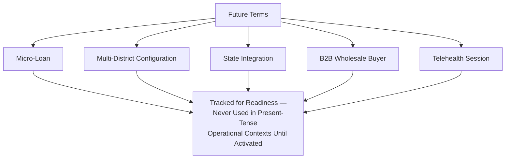

---

# Term Relationships

### Domain → Capability

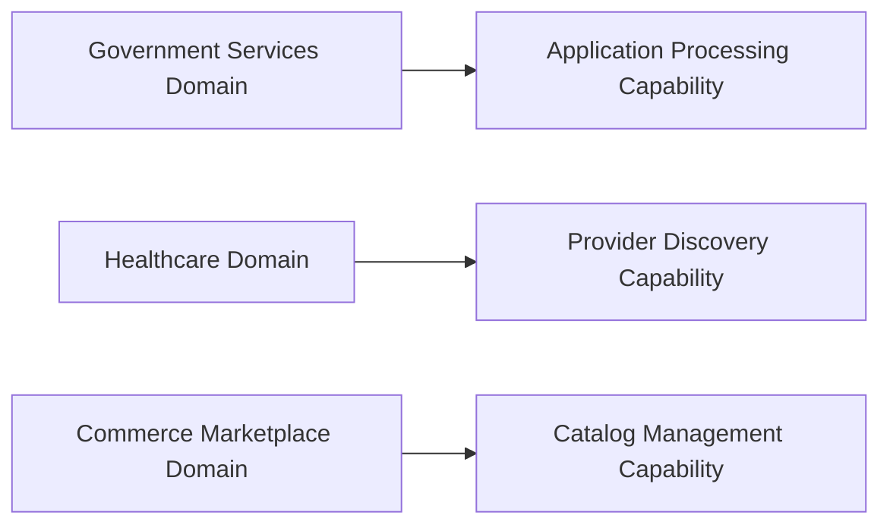

### Capability → Process

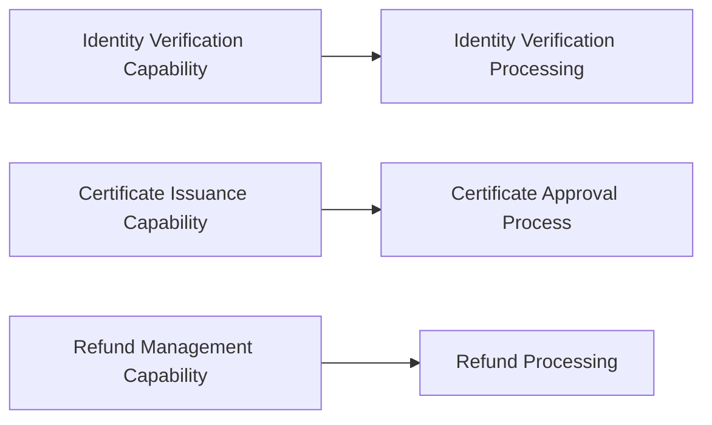

### Process → Rule

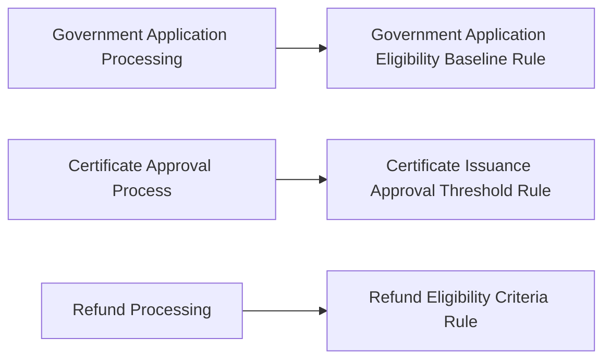

### Rule → Journey

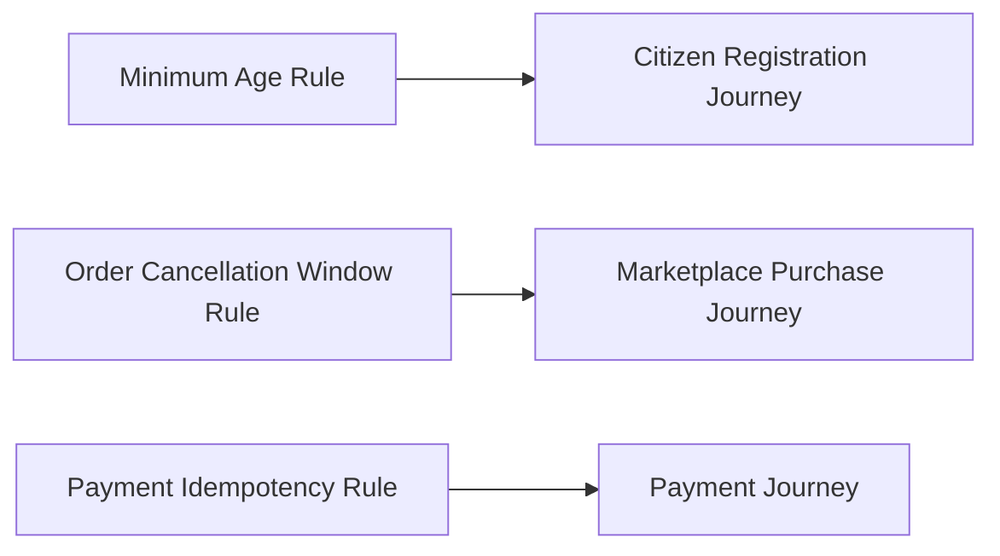

### Journey → Module

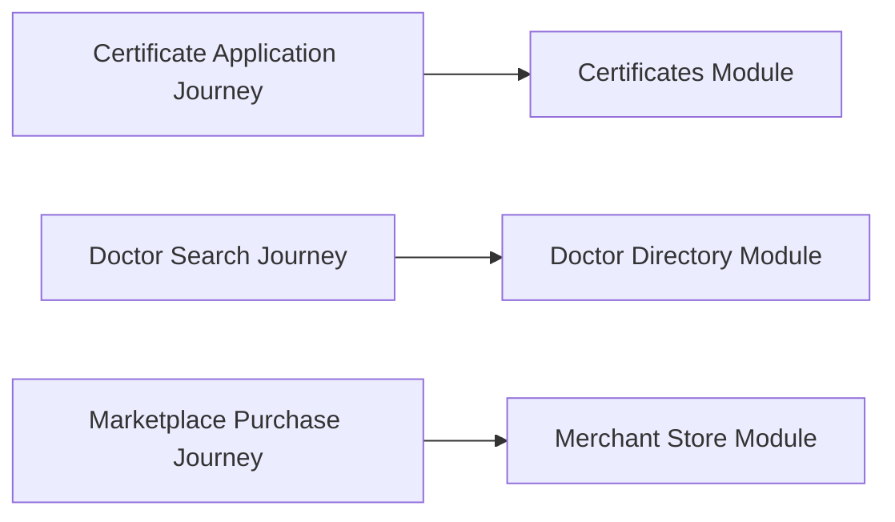

### Citizen → Service

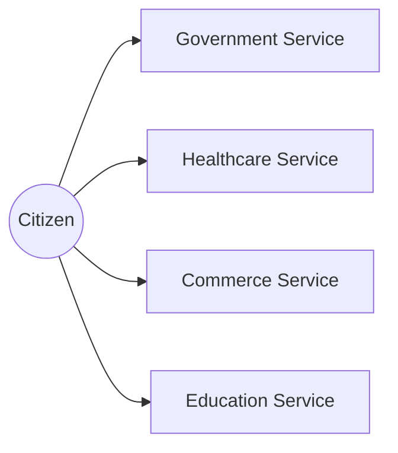

### Government → Department

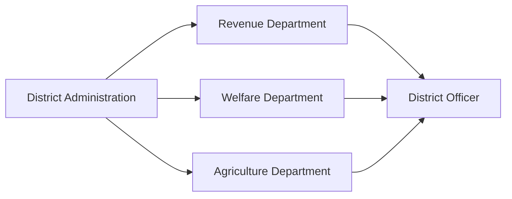

### Merchant → Marketplace

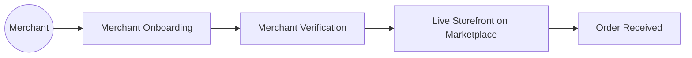

### Provider → Appointment

---

# Synonym Policy

### Approved Synonyms

| Preferred Term | Approved Synonym | Context |
|---|---|---|
| Merchant | Vendor (business context only) | Wholesale/B2B contexts, per GLOSS-006's usage guidance. |
| Group | Cooperative | Interchangeable in Community-domain content. |
| Booking | Reservation (informal speech only) | Never used in formal documentation. |

### Rejected Synonyms

| Rejected Term | Reason for Rejection | Use Instead |
|---|---|---|
| **User** | Generic, technology-flavored, and strips away the civic/dignity framing Arwal's vocabulary is built around. | Citizen (GLOSS-001) |
| **Customer** | Implies a purely commercial relationship, understating the civic dimension of Arwal's identity. | Citizen (GLOSS-001) |
| **Client** | Implies a formal, contractual relationship inconsistent with Arwal's citizen-first framing. | Citizen (GLOSS-001) |
| **Transaction** (used generically) | Too broad — conflates Order, Booking, Application, and Payment, each a distinct concept with distinct rules. | Order, Booking, Application, or Payment, as specifically applicable. |
| **Admin** (informal shorthand) | Ambiguous between an internal Administrator and a government administrative role. | Administrator (internal) or District Officer/State Administrator (government), as applicable. |
| **Ticket** (for a Grievance) | Conflates a formal civic Grievance with a routine Customer Support interaction. | Grievance (civic) or Support ticket (routine, non-civic). |

### Legacy Terms

| Legacy Term | Origin | Migration |
|---|---|---|
| **"Anita" persona name** (`ai-docs/00`) | An early, pre-Phase-53 placeholder persona sketch. | Superseded by PER-004 Manoj / the full Persona Catalog in `ai-docs/52-user-personas-user-segmentation.md`; the name "Anita" is retired from active use. |
| **"Service Booking"** | An early, undifferentiated term used before Booking and Order were formally separated. | Superseded by the distinct Order (GLOSS-039) and Booking (GLOSS-040) definitions. |

### Migration Rules

A legacy or rejected term discovered in an active document is corrected at the next scheduled review of that document, per its own governing phase document's Version Management discipline (`ai-docs/49`) — never through a silent, undocumented find-and-replace across the corpus. A migration is recorded in this document's Change History.

### Naming Consistency

Every new document, screen, or contract is checked against this Synonym Policy before publication, per the Quality Rules below — a document introducing a rejected synonym is returned for correction before Approval.

---

# Naming Conventions

| Convention | Rule |
|---|---|
| **Singular vs. Plural** | A glossary entry defines the singular form; plural usage in prose follows standard English pluralization, never a separate glossary entry. |
| **Capitalization** | An official Glossary term is capitalized when used as a defined concept ("a Citizen's Profile") and lowercase when used generically in ordinary prose ("citizens across the district"). |
| **Abbreviations** | An abbreviation is defined on first use in any document and never assumed familiar, per `ai-docs/24-documentation-standards.md`'s Explain Abbreviations standard. |
| **Acronyms** | Acronyms (KPI, SLA, MOU) are spelled out in full on first use per document, with the acronym in parentheses thereafter. |
| **Business Abbreviations** | Business-specific abbreviations (GMV, GSV, CSAT, NPS) are defined in this glossary's Compliance and Analytics sections and never introduced ad hoc elsewhere. |
| **Government Abbreviations** | A government-specific abbreviation (e.g., a scheme's official short name) is used only after confirming it matches the issuing department's own published terminology — Arwal never invents its own abbreviation for a government term. |
| **AI Terminology** | AI-related terms (AI Assistant, Recommendation, Automation Boundary) follow the same plain-language discipline as every other term — no AI-specific jargon is introduced without a corresponding glossary entry. |

---

# Glossary Governance

### Ownership

Every term has exactly one named Owner per the Master Glossary Registry — mirroring the identical Clear Ownership principle already established for Domains, Capabilities, Modules, Journeys, Processes, and Rules. An unowned term is treated as a governance defect, escalated at the next Quarterly Glossary Review.

### Approval Process

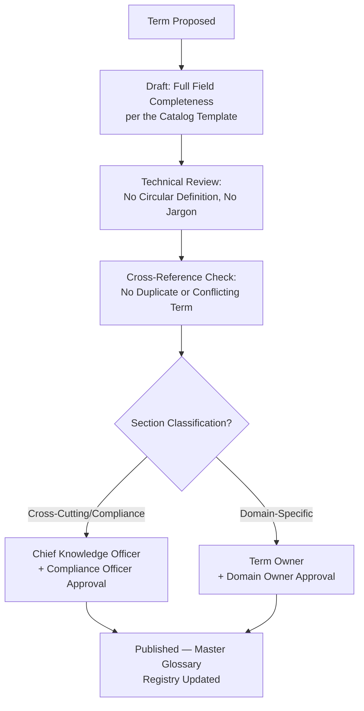

### Review Cadence

| Review | Cadence | Owner |
|---|---|---|
| **Quarterly Glossary Review** | Quarterly | Chief Knowledge Officer, Chief Enterprise Architect |
| **Annual Full Glossary Audit** | Annual | Chief Knowledge Officer, Compliance Officer, CPO |
| **Regulatory-Triggered Review** | Upon any regulatory or government-terminology change | Compliance Officer |
| **Cross-Document Consistency Review** | Semi-Annual | Chief Knowledge Officer |

### Version Control

Every term's Registry entry carries an explicit version (Major.Minor.Patch). A change to a term's Official Definition, Business Meaning, or Excluded Concepts is a Major revision requiring the classification-appropriate Approval above — never a silent in-place edit, mirroring `ai-docs/49-engineering-handbook-governance-evolution-standards.md`'s Version Management.

### Change Requests

Any engineer, product manager, or government partner may submit a Change Request — a proposed new term, a correction, or a synonym-policy update — through the standard Proposal path. A Change Request is acknowledged within 5 business days and routed to the term's Owner or the Chief Knowledge Officer.

### Deprecation Process

A term is marked Deprecated when it is superseded by a clearer or more precise term, per the Legacy Terms table above. A Deprecated term remains in the Registry, clearly marked, with a pointer to its replacement — it is never silently removed, mirroring the Archive, Never Delete principle already established throughout this handbook.

### Retirement Process

A Deprecated term is Retired only when no active document references it and its sunset window (minimum 90 days, mirroring `ai-docs/49`'s Deprecation Governance) has closed. A Retired term's Glossary ID is never reused.

---

# Quality Rules

Every glossary entry is checked against the following before publication:

- [ ] **Definition completeness** — Every required field in the Catalog template is populated, never left partial.
- [ ] **No circular definitions** — A term's definition never depends on a word that itself depends on the term being defined.
- [ ] **No implementation references** — No definition names a database, API, service, or UI element.
- [ ] **Plain language** — A first-time reader unfamiliar with Arwal can read the definition once and understand it correctly.
- [ ] **Cross-reference requirements** — Every Related Term cited actually exists in the Registry, with no broken reference.
- [ ] **Consistency checks** — The term does not conflict with, duplicate, or silently redefine an existing entry.

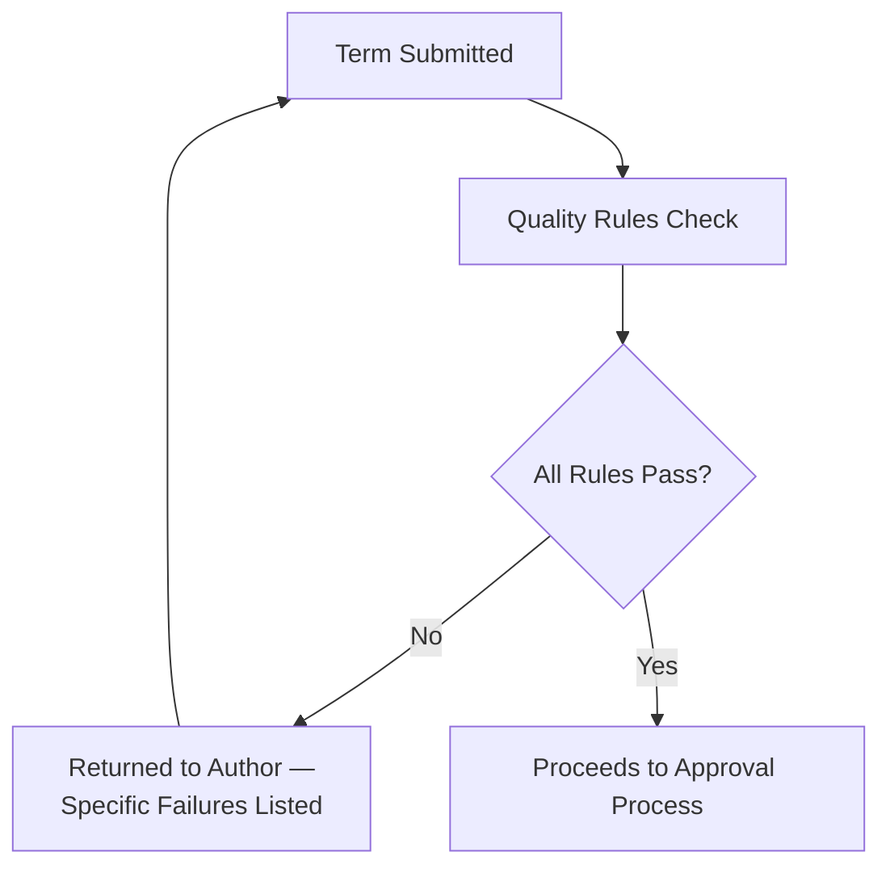

---

# Anti-Patterns

| Anti-Pattern | Description | Why It's Rejected |
|---|---|---|
| **Multiple meanings** | The same term is used with two different meanings across two documents. | Violates Single Source of Truth; the exact failure mode this document exists to prevent. |
| **Duplicate definitions** | A term is independently redefined in a domain-specific document instead of citing this glossary. | Violates Single Source of Truth; the two definitions inevitably drift apart. |
| **Technical jargon** | A definition uses implementation vocabulary (a table name, an endpoint, a framework term) a citizen or government partner would not recognize. | Violates Business-First Language and Technology Independence. |
| **Department-specific terminology** | A term is used with a meaning specific to one internal team's informal shorthand, never reconciled with the platform-wide definition. | Violates Consistency; recreates the Knowledge Silos anti-pattern already rejected in `ai-docs/33-engineering-knowledge-management-standards.md`. |
| **Hidden abbreviations** | An abbreviation is used without ever being spelled out anywhere in the document corpus. | Violates the Explain Abbreviations discipline already established in `ai-docs/24-documentation-standards.md`. |
| **Conflicting terms** | Two glossary entries describe overlapping concepts with no stated boundary between them. | Violates No Ambiguity; forces every reader to guess which term actually applies. |
| **Undefined acronyms** | An acronym (SLA, KPI, MOU) appears in a citizen-facing or government-facing document with no glossary entry. | Violates Plain Language and Government-Friendly Terminology. |

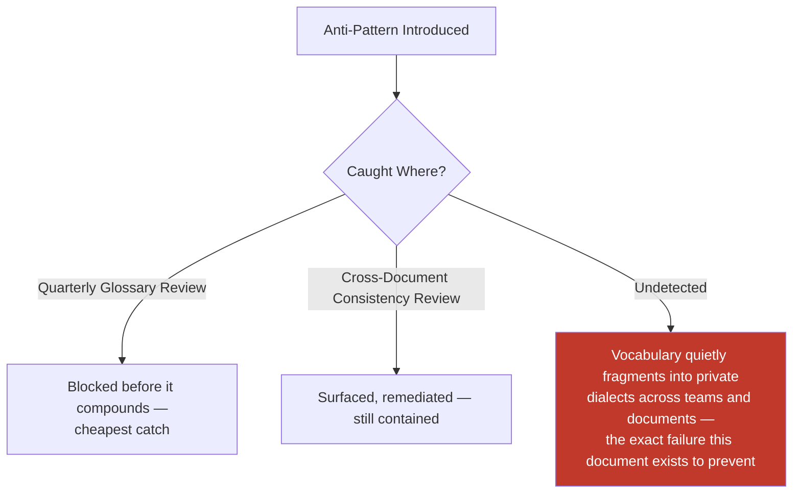

---

# Traceability

### Term → Domain Matrix

| Term | Related Domain(s) |
|---|---|
| Citizen, Identity, Consent, Delegated Access | Identity (DOM-001), Citizen (DOM-002) |
| Application, Certificate, Scheme, Grievance | Government Services (DOM-003) |
| Farmer | Agriculture (DOM-004) |
| Healthcare Provider, Appointment | Healthcare (DOM-005) |
| Tutor, School | Education (DOM-006) |
| Employer, Job Seeker | Jobs (DOM-007) |
| Merchant, Vendor, Marketplace, Order | Commerce Marketplace (DOM-008) |
| Delivery | Logistics (DOM-011) |
| Property Owner, Tenant | Property (DOM-012) |
| Wallet, Refund, Settlement | Payments (DOM-013) |
| Group/Cooperative | Community (DOM-014) |
| AI Assistant, Recommendation | AI Assistant (DOM-017) |
| Dashboard, Analytics, KPI | Analytics (DOM-018) |
| Administrator, Moderator | Administration (DOM-019) |
| Trust, Fraud, Dispute, Suspension, Reputation | Trust & Safety (DOM-020) |

### Term → Capability Matrix

| Term | Related Capability(ies) |
|---|---|
| Verification, Identity | Identity Verification (CAP-001) |
| Consent | Consent Management (CAP-004) |
| Delegated Access | Delegated & Assisted Access (CAP-005) |
| Application | Government Application Processing (CAP-006) |
| Certificate | Certificate Issuance (CAP-007) |
| Grievance | Grievance Resolution (CAP-008) |
| Scheme, Eligibility | Scheme Eligibility Assessment (CAP-010) |
| Healthcare Provider | Healthcare Discovery (CAP-014) |
| Appointment, Booking | Appointment Scheduling (CAP-015) |
| Merchant | Merchant Onboarding (CAP-021) |
| Order | Order Management (CAP-025) |
| Delivery | Delivery Coordination (CAP-026) |
| Wallet, Settlement | Payment Processing (CAP-027) |
| Refund | Refund Management (CAP-028) |
| AI Assistant, Recommendation | AI Assistance (CAP-033), Recommendation Engine (CAP-032) |
| Audit | Audit Logging (CAP-035) |
| Trust, Dispute | Trust & Safety (CAP-036) |
| Fraud | Fraud Detection (CAP-038) |
| Reputation | Reputation & Rating Management (CAP-045) |

### Term → Process Matrix

| Term | Related Process(es) |
|---|---|
| Verification, Identity | PROC-002 Identity Verification Processing |
| Consent | PROC-003 Consent Management |
| Application, Grievance | PROC-004, PROC-006 |
| Certificate | PROC-005 Certificate Approval |
| Merchant | PROC-008 Merchant Verification |
| Healthcare Provider | PROC-009 Provider Verification |
| Order, Delivery | PROC-011 Order Fulfillment, PROC-012 Delivery Coordination |
| Refund | PROC-013 Refund Processing |
| Settlement | PROC-014 Payment Reconciliation |
| Fraud, Suspension | PROC-015 Fraud Investigation |
| Dispute | PROC-015 Fraud Investigation, PROC-013 Refund Processing |
| Audit | PROC-021 Audit Management |

### Term → Rule Matrix

| Term | Related Rule(s) |
|---|---|
| Citizen (minimum age) | RULE-001 |
| Identity, Verification | RULE-002 |
| Consent | RULE-003 |
| Delegated Access | RULE-004 |
| Application, Eligibility | RULE-006, RULE-008 |
| Certificate, Approval | RULE-007 |
| Grievance, Appeal | RULE-009, RULE-028 |
| Merchant | RULE-010 |
| Listing | RULE-011, RULE-017, RULE-024 |
| Order (cancellation) | RULE-012 |
| Refund | RULE-013 |
| Healthcare Provider | RULE-014 |
| Appointment | RULE-015 |
| Tutor | RULE-016 |
| Employer | RULE-017 |
| Wallet, Settlement | RULE-018, RULE-019 |
| Fraud, Suspension | RULE-026, RULE-027 |
| AI Assistant, Recommendation | RULE-024 |
| Audit | RULE-025, RULE-029 |

### Term → Journey Matrix

| Term | Related Journey(s) |
|---|---|
| Citizen | JRN-001 Citizen Registration |
| Identity, Delegated Access | JRN-002 Identity Verification |
| Application, Certificate | JRN-004 Government Certificate Application |
| Scheme, Eligibility | JRN-005 Scheme Eligibility Check |
| Grievance | JRN-006 Grievance Submission |
| Healthcare Provider | JRN-007 Doctor Search |
| Appointment, Booking | JRN-008 Appointment Booking |
| Merchant | JRN-014 Merchant Onboarding |
| Order | JRN-016 Marketplace Purchase |
| Delivery | JRN-023 Delivery Tracking |
| Refund | JRN-022 Refund |
| Wallet, Settlement | JRN-021 Payment |
| AI Assistant | JRN-027 AI Assistant Interaction |

### Term → Module Matrix

| Term | Related Module(s) |
|---|---|
| Identity, Verification | MOD-001 Identity & Verification |
| Profile, Consent | MOD-002 Citizen Profile |
| Delegated Access | MOD-003 Delegated & Assisted Access |
| Certificate | MOD-004 Certificates |
| Application | MOD-005 Applications |
| Grievance | MOD-006 Grievances |
| Healthcare Provider, Appointment | MOD-012 Doctor Directory, MOD-013 Appointment Booking |
| Tutor | MOD-016 Tutors |
| Merchant, Order | MOD-021 Merchant Store, MOD-023 Orders |
| Delivery | MOD-028 Delivery Tracking |
| Wallet, Refund, Settlement | MOD-032 Wallet, MOD-034 Payouts & Refunds |
| AI Assistant | MOD-039 AI Assistant |
| Dashboard, Analytics | MOD-040 Analytics & Reporting |

### Term → Strategic Goal Matrix

| Term | Strategic Objective (`ai-docs/50`) |
|---|---|
| Application, Certificate, Grievance, District Officer | Government Efficiency, Service Digitization |
| Farmer, Scheme | Farmer Empowerment |
| Healthcare Provider, Appointment | Healthcare Access |
| Tutor, School | Education Improvement |
| Employer, Job Seeker | Employment Generation |
| Merchant, Order, Marketplace | Economic Growth, Business Enablement |
| Wallet, Settlement, Refund | Sustainable Growth |
| Trust, Fraud, Dispute, Suspension, Audit | Sustainable Growth (trust dimension) |
| AI Assistant, Recommendation | Sustainable Growth (responsible innovation) |

---

# Relationship with Previous Standards

### Project Vision & Product Goals
`ai-docs/00-project-vision.md` and `ai-docs/01-product-goals.md` establish the founding mission and early vocabulary (Citizen, Trust, Verification) this glossary formalizes into precise, versioned entries — no term here contradicts the founding charter, only makes it precise.

### Stakeholder Analysis & User Personas
`ai-docs/51-stakeholder-analysis.md` and `ai-docs/52-user-personas-user-segmentation.md` establish the stakeholder categories and named personas (Meena, Devendra, Priya) this glossary's Citizen, Government, and role-specific terms trace directly back to.

### Business Domain Model
`ai-docs/53-business-domain-model.md` establishes the Ubiquitous Language for shared concepts (Citizen, Order, Booking, Payment, Application, Identity, Reputation, Trust) — this glossary is the full, formal expansion of that document's summary-level Shared Business Concepts table.

### Product Module Catalog
`ai-docs/54-product-module-catalog.md` establishes the user-visible modules this glossary's terms are expressed through — every term's "Related Modules" trace directly to that Registry.

### Business Capability Map
`ai-docs/55-business-capability-map.md` establishes the stable business abilities this glossary's terms describe — every Capability's own vocabulary (Purpose, Business Value) is the direct source for many entries here.

### User Journey Standards
`ai-docs/56-user-journey-standards.md` establishes the lived citizen experience this glossary's terms are felt through — every term used in a Journey's User Goal or emotional-experience language traces back to a precise entry here.

### Business Process Standards
`ai-docs/57-business-process-standards.md` establishes the organizational sequence this glossary's terms are executed within — every Process's Actors, Decision Points, and Business Rules use vocabulary this document makes precise.

### Business Rules & Policies
`ai-docs/58-business-rules-policies.md` establishes the precise decision logic this glossary's terms are tested against — Eligibility, Approval, Rejection, and Appeal are used dozens of times across that document's Rule Catalog, and this glossary is where their singular meaning is finally, formally fixed.

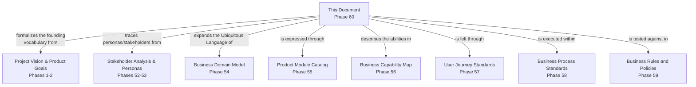

---

# Executive Features

### Alphabetical Glossary Index

AI Assistant (GLOSS-048) · Analytics (GLOSS-056) · Appeal (GLOSS-023) · Application (GLOSS-015) · Appointment (GLOSS-041) · Approval (GLOSS-021) · Audit (GLOSS-036) · Booking (GLOSS-040) · Business Capability (GLOSS-025) · Business Domain (GLOSS-026) · Business Process (GLOSS-027) · Business Rule (GLOSS-028) · Certificate (GLOSS-016) · Citizen (GLOSS-001) · Compliance (GLOSS-033) · Consent (GLOSS-019) · Dashboard (GLOSS-055) · Delegated Access (GLOSS-024) · Delivery (GLOSS-042) · Dispute (GLOSS-064) · District (GLOSS-066) · District Officer (GLOSS-053) · Eligibility (GLOSS-020) · Employer (GLOSS-011) · Farmer (GLOSS-004) · Fraud (GLOSS-035) · Governance (GLOSS-032) · Grievance (GLOSS-060) · Group / Cooperative (GLOSS-061) · Healthcare Provider (GLOSS-008) · Identity (GLOSS-018) · Job Seeker (GLOSS-012) · Knowledge Base (GLOSS-050) · KPI (GLOSS-057) · Listing (GLOSS-062) · Marketplace (GLOSS-038) · Merchant (GLOSS-005) · Moderator (GLOSS-052) · Notification (GLOSS-046) · Order (GLOSS-039) · Policy (GLOSS-031) · Product Module (GLOSS-030) · Profile (GLOSS-047) · Property Owner (GLOSS-013) · Recommendation (GLOSS-049) · Refund (GLOSS-043) · Rejection (GLOSS-022) · Reputation (GLOSS-063) · Resident (GLOSS-002) · Risk (GLOSS-037) · Scheme (GLOSS-059) · School (GLOSS-009) · Service Provider (GLOSS-007) · Settlement (GLOSS-044) · SLA (GLOSS-058) · State Administrator (GLOSS-054) · Suspension (GLOSS-065) · Tenant (GLOSS-014) · Trust (GLOSS-034) · Tutor (GLOSS-010) · User Journey (GLOSS-029) · Vendor (GLOSS-006) · Verification (GLOSS-017) · Visitor (GLOSS-003) · Wallet (GLOSS-045)

### Category Index

See Term Classification above for the full nineteen-section breakdown; each section's entries are listed in the Business Glossary in registry order.

### Acronym Index

| Acronym | Full Term | Glossary Reference |
|---|---|---|
| AI | Artificial Intelligence | GLOSS-048 |
| CAP | Capability (ID prefix) | GLOSS-025 |
| CSAT | Citizen Satisfaction Score | GLOSS-057 (Analytics context) |
| DOM | Domain (ID prefix) | GLOSS-026 |
| GMV | Gross Merchandise Value | GLOSS-057 (Analytics context) |
| GSV | Gross Service Value | GLOSS-057 (Analytics context) |
| JRN | Journey (ID prefix) | GLOSS-029 |
| KPI | Key Performance Indicator | GLOSS-057 |
| KYC | Know Your Customer (a Verification standard) | GLOSS-017 |
| MOD | Module (ID prefix) | GLOSS-030 |
| MOU | Memorandum of Understanding | GLOSS-053, GLOSS-054 (government-agreement context) |
| NPS | Net Promoter Score | GLOSS-057 (Analytics context) |
| PROC | Process (ID prefix) | GLOSS-027 |
| RULE | Business Rule (ID prefix) | GLOSS-028 |
| SLA | Service Level Agreement | GLOSS-058 |
| SHG | Self-Help Group | GLOSS-061 |

### Cross-Reference Index

Every Glossary entry's "Related Terms" field constitutes this document's living cross-reference index; a term with no inbound or outbound cross-reference is flagged as an Orphan Term at the Quarterly Glossary Review, mirroring the Orphan Detection discipline already established in `ai-docs/49-engineering-handbook-governance-evolution-standards.md`.

### Frequently Confused Terms

| Term A | Term B | Distinguishing Factor |
|---|---|---|
| Order (GLOSS-039) | Booking (GLOSS-040) | Order = commerce; Booking = time-bound healthcare/education service. |
| Application (GLOSS-015) | Order (GLOSS-039) | Application = civic; Order = commerce. |
| Grievance (GLOSS-060) | Dispute (GLOSS-064) | Grievance = civic-service complaint; Dispute = commerce/healthcare transactional disagreement. |
| Appeal (GLOSS-023) | Grievance (GLOSS-060) | Appeal contests a specific adverse decision; Grievance addresses a broader process failure. |
| Rejection (GLOSS-022) | Suspension (GLOSS-065) | Rejection applies to a fresh request; Suspension removes already-active access. |
| Merchant (GLOSS-005) | Vendor (GLOSS-006) | Merchant is the default citizen-facing term; Vendor is reserved for wholesale/B2B or Arwal's own technology-supplier context. |
| Identity (GLOSS-018) | Profile (GLOSS-047) | Identity is the verified fact of who someone is; Profile is the editable data describing them. |
| Eligibility (GLOSS-020) | Approval (GLOSS-021) | Eligibility is a computed precondition; Approval is the subsequent, often human-confirmed, final decision. |

### Executive Terminology Dashboard

| Metric | Definition | Reviewed By |
|---|---|---|
| **Term coverage** | % of documents in the handbook whose domain-specific vocabulary has a corresponding glossary entry. | Chief Knowledge Officer, Quarterly |
| **Consistency rate** | % of term usages across the corpus matching this glossary's Official Definition exactly. | Chief Knowledge Officer, Semi-Annual |
| **Orphan term rate** | Count of terms with no cross-reference to any other entry. | Chief Enterprise Architect, Quarterly |
| **Synonym-violation rate** | Count of Rejected Synonym occurrences found in active documents. | Chief Knowledge Officer, Semi-Annual |
| **Government terminology alignment** | % of Government Terms confirmed to match the issuing department's own published vocabulary. | Head of Government Partnerships, Annual |

### Definition Lifecycle

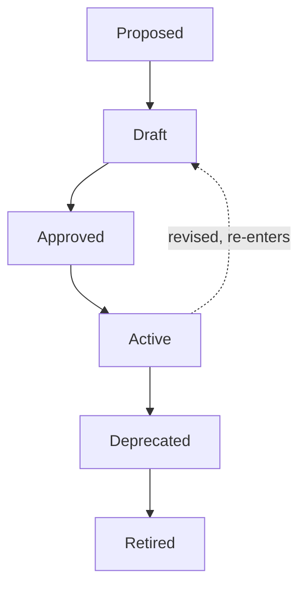

### Knowledge Taxonomy

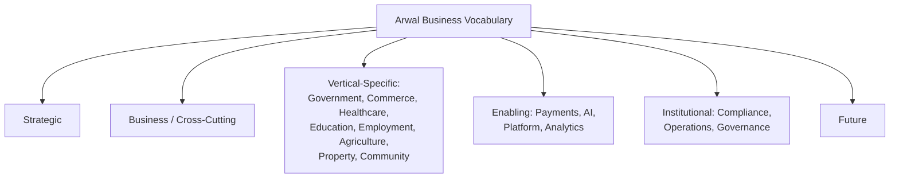

---

# Closing Statement

> **Callout — Closing Statement**
> Every preceding phase document assumed a shared vocabulary existed — this document is where that assumption finally becomes true. A "Citizen" in a government contract, a "Booking" in an engineering specification, an "Eligibility" determination in an AI system's reasoning, and an "Appeal" in a citizen-facing rejection notice must all mean the same thing, every time, or the trust Arwal has built across fifty-nine preceding documents quietly erodes into fifty-nine private dialects nobody notices have drifted apart until a citizen, a government partner, or an auditor is the one who discovers the gap. A district-scale civic-commercial platform does not stay coherent by accident any more than its codebase does — it stays coherent because the same word carries the same meaning whether it is spoken by a farmer in a village, written into a district administration's memorandum, evaluated by an AI Assistant in a citizen's own dialect, or cited in an auditor's evidence file. This glossary is that shared language, made explicit, singular, owned, and versioned — the vocabulary every future product decision, engineering artifact, government agreement, and AI reasoning process is now expected to speak. Where a future phase must deviate from a term defined here, that deviation is made explicitly — through the Glossary Governance approval workflow above — never silently, and never by default.

This document, `ai-docs/59-business-glossary.md`, is Phase 60 of approximately 420. Every future handbook document, screen, government agreement, and AI reasoning process is expected to use the vocabulary defined here, or to justify its deviation in writing.

**End of Phase 60 — `ai-docs/59-business-glossary.md`**
