# Customer Experience Strategy

**Document:** `ai-docs/60-customer-experience-strategy.md`
**Project:** Arwal — The District Super App
**Stage:** 2 — Product & Business Strategy
**Phase:** 61 — Customer Experience Strategy
**Status:** Approved for Product & Engineering Reference
**Audience:** CEO, CCO, CPO, CXO, Customer Success Director, Service Design Leads, Government Digital Transformation Partners, Accessibility Advisors, Product Managers, Engineering Directors

> **Callout — Purpose of This Document**
> `ai-docs/00-project-vision.md` through `ai-docs/59-business-glossary.md` established why Arwal exists, what it can do, who it serves, what a citizen opens, what it feels like to move through it, how the organization executes work, the precise rules governing every decision, and the shared vocabulary all of that is spoken in. None of those documents answers the question every future experience decision, government partnership conversation, and investor conversation now depends on: **what must a citizen actually feel, remember, and trust — every single time — for Arwal to be worth the dependence a district is being asked to place in it?** This document is that answer — the authoritative Customer Experience Strategy every future service design, support model, and experience-quality decision traces back to.

---

# Purpose of this Document

### Why Customer Experience Is a Distinct Strategic Layer

`ai-docs/56-user-journey-standards.md` defines what it feels like to move through a single journey — the steps, the failure paths, the emotional arc of applying for a certificate or booking a doctor. That document is deliberately journey-scoped: each entry answers "how does *this* experience work?" This document answers a different, platform-wide question: **what is the *consistent, cumulative* experience Arwal is building, across every journey, every vertical, and every year, that makes a citizen trust it enough to depend on it for the rest of their life?** A citizen does not experience Arwal as fifty-seven catalogued journeys. They experience it as one relationship — and that relationship either compounds into trust or erodes into abandonment, one interaction at a time. Customer Experience Strategy is the layer that makes that cumulative relationship a deliberately engineered business asset rather than an emergent accident of fifty separate teams each building their own journey well.

### Why This Is a Business Strategy Document, Not a Design Document

This document contains no wireframes, no UI specifications, no design-system tokens, and no screen layouts. It does not compete with, restate, or second-guess `ai-docs/56-user-journey-standards.md`'s Accessibility Journey Standards or `ai-docs/12-accessibility-standards.md`'s WCAG floor. Its territory is strictly: **why customer experience is a strategic differentiator, what Arwal commits its experience to feel like, and how that commitment is measured, governed, and continuously improved** — the business case and the business discipline, never the pixel.

### The Chain of Reasoning This Document Completes

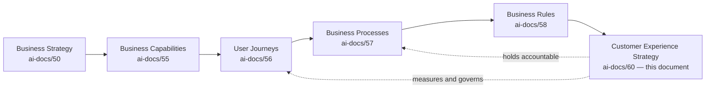

| Layer | Question It Answers |
|---|---|
| Business Strategy | Why does Arwal exist, and how does it win? |
| Capability | What can Arwal do? |
| Journey | What does one interaction feel like? |
| Process | How does the organization execute reliably? |
| Rule | What precisely is decided, and how? |
| **Customer Experience Strategy** (this document) | **What must every citizen feel, cumulatively, for Arwal's mission to be true — and how is that feeling measured, protected, and improved forever?** |

### Why Customer Experience Is a Strategic Differentiator, Not a Cost Center

Arwal does not win by being the most feature-complete platform in any single vertical — `ai-docs/50-product-vision-business-strategy.md`'s Market Positioning already establishes that no single-purpose competitor can be out-featured on their own turf profitably. Arwal wins because trust compounds across verticals: a citizen who trusts Arwal with a grocery order is more willing to trust it with a certificate application; a citizen who trusts it with a certificate application is more willing to trust it with a health booking. This compounding effect is **entirely and exclusively a function of customer experience** — no amount of backend reliability, capability depth, or feature breadth produces it if a citizen does not *feel*, at every touchpoint, that Arwal respects their time, their literacy, their money, and their dignity. This is why Customer Experience Strategy sits beside — not beneath — Engineering and Product strategy in Arwal's governance structure.

### Why Experience Creates Trust, Trust Creates Adoption, Adoption Creates Ecosystem Growth

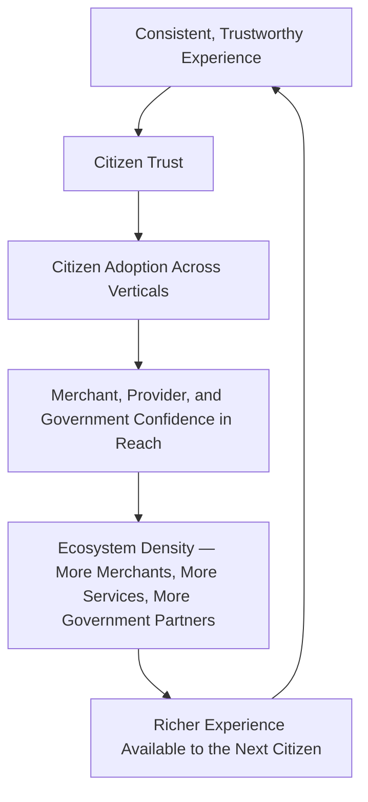

This is Arwal's experience flywheel. It only turns in one direction if every spoke — Trust, Adoption, Ecosystem — is held to the same non-negotiable experience standard; a single broken spoke (a merchant onboarding funnel that alienates suppliers, a support process that abandons a citizen mid-dispute) stalls the entire wheel, not just its own vertical.

### Why Customer Experience Is a Measurable Business Capability

Consistent with `ai-docs/55-business-capability-map.md`'s discipline that a capability is technology-independent, stable, and measurable, Customer Experience is treated in this document as exactly that: a durable business ability — "Arwal delivers a consistently trustworthy experience" — that survives every UI redesign, every technology migration, and every organizational reshuffle untouched, evaluated against explicit KPIs (see Experience Metrics below), never assessed by impression or anecdote alone.

---

# Customer Experience Philosophy

Every principle below exists because a platform that gets citizen experience wrong does not fail abstractly — it fails a specific citizen, in a specific moment, in a way that is remembered far longer than any feature ever is.

### Citizen First

**Why it exists:** Every experience decision is judged first by whether it serves the citizen's actual goal, never by whether it serves an internal metric, a commercial upsell, or a convenient shortcut for engineering. Mirrors the identical Citizen-First tie-breaker already established throughout `ai-docs/51` through `ai-docs/58`.

### Trust Before Convenience

**Why it exists:** A faster flow that leaves a citizen unsure whether their payment went through, or whether their data is safe, is not actually more convenient — it has traded a few saved seconds for a corroded relationship. Trust is the prerequisite convenience is built on top of, never a variable traded against it.

### Simple Before Powerful

**Why it exists:** A first-generation smartphone user and a power user must both succeed on their first attempt. Power and depth are revealed progressively, per `ai-docs/00-project-vision.md`'s Progressive Complexity principle — never presented up front at the cost of a citizen who cannot yet navigate it.

### Inclusive By Default

**Why it exists:** An experience designed for the median urban user and "made accessible" afterward has already excluded the citizens Arwal exists to serve first. Inclusion is the starting design constraint, not a downstream patch.

### Respect Every User

**Why it exists:** A farmer with a cracked entry-level phone and an investor with a flagship device are both owed the same quality of experience, response time, and dignity — reputational, financial, or literacy status changes *how* Arwal serves someone, never *whether* it respects them.

### Consistency Everywhere

**Why it exists:** A citizen who has learned how "track an order" feels in Marketplace should never have to relearn a subtly different interaction in Grocery or Food. Consistency is what lets trust earned in one vertical transfer to the next, per `ai-docs/54-product-module-catalog.md`'s Consistency principle applied here at the platform-experience level.

### Transparency

**Why it exists:** A citizen who does not understand what happens next, why a decision was made, or what data is being used cannot trust an outcome even when it is correct. Every consequential interaction states, in plain language, what happens and why.

### Accessibility

**Why it exists:** WCAG compliance is a floor, never a target, per `ai-docs/12-accessibility-standards.md` — a platform that is merely "compliant" while still being hard to use for a low-literacy or visually impaired citizen has optimized for an audit, not a citizen.

### Reliability

**Why it exists:** When a citizen depends on Arwal for a hospital booking or a government deadline, "the app was down" is not a minor inconvenience — it is a missed appointment or a missed subsidy window. Reliability is a trust signal before it is an engineering metric, per `ai-docs/50-product-vision-business-strategy.md`'s Product Philosophy.

### Speed With Confidence

**Why it exists:** Speed that leaves a citizen unsure whether an action succeeded is not speed — it is anxiety disguised as efficiency. Every fast interaction is paired with an equally fast, equally clear confirmation.

### No Dead Ends

**Why it exists:** Every interaction has a clear resolution path — an error, a rejection, or a stalled process always states the next available step, per the founding No Dead Ends product principle already established in `ai-docs/00-project-vision.md`.

### One Identity

**Why it exists:** A citizen's reputation, history, and trust compound only if they never have to "start over" moving between verticals — the single unified Identity (per `ai-docs/58-business-rules-policies.md`'s GLOSS-018) is the structural foundation the entire experience strategy is built on top of.

### One Platform

**Why it exists:** Arwal is experienced as a single coherent relationship, never as a federation of loosely related mini-apps — a citizen should never be able to tell, from the experience alone, which internal team or vertical built the screen they are on.

### Human Assistance When Needed

**Why it exists:** No citizen is ever fully self-service-only — a family member's delegated help, a field agent, or a phone-based support line is always reachable, per the Assisted/Delegated Access commitment already established in `ai-docs/00-project-vision.md`'s Accessibility Vision.

### AI Assists, Humans Decide

**Why it exists:** Per the AI Principle already established in `ai-docs/00-project-vision.md` and operationalized as RULE-024 in `ai-docs/58-business-rules-policies.md`, no citizen may be denied a service, blocked from a transaction, or penalized in reputation solely by an opaque automated decision without a human-reachable override path — this is absolute, and it is as much an experience commitment as a governance one.

### Continuous Improvement

**Why it exists:** An experience that was excellent at launch and never revisited decays the moment citizen needs, device profiles, or fraud patterns shift. Improvement is a scheduled discipline (see Voice of Customer and Governance below), never an accident of a team happening to notice a problem.

### Long-Term Trust

**Why it exists:** Arwal is infrastructure built for a generation, per `ai-docs/00-project-vision.md` — an experience decision optimized for this quarter's growth metric at the expense of a citizen's long-term trust is optimized for the wrong time horizon, and is treated as a regression regardless of its short-term commercial appeal.

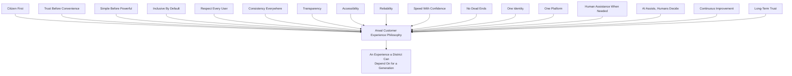

> **Callout — The One-Sentence Experience Philosophy**
> *"If a citizen would not tell a neighbor 'you can trust it, it just works,' the experience is not yet done — no matter how complete the feature list behind it is."*

---

# Customer Experience Vision

> **Callout — The Experience Arwal Wants Every Citizen to Remember**
> *"Whatever I needed — a price, a certificate, a doctor, a delivery — Arwal made it feel simple, safe, and mine. It never made me feel small for not knowing something, and it never let me wonder whether it actually worked."*

### How Arwal Should Feel

Arwal should feel like a **calm, capable, and honest presence** in a citizen's daily life — never anxious-making, never confusing, never opaque. It should feel the way a trusted neighbor or a well-run local institution feels: present when needed, unobtrusive otherwise, and always straightforward about what is happening and why.

### How Interactions Should Feel

| Interaction Category | Feeling Commitment |
|---|---|
| **Government Services** | Feels like a fair, patient, and competent civil servant who explains things clearly and never makes a citizen feel bureaucratically small — replacing the anxiety of a physical queue with the calm of a visible, tracked process. |
| **Healthcare** | Feels reassuring and unambiguous — a booking that is confirmed feels *definitely* confirmed, never provisionally so, because the stakes of doubt are a missed appointment. |
| **Commerce (Marketplace, Food, Grocery)** | Feels effortless and dependable — the everyday equivalent of a trusted local shopkeeper who never shortchanges a citizen and always delivers what was promised. |
| **Education** | Feels encouraging and judgment-free — a student or parent exploring a tutor or scholarship should feel supported in a decision that matters to their future, never rushed or upsold. |
| **Agriculture** | Feels like a fair, plainspoken advisor — a farmer should feel Arwal is unambiguously on their side against exploitative middlemen, never a black box repeating a number it cannot explain. |
| **AI Assistance** | Feels like a patient, competent aide who never pretends to know more than it does, always offers a human when uncertain, and never makes a citizen feel foolish for asking a simple question. |
| **Support & Grievances** | Feels like being genuinely heard — a citizen escalating a problem should feel the process is actively working on their behalf, never that they have shouted into a void. |

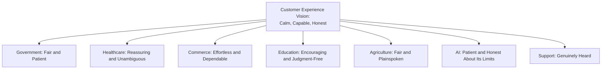

---

# Customer Segments and Experience Expectations

Every segment below traces to its full Persona (`ai-docs/52-user-personas-user-segmentation.md`) and Stakeholder (`ai-docs/51-stakeholder-analysis.md`) entry; this section states only the segment's distilled *experience expectation*, never restating those documents' full profiles.

| Segment | Experience Expectation |
|---|---|
| **Citizens (General)** | One identity that remembers them, everywhere, without ever feeling surveilled; every action's outcome is immediately clear. |
| **Farmers** | Voice-first, plainspoken, and trustworthy price/scheme information that never favors a hidden buyer; works reliably on a weak signal. |
| **Students** | Judgment-free discovery of opportunity, presented at their literacy level, with genuine (not manipulated) ratings. |
| **Patients** | Unambiguous booking confirmation, clear provider verification signals, and dignity-preserving handling of health information. |
| **Parents** | Confidence that a minor-involving interaction is safe, transparent, and within their oversight — never a surprise. |
| **Merchants** | An onboarding and daily-operations experience that never makes them feel technologically inadequate; fair, visible ranking. |
| **Service Providers** | A verification and booking experience that builds a portable reputation they can feel accumulating, not resetting. |
| **Doctors** | A scheduling experience that reduces no-shows and administrative burden without adding new friction to their day. |
| **Teachers** | Discoverability and reputation that compound over time, replacing precarious word-of-mouth referral. |
| **Employers** | A fast, fair, and fraud-protected way to reach genuinely local candidates. |
| **Delivery Partners** | Transparent, verifiable earnings and fair, efficient routing — never opaque payout math. |
| **Government Officers** | Tooling that reduces backlog and gives them confidence every decision is defensible and auditable. |
| **Administrators** | Clear, role-scoped visibility into platform health, fraud signals, and verification queues. |
| **Support Teams** | Full context on a citizen's history the moment a ticket opens, so no citizen has to re-explain themselves. |
| **Future State Users** | Residents of a not-yet-onboarded district should, upon eventual activation, experience a platform that already understands their local reality — never a generic, unlocalized rollout. |

---

# Experience Goals

Every goal below is measurable, reviewed at the cadence defined in Governance, and never asserted qualitatively.

| Goal | Definition | Direction |
|---|---|---|
| **Reduce Effort** | Fewer steps, fewer redundant data entries, per Journey Optimization's Cognitive Load priority (`ai-docs/56`). | Decreasing steps-to-completion |
| **Increase Confidence** | A citizen's stated certainty that an action succeeded, measured post-interaction. | Increasing |
| **Reduce Frustration** | Fewer support escalations per completed journey. | Decreasing |
| **Reduce Abandonment** | Fewer journeys entering "Cancelled" or "Expired" states unintentionally (per `ai-docs/56`'s Journey State Model). | Decreasing |
| **Increase Completion** | Higher Journey Completion Rate across Mission Critical journeys. | Increasing |
| **Increase Trust** | Rising District Trust Signal (per `ai-docs/50-product-vision-business-strategy.md`). | Increasing |
| **Improve Accessibility** | Rising Accessibility Completion Parity (per `ai-docs/56`'s Journey Analytics). | Approaching parity with general population |
| **Increase Retention** | Higher Weekly Active / Monthly Active ratio. | Increasing |
| **Increase Referrals** | Higher organic-referral share of new registrations. | Increasing |
| **Improve Satisfaction** | Rising CSAT/NPS across every vertical, never in isolation from Trust and Reliability metrics. | Increasing |

> **Callout — No Goal Is Evaluated in Isolation**
> Consistent with the North Star Principle already established in `ai-docs/00-project-vision.md`, a rising completion rate accompanied by a falling trust score, or a rising retention number accompanied by a rising complaint rate, is treated as a regression — never a win counted on its own.

---

# Experience Pillars

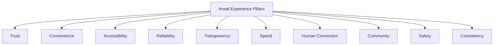

| Pillar | What It Means in Practice |
|---|---|
| **Trust** | Every interaction is verifiable, every promise kept, every mistake owned and fixed transparently. |
| **Convenience** | The path to a goal is the shortest one that does not compromise any other pillar. |
| **Accessibility** | Every citizen, regardless of literacy, language, device, or ability, can complete a core task independently or with dignified assistance. |
| **Reliability** | The platform behaves the same way every time, and degrades gracefully rather than catastrophically. |
| **Transparency** | A citizen always knows what is happening, what data is used, and why a decision was made. |
| **Speed** | Fast, but never at the expense of clarity or correctness. |
| **Human Connection** | A real person is always reachable when automation and self-service are not enough. |
| **Community** | Collective and local structures (SHGs, cooperatives, NGOs) are served as first-class participants, not individual-account afterthoughts. |
| **Safety** | Citizen data, money, and reputation are protected as a prerequisite, never a feature. |
| **Consistency** | The same category of interaction feels and behaves the same way everywhere it appears. |

---

# Service Experience Strategy

Each service area below states its experience commitment; the full journey, capability, and rule detail is owned entirely by `ai-docs/54` through `ai-docs/58` and cited, never restated.

| Service Area | Experience Strategy |
|---|---|
| **Registration** | The lowest-friction possible first step — a phone number and an OTP, never a demand for information not yet needed, per JRN-001. |
| **Verification** | Confidence-inspiring, never intimidating — a citizen understands exactly what document is needed and why, and a rejection always states a fixable reason, per RULE-002. |
| **Government Applications** | Calm and trackable — a citizen always knows where their application stands without needing to ask, per JRN-004 and RULE-006. |
| **Healthcare** | Reassuring and unambiguous booking confirmation, with providers whose verification badge is genuinely earned, per RULE-014. |
| **Education** | Encouraging discovery with genuine, unmanipulated ratings, safe for minor-involving flows, per RULE-016. |
| **Marketplace** | Effortless browsing and a trustworthy order lifecycle with real-time, honest status, per RULE-012 and RULE-013. |
| **Food** | Fast, accurate, and transparently tracked — a citizen should never wonder if their meal is actually coming. |
| **Agriculture** | Voice-first, plainspoken, and demonstrably fair market intelligence, per CAP-012's Business Rules. |
| **Payments** | Absolute certainty — a payment either visibly succeeds or visibly, clearly fails, never an ambiguous limbo, per RULE-018's Payment Idempotency Enforcement. |
| **Property** | Verified, fraud-resistant listings with a safe communication channel, per RULE-024 (Property Listing Verification-adjacent rules). |
| **Jobs** | Fast, fraud-screened discovery with minimal upfront data exposure, per RULE-017. |
| **Community** | Group-first patterns that respect collective structures, never forcing individual-account assumptions, per RULE-021. |
| **Support** | Immediate acknowledgment, full context carried over from the citizen's history, and a visible resolution path, per PROC-017. |
| **Notifications** | Preference-honored, never noisy, and always distinguishing "you must know this" from "you might like this," per RULE-023. |

---

# Trust Strategy

Trust is engineered deliberately across eight concrete mechanisms — never assumed as a byproduct of good UX, per `ai-docs/50-product-vision-business-strategy.md`'s Product Philosophy.

| Mechanism | How It Builds Trust |
|---|---|
| **Visible Confirmations** | Every consequential action (a payment, a submission, a booking) produces an immediate, unambiguous confirmation — never a silent success. |
| **Clear Progress** | Every multi-step process shows the citizen exactly where they are and what remains, per the Journey State Model in `ai-docs/56`. |
| **Transparent Decisions** | Every approval or rejection states its basis in plain language, per RULE-032's Accessibility Non-Negotiable Floor. |
| **Privacy** | Data is collected only for a stated, consented purpose, per RULE-003's Consent Requirement Before Data Use. |
| **Consent** | Granular, revocable, immediately effective — never a blanket, one-time grant, per GLOSS-019. |
| **Reliable Outcomes** | The same request produces the same category of outcome every time — no arbitrary variance between two citizens in the same situation. |
| **Predictable Behavior** | A citizen who has learned how one flow works can correctly predict how a sibling flow in another vertical behaves. |
| **Clear Communication** | Every notification, error, and rejection is written in plain, dignity-preserving language, never jargon or blame. |

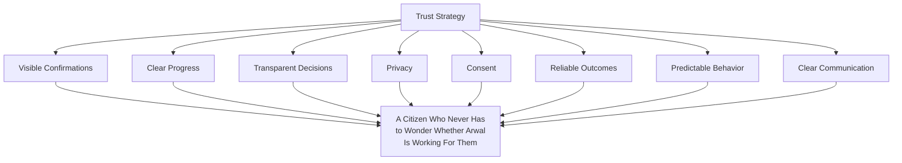

---

# Accessibility Strategy

Accessibility is Arwal's equity mandate, not a compliance checkbox, per `ai-docs/12-accessibility-standards.md` and `ai-docs/00-project-vision.md`'s Accessibility Vision. This section states the strategic commitment; the enforceable standard lives entirely in `ai-docs/12` and is never restated here.

| Dimension | Strategic Commitment |
|---|---|
| **Low Literacy** | Voice-first interaction and icon-plus-text (never icon-alone) design are first-class, not fallback, modes. |
| **Elderly Users** | Assisted/delegated access preserves independence and dignity rather than forcing unassisted self-service. |
| **Rural Users** | Offline-first core flows and voice-first design account for intermittent connectivity as the norm, not the exception. |
| **Persons with Disabilities** | Full screen-reader and assistive-technology parity, verified through direct usability testing, not assumed from a checklist. |
| **Multiple Languages** | Regional language and dialect support from first release, never a later localization pass. |
| **Low Bandwidth** | Every experience degrades gracefully — text-first alternatives to images and maps — rather than failing outright. |
| **Shared Devices** | Delegated access and household-aware design account for the reality that a device is often shared across a family. |
| **Digital Inclusion** | Every experience decision is measured for whether it widens or narrows the population that can succeed unassisted. |

---

# Customer Emotion Strategy

Every major interaction carries a deliberately designed target emotion — a strategy that never names the intended feeling cannot design toward it.

| Interaction | Target Emotion |
|---|---|
| **Registration** | Welcomed and unburdened — "this was easier than I expected." |
| **Verification** | Reassured, never suspected — "the platform is being careful, not accusatory." |
| **Shopping** | Confident and in control — "I know exactly what I'm getting and when." |
| **Booking** | Certain, not hopeful — "I know this slot is mine." |
| **Government Services** | Respected and unburdened — "I was treated like a person, not a case number." |
| **Payments** | Calm, not vigilant — "I trust this without double-checking my bank statement." |
| **Support** | Heard and hopeful — "someone is actually looking into this." |
| **AI Conversations** | Comfortable and unpatronized — "it understood me, and it was honest when it didn't." |

---

# Voice of Customer

### Feedback Collection Mechanisms

| Mechanism | Purpose | Cadence |
|---|---|---|
| **Surveys** | Structured, statistically comparable sentiment across segments. | Quarterly |
| **Ratings & Reviews** | Per-transaction, verified feedback feeding Reputation & Rating Management (CAP-045). | Continuous |
| **Support Insights** | Pattern analysis of recurring support-ticket categories. | Continuous, reviewed monthly |
| **Analytics** | Behavioral signals (drop-off, completion, error rate) per `ai-docs/56`'s Journey Analytics. | Continuous |
| **Complaints & Grievances** | Structured, tracked complaint resolution per RULE-009 and PROC-006. | Continuous |
| **Suggestions** | An open, low-friction channel for citizens and partners to propose improvements. | Continuous, triaged monthly |

### Continuous Improvement Loop

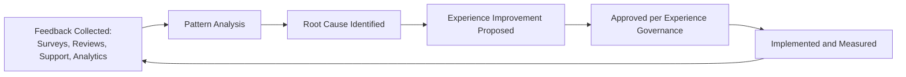

> **Callout — Feedback Without a Loop Is Just Noise**
> Every feedback channel above feeds this one loop — a survey result, a support pattern, or a suggestion that is collected but never closes the loop back into a shipped improvement is treated as a governance defect, surfaced at the Quarterly Experience Review.

---

# Customer Success Strategy

| Stage | Strategic Commitment |
|---|---|
| **Onboarding** | The fastest, least-demanding path to a citizen's first genuine success — never a tour of every feature before a citizen has completed one real task. |
| **Education** | Contextual, just-in-time guidance at the moment a capability becomes relevant, never a front-loaded tutorial. |
| **Feature Adoption** | New capability is surfaced based on a citizen's demonstrated need, per the AI Personalization Strategy already established in `ai-docs/52-user-personas-user-segmentation.md`. |
| **Retention** | Sustained value delivery across verticals, measured by Cross-Vertical Adoption Depth (per `ai-docs/50`). |
| **Loyalty** | Reputation, history, and convenience compounding to the point that switching cost is a genuine, felt inconvenience — never a manufactured lock-in. |
| **Community Advocacy** | Citizens who trust Arwal enough to bring a neighbor, a family member, or a fellow farmer onto the platform themselves. |
| **Long-Term Engagement** | A multi-year relationship measured in trust surveys and sustained usage, never a single-session conversion metric. |

---

# Experience Metrics

| Metric | Definition | Direction |
|---|---|---|
| **CSAT** | Post-interaction satisfaction score. | Increasing |
| **NPS** | Net Promoter Score — likelihood to recommend. | Increasing |
| **CES (Customer Effort Score)** | Perceived effort required to complete a task. | Decreasing |
| **Retention** | WAU/MAU ratio and multi-month cohort retention. | Increasing |
| **Task Success Rate** | % of attempted journeys reaching Completed status. | Increasing |
| **Completion Rate** | Per `ai-docs/56`'s Journey Analytics. | Increasing |
| **Support Volume** | Tickets per active citizen. | Decreasing (unless offset by feature growth) |
| **Complaint Rate** | Grievances/Disputes per completed transaction. | Decreasing |
| **Repeat Usage** | Frequency of return within a defined window. | Increasing |
| **Trust Score** | District Trust Signal (`ai-docs/50`). | Increasing |
| **Accessibility Score** | Accessibility Completion Parity (`ai-docs/56`). | Approaching parity |
| **Adoption Rate** | MAU as % of district population (`ai-docs/50`). | Increasing |

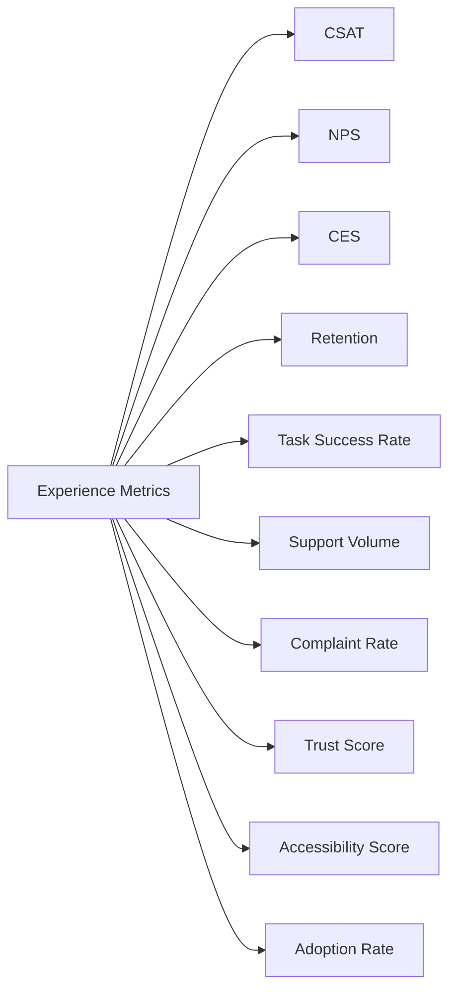

---

# Customer Experience Framework

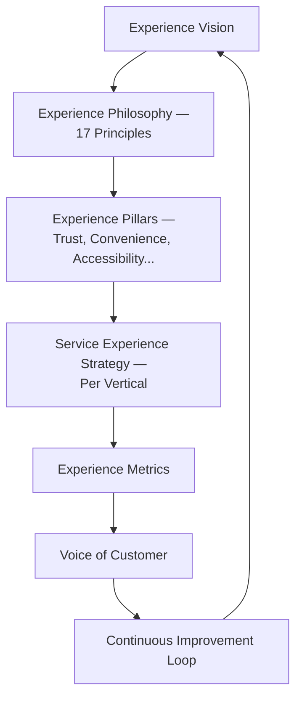

---

# Experience Lifecycle

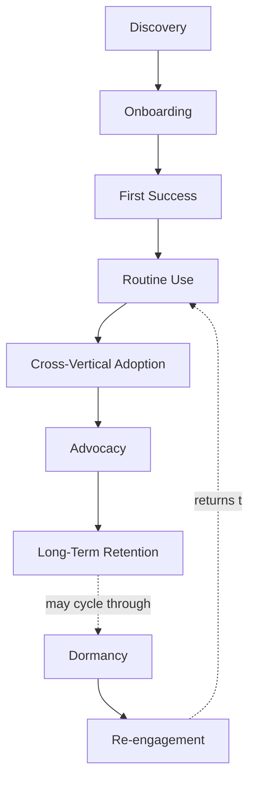

Every stage mirrors — and is measured jointly with — the Persona Lifecycle already established in `ai-docs/52-user-personas-user-segmentation.md`; this document adds the experience-quality bar each stage must clear, never a new lifecycle model.

---

# Customer Experience Maturity Model

| Level | Name | Characteristics |
|---|---|---|
| **1 — Initial** | Experience quality varies by team and vertical; no shared standard or metric. | High variance; anecdote-driven. |
| **2 — Developing** | Experience Principles are documented; some verticals measure CSAT/NPS but inconsistently. | Uneven adoption across teams. |
| **3 — Defined** | Every journey is measured against the Experience Metrics above; Voice of Customer loop is active. | This document's standard is fully met. |
| **4 — Managed** | Experience Health is tracked per vertical against explicit thresholds; deviations trigger a defined response. | Proactive, not reactive. |
| **5 — Optimized** | Experience Strategy actively informs product and business strategy; District Trust Signal is a board-level metric. | Experience is a genuine competitive moat, not a support function. |

Arwal's target state at the completion of Stage 2 is **Level 3 (Defined)**, with **Level 4 (Managed)** targeted as Stage 3 analytics tooling matures.

---

# Experience Governance

### Ownership

Customer Experience Strategy has one named accountable owner — the CXO (or CCO where the role is combined) — with every vertical's Experience Lead accountable for their own domain's execution against this strategy, mirroring the Clear Ownership discipline already established for Domains, Capabilities, Modules, Journeys, Processes, and Rules.

### Experience Review Board

A standing **Experience Review Board**, chaired by the CXO/CCO, with the CPO, Head of Accessibility & Inclusion, Head of Customer Success, and rotating vertical Experience Leads as members, holds approval authority over any platform-wide experience-standard change, any new Experience Principle, and any significant deviation from the Anti-Patterns below. The Board meets monthly, with ad hoc sessions for a Trust Score or Accessibility Score regression.

### Decision Authority Matrix

| Decision | Proposes | Approves | Informed |
|---|---|---|---|
| New Experience Principle | Any Experience Lead, CXO | Experience Review Board | All Product, Engineering |
| Vertical-specific experience exception | Vertical Experience Lead | CXO | Experience Review Board |
| Cross-vertical consistency change | UX Strategy Lead | Experience Review Board | All Product |
| Experience metric target change | CXO | CEO + CPO | Experience Review Board |
| Emergency experience regression response | Any Experience Lead | CXO (immediate), ratified by Board | CEO |

### Cross-Functional Responsibilities

| Function | Experience Responsibility |
|---|---|
| **Product** | Traces every roadmap decision to an Experience Principle and Pillar. |
| **Engineering** | Implements journeys, processes, and rules to the accessibility and reliability floor this strategy requires. |
| **Design** | Translates Experience Principles into consistent, accessible interaction patterns. |
| **Support** | Executes the Trust Strategy's Clear Communication and No Dead Ends commitments at the point of human contact. |
| **Compliance** | Verifies Privacy and Consent commitments are genuinely, not nominally, honored. |
| **AI Team** | Ensures every AI-assisted interaction honors AI Assists, Humans Decide without exception. |

### Review Cadence

| Review | Cadence | Owner |
|---|---|---|
| Quarterly Experience Review | Quarterly | CXO/CCO, Experience Review Board |
| Annual Experience Strategy Review | Annual | CEO, CXO, CPO |
| Accessibility Parity Review | Quarterly | Head of Accessibility & Inclusion |
| Voice of Customer Loop Review | Monthly | Head of Customer Success |

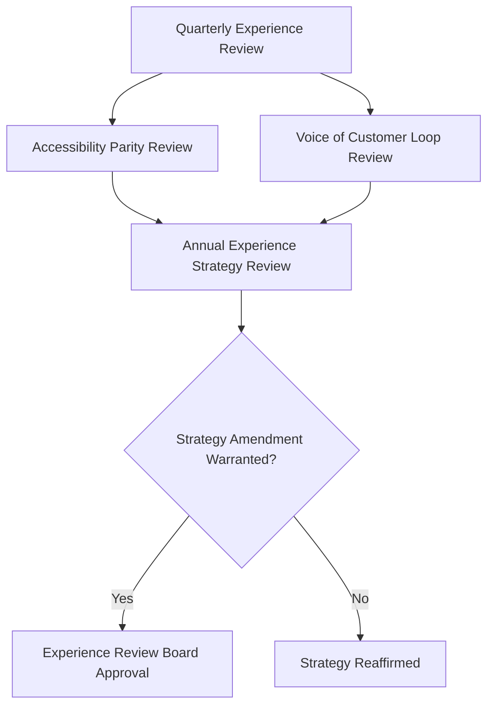

---

# Anti-Patterns

| Anti-Pattern | Description | Why It's Rejected |
|---|---|---|
| **Complex processes** | More steps or decisions than a citizen's goal genuinely requires. | Violates Simple Before Powerful and Minimal Cognitive Load. |
| **Hidden information** | A citizen cannot see why a decision was made or what data was used. | Violates Transparency. |
| **Dark patterns** | A design nudges a citizen toward Arwal's commercial interest over their own stated goal. | Directly violates Citizen First and Trust over Growth-at-all-costs. |
| **Inconsistent behavior** | The same category of interaction behaves differently across verticals. | Violates Consistency Everywhere. |
| **Poor communication** | A citizen learns of a policy or fee change only after it takes effect. | Violates Transparency and `ai-docs/34`'s Communication discipline. |
| **Unclear errors** | An error message states that something failed without stating what or how to fix it. | Violates No Dead Ends and Clear Communication. |
| **Broken trust** | A promise (a delivery time, a refund timeline) is not honored without proactive communication. | Directly threatens the Trust pillar the entire flywheel depends on. |
| **Ignoring accessibility** | An experience is designed for a digitally fluent urban citizen and "made accessible" afterward. | Violates Inclusive By Default. |
| **Feature-first thinking** | A capability is added because it is possible, not because a citizen's Experience Goal requires it. | Violates Citizen First and the identical Feature Bloat anti-pattern already rejected in `ai-docs/50`. |

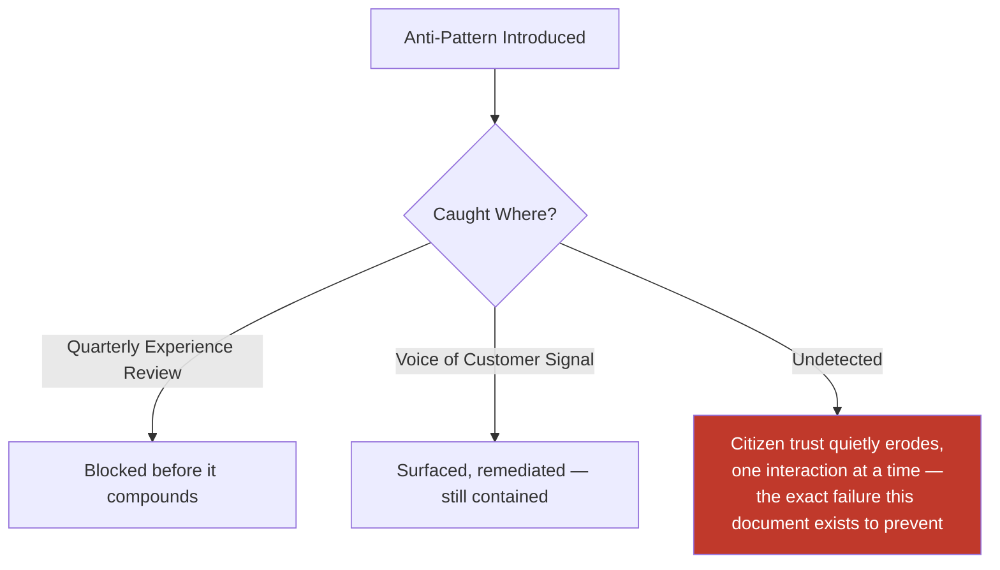

---

# Relationship with Previous Standards

### Project Vision & Product Goals
`ai-docs/00-project-vision.md` and `ai-docs/01-product-goals.md` establish the founding mission, Inclusion over Optimization, and the No Dead Ends principle — every Experience Principle in this document is a direct operationalization of a commitment already made there.

### Stakeholder Analysis & User Personas
`ai-docs/51-stakeholder-analysis.md` and `ai-docs/52-user-personas-user-segmentation.md` establish who Arwal serves and their specific needs — every Customer Segment in this document traces directly to those registries, never inventing a new stakeholder independently.

### Business Domain Model, Product Module Catalog, Business Capability Map
`ai-docs/53`, `ai-docs/54`, and `ai-docs/55` establish who owns each concern, what a citizen opens, and what Arwal can do — this document supplies the felt-experience bar every one of those layers must clear, never redefining their own territory.

### User Journey Standards
`ai-docs/56-user-journey-standards.md` establishes the journey-level experience discipline — Failure Scenarios, Recovery Paths, Emotional Experience. This document is the platform-wide strategy that discipline is measured and governed against, never a restatement of any individual journey.

### Business Process Standards & Business Rules and Policies
`ai-docs/57` and `ai-docs/58` establish how the organization executes and decides — every Trust Strategy mechanism in this document (Transparent Decisions, Reliable Outcomes) is a felt expression of the precise rules and processes those documents already govern.

### Business Glossary
`ai-docs/59-business-glossary.md` supplies the precise, singular vocabulary (Citizen, Trust, Reputation, Appeal) this document's every claim is expressed in, never redefining a term independently.

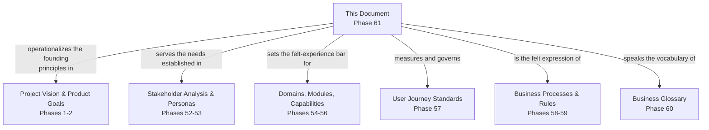

---

# Executive Dashboards

### CEO Dashboard
- District Trust Signal trend
- Cross-Vertical Adoption Depth
- Experience Maturity Level

### CXO/CCO Dashboard
- Full Experience Metrics suite (CSAT, NPS, CES, Trust Score, Accessibility Score)
- Voice of Customer loop-closure rate
- Anti-pattern findings this quarter

### CPO Dashboard
- Journey Completion Rate by vertical, cross-referenced with `ai-docs/56`
- Feature-to-Experience-Goal traceability gaps

### Government Partners Dashboard
- Government Service experience metrics (completion time, satisfaction, complaint rate)

### Support Operations Dashboard
- Support volume, complaint rate, resolution time
- Escalation trend by vertical

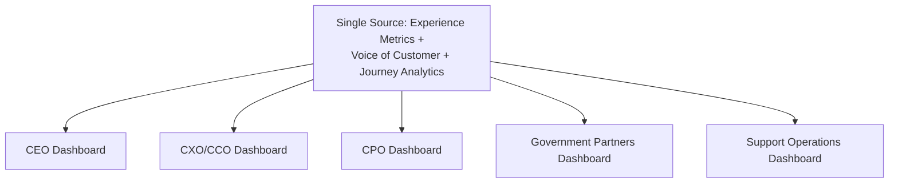

---

# Closing Statement

> **Callout — Closing Statement**
> A capability tells everyone what Arwal can do. A journey tells a citizen what one interaction feels like. A process and a rule tell the organization how to execute and decide reliably. Customer Experience Strategy is what makes all of that add up, cumulatively, across a citizen's entire relationship with Arwal, into the one thing that actually determines whether a district trusts this platform for a generation: did it feel, every single time, like Arwal was on their side? Trust compounds one interaction at a time, and it erodes the same way — this document exists so that every future service design, support model, and AI interaction is measured against the same, explicit, non-negotiable experience bar, never left to the instincts of whichever team happened to build it. Where a future phase must deviate from a principle stated here, that deviation is made explicitly — through the Experience Governance process above — never silently, and never by default.

This document, `ai-docs/60-customer-experience-strategy.md`, is Phase 61 of approximately 415. Every future service design, support model, and experience-quality decision is expected to trace back to a principle defined here, or to justify its deviation in writing.

**End of Phase 61 — `ai-docs/60-customer-experience-strategy.md`**