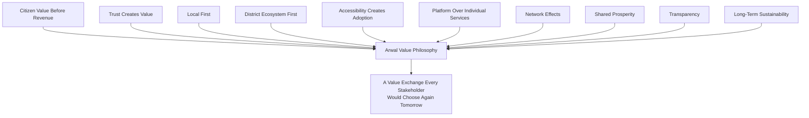
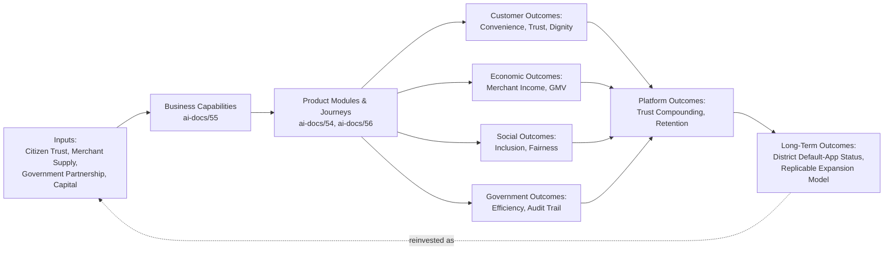
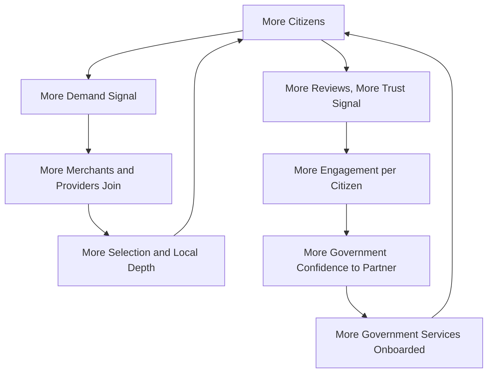
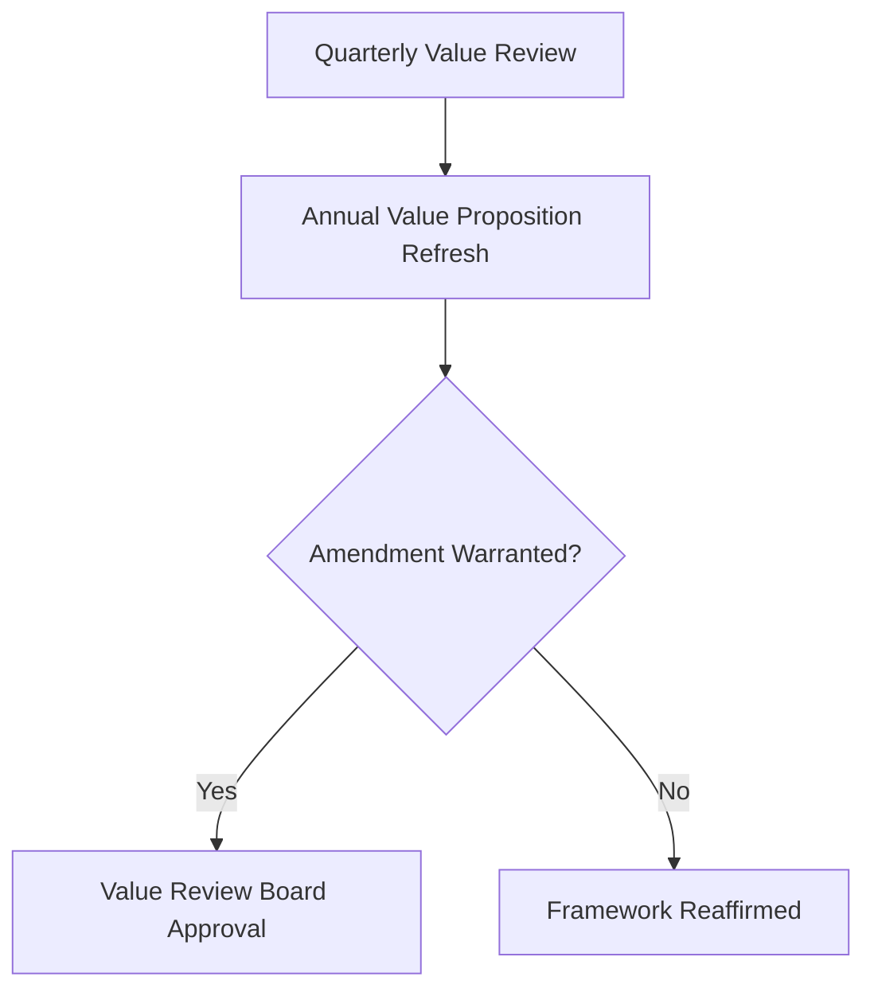
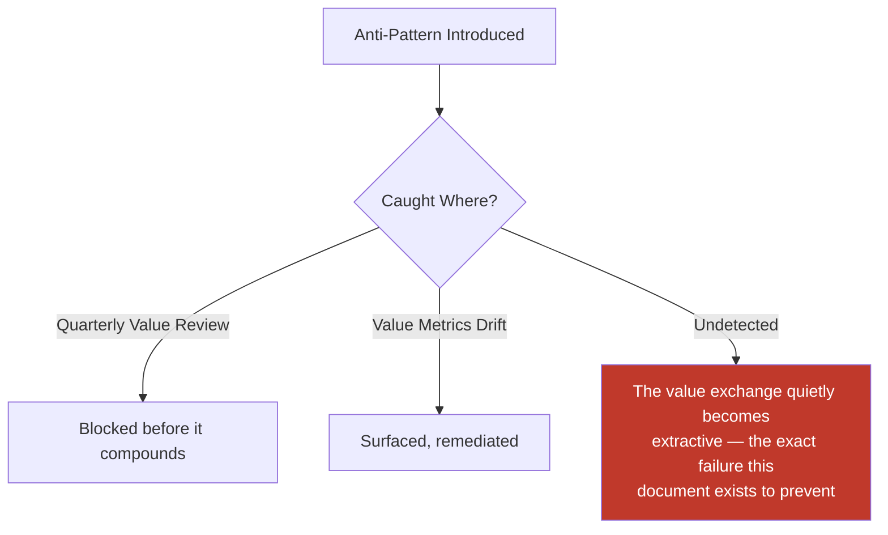
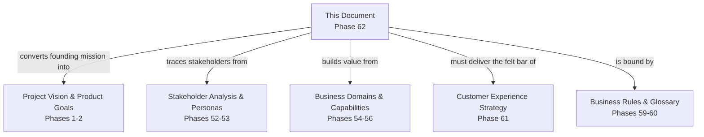
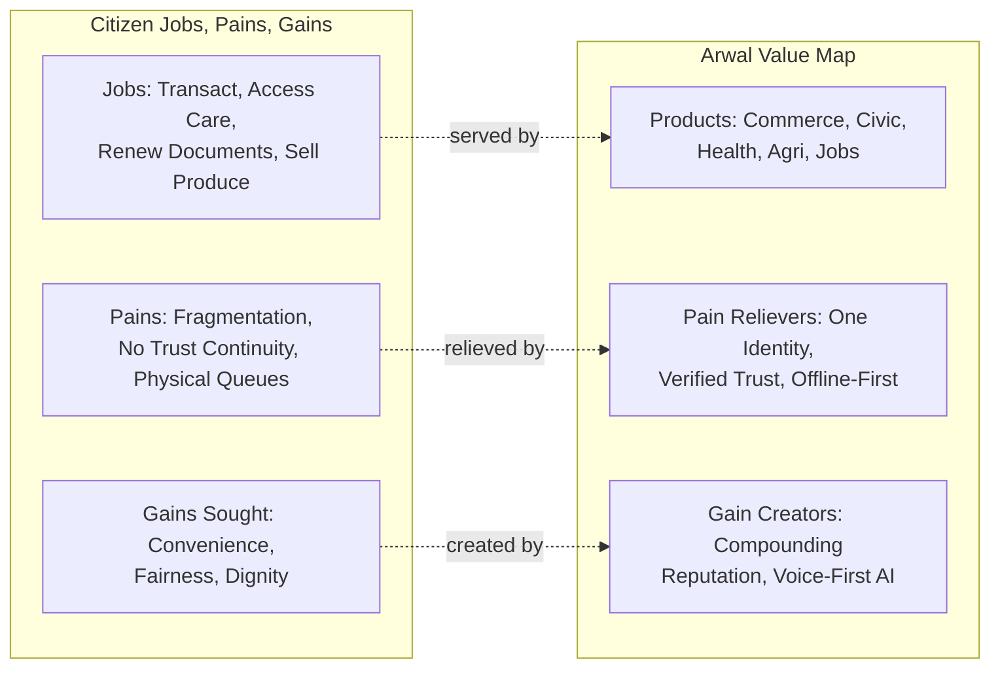
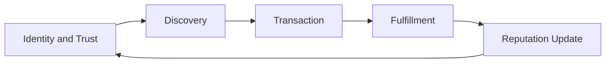
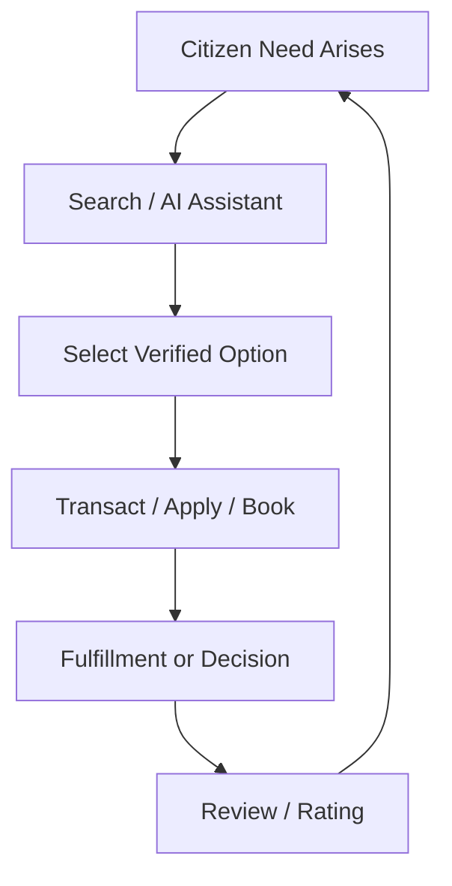
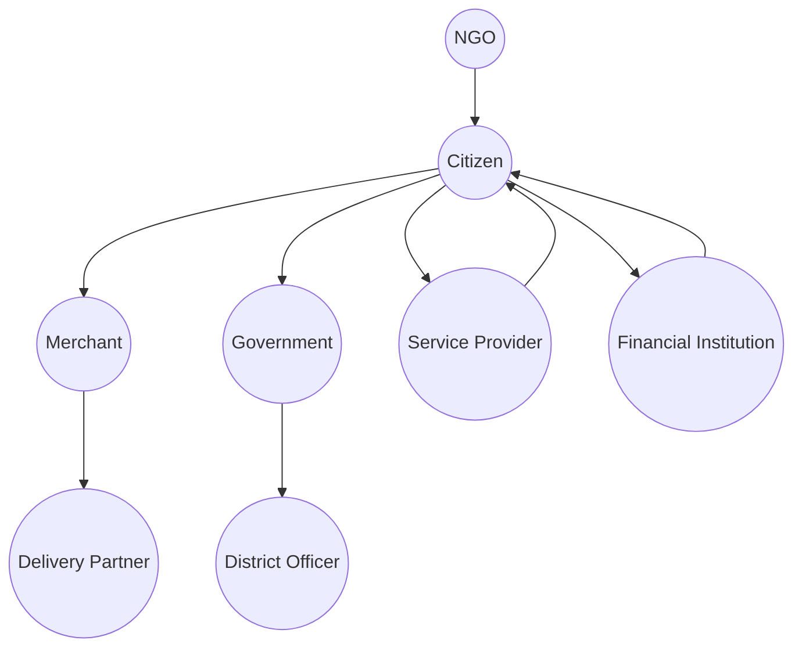

# Value Proposition Framework

**Document:** `ai-docs/61-value-proposition-framework.md`
**Project:** Arwal — The District Super App
**Stage:** 2 — Product & Business Strategy
**Phase:** 62 — Value Proposition Framework
**Status:** Approved for Product & Engineering Reference
**Audience:** CEO, CPO, CSO, CMO, CCO, Business Architects, Government Digital Transformation Partners, Investors, Product Managers, Engineering Directors

> **Callout — Purpose of This Document**
> `ai-docs/00-project-vision.md` through `ai-docs/60-customer-experience-strategy.md` established why Arwal exists, what it can do, who it serves, what it feels like to use, how the organization runs, the rules it decides by, the vocabulary it speaks, and the experience it commits to delivering. None of those documents answers the question every investor conversation, every government partnership pitch, and every merchant onboarding call ultimately reduces to: **why should anyone — a citizen, a farmer, a government department, a merchant — choose to depend on Arwal, and why will that choice keep paying off for them over years, not just this transaction?** This document is that answer — the authoritative Value Proposition Framework every future go-to-market, partnership, and investment narrative traces back to.

---

# Purpose of this Document

### Why Value Proposition Is a Strategic Capability, Not a Slogan

A value proposition is frequently treated as marketing collateral — a sentence on a landing page. At Arwal's scale and civic mandate, that treatment is a category error. A value proposition is the explicit, testable claim that a specific stakeholder is genuinely better off engaging with Arwal than with any available alternative — including doing nothing. Every product decision, every pricing decision, every government negotiation, and every merchant fee structure is, whether acknowledged or not, an implicit claim about value. This document makes those claims explicit, so they can be defended, measured, and improved rather than assumed.

### Why This Document Exists Now

`ai-docs/55-business-capability-map.md` established what Arwal can do. `ai-docs/60-customer-experience-strategy.md` established what it must feel like. Neither answers the commercial and civic question of *why the exchange is worth it* for each party — what a citizen gives up (attention, data, trust) against what they receive (convenience, dignity, opportunity), and why that exchange remains favorable as Arwal scales. This document is the layer that makes that exchange explicit, per stakeholder, and ties it to the sustainable economics that let Arwal keep making the promise for a generation, per `ai-docs/00-project-vision.md`'s founding horizon.

### Scope Boundary

This document does not define UI, technical architecture, or implementation — it is deliberately technology-independent, mirroring the same discipline already established in `ai-docs/53` through `ai-docs/60`. It does not redefine Domains, Capabilities, Modules, Journeys, Processes, Rules, or the Glossary — each is cited, never restated. This document's exclusive territory is: **value identity, value creation, value delivery, value capture, and the sustainable economics that bind them together.**

---

# Value Proposition Philosophy

### Citizen Value Before Revenue
**Why it exists:** A revenue decision that reduces citizen value is rejected by default, regardless of short-term commercial appeal — mirroring the Citizen-First tie-breaker already established throughout `ai-docs/51` through `ai-docs/60`. Revenue is a consequence of value delivered, never a substitute for it.

### Trust Creates Value
**Why it exists:** Every capability Arwal builds is worth less than zero if citizens do not trust it enough to use it. Trust is not a marketing attribute layered on top of value — it is the precondition value is built from, per `ai-docs/50-product-vision-business-strategy.md`'s Trust principle.

### Local First
**Why it exists:** Value that is generic — the same experience a national platform already offers — is not differentiated value. Arwal's value is rooted in hyperlocal relevance: this district's prices, this district's dialect, this district's government departments.

### District Ecosystem First
**Why it exists:** Arwal's value is not the sum of its individual services — it is the compounding effect of a citizen, a merchant, and a government department all trusting the same identity and rail. Optimizing one vertical at the ecosystem's expense destroys more value than it creates.

### Accessibility Creates Adoption
**Why it exists:** Value that only a digitally fluent, urban, literate citizen can access is not district-scale value — it is a fraction of the addressable value Arwal's mission commits to, per `ai-docs/00-project-vision.md`'s Inclusion over Optimization pillar.

### Platform Over Individual Services
**Why it exists:** A single excellent service is replicable by a single-purpose competitor within a year. A platform where identity, reputation, and trust compound across every service is not — this is Arwal's durable moat, per `ai-docs/50`'s Market Positioning.

### Network Effects
**Why it exists:** Value that grows linearly with each new participant is a good business. Value that grows *faster* than linearly — where each new citizen makes the platform more valuable to every merchant, and each new merchant makes it more valuable to every citizen — is a durable one. Arwal is deliberately designed for the latter.

### Shared Prosperity
**Why it exists:** A platform that extracts value from its ecosystem faster than it creates value for that ecosystem will eventually be abandoned by it. Arwal's fee structures, per `ai-docs/58-business-rules-policies.md`'s Policy Framework, are held to a standard of demonstrable fairness relative to the informal channels they replace.

### Transparency
**Why it exists:** A value proposition that requires concealment to remain attractive is not a value proposition — it is a trap. Every fee, every ranking factor, and every data use is disclosed, per RULE-032's Accessibility Non-Negotiable Floor extended here to commercial transparency.

### Long-Term Sustainability
**Why it exists:** A value exchange optimized for this quarter's growth number at the expense of next year's trust is a value exchange in the process of destroying itself. Every value-capture mechanism in this document is evaluated against a multi-year horizon, never a single funding cycle.

> **Callout — The One-Sentence Value Philosophy**
> *"If Arwal cannot explain, in one honest sentence, what a stakeholder gives and what they get back, it has not yet earned the right to ask for their trust."*

---

# Core Value Proposition

> **Callout — Arwal's Primary Promise**
> *"Arwal gives a district one trusted place to be served — where a citizen's identity, reputation, and history compound across commerce, health, education, agriculture, and government, instead of resetting with every app they are forced to open."*

### Why Arwal Exists
A district's digital life is fragmented across fifteen to twenty-five disconnected apps, informal networks, and physical queues, per `ai-docs/00-project-vision.md`'s founding Problem Statement. That fragmentation is not merely an inconvenience — it is a structural tax on a citizen's time, a farmer's income, and a government's efficiency, paid daily, by everyone, indefinitely, unless something unifies it.

### What Unique Value Arwal Creates
No existing category — national e-commerce, single-purpose service apps, government portals — has the incentive or mandate to unify commerce and civic life under one identity. Arwal's unique value is structural: it is the only platform where a citizen's trust, once earned in one vertical, is worth more everywhere else, compounding rather than resetting.

### Why a Citizen Should Depend on Arwal
Because every additional thing they do on Arwal makes every other thing easier — one login, one reputation, one dispute-resolution system, one support line — while a fragmented alternative asks them to rebuild that trust from zero, repeatedly, forever.

### Why a Government Should Adopt Arwal
Because Arwal reduces citizen-facing backlog and physical-queue burden without requiring the department to build or maintain its own digital channel, while preserving full departmental control over workflow configuration and data-sharing terms, per `ai-docs/58`'s Government Terms.

### Why Businesses Should Participate
Because Arwal is the lowest-friction, most affordable path to a genuine digital storefront and a portable reputation that compounds — without the fixed cost, technical skill, or national-platform irrelevance that keeps a local merchant locked out of digital reach today.

---

# Stakeholder Value Propositions

Each entry traces to its full Persona (`ai-docs/52`) and Stakeholder (`ai-docs/51`) record; this table states only the distilled value exchange.

| Stakeholder | Gives | Receives | Why It's Worth It |
|---|---|---|---|
| **Citizens** | Attention, transaction volume, consented data | One identity, one wallet, dignity-preserving access to commerce, care, and governance | No longer juggling 15–25 apps; reputation compounds instead of resetting |
| **Families** | Household-level trust, delegated authority | Assisted access for elderly/low-literacy members without surrendering control | A family can safely include every member, regardless of digital fluency |
| **Farmers** | Produce-market participation, field data | Fair, real-time price intelligence, weather alerts, scheme access | Reduced dependency on underquoting middlemen; income protection |
| **Students** | Attention, academic context | Discovery of genuinely local, rated tutors and scholarships | Escapes generic national content irrelevant to district-level opportunity |
| **Patients** | Health-adjacent data (consented) | Trustworthy, verified provider discovery and appointment certainty | Reduced no-shows, reduced time-to-appointment, dignity in a high-stakes moment |
| **Parents** | Oversight responsibility | Safe, transparent, delegated visibility into minor-involving flows | Confidence their child's digital footprint is genuinely protected |
| **Merchants** | Catalog depth, commission | Affordable storefront, customer reach, portable reputation | Digital presence without technical skill or upfront capital risk |
| **Local Businesses** | Field-level trust, onboarding effort | Zero/low-cost digital reach, same-locality fulfillment potential | Structurally impossible for a national platform to replicate at this depth |
| **Service Providers** | Verification effort, commission | Verified, ratable, portable reputation and secure scheduled payment | Reputation compounds across years instead of resetting per referral |
| **Doctors** | Schedule visibility, commission | Reduced no-shows, discoverability, secure payment collection | Administrative burden reduced without losing patient relationship control |
| **Teachers** | Verification, commission | Reach beyond word-of-mouth, a compounding reputation | Income growth tied to demonstrated quality, not just referral luck |
| **Schools** | Contextual data | Improved connection to district-level tutoring/scholarship ecosystem | Amplified reach for students without new institutional overhead |
| **Hospitals** | Institutional data-governance engagement | District-wide referral visibility, reduced administrative overhead | A digital front door without building one internally |
| **Employers** | Listing verification effort | Fast, fraud-screened access to genuinely local candidates | Lower hiring cost and time than national platforms poorly suited to informal-sector hiring |
| **Employees / Job Seekers** | Minimal application data | Genuine, exploitation-screened local job/gig access | Escapes informal, referral-only, exploitation-prone job markets |
| **Delivery Partners** | Fulfillment capacity | Transparent, verifiable earnings and efficient routing | Predictable income replacing opaque informal arrangements |
| **Property Owners** | Ownership evidence, commission | Verified, fraud-screened inquiries and a safe communication channel | Reduced time wasted on non-genuine inquiries |
| **Government Departments** | Workflow configuration effort | Digitized intake, reduced backlog, immutable audit trails | Measurable efficiency gain without owning a digital channel |
| **District Administration** | Institutional partnership, oversight | A durable, transparent, accountable civic channel | Reduced administrative burden district-wide, insulated from any single political cycle |
| **NGOs** | Field trust, inclusion insight | Amplified reach for their beneficiaries | Their mission scales through Arwal's distribution without building their own tech |
| **Financial Institutions** | Settlement infrastructure, compliance engagement | District-level transaction volume and distribution reach | Access to an underserved, growing transacting population |
| **Technology Partners** | Infrastructure capability | A sustained, growing commercial relationship | Long-term contract value in a scaling civic-commercial platform |
| **Future Platform Partners** | Trusted-integration engagement | Access to Arwal's identity, payment, and trust rails | Entry into a proven-trust ecosystem without building trust from zero |

---

# Ecosystem Value

| Ecosystem | Value Generated |
|---|---|
| **Commerce** | Affordable digital reach for local merchants; reliable, trusted local shopping for citizens. |
| **Agriculture** | Fair-price transparency, weather resilience, and direct-to-buyer market access for farmers. |
| **Healthcare** | Reduced time-to-appointment and a verified, trustworthy provider directory for an underserved district. |
| **Education** | Local, rated, relevant tutor and scholarship discovery replacing generic national content. |
| **Employment** | Genuine, fraud-screened local job/gig access replacing exploitative informal recruitment. |
| **Government Services** | Reduced physical-queue burden and measurable service-completion-time reduction. |
| **Property** | Fraud-resistant, verified listing discovery replacing an informal, broker-fee-exploitative channel. |
| **Community** | Group-account patterns that extend economic access to citizens who participate collectively. |
| **Payments** | A single, trusted money-movement layer removing repeated re-verification and payment friction. |
| **AI Services** | Voice-first, dialect-aware assistance extending genuine reach to low-literacy citizens. |
| **Local Economy** | Compounding local reputation and income growth for merchants, providers, and workers. |
| **District Development** | A replicable, trust-proven digital infrastructure model other districts can adopt without a rebuild. |

---

# Value Creation Model

| Stage | Description |
|---|---|
| **Inputs** | Citizen trust, merchant/provider supply, government partnership, and invested capital. |
| **Capabilities** | The stable business abilities defined in `ai-docs/55`, applied to those inputs. |
| **Services** | The citizen-visible Modules and Journeys (`ai-docs/54`, `ai-docs/56`) those capabilities are expressed through. |
| **Customer Outcomes** | Convenience, dignity, and time saved, measured per `ai-docs/60`'s Experience Metrics. |
| **Economic Outcomes** | Merchant/provider income growth, GMV with healthy contribution margin. |
| **Social Outcomes** | Inclusion parity, fairness relative to informal-channel alternatives. |
| **Government Outcomes** | Service-completion-time reduction, auditable civic delivery. |
| **Platform Outcomes** | Compounding trust and cross-vertical retention. |
| **Long-Term Outcomes** | District default-app status and a replicable model for the next district. |

---

# Value Delivery Model

| Channel | How Value Reaches Stakeholders |
|---|---|
| **Digital Services** | The core app (PWA/Android/iOS) delivering every Module and Journey. |
| **Physical Partners** | Field agents assisting onboarding and low-literacy citizens in person. |
| **Government Offices** | Officer-facing dashboards embedding Arwal directly into existing civic workflows. |
| **Community Networks** | SHGs, NGOs, and cooperatives extending reach into collectively-organized populations. |
| **AI Assistance** | Voice-first, dialect-aware guidance for citizens who cannot navigate a text-heavy interface. |
| **Support** | Human-reachable assistance whenever self-service is insufficient, per `ai-docs/60`'s Human Assistance principle. |
| **Notifications** | Preference-honored, plain-language updates keeping every stakeholder informed without fatigue. |
| **Offline Access** | Locally cached core flows ensuring value delivery survives intermittent connectivity. |

---

# Value Capture Model

Arwal captures value sustainably, without compromising citizen trust, through:

| Mechanism | Description | Trust Safeguard |
|---|---|---|
| **Platform Growth** | Sustained MAU growth increasing ecosystem density. | Growth is never counted as success alongside a rising dispute or falling trust metric, per `ai-docs/50`'s Metric Discipline. |
| **Transaction Enablement** | Commission on completed, verified commerce/service transactions. | Fee structures are published and demonstrably fairer than informal-channel alternatives, per `ai-docs/01`'s Commercial Discipline. |
| **Government Partnerships** | Service-facilitation fees for digitized civic workflows. | Never gates a citizen's access to a civic right behind a fee. |
| **Merchant Ecosystem** | Value-added tools (analytics, promoted visibility) offered transparently. | Promoted placement is always disclosed, never disguised as organic ranking, per `ai-docs/51`'s Conflict-of-Interest Governance. |
| **Premium Services** | Optional, clearly-disclosed enhanced capability. | Never a paywall on a core civic or safety-relevant function. |
| **Operational Efficiency** | Cost reduction from a single, unified platform versus fragmented alternatives. | Efficiency gains are reinvested in reliability and accessibility, not extracted alone. |
| **Data Insights (Privacy-Preserving)** | Aggregated, anonymized market and civic-impact insight for partners and government. | Never individual-level data monetization; governed by RULE-003's Consent Requirement. |
| **Economic Development** | Long-term district-level economic growth attributable to the platform. | Measured and reported transparently as a shared outcome, not a private commercial claim alone. |

---

# Network Effects

Every additional citizen increases the value of the platform to every merchant (more demand); every additional merchant increases the value of the platform to every citizen (more selection). Every completed, disputed-and-fairly-resolved transaction increases the platform's trust signal, which in turn increases both citizen retention and government confidence to expand civic-service coverage — a reinforcing loop that a single-vertical competitor structurally cannot replicate, per `ai-docs/50-product-vision-business-strategy.md`'s Market Positioning.

---

# Competitive Differentiation

| Category | What They Do Well | What They Structurally Cannot Deliver |
|---|---|---|
| **Standalone government portals** | Official legal authority | No commercial integration; a citizen's civic and commercial life remain disconnected |
| **Single-purpose delivery apps** | Deep, focused logistics execution | No cross-vertical trust compounding; district-tier density is often thin |
| **Marketplace apps (national)** | Broad catalog, logistics scale | District/rural users are a low roadmap priority; no civic integration |
| **Healthcare apps (standalone)** | Focused provider discovery | No civic, commerce, or payments integration; reputation resets per platform |
| **Education apps (standalone)** | Generic national content | Irrelevant to hyperlocal opportunity and dialect |
| **Job portals (national)** | Broad formal-sector reach | Poorly suited to informal-sector, hyperlocal hiring reality |

Arwal's differentiated, durable value is that it is the only platform where trust, once earned by a citizen in any one of these categories, compounds and transfers to every other — a structural advantage no single-purpose competitor can replicate without becoming Arwal itself.

---

# Value Metrics

| Metric | Definition | Direction |
|---|---|---|
| **Citizen Value Index** | Composite of CSAT, CES, and Trust Score per `ai-docs/60`. | Increasing |
| **Partner Satisfaction** | Merchant/provider CSAT and retention rate. | Increasing |
| **Government Adoption** | Count of departments/services digitally integrated. | Increasing |
| **Cross-Vertical Usage** | Cross-Vertical Adoption Depth per `ai-docs/50`. | Increasing |
| **Retention** | WAU/MAU stickiness ratio. | Increasing |
| **Platform Trust** | District Trust Signal. | Increasing |
| **Economic Impact** | Merchant/provider-reported income improvement. | Increasing |
| **Local Business Growth** | Verified merchant/provider count and revenue retention. | Increasing |
| **District Digital Adoption** | MAU as % of district population. | Increasing toward district-majority |
| **Accessibility Impact** | Accessibility Completion Parity per `ai-docs/56`. | Approaching parity |

> **Callout — No Value Metric Stands Alone**
> Per the North Star Principle already established in `ai-docs/00-project-vision.md`, a rising value metric alongside a falling Trust Score or rising dispute rate is treated as a regression, never counted as success in isolation.

---

# Risks to Value

| Risk | Description | Mitigation |
|---|---|---|
| **Trust erosion** | A mishandled dispute or data incident damages cross-vertical trust simultaneously. | Transparent dispute resolution; consistent policy enforcement per `ai-docs/58`. |
| **Poor service quality** | An unreliable experience undermines the "dependable" value claim. | Reliability held as a trust signal per `ai-docs/60`'s Experience Philosophy. |
| **Fragmented ecosystem** | Verticals compete rather than compound value for each other. | Cross-Domain Governance and Shared Concepts discipline per `ai-docs/53`. |
| **Low adoption** | Citizens remain loyal to familiar informal channels. | Radical onboarding simplicity treated as a Must-Have per `ai-docs/01`. |
| **Partner disengagement** | Merchants/providers leave for a perceived unfair fee structure. | Fee transparency and fairness benchmarking per the Value Capture Model above. |
| **Accessibility failures** | A design decision quietly excludes a vulnerable segment. | Mandatory Accessibility Parity review per `ai-docs/56`'s Quality Gates. |
| **Platform complexity** | Feature accumulation erodes the "simple" value promise. | Simplicity as a Design Discipline per `ai-docs/00`'s Product Culture. |
| **Poor governance** | Value decisions made without traceability degrade consistency. | Value Governance discipline below. |

---

# Value Governance

### Ownership
Value Proposition Framework ownership sits with the CSO/CPO jointly, with every Stakeholder Value Proposition entry accountable to its named vertical Head, mirroring the Clear Ownership discipline established throughout `ai-docs/53` through `ai-docs/60`.

### Value Review Board
A standing **Value Review Board** — chaired by the CEO, with CPO, CSO, CMO, CCO, and rotating vertical Heads as members — holds approval authority over any material change to a Stakeholder Value Proposition, a value-capture mechanism, or a fee structure. The Board meets quarterly, with ad hoc sessions for a Value Metric regression.

### Decision Authority

| Decision | Approves |
|---|---|
| New Stakeholder Value Proposition | Value Review Board |
| Fee structure change | CEO/CFO + Value Review Board |
| Value metric target change | CEO + CPO |
| Emergency value-erosion response | CSO (immediate), ratified by Board |

### Review Cadence

| Review | Cadence | Owner |
|---|---|---|
| Quarterly Value Review | Quarterly | Value Review Board |
| Annual Value Proposition Refresh | Annual | CEO, CSO, CPO |
| Continuous Optimization | Ongoing | CSO, informed by Voice of Customer per `ai-docs/60` |

---

# Anti-Patterns

| Anti-Pattern | Why It's Rejected |
|---|---|
| **Revenue before citizens** | Violates Citizen Value Before Revenue; erodes the trust the entire model depends on. |
| **Growth without trust** | A rising adoption number alongside falling trust is a regression, never a win, per the North Star Principle. |
| **Feature overload** | Dilutes the Simple Before Powerful value promise. |
| **Vendor lock-in** | Contradicts the Project Vision's explicit rejection of proprietary lock-in mechanisms. |
| **Hidden costs** | Violates Transparency; a citizen or merchant surprised by a fee has been sold a false value proposition. |
| **Short-term optimization** | Trades long-term trust for a single funding cycle's metric — rejected per Long-Term Sustainability. |
| **Poor ecosystem balance** | Over-favoring one stakeholder (e.g., merchants over citizens) destroys the reinforcing network-effect loop. |
| **Ignoring rural users** | Directly contradicts Accessibility Creates Adoption and the founding Inclusion over Optimization pillar. |

---

# Relationship to Previous Documents

| Prior Document | Relationship |
|---|---|
| **Project Vision (`ai-docs/00`)** | Establishes the founding mission this document converts into an explicit, stakeholder-specific value exchange. |
| **Product Goals (`ai-docs/01`)** | Establishes measurable goals this document's Value Metrics extend and operationalize commercially. |
| **Stakeholder Analysis (`ai-docs/51`)** | Supplies the stakeholder registry every Stakeholder Value Proposition entry traces to. |
| **User Personas (`ai-docs/52`)** | Supplies the human detail behind each stakeholder's stated "gives/receives" exchange. |
| **Business Domain Model (`ai-docs/53`)** | Supplies the ownership structure behind every Ecosystem Value entry. |
| **Business Capability Map (`ai-docs/55`)** | Supplies the stable abilities this document's Value Creation Model builds value from. |
| **Customer Experience Strategy (`ai-docs/60`)** | Supplies the felt-experience bar this document's value claims must actually deliver. |
| **Business Rules & Policies (`ai-docs/58`)** | Supplies the precise fairness and consent rules this document's Value Capture Model is bound by. |
| **Business Glossary (`ai-docs/59`)** | Supplies the precise vocabulary (Citizen, Trust, Reputation) this document's every claim is expressed in. |

---

# Executive Artifacts

### Value Proposition Canvas

### Stakeholder Value Matrix

See Stakeholder Value Propositions table above — reproduced here by reference per Single Source of Truth, never duplicated.

### Value Chain

### Value Stream

### Value Network

### Network Effect Diagram

See Network Effects section above.

### Executive Dashboard

| Dashboard | Audience | Key Content |
|---|---|---|
| **CEO Dashboard** | CEO | District Trust Signal, Citizen Value Index, Economic Impact trend |
| **CSO Dashboard** | CSO | Network-effect growth loop health, competitive differentiation tracking |
| **CPO Dashboard** | CPO | Cross-Vertical Usage, Accessibility Impact |
| **CMO Dashboard** | CMO | Partner Satisfaction, District Digital Adoption |
| **Government Partners Dashboard** | Government Technical Partners | Government Adoption trend, civic value delivery evidence |

### Decision Matrix

| Decision Type | Approval Authority |
|---|---|
| New value proposition | Value Review Board |
| Fee/commission change | CEO/CFO + Value Review Board |
| Ecosystem rebalancing | CEO + CSO + CPO |
| Emergency trust-erosion response | CSO, ratified by Board within 5 business days |

---

# Closing Statement

> **Callout — Closing Statement**
> Every prior document in this handbook explains what Arwal is, how it is built, and how it feels to use. This document explains why any of that matters enough for a citizen, a farmer, a government department, or an investor to place their trust and their livelihood in it — and why that trust keeps paying off, for them and for Arwal, for years rather than a single transaction. Value that is extracted faster than it is created eventually collapses the trust it depends on; value that compounds — one verified transaction, one honest fee, one kept promise at a time — is what lets a district super app become, honestly, the district's own infrastructure. Where a future phase must deviate from a value proposition stated here, that deviation is made explicitly — through the Value Governance process above — never silently, and never by default.

This document, `ai-docs/61-value-proposition-framework.md`, is Phase 62 of approximately 415. Every future go-to-market decision, partnership negotiation, and investment narrative is expected to trace back to a value proposition defined here, or to justify its deviation in writing.

**End of Phase 62 — `ai-docs/61-value-proposition-framework.md`**