# Revenue & Sustainability Strategy

**Document:** `ai-docs/62-revenue-sustainability-strategy.md`
**Project:** Arwal — The District Super App
**Stage:** 2 — Product & Business Strategy
**Phase:** 63 — Revenue & Sustainability Strategy
**Status:** Approved for Product & Engineering Reference
**Audience:** CEO, CFO, CPO, CSO, CRO, Government Digital Transformation Partners, Enterprise Business Architects, Investors, Product Managers, Engineering Directors

> **Callout — Purpose of This Document**
> `ai-docs/00-project-vision.md` through `ai-docs/61-value-proposition-framework.md` established why Arwal exists, what it can do, who it serves, what it feels like to use, how the organization runs, the rules it decides by, the vocabulary it speaks, the experience it commits to, and why any stakeholder should trust it enough to depend on it. None of those documents answers the question every board meeting, every government partnership renewal, and every decade of continued operation ultimately depends on: **how does Arwal keep the lights on, keep investing in the platform, and keep every promise it has made — for citizens, merchants, providers, government partners, and its own people — for a generation, without ever trading away the trust that makes it worth using in the first place?** This document is that answer — the authoritative Revenue & Sustainability Strategy every future financial, partnership, and monetization decision traces back to.

---

# Purpose of this Document

### Why Sustainability Is a Strategy Document, Not a Finance Spreadsheet

A revenue plan reduced to a set of numbers is a forecast — useful for a single budget cycle and obsolete the moment reality diverges from it. A **Revenue & Sustainability Strategy** is a different artifact entirely: it is the durable, technology-independent, number-independent reasoning that explains *why* Arwal earns money at all, *what it refuses to do* to earn more of it, and *how* the resulting economics keep serving citizens, merchants, providers, and government partners across a multi-decade horizon rather than a single fiscal year. This document deliberately contains no prices, no projections, no valuation models — those belong to a financial-planning process that will be revisited every year of Arwal's existence. What must not be revisited every year — what must remain true at Phase 63 and at Phase 400 alike — is the *reasoning* by which Arwal decides what is monetizable, what is never monetizable, and how the two coexist.

### Why This Document Exists Now, at This Position in the Handbook

`ai-docs/61-value-proposition-framework.md` established that every stakeholder's relationship with Arwal is a value exchange — something given, something received, and a reason the exchange is worth repeating. This document is the direct continuation of that reasoning, extended specifically to the *commercial* side of the exchange: given that a citizen, a merchant, a government department, and a provider each receive genuine value, **how much of that value can Arwal responsibly capture, from whom, and through what mechanism, without breaking the value exchange it depends on?** A revenue strategy that is not built on top of an already-established value proposition is not a strategy — it is an extraction plan waiting to be discovered as one.

### Why Financial Sustainability Matters to a Civic-Commercial Platform Specifically

Arwal is not a venture whose failure mode is merely commercial. Per `ai-docs/00-project-vision.md`, Arwal is district-scale civic infrastructure — a citizen depends on it for a certificate, a farmer depends on it for fair pricing, a government department depends on it for service delivery. An infrastructure provider that runs out of runway does not simply disappear quietly; it leaves a citizen mid-application, a merchant mid-payout cycle, and a government partner holding a broken public commitment. Financial sustainability is therefore not a shareholder concern layered on top of Arwal's civic mission — it is a **precondition of the civic mission itself**. A platform that cannot sustain itself financially cannot keep any of its other promises, no matter how well-designed those promises are.

### Why Sustainability Protects Citizens

Every safeguard in this document — Citizen Trust Before Revenue, Accessibility Before Profit, Platform Neutrality — exists because the fastest, easiest way to grow revenue in the short term is almost always to extract more from the people with the least power to resist it: the low-literacy citizen who does not notice a hidden fee, the smallholder farmer who has no alternative buyer, the small merchant who cannot afford to leave. A revenue strategy that permits this in the name of "sustainability" has inverted the word's meaning. Genuine sustainability protects citizens *first*, because a platform that erodes the trust of the population it serves is not building a durable revenue base — it is borrowing against a trust balance that, once spent, does not refill.

### Why Sustainable Revenue Enables Continuous Innovation

A platform living quarter-to-quarter on uncertain funding cannot make a multi-year investment in accessibility tooling, AI safety, or civic-integration depth — it can only chase whatever generates cash fastest. Durable, diversified, trust-compatible revenue is what buys Arwal the patience to build the things that take years to matter: a genuinely inclusive design system, a civic assistant mature enough to serve a low-literacy farmer, a government partnership deep enough to survive an administrative transition. Sustainability is not the opposite of innovation — it is innovation's funding source.

### Why Trust Is the Foundation of Long-Term Revenue

Every revenue stream catalogued in this document — commissions, subscriptions, service-facilitation fees — depends on a citizen, merchant, or government partner *choosing* to keep transacting through Arwal rather than reverting to an informal alternative. That choice is renewed every day, and it is renewed only because trust, not obligation, holds it in place. Revenue that requires deception, lock-in, or the absence of a viable alternative is not durable revenue — it is a countdown to the moment an alternative becomes available. Revenue built on genuine, chosen trust compounds instead.

### Relationship Between Value, Experience, Revenue, Growth, and Trust

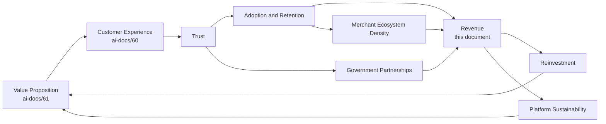

Revenue is never the starting point of this diagram — it is a downstream consequence of value delivered and trust earned. A revenue strategy that tries to enter this loop upstream of trust (by extracting value before it has been created, or by extracting more than was fairly earned) breaks the loop rather than accelerating it.

### Scope Boundary

This document does not define prices, does not forecast revenue numbers, does not model valuation, and does not specify accounting treatment — those are the domain of Arwal's annual financial-planning process and `ai-docs/42-engineering-financial-governance-standards.md`'s cost-governance mechanics, which this document defers to rather than duplicates. This document's exclusive territory is: **the strategic reasoning behind what Arwal monetizes, what it refuses to monetize, how its cost structure is organized conceptually, how its unit economics are reasoned about qualitatively, and how its sustainability is governed** — the durable "why" and "how" beneath every year's specific financial plan.

---

# Sustainability Philosophy

Every principle below exists because a sustainability posture assembled carelessly does not fail abstractly — it fails a citizen who discovers a hidden fee, a farmer locked into an unfair rate, or a government partner who discovers Arwal cannot actually keep its civic commitment.

### Citizen Trust Before Revenue

**Why it exists:** Every revenue decision is evaluated first against whether it preserves or erodes citizen trust, per the identical Citizen-First tie-breaker already established throughout `ai-docs/51` through `ai-docs/61`. A revenue opportunity that would erode trust is rejected regardless of its commercial appeal — not because trust is more important than survival, but because trust *is* the mechanism of survival for a platform whose entire moat is compounding trust across verticals.

### Sustainable Growth

**Why it exists:** Growth that outpaces the ecosystem's actual capacity to absorb it — more citizens than merchants can serve well, more transaction volume than support can handle — produces a citizen-facing quality collapse that a revenue number alone will never show in time to prevent it. Growth is paced to what the ecosystem can sustain at quality, never chased for its own sake.

### Fair Monetization

**Why it exists:** A fee or commission is fair only if the party paying it is still measurably better off than their pre-Arwal informal alternative, per `ai-docs/01-product-goals.md`'s Commercial Discipline. Monetization that merely matches what an exploitative middleman already charged has replaced one extraction with another wearing a nicer interface.

### Transparent Pricing

**Why it exists:** A fee structure that requires concealment to remain acceptable is not a fee structure a citizen or merchant has genuinely consented to — it is one they have been maneuvered into. Every fee, commission, and pricing mechanism is disclosed in plain language before a citizen or merchant commits to it, per RULE-032's Accessibility Non-Negotiable Floor extended to commercial terms.

### Accessibility Before Profit

**Why it exists:** A monetization decision that would price out a low-income citizen, a rural farmer, or a first-generation smartphone user from an essential service has failed the civic mandate this platform exists to fulfill, regardless of how it affects a quarterly revenue number. Essential access is never the variable a revenue strategy is permitted to optimize against.

### Shared Prosperity

**Why it exists:** A platform that captures value from its ecosystem faster than it creates value for that ecosystem will eventually be abandoned by the very merchants, providers, and citizens whose participation makes the platform valuable at all. Revenue growth is measured jointly with merchant income growth and provider income growth — one rising while the others fall is treated as an early warning, not a win.

### Long-Term Partnerships

**Why it exists:** A government department, a bank, or an NGO partnership is worth more the longer and more durably it holds — a partnership optimized for maximum short-term extraction discourages the very renewal and deepening that makes a decade-long civic partnership valuable in the first place.

### Economic Inclusion

**Why it exists:** Arwal's addressable value is the entire district population, not merely its most commercially convenient segment. A revenue model that only works for the digitally fluent, urban, affluent citizen has captured a fraction of the value the platform's mission commits it to serving.

### Platform Neutrality

**Why it exists:** A citizen's search results, a merchant's ranking, and a provider's discoverability must never be quietly distorted by who pays Arwal the most — the moment ranking becomes for-sale without disclosure, the trust that makes discovery valuable to a citizen at all collapses, taking the commercial value of that discovery surface down with it.

### Responsible Innovation

**Why it exists:** A new monetization mechanism — an AI-personalized upsell, a dynamic-pricing experiment, a data-insights product — is evaluated for its effect on trust and inclusion *before* it is evaluated for its revenue potential, never after the fact once it has already caused harm.

### Financial Discipline

**Why it exists:** Sustainability is not merely a revenue question — it is equally a cost-discipline question. A platform that spends without proportion to the value it creates will eventually be forced into a sudden, citizen-harming correction, regardless of how healthy its revenue line looks in isolation.

### Operational Excellence

**Why it exists:** Efficient, well-governed operations are themselves a sustainability mechanism — every rupee saved through genuine operational efficiency (not through degraded service) is a rupee that does not have to be extracted from a citizen or merchant to keep the platform funded.

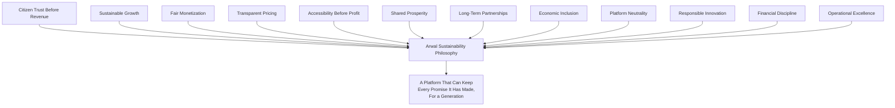

> **Callout — The One-Sentence Sustainability Philosophy**
> *"Arwal earns the right to keep existing by being worth more to a citizen than it costs them — the day that stops being true, no revenue strategy can save it, and no revenue strategy should try to."*

---

# Revenue Philosophy

### Revenue as an Outcome of Value, Never an Input to It

Revenue is not something Arwal designs directly — it is the measurable residue of value already delivered and trust already earned, per the Value Creation Model already established in `ai-docs/61-value-proposition-framework.md`. A revenue strategy that tries to engineer income ahead of genuine value delivery (a fee introduced before the corresponding benefit is real, a subscription sold before the tooling behind it works) is building on a foundation that will not hold.

### Why Trust Generates Revenue

A citizen who trusts Arwal's dispute resolution transacts more often and with less hesitation than one who does not. A merchant who trusts Arwal's ranking to be genuinely earned invests more in their storefront. A government department that trusts Arwal's audit trail expands its civic partnership. In every revenue stream this document catalogues, the actual mechanism generating income is trust converting into repeated, confident use — never a clever pricing trick converting a one-time citizen into a one-time payment.

### Why Ecosystem Health Matters More Than Short-Term Income

A quarter of unusually high commission revenue extracted from a stressed, under-supported merchant base is not a signal of health — it is a leading indicator of merchant attrition next quarter. Arwal treats Ecosystem Health (merchant retention, provider retention, citizen satisfaction, government partnership renewal) as a co-equal signal alongside revenue, per the identical Metric Discipline already established in `ai-docs/50-product-vision-business-strategy.md`: a revenue increase alongside declining ecosystem health is a regression, not a win.

### Why Sustainable Economics Create Better Services

A financially sustainable Arwal can afford to build the AI Assistant's voice-first dialect support properly, invest in accessibility usability testing, and staff government-partnership relationships for the long haul — none of which are commercially urgent in any single quarter, but all of which compound into the differentiated service quality that makes Arwal worth paying for at all. Sustainable economics are not in tension with citizen-first design; they are what fund it.

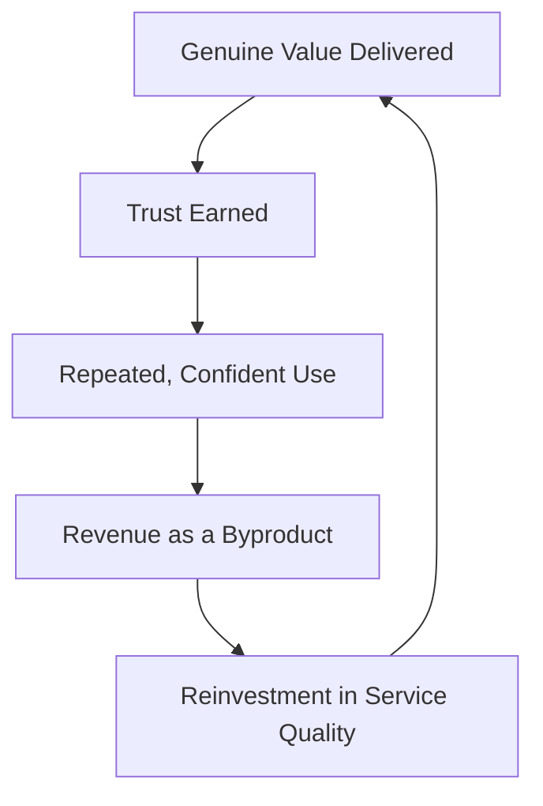

---

# Revenue Streams

Every revenue stream below is described strategically — its rationale, its fairness safeguard, and its relationship to the value it monetizes — never as a priced product. Pricing itself is set and revisited through Arwal's annual financial-planning process, governed per `ai-docs/42-engineering-financial-governance-standards.md`, never fixed permanently in this strategic document.

| Revenue Stream | Strategic Rationale | Fairness Safeguard |
|---|---|---|
| **Marketplace Commissions** | A share of completed, verified commerce transactions — Arwal earns only when a merchant genuinely benefits from a completed sale. | Commission is disclosed upfront; never adjusted retroactively after a sale is agreed. |
| **Food Delivery** | A share of food-order value, reflecting fulfillment and discovery value delivered to both citizen and restaurant. | Commission structure never so high that it displaces a restaurant's own viability, benchmarked against informal-channel alternatives. |
| **Grocery** | A share of grocery-order value, reflecting the same-day fulfillment and catalog-discovery value delivered. | Same fairness benchmark as Marketplace Commissions. |
| **Healthcare Services** | A facilitation fee for verified appointment scheduling and provider discovery — never a fee on the clinical service itself. | Never gates access to a healthcare booking behind an unaffordable fee; fee structures reviewed against citizen healthcare-access impact. |
| **Education Services** | A facilitation fee for verified tutor/coaching discovery and booking. | Never priced in a way that excludes a low-income student from discovering an affordable tutor. |
| **Property Listings** | A modest listing or transaction-facilitation fee reflecting fraud-screening and verified-discovery value. | Never priced to exclude a genuine owner or tenant from a fair listing. |
| **Job Services** | A facilitation fee to employers for verified candidate access — never a fee charged to a job seeker. | Job seekers are never charged to search, apply, or be discovered, per RULE-017's Anti-Exploitation Standard. |
| **Merchant Subscriptions** | An optional, higher-tier subscription offering enhanced tooling (analytics, bulk catalog management) for merchants who want it. | The free tier remains genuinely sufficient for a small merchant's core needs — a subscription is an enhancement, never a paywall on baseline participation. |
| **Premium Business Tools** | Optional, advanced tooling for larger merchants and providers (demand forecasting, multi-location management). | Never required for a citizen-facing capability to function correctly. |
| **Government Service Partnerships** | Formal service-facilitation agreements with government departments for civic-service digitization. | Never gates a citizen's access to a civic right behind a fee — the citizen-facing side of a civic service remains free; the commercial relationship is with the government partner. |
| **Ethical Advertising** | Clearly disclosed, contextually relevant promoted-listing visibility — never disguised as organic ranking. | Promoted placement is always labeled; a citizen can always distinguish paid visibility from Arwal's own ranking judgment, per `ai-docs/51-stakeholder-analysis.md`'s Conflict-of-Interest Governance. |
| **Financial Services** | Future, responsibly-gated payment and credit-adjacent services once trust and regulatory maturity justify them. | Governed by the identical Micro-Lending & Credit Assessment activation trigger already established in `ai-docs/55-business-capability-map.md` — never launched ahead of that evidence. |
| **Platform APIs (Future)** | Trusted third-party developers and businesses building on Arwal's identity, payment, and trust rails, once platform maturity justifies an open ecosystem phase. | Governed by the Open Ecosystem Phase sequencing already established in `ai-docs/50-product-vision-business-strategy.md` — never opened prematurely. |
| **Enterprise Services** | Institutional-tier services for larger partners (hospitals, larger educational institutions) requiring deeper integration. | Institutional pricing never distorts the baseline experience or fee structure available to an individual practitioner. |
| **Privacy-Preserving Data Insights** | Aggregated, anonymized market and civic-impact insight offered to government and research partners. | Never individual-level data monetization; strictly governed by RULE-003's Consent Requirement and Data Minimization principle. |
| **Future Monetization Opportunities** | Additional streams considered only as new capabilities mature (per `ai-docs/55`'s Capability Maturity Model) and only after passing the Sustainability Philosophy's fairness tests. | Every new stream passes through the Revenue Governance approval process below before activation. |

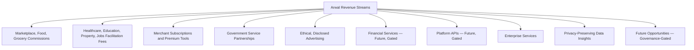

> **Callout — Every Stream Is Tested Against the Same Question**
> Before a revenue stream is activated or expanded, it is tested against one question: *if a citizen fully understood how this fee worked, would they still consider Arwal fair?* A stream that fails this test is not activated, regardless of its projected size.

---

# Cost Structure

Costs are described conceptually — the categories Arwal's economics must fund — never as line-item budgets, which remain the domain of `ai-docs/42-engineering-financial-governance-standards.md`'s Engineering Budget Lifecycle.

| Cost Category | What It Funds |
|---|---|
| **Engineering** | The people and processes building and maintaining every capability, module, and journey across the platform. |
| **Infrastructure & Cloud** | The compute, storage, and networking foundation every citizen-facing service runs on, per `ai-docs/09-tech-stack.md` and `ai-docs/42`'s Cloud Cost Governance. |
| **Security** | The protective controls safeguarding citizen identity, payment, and health data, per `ai-docs/10-security-standards.md`. |
| **AI** | Model inference, AI platform infrastructure, and the human oversight discipline the AI Principle requires. |
| **Customer Support** | The human-reachable assistance every citizen and partner is entitled to, per `ai-docs/60-customer-experience-strategy.md`'s Human Assistance principle. |
| **Operations** | Verification, fraud enforcement, moderation, and the day-to-day organizational execution catalogued in `ai-docs/57-business-process-standards.md`. |
| **Compliance** | Audit, regulatory, and government-agreement obligations, per `ai-docs/40-engineering-compliance-audit-standards.md`. |
| **Marketing** | Responsible, trust-preserving citizen and merchant acquisition — never dark-pattern-driven growth tactics. |
| **Government Integration** | The relationship, technical, and administrative investment sustaining every civic partnership. |
| **Research** | Ongoing investigation into what genuinely serves citizens next, distinct from immediate feature delivery. |
| **Innovation** | Exploratory investment in future capability, gated by the same Innovation & Exploration allocation discipline already established in `ai-docs/38-engineering-portfolio-program-management-standards.md`. |
| **Accessibility** | Dedicated investment in inclusive design, usability testing with vulnerable personas, and assistive-technology parity — never treated as a discretionary cost to trim under pressure. |
| **Community Outreach** | Field-agent programs, NGO and SHG partnership support, and the assisted-onboarding infrastructure serving citizens who cannot self-onboard. |

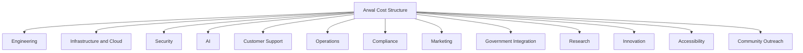

> **Callout — Accessibility and Community Outreach Are Never "Optimization Targets"**
> Per Accessibility Before Profit above, the Accessibility and Community Outreach cost categories are structurally protected from being the first line item cut under financial pressure — a cost-reduction exercise that begins with the investment protecting Arwal's most vulnerable citizens has already made the wrong trade-off, regardless of how much it saves.

---

# Unit Economics

Unit economics are reasoned about strategically here, as durable concepts every financial-planning cycle applies its own numbers to — this section defines no formula and no target figure.

### Customer Acquisition

The cost and effort of bringing a new citizen, merchant, or provider onto the platform. Arwal treats acquisition cost as meaningful only relative to the value that participant is expected to realize over their full relationship with the platform — an acquisition channel that brings in participants who churn immediately is not cheap acquisition, it is wasted acquisition.

### Customer Lifetime Value

The cumulative value a citizen, merchant, or provider generates across their entire relationship with Arwal — inherently a multi-year concept for a platform whose entire structural advantage is trust compounding across verticals over time, per `ai-docs/50-product-vision-business-strategy.md`. A participant who uses one vertical for one transaction has realized a fraction of their potential lifetime value; cross-vertical adoption is the mechanism by which that value is actually realized.

### Retention

The degree to which a citizen, merchant, or provider continues choosing Arwal over time, measured against the WAU/MAU stickiness and multi-month cohort discipline already established in `ai-docs/60-customer-experience-strategy.md`'s Experience Metrics. Retention is the leading indicator every revenue stream ultimately depends on — a platform with strong acquisition but weak retention is filling a leaking vessel.

### Contribution Margin

The degree to which a given transaction or service line generates more value than it costs to deliver, evaluated per-vertical rather than assumed uniform across the platform — Commerce, Healthcare, and Government Services each carry genuinely different cost structures and are reasoned about independently, never averaged into a single misleading blended number.

### Operational Efficiency

The degree to which Arwal delivers a given unit of citizen value at a lower operational cost as scale grows — the natural consequence of shared platform infrastructure (Identity, Payments, Search, Notifications) serving every vertical simultaneously rather than each vertical building its own.

### Cross-Vertical Value

The additional value realized specifically because a citizen's identity, reputation, and trust transfer across verticals — a citizen who trusts Arwal for groceries is measurably more likely to trust it for a government application, per the Cross-Vertical Adoption Depth metric already established in `ai-docs/50`. This is Arwal's structural economic advantage over any single-vertical competitor.

### Network Effects

The degree to which each additional citizen makes the platform more valuable to every merchant, and each additional merchant makes it more valuable to every citizen, per the Network Effects reasoning already established in `ai-docs/61-value-proposition-framework.md`. Network effects are the mechanism by which Arwal's unit economics improve with scale rather than merely holding constant.

### Economies of Scale

The degree to which shared infrastructure, shared trust rails, and shared operational tooling reduce the marginal cost of serving the next citizen, merchant, or district — the foundation of the Configuration-Driven Expansion Model already established in `ai-docs/50`'s Strategic Expansion Principles.

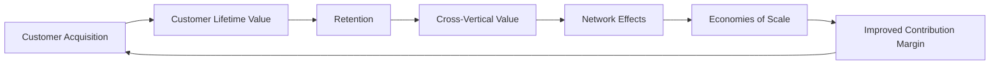

---

# Sustainability Model

Arwal's sustainability is reasoned about across eight distinct stakeholder groups, each with a distinct sustainability obligation Arwal commits to over a multi-decade horizon.

| Stakeholder | Sustainability Obligation |
|---|---|
| **Citizens** | Access to essential services (civic, healthcare, agriculture intelligence) is never priced out of reach; trust is never traded for short-term revenue. |
| **Merchants** | Fee structures remain demonstrably fairer than the informal channels they replace, reviewed continuously against that benchmark. |
| **Providers** | Reputation and income-growth mechanisms remain intact even as commission structures evolve. |
| **Government** | Civic partnerships are structured to survive administrative and political transitions, per `ai-docs/00-project-vision.md`'s Civic Sustainability commitment. |
| **Employees** | Arwal's own workforce is sustained by an organization whose financial discipline prevents the boom-bust cycles that erode institutional knowledge and morale. |
| **Partners** | Technology, financial, and NGO partners retain a relationship worth renewing, never one structured for one-sided extraction. |
| **Investors** | Capital is stewarded toward durable, trust-compatible growth rather than growth that must later be unwound at citizen expense. |
| **District Economy** | Arwal's presence measurably strengthens the district's own local economy — merchant income, worker income, and government efficiency — rather than merely extracting value from it. |

### Sustaining These Obligations Across Decades

Per `ai-docs/00-project-vision.md`'s founding horizon, Arwal is built as infrastructure meant to serve a district for a generation, not a product cycle. Sustaining every obligation above across decades requires: revenue diversification (no single stream's failure threatens every other obligation simultaneously), disciplined reinvestment (a defined share of revenue is directed to long-horizon investments — accessibility, AI safety, civic-integration depth — that no single year's pressure is permitted to defer indefinitely), and continuous, evidence-based recalibration of every fee and cost structure against the fairness tests established above.

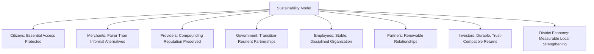

---

# Economic Flywheel

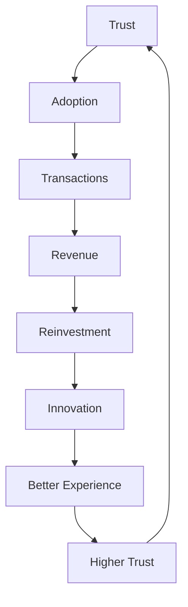

| Stage | Description |
|---|---|
| **Trust** | A citizen, merchant, or government partner believes Arwal is fair, reliable, and genuinely on their side. |
| **Adoption** | That belief translates into actual, sustained use across one or more verticals. |
| **Transactions** | Adoption produces real commerce, service bookings, and civic-service completions. |
| **Revenue** | A fair share of the value created in those transactions is captured, per the Revenue Streams above. |
| **Reinvestment** | Revenue is directed back into engineering, accessibility, and civic-partnership depth. |
| **Innovation** | Reinvestment funds genuinely new capability — better AI assistance, deeper civic integration, richer accessibility tooling. |
| **Better Experience** | New capability translates into a measurably better felt experience, per `ai-docs/60-customer-experience-strategy.md`. |
| **Higher Trust** | A better experience compounds trust further, restarting the loop at a higher level than before. |

> **Callout — The Flywheel Only Turns Forward**
> Every stage above is reversible in the wrong direction — a broken promise at Transactions, an extractive decision at Revenue, or a deferred reinvestment at Innovation each stalls or reverses the flywheel. The Revenue Governance discipline below exists specifically to catch a reversal before it compounds.

---

# Partnership Strategy

| Partner Category | Sustainable Partnership Principle |
|---|---|
| **Government** | Partnerships are structured for multi-year durability, insulated from a single administrative or political cycle, with formal, transparent data-governance terms. |
| **NGOs** | Partnerships amplify an NGO's own mission through Arwal's distribution, never extracting from the vulnerable populations an NGO represents. |
| **Banks** | Settlement infrastructure partnerships are governed by regulated, transparent terms — never a hidden margin on a citizen's payment. |
| **Payment Providers** | Selected and retained per the Vendor Lock-In Considerations already established in `ai-docs/09-tech-stack.md` — never a single-provider dependency without an evaluated exit path. |
| **Educational Institutions** | Partnerships extend genuine reach for tutors and coaching centers without displacing a school's own institutional role. |
| **Healthcare Organizations** | Partnerships are gated on completed compliance and verification review before any commercial term is finalized. |
| **Local Businesses** | Onboarding and fee terms remain radically accessible, per the Business Enablement Strategic Objective. |
| **Technology Partners** | Infrastructure and AI-model partnerships are provider-agnostic by architecture, per `ai-docs/09-tech-stack.md`'s AI Gateway Service, preventing a single vendor's commercial terms from becoming existential leverage over Arwal. |
| **Future Ecosystem Partners** | Any future third-party developer or business relationship is opened only per the Open Ecosystem Phase sequencing already established in `ai-docs/50-product-vision-business-strategy.md`. |

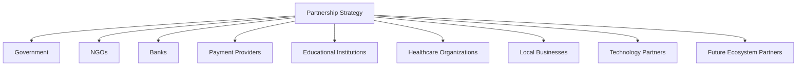

---

# Accessibility & Affordability

Monetization never prevents:

| Protected Access | Safeguard |
|---|---|
| **Digital Inclusion** | Onboarding remains free and radically simple, per `ai-docs/01-product-goals.md`'s Must-Have priority. |
| **Rural Adoption** | Core agriculture-intelligence features (mandi prices, weather, scheme discovery) remain free to the farmer, since their value depends on universal, not paywalled, reach. |
| **Low-Income Access** | Wallet and transaction limits scale with verification tier, per `ai-docs/58-business-rules-policies.md`'s RULE-019, never used as a mechanism to exclude a low-income citizen from basic participation. |
| **Government Service Access** | A citizen never pays Arwal a fee to access a civic right — the commercial relationship for civic services sits with the government partner, never the citizen. |
| **Essential Healthcare** | Discovery and appointment-booking facilitation fees are structured to never gate a citizen's access to care. |
| **Education** | Discovery of an affordable tutor or scholarship is never itself paywalled. |
| **Emergency Services** | Any future emergency-adjacent capability is held to the strictest possible accessibility floor — never monetized in a way that could delay a citizen's access during a genuine emergency. |

> **Callout — Accessibility Is Load-Bearing, Not Decorative**
> Every safeguard above is enforced as a Business Rule wherever one already exists (`ai-docs/58-business-rules-policies.md`), and as a standing commitment reviewed at the Quarterly Revenue Review where no formal rule yet exists — accessibility protection is never left to goodwill alone.

---

# Risk Management

| Risk | Description | Mitigation |
|---|---|---|
| **Revenue Concentration** | Over-dependence on a single revenue stream or vertical. | Deliberate diversification across commerce, services, government, and future streams, per the Revenue Streams table above. |
| **Platform Dependency** | Over-reliance on a single cloud, payment, or AI-model vendor. | Provider-agnostic architecture per `ai-docs/09-tech-stack.md`; evaluated exit paths for every critical vendor. |
| **Government Policy Changes** | A regulatory or administrative shift disrupts a civic partnership or revenue mechanism. | Civic modules designed to add standalone value even absent full government integration, per `ai-docs/00-project-vision.md`'s Risk Register. |
| **Economic Downturn** | A district-wide or national economic contraction reduces transaction volume and merchant participation. | Cost discipline and diversified revenue reduce single-shock exposure; essential-access commitments remain protected regardless of downturn. |
| **Partner Churn** | Merchants, providers, or government partners disengage. | Continuous fairness benchmarking and Voice-of-Customer feedback loops, per `ai-docs/60-customer-experience-strategy.md`. |
| **Fraud** | Manipulated transactions, fake listings, or exploitative recruitment erode both trust and revenue integrity. | Fraud Detection (CAP-038) and Trust & Safety (CAP-036) capabilities, governed per `ai-docs/58-business-rules-policies.md`. |
| **Trust Erosion** | A mishandled dispute or data incident damages cross-vertical trust simultaneously. | Transparent dispute resolution and consistent policy enforcement, per `ai-docs/58`'s Rule Catalog. |
| **High Infrastructure Costs** | Cloud and AI cost growth outpaces revenue growth. | Continuous cost optimization per `ai-docs/42-engineering-financial-governance-standards.md`. |
| **Competition** | A national platform or well-funded competitor enters the district. | Structural trust-compounding advantage, per `ai-docs/50-product-vision-business-strategy.md`'s Market Positioning, which a single-vertical competitor cannot replicate without becoming Arwal itself. |

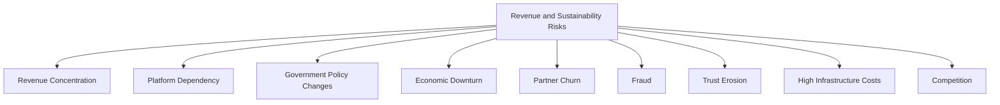

---

# Sustainability Metrics

| Metric | Definition | Direction |
|---|---|---|
| **Revenue Diversity Index** | The degree to which no single revenue stream represents an outsized share of total revenue. | Increasing diversity |
| **Recurring Revenue Ratio** | The share of revenue arising from sustained, repeated engagement rather than one-time transactions. | Increasing |
| **Merchant Retention** | The rate at which onboarded merchants remain active over time. | Increasing |
| **Provider Retention** | The rate at which onboarded service providers remain active over time. | Increasing |
| **Government Retention** | The rate at which government partnerships renew and deepen. | Increasing |
| **Platform Sustainability Score** | A composite index combining Revenue Diversity, Cost Efficiency, and Ecosystem Health signals. | Increasing |
| **Cost Efficiency** | The degree to which operational cost per unit of citizen value declines as scale grows. | Improving |
| **Investment in Innovation** | The share of resources directed toward long-horizon capability, per `ai-docs/38`'s Innovation & Exploration allocation. | Sustained, protected |
| **Accessibility Investment** | The share of resources directed toward inclusive design and assisted-access infrastructure. | Sustained, protected, never the first cut |
| **Economic Impact** | Merchant and provider-reported income improvement attributable to Arwal. | Increasing |
| **District GDP Contribution (Conceptual)** | The directional, non-formulaic sense of Arwal's contribution to district-level economic activity. | Positive, growing |
| **Trust Score** | The District Trust Signal already established in `ai-docs/50-product-vision-business-strategy.md`. | Increasing |

> **Callout — No Sustainability Metric Stands Alone**
> Consistent with the North Star Principle already established in `ai-docs/00-project-vision.md`, a rising revenue metric alongside a falling Trust Score, declining Merchant Retention, or declining Accessibility Investment is treated as a regression — never counted as a win in isolation.

---

# Governance

### Ownership

Revenue & Sustainability Strategy ownership sits jointly with the CEO and CFO, with the CSO and CPO accountable for the value and experience inputs this strategy depends on, mirroring the Clear Ownership discipline already established throughout `ai-docs/53` through `ai-docs/61`.

### Revenue Review Board

A standing **Revenue Review Board** — chaired by the CEO, with the CFO, CPO, CSO, and CRO as members — holds approval authority over any new revenue stream, any material fee-structure change, and any deviation from the Sustainability Philosophy's fairness tests. The Board meets quarterly, with ad hoc sessions for a Sustainability Metric regression.

### Decision Authority

| Decision | Approves |
|---|---|
| New revenue stream activation | Revenue Review Board |
| Fee or commission structure change | CEO/CFO + Revenue Review Board |
| Investment allocation priorities | CEO + CFO, informed by Board |
| Emergency sustainability response (e.g., a fraud-driven revenue-integrity threat) | CFO (immediate), ratified by Board within 5 business days |

### Investment Priorities

Every annual planning cycle allocates resources against the Cost Structure categories above using the same Proportional Rigor and protected-allocation discipline already established in `ai-docs/38-engineering-portfolio-program-management-standards.md` — Accessibility and Compliance investment are never the discretionary residual left over after every other category is funded.

### Review Cadence

| Review | Cadence | Owner |
|---|---|---|
| Quarterly Revenue & Sustainability Review | Quarterly | Revenue Review Board |
| Annual Strategy Review | Annual | CEO, CFO, CPO, CSO |
| Continuous Optimization | Ongoing | CFO, informed by Sustainability Metrics trend |

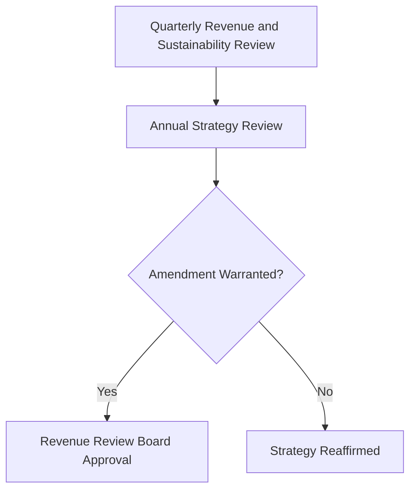

---

# Anti-Patterns

| Anti-Pattern | Why It's Rejected |
|---|---|
| **Revenue before trust** | Inverts the Economic Flywheel's actual causal order; produces a short-term gain at the cost of the mechanism that generates every future gain. |
| **Predatory pricing** | A fee that exploits a captive citizen or merchant's lack of alternatives fails the Fair Monetization test outright. |
| **Hidden fees** | Directly violates Transparent Pricing; a concealed fee is a trust liability the moment it is discovered. |
| **Vendor lock-in** | Contradicts the Project Vision's explicit rejection of proprietary lock-in mechanisms, applied here to Arwal's own commercial relationships. |
| **Monopoly behavior** | Using platform dominance to suppress fair competition or extract beyond fair value contradicts Shared Prosperity and Platform Neutrality. |
| **Accessibility sacrificed for profit** | Directly violates Accessibility Before Profit — never an acceptable trade-off, regardless of the revenue at stake. |
| **Over-monetization** | Introducing too many fee surfaces erodes the "simple, trustworthy" experience `ai-docs/60-customer-experience-strategy.md` commits to. |
| **Short-term growth obsession** | Optimizing for this quarter's revenue number at the expense of Ecosystem Health metrics is rejected per the North Star Principle. |
| **Ignoring ecosystem health** | Treating merchant, provider, and citizen retention as secondary to revenue growth breaks the Economic Flywheel at its foundation. |

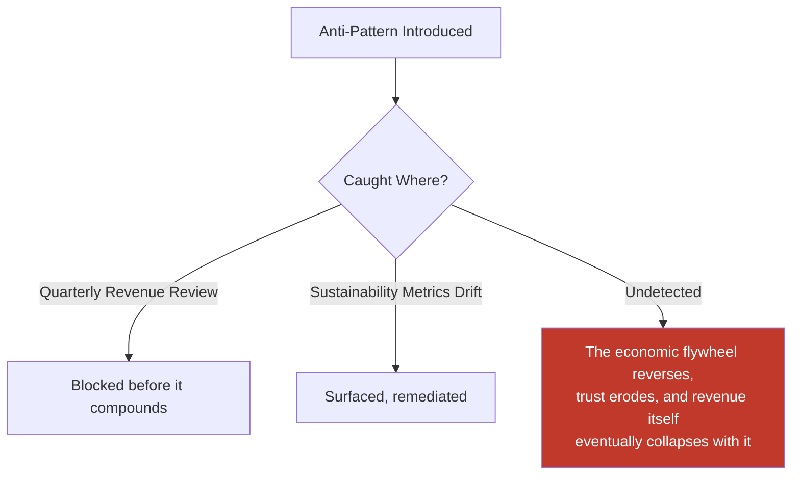

---

# Relationship to Previous Documents

| Prior Document | Relationship |
|---|---|
| **Project Vision (`ai-docs/00`)** | Establishes the founding mission and the Trust over Growth-at-all-costs pillar this document's every safeguard operationalizes commercially. |
| **Product Goals (`ai-docs/01`)** | Establishes the Commercial Discipline and Business Goals this document's Revenue Streams and Unit Economics extend. |
| **Stakeholder Analysis (`ai-docs/51`)** | Supplies the stakeholder registry every partnership and sustainability obligation in this document traces to. |
| **User Personas (`ai-docs/52`)** | Supplies the human detail behind why accessibility and affordability safeguards are non-negotiable, not merely prudent. |
| **Business Domain Model (`ai-docs/53`)** | Supplies the ownership structure behind the Payments and Trust & Safety domains this document's revenue integrity depends on. |
| **Business Capability Map (`ai-docs/55`)** | Supplies the stable capabilities (Payment Processing, Fraud Detection) this document's revenue mechanisms are built on top of. |
| **Customer Experience Strategy (`ai-docs/60`)** | Supplies the felt-experience bar every monetization decision must clear without degrading. |
| **Value Proposition Framework (`ai-docs/61`)** | Supplies the value-exchange logic this document's revenue capture is built directly on top of — this document is that framework's commercial and sustainability continuation. |
| **Business Rules & Policies (`ai-docs/58`)** | Supplies the precise, enforceable rules (RULE-013, RULE-017, RULE-019) this document's fairness safeguards are operationalized through. |
| **Business Glossary (`ai-docs/59`)** | Supplies the precise vocabulary (Trust, Reputation, Settlement, Wallet) this document's every claim is expressed in. |

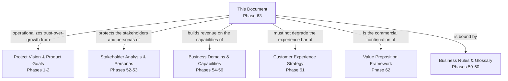

---

# Executive Artifacts

### Revenue Framework

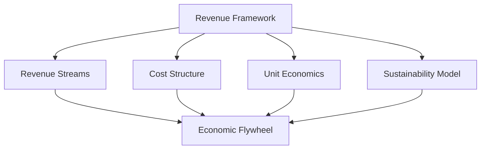

### Revenue Streams Map

See Revenue Streams table above — reproduced here by reference per Single Source of Truth, never duplicated.

### Economic Flywheel

See Economic Flywheel section above.

### Business Sustainability Model

See Sustainability Model section above.

### Revenue Governance Model

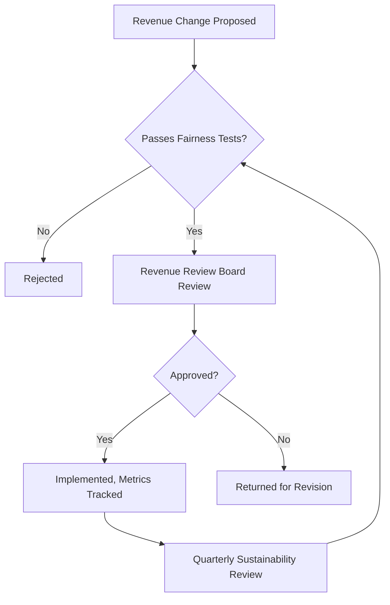

### Investment Allocation Framework

| Allocation Priority | Protection Level |
|---|---|
| Accessibility | Protected — never the first cut |
| Compliance | Protected — non-negotiable regulatory floor |
| Core Engineering & Reliability | High priority — funds the trust every revenue stream depends on |
| Innovation & Research | Protected minimum allocation, per `ai-docs/38`'s Innovation band |
| Marketing & Acquisition | Scaled to genuine, trust-compatible growth need |
| Enterprise & Premium Tooling | Funded from its own revenue contribution, never displacing core citizen investment |

### Executive Dashboards

| Dashboard | Audience | Key Content |
|---|---|---|
| **CEO Dashboard** | CEO | Platform Sustainability Score, District Trust Signal, Revenue Diversity Index |
| **CFO Dashboard** | CFO | Cost Efficiency, Recurring Revenue Ratio, Investment Allocation adherence |
| **CPO Dashboard** | CPO | Merchant/Provider Retention, Accessibility Investment trend |
| **CSO Dashboard** | CSO | Competitive positioning, Partnership renewal trend |
| **Government Partners Dashboard** | Government Technical Partners | Government Retention, Economic Impact, civic-value evidence |

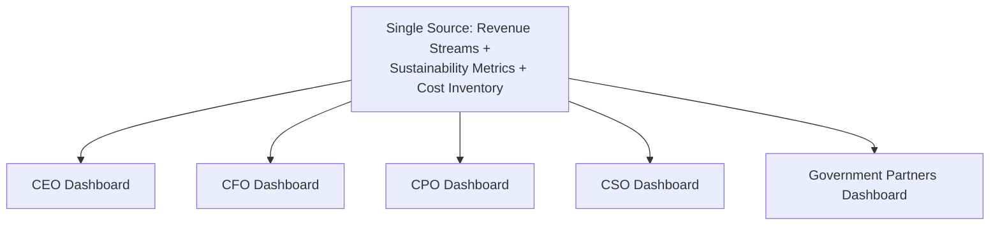

### Decision Matrix

| Decision Type | Approval Authority |
|---|---|
| New revenue stream | Revenue Review Board |
| Fee/commission structure change | CEO/CFO + Revenue Review Board |
| Cost category reallocation | CFO, informed by Board |
| Emergency sustainability response | CFO (immediate), ratified by Board within 5 business days |
| Annual strategy amendment | CEO + CFO + CPO + CSO |

---

# Closing Statement

> **Callout — Closing Statement**
> Every prior document in this handbook explains what Arwal is, how it is built, how it feels to use, and why it is worth a stakeholder's trust. This document explains how Arwal keeps existing long enough for any of that to matter for a generation — not by extracting the most it can from every transaction, but by earning a fair, transparent, and sustainable share of the genuine value it creates, and reinvesting that share into the trust, accessibility, and innovation that make the next year's value creation possible. A revenue strategy that trades citizen trust for a faster quarter has not found a shortcut to sustainability — it has found a faster way to need this document rewritten after the trust it spent turns out not to grow back. Arwal's economics are built to compound the way its trust is built to compound: slowly, fairly, and in a direction that a citizen, a merchant, a farmer, and a government partner would all recognize, if they saw the whole picture, as worth renewing tomorrow. Where a future phase must deviate from a principle stated here, that deviation is made explicitly — through the Revenue Governance process above — never silently, and never by default.

This document, `ai-docs/62-revenue-sustainability-strategy.md`, is Phase 63 of approximately 415. Every future financial, partnership, and monetization decision is expected to trace back to a principle defined here, or to justify its deviation in writing.

**End of Phase 63 — `ai-docs/62-revenue-sustainability-strategy.md`**