# Government Partnership Strategy

**Document:** `ai-docs/63-government-partnership-strategy.md`
**Project:** Arwal — The District Super App
**Stage:** 2 — Product & Business Strategy
**Phase:** 64 — Government Partnership Strategy
**Status:** Approved for Product & Engineering Reference
**Audience:** CEO, CSO, CGRO, CPO, Government Digital Transformation Consultants, Public Policy Advisors, Enterprise Architects, Compliance Strategists, Digital Governance Specialists, Investors

> **Callout — Purpose of This Document**
> `ai-docs/00-project-vision.md` through `ai-docs/62-revenue-sustainability-strategy.md` established why Arwal exists, what it can do, who it serves, what it feels like to use, how the organization runs, the rules it decides by, the vocabulary it speaks, the experience it commits to, why it is worth depending on, and how it sustains itself financially for a generation. None of those documents answers the question every district administration, every department secretary, and every state digital-governance office will eventually ask before signing anything: **on what terms, and with what guarantees, does Arwal actually work *with* government — not for it, not instead of it, but genuinely alongside it — in a way that survives an election, a transfer, and a decade?** This document is that answer — the authoritative Government Partnership Strategy every future civic collaboration, department onboarding, and public-sector negotiation traces back to.

---

# Purpose of this Document

### Why Government Partnership Requires Its Own Strategic Layer

`ai-docs/50-product-vision-business-strategy.md` already positions Arwal as "public-purpose private infrastructure" — commercially sustainable, civic in responsibility. `ai-docs/53-business-domain-model.md` already names Government Services as a Core Domain. `ai-docs/58-business-rules-policies.md` already governs the precise eligibility and approval logic behind a certificate or a grievance. None of those documents answers the *institutional* question sitting above all of them: how does a private platform earn the standing to sit beside a District Collector's office, a Panchayat, and a state health department as a genuine partner rather than a vendor, a threat, or a passing pilot project? Government partnership is not a feature of the Government Services domain — it is the relationship condition that makes every civic capability, module, journey, process, and rule in this handbook *possible to operate at all* on behalf of a public institution. This document is where that relationship is defined on its own terms.

### Why This Is a Strategy Document, Not a Contract

This document contains no procurement language, no legal clauses, no API specifications, and no implementation detail. A Memorandum of Understanding, a data-sharing agreement, and a technical integration are each a distinct, future artifact governed by their own process (see Partnership Lifecycle below). This document is the durable, technology-independent reasoning a negotiator, a Collector's office, or a state IT department reads *before* any of those artifacts are drafted — the "why" and the "on what terms" that every specific agreement must remain consistent with, never redefine independently.

### Why Government Partnership Is Existential, Not Optional, to Arwal's Mission

Per `ai-docs/00-project-vision.md`'s founding Problem Statement, a citizen's fragmented digital life is not only a commerce problem — it is a governance problem: physical queues, opaque processes, and no continuity between a citizen's civic and commercial life. Arwal cannot close that gap unilaterally. A certificate is only real if a government department recognizes it; an application's approval is only meaningful if a District Officer stands behind it. Government partnership is therefore not a growth channel Arwal opportunistically pursues — it is the precondition for the civic half of Arwal's founding mission being true at all.

### Why Trust, Not Access, Is the Actual Currency of This Relationship

A government partnership secured through political favor, exclusive lock-in, or opaque data arrangements is a partnership built on a foundation that erodes the moment the specific official who granted access changes. A government partnership earned through demonstrated reliability, transparent data governance, and citizen-first outcomes is a partnership the *next* official inherits and has every reason to continue. Every principle in this document exists to make Arwal's civic partnerships the second kind, never the first.

### The Chain of Reasoning This Document Extends

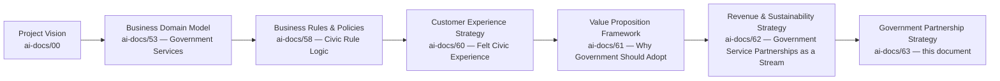

| Layer | Question It Answers |
|---|---|
| Project Vision | Why does a civic gap exist, and why must Arwal close it? |
| Business Domain Model | Who inside Arwal owns the Government Services concern? |
| Business Rules & Policies | What, precisely, governs a civic decision? |
| Customer Experience Strategy | What must a citizen feel when using a civic service? |
| Value Proposition Framework | Why should a government department adopt Arwal at all? |
| Revenue & Sustainability Strategy | How does the government relationship sustain itself financially? |
| **Government Partnership Strategy** (this document) | **On what institutional terms does the relationship itself exist, govern itself, and survive political and administrative change?** |

### Scope Boundary

This document does not define APIs, data schemas, integration protocols, or system architecture — those remain the exclusive territory of future technical-integration documents built *after* a partnership is approved, governed by `ai-docs/03-system-architecture-principles.md` and `ai-docs/13-api-design-guidelines.md`. It does not draft a Memorandum of Understanding, a data-processing agreement, or any binding legal instrument — those are Legal and Government Relations deliverables produced under this strategy's authority, never substitutes for it. This document's exclusive territory is: **partnership philosophy, partnership model, partnership objectives, service-integration strategy, digital-governance strategy, compliance strategy, partnership lifecycle, partnership governance, risk, and metrics** — the durable institutional reasoning every specific government relationship is measured against.

---

# Why Government Partnerships Matter

### How Partnerships Improve Citizen Services

A citizen does not experience "Arwal" and "the District Administration" as two separate relationships — they experience one continuous attempt to get a certificate renewed, a subsidy applied, or a grievance resolved. When Arwal and a government department are genuinely aligned, that continuous attempt is fast, transparent, and dignity-preserving, per `ai-docs/60-customer-experience-strategy.md`'s Government Services experience commitment. When they are not aligned — a department that never adopted digital intake, a data-sharing dispute, a lapsed integration — the citizen inherits the friction of that misalignment as their own problem, through no fault of their own.

### How Government Creates Ecosystem Value

A government department is not merely a Government Services domain stakeholder — it is an ecosystem participant whose institutional legitimacy, service data, and administrative reach make every other vertical more valuable. A citizen who trusts Arwal because their certificate genuinely arrived is a citizen more willing to trust it with a healthcare booking or a grocery order, per `ai-docs/61-value-proposition-framework.md`'s Network Effects reasoning — government partnership is a direct input into the same compounding-trust flywheel every other vertical depends on.

### How Digital Governance Supports District Transformation

A district that digitizes its citizen-service delivery does not merely save officer hours — it becomes measurable, auditable, and improvable in a way a paper-and-queue system structurally cannot be. Digital governance, done well, is not a cost department leadership tolerates for citizen convenience; it is a capability that makes the department itself more defensible, more transparent, and more able to demonstrate its own effectiveness to its own oversight bodies.

### The Relationship This Document Governs

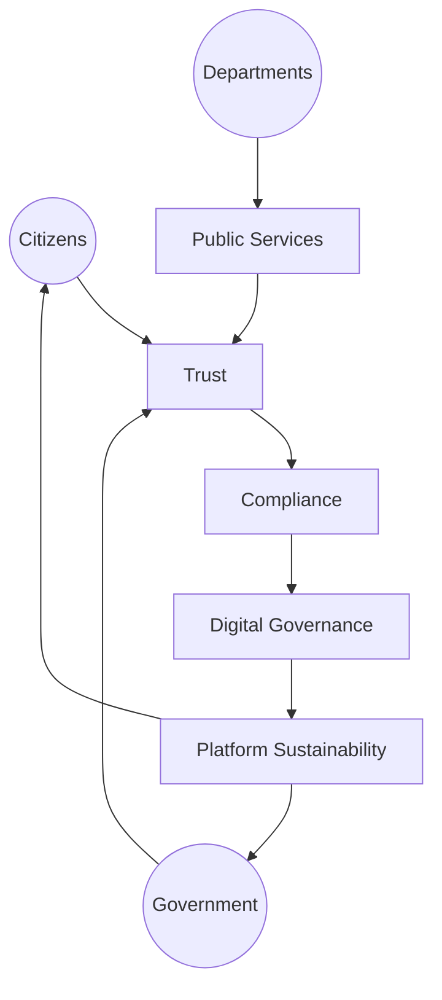

Citizens, Government, and Departments jointly produce Public Services; the quality of that joint production is entirely mediated by Trust, which in turn depends on Compliance being genuinely honored, which enables Digital Governance to mature, which is what makes the entire relationship financially and institutionally Sustainable enough to keep serving Citizens and Government tomorrow. A break anywhere in this loop — a compliance lapse, a trust breach, an unsustainable cost structure — degrades every other node, not just its own.

---

# Partnership Philosophy

Every principle below exists because a government partnership built carelessly does not fail abstractly — it fails a citizen mid-application, a department mid-transition, or a district mid-election-cycle, at the exact moment institutional continuity matters most.

### Citizen First

**Why it exists:** Every partnership decision is judged first by whether it improves a citizen's actual experience of a civic service — never by whether it is administratively convenient for Arwal or politically convenient for a specific official. Mirrors the identical Citizen-First tie-breaker already established throughout `ai-docs/51` through `ai-docs/62`.

### Government as a Strategic Partner, Not a Customer or a Regulator Alone

**Why it exists:** Treating government purely as a customer invites a transactional, extraction-oriented relationship; treating it purely as a regulator invites an adversarial, compliance-only relationship. Arwal treats government as a co-equal, mission-aligned partner — a party with its own legitimate goals (backlog reduction, transparency, citizen satisfaction) that Arwal's civic capability exists to serve, not merely to satisfy.

### Transparency

**Why it exists:** A partnership whose terms, data flows, or ranking logic require concealment to remain acceptable to a citizen or an oversight body is not a partnership Arwal can defend indefinitely. Every civic data flow, fee arrangement, and workflow configuration is disclosed to the partnering department and, where appropriate, to the citizen, per RULE-032's Accessibility Non-Negotiable Floor extended here to institutional transparency.

### Mutual Accountability

**Why it exists:** A partnership where only Arwal is held to a service standard, or only the department is held to a data-quality standard, is not actually mutual — it is one party auditing the other. Every partnership names explicit obligations on both sides, per the Partnership Governance section below, and both are reviewed with equal rigor.

### Public Trust

**Why it exists:** A citizen's willingness to submit a government application through Arwal depends entirely on believing the platform is a legitimate, government-recognized channel — not a private intermediary quietly standing between them and their entitlement. Every partnership is designed to visibly reinforce, never obscure, the citizen's trust in the underlying government service itself.

### Data Responsibility

**Why it exists:** Government data — identity, health, land, welfare eligibility — carries stakes no commerce transaction shares. Every partnership's data-sharing terms are governed by the strictest applicable standard among Arwal's own `ai-docs/10-security-standards.md`, the partnering department's own regulatory obligations, and any applicable national data-protection law — never the loosest.

### Operational Independence

**Why it exists:** A partnership that makes Arwal operationally dependent on a single official, a single administrative office, or a single political cycle is a partnership that collapses the moment that dependency breaks. Arwal designs every civic module to add standalone value even absent full government integration, per `ai-docs/00-project-vision.md`'s Government Dependency Risk mitigation, and never structures its own operations to require exclusive government favor to function.

### Accessibility

**Why it exists:** A civic service digitized through Arwal must remain at least as accessible as the physical alternative it replaces, per `ai-docs/12-accessibility-standards.md` — a digitization effort that inadvertently excludes an elderly citizen, a low-literacy farmer, or a citizen without a smartphone has failed the very population government services exist to serve.

### Inclusiveness

**Why it exists:** A partnership scoped only to a district headquarters' most digitally fluent citizens, while a rural block office's population remains unserved, has captured a fraction of the value a genuine civic partnership should deliver — every partnership's scope is evaluated against whether it serves the *whole* district, not merely its most convenient segment.

### Long-Term Collaboration

**Why it exists:** A civic partnership optimized for a single pilot announcement or a single election-cycle showcase is optimized for the wrong time horizon. Every partnership is structured, per `ai-docs/00-project-vision.md`'s Civic Sustainability commitment, to survive an administrative transition, a change in political leadership, and a multi-year renewal cycle.

### Policy Alignment

**Why it exists:** Arwal never asks a government partner to bend its own policy, workflow, or eligibility rule to fit Arwal's technology — every civic workflow configuration is built to reflect the department's *actual, already-lawful* process, per RULE-006's Government Application Eligibility Baseline, which is configured per department and never unilaterally altered by Arwal.

### Shared Outcomes

**Why it exists:** A partnership's success is measured jointly — reduced backlog, reduced citizen queue time, increased transparency — never by an Arwal-only metric (e.g., app downloads) that could rise while the department's own actual service quality stagnates or declines.

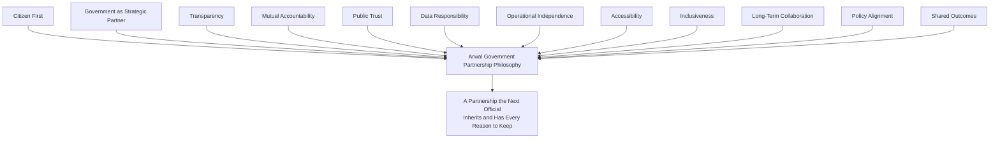

> **Callout — The One-Sentence Partnership Philosophy**
> *"A government partnership that only works while a specific official is in office was never a partnership with the government — it was a favor from a person, and Arwal does not build its civic mission on favors."*

---

# Partnership Model

Arwal's government relationships span institutions at every administrative tier within, and eventually beyond, the founding district. Every entity below is a distinct partnership category with its own primary civic touchpoints; none is treated as a homogeneous "government" relationship.

| Institution | Primary Civic Touchpoint | Typical Engagement Depth |
|---|---|---|
| **District Administration / District Collector's Office** | District-wide oversight, formal partnership sponsorship, cross-department coordination. | Strategic — the anchor relationship every department-level partnership is authorized under. |
| **Municipal Bodies** | Urban civic services — property records, trade licenses, municipal grievances. | Operational, department-equivalent. |
| **Block Offices** | Sub-district administrative service delivery, especially in rural areas. | Operational, field-agent-supported. |
| **Panchayats** | Village-level governance, local scheme awareness, community-level onboarding support. | Community-anchored, field-agent-mediated. |
| **Agriculture Department** | Scheme eligibility, subsidy administration, market-intelligence data validation. | Operational, data-sharing-intensive. |
| **Health Department** | Public health program awareness, healthcare-facility directory validation, health-scheme eligibility. | Operational, highest data-sensitivity tier. |
| **Education Department** | School/institution directory context, scholarship-scheme administration. | Operational, moderate data-sensitivity. |
| **Revenue Department** | Land records, residency certificates, income certificates. | Operational, highest civic-document criticality. |
| **Transport Department** | Licensing-adjacent services, transport-scheme awareness. | Operational, moderate depth. |
| **Employment Department** | Skill-development scheme awareness, formal-sector job-matching context. | Operational, moderate depth. |
| **Police** | Verification-adjacent coordination (e.g., a lost-document report), public-safety notification distribution. | Narrow, safety-scoped engagement only. |
| **Disaster Management Authority** | Emergency public notification distribution, resource-availability information. | Narrow, safety-critical, always-available engagement. |
| **Public Distribution System** | Ration/entitlement scheme eligibility and status visibility. | Operational, high citizen-volume. |
| **Social Welfare Department** | Welfare scheme eligibility, vulnerable-population support coordination. | Operational, highest inclusion-sensitivity tier. |
| **Future Government Agencies** | Any department or agency not yet onboarded, evaluated per the Partnership Lifecycle below. | Anticipated — evaluated on first contact, never assumed. |

```mermaid
graph TD
    DistrictAdmin[District Administration] --> Municipal[Municipal Bodies]
    DistrictAdmin --> Block[Block Offices]
    DistrictAdmin --> Panchayat[Panchayats]
    DistrictAdmin --> Agri[Agriculture Department]
    DistrictAdmin --> Health[Health Department]
    DistrictAdmin --> Edu[Education Department]
    DistrictAdmin --> Revenue[Revenue Department]
    DistrictAdmin --> Transport[Transport Department]
    DistrictAdmin --> Employment[Employment Department]
    DistrictAdmin --> Police[Police]
    DistrictAdmin --> Disaster[Disaster Management Authority]
    DistrictAdmin --> PDS[Public Distribution System]
    DistrictAdmin --> Welfare[Social Welfare Department]
    DistrictAdmin --> Future[Future Agencies]
```

> **Callout — District Administration Is the Anchor, Never a Bottleneck**
> Every department-level partnership is sponsored under the District Administration's overarching civic relationship, ensuring cross-department consistency — but a department is never blocked from a narrower, faster pilot engagement while the broader District Administration relationship deepens in parallel, per the Government Coordination Risk mitigation already established in `ai-docs/00-project-vision.md`.

---

# Partnership Objectives

| Objective | What Success Looks Like |
|---|---|
| **Digital Service Delivery** | A civic service completable end-to-end without a physical office visit, for every department that has onboarded. |
| **Reduced Administrative Burden** | A measurable reduction in officer time spent on manual intake, duplicate data entry, and status-inquiry handling. |
| **Citizen Convenience** | A citizen reaches, tracks, and completes a civic service through the same identity and app they already use for commerce. |
| **Transparency** | Every citizen-visible application status, and every department-visible workload metric, is accurate and current. |
| **Operational Efficiency** | Backlog volume and average processing time trend measurably downward per onboarded department. |
| **Improved Data Quality** | Departmental records benefit from structured, validated intake rather than inconsistent paper submissions. |
| **Digital Inclusion** | A rural, low-literacy, or elderly citizen completes a civic service at a completion rate approaching parity with a digitally fluent urban citizen. |
| **Policy Implementation** | A new government scheme or policy reaches eligible citizens faster and more completely than through informal awareness channels alone. |
| **Economic Development** | Reduced civic friction frees citizen and merchant time and capital toward productive economic activity. |
| **District Innovation** | The district is positioned as a credible, evidence-backed reference model other districts and state bodies can point to. |

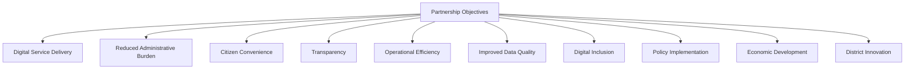

---

# Service Integration Strategy

Arwal's civic integration is described here strategically — what is integrated and why it matters to the citizen and the department — never how it is technically implemented, which remains the domain of `ai-docs/03-system-architecture-principles.md`, `ai-docs/13-api-design-guidelines.md`, and future integration-specific documents.

| Civic Service Category | Integration Strategy |
|---|---|
| **Certificates** | A citizen's certificate request is routed to the issuing department's own configured workflow and approval hierarchy, per `ai-docs/58-business-rules-policies.md`'s RULE-007 — Arwal never issues a certificate on a department's behalf without that department's own explicit, documented approval. |
| **Licenses** | Licensing workflows follow the same department-configured-workflow principle as certificates, respecting whatever inspection, verification, or fee-collection step the issuing authority already requires. |
| **Public Schemes** | Scheme eligibility criteria are sourced directly from the administering department's own published rules, never inferred or approximated by Arwal, per RULE-008's Scheme Eligibility Determination. |
| **Healthcare Programs** | Public health program awareness and eligibility discovery are surfaced to citizens without Arwal ever substituting its own judgment for a clinical or programmatic eligibility decision reserved to the Health Department. |
| **Education Programs** | Scholarship and skill-development program discovery is surfaced with the same eligibility-sourcing discipline as public schemes. |
| **Employment Services** | Government-administered employment and skill-training program awareness is integrated as a discovery and application-routing layer, never a parallel employment-determination authority. |
| **Agriculture Services** | Market-intelligence and scheme data are validated jointly with the Agriculture Department to ensure a farmer never receives Arwal-only, unverified pricing or eligibility information for a government-administered benefit. |
| **Public Notifications** | Government-originated public notifications (a scheme deadline, a public-health advisory) are distributed through Arwal's Notifications capability as an *additional*, never exclusive, channel — a department's own official notification channel is never displaced. |
| **Emergency Services** | Emergency and disaster-management notifications are treated as the highest-priority, always-delivered notification category, coordinated directly with the Disaster Management Authority, never delayed by a routine notification queue. |
| **Digital Payments** | Any government fee collection (a certificate fee, a licensing fee) flows through Arwal's Payments capability under the same settlement-integrity standard — RULE-018's Payment Idempotency Enforcement — applied to every other transaction on the platform. |
| **Citizen Grievances** | A civic grievance is routed to the correct department's own grievance-redress process, per PROC-006, with escalation timing that respects — and where the government agreement allows, tightens — the department's own existing SLA commitment. |

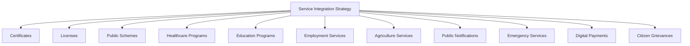

> **Callout — Arwal Never Becomes the Authority It Integrates With**
> In every category above, the underlying government department remains the sole authority over eligibility, approval, and policy — Arwal's role is strictly discovery, routing, tracking, and citizen-facing transparency. A citizen who receives a certificate through Arwal has received it *from the government*, with Arwal as the trusted channel, never the issuing authority.

---

# Digital Governance Strategy

### Digital Transformation

Digital governance, in Arwal's strategy, is not "putting a paper form online" — it is the deliberate redesign of a citizen-service interaction so that its status is always visible, its evidence is always retained, and its outcome is always traceable to a specific, accountable decision, per `ai-docs/58-business-rules-policies.md`'s Business Rule discipline.

### Citizen-Centric Governance

Every digital-governance capability Arwal offers a department is evaluated first against whether it improves the citizen's actual experience of that department's service — never merely whether it improves the department's internal reporting convenience at the citizen's expense.

### Evidence-Based Decision Making

A department partnering with Arwal gains access to structured, auditable data about its own service delivery — completion times, bottleneck stages, citizen drop-off points — enabling decisions grounded in its own observed reality rather than anecdote, per the Analytics capability (CAP-034) already established in `ai-docs/55-business-capability-map.md`.

### Transparency

A citizen using Arwal for a civic service can see, at every stage, what is happening to their request and why — the same transparency principle already established in `ai-docs/56-user-journey-standards.md`'s Trust and Transparency journey principle, extended here as a governance commitment to the partnering department itself.

### Accountability

Every civic decision made through Arwal is traceable to a named officer, a documented reason, and an immutable audit record, per RULE-029's Audit Evidence Sufficiency Standard — accountability is a structural property of the partnership, not a promise resting on goodwill.

### Service Quality

Digital governance is measured by whether a citizen's actual outcome — a certificate received, a grievance resolved — improved, never by whether a dashboard exists. A partnership that produces beautiful reporting without measurable citizen-outcome improvement has not delivered genuine digital governance.

### Public Participation

Where appropriate, Arwal's Community Engagement capability (CAP-044) and Voice of Customer discipline (`ai-docs/60-customer-experience-strategy.md`) are made available to a partnering department as a channel for genuine citizen feedback on its own service quality — never a one-way broadcast channel alone.

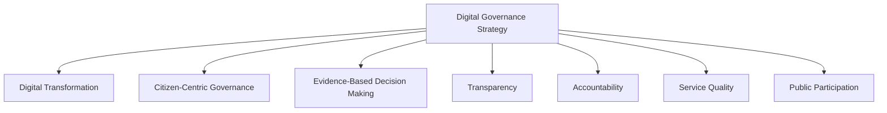

---

# Public-Private Collaboration

Arwal deliberately balances five forces that could otherwise pull a civic-commercial platform apart:

| Force | How Arwal Balances It |
|---|---|
| **Government Priorities** | Honored through department-configured workflows and joint governance (see below) — never overridden by Arwal's own commercial preference. |
| **Citizen Needs** | Held as the ultimate tie-breaker across every other force, per the Citizen First principle above. |
| **Private Innovation** | Arwal's own engineering, AI, and product capability is what makes a civic service *better* than a purely internal government IT project could typically deliver on the same timeline — innovation is offered, never imposed. |
| **Economic Sustainability** | Government Service Partnerships are one revenue stream among several diversified streams, per `ai-docs/62-revenue-sustainability-strategy.md` — never a stream Arwal is financially desperate enough to compromise its principles for. |
| **Operational Independence** | Every civic module retains standalone value even where a specific government integration lapses, per the Operational Independence principle above — Arwal is never held hostage to a single partnership's continuation. |

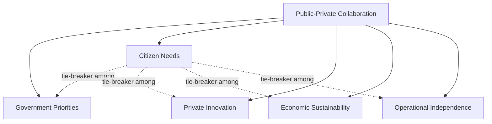

> **Callout — Why Citizen Needs Is the Named Tie-Breaker**
> Whenever a government priority, a commercial consideration, and a citizen's actual need point in different directions, the citizen's need is what Arwal defers to — not because government and commercial interests are unimportant, but because a civic platform that resolves every ambiguity in its own or its partner's favor at the citizen's expense has already broken the trust the entire partnership depends on.

---

# Compliance Strategy

This section states Arwal's high-level compliance posture for government partnerships; the enforceable, technical standard for every item below is owned entirely by `ai-docs/10-security-standards.md`, `ai-docs/12-accessibility-standards.md`, and `ai-docs/40-engineering-compliance-audit-standards.md`, never restated here.

| Compliance Area | Strategic Commitment |
|---|---|
| **Privacy** | Citizen data shared with or derived for a government partner is governed by explicit, per-purpose consent, per RULE-003's Consent Requirement Before Data Use — never a blanket data-sharing arrangement. |
| **Security** | Every civic data flow meets or exceeds the Restricted-tier classification standard already established in `ai-docs/10-security-standards.md`, regardless of the partnering department's own baseline. |
| **Accessibility** | Every civic-facing surface meets the WCAG 2.2 AA floor already established in `ai-docs/12-accessibility-standards.md`, with no exception granted for a government-integration deadline. |
| **Auditability** | Every civic decision produces evidence meeting the Audit Evidence Sufficiency Standard (RULE-029), available to both Arwal's own compliance function and the partnering department's own oversight body. |
| **Regulatory Compliance** | Every partnership is reviewed against applicable data-protection, health-data, and financial-services regulation before launch, per `ai-docs/01-product-goals.md`'s Regulatory Constraint — no module bypasses this review for speed. |
| **Data Governance** | Data ownership, retention, and deletion terms are explicit and documented per partnership, never left to informal understanding. |
| **Record Retention** | Civic records are retained per RULE-025's Data Retention by Classification Tier, honoring whichever of Arwal's or the department's own regulatory retention requirement is longer. |
| **Risk Management** | Every partnership's specific risk profile is logged and reviewed per the Risks section below and `ai-docs/30-engineering-risk-management-standards.md`'s Risk Register. |

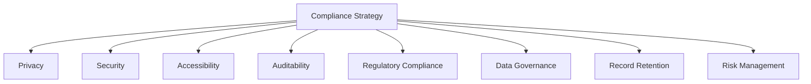

---

# Partnership Lifecycle

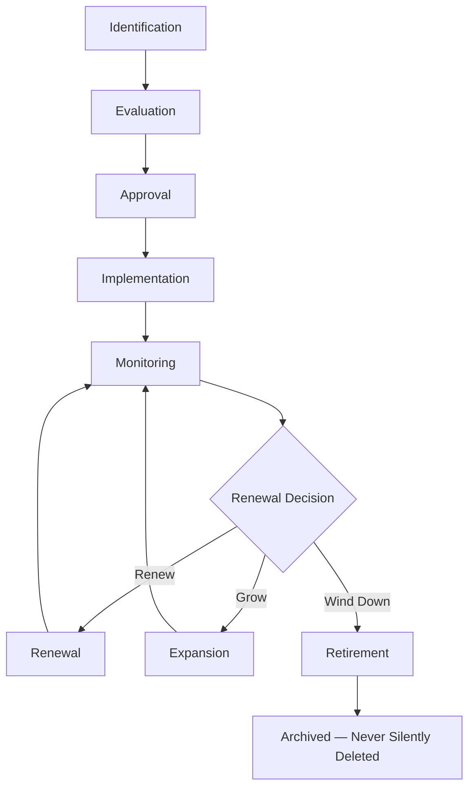

| Stage | Meaning | Exit Criterion |
|---|---|---|
| **Identification** | A department, agency, or civic opportunity is identified — through outreach, a government-initiated inquiry, or district-administration referral. | A named point of contact and a preliminary civic-value hypothesis exist. |
| **Evaluation** | The opportunity is assessed against Partnership Objectives, Compliance Strategy, and the department's own readiness. | A documented evaluation, including a data-classification and regulatory review, is complete. |
| **Approval** | The partnership is formally authorized, per Partnership Governance's Decision Authority below. | A signed-off scope, data-governance terms, and success metrics exist. |
| **Implementation** | The civic workflow is configured, tested, and piloted, per `ai-docs/57-business-process-standards.md`'s PROC-004-family processes. | The workflow is live for a defined pilot population or service scope. |
| **Monitoring** | Ongoing measurement against Partnership Metrics below. | Continuous, for the life of the partnership. |
| **Renewal** | The partnership's term is reaffirmed, typically annually or per the government agreement's own cycle. | A renewal review confirms continued mutual value and compliance. |
| **Expansion** | The partnership's scope grows — more services, more sub-offices, more citizen reach. | A new Evaluation-equivalent review confirms the expanded scope's readiness. |
| **Retirement** | The partnership is wound down — by mutual decision, a policy change, or a department's own withdrawal. | Data-handling obligations are honored per the original agreement; the partnership record is archived, never deleted. |

### New Partnership Criteria

A new government partnership is pursued only where: (1) a genuine, currently-underserved citizen need exists, per `ai-docs/51-stakeholder-analysis.md`'s Underserved and Vulnerable Stakeholder Groups discipline; (2) the partnering institution can name a specific, accountable point of contact; and (3) Arwal's own compliance function confirms the data-sensitivity tier is one it can responsibly support today, never merely "soon."

---

# Partnership Governance

### Ownership

Every government partnership has exactly one named Business Owner (the Head of Government Partnerships, or a delegated regional lead as the district count grows) and one named Government-side accountable contact, mirroring the Clear Ownership discipline already established throughout `ai-docs/53` through `ai-docs/62`.

### Decision Authority

| Decision | Authority |
|---|---|
| New department-level partnership (Operational tier) | Head of Government Partnerships, informing CEO |
| New District Administration-level (Strategic tier) partnership | CEO, with Board awareness |
| Data-sharing terms of any partnership touching Restricted-tier data | CEO + Compliance Officer joint sign-off |
| Partnership renewal (no material term change) | Head of Government Partnerships |
| Partnership expansion (new service category or sub-office scope) | Head of Government Partnerships + Compliance Officer |
| Partnership retirement | CEO, informed by the Government Relations function |
| Emergency civic-service continuity decision (e.g., a lapsed integration during an active citizen-facing process) | CEO or delegate, immediate, ratified at the next Quarterly Government Partnership Review |

### Joint Governance

Every Strategic-tier partnership (District Administration and above) maintains a **joint governance forum** — a standing, scheduled meeting between Arwal's Government Partnerships function and the partnering institution's own designated liaison — reviewing service metrics, citizen feedback, and any escalated issue, per the identical Joint Governance discipline already established for Arwal's own internal Engineering Governance in `ai-docs/29-engineering-governance-decision-authority.md`, applied here across the institutional boundary.

### Escalation

| Issue | First-Level Owner | Escalates To | Final Escalation |
|---|---|---|---|
| A department-level service-quality dispute | Government Partnerships liaison | Head of Government Partnerships | CEO |
| A data-governance or compliance concern | Compliance Officer | CEO | Board |
| A District Administration-level partnership disagreement | Head of Government Partnerships | CEO | Board |
| A citizen-facing civic-service outage tied to a government-side dependency | SRE + Government Partnerships liaison, immediate | CEO | Board, if sustained beyond a defined window |

### Review Cadence

| Review | Cadence | Owner |
|---|---|---|
| Departmental Service Review | Quarterly | Head of Government Partnerships, per-department liaison |
| District Administration Strategic Review | Semi-Annual | CEO, District Administration counterpart |
| Government Partnership Compliance Review | Quarterly | Compliance Officer |
| Annual Government Partnership Strategy Review | Annual | CEO, CSO, CGRO, Board |

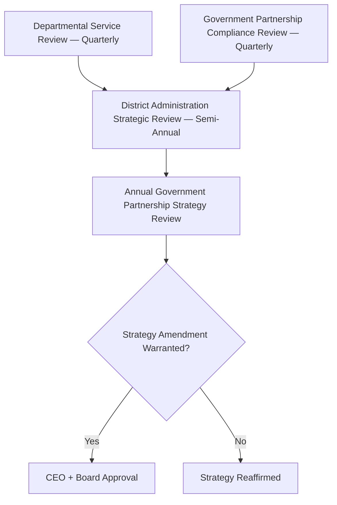

### Continuous Improvement

Every review above feeds a shared, tracked improvement backlog — a recurring citizen complaint pattern, a bottleneck stage identified through Analytics (CAP-034), or a department's own suggested workflow refinement — reviewed and prioritized at the next Departmental Service Review, never left to informally resolve itself.

---

# Risks

| Risk | Description | Mitigation |
|---|---|---|
| **Political Changes** | A change in district or state leadership deprioritizes or reverses a civic partnership. | Partnerships are structured as institutional, not personal, relationships — formal agreements, joint governance forums, and standalone civic value that persists regardless of who holds office, per `ai-docs/00-project-vision.md`'s Government Dependency Risk. |
| **Policy Changes** | A regulatory or administrative policy shift invalidates a workflow assumption. | Civic workflows are configured, never hardcoded, per RULE-006 — a policy change updates a configuration, not a rebuild. |
| **Vendor Dependency** | A department becomes dependent on Arwal without a viable fallback, or Arwal becomes dependent on a single department for civic relevance. | Operational Independence principle above; no civic module requires exclusive government access to retain standalone value. |
| **Data Misuse** | Citizen or departmental data is used beyond its consented, agreed purpose. | RULE-003's Consent Requirement, immutable audit logging (RULE-029), and joint governance review of every data flow. |
| **Compliance Failures** | A partnership's data handling or accessibility falls short of the applicable regulatory floor. | Mandatory pre-launch Compliance Strategy review; Quarterly Government Partnership Compliance Review. |
| **Operational Delays** | A department's own internal readiness (staffing, workflow documentation) lags the partnership's planned timeline. | Phased Implementation stage with an explicit pilot-scope option, never an all-or-nothing launch. |
| **Low Adoption** | Citizens or officers do not actually use the digitized civic channel. | Radical onboarding simplicity, field-agent-assisted onboarding, and Voice of Customer feedback loops per `ai-docs/60-customer-experience-strategy.md`. |
| **Trust Erosion** | A mishandled civic data incident or a broken civic promise damages cross-vertical trust simultaneously. | Transparent incident communication and rapid, accountable remediation, per the Mutual Accountability principle above. |
| **Funding Uncertainty** | A department's own budget cycle disrupts a co-funded initiative. | Diversified revenue per `ai-docs/62-revenue-sustainability-strategy.md` ensures no single government funding stream is existential to Arwal's own continuity. |

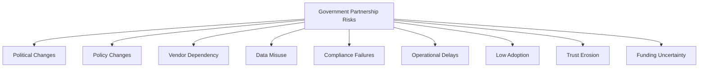

---

# Partnership Metrics

| Metric | Definition | Direction |
|---|---|---|
| **Government Adoption Rate** | Count and share of eligible departments/agencies actively partnered. | Increasing |
| **Department Participation** | Depth of a given department's workflow coverage (how many of its services are digitized). | Increasing |
| **Citizen Usage** | Citizens actively using at least one civic service through Arwal. | Increasing |
| **Service Completion** | % of civic applications completed end-to-end without a physical visit. | Increasing |
| **Processing Time** | Average and p95 time from application submission to decision, per department. | Decreasing |
| **Partner Satisfaction** | Departmental liaison-reported satisfaction, gathered at each Departmental Service Review. | Increasing |
| **Compliance Score** | Composite score from the Quarterly Government Partnership Compliance Review. | Increasing, sustained at target |
| **Trust Score** | The District Trust Signal already established in `ai-docs/50-product-vision-business-strategy.md`, viewed specifically for civic-service interactions. | Increasing |
| **Accessibility Score** | Accessibility Completion Parity for civic journeys, per `ai-docs/56-user-journey-standards.md`. | Approaching parity |
| **Digital Inclusion Index** | A composite measure of civic-service reach across literacy, device, and connectivity segments. | Increasing |

> **Callout — Metrics Are Never Read in Isolation**
> Per the North Star Principle already established in `ai-docs/00-project-vision.md`, a rising Government Adoption Rate alongside a falling Trust Score, or a rising Service Completion rate alongside a rising Compliance-finding count, is treated as a regression — never counted as success on its own.

---

# Anti-Patterns

| Anti-Pattern | Description | Why It's Rejected |
|---|---|---|
| **Political dependency** | A partnership's continuity depends on a specific official remaining in office. | Violates Long-Term Collaboration and Government as a Strategic Partner; collapses at the first administrative transition. |
| **Exclusive government lock-in** | Arwal becomes the only permitted digital channel for a civic service, displacing citizen choice or future competition. | Violates Operational Independence and the Project Vision's rejection of proprietary lock-in mechanisms, applied here to civic exclusivity. |
| **Poor transparency** | Data flows, fee terms, or workflow logic are concealed from a citizen or an oversight body. | Directly violates Transparency and Public Trust. |
| **Weak accountability** | A civic decision cannot be traced to a specific officer, rule, or reason. | Violates Mutual Accountability and RULE-029's Audit Evidence Sufficiency Standard. |
| **Citizen exclusion** | A digitization effort implicitly requires a smartphone, literacy, or connectivity a meaningful population lacks, with no assisted alternative. | Violates Accessibility and Inclusiveness. |
| **Over-centralization** | Every civic decision routes through a single office or individual, creating a single point of failure. | Violates Operational Independence and increases Operational Delay risk. |
| **Ignoring accessibility** | Accessibility is treated as a launch-blocking afterthought rather than a first-principles design constraint. | Violates the Accessibility principle and `ai-docs/12-accessibility-standards.md`'s non-negotiable floor. |
| **Short-term partnerships** | A partnership is scoped only to a single showcase event or a single fiscal year with no renewal discipline. | Violates Long-Term Collaboration and the Civic Sustainability commitment in `ai-docs/00-project-vision.md`. |

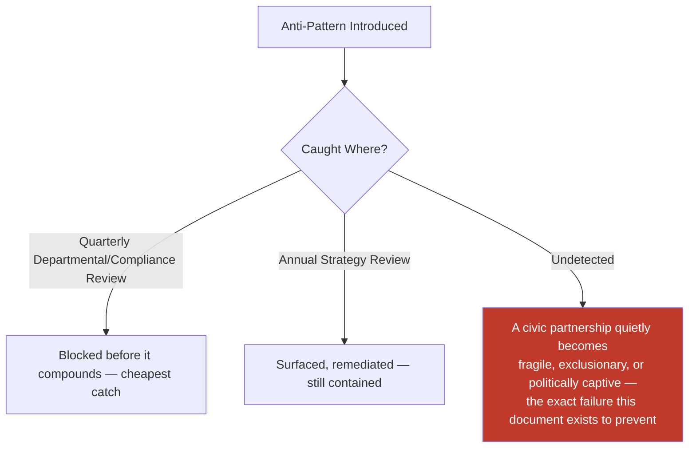

---

# Relationship to Previous Documents

| Prior Document | Relationship |
|---|---|
| **Project Vision (`ai-docs/00`)** | Establishes the founding civic mandate, the Government Dependency Risk, and the Civic Sustainability commitment this document operationalizes into an institutional strategy. |
| **Product Goals (`ai-docs/01`)** | Establishes the Government Coordination Risk and the Regulatory Constraint this document's Compliance Strategy directly extends. |
| **Stakeholder Analysis (`ai-docs/51`)** | Supplies the Government Officials, District Administration, and NGO stakeholder registry every partnership entity in this document traces to. |
| **Business Domain Model (`ai-docs/53`)** | Supplies the Government Services domain ownership this document's institutional relationships are built on top of. |
| **Business Capability Map (`ai-docs/55`)** | Supplies the Government Application Processing, Certificate Issuance, and Scheme Eligibility Assessment capabilities this document's Service Integration Strategy is expressed through. |
| **Business Process Standards (`ai-docs/57`)** | Supplies the precise Government Application Processing, Certificate Approval, and Grievance Resolution processes this document's Service Integration Strategy defers to for execution mechanics. |
| **Business Rules & Policies (`ai-docs/58`)** | Supplies the precise eligibility, approval, and appeal logic (RULE-006 through RULE-009, RULE-028) this document's every civic commitment is bound by. |
| **Customer Experience Strategy (`ai-docs/60`)** | Supplies the felt-experience bar — "Fair and Patient" — every civic partnership's citizen-facing outcome must clear. |
| **Value Proposition Framework (`ai-docs/61`)** | Supplies the "Why a Government Should Adopt Arwal" reasoning this document's Partnership Objectives directly extend. |
| **Revenue & Sustainability Strategy (`ai-docs/62`)** | Supplies the Government Service Partnerships revenue-stream reasoning and the fairness safeguard — never gating a citizen's civic right behind a fee — this document's compliance strategy is bound by. |
| **Business Glossary (`ai-docs/59`)** | Supplies the precise vocabulary (Application, Certificate, Scheme, Grievance, District Officer, State Administrator) this document's every claim is expressed in. |

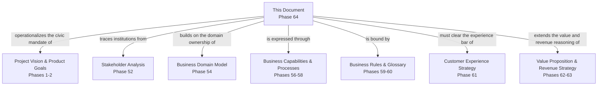

---

# Executive Artifacts

### Government Partnership Framework

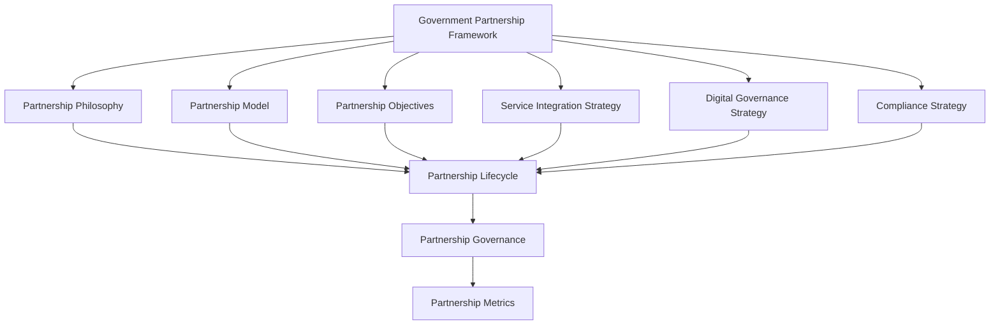

### Partnership Lifecycle

See Partnership Lifecycle section above — reproduced here by reference per Single Source of Truth, never duplicated.

### Governance Model

See Partnership Governance section above.

### Stakeholder Matrix

| Stakeholder Category | Primary Interest | Primary Arwal Contact |
|---|---|---|
| District Collector's Office | District-wide civic outcomes, political accountability | CEO / Head of Government Partnerships |
| Department Secretary/Head | Department-specific service quality and backlog reduction | Head of Government Partnerships |
| District Officer (case-handling) | Manageable, well-evidenced caseload | Civic Ops Lead |
| Panchayat/Block Representative | Village/block-level citizen reach | Head of Community Engagement |
| Citizens | Fast, dignified, trustworthy civic access | CPO / Customer Success |
| Oversight/Audit Bodies | Compliance, transparency, defensibility | Compliance Officer |

### Department Collaboration Model

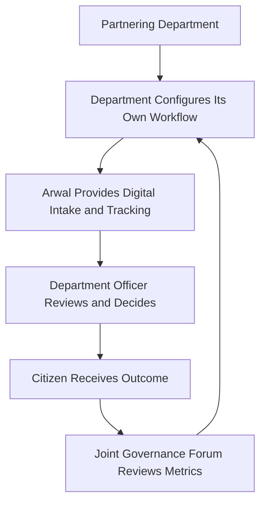

### Decision Matrix

| Decision Type | Approval Authority |
|---|---|
| New Operational-tier department partnership | Head of Government Partnerships |
| New Strategic-tier (District Administration) partnership | CEO, Board informed |
| Data-sharing terms (Restricted-tier data) | CEO + Compliance Officer |
| Partnership renewal | Head of Government Partnerships |
| Partnership expansion | Head of Government Partnerships + Compliance Officer |
| Partnership retirement | CEO |
| Emergency civic-continuity decision | CEO or delegate, ratified at next Quarterly Review |

### Executive Dashboards

| Dashboard | Audience | Key Content |
|---|---|---|
| **CEO Dashboard** | CEO | Government Adoption Rate, District Trust Signal (civic view), Strategic-tier partnership health |
| **CGRO Dashboard** | CGRO | Departmental Participation depth, Partner Satisfaction, escalation log |
| **Compliance Dashboard** | Compliance Officer | Compliance Score, data-governance findings, audit-readiness status |
| **CPO Dashboard** | CPO | Service Completion rate, Accessibility Score, Digital Inclusion Index |
| **Government Partners Dashboard** | Partnering department liaisons | Their own department's processing time, backlog trend, citizen satisfaction |

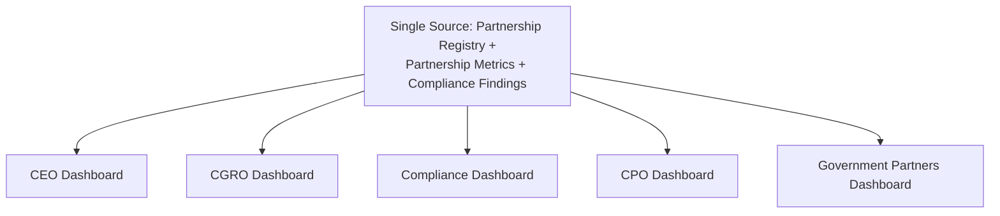

---

# Closing Statement

> **Callout — Closing Statement**
> Every prior document in this handbook explains what Arwal is, how it is built, what it feels like to use, and why it sustains itself financially. This document explains how Arwal earns the right to stand beside a district's own government — not as a vendor renting access, not as a challenger displacing public authority, but as a genuine, accountable, transparent partner whose civic value the next official, the next administration, and the next citizen all have reason to keep choosing. A government partnership built on political favor lasts only as long as the favor does; a government partnership built on demonstrated reliability, honest data governance, and shared, measured outcomes is infrastructure a district can depend on for a generation, exactly as `ai-docs/00-project-vision.md` always intended. Where a future phase must deviate from a principle stated here, that deviation is made explicitly — through the Partnership Governance process above — never silently, and never by default.

This document, `ai-docs/63-government-partnership-strategy.md`, is Phase 64 of approximately 415. Every future civic collaboration, department onboarding, and public-sector negotiation is expected to trace back to a principle defined here, or to justify its deviation in writing.

**End of Phase 64 — `ai-docs/63-government-partnership-strategy.md`**