# District Ecosystem Mapping

**Document:** `ai-docs/64-district-ecosystem-mapping.md`
**Project:** Arwal — The District Super App
**Stage:** 2 — Product & Business Strategy
**Phase:** 65 — District Ecosystem Mapping
**Status:** Approved for Product & Engineering Reference
**Audience:** CEO, CSO, CPO, Chief Ecosystem Officer, Enterprise Business Architects, Government Digital Transformation Consultants, Platform Economists, Public Policy Advisors, Marketplace Strategists, Community Development Specialists, Investors

> **Callout — Purpose of This Document**
> `ai-docs/00-project-vision.md` through `ai-docs/63-government-partnership-strategy.md` established why Arwal exists, what it can do, who it serves, what it feels like to use, how it sustains itself, and how it partners with government. None of those documents answers a question that sits above all of them: **what is the entire living system Arwal operates inside — every participant, institution, dependency, and flow of trust and value across a district — and how does Arwal's health rise or fall with the health of that whole system?** This document is that answer — the authoritative District Ecosystem Mapping every future cross-sector strategy, partnership, and expansion decision traces back to.

---

# Purpose of this Document

### Why an Ecosystem Map Is a Distinct Strategic Layer

Every prior Stage 2 document examines Arwal from the inside out — its domains, capabilities, journeys, rules, experience, revenue, and government relationships. This document examines Arwal from the outside in: not what Arwal *is*, but what Arwal is *embedded within*. A district is not a market Arwal enters — it is a living system of citizens, families, farmers, merchants, hospitals, schools, banks, NGOs, and government departments that already exchange trust, money, and information with or without Arwal's presence. Arwal's success is not measured by how well it performs in isolation; it is measured by how well the *entire district ecosystem* performs once Arwal exists inside it. This document is where that whole-system view becomes an explicit, governed artifact.

### This Is Not Market Research, Implementation, or an Org Chart

This document contains no technical architecture, no API surface, no infrastructure diagram, and no internal reporting structure. It is not a market-sizing study produced once and archived. It is a durable, technology-independent map of participants, relationships, dependencies, and health signals — reviewed continuously, per Ecosystem Governance below, for as long as Arwal operates.

### Why Ecosystem Health Determines Platform Success

Per `ai-docs/61-value-proposition-framework.md`'s Network Effects reasoning, Arwal's value compounds only when citizens, merchants, and government departments simultaneously trust and participate in the same rails. A platform can be technically excellent and commercially disciplined and still fail if the ecosystem around it is unhealthy — if farmers are excluded, if one sector dominates at another's expense, or if government participation stalls. This document exists to make ecosystem health a first-class, measured strategic concern, never an assumed byproduct of good product execution.

### The Chain of Reasoning This Document Extends

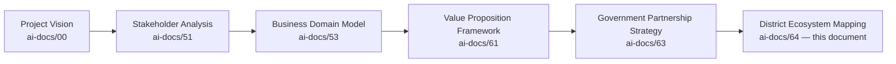

| Layer | Question It Answers |
|---|---|
| Project Vision | Why does a unified civic-commercial platform need to exist? |
| Stakeholder Analysis | Who does Arwal serve, and what does each need? |
| Business Domain Model | Who inside Arwal owns each business concern? |
| Value Proposition Framework | Why should each stakeholder choose Arwal? |
| Government Partnership Strategy | On what terms does Arwal work with government specifically? |
| **District Ecosystem Mapping** (this document) | **What is the whole living system Arwal operates inside, and how does its health depend on every participant's health, not Arwal's alone?** |

### Scope Boundary

This document does not redefine Stakeholders (`ai-docs/51`), Domains (`ai-docs/53`), Capabilities (`ai-docs/55`), or Government Partnership terms (`ai-docs/63`) — each is cited, never restated. It assumes Arwal's eventual path from one district to multiple districts and eventually multiple states, per `ai-docs/50-product-vision-business-strategy.md`'s Strategic Expansion Principles. Its exclusive territory is: **ecosystem participant roles, ecosystem domains, value-exchange flows, ecosystem relationships, ecosystem dependencies, ecosystem health, and district development strategy.**

---

# Ecosystem Philosophy

### Citizen-Centered Ecosystem
**Why it exists:** Every participant in the ecosystem — a bank, a hospital, a government department — ultimately exists in relation to the citizen the ecosystem serves. Where an ecosystem decision would favor an institution over the citizen it is meant to serve, the citizen prevails, mirroring the Citizen-First tie-breaker already established throughout `ai-docs/51` through `ai-docs/63`.

### Open Collaboration
**Why it exists:** A district ecosystem thrives when participants can discover and transact with each other through shared, trusted rails — never when Arwal artificially isolates one sector from another to protect a narrow commercial interest.

### Shared Prosperity
**Why it exists:** An ecosystem where Arwal captures disproportionate value relative to what it creates for merchants, farmers, and providers is an ecosystem that will not sustain participation, per the identical Shared Prosperity principle already established in `ai-docs/62-revenue-sustainability-strategy.md`.

### Mutual Value Creation
**Why it exists:** Every relationship mapped in this document is a two-way exchange — a bank gains transaction reach, a citizen gains settlement trust — never a one-directional extraction disguised as partnership.

### Transparency
**Why it exists:** An ecosystem participant must be able to see how value, data, and trust actually flow through the system they are part of — concealment between ecosystem participants breeds the same corrosive suspicion `ai-docs/60-customer-experience-strategy.md` rejects at the individual-interaction level.

### Inclusiveness
**Why it exists:** An ecosystem map that only accounts for digitally fluent, urban participants has mapped a fraction of the actual district — every domain below explicitly includes its rural, informal, and vulnerable-population participants.

### Accessibility
**Why it exists:** A healthy ecosystem is one a first-generation smartphone user, a low-literacy farmer, and an elderly citizen can all genuinely participate in, per `ai-docs/12-accessibility-standards.md`'s non-negotiable floor extended here to ecosystem-wide participation.

### Local Economic Growth
**Why it exists:** Arwal's presence in a district should be measurably additive to the district's own economy — merchant income, worker income, government efficiency — never merely a redistribution of existing value toward Arwal itself.

### Sustainable Partnerships
**Why it exists:** An ecosystem relationship optimized for a single pilot or a single funding cycle is optimized for the wrong horizon; every relationship in this document is evaluated against multi-year durability, per `ai-docs/00-project-vision.md`'s generational commitment.

### Operational Independence
**Why it exists:** No single ecosystem participant — a bank, a government department, a technology vendor — should hold existential leverage over Arwal's ability to serve the district, mirroring the Operational Independence principle already established in `ai-docs/63-government-partnership-strategy.md`.

### Long-Term Resilience
**Why it exists:** An ecosystem must be able to absorb a shock — an economic downturn, a policy shift, a single participant's withdrawal — without collapsing; resilience is designed in, never assumed.

### Continuous Innovation
**Why it exists:** A district ecosystem's needs evolve — new government schemes, new commerce patterns, new technology — and the ecosystem map itself must be treated as a living artifact that evolves with it, per Ecosystem Governance below.

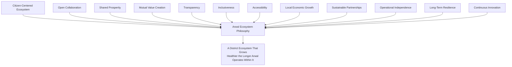

> **Callout — The One-Sentence Ecosystem Philosophy**
> *"Arwal does not own the district's ecosystem — it earns a place inside one that already exists, and its only durable advantage is making every other participant in that system measurably better off for its presence."*

---

# Ecosystem Participants

Every participant below traces to its full Stakeholder (`ai-docs/51`) and, where applicable, Persona (`ai-docs/52`) record; this section states only the participant's ecosystem role.

| Participant | Ecosystem Role |
|---|---|
| **Citizens** | The demand-side anchor of every domain; the population whose trust determines whether the ecosystem functions at all. |
| **Families** | The household unit through which access, device sharing, and delegated participation actually occur. |
| **Farmers** | Primary producers whose market access, price transparency, and scheme awareness anchor the Agriculture domain. |
| **Students** | The demand-side participants in the Education domain, and the district's future workforce and citizenry. |
| **Patients** | The demand-side participants in the Healthcare domain, with the highest-stakes trust requirement in the ecosystem. |
| **Merchants** | Local supply-side commerce participants whose digital presence determines Commerce domain depth. |
| **Retailers** | General goods sellers forming the backbone of everyday district commerce. |
| **Restaurants** | Food-service supply-side participants anchoring the Food Delivery domain. |
| **Grocery Stores** | Household-essentials supply-side participants anchoring the Grocery domain. |
| **Doctors** | Independent healthcare supply-side participants providing direct clinical access. |
| **Hospitals** | Institutional healthcare participants providing multi-practitioner, referral-scale capacity. |
| **Clinics** | Mid-scale healthcare institutions bridging independent doctors and full hospitals. |
| **Schools** | Formal education institutions providing context for student participation, not directly onboarded as Arwal providers. |
| **Colleges** | Higher-education institutions relevant to scholarship and skill-pathway discovery. |
| **Training Institutes** | Vocational and skill-development participants bridging Education and Employment domains. |
| **Employers** | Supply-side participants in the Jobs domain, from small businesses to formal-sector organizations. |
| **Employees** | The district's working population, both formal- and informal-sector. |
| **Delivery Partners** | The fulfillment workforce connecting Commerce, Food, and Grocery supply to citizen demand. |
| **Property Owners** | Supply-side participants in the Property domain. |
| **Service Providers** | Skilled independent workers (tutors, technicians, electricians) providing time-bound expertise. |
| **NGOs** | Trust-building intermediaries extending reach into underserved and vulnerable populations. |
| **Self-Help Groups** | Collective economic participants, especially women-led, requiring group-account patterns. |
| **Banks** | Financial infrastructure participants enabling settlement and, eventually, credit. |
| **Payment Providers** | Transaction-processing infrastructure participants underlying every monetary flow. |
| **Government Departments** | Civic-service authorities whose workflows Arwal digitizes without displacing their authority. |
| **District Administration** | The anchor civic institution sponsoring cross-department partnership. |
| **Police** | A narrow, safety-scoped civic participant relevant to verification-adjacent and public-safety coordination. |
| **Disaster Management Authority** | The highest-priority civic participant for emergency notification and resource-availability coordination. |
| **Utility Providers** | Infrastructure participants (electricity, water, telecom) whose reliability indirectly bounds Arwal's own reach. |
| **Technology Partners** | Infrastructure and AI-model suppliers enabling Arwal's own technical capability, per `ai-docs/09-tech-stack.md`. |
| **Future Ecosystem Participants** | Entities not yet active — a second district's institutions, a state-level department, a future open-API developer — tracked for readiness, never assumed. |

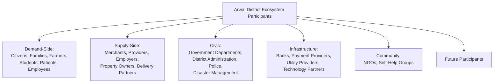

---

# Ecosystem Domains

| Domain | What It Encompasses |
|---|---|
| **Government** | Civic-service delivery, regulation, and public administration across every department tier. |
| **Commerce** | Retail, wholesale, and classifieds exchange between merchants and citizens. |
| **Agriculture** | Production, market intelligence, scheme access, and direct-to-buyer sale for farmers. |
| **Healthcare** | Discovery, booking, and delivery of clinical and pharmacy services. |
| **Education** | Discovery of tutors, institutions, scholarships, and skill-development pathways. |
| **Employment** | Formal- and informal-sector job and gig matching. |
| **Housing** | Property sale, rental, and tenancy discovery. |
| **Transport** | Delivery logistics and, indirectly, citizen mobility infrastructure. |
| **Financial Services** | Payments, settlement, and eventually credit and micro-lending. |
| **Community** | Collective economic and social participation via NGOs, SHGs, and cooperatives. |
| **Media** | Local information distribution, indirectly relevant to civic-notification reach. |
| **Public Safety** | Emergency response, disaster management, and safety-relevant coordination. |
| **Environment** | Indirectly relevant through agriculture (weather, sustainability) and logistics (routing efficiency). |
| **Digital Infrastructure** | Connectivity, device access, and the technical foundation every domain above depends on. |

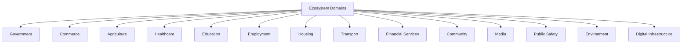

> **Callout — Ecosystem Domains Are Not Business Domains**
> `ai-docs/53-business-domain-model.md`'s Business Domains (DOM-001 through DOM-020) describe what Arwal *owns and builds*. Ecosystem Domains above describe the *external sectors of district life* Arwal's Business Domains operate within — several Ecosystem Domains (Media, Environment, Transport-as-mobility) have no directly corresponding Business Domain today, precisely because they are part of the ecosystem Arwal must understand even where it does not yet build directly for them.

---

# Value Exchange Model

| Question | Answer |
|---|---|
| **Who creates value?** | Every supply-side participant (merchants, providers, farmers, government departments) whose goods, services, or civic authority a citizen genuinely needs. |
| **Who consumes value?** | Every demand-side participant (citizens, families, students, patients) whose needs are met more completely, more fairly, or more conveniently than their pre-Arwal alternative. |
| **Who enables value?** | Infrastructure participants (banks, payment providers, technology partners, utility providers) whose reliability makes the exchange possible at all. |
| **Who governs value?** | Government departments and Arwal itself jointly, ensuring the exchange remains lawful, fair, and auditable, per `ai-docs/58-business-rules-policies.md`. |

### How Trust Flows

Trust originates in Identity Verification (CAP-001) and Reputation (GLOSS-063), and flows outward from a citizen's or provider's verified status into every transaction they participate in — a citizen who trusts one verified doctor is more willing to trust the platform's verification standard generally, compounding trust across the ecosystem rather than resetting it per interaction.

### How Information Flows

Information flows through Search (CAP-030), Notifications (CAP-031), and AI Assistance (CAP-033) — always consented, per RULE-003 — from a data-producing participant (a government scheme catalog, a mandi price feed) to every citizen who needs it, without requiring the citizen to already know which institution holds that information.

### How Economic Value Flows

Economic value flows through Payment Processing (CAP-027) from a citizen or government payer to a merchant, provider, or delivery partner, with Arwal capturing a fair, disclosed share per `ai-docs/62-revenue-sustainability-strategy.md`'s Revenue Streams — value flow is never one-directional extraction; every flow has a reciprocal benefit.

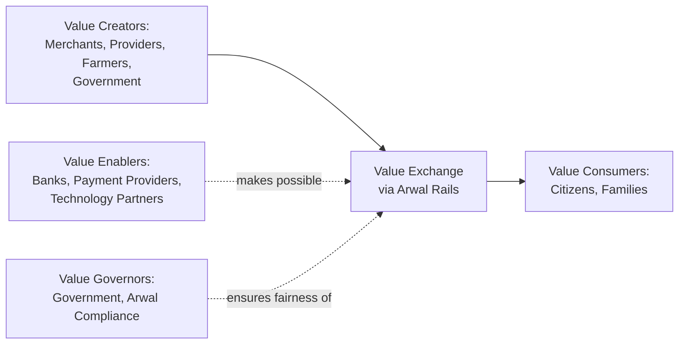

---

# Ecosystem Relationships

| Relationship | Nature of the Exchange |
|---|---|
| **Government ↔ Citizens** | Civic authority and service delivery, in exchange for compliance, participation, and civic trust. |
| **Businesses ↔ Customers** | Goods and services, in exchange for revenue and reputation. |
| **Schools ↔ Students** | Formal education context feeding scholarship and skill-pathway discovery. |
| **Hospitals ↔ Patients** | Clinical care and institutional trust, in exchange for verified referral volume. |
| **Farmers ↔ Markets** | Produce supply, in exchange for fair, transparent pricing. |
| **Employers ↔ Workers** | Employment opportunity, in exchange for labor and skill. |
| **Banks ↔ Citizens** | Settlement infrastructure and, eventually, credit, in exchange for transaction volume and deposit relationships. |
| **NGOs ↔ Communities** | Advocacy and field trust, in exchange for amplified beneficiary reach through Arwal's distribution. |
| **Technology Partners ↔ Platform** | Infrastructure and AI capability, in exchange for a sustained commercial relationship. |

### Cross-Domain Collaboration

A single citizen journey routinely crosses multiple Ecosystem Domains simultaneously — a farmer's scheme application (Government + Agriculture), a student's scholarship search (Education + Government), a patient's paid appointment (Healthcare + Financial Services). Arwal's structural advantage, per `ai-docs/61-value-proposition-framework.md`, is that these domains share one identity and trust layer rather than requiring the citizen to reconcile five disconnected relationships themselves.

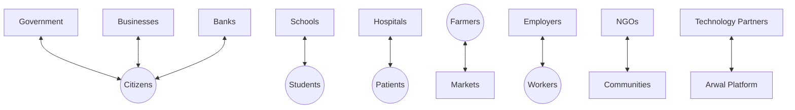

---

# Ecosystem Dependencies

| Dependency Type | Description |
|---|---|
| **Critical Dependencies** | A dependency whose failure directly halts a citizen-critical flow — Identity Verification, Payment Processing, government workflow configuration. |
| **Shared Infrastructure** | Digital connectivity, device access, and electricity — outside Arwal's direct control but a precondition for every domain's participation. |
| **Shared Trust** | The single Reputation and Identity layer every domain draws from — a trust failure in one domain (a fraud incident) risks the ecosystem's trust in every other domain simultaneously. |
| **Shared Identity** | One citizen identity underlying every relationship above — its integrity is the ecosystem's single most load-bearing dependency. |
| **Shared Governance** | Business Rules (`ai-docs/58`) and Compliance (`ai-docs/40`) applied consistently across every domain, preventing one domain's laxity from undermining another's rigor. |
| **Operational Dependencies** | Field agents, support staff, and verification operators whose capacity bounds how fast the ecosystem can onboard new participants. |
| **Risk Dependencies** | A single vendor, a single government sponsor, or a single funding source whose disruption threatens multiple ecosystem relationships simultaneously. |

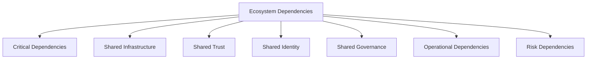

---

# Ecosystem Health

A healthy ecosystem exhibits every characteristic below simultaneously — a strong signal on one dimension never compensates for a weak signal on another, mirroring the North Star Principle already established throughout `ai-docs/00` through `ai-docs/63`.

| Characteristic | What It Looks Like |
|---|---|
| **High Trust** | A rising District Trust Signal (`ai-docs/50`), sustained across every domain, not concentrated in one. |
| **Strong Participation** | Growing, sustained engagement from citizens, merchants, providers, and government departments alike. |
| **Balanced Incentives** | No single participant category capturing disproportionate value at another's expense, per Shared Prosperity above. |
| **Accessibility** | Rural, low-literacy, and vulnerable participants engaging at a rate approaching parity with digitally fluent urban participants. |
| **Economic Growth** | Measurable merchant, provider, and worker income improvement attributable to ecosystem participation. |
| **Digital Inclusion** | A widening, not narrowing, share of the district population meaningfully served. |
| **Collaboration** | Cross-domain journeys (a scheme-linked application, a paid appointment) completing smoothly without the citizen bearing the coordination cost. |
| **Resilience** | The ecosystem absorbing a shock — a vendor outage, a policy change — without a citizen-facing collapse. |
| **Innovation** | New capability (AI assistance, new scheme integrations) genuinely improving ecosystem outcomes, not merely adding complexity. |

---

# District Development Strategy

| Development Area | Arwal's Contribution |
|---|---|
| **Economic Growth** | Digital storefronts and fair market access for merchants and farmers, per `ai-docs/62`'s Economic Flywheel. |
| **Digital Governance** | Auditable, transparent civic-service delivery reducing backlog and physical-queue burden. |
| **Employment** | Fraud-screened, hyperlocal job and gig matching reaching informal-sector workers national platforms ignore. |
| **Agriculture Modernization** | Real-time price transparency, weather resilience, and scheme access reducing middleman exploitation. |
| **Healthcare Access** | Verified provider discovery and appointment certainty, reducing time-to-care in an underserved district. |
| **Education** | Local, rated tutor and scholarship discovery replacing generic national content. |
| **Community Engagement** | Group-account patterns and field-agent support extending reach to collectively organized populations. |
| **Disaster Resilience** | Always-delivered, highest-priority emergency notification coordination with the Disaster Management Authority. |
| **Financial Inclusion** | Verification-tiered wallet access bringing citizens without formal banking relationships into digital payments. |
| **Entrepreneurship** | Radically simple merchant onboarding lowering the barrier to starting or digitizing a local business. |

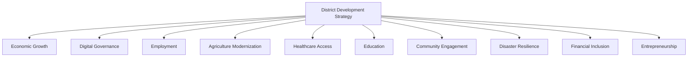

---

# Ecosystem Governance

### Ownership
Ecosystem strategy is jointly owned by the CEO and CSO, with a named Chief Ecosystem Officer role (or delegated equivalent) accountable for the health of the ecosystem as a whole, distinct from any single domain's Business Owner, mirroring the Clear Ownership discipline already established throughout `ai-docs/53` through `ai-docs/63`.

### Decision Authority

| Decision | Authority |
|---|---|
| New ecosystem-domain engagement (e.g., entering Media or Environment) | CEO + CSO, informing the Board |
| Cross-sector partnership terms | CSO + relevant vertical Head |
| Ecosystem health emergency response (e.g., a trust-erosion event) | CEO, immediate, ratified at next Quarterly Ecosystem Review |
| Annual ecosystem strategy amendment | CEO + CSO + CPO |

### Cross-Sector Coordination
A standing, cross-functional Ecosystem Council — drawing representation from Government Partnerships, Merchant Success, Trust & Safety, and Community Engagement — meets quarterly to review participation trends, dependency risk, and collaboration health across every domain, mirroring the Joint Governance discipline already established in `ai-docs/63-government-partnership-strategy.md`.

### Review Cadence

| Review | Cadence | Owner |
|---|---|---|
| Quarterly Ecosystem Health Review | Quarterly | CSO, Ecosystem Council |
| Annual District Development Review | Annual | CEO, CSO, CPO, Board |
| Ecosystem Risk Review | Quarterly | CSO, Compliance Officer |

### Conflict Resolution
A conflict between two ecosystem participants (a merchant dispute, a cross-domain data disagreement) escalates through the identical Escalation Paths already established in `ai-docs/51-stakeholder-analysis.md`, never resolved informally outside a documented path.

### Continuous Improvement
Every Ecosystem Health finding feeds a shared, tracked improvement backlog, reviewed at the next Quarterly Ecosystem Health Review, per the identical Continuous Improvement Loop already established in `ai-docs/60-customer-experience-strategy.md`.

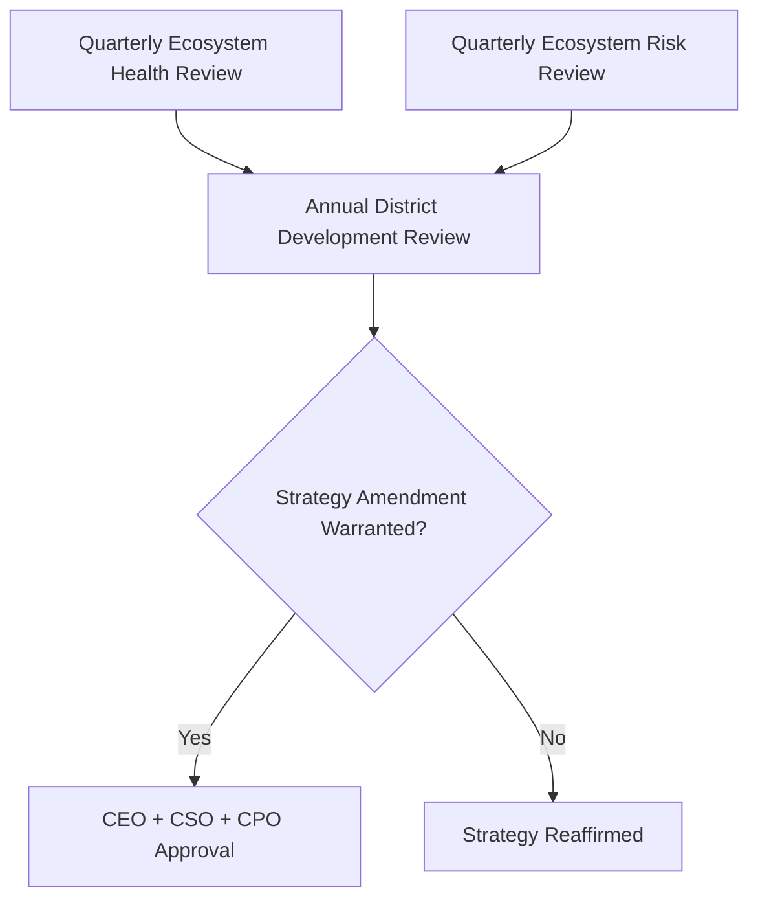

---

# Ecosystem Risks

| Risk | Description | Mitigation |
|---|---|---|
| **Participant Imbalance** | One sector (e.g., large merchants) dominates at the expense of smaller or rural participants. | Balanced Incentives monitoring per Ecosystem Health above; fee fairness benchmarking per `ai-docs/62`. |
| **Low Adoption** | A domain or participant category fails to reach sustainable engagement. | Radical onboarding simplicity and field-agent support, per `ai-docs/01-product-goals.md`. |
| **Monopolization** | Arwal's own dominance discourages fair competition or extracts beyond fair value. | Platform Neutrality and Shared Prosperity principles per `ai-docs/62-revenue-sustainability-strategy.md`. |
| **Digital Exclusion** | Rural, low-literacy, or low-income participants are structurally left behind. | Accessibility-first design per `ai-docs/12-accessibility-standards.md`; Digital Inclusion Index tracking below. |
| **Trust Erosion** | A single domain's failure (a fraud incident, a data breach) damages ecosystem-wide trust. | Shared Trust dependency monitoring; transparent incident response per `ai-docs/58`. |
| **Economic Inequality** | Ecosystem participation widens, rather than narrows, existing district economic disparity. | Economic Impact metrics reviewed jointly with Inclusion metrics, never in isolation. |
| **Policy Changes** | A regulatory or administrative shift disrupts a domain's integration assumption. | Configurable, department-owned workflows per `ai-docs/58`'s RULE-006. |
| **Infrastructure Failures** | Connectivity, power, or third-party payment-rail outages disrupt ecosystem function. | Offline-first design and provider-agnostic infrastructure per `ai-docs/09-tech-stack.md`. |
| **Fragmentation** | Domains operate as silos rather than a coherent, cross-referenced system. | Cross-Domain Governance discipline per `ai-docs/53-business-domain-model.md`. |
| **Dependency Concentration** | Over-reliance on a single vendor, bank, or government sponsor. | Diversification per `ai-docs/62`'s Risk Management and `ai-docs/09`'s Vendor Lock-In Considerations. |

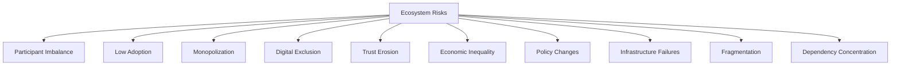

---

# Ecosystem Metrics

| Metric | Definition | Direction |
|---|---|---|
| **Citizen Participation** | MAU as % of district population, per `ai-docs/50`. | Increasing |
| **Merchant Participation** | Verified, active merchant count and retention. | Increasing |
| **Government Participation** | Count of departments/services digitally integrated, per `ai-docs/63`. | Increasing |
| **Cross-Domain Collaboration** | Share of citizen journeys spanning more than one Ecosystem Domain. | Increasing |
| **Digital Inclusion** | Participation parity across literacy, device, and connectivity segments. | Approaching parity |
| **Trust Index** | The District Trust Signal, viewed ecosystem-wide. | Increasing |
| **Economic Activity** | Aggregate GMV/GSV with healthy contribution margin, per `ai-docs/62`. | Increasing |
| **Service Availability** | % uptime and completion rate for core citizen-critical flows. | Increasing |
| **Platform Adoption** | Cross-Vertical Adoption Depth, per `ai-docs/50`. | Increasing |
| **Innovation Index** | Rate of new capability genuinely improving ecosystem outcomes, per `ai-docs/48`'s Strategic Metrics. | Increasing |
| **District Development Index** | A composite measure across the District Development Strategy's ten areas. | Increasing |

> **Callout — No Ecosystem Metric Stands Alone**
> A rising Economic Activity metric alongside a falling Trust Index, or a rising Platform Adoption number alongside declining Digital Inclusion, is treated as a regression — never counted as success in isolation, per the North Star Principle established in `ai-docs/00-project-vision.md`.

---

# Anti-Patterns

| Anti-Pattern | Why It's Rejected |
|---|---|
| **Closed ecosystem** | Restricting participant discovery or interoperability to protect Arwal's narrow commercial interest violates Open Collaboration. |
| **Vendor lock-in** | Trapping a participant into Arwal-only relationships contradicts the Project Vision's rejection of proprietary lock-in. |
| **Department silos** | Government departments operating with no cross-department consistency undermines Shared Governance. |
| **Single-sector dominance** | One domain (e.g., Commerce) crowding out investment in another (e.g., Agriculture) violates Balanced Incentives. |
| **Ignoring rural communities** | Directly contradicts Inclusiveness and the founding Inclusion over Optimization pillar. |
| **Ignoring accessibility** | Treats WCAG compliance as a checkbox rather than an ecosystem-wide participation floor. |
| **Fragmented services** | Domains that do not share identity or trust recreate the very fragmentation Arwal exists to solve. |
| **Short-term optimization** | Optimizing this quarter's Economic Activity at the expense of long-term Trust Index is rejected per Sustainable Partnerships. |
| **Growth without trust** | A rising Citizen Participation number alongside a falling Trust Index is a regression, never a win. |

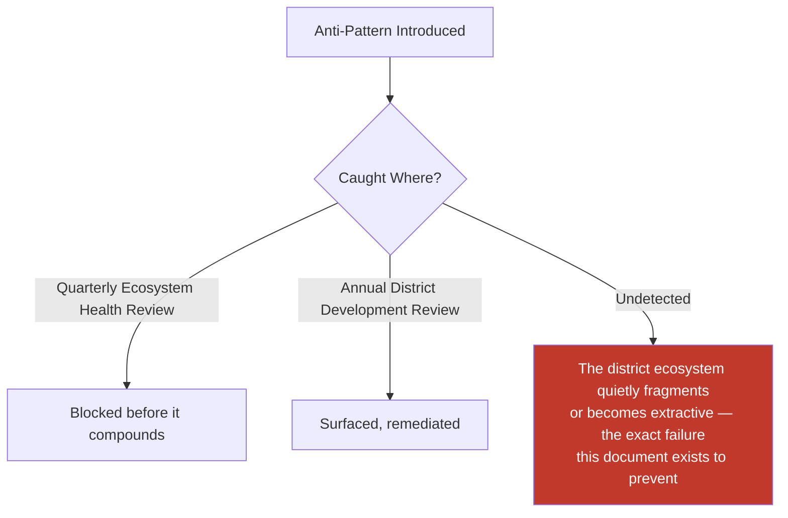

---

# Relationship to Previous Documents

| Prior Document | Relationship |
|---|---|
| **Project Vision (`ai-docs/00`)** | Establishes the founding fragmentation problem this document maps the whole-system solution around. |
| **Stakeholder Analysis (`ai-docs/51`)** | Supplies the stakeholder registry every Ecosystem Participant traces to. |
| **Business Domain Model (`ai-docs/53`)** | Supplies the internal domain ownership this document's external Ecosystem Domains operate alongside. |
| **Business Capability Map (`ai-docs/55`)** | Supplies the stable capabilities the Value Exchange Model's flows are expressed through. |
| **Customer Experience Strategy (`ai-docs/60`)** | Supplies the felt-trust bar every ecosystem relationship must sustain. |
| **Value Proposition Framework (`ai-docs/61`)** | Supplies the Network Effects and Stakeholder Value reasoning this document's Value Exchange Model extends system-wide. |
| **Revenue & Sustainability Strategy (`ai-docs/62`)** | Supplies the Shared Prosperity and fairness safeguards this document's ecosystem economics are bound by. |
| **Government Partnership Strategy (`ai-docs/63`)** | Supplies the institutional government relationship this document situates within the broader ecosystem. |
| **Business Glossary (`ai-docs/59`)** | Supplies the precise vocabulary this document's every claim is expressed in. |

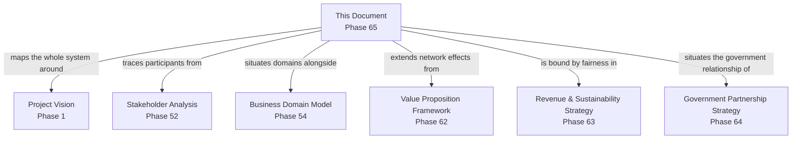

---

# Executive Artifacts

### District Ecosystem Map

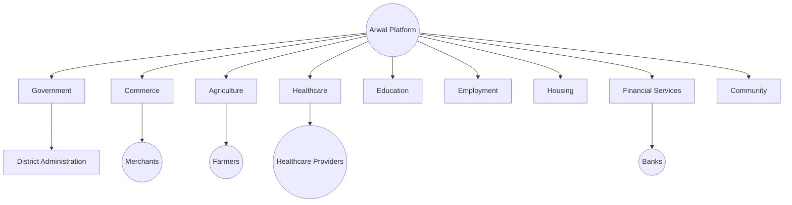

### Stakeholder Network

See Ecosystem Participants and Ecosystem Relationships sections above — reproduced here by reference per Single Source of Truth, never duplicated.

### Value Exchange Diagram

See Value Exchange Model section above.

### Ecosystem Dependency Model

See Ecosystem Dependencies section above.

### Collaboration Matrix

| Domain Pair | Collaboration Pattern |
|---|---|
| Government + Agriculture | Scheme eligibility and subsidy administration |
| Government + Education | Scholarship administration |
| Healthcare + Financial Services | Paid appointment settlement |
| Commerce + Transport | Fulfillment and delivery coordination |
| Community + Commerce | Group-listing and collective economic participation |
| Government + Public Safety | Emergency notification distribution |

### Governance Model

See Ecosystem Governance section above.

### Executive Dashboards

| Dashboard | Audience | Key Content |
|---|---|---|
| **CEO Dashboard** | CEO | District Development Index, Trust Index, Participant Imbalance signals |
| **CSO Dashboard** | CSO | Cross-Domain Collaboration rate, Ecosystem Risk summary |
| **CPO Dashboard** | CPO | Digital Inclusion, Platform Adoption |
| **Government Partners Dashboard** | Government Technical Partners | Government Participation, Service Availability |

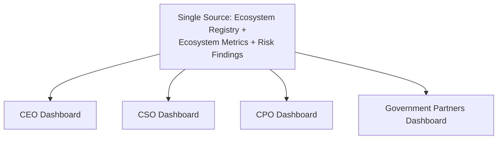

### Decision Matrix

| Decision Type | Approval Authority |
|---|---|
| New ecosystem-domain engagement | CEO + CSO |
| Cross-sector partnership terms | CSO + relevant vertical Head |
| Ecosystem health emergency response | CEO, ratified at next Quarterly Review |
| Annual ecosystem strategy amendment | CEO + CSO + CPO |

---

# Closing Statement

> **Callout — Closing Statement**
> Every prior document in this handbook explains Arwal from the inside — what it builds, how it decides, how it sustains itself. This document explains Arwal from the outside: the living district it operates inside, made of citizens, farmers, merchants, hospitals, schools, banks, NGOs, and government departments who were exchanging trust and value with each other long before Arwal existed, and who will continue to need each other long after any single feature Arwal ships is forgotten. Arwal's only durable advantage is not owning this ecosystem — it is making every participant inside it measurably better off, more connected, and more able to trust one another because Arwal exists. A platform that grows while its ecosystem grows sicker has not succeeded; it has merely delayed the reckoning. Where a future phase must deviate from a principle stated here, that deviation is made explicitly — through the Ecosystem Governance process above — never silently, and never by default.

This document, `ai-docs/64-district-ecosystem-mapping.md`, is Phase 65 of approximately 415. Every future cross-sector strategy, partnership, and expansion decision is expected to trace back to a principle defined here, or to justify its deviation in writing.

**End of Phase 65 — `ai-docs/64-district-ecosystem-mapping.md`**