# Marketplace Strategy

**Document:** `ai-docs/65-marketplace-strategy.md`
**Project:** Arwal — The District Super App
**Stage:** 2 — Product & Business Strategy
**Phase:** 66 — Marketplace Strategy
**Status:** Approved for Product & Engineering Reference
**Audience:** CEO, CSO, CPO, Chief Marketplace Officer, Marketplace Economists, Enterprise Business Architects, Trust & Safety Strategists, Government Digital Transformation Partners, Investors, Product Managers

> **Callout — Purpose of This Document**
> `ai-docs/00-project-vision.md` through `ai-docs/64-district-ecosystem-mapping.md` established why Arwal exists, what it can do, who it serves, what it feels like to use, how it sustains itself, how it partners with government, and the whole living district ecosystem it operates inside. None of those documents answers the specific question a marketplace economist, a merchant, or an investor asks first: **how does Arwal actually make a two-sided (and often many-sided) market work — reliably, fairly, and durably — so that a buyer always finds a seller worth trusting, and a seller always finds a buyer worth serving?** This document is that answer — the authoritative Marketplace Strategy every future commerce, discovery, trust, and liquidity decision traces back to.

---

# Purpose of this Document

### Why a Marketplace Requires Its Own Strategic Layer

`ai-docs/53-business-domain-model.md` established that Commerce Marketplace is a Core Domain. `ai-docs/55-business-capability-map.md` established the stable abilities — Catalog Management, Order Management, Search — that domain realizes. `ai-docs/61-value-proposition-framework.md` established why a merchant or citizen should choose to participate at all. None of those documents answers the question a marketplace, specifically, must answer that a simple product catalog does not: **how does Arwal solve the cold-start problem, prevent one side of the market from exploiting the other, keep discovery fair as it scales, and turn a collection of individual transactions into a self-reinforcing, liquid market?** A marketplace is not merely a place transactions happen — it is a designed economic system with its own physics: network effects, liquidity, trust compounding, and the constant risk of one side capturing value at the other's expense. This document is where that system is reasoned about explicitly, on its own terms, independent of any single vertical's implementation.

### Why This Is Not an Implementation Document

This document contains no APIs, no ranking algorithms, no logistics routing logic, and no database schema. It does not redefine Modules (`ai-docs/54`), Capabilities (`ai-docs/55`), Journeys (`ai-docs/56`), Processes (`ai-docs/57`), or Rules (`ai-docs/58`) — each is cited, never restated. This document's exclusive territory is: **marketplace identity, participant model, category strategy, value creation, network effects, discovery strategy, trust and safety strategy, transaction strategy, governance, risk, and marketplace health** — the durable economic reasoning every commerce-adjacent capability in this handbook is already, implicitly, built to serve.

### Why Local Marketplaces Outperform Disconnected Local Commerce

A district's commerce today is a collection of individually excellent but mutually invisible relationships — a citizen knows their own shopkeeper, their own electrician, their own tutor, but has no reliable way to discover a *better* or *nearer* alternative when their usual choice is unavailable, overpriced, or simply unknown to them. A marketplace does not create commerce that did not exist; it makes existing commerce **discoverable, comparable, and accountable** — converting a fragmented set of word-of-mouth relationships into a searchable, trust-verified, dispute-protected system that benefits every participant simultaneously. This is the entire economic argument for Arwal's Commerce Marketplace domain, made explicit.

### How Trust Creates Liquidity, and Liquidity Creates Sustainable Growth

A marketplace with few buyers is not worth a seller's time to join; a marketplace with few sellers is not worth a buyer's time to open. This is the cold-start problem every marketplace must solve, and trust is the mechanism that solves it: a citizen who trusts Arwal's verification and dispute-resolution system will try an unfamiliar seller they would never have risked otherwise, and a seller who trusts Arwal's fair-ranking commitment will invest in their storefront rather than hedge across five uncertain platforms. Trust converts a hesitant, low-volume market into a **liquid** one — where a buyer's search reliably returns a seller, and a seller's listing reliably reaches a buyer — and liquidity is what makes growth self-sustaining rather than a subsidized, unsustainable illusion.

### How Marketplaces Strengthen District Economies

Per `ai-docs/64-district-ecosystem-mapping.md`'s District Development Strategy, a healthy marketplace does not merely move existing spend onto a screen — it expands the addressable market for every local seller by making them discoverable beyond their immediate physical footprint, and it expands the addressable supply for every buyer by making the district's full commercial depth visible instead of only what happens to be nearby or already known. This is measurable, durable local economic growth, not a redistribution of a fixed pie.

### Relationship Between Citizens, Buyers, Sellers, and the Wider Ecosystem

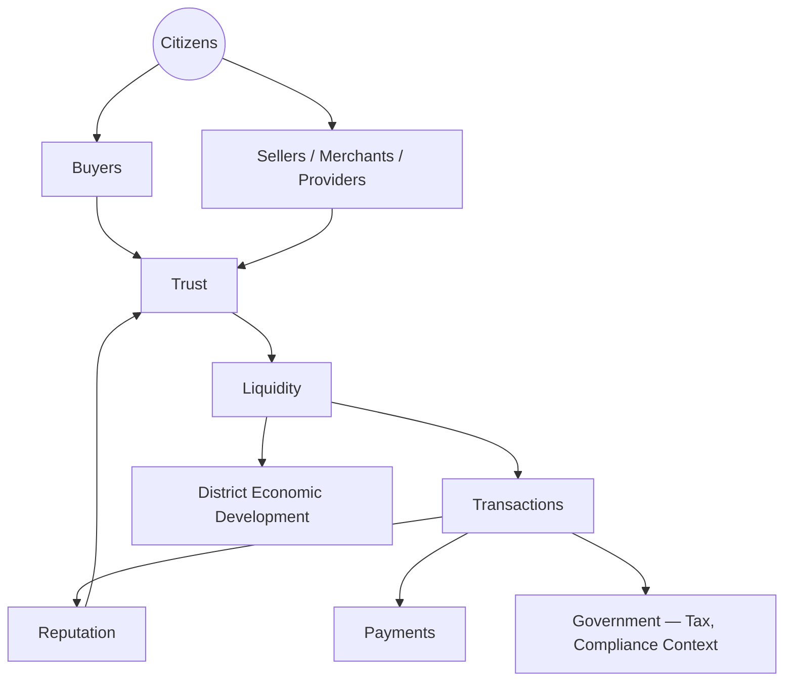

A citizen is simultaneously, at different moments, a Buyer and — via Merchant, Service Provider, or Farmer roles — a Seller. Every transaction between them is mediated by Trust, produces Reputation that feeds back into future Trust, and moves through Payments under the same integrity standard governing every other transaction on the platform, per `ai-docs/58-business-rules-policies.md`'s RULE-018.

---

# Marketplace Philosophy

Every principle below exists because a marketplace designed carelessly does not fail abstractly — it fails a specific buyer who was deceived, or a specific seller who was structurally disadvantaged, in a way that erodes the trust every other participant's participation depends on.

### Citizen First
**Why it exists:** Every marketplace decision is judged first by whether it serves the citizen transacting — as buyer or seller — never by whether it maximizes a short-term platform metric, mirroring the identical Citizen-First tie-breaker already established throughout `ai-docs/51` through `ai-docs/64`.

### Trust Before Transactions
**Why it exists:** A transaction a buyer regrets, even once, costs Arwal more in future hesitation than the commission on that single sale was ever worth. Trust is the precondition every transaction is built on, never a variable traded against transaction volume.

### Fair Competition
**Why it exists:** A marketplace where an established seller can use market power to unfairly suppress a new entrant has stopped being a marketplace and become a gatekeeper. Every seller — new or established, large or small — competes on the same, disclosed rules.

### Open Marketplace
**Why it exists:** A marketplace that arbitrarily excludes a legitimate category of seller (a small SHG-linked producer, an informal-sector service provider) has narrowed its own liquidity and betrayed the Economic Inclusion commitment already established in `ai-docs/62-revenue-sustainability-strategy.md`.

### Transparency
**Why it exists:** A buyer must be able to see why a result ranked where it did, and a seller must be able to see why their listing performed as it did — a marketplace whose ranking logic requires concealment to remain acceptable has already lost the trust it depends on, per `ai-docs/60-customer-experience-strategy.md`'s Transparency pillar.

### Merchant Success
**Why it exists:** A marketplace succeeds only if its sellers succeed — a platform that treats merchant income as incidental to its own commission revenue has inverted the actual causal relationship between the two, per `ai-docs/62`'s Shared Prosperity principle.

### Consumer Protection
**Why it exists:** A buyer entering an unfamiliar transaction with an unfamiliar seller is inherently more vulnerable than the seller in that moment; consumer protection — verified sellers, dispute resolution, refund rights — is what makes a buyer willing to take that risk at all.

### Accessibility
**Why it exists:** A marketplace only a digitally fluent, literate, urban citizen can use has captured a fraction of the market Arwal's mission commits it to serving, per `ai-docs/12-accessibility-standards.md`'s non-negotiable floor.

### Local Economic Growth
**Why it exists:** Arwal's marketplace exists to grow the district's own commercial base, never merely to intermediate spend that would have happened anyway — every strategic choice is evaluated against whether it expands genuine local economic activity.

### Marketplace Neutrality
**Why it exists:** Arwal's own ranking judgment and any paid promotion are always distinguishable to a buyer, per `ai-docs/51-stakeholder-analysis.md`'s Conflict-of-Interest Governance — a marketplace that quietly favors a paying seller over a better-matched free one has sold its own credibility.

### Long-Term Sustainability
**Why it exists:** A marketplace optimized for this quarter's GMV at the cost of next year's seller retention is optimized for the wrong horizon, per `ai-docs/62-revenue-sustainability-strategy.md`'s Long-Term Sustainability principle applied here specifically to commerce dynamics.

### Continuous Innovation
**Why it exists:** Buyer expectations, seller needs, and fraud patterns all evolve — a marketplace strategy fixed at launch and never revisited decays, mirroring the Continuous Improvement discipline already established throughout this handbook.

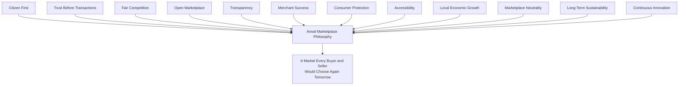

> **Callout — The One-Sentence Marketplace Philosophy**
> *"A marketplace is not the transactions it processes — it is the trust that made a stranger willing to transact with another stranger at all, and every design choice either grows that trust or spends it."*

---

# Marketplace Model

Every participant below traces to its full Persona (`ai-docs/52`) and Stakeholder (`ai-docs/51`) record; this section states only the participant's marketplace role.

| Participant | Marketplace Role |
|---|---|
| **Buyers** | Citizens seeking a good, service, or booking — the demand side whose trust and repeat participation determine liquidity. |
| **Sellers** | The general supply-side category encompassing every participant below who lists or offers something discoverable. |
| **Merchants** | Retail, wholesale, and general-goods sellers anchoring the Commerce Marketplace domain. |
| **Farmers** | Agricultural producers participating through direct-to-buyer sale, per CAP-013. |
| **Retail Stores** | Local shops offering an affordable, low-effort digital storefront. |
| **Restaurants** | Food-service sellers anchoring the Food Delivery domain. |
| **Healthcare Providers** | Doctors, clinics, hospitals, and pharmacies offering discoverable, bookable services. |
| **Property Owners** | Sellers of a distinct asset class — sale or rental listings. |
| **Employers** | Sellers of opportunity — job and gig listings, matched against Job Seeker demand. |
| **Service Providers** | Tutors, technicians, and other time-bound expertise sellers. |
| **Delivery Partners** | Not buyers or sellers in the transactional sense, but the fulfillment layer without which a marketplace transaction cannot complete. |
| **Government Services** | A distinct, non-commercial "listing" category — civic services discoverable through the same platform trust layer, never commingled with commercial ranking. |
| **Future Marketplace Participants** | B2B/Wholesale buyers, future financial-service providers, and second-district participants, tracked per `ai-docs/54`'s Future Module Roadmap. |

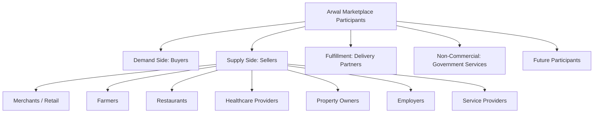

---

# Marketplace Categories

| Category | Strategic Character |
|---|---|
| **Retail** | High-frequency, broad-catalog general commerce; the largest addressable seller base and the primary proving ground for onboarding simplicity. |
| **Food** | Time-sensitive, high-frequency, trust-critical on freshness and delivery speed. |
| **Groceries** | Recurring, household-essential, favoring reliability and substitution transparency over discovery novelty. |
| **Healthcare** | Highest-stakes category; discovery value depends entirely on verification credibility, never volume. |
| **Education** | Trust-and-reputation-driven, minor-safeguard-sensitive, low transaction frequency but high relationship value. |
| **Jobs** | A matching market rather than a goods market — success is measured by fit and fraud-freedom, not price competition. |
| **Property** | Low-frequency, high-value, fraud-sensitive; trust in verification matters more than ranking sophistication. |
| **Agriculture** | A hybrid of informational (pricing, schemes) and transactional (direct-to-buyer) marketplace dynamics. |
| **Services** | Time-bound, reputation-compounding, scheduling-dependent local expertise. |
| **Community Commerce** | Group/cooperative-anchored commerce serving collective economic participation, per CAP-043. |
| **Future Categories** | B2B/Wholesale depth and any category a second district's local economy requires, evaluated per the Marketplace Governance discipline below. |

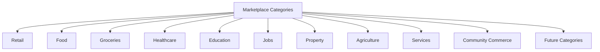

---

# Value Creation Model

| Question | Answer |
|---|---|
| **Who creates value?** | Every seller whose goods, services, or listings genuinely meet a buyer's need better than the buyer's pre-Arwal alternative. |
| **Who consumes value?** | Every buyer whose need is met more conveniently, fairly, or completely than their prior informal channel. |
| **Who enables value?** | Delivery Partners, Payment Processing (CAP-027), and Identity Verification (CAP-001) — the infrastructure making a stranger-to-stranger transaction viable at all. |
| **Who governs value?** | Trust & Safety (CAP-036) and the Marketplace Council (see Governance below), ensuring the exchange remains fair and lawful. |

### How Trust Flows
Trust originates in Identity Verification and Provider Verification (CAP-001, CAP-016), and compounds through Reputation & Rating Management (CAP-045) — a buyer's confidence in one verified seller transfers into confidence in the verification system itself, lowering the trust barrier for every subsequent, unfamiliar seller.

### How Information Flows
Information flows through Search (CAP-030) and Catalog/Listing Management — a buyer's query surfaces every genuinely matching, verified option, never gated by whether a seller happens to be already known to that buyer.

### How Payments Flow
Payments flow through the single Wallet and Payment Processing layer (CAP-027), under the identical idempotency and settlement-integrity standard applied to every transaction platform-wide, per RULE-018.

### How Reputation Compounds
A seller's reputation, once earned, is portable across every buyer they transact with next — never resetting per relationship, per GLOSS-063's definition of Reputation as Arwal's core structural trust advantage.

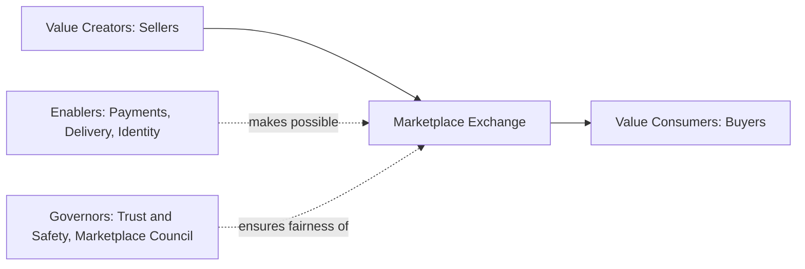

---

# Marketplace Network Effects

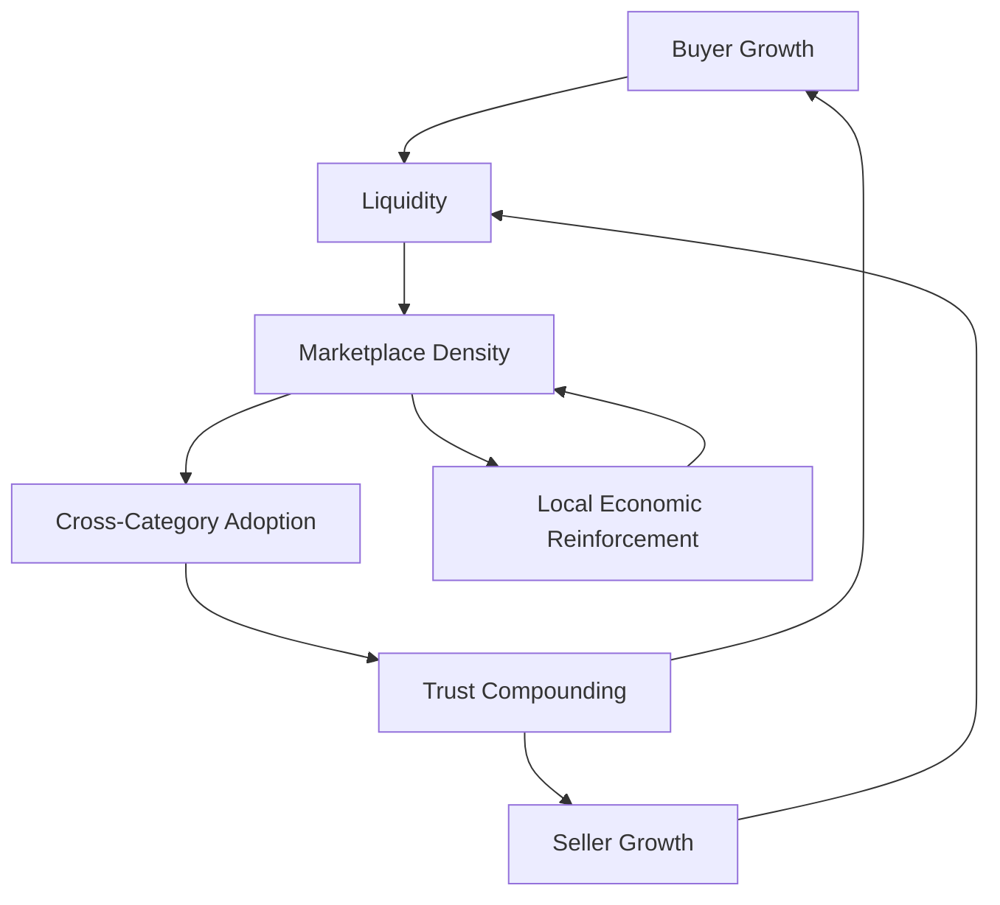

| Effect | Mechanism |
|---|---|
| **Buyer Growth** | More buyers make every seller's participation more valuable — a larger, more confident audience for the same catalog. |
| **Seller Growth** | More sellers make every buyer's search more likely to return a genuinely good match — more selection, more competition on quality. |
| **Liquidity** | The combined effect of Buyer and Seller Growth: a query reliably returns a result, and a listing reliably reaches a buyer. |
| **Marketplace Density** | Liquidity sustained across a geography and category, making Arwal the default first search rather than a supplementary check. |
| **Cross-Category Adoption** | A citizen who trusts Arwal for groceries is measurably more likely to try Healthcare or Property discovery, per `ai-docs/50`'s Cross-Vertical Adoption Depth. |
| **Trust Compounding** | Every successfully resolved transaction, and every fairly resolved dispute, raises the platform-wide trust baseline every future transaction benefits from. |
| **Local Economic Reinforcement** | A thriving marketplace attracts more local sellers to digitize, further deepening Density — a virtuous cycle distinct from, and reinforcing, the District Development Strategy already established in `ai-docs/64`. |

---

# Discovery Strategy

| Mechanism | Strategic Role |
|---|---|
| **Search** | The primary, trusted entry point for intent-driven discovery, per CAP-030 — never biased by undisclosed payment. |
| **Recommendations** | Personalized surfacing scoped to a buyer's genuine need, per CAP-032's Anti-Discrimination Safeguards — never a substitute for organic relevance. |
| **Nearby Discovery** | Hyperlocal ranking reflecting genuine fulfillment feasibility, critical to a district-scale, same-day-delivery-oriented marketplace. |
| **Category Exploration** | Browsable structure for a buyer who does not yet have a specific query — serving the "I don't know what I need yet" moment search alone cannot. |
| **Reputation** | A first-class ranking input — a genuinely well-reviewed seller is more discoverable than an unverified or poorly-reviewed one, per CAP-045. |
| **Verified Businesses** | Verification status is always visible and never spoofable, per RULE-010 and RULE-014 — the single strongest discovery-trust signal. |
| **Personalization** | Ranking adapts to a buyer's own history and context, per `ai-docs/52`'s AI Personalization Strategy, while remaining explainable. |
| **Fair Visibility** | A new, unestablished seller is never structurally invisible — discovery includes a fair on-ramp for genuine new entrants, never a pure incumbency-favoring ranking. |

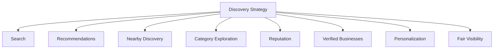

---

# Trust & Safety Strategy

| Mechanism | Strategic Role |
|---|---|
| **Identity** | Every seller's real-world identity is verified before any listing is discoverable, per CAP-001. |
| **Verification** | Category-appropriate scrutiny — Healthcare and Education carry elevated standards, per RULE-014 and RULE-016. |
| **Ratings** | A quantified, aggregated trust signal, accepted only from a verified, completed transaction, per RULE-022. |
| **Reviews** | Qualitative trust evidence, moderated per PROC-016's Content Moderation Standard, never manipulable without detection. |
| **Fraud Prevention** | Continuous, AI-assisted, always human-confirmed anomaly detection, per CAP-038 and RULE-024. |
| **Dispute Resolution** | A structured, evidence-based path to a fair outcome for both buyer and seller, per CAP-036 and RULE-013. |
| **Consumer Protection** | Refund eligibility, cancellation rights, and appeal rights, per RULE-013 and RULE-028, are never negotiable away by a seller's terms. |
| **Merchant Protection** | A seller is equally protected from a bad-faith buyer claim — dispute review is bidirectional, never presumptively pro-buyer. |
| **Platform Neutrality** | Enforcement action against a seller requires the same evidentiary and, above Medium severity, four-eyes rigor regardless of that seller's size or revenue contribution, per RULE-027. |

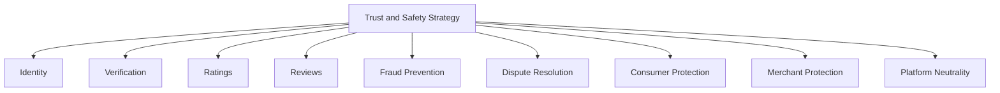

---

# Transaction Strategy

Described strategically — the shape and integrity commitment of each stage, never its implementation.

| Stage | Strategic Commitment |
|---|---|
| **Discovery** | A buyer's search reflects genuine relevance and verified trust, never an undisclosed commercial bias. |
| **Selection** | A buyer can compare genuinely comparable options — price, rating, verified status — before committing. |
| **Purchase / Booking** | A confirmed commitment is unambiguous and immediately, visibly confirmed, per `ai-docs/56`'s Trust and Transparency journey principle. |
| **Payment** | Absolute settlement certainty — a payment either visibly succeeds or visibly fails, never an ambiguous limbo, per RULE-018. |
| **Settlement** | A seller's payout is timely, itemized, and verifiable, per CAP-027 and CAP-034 (Payouts & Refunds). |
| **Fulfillment** | Delivery or service completion is tracked and transparent, per CAP-026. |
| **After-Sales** | Return, refund, and dispute paths remain reachable well past the initial transaction moment, never expiring silently. |
| **Feedback** | A completed, verified transaction is the sole gate for a review, per RULE-022 — closing the loop that feeds future Discovery. |

---

# Marketplace Governance

### Ownership
Marketplace Strategy ownership sits with the Chief Marketplace Officer (or CPO where the role is combined), with each category's Business Owner (per `ai-docs/53`'s Domain Registry) accountable for their own category's execution, mirroring the Clear Ownership discipline already established throughout `ai-docs/53` through `ai-docs/64`.

### Marketplace Council
A standing **Marketplace Council** — chaired by the Chief Marketplace Officer, with the Head of Trust & Safety, Head of Merchant Success, CPO, and rotating category Heads as members — holds approval authority over any platform-wide ranking-policy change, any new fee or promotion mechanism, and any material deviation from the Anti-Patterns below. The Council meets monthly, with ad hoc sessions for a Marketplace Health Score regression.

### Decision Authority

| Decision | Approves |
|---|---|
| New marketplace category activation | Marketplace Council + CEO |
| Ranking algorithm policy change | Marketplace Council |
| New promoted-visibility mechanism | Marketplace Council + Revenue Review Board (`ai-docs/62`) |
| Category-specific verification standard change | Category Head + Head of Trust & Safety |
| Emergency marketplace-integrity response (e.g., a fraud wave) | Head of Trust & Safety, immediate, ratified by Council within 5 business days |

### Review Cadence

| Review | Cadence | Owner |
|---|---|---|
| Marketplace Health Review | Monthly | Marketplace Council |
| Category Performance Review | Quarterly | Category Heads |
| Annual Marketplace Strategy Review | Annual | CEO, Chief Marketplace Officer, CPO |

### Conflict Resolution
A buyer-seller dispute follows PROC-013 and RULE-013; a cross-category or cross-participant strategic disagreement follows the identical Escalation Paths already established in `ai-docs/51-stakeholder-analysis.md`, never resolved informally.

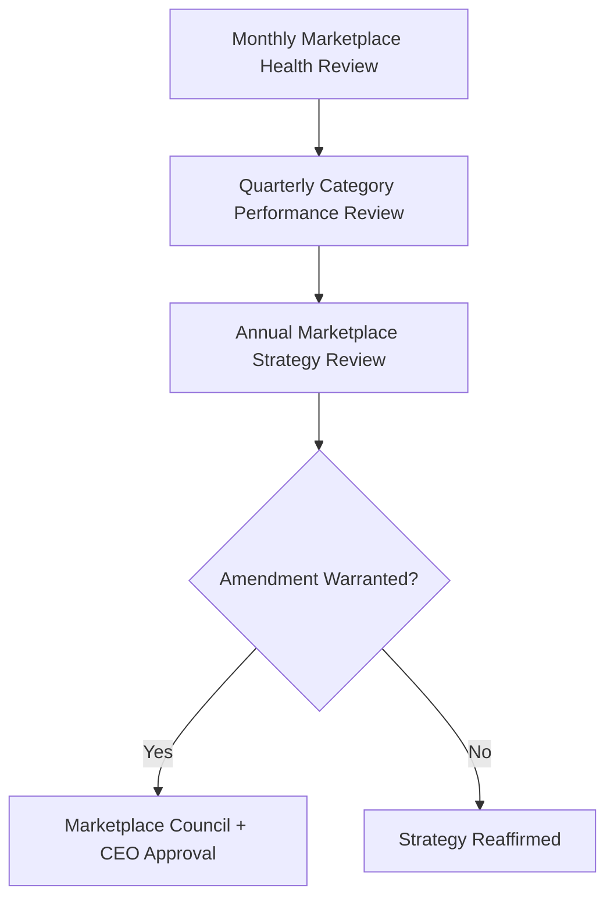

---

# Marketplace Risks

| Risk | Description | Mitigation |
|---|---|---|
| **Fraud** | Fake listings, manipulated reviews, or payment-bypass schemes. | Fraud Detection (CAP-038), four-eyes enforcement (RULE-027). |
| **Low Liquidity** | Too few sellers or buyers for a category to function as a real market. | Category-specific onboarding investment gated by Capability Maturity, per `ai-docs/55`. |
| **Marketplace Imbalance** | One category or seller segment dominates at another's expense. | Balanced Incentives monitoring, per `ai-docs/64`'s Ecosystem Health. |
| **Monopolization** | A single large seller or Arwal itself suppresses fair competition. | Fair Competition and Marketplace Neutrality principles above. |
| **Counterfeit Goods** | Misrepresented or fraudulent product listings. | RULE-011's Product Listing Prohibited Content standard. |
| **Price Manipulation** | Coordinated or predatory pricing distorting fair discovery. | Trust & Safety monitoring; Reputation Integrity enforcement per CAP-045. |
| **Trust Erosion** | A mishandled dispute or fraud incident damages platform-wide trust. | Transparent, evidence-based dispute resolution per RULE-013 and RULE-028. |
| **Poor Discovery** | Buyers cannot find genuinely relevant, verified sellers. | Continuous Discovery Strategy investment; Search-to-action conversion monitoring. |
| **Low Retention** | Buyers or sellers churn after a poor first experience. | Voice of Customer loop per `ai-docs/60-customer-experience-strategy.md`. |
| **Vendor Dependency** | Over-reliance on a single payment or logistics partner. | Provider-agnostic architecture per `ai-docs/09-tech-stack.md`. |

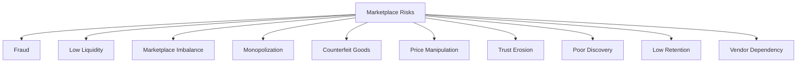

---

# Marketplace Metrics

| Metric | Definition | Direction |
|---|---|---|
| **Buyer Growth** | New and returning buyer count over time. | Increasing |
| **Seller Growth** | New, verified, active seller count over time. | Increasing |
| **Liquidity** | Search-to-successful-transaction rate. | Increasing |
| **Transaction Success Rate** | % of initiated transactions completing without failure. | Increasing |
| **GMV** | Gross Merchandise Value with healthy contribution margin, per `ai-docs/62`. | Increasing |
| **Repeat Purchases** | Share of transactions from a returning buyer. | Increasing |
| **Merchant Retention** | Rate at which onboarded sellers remain active. | Increasing |
| **Trust Score** | District Trust Signal, viewed for marketplace interactions specifically. | Increasing |
| **Dispute Rate** | Disputes per completed transaction. | Decreasing |
| **Marketplace Health Score** | A composite index combining Liquidity, Trust Score, and Merchant Retention. | Increasing |

> **Callout — No Marketplace Metric Stands Alone**
> Per the North Star Principle already established in `ai-docs/00-project-vision.md`, a rising GMV alongside a falling Trust Score or rising Dispute Rate is treated as a regression — never counted as success in isolation.

---

# Anti-Patterns

| Anti-Pattern | Why It's Rejected |
|---|---|
| **Pay-to-win visibility** | Undisclosed paid ranking violates Marketplace Neutrality and Transparency. |
| **Fake reviews** | Directly violates RULE-022's transaction-verified review standard and destroys the Reputation signal every buyer relies on. |
| **Vendor lock-in** | Contradicts the Project Vision's rejection of proprietary lock-in, applied here to seller relationships. |
| **Marketplace bias** | Structurally favoring one seller category or size class over another violates Fair Competition. |
| **Ignoring small merchants** | Directly contradicts Open Marketplace and the Business Enablement objective already established in `ai-docs/50`. |
| **Poor dispute handling** | An unresolved or one-sided dispute process erodes trust on both sides simultaneously. |
| **Growth without trust** | A rising GMV alongside a falling Trust Score is a regression, never a win. |
| **Low-quality listings** | Undermines Discovery Strategy's entire premise — a search that returns unreliable results teaches buyers to stop searching. |
| **Short-term optimization** | Trading long-term seller retention for a single quarter's commission revenue violates Long-Term Sustainability. |

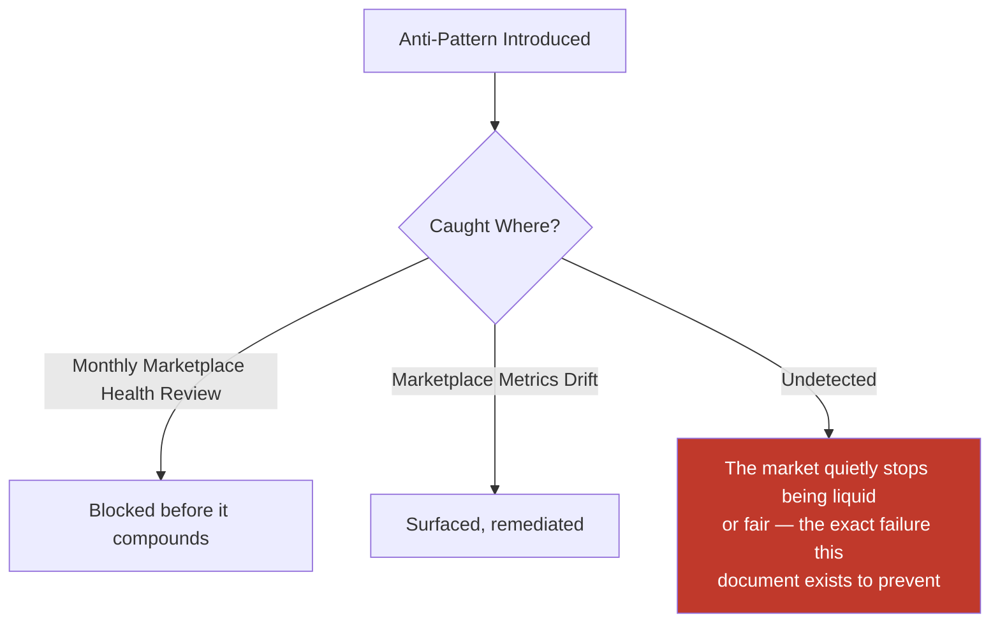

---

# Relationship to Previous Documents

| Prior Document | Relationship |
|---|---|
| **Project Vision (`ai-docs/00`)** | Establishes the founding fragmentation problem this marketplace exists to solve through discoverable, trust-verified local commerce. |
| **Stakeholder Analysis (`ai-docs/51`)** | Supplies the stakeholder registry every marketplace participant traces to. |
| **Business Domains (`ai-docs/53`)** | Supplies the ownership structure behind Commerce Marketplace, Food, Grocery, Healthcare, Education, Jobs, Property, and Agriculture. |
| **Business Capabilities (`ai-docs/55`)** | Supplies the stable abilities (Catalog Management, Order Management, Trust & Safety) this strategy's mechanisms are built on top of. |
| **Customer Experience Strategy (`ai-docs/60`)** | Supplies the felt-experience bar every marketplace interaction must clear. |
| **Value Proposition Framework (`ai-docs/61`)** | Supplies the Network Effects reasoning this document's Marketplace Network Effects section extends specifically to commerce dynamics. |
| **Revenue & Sustainability Strategy (`ai-docs/62`)** | Supplies the fairness safeguards this document's transaction and promotion mechanisms are bound by. |
| **Government Partnership Strategy (`ai-docs/63`)** | Supplies the boundary between commercial marketplace ranking and non-commercial civic-service discovery. |
| **District Ecosystem Mapping (`ai-docs/64`)** | Supplies the whole-system Ecosystem Health view this document's marketplace-specific health metrics feed into. |
| **Business Glossary (`ai-docs/59`)** | Supplies the precise vocabulary (Merchant, Order, Listing, Reputation, Dispute) this document's every claim is expressed in. |

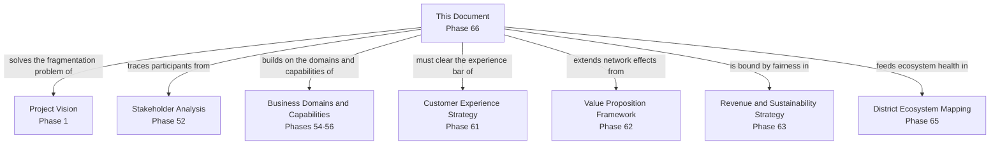

---

# Executive Artifacts

### Marketplace Framework

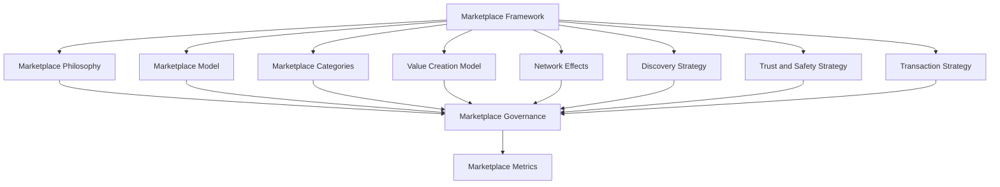

### Marketplace Flywheel

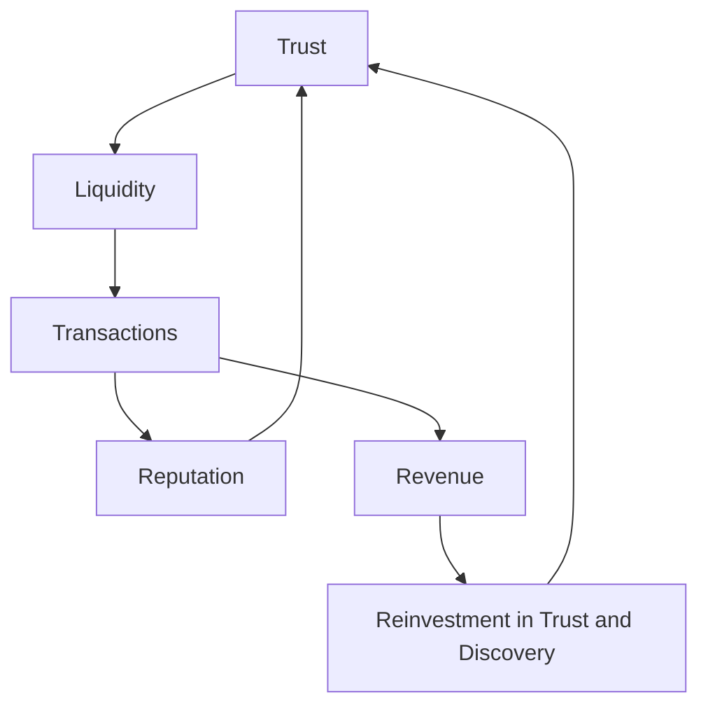

### Marketplace Lifecycle

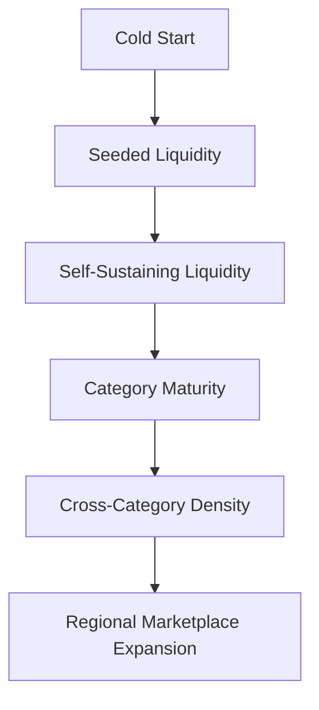

### Value Exchange Diagram

See Value Creation Model section above — reproduced here by reference per Single Source of Truth, never duplicated.

### Marketplace Governance Model

See Marketplace Governance section above.

### Marketplace Health Dashboard

| Dashboard | Audience | Key Content |
|---|---|---|
| **CEO Dashboard** | CEO | Marketplace Health Score, GMV trend, Trust Score |
| **Chief Marketplace Officer Dashboard** | CMO/Chief Marketplace Officer | Liquidity, Buyer/Seller Growth, category-level performance |
| **Trust & Safety Dashboard** | Head of Trust & Safety | Dispute Rate, fraud-incident trend, verification turnaround |
| **Category Dashboards** | Category Heads | Category-specific GMV, retention, liquidity |

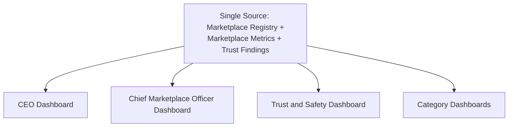

### Decision Matrix

| Decision Type | Approval Authority |
|---|---|
| New marketplace category | Marketplace Council + CEO |
| Ranking policy change | Marketplace Council |
| New promotion mechanism | Marketplace Council + Revenue Review Board |
| Verification standard change | Category Head + Head of Trust & Safety |
| Emergency integrity response | Head of Trust & Safety, ratified within 5 business days |

---

# Closing Statement

> **Callout — Closing Statement**
> Every prior document in this handbook explains what Arwal is, how it sustains itself, and who it partners with. This document explains the specific economic machine at the center of it all: a market where a stranger is willing to buy from a stranger, because Arwal made that stranger verifiable, that transaction reversible if something goes wrong, and that reputation permanent and portable. A marketplace is not won by having the most listings — it is won by being the place a citizen trusts enough to search first, and a seller trusts enough to invest in first. That trust, once earned transaction by transaction, is what turns a district's fragmented, word-of-mouth commerce into a liquid, fair, and durable local economy — one Arwal can responsibly extend from a single district into a wider regional marketplace without ever losing the local trust that made it work in the first place. Where a future phase must deviate from a principle stated here, that deviation is made explicitly — through the Marketplace Governance process above — never silently, and never by default.

This document, `ai-docs/65-marketplace-strategy.md`, is Phase 66 of approximately 415. Every future commerce, discovery, trust, and liquidity decision is expected to trace back to a principle defined here, or to justify its deviation in writing.

**End of Phase 66 — `ai-docs/65-marketplace-strategy.md`**