# Service Provider Ecosystem

**Document:** `ai-docs/66-service-provider-ecosystem.md`
**Project:** Arwal — The District Super App
**Stage:** 2 — Product & Business Strategy
**Phase:** 67 — Service Provider Ecosystem
**Status:** Approved for Product & Engineering Reference
**Audience:** CEO, CSO, CPO, Chief Marketplace Officer, Chief Service Operations Officer, Enterprise Business Architects, Marketplace Economists, Trust & Safety Strategists, Workforce Development Consultants, Customer Experience Strategists, Government Digital Transformation Partners, Investors

> **Callout — Purpose of This Document**
> `ai-docs/00-project-vision.md` through `ai-docs/65-marketplace-strategy.md` established why Arwal exists, what it can do, who it serves, how it sustains itself, how it partners with government, the whole district ecosystem it operates inside, and the general economics of a two-sided marketplace. None of those documents answers the specific question an electrician, a tutor, a doctor, or a freelance photographer asks before trusting Arwal with their livelihood: **why should a skilled local professional build their reputation here, and how does Arwal make sure that trust, once earned, keeps paying off for them for years?** This document is that answer — the authoritative Service Provider Ecosystem strategy every future provider-facing decision, verification standard, and growth program traces back to.

---

# Purpose of this Document

### Why Service Providers Are a Distinct Strategic Concern, Not a Marketplace Category Footnote

`ai-docs/65-marketplace-strategy.md` established the general economics of a two-sided market — liquidity, discovery, trust, network effects — applied evenly across goods and services alike. A service, however, is not a good. A citizen buying a product can inspect it before paying; a citizen booking an electrician cannot inspect the work until it is already being done, often inside their own home. A service provider's product *is* their own skill, time, and judgment — inseparable from their person, their reputation, and their livelihood. This asymmetry means service marketplaces fail differently than goods marketplaces: not through a bad shipment, but through a citizen letting a stranger into their house, their health, or their finances on the strength of a rating alone. This document exists because a service provider ecosystem carries stakes — physical safety, professional credentialing, minor-safeguard risk, financial trust — that the general Marketplace Strategy correctly treats as shared principles but does not, and should not, resolve at the category-specific depth this document requires.

### Why This Is a Business Strategy Document, Not a Booking System

This document contains no scheduling logic, no API, no calendar-integration detail, and no implementation specification. `ai-docs/54-product-module-catalog.md`'s Appointment Booking module and `ai-docs/56-user-journey-standards.md`'s Appointment Booking journey already own that territory in full. This document's exclusive territory is the **business relationship** between Arwal and every professional who earns a living, in whole or in part, through the platform — why they should join, how they grow, how they are protected, and how their success and Arwal's success become the same outcome.

### The Chain of Reasoning This Document Extends

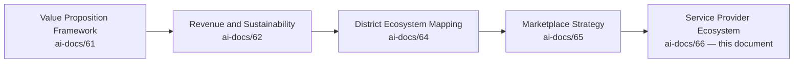

| Layer | Question It Answers |
|---|---|
| Value Proposition Framework | Why should any stakeholder trust Arwal? |
| Revenue & Sustainability Strategy | How does Arwal fund its promises for a generation? |
| District Ecosystem Mapping | What is the whole living system Arwal operates inside? |
| Marketplace Strategy | How does a two-sided market work, generally? |
| **Service Provider Ecosystem** (this document) | **How does Arwal specifically earn, deserve, and sustain a skilled professional's trust with their own livelihood?** |

### Why Service Providers Deserve Their Own Strategic Layer

A district's skilled workforce — electricians, tutors, doctors, accountants, photographers — is currently discovered through word of mouth, with no verification, no portable reputation, and no protection against a bad-faith customer or a competitor's sabotage. This is the same fragmentation problem `ai-docs/00-project-vision.md` names for citizens, mirrored on the supply side: a genuinely skilled provider today has no way to prove their reliability to a stranger, and no recourse when a single unfair review threatens years of accumulated goodwill. Arwal's service provider ecosystem exists to close that gap — converting informal, unverifiable local reputation into a portable, defensible, growing professional asset.

### Why Trust Matters More Than Scale

A marketplace that onboards a thousand unverified providers to inflate its catalog has manufactured the appearance of liquidity while destroying the actual mechanism liquidity depends on: a citizen's willingness to let a stranger into their life. One credible incident — a citizen harmed by an unverified provider — can undo years of accumulated trust across every service category simultaneously, per the Shared Trust dependency already established in `ai-docs/64-district-ecosystem-mapping.md`. Arwal grows its provider base only as fast as it can verify and support it, never faster.

### How Service Quality Creates Long-Term Marketplace Health

A citizen who has one excellent experience with a verified plumber returns to Arwal for their next plumbing need, and is measurably more willing to try Arwal for an unfamiliar category — a tutor, a doctor — because the platform's verification promise has already been proven true once. Service quality is therefore not merely a category-level metric; it is a direct input into the cross-vertical trust compounding that is Arwal's core structural advantage, per `ai-docs/50-product-vision-business-strategy.md`.

### Relationship Between Every Participant

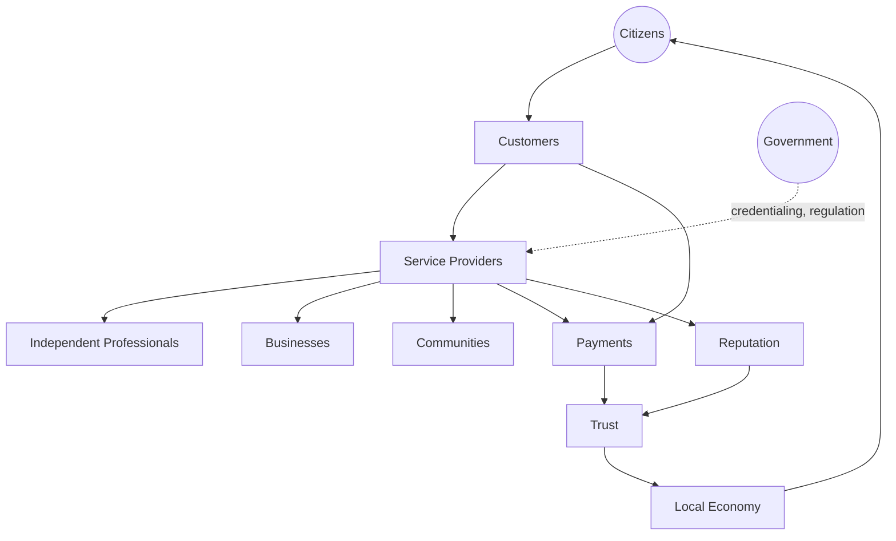

A citizen becomes a customer the moment they book a service; the provider fulfilling that booking may be an independent professional or a small business; every transaction between them produces Reputation that compounds into Trust, moves through Payments under the same settlement-integrity standard as every other transaction platform-wide, and — where the category requires it — is shaped by government credentialing and regulation. The cumulative effect, sustained over years, is a measurably stronger local economy that in turn produces more confident citizens.

### Scope Boundary

This document does not redefine Domains (`ai-docs/53`), Capabilities (`ai-docs/55`), Modules (`ai-docs/54`), Journeys (`ai-docs/56`), Processes (`ai-docs/57`), or Rules (`ai-docs/58`) — Healthcare Discovery, Provider Verification, Appointment Scheduling, and their governing rules (RULE-014 through RULE-016) remain fully authoritative and are cited, never restated. This document's exclusive territory is: **the strategic reasoning behind who a service provider is to Arwal, why they should participate, how their success is designed for, and how the ecosystem around them is governed and protected.**

---

# Service Provider Philosophy

Every principle below exists because a provider ecosystem built carelessly does not fail abstractly — it fails a specific electrician denied a fair chance to compete, a specific tutor whose reputation is stolen by a fake review, or a specific citizen harmed by a provider who should never have been verified.

### Citizen First
**Why it exists:** Every provider-facing decision is judged first against whether it serves the citizen the provider ultimately works for, mirroring the identical Citizen-First tie-breaker already established throughout `ai-docs/51` through `ai-docs/65`. A provider's convenience is real and protected, but never at the cost of a citizen's safety or fair treatment.

### Provider Success
**Why it exists:** Arwal succeeds only if the providers on it succeed — a platform that treats provider income as incidental to its own commission revenue has inverted the causal relationship, per the identical Merchant Success principle already established in `ai-docs/65-marketplace-strategy.md`, applied here specifically to skilled, time-bound service work.

### Trust Before Growth
**Why it exists:** A provider category grown faster than Arwal can verify it is a category whose average quality is unknown and whose worst incidents are inevitable. Verification capacity, never catalog size, is the actual constraint on how fast a category is allowed to grow.

### Quality First
**Why it exists:** A citizen who hires a poorly-vetted service provider bears the consequence directly and personally — inside their own home, their own health, their own finances. Quality is a precondition for participation, never a downstream optimization applied after the fact.

### Professionalism
**Why it exists:** A provider's standing on Arwal is a professional identity, not merely a listing — the platform is designed to reinforce, not undermine, the dignity and seriousness of skilled work, per the Respect Every User principle already established in `ai-docs/60-customer-experience-strategy.md`.

### Transparency
**Why it exists:** A provider must be able to see exactly why their ranking, rating, or verification status is what it is, and a citizen must be able to see exactly what a provider's credentials actually mean — concealment on either side breeds the same corrosive suspicion `ai-docs/65-marketplace-strategy.md` already rejects.

### Accessibility
**Why it exists:** A provider without a smartphone, with limited literacy, or with no prior digital experience must still be able to build a professional presence on Arwal — an onboarding process that structurally excludes such a provider has excluded exactly the workforce segment most in need of formal income visibility.

### Inclusiveness
**Why it exists:** A skilled but informally-employed worker — a mason with no formal certificate, a tutor with no institutional affiliation — is a legitimate provider category, not a lesser one, per the Economic Inclusion principle already established in `ai-docs/62-revenue-sustainability-strategy.md`.

### Fair Opportunity
**Why it exists:** A new provider must have a genuine, structurally real path to visibility and their first booking — a marketplace where only already-established providers can ever be discovered has stopped growing its own supply and started merely managing scarcity.

### Marketplace Neutrality
**Why it exists:** A provider's ranking reflects genuine, verified quality signals, never undisclosed payment, per the identical Marketplace Neutrality principle already established in `ai-docs/65-marketplace-strategy.md`.

### Continuous Learning
**Why it exists:** A provider's skill and professionalism are not static — Arwal treats skill development as an ongoing investment in its own supply-side quality, never assumes a verified provider at onboarding remains equally capable indefinitely without support.

### Long-Term Sustainability
**Why it exists:** A provider relationship optimized for this month's booking volume at the cost of next year's provider retention has borrowed against a trust balance that does not refill, per the identical Long-Term Sustainability principle already established in `ai-docs/62-revenue-sustainability-strategy.md`.

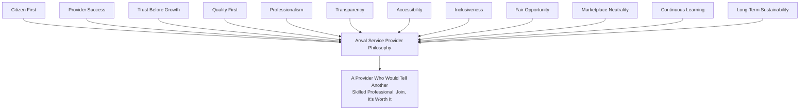

> **Callout — The One-Sentence Provider Philosophy**
> *"A service provider's reputation on Arwal must be worth more to them than their reputation anywhere else — the day that stops being true, the best providers leave first, and everyone else notices."*

---

# Service Provider Types

Every category below is a strategic grouping, not an exhaustive taxonomy; each traces to the Healthcare, Education, and general Service Provider domains and capabilities already established in `ai-docs/53` and `ai-docs/55`.

| Category | Strategic Character |
|---|---|
| **Electricians** | High-trust-stakes home-entry trades; safety-critical, licensing-relevant in many jurisdictions. |
| **Plumbers** | High-frequency, urgent-need-driven home-entry trades. |
| **Carpenters** | Project-based, often longer-engagement home and business trades. |
| **Mechanics** | Vehicle-trust-critical, often location-anchored (a fixed shop) rather than home-visiting. |
| **Technicians (appliance, electronics)** | Repair-oriented, diagnostic-skill-dependent trades. |
| **Home Cleaning** | Recurring, trust-and-reliability-driven home-entry services. |
| **Beauty Professionals** | Personal-service, often home-visiting or salon-based, reputation-and-hygiene-sensitive. |
| **Tutors** | Minor-safeguard-sensitive, reputation-compounding education providers, per RULE-016. |
| **Teachers (institutional-adjacent)** | Formal or semi-formal educators, often bridging School and Coaching Center contexts. |
| **Doctors** | Highest-stakes credential-verification category, per RULE-014. |
| **Lawyers** | Credential-and-licensing-critical professional services, high citizen-consequence advice. |
| **Accountants** | Financial-trust-critical professional services, often recurring engagements. |
| **Architects** | Project-based, credential-relevant technical professional services. |
| **Consultants** | Broad-skill, engagement-based professional services across business domains. |
| **Photographers** | Event- and project-based creative services, portfolio-driven discovery. |
| **Event Services** | Multi-vendor-coordination services (catering, decoration, sound) for a single citizen occasion. |
| **Repair Services** | General fix-it trades spanning multiple appliance and structural categories. |
| **Freelancers** | Broad, skill-flexible independent professionals spanning digital and non-digital work. |
| **Digital Professionals** | Design, development, and content-adjacent skilled work, often remote-deliverable. |
| **NGOs** | Not commercial service providers in the transactional sense, but community-service-delivery partners, per `ai-docs/64`'s Ecosystem Participants. |
| **Community Volunteers** | Uncompensated or stipend-based community-service contributors, distinct from commercial providers but part of the same trust fabric. |
| **Future Service Categories** | Any category not yet active, evaluated per the Provider Lifecycle's Discovery stage below. |

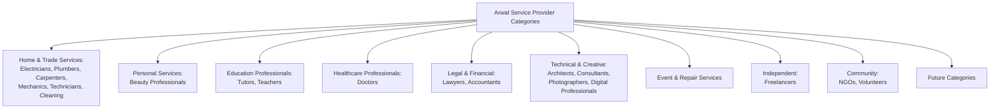

> **Callout — Category Depth, Not Category Breadth, Comes First**
> Per `ai-docs/50-product-vision-business-strategy.md`'s Depth Before Breadth expansion principle, a new provider category is added only once existing categories demonstrate sustained verification capacity, dispute-resolution maturity, and citizen trust — never opened simply because a category is commercially attractive.

---

# Provider Lifecycle

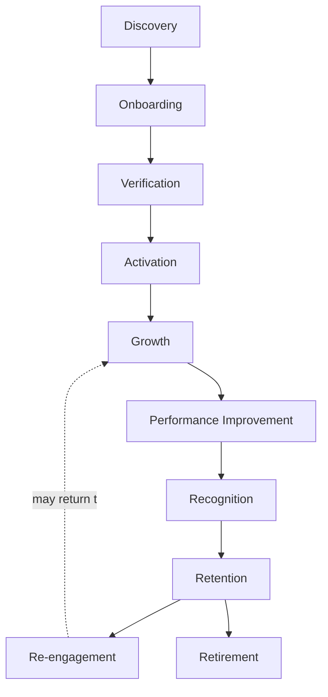

| Stage | Meaning | Owning Discipline |
|---|---|---|
| **Discovery** | Arwal, a field agent, or a provider themselves identifies a genuine local service need not yet represented on the platform. | Category strategy, this document |
| **Onboarding** | A provider registers and submits the information their category's verification standard requires. | Merchant/Provider Onboarding capability, `ai-docs/55` |
| **Verification** | Identity and, per category, credential and background verification is completed, per RULE-002, RULE-014, RULE-016. | Provider Verification (CAP-016), `ai-docs/58` |
| **Activation** | The provider's first booking is completed successfully. | Appointment Scheduling (CAP-015) |
| **Growth** | The provider builds a booking history, a rating base, and repeat customers. | Provider Success Strategy, below |
| **Performance Improvement** | A provider below their category's quality expectation is offered a defined, supportive improvement path before any punitive action. | Ecosystem Governance, below |
| **Recognition** | Sustained excellence is made visible — a badge, a featured placement, a milestone acknowledgment. | Provider Success Strategy, below |
| **Retention** | The provider continues choosing Arwal as a primary or supplementary income channel over time. | Economic Impact, below |
| **Re-engagement** | A dormant provider (per the seasonal or life-circumstance patterns common to skilled trades) is welcomed back without a punitive re-verification burden, mirroring RULE-005's Account Dormancy and Reactivation standard. | Provider Success Strategy, below |
| **Retirement** | A provider formally exits — voluntarily, or through a confirmed Trust & Safety finding — with their historical record archived, never deleted, per the Archive Never Delete principle established throughout this handbook. | Ecosystem Governance, below |

### Lifecycle Design Commitment

At every stage above, the provider's experience is designed with the same rigor `ai-docs/56-user-journey-standards.md` requires of a citizen journey — a named Failure Scenario and Recovery Path for every stage a provider could stall at, never a dead end where a provider simply gives up and leaves quietly, taking their trust with them.

---

# Provider Value Creation

| Question | Answer |
|---|---|
| **How do providers create value?** | By delivering genuinely skilled, reliable work that resolves a citizen's real need — the platform amplifies this value, it does not manufacture it. |
| **How do customers create value?** | By providing honest, transaction-verified feedback that lets the next citizen make a confident choice, and by paying promptly and fairly for completed work. |
| **How does Arwal create value?** | By converting informal, unverifiable local reputation into a portable, defensible professional asset — verification, discovery, secure payment, and dispute protection a provider could not build alone. |
| **How is trust created?** | Through Identity Verification (CAP-001) and category-appropriate credential verification (CAP-016), compounding through every successfully completed, reviewed booking. |
| **How does reputation grow?** | Through Reputation & Rating Management (CAP-045) — a portable signal that compounds across every customer a provider serves, never resetting per relationship. |
| **How do income opportunities expand?** | Through Fair Visibility (below) giving a provider reach beyond their existing word-of-mouth network, and through Cross-Category discovery bringing a provider's existing customers back for a different, related need. |

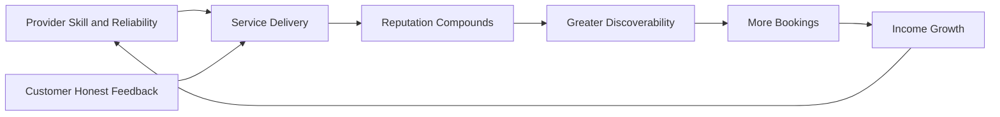

---

# Provider Success Strategy

| Dimension | Strategic Commitment |
|---|---|
| **Visibility** | Every verified provider is discoverable through Search and category browsing from day one — visibility is earned through verification and quality, never withheld as a growth lever. |
| **Skill Development** | Arwal offers, directly or through partner institutions, skill-development and professional-development pathways relevant to a provider's category, treating provider capability as a shared investment, not solely the provider's own burden. |
| **Customer Trust** | Every verified badge, every genuine rating, and every transparently-resolved dispute is a direct contribution to a provider's own customer-trust asset. |
| **Fair Pricing** | Providers set their own rates within a transparent, disclosed commission structure, per `ai-docs/62-revenue-sustainability-strategy.md`'s Fair Monetization principle — Arwal never dictates a provider's price. |
| **Business Growth** | Tools appropriate to a provider's scale (a solo tradesperson vs. an institutional clinic) are offered progressively, per the Progressive Complexity principle already established in `ai-docs/00-project-vision.md`. |
| **Scheduling Flexibility** | A provider controls their own availability — Arwal's scheduling capability serves the provider's actual capacity, never forces an unwanted booking. |
| **Professional Identity** | A provider's profile is designed to reflect genuine professional standing — credentials, tenure, verified specialization — never reduced to a bare price-and-rating tile. |
| **Repeat Customers** | Discovery and notification design favor a citizen's easy return to a provider they already trust, over always resurfacing a fresh, unfamiliar option. |
| **Long-Term Success** | Every mechanism above is evaluated on a multi-year horizon — a provider's five-year trajectory on Arwal, not their first booking alone, is the measure of whether this strategy is working. |

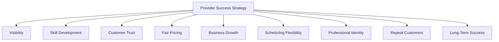

---

# Discovery Strategy

| Mechanism | Strategic Role |
|---|---|
| **Search** | The primary, trusted, intent-driven entry point for a citizen with a specific service need, per CAP-030. |
| **Nearby Providers** | Hyperlocal ranking reflecting genuine fulfillment feasibility — a home-visiting trade's proximity to the citizen matters directly. |
| **Recommendations** | Personalized surfacing scoped to a citizen's actual need and history, per CAP-032, never a substitute for organic relevance. |
| **Categories** | Browsable structure for a citizen who has a general need but not yet a specific query. |
| **Verified Providers** | Verification status is always visible and never spoofable, the single strongest discovery-trust signal for a home-entry or high-stakes service. |
| **Ratings** | A quantified, aggregated, transaction-verified trust signal, per RULE-022. |
| **Experience** | Tenure and completed-booking count are surfaced as a distinct, honest signal from rating alone — a new, well-rated provider and an experienced, well-rated provider are both discoverable, but differently framed. |
| **Availability** | Real-time or near-real-time availability signals prevent a citizen from investing attention in a provider who cannot actually serve them soon. |
| **Fair Visibility** | A structural on-ramp exists for a new, verified provider to reach their first bookings — discovery is never purely incumbency-reinforcing. |

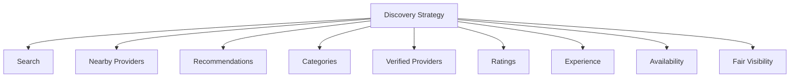

---

# Trust & Quality Strategy

| Mechanism | Strategic Role |
|---|---|
| **Identity Verification** | Every provider's real-world identity is confirmed before any listing is discoverable, per CAP-001 and RULE-002 — the non-negotiable floor for every category. |
| **Credential Verification** | Category-appropriate professional credentials (a medical license, a trade certification) are confirmed against the applicable issuing or licensing authority where one exists, per RULE-014. |
| **Background Verification** | For the highest home-entry-trust categories, an additional background-check layer is applied where legally permissible and proportionate to the category's actual risk. |
| **Ratings** | Accepted only from a verified, completed transaction, per RULE-022 — never open, unauthenticated submission. |
| **Reviews** | Qualitative evidence, moderated per PROC-016's Content Moderation Standard, detectable and correctable if manipulated. |
| **Quality Standards** | Each category defines a minimum, published service-quality expectation a provider is measured against over time, distinct from any single booking's outcome. |
| **Professional Conduct** | A code of conduct — punctuality, respectful communication, honest pricing — applies uniformly across every category, enforced through the same Trust & Safety discipline as any other platform participant. |
| **Dispute Resolution** | A structured, evidence-based path to a fair outcome for both the citizen and the provider, per CAP-036 and RULE-013 — never presumptively favoring either side. |
| **Consumer Protection** | A citizen's right to a fair remedy — a refund, a redo, an escalation — is never negotiable away by a provider's own terms, per RULE-013 and RULE-028. |
| **Provider Protection** | A provider is equally protected from a bad-faith or abusive customer claim; enforcement action against a provider requires the same evidentiary rigor, and above Medium severity the same four-eyes sign-off, regardless of the provider's size or tenure, per RULE-027. |

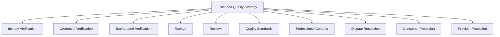

> **Callout — Verification Rigor Scales With Stakes, Never Uniformly**
> A photographer and a doctor are both service providers, but they are not held to the same verification bar — per the identical Proportional Rigor principle already established throughout this handbook, verification depth scales with the citizen-facing consequence of a category's failure, never applied as a single blanket standard that under-protects a high-stakes category or over-burdens a low-stakes one.

---

# Economic Impact

| Impact Area | How Arwal Contributes |
|---|---|
| **Increased Provider Income** | Expanded discoverability beyond a provider's existing word-of-mouth network, plus repeat-customer retention mechanisms, per the Provider Success Strategy above. |
| **Self-Employment Creation** | Radically simple onboarding lowers the barrier for a skilled individual to formalize independent work they may already be doing informally. |
| **Local Skill Development** | Skill-development pathways, per the Provider Success Strategy's Skill Development commitment, invest directly in the district's own workforce capability. |
| **Formalization of Informal Workers** | A tradesperson with no prior digital or institutional presence gains a verifiable, bookable, income-tracked professional identity for the first time. |
| **Employment Generation** | Growing provider categories create demand for supporting roles — apprentices, assistants — within a provider's own small business. |
| **Entrepreneurship Support** | A successful independent provider is given a natural path toward Business Growth tooling and, eventually, a small institutional presence (a clinic, a coaching center). |
| **Local Economic Strengthening** | Income earned by a district's own providers is spent within the same district, reinforcing the District Development Strategy already established in `ai-docs/64-district-ecosystem-mapping.md`. |

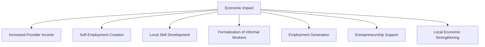

---

# Ecosystem Governance

### Ownership
Service Provider Ecosystem strategy ownership sits with the Chief Service Operations Officer (or CPO where the role is combined), with each category's Business Owner — per `ai-docs/53`'s Domain Registry — accountable for their own category's execution, mirroring the Clear Ownership discipline already established throughout `ai-docs/53` through `ai-docs/65`.

### Provider Council
A standing **Provider Council** — chaired by the Chief Service Operations Officer, with the Head of Trust & Safety, Head of Healthcare Vertical, Head of Education Vertical, and rotating category-representative providers as members — holds approval authority over any platform-wide verification-standard change, any new provider-facing fee mechanism, and any material deviation from the Anti-Patterns below. The Council meets monthly, with ad hoc sessions for a Provider Ecosystem Health Score regression. Provider representation on the Council is a deliberate mechanism ensuring providers are consulted on decisions affecting their own livelihood, never merely informed after the fact.

### Decision Authority

| Decision | Approves |
|---|---|
| New service provider category activation | Provider Council + CEO |
| Category-specific verification standard change | Category Head + Head of Trust & Safety |
| New provider fee or commission structure | Provider Council + Revenue Review Board (`ai-docs/62`) |
| Provider recognition/reward program | Provider Council |
| Emergency provider-trust response (e.g., a category-wide fraud pattern) | Head of Trust & Safety, immediate, ratified by Council within 5 business days |

### Conflict Resolution
A citizen-provider dispute follows PROC-013 and RULE-013 in full; a provider's disagreement with a platform decision (a ranking outcome, a verification rejection) follows the identical Appeal right already established in RULE-028, reviewed by an independent reviewer distinct from the original decision-maker.

### Review Cadence

| Review | Cadence | Owner |
|---|---|---|
| Provider Ecosystem Health Review | Monthly | Provider Council |
| Category Performance Review | Quarterly | Category Heads |
| Annual Service Provider Strategy Review | Annual | CEO, Chief Service Operations Officer, CPO |

### Continuous Improvement
Every review above feeds a shared, tracked improvement backlog — a recurring category-specific complaint pattern, a verification bottleneck, or a provider-suggested refinement — reviewed and prioritized at the next Provider Ecosystem Health Review, never left to informally resolve itself.

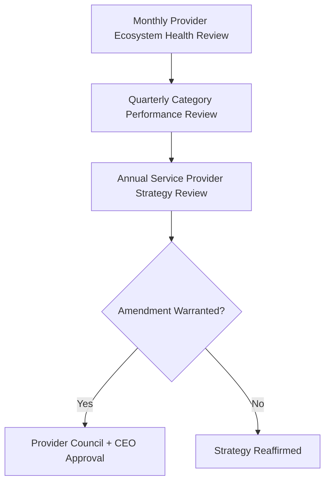

---

# Risks

| Risk | Description | Mitigation |
|---|---|---|
| **Low-Quality Providers** | A provider passes initial verification but delivers consistently poor work. | Ongoing Quality Standards monitoring, per the Trust & Quality Strategy above, distinct from one-time onboarding verification. |
| **Fraud** | A provider misrepresents credentials, identity, or completed work. | Provider Verification (CAP-016), Fraud Detection (CAP-038), four-eyes enforcement per RULE-027. |
| **Fake Reviews** | A provider manipulates their own rating, or a competitor sabotages another's. | RULE-022's transaction-verified review standard; Content Moderation (PROC-016) pattern detection. |
| **Skill Mismatch** | A provider is verified for a category but lacks the specific skill a booking required. | Clear, specific category and specialization tagging at onboarding; honest Experience signaling in Discovery. |
| **Oversupply** | Too many providers in a category relative to genuine demand, depressing individual provider income. | Category-growth pacing per the Provider Lifecycle's Discovery stage, informed by demand signals before aggressive onboarding campaigns. |
| **Undersupply** | Too few verified providers in a category or geography, leaving citizen demand unmet. | Targeted category-specific onboarding investment, prioritized per Ecosystem Health signals in `ai-docs/64`. |
| **Provider Churn** | Providers disengage after a poor first experience or perceived unfairness. | Provider Success Strategy's Long-Term Success discipline; Voice of Customer-equivalent feedback loops extended to providers. |
| **Price Manipulation** | Coordinated pricing or predatory undercutting distorting fair category competition. | Trust & Safety monitoring; Marketplace Neutrality principle above. |
| **Trust Erosion** | A single mishandled provider-related incident damages category-wide or platform-wide trust. | Transparent, evidence-based dispute resolution per RULE-013 and RULE-028; rapid, honest incident communication. |
| **Verification Failures** | A verification process itself is bypassed, gamed, or applied inconsistently across providers. | RULE-029's Audit Evidence Sufficiency Standard applied to every verification decision; periodic verification-process audit. |

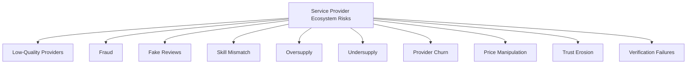

---

# Metrics

| Metric | Definition | Direction |
|---|---|---|
| **Verified Providers** | Count of providers passing their category's full verification standard. | Increasing |
| **Active Providers** | Verified providers completing at least one booking within a defined rolling window. | Increasing |
| **Booking Success Rate** | % of initiated bookings completing without cancellation or dispute. | Increasing |
| **Provider Retention** | Rate at which onboarded providers remain active over time. | Increasing |
| **Average Rating** | Aggregated, transaction-verified rating per category. | Increasing, or sustained at a high baseline |
| **Customer Satisfaction** | CSAT specific to service-provider interactions, per `ai-docs/60-customer-experience-strategy.md`'s Experience Metrics. | Increasing |
| **Repeat Bookings** | Share of bookings from a customer who has used the same provider before. | Increasing |
| **Provider Income Growth** | Merchant/provider-reported income improvement attributable to Arwal, per `ai-docs/50`'s Business Enablement KPI family. | Increasing |
| **Trust Score** | District Trust Signal, viewed for service-provider interactions specifically. | Increasing |
| **Provider Ecosystem Health** | A composite index combining Verified Provider growth, Retention, Trust Score, and Dispute Rate. | Increasing |

> **Callout — No Provider Metric Stands Alone**
> Per the North Star Principle already established in `ai-docs/00-project-vision.md`, a rising Active Provider count alongside a falling Average Rating or rising Dispute Rate is treated as a regression — never counted as success in isolation.

---

# Anti-Patterns

| Anti-Pattern | Why It's Rejected |
|---|---|
| **Unverified providers** | Directly violates Trust Before Growth and RULE-002/RULE-014/RULE-016 — no provider is discoverable before verification succeeds. |
| **Pay-for-ranking** | Undisclosed paid ranking violates Marketplace Neutrality; a provider's visibility must reflect genuine quality, never budget alone. |
| **Ignoring quality** | Treating onboarding verification as a one-time gate with no ongoing Quality Standards monitoring violates Quality First. |
| **Poor dispute handling** | An unresolved or one-sided dispute process erodes trust on both the citizen and provider side simultaneously. |
| **Provider favoritism** | Applying enforcement or ranking inconsistently based on a provider's size, tenure, or revenue contribution violates Marketplace Neutrality and Provider Protection. |
| **Growth without trust** | A rising Active Provider count alongside a falling Trust Score is a regression, never a win. |
| **Low-quality onboarding** | An onboarding process so burdensome or confusing that only the most digitally fluent providers complete it violates Accessibility and Fair Opportunity. |
| **No provider support** | Leaving a struggling provider with no Performance Improvement path before punitive action violates Provider Success and Continuous Learning. |

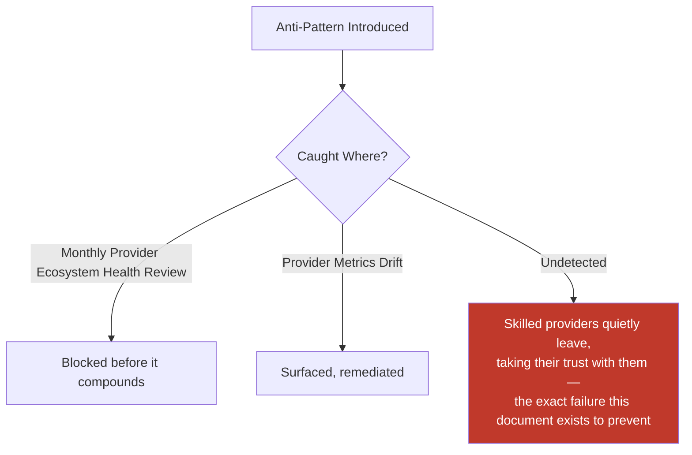

---

# Relationship to Previous Documents

| Prior Document | Relationship |
|---|---|
| **Project Vision (`ai-docs/00`)** | Establishes the founding fragmentation problem this document solves for skilled local providers specifically — no verifiable reputation, no dispute recourse, no portable trust. |
| **Stakeholder Analysis (`ai-docs/51`)** | Supplies the Service Provider, Doctor, Teacher, and related stakeholder registry every category in this document traces to. |
| **Business Domain Model (`ai-docs/53`)** | Supplies the ownership structure behind Healthcare, Education, and Commerce domains this document's provider categories are realized within. |
| **Business Capability Map (`ai-docs/55`)** | Supplies the stable abilities — Provider Verification (CAP-016), Appointment Scheduling (CAP-015), Reputation & Rating Management (CAP-045) — this document's strategy is built directly on top of. |
| **Customer Experience Strategy (`ai-docs/60`)** | Supplies the felt-experience bar every provider interaction must clear on the citizen side. |
| **Value Proposition Framework (`ai-docs/61`)** | Supplies the Service Provider stakeholder value exchange this document extends into a full ecosystem strategy. |
| **Revenue & Sustainability Strategy (`ai-docs/62`)** | Supplies the Fair Monetization and Shared Prosperity safeguards this document's Provider Success Strategy is bound by. |
| **Government Partnership Strategy (`ai-docs/63`)** | Supplies the credentialing and regulatory-coordination context relevant to Doctors, Lawyers, and other licensed categories. |
| **District Ecosystem Mapping (`ai-docs/64`)** | Supplies the whole-system Ecosystem Health view this document's provider-specific health metrics feed into. |
| **Marketplace Strategy (`ai-docs/65`)** | Supplies the general two-sided-market economics — liquidity, network effects, discovery — this document specializes for time-bound, skill-based services specifically. |
| **Business Glossary (`ai-docs/59`)** | Supplies the precise vocabulary (Service Provider, Verification, Reputation, Dispute, Appeal) this document's every claim is expressed in. |

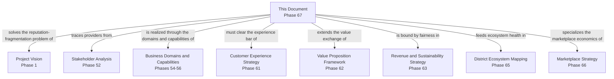

---

# Executive Artifacts

### Service Provider Ecosystem Framework

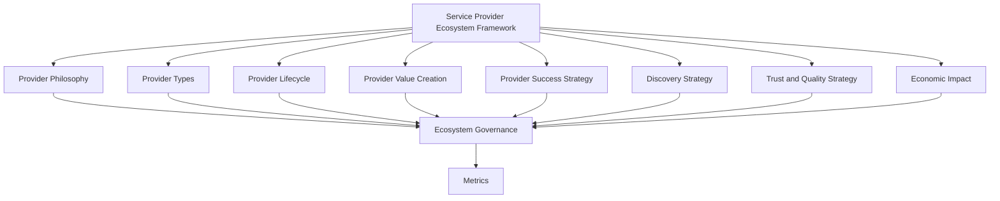

### Provider Lifecycle

See Provider Lifecycle section above — reproduced here by reference per Single Source of Truth, never duplicated.

### Provider Growth Flywheel

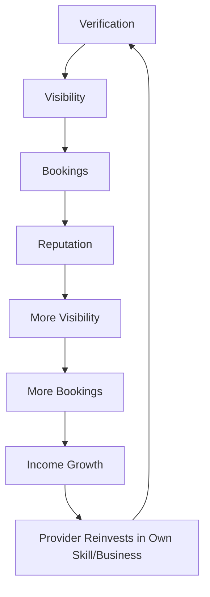

### Trust Model

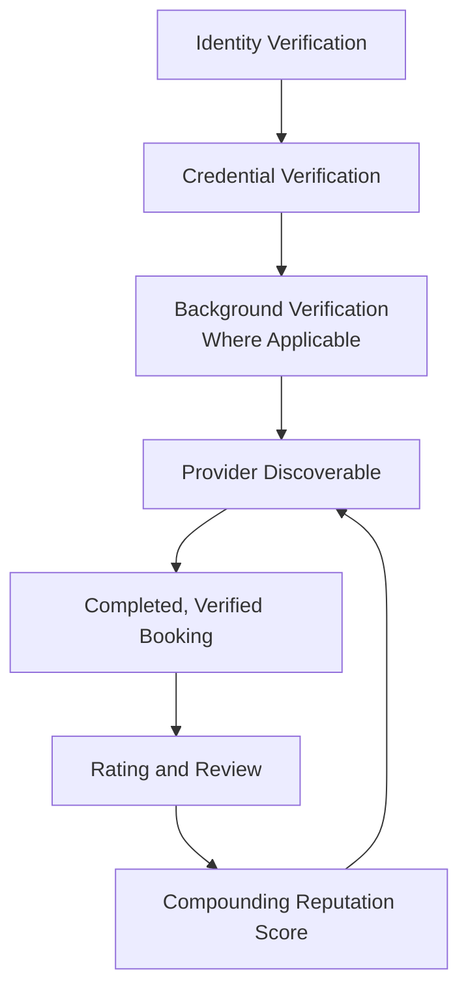

### Provider Value Chain

See Provider Value Creation section above.

### Governance Model

See Ecosystem Governance section above.

### Executive Dashboards

| Dashboard | Audience | Key Content |
|---|---|---|
| **CEO Dashboard** | CEO | Provider Ecosystem Health Score, Verified Provider growth, Trust Score |
| **Chief Service Operations Officer Dashboard** | CSOO | Active Providers, Provider Retention, category-level performance |
| **Trust & Safety Dashboard** | Head of Trust & Safety | Dispute Rate, verification turnaround, fraud-incident trend |
| **Category Dashboards** | Category Heads | Category-specific booking success, average rating, income growth |

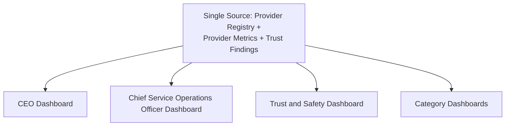

### Decision Matrix

| Decision Type | Approval Authority |
|---|---|
| New service provider category | Provider Council + CEO |
| Verification standard change | Category Head + Head of Trust & Safety |
| New provider fee structure | Provider Council + Revenue Review Board |
| Recognition/reward program | Provider Council |
| Emergency provider-trust response | Head of Trust & Safety, ratified within 5 business days |

---

# Closing Statement

> **Callout — Closing Statement**
> Every prior document in this handbook explains what Arwal builds, how it sustains itself, and the market it operates inside. This document explains the specific promise Arwal makes to the electrician, the tutor, the doctor, and the freelance photographer who choose to build their professional reputation here: that the trust they earn, one completed job at a time, will be seen, protected, and compounded — never stolen by a fake review, never buried under an undisclosed paid listing, never erased by an unfair dispute. A district's skilled workforce is one of its deepest, least-visible assets; Arwal's role is not to replace that skill, but to make it discoverable, defensible, and finally worth what it has always been worth. A service provider ecosystem grown too fast, verified too loosely, or governed too unevenly does not merely underperform — it teaches its best professionals to leave, and takes the citizens who trusted them with it. Arwal grows this ecosystem at the speed trust can actually be earned, never faster, because a generation-long civic-commercial platform cannot be built on a supply side that stopped believing the platform was on their side. Where a future phase must deviate from a principle stated here, that deviation is made explicitly — through the Ecosystem Governance process above — never silently, and never by default.

This document, `ai-docs/66-service-provider-ecosystem.md`, is Phase 67 of approximately 415. Every future provider-facing decision, verification standard, and growth program is expected to trace back to a principle defined here, or to justify its deviation in writing.

**End of Phase 67 — `ai-docs/66-service-provider-ecosystem.md`**