# Merchant Ecosystem

**Document:** `ai-docs/67-merchant-ecosystem.md`
**Project:** Arwal — The District Super App
**Stage:** 2 — Product & Business Strategy
**Phase:** 68 — Merchant Ecosystem
**Status:** Approved for Product & Engineering Reference
**Audience:** CEO, CSO, CPO, Chief Marketplace Officer, Chief Merchant Success Officer, Enterprise Business Architects, Platform Economists, Digital Commerce Consultants, Retail Transformation Specialists, Trust & Safety Strategists, Government Digital Transformation Partners, Investors

> **Callout — Purpose of This Document**
> `ai-docs/00-project-vision.md` through `ai-docs/66-service-provider-ecosystem.md` established why Arwal exists, what it can do, who it serves, how it sustains itself, how it partners with government, the whole district ecosystem it operates inside, the general economics of a two-sided marketplace, and how a skilled service provider's livelihood is protected and grown. None of those documents answers the question a shopkeeper standing behind a counter in the district headquarters market asks first: **why should I put my shop on a screen, and will doing so actually make my business — not just Arwal's — stronger?** This document is that answer — the authoritative Merchant Ecosystem strategy every future merchant-facing decision, onboarding standard, and growth program traces back to.

---

# Purpose of this Document

### Why Merchants Are a Distinct Strategic Concern, Not a Marketplace Category Footnote

`ai-docs/65-marketplace-strategy.md` established the general economics of a two-sided market. `ai-docs/66-service-provider-ecosystem.md` specialized that economics for time-bound, skill-based services, where the product is inseparable from the person delivering it. A merchant is neither of those things cleanly — a merchant sells a *good*, not a service, and their relationship to Arwal is closer to a small business's relationship to its own future than to a single transaction. A general store owner, a sweet-shop maker, a hardware dealer, and a women-led home-based tailoring business each carry a distinct commercial reality: inventory risk, seasonal demand, thin margins, and — for the overwhelming majority of a district's merchants — no prior digital presence at all. This document exists because a merchant is not merely a "seller" in the abstract sense `ai-docs/65-marketplace-strategy.md` already covers — a merchant is a small business, often a family's entire livelihood, and Arwal's relationship with that business deserves its own explicit, durable strategy.

### Why This Is a Business Strategy Document, Not an E-Commerce Implementation Guide

This document contains no inventory-management logic, no order-workflow specification, no catalog schema, and no API. `ai-docs/54-product-module-catalog.md`'s Merchant Store module and `ai-docs/57-business-process-standards.md`'s Merchant Verification and Product/Listing Approval processes already own that territory in full. This document's exclusive territory is the **business relationship** between Arwal and every merchant who stakes their commercial future on the platform — why they should join, how their business actually grows because of Arwal, how they are protected from exploitation and unfair competition, and how their success is structurally inseparable from Arwal's own.

### The Chain of Reasoning This Document Extends

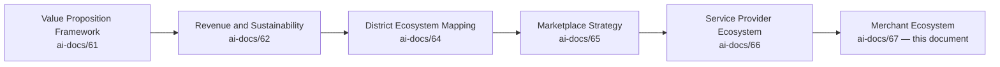

| Layer | Question It Answers |
|---|---|
| Value Proposition Framework | Why should any stakeholder trust Arwal? |
| Revenue & Sustainability Strategy | How does Arwal fund its promises for a generation? |
| District Ecosystem Mapping | What is the whole living system Arwal operates inside? |
| Marketplace Strategy | How does a two-sided market work, generally? |
| Service Provider Ecosystem | How does Arwal earn a skilled professional's trust with their livelihood? |
| **Merchant Ecosystem** (this document) | **How does Arwal specifically make a local business — often with no prior digital presence — genuinely stronger, not merely digitally present?** |

### Why Merchants Are Critical to Arwal

A district super app without a deep, trusted local merchant base is not a super app — it is a delivery app waiting for inventory. Merchants are the supply-side foundation of the Commerce Marketplace, Food, and Grocery domains simultaneously; without their genuine participation, a citizen has nothing to discover, nothing to compare, and no reason to open the app twice. Per `ai-docs/01-product-goals.md`'s Business Goals, merchant and service-provider density within 12–24 months is an explicit, load-bearing commercial milestone — not an incidental outcome of citizen growth, but a precondition for it.

### How Merchants Strengthen Local Economies

A merchant who digitizes through Arwal does not merely gain an online listing — they gain reach beyond their existing foot-traffic radius, a payment mechanism that removes cash-handling risk, and a portable reputation that a purely physical storefront could never accumulate. Multiplied across thousands of district merchants, this is measurable local economic strengthening: more income retained locally, more employment generated locally, and less value leaking to a national platform with no stake in the district's own prosperity, per `ai-docs/64-district-ecosystem-mapping.md`'s District Development Strategy.

### Why Digital Transformation Benefits Local Businesses

A shop owner who has spent a lifetime building a loyal, walk-in customer base is not being asked to abandon that base — Arwal's digital transformation is additive: the same relationship, extended to citizens the shop owner could never have reached through foot traffic alone, with the same trust the shop owner already earned in person now made *visible* to a stranger through verification and ratings. Digital transformation done well does not replace what a merchant already built; it makes that reputation portable and discoverable.

### How Merchant Success Drives Marketplace Success

Per `ai-docs/65-marketplace-strategy.md`'s Merchant Success principle, a marketplace succeeds only if its sellers succeed. A citizen who finds an empty catalog, a slow-responding merchant, or a mismanaged order does not blame the individual merchant — they blame Arwal. Merchant success is therefore not adjacent to marketplace success; it is the mechanism through which marketplace success is actually produced, transaction by transaction.

### Relationship Between Every Participant

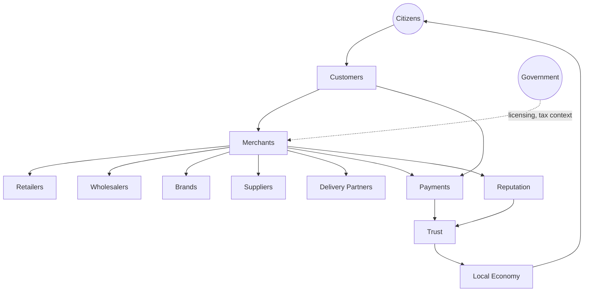

A citizen becomes a customer the moment they browse or order; the merchant fulfilling that order may source from a wholesaler, a brand, or a manufacturer-supplier, and depends on a delivery partner to complete the exchange. Every transaction produces Reputation that compounds into Trust, moves through Payments under the same settlement-integrity standard as every other transaction platform-wide, and is shaped, where relevant, by government licensing and tax context. The cumulative effect, sustained over years, is a measurably stronger local economy.

### Scope Boundary

This document does not redefine Domains (`ai-docs/53`), Capabilities (`ai-docs/55`), Modules (`ai-docs/54`), Journeys (`ai-docs/56`), Processes (`ai-docs/57`), or Rules (`ai-docs/58`) — Commerce Marketplace, Catalog Management, Merchant Onboarding, and their governing rules (RULE-010, RULE-011, RULE-012) remain fully authoritative and are cited, never restated. This document's exclusive territory is: **the strategic reasoning behind who a merchant is to Arwal, why they should participate, how their business is designed to actually grow, and how the ecosystem around them is governed and protected.**

---

# Merchant Philosophy

Every principle below exists because a merchant ecosystem built carelessly does not fail abstractly — it fails a specific shopkeeper who trusted Arwal with their livelihood and was let down by an unfair ranking, a counterfeit competitor, or a citizen exploited by their own listing.

### Citizen First
**Why it exists:** Every merchant-facing decision is judged first against whether it serves the citizen the merchant ultimately sells to, mirroring the Citizen-First tie-breaker already established throughout `ai-docs/51` through `ai-docs/66`. A merchant's convenience is real and protected, but never at the cost of a citizen receiving a misrepresented or unsafe product.

### Merchant Success
**Why it exists:** Arwal succeeds only if its merchants succeed — a platform that treats merchant income as incidental to its own commission revenue has inverted the actual causal relationship, per the identical Merchant Success principle already established in `ai-docs/65-marketplace-strategy.md`.

### Trust Before Transactions
**Why it exists:** A citizen who is deceived by even a single merchant carries that distrust into every future Arwal transaction, not merely their relationship with that one merchant. Trust is the precondition every transaction is built on, never a variable traded against transaction volume.

### Fair Competition
**Why it exists:** A marketplace where an established or well-funded merchant can use scale to unfairly suppress a small competitor has stopped being a marketplace and become a gatekeeper. Every merchant — new or established, large or small — competes on the same, disclosed rules, per `ai-docs/65-marketplace-strategy.md`'s Fair Competition principle.

### Marketplace Neutrality
**Why it exists:** A merchant's ranking reflects genuine, verified quality and relevance signals, never undisclosed payment alone — a citizen must always be able to tell a promoted listing from Arwal's own organic judgment, per `ai-docs/51-stakeholder-analysis.md`'s Conflict-of-Interest Governance.

### Transparency
**Why it exists:** A merchant must be able to see exactly why their listing ranks where it does, what commission they are actually paying, and why a decision affecting their store was made — concealment on either side breeds the same corrosive suspicion `ai-docs/60-customer-experience-strategy.md` already rejects.

### Accessibility
**Why it exists:** A merchant without a smartphone, with limited literacy, or with no prior digital experience must still be able to build a genuine digital storefront — an onboarding process that structurally excludes such a merchant has excluded exactly the merchant segment most in need of digital reach.

### Inclusiveness
**Why it exists:** A home-based, women-led, or informally-registered small business is a legitimate merchant category, not a lesser one, per the Economic Inclusion principle already established in `ai-docs/62-revenue-sustainability-strategy.md`.

### Local Business First
**Why it exists:** Arwal's merchant ecosystem exists to strengthen the district's own commercial base first — a local merchant is never structurally disadvantaged relative to a distant, non-local seller merely because the latter has greater catalog scale or marketing spend.

### Long-Term Sustainability
**Why it exists:** A merchant relationship optimized for this month's GMV at the cost of next year's merchant retention has borrowed against a trust balance that does not refill, per the identical Long-Term Sustainability principle already established in `ai-docs/62-revenue-sustainability-strategy.md`.

### Shared Prosperity
**Why it exists:** A platform that captures value from its merchant base faster than it creates value for that base will eventually be abandoned by it, per `ai-docs/62`'s Shared Prosperity principle — fee structures are held to a standard of demonstrable fairness relative to the informal channels they replace.

### Continuous Innovation
**Why it exists:** A merchant's needs — new tools, new categories, new fulfillment options — evolve as their business grows; a merchant ecosystem strategy fixed at launch and never revisited decays, mirroring the Continuous Improvement discipline already established throughout this handbook.

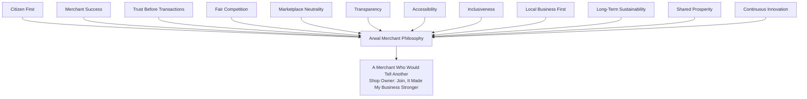

> **Callout — The One-Sentence Merchant Philosophy**
> *"A merchant's storefront on Arwal must be worth more to their business than the effort it took to build it — the day that stops being true, the best merchants leave first, and every citizen notices the emptier catalog left behind."*

---

# Merchant Types

Every category below is a strategic grouping, not an exhaustive taxonomy; each traces to the Commerce Marketplace, Food Delivery, and Grocery domains already established in `ai-docs/53` and `ai-docs/55`.

| Category | Strategic Character |
|---|---|
| **General Stores** | High-frequency, broad-catalog everyday commerce; the largest addressable merchant base and the primary proving ground for onboarding simplicity. |
| **Grocery Stores** | Recurring, household-essential commerce favoring reliability, stock accuracy, and substitution transparency over discovery novelty. |
| **Pharmacies** | Regulated, trust-critical retail with elevated scrutiny given health-adjacent stakes, per `ai-docs/54`'s MOD-015 boundary. |
| **Electronics Shops** | Higher-value, authenticity-sensitive commerce where counterfeit risk and warranty trust matter disproportionately. |
| **Clothing Stores** | Discovery- and preference-driven commerce, seasonal-demand-sensitive. |
| **Footwear Stores** | Similar dynamics to Clothing, with sizing and fit as a distinct discovery consideration. |
| **Furniture Stores** | Low-frequency, high-value, delivery-complexity-sensitive commerce. |
| **Hardware Stores** | Project- and trade-adjacent commerce, often serving both citizens and Service Providers (`ai-docs/66`) as a supply source. |
| **Agricultural Input Stores** | Seed, fertilizer, and equipment retail directly adjacent to the Agriculture ecosystem domain, per `ai-docs/64`. |
| **Book Stores** | Education-adjacent commerce with strong community and institutional linkage potential. |
| **Stationery Stores** | High-frequency, low-margin, student- and institution-serving commerce. |
| **Restaurants** | Time-sensitive, trust-critical-on-freshness commerce anchoring the Food Delivery domain. |
| **Sweet Shops** | Occasion- and festival-driven commerce with strong local-identity and trust dynamics. |
| **Bakeries** | Recurring, freshness-sensitive commerce bridging Grocery and Food categories. |
| **Wholesalers** | Bulk, business-to-business-leaning commerce, anticipated to deepen through the future B2B/Wholesale Marketplace extension, per `ai-docs/54`'s MOD-048. |
| **Manufacturers** | Local production participants whose direct-to-citizen or direct-to-merchant reach Arwal can extend beyond their existing distribution. |
| **Women-Led Businesses** | A deliberately named, strategically prioritized category given documented economic-inclusion impact and historical access barriers. |
| **Home-Based Businesses** | Merchants operating without a fixed commercial storefront — tailoring, home-cooked food, handicrafts — legitimate participants requiring accessible, low-burden onboarding. |
| **MSMEs** | Micro, Small, and Medium Enterprises spanning every category above, treated as a cross-cutting strategic priority given their outsized share of district employment. |
| **Cooperatives** | Collective merchant entities, often overlapping with `ai-docs/66`'s Community Volunteers and `ai-docs/58`'s Group/Cooperative representative-authority model (RULE-021). |
| **Future Merchant Categories** | Any category not yet active, evaluated per the Merchant Lifecycle's Discovery stage below. |

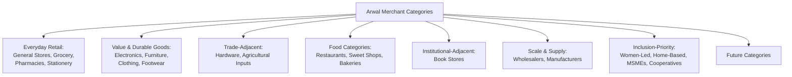

> **Callout — Inclusion-Priority Categories Are Not a Marketing Label**
> Women-Led Businesses, Home-Based Businesses, MSMEs, and Cooperatives are named explicitly, never folded silently into a generic "merchant" category, mirroring the identical Underserved and Vulnerable Stakeholder Groups discipline already established in `ai-docs/51-stakeholder-analysis.md`. Their onboarding friction, verification burden, and growth support are measured and reviewed distinctly, never assumed equivalent to a well-resourced established retailer's experience.

---

# Merchant Lifecycle

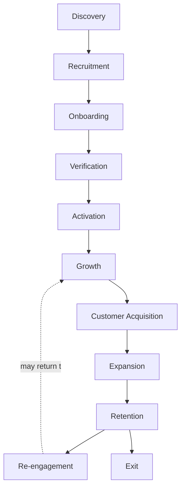

| Stage | Meaning | Owning Discipline |
|---|---|---|
| **Discovery** | Arwal, a field agent, or a merchant themselves identifies a genuine local commercial presence not yet represented on the platform. | Category strategy, this document |
| **Recruitment** | A merchant is actively invited and informed of Arwal's value proposition, per `ai-docs/61-value-proposition-framework.md`'s Merchant entry. | Field outreach, this document |
| **Onboarding** | A merchant registers and completes the radically simplified intake flow, per JRN-014 in `ai-docs/56-user-journey-standards.md`. | Merchant Onboarding capability, `ai-docs/55` |
| **Verification** | Identity and business-existence verification is completed, per RULE-002 and RULE-010. | Merchant Verification (PROC-008), `ai-docs/57` |
| **Activation** | The merchant's first genuine, completed order is fulfilled. | Order Management (CAP-025) |
| **Growth** | The merchant builds a catalog, an order history, and a rating base. | Merchant Success Strategy, below |
| **Customer Acquisition** | The merchant's storefront reaches citizens beyond their existing foot-traffic radius. | Discovery Strategy, below |
| **Expansion** | The merchant broadens their catalog, adopts premium tooling, or extends into an adjacent category. | Merchant Success Strategy, below |
| **Retention** | The merchant continues choosing Arwal as a primary or supplementary sales channel over time. | Economic Impact, below |
| **Re-engagement** | A dormant merchant (a seasonal business, a temporary closure) is welcomed back without a punitive re-verification burden, mirroring RULE-005's Account Dormancy and Reactivation standard. | Merchant Success Strategy, below |
| **Exit** | A merchant formally exits — voluntarily, or through a confirmed Trust & Safety finding — with their historical record archived, never deleted, per the Archive Never Delete principle established throughout this handbook. | Ecosystem Governance, below |

### Lifecycle Design Commitment

At every stage above, the merchant's experience is designed with the same rigor `ai-docs/56-user-journey-standards.md` requires of a citizen journey — a named Failure Scenario and Recovery Path for every stage a merchant could stall at, never a dead end where a merchant simply abandons onboarding mid-flow and quietly returns to being undiscoverable.

---

# Merchant Value Creation

| Question | Answer |
|---|---|
| **How do merchants create value?** | By offering genuinely useful, fairly priced, accurately represented goods that meet a citizen's real need — the platform amplifies this value, it does not manufacture it. |
| **How do customers create value?** | By providing honest, transaction-verified feedback that lets the next citizen make a confident choice, and by paying promptly for completed orders. |
| **How does Arwal create value?** | By converting an informal, foot-traffic-limited local presence into a discoverable, verified, portable-reputation digital storefront — reach, verification, secure payment, and dispute protection a merchant could not build alone. |
| **How does trust develop?** | Through Identity Verification (CAP-001) and Merchant Verification (CAP-016, CAP-021), compounding through every successfully completed, reviewed order. |
| **How does reputation compound?** | Through Reputation & Rating Management (CAP-045) — a portable signal that grows across every customer a merchant serves, never resetting per platform the way an informal reputation would if the merchant tried a different app. |
| **How does local commerce grow?** | Through expanded addressable reach — a merchant discoverable beyond their immediate street or block reaches citizens who would never have walked past their shop. |
| **How do merchants become long-term partners?** | Through sustained, multi-year participation where growth in Arwal-driven revenue becomes a genuine, trusted share of the merchant's total business, never a precarious, one-off experiment. |

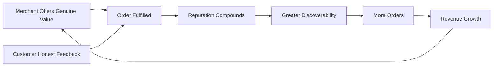

---

# Merchant Success Strategy

| Dimension | Strategic Commitment |
|---|---|
| **Digital Presence** | Every verified merchant receives a genuine, professional-looking digital storefront regardless of their prior technical skill, per the Radically Simplified Onboarding commitment already established in `ai-docs/01-product-goals.md`. |
| **Store Visibility** | Visibility is earned through verification, catalog completeness, and quality — never withheld as an artificial growth lever a merchant must pay to unlock. |
| **Customer Acquisition** | Discovery and Search surface a merchant to citizens genuinely searching for what they sell, expanding reach beyond existing foot traffic. |
| **Repeat Customers** | Notification and discovery design favor a citizen's easy return to a merchant they already trust, over always resurfacing an unfamiliar alternative. |
| **Pricing Fairness** | A merchant sets their own prices within a transparent, disclosed commission structure, per `ai-docs/62-revenue-sustainability-strategy.md`'s Fair Monetization principle — Arwal never dictates a merchant's retail price. |
| **Promotions** | Where a merchant chooses to invest in promoted visibility, that promotion is always disclosed and never disguised as organic ranking, per Marketplace Neutrality above. |
| **Business Analytics** | Merchants gain access to their own sales, stock-turnover, and customer-repeat data — insight most small merchants have never had visibility into before, per Analytics (CAP-034). |
| **Growth Opportunities** | Tools appropriate to a merchant's scale (a single-owner general store vs. an MSME with staff) are offered progressively, per the Progressive Complexity principle already established in `ai-docs/00-project-vision.md`. |
| **Loyalty** | Recognition mechanisms (a verified-and-tenured badge, a featured local-favorite placement) reward sustained quality without becoming a pay-to-win mechanism. |
| **Long-Term Success** | Every mechanism above is evaluated on a multi-year horizon — a merchant's five-year trajectory on Arwal, not their first sale alone, is the measure of whether this strategy is working. |

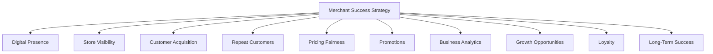

---

# Discovery Strategy

| Mechanism | Strategic Role |
|---|---|
| **Search** | The primary, trusted, intent-driven entry point for a citizen with a specific product need, per CAP-030. |
| **Nearby Merchants** | Hyperlocal ranking reflecting genuine fulfillment feasibility — proximity matters directly for same-day and same-hour delivery expectations. |
| **Recommendations** | Personalized surfacing scoped to a citizen's actual need and history, per CAP-032, never a substitute for organic relevance. |
| **Categories** | Browsable structure for a citizen who has a general need but not yet a specific query. |
| **Verified Merchants** | Verification status is always visible and never spoofable, the single strongest discovery-trust signal a citizen can rely on before their first order with an unfamiliar shop. |
| **Ratings** | A quantified, aggregated, transaction-verified trust signal, per RULE-022. |
| **Popular Stores** | Genuine, organically-earned popularity signals (order volume, repeat-customer rate) surfaced honestly, never manufactured. |
| **New Stores** | A dedicated discovery surface ensuring a newly onboarded merchant is not structurally invisible behind established competitors. |
| **Fair Visibility** | A structural on-ramp exists for a new, verified merchant to reach their first orders — discovery is never purely incumbency-reinforcing. |

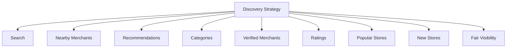

---

# Trust & Quality Strategy

| Mechanism | Strategic Role |
|---|---|
| **Merchant Verification** | Every merchant's real-world identity is confirmed before any listing is discoverable, per CAP-001, CAP-016, and RULE-010 — the non-negotiable floor for every category. |
| **Business Identity** | Business-existence evidence (a registration document, or a field-agent attestation for an informal sole proprietor) is confirmed, per RULE-010's Merchant Onboarding Eligibility, never assumed from a self-declared name alone. |
| **Licensing** | Where a category carries a regulatory licensing requirement (pharmacies, food establishments), that license is verified as part of onboarding, never treated as optional documentation. |
| **Product Authenticity** | Listings are screened for prohibited or misrepresented content, per RULE-011's Product Listing Prohibited Content standard, with ambiguous cases defaulting to held-for-review rather than auto-published. |
| **Ratings** | Accepted only from a verified, completed transaction, per RULE-022 — never open, unauthenticated submission. |
| **Reviews** | Qualitative evidence, moderated per PROC-016's Content Moderation Standard, detectable and correctable if manipulated. |
| **Complaint Resolution** | A structured, evidence-based path to a fair outcome for both the citizen and the merchant, per CAP-036 and RULE-013. |
| **Consumer Protection** | A citizen's right to a fair remedy — a refund, a return, an escalation — is never negotiable away by a merchant's own terms, per RULE-013 and RULE-028. |
| **Merchant Protection** | A merchant is equally protected from a bad-faith or abusive customer claim; enforcement action against a merchant requires the same evidentiary rigor, and above Medium severity the same four-eyes sign-off, regardless of the merchant's size or tenure, per RULE-027. |
| **Marketplace Fairness** | Enforcement, ranking, and support quality are applied consistently across every merchant, never distorted by revenue contribution or relationship tenure, per Marketplace Neutrality above. |

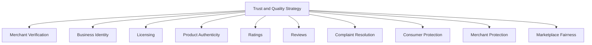

> **Callout — Verification Rigor Scales With Category Risk, Never Uniformly**
> A stationery store and a pharmacy are both merchants, but they are not held to the same verification bar — per the identical Proportional Rigor principle already established throughout this handbook, verification depth scales with the citizen-facing consequence of a category's failure, never applied as a single blanket standard that under-protects a regulated category or over-burdens a low-risk one.

---

# Economic Impact

| Impact Area | How Arwal Contributes |
|---|---|
| **Increase Merchant Revenue** | Expanded discoverability beyond a merchant's existing foot-traffic radius, plus repeat-customer retention mechanisms, per the Merchant Success Strategy above. |
| **Digitize Local Businesses** | Radically simple onboarding converts a purely physical shop into a discoverable, professional digital storefront for the first time. |
| **Strengthen MSMEs** | Business Analytics and progressive Growth Opportunities give a micro or small enterprise tools historically available only to larger, better-resourced competitors. |
| **Support Women Entrepreneurs** | Women-Led Businesses are treated as a named, monitored inclusion-priority category, with onboarding and support designed against documented access barriers, per `ai-docs/51-stakeholder-analysis.md`. |
| **Promote Local Manufacturing** | Manufacturer and Wholesaler categories gain direct-to-citizen or direct-to-merchant reach beyond their existing distribution footprint. |
| **Generate Employment** | Growing merchant categories create demand for supporting roles — shop staff, delivery capacity — within a merchant's own small business. |
| **Increase District Commerce** | A merchant discoverable beyond their immediate street expands the total addressable market for local goods, growing genuine district-wide commercial activity rather than merely redistributing existing spend. |
| **Support Sustainable Economic Growth** | Income earned by a district's own merchants is spent within the same district, reinforcing the District Development Strategy already established in `ai-docs/64-district-ecosystem-mapping.md`. |

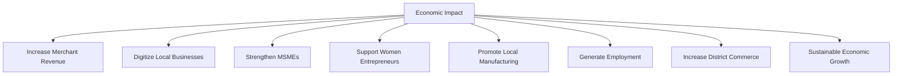

---

# Merchant Ecosystem Governance

### Ownership
Merchant Ecosystem strategy ownership sits with the Chief Merchant Success Officer (or CPO where the role is combined), with each category's Business Owner — per `ai-docs/53`'s Domain Registry — accountable for their own category's execution, mirroring the Clear Ownership discipline already established throughout `ai-docs/53` through `ai-docs/66`.

### Merchant Council
A standing **Merchant Council** — chaired by the Chief Merchant Success Officer, with the Head of Trust & Safety, Head of Merchant Success, CPO, and rotating category-representative merchants as members — holds approval authority over any platform-wide ranking-policy change, any new merchant-facing fee or promotion mechanism, and any material deviation from the Anti-Patterns below. The Council meets monthly, with ad hoc sessions for a Merchant Ecosystem Health Score regression. Merchant representation on the Council is a deliberate mechanism ensuring merchants are consulted on decisions affecting their own livelihood, never merely informed after the fact.

### Decision Authority

| Decision | Approves |
|---|---|
| New merchant category activation | Merchant Council + CEO |
| Ranking algorithm policy change affecting merchant listings | Merchant Council |
| New promoted-visibility mechanism | Merchant Council + Revenue Review Board (`ai-docs/62`) |
| Category-specific verification standard change (e.g., pharmacy licensing) | Category Head + Head of Trust & Safety |
| Merchant recognition/reward program | Merchant Council |
| Emergency merchant-trust response (e.g., a counterfeit-goods wave) | Head of Trust & Safety, immediate, ratified by Council within 5 business days |

### Review Cadence

| Review | Cadence | Owner |
|---|---|---|
| Merchant Ecosystem Health Review | Monthly | Merchant Council |
| Category Performance Review | Quarterly | Category Heads |
| Annual Merchant Ecosystem Strategy Review | Annual | CEO, Chief Merchant Success Officer, CPO |

### Conflict Resolution
A citizen-merchant dispute follows PROC-013 and RULE-013 in full; a merchant's disagreement with a platform decision (a ranking outcome, a verification rejection) follows the identical Appeal right already established in RULE-028, reviewed by an independent reviewer distinct from the original decision-maker.

### Continuous Improvement
Every review above feeds a shared, tracked improvement backlog — a recurring category-specific complaint pattern, an onboarding bottleneck, or a merchant-suggested refinement — reviewed and prioritized at the next Merchant Ecosystem Health Review, never left to informally resolve itself.

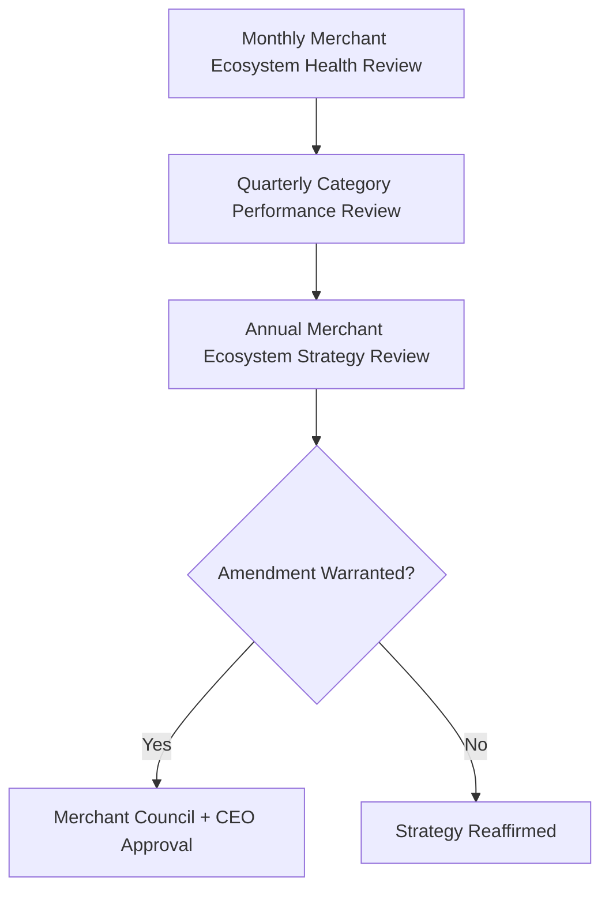

---

# Risks

| Risk | Description | Mitigation |
|---|---|---|
| **Counterfeit Products** | A merchant lists a misrepresented or counterfeit good. | RULE-011's Product Listing Prohibited Content standard; automated screening with a fail-closed default for ambiguous cases. |
| **Fraud** | A merchant misrepresents identity, business existence, or completed orders. | Merchant Verification (CAP-016), Fraud Detection (CAP-038), four-eyes enforcement per RULE-027. |
| **Marketplace Imbalance** | A single large merchant or category dominates at smaller merchants' expense. | Fair Competition and Balanced Incentives monitoring, per `ai-docs/64`'s Ecosystem Health. |
| **Price Manipulation** | Coordinated or predatory pricing distorting fair category competition. | Trust & Safety monitoring; Marketplace Neutrality principle above. |
| **Poor Merchant Quality** | A merchant passes initial verification but delivers consistently poor fulfillment. | Ongoing quality monitoring distinct from one-time onboarding verification, feeding into Performance Improvement support before punitive action. |
| **Fake Reviews** | A merchant manipulates their own rating, or a competitor sabotages another's. | RULE-022's transaction-verified review standard; Content Moderation (PROC-016) pattern detection. |
| **Merchant Churn** | Merchants disengage after a poor first experience or perceived unfairness. | Merchant Success Strategy's Long-Term Success discipline; Voice of Customer-equivalent feedback loops extended to merchants. |
| **Oversaturation** | Too many merchants in a category relative to genuine demand, depressing individual merchant revenue. | Category-growth pacing per the Merchant Lifecycle's Discovery stage, informed by demand signals before aggressive onboarding campaigns. |
| **Supply Disruption** | A merchant's own upstream supply (a wholesaler, a manufacturer) fails, disrupting fulfillment. | Diversified merchant base per category; transparent stock-status signaling to citizens, per RULE-011's related Inventory Management discipline. |
| **Trust Erosion** | A single mishandled merchant-related incident damages category-wide or platform-wide trust. | Transparent, evidence-based dispute resolution per RULE-013 and RULE-028; rapid, honest incident communication. |

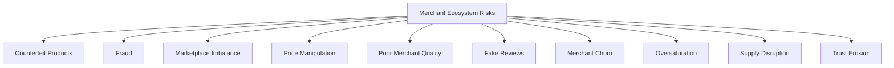

---

# Metrics

| Metric | Definition | Direction |
|---|---|---|
| **Verified Merchants** | Count of merchants passing their category's full verification standard. | Increasing |
| **Active Merchants** | Verified merchants completing at least one order within a defined rolling window. | Increasing |
| **Merchant Retention** | Rate at which onboarded merchants remain active over time. | Increasing |
| **Merchant Revenue Growth** | Merchant-reported income improvement attributable to Arwal, per `ai-docs/50`'s Business Enablement KPI family. | Increasing |
| **Average Ratings** | Aggregated, transaction-verified rating per category. | Increasing, or sustained at a high baseline |
| **Repeat Purchases** | Share of orders from a customer who has ordered from the same merchant before. | Increasing |
| **Customer Satisfaction** | CSAT specific to merchant-fulfilled interactions, per `ai-docs/60-customer-experience-strategy.md`'s Experience Metrics. | Increasing |
| **Marketplace Liquidity** | Search-to-successful-order rate specific to merchant categories, per `ai-docs/65`'s Liquidity metric. | Increasing |
| **Trust Score** | District Trust Signal, viewed for merchant interactions specifically. | Increasing |
| **Merchant Ecosystem Health** | A composite index combining Verified Merchant growth, Retention, Trust Score, and Dispute Rate. | Increasing |

> **Callout — No Merchant Metric Stands Alone**
> Per the North Star Principle already established in `ai-docs/00-project-vision.md`, a rising Active Merchant count alongside a falling Average Rating or rising Dispute Rate is treated as a regression — never counted as success in isolation.

---

# Anti-Patterns

| Anti-Pattern | Why It's Rejected |
|---|---|
| **Pay-for-ranking** | Undisclosed paid ranking violates Marketplace Neutrality; a merchant's visibility must reflect genuine quality, never budget alone. |
| **Counterfeit listings** | Directly violates RULE-011's Product Listing Prohibited Content standard and endangers citizen trust and safety. |
| **Ignoring MSMEs** | Treating small and micro merchants as a lesser priority than large, established sellers violates Local Business First and Economic Inclusion. |
| **Merchant favoritism** | Applying enforcement or ranking inconsistently based on a merchant's size, tenure, or revenue contribution violates Marketplace Neutrality and Merchant Protection. |
| **Poor verification** | A verification process bypassed, gamed, or applied inconsistently across merchants undermines the entire Trust & Quality Strategy. |
| **Marketplace bias** | Structurally favoring one merchant category or size class over another violates Fair Competition. |
| **Growth without trust** | A rising Active Merchant count alongside a falling Trust Score is a regression, never a win. |
| **Low-quality onboarding** | An onboarding process so burdensome or confusing that only the most digitally fluent merchants complete it violates Accessibility and Fair Opportunity. |
| **Short-term optimization** | Trading long-term merchant retention for a single quarter's commission revenue violates Long-Term Sustainability. |

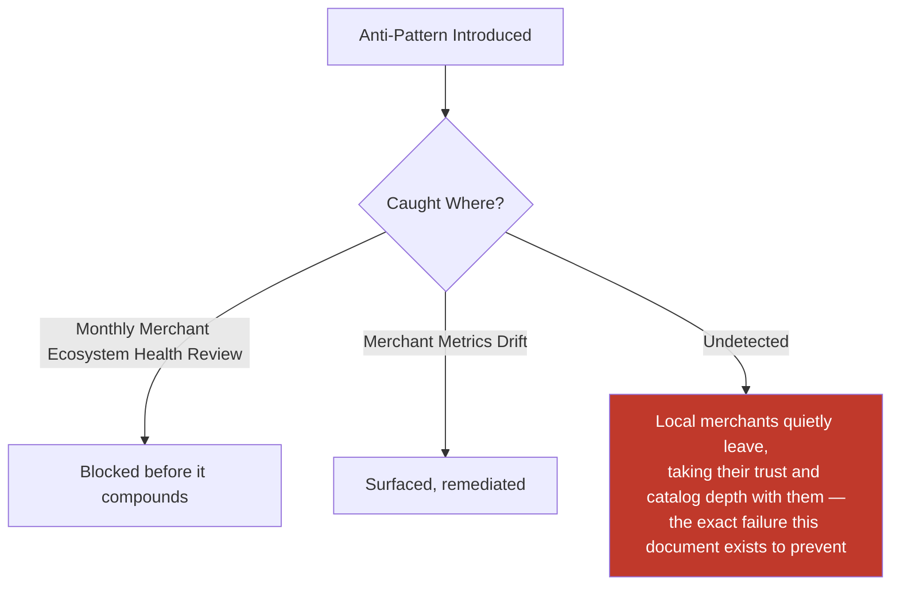

---

# Relationship to Previous Documents

| Prior Document | Relationship |
|---|---|
| **Project Vision (`ai-docs/00`)** | Establishes the founding fragmentation problem this document solves for local merchants specifically — no affordable digital storefront, no portable reputation, no reach beyond foot traffic. |
| **Stakeholder Analysis (`ai-docs/51`)** | Supplies the Local Businesses, Merchants, and Women-Led Businesses stakeholder registry every category in this document traces to. |
| **Business Domain Model (`ai-docs/53`)** | Supplies the ownership structure behind Commerce Marketplace, Food Delivery, and Grocery domains this document's merchant categories are realized within. |
| **Business Capability Map (`ai-docs/55`)** | Supplies the stable abilities — Merchant Onboarding (CAP-021), Catalog Management (CAP-022), Reputation & Rating Management (CAP-045) — this document's strategy is built directly on top of. |
| **Customer Experience Strategy (`ai-docs/60`)** | Supplies the felt-experience bar every merchant interaction must clear on the citizen side. |
| **Value Proposition Framework (`ai-docs/61`)** | Supplies the Merchant and Local Business stakeholder value exchange this document extends into a full ecosystem strategy. |
| **Revenue & Sustainability Strategy (`ai-docs/62`)** | Supplies the Fair Monetization and Shared Prosperity safeguards this document's Merchant Success Strategy is bound by. |
| **Government Partnership Strategy (`ai-docs/63`)** | Supplies the licensing and regulatory-coordination context relevant to Pharmacies and other regulated merchant categories. |
| **District Ecosystem Mapping (`ai-docs/64`)** | Supplies the whole-system Ecosystem Health view this document's merchant-specific health metrics feed into. |
| **Marketplace Strategy (`ai-docs/65`)** | Supplies the general two-sided-market economics — liquidity, network effects, discovery — this document specializes for goods-based, small-business commerce specifically. |
| **Service Provider Ecosystem (`ai-docs/66`)** | Supplies the sibling strategic model for time-bound, skill-based work; this document is its goods-based counterpart, sharing the same Trust & Safety discipline while addressing distinct inventory, licensing, and small-business dynamics. |
| **Business Glossary (`ai-docs/59`)** | Supplies the precise vocabulary (Merchant, Vendor, Marketplace, Order, Listing, Reputation, Dispute, Appeal) this document's every claim is expressed in. |

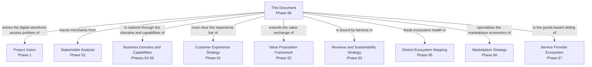

---

# Executive Artifacts

### Merchant Ecosystem Framework

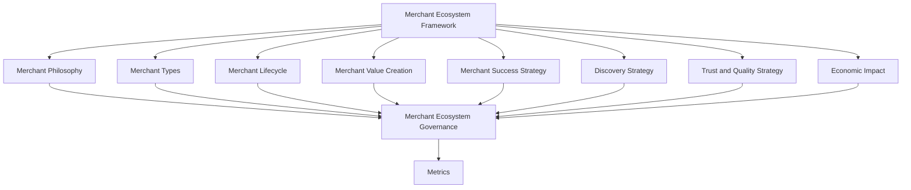

### Merchant Lifecycle

See Merchant Lifecycle section above — reproduced here by reference per Single Source of Truth, never duplicated.

### Merchant Growth Flywheel

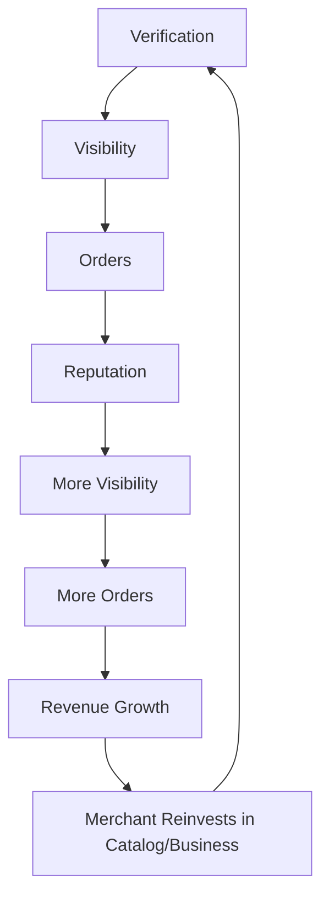

### Merchant Value Chain

See Merchant Value Creation section above.

### Trust Model

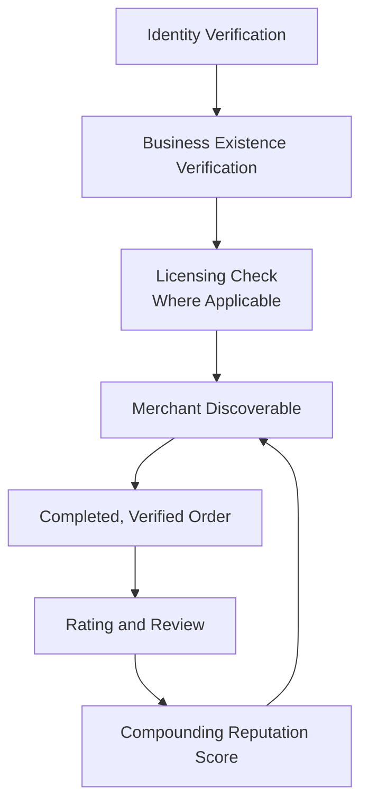

### Governance Model

See Merchant Ecosystem Governance section above.

### Executive Dashboards

| Dashboard | Audience | Key Content |
|---|---|---|
| **CEO Dashboard** | CEO | Merchant Ecosystem Health Score, Verified Merchant growth, Trust Score |
| **Chief Merchant Success Officer Dashboard** | CMSO | Active Merchants, Merchant Retention, category-level performance |
| **Trust & Safety Dashboard** | Head of Trust & Safety | Dispute Rate, verification turnaround, counterfeit/fraud-incident trend |
| **Category Dashboards** | Category Heads | Category-specific order success, average rating, revenue growth |

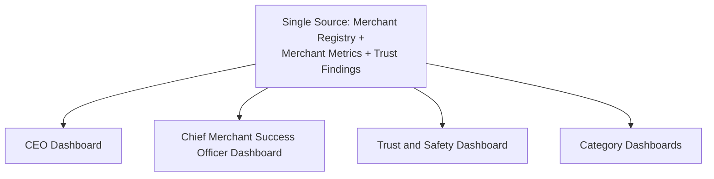

### Decision Matrix

| Decision Type | Approval Authority |
|---|---|
| New merchant category | Merchant Council + CEO |
| Ranking policy change | Merchant Council |
| New promotion mechanism | Merchant Council + Revenue Review Board |
| Verification standard change | Category Head + Head of Trust & Safety |
| Recognition/reward program | Merchant Council |
| Emergency merchant-trust response | Head of Trust & Safety, ratified within 5 business days |

---

# Closing Statement

> **Callout — Closing Statement**
> Every prior document in this handbook explains what Arwal builds, how it sustains itself, and the market it operates inside. This document explains the specific promise Arwal makes to the general-store owner, the sweet-shop maker, the hardware dealer, and the home-based tailor who choose to put their business on Arwal: that the reach they gain will be real, the reputation they build will be theirs to keep, and the competition they face will be fair. A district's local merchants are not a supply source for Arwal's catalog — they are the district's own economy, and Arwal's only durable role in that economy is to make it more discoverable, more trusted, and more prosperous than it was before Arwal arrived. A merchant ecosystem grown too fast, verified too loosely, or governed too unevenly does not merely underperform — it teaches its best shopkeepers that digital presence was not worth the effort, and takes the citizens who trusted those shops with it. Arwal grows this ecosystem at the speed trust can actually be earned, never faster, because a generation-long civic-commercial platform cannot be built on a merchant base that stopped believing the platform was on their side. Where a future phase must deviate from a principle stated here, that deviation is made explicitly — through the Merchant Ecosystem Governance process above — never silently, and never by default.

This document, `ai-docs/67-merchant-ecosystem.md`, is Phase 68 of approximately 415. Every future merchant-facing decision, onboarding standard, and growth program is expected to trace back to a principle defined here, or to justify its deviation in writing.

**End of Phase 68 — `ai-docs/67-merchant-ecosystem.md`**