# Agriculture Business Model

**Document:** `ai-docs/68-agriculture-business-model.md`
**Project:** Arwal — The District Super App
**Stage:** 2 — Product & Business Strategy
**Phase:** 69 — Agriculture Business Model
**Status:** Approved for Product & Engineering Reference
**Audience:** CEO, CSO, CPO, Chief Agriculture Officer, Enterprise Business Architects, Rural Development Consultants, Agricultural Economists, Agri-Commerce Strategists, Government Partnership Specialists, Marketplace Economists, Trust & Safety Strategists, Investors

> **Callout — Purpose of This Document**
> `ai-docs/00-project-vision.md` through `ai-docs/67-merchant-ecosystem.md` established why Arwal exists, what it can do, who it serves, how it sustains itself, how it partners with government, the whole district ecosystem it operates inside, the general economics of a marketplace, and how service providers and merchants build sustainable livelihoods on the platform. None of those documents answers the question a smallholder farmer standing in her own field, phone in hand, asks first: **why should I trust this platform with the single most consequential economic decision of my season — when and to whom I sell my harvest — and will it actually leave me better off than the middleman I already know?** This document is that answer — the authoritative Agriculture Business Model every future farmer-facing decision, mandi integration, and rural growth program traces back to.

---

# Purpose of this Document

### Why Agriculture Requires Its Own Business Model, Not a Marketplace Footnote

`ai-docs/65-marketplace-strategy.md` established the general economics of a two-sided market. `ai-docs/66-service-provider-ecosystem.md` and `ai-docs/67-merchant-ecosystem.md` specialized that economics for skilled labor and small retail respectively. Agriculture is neither of those things cleanly. A farmer is simultaneously a producer, a price-taker in a market they rarely control, a household economic unit exposed to weather and seasonality no merchant or service provider faces, and — for the majority of Arwal's founding district — the single largest population segment the platform exists to serve, per `ai-docs/01-product-goals.md`'s User Goals. A harvest cannot be re-listed next week if it goes unsold; a season lost to bad information or exploitative pricing cannot be recovered until the next one. This asymmetry of stakes is why agriculture demands its own explicit, durable business model rather than inheriting one built for retail or services.

### Why This Is a Business Strategy Document, Not a Farming Guide

This document contains no crop-specific advisory logic, no agronomy formulas, no IoT or sensor specifications, and no government scheme implementation detail. It does not redefine Domains (`ai-docs/53`), Capabilities (`ai-docs/55`), Modules (`ai-docs/54`), Journeys (`ai-docs/56`), Processes (`ai-docs/57`), or Rules (`ai-docs/58`) — Agriculture (DOM-004), Market Intelligence (CAP-012), Farmer Advisory (CAP-011), and Direct-to-Buyer Marketplace (CAP-013) remain fully authoritative and are cited, never restated. This document's exclusive territory is: **the strategic reasoning behind who a farmer is to Arwal, why agriculture is a durable strategic pillar, how the agricultural value chain and its stakeholders relate to one another, and how the ecosystem around agriculture is governed, protected, and grown.**

### The Chain of Reasoning This Document Extends

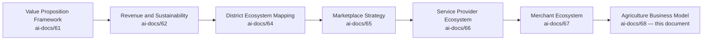

| Layer | Question It Answers |
|---|---|
| Value Proposition Framework | Why should any stakeholder trust Arwal? |
| Revenue & Sustainability Strategy | How does Arwal fund its promises for a generation? |
| District Ecosystem Mapping | What is the whole living system Arwal operates inside? |
| Marketplace Strategy | How does a two-sided market work, generally? |
| Service Provider Ecosystem | How does Arwal earn a skilled professional's trust with their livelihood? |
| Merchant Ecosystem | How does Arwal make a local business genuinely stronger? |
| **Agriculture Business Model** (this document) | **How does Arwal earn a farmer's trust with their harvest, their land, and their household's economic survival — and how does the district's rural economy grow because of it?** |

### Why Agriculture Is a Strategic Pillar, Not a Feature

Per `ai-docs/00-project-vision.md`'s founding Problem Statement, a farmer today lacks integrated access to mandi prices, weather intelligence, government schemes, and direct-to-buyer marketplaces — spread across five different informal, unreliable systems, if they exist at all. Agriculture is named explicitly, from Phase 1, as a Core Domain (`ai-docs/53`) and a Must-Have-adjacent priority (`ai-docs/01-product-goals.md`'s Should Have tier, escalating in strategic weight as district trust matures). A district super app that succeeds in commerce and civic services while leaving its farmers behind has not achieved its founding mission — it has merely served the district's more digitally convenient half.

### How Digital Access Transforms Farmer Livelihoods

A farmer who can verify today's actual mandi price before a middleman quotes one is a farmer who negotiates from a position of knowledge rather than dependency. A farmer who receives a weather alert before an unseasonal rain is a farmer who protects a harvest that would otherwise be lost. A farmer who can list produce directly to a verified buyer bypasses a chain of intermediaries each taking a margin without adding proportionate value. None of this requires displacing the existing agricultural economy — it requires making that economy transparent, informed, and navigable on fairer terms.

### How Agriculture Connects Every Other Part of the District Ecosystem

Agriculture is never an isolated vertical. A farmer's Scheme Eligibility (CAP-010) sits jointly with Government Services; a farmer's produce sale depends on Logistics and Payments; a farmer's household may include a Citizen using Healthcare, a Student using Education, and a member of a Self-Help Group using Community capabilities. Agriculture is the vertical most likely, per `ai-docs/64-district-ecosystem-mapping.md`'s Cross-Domain Collaboration reasoning, to demonstrate Arwal's structural advantage: one identity compounding trust and value across a household's entire relationship with the platform.

### Relationship Between Every Participant

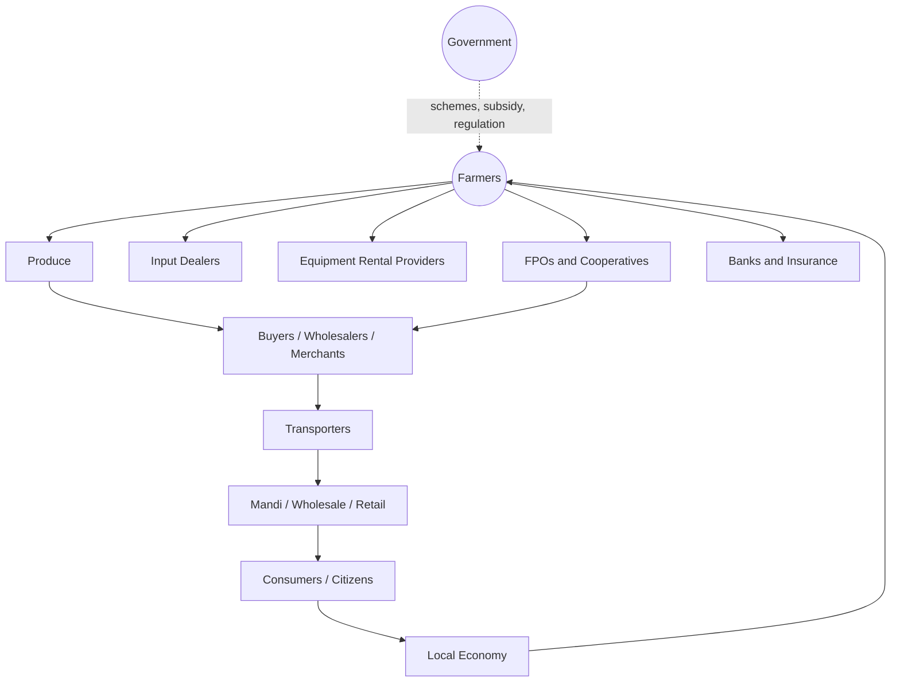

A farmer's produce moves through input procurement, cultivation, harvest, and market linkage to reach a buyer, wholesaler, or citizen consumer — with FPOs and cooperatives aggregating individual farmers into collective bargaining power, transporters and warehouses bridging farm and market, and banks, insurance providers, and government schemes surrounding the entire chain with financial and policy support. The value that returns to the local economy through this chain is what, over years, strengthens the farmer's own household and the district's own prosperity.

### Scope Boundary

This document does not define agronomy practices, does not specify crop advisory algorithms, does not define IoT sensor integration, and does not redraft any government scheme's own eligibility logic — those remain government authority, cited per `ai-docs/58-business-rules-policies.md`'s RULE-008, never redefined here. This document's territory is strategic and economic: the business model, the stakeholder relationships, the value chain, and the governance that makes Arwal's agricultural participation trustworthy and durable.

---

# Agriculture Philosophy

Every principle below exists because an agriculture strategy designed carelessly does not fail abstractly — it fails a specific farmer whose harvest was undersold, whose trust was exploited, or whose household income depended on a promise Arwal did not keep.

### Farmer First
**Why it exists:** Every agriculture decision is judged first against whether it serves the farmer's actual economic interest, mirroring the identical Citizen-First tie-breaker already established throughout `ai-docs/51` through `ai-docs/67`. A buyer's convenience, a logistics partner's margin, or Arwal's own commission are never optimized ahead of a farmer's fair return.

### Fair Market Access
**Why it exists:** A farmer's structural disadvantage today is not a lack of produce to sell — it is a lack of access to the full set of buyers who would genuinely compete for that produce. Fair Market Access means every farmer, regardless of landholding size, reaches the same transparent market information and buyer discovery every other farmer does.

### Transparency
**Why it exists:** A price a farmer cannot verify independently is a price they must simply trust — and trust extended to an unaccountable middleman is exactly the exploitation Arwal exists to end. Every price, fee, and buyer relationship is disclosed in plain language, per RULE-032's Accessibility Non-Negotiable Floor.

### Trust Before Transactions
**Why it exists:** A farmer's harvest is often their household's entire annual income realized in a single, irreversible transaction. Trust is not a nice-to-have layered on top of a sale — it is the precondition without which a farmer would never risk that transaction on an unfamiliar platform at all.

### Accessibility
**Why it exists:** A meaningful share of Arwal's farmer population is a first-generation smartphone user with limited literacy and intermittent connectivity, per PER-002 Meena in `ai-docs/52-user-personas-user-segmentation.md`. Voice-first, offline-capable design is the floor, never an enhancement.

### Inclusiveness
**Why it exists:** A smallholder or marginal farmer with less than an acre is a legitimate participant, not a lesser one — a business model that only works economically for a large commercial farmer has captured a fraction of the district's actual farming population.

### Sustainability
**Why it exists:** A business model that maximizes short-term transaction volume at the cost of soil health, water use, or long-term land productivity has traded away the very asset — the district's agricultural base — the entire strategy depends on existing in ten years.

### Climate Resilience
**Why it exists:** A farmer's single greatest uncontrollable risk is weather. A platform that helps a farmer anticipate and adapt to that risk — rather than merely reporting it after the fact — provides value no informal channel can match.

### Local Prosperity
**Why it exists:** Value created by a district's farmers should measurably strengthen the district's own economy — more farmer income spent locally, more employment in local input supply and logistics — never merely redirected toward a distant intermediary who happens to operate a bigger warehouse.

### Knowledge Sharing
**Why it exists:** A farmer's most valuable asset beyond their land is accumulated agricultural knowledge — and knowledge shared across a farming community (through FPOs, cooperatives, and peer networks) compounds faster than knowledge held individually.

### Data Responsibility
**Why it exists:** A farmer's land records, income data, and scheme-eligibility attributes are sensitive, per RULE-003's Consent Requirement — used only for a stated, consented purpose, never repurposed to build a pricing advantage against the farmer who provided it.

### Long-Term Rural Development
**Why it exists:** Arwal's agriculture strategy is evaluated on a multi-year, multi-season horizon — a single strong harvest quarter is not success if the underlying trust, sustainability, or market fairness were compromised to produce it, mirroring the identical Long-Term Sustainability principle already established in `ai-docs/62-revenue-sustainability-strategy.md`.

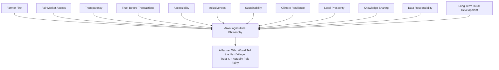

> **Callout — The One-Sentence Agriculture Philosophy**
> *"A farmer risks an entire season's income on a single sale — Arwal's only justification for standing in that transaction is that the farmer ends up measurably, honestly better off than the middleman they already knew."*

---

# Agriculture Value Chain

| Stage | Business Description |
|---|---|
| **Input Procurement** | A farmer sources seed, fertilizer, and equipment access before cultivation begins — the first point at which cost, authenticity, and fair pricing shape the season's eventual margin. |
| **Seed** | Access to genuine, quality seed at a fair price, verified against counterfeit and substandard-input risk. |
| **Fertilizer** | Availability and price transparency for agricultural inputs, connected to Input Dealers as a distinct, verifiable stakeholder category. |
| **Equipment** | Access to machinery (tractors, harvesters, irrigation equipment) a smallholder could not economically own individually, via rental rather than purchase. |
| **Cultivation** | The farmer's own labor and land, supported — never replaced — by advisory intelligence on timing, weather, and market outlook. |
| **Crop Advisory** | Timely, plainspoken guidance on planting windows, weather resilience, and scheme-linked support, delivered without ever substituting Arwal's judgment for the farmer's own experience or a government agricultural officer's authority. |
| **Harvest** | The moment of realized yield, and the point at which market-timing decisions become economically consequential and time-sensitive. |
| **Storage** | Post-harvest holding, where spoilage risk and storage-cost transparency directly affect a farmer's eventual realized price. |
| **Transportation** | Movement of produce from farm to market, coordinated through the same Logistics domain (DOM-011) serving every other vertical. |
| **Mandi** | The traditional wholesale market channel, whose price data Arwal makes transparent and verifiable rather than replacing. |
| **Wholesale** | Bulk buyer transactions, increasingly disintermediated through Direct-to-Buyer Marketplace (CAP-013) where a farmer chooses to bypass a layer of margin-taking intermediaries. |
| **Retail** | The eventual point of sale to an end consumer, whether through a Merchant (`ai-docs/67`) or a farmer's own direct citizen-facing listing. |
| **Consumer** | The citizen whose food security and fair pricing are the ultimate measure of whether the value chain functioned honestly end to end. |
| **Waste Reduction** | Reduced spoilage and forced distress-sale through better market-timing information and storage-access transparency. |
| **Value Addition** | Opportunities for a farmer or FPO to capture more of the value chain themselves — grading, packaging, or basic processing — rather than surrendering that margin entirely to a downstream intermediary. |

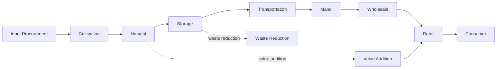

> **Callout — Arwal Makes the Chain Visible, Never Replaces Its Links**
> Arwal does not become the mandi, the transporter, or the input dealer — it makes every stage of this chain transparent, comparable, and accountable to the farmer navigating it, exactly as it does for a citizen navigating Government Services (`ai-docs/63`) without becoming the government itself.

---

# Stakeholder Ecosystem

Every stakeholder below traces to its full Persona (`ai-docs/52`) and Stakeholder (`ai-docs/51`) record; this section states only the stakeholder's agricultural business role.

| Stakeholder | Strategic Role |
|---|---|
| **Small Farmers** | Landholders typically under two acres, the largest population segment, most in need of aggregated bargaining power and simplified, voice-first access. |
| **Marginal Farmers** | Sub-one-acre landholders, often the most economically vulnerable and least served by existing formal channels — an explicit inclusion priority. |
| **Commercial Farmers** | Larger-scale producers with existing market relationships, who benefit from expanded buyer discovery and reduced information asymmetry rather than aggregation. |
| **FPOs (Farmer Producer Organizations)** | Formal collectives aggregating smallholder produce for stronger bargaining power, per the Group/Cooperative representative-authority model (RULE-021). |
| **Cooperatives** | Community-rooted collective structures, often overlapping with Self-Help Groups (`ai-docs/64`), serving similar aggregation and trust-building functions. |
| **Agricultural Input Dealers** | Suppliers of seed, fertilizer, and crop-protection products, whose verification protects farmers from counterfeit or substandard inputs. |
| **Equipment Rental Providers** | Owners of tractors, harvesters, and irrigation equipment made accessible to farmers who could not economically own such equipment individually. |
| **Buyers** | Any party purchasing produce directly from a farmer, verified per the same Provider/Buyer Verification discipline applied elsewhere on the platform. |
| **Wholesalers** | Bulk-purchase intermediaries connecting farm-level supply to retail-level demand at scale. |
| **Merchants** | Retail-level sellers of agricultural produce to citizens, per `ai-docs/67-merchant-ecosystem.md`'s Agricultural Input Stores category. |
| **Transporters** | The Logistics-domain fulfillment layer moving produce from farm to market, per CAP-026. |
| **Warehouse Operators** | Storage-infrastructure providers whose transparent pricing and availability reduce a farmer's forced-distress-sale risk. |
| **Banks** | Financial institutions enabling settlement and, eventually, credit access appropriate to agricultural cash-flow cycles. |
| **Insurance Providers** | Crop and asset insurance partners, reducing a farmer's exposure to weather and yield risk. |
| **Government Agencies** | Agriculture Department and allied bodies administering schemes, subsidies, and market-intelligence validation, per `ai-docs/63-government-partnership-strategy.md`. |
| **Agricultural Universities** | Research and extension-knowledge sources feeding advisory content quality, never displaced by Arwal's own product judgment. |
| **NGOs** | Field-trust-building intermediaries extending reach into underserved farming communities, per `ai-docs/64-district-ecosystem-mapping.md`. |
| **Future Ecosystem Participants** | Agri-fintech partners, climate-data providers, and second-district agricultural institutions, evaluated per the Farmer Lifecycle's Awareness stage below. |

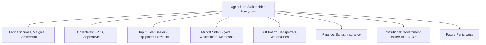

---

# Farmer Lifecycle

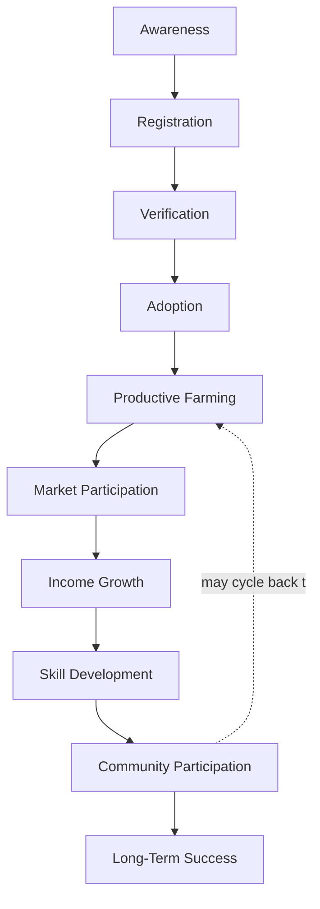

| Stage | Meaning | Owning Discipline |
|---|---|---|
| **Awareness** | A farmer learns Arwal is relevant to them, typically via a field agent, FPO, or cooperative introduction. | Community outreach, this document |
| **Registration** | The farmer creates an Arwal identity, per JRN-001, often assisted. | Identity Verification (CAP-001) |
| **Verification** | Baseline identity verification completes, per RULE-002 — no elevated documentary burden beyond what any citizen faces. | Identity Verification Processing (PROC-002) |
| **Adoption** | The farmer completes their first genuine, valuable action — a price check, a weather alert, a scheme-eligibility query. | Farmer Advisory (CAP-011), Market Intelligence (CAP-012) |
| **Productive Farming** | The farmer integrates Arwal's price and weather information into their actual seasonal planning and selling decisions. | Farmer Advisory Strategy, below |
| **Market Participation** | The farmer engages Direct-to-Buyer Marketplace (CAP-013) or uses price transparency to negotiate more confidently in the traditional mandi. | Business Model, below |
| **Income Growth** | Measurable, farmer-reported income improvement attributable to fairer pricing or expanded market access. | Economic Impact, below |
| **Skill Development** | The farmer engages advisory and knowledge-sharing content that improves yield, resilience, or market timing over successive seasons. | Knowledge Sharing, below |
| **Community Participation** | The farmer engages an FPO, cooperative, or peer network, amplifying both their own and their community's bargaining power. | Community Collaboration, below |
| **Long-Term Success** | Sustained, multi-season participation and trust, measured across years rather than a single harvest. | Governance, below |

### Lifecycle Design Commitment

At every stage above, the farmer's experience is designed with the same rigor `ai-docs/56-user-journey-standards.md` requires of any citizen journey — a named Failure Scenario and Recovery Path at every stage a farmer could stall or disengage, never a dead end where a farmer quietly reverts to the middleman they already knew.

---

# Value Creation

| Question | Answer |
|---|---|
| **How do farmers create value?** | By producing genuine agricultural output the district and its citizens depend on — the platform amplifies discoverability and fair pricing of that value, it does not manufacture the value itself. |
| **How do buyers create value?** | By offering genuine, competitive demand and prompt, fair payment for verified produce, expanding a farmer's realized price beyond what a single local middleman would offer. |
| **How does Arwal create value?** | By converting fragmented, asymmetric, word-of-mouth market information into transparent, verifiable, voice-accessible price and buyer intelligence a farmer could not economically assemble alone. |
| **How does trust develop?** | Through Identity Verification (CAP-001) and transaction-verified Reputation (CAP-045), compounding as a farmer's and a buyer's history of fair, completed transactions accumulates. |
| **How does income grow?** | Through Fair Market Access reducing middleman-captured margin, through Direct-to-Buyer Marketplace expanding realized price, and through reduced distress-sale losses from better market-timing information. |
| **How does agriculture become more resilient?** | Through Weather Advisory (CAP-011) reducing crop loss, through Scheme Eligibility Assessment (CAP-010) improving access to government safety nets, and through FPO/Cooperative aggregation reducing an individual farmer's exposure to single-buyer price risk. |

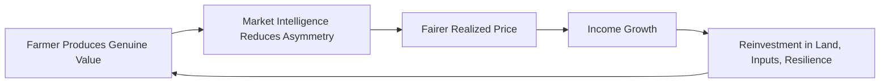

---

# Business Model

Every capability below is described strategically — its business rationale — never as an implementation. The enforceable capability logic is owned entirely by `ai-docs/55-business-capability-map.md`'s CAP-008 through CAP-013.

| Capability | Business Rationale |
|---|---|
| **Mandi Price Information** | Real-time, trustworthy price transparency removes the single largest information asymmetry a farmer faces, per CAP-012's Business Rules — prices displayed are never platform-adjusted or buyer-favored. |
| **Equipment Rental** | Converts capital-intensive machinery ownership into an accessible, pay-per-use service, lowering the barrier to mechanized cultivation for a smallholder who could never justify outright purchase. |
| **Input Marketplace** | Connects farmers to verified Input Dealers, protecting against counterfeit seed and fertilizer while introducing price comparability to a category historically opaque. |
| **Buyer Discovery** | Expands a farmer's addressable market beyond their existing, often single, local buyer relationship. |
| **Market Linkages** | Structural connections between farmers, FPOs, wholesalers, and merchants that persist as durable business relationships, not one-off transactions. |
| **Government Scheme Awareness** | Closes the "scheme information rarely reaches her directly" gap explicitly named for PER-002 Meena in `ai-docs/51-stakeholder-analysis.md`, per CAP-010. |
| **Financial Inclusion** | Wallet and payment access appropriate to a farmer's often irregular, seasonal cash-flow pattern, per RULE-019's verification-tiered limits. |
| **Insurance Awareness** | Surfacing crop and asset insurance options relevant to a farmer's specific risk profile, never itself underwriting or adjudicating a claim. |
| **Agricultural Advisory** | Plainspoken, voice-first guidance on planting, weather, and market timing, per CAP-011 — always advisory, never displacing an agricultural officer's or extension worker's own authority. |
| **Community Collaboration** | FPO and cooperative-enabled group participation, per CAP-043, extending Arwal's reach to farmers who participate collectively rather than individually. |
| **Knowledge Sharing** | Peer and institutional agricultural knowledge, distributed at the pace and literacy level a farming community can genuinely absorb. |

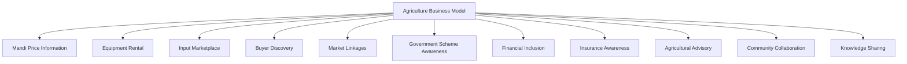

---

# Trust & Quality Strategy

| Mechanism | Strategic Role |
|---|---|
| **Farmer Verification** | Every farmer's identity is confirmed per RULE-002, the same baseline standard applied to every citizen — never an elevated, exclusionary documentary burden. |
| **FPO Verification** | A Farmer Producer Organization's registration and its currently designated representative authority are confirmed per RULE-021, mirroring the Community Group Representative Authority standard. |
| **Product Authenticity** | Input listings (seed, fertilizer) are screened against the same Product Listing Prohibited Content standard (RULE-011) applied to any other marketplace listing, with counterfeit-input risk treated as a Trust & Safety priority given its direct harm to a farmer's entire season. |
| **Pricing Transparency** | Mandi price data is sourced and displayed without platform or buyer favoritism, per CAP-012's Business Rules — verifiable, never opaque. |
| **Market Fairness** | Direct-to-Buyer transactions are subject to the same Marketplace Neutrality principle already established in `ai-docs/65-marketplace-strategy.md` — no buyer's visibility is purchasable at the expense of a fairer-matched alternative. |
| **Dispute Resolution** | A structured, evidence-based path to a fair outcome for both farmer and buyer, per CAP-036 and RULE-013, applied without presumption toward either side. |
| **Government Coordination** | Scheme and price-validation data is sourced jointly with the Agriculture Department, per `ai-docs/63-government-partnership-strategy.md`'s Service Integration Strategy, never approximated unilaterally by Arwal. |
| **Consumer Trust** | A citizen purchasing agricultural produce, whether through a Merchant or a direct farmer listing, receives the same verified-quality assurance as any other Commerce Marketplace transaction. |

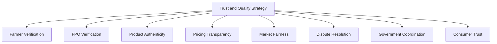

---

# Economic Impact

| Impact Area | How Arwal Contributes |
|---|---|
| **Increase Farmer Income** | Fair Market Access and Direct-to-Buyer Marketplace reduce middleman-captured margin, per the Farmer Empowerment Strategic Objective already established in `ai-docs/50-product-vision-business-strategy.md`. |
| **Reduce Market Friction** | Transparent price and buyer information lowers the search and negotiation cost every farmer previously bore individually. |
| **Improve Market Access** | Buyer Discovery expands a farmer's addressable market beyond a single, often exclusive, local relationship. |
| **Increase Productivity** | Equipment Rental and Agricultural Advisory support better-timed, better-resourced cultivation decisions. |
| **Reduce Information Asymmetry** | Mandi Price Information and Weather Advisory close the single largest structural disadvantage a farmer faces relative to an informed buyer or middleman. |
| **Strengthen Rural Economy** | Farmer income growth, spent and reinvested locally, reinforces the District Development Strategy already established in `ai-docs/64-district-ecosystem-mapping.md`. |
| **Promote Sustainable Agriculture** | Knowledge Sharing and Climate Resilience advisory content support practices that protect long-term land productivity, never merely maximize a single season's yield. |
| **Generate Rural Employment** | Growing agricultural marketplace activity creates demand for supporting roles — transport, storage, aggregation — within the district's own rural economy. |

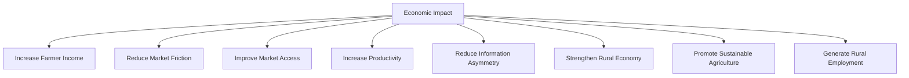

---

# Agriculture Governance

### Ownership
Agriculture Business Model ownership sits with the Chief Agriculture Officer (or Head of Agriculture Vertical where the role is not yet separately staffed), with FPO, Input Dealer, and Buyer relationship categories each accountable to a named sub-owner, mirroring the Clear Ownership discipline already established throughout `ai-docs/53` through `ai-docs/67`.

### Agriculture Council
A standing **Agriculture Council** — chaired by the Chief Agriculture Officer, with the Head of Trust & Safety, Head of Government Partnerships, CPO, and rotating farmer/FPO representatives as members — holds approval authority over any platform-wide pricing-data-sourcing change, any new agricultural fee mechanism, and any material deviation from the Anti-Patterns below. The Council meets monthly, with ad hoc sessions for an Agriculture Ecosystem Health Score regression. Farmer and FPO representation on the Council ensures the ecosystem's most vulnerable participants are consulted on decisions affecting their own livelihood, never merely informed after the fact.

### Decision Authority

| Decision | Approves |
|---|---|
| New agricultural marketplace category or region activation | Agriculture Council + CEO |
| Mandi price data sourcing or validation change | Agriculture Council + Head of Government Partnerships |
| New farmer-facing fee or commission structure | Agriculture Council + Revenue Review Board (`ai-docs/62`) |
| FPO/Cooperative verification standard change | Chief Agriculture Officer + Head of Trust & Safety |
| Emergency market-integrity response (e.g., a price-manipulation pattern) | Head of Trust & Safety, immediate, ratified by Council within 5 business days |

### Review Cadence

| Review | Cadence | Owner |
|---|---|---|
| Agriculture Ecosystem Health Review | Monthly | Agriculture Council |
| Seasonal Performance Review | Per agricultural season | Chief Agriculture Officer |
| Annual Agriculture Strategy Review | Annual | CEO, Chief Agriculture Officer, CPO |

### Conflict Resolution
A farmer-buyer dispute follows PROC-013 and RULE-013 in full; a farmer's disagreement with a platform decision (a price-display accuracy claim, a verification rejection) follows the identical Appeal right already established in RULE-028, reviewed by an independent reviewer distinct from the original decision-maker.

### Continuous Improvement
Every review above feeds a shared, tracked improvement backlog — a recurring price-accuracy dispute, a verification bottleneck for a remote village, or a farmer-suggested advisory refinement — reviewed and prioritized at the next Agriculture Ecosystem Health Review, never left to informally resolve itself.

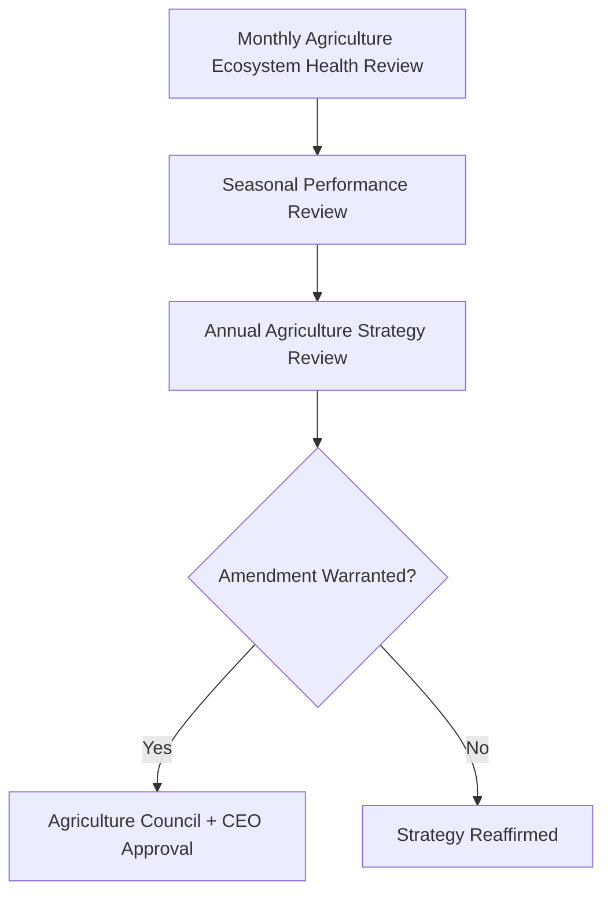

---

# Risks

| Risk | Description | Mitigation |
|---|---|---|
| **Price Volatility** | Market prices shift rapidly, exposing a farmer to timing risk beyond Arwal's control. | Transparent, frequently refreshed price data and advisory guidance; never a guaranteed-price promise Arwal cannot honor. |
| **Weather Uncertainty** | Unseasonal or extreme weather threatens yield regardless of information quality. | Weather Advisory (CAP-011) and Insurance Awareness reduce, never eliminate, exposure. |
| **Market Manipulation** | Coordinated buyer collusion or price-fixing distorts fair discovery. | Trust & Safety monitoring; Pricing Transparency and Marketplace Fairness principles above. |
| **Fraud** | A buyer or input dealer misrepresents identity, payment intent, or product authenticity. | Farmer/FPO/Buyer Verification (CAP-001, CAP-016), Fraud Detection (CAP-038), four-eyes enforcement per RULE-027. |
| **Counterfeit Inputs** | Substandard or fake seed and fertilizer sold through the Input Marketplace. | RULE-011's Product Listing Prohibited Content standard, applied with elevated scrutiny given direct harm to an entire season's yield. |
| **Supply Chain Disruptions** | Transport or storage failures disrupt produce movement from farm to market. | Diversified Transporter and Warehouse Operator base; transparent status signaling to farmers. |
| **Digital Literacy Gaps** | A meaningful share of farmers cannot navigate a text-heavy interface unassisted. | Voice-first design, field-agent-assisted onboarding, per the Accessibility principle above. |
| **Farmer Exclusion** | Smallholder or marginal farmers are structurally underserved relative to commercial farmers. | Inclusiveness principle above; FPO/Cooperative aggregation as a deliberate inclusion mechanism. |
| **Trust Erosion** | A single mishandled pricing dispute or fraud incident damages trust across the entire agriculture vertical. | Transparent, evidence-based dispute resolution per RULE-013 and RULE-028; rapid, honest incident communication. |
| **Government Policy Changes** | A scheme, subsidy, or regulatory shift invalidates an existing workflow assumption. | Scheme workflows configured, never hardcoded, per RULE-006 and RULE-008 — a policy change updates a configuration, not a rebuild. |

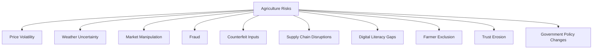

---

# Metrics

| Metric | Definition | Direction |
|---|---|---|
| **Registered Farmers** | Count of farmers who have completed baseline registration. | Increasing |
| **Verified Farmers** | Count of farmers passing identity verification, per RULE-002. | Increasing |
| **FPO Participation** | Count of active, verified FPOs and cooperatives, and the farmer population reached through them. | Increasing |
| **Marketplace Activity** | Volume of Direct-to-Buyer Marketplace listings and completed sales. | Increasing |
| **Farmer Income Growth** | Farmer-reported income improvement attributable to Arwal, per `ai-docs/50`'s Farmer Empowerment KPI. | Increasing |
| **Government Scheme Adoption** | Rate at which eligible farmers discover and apply for a matched government scheme. | Increasing |
| **Equipment Rental Usage** | Volume of equipment rental bookings facilitated through the platform. | Increasing |
| **Market Access Index** | A composite measure of buyer-discovery reach and price-comparison usage per farmer. | Increasing |
| **Trust Score** | District Trust Signal, viewed for agriculture-specific interactions. | Increasing |
| **Agriculture Ecosystem Health** | A composite index combining Verified Farmer growth, Trust Score, Dispute Rate, and Income Growth. | Increasing |

> **Callout — No Agriculture Metric Stands Alone**
> Per the North Star Principle already established in `ai-docs/00-project-vision.md`, a rising Marketplace Activity number alongside a falling Trust Score or rising Dispute Rate is treated as a regression — never counted as success in isolation.

---

# Anti-Patterns

| Anti-Pattern | Why It's Rejected |
|---|---|
| **Ignoring small farmers** | Directly contradicts Inclusiveness and the founding Inclusion over Optimization pillar already established in `ai-docs/00-project-vision.md`. |
| **Opaque pricing** | Violates Transparency and Pricing Transparency; a farmer who cannot verify a price independently has been given nothing more trustworthy than the middleman they already had. |
| **Marketplace bias** | Undisclosed favoritism toward a specific buyer or input dealer violates Marketplace Fairness and Marketplace Neutrality. |
| **Government dependency** | Structuring the agriculture business model so it collapses without a specific government scheme or data feed violates Operational Independence, per `ai-docs/63-government-partnership-strategy.md`. |
| **Poor verification** | A verification process bypassed or applied inconsistently across farmers, FPOs, or buyers undermines the entire Trust & Quality Strategy. |
| **Unsustainable practices** | Advisory content or marketplace incentives that maximize short-term yield at the cost of long-term land or water health violates Sustainability. |
| **Short-term optimization** | Trading long-term farmer trust for a single season's transaction volume violates Long-Term Rural Development. |
| **Technology without adoption** | Deploying a capability a farmer cannot actually use — text-heavy, connectivity-dependent, or literacy-assuming — fails Accessibility regardless of its technical sophistication. |
| **Growth without trust** | A rising Registered Farmers count alongside a falling Trust Score is a regression, never a win. |

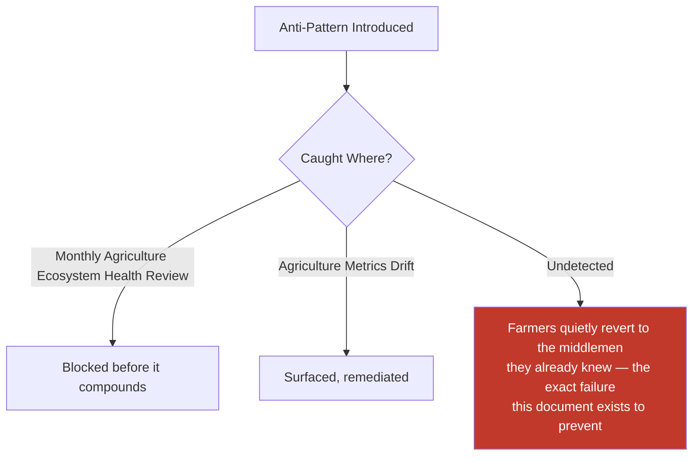

---

# Relationship to Previous Documents

| Prior Document | Relationship |
|---|---|
| **Project Vision (`ai-docs/00`)** | Establishes the founding fragmentation problem this document solves for farmers specifically — no integrated price, weather, scheme, or market access. |
| **Stakeholder Analysis (`ai-docs/51`)** | Supplies the Farmers, Farmer Cooperatives, and NGO stakeholder registry every category in this document traces to. |
| **Business Domain Model (`ai-docs/53`)** | Supplies the ownership structure behind the Agriculture domain (DOM-004) this document's business model is realized within. |
| **Business Capability Map (`ai-docs/55`)** | Supplies the stable abilities — Farmer Advisory (CAP-011), Market Intelligence (CAP-012), Direct-to-Buyer Marketplace (CAP-013) — this document's strategy is built directly on top of. |
| **Customer Experience Strategy (`ai-docs/60`)** | Supplies the "Fair and Plainspoken" felt-experience bar every agricultural interaction must clear. |
| **Value Proposition Framework (`ai-docs/61`)** | Supplies the Farmer stakeholder value exchange this document extends into a full ecosystem business model. |
| **Revenue & Sustainability Strategy (`ai-docs/62`)** | Supplies the Fair Monetization and Shared Prosperity safeguards this document's economic mechanisms are bound by. |
| **Government Partnership Strategy (`ai-docs/63`)** | Supplies the Agriculture Department coordination context this document's Scheme Awareness and price-validation mechanisms depend on. |
| **District Ecosystem Mapping (`ai-docs/64`)** | Supplies the whole-system Ecosystem Health view this document's agriculture-specific health metrics feed into. |
| **Marketplace Strategy (`ai-docs/65`)** | Supplies the general two-sided-market economics this document specializes for agricultural produce and its distinct seasonal, perishable dynamics. |
| **Service Provider Ecosystem (`ai-docs/66`)** | Supplies the sibling strategic model for skill-based work; agricultural advisory and extension services share the same Trust & Quality discipline. |
| **Merchant Ecosystem (`ai-docs/67`)** | Supplies the sibling strategic model for goods-based commerce; Agricultural Input Stores and produce Merchants are a direct point of overlap. |
| **Business Glossary (`ai-docs/59`)** | Supplies the precise vocabulary (Farmer, Scheme, Reputation, Dispute, Appeal) this document's every claim is expressed in. |

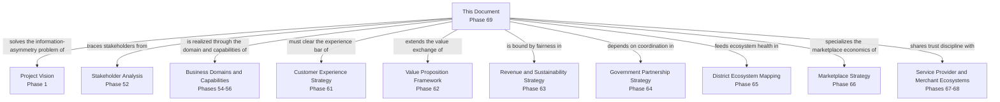

---

# Executive Artifacts

### Agriculture Business Framework

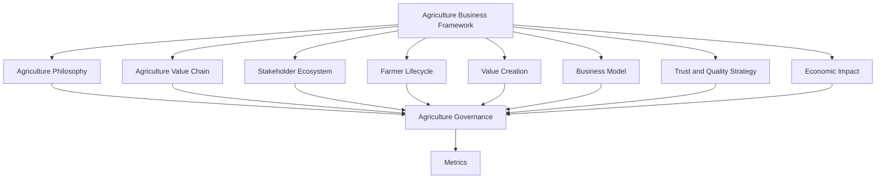

### Agriculture Value Chain

See Agriculture Value Chain section above — reproduced here by reference per Single Source of Truth, never duplicated.

### Farmer Lifecycle

See Farmer Lifecycle section above.

### Agriculture Ecosystem Map

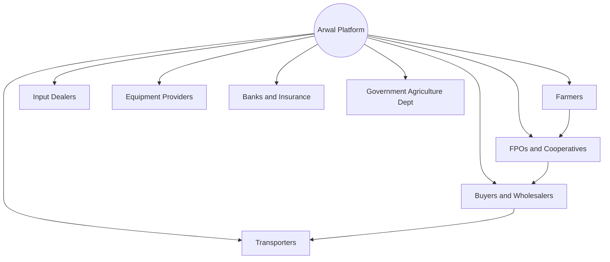

### Governance Model

See Agriculture Governance section above.

### Economic Impact Model

See Economic Impact section above.

### Growth Flywheel

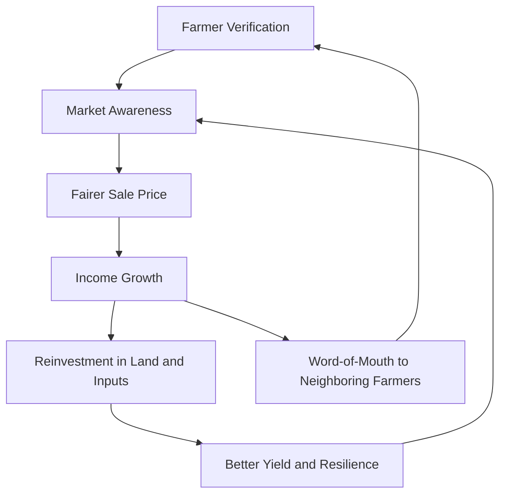

### Executive Dashboards

| Dashboard | Audience | Key Content |
|---|---|---|
| **CEO Dashboard** | CEO | Agriculture Ecosystem Health Score, Farmer Income Growth, Trust Score |
| **Chief Agriculture Officer Dashboard** | Chief Agriculture Officer | Registered/Verified Farmers, FPO Participation, seasonal marketplace activity |
| **Trust & Safety Dashboard** | Head of Trust & Safety | Dispute Rate, counterfeit-input incident trend, verification turnaround |
| **Government Partners Dashboard** | Agriculture Department liaisons | Scheme Adoption rate, price-data validation status |

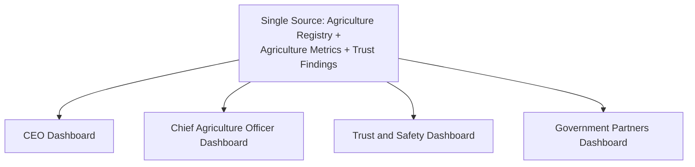

### Decision Matrix

| Decision Type | Approval Authority |
|---|---|
| New agricultural marketplace category/region | Agriculture Council + CEO |
| Mandi price data sourcing change | Agriculture Council + Head of Government Partnerships |
| New farmer-facing fee structure | Agriculture Council + Revenue Review Board |
| FPO/Cooperative verification standard change | Chief Agriculture Officer + Head of Trust & Safety |
| Emergency market-integrity response | Head of Trust & Safety, ratified within 5 business days |

---

# Closing Statement

> **Callout — Closing Statement**
> Every prior document in this handbook explains what Arwal builds, how it sustains itself, and the markets and ecosystems it operates inside. This document explains the specific promise Arwal makes to a farmer who has spent a season's labor producing something real: that the price they are shown is genuine, the buyer they reach is verified, and the trust they extend to an unfamiliar platform will be repaid with a fairer return than the middleman they already knew. A district's agricultural base is not a category of commerce among many — it is the economic foundation beneath a meaningful share of every household this platform exists to serve, and its resilience across seasons and years is a direct measure of whether Arwal's founding mission is real. An agriculture strategy grown too fast, verified too loosely, or governed too unevenly does not merely underperform — it teaches a farming community that the platform was never actually on their side, and that lesson travels from village to village faster than any feature ever will. Arwal grows this ecosystem at the speed trust can actually be earned, never faster, because a generation-long civic-commercial platform cannot be built on a farming population that stopped believing it. Where a future phase must deviate from a principle stated here, that deviation is made explicitly — through the Agriculture Governance process above — never silently, and never by default.

This document, `ai-docs/68-agriculture-business-model.md`, is Phase 69 of approximately 415. Every future farmer-facing decision, mandi integration, and rural growth program is expected to trace back to a principle defined here, or to justify its deviation in writing.

**End of Phase 69 — `ai-docs/68-agriculture-business-model.md`**