# Healthcare Business Model

**Document:** `ai-docs/69-healthcare-business-model.md`
**Project:** Arwal — The District Super App
**Stage:** 2 — Product & Business Strategy
**Phase:** 70 — Healthcare Business Model
**Status:** Approved for Product & Engineering Reference
**Audience:** CEO, CSO, CPO, CMO, Chief Healthcare Officer, Enterprise Business Architects, Public Health Strategists, Healthcare Economists, Hospital Operations Consultants, Digital Health Transformation Consultants, Government Health Partnership Specialists, Trust & Safety Strategists, Privacy & Compliance Advisors, Investors

> **Callout — Purpose of This Document**
> `ai-docs/00-project-vision.md` through `ai-docs/68-agriculture-business-model.md` established why Arwal exists, what it can do, who it serves, how it sustains itself, how it partners with government, the whole district ecosystem it operates inside, the general economics of a marketplace, and how service providers, merchants, and farmers build sustainable livelihoods on the platform. None of those documents answers the question a mother carrying a feverish child to a clinic at midnight asks first: **why should I trust this platform with my family's health, and will it actually get us to the right care faster, more affordably, and more safely than what we already do?** This document is that answer — the authoritative Healthcare Business Model every future patient-facing decision, provider-verification standard, and public-health program traces back to.

---

# Purpose of this Document

### Why Healthcare Requires Its Own Business Model, Not a Marketplace Category Footnote

`ai-docs/65-marketplace-strategy.md` established the general economics of a two-sided market. `ai-docs/66-service-provider-ecosystem.md` specialized that economics for skilled, time-bound service work. Healthcare is neither of those things cleanly. A citizen booking a doctor is not comparison-shopping the way a citizen comparing two electricians might — a health decision is frequently urgent, frequently made under distress, and frequently irreversible if handled wrongly. The consequence of a bad healthcare match is not a redone repair job; it can be a missed diagnosis, a delayed emergency response, or a life lost. This document exists because healthcare demands a business model built around patient safety and public-health outcomes first, commercial dynamics second — never the reverse.

### Why This Is a Business Strategy Document, Not a Clinical or Technical Specification

This document contains no diagnosis algorithms, no treatment protocols, no Electronic Medical Record schema, no clinical workflow, and no telemedicine implementation detail. It does not redefine Domains (`ai-docs/53`), Capabilities (`ai-docs/55`), Modules (`ai-docs/54`), Journeys (`ai-docs/56`), Processes (`ai-docs/57`), or Rules (`ai-docs/58`) — Healthcare Discovery (CAP-014), Appointment Scheduling (CAP-015), Provider Verification (CAP-016), and their governing rules (RULE-014, RULE-015) remain fully authoritative and are cited, never restated. This document's exclusive territory is: **the strategic reasoning behind who a patient and a healthcare provider are to Arwal, why healthcare is a durable strategic pillar, how the healthcare value chain and its stakeholders relate to one another, and how the ecosystem around healthcare is governed, protected, and grown.**

### The Chain of Reasoning This Document Extends

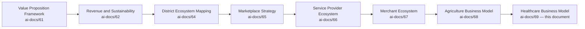

| Layer | Question It Answers |
|---|---|
| Value Proposition Framework | Why should any stakeholder trust Arwal? |
| Revenue & Sustainability Strategy | How does Arwal fund its promises for a generation? |
| District Ecosystem Mapping | What is the whole living system Arwal operates inside? |
| Marketplace Strategy | How does a two-sided market work, generally? |
| Service Provider Ecosystem | How does Arwal earn a skilled professional's trust with their livelihood? |
| Merchant Ecosystem | How does Arwal make a local business genuinely stronger? |
| Agriculture Business Model | How does Arwal earn a farmer's trust with their harvest? |
| **Healthcare Business Model** (this document) | **How does Arwal earn a patient's trust with their own life and their family's, and how does the district's public-health outcome improve because of it?** |

### Why Healthcare Is a Strategic Pillar, Not a Feature

Per `ai-docs/00-project-vision.md`'s founding Problem Statement, a citizen today has no unified way to discover a trustworthy doctor, check pharmacy stock, understand a government health scheme, or reach emergency care quickly — each is a separate, unreliable, word-of-mouth or physical-queue-dependent process. Healthcare is named explicitly as a Core Domain (`ai-docs/53`) and, per `ai-docs/01-product-goals.md`, a Should-Have priority whose strategic weight grows as district trust matures. A district super app that succeeds in commerce while leaving healthcare fragmented has not achieved its founding mission — it has served the district's convenience half while leaving its most consequential need unmet.

### How Healthcare Improves Quality of Life

A citizen who can verify a doctor's credential before an appointment, check a pharmacy's stock before traveling, and receive a scheme-eligibility answer without a queue is a citizen who experiences less anxiety, less wasted time, and less financial risk around every health decision. Multiplied across a district population, this is a measurable improvement in lived quality of life — not because Arwal treats anyone, but because Arwal removes the friction and uncertainty surrounding access to those who do.

### How Healthcare Strengthens District Development

Per `ai-docs/64-district-ecosystem-mapping.md`'s District Development Strategy, a healthier population is a more economically productive one — fewer lost workdays to preventable illness, faster return to work after treatment, and a workforce better able to participate in every other domain Arwal serves. Healthcare access is not merely a citizen-welfare concern; it is a direct input into the district's own economic capacity.

### Relationship Between Every Participant

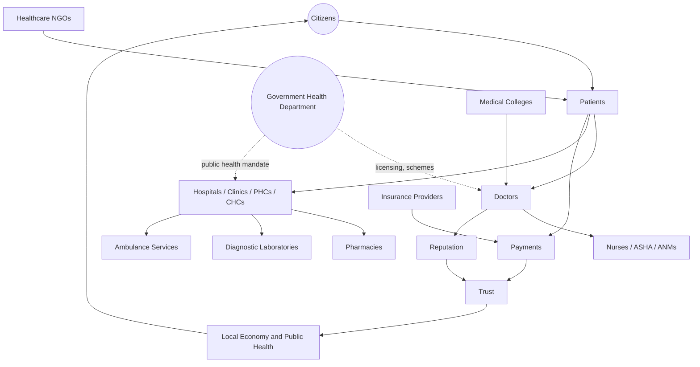

A citizen becomes a patient the moment a health need arises; that patient's journey may touch a doctor, a hospital or PHC/CHC, a nurse or community health worker, a pharmacy, a diagnostic laboratory, and — where urgent — an ambulance service. Every interaction produces Reputation and Trust, moves through Payments under the same settlement-integrity standard as every other transaction platform-wide, and sits within a government licensing and public-health mandate that Arwal supports without ever displacing.

### Scope Boundary

This document does not define clinical protocols, does not specify EMR or health-record data models, does not define diagnostic algorithms, and does not redraft any government health scheme's own eligibility logic — those remain government and clinical authority, cited per `ai-docs/58-business-rules-policies.md`'s RULE-008 and RULE-014, never redefined here. This document's territory is strategic and economic: the business model, the stakeholder relationships, the value chain, and the governance that makes Arwal's healthcare participation trustworthy and durable.

---

# Healthcare Philosophy

Every principle below exists because a healthcare strategy designed carelessly does not fail abstractly — it fails a specific patient whose life or trust was put at risk.

### Citizen First
**Why it exists:** Every healthcare decision is judged first against whether it serves the citizen's actual health need, mirroring the identical Citizen-First tie-breaker already established throughout `ai-docs/51` through `ai-docs/68`. A provider's convenience or a commercial consideration is never optimized ahead of patient welfare.

### Patient Safety
**Why it exists:** Healthcare is the one domain where a platform failure can cause direct, irreversible physical harm. Patient safety is never a variable traded against speed, cost, or growth — it is the precondition every other commitment in this document is built on top of.

### Accessibility
**Why it exists:** A meaningful share of Arwal's population is rural, low-literacy, and served by limited local healthcare infrastructure. Voice-first, offline-capable, low-bandwidth design is the floor for every healthcare-facing capability, per `ai-docs/12-accessibility-standards.md`.

### Affordability
**Why it exists:** A citizen who cannot afford care does not benefit from knowing where it exists. Discovery and facilitation fees are structured, per `ai-docs/62-revenue-sustainability-strategy.md`'s Essential Healthcare safeguard, to never gate a citizen's access to care.

### Equity
**Why it exists:** A rural citizen and an urban citizen must have equally reliable access to verified healthcare discovery — a business model that only works economically for a district headquarters population has captured a fraction of the district's actual health need.

### Trust Before Treatment
**Why it exists:** A citizen will not book an unfamiliar doctor, however well-ranked, unless they trust the verification behind that ranking is genuine. Trust is the precondition every healthcare transaction depends on, never a byproduct assumed from good UX.

### Privacy
**Why it exists:** Health data is among the most sensitive categories of personal information a citizen will ever share, per `ai-docs/10-security-standards.md`'s Restricted-tier classification. Every health-adjacent data flow is governed by explicit, per-purpose consent, per RULE-003.

### Transparency
**Why it exists:** A citizen must be able to see why a provider is verified, what a consultation will cost, and what happens to their information — concealment in a healthcare context breeds a distrust that does not merely lose a transaction, it can deter a citizen from seeking care at all.

### Continuity of Care
**Why it exists:** A patient's health need rarely resolves in a single interaction — discovery, consultation, diagnostics, treatment, and follow-up are a connected sequence, and a platform that treats each as an isolated transaction has failed the patient at the moments continuity matters most.

### Preventive Healthcare
**Why it exists:** The most valuable healthcare intervention is the one that prevents a crisis from occurring at all. Preventive-care awareness and screening discovery are treated as a first-class strategic priority, never an afterthought behind acute-care facilitation.

### Community Health
**Why it exists:** A district's health outcomes are not merely the sum of individual patient interactions — community-level health workers (ASHA, ANM), public-health campaigns, and collective awareness efforts shape outcomes no individual booking ever could.

### Evidence-Based Decisions
**Why it exists:** Every healthcare-adjacent claim Arwal surfaces — a provider's verification status, a scheme's eligibility criteria — is sourced from a verifiable, authoritative record, never Arwal's own unverified inference, per RULE-014's Healthcare Provider Verification Standard.

### Long-Term Public Health
**Why it exists:** Arwal's healthcare strategy is evaluated on a multi-year, population-health horizon — a single quarter's booking volume is not success if the underlying trust, safety, or equity of access were compromised to produce it, mirroring the Long-Term Sustainability principle already established in `ai-docs/62-revenue-sustainability-strategy.md`.

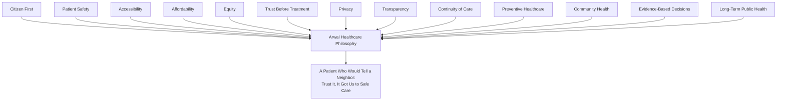

> **Callout — The One-Sentence Healthcare Philosophy**
> *"A citizen trusts Arwal with their health only once — betray that trust a single time, in a moment of real vulnerability, and no discovery convenience will ever earn it back."*

---

# Healthcare Value Chain

| Stage | Business Description |
|---|---|
| **Health Awareness** | A citizen's foundational understanding of available care options, preventive practices, and their own risk factors — the earliest point at which Arwal's discovery and education capability adds value. |
| **Prevention** | Vaccination awareness, hygiene and lifestyle guidance, and early risk-factor education, reducing the likelihood a health need ever escalates to acute care. |
| **Screening** | Discovery of and access to preventive screening and public-health campaigns (a vaccination drive, a community health camp), surfaced through the same Notifications capability (CAP-031) serving every other domain. |
| **Primary Care** | A citizen's first point of contact — a general physician, a PHC, or a community health worker — for a routine or non-urgent need. |
| **Consultation** | The discovery-to-booking sequence connecting a citizen to a verified doctor, per Appointment Scheduling (CAP-015). |
| **Diagnostics** | Discovery of verified diagnostic laboratories for tests a consulting provider has recommended. |
| **Prescription** | The clinical output of a consultation, handled entirely by the treating provider — Arwal never substitutes its own judgment for a prescribing clinician's authority. |
| **Pharmacy** | Discovery of medicine availability at a nearby, verified pharmacy, per CAP-014's pharmacy-variant discovery. |
| **Treatment** | The clinical care itself, delivered entirely by the verified provider or institution — never by Arwal. |
| **Referral** | A structured hand-off from a primary provider to a specialist, hospital, or diagnostic service, tracked for continuity without Arwal inserting itself into the clinical decision. |
| **Hospitalization** | Institutional-level care coordination for a citizen requiring admission, per Hospitals (MOD-014) and Institutional Profile Management. |
| **Emergency Care** | The highest-priority healthcare touchpoint — ambulance discovery and emergency-facility awareness, held to the strictest availability and reliability standard of any capability in this document. |
| **Recovery** | The post-treatment period during which a citizen may need continued medication access, follow-up scheduling, or home-care service discovery. |
| **Follow-up** | Structured reminders and re-booking pathways ensuring a course of care does not silently lapse. |
| **Preventive Care (Ongoing)** | Recurring, longer-horizon engagement — chronic-condition awareness, periodic screening reminders — sustaining a citizen's health beyond a single acute episode. |
| **Community Health** | Population-level awareness and coordination efforts (a village-level health camp, an ASHA-led awareness drive) that shape outcomes no individual transaction could. |

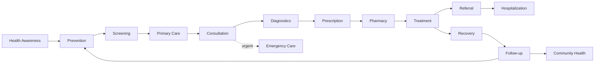

> **Callout — Arwal Facilitates the Chain, Never Practices Medicine Within It**
> At every stage above, Arwal's role is discovery, verification, scheduling, and transparency — never diagnosis, never prescription, never clinical judgment. A citizen who receives care through Arwal has received it *from a verified clinician or institution*, with Arwal as the trusted channel, exactly as `ai-docs/63-government-partnership-strategy.md` establishes for civic services: Arwal never becomes the authority it connects a citizen to.

---

# Stakeholder Ecosystem

Every stakeholder below traces to its full Persona (`ai-docs/52`) and Stakeholder (`ai-docs/51`) record; this section states only the stakeholder's healthcare business role.

| Stakeholder | Strategic Role |
|---|---|
| **Citizens** | The population whose health needs, awareness, and trust determine whether the healthcare ecosystem functions at all. |
| **Patients** | Citizens actively engaged in a specific care episode — the demand-side anchor of every healthcare interaction. |
| **Doctors** | Independent, verified clinicians providing direct consultation and treatment, per PER-006 Dr. Kavita. |
| **Hospitals** | Institutional, multi-practitioner facilities providing referral-scale, higher-acuity care. |
| **Clinics** | Mid-scale institutions bridging independent doctors and full hospitals, per PER-007 Ramesh. |
| **Primary Health Centres (PHCs)** | Government-operated frontline rural healthcare facilities providing basic consultation and preventive services. |
| **Community Health Centres (CHCs)** | Government-operated intermediate-tier facilities bridging PHCs and district hospitals. |
| **Pharmacies** | Retail medicine-availability participants, per PER-009 Vikash, whose stock-visibility reduces citizen travel and delay. |
| **Diagnostic Laboratories** | Verified providers of tests and diagnostic services referred by a treating clinician. |
| **Blood Banks** | Critical-supply institutions relevant to emergency and surgical care coordination. |
| **Ambulance Services** | The highest-priority fulfillment layer for emergency healthcare access. |
| **Nurses** | Clinical support professionals operating within hospitals, clinics, PHCs, and CHCs. |
| **ASHA Workers** | Accredited Social Health Activists — community-level health awareness and first-contact coordination, especially in rural areas. |
| **ANMs** | Auxiliary Nurse Midwives providing frontline maternal and community health services. |
| **Government Health Department** | The regulatory and public-health authority Arwal's healthcare capability supports, per `ai-docs/63-government-partnership-strategy.md`. |
| **Insurance Providers** | Financial-risk partners whose coverage awareness reduces a citizen's cost barrier to care. |
| **Healthcare NGOs** | Trust-building intermediaries extending healthcare awareness and access into underserved populations, per `ai-docs/64-district-ecosystem-mapping.md`. |
| **Medical Colleges** | Institutional sources of clinical credentialing context and, potentially, future extension-service partnerships. |
| **Future Healthcare Participants** | Telehealth-extension providers, diagnostic-network partners, and second-district healthcare institutions, tracked per the Patient Lifecycle's Awareness stage below. |

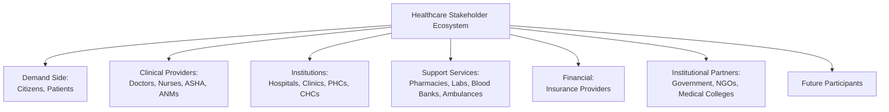

---

# Patient Lifecycle

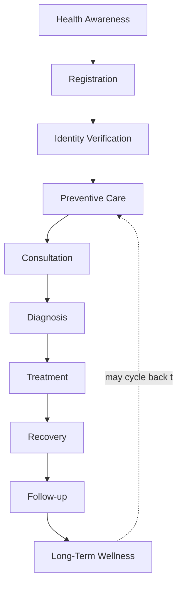

| Stage | Meaning | Owning Discipline |
|---|---|---|
| **Health Awareness** | A citizen learns Arwal offers verified healthcare discovery, typically via community outreach, an ASHA worker, or in-app discovery. | Community outreach, this document |
| **Registration** | The citizen creates an Arwal identity, per JRN-001. | Identity Verification (CAP-001) |
| **Identity Verification** | Baseline identity verification completes, per RULE-002 — no elevated documentary burden beyond what any citizen faces. | Identity Verification Processing (PROC-002) |
| **Preventive Care** | The citizen engages awareness content, screening discovery, or a vaccination-campaign notification before any acute need arises. | Health Education, below |
| **Consultation** | The citizen discovers and books a verified provider, per Doctor Discovery (CAP-014) and Appointment Scheduling (CAP-015). | Business Model, below |
| **Diagnosis** | The treating clinician's own clinical determination — never Arwal's — potentially routing the citizen to Diagnostics. | Clinical authority, outside Arwal's scope |
| **Treatment** | Care delivered by the verified provider or institution. | Clinical authority, outside Arwal's scope |
| **Recovery** | The citizen may need continued medication access or home-care service discovery. | Pharmacy Discovery, below |
| **Follow-up** | A structured reminder or re-booking pathway prevents a course of care from silently lapsing. | Continuity of Care principle above |
| **Long-Term Wellness** | Sustained, multi-year engagement with preventive and awareness content, measured across years rather than a single episode. | Governance, below |

### Lifecycle Design Commitment

At every stage above, the patient's experience is designed with the same rigor `ai-docs/56-user-journey-standards.md` requires of any citizen journey — a named Failure Scenario and Recovery Path at every stage a patient could stall, never a dead end where a citizen in genuine need simply gives up and reverts to an unverified, informal alternative.

---

# Value Creation

| Question | Answer |
|---|---|
| **How do healthcare providers create value?** | By delivering genuinely skilled, safe, and timely clinical care — the platform amplifies discoverability and trust in that care, it never manufactures or substitutes for it. |
| **How do patients create value?** | By providing honest, transaction-verified feedback that helps the next citizen make a confident, informed choice, and by engaging preventive care that reduces downstream acute-care burden on the whole system. |
| **How does Arwal create value?** | By converting fragmented, unverifiable local healthcare awareness into transparent, verified, voice-accessible discovery — reach, verification, secure payment, and dispute protection a citizen could not assemble alone. |
| **How does trust develop?** | Through Identity Verification (CAP-001) and elevated, dual-sign-off Provider Verification (CAP-016, RULE-014), compounding through Reputation & Rating Management (CAP-045) as verified, completed consultations accumulate. |
| **How does healthcare become more accessible?** | Through Fair Visibility in discovery, voice-first interaction for low-literacy citizens, and pharmacy/lab stock-visibility reducing wasted travel to an unavailable service. |
| **How does community health improve?** | Through ASHA- and NGO-mediated awareness reach, preventive-care notification distribution, and scheme-eligibility discovery that closes the information gap a purely individual-transaction model would never reach. |

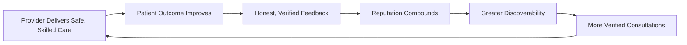

---

# Business Model

Every capability below is described strategically — its business rationale — never as an implementation. The enforceable capability logic is owned entirely by `ai-docs/55-business-capability-map.md`'s CAP-014 through CAP-016.

| Capability | Business Rationale |
|---|---|
| **Doctor Discovery** | Converts word-of-mouth provider discovery into verified, ranked, comparable search, per CAP-014 — verification status always visible, never spoofable. |
| **Hospital Discovery** | Institutional-level discovery for a citizen requiring multi-practitioner or higher-acuity care, per MOD-014. |
| **Appointment Facilitation** | Removes the friction and uncertainty of a physical queue for a booking, per CAP-015, with idempotency-protected confirmation and a clear cancellation policy. |
| **Diagnostic Discovery** | Surfaces verified laboratories for tests a treating clinician has recommended, never itself interpreting a result. |
| **Pharmacy Discovery** | Real-time or near-real-time stock-visibility reducing a citizen's wasted travel during an already stressful moment, per CAP-014's pharmacy variant. |
| **Emergency Services** | The highest-priority, always-available discovery and coordination surface — ambulance and emergency-facility awareness held to a stricter reliability standard than any other capability in this document. |
| **Health Records Awareness** | Citizen-facing visibility into their own care history and appointment record — never a full EMR system, always deferring clinical record-keeping authority to the treating institution. |
| **Government Health Scheme Awareness** | Surfaces a citizen's eligibility for a public-health benefit, sourced jointly with the Health Department per `ai-docs/63-government-partnership-strategy.md`, never approximated unilaterally. |
| **Insurance Awareness** | Surfaces relevant coverage options without Arwal itself underwriting or adjudicating a claim. |
| **Preventive Health Campaigns** | Distribution of vaccination drives, screening camps, and public-health advisories through the Notifications capability (CAP-031), coordinated with the Disaster Management Authority and Health Department for the highest-priority categories. |
| **Health Education** | Plainspoken, voice-first awareness content on prevention, hygiene, and risk factors — advisory only, never displacing a clinician's own authority. |
| **Community Health Programs** | ASHA- and NGO-mediated outreach extending healthcare awareness to citizens a purely app-native model would never reach. |

```mermaid
graph TD
    BizModel3[Healthcare Business Model] --> DocDisc[Doctor Discovery]
    BizModel3 --> HospDisc[Hospital Discovery]
    BizModel3 --> ApptFacil[Appointment Facilitation]
    BizModel3 --> DiagDisc[Diagnostic Discovery]
    BizModel3 --> PharmDisc[Pharmacy Discovery]
    BizModel3 --> EmergServ[Emergency Services]
    BizModel3 --> RecordsAware[Health Records Awareness]
    BizModel3 --> SchemeAware2[Government Health Scheme Awareness]
    BizModel3 --> InsuranceAware2[Insurance Awareness]
    BizModel3 --> PreventCampaign[Preventive Health Campaigns]
    BizModel3 --> HealthEdu[Health Education]
    BizModel3 --> CommunityProg[Community Health Programs]
```

---

# Trust & Quality Strategy

| Mechanism | Strategic Role |
|---|---|
| **Healthcare Provider Verification** | Every provider's credential is confirmed before any listing is discoverable, per RULE-014 — no provisional or partially-verified listing state exists. |
| **Doctor Verification** | Requires dual sign-off — a domain-competent reviewer and a Trust Ops Lead — per RULE-014's Healthcare Provider Verification Standard, the highest verification bar in the entire platform. |
| **Hospital Verification** | Institutional verification held to the same rigor as individual practitioner verification, per MOD-014's design boundary. |
| **License Validation** | Cross-checked against the applicable licensing authority where a direct verification channel exists, per RULE-014's Inputs field. |
| **Privacy Protection** | Health data is Restricted-tier per `ai-docs/10-security-standards.md`, never logged in plaintext, never shared beyond a stated, consented purpose. |
| **Patient Consent** | Explicit, granular, revocable consent governs every health-adjacent data flow, per RULE-003. |
| **Healthcare Quality** | Ongoing quality monitoring distinct from one-time onboarding verification, per the Continuous Learning principle already established in `ai-docs/66-service-provider-ecosystem.md`. |
| **Complaint Resolution** | A structured, evidence-based path to a fair outcome for both patient and provider, per CAP-036 and RULE-013, applied without presumption toward either side. |
| **Government Coordination** | Public-health data and scheme validation sourced jointly with the Health Department, per `ai-docs/63-government-partnership-strategy.md`, never approximated unilaterally by Arwal. |
| **Patient Trust** | Every mechanism above compounds into a single, felt outcome: a citizen who believes Arwal's verification badge in Healthcare means something real, unlike an unverified informal referral. |

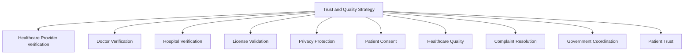

> **Callout — Verification Rigor for Healthcare Is Never Negotiable**
> Per the Proportional Rigor principle applied throughout this handbook, healthcare providers are held to Arwal's highest verification bar — dual sign-off, licensing-authority cross-check where feasible, and immediate delisting upon any confirmed lapse — because the citizen-facing consequence of a verification failure in this domain is categorically more severe than in any other vertical.

---

# Economic Impact

| Impact Area | How Arwal Contributes |
|---|---|
| **Improve Healthcare Access** | Verified discovery and appointment facilitation reduce the time and uncertainty between a citizen's need and their first consultation. |
| **Reduce Treatment Delays** | Pharmacy and diagnostic stock-visibility, plus reliable appointment confirmation, reduce wasted trips and rescheduling churn. |
| **Strengthen Primary Healthcare** | PHC and CHC discovery visibility gives rural citizens the same discoverability urban citizens already have for private practitioners. |
| **Improve Preventive Care** | Preventive Health Campaigns and Health Education reach citizens before an acute episode, reducing downstream system burden. |
| **Reduce Information Gaps** | Government Health Scheme Awareness closes the "I didn't know I qualified" gap that leaves eligible citizens underserved. |
| **Support Public Health** | Community Health Programs and Disaster Management-coordinated emergency notification strengthen population-level resilience. |
| **Generate Healthcare Employment** | Growing verified-provider participation creates demand for supporting clinical and administrative roles within provider institutions. |
| **Improve District Health Outcomes** | The cumulative effect of every mechanism above, measured over years, is a district population with faster access to safe, verified care. |

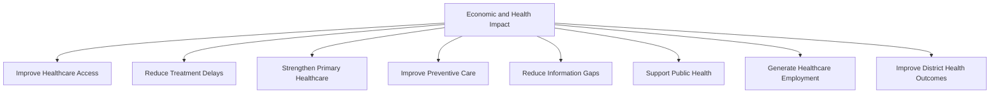

---

# Governance

### Ownership
Healthcare Business Model ownership sits with the Chief Healthcare Officer (or Head of Healthcare Vertical where the role is not yet separately staffed), with Doctor, Hospital, Pharmacy, and Diagnostic Laboratory categories each accountable to a named sub-owner, mirroring the Clear Ownership discipline already established throughout `ai-docs/53` through `ai-docs/68`.

### Healthcare Council
A standing **Healthcare Council** — chaired by the Chief Healthcare Officer, with the Head of Trust & Safety, Head of Government Partnerships, CPO, Compliance Officer, and rotating clinician representatives as members — holds approval authority over any platform-wide verification-standard change, any new healthcare-facilitation fee mechanism, and any material deviation from the Anti-Patterns below. The Council meets monthly, with ad hoc sessions for a Healthcare Ecosystem Health Score regression. Clinician representation ensures the ecosystem's most safety-critical decisions are informed by genuine medical judgment, never made by commercial staff alone.

### Decision Authority

| Decision | Approves |
|---|---|
| New healthcare category or facility-type activation | Healthcare Council + CEO |
| Doctor/Hospital verification standard change | Healthcare Council + Head of Trust & Safety |
| New patient-facing or provider-facing fee structure | Healthcare Council + Revenue Review Board (`ai-docs/62`) |
| Government health-scheme data-sourcing change | Healthcare Council + Head of Government Partnerships |
| Emergency patient-safety response (e.g., a confirmed unsafe provider) | Head of Trust & Safety, immediate, ratified by Council within 5 business days |

### Review Cadence

| Review | Cadence | Owner |
|---|---|---|
| Healthcare Ecosystem Health Review | Monthly | Healthcare Council |
| Category Performance Review (Doctors, Hospitals, Pharmacies, Labs) | Quarterly | Category Heads |
| Annual Healthcare Strategy Review | Annual | CEO, Chief Healthcare Officer, CPO |

### Conflict Resolution
A patient-provider dispute follows PROC-013 and RULE-013 in full; a provider's disagreement with a platform decision (a verification rejection, a ranking outcome) follows the identical Appeal right already established in RULE-028, reviewed by an independent reviewer distinct from the original decision-maker.

### Continuous Improvement
Every review above feeds a shared, tracked improvement backlog — a recurring verification bottleneck, a rural-access gap, or a clinician-suggested refinement — reviewed and prioritized at the next Healthcare Ecosystem Health Review, never left to informally resolve itself.

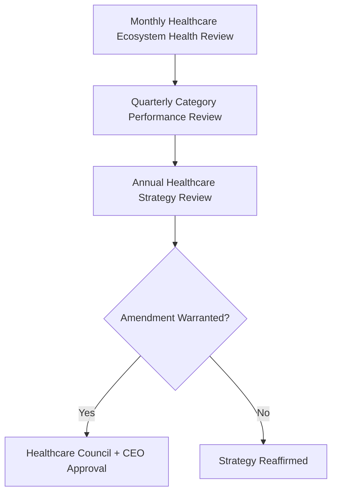

---

# Risks

| Risk | Description | Mitigation |
|---|---|---|
| **Misinformation** | Inaccurate health or scheme information reaches a citizen. | Health Education content sourced from authoritative institutions; Government Coordination for scheme data, per RULE-008. |
| **Unverified Providers** | A provider appears discoverable without completing verification. | RULE-014's dual-sign-off standard; immediate delisting upon discovery of a gap. |
| **Privacy Breaches** | Health data is exposed or misused beyond its consented purpose. | RULE-003's Consent Requirement; Restricted-tier classification per `ai-docs/10-security-standards.md`. |
| **Fraud** | A provider misrepresents credentials or a citizen's payment is manipulated. | Provider Verification (CAP-016), Fraud Detection (CAP-038), four-eyes enforcement per RULE-027. |
| **Healthcare Inequality** | Rural or low-income citizens receive structurally worse discovery or access. | Equity principle above; PHC/CHC discovery parity monitoring. |
| **Emergency Response Failure** | An ambulance or emergency-facility discovery fails at the moment it matters most. | Emergency Services held to the platform's strictest availability standard, coordinated with the Disaster Management Authority. |
| **Digital Exclusion** | A low-literacy or first-generation smartphone citizen cannot access healthcare discovery unassisted. | Voice-first design, field-agent and ASHA-mediated assisted access, per Accessibility above. |
| **Regulatory Changes** | A health-data or licensing regulation shift invalidates an existing workflow assumption. | Configurable, department-owned workflows per RULE-006 and RULE-014 — a policy change updates a configuration, not a rebuild. |
| **Trust Erosion** | A single mishandled healthcare incident damages trust across the entire vertical, and potentially cross-vertical. | Transparent, evidence-based dispute resolution; rapid, honest incident communication, per `ai-docs/60-customer-experience-strategy.md`. |
| **Service Fragmentation** | Doctors, hospitals, pharmacies, and labs operate as disconnected silos rather than a coherent care journey. | Continuity of Care principle above; Referral and Follow-up design discipline in the Healthcare Value Chain. |

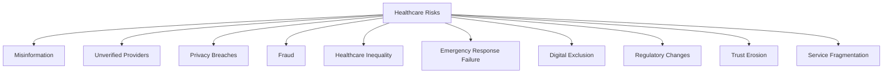

---

# Metrics

| Metric | Definition | Direction |
|---|---|---|
| **Registered Patients** | Count of citizens who have engaged at least one healthcare capability. | Increasing |
| **Verified Healthcare Providers** | Count of doctors, hospitals, clinics, and labs passing full verification. | Increasing |
| **Appointment Success Rate** | % of initiated bookings completing without cancellation or dispute. | Increasing |
| **Healthcare Access Index** | A composite measure of discovery reach and time-to-appointment across urban and rural segments. | Increasing, approaching rural-urban parity |
| **Preventive Care Participation** | Citizen engagement rate with preventive campaigns and screening discovery. | Increasing |
| **Government Scheme Utilization** | Rate at which eligible citizens discover and act on a matched health scheme. | Increasing |
| **Emergency Response Coverage** | % of district geography with reliable ambulance/emergency-facility discovery. | Increasing toward full coverage |
| **Citizen Satisfaction** | CSAT specific to healthcare interactions, per `ai-docs/60-customer-experience-strategy.md`'s Experience Metrics. | Increasing |
| **Trust Score** | District Trust Signal, viewed for healthcare interactions specifically. | Increasing |
| **Healthcare Ecosystem Health** | A composite index combining Verified Provider growth, Trust Score, Dispute Rate, and Access Index. | Increasing |

> **Callout — No Healthcare Metric Stands Alone**
> Per the North Star Principle already established in `ai-docs/00-project-vision.md`, a rising Appointment Success Rate alongside a falling Trust Score or rising Dispute Rate is treated as a regression — never counted as success in isolation.

---

# Anti-Patterns

| Anti-Pattern | Why It's Rejected |
|---|---|
| **Ignoring Rural Healthcare** | Directly contradicts Equity and the founding Inclusion over Optimization pillar already established in `ai-docs/00-project-vision.md`. |
| **Unverified Providers** | Directly violates RULE-014 — no provider is discoverable before verification succeeds, with no exception for growth pressure. |
| **Poor Privacy** | Violates RULE-003 and the Data Responsibility standard already established in `ai-docs/10-security-standards.md`; health data misuse is treated as a Critical finding. |
| **Technology Without Accessibility** | A capability only a digitally fluent, literate citizen can use has failed the Accessibility principle regardless of technical sophistication. |
| **Growth Without Trust** | A rising Registered Patients count alongside a falling Trust Score is a regression, never a win. |
| **Provider Bias** | Ranking or enforcement distorted by a provider's size, revenue contribution, or relationship tenure violates Marketplace Neutrality and Provider Protection principles already established in `ai-docs/66-service-provider-ecosystem.md`. |
| **Fragmented Healthcare** | Treating discovery, diagnostics, pharmacy, and follow-up as disconnected transactions violates Continuity of Care. |
| **Short-Term Optimization** | Trading long-term patient trust for a single quarter's booking volume violates Long-Term Public Health. |
| **Ignoring Preventive Care** | Focusing exclusively on acute-care facilitation while neglecting awareness and screening discovery violates the Preventive Healthcare principle above. |

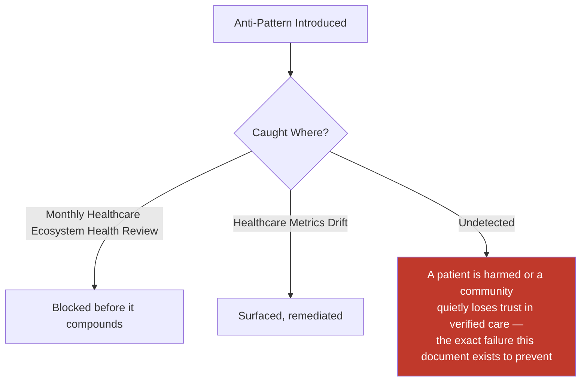

---

# Relationship to Previous Documents

| Prior Document | Relationship |
|---|---|
| **Project Vision (`ai-docs/00`)** | Establishes the founding fragmentation problem this document solves for healthcare specifically — no unified discovery of doctors, diagnostics, pharmacies, or emergency care. |
| **Stakeholder Analysis (`ai-docs/51`)** | Supplies the Doctors, Clinics, Hospitals, and Pharmacies stakeholder registry every category in this document traces to. |
| **Business Domain Model (`ai-docs/53`)** | Supplies the ownership structure behind the Healthcare domain (DOM-005) this document's business model is realized within. |
| **Business Capability Map (`ai-docs/55`)** | Supplies the stable abilities — Healthcare Discovery (CAP-014), Appointment Scheduling (CAP-015), Provider Verification (CAP-016) — this document's strategy is built directly on top of. |
| **Customer Experience Strategy (`ai-docs/60`)** | Supplies the "Reassuring and Unambiguous" felt-experience bar every healthcare interaction must clear. |
| **Value Proposition Framework (`ai-docs/61`)** | Supplies the Patient and Doctor stakeholder value exchange this document extends into a full ecosystem business model. |
| **Revenue & Sustainability Strategy (`ai-docs/62`)** | Supplies the Essential Healthcare affordability safeguard this document's economic mechanisms are bound by. |
| **Government Partnership Strategy (`ai-docs/63`)** | Supplies the Health Department coordination context this document's Scheme Awareness and public-health mechanisms depend on. |
| **District Ecosystem Mapping (`ai-docs/64`)** | Supplies the whole-system Ecosystem Health view this document's healthcare-specific health metrics feed into. |
| **Marketplace Strategy (`ai-docs/65`)** | Supplies the general two-sided-market economics this document specializes for the highest-stakes, safety-critical service category. |
| **Service Provider Ecosystem (`ai-docs/66`)** | Supplies the sibling strategic model for skill-based work; Doctors are the highest-verification-bar instance of the same Provider discipline. |
| **Merchant Ecosystem (`ai-docs/67`)** | Supplies the sibling strategic model for goods-based commerce; Pharmacies are a direct point of overlap between the two ecosystems. |
| **Agriculture Business Model (`ai-docs/68`)** | Supplies the sibling strategic model for a distinct, high-stakes population-serving vertical; shares the same Trust & Quality discipline and inclusion-first design commitment. |
| **Business Glossary (`ai-docs/59`)** | Supplies the precise vocabulary (Healthcare Provider, Booking, Appointment, Reputation, Dispute, Appeal) this document's every claim is expressed in. |

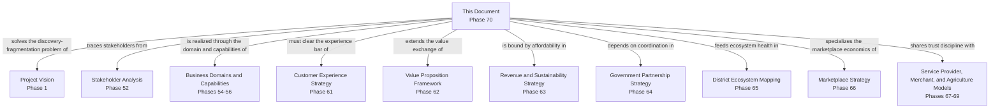

---

# Executive Artifacts

### Healthcare Business Framework

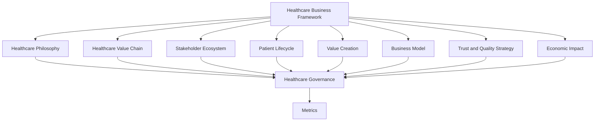

### Healthcare Value Chain

See Healthcare Value Chain section above — reproduced here by reference per Single Source of Truth, never duplicated.

### Patient Lifecycle

See Patient Lifecycle section above.

### Healthcare Ecosystem Map

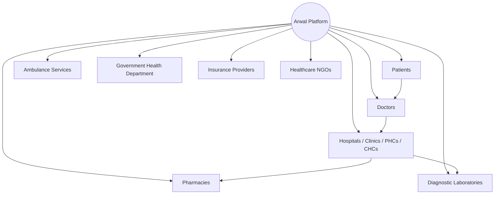

### Governance Model

See Governance section above.

### Healthcare Impact Model

See Economic Impact section above.

### Healthcare Growth Flywheel

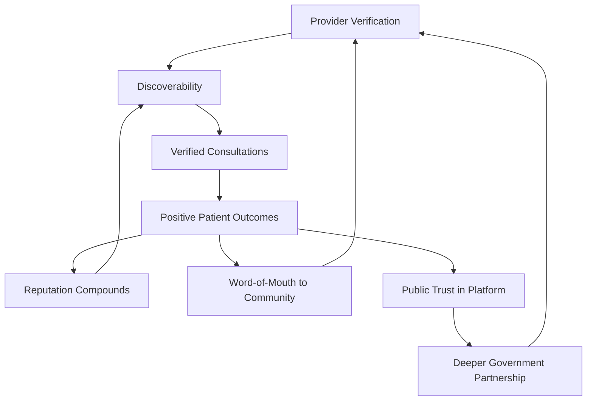

### Executive Dashboards

| Dashboard | Audience | Key Content |
|---|---|---|
| **CEO Dashboard** | CEO | Healthcare Ecosystem Health Score, Healthcare Access Index, Trust Score |
| **Chief Healthcare Officer Dashboard** | Chief Healthcare Officer | Verified Providers, Appointment Success Rate, category-level performance |
| **Trust & Safety Dashboard** | Head of Trust & Safety | Dispute Rate, verification turnaround, fraud/complaint-incident trend |
| **Government Partners Dashboard** | Health Department liaisons | Scheme Utilization, Emergency Response Coverage, public-health campaign reach |

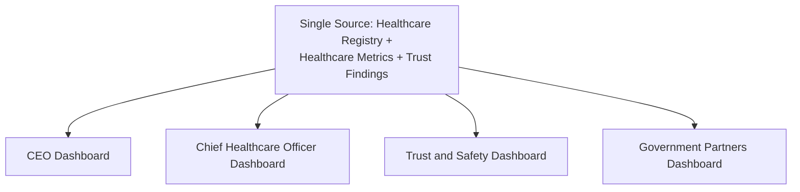

### Decision Matrix

| Decision Type | Approval Authority |
|---|---|
| New healthcare category/facility-type activation | Healthcare Council + CEO |
| Verification standard change | Healthcare Council + Head of Trust & Safety |
| New patient/provider-facing fee structure | Healthcare Council + Revenue Review Board |
| Government scheme data-sourcing change | Healthcare Council + Head of Government Partnerships |
| Emergency patient-safety response | Head of Trust & Safety, ratified within 5 business days |

---

# Closing Statement

> **Callout — Closing Statement**
> Every prior document in this handbook explains what Arwal builds, how it sustains itself, and the markets and ecosystems it operates inside. This document explains the specific promise Arwal makes to a citizen at the most vulnerable moment they will ever bring to the platform: that the doctor they find is genuinely verified, the pharmacy they check actually has the medicine in stock, and the ambulance they seek in an emergency is reachable without delay. A district's healthcare system is not a marketplace category among many — it is the infrastructure beneath whether a family's worst day becomes survivable or not, and Arwal's only justification for standing inside that moment is that it makes verified, safe, affordable care measurably easier to reach than the uncertainty that came before it. A healthcare strategy grown too fast, verified too loosely, or governed too unevenly does not merely underperform — it risks a life, and it teaches an entire community that the platform's trust badge meant nothing when it mattered most. Arwal grows this ecosystem at the pace patient safety and government partnership can genuinely sustain, never faster, because a generation-long civic-commercial platform cannot be built on a healthcare promise it cannot keep. Where a future phase must deviate from a principle stated here, that deviation is made explicitly — through the Healthcare Governance process above — never silently, and never by default.

This document, `ai-docs/69-healthcare-business-model.md`, is Phase 70 of approximately 415. Every future patient-facing decision, provider-verification standard, and public-health program is expected to trace back to a principle defined here, or to justify its deviation in writing.

**End of Phase 70 — `ai-docs/69-healthcare-business-model.md`**