# Education Business Model

**Document:** `ai-docs/70-education-business-model.md`
**Project:** Arwal — The District Super App
**Stage:** 2 — Product & Business Strategy
**Phase:** 71 — Education Business Model
**Status:** Approved for Product & Engineering Reference
**Audience:** CEO, CSO, CPO, Chief Education Officer, Enterprise Business Architects, Education Policy Strategists, Learning Experience Strategists, Human Capital Economists, Digital Education Consultants, Government Education Partnership Specialists, Trust & Safety Strategists, Privacy & Compliance Advisors, Investors

> **Callout — Purpose of This Document**
> `ai-docs/00-project-vision.md` through `ai-docs/69-healthcare-business-model.md` established why Arwal exists, what it can do, who it serves, how it sustains itself, how it partners with government, the whole district ecosystem it operates inside, the general economics of a marketplace, and how service providers, merchants, farmers, and patients build trust and value on the platform. None of those documents answers the question a parent asks while deciding whether to trust a tutor they have never met, or a student asks while wondering whether a scholarship they just discovered is even real: **why should a learner, a parent, or a teacher trust Arwal with something as consequential as a child's education or an adult's second chance at a skill — and will that trust actually translate into a better future?** This document is that answer — the authoritative Education Business Model every future learner-facing decision, institution-verification standard, and lifelong-learning program traces back to.

---

# Purpose of this Document

### Why Education Requires Its Own Business Model, Not a Marketplace Category Footnote

`ai-docs/65-marketplace-strategy.md` established the general economics of a two-sided market. `ai-docs/66-service-provider-ecosystem.md` specialized that economics for skilled, time-bound service work, and named Tutors and minor-safeguard risk explicitly. Education deserves its own document because its stakes are not merely transactional — a single tutoring session or a single scholarship application can shape a student's entire trajectory, and a family's trust in that outcome is rarely a one-time decision but a multi-year commitment. Education also spans an unusually wide range of institutional forms — a village school, a private coaching center, a government ITI, a university, a public library — each with different verification needs, different economics, and different relationships to the state. This document exists to reason about that whole system explicitly, on terms specific to learning and human development, never assumed from a generic commerce or services template.

### Why This Is a Business Strategy Document, Not an LMS or Curriculum Specification

This document contains no learning-management-system architecture, no examination software design, no grading algorithm, and no curriculum content. It does not redefine Domains (`ai-docs/53`), Capabilities (`ai-docs/55`), Modules (`ai-docs/54`), Journeys (`ai-docs/56`), Processes (`ai-docs/57`), or Rules (`ai-docs/58`) — Education Discovery (CAP-017), Scholarship Matching (CAP-018), and their governing rules (RULE-016) remain fully authoritative and are cited, never restated. This document's exclusive territory is: **the strategic reasoning behind who a learner and an educator are to Arwal, why education is a durable strategic pillar, how the education value chain and its stakeholders relate to one another, and how the ecosystem around learning is governed, protected, and grown.**

### The Chain of Reasoning This Document Extends

```mermaid
graph LR
    A[Value Proposition Framework<br/>ai-docs/61] --> B[Revenue and Sustainability<br/>ai-docs/62]
    B --> C[District Ecosystem Mapping<br/>ai-docs/64]
    C --> D[Marketplace Strategy<br/>ai-docs/65]
    D --> E[Service Provider Ecosystem<br/>ai-docs/66]
    E --> F[Merchant Ecosystem<br/>ai-docs/67]
    F --> G[Agriculture Business Model<br/>ai-docs/68]
    G --> H[Healthcare Business Model<br/>ai-docs/69]
    H --> I[Education Business Model<br/>ai-docs/70 — this document]
```

| Layer | Question It Answers |
|---|---|
| Value Proposition Framework | Why should any stakeholder trust Arwal? |
| Revenue & Sustainability Strategy | How does Arwal fund its promises for a generation? |
| District Ecosystem Mapping | What is the whole living system Arwal operates inside? |
| Marketplace Strategy | How does a two-sided market work, generally? |
| Service Provider Ecosystem | How does Arwal earn a skilled professional's trust with their livelihood? |
| Merchant Ecosystem | How does Arwal make a local business genuinely stronger? |
| Agriculture Business Model | How does Arwal earn a farmer's trust with their harvest? |
| Healthcare Business Model | How does Arwal earn a patient's trust with their health? |
| **Education Business Model** (this document) | **How does Arwal earn a learner's and a family's trust with their future, and how does the district's human capital grow because of it?** |

### Why Education Is a Strategic Pillar, Not a Feature

Per `ai-docs/00-project-vision.md`'s founding Problem Statement, a student and a parent today have no consolidated way to discover a genuinely good tutor, verify a coaching center's claims, learn of a scholarship they qualify for, or connect classroom learning to a real local opportunity. Education is named explicitly as a Core Domain (`ai-docs/53`) and a Should-Have priority in `ai-docs/01-product-goals.md`, whose strategic weight compounds as district trust matures — because a district's long-term prosperity depends on its people, not merely its transactions.

### How Education Improves Quality of Life

A student who can find a genuinely rated tutor near their budget, a parent who can verify a coaching center before enrolling their child, and an adult who discovers a skill-development program they never knew existed each experience a measurable reduction in wasted money, wasted time, and foreclosed opportunity. Multiplied across a district, this is not an abstraction — it is a generation with a better starting position than the one before it.

### How Education Strengthens District Development

Per `ai-docs/64-district-ecosystem-mapping.md`'s District Development Strategy, a more educated, more skilled population is a more economically productive one — better-matched employment, higher local entrepreneurship, and a workforce more able to participate meaningfully in every other domain Arwal serves. Education is the compounding, long-horizon investment beneath every other vertical's long-term growth.

### Relationship Between Every Participant

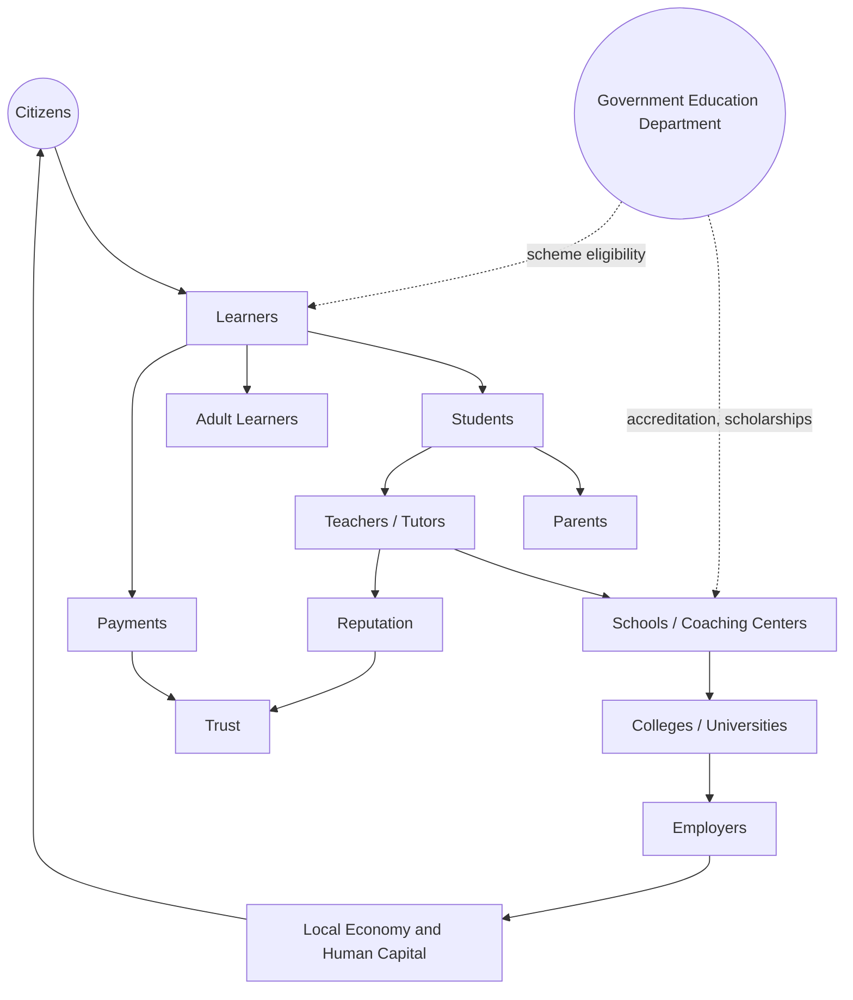

A citizen becomes a learner the moment a learning need arises — as a student under a parent's guidance, or as an adult pursuing a new skill. That learner's journey may touch a teacher or tutor, a school or coaching center, a college or university, and eventually an employer. Every interaction produces Reputation and Trust, moves through Payments under the same settlement-integrity standard as every other transaction platform-wide, and sits within a government accreditation and scholarship-administration mandate Arwal supports without ever displacing.

### Scope Boundary

This document does not define curricula, does not specify examination or grading logic, does not define an LMS's technical architecture, and does not redraft any scholarship's own eligibility rule — those remain educational and government authority, cited per `ai-docs/58-business-rules-policies.md`'s RULE-008 and RULE-016, never redefined here. This document's territory is strategic and economic: the business model, the stakeholder relationships, the value chain, and the governance that makes Arwal's education participation trustworthy and durable.

---

# Education Philosophy

Every principle below exists because an education strategy designed carelessly does not fail abstractly — it fails a specific student steered toward a fraudulent institution, a specific parent misled about a scholarship, or a specific adult learner who gave up because nothing on the platform was actually reachable to them.

### Learner First
**Why it exists:** Every education decision is judged first against whether it serves the learner's genuine development, mirroring the identical Citizen-First tie-breaker already established throughout `ai-docs/51` through `ai-docs/69`. An institution's convenience or a commercial consideration is never optimized ahead of a learner's actual outcome.

### Equal Opportunity
**Why it exists:** A district's most capable student should never be limited by the accident of which village they were born in or which school happens to be nearby. Equal Opportunity means every learner reaches the same transparent discovery of tutors, scholarships, and skill programs every other learner does.

### Accessibility
**Why it exists:** A meaningful share of Arwal's learner population is a first-generation smartphone user with limited literacy and intermittent connectivity. Voice-first, offline-capable, simplified-language design is the floor for every education-facing capability, per `ai-docs/12-accessibility-standards.md`.

### Affordability
**Why it exists:** A learning opportunity a family cannot afford to discover is not an opportunity at all. Discovery and facilitation fees are structured, per `ai-docs/62-revenue-sustainability-strategy.md`'s Education safeguard, to never gate a student's access to affordable tutoring or scholarship discovery.

### Lifelong Learning
**Why it exists:** Education does not end with a school-leaving certificate. An adult seeking a new skill, a mid-career worker seeking re-training, and a retiree pursuing a personal interest are all legitimate learners Arwal's education strategy is designed to serve, never treated as an afterthought behind K-12 or exam-preparation use cases.

### Digital Inclusion
**Why it exists:** A learning platform that only works for the digitally fluent, urban, literate student has captured a fraction of the district's actual learning need, per the founding Inclusion over Optimization pillar in `ai-docs/00-project-vision.md`.

### Trust Before Certification
**Why it exists:** A citizen will not trust a certificate, a badge, or a claimed accreditation unless the verification behind it is genuine. Trust is the precondition every certification-adjacent claim depends on, never a byproduct assumed from good UX.

### Transparency
**Why it exists:** A parent must be able to see why an institution is verified, what a coaching program actually costs, and what happens to their child's data — concealment in an education context deters exactly the families most in need of a trustworthy alternative to word-of-mouth referral.

### Skill Development
**Why it exists:** Academic credentials alone do not guarantee employability. Practical, market-relevant skill development is treated as a first-class strategic priority, co-equal with formal schooling and exam-preparation discovery.

### Knowledge Sharing
**Why it exists:** A teacher's or a peer's accumulated knowledge, shared across a learning community, compounds faster than knowledge held individually — mirroring the identical Knowledge Sharing principle already established for farmers in `ai-docs/68-agriculture-business-model.md`.

### Community Learning
**Why it exists:** Not every learning need is met by a formal, paid institution — a village-level study group, a library reading circle, or an NGO-run literacy program are legitimate, valuable learning structures Arwal's strategy explicitly includes, never displaces.

### Evidence-Based Improvement
**Why it exists:** Every claim this document makes about learner outcomes, institution quality, or program impact is evaluated against actual, measured data — never asserted from confidence or institutional prestige alone.

### Long-Term Human Capital Development
**Why it exists:** Arwal's education strategy is evaluated on a multi-year, generational horizon — a single strong enrollment quarter is not success if the underlying trust, equity, or quality of learning outcomes were compromised to produce it, mirroring the Long-Term Sustainability principle already established in `ai-docs/62-revenue-sustainability-strategy.md`.

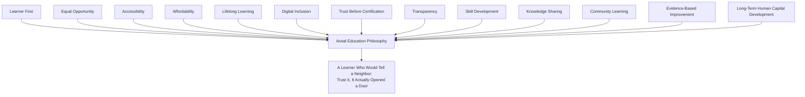

> **Callout — The One-Sentence Education Philosophy**
> *"A family trusts Arwal with a child's future only once at a time — betray that trust with a fraudulent tutor or a fake scholarship, and no discovery convenience will ever earn it back."*

---

# Education Value Chain

| Stage | Business Description |
|---|---|
| **Awareness** | A learner's or parent's foundational understanding of available learning options, scholarships, and skill pathways — the earliest point Arwal's discovery capability adds value. |
| **Enrollment** | The formal or informal commitment to a school, coaching center, tutor, or program — the moment discovery converts into a real relationship. |
| **Learning** | The actual instructional engagement, delivered entirely by the teacher or institution — Arwal never substitutes its own judgment for a teacher's pedagogy. |
| **Attendance** | Participation and consistency over the course of an engagement, relevant to a parent's or institution's own tracking, never a clinical or grading judgment made by Arwal. |
| **Assessment** | The institution's own evaluation of a learner's progress — Arwal never grades, examines, or scores a learner directly. |
| **Certification** | The institution's or government's own credentialing output, made discoverable and verifiable through Arwal, never issued by Arwal itself. |
| **Skill Development** | Practical, market-relevant capability building — vocational training, digital literacy, trade skills — bridging formal education and employability. |
| **Career Preparation** | Resume-readiness, interview awareness, and skill-to-opportunity matching, connecting Education to the Jobs domain (`ai-docs/53`). |
| **Competitive Examination Preparation** | Discovery of coaching and resources for government, entrance, or professional competitive examinations — a high-stakes, high-trust category given the life-shaping consequence of these exams in the district's context. |
| **Higher Education** | Discovery of colleges, universities, and further-study pathways beyond secondary schooling. |
| **Employment Readiness** | The point at which a learner's accumulated skill and credential become genuinely marketable, feeding directly into Job Matching (CAP-019). |
| **Continuous Learning** | Ongoing, non-linear skill acquisition across a working adult's career, never assumed to stop at a first job. |
| **Lifelong Learning** | Sustained, multi-decade engagement with learning as a personal and civic good, independent of employment status. |
| **Community Education** | Village- and neighborhood-level collective learning — literacy drives, adult education camps, NGO-run programs — reaching learners a purely individual-transaction model would never reach. |

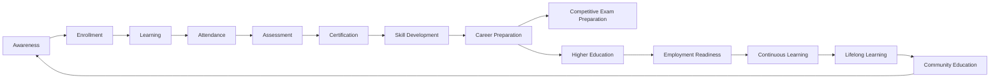

> **Callout — Arwal Facilitates the Chain, Never Replaces the Classroom**
> At every stage above, Arwal's role is discovery, verification, scheduling, and transparency — never teaching, never grading, never certifying. A learner who completes a course through Arwal has learned it *from a verified teacher or institution*, with Arwal as the trusted channel, exactly as `ai-docs/63-government-partnership-strategy.md` establishes for civic services and `ai-docs/69-healthcare-business-model.md` establishes for clinical care.

---

# Stakeholder Ecosystem

Every stakeholder below traces to its full Persona (`ai-docs/52`) and Stakeholder (`ai-docs/51`) record; this section states only the stakeholder's education business role.

| Stakeholder | Strategic Role |
|---|---|
| **Students** | The primary demand-side learner population, per PER-003 Aisha, whose discovery, learning, and certification needs anchor the Education domain. |
| **Parents** | Oversight, financial decision-making, and — for minors — delegated-access authority, per PER-005 Sunita. |
| **Teachers** | Independent, verified tutors providing direct instruction, per PER-004 Manoj, and the highest-trust supply-side category given minor-safeguard stakes. |
| **Schools** | Formal K-12 institutions providing contextual academic standing, per `ai-docs/59-business-glossary.md`'s GLOSS-009, not directly onboarded as Arwal providers but relevant to discovery context. |
| **Colleges** | Higher-education institutions relevant to scholarship, admission-awareness, and skill-pathway discovery. |
| **Universities** | Degree-granting institutions anchoring the highest tier of formal academic progression discoverable through Arwal. |
| **Coaching Institutes** | Verified, commercially onboarded institutional tutoring and exam-preparation providers, per `ai-docs/54`'s MOD-017. |
| **Vocational Training Centers** | Skill-development institutions bridging Education and Employment, offering trade and practical-skill instruction. |
| **Skill Development Organizations** | Government and private bodies administering structured skill-certification programs. |
| **Libraries** | Community learning-resource institutions extending access beyond any single paid engagement. |
| **Digital Learning Platforms** | Technology partners offering supplementary digital content, integrated as discovery partners, never displacing Arwal's own provider-agnostic neutrality. |
| **Government Education Department** | The regulatory and public-education authority Arwal's education capability supports, per `ai-docs/63-government-partnership-strategy.md`. |
| **Scholarship Providers** | Government and private bodies administering scholarships and financial-aid programs, per CAP-018. |
| **Employers** | The eventual destination of a learner's accumulated skill, connecting Education to the Jobs domain. |
| **Education NGOs** | Trust-building intermediaries extending reach into underserved and low-literacy learning populations, per `ai-docs/64-district-ecosystem-mapping.md`. |
| **Academic Researchers** | Sources of evidence-based pedagogical and skill-development insight informing advisory content quality. |
| **Future Education Participants** | Second-district institutions, future accreditation partners, and emerging digital-learning providers, tracked for readiness per the Learner Lifecycle's Awareness stage below. |

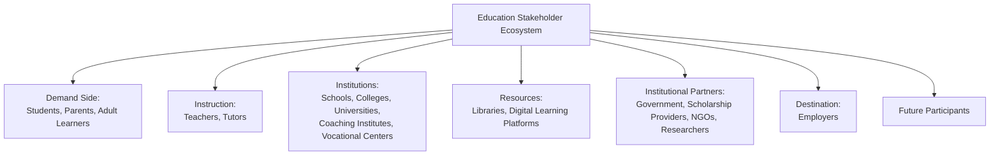

---

# Learner Lifecycle

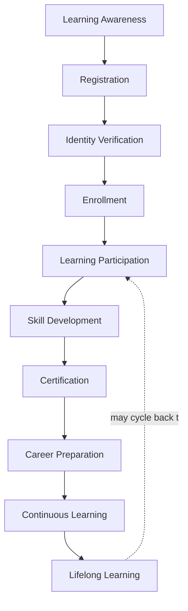

| Stage | Meaning | Owning Discipline |
|---|---|---|
| **Learning Awareness** | A learner or parent learns Arwal offers verified education discovery, typically via community outreach, a school notice, or in-app discovery. | Community outreach, this document |
| **Registration** | The learner (or parent, on a minor's behalf) creates an Arwal identity, per JRN-001. | Identity Verification (CAP-001) |
| **Identity Verification** | Baseline identity verification completes, per RULE-002 — no elevated documentary burden beyond what any citizen faces. | Identity Verification Processing (PROC-002) |
| **Enrollment** | The learner discovers and books a verified tutor, coaching center, or program, per Education Discovery (CAP-017) and Appointment Scheduling (CAP-015). | Business Model, below |
| **Learning Participation** | The learner engages the actual instructional relationship — delivered entirely by the teacher or institution. | Teacher/institution's own pedagogy, outside Arwal's scope |
| **Skill Development** | The learner engages vocational or skill-specific programs bridging academic learning and employability. | Business Model, below |
| **Certification** | The institution's or government's own credentialing output becomes discoverable and verifiable through the learner's profile. | Certification Transparency, below |
| **Career Preparation** | The learner's accumulated skill connects to Job Matching (CAP-019) and Employer Recruitment (CAP-020). | Cross-domain collaboration, `ai-docs/64` |
| **Continuous Learning** | The learner returns for a new skill or subject as their needs evolve across a career. | Learner Success Strategy, below |
| **Lifelong Learning** | Sustained, multi-year to multi-decade engagement, measured across years rather than a single course. | Governance, below |

### Lifecycle Design Commitment

At every stage above, the learner's experience is designed with the same rigor `ai-docs/56-user-journey-standards.md` requires of any citizen journey — a named Failure Scenario and Recovery Path for every stage a learner could stall at, never a dead end where a student or parent simply gives up and reverts to an unverified, informal alternative.

---

# Value Creation

| Question | Answer |
|---|---|
| **How do educators create value?** | By delivering genuinely skilled, safe, and effective instruction — the platform amplifies discoverability and trust in that instruction, it never manufactures or substitutes for it. |
| **How do learners create value?** | By providing honest, transaction-verified feedback that helps the next family make a confident, informed choice, and by engaging consistently enough that a teacher's investment in them compounds into real skill. |
| **How do institutions create value?** | By offering genuinely differentiated, quality instruction and by participating transparently in Arwal's verification and reputation system rather than around it. |
| **How does Arwal create value?** | By converting fragmented, unverifiable local education awareness into transparent, verified, voice-accessible discovery — reach, verification, secure payment, and dispute protection a family could not assemble alone. |
| **How does trust develop?** | Through Identity Verification (CAP-001) and elevated, minor-safeguard-sensitive Provider Verification (CAP-016, RULE-016), compounding through Reputation & Rating Management (CAP-045) as verified, completed sessions accumulate. |
| **How do educational outcomes improve?** | Through Fair Visibility in discovery, transparent institution and teacher credentials, and scholarship/skill-program awareness that closes the "I didn't know this existed" gap. |
| **How does district knowledge capital grow?** | Through community-level reach via NGOs and libraries, and through the compounding effect of every additional learner and educator making the discovery system more valuable to the next family. |

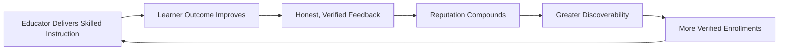

---

# Business Model

Every capability below is described strategically — its business rationale — never as an implementation. The enforceable capability logic is owned entirely by `ai-docs/55-business-capability-map.md`'s CAP-017 and CAP-018.

| Capability | Business Rationale |
|---|---|
| **School Discovery** | Contextual visibility into formal K-12 institutions, supporting a family's decision-making even where Arwal does not directly onboard the school as a provider. |
| **College Discovery** | Discovery of higher-education institutions relevant to a student's post-secondary pathway. |
| **Coaching Discovery** | Converts word-of-mouth coaching-center discovery into verified, ranked, comparable search, per CAP-017 — verification status always visible, never spoofable. |
| **Vocational Training Discovery** | Surfaces skill-development and trade-training programs bridging Education and Employment domains. |
| **Scholarship Discovery** | Surfaces a learner's eligibility for a scholarship or financial-aid program, sourced jointly with the Government Education Department per RULE-008, never approximated unilaterally. |
| **Learning Resource Discovery** | Surfaces libraries and community learning resources as a first-class, non-commercial discovery category. |
| **Digital Learning** | Discovery of supplementary digital-content partners, integrated neutrally, never displacing organic ranking with paid preference. |
| **Skill Development** | Practical, market-relevant capability-building discovery, treated as co-equal in strategic priority with academic tutoring. |
| **Career Guidance** | Advisory content connecting a learner's accumulated skill to real local opportunity, always advisory, never displacing the learner's own agency. |
| **Competitive Exam Guidance** | Discovery of coaching and preparatory resources for high-stakes government and entrance examinations, held to elevated trust scrutiny given the life-shaping consequence of these exams. |
| **Education Events** | Distribution of admission drives, scholarship deadlines, and skill-program enrollment windows through Notifications (CAP-031). |
| **Community Learning Programs** | NGO- and library-mediated collective learning outreach extending Arwal's reach to learners a purely app-native model would never reach. |

```mermaid
graph TD
    BizModel5[Education Business Model] --> SchoolDisc[School Discovery]
    BizModel5 --> CollegeDisc[College Discovery]
    BizModel5 --> CoachDisc[Coaching Discovery]
    BizModel5 --> VocDisc[Vocational Training Discovery]
    BizModel5 --> SchoDisc[Scholarship Discovery]
    BizModel5 --> ResourceDisc[Learning Resource Discovery]
    BizModel5 --> DigitalLearn[Digital Learning]
    BizModel5 --> SkillDevCap[Skill Development]
    BizModel5 --> CareerGuide[Career Guidance]
    BizModel5 --> ExamGuide[Competitive Exam Guidance]
    BizModel5 --> EduEvents[Education Events]
    BizModel5 --> CommunityProg2[Community Learning Programs]
```

---

# Trust & Quality Strategy

| Mechanism | Strategic Role |
|---|---|
| **Institution Verification** | Every coaching center's or vocational institute's registration and legitimacy is confirmed before any listing is discoverable, per RULE-016 and PROC-026. |
| **Teacher Verification** | An individual tutor's identity, and where claimed, their credential, is confirmed with elevated scrutiny given minor-safeguard risk, per RULE-016's Education Provider Minor-Safeguard Standard. |
| **Accreditation Awareness** | Where an institution claims a government or board accreditation, that claim is surfaced transparently and, where a verification channel exists, cross-checked — never asserted by Arwal without evidence. |
| **Certification Transparency** | A displayed certificate or credential is always traceable to its issuing institution — Arwal never issues, endorses, or implies its own certification authority. |
| **Scholarship Transparency** | Scholarship eligibility and terms are sourced directly from the administering body's own published rules, per RULE-008, never inferred or approximated. |
| **Privacy Protection** | A minor's data is handled under the strictest minimization standard on the platform, per RULE-003 and the Education-specific minor-safeguard discipline in `ai-docs/56-user-journey-standards.md`. |
| **Learner Consent** | Explicit, granular, revocable consent governs every education-adjacent data flow involving a minor, with a parent or guardian holding delegated authority per CAP-005. |
| **Complaint Resolution** | A structured, evidence-based path to a fair outcome for both learner and educator, per CAP-036 and RULE-013. |
| **Government Coordination** | Scheme, scholarship, and accreditation data is sourced jointly with the Education Department, per `ai-docs/63-government-partnership-strategy.md`. |
| **Education Trust** | Every mechanism above compounds into a single, felt outcome: a parent who believes Arwal's verification badge in Education means something real, unlike an unverified informal referral. |

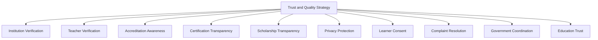

> **Callout — Minor-Safeguard Rigor Is Never Negotiable**
> Per the Proportional Rigor principle applied throughout this handbook, an education provider interacting with minors is held to a materially higher verification and complaint-response bar than a provider serving adult learners only — mirroring the identical elevated standard already established for Healthcare Providers in `ai-docs/69-healthcare-business-model.md`, because the citizen-facing consequence of a lapse in this domain is categorically more severe.

---

# Economic Impact

| Impact Area | How Arwal Contributes |
|---|---|
| **Increase Educational Access** | Verified discovery reduces the time and uncertainty between a learning need and a genuinely good tutor, coaching center, or program. |
| **Improve Learning Opportunities** | Scholarship and skill-program discovery surfaces opportunities a family would otherwise never learn existed. |
| **Reduce Information Gaps** | Government Scholarship Awareness closes the "I didn't know I qualified" gap that leaves eligible students underserved. |
| **Improve Skill Development** | Vocational and skill-program discovery bridges the gap between academic credentials and actual employability. |
| **Strengthen Employability** | Career Guidance and cross-domain linkage to Job Matching (CAP-019) connect learning directly to local opportunity. |
| **Promote Lifelong Learning** | Continuous- and adult-learning discovery treats education as a multi-decade relationship, not a childhood-only concern. |
| **Support District Innovation** | A more skilled population is better able to participate in every other domain Arwal serves, strengthening the district's own innovation capacity. |
| **Develop Human Capital** | The cumulative effect of every mechanism above, measured over years, is a district population with measurably stronger skills and opportunity access. |

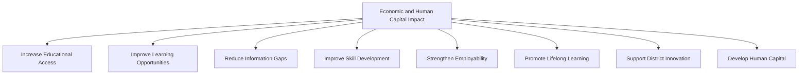

---

# Governance

### Ownership
Education Business Model ownership sits with the Chief Education Officer (or Head of Education Vertical where the role is not yet separately staffed), with Tutors, Coaching Institutes, Vocational Training Centers, and Scholarship Providers each accountable to a named sub-owner, mirroring the Clear Ownership discipline already established throughout `ai-docs/53` through `ai-docs/69`.

### Education Council
A standing **Education Council** — chaired by the Chief Education Officer, with the Head of Trust & Safety, Head of Government Partnerships, CPO, Compliance Officer, and rotating educator and parent representatives as members — holds approval authority over any platform-wide verification-standard change, any new education-facilitation fee mechanism, and any material deviation from the Anti-Patterns below. The Council meets monthly, with ad hoc sessions for an Education Ecosystem Health Score regression. Parent representation specifically ensures the ecosystem's most safeguard-sensitive decisions are informed by genuine family concern, never made by commercial staff alone.

### Decision Authority

| Decision | Approves |
|---|---|
| New education category or institution-type activation | Education Council + CEO |
| Teacher/Institution verification standard change | Education Council + Head of Trust & Safety |
| New learner-facing or provider-facing fee structure | Education Council + Revenue Review Board (`ai-docs/62`) |
| Government scholarship/accreditation data-sourcing change | Education Council + Head of Government Partnerships |
| Emergency minor-safety response (e.g., a confirmed unsafe tutor) | Head of Trust & Safety, immediate, ratified by Council within 5 business days |

### Review Cadence

| Review | Cadence | Owner |
|---|---|---|
| Education Ecosystem Health Review | Monthly | Education Council |
| Category Performance Review (Tutors, Coaching, Vocational, Scholarships) | Quarterly | Category Heads |
| Annual Education Strategy Review | Annual | CEO, Chief Education Officer, CPO |

### Conflict Resolution
A learner-educator dispute follows PROC-013 and RULE-013 in full; an educator's disagreement with a platform decision (a verification rejection, a ranking outcome) follows the identical Appeal right already established in RULE-028, reviewed by an independent reviewer distinct from the original decision-maker.

### Continuous Improvement
Every review above feeds a shared, tracked improvement backlog — a recurring verification bottleneck, a rural-access gap, or a parent-suggested safeguard refinement — reviewed and prioritized at the next Education Ecosystem Health Review, never left to informally resolve itself.

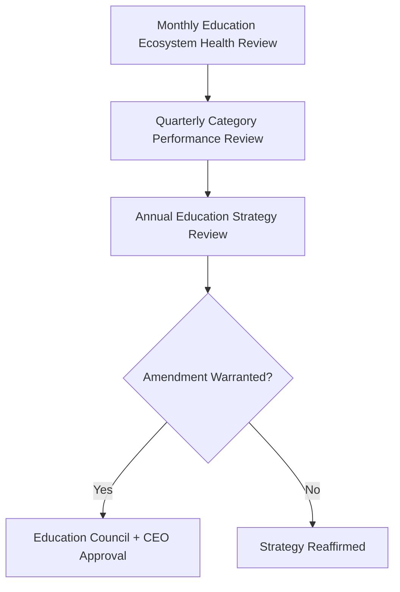

---

# Risks

| Risk | Description | Mitigation |
|---|---|---|
| **Misinformation** | Inaccurate scholarship, accreditation, or career information reaches a learner. | Content sourced from authoritative institutions; Government Coordination for scheme data, per RULE-008. |
| **Unverified Institutions** | A coaching center or vocational institute appears discoverable without completing verification. | RULE-016's standard; immediate delisting upon discovery of a gap. |
| **Fake Certifications** | A provider claims a credential or accreditation they do not hold. | Certification Transparency; cross-checking against the issuing authority where feasible; immediate Trust & Safety escalation upon a confirmed false claim. |
| **Scholarship Fraud** | A fraudulent scheme mimics a genuine scholarship to collect fees or data. | RULE-008's determination logic sourced only from published, authoritative rules; Fraud Detection (CAP-038) monitoring. |
| **Digital Exclusion** | A low-literacy or first-generation smartphone learner cannot access education discovery unassisted. | Voice-first design, field-agent and NGO-mediated assisted access, per Accessibility above. |
| **Educational Inequality** | Rural or low-income learners receive structurally worse discovery or access than urban, affluent peers. | Equal Opportunity principle above; discovery-parity monitoring across geography and income segment. |
| **Privacy Risks** | A minor's data is exposed or misused beyond its consented purpose. | RULE-003's Consent Requirement; elevated minor-safeguard data handling per the Trust & Quality Strategy above. |
| **Regulatory Changes** | An education-data or accreditation regulation shift invalidates an existing workflow assumption. | Configurable, department-owned workflows per RULE-006 and RULE-016 — a policy change updates a configuration, not a rebuild. |
| **Trust Erosion** | A single mishandled education-safety incident damages trust across the entire vertical, and potentially cross-vertical. | Transparent, evidence-based dispute resolution; rapid, honest incident communication, per `ai-docs/60-customer-experience-strategy.md`. |
| **Quality Degradation** | A verified provider's instructional quality declines over time without detection. | Ongoing quality monitoring distinct from one-time onboarding verification, per the Continuous Learning principle above. |

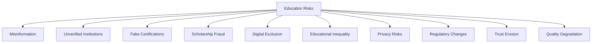

---

# Metrics

| Metric | Definition | Direction |
|---|---|---|
| **Registered Learners** | Count of citizens who have engaged at least one education capability. | Increasing |
| **Verified Institutions** | Count of coaching centers, vocational institutes, and other providers passing full verification. | Increasing |
| **Verified Educators** | Count of individual tutors passing full, minor-safeguard-appropriate verification. | Increasing |
| **Scholarship Utilization** | Rate at which eligible learners discover and act on a matched scholarship. | Increasing |
| **Skill Program Participation** | Learner engagement rate with vocational and skill-development discovery. | Increasing |
| **Learning Completion** | % of initiated bookings/enrollments completing without cancellation or dispute. | Increasing |
| **Career Readiness** | Share of learners connecting accumulated skill to a Job Matching (CAP-019) outcome. | Increasing |
| **Education Access Index** | A composite measure of discovery reach and enrollment parity across urban and rural, and income segments. | Increasing, approaching parity |
| **Trust Score** | District Trust Signal, viewed for education interactions specifically. | Increasing |
| **Education Ecosystem Health** | A composite index combining Verified Provider growth, Trust Score, Dispute Rate, and Access Index. | Increasing |

> **Callout — No Education Metric Stands Alone**
> Per the North Star Principle already established in `ai-docs/00-project-vision.md`, a rising Registered Learners count alongside a falling Trust Score or rising Dispute Rate is treated as a regression — never counted as success in isolation.

---

# Anti-Patterns

| Anti-Pattern | Why It's Rejected |
|---|---|
| **Ignoring Rural Education** | Directly contradicts Equal Opportunity and the founding Inclusion over Optimization pillar already established in `ai-docs/00-project-vision.md`. |
| **Technology Without Learning** | A capability that showcases technical sophistication without measurably improving a learner's outcome has optimized for the wrong metric. |
| **Fake Institutions** | Directly violates RULE-016 — no institution is discoverable before verification succeeds, with no exception for growth pressure. |
| **Growth Without Trust** | A rising Registered Learners count alongside a falling Trust Score is a regression, never a win. |
| **Poor Accessibility** | A capability only a digitally fluent, literate learner can use has failed the Accessibility principle regardless of technical sophistication. |
| **Urban Bias** | Research, discovery ranking, or outreach implicitly skewed toward district-headquarters learners recreates the exact Urban Bias anti-pattern already rejected in `ai-docs/51-stakeholder-analysis.md`. |
| **Short-Term Optimization** | Trading long-term learner trust for a single quarter's enrollment volume violates Long-Term Human Capital Development. |
| **Ignoring Lifelong Learning** | Treating education as a K-12-only concern neglects adult and continuous learners the Lifelong Learning principle explicitly protects. |
| **Certification Without Skills** | Surfacing or implicitly endorsing a credential that does not correspond to genuine skill acquisition violates Certification Transparency and Trust Before Certification. |

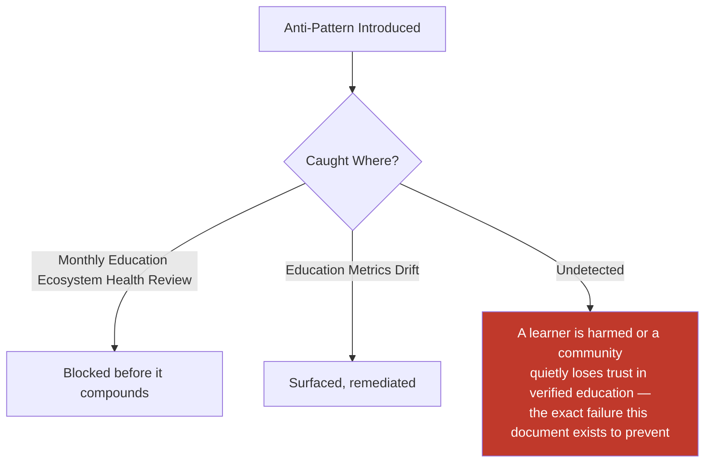

---

# Relationship to Previous Documents

| Prior Document | Relationship |
|---|---|
| **Project Vision (`ai-docs/00`)** | Establishes the founding fragmentation problem this document solves for education specifically — no unified discovery of tutors, scholarships, or skill pathways. |
| **Stakeholder Analysis (`ai-docs/51`)** | Supplies the Students, Teachers, Parents, and Educational Institutions stakeholder registry every category in this document traces to. |
| **Business Domain Model (`ai-docs/53`)** | Supplies the ownership structure behind the Education domain (DOM-006) this document's business model is realized within. |
| **Business Capability Map (`ai-docs/55`)** | Supplies the stable abilities — Education Discovery (CAP-017), Scholarship Matching (CAP-018) — this document's strategy is built directly on top of. |
| **Customer Experience Strategy (`ai-docs/60`)** | Supplies the "Encouraging and Judgment-Free" felt-experience bar every education interaction must clear. |
| **Value Proposition Framework (`ai-docs/61`)** | Supplies the Student and Teacher stakeholder value exchange this document extends into a full ecosystem business model. |
| **Revenue & Sustainability Strategy (`ai-docs/62`)** | Supplies the affordability safeguard this document's economic mechanisms are bound by. |
| **Government Partnership Strategy (`ai-docs/63`)** | Supplies the Education Department coordination context this document's Scholarship Awareness and accreditation mechanisms depend on. |
| **District Ecosystem Mapping (`ai-docs/64`)** | Supplies the whole-system Ecosystem Health view this document's education-specific health metrics feed into. |
| **Marketplace Strategy (`ai-docs/65`)** | Supplies the general two-sided-market economics this document specializes for a minor-safeguard-sensitive, reputation-compounding service category. |
| **Service Provider Ecosystem (`ai-docs/66`)** | Supplies the sibling strategic model for skill-based work; Tutors are a minor-safeguard-elevated instance of the same Provider discipline. |
| **Merchant Ecosystem (`ai-docs/67`)** | Supplies the sibling strategic model for goods-based commerce; Book and Stationery Stores are a direct point of overlap between the two ecosystems. |
| **Agriculture Business Model (`ai-docs/68`)** | Supplies the sibling strategic model for a distinct, inclusion-first population-serving vertical; shares the same Trust & Quality discipline. |
| **Healthcare Business Model (`ai-docs/69`)** | Supplies the sibling strategic model for the platform's other highest-stakes vertical; shares the same elevated-verification and safety-first governance pattern. |
| **Business Glossary (`ai-docs/59`)** | Supplies the precise vocabulary (Tutor, School, Reputation, Dispute, Appeal, Delegated Access) this document's every claim is expressed in. |

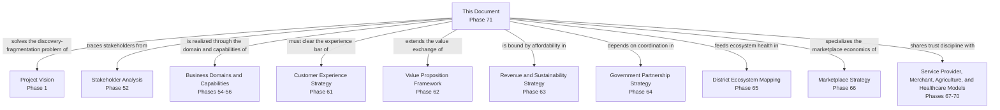

---

# Executive Artifacts

### Education Business Framework

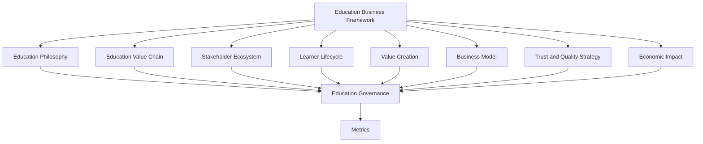

### Education Value Chain

See Education Value Chain section above — reproduced here by reference per Single Source of Truth, never duplicated.

### Learner Lifecycle

See Learner Lifecycle section above.

### Education Ecosystem Map

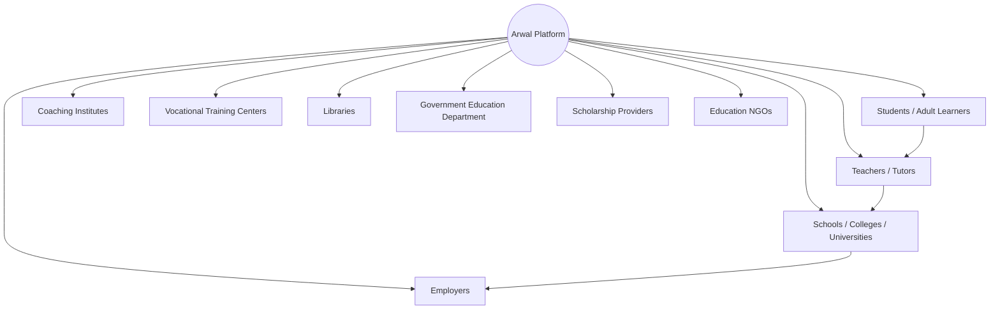

### Human Capital Development Model

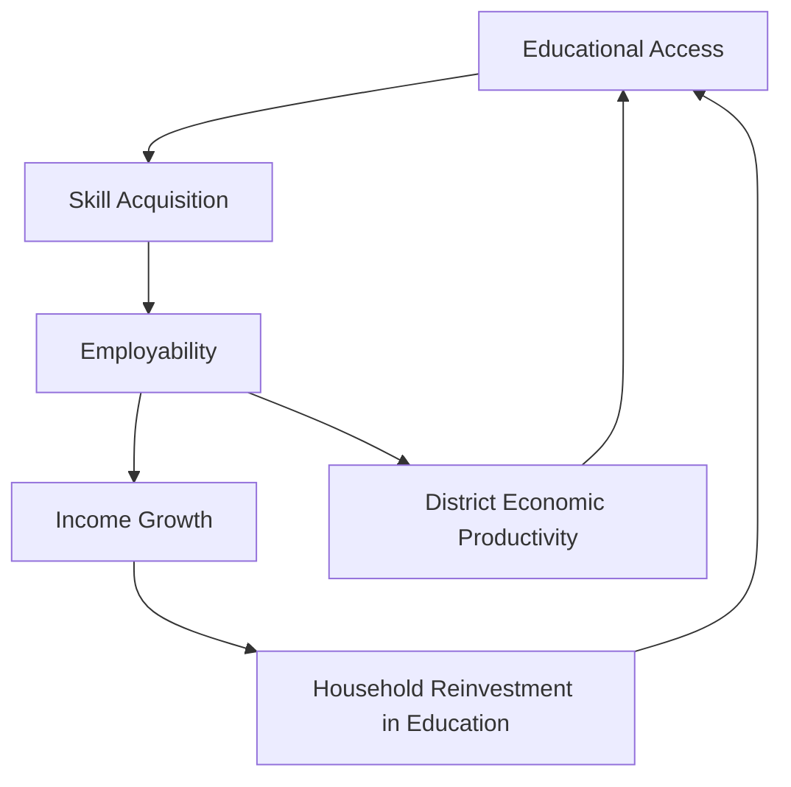

### Governance Model

See Governance section above.

### Education Growth Flywheel

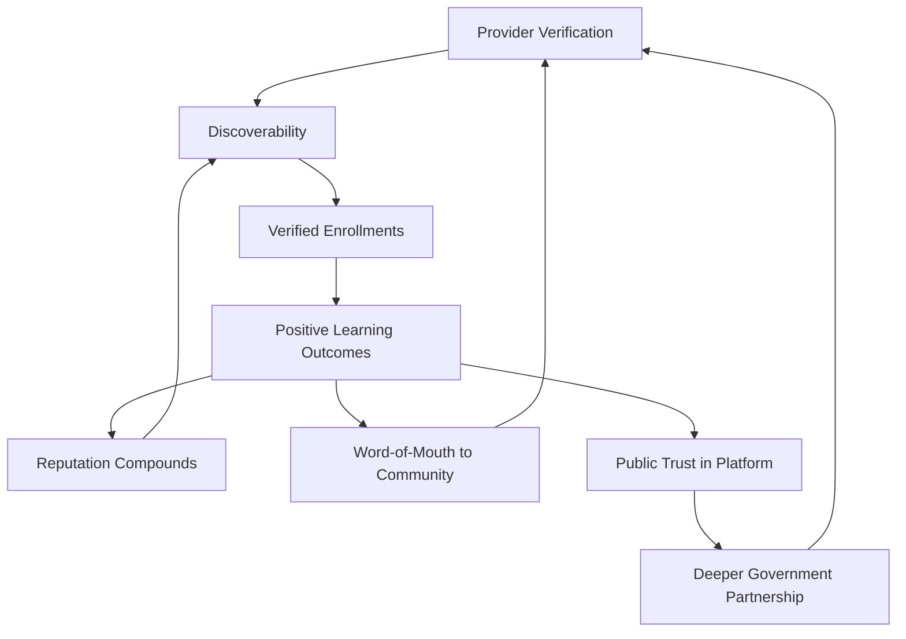

### Executive Dashboards

| Dashboard | Audience | Key Content |
|---|---|---|
| **CEO Dashboard** | CEO | Education Ecosystem Health Score, Education Access Index, Trust Score |
| **Chief Education Officer Dashboard** | Chief Education Officer | Verified Institutions/Educators, Learning Completion, category-level performance |
| **Trust & Safety Dashboard** | Head of Trust & Safety | Dispute Rate, verification turnaround, minor-safeguard incident trend |
| **Government Partners Dashboard** | Education Department liaisons | Scholarship Utilization, accreditation coordination status |

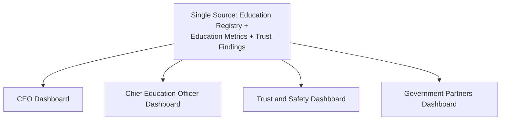

### Decision Matrix

| Decision Type | Approval Authority |
|---|---|
| New education category/institution-type activation | Education Council + CEO |
| Verification standard change | Education Council + Head of Trust & Safety |
| New learner/provider-facing fee structure | Education Council + Revenue Review Board |
| Government scholarship/accreditation data-sourcing change | Education Council + Head of Government Partnerships |
| Emergency minor-safety response | Head of Trust & Safety, ratified within 5 business days |

---

# Closing Statement

> **Callout — Closing Statement**
> Every prior document in this handbook explains what Arwal builds, how it sustains itself, and the markets and ecosystems it operates inside. This document explains the specific promise Arwal makes to a student searching for a tutor they can trust, a parent verifying a coaching center before enrolling their child, and an adult discovering a skill program that could change their career: that the verification behind that discovery is genuine, the scholarship they qualify for is real, and the platform stands beside them for the entire arc of a learning life, not just a single enrollment. A district's education system is not a marketplace category among many — it is the infrastructure beneath whether the next generation inherits more opportunity than the one before it, and Arwal's only justification for standing inside that process is that it makes verified, safe, affordable learning measurably easier to reach than the uncertainty that came before it. An education strategy grown too fast, verified too loosely, or governed too unevenly does not merely underperform — it risks a child's safety or a family's trust, and it teaches an entire community that the platform's trust badge meant nothing when it mattered most. Arwal grows this ecosystem at the pace learner safety and government partnership can genuinely sustain, never faster, because a generation-long civic-commercial platform cannot be built on an education promise it cannot keep. Where a future phase must deviate from a principle stated here, that deviation is made explicitly — through the Education Governance process above — never silently, and never by default.

This document, `ai-docs/70-education-business-model.md`, is Phase 71 of approximately 415. Every future learner-facing decision, institution-verification standard, and lifelong-learning program is expected to trace back to a principle defined here, or to justify its deviation in writing.

**End of Phase 71 — `ai-docs/70-education-business-model.md`**