# Employment & Jobs Business Model

**Document:** `ai-docs/71-employment-jobs-business-model.md`
**Project:** Arwal — The District Super App
**Stage:** 2 — Product & Business Strategy
**Phase:** 72 — Employment & Jobs Business Model
**Status:** Approved for Product & Engineering Reference
**Audience:** CEO, CSO, CPO, Chief Human Capital Officer, Chief Employment Officer, Enterprise Business Architects, Labour Market Economists, Workforce Development Strategists, Recruitment Industry Consultants, Government Employment Partnership Specialists, Digital Employment Platform Strategists, Trust & Safety Strategists, Privacy & Compliance Advisors, Investors

> **Callout — Purpose of This Document**
> `ai-docs/00-project-vision.md` through `ai-docs/70-education-business-model.md` established why Arwal exists, what it can do, who it serves, how it sustains itself, how it partners with government, the whole district ecosystem it operates inside, the general economics of a marketplace, and how service providers, merchants, farmers, patients, and learners build trust and value on the platform. None of those documents answers the question a young graduate scrolling through listings on a cracked phone screen asks first, or the question a small workshop owner asks before posting a vacancy: **why should I trust this platform with the search for my next job, or my next hire — and will it actually lead somewhere real?** This document is that answer — the authoritative Employment & Jobs Business Model every future job-seeker-facing decision, employer-verification standard, and workforce-development program traces back to.

---

# Purpose of this Document

### Why Employment Requires Its Own Business Model, Not a Marketplace Category Footnote

`ai-docs/65-marketplace-strategy.md` established the general economics of a two-sided market. `ai-docs/66-service-provider-ecosystem.md`, `ai-docs/67-merchant-ecosystem.md`, `ai-docs/68-agriculture-business-model.md`, and `ai-docs/69-healthcare-business-model.md` each specialized that economics for a distinct category whose stakes exceed a simple transaction. Employment belongs in that company, not beneath it. A job is not a good exchanged once, nor a single booked appointment — it is the beginning of an income relationship that may last months or years, shape a household's stability, and determine whether a young person stays in the district or migrates away from it. A fraudulent job listing does not merely waste an afternoon; it can cost a desperate job seeker a deposit they cannot recover, or expose them to exploitation far from home. This document exists because employment demands a business model built around dignity, fairness, and genuine opportunity first — commercial dynamics second, never the reverse.

### Why This Is a Business Strategy Document, Not a Job Portal Specification

This document contains no Applicant Tracking System design, no resume-parsing logic, no interview-scheduling workflow, no HRMS architecture, and no matching algorithm. It does not redefine Domains (`ai-docs/53`), Capabilities (`ai-docs/55`), Modules (`ai-docs/54`), Journeys (`ai-docs/56`), Processes (`ai-docs/57`), or Rules (`ai-docs/58`) — Job Matching (CAP-019), Employer Recruitment (CAP-020), and their governing rules (RULE-017) remain fully authoritative and are cited, never restated. This document's exclusive territory is: **the strategic reasoning behind who a job seeker and an employer are to Arwal, why employment is a durable strategic pillar, how the employment value chain and its stakeholders relate to one another, and how the ecosystem around work is governed, protected, and grown.**

### The Chain of Reasoning This Document Extends

| Layer | Question It Answers |
|---|---|
| Value Proposition Framework | Why should any stakeholder trust Arwal? |
| Revenue & Sustainability Strategy | How does Arwal fund its promises for a generation? |
| District Ecosystem Mapping | What is the whole living system Arwal operates inside? |
| Marketplace Strategy | How does a two-sided market work, generally? |
| Service Provider Ecosystem | How does Arwal earn a skilled professional's trust with their livelihood? |
| Merchant Ecosystem | How does Arwal make a local business genuinely stronger? |
| Agriculture Business Model | How does Arwal earn a farmer's trust with their harvest? |
| Healthcare Business Model | How does Arwal earn a patient's trust with their health? |
| Education Business Model | How does Arwal earn a learner's trust with their future? |
| **Employment & Jobs Business Model** (this document) | **How does Arwal earn a job seeker's and an employer's trust with the search for work and the search for talent — and how does the district's economy grow because of it?** |

### Why Employment Is a Strategic Pillar, Not a Feature

Per `ai-docs/00-project-vision.md`'s founding Problem Statement, a district's informal-sector workers, first-time job seekers, and small employers today rely almost entirely on word-of-mouth, with no verification, no protection against exploitative recruiters, and no reliable channel connecting local skill to local opportunity. Employment is named explicitly as a Core Domain (`ai-docs/53`) and, per `ai-docs/01-product-goals.md`, a priority whose strategic weight grows as trust in the platform matures. A district super app that thrives commercially while its young people cannot find honest work, and its small employers cannot find reliable staff, has not fulfilled its founding mission.

### How Employment Improves Livelihoods

A job seeker who can verify a listing is genuine before traveling to an interview, who is never asked to pay a fee to apply, and who can build a portable, honest track record of prior work is a job seeker who negotiates from a position of dignity rather than desperation. An employer who can reach genuinely local, skill-matched candidates without the cost and irrelevance of a national platform is an employer who can grow with confidence. Multiplied across a district, this is measurable improvement in household income stability and reduced exploitation.

### How Employment Strengthens District Development

Per `ai-docs/64-district-ecosystem-mapping.md`'s District Development Strategy, a district that keeps its skilled workers employed locally, rather than losing them to distant, uncertain migration, retains both their income and their contribution to the local economy. Employment sits at the convergence of every other vertical — an educated learner (`ai-docs/70`) becomes an employable candidate; a skilled tradesperson (`ai-docs/66`) becomes a service provider *and* a potential employer; a farmer's household (`ai-docs/68`) may depend on a family member's off-farm wage income. Employment is the vertical that converts every other vertical's investment into sustained economic capacity.

### Relationship Between Every Participant

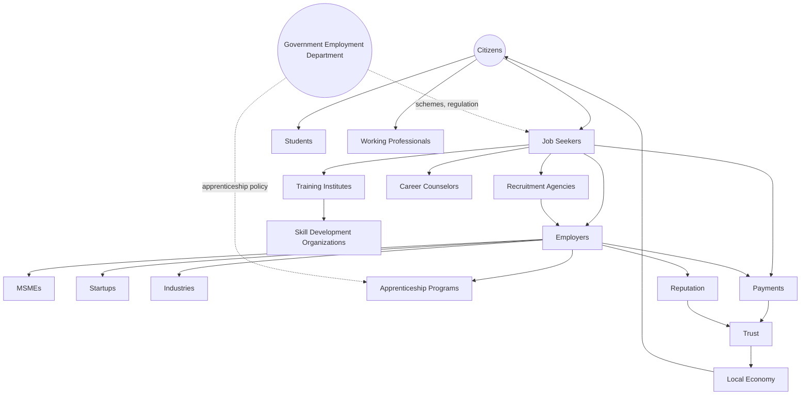

A citizen becomes a job seeker the moment they need work, and may already be a student nearing graduation or a working professional seeking a transition. Their path may touch a Recruitment Agency, an Employer directly, a Training Institute building relevant skill, or an Apprenticeship Program bridging the two. Every interaction produces Reputation and Trust, moves through Payments where a facilitation fee applies (always to the Employer, never the Job Seeker, per RULE-017), and sits within a government employment and apprenticeship policy framework Arwal supports without displacing.

### Scope Boundary

This document does not define ATS logic, does not specify resume-parsing or candidate-scoring algorithms, does not define interview-scheduling mechanics, and does not redraft any government employment scheme's own eligibility rule — those remain government authority, cited per `ai-docs/58-business-rules-policies.md`'s RULE-008 and RULE-017, never redefined here. This document's territory is strategic and economic: the business model, the stakeholder relationships, the value chain, and the governance that makes Arwal's employment participation trustworthy and durable.

---

# Employment Philosophy

Every principle below exists because an employment strategy designed carelessly does not fail abstractly — it fails a specific job seeker exploited by a fake recruiter, or a specific small employer who could never find reliable staff and gave up trying.

### Opportunity First
**Why it exists:** Every employment decision is judged first against whether it genuinely expands a job seeker's real opportunity, mirroring the identical Citizen-First tie-breaker already established throughout `ai-docs/51` through `ai-docs/70`. An employer's convenience or a recruiter's fee is never optimized ahead of a job seeker's actual access to honest work.

### Equal Access
**Why it exists:** A district's most capable candidate should never be limited by which neighborhood they grew up in or which network they happen to know. Equal Access means every job seeker reaches the same transparent listing discovery every other job seeker does.

### Merit with Inclusion
**Why it exists:** Genuine skill and reliability should determine who is hired — but merit is only fairly measured when the underlying access to discovery, application, and interview opportunity is itself equal, per the Economic Inclusion principle already established in `ai-docs/62-revenue-sustainability-strategy.md`.

### Trust Before Hiring
**Why it exists:** A job seeker will not risk travel, time, or a deposit on an unfamiliar employer unless the verification behind that listing is genuine. Trust is the precondition every application depends on, never a byproduct assumed from good UX.

### Transparency
**Why it exists:** A job seeker must be able to see the genuine salary range, the real employer identity, and the actual nature of the work before applying — concealment in employment breeds exactly the exploitation Arwal exists to end.

### Accessibility
**Why it exists:** A meaningful share of Arwal's job-seeking population is a first-generation smartphone user with limited literacy, per PER-015 Rakesh and PER-023 Iqbal in `ai-docs/52-user-personas-user-segmentation.md`. Voice-first, SMS-fallback design is the floor, never an enhancement.

### Fair Employment
**Why it exists:** A listing may never discriminate, may never charge a job seeker an upfront fee, and may never conceal exploitative terms, per RULE-017's Employment Listing Anti-Exploitation Standard — this is a non-negotiable floor, not a best-practice aspiration.

### Lifelong Employability
**Why it exists:** A career is not a single hire — it is a multi-decade arc of growth, transition, and reinvention. Arwal's employment strategy is designed for a job seeker's entire working life, never a single placement alone.

### Skill Recognition
**Why it exists:** A candidate's real, demonstrated skill — including skill gained informally, without a formal credential — is a legitimate basis for opportunity, per the Economic Inclusion principle, never displaced by credential-only gatekeeping.

### Career Growth
**Why it exists:** Arwal's success is measured by whether a job seeker's position, income, and capability improve over years on the platform, never merely by whether a single vacancy was filled.

### Ethical Recruitment
**Why it exists:** A Recruitment Agency or Employer operating through Arwal is held to the same anti-exploitation, transparent-fee, and non-discriminatory standard as every other participant — recruitment intermediation is never an exemption from these obligations.

### Long-Term Workforce Development
**Why it exists:** Arwal's employment strategy is evaluated on a multi-year, generational horizon — a single strong hiring quarter is not success if the underlying trust, fairness, or skill-development investment behind it were compromised to produce it, mirroring the Long-Term Sustainability principle already established in `ai-docs/62-revenue-sustainability-strategy.md`.

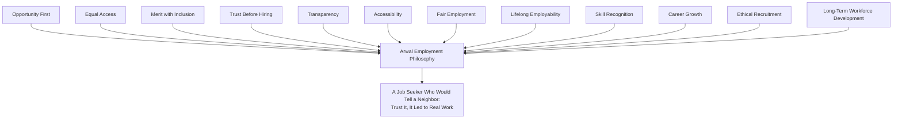

> **Callout — The One-Sentence Employment Philosophy**
> *"A job seeker risks their time, their travel money, and sometimes their safety on every application — Arwal's only justification for standing in that search is that it makes the risk honestly worth taking."*

---

# Employment Value Chain

| Stage | Business Description |
|---|---|
| **Career Awareness** | A job seeker's or student's foundational understanding of realistic local career paths and in-demand skills — the earliest point Arwal's discovery and guidance capability adds value. |
| **Skill Assessment** | A candidate's honest reflection on their own current capability against what local employers actually need, informed by Career Guidance content, never a formal certifying examination. |
| **Resume Readiness** | Preparing a simple, honest account of a candidate's experience and skill — advisory support only, never a resume-generation or parsing system. |
| **Job Discovery** | The moment a job seeker finds a genuine, verified, locally relevant listing, per Job Matching (CAP-019). |
| **Employer Discovery** | The reciprocal moment an employer finds a genuinely local, skill-matched candidate pool, per Employer Recruitment (CAP-020). |
| **Application** | A job seeker's formal expression of interest, submitted with minimal upfront data exposure, per RULE-017. |
| **Screening** | The employer's own review of applicants — Arwal never screens, ranks, or filters a candidate on the employer's behalf beyond basic listing-match relevance. |
| **Interview** | The employer's own selection process, conducted entirely outside Arwal's authority — Arwal facilitates discovery and communication, never the interview itself. |
| **Selection** | The employer's own hiring decision — Arwal never influences or overrides this judgment. |
| **Hiring** | The moment of confirmed offer and acceptance, ideally tracked for platform-level outcome measurement with both parties' consent. |
| **Onboarding** | The employer's own process of integrating a new hire — outside Arwal's operational scope, but a moment Arwal's post-placement follow-up may check in on. |
| **Career Growth** | Continued advancement within or beyond the initial placement, sustained through ongoing Career Guidance and Job Discovery engagement. |
| **Upskilling** | A working professional's acquisition of new capability to advance in their current field, connected to Education (`ai-docs/70`) discovery. |
| **Reskilling** | A worker's acquisition of capability in a new field entirely, often following an economic disruption or a personal career pivot. |
| **Career Transition** | A deliberate move between roles, industries, or employment types (e.g., from informal wage labor to formal employment, or from employment to self-employment). |
| **Entrepreneurship** | A job seeker's eventual transition into becoming an employer or a Merchant (`ai-docs/67`) or Service Provider (`ai-docs/66`) themselves — a legitimate, celebrated outcome of this value chain, never a failure to be hired. |

> **Callout — Arwal Facilitates the Chain, Never Replaces the Employer's Judgment**
> At every stage above, Arwal's role is discovery, verification, and transparency — never screening, never interviewing, never deciding who is hired. A job seeker who is hired through Arwal has been hired *by a verified employer's own judgment*, with Arwal as the trusted channel, exactly as `ai-docs/69-healthcare-business-model.md` establishes for clinical authority and `ai-docs/70-education-business-model.md` establishes for pedagogical authority.

---

# Stakeholder Ecosystem

Every stakeholder below traces to its full Persona (`ai-docs/52`) and Stakeholder (`ai-docs/51`) record; this section states only the stakeholder's employment business role.

| Stakeholder | Strategic Role |
|---|---|
| **Job Seekers** | The primary demand-side population searching for formal, informal, or gig employment, per PER-015 Rakesh. |
| **Students** | Learners nearing or entering the workforce, bridging Education (`ai-docs/70`) discovery into first-employment discovery. |
| **Working Professionals** | Employed citizens seeking a transition, an upskilling path, or a better-matched opportunity. |
| **Employers** | Verified individuals or businesses posting genuine roles, per PER-016 Neha. |
| **MSMEs** | Micro, Small, and Medium Enterprises representing the largest share of the district's actual hiring activity, per `ai-docs/67-merchant-ecosystem.md`'s cross-cutting MSME priority. |
| **Startups** | Newer, often higher-growth local businesses whose hiring needs evolve quickly and whose employer verification is held to the same rigor as any established business. |
| **Industries** | Sector-level context (manufacturing, retail, agriculture-adjacent processing) shaping the district's overall demand pattern. |
| **Recruitment Agencies** | Intermediaries sourcing candidates on an employer's behalf, held to the identical Ethical Recruitment standard as a direct employer. |
| **Training Institutes** | Skill-building institutions, per `ai-docs/70-education-business-model.md`'s Vocational Training Centers, feeding candidate readiness. |
| **Skill Development Organizations** | Government and private bodies administering structured skill-certification programs relevant to employability. |
| **Career Counselors** | Advisory professionals guiding a job seeker's path, distinct from a Recruitment Agency's employer-side mandate. |
| **Government Employment Department** | The regulatory and public-employment authority Arwal's employment capability supports, per `ai-docs/63-government-partnership-strategy.md`. |
| **Apprenticeship Providers** | Employers or institutions offering structured, often government-linked, earn-while-you-learn placements. |
| **Freelancers** | Independent, skill-flexible professionals offering project-based work, per `ai-docs/66-service-provider-ecosystem.md`'s Freelancers category. |
| **Gig Workers** | Workers engaging short-term, flexible work arrangements, overlapping with Delivery Partners (`ai-docs/54`) and other on-demand roles. |
| **Future Employment Participants** | Second-district labour markets, future formal-sector partnerships, and emerging gig-economy categories, tracked per the Job Seeker Lifecycle's Career Awareness stage below. |

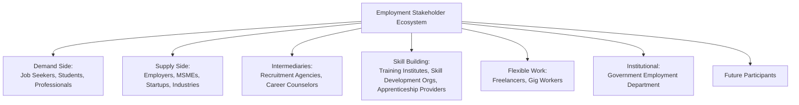

---

# Job Seeker Lifecycle

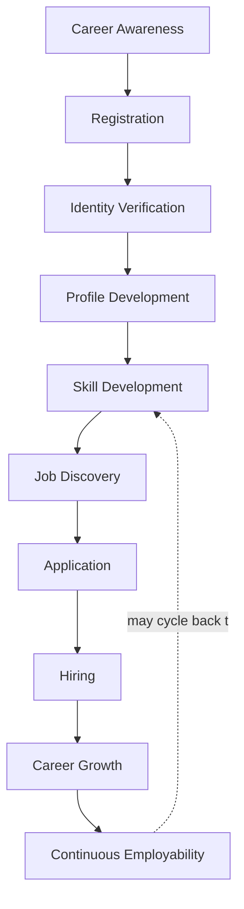

| Stage | Meaning | Owning Discipline |
|---|---|---|
| **Career Awareness** | A job seeker learns Arwal offers verified, local employment discovery, typically via community outreach or a peer referral. | Community outreach, this document |
| **Registration** | The job seeker creates an Arwal identity, per JRN-001. | Identity Verification (CAP-001) |
| **Identity Verification** | Baseline identity verification completes, per RULE-002 — no elevated documentary burden beyond what any citizen faces. | Identity Verification Processing (PROC-002) |
| **Profile Development** | The job seeker builds a simple, honest account of their experience and skill, disclosing only what a genuine application requires. | Resume Readiness, above |
| **Skill Development** | The job seeker engages a Training Institute, Apprenticeship Program, or Skill Development Organization, connected to Education (`ai-docs/70`) discovery. | Business Model, below |
| **Job Discovery** | The job seeker finds genuinely local, fraud-screened listings, per Job Matching (CAP-019). | Business Model, below |
| **Application** | The job seeker applies with minimal upfront data exposure, per RULE-017. | Trust & Quality Strategy, below |
| **Hiring** | The employer's own decision results in an offer and acceptance. | Employer's own authority, outside Arwal's scope |
| **Career Growth** | The job seeker advances within or beyond the initial placement over subsequent years. | Value Creation, below |
| **Continuous Employability** | The job seeker returns to Arwal for upskilling, reskilling, or a new opportunity as their career evolves, sustained across a working lifetime. | Governance, below |

### Lifecycle Design Commitment

At every stage above, the job seeker's experience is designed with the same rigor `ai-docs/56-user-journey-standards.md` requires of any citizen journey — a named Failure Scenario and Recovery Path for every stage a job seeker could stall at, never a dead end where a candidate simply gives up and reverts to an unverified, exploitative informal channel.

---

# Value Creation

| Question | Answer |
|---|---|
| **How do employers create value?** | By offering genuine, fairly compensated work that matches a real local need — the platform amplifies discoverability and trust in that offer, it never manufactures demand that does not exist. |
| **How do job seekers create value?** | By bringing genuine skill and reliability to a role, and by providing honest feedback on an employer's own conduct that helps the next candidate make an informed choice. |
| **How do educational institutions create value?** | By producing genuinely skilled candidates whose readiness Arwal can honestly connect to real local opportunity, per the Education Business Model's Career Preparation stage (`ai-docs/70`). |
| **How does Arwal create value?** | By converting an informal, referral-only, exploitation-prone local labour market into transparent, verified, fraud-screened discovery — reach, verification, and dispute protection neither party could assemble alone. |
| **How does trust develop?** | Through Identity Verification (CAP-001) and Employer/Listing Verification (CAP-016, CAP-020), compounding through Reputation & Rating Management (CAP-045) as verified, completed hires accumulate. |
| **How do employment outcomes improve?** | Through Fair Visibility in Job Discovery, transparent salary and role disclosure, and skill-matched Career Guidance that reduces mismatched, short-lived placements. |
| **How does district productivity grow?** | Through reduced hiring friction for MSMEs, reduced exploitative migration for job seekers, and a compounding pool of verified, employable local talent that strengthens every employer's confidence in hiring locally. |

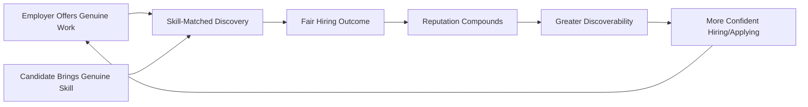

---

# Business Model

Every capability below is described strategically — its business rationale — never as an implementation. The enforceable capability logic is owned entirely by `ai-docs/55-business-capability-map.md`'s CAP-019 and CAP-020.

| Capability | Business Rationale |
|---|---|
| **Job Discovery** | Converts informal, word-of-mouth job-hunting into verified, ranked, comparable search, per CAP-019 — listing verification status always visible, never spoofable. |
| **Employer Discovery** | Gives an employer confidence that the candidate pool they reach is genuinely local and relevant, per CAP-020. |
| **Internship Discovery** | Surfaces structured, often institution-linked early-career opportunities bridging Education and Employment. |
| **Apprenticeship Discovery** | Surfaces earn-while-you-learn placements, often government-linked, offering a formalized skill-building path distinct from informal on-the-job learning. |
| **Freelancer Opportunities** | Surfaces project-based, skill-flexible work for independent professionals, per `ai-docs/66-service-provider-ecosystem.md`'s Freelancers category. |
| **Gig Work Opportunities** | Surfaces short-term, flexible arrangements, coordinated where relevant with Delivery Coordination (`ai-docs/55`'s CAP-026). |
| **Career Guidance** | Plainspoken, advisory content connecting a job seeker's skill to real local opportunity — never displacing the job seeker's own agency or a Career Counselor's own professional judgment. |
| **Skill Matching** | Surfaces listings genuinely relevant to a job seeker's declared skill and experience, never a blanket, unfiltered flood of irrelevant postings. |
| **Resume Awareness** | Advisory guidance on presenting experience honestly and clearly — never a resume-generation or automated-parsing system. |
| **Interview Readiness** | Plainspoken awareness content on what to expect in a typical local interview process, never a simulated or scored mock-interview system. |
| **Government Employment Scheme Awareness** | Surfaces a job seeker's eligibility for a government employment or skill-development scheme, sourced jointly with the Employment Department per RULE-008, never approximated unilaterally. |
| **Career Events** | Distribution of job fairs, recruitment drives, and apprenticeship-enrollment windows through Notifications (CAP-031). |

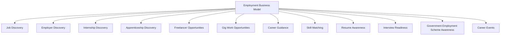

---

# Trust & Quality Strategy

| Mechanism | Strategic Role |
|---|---|
| **Employer Verification** | Every employer's real-world identity is confirmed before any listing is discoverable, per CAP-001 and RULE-017. |
| **Organization Verification** | Where an employer claims a registered business identity, that claim is confirmed with the same Business Identity discipline already established in `ai-docs/67-merchant-ecosystem.md`'s Merchant Verification. |
| **Job Authenticity** | A listing is disqualified outright if it requires upfront payment, conceals the true nature of work, or pays below applicable minimum-wage standards, per RULE-017's Employment Listing Anti-Exploitation Standard — no exception, ever. |
| **Fraud Prevention** | Continuous, AI-assisted, always human-confirmed anomaly detection on both listings and applicant patterns, per CAP-038 and RULE-024. |
| **Salary Transparency** | A listing's genuine compensation range is disclosed upfront — never withheld until after an interview, and never materially misrepresented. |
| **Candidate Privacy** | Minimal personal-data exposure at the initial application stage, per RULE-017 — full detail is shared only as a genuine hiring process progresses. |
| **Consent Management** | Explicit, granular, revocable consent governs every employment-adjacent data flow, per RULE-003. |
| **Complaint Resolution** | A structured, evidence-based path to a fair outcome for both job seeker and employer, per CAP-036 and RULE-013, applied without presumption toward either side. |
| **Government Coordination** | Employment scheme and apprenticeship-policy data is sourced jointly with the Employment Department, per `ai-docs/63-government-partnership-strategy.md`, never approximated unilaterally. |
| **Employment Trust** | Every mechanism above compounds into a single, felt outcome: a job seeker who believes a verified listing on Arwal means something real, unlike an unverified informal lead. |

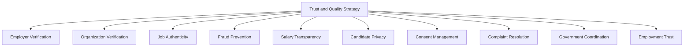

> **Callout — A Job Seeker Is Never Charged to Search, Apply, or Be Discovered**
> Per RULE-017, any facilitation fee in the employment vertical is charged to the Employer, never the Job Seeker — a listing requiring upfront payment from an applicant is disqualified outright, with no discretionary exception, regardless of how the payment is framed (a "registration fee," a "training deposit," or any equivalent).

---

# Economic Impact

| Impact Area | How Arwal Contributes |
|---|---|
| **Increase Employment** | Expanded, verified discovery connects a job seeker to opportunities beyond their existing referral network. |
| **Reduce Skill Gaps** | Career Guidance and Skill Matching surface the specific gap between a job seeker's current capability and local employer demand, directing them toward relevant Training Institutes. |
| **Improve Employer Access** | MSMEs and Startups reach genuinely local, skill-matched candidates without the cost and irrelevance of a national platform designed for formal-sector, urban hiring. |
| **Strengthen MSMEs** | Radically simple employer onboarding lowers the barrier for a small business to formalize hiring practices it may currently manage entirely by word of mouth. |
| **Support Entrepreneurship** | A job seeker's eventual transition into self-employment, via Merchant (`ai-docs/67`) or Service Provider (`ai-docs/66`) onboarding, is treated as a celebrated outcome of the employment value chain, not a departure from it. |
| **Improve Workforce Productivity** | Better-matched hiring reduces early-tenure attrition and mismatch, benefiting both the worker's stability and the employer's own productivity. |
| **Reduce Migration** | A job seeker who finds genuine, fairly paid local work has less structural pressure to migrate to a distant city under uncertain, exploitation-prone informal arrangements. |
| **Strengthen District Economy** | Income earned and spent locally, plus a growing pool of formally connected employers and job seekers, reinforces the District Development Strategy already established in `ai-docs/64-district-ecosystem-mapping.md`. |

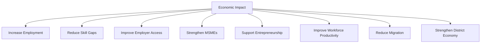

---

# Governance

### Ownership
Employment Business Model ownership sits with the Chief Employment Officer (or Head of Jobs Vertical where the role is not yet separately staffed), with Recruitment Agency, Apprenticeship Provider, and Freelancer/Gig categories each accountable to a named sub-owner, mirroring the Clear Ownership discipline already established throughout `ai-docs/53` through `ai-docs/70`.

### Employment Council
A standing **Employment Council** — chaired by the Chief Employment Officer, with the Head of Trust & Safety, Head of Government Partnerships, CPO, Compliance Officer, and rotating job-seeker and employer representatives as members — holds approval authority over any platform-wide verification-standard change, any new employment-facilitation fee mechanism, and any material deviation from the Anti-Patterns below. The Council meets monthly, with ad hoc sessions for an Employment Ecosystem Health Score regression. Job-seeker representation ensures the ecosystem's most vulnerable participants are consulted on decisions affecting their own livelihood, never merely informed after the fact.

### Decision Authority

| Decision | Approves |
|---|---|
| New employment category or region activation | Employment Council + CEO |
| Employer/listing verification standard change | Employment Council + Head of Trust & Safety |
| New employer-facing fee structure | Employment Council + Revenue Review Board (`ai-docs/62`) |
| Government employment/apprenticeship data-sourcing change | Employment Council + Head of Government Partnerships |
| Emergency integrity response (e.g., a recruitment-fraud wave) | Head of Trust & Safety, immediate, ratified by Council within 5 business days |

### Review Cadence

| Review | Cadence | Owner |
|---|---|---|
| Employment Ecosystem Health Review | Monthly | Employment Council |
| Category Performance Review (Formal, MSME, Gig, Apprenticeship) | Quarterly | Category Heads |
| Annual Employment Strategy Review | Annual | CEO, Chief Employment Officer, CPO |

### Conflict Resolution
A job-seeker-employer dispute follows PROC-013 and RULE-013 in full; a party's disagreement with a platform decision (a listing rejection, a verification denial) follows the identical Appeal right already established in RULE-028, reviewed by an independent reviewer distinct from the original decision-maker.

### Continuous Improvement
Every review above feeds a shared, tracked improvement backlog — a recurring fraud pattern, a verification bottleneck, or a job-seeker-suggested refinement — reviewed and prioritized at the next Employment Ecosystem Health Review, never left to informally resolve itself.

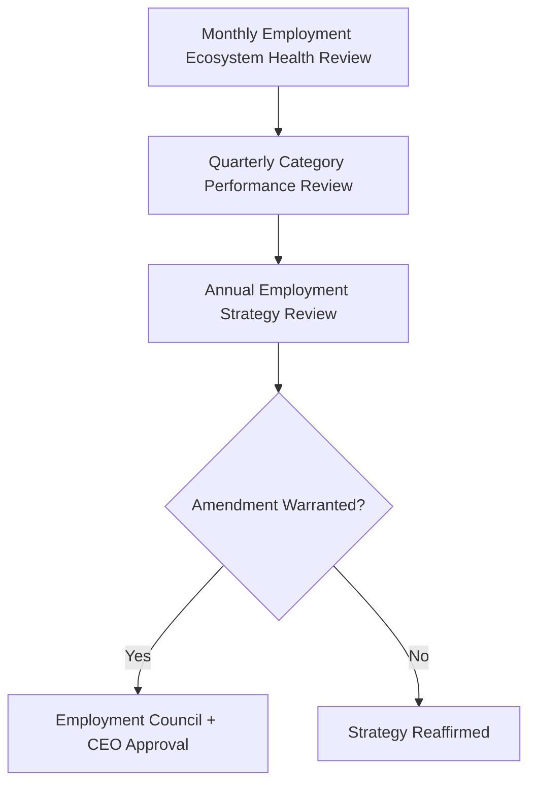

---

# Risks

| Risk | Description | Mitigation |
|---|---|---|
| **Fake Jobs** | A listing misrepresents a real opportunity or does not exist at all. | RULE-017's Employment Listing Anti-Exploitation Standard; automated screening with a fail-closed default for ambiguous cases. |
| **Recruitment Fraud** | A recruiter or agency extracts payment or data under false pretenses. | Ethical Recruitment principle above; Fraud Detection (CAP-038); four-eyes enforcement per RULE-027. |
| **Identity Fraud** | A job seeker or employer misrepresents their own identity. | Identity Verification (CAP-001), Employer Verification (CAP-016, RULE-017). |
| **Salary Misrepresentation** | A listing understates cost deductions or overstates real compensation. | Salary Transparency mechanism above; complaint-driven review feeding Trust & Safety. |
| **Discrimination** | A listing or employer practice excludes candidates on an unlawful or unfair basis. | RULE-017's non-discriminatory filtering prohibition; `ai-docs/52`'s Anti-Discrimination Safeguards applied to any AI-assisted matching. |
| **Digital Exclusion** | A low-literacy or first-generation smartphone job seeker cannot access discovery unassisted. | Voice-first and SMS-fallback design, per Accessibility above. |
| **Privacy Risks** | A job seeker's personal data is exposed beyond its consented purpose. | RULE-003's Consent Requirement; minimal data exposure at initial application, per RULE-017. |
| **Regulatory Changes** | A labour-law or apprenticeship-policy shift invalidates an existing workflow assumption. | Configurable, department-owned workflows per RULE-006 and RULE-008 — a policy change updates a configuration, not a rebuild. |
| **Trust Erosion** | A single mishandled fraud incident damages trust across the entire employment vertical. | Transparent, evidence-based dispute resolution per RULE-013 and RULE-028; rapid, honest incident communication. |
| **Skill Mismatch** | A hire proceeds despite a poor fit between declared skill and actual role need. | Skill Matching discipline above; Career Guidance content directing candidates toward genuinely relevant listings. |

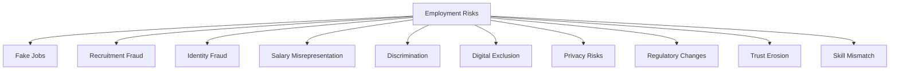

---

# Metrics

| Metric | Definition | Direction |
|---|---|---|
| **Registered Job Seekers** | Count of citizens who have engaged the employment vertical. | Increasing |
| **Verified Employers** | Count of employers passing full identity and organization verification. | Increasing |
| **Verified Jobs** | Count of listings passing the Job Authenticity screen. | Increasing |
| **Placement Success Rate** | % of applications resulting in a confirmed hire, where tracked with consent. | Increasing |
| **Employer Satisfaction** | Employer-reported CSAT for the hiring experience, per `ai-docs/60-customer-experience-strategy.md`'s Experience Metrics. | Increasing |
| **Candidate Satisfaction** | Job-seeker-reported CSAT for the discovery and application experience. | Increasing |
| **Skill Match Accuracy** | Rate at which surfaced listings genuinely match a job seeker's declared skill and experience. | Increasing |
| **Employment Access Index** | A composite measure of discovery reach and application parity across urban, rural, and income segments. | Increasing, approaching parity |
| **Trust Score** | District Trust Signal, viewed for employment interactions specifically. | Increasing |
| **Employment Ecosystem Health** | A composite index combining Verified Employer growth, Placement Success, Trust Score, and Dispute Rate. | Increasing |

> **Callout — No Employment Metric Stands Alone**
> Per the North Star Principle already established in `ai-docs/00-project-vision.md`, a rising Placement Success Rate alongside a falling Trust Score or rising Dispute Rate is treated as a regression — never counted as success in isolation.

---

# Anti-Patterns

| Anti-Pattern | Why It's Rejected |
|---|---|
| **Fake jobs** | Directly violates RULE-017's Job Authenticity standard and endangers a job seeker's time, money, and safety. |
| **Pay-to-apply** | A listing charging an applicant any upfront fee is disqualified outright, per RULE-017 — no exception, regardless of framing. |
| **Growth without trust** | A rising Registered Job Seekers count alongside a falling Trust Score is a regression, never a win. |
| **Ignoring rural employment** | Directly contradicts Equal Access and the founding Inclusion over Optimization pillar already established in `ai-docs/00-project-vision.md`. |
| **Urban bias** | Discovery ranking or outreach implicitly skewed toward district-headquarters job seekers recreates the exact Urban Bias anti-pattern already rejected in `ai-docs/51-stakeholder-analysis.md`. |
| **Discrimination** | Any listing or matching practice that filters candidates on an unlawful or unfair basis violates Merit with Inclusion and RULE-017 directly. |
| **Technology without inclusion** | A capability only a digitally fluent, literate job seeker can use has failed the Accessibility principle regardless of technical sophistication. |
| **Short-term hiring optimization** | Trading long-term job-seeker and employer trust for a single quarter's placement volume violates Long-Term Workforce Development. |
| **Ignoring skill development** | Treating Job Discovery as disconnected from Career Guidance and Skill Matching neglects the Lifelong Employability principle above. |

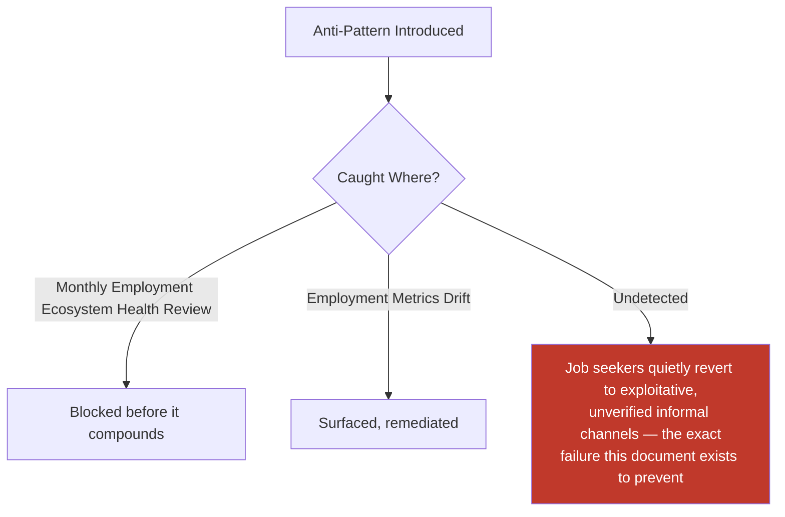

---

# Relationship to Previous Documents

| Prior Document | Relationship |
|---|---|
| **Project Vision (`ai-docs/00`)** | Establishes the founding fragmentation problem this document solves for employment specifically — no verified, fraud-screened, locally relevant job discovery. |
| **Stakeholder Analysis (`ai-docs/51`)** | Supplies the Job Seekers, Employers, and Migrant Workers stakeholder registry every category in this document traces to. |
| **Business Domain Model (`ai-docs/53`)** | Supplies the ownership structure behind the Jobs domain (DOM-007) this document's business model is realized within. |
| **Business Capability Map (`ai-docs/55`)** | Supplies the stable abilities — Job Matching (CAP-019), Employer Recruitment (CAP-020) — this document's strategy is built directly on top of. |
| **Customer Experience Strategy (`ai-docs/60`)** | Supplies the felt-experience bar every employment interaction must clear on both the job-seeker and employer side. |
| **Value Proposition Framework (`ai-docs/61`)** | Supplies the Job Seeker and Employer stakeholder value exchange this document extends into a full ecosystem business model. |
| **Revenue & Sustainability Strategy (`ai-docs/62`)** | Supplies the Fair Monetization safeguard — never charging a job seeker to search, apply, or be discovered — this document's economic mechanisms are bound by. |
| **Government Partnership Strategy (`ai-docs/63`)** | Supplies the Employment Department coordination context this document's Scheme Awareness and apprenticeship mechanisms depend on. |
| **District Ecosystem Mapping (`ai-docs/64`)** | Supplies the whole-system Ecosystem Health view this document's employment-specific health metrics feed into. |
| **Marketplace Strategy (`ai-docs/65`)** | Supplies the general two-sided-market economics this document specializes for a matching market where fit, not price, is the primary currency. |
| **Service Provider Ecosystem (`ai-docs/66`)** | Supplies the sibling strategic model for skill-based work; Freelancers are a direct point of overlap between the two ecosystems. |
| **Merchant Ecosystem (`ai-docs/67`)** | Supplies the sibling strategic model for goods-based commerce; a job seeker's eventual transition into a Merchant is a celebrated cross-document outcome. |
| **Agriculture Business Model (`ai-docs/68`)** | Supplies the sibling strategic model for a distinct, inclusion-first population-serving vertical; a farming household's off-farm employment income is a direct point of connection. |
| **Healthcare Business Model (`ai-docs/69`)** | Supplies the sibling strategic model for the platform's highest-stakes verticals; shares the same elevated Trust & Safety governance pattern. |
| **Education Business Model (`ai-docs/70`)** | Supplies the direct upstream relationship — a learner's Career Preparation stage feeds directly into this document's Job Discovery and Skill Matching. |
| **Business Glossary (`ai-docs/59`)** | Supplies the precise vocabulary (Employer, Job Seeker, Listing, Reputation, Dispute, Appeal) this document's every claim is expressed in. |

```mermaid
graph TD
    A[This Document<br/>Phase 72] -->|"solves the discovery-fragmentation problem of"| B[Project Vision<br/>Phase 1]
    A -->|"traces stakeholders from"| C[Stakeholder Analysis<br/>Phase 52]
    A -->|"is realized through the domain and capabilities of"| D[Business Domains and Capabilities<br/>Phases 54-56]
    A -->|"must clear the experience bar of"| E[Customer Experience Strategy<br/>Phase 61]
    A -->|"extends the value exchange of"| F[Value Proposition Framework<br/>Phase 62]
    A -->|"is bound by fairness in"| G[Revenue and Sustainability Strategy<br/>Phase 63]
    A -->|"depends on coordination in"| H[Government Partnership Strategy<br/>Phase 64]
    A -->|"feeds ecosystem health in"| I[District Ecosystem Mapping<br/>Phase 65]
    A -->|"specializes the marketplace economics of"| J[Marketplace Strategy<br/>Phase 66]
    A -->|"receives candidates prepared by"| K[Education Business Model<br/>Phase 71]
    A -->|"shares trust discipline with"| L[Service Provider, Merchant, Agriculture, Healthcare Models<br/>Phases 67-70]
```

---

# Executive Artifacts

### Employment Business Framework

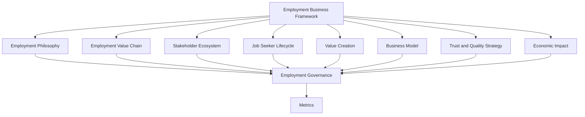

### Employment Value Chain

See Employment Value Chain section above — reproduced here by reference per Single Source of Truth, never duplicated.

### Job Seeker Lifecycle

See Job Seeker Lifecycle section above.

### Employment Ecosystem Map

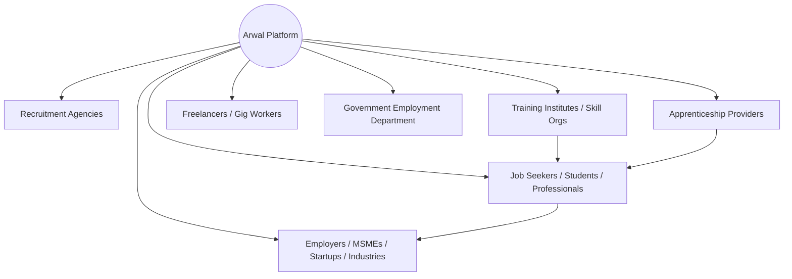

### Workforce Development Model

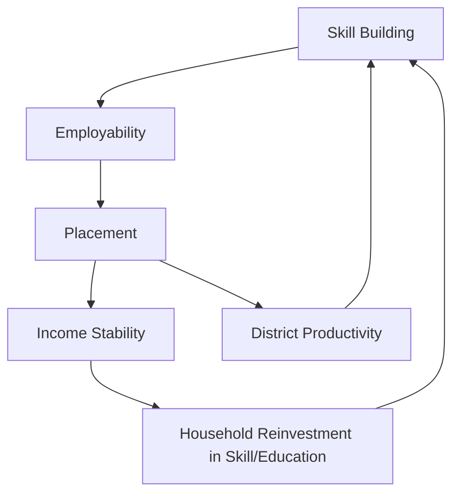

### Employment Growth Flywheel

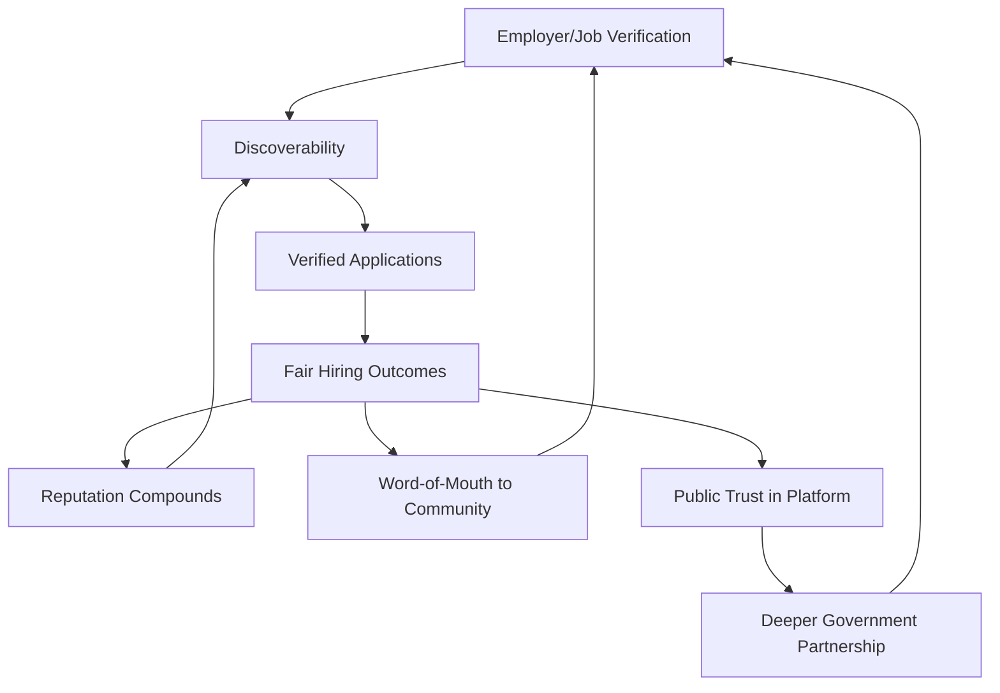

### Executive Dashboards

| Dashboard | Audience | Key Content |
|---|---|---|
| **CEO Dashboard** | CEO | Employment Ecosystem Health Score, Placement Success Rate, Trust Score |
| **Chief Employment Officer Dashboard** | Chief Employment Officer | Verified Employers/Jobs, category-level performance, Skill Match Accuracy |
| **Trust & Safety Dashboard** | Head of Trust & Safety | Dispute Rate, verification turnaround, fraud-incident trend |
| **Government Partners Dashboard** | Employment Department liaisons | Scheme Utilization, apprenticeship program coordination status |

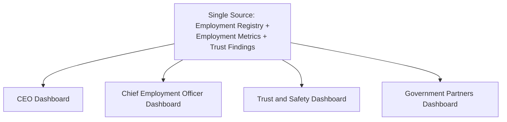

### Decision Matrix

| Decision Type | Approval Authority |
|---|---|
| New employment category/region activation | Employment Council + CEO |
| Verification standard change | Employment Council + Head of Trust & Safety |
| New employer-facing fee structure | Employment Council + Revenue Review Board |
| Government scheme/apprenticeship data-sourcing change | Employment Council + Head of Government Partnerships |
| Emergency integrity response | Head of Trust & Safety, ratified within 5 business days |

---

# Closing Statement

> **Callout — Closing Statement**
> Every prior document in this handbook explains what Arwal builds, how it sustains itself, and the markets and ecosystems it operates inside. This document explains the specific promise Arwal makes to a job seeker checking a listing before they spend money they can't spare on a bus fare, and to a small workshop owner who has never posted a vacancy anywhere before: that the listing is real, the pay is what it says, and the platform is on their side whether they are searching for work or searching for someone to hire. A district's employment ecosystem is not a marketplace category among many — it is the mechanism by which every other investment this handbook describes, in education, in skill, in agriculture, in healthcare, eventually becomes a stable livelihood. An employment strategy grown too fast, verified too loosely, or governed too unevenly does not merely underperform — it exposes a job seeker to exploitation at the exact moment they can least afford it, and it teaches an entire community that the platform's verification badge meant nothing when it mattered most. Arwal grows this ecosystem at the pace trust and government partnership can genuinely sustain, never faster, because a generation-long civic-commercial platform cannot be built on an employment promise it cannot keep. Where a future phase must deviate from a principle stated here, that deviation is made explicitly — through the Employment Governance process above — never silently, and never by default.

This document, `ai-docs/71-employment-jobs-business-model.md`, is Phase 72 of approximately 415. Every future job-seeker-facing decision, employer-verification standard, and workforce-development program is expected to trace back to a principle defined here, or to justify its deviation in writing.

**End of Phase 72 — `ai-docs/71-employment-jobs-business-model.md`**