# Property & Housing Business Model

**Document:** `ai-docs/72-property-housing-business-model.md`
**Project:** Arwal — The District Super App
**Stage:** 2 — Product & Business Strategy
**Phase:** 73 — Property & Housing Business Model
**Status:** Approved for Product & Engineering Reference
**Audience:** CEO, CSO, CPO, Chief Real Estate Officer, Chief Housing Officer, Enterprise Business Architects, Urban Development Strategists, Housing Policy Consultants, Real Estate Economists, Property Marketplace Strategists, Government Housing Partnership Specialists, Trust & Safety Strategists, Privacy & Compliance Advisors, Investors

> **Callout — Purpose of This Document**
> `ai-docs/00-project-vision.md` through `ai-docs/71-employment-jobs-business-model.md` established why Arwal exists, what it can do, who it serves, how it sustains itself, how it partners with government, the whole district ecosystem it operates inside, the general economics of a marketplace, and how service providers, merchants, farmers, patients, learners, and job seekers build trust and value on the platform. None of those documents answers the question a family asks before they commit their life savings to a deposit, or before they hand over the keys to their only asset: **why should I trust this platform with the place my family will live, or the property that represents everything I have saved?** This document is that answer — the authoritative Property & Housing Business Model every future listing-verification standard, tenancy-trust mechanism, and housing-development program traces back to.

---

# Purpose of this Document

### Why Property Requires Its Own Business Model

`ai-docs/65-marketplace-strategy.md` established the general economics of a two-sided market. `ai-docs/66` through `ai-docs/71` each specialized that economics for a category whose stakes exceed a simple transaction. Property belongs at the very top of that stakes hierarchy. A citizen's home is not a good exchanged once — it is where a family sleeps, where a child grows up, and, for most households, the single largest financial commitment they will ever make. A fake listing does not merely waste an afternoon; it can cost a family a non-refundable deposit they cannot recover, or expose them to a fraudulent sale of land they do not actually own. This document exists because property demands a business model built around trust, transparency, and long-term community welfare first — transaction volume second, never the reverse.

### Why This Is a Business Strategy Document, Not a Property Platform Specification

This document contains no listing-management system design, no property-registration workflow, no land-record integration architecture, and no brokerage-matching algorithm. It does not redefine Domains (`ai-docs/53`), Capabilities (`ai-docs/55`), Modules (`ai-docs/54`), Journeys (`ai-docs/56`), Processes (`ai-docs/57`), or Rules (`ai-docs/58`) — Property Listing Management (CAP-029), Provider Verification (CAP-016), and their governing rules remain fully authoritative and are cited, never restated. This document's exclusive territory is: **the strategic reasoning behind who a property buyer, seller, owner, and tenant are to Arwal, why housing is a durable strategic pillar, how the property value chain and its stakeholders relate to one another, and how the ecosystem around housing is governed, protected, and grown.**

### The Chain of Reasoning This Document Extends

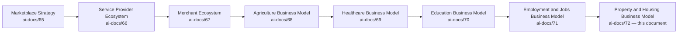

| Layer | Question It Answers |
|---|---|
| Marketplace Strategy | How does a two-sided market work, generally? |
| Service Provider / Merchant / Agriculture / Healthcare / Education / Employment | How does Arwal earn each sector's trust with their livelihood, health, future, or work? |
| **Property & Housing Business Model** (this document) | **How does Arwal earn a family's trust with the place they live and the asset they may spend a lifetime paying for — and how does the district's development benefit?** |

### Why Housing Is a Strategic Pillar, Not a Listing Category

Per `ai-docs/00-project-vision.md`'s founding Problem Statement, a district's property market today runs almost entirely on informal broker networks, unverifiable ownership claims, and word-of-mouth trust — a system that structurally favors whoever has the widest existing network, not whoever has the most genuine listing. `ai-docs/53-business-domain-model.md` names Property as a Core Domain. A district super app that thrives commercially while its citizens remain exposed to housing fraud, unaffordable and opaque rental markets, and unplanned urban growth has not fulfilled its founding mission.

### How Housing Improves Citizen Well-Being

A family that can verify a landlord's genuine ownership before paying a deposit, that can compare rents transparently rather than accepting whatever a broker quotes, and that can report a bad-faith actor with a real consequence is a family that finds housing with dignity rather than desperation. Multiplied across a district, this is measurable reduction in housing fraud, measurable improvement in housing accessibility, and a measurable strengthening of the trust that holds every other vertical's ecosystem together.

### How Trusted Property Markets Strengthen District Development

Per `ai-docs/64-district-ecosystem-mapping.md`'s District Development Strategy, a district where property transactions are transparent and where ownership is verifiable attracts responsible construction investment, supports urban local bodies' planning, and reduces the disputes that otherwise consume court and administrative capacity for years. Housing sits at the intersection of nearly every other domain — a merchant needs commercial space (`ai-docs/67`), a service provider needs a workshop (`ai-docs/66`), a migrant worker needs a rental (`ai-docs/71`) — making it a quiet dependency underneath the whole ecosystem's health.

### Relationship Between Every Participant

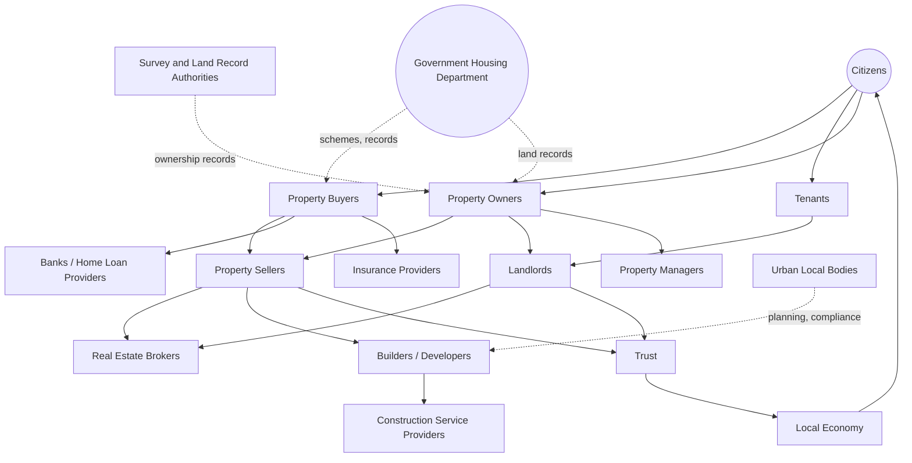

### Scope Boundary

This document does not define land-registration workflows, does not specify title-verification technical logic, and does not redraft any government housing scheme's own eligibility rule — those remain government and legal authority, cited per `ai-docs/58-business-rules-policies.md`, never redefined here. This document's territory is strategic and economic: the business model, the stakeholder relationships, the value chain, and the governance that makes Arwal's property participation trustworthy and durable.

---

# Property & Housing Philosophy

### Citizen First
**Why it exists:** Every property decision is judged first against whether it serves the citizen — as buyer, seller, tenant, or owner — never against transaction volume, mirroring the identical Citizen-First tie-breaker already established throughout `ai-docs/51` through `ai-docs/71`.

### Housing Accessibility
**Why it exists:** A citizen's economic status should never determine whether they can find honest housing information — affordable and premium housing are discoverable with the same transparency and rigor.

### Transparency
**Why it exists:** A buyer or tenant must be able to see genuine pricing, genuine ownership status, and genuine property condition before committing — concealment in housing produces exactly the exploitation Arwal exists to end.

### Trust Before Transactions
**Why it exists:** A family will not risk a deposit or a life-savings payment on an unfamiliar counterparty unless the verification behind that listing is genuine. Trust is the precondition every property transaction depends on.

### Affordability
**Why it exists:** A property platform that only serves the highest-value transactions has captured a fraction of the market Arwal's civic mandate commits it to serving — rental and affordable-segment discovery is never a lower priority than premium sale listings.

### Equal Opportunity
**Why it exists:** A citizen's caste, religion, gender, or economic background must never determine their access to housing discovery or their treatment as a counterparty, per Fair Housing below.

### Verified Property Information
**Why it exists:** A listing's ownership claim, condition, and price must be genuinely confirmed wherever verification is feasible — an unverifiable claim is disclosed as such, never presented with false confidence.

### Privacy
**Why it exists:** A citizen's property, financial, and identity data is used only for the stated housing purpose they consented to, per RULE-003, never repurposed or exposed beyond that.

### Fair Housing
**Why it exists:** No listing, no ranking, and no platform practice may discriminate against a lawful counterparty on the basis of a protected characteristic — this is a non-negotiable floor, not an aspiration.

### Long-Term Community Development
**Why it exists:** Arwal's property strategy is evaluated on a multi-year, generational horizon — a single strong quarter of listings is not success if it came at the cost of trust or fair access.

### Sustainable Urban Growth
**Why it exists:** Arwal's presence should support responsible, planned district development, never speculative, unplanned growth that strains local infrastructure or displaces existing communities.

### Responsible Property Ownership
**Why it exists:** Every mechanism in this document exists to help an owner, tenant, or buyer act as a genuinely responsible participant in the district's housing stock — never merely to maximize a single transaction's commission.

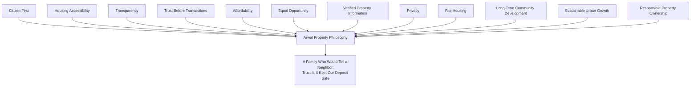

> **Callout — The One-Sentence Property Philosophy**
> *"A citizen risks their savings, their deposit, and sometimes their only home on a property transaction — Arwal's only justification for standing in that exchange is that it makes the risk honestly worth taking."*

---

# Property Value Chain

| Stage | Business Description |
|---|---|
| **Property Discovery** | A buyer or tenant finds a genuine, verified listing matching their need, location, and budget, per CAP-029. |
| **Property Verification** | Ownership evidence and listing accuracy are confirmed before publication, per PROC-024 and RULE-024-adjacent rules. |
| **Ownership Awareness** | A citizen understands, in plain language, what genuine ownership evidence looks like and why Arwal never itself confers legal title. |
| **Buying** | A confirmed sale-intent transaction connecting a verified buyer and seller through a safe, in-platform communication channel. |
| **Selling** | An owner's listing of a property for sale, verified before publication. |
| **Renting** | A tenant's discovery of and application for a rental listing, with transparent fee disclosure. |
| **Leasing** | A longer-term or commercial occupancy arrangement, following the same verification and transparency discipline as a standard rental. |
| **Financing** | A buyer's awareness of home-loan options through Bank and Home Loan Provider partnerships — Arwal facilitates awareness, never underwrites or approves credit itself. |
| **Insurance** | Awareness of property and home insurance options relevant to a buyer's or owner's protection needs. |
| **Registration Awareness** | Plain-language guidance on the government registration and stamp-duty process a citizen must separately complete — Arwal never performs registration itself. |
| **Moving** | The practical transition into a new property, connected where relevant to Delivery and Logistics capability (`ai-docs/55`). |
| **Property Maintenance** | Discovery of Construction Service Providers and local Service Providers (`ai-docs/66`) for ongoing upkeep. |
| **Community Living** | A citizen's participation in the housing community they have joined — neighborhood information, local civic-service discovery. |
| **Long-Term Property Ownership** | Sustained, responsible stewardship of a property across years, including eventual resale or generational transfer. |

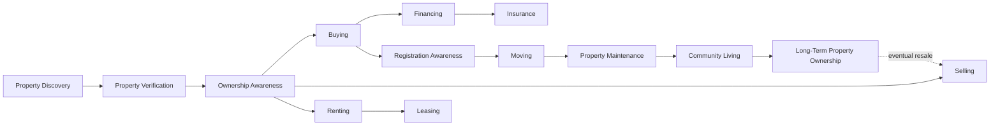

> **Callout — Arwal Facilitates Discovery and Trust, Never Legal Transfer**
> At every stage above, Arwal's role is discovery, verification signaling, and transparent facilitation — never the legal transfer of title, never registration, and never underwriting. A buyer who purchases through Arwal has transacted *with a verified counterparty Arwal helped them find*, with the legal process itself remaining entirely the citizen's own responsibility under government authority, exactly as `ai-docs/71-employment-jobs-business-model.md` establishes for the employer's own hiring judgment.

---

# Stakeholder Ecosystem

| Stakeholder | Strategic Role |
|---|---|
| **Property Buyers** | Citizens seeking to purchase residential or commercial property, per PER-013/PER-014-adjacent personas. |
| **Property Sellers** | Verified owners listing a property for sale. |
| **Property Owners** | The broader category of citizens holding property, whether currently listed or not. |
| **Tenants** | Citizens seeking rental housing, per PER-014 Farida and PER-023 Iqbal's overlap with migrant-worker housing need. |
| **Landlords** | Owners offering property for rent, held to the identical verification standard as a sale listing. |
| **Builders** | Local construction firms delivering new housing stock. |
| **Developers** | Larger-scale project sponsors whose listings carry institutional-tier verification. |
| **Real Estate Brokers** | Intermediaries facilitating a transaction on a buyer's, seller's, landlord's, or tenant's behalf — held to the same anti-exploitation and transparency standard as any direct participant. |
| **Property Managers** | Professionals or firms managing rental property on an owner's behalf. |
| **Construction Service Providers** | Skilled tradespeople and firms supporting maintenance and renovation, per `ai-docs/66-service-provider-ecosystem.md`. |
| **Banks** | Financial institutions providing settlement and home-loan infrastructure. |
| **Home Loan Providers** | Institutions offering mortgage products a buyer may be made aware of. |
| **Insurance Providers** | Institutions offering property and home insurance products. |
| **Government Housing Department** | The regulatory and public-housing authority Arwal's property capability supports, per `ai-docs/63-government-partnership-strategy.md`. |
| **Municipal Authorities / Urban Local Bodies** | Planning and compliance authorities whose zoning and development rules Arwal never overrides. |
| **Survey & Land Record Authorities** | The authoritative source of genuine ownership records, referenced but never replaced by Arwal. |
| **Housing NGOs** | Advocacy and field-trust organizations extending reach into underserved and informal-housing populations. |
| **Future Housing Participants** | Second-district property markets, future co-living or affordable-housing scheme partners, tracked per the Property Lifecycle below. |

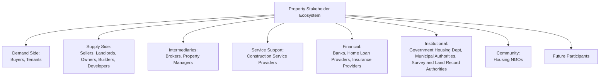

---

# Property Lifecycle

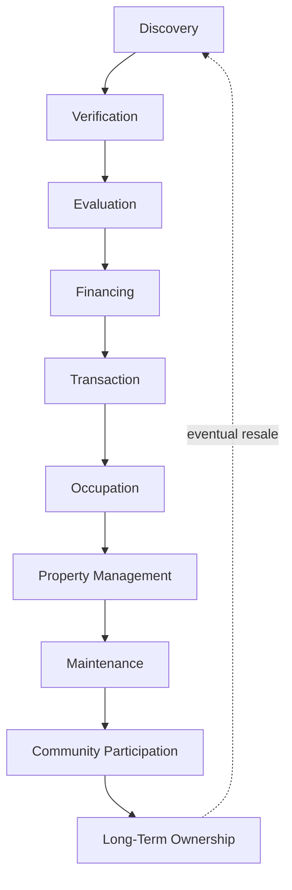

| Stage | Meaning |
|---|---|
| **Discovery** | A citizen searches genuine, verified listings matching their need. |
| **Verification** | Ownership evidence and listing accuracy are confirmed before a citizen invests further time or money. |
| **Evaluation** | The citizen compares options transparently — price, location, verified status — without manipulated ranking. |
| **Financing** | The citizen is made aware of, and may separately pursue, home-loan and insurance options. |
| **Transaction** | A verified buyer/seller or tenant/landlord agreement is reached through a safe communication channel. |
| **Occupation** | The citizen moves into and begins using the property. |
| **Property Management** | An owner manages a rental relationship, directly or through a Property Manager. |
| **Maintenance** | Ongoing upkeep discovery through Construction Service Providers. |
| **Community Participation** | The citizen engages their new neighborhood and its local civic and commercial services. |
| **Long-Term Ownership** | Sustained stewardship across years, eventually cycling back to Discovery upon resale. |

---

# Value Creation

| Question | Answer |
|---|---|
| **How do buyers create value?** | By bringing genuine purchasing intent and honest feedback on a seller's or broker's conduct that protects the next buyer. |
| **How do sellers create value?** | By offering genuinely owned, accurately described property, building the verified-listing pool every buyer depends on. |
| **How do property owners create value?** | By maintaining their property responsibly and engaging fairly with tenants, sustaining the district's overall housing quality. |
| **How does Arwal create value?** | By converting an opaque, broker-dominated, fraud-prone informal market into verified, transparent, comparable discovery — reach and trust neither party could assemble alone. |
| **How does trust develop?** | Through Identity Verification (CAP-001) and Property Listing Verification (CAP-029), compounding through Reputation & Rating Management (CAP-045) as verified, completed transactions accumulate. |
| **How does housing accessibility improve?** | Through Fair Visibility in discovery and dedicated rental/affordable-segment discoverability that is never crowded out by premium listings. |
| **How does district development benefit?** | Through reduced housing fraud, more efficient matching of available stock to genuine need, and better-informed local construction investment. |

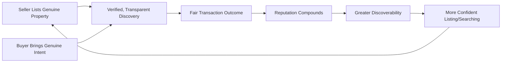

---

# Business Model

| Capability | Business Rationale |
|---|---|
| **Property Discovery** | Converts informal, broker-only search into verified, ranked, comparable discovery, per CAP-029. |
| **Rental Discovery** | A dedicated, never-deprioritized discovery surface for the district's largest housing-need segment. |
| **Verified Listings** | Ownership evidence and listing accuracy confirmed before publication, per PROC-024. |
| **Property Comparison** | Transparent, side-by-side evaluation of genuinely comparable options — price, verified status, location. |
| **Housing Scheme Awareness** | Surfaces a citizen's eligibility for a government housing scheme, sourced jointly with the Housing Department per RULE-008, never approximated unilaterally. |
| **Home Loan Awareness** | Plainspoken awareness of financing options, never a lending decision Arwal itself makes. |
| **Insurance Awareness** | Plainspoken awareness of property-protection options relevant to a buyer's or owner's situation. |
| **Property Service Discovery** | Connects an owner to verified maintenance, repair, and utility-adjacent service providers. |
| **Construction Service Discovery** | Connects a builder-seeking citizen to verified local construction professionals, per `ai-docs/66`. |
| **Housing Community Programs** | Distribution of local housing-community information and civic-service relevance through Notifications (CAP-031). |
| **Citizen Guidance** | Plain-language advisory content on the buying, renting, and registration process — never a substitute for professional legal advice. |

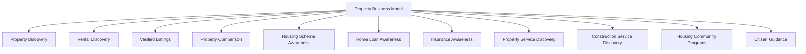

---

# Trust & Quality Strategy

| Mechanism | Strategic Role |
|---|---|
| **Property Verification** | Ownership evidence, document legibility, and listing-content accuracy are confirmed before publication, per PROC-024. |
| **Ownership Awareness** | Citizens are given clear, plain-language guidance on what genuine ownership evidence looks like and its limits, never a false guarantee of legal title. |
| **Listing Authenticity** | A listing misrepresenting price, condition, or availability is held for review or rejected, with a fail-closed default for ambiguous cases. |
| **Fraud Prevention** | Continuous, AI-assisted, always human-confirmed anomaly detection on listing and inquiry patterns, per CAP-038 and RULE-024. |
| **Privacy Protection** | Contact details are exchanged only after mutual, verified confirmation, per RULE-024-adjacent Property rules. |
| **Consent Management** | Explicit, granular, revocable consent governs every property-adjacent data flow, per RULE-003. |
| **Complaint Resolution** | A structured, evidence-based path to a fair outcome for both parties, per CAP-036 and RULE-013, applied without presumption toward either side. |
| **Government Coordination** | Housing scheme and land-record context is sourced jointly with the relevant authority, never approximated unilaterally. |
| **Housing Trust** | Every mechanism above compounds into one felt outcome: a citizen who believes a verified listing on Arwal means something real. |

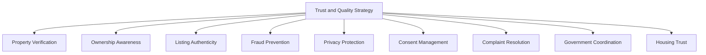

---

# Economic Impact

| Impact Area | How Arwal Contributes |
|---|---|
| **Increase Housing Accessibility** | Transparent rental and affordable-segment discovery reaches beyond a broker's existing network. |
| **Reduce Property Fraud** | Verification-gated listing publication directly reduces exposure to fraudulent ownership claims. |
| **Improve Market Transparency** | Comparable, verified pricing reduces information asymmetry that today favors whoever has the most local connections. |
| **Support Local Construction** | Construction Service Discovery connects genuine local demand to genuine local builders. |
| **Generate Employment** | Growth in construction-service discovery and property-management activity supports local livelihoods. |
| **Promote Responsible Urban Growth** | Coordination with Municipal Authorities and Survey & Land Record Authorities discourages unplanned, unverifiable development. |
| **Improve Property Market Efficiency** | Faster, more confident matching of available stock to genuine buyer and tenant need. |
| **Strengthen District Economy** | A trusted housing market attracts responsible investment and reduces dispute-driven economic loss, reinforcing `ai-docs/64`'s District Development Strategy. |

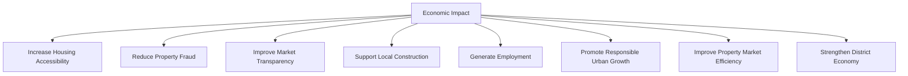

---

# Governance

### Ownership
Property & Housing Business Model ownership sits with the Chief Housing Officer (or Head of Classifieds/Property where the role is not yet separately staffed), with Rental, Sale, and Construction-Service categories each accountable to a named sub-owner, mirroring the Clear Ownership discipline already established throughout `ai-docs/53` through `ai-docs/71`.

### Housing Council
A standing **Housing Council** — chaired by the Chief Housing Officer, with the Head of Trust & Safety, Head of Government Partnerships, CPO, Compliance Officer, and rotating buyer/tenant and owner representatives as members — holds approval authority over any platform-wide verification-standard change, any new property-facilitation fee mechanism, and any material deviation from the Anti-Patterns below. The Council meets monthly, with ad hoc sessions for a Housing Ecosystem Health Score regression.

### Decision Authority

| Decision | Approves |
|---|---|
| New housing category or region activation | Housing Council + CEO |
| Property verification standard change | Housing Council + Head of Trust & Safety |
| New fee structure (listing, promotion) | Housing Council + Revenue Review Board (`ai-docs/62`) |
| Government housing scheme/land-record data-sourcing change | Housing Council + Head of Government Partnerships |
| Emergency integrity response (e.g., a fraud wave) | Head of Trust & Safety, immediate, ratified by Council within 5 business days |

### Review Cadence

| Review | Cadence | Owner |
|---|---|---|
| Housing Ecosystem Health Review | Monthly | Housing Council |
| Category Performance Review (Sale, Rental, Construction Services) | Quarterly | Category Heads |
| Annual Housing Strategy Review | Annual | CEO, Chief Housing Officer, CPO |

### Conflict Resolution
A buyer-seller or tenant-landlord dispute follows PROC-013 and RULE-013 in full; a party's disagreement with a platform decision follows the identical Appeal right already established in RULE-028, reviewed by an independent reviewer.

### Continuous Improvement
Every review above feeds a shared, tracked improvement backlog, reviewed and prioritized at the next Housing Ecosystem Health Review, never left to informally resolve itself.

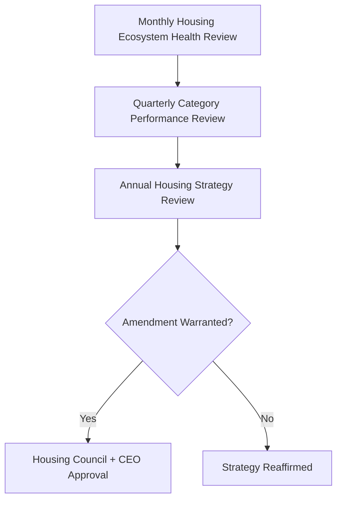

---

# Risks

| Risk | Description | Mitigation |
|---|---|---|
| **Fake Listings** | A listing misrepresents ownership, condition, or availability. | Property Verification and Listing Authenticity mechanisms above; fail-closed default for ambiguous cases. |
| **Property Fraud** | A fraudulent sale or rental of a property the "seller" does not genuinely own. | Ownership Awareness and Verification gates before publication; Fraud Detection (CAP-038). |
| **Ownership Disputes** | Conflicting claims of ownership over the same property. | Arwal never itself adjudicates title — disputes are directed to the appropriate legal and Survey & Land Record authority, per Ownership Awareness. |
| **Price Manipulation** | Coordinated or misleading pricing distorting fair comparison. | Transparent Property Comparison; Trust & Safety monitoring. |
| **Privacy Risks** | Contact or financial data exposed beyond its consented purpose. | RULE-003's Consent Requirement; contact exchange only after mutual confirmation. |
| **Digital Exclusion** | A rural or low-literacy citizen cannot access discovery unassisted. | Multilingual, simplified, field-agent-assisted design per Accessibility principles established throughout this handbook. |
| **Regulatory Changes** | A change in land-record, registration, or housing-scheme policy invalidates a workflow assumption. | Configurable, government-owned workflows per RULE-006 and RULE-008. |
| **Trust Erosion** | A mishandled fraud incident damages trust across the entire housing vertical. | Transparent, evidence-based dispute resolution per RULE-013 and RULE-028. |
| **Market Speculation** | Listings or activity that encourage unsustainable price inflation. | Sustainable Urban Growth principle; coordination with Municipal Authorities. |
| **Housing Inequality** | The platform inadvertently favors premium listings over affordable/rental discovery. | Rental Discovery's protected, never-deprioritized visibility, per Business Model above. |

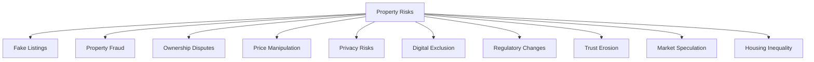

---

# Metrics

| Metric | Definition | Direction |
|---|---|---|
| **Verified Listings** | Count of listings passing full ownership and authenticity verification. | Increasing |
| **Verified Property Owners** | Count of owners passing identity and ownership-evidence verification. | Increasing |
| **Rental Success Rate** | % of rental inquiries resulting in a confirmed tenancy. | Increasing |
| **Housing Accessibility Index** | A composite measure of discovery reach and parity across income and geography segments. | Increasing, approaching parity |
| **Citizen Satisfaction** | Buyer/tenant/owner-reported CSAT, per `ai-docs/60-customer-experience-strategy.md`'s Experience Metrics. | Increasing |
| **Fraud Prevention Rate** | Share of attempted fraudulent listings caught before publication. | Increasing |
| **Trust Score** | District Trust Signal, viewed for property interactions specifically. | Increasing |
| **Market Transparency Index** | Rate at which comparable listings display consistent, verified pricing information. | Increasing |
| **Housing Ecosystem Health** | A composite index combining Verified Listing growth, Trust Score, and Dispute Rate. | Increasing |

> **Callout — No Property Metric Stands Alone**
> Per the North Star Principle already established in `ai-docs/00-project-vision.md`, a rising Verified Listings count alongside a falling Trust Score or rising Dispute Rate is treated as a regression — never counted as success in isolation.

---

# Anti-Patterns

| Anti-Pattern | Why It's Rejected |
|---|---|
| **Fake listings** | Directly endangers a citizen's deposit and safety; violates Verified Property Information. |
| **Pay-for-ranking** | Undisclosed paid ranking violates Transparency and the Marketplace Neutrality principle already established in `ai-docs/65`. |
| **Growth without trust** | A rising listing count alongside a falling Trust Score is a regression, never a win. |
| **Ignoring rural housing** | Directly contradicts Housing Accessibility and the founding Inclusion over Optimization pillar. |
| **Urban bias** | Discovery implicitly skewed toward district-headquarters listings recreates the Urban Bias anti-pattern already rejected in `ai-docs/51`. |
| **Unverified brokers** | An intermediary operating without the same verification rigor as a direct owner undermines the entire trust chain. |
| **Technology without accessibility** | A capability only a digitally fluent, literate citizen can use has failed the Accessibility principle. |
| **Short-term speculation** | Encouraging listing behavior that inflates prices unsustainably violates Sustainable Urban Growth. |
| **Ignoring affordable housing** | Deprioritizing rental and affordable-segment discovery in favor of premium listings violates Affordability and Equal Opportunity. |

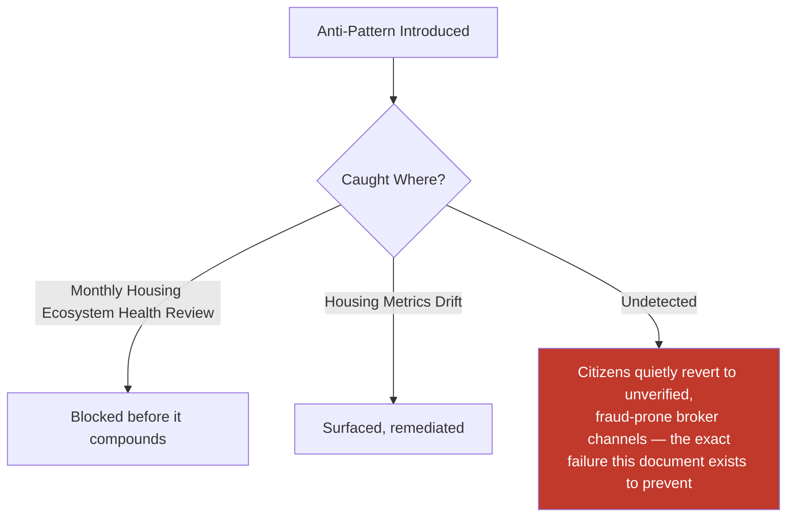

---

# Relationship to Previous Documents

| Prior Document | Relationship |
|---|---|
| **Project Vision (`ai-docs/00`)** | Establishes the founding fragmentation problem this document solves for housing specifically. |
| **Stakeholder Analysis (`ai-docs/51`)** | Supplies the Property Owners and Tenants stakeholder registry this document traces to. |
| **Business Domain Model (`ai-docs/53`)** | Supplies the ownership structure behind the Property domain (DOM-012). |
| **Business Capability Map (`ai-docs/55`)** | Supplies the stable abilities — Property Listing Management (CAP-029) — this document's strategy is built on. |
| **Customer Experience Strategy (`ai-docs/60`)** | Supplies the felt-experience bar every property interaction must clear. |
| **Value Proposition Framework (`ai-docs/61`)** | Supplies the stakeholder value exchange this document extends into a full ecosystem business model. |
| **Revenue & Sustainability Strategy (`ai-docs/62`)** | Supplies the fairness safeguards this document's economic mechanisms are bound by. |
| **Government Partnership Strategy (`ai-docs/63`)** | Supplies the Housing Department and land-record coordination context. |
| **District Ecosystem Mapping (`ai-docs/64`)** | Supplies the whole-system Ecosystem Health view this document's metrics feed into. |
| **Marketplace Strategy (`ai-docs/65`)** | Supplies the general two-sided-market economics this document specializes for a low-frequency, high-stakes, fraud-sensitive category. |
| **Service Provider / Merchant / Agriculture / Healthcare / Education / Employment (`ai-docs/66`–`ai-docs/71`)** | Supply sibling strategic models sharing the identical elevated Trust & Safety governance pattern this document applies to housing. |
| **Business Glossary (`ai-docs/59`)** | Supplies the precise vocabulary (Property Owner, Tenant, Listing, Reputation, Dispute, Appeal) this document's every claim is expressed in. |

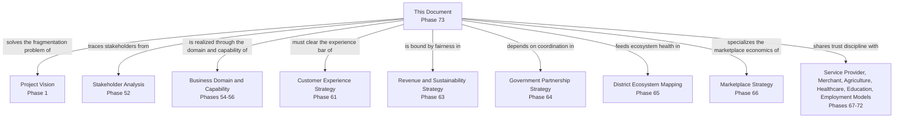

---

# Executive Artifacts

### Property Business Framework

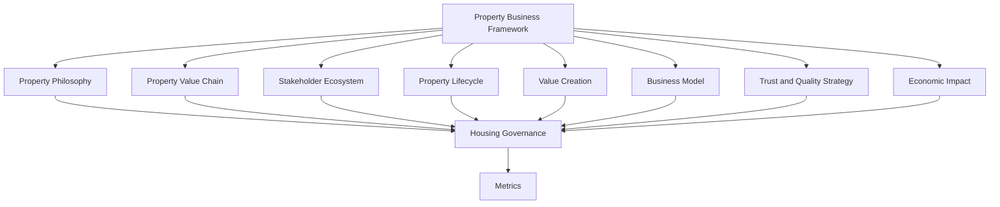

### Property Value Chain

See Property Value Chain section above — reproduced here by reference per Single Source of Truth, never duplicated.

### Property Lifecycle

See Property Lifecycle section above.

### Housing Ecosystem Map

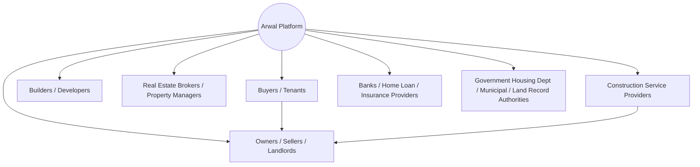

### Housing Development Model

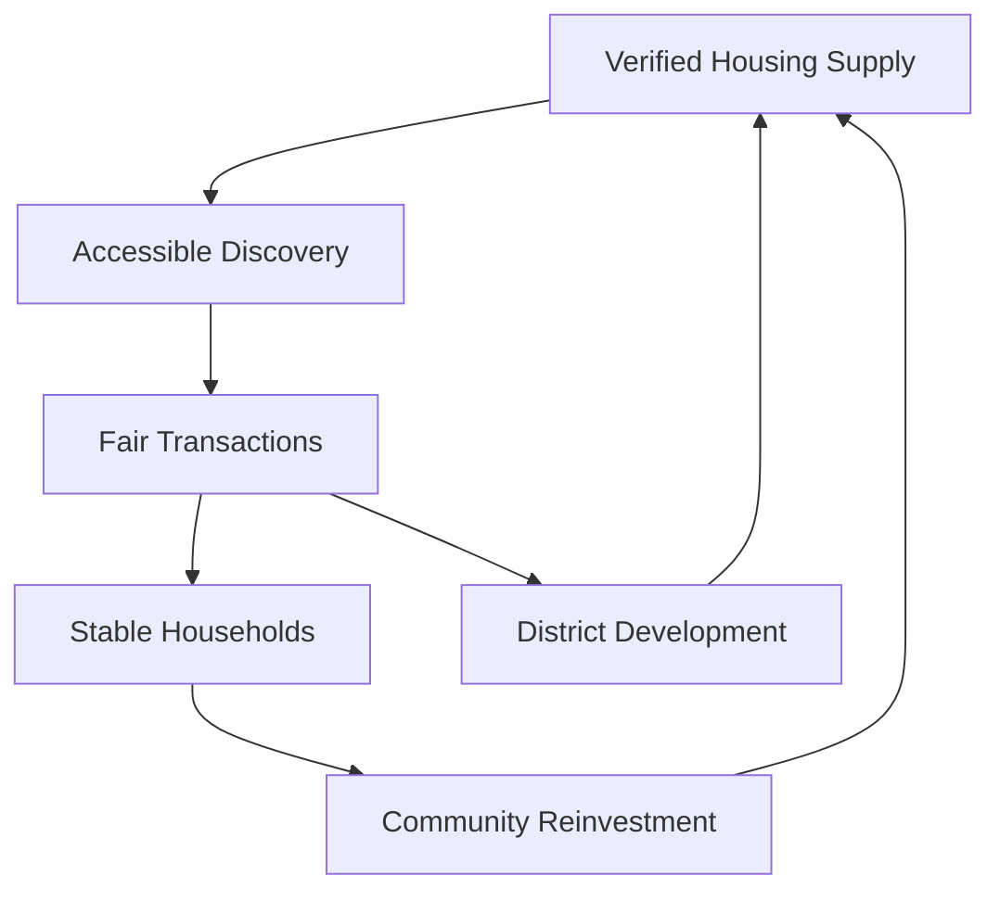

### Housing Growth Flywheel

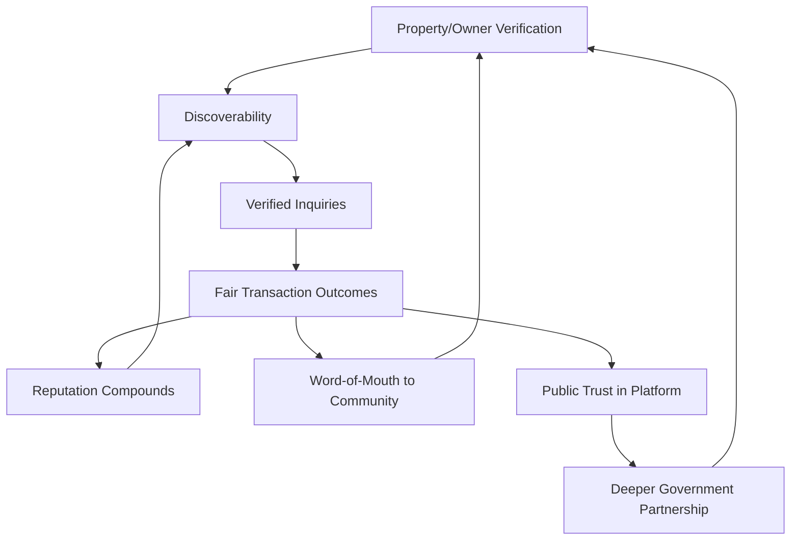

### Executive Dashboards

| Dashboard | Audience | Key Content |
|---|---|---|
| **CEO Dashboard** | CEO | Housing Ecosystem Health Score, Verified Listings trend, Trust Score |
| **Chief Housing Officer Dashboard** | Chief Housing Officer | Verified Owners/Listings, category-level performance, Market Transparency Index |
| **Trust & Safety Dashboard** | Head of Trust & Safety | Dispute Rate, verification turnaround, fraud-incident trend |
| **Government Partners Dashboard** | Housing Dept / Municipal liaisons | Scheme utilization, land-record coordination status |

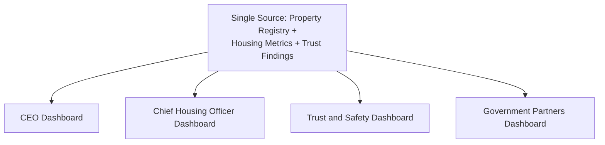

### Decision Matrix

| Decision Type | Approval Authority |
|---|---|
| New housing category/region activation | Housing Council + CEO |
| Verification standard change | Housing Council + Head of Trust & Safety |
| New fee structure | Housing Council + Revenue Review Board |
| Government scheme/land-record data-sourcing change | Housing Council + Head of Government Partnerships |
| Emergency integrity response | Head of Trust & Safety, ratified within 5 business days |

---

# Closing Statement

> **Callout — Closing Statement**
> Every prior document in this handbook explains what Arwal builds, how it sustains itself, and the markets and ecosystems it operates inside. This document explains the specific promise Arwal makes to a family before they hand over a deposit they cannot afford to lose, and to an owner before they trust a stranger with the keys to their only asset: that the listing is genuine, the ownership behind it is real, and the platform stands with them if something goes wrong. A district's housing market is not a listing category among many — it is where trust, once broken, is hardest to rebuild, because the stakes are a family's home and a lifetime of savings. Arwal grows this ecosystem at the pace verification, transparency, and government partnership can genuinely sustain, never faster, because a generation-long civic-commercial platform cannot be built on a housing promise it cannot keep. Where a future phase must deviate from a principle stated here, that deviation is made explicitly — through the Housing Governance process above — never silently, and never by default.

This document, `ai-docs/72-property-housing-business-model.md`, is Phase 73 of approximately 415. Every future listing-verification standard, tenancy-trust mechanism, and housing-development program is expected to trace back to a principle defined here, or to justify its deviation in writing.

**End of Phase 73 — `ai-docs/72-property-housing-business-model.md`**