# Logistics & Delivery Strategy

**Document:** `ai-docs/73-logistics-delivery-strategy.md`
**Project:** Arwal — The District Super App
**Stage:** 2 — Product & Business Strategy
**Phase:** 74 — Logistics & Delivery Strategy
**Status:** Approved for Product & Engineering Reference
**Audience:** CEO, CSO, CPO, Chief Logistics Officer, Enterprise Business Architects, Supply Chain Strategists, Last-Mile Delivery Consultants, Marketplace Operations Strategists, Government Partnership Specialists, Trust & Safety Strategists, Risk & Compliance Advisors, Investors

> **Callout — Purpose of This Document**
> `ai-docs/00-project-vision.md` through `ai-docs/72-property-housing-business-model.md` established why Arwal exists, what it can do, who it serves, how it sustains itself, how it partners with government, the whole district ecosystem it operates inside, the general economics of a marketplace, and how each vertical's stakeholders build trust and value on the platform. None of those documents answers a question every merchant, farmer, restaurant, and citizen depends on the moment a transaction is confirmed: **how does the thing that was ordered actually, reliably, and honestly arrive?** A verified listing, a fair price, and a trustworthy provider all mean nothing if the package never comes, arrives damaged, or arrives so late the trust built everywhere else in the platform quietly erodes. This document is that answer — the authoritative Logistics & Delivery Strategy every future fulfillment, delivery-partner, and last-mile decision traces back to.

---

# Purpose of this Document

### Why Logistics Is a Distinct Strategic Layer

Every prior domain and capability document in this handbook assumes, at some point, that "the order will be fulfilled." `ai-docs/55-business-capability-map.md`'s Delivery Coordination (CAP-026) and `ai-docs/57-business-process-standards.md`'s Order Fulfillment (PROC-011) and Delivery Coordination (PROC-012) already own the operational and technical mechanics of that assumption. This document sits above and across those mechanics: it explains **why** logistics is not a supporting afterthought bolted onto Commerce, but a strategic capability that touches every single vertical simultaneously — Commerce, Food, Grocery, Agriculture, Healthcare (medicine and diagnostic delivery), Property (moving and maintenance service dispatch), and even Government (document and certificate delivery to citizens without reliable postal access). A district super app that gets every domain right but cannot reliably move a package the last mile has not actually solved the citizen's problem — it has merely relocated the point of failure from discovery to delivery.

### Why This Is Not a Fleet Management or Routing Specification

This document contains no dispatch algorithm, no route-optimization logic, no warehouse-management system design, and no fleet-telematics architecture. It does not redefine Domains (`ai-docs/53`), Capabilities (`ai-docs/55`), Modules (`ai-docs/54`), Journeys (`ai-docs/56`), Processes (`ai-docs/57`), or Rules (`ai-docs/58`) — Logistics (DOM-011), Delivery Coordination (CAP-026), Delivery Tracking (MOD-028), and Delivery Partner Earnings (MOD-029) remain fully authoritative and are cited, never restated. This document's exclusive territory is: **the strategic reasoning behind why logistics matters, who participates in it, how value and trust are created across it, and how the ecosystem around delivery is governed, protected, and grown across a generation.**

### The Chain of Reasoning This Document Extends

```mermaid
graph LR
    A[Marketplace Strategy<br/>ai-docs/65] --> B[Service Provider Ecosystem<br/>ai-docs/66]
    B --> C[Merchant Ecosystem<br/>ai-docs/67]
    C --> D[Agriculture Business Model<br/>ai-docs/68]
    D --> E[Healthcare Business Model<br/>ai-docs/69]
    E --> F[Education Business Model<br/>ai-docs/70]
    F --> G[Employment and Jobs Business Model<br/>ai-docs/71]
    G --> H[Property and Housing Business Model<br/>ai-docs/72]
    H --> I[Logistics and Delivery Strategy<br/>ai-docs/73 — this document]
```

| Layer | Question It Answers |
|---|---|
| Marketplace Strategy | How does a two-sided market work, generally? |
| Service Provider / Merchant / Agriculture / Healthcare / Education / Employment / Property | How does Arwal earn each sector's trust with their livelihood, health, future, work, or home? |
| **Logistics & Delivery Strategy** (this document) | **How does Arwal make good on every one of those promises by actually, reliably moving the thing that was ordered?** |

### Why Logistics Connects Every Business Vertical

No other capability in this handbook is a genuine dependency of as many domains simultaneously. Commerce, Food, and Grocery orders cannot complete without it, per CAP-025's direct dependency on CAP-026. A farmer's Direct-to-Buyer Marketplace sale (CAP-013) depends on produce reaching a buyer before it spoils. A citizen's pharmacy order depends on medicine arriving on time. A property owner's maintenance request depends on a Construction Service Provider's materials arriving on schedule. Logistics is the connective tissue beneath the entire platform's promise of convenience — and its failure is uniquely visible, because a citizen does not experience "the platform is unreliable" in the abstract; they experience it as a specific missed meal, a specific spoiled harvest, or a specific missed medication.

### How Delivery Improves Citizen Experience

A citizen who trusts that an order will arrive as promised — on time, intact, and exactly as described — is a citizen who will order again, try an unfamiliar merchant, and recommend the platform to a neighbor. Per `ai-docs/60-customer-experience-strategy.md`'s Reliability pillar, "the app was down" or "the delivery never came" is not a minor inconvenience; for a citizen depending on Arwal for a hospital medicine delivery or a government document, it is a missed appointment or a missed deadline. Logistics reliability is therefore a trust signal before it is an operational metric.

### How Logistics Strengthens the District Economy

Per `ai-docs/64-district-ecosystem-mapping.md`'s District Development Strategy, an efficient, fairly-compensated delivery network expands a merchant's addressable market beyond walking distance, gives a delivery partner a genuine income opportunity, and reduces the district's overall transaction friction — the same efficiency gain a modern road or utility network provides, applied to the last mile of every local transaction.

### Relationship Between Every Participant

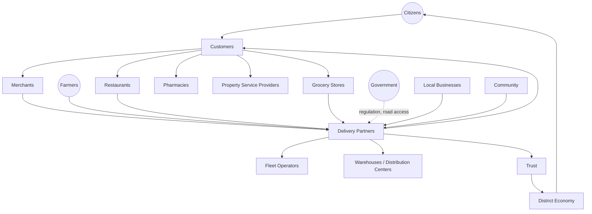

### Scope Boundary

This document does not define pickup/dispatch technical mechanics, does not specify vehicle-routing logic, and does not redraft any government transport regulation — those remain either Arwal's own technical architecture (`ai-docs/03`, `ai-docs/55`) or government authority (`ai-docs/58`), cited but never redefined here. This document's territory is strategic and economic: the business model, the stakeholder relationships, the value chain, and the governance that makes Arwal's logistics network trustworthy, fair, and durable.

---

# Logistics Philosophy

### Citizen First
**Why it exists:** Every logistics decision is judged first against whether it serves the citizen waiting for their order, never against fleet utilization or cost-per-delivery in isolation, mirroring the identical Citizen-First tie-breaker already established throughout `ai-docs/51` through `ai-docs/72`.

### Reliable Delivery
**Why it exists:** A delivery promise kept builds more trust than a fast delivery that arrives inconsistently — reliability is the foundational commitment every other logistics goal is built on top of.

### Transparency
**Why it exists:** A citizen, merchant, and delivery partner must all be able to see exactly where an order is, what it will cost, and why a delay occurred — concealment in logistics produces the same corrosive suspicion `ai-docs/60-customer-experience-strategy.md` rejects at the individual-interaction level.

### Trust Before Delivery
**Why it exists:** A citizen hands a stranger access to their home address and, often, advance payment — trust in the delivery partner and the platform behind them must be earned before the first delivery is ever attempted, never assumed.

### Accessibility
**Why it exists:** A delivery network reaching only the district headquarters and leaving villages underserved has replicated the exact urban bias `ai-docs/00-project-vision.md`'s founding vision exists to correct.

### Affordability
**Why it exists:** A delivery fee structure that prices out low-income citizens or small merchants defeats the Business Enablement and Economic Inclusion commitments already established in `ai-docs/62-revenue-sustainability-strategy.md`.

### Safety
**Why it exists:** A delivery partner navigating district roads and a citizen receiving a stranger at their door both carry real physical risk — safety is a precondition for participation, never a downstream optimization.

### Operational Excellence
**Why it exists:** A logistics network that works well only under ideal conditions has not actually been designed — excellence means graceful, predictable behavior under real-world volume, weather, and infrastructure variance.

### Sustainability
**Why it exists:** Delivery routing and vehicle choices carry an environmental cost; Arwal is built as infrastructure meant to serve a district for a generation, per `ai-docs/00-project-vision.md`, and a logistics network that ignores its own environmental footprint is not built for that horizon.

### Local Employment
**Why it exists:** A delivery partner network sourced and staffed from the district itself directly strengthens the local economy this platform exists to serve, rather than displacing local livelihood with an outside workforce.

### Fair Partner Treatment
**Why it exists:** A delivery partner's earnings, routing, and treatment must be transparent and equitable — a logistics network that treats its delivery workforce as an expendable input rather than a genuine stakeholder has undermined the Merchant/Provider Success principle already established across `ai-docs/66` and `ai-docs/67`.

### Continuous Improvement
**Why it exists:** Delivery volumes, road conditions, fraud patterns, and citizen expectations all evolve — a logistics strategy fixed at launch and never revisited decays, mirroring the Continuous Improvement discipline already established throughout this handbook.

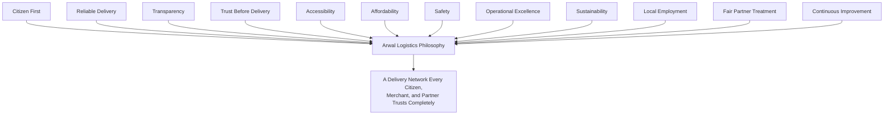

> **Callout — The One-Sentence Logistics Philosophy**
> *"Every other part of Arwal can be perfect, but if the package never arrives, none of it mattered — logistics is the promise every other promise depends on being kept."*

---

# Logistics Value Chain

| Stage | Business Description |
|---|---|
| **Order Creation** | A citizen places an order across Commerce, Food, Grocery, or Agriculture, generating the fulfillment need logistics exists to serve. |
| **Order Confirmation** | The order is confirmed and payment secured, per CAP-025, before any physical fulfillment action begins. |
| **Inventory Readiness** | The merchant, restaurant, or farmer confirms the item is genuinely available and ready, never allowing a confirmed order to depend on stock that does not exist. |
| **Pickup** | A delivery partner or fleet resource collects the order from its origin point. |
| **Packaging** | The order is packaged appropriately for its category — food kept at temperature, fragile goods protected, produce kept fresh. |
| **Dispatch** | The order is assigned to the delivery resource best positioned to fulfill it reliably and fairly. |
| **Transportation** | The order moves from origin to destination across the district's actual road and connectivity conditions. |
| **Tracking** | The citizen, merchant, and platform can all see the order's real-time or near-real-time status throughout transit. |
| **Delivery** | The order reaches the citizen at the agreed location and time window. |
| **Proof of Delivery** | Delivery completion is confirmed unambiguously — never left as an assumption either party must take on faith. |
| **Returns** | Where an order is incorrect, damaged, or unwanted, a return path exists and is honored. |
| **Reverse Logistics** | A returned item is moved back through the network to the merchant or an appropriate disposition point. |
| **Issue Resolution** | A delay, damage, or delivery failure is investigated and resolved fairly for every party involved. |
| **Continuous Improvement** | Every stage's performance data feeds back into the next cycle's planning, never treated as a one-time setup. |

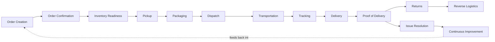

---

# Stakeholder Ecosystem

| Stakeholder | Strategic Role |
|---|---|
| **Citizens** | The ultimate beneficiary of every delivery — the population whose trust determines whether the logistics network is worth using at all. |
| **Customers** | Citizens in the specific moment of awaiting a confirmed order's fulfillment. |
| **Merchants** | Origin-point participants whose readiness and packaging quality directly shape delivery success. |
| **Farmers** | Origin-point participants for Direct-to-Buyer Marketplace produce, per CAP-013, with time-sensitive freshness stakes. |
| **Restaurants** | Origin-point participants for Food Delivery, per CAP-025, with the tightest delivery-time tolerance in the network. |
| **Retailers** | General-goods origin-point participants across the Commerce Marketplace domain. |
| **Delivery Partners** | The human core of last-mile fulfillment — independent workers whose fair treatment and earnings transparency this document exists partly to protect, per `ai-docs/66-service-provider-ecosystem.md`'s Provider Success principles applied here. |
| **Fleet Operators** | Organizations coordinating multiple delivery partners or vehicles, supporting capacity beyond individual solo partners. |
| **Warehouses** | Intermediate storage points supporting inventory-holding merchants and bulk-fulfillment scenarios. |
| **Distribution Centers** | Aggregation and sorting points supporting district-wide and eventually cross-district logistics scale. |
| **Service Providers** | Property and home-service providers whose materials and equipment delivery this network also supports, per `ai-docs/66`. |
| **Government** | The regulatory authority over road use, vehicle licensing, and public-safety coordination this network operates within. |
| **Insurance Providers** | Institutions offering delivery-partner and package-protection coverage relevant to logistics risk. |
| **Local Businesses** | The broader base of district commerce whose growth this logistics network directly enables. |
| **Future Logistics Participants** | Cross-district fulfillment partners, cold-chain specialists, and other capacity not yet active, tracked per the Delivery Lifecycle's evolution below. |

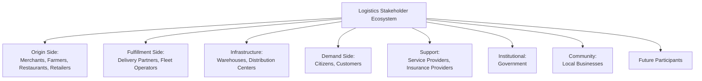

---

# Delivery Lifecycle

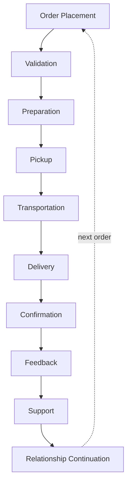

| Stage | Meaning |
|---|---|
| **Order Placement** | A citizen commits to a purchase requiring physical fulfillment. |
| **Validation** | The order, payment, and delivery address are confirmed valid before dispatch begins. |
| **Preparation** | The origin party (merchant, restaurant, farmer) prepares the item for handoff. |
| **Pickup** | A delivery partner collects the prepared order. |
| **Transportation** | The order moves toward its destination, tracked throughout. |
| **Delivery** | The order reaches the citizen. |
| **Confirmation** | Both the citizen and the platform record the delivery as genuinely complete. |
| **Feedback** | The citizen may rate or report on the delivery experience, per Reputation & Rating Management (CAP-045). |
| **Support** | Any issue — delay, damage, non-delivery — is reachable through a clear support path. |
| **Relationship Continuation** | A positive experience compounds into the citizen's willingness to order again, cycling back to Order Placement. |

---

# Value Creation

| Question | Answer |
|---|---|
| **How do merchants create value?** | By preparing orders accurately, on time, and honestly described, making a delivery partner's job possible and a citizen's trust well-placed. |
| **How do delivery partners create value?** | By moving an order reliably, safely, and courteously — the visible, human face of every fulfillment promise the platform makes. |
| **How do customers create value?** | By providing accurate delivery information and honest feedback that improves the network for the next citizen. |
| **How does Arwal create value?** | By coordinating a district-wide, trust-verified delivery network no single merchant or citizen could assemble alone — matching, tracking, payment, and dispute resolution infrastructure. |
| **How does trust develop?** | Through Delivery Partner Verification and consistent, transparently tracked delivery performance, compounding through Reputation & Rating Management (CAP-045). |
| **How does logistics efficiency improve?** | Through accumulated delivery-density data enabling smarter partner allocation and route planning over time, evaluated at the strategic — never the algorithmic — level in this document. |
| **How does district commerce grow?** | Through expanded merchant reach beyond walking distance and expanded delivery-partner income, both reinforcing the local economic flywheel already established in `ai-docs/62-revenue-sustainability-strategy.md`. |

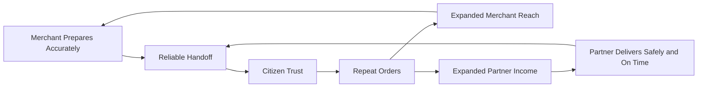

---

# Business Model

| Capability | Business Rationale |
|---|---|
| **Merchant Pickup** | A reliable, scheduled collection mechanism giving every merchant, regardless of size, access to fulfillment without owning their own fleet. |
| **Customer Delivery** | The core last-mile promise underlying every transacting vertical. |
| **Hyperlocal Delivery** | Short-distance, high-frequency delivery optimized for a district's actual density and travel patterns, per CAP-026. |
| **Scheduled Delivery** | A citizen's ability to choose a future delivery window, relevant to Grocery's recurring-order and Property's maintenance-visit scenarios. |
| **Same-Day Delivery** | The default expectation for Commerce and Grocery orders within a district's practical fulfillment radius. |
| **Reverse Logistics** | A structured, never-improvised path for returns to move back through the network. |
| **Delivery Partner Network** | The pool of independent workers and small fleets whose aggregate capacity makes district-wide coverage possible. |
| **Fleet Collaboration** | Coordination with organized fleet operators to absorb volume beyond individual partner capacity, particularly during demand surges. |
| **Package Tracking** | Real-time or near-real-time visibility into an order's transit status, per MOD-028. |
| **Delivery Notifications** | Timely, preference-honored status updates through Notifications (CAP-031). |
| **Customer Support** | A reachable path to resolve a delivery issue, per PROC-017. |
| **Partner Performance** | Transparent, fair measurement of a delivery partner's reliability, feeding both their own earnings growth and the network's overall quality. |

```mermaid
graph TD
    BizModel11[Logistics Business Model] --> MerchPickup[Merchant Pickup]
    BizModel11 --> CustDelivery[Customer Delivery]
    BizModel11 --> HyperlocalDel[Hyperlocal Delivery]
    BizModel11 --> ScheduledDel[Scheduled Delivery]
    BizModel11 --> SameDayDel[Same-Day Delivery]
    BizModel11 --> ReverseLog2[Reverse Logistics]
    BizModel11 --> PartnerNetwork[Delivery Partner Network]
    BizModel11 --> FleetCollab[Fleet Collaboration]
    BizModel11 --> PackageTrack[Package Tracking]
    BizModel11 --> DelNotif[Delivery Notifications]
    BizModel11 --> CustSupport2[Customer Support]
    BizModel11 --> PartnerPerf[Partner Performance]
```

---

# Trust & Quality Strategy

| Mechanism | Strategic Role |
|---|---|
| **Delivery Partner Verification** | Every delivery partner's identity is confirmed before they may accept an assignment, per CAP-001 and RULE-020's Delivery Partner Eligibility standard. |
| **Merchant Verification** | Every origin-point merchant is held to the same verification standard already established in RULE-010, ensuring a package's origin is as trustworthy as its destination. |
| **Package Integrity** | Packaging standards and handling expectations protect an order's condition from pickup through delivery. |
| **Proof of Delivery** | Delivery completion is confirmed through an unambiguous mechanism, never left to assumption or dispute. |
| **Fraud Prevention** | Continuous, AI-assisted, always human-confirmed anomaly detection on delivery patterns, per CAP-038. |
| **Privacy Protection** | A citizen's delivery address and a delivery partner's location are visible only for the duration and purpose of the active delivery, per RULE-003 and CAP-026's Privacy Considerations. |
| **Complaint Resolution** | A structured, evidence-based path to a fair outcome for citizen, merchant, and delivery partner alike, per CAP-036 and RULE-013. |
| **Government Coordination** | Vehicle licensing, road-safety, and public-safety coordination is sourced from the relevant authority, never assumed unilaterally. |
| **Delivery Trust** | Every mechanism above compounds into one felt outcome: a citizen who believes a confirmed order will genuinely arrive. |

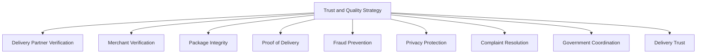

---

# Economic Impact

| Impact Area | How Arwal Contributes |
|---|---|
| **Improve Local Commerce** | Reliable fulfillment lets a small merchant compete on quality and price rather than proximity alone. |
| **Support MSMEs** | Shared delivery infrastructure removes the capital barrier of owning a private fleet for a small business. |
| **Strengthen Hyperlocal Economy** | Delivery density reinforces same-district commerce, keeping economic activity circulating locally. |
| **Generate Delivery Employment** | A growing, fairly-compensated delivery-partner network creates genuine, flexible local livelihood opportunity. |
| **Improve Supply Chain Efficiency** | Aggregated demand across merchants enables delivery-partner utilization no single small business could achieve alone. |
| **Reduce Delivery Costs** | Shared network economics lower the effective per-delivery cost relative to a merchant operating their own courier. |
| **Increase Market Access** | A farmer or merchant reaches buyers beyond their immediate physical footprint for the first time. |
| **Strengthen District Economy** | A dependable logistics layer is district-scale infrastructure, reinforcing `ai-docs/64`'s District Development Strategy the same way a reliable road network does. |

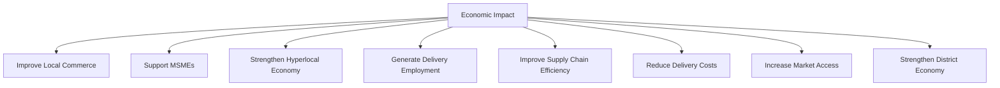

---

# Governance

### Ownership
Logistics & Delivery Strategy ownership sits with the Chief Logistics Officer (or Head of Logistics where the role is not yet separately staffed), with each fulfillment category (Commerce, Food, Grocery, Agriculture) accountable to its own Business Owner per `ai-docs/53`'s Domain Registry, mirroring the Clear Ownership discipline already established throughout `ai-docs/53` through `ai-docs/72`.

### Logistics Council
A standing **Logistics Council** — chaired by the Chief Logistics Officer, with the Head of Trust & Safety, Head of Merchant Success, CPO, and rotating delivery-partner representatives as members — holds approval authority over any platform-wide delivery-standard change, any new delivery-fee mechanism, and any material deviation from the Anti-Patterns below. The Council meets monthly, with ad hoc sessions for a Logistics Ecosystem Health Score regression. Delivery-partner representation ensures partners are consulted on decisions affecting their own livelihood, never merely informed after the fact.

### Decision Authority

| Decision | Approves |
|---|---|
| New delivery region or category activation | Logistics Council + CEO |
| Delivery partner verification standard change | Logistics Council + Head of Trust & Safety |
| New delivery fee structure | Logistics Council + Revenue Review Board (`ai-docs/62`) |
| Fleet operator partnership terms | Logistics Council + Head of Merchant Success |
| Emergency safety or integrity response | Head of Trust & Safety, immediate, ratified by Council within 5 business days |

### Review Cadence

| Review | Cadence | Owner |
|---|---|---|
| Logistics Ecosystem Health Review | Monthly | Logistics Council |
| Category Performance Review (Commerce, Food, Grocery, Agriculture) | Quarterly | Category Heads |
| Annual Logistics Strategy Review | Annual | CEO, Chief Logistics Officer, CPO |

### Conflict Resolution
A delivery-related dispute between a citizen, merchant, and delivery partner follows PROC-013 and RULE-013 in full; a delivery partner's disagreement with a platform decision follows the identical Appeal right already established in RULE-028, reviewed by an independent reviewer.

### Continuous Improvement
Every review above feeds a shared, tracked improvement backlog, reviewed and prioritized at the next Logistics Ecosystem Health Review, never left to informally resolve itself.

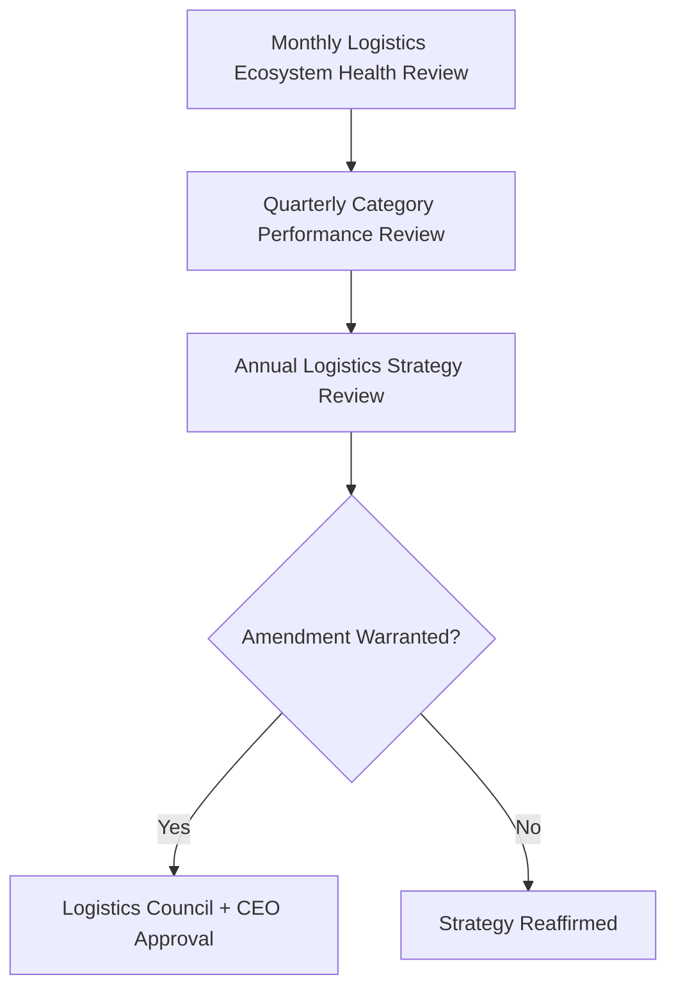

---

# Risks

| Risk | Description | Mitigation |
|---|---|---|
| **Delivery Fraud** | A false claim of non-delivery, or a delivery partner misrepresenting completion. | Proof of Delivery mechanisms; Fraud Detection (CAP-038); four-eyes enforcement per RULE-027. |
| **Package Theft** | An order stolen in transit or misappropriated by a bad-faith actor. | Delivery Partner Verification; tracked chain-of-custody through Package Tracking. |
| **Delivery Delays** | Traffic, weather, or capacity shortfalls causing missed delivery windows. | Transparent status communication; Delivery Notifications keeping the citizen informed rather than left guessing. |
| **Operational Failures** | A systemic breakdown in pickup, dispatch, or capacity allocation. | Continuous Improvement discipline; Logistics Ecosystem Health monitoring catching drift before it compounds. |
| **Digital Exclusion** | A rural citizen or delivery partner without reliable connectivity cannot participate. | Offline-first design and simplified partner onboarding, per `ai-docs/12-accessibility-standards.md`'s floor. |
| **Safety Risks** | A delivery partner or citizen harmed during a delivery interaction. | Delivery Partner Verification; safety-relevant complaint handling held to the same immediate-suspension standard as RULE-016's minor-safeguard rule. |
| **Partner Misconduct** | A delivery partner behaving unprofessionally, unsafely, or dishonestly. | Professional Conduct code enforcement, per the identical standard already established in `ai-docs/66-service-provider-ecosystem.md`. |
| **Regulatory Changes** | A change in vehicle-licensing or transport regulation invalidates a workflow assumption. | Configurable, government-coordinated workflows per RULE-006 and RULE-020. |
| **Trust Erosion** | A mishandled delivery incident damages trust across every transacting vertical simultaneously. | Transparent, evidence-based dispute resolution per RULE-013 and RULE-028; rapid, honest incident communication. |
| **Scalability Challenges** | A logistics network sized for one district's volume strains under multi-district growth. | Evidence-based capacity expansion per `ai-docs/50-product-vision-business-strategy.md`'s Strategic Expansion Principles, never speculative over-buildout. |

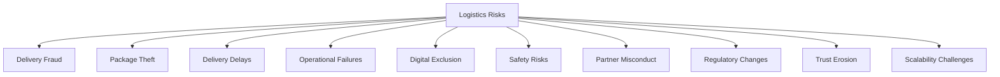

---

# Metrics

| Metric | Definition | Direction |
|---|---|---|
| **Successful Deliveries** | Count of deliveries completing without failure or dispute. | Increasing |
| **On-Time Delivery Rate** | % of deliveries completing within the promised window. | Increasing |
| **Partner Satisfaction** | Delivery-partner-reported CSAT, mirroring `ai-docs/66`'s provider-satisfaction discipline. | Increasing |
| **Merchant Satisfaction** | Merchant-reported fulfillment-experience CSAT. | Increasing |
| **Customer Satisfaction** | Citizen-reported delivery-experience CSAT, per `ai-docs/60-customer-experience-strategy.md`. | Increasing |
| **Average Delivery Time** | Mean elapsed time from dispatch to confirmed delivery. | Decreasing, without compromising Safety or Reliable Delivery |
| **Issue Resolution Time** | Mean time from a reported delivery issue to a fair resolution. | Decreasing |
| **Trust Score** | District Trust Signal, viewed for delivery interactions specifically. | Increasing |
| **Logistics Ecosystem Health** | A composite index combining On-Time Delivery Rate, Partner Satisfaction, and Trust Score. | Increasing |

> **Callout — No Logistics Metric Stands Alone**
> Per the North Star Principle already established in `ai-docs/00-project-vision.md`, a rising Average Delivery Time improvement alongside a falling Partner Satisfaction score is treated as a regression — never counted as success in isolation.

---

# Anti-Patterns

| Anti-Pattern | Why It's Rejected |
|---|---|
| **Growth without reliability** | Expanding delivery volume faster than the network can reliably fulfill violates Reliable Delivery and erodes exactly the trust growth depends on. |
| **Unsafe deliveries** | Prioritizing speed over a delivery partner's or citizen's safety directly violates Safety. |
| **Ignoring rural areas** | A delivery network concentrated only in the district headquarters contradicts Accessibility and the founding Inclusion over Optimization pillar. |
| **Partner exploitation** | Opaque earnings, unfair route assignment, or unsupported disputes violate Fair Partner Treatment. |
| **Technology without accessibility** | A tracking or notification experience unusable on an entry-level device fails the Accessibility principle. |
| **Hidden fees** | An undisclosed delivery charge violates Transparency and Affordability simultaneously. |
| **Unverified partners** | A delivery partner accepting assignments before verification succeeds violates Trust Before Delivery and RULE-020. |
| **Short-term optimization** | Trading long-term partner retention or citizen trust for a single quarter's delivery-cost reduction violates Continuous Improvement's own long-horizon intent. |

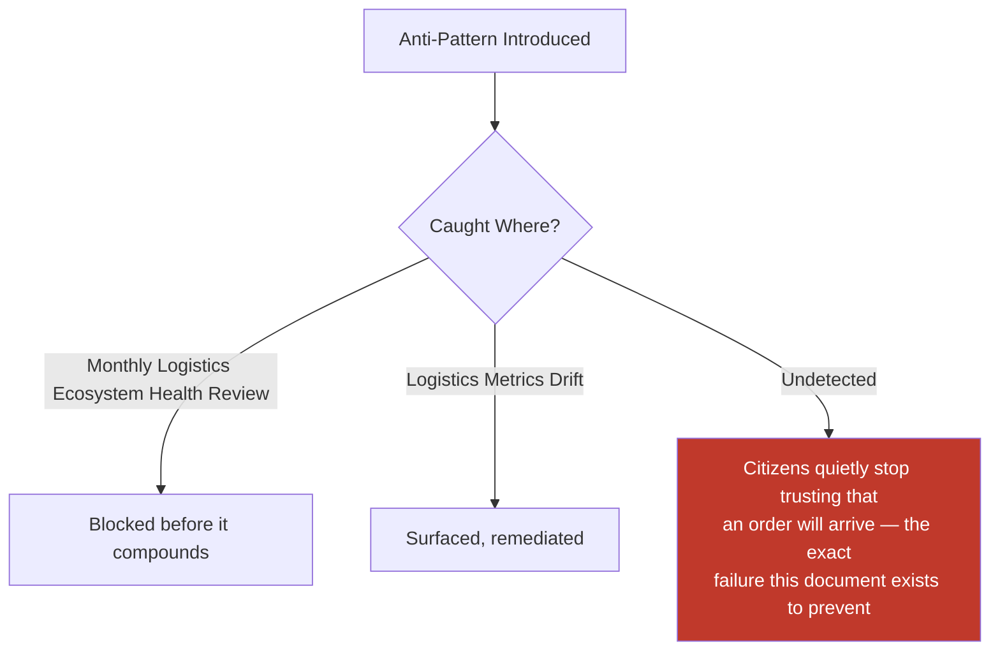

---

# Relationship to Previous Documents

| Prior Document | Relationship |
|---|---|
| **Project Vision (`ai-docs/00`)** | Establishes the founding commitment to reliability and inclusion this document operationalizes for the last mile specifically. |
| **Business Domain Model (`ai-docs/53`)** | Supplies the ownership structure behind the Logistics domain (DOM-011). |
| **Business Capability Map (`ai-docs/55`)** | Supplies the stable abilities — Delivery Coordination (CAP-026) — this document's strategy is built on top of. |
| **Business Process Standards (`ai-docs/57`)** | Supplies the operational sequence — Order Fulfillment (PROC-011), Delivery Coordination (PROC-012) — this document's strategy governs the reasoning behind. |
| **Marketplace Strategy (`ai-docs/65`)** | Supplies the general two-sided-market economics this document specializes for physical fulfillment specifically. |
| **Service Provider Ecosystem (`ai-docs/66`)** | Supplies the identical Provider Success and Fair Treatment discipline this document applies to delivery partners. |
| **Merchant Ecosystem (`ai-docs/67`)** | Supplies the merchant-side value exchange this document's origin-point participants depend on. |
| **Agriculture Business Model (`ai-docs/68`)** | Supplies the freshness-sensitive fulfillment need this document's transportation stage directly serves. |
| **Healthcare Business Model (`ai-docs/69`)** | Supplies the time-critical medicine and diagnostic delivery need this document's reliability commitment protects. |
| **Education Business Model (`ai-docs/70`)** | Supplies context for material and resource delivery relevant to tutoring and coaching engagements. |
| **Employment & Jobs Business Model (`ai-docs/71`)** | Supplies the delivery-partner-as-livelihood framing this document's Local Employment principle extends. |
| **Property & Housing Business Model (`ai-docs/72`)** | Supplies the Construction Service Provider material-delivery need this document's Service Providers stakeholder role serves. |
| **District Ecosystem Mapping (`ai-docs/64`)** | Supplies the whole-system Ecosystem Health view this document's metrics feed into. |

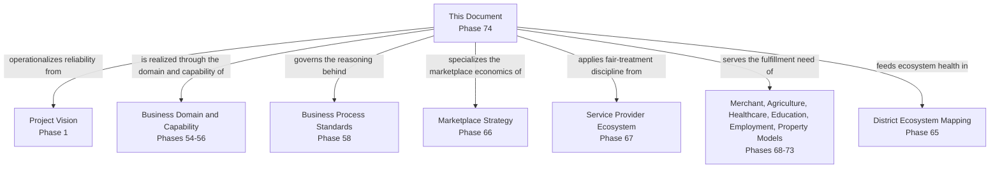

---

# Executive Artifacts

### Logistics Strategy Framework

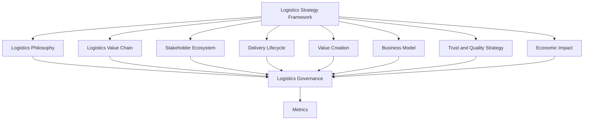

### Delivery Value Chain

See Logistics Value Chain section above — reproduced here by reference per Single Source of Truth, never duplicated.

### Delivery Lifecycle

See Delivery Lifecycle section above.

### Logistics Ecosystem Map

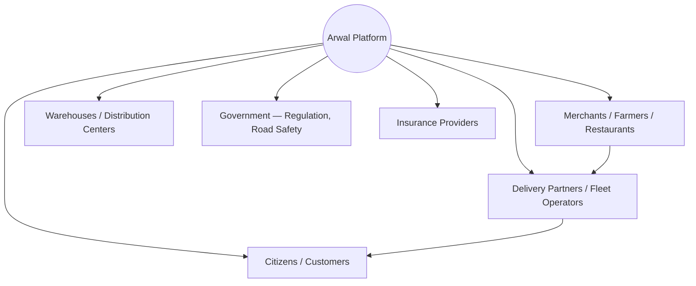

### Economic Impact Model

See Economic Impact section above.

### Logistics Growth Flywheel

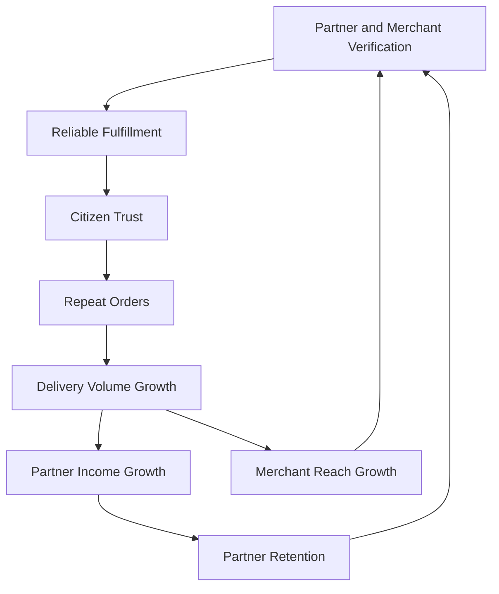

### Executive Dashboards

| Dashboard | Audience | Key Content |
|---|---|---|
| **CEO Dashboard** | CEO | Logistics Ecosystem Health Score, On-Time Delivery Rate trend, Trust Score |
| **Chief Logistics Officer Dashboard** | Chief Logistics Officer | Successful Deliveries, Partner Satisfaction, category-level performance |
| **Trust & Safety Dashboard** | Head of Trust & Safety | Dispute Rate, fraud-incident trend, safety-incident trend |
| **Category Dashboards** | Category Heads | Category-specific delivery time, cost, and satisfaction |

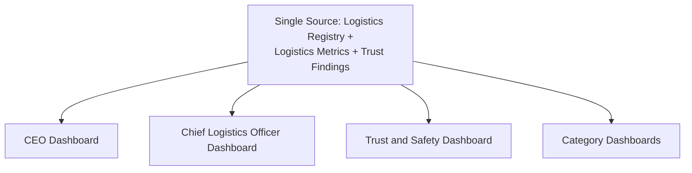

### Decision Matrix

| Decision Type | Approval Authority |
|---|---|
| New delivery region/category activation | Logistics Council + CEO |
| Verification standard change | Logistics Council + Head of Trust & Safety |
| New delivery fee structure | Logistics Council + Revenue Review Board |
| Fleet operator partnership terms | Logistics Council + Head of Merchant Success |
| Emergency safety/integrity response | Head of Trust & Safety, ratified within 5 business days |

---

# Closing Statement

> **Callout — Closing Statement**
> Every prior document in this handbook explains what Arwal builds, how it sustains itself, and the trust it earns across every vertical. This document explains the promise underneath all of those promises: that when a citizen confirms an order, the thing they ordered will actually arrive — on time, intact, and exactly as agreed. A verified merchant, a fair price, and a trustworthy platform mean nothing in the moment a citizen is left waiting for a package that never comes. Logistics is not a supporting function bolted onto commerce; it is the connective tissue holding every vertical's promise together, and its failure is the most visible, most personal failure a citizen can experience. Arwal grows this network at the pace reliability, safety, and fair partner treatment can genuinely sustain, never faster, because a generation-long civic-commercial platform cannot be built on a delivery promise it cannot keep. Where a future phase must deviate from a principle stated here, that deviation is made explicitly — through the Logistics Governance process above — never silently, and never by default.

This document, `ai-docs/73-logistics-delivery-strategy.md`, is Phase 74 of approximately 415. Every future fulfillment, delivery-partner, and last-mile decision is expected to trace back to a principle defined here, or to justify its deviation in writing.

**End of Phase 74 — `ai-docs/73-logistics-delivery-strategy.md`**