# Payments & Financial Services Strategy

**Document:** `ai-docs/74-payments-financial-services-strategy.md`
**Project:** Arwal — The District Super App
**Stage:** 2 — Product & Business Strategy
**Phase:** 75 — Payments & Financial Services Strategy
**Status:** Approved for Product & Engineering Reference
**Audience:** CEO, CSO, CPO, CFO, Chief Payments Officer, Enterprise Business Architects, FinTech Consultants, Digital Payments Strategists, Government Financial Systems Consultants, Trust & Safety Strategists, Risk & Compliance Advisors, Investors

> **Callout — Purpose of This Document**
> `ai-docs/00-project-vision.md` through `ai-docs/73-logistics-delivery-strategy.md` established why Arwal exists, what it can do, who it serves, how it sustains itself, how it partners with government, the whole district ecosystem it operates inside, and how every vertical — commerce, services, agriculture, healthcare, education, employment, property, and logistics — builds trust and value on the platform. None of those documents answers the question that sits beneath every single one of them the moment money actually needs to move: **why should a citizen, a farmer, a merchant, or a delivery partner trust Arwal with the movement of their money — and will that money always, provably, arrive where it is supposed to?** This document is that answer — the authoritative Payments & Financial Services Strategy every future transaction, settlement, payout, and financial-trust decision traces back to.

---

# Purpose of this Document

### Why Payments Require Their Own Strategic Layer

Every vertical strategy document in this handbook — `ai-docs/65` through `ai-docs/73` — ultimately depends on one shared, invisible layer: money actually moving, correctly, on time, and verifiably, between two parties who may have never met. A farmer's fair price (`ai-docs/68`), a merchant's settlement (`ai-docs/67`), a delivery partner's earnings (`ai-docs/73`), and a citizen's certificate fee (`ai-docs/63`) all terminate in the same place — a payment that either builds trust or destroys it. This document exists because payments are not a checkout feature bolted onto commerce; they are the financial nervous system of the entire platform, and every other vertical's promise is only as credible as this system's integrity.

### Why This Is a Business Strategy Document, Not a Payments Implementation

This document contains no gateway integration, no UPI specification, no ledger schema, no accounting system design, and no banking-core architecture. It does not redefine Domains (`ai-docs/53`), Capabilities (`ai-docs/55`), Modules (`ai-docs/54`), Journeys (`ai-docs/56`), Processes (`ai-docs/57`), or Rules (`ai-docs/58`) — Payment Processing (CAP-027), Refund Management (CAP-028), Wallet (MOD-032), and their governing rules (RULE-018, RULE-019) remain fully authoritative and are cited, never restated. This document's exclusive territory is: **the strategic reasoning behind why payments matter, who participates in the financial ecosystem, how value and trust are created across it, and how that ecosystem is governed, protected, and grown across a generation.**

### The Chain of Reasoning This Document Extends

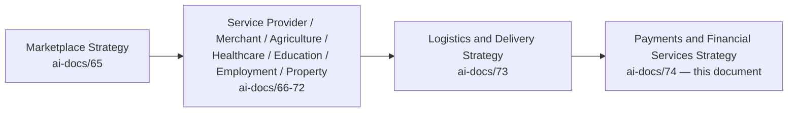

| Layer | Question It Answers |
|---|---|
| Marketplace Strategy | How does a two-sided market work, generally? |
| Vertical Business Models (`ai-docs/66`–`72`) | How does Arwal earn each sector's trust with their livelihood, health, future, work, or home? |
| Logistics & Delivery Strategy | How does Arwal make good on every promise by physically moving what was ordered? |
| **Payments & Financial Services Strategy** (this document) | **How does Arwal make good on every promise by moving the money behind it — safely, transparently, and fairly?** |

### Why Payments Are the Trust Layer Beneath Every Other Layer

A citizen who is deceived once by a payment failure — a double charge, a lost refund, an unexplained deduction — does not merely distrust that single transaction. Per the Shared Trust dependency already established in `ai-docs/64-district-ecosystem-mapping.md`, that distrust radiates into every other vertical simultaneously, because every vertical shares the same wallet, the same settlement rail, and the same citizen identity. Payments is therefore the single highest-leverage trust surface on the entire platform: get it right, and it silently reinforces every other promise; get it wrong once, and it silently undermines all of them at once.

### How Financial Trust Enables District-Wide Commerce

A district's economy today runs substantially on cash — opaque, unreconciled, and disconnected from any verifiable history. A citizen who can trust that a digital payment settles exactly once, for exactly the right amount, with an immutable and disputable record, is a citizen willing to transact with a stranger they would never have paid cash to. Multiplied across a district, this is the difference between an economy limited by personal networks and an economy limited only by genuine supply and demand.

### Relationship Between Every Participant

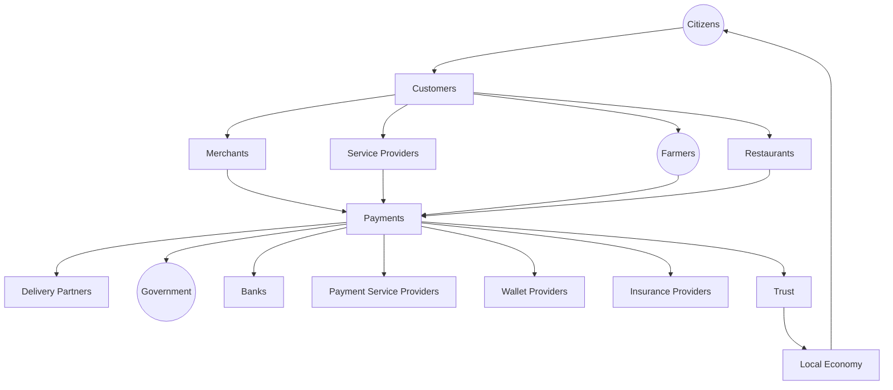

### Scope Boundary

This document does not define a payment gateway's technical contract, does not specify a ledger's data model, and does not redraft any financial regulation — those remain either Arwal's own technical architecture (`ai-docs/03`, `ai-docs/09`, `ai-docs/55`) or regulatory authority (`ai-docs/10`, `ai-docs/40`, `ai-docs/58`), cited but never redefined here. This document's territory is strategic and economic: the business model, the stakeholder relationships, the value chain, and the governance that makes Arwal's financial layer trustworthy and durable.

---

# Payments Philosophy

Every principle below exists because a payments strategy designed carelessly does not fail abstractly — it fails a specific citizen double-charged for a hospital booking, a specific farmer whose sale payment never arrives, or a specific delivery partner whose earnings are silently short.

### Citizen First
**Why it exists:** Every payments decision is judged first against whether it protects the citizen sending or receiving money, mirroring the identical Citizen-First tie-breaker already established throughout `ai-docs/51` through `ai-docs/73`. A settlement-cycle convenience for Arwal is never optimized ahead of a citizen's certainty that their money is safe.

### Financial Trust
**Why it exists:** Money is the one thing a citizen will not risk twice on an unfamiliar platform. Financial Trust is not a byproduct of good UX — it is the precondition every other commitment in this document is built on top of.

### Security by Default
**Why it exists:** A payments system that is secure "eventually," after growth, has already accepted an unacceptable window of exposure. Every financial flow starts in its most restrictive, most protected state, per the identical Secure by Default principle already established in `ai-docs/10-security-standards.md`.

### Transparency
**Why it exists:** A citizen or merchant must be able to see exactly what a transaction cost, why it was deducted, and where their money currently stands — concealment in a financial context breeds exactly the suspicion `ai-docs/60-customer-experience-strategy.md` already rejects, amplified by the stakes of money itself.

### Privacy
**Why it exists:** Payment-instrument and transaction data is among the most sensitive categories of information a citizen will ever share, per `ai-docs/10-security-standards.md`'s Restricted-tier classification — used only for a stated, consented purpose, never repurposed or exposed beyond it.

### Accessibility
**Why it exists:** A meaningful share of Arwal's population is unbanked, underbanked, or a first-generation digital-payment user. Voice-first confirmation, low-friction OTP authorization, and offline-tolerant design are the floor, never an enhancement.

### Affordability
**Why it exists:** A fee structure that prices out a low-income citizen or a small merchant from digital payment entirely defeats the Financial Inclusion mandate this entire strategy exists to serve.

### Compliance
**Why it exists:** Arwal is a custodian of citizen money and financial data at a scale where a compliance failure is not a technical incident — it is a direct breach of the civic trust `ai-docs/00-project-vision.md` commits the platform to never trade away.

### Financial Inclusion
**Why it exists:** A citizen without a prior formal banking relationship is a legitimate participant, not a lesser one — verification-tiered access (per RULE-019) exists to bring such a citizen in safely, never to exclude them by default.

### Fair Transactions
**Why it exists:** The same transaction rules apply to every citizen and every merchant regardless of size, tenure, or revenue contribution — a payments system that quietly favors a large merchant over a small one has abandoned Marketplace Neutrality (`ai-docs/65`) at the exact layer where fairness is most measurable.

### Accountability
**Why it exists:** Every movement of money is traceable to a specific, attributable, auditable event — a payment that cannot later be reconstructed and explained is a payment Arwal cannot defend to a citizen, an auditor, or a regulator.

### Long-Term Sustainability
**Why it exists:** Arwal's payments strategy is evaluated on a multi-year, generational horizon — a single quarter's transaction-volume growth is not success if the underlying security, compliance, or trust were compromised to produce it, mirroring the Long-Term Sustainability principle already established in `ai-docs/62-revenue-sustainability-strategy.md`.

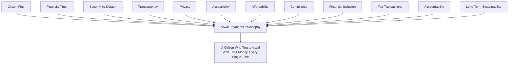

> **Callout — The One-Sentence Payments Philosophy**
> *"A citizen risks real money on every single transaction — Arwal's only justification for standing between two parties' money is that it makes that risk provably, verifiably worth taking, every time, without exception."*

---

# Payment Value Chain

| Stage | Business Description |
|---|---|
| **Payment Initiation** | A citizen, merchant, or government payer commits to a transaction — a purchase, a booking, a fee — generating a payment intent. |
| **Authentication** | The initiating party's identity is confirmed via the platform's unified Authentication layer, never a payments-specific parallel mechanism. |
| **Authorization** | The citizen explicitly confirms the specific amount and purpose of the payment, typically via OTP, before any money moves. |
| **Payment Processing** | The transaction is executed through the platform's payment infrastructure, idempotency-protected so a retry never produces a duplicate charge. |
| **Confirmation** | Both parties receive an immediate, unambiguous confirmation of success or failure — never an ambiguous, unresolved state. |
| **Settlement** | Funds are reconciled and made available to the receiving party (a merchant, a provider, a farmer) per a transparent, disclosed schedule. |
| **Revenue Distribution** | Arwal's own disclosed commission or facilitation fee, where applicable, is separated transparently from the amount settled to the receiving party. |
| **Refunds** | An approved refund is processed against the original transaction, itemized and traceable, never issued as an unexplained adjustment. |
| **Dispute Resolution** | A contested transaction is investigated fairly, per the same Trust & Safety discipline applied across every other vertical. |
| **Financial Reporting** | Every party — citizen, merchant, government partner, and Arwal's own finance function — can access an accurate, current record of their own transaction history. |
| **Continuous Improvement** | Every stage's performance and dispute data feeds back into the next cycle's fraud, pricing, and reliability planning. |

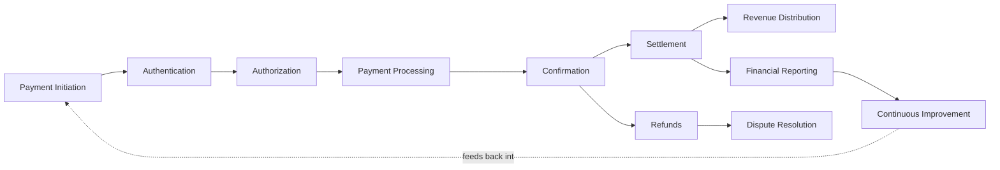

---

# Stakeholder Ecosystem

| Stakeholder | Strategic Role |
|---|---|
| **Citizens** | The population whose trust in every payment determines whether the entire platform is worth using at all. |
| **Customers** | Citizens in the specific moment of paying for a good, a service, or a civic fee. |
| **Merchants** | Recipients of settlement for completed orders, per `ai-docs/67-merchant-ecosystem.md`. |
| **Service Providers** | Recipients of payment for completed bookings, per `ai-docs/66-service-provider-ecosystem.md`. |
| **Delivery Partners** | Recipients of transparent, verifiable earnings, per `ai-docs/73-logistics-delivery-strategy.md`. |
| **Banks** | Settlement-infrastructure partners underlying every fund movement on the platform. |
| **Payment Service Providers** | Gateway and processing partners, selected and retained per the Provider Independence discipline in `ai-docs/09-tech-stack.md`. |
| **Wallet Providers** | Infrastructure partners underlying Arwal's own Wallet capability, where a third-party rail is used. |
| **Government** | Both a payer (fee facilitation) and a regulatory authority whose financial-services obligations Arwal exceeds, never merely meets. |
| **Finance Teams** | Arwal's own internal function reconciling and reporting on every transaction across the platform. |
| **Insurance Providers** | Partners offering transaction-protection and payment-related risk coverage. |
| **Auditors** | Internal and external reviewers verifying that every financial claim this document makes is backed by evidence, per `ai-docs/40-engineering-compliance-audit-standards.md`. |
| **Future Financial Participants** | Micro-lending partners, credit-assessment providers, and second-district financial institutions, evaluated per the Payment Lifecycle's Relationship Continuation stage below. |

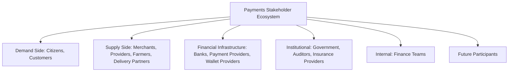

---

# Payment Lifecycle

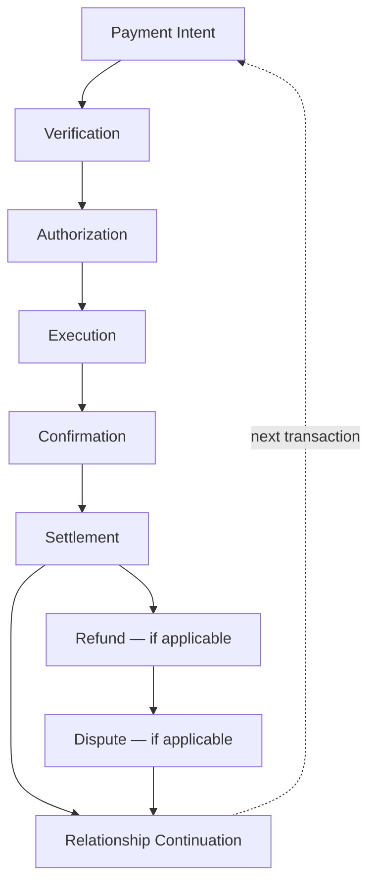

| Stage | Meaning |
|---|---|
| **Payment Intent** | A citizen commits to a transaction requiring money movement. |
| **Verification** | The paying party's identity and, where relevant, wallet-tier limits are confirmed, per RULE-019. |
| **Authorization** | The citizen explicitly confirms the amount and purpose. |
| **Execution** | The transaction is processed, idempotency-protected. |
| **Confirmation** | Both parties see an immediate, unambiguous outcome. |
| **Settlement** | Funds reach the receiving party per a disclosed schedule. |
| **Refund** | Where applicable, a refund is processed against the original transaction. |
| **Dispute** | Where contested, a fair, evidence-based review resolves the disagreement. |
| **Relationship Continuation** | A trustworthy transaction compounds into the citizen's willingness to transact again, cycling back to Payment Intent. |

---

# Value Creation

| Question | Answer |
|---|---|
| **How do citizens create value?** | By trusting the platform enough to transact digitally rather than reverting to cash, generating the transaction volume every other participant depends on. |
| **How do merchants and providers create value?** | By fulfilling their side of the transaction honestly, making settlement something Arwal can confidently guarantee. |
| **How do financial institutions create value?** | By providing the settlement and compliance infrastructure Arwal itself could not responsibly build and operate alone. |
| **How does Arwal create value?** | By converting an opaque, cash-dependent local economy into a transparent, verifiable, dispute-protected digital financial layer no single participant could assemble alone. |
| **How does trust develop?** | Through Identity Verification (CAP-001), idempotency-protected Payment Processing (RULE-018), and immutable Audit Logging (CAP-035), compounding as citizens experience repeated, correct settlements. |
| **How does transaction confidence increase?** | Through consistent, predictable outcomes — the same request always produces the same category of result, never arbitrary variance between two citizens in the same situation. |
| **How does district commerce grow?** | Through reduced friction on every other vertical's transaction, per the Economic Flywheel already established in `ai-docs/62-revenue-sustainability-strategy.md` — payments is the mechanism, not the destination, of that flywheel. |

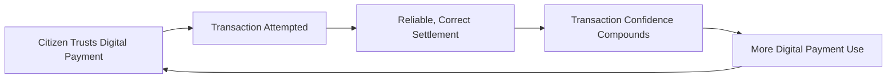

---

# Business Model

Every capability below is described strategically — its business rationale — never as an implementation. The enforceable capability logic is owned entirely by `ai-docs/55-business-capability-map.md`'s CAP-027 and CAP-028.

| Capability | Business Rationale |
|---|---|
| **Digital Payments** | The single, unified money-movement layer underlying every transacting vertical on the platform. |
| **Wallet Strategy** | A citizen's, merchant's, or provider's single account for balance and transaction history, with limits scaling to verification tier, per RULE-019. |
| **Government Payments** | Fee facilitation for civic services, structured so a citizen never pays Arwal for access to a civic right — the commercial relationship sits with the government partner. |
| **Merchant Settlements** | Timely, itemized payout to merchants for completed, verified orders. |
| **Service Provider Payouts** | Timely, itemized payout to providers for completed, verified bookings. |
| **Delivery Partner Payouts** | Transparent, verifiable earnings settlement, never opaque payout math. |
| **Refund Management** | A structured, evidence-gated process ensuring every refund traces to an approved decision, per RULE-013. |
| **Escrow Principles** | Where a transaction's stakes warrant it (a high-value property transaction, an advance service payment), funds are held under a transparent, disclosed release condition rather than transferred prematurely. |
| **Subscription Payments** | Recurring billing for optional premium merchant or provider tooling, per `ai-docs/62-revenue-sustainability-strategy.md`'s Merchant Subscriptions stream. |
| **Financial Reporting** | Accurate, accessible transaction history for every citizen, merchant, and government partner. |
| **Transaction History** | A permanent, citizen-visible record supporting trust, dispute resolution, and personal financial awareness. |
| **Payment Notifications** | Timely, preference-honored confirmation and status updates through Notifications (CAP-031). |

```mermaid
graph TD
    BizModel[Payments Business Model] --> DigitalPay[Digital Payments]
    BizModel --> WalletStrat[Wallet Strategy]
    BizModel --> GovPay[Government Payments]
    BizModel --> MerchSettle[Merchant Settlements]
    BizModel --> ProvPayout[Service Provider Payouts]
    BizModel --> DelPayout[Delivery Partner Payouts]
    BizModel --> RefundMgmt[Refund Management]
    BizModel --> EscrowPrin[Escrow Principles]
    BizModel --> SubPay[Subscription Payments]
    BizModel --> FinReport[Financial Reporting]
    BizModel --> TxnHistory[Transaction History]
    BizModel --> PayNotif[Payment Notifications]
```

---

# Trust & Quality Strategy

| Mechanism | Strategic Role |
|---|---|
| **Identity Verification** | Every paying and receiving party's identity is confirmed before a financial role is granted, per CAP-001 and RULE-002. |
| **Payment Verification** | Every transaction carries a client-supplied idempotency key, processed at most once, per RULE-018. |
| **Fraud Prevention** | Continuous, AI-assisted, always human-confirmed anomaly detection on transaction patterns, per CAP-038 and RULE-024. |
| **Secure Transactions** | RS256 JWT authentication and PCI-adjacent handling standards applied to every payment, per `ai-docs/10-security-standards.md`. |
| **Privacy Protection** | Payment-instrument data is Restricted-tier, never logged in plaintext, per RULE-025's Data Retention standard. |
| **Consent Management** | Explicit, granular, revocable consent governs every payment-adjacent data flow, per RULE-003. |
| **Financial Transparency** | Every fee, commission, and deduction is disclosed before a citizen confirms a transaction, never revealed only after the fact. |
| **Complaint Resolution** | A structured, evidence-based path to a fair outcome for every disputed transaction, per CAP-036 and RULE-013. |
| **Government Coordination** | Financial-services compliance obligations are reviewed jointly with applicable regulatory authority before launch, per `ai-docs/01-product-goals.md`'s Regulatory Constraint. |
| **Financial Trust** | Every mechanism above compounds into one felt outcome: a citizen who believes their money is safe every single time, never merely "usually." |

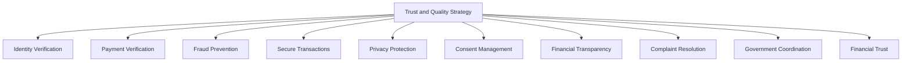

> **Callout — Payment Idempotency Is the Single Most Load-Bearing Guarantee on the Platform**
> Per RULE-018, a payment is processed at most once per unique idempotency key, with no exception. A citizen double-charged even once, through no fault of their own, carries that specific memory into every future interaction with Arwal — this guarantee is treated with the same absolute, non-negotiable severity as any Mission Critical safety rule elsewhere in this handbook.

---

# Economic Impact

| Impact Area | How Arwal Contributes |
|---|---|
| **Increase Digital Payments** | Trustworthy, low-friction payment experiences convert cash-dependent transactions into a verifiable digital record. |
| **Support Local Commerce** | Reliable settlement removes a structural barrier every other vertical's growth depends on. |
| **Reduce Cash Dependency** | A citizen who trusts digital settlement no longer needs to carry, count, or risk physical cash for routine transactions. |
| **Improve Financial Inclusion** | Verification-tiered wallet access, per RULE-019, brings an unbanked or underbanked citizen into digital payments safely. |
| **Support MSMEs** | Predictable, itemized settlement gives a small merchant or provider financial visibility they may never have had before. |
| **Improve Revenue Transparency** | Merchants and providers gain a verifiable, disputable record of every payout, reducing the opacity of informal cash-based commerce. |
| **Generate Economic Growth** | Reduced transaction friction expands the volume and confidence of every other vertical's economic activity. |
| **Strengthen District Economy** | A trusted financial layer is itself district-scale infrastructure, reinforcing `ai-docs/64`'s District Development Strategy the same way a reliable currency or banking system does at a national scale. |

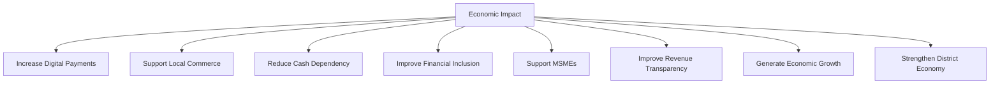

---

# Governance

### Ownership
Payments & Financial Services Strategy ownership sits with the Chief Payments Officer (or CFO where the role is combined), with Merchant Settlements, Provider Payouts, and Government Payments each accountable to a named sub-owner, mirroring the Clear Ownership discipline already established throughout `ai-docs/53` through `ai-docs/73`.

### Payments Council
A standing **Payments Council** — chaired by the Chief Payments Officer, with the CFO, Head of Trust & Safety, Compliance Officer, CPO, and rotating merchant and provider representatives as members — holds approval authority over any platform-wide fee-structure change, any new financial-services capability, and any material deviation from the Anti-Patterns below. The Council meets monthly, with ad hoc sessions for a Payments Ecosystem Health Score regression.

### Decision Authority

| Decision | Approves |
|---|---|
| New financial-services capability (e.g., escrow, subscriptions) | Payments Council + CEO |
| Fee or commission structure change | Payments Council + Revenue Review Board (`ai-docs/62`) |
| Settlement schedule change | Payments Council + CFO |
| New payment-provider or banking partnership | Payments Council + CFO, per `ai-docs/09-tech-stack.md`'s Vendor Lock-In Considerations |
| Emergency financial-integrity response (e.g., a fraud wave, a settlement failure) | CFO, immediate, ratified by Council within 5 business days |

### Review Cadence

| Review | Cadence | Owner |
|---|---|---|
| Payments Ecosystem Health Review | Monthly | Payments Council |
| Settlement Performance Review | Quarterly | CFO, Chief Payments Officer |
| Annual Payments Strategy Review | Annual | CEO, CFO, Chief Payments Officer, CPO |

### Conflict Resolution
A payment dispute between a citizen and a merchant or provider follows PROC-013 and RULE-013 in full; a party's disagreement with a platform decision follows the identical Appeal right already established in RULE-028, reviewed by an independent reviewer distinct from the original decision-maker.

### Continuous Improvement
Every review above feeds a shared, tracked improvement backlog — a recurring settlement delay pattern, a fraud vector, or a merchant-suggested transparency improvement — reviewed and prioritized at the next Payments Ecosystem Health Review, never left to informally resolve itself.

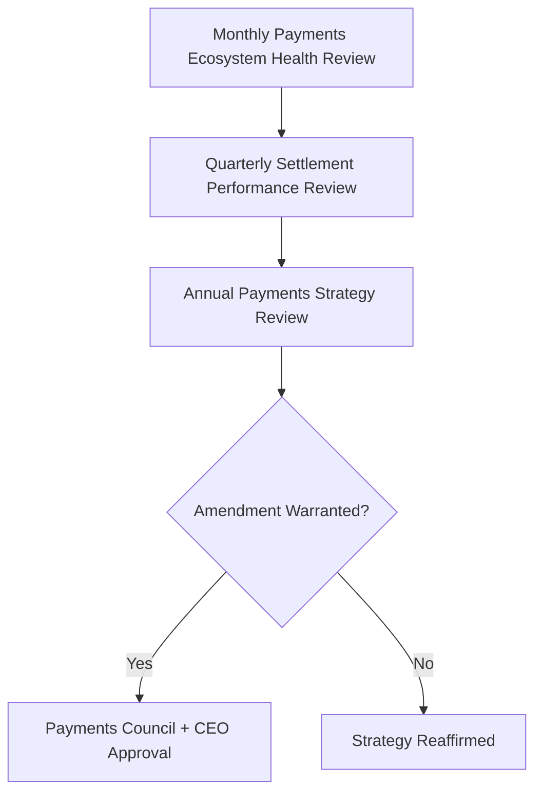

---

# Risks

| Risk | Description | Mitigation |
|---|---|---|
| **Payment Fraud** | A manipulated or fraudulent transaction attempt. | Fraud Detection (CAP-038), four-eyes enforcement per RULE-027. |
| **Identity Theft** | A stolen or spoofed identity used to authorize a payment. | Identity Verification (CAP-001), RS256 JWT-authenticated sessions per `ai-docs/10-security-standards.md`. |
| **Unauthorized Transactions** | A payment executed without genuine citizen authorization. | Mandatory OTP-based Authorization stage; idempotency-protected Execution. |
| **Settlement Failure** | A merchant or provider payout fails to reach them correctly or on time. | Transparent settlement schedules; Financial Reporting visibility; escalation per RULE-013. |
| **Privacy Risks** | Payment-instrument or transaction data exposed beyond its consented purpose. | RULE-003's Consent Requirement; Restricted-tier classification per `ai-docs/10-security-standards.md`. |
| **Regulatory Changes** | A financial-services regulation shift invalidates an existing workflow assumption. | Configurable compliance review process, never a hardcoded assumption, per `ai-docs/01-product-goals.md`'s Regulatory Constraint. |
| **Financial Crime** | Money laundering or structured abuse of wallet limits. | Verification-tiered transaction limits per RULE-019; continuous anomaly monitoring. |
| **Digital Exclusion** | A citizen without formal banking access cannot participate in digital payments. | Verification-tiered wallet access; voice-first, low-friction onboarding per Accessibility above. |
| **Trust Erosion** | A single mishandled payment incident damages trust across every vertical simultaneously. | Transparent, evidence-based dispute resolution; rapid, honest incident communication. |
| **Vendor Dependency** | Over-reliance on a single payment gateway, bank, or wallet provider. | Provider-agnostic architecture per `ai-docs/09-tech-stack.md`; evaluated exit paths for every critical financial vendor. |

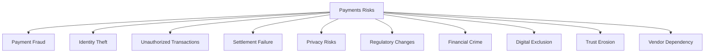

---

# Metrics

| Metric | Definition | Direction |
|---|---|---|
| **Successful Transactions** | Count of payments completing without failure. | Increasing |
| **Payment Success Rate** | % of initiated payments settling successfully. | Increasing |
| **Settlement Time** | Mean and p95 time from transaction confirmation to receiving-party settlement. | Decreasing |
| **Refund Resolution Time** | Mean time from an approved refund decision to funds returned. | Decreasing |
| **Merchant Satisfaction** | Merchant-reported CSAT for the settlement experience, per `ai-docs/60-customer-experience-strategy.md`. | Increasing |
| **Citizen Satisfaction** | Citizen-reported CSAT for the payment experience. | Increasing |
| **Trust Score** | District Trust Signal, viewed for payment interactions specifically. | Increasing |
| **Financial Inclusion Index** | Share of registered citizens with verification-tiered wallet access, across income and geography segments. | Increasing, approaching parity |
| **Payments Ecosystem Health** | A composite index combining Payment Success Rate, Trust Score, Dispute Rate, and Settlement Time. | Increasing |

> **Callout — No Payments Metric Stands Alone**
> Per the North Star Principle already established in `ai-docs/00-project-vision.md`, a rising Successful Transactions count alongside a falling Trust Score or rising Dispute Rate is treated as a regression — never counted as success in isolation.

---

# Anti-Patterns

| Anti-Pattern | Why It's Rejected |
|---|---|
| **Security after growth** | Deferring financial security investment until transaction volume justifies it accepts an unacceptable window of citizen exposure, violating Security by Default. |
| **Hidden charges** | An undisclosed fee or deduction violates Financial Transparency and destroys the trust every other mechanism depends on. |
| **Poor transparency** | A citizen unable to see why a deduction occurred cannot trust the outcome even when it is correct. |
| **Weak fraud controls** | Treating fraud detection as optional until an incident forces investment violates Financial Trust and Accountability. |
| **Technology without accessibility** | A payment flow only a digitally fluent, banked citizen can use has failed Financial Inclusion regardless of technical sophistication. |
| **Vendor lock-in** | Structuring Arwal's own financial rails so a single gateway or bank becomes existential leverage contradicts the Project Vision's rejection of proprietary lock-in. |
| **Ignoring compliance** | Treating a regulatory obligation as a later concern rather than a launch-blocking review violates Compliance and risks the platform's entire civic mandate. |
| **Growth without trust** | A rising transaction-volume metric alongside a falling Trust Score is a regression, never a win. |

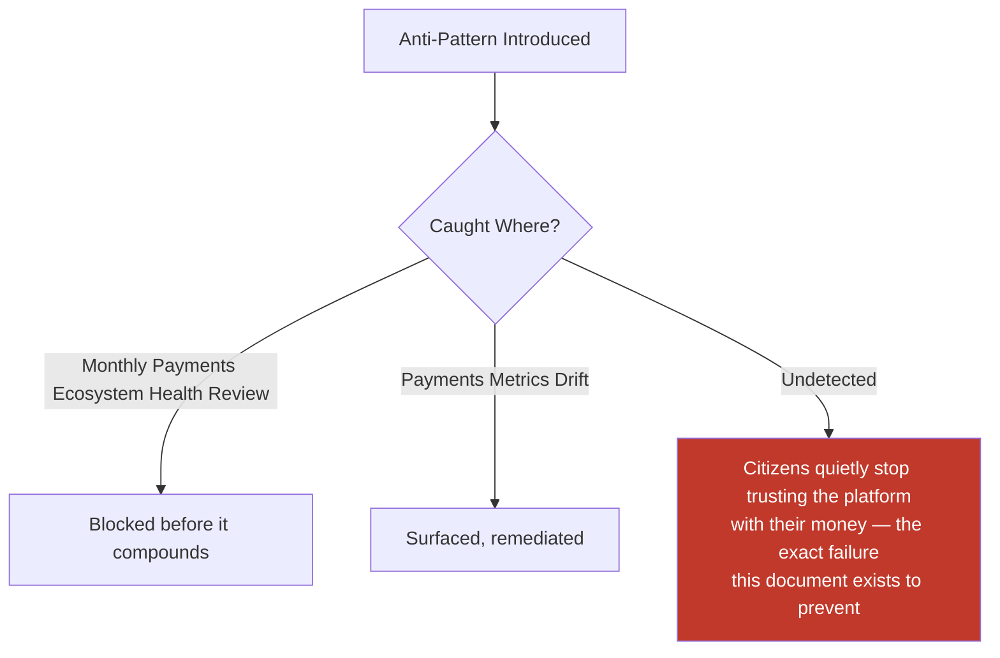

---

# Relationship to Previous Documents

| Prior Document | Relationship |
|---|---|
| **Project Vision (`ai-docs/00`)** | Establishes the founding Trust over Growth-at-all-costs pillar this document operationalizes at the financial layer specifically. |
| **Business Domain Model (`ai-docs/53`)** | Supplies the ownership structure behind the Payments domain (DOM-013). |
| **Business Capability Map (`ai-docs/55`)** | Supplies the stable abilities — Payment Processing (CAP-027), Refund Management (CAP-028) — this document's strategy is built directly on top of. |
| **Business Rules & Policies (`ai-docs/58`)** | Supplies the precise, enforceable logic (RULE-018, RULE-019, RULE-013) this document's every trust mechanism is bound by. |
| **Customer Experience Strategy (`ai-docs/60`)** | Supplies the "Calm, Not Vigilant" felt-experience bar every payment interaction must clear. |
| **Revenue & Sustainability Strategy (`ai-docs/62`)** | Supplies the Fair Monetization and fee-transparency safeguards this document's economic mechanisms are bound by. |
| **Marketplace Strategy (`ai-docs/65`)** | Supplies the general settlement-integrity standard this document specializes into a full financial-services strategy. |
| **Service Provider Ecosystem (`ai-docs/66`) and Merchant Ecosystem (`ai-docs/67`)** | Supply the payout-recipient stakeholder value exchange this document's Merchant Settlements and Provider Payouts mechanisms directly serve. |
| **Logistics & Delivery Strategy (`ai-docs/73`)** | Supplies the Delivery Partner earnings-transparency need this document's Delivery Partner Payouts mechanism directly serves. |

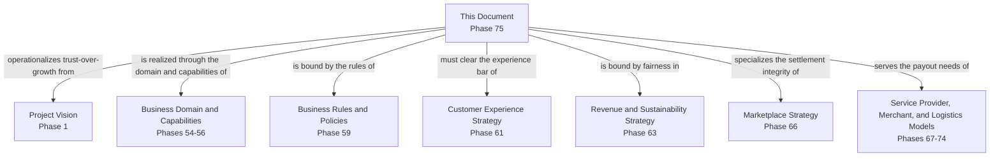

---

# Executive Artifacts

### Payments Strategy Framework

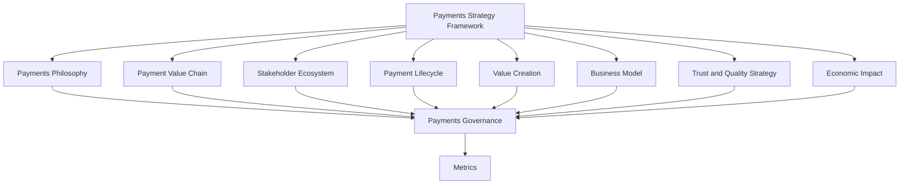

### Payments Value Chain

See Payment Value Chain section above — reproduced here by reference per Single Source of Truth, never duplicated.

### Payment Lifecycle

See Payment Lifecycle section above.

### Financial Ecosystem Map

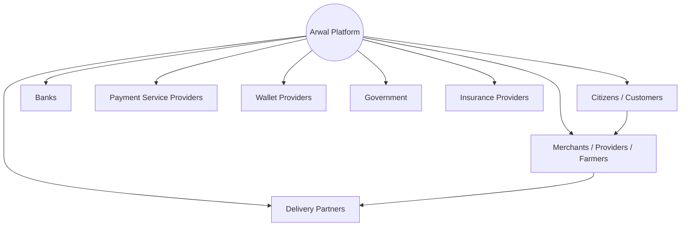

### Governance Model

See Governance section above.

### Economic Impact Model

See Economic Impact section above.

### Payments Growth Flywheel

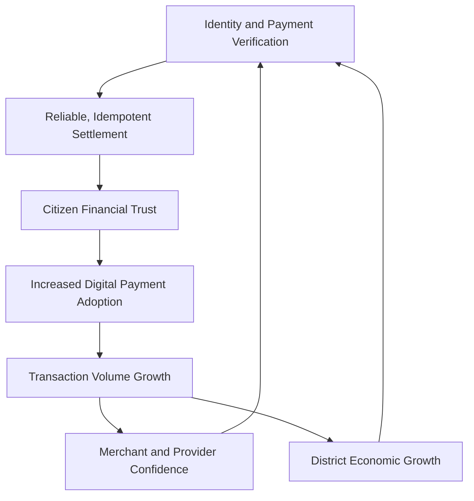

### Executive Dashboards

| Dashboard | Audience | Key Content |
|---|---|---|
| **CEO Dashboard** | CEO | Payments Ecosystem Health Score, Trust Score, Payment Success Rate trend |
| **CFO Dashboard** | CFO | Settlement Time, Financial Reporting accuracy, revenue reconciliation |
| **Chief Payments Officer Dashboard** | Chief Payments Officer | Successful Transactions, Merchant/Provider Settlement performance |
| **Trust & Safety Dashboard** | Head of Trust & Safety | Fraud-incident trend, Dispute Rate, verification turnaround |
| **Government Partners Dashboard** | Government liaisons | Government Payments facilitation performance, compliance status |

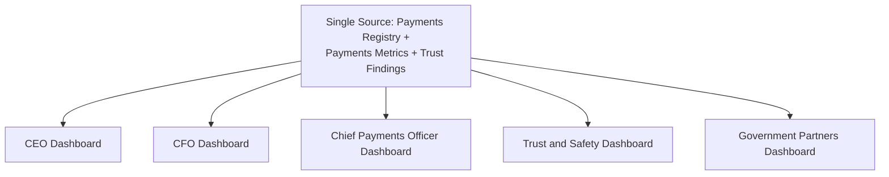

### Decision Matrix

| Decision Type | Approval Authority |
|---|---|
| New financial-services capability | Payments Council + CEO |
| Fee/commission structure change | Payments Council + Revenue Review Board |
| Settlement schedule change | Payments Council + CFO |
| New payment-provider/banking partnership | Payments Council + CFO |
| Emergency financial-integrity response | CFO, ratified within 5 business days |

---

# Closing Statement

> **Callout — Closing Statement**
> Every prior document in this handbook explains what Arwal builds, how it sustains itself, and the trust it earns across every vertical. This document explains the layer beneath all of those promises: the movement of money itself, which either quietly confirms every other trust the platform has built, or quietly undermines all of it at once. A citizen does not experience "payments" as a distinct feature — they experience it as the moment their certificate fee, their grocery order, their child's tuition payment, or their harvest sale either goes exactly as promised or does not. Arwal's only justification for standing in that moment is that it makes the risk of trusting a stranger with money honestly, provably worth taking, every single time, without exception. A payments strategy grown too fast, secured too loosely, or governed too unevenly does not merely underperform — it breaks the one trust every other vertical's promise depends on, and it does so instantly and everywhere at once. Arwal grows this financial layer at the pace security, compliance, and citizen trust can genuinely sustain, never faster, because a generation-long civic-commercial platform cannot be built on a financial promise it cannot keep. Where a future phase must deviate from a principle stated here, that deviation is made explicitly — through the Payments Governance process above — never silently, and never by default.

This document, `ai-docs/74-payments-financial-services-strategy.md`, is Phase 75 of approximately 415. Every future transaction, settlement, payout, and financial-trust decision is expected to trace back to a principle defined here, or to justify its deviation in writing.

**End of Phase 75 — `ai-docs/74-payments-financial-services-strategy.md`**