# Community & Social Engagement Strategy

**Document:** `ai-docs/75-community-social-engagement-strategy.md`
**Project:** Arwal — The District Super App
**Stage:** 2 — Product & Business Strategy
**Phase:** 76 — Community & Social Engagement Strategy
**Status:** Approved for Product & Engineering Reference
**Audience:** CEO, CSO, CPO, Chief Community Officer, Enterprise Business Architects, Civic Engagement Strategists, Community Development Specialists, Digital Community Platform Consultants, Government Partnership Specialists, Trust & Safety Strategists, Privacy & Compliance Advisors, Investors

> **Callout — Purpose of This Document**
> `ai-docs/00-project-vision.md` through `ai-docs/74-payments-financial-services-strategy.md` established why Arwal exists, what it can do, who it serves, how it sustains itself, how it partners with government, the whole district ecosystem it operates inside, and how every commercial and civic vertical builds trust and value. None of those documents answers a question that sits beside all of them, not beneath them: **how does a district's own social fabric — its families, neighborhoods, village leaders, NGOs, volunteers, and civic institutions — actually get stronger because Arwal exists, rather than merely transacted through?** This document is that answer — the authoritative Community & Social Engagement Strategy every future community, civic-participation, and social-trust decision traces back to.

---

# Purpose of this Document

### Why Community Is a Distinct Strategic Concern, Not a Feature of Commerce

Every prior Stage 2 document treats a citizen as a participant in an exchange — a buyer, a patient, an applicant, a payer. This document treats a citizen as a member of something older and more durable than any transaction: a family, a neighborhood, a village, a district. A district's social fabric — the relationships between a Resident Welfare Association and its residents, a village elder and a young farmer, an NGO and the population it serves — existed long before Arwal and will matter long after any single feature is forgotten. This document exists because a platform that only ever sees a citizen as a transacting party has missed half of what makes a district function, and has missed entirely the reason `ai-docs/00-project-vision.md` calls Arwal "a unified digital civilization layer" rather than a marketplace.

### This Is Not a Social Media Platform, a Messaging App, or a Feed Algorithm

This document contains no chat implementation, no feed-ranking logic, no recommendation engine, and no API. It does not redefine Community (DOM-014), Group & Cooperative Enablement (CAP-043), or Community Engagement (CAP-044) — each is cited from `ai-docs/53-business-domain-model.md` and `ai-docs/55-business-capability-map.md`, never restated. Arwal's community capability is deliberately not built to maximize time-on-app, virality, or engagement-for-its-own-sake — a pattern this document explicitly and repeatedly rejects, per Community Before Virality below. This document's exclusive territory is: **why community engagement is a strategic capability, who participates, how trust and value are created among them, and how that participation is governed, protected, and grown for a generation.**

### Why Community Engagement Is a Strategic Capability, Not a Feature

Per `ai-docs/64-district-ecosystem-mapping.md`'s Ecosystem Philosophy, Arwal's health rises or falls with the health of the whole district system it operates inside — and no part of that system is more foundational, or more fragile, than the trust between neighbors. A citizen who trusts their own Resident Welfare Association, their own village's Self-Help Group, or their own local NGO is a citizen predisposed to trust a new civic-commercial platform introduced through those same trusted channels. Conversely, a platform that ignores or bypasses existing community structures — instead of strengthening them — risks being seen as an outside intrusion rather than a genuine extension of district life. Community & Social Engagement Strategy exists to make that choice — strengthen, never bypass — a deliberate, governed commitment.

### The Chain of Reasoning This Document Extends

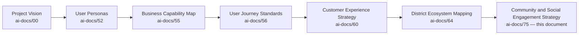

| Layer | Question It Answers |
|---|---|
| Project Vision | Why does a unified civic-commercial platform need to exist? |
| User Personas | Who, specifically, does Arwal serve? |
| Business Capability Map | What can Arwal do? |
| Customer Experience Strategy | What must every citizen feel, cumulatively? |
| District Ecosystem Mapping | What is the whole living system Arwal operates inside? |
| **Community & Social Engagement Strategy** (this document) | **How does the district's own social fabric — families, neighborhoods, NGOs, volunteers, civic institutions — grow measurably stronger because Arwal exists?** |

### Scope Boundary

This document does not define a content-moderation queue's technical workflow (owned by PROC-016 in `ai-docs/57-business-process-standards.md`), a group's registration data model (owned by CAP-043), or a notification's delivery mechanics (owned by CAP-031). Its territory is strategic: the business case for community as a capability, the participant relationships, the value chain, and the governance that keeps community participation safe, inclusive, and genuinely civic — never merely engagement-maximizing.

---

# Community Philosophy

Every principle below exists because a community strategy designed carelessly does not fail abstractly — it fails a specific village elder ignored, a specific NGO's beneficiary reach never amplified, or a specific citizen harassed into silence in a space meant to include them.

### Citizen First
**Why it exists:** Every community decision is judged first against whether it serves the citizen participating, never an internal engagement metric, mirroring the identical Citizen-First tie-breaker already established throughout `ai-docs/51` through `ai-docs/74`.

### Community Before Virality
**Why it exists:** A platform that rewards the loudest or most provocative content over the most genuinely useful one has optimized for the wrong outcome. Arwal's community capability is deliberately not tuned to maximize reach or reaction volume — it is tuned to help a real neighborhood solve a real problem together, per the explicit rejection of feed-algorithm dynamics stated in this document's Purpose.

### Trust Before Reach
**Why it exists:** A community feature that grows fast but untrusted has manufactured the appearance of engagement while destroying the actual mechanism community participation depends on — a citizen's confidence that the space is safe, moderated, and genuinely theirs.

### Respect
**Why it exists:** A community interaction that demeans, mocks, or dismisses a citizen — especially one already vulnerable, per `ai-docs/52-user-personas-user-segmentation.md`'s Vulnerable-tagged personas — has failed regardless of how much participation it generated.

### Inclusiveness
**Why it exists:** A community strategy that only serves digitally fluent, urban, literate citizens has captured a fraction of the actual community life a district contains, per the Inclusion over Optimization founding pillar in `ai-docs/00-project-vision.md`.

### Accessibility
**Why it exists:** Voice-first participation, low-literacy-friendly content structure, and field-agent-mediated group participation are the floor for community features, never a later accommodation, per `ai-docs/12-accessibility-standards.md`'s non-negotiable standard.

### Constructive Participation
**Why it exists:** Community spaces exist to build something — a resolved local issue, a shared resource, a stronger collective — never merely to host disagreement for its own sake. A space that cannot distinguish constructive dissent from destructive conflict has failed its purpose.

### Transparency
**Why it exists:** A citizen must be able to see who moderates a community space, on what basis content is removed, and how a reported concern is handled — concealment in a community context breeds the same corrosive suspicion `ai-docs/60-customer-experience-strategy.md` already rejects at the individual-interaction level.

### Privacy
**Why it exists:** Community participation must never come at the cost of a citizen's or a group member's personal data being exposed beyond what they explicitly consented to share, per RULE-003's Consent Requirement Before Data Use.

### Safety
**Why it exists:** A community space is only as valuable as it is safe — harassment, misinformation, and fraud left unchecked convert a space meant to include citizens into one that excludes exactly the citizens most in need of it.

### Civic Responsibility
**Why it exists:** Arwal's community capability exists in service of the district's civic life, not as a parallel, disconnected social layer — every design choice is evaluated against whether it strengthens a citizen's genuine relationship to their own community and local governance.

### Long-Term Community Development
**Why it exists:** A community strategy optimized for this quarter's participation count at the cost of a neighborhood's long-term trust in the platform is optimized for the wrong horizon, mirroring the Long-Term Trust principle already established in `ai-docs/60-customer-experience-strategy.md`.

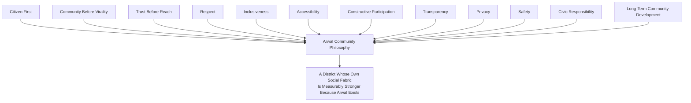

> **Callout — The One-Sentence Community Philosophy**
> *"Arwal does not build a community — it earns a place inside communities that already exist, and the only honest measure of success is whether those communities are stronger, safer, and more able to help each other a year from now than they were before Arwal arrived."*

---

# Community Value Chain

| Stage | Business Description |
|---|---|
| **Community Discovery** | A citizen finds a community relevant to them — their neighborhood, their village, their profession, their shared civic concern — through search or a trusted referral, never through an algorithmically manufactured feed. |
| **Participation** | A citizen engages in a community space at a level they are comfortable with — reading, following, or actively contributing. |
| **Contribution** | A citizen shares genuinely useful knowledge, reports a real local issue, or offers assistance to another member. |
| **Collaboration** | Multiple citizens, an NGO, and a local government department jointly work toward a shared outcome — a cleanup drive, a scheme awareness campaign, a resolved civic complaint. |
| **Knowledge Sharing** | A community accumulates and reuses collective know-how — a farmer's advice, a health precaution, a scheme's eligibility experience — that benefits every future member, not only the original contributor. |
| **Problem Reporting** | A citizen raises a genuine local issue in a way that is visible, tracked, and — where relevant — routed to the appropriate civic authority. |
| **Volunteer Activities** | Citizens and NGOs coordinate genuine, verifiable community service participation. |
| **Community Events** | Local gatherings, drives, and civic activities are organized and discoverable through the platform. |
| **Recognition** | Genuine, sustained contribution is acknowledged — never gamified into a popularity contest — reinforcing the value of constructive participation. |
| **Trust Building** | Every successful, safe, well-moderated interaction compounds into a citizen's willingness to participate more openly next time. |
| **Long-Term Engagement** | A citizen's relationship with their community on Arwal deepens over years, mirroring the multi-year horizon already established throughout `ai-docs/60` through `ai-docs/74`. |

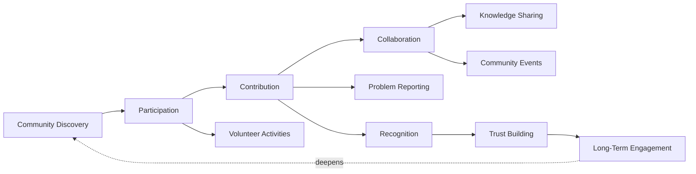

---

# Stakeholder Ecosystem

Every participant below traces to its full Stakeholder (`ai-docs/51`) and, where applicable, Persona (`ai-docs/52`) record; this section states only the participant's community-strategy role.

| Stakeholder | Strategic Role |
|---|---|
| **Citizens** | The foundational participants whose trust and constructive engagement determine whether any community space is worth being part of. |
| **Families** | The household unit through which access, device-sharing, and delegated participation actually occur, per `ai-docs/52`'s Delegated & Assisted Access patterns. |
| **Communities** | Neighborhood, village, or interest-based groupings citizens naturally form part of, whether or not they are formally registered on Arwal. |
| **Neighborhood Groups** | Hyperlocal, geography-anchored citizen groupings, often the first and most trusted layer of civic organization. |
| **Village Communities** | Rural, geography-anchored populations whose collective needs — market access, scheme awareness, safety — are frequently shared and best addressed together. |
| **Resident Welfare Associations** | Formally or informally organized urban/semi-urban resident bodies representing a defined local population's shared civic interests. |
| **NGOs** | Trust-building intermediaries extending Arwal's reach into underserved and vulnerable populations, per `ai-docs/64-district-ecosystem-mapping.md`'s Ecosystem Participants. |
| **Volunteers** | Citizens contributing time and effort to a community or civic cause, coordinated safely and verifiably through the platform. |
| **Businesses** | Local commercial participants whose community presence (a merchant sponsoring a local event, a shop supporting a drive) strengthens district-level trust beyond pure commerce. |
| **Educational Institutions** | Schools, colleges, and training institutes whose community-facing presence supports local knowledge-sharing and civic awareness. |
| **Healthcare Organizations** | Clinics and hospitals whose community-facing presence supports public-health awareness campaigns and safety communication. |
| **Government Departments** | Civic authorities using community channels for public announcements, awareness campaigns, and civic-participation coordination — never for unilateral, unaccountable messaging. |
| **Local Leaders** | Village heads, RWA presidents, and other recognized local figures whose endorsement and participation carry genuine trust weight within their own community. |
| **Community Moderators** | Trained, accountable individuals — internal Arwal staff or vetted local volunteers — responsible for the safety and constructive tone of a given community space. |
| **Civil Society** | The broader network of advocacy groups, cooperatives, and civic organizations whose participation strengthens district-wide accountability. |
| **Future Community Participants** | A second district's community structures, activated per `ai-docs/50-product-vision-business-strategy.md`'s Strategic Expansion Principles — never assumed transferable without fresh local trust-building. |

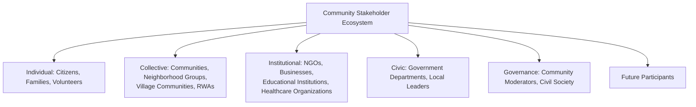

---

# Community Lifecycle

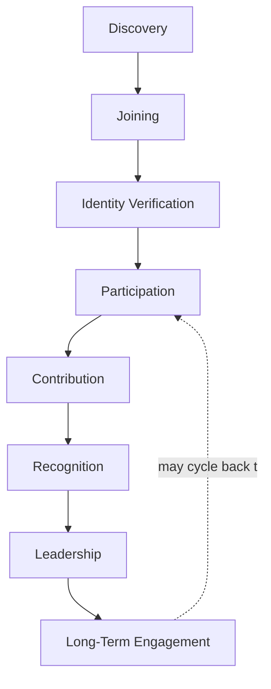

| Stage | Meaning |
|---|---|
| **Discovery** | A citizen becomes aware of a relevant community space through search, referral, or a trusted local channel — never a manufactured, algorithmically pushed feed. |
| **Joining** | A citizen opts in to a community, per their own explicit, consented action, per RULE-003. |
| **Identity Verification** | Per the community's own risk profile, a member's identity is confirmed to the extent that space's trust requirements demand, per CAP-001 — a civic-issue reporting group carries a different verification bar than a casual neighborhood discussion space. |
| **Participation** | The citizen reads, follows, or engages at a comfort level they choose. |
| **Contribution** | The citizen shares knowledge, reports an issue, or assists another member. |
| **Recognition** | Genuine, sustained, constructive contribution is acknowledged — never through a manipulable, popularity-driven mechanic. |
| **Leadership** | A trusted, consistently constructive member may be invited into a moderator or community-representative role. |
| **Long-Term Engagement** | The citizen's relationship with their community deepens over years, mirroring the Persona Lifecycle already established in `ai-docs/52-user-personas-user-segmentation.md`. |

---

# Value Creation

| Question | Answer |
|---|---|
| **How do citizens create value?** | By contributing genuine knowledge, honest problem reports, and constructive participation that helps another citizen in their own community. |
| **How do communities create value?** | By becoming a trusted, self-sustaining space where a member's question or concern is reliably met with a genuine, local, relevant response. |
| **How does government create value?** | By using community channels to reach citizens with accurate, timely civic information and to hear genuine local concern in return — a two-way channel, never a one-way broadcast. |
| **How do NGOs create value?** | By extending their own trusted field relationships and beneficiary reach through a platform that amplifies, rather than replaces, their existing community standing. |
| **How does Arwal create value?** | By providing the safe, moderated, accessible infrastructure a genuine community relationship could not otherwise scale across a district. |
| **How does trust develop?** | Through consistent, safe, well-moderated interactions — every constructive exchange without incident reinforces a citizen's willingness to participate more openly next time. |
| **How does civic participation improve?** | By lowering the friction between a citizen noticing a local issue and that issue reaching someone accountable for addressing it. |
| **How does district collaboration grow?** | By making it easier for a neighborhood, an NGO, and a government department to coordinate on a shared local outcome than any one of them could arrange alone. |

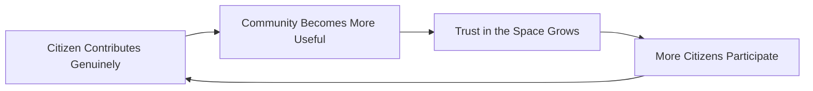

---

# Business Model

Every capability below is described strategically — the business rationale, never the implementation. The enforceable capability logic is owned entirely by `ai-docs/55-business-capability-map.md`'s CAP-043 and CAP-044.

| Capability | Business Rationale |
|---|---|
| **Community Groups** | Structured spaces for a neighborhood, village, profession, or shared interest to organize and communicate safely. |
| **Community Forums** | Topic-anchored spaces for genuine knowledge exchange, distinct from a general social feed. |
| **Volunteer Programs** | Coordinated, verifiable pathways for a citizen to contribute time to a genuine local cause. |
| **Community Events** | Discoverable, organized local gatherings and civic activities. |
| **Public Announcements** | A trusted, verified channel for government departments and recognized local institutions to reach citizens directly. |
| **Citizen Participation** | Structured mechanisms — polls, feedback requests, local consultations — for citizens to weigh in on matters affecting their own community. |
| **Recognition Programs** | Acknowledgment of sustained, genuine, constructive contribution — never a manipulable popularity or virality mechanic. |
| **Local Initiatives** | Citizen- or NGO-led projects (a cleanup drive, a literacy campaign) coordinated and made visible through the platform. |
| **Community Feedback** | A structured channel for a community to signal what is and is not working, feeding directly into Continuous Improvement below. |
| **Civic Campaigns** | Government- or NGO-led awareness efforts (a vaccination drive, a scheme enrollment push) reaching citizens through a trusted, verified channel. |
| **Community Knowledge Sharing** | Durable, reusable local know-how — never ephemeral, engagement-optimized content — that benefits every future community member. |

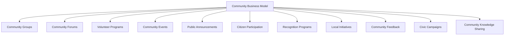

---

# Trust & Quality Strategy

| Mechanism | Strategic Role |
|---|---|
| **Identity Verification** | Every community member's identity is confirmed to the extent their community's risk profile requires, per CAP-001, before elevated participation (posting, organizing, moderating) is granted. |
| **Community Moderation** | Every space has a named, accountable moderation presence — internal staff or a trained, vetted local volunteer — never left to self-police without oversight. |
| **Content Governance** | Every piece of community content is subject to the same Content Moderation Standard already established as RULE-022 in `ai-docs/58-business-rules-policies.md` — no automated removal without human confirmation, except confirmed-illegal content. |
| **Fraud Prevention** | Fake communities, impersonated local leaders, and coordinated misinformation campaigns are detected and addressed through the same Fraud Detection discipline (CAP-038) applied platform-wide. |
| **Privacy Protection** | A community member's personal data is never exposed beyond their explicit consent, per RULE-003. |
| **Consent Management** | Joining a community, and any data shared within it, is a granular, revocable, citizen-controlled decision, per GLOSS-019. |
| **Complaint Resolution** | A harassment report, a moderation dispute, or a fraudulent-community report follows the identical Grievance and Appeal disciplines already established in `ai-docs/58-business-rules-policies.md`'s RULE-009 and RULE-028. |
| **Government Coordination** | A government department's use of community channels is itself subject to the same verification and accountability standard as any other institutional participant — never granted an unaudited broadcast privilege. |
| **Community Trust** | Every mechanism above compounds into one felt outcome: a citizen who believes a community space is genuinely safe to participate in, not merely nominally moderated. |

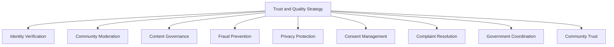

---

# Economic & Social Impact

| Impact Area | How Arwal Contributes |
|---|---|
| **Increase Civic Participation** | Lowering the friction between a citizen's local concern and the appropriate civic channel increases genuine participation, not merely digital noise. |
| **Strengthen Communities** | Existing neighborhood and village structures gain a safe, accessible coordination layer that amplifies, rather than replaces, their own standing. |
| **Improve Volunteerism** | Verifiable, coordinated volunteer pathways make it easier for a willing citizen to actually find and join a genuine local cause. |
| **Support Local Organizations** | NGOs and RWAs reach a wider, more engaged population than their own unaided outreach could achieve. |
| **Improve Social Trust** | Consistent, safe, well-moderated interaction between neighbors — and between citizens and local institutions — builds the same trust `ai-docs/50-product-vision-business-strategy.md` names as Arwal's core structural advantage, extended into the social domain. |
| **Strengthen Local Collaboration** | Government, NGOs, and citizens can coordinate on a shared local outcome more easily than any one of them could alone. |
| **Improve Public Awareness** | Verified civic campaigns and announcements reach citizens through a trusted channel, reducing reliance on unverified, informal information chains. |
| **Strengthen District Development** | A district whose social fabric is measurably stronger is a district better positioned for every other development area already named in `ai-docs/64-district-ecosystem-mapping.md`'s District Development Strategy. |

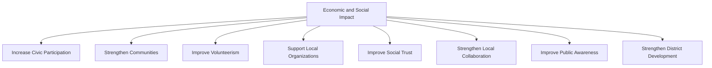

---

# Governance

### Ownership
Community & Social Engagement Strategy ownership sits with the Chief Community Officer (or CPO where the role is combined), with each community category's Business Owner accountable for their own execution, mirroring the Clear Ownership discipline already established throughout `ai-docs/53` through `ai-docs/74`.

### Community Council
A standing **Community Council** — chaired by the Chief Community Officer, with the Head of Trust & Safety, Head of Government Partnerships, Head of Accessibility & Inclusion, and rotating NGO and local-leader representatives as members — holds approval authority over any platform-wide moderation-policy change, any new community-capability launch, and any material deviation from the Anti-Patterns below. The Council meets monthly, with ad hoc sessions for a Community Trust Score regression. NGO and local-leader representation on the Council ensures community voice shapes decisions affecting community life, never merely informed after the fact.

### Decision Authority

| Decision | Approves |
|---|---|
| New community category or capability | Community Council + CEO |
| Moderation-policy change | Community Council + Head of Trust & Safety |
| Government-department community-channel access | Community Council + Head of Government Partnerships |
| Recognition-program design change | Community Council |
| Emergency community-safety response (e.g., a harassment or misinformation wave) | Head of Trust & Safety, immediate, ratified by Council within 5 business days |

### Review Cadence

| Review | Cadence | Owner |
|---|---|---|
| Community Health Review | Monthly | Community Council |
| Category Performance Review | Quarterly | Category/Community Leads |
| Annual Community Strategy Review | Annual | CEO, Chief Community Officer, CPO |

### Conflict Resolution
A dispute between two community members follows RULE-009's Grievance discipline and RULE-028's Appeal right in full; a moderation decision a member disagrees with is reviewed by an independent reviewer distinct from the original moderator, mirroring the identical Independent Review discipline already established throughout `ai-docs/58-business-rules-policies.md`.

### Continuous Improvement
Every Community Feedback signal, moderation-pattern finding, and Council review feeds a shared, tracked improvement backlog, reviewed at the next Community Health Review, per the identical Continuous Improvement Loop already established in `ai-docs/60-customer-experience-strategy.md`.

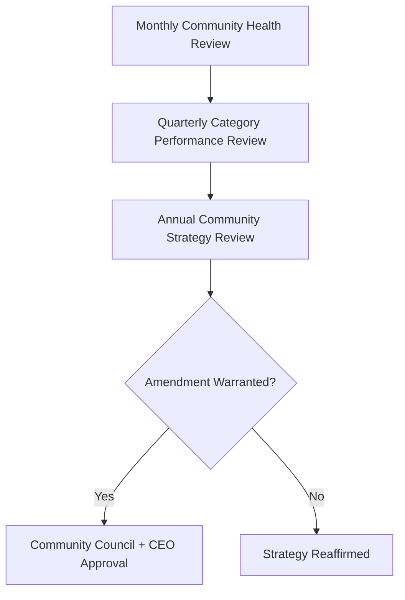

---

# Risks

| Risk | Description | Mitigation |
|---|---|---|
| **Misinformation** | False or misleading civic, health, or safety information spreads within a community space. | Content Governance per RULE-022; verified-source prioritization for civic and health campaigns. |
| **Harassment** | A citizen is targeted, mocked, or intimidated within a community space. | Community Moderation with named accountability; immediate reporting path per RULE-009. |
| **Fake Communities** | An impersonated or fraudulent community space misleads citizens about its legitimacy. | Identity Verification for community organizers; Fraud Detection (CAP-038) pattern monitoring. |
| **Spam** | Low-value, repetitive, or promotional content degrades a community's usefulness. | Content Governance's moderation discipline, applied consistently regardless of the poster's status. |
| **Privacy Risks** | A member's personal data is exposed beyond their consent within a group context. | RULE-003's Consent Requirement; group-scoped data-visibility rules. |
| **Digital Exclusion** | A low-literacy, low-connectivity, or first-generation smartphone citizen cannot meaningfully participate. | Voice-first, accessible-by-default community participation per Accessibility above. |
| **Political Misuse** | A community or civic channel is used for partisan messaging rather than genuine civic communication. | Government Coordination's accountability standard; Community Council review of any flagged institutional misuse. |
| **Trust Erosion** | A single mishandled incident (an unaddressed harassment report, a misinformation spread) damages trust in community spaces broadly. | Transparent, evidence-based complaint resolution; rapid, honest incident communication. |
| **Community Fragmentation** | Overlapping, competing, or poorly organized spaces confuse citizens about where to genuinely participate. | Community Discovery designed for clarity; Community Council oversight of new-space proliferation. |
| **Low Participation** | A community space is created but never reaches genuine, sustained engagement. | Category-growth pacing informed by genuine local demand, never manufactured through artificial engagement tactics. |

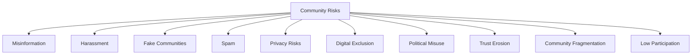

---

# Metrics

| Metric | Definition | Direction |
|---|---|---|
| **Active Communities** | Count of community spaces with sustained, genuine participation. | Increasing |
| **Community Participation Rate** | % of registered citizens engaging in at least one community space within a defined window. | Increasing |
| **Volunteer Participation** | Count of citizens actively engaged in a coordinated volunteer activity. | Increasing |
| **Citizen Satisfaction** | CSAT specific to community interactions, per `ai-docs/60-customer-experience-strategy.md`'s Experience Metrics. | Increasing |
| **Community Trust Score** | District Trust Signal, viewed for community interactions specifically. | Increasing |
| **Community Health Index** | A composite index combining Participation, Trust Score, Moderation Turnaround, and Complaint Resolution rate. | Increasing |
| **Issue Resolution Rate** | % of community-reported local issues reaching a tracked, documented resolution or civic hand-off. | Increasing |
| **Community Growth** | Rate of new, genuinely active community spaces over time. | Increasing, at a sustainable pace |
| **Community Retention** | Rate at which an engaged community member remains active over time. | Increasing |

> **Callout — No Community Metric Stands Alone**
> Per the North Star Principle already established in `ai-docs/00-project-vision.md`, a rising Active Communities count alongside a falling Trust Score, or rising Community Growth alongside a rising Harassment-report rate, is treated as a regression — never counted as success in isolation.

---

# Anti-Patterns

| Anti-Pattern | Why It's Rejected |
|---|---|
| **Engagement without trust** | A rising participation number achieved without genuine safety and moderation investment violates Trust Before Reach. |
| **Growth through conflict** | Amplifying disagreement or controversy to drive engagement directly violates Community Before Virality. |
| **Ignoring rural communities** | Designing primarily for urban, digitally fluent citizens contradicts Inclusiveness and the founding Inclusion over Optimization pillar. |
| **Popularity over value** | Rewarding the most-liked contribution over the most genuinely useful one undermines Constructive Participation. |
| **Technology without accessibility** | A community experience only a literate, well-connected citizen can use has failed Accessibility regardless of technical sophistication. |
| **Weak moderation** | A community space with no accountable, trained moderator presence violates Safety and invites exactly the harm this document exists to prevent. |
| **Short-term engagement** | Optimizing this quarter's participation count at the cost of long-term community trust violates Long-Term Community Development. |
| **Ignoring civic responsibility** | Treating community as a purely social feature disconnected from a citizen's actual civic life contradicts this document's founding purpose. |

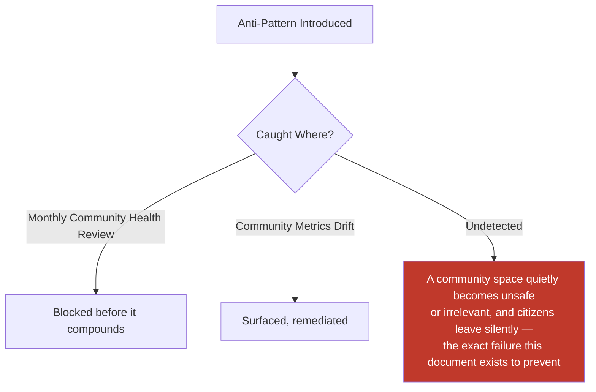

---

# Relationship to Previous Documents

| Prior Document | Relationship |
|---|---|
| **Project Vision (`ai-docs/00`)** | Establishes the founding fragmentation problem and the Inclusion over Optimization pillar this document's community strategy directly operationalizes. |
| **User Personas (`ai-docs/52`)** | Supplies the individual, evidence-grounded citizens (Radha's SHG, Fr. Thomas) this document's stakeholder ecosystem traces to. |
| **Business Capability Map (`ai-docs/55`)** | Supplies the stable abilities — Group & Cooperative Enablement (CAP-043), Community Engagement (CAP-044) — this document's business model is built directly on top of. |
| **User Journey Standards (`ai-docs/56`)** | Supplies the Community Participation journey (JRN-024) this document's Community Lifecycle is felt through. |
| **Customer Experience Strategy (`ai-docs/60`)** | Supplies the felt-trust bar every community interaction must clear, per its Trust and Community pillars. |
| **District Ecosystem Mapping (`ai-docs/64`)** | Supplies the whole-system Ecosystem Health view this document's community-specific health metrics feed directly into. |
| **Marketplace Strategy (`ai-docs/65`)** | Supplies the Trust-before-Liquidity reasoning this document extends from commercial exchange into social participation. |
| **Service Provider Ecosystem (`ai-docs/66`)** | Supplies the Provider Council governance pattern this document's Community Council mirrors for community-specific stakeholder representation. |
| **Payments & Financial Services Strategy (`ai-docs/74`)** | Supplies the Financial Trust reasoning this document parallels in the social domain — trust as the precondition, never a byproduct, of participation. |

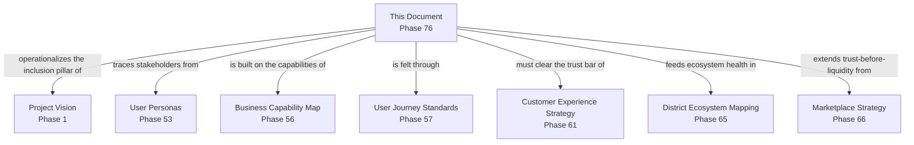

---

# Executive Artifacts

### Community Strategy Framework

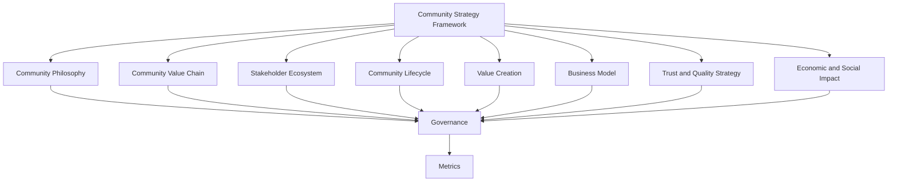

### Community Value Chain

See Community Value Chain section above — reproduced here by reference per Single Source of Truth, never duplicated.

### Community Lifecycle

See Community Lifecycle section above.

### Community Ecosystem Map

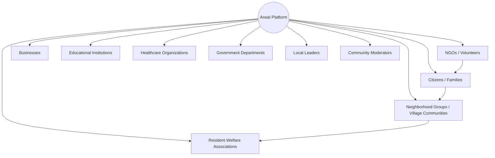

### Governance Model

See Governance section above.

### Community Growth Flywheel

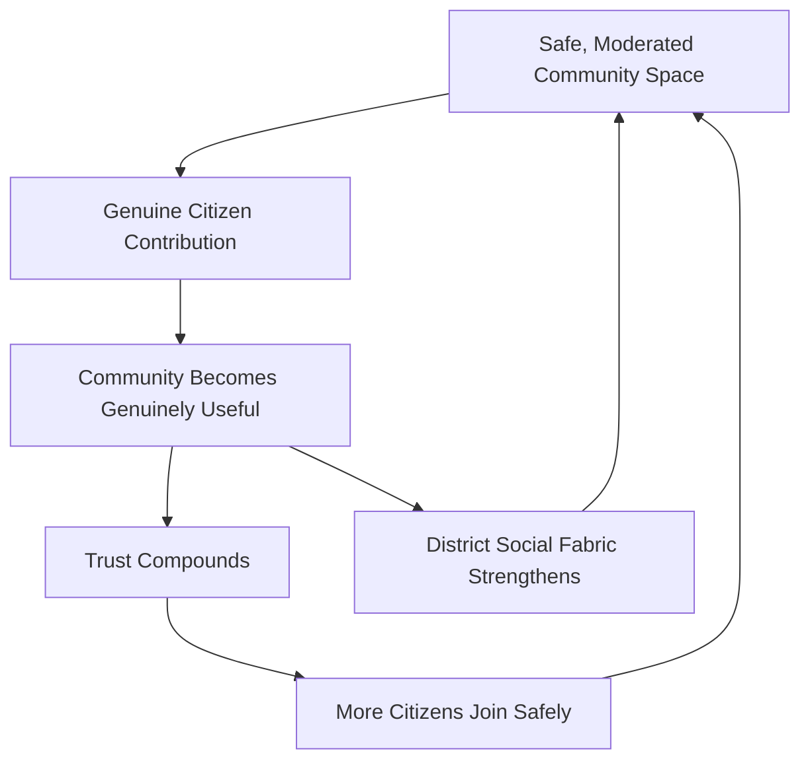

### Executive Dashboards

| Dashboard | Audience | Key Content |
|---|---|---|
| **CEO Dashboard** | CEO | Community Health Index, Community Trust Score, District Development contribution |
| **Chief Community Officer Dashboard** | CCO | Active Communities, Participation Rate, Volunteer Participation |
| **Trust & Safety Dashboard** | Head of Trust & Safety | Moderation turnaround, harassment/misinformation-incident trend, complaint resolution rate |
| **Government Partners Dashboard** | Government liaisons | Civic campaign reach, public-announcement effectiveness, department-channel usage |

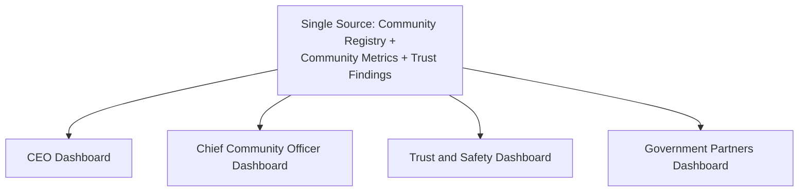

### Decision Matrix

| Decision Type | Approval Authority |
|---|---|
| New community category or capability | Community Council + CEO |
| Moderation-policy change | Community Council + Head of Trust & Safety |
| Government-channel access | Community Council + Head of Government Partnerships |
| Recognition-program design change | Community Council |
| Emergency community-safety response | Head of Trust & Safety, ratified within 5 business days |

---

# Closing Statement

> **Callout — Closing Statement**
> Every prior document in this handbook explains what Arwal builds, how it earns trust in a transaction, and how it sustains itself financially. This document explains something quieter and, in the long run, no less important: how a district's own neighbors, villages, NGOs, and local leaders become measurably better connected to one another because Arwal exists — not louder, not more distracted, but genuinely more able to help each other, report a real problem, organize a real volunteer effort, and hear from their own government through a channel they can trust. A community strategy chasing engagement for its own sake would betray the very civic mission this platform was built to serve; a community strategy that instead strengthens what a district's social fabric already is — patiently, safely, and at the pace real trust can be earned — is the only version of this capability worth building. Where a future phase must deviate from a principle stated here, that deviation is made explicitly — through the Governance process above — never silently, and never by default.

This document, `ai-docs/75-community-social-engagement-strategy.md`, is Phase 76 of approximately 415. Every future community, civic-participation, and social-trust decision is expected to trace back to a principle defined here, or to justify its deviation in writing.

**End of Phase 76 — `ai-docs/75-community-social-engagement-strategy.md`**