# Notification & Communication Strategy

**Document:** `ai-docs/76-notification-communication-strategy.md`
**Project:** Arwal — The District Super App
**Stage:** 2 — Product & Business Strategy
**Phase:** 77 — Notification & Communication Strategy
**Status:** Approved for Product & Engineering Reference
**Audience:** CEO, CSO, CPO, Chief Communications Officer, Enterprise Business Architects, Customer Experience Strategists, Government Digital Communications Consultants, Crisis Communication Specialists, Trust & Safety Strategists, Privacy & Compliance Advisors, Accessibility Specialists, Investors

> **Callout — Purpose of This Document**
> `ai-docs/00-project-vision.md` through `ai-docs/75-community-social-engagement-strategy.md` established why Arwal exists, what it can do, who it serves, what it feels like to use, how it sustains itself, how it partners with government, the whole district ecosystem it operates inside, and how every vertical — commerce, payments, community — builds trust. None of those documents answers the question that determines whether a citizen ever actually *learns* that any of it happened: **when Arwal needs to tell a citizen something — a certificate is ready, a payment failed, a flood is coming — how does it earn the right to be heard, every time, without ever becoming noise?** This document is that answer — the authoritative Notification & Communication Strategy every future alert, reminder, and announcement traces back to.

---

# Purpose of this Document

### Why Communication Is a Distinct Strategic Layer

Every capability, journey, and rule in this handbook eventually produces a fact a citizen needs to know — an application approved, an order delayed, a payment settled, a flood warning issued. `ai-docs/58-business-rules-policies.md`'s RULE-023 already governs which notification categories are mandatory and which are optional. `ai-docs/56-user-journey-standards.md`'s JRN-025 already governs what a single notification-management interaction feels like. Neither document answers the strategic question that sits above both: **what makes a citizen trust Arwal's voice enough to act on it immediately, every time, without hesitation or fatigue?** A platform that gets this wrong either goes silent when a citizen desperately needs it, or becomes noise a citizen learns to ignore — and once a citizen has learned to ignore Arwal, even a genuine emergency alert arrives to a citizen who has already stopped listening. This document exists to make that trust a deliberately engineered, permanently governed strategic asset.

### This Is Not a Notification Service, a Messaging System, or an SDK

This document contains no push-notification implementation, no SMS gateway integration, no email delivery infrastructure, no messaging protocol, and no API contract. It does not redefine Notifications (CAP-031), MOD-038, RULE-023, or JRN-025 — each remains fully authoritative and is cited, never restated. This document's exclusive territory is: **why communication is a strategic capability, who participates in it, how trust in Arwal's voice is created and protected, and how that trust is governed and grown across a generation of district communication.**

### The Chain of Reasoning This Document Extends

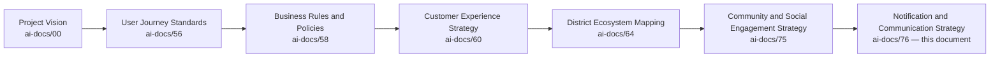

| Layer | Question It Answers |
|---|---|
| Project Vision | Why does a unified civic-commercial platform need to exist? |
| User Journey Standards | What does one notification-management interaction feel like? |
| Business Rules & Policies | What, precisely, is mandatory versus optional to send? |
| Customer Experience Strategy | What must a citizen feel, cumulatively, across every touchpoint? |
| District Ecosystem Mapping | What is the whole system Arwal's voice must be trusted within? |
| **Notification & Communication Strategy** (this document) | **How does Arwal earn the right to speak to a citizen, and keep that right, forever?** |

### Why Communication Is the Most Fragile Trust Surface on the Platform

A citizen who is charged incorrectly can dispute the charge. A citizen who receives a fraudulent listing can report it. But a citizen who simply stops opening Arwal's notifications — because too many arrived, because one felt like spam, because an urgent one arrived too late — has quietly withdrawn from the relationship without ever filing a complaint Arwal can see. Communication failure is uniquely silent and uniquely compounding: it degrades every other vertical's ability to reach that citizen at the exact moment each of them needs to.

### Scope Boundary

This document does not define a channel's delivery mechanics, a template's rendering logic, or a queue's retry policy — those are engineering concerns owned elsewhere. Its territory is strategic: the philosophy, the stakeholder relationships, the value chain, and the governance that keep Arwal's voice trusted, relevant, accessible, and never noise.

---

# Communication Philosophy

Every principle below exists because a communication strategy designed carelessly does not fail abstractly — it fails a specific citizen who missed a subsidy deadline because the message never reached them, or a specific citizen who muted Arwal entirely after one too many irrelevant pings.

### Citizen First
**Why it exists:** Every communication decision is judged first against whether it serves the citizen's actual need to know, never an internal engagement or retention metric, mirroring the identical Citizen-First tie-breaker already established throughout `ai-docs/51` through `ai-docs/75`.

### Trust Before Frequency
**Why it exists:** A citizen who trusts every message Arwal sends will open the next one immediately. A citizen who has been sent even a handful of low-value messages will start ignoring all of them, including the ones that matter. Frequency is never optimized ahead of trust.

### Right Message
**Why it exists:** A notification that is technically accurate but irrelevant to the specific citizen receiving it has still failed — relevance is judged from the citizen's context, never from the sender's convenience.

### Right Time
**Why it exists:** The same message delivered an hour too late is not the same message — a delayed emergency alert or a delayed payment-failure notice can turn a recoverable situation into an unrecoverable one.

### Right Audience
**Why it exists:** A message sent to a citizen it does not apply to is noise; a message withheld from a citizen it does apply to is a silent failure. Audience selection is treated with the same rigor as message content itself.

### Transparency
**Why it exists:** A citizen must always be able to see why they received a message, what triggered it, and how to control future messages of that kind — concealment in communication breeds exactly the suspicion `ai-docs/60-customer-experience-strategy.md` already rejects.

### Privacy
**Why it exists:** A notification payload never contains more personal or sensitive data than the citizen needs to see on a lock screen or a shared device, per RULE-025's Data Classification discipline extended to communication content itself.

### Accessibility
**Why it exists:** Voice, SMS, and low-bandwidth-first delivery are the floor for citizens who cannot reliably use a rich push notification, never a secondary accommodation, per `ai-docs/12-accessibility-standards.md`'s non-negotiable standard.

### Consent
**Why it exists:** Every non-mandatory communication category is opted into explicitly and withdrawable immediately, per RULE-023 — consent honored imperfectly is functionally the same as consent ignored.

### Relevance
**Why it exists:** A message personalized to a citizen's actual context — their location, their active journeys, their stated preferences — earns continued attention; a generic broadcast erodes it.

### Clarity
**Why it exists:** A citizen reading a notification in a hurry, on a small screen, in a second language, must understand what happened and what to do next without re-reading it, per the Plain Language discipline already established in `ai-docs/59-business-glossary.md`.

### Long-Term Trust
**Why it exists:** Arwal's communication strategy is evaluated on a multi-year horizon — a short-term campaign that boosts open rates at the cost of citizen trust is a regression, never a win, mirroring the Long-Term Trust principle already established in `ai-docs/60-customer-experience-strategy.md`.

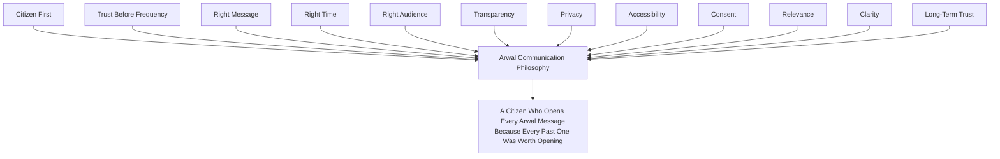

> **Callout — The One-Sentence Communication Philosophy**
> *"Every message Arwal sends either earns the right to send the next one, or spends it — there is no neutral notification."*

---

# Communication Value Chain

| Stage | Business Description |
|---|---|
| **Event Detection** | A business event genuinely worth communicating occurs somewhere on the platform — a status change, a payment outcome, a civic emergency. |
| **Decision to Communicate** | The event is evaluated against whether it genuinely warrants a citizen's attention, never sent merely because it technically can be. |
| **Audience Selection** | The precise set of citizens for whom this event is relevant is identified — never broader or narrower than the genuine need. |
| **Consent Verification** | For any non-mandatory category, active opt-in is confirmed before proceeding, per RULE-023. |
| **Message Creation** | Content is written in plain, accessible language matching the event's actual urgency — never over- or under-stated. |
| **Channel Selection** | The channel(s) most likely to reach this citizen, given their preferences and context, are chosen — never a single default applied blindly. |
| **Delivery** | The message reaches the citizen through the selected channel. |
| **Acknowledgement** | The citizen's receipt, read, or dismissal of the message is recorded, informing future relevance decisions. |
| **Action** | Where a message calls for a response, the citizen's action (or inaction) closes or continues the loop. |
| **Feedback** | The citizen's engagement pattern — opened, ignored, opted out — feeds back into future audience and relevance decisions. |
| **Continuous Improvement** | Aggregate patterns across every message inform the next cycle's Decision to Communicate discipline. |

```mermaid
graph LR
    Detection[Event Detection] --> Decision[Decision to Communicate]
    Decision --> Audience[Audience Selection]
    Audience --> Consent[Consent Verification]
    Consent --> Creation[Message Creation]
    Creation --> Channel[Channel Selection]
    Channel --> Delivery[Delivery]
    Delivery --> Ack[Acknowledgement]
    Ack --> Action[Action]
    Action --> Feedback[Feedback]
    Feedback --> Improve[Continuous Improvement]
    Improve -.feeds back into.-> Decision
```

---

# Stakeholder Ecosystem

| Stakeholder | Strategic Role |
|---|---|
| **Citizens** | The primary recipients whose trust in Arwal's voice determines whether any message is actually read and acted on. |
| **Families** | The household unit through which a shared device or delegated access shapes who actually receives and relays a message. |
| **Government Departments** | Senders of civic alerts and application-status updates, held to the same accuracy and non-partisan standard as any other institutional sender, per `ai-docs/75`'s Government Coordination discipline. |
| **Merchants** | Senders of order-status updates and recipients of settlement and platform-operational notices. |
| **Service Providers** | Senders of booking-status updates and recipients of scheduling and payout notices. |
| **Healthcare Providers** | Senders of appointment confirmations and recipients of booking-related notices, held to the elevated care standard `ai-docs/69` establishes for health-adjacent communication. |
| **Educational Institutions** | Senders of scholarship and opportunity notices relevant to a student's context. |
| **Delivery Partners** | Recipients of route and earnings notices, and senders of delivery-status updates citizens depend on. |
| **Community Leaders** | Senders of verified local announcements through the accountable channel established in `ai-docs/75-community-social-engagement-strategy.md`. |
| **Support Teams** | Recipients of citizen communication-complaint signals and senders of ticket-status updates. |
| **Emergency Authorities** | Senders of the platform's highest-priority, never-suppressible communication category. |
| **Future Communication Participants** | Second-district civic authorities and future institutional partners, activated per the Strategic Expansion Principles already established in `ai-docs/50-product-vision-business-strategy.md`. |

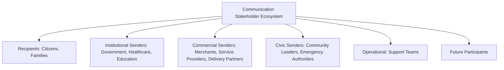

---

# Communication Lifecycle

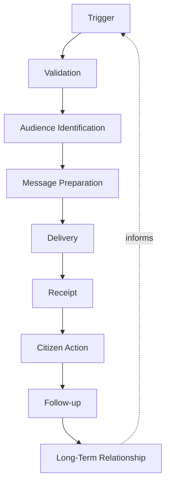

| Stage | Meaning |
|---|---|
| **Trigger** | A genuine, communicable event occurs. |
| **Validation** | The event and its content are confirmed accurate before any message is prepared — never sent speculatively. |
| **Audience Identification** | The precise, consented recipient set is determined. |
| **Message Preparation** | Plain-language, accessible content is drafted, matching the event's actual stakes. |
| **Delivery** | The message reaches the citizen through the appropriate channel. |
| **Receipt** | The citizen sees, hears, or is otherwise made aware of the message. |
| **Citizen Action** | The citizen responds where a response is called for, or simply retains the information. |
| **Follow-up** | Where an action was expected and not taken, a proportionate, non-intrusive follow-up may occur. |
| **Long-Term Relationship** | The cumulative pattern of trustworthy messages shapes the citizen's ongoing willingness to engage with Arwal's voice. |

---

# Value Creation

| Question | Answer |
|---|---|
| **How do citizens create value?** | By engaging honestly with communication preferences and feedback, helping Arwal calibrate relevance for every future citizen. |
| **How do organizations create value?** | By sending accurate, timely, genuinely necessary updates that make Arwal's communication layer worth a citizen's attention. |
| **How does government create value?** | By using the platform's trusted channel for civic communication that would otherwise rely on slower, less verifiable means. |
| **How does Arwal create value?** | By providing one calm, trusted, consistently relevant voice a citizen never has to second-guess, replacing a fragmented mess of unreliable SMS, word-of-mouth, and physical notice boards. |
| **How does trust develop?** | Through a sustained pattern of accurate, well-timed, genuinely relevant messages — every honored preference and every accurate alert compounds it. |
| **How does communication reduce uncertainty?** | By replacing "I hope my application went through" with a citizen-visible, proactively communicated status, per the Trust Strategy already established in `ai-docs/60-customer-experience-strategy.md`. |
| **How does district coordination improve?** | By giving every institutional sender — government, healthcare, education, community — one reliable channel to reach citizens without each rebuilding their own, per `ai-docs/64-district-ecosystem-mapping.md`'s Shared Infrastructure dependency. |

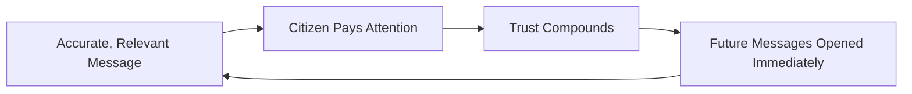

---

# Business Model

Every capability below is described strategically — the business rationale, never the implementation. The enforceable capability logic is owned entirely by `ai-docs/55-business-capability-map.md`'s CAP-031 and `ai-docs/58-business-rules-policies.md`'s RULE-023.

| Capability | Business Rationale |
|---|---|
| **Transactional Notifications** | Always-delivered confirmations for a citizen's own actions — a payment, a booking, a submission — the highest-trust, never-optional category. |
| **Government Alerts** | A verified, accountable channel for civic-service status and scheme information, per `ai-docs/63-government-partnership-strategy.md`. |
| **Emergency Communications** | The platform's highest-priority, never-suppressible category, coordinated with the Disaster Management Authority per `ai-docs/64-district-ecosystem-mapping.md`. |
| **Appointment Reminders** | Timely, proactive prompts reducing no-shows across Healthcare and Education, per `ai-docs/69` and `ai-docs/70`. |
| **Order Updates** | Real-time status across Commerce, Food, and Grocery, matching the trust bar `ai-docs/67-merchant-ecosystem.md` establishes. |
| **Payment Updates** | Immediate, unambiguous confirmation or failure notice, per the absolute standard already established in `ai-docs/74-payments-financial-services-strategy.md`. |
| **Community Announcements** | Verified local and civic messages through the accountable channel established in `ai-docs/75-community-social-engagement-strategy.md`. |
| **Service Notifications** | Booking, scheduling, and provider-side updates across every service-based vertical. |
| **Preference Management** | A citizen's single, authoritative control over what they receive, through which channel, per JRN-029 Settings Management. |
| **Communication History** | A durable, citizen-visible record of every message received, supporting trust and dispute resolution alike. |
| **Multi-Channel Communication** | Push, SMS, WhatsApp, voice, and in-app delivery selected per citizen context — never a single channel assumed universally available. |

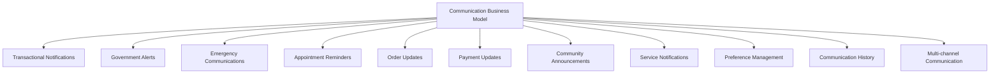

---

# Trust & Quality Strategy

| Mechanism | Strategic Role |
|---|---|
| **Identity Verification** | Every institutional sender (government, healthcare, community) is verified before gaining a communication channel, per CAP-001. |
| **Consent Management** | Every non-mandatory category is opted into explicitly and withdrawable instantly, per RULE-023. |
| **Notification Authenticity** | A citizen can trust that a message claiming to be from a government department or verified provider genuinely is — no unverified sender may impersonate an institutional voice. |
| **Spam Prevention** | Volume, frequency, and relevance thresholds prevent any sender — internal or institutional — from degrading a citizen's trust in the channel through overuse. |
| **Privacy Protection** | No Restricted or Confidential-tier data appears in a notification payload, per `ai-docs/10-security-standards.md`'s Data Classification table. |
| **Communication Transparency** | Every message is traceable to its trigger and sender, visible to the citizen in their Communication History. |
| **Complaint Resolution** | A citizen's report of an unwanted, incorrect, or suspicious message follows the identical Grievance and Appeal disciplines already established in `ai-docs/58-business-rules-policies.md`. |
| **Government Coordination** | Civic and emergency communication content is jointly reviewed with the relevant authority before activation, never unilaterally worded by Arwal alone. |
| **Communication Trust** | Every mechanism above compounds into one felt outcome: a citizen who never has to wonder whether an Arwal message is genuine, necessary, or safe to act on. |

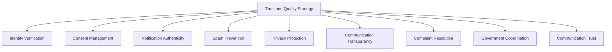

> **Callout — Emergency Communication Is Never Rate-Limited, Never Opted Out**
> Per RULE-023, a Mission-Critical or safety-relevant notification category is never subject to citizen opt-out and never subordinated to a spam-prevention throttle designed for lower-stakes categories. An emergency alert's delivery path is architected, tested, and governed with the same absolute severity `ai-docs/74-payments-financial-services-strategy.md` applies to payment idempotency.

---

# Economic & Social Impact

| Impact Area | How Arwal Contributes |
|---|---|
| **Improve Information Accessibility** | A single, trusted channel reaches citizens who previously depended on word-of-mouth or a physical notice board. |
| **Reduce Missed Services** | Proactive appointment and application-status reminders reduce no-shows and missed civic deadlines. |
| **Increase Citizen Confidence** | Consistent, accurate communication removes the anxiety of not knowing whether an action succeeded. |
| **Support Government Communication** | A verified, district-wide channel strengthens a department's ability to reach citizens directly and accountably. |
| **Improve Service Delivery** | Timely order, booking, and delivery updates reduce support-ticket volume across every commercial vertical. |
| **Strengthen Community Awareness** | Verified local and civic announcements reach citizens who would otherwise miss a genuinely relevant local event or alert. |
| **Reduce Operational Costs** | Digital, targeted communication replaces costlier, less-reliable physical or informal outreach. |
| **Strengthen District Coordination** | A shared communication layer benefits every ecosystem participant simultaneously, reinforcing `ai-docs/64-district-ecosystem-mapping.md`'s District Development Strategy. |

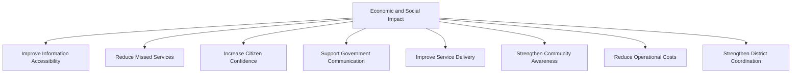

---

# Governance

### Ownership
Notification & Communication Strategy ownership sits with the Chief Communications Officer (or CPO where the role is combined), with Transactional, Government, Emergency, and Community categories each accountable to a named sub-owner, mirroring the Clear Ownership discipline already established throughout `ai-docs/53` through `ai-docs/75`.

### Communication Council
A standing **Communication Council** — chaired by the Chief Communications Officer, with the Head of Trust & Safety, Head of Government Partnerships, Head of Accessibility & Inclusion, CPO, and rotating category owners as members — holds approval authority over any platform-wide communication-policy change, any new communication category, and any material deviation from the Anti-Patterns below. The Council meets monthly, with ad hoc sessions for a Communication Trust Score regression or an emergency-communication failure.

### Decision Authority

| Decision | Approves |
|---|---|
| New communication category | Communication Council + CEO |
| Emergency-communication protocol change | Communication Council + Head of Government Partnerships |
| Consent/preference model change | Communication Council + Compliance Officer |
| Channel-mix strategy change | Communication Council |
| Emergency communication-failure response | Chief Communications Officer, immediate, ratified by Council within 5 business days |

### Review Cadence

| Review | Cadence | Owner |
|---|---|---|
| Communication Health Review | Monthly | Communication Council |
| Category Performance Review | Quarterly | Category Owners |
| Annual Communication Strategy Review | Annual | CEO, Chief Communications Officer, CPO |

### Conflict Resolution
A citizen's complaint about unwanted or incorrect communication follows RULE-009's Grievance discipline and RULE-028's Appeal right in full, reviewed by an independent reviewer distinct from the sending category's own owner.

### Continuous Improvement
Every Feedback signal from the Communication Value Chain feeds a shared, tracked improvement backlog, reviewed at the next Communication Health Review, per the identical Continuous Improvement Loop already established in `ai-docs/60-customer-experience-strategy.md`.

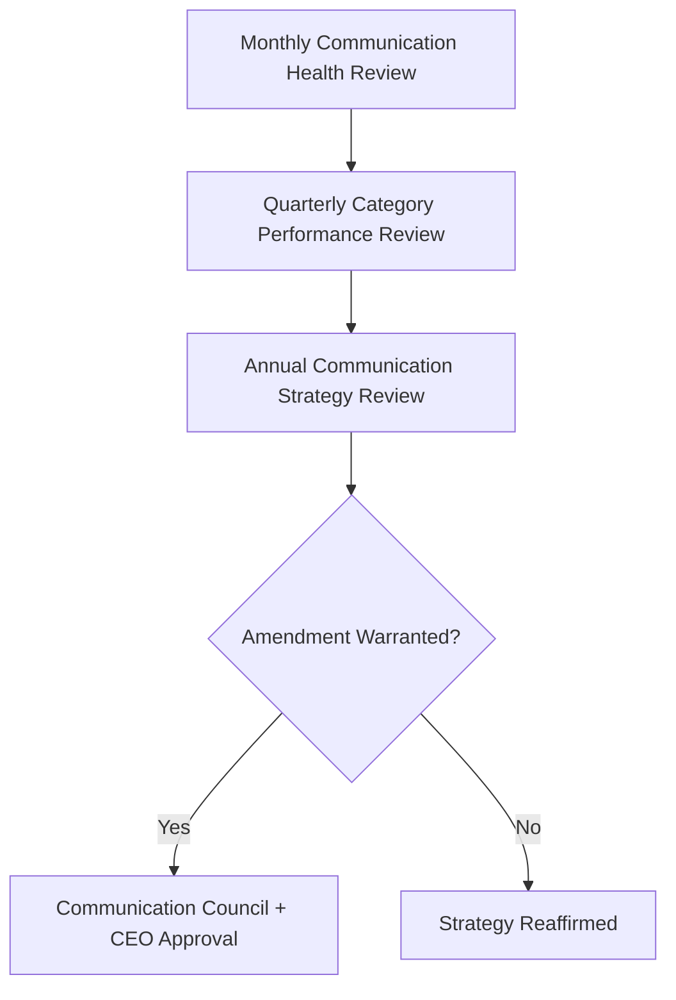

---

# Risks

| Risk | Description | Mitigation |
|---|---|---|
| **Notification Fatigue** | A citizen receives too many messages and begins ignoring all of them, including important ones. | Trust Before Frequency principle; Decision to Communicate discipline; preference-driven throttling. |
| **Spam** | Low-value or repetitive messages degrade the channel's credibility. | Spam Prevention thresholds; Relevance principle. |
| **Misinformation** | An inaccurate or unverified message is sent, especially in a civic or emergency context. | Validation stage in the Communication Lifecycle; joint government content review. |
| **Privacy Breaches** | Sensitive data appears in a notification payload visible on a shared or locked device. | Privacy Protection mechanism; RULE-025's Data Classification applied to payload content. |
| **Digital Exclusion** | A citizen without a smartphone or reliable connectivity misses a critical message. | Multi-Channel Communication including SMS and voice; Accessibility principle. |
| **Poor Timing** | A message arrives too late to be actionable. | Right Time principle; Delivery-stage monitoring for latency against message urgency. |
| **Message Overload** | Multiple senders independently reaching the same citizen without coordination. | Communication Council oversight; Audience Selection discipline applied platform-wide. |
| **Trust Erosion** | A pattern of low-value or inaccurate messages damages a citizen's willingness to engage with any future message. | Trust Before Frequency; Continuous Improvement loop; Communication Trust Score monitoring. |
| **Emergency Communication Failure** | A critical alert fails to reach a citizen in time. | Never-suppressible Emergency Communications category; redundant multi-channel delivery; joint testing with Emergency Authorities. |
| **Regulatory Changes** | A change in data-protection or telecom regulation invalidates a communication assumption. | Configurable, government-reviewed communication workflows per RULE-006 and RULE-008's pattern. |

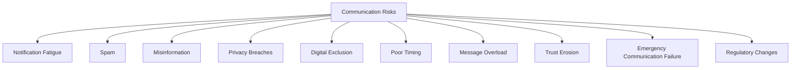

---

# Metrics

| Metric | Definition | Direction |
|---|---|---|
| **Notification Delivery Success** | % of attempted messages successfully delivered to a reachable channel. | Increasing |
| **Read Rate** | % of delivered messages opened or acknowledged. | Increasing |
| **Action Rate** | % of action-requiring messages resulting in the intended citizen action. | Increasing |
| **Citizen Satisfaction** | CSAT specific to communication experience, per `ai-docs/60-customer-experience-strategy.md`. | Increasing |
| **Opt-in Rate** | % of citizens actively opted into optional communication categories. | Increasing |
| **Communication Trust Score** | District Trust Signal, viewed for communication interactions specifically. | Increasing |
| **Critical Alert Delivery Rate** | % of Mission-Critical/emergency alerts successfully delivered within their defined time window. | Approaching 100% |
| **Preference Accuracy** | % of delivered messages matching the citizen's stated channel and category preferences. | Increasing |
| **Communication Ecosystem Health** | A composite index combining Delivery Success, Trust Score, Read Rate, and Complaint Rate. | Increasing |

> **Callout — No Communication Metric Stands Alone**
> Per the North Star Principle already established in `ai-docs/00-project-vision.md`, a rising Notification Delivery Success count alongside a falling Trust Score or rising Opt-out Rate is treated as a regression — never counted as success in isolation.

---

# Anti-Patterns

| Anti-Pattern | Why It's Rejected |
|---|---|
| **Notify everything** | Sending every technically possible event regardless of genuine relevance violates Right Message and directly causes Notification Fatigue. |
| **Frequency over value** | Optimizing for message volume or open-rate targets ahead of genuine citizen value violates Trust Before Frequency. |
| **Ignoring consent** | Delivering an optional-category message without active opt-in, or failing to honor an immediate withdrawal, violates Consent and RULE-023. |
| **Hidden communications** | A citizen cannot see why they received a message or who sent it, violating Transparency. |
| **Technology without accessibility** | A communication strategy reachable only via rich push notification excludes exactly the citizens `ai-docs/12-accessibility-standards.md` commits to serving. |
| **Spam-like behavior** | Repetitive, low-value, or manipulative messaging (urgency manufactured where none exists) violates Relevance and Clarity. |
| **Poor emergency communication** | A delayed, unclear, or under-delivered emergency alert is the single most severe failure this document exists to prevent. |
| **Growth without trust** | A rising message-volume metric alongside a falling Trust Score is a regression, never a win. |

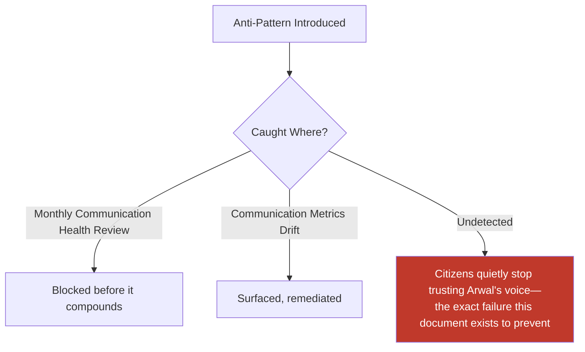

---

# Relationship to Previous Documents

| Prior Document | Relationship |
|---|---|
| **Project Vision (`ai-docs/00`)** | Establishes the founding Trust over Growth-at-all-costs pillar this document operationalizes at the communication layer specifically. |
| **User Journey Standards (`ai-docs/56`)** | Supplies JRN-025 Notification Management, the single-interaction experience this document's strategy is felt through. |
| **Business Rules & Policies (`ai-docs/58`)** | Supplies RULE-023's precise, enforceable Notification Consent and Category Rules this document's every trust mechanism is bound by. |
| **Business Glossary (`ai-docs/59`)** | Supplies the precise, singular definition of Notification (GLOSS-046) this document's every claim is expressed in. |
| **Customer Experience Strategy (`ai-docs/60`)** | Supplies the Trust Strategy and felt-experience bar every communication touchpoint must clear. |
| **District Ecosystem Mapping (`ai-docs/64`)** | Supplies the Shared Infrastructure and Shared Trust dependencies this document's cross-institutional channel exists to serve. |
| **Logistics & Delivery Strategy (`ai-docs/73`)** | Supplies the delivery-status communication need this document's Order Updates and Delivery notices directly serve. |
| **Payments & Financial Services Strategy (`ai-docs/74`)** | Supplies the absolute-certainty standard this document's Payment Updates category is held to. |
| **Community & Social Engagement Strategy (`ai-docs/75`)** | Supplies the accountable, verified channel discipline this document's Community Announcements category extends. |

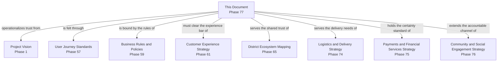

---

# Executive Artifacts

### Communication Strategy Framework

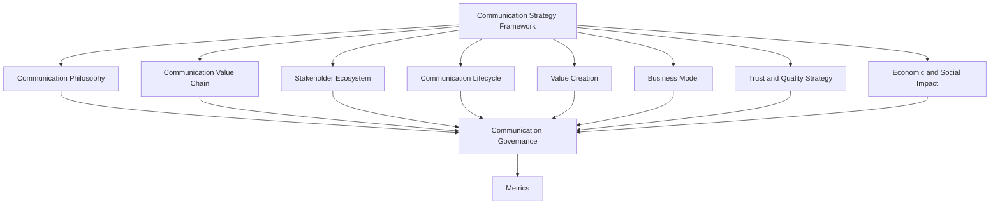

### Communication Value Chain

See Communication Value Chain section above — reproduced here by reference per Single Source of Truth, never duplicated.

### Communication Lifecycle

See Communication Lifecycle section above.

### Communication Ecosystem Map

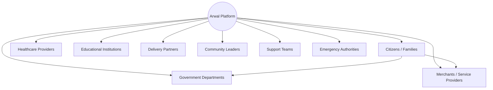

### Governance Model

See Governance section above.

### Communication Growth Flywheel

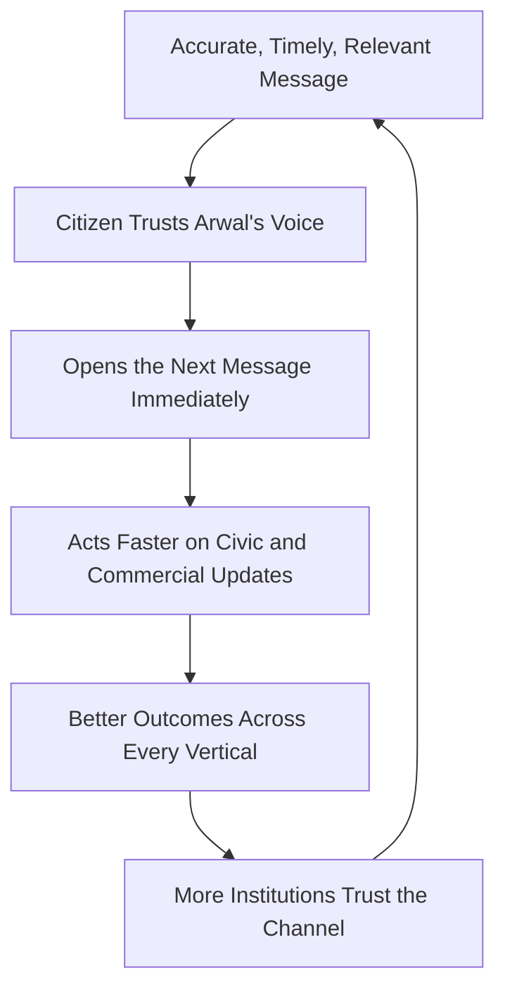

### Executive Dashboards

| Dashboard | Audience | Key Content |
|---|---|---|
| **CEO Dashboard** | CEO | Communication Ecosystem Health, Trust Score, Critical Alert Delivery Rate |
| **Chief Communications Officer Dashboard** | CCO | Delivery Success, Read Rate, Action Rate by category |
| **Trust & Safety Dashboard** | Head of Trust & Safety | Complaint volume, spam-pattern trend, authenticity-violation trend |
| **Government Partners Dashboard** | Government liaisons | Government Alert reach, Emergency Communication delivery performance |

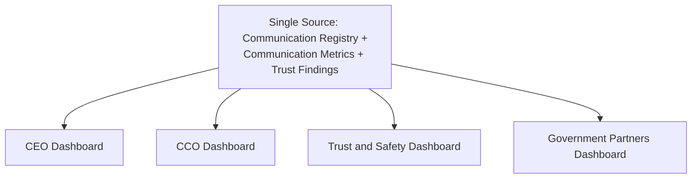

### Decision Matrix

| Decision Type | Approval Authority |
|---|---|
| New communication category | Communication Council + CEO |
| Emergency-protocol change | Communication Council + Head of Government Partnerships |
| Consent/preference model change | Communication Council + Compliance Officer |
| Channel-mix strategy change | Communication Council |
| Emergency communication-failure response | Chief Communications Officer, ratified within 5 business days |

---

# Closing Statement

> **Callout — Closing Statement**
> Every prior document in this handbook explains what Arwal builds and how it earns trust in a transaction, a marketplace, or a community. This document explains the thread that runs invisibly through every one of them: the moment Arwal actually speaks to a citizen. A platform can verify every identity, settle every payment correctly, and build a genuinely trustworthy marketplace, and still fail the citizen who never saw the message telling them any of it happened. Arwal's voice is not a delivery mechanism — it is a relationship, built one accurate, well-timed, genuinely necessary message at a time, and lost the moment that discipline slips. A district depending on Arwal for a flood warning, a certificate update, or a payment confirmation is depending on this document's principles being honored without exception, every single time. Where a future phase must deviate from a principle stated here, that deviation is made explicitly — through the Communication Governance process above — never silently, and never by default.

This document, `ai-docs/76-notification-communication-strategy.md`, is Phase 77 of approximately 415. Every future alert, reminder, and announcement is expected to trace back to a principle defined here, or to justify its deviation in writing.

**End of Phase 77 — `ai-docs/76-notification-communication-strategy.md`**