# Search & Discovery Strategy

**Document:** `ai-docs/77-search-discovery-strategy.md`
**Project:** Arwal — The District Super App
**Stage:** 2 — Product & Business Strategy
**Phase:** 78 — Search & Discovery Strategy
**Status:** Approved for Product & Engineering Reference
**Audience:** CEO, CSO, CPO, Chief Experience Officer, Enterprise Business Architects, Information Architecture Strategists, Search Experience Consultants, Knowledge Management Specialists, Government Digital Services Consultants, Trust & Safety Strategists, Accessibility Specialists, Privacy & Compliance Advisors, Investors

> **Callout — Purpose of This Document**
> `ai-docs/00-project-vision.md` through `ai-docs/76-notification-communication-strategy.md` established why Arwal exists, what it can do, who it serves, what it feels like to use, how it sustains itself, how it partners with government, the whole district ecosystem it operates inside, and how community and communication build trust. None of those documents answers the question that determines whether any of the rest is ever actually *found*: **when a citizen has a need — a price, a certificate, a doctor, a job, a tutor, a scheme — how does Arwal make sure the right answer surfaces quickly, fairly, and in a way the citizen can trust, out of everything the platform contains?** This document is that answer — the authoritative Search & Discovery Strategy every future information-architecture, ranking-policy, and discoverability decision traces back to.

---

# Purpose of this Document

### Why Discovery Is a Distinct Strategic Layer

`ai-docs/55-business-capability-map.md`'s CAP-030 establishes that Search is a stable, shared business ability. `ai-docs/56-user-journey-standards.md`'s JRN-026 establishes what one search interaction feels like. Neither document answers the strategic question that sits above both: **why does discovery, as a whole system spanning every vertical, determine whether Arwal's entire value proposition is realized or wasted?** A platform can build the most complete civic-commerce capability set in the district and still fail if a citizen cannot find what they need inside it. Discovery is not a feature of one module — it is the mechanism by which every other capability in this handbook becomes actually usable. This document exists to make that mechanism a deliberately governed, fairness-bound, technology-independent strategic asset.

### This Is Not a Search Engine, a Ranking Algorithm, or a Database Specification

This document contains no query syntax, no indexing strategy, no ranking formula, no recommendation-model architecture, and no database schema. It does not redefine Search (CAP-030), Recommendation Engine (CAP-032), or AI Assistance (CAP-033) — each remains fully authoritative in `ai-docs/55-business-capability-map.md` and is cited, never restated. This document's exclusive territory is: **why discovery is strategically load-bearing, who participates in it, how trust and fairness in discovery are created and protected, and how that system is governed and grown for a generation.**

### Why Discovery Is the Connective Tissue Across Every Vertical

A citizen does not experience Arwal as fifty-seven catalogued modules — they experience it as the answer to "where do I look for this?" Per `ai-docs/60-customer-experience-strategy.md`'s One Platform principle, a citizen should never be able to tell which internal team built a discovery surface; they should simply find what they need. Discovery is the single connective layer spanning Commerce, Healthcare, Education, Agriculture, Jobs, Property, Government Services, and Community — the only capability every other vertical depends on to be reachable at all.

### The Chain of Reasoning This Document Extends

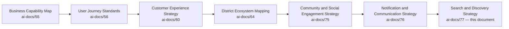

| Layer | Question It Answers |
|---|---|
| Business Capability Map | What can Arwal do? |
| User Journey Standards | What does one search interaction feel like? |
| Customer Experience Strategy | What must a citizen feel, cumulatively? |
| District Ecosystem Mapping | What is the whole system Arwal operates inside? |
| Community & Social Engagement | How does the district's social fabric grow stronger? |
| Notification & Communication | How does Arwal earn the right to speak to a citizen? |
| **Search & Discovery Strategy** (this document) | **How does a citizen reliably, fairly, and confidently find what they need, out of everything Arwal contains?** |

### Scope Boundary

This document does not define a ranking model's technical mechanics, a search index's data structure, or an API contract — those remain engineering territory owned elsewhere in this handbook. Its territory is strategic: the philosophy, the stakeholder relationships, the value chain, and the governance that keep discovery fast, fair, transparent, and trustworthy as Arwal scales from one district to many.

---

# Discovery Philosophy

Every principle below exists because a discovery strategy designed carelessly does not fail abstractly — it fails a specific farmer who never found the scheme they qualified for, or a specific citizen who gave up searching and reverted to word-of-mouth.

### Citizen First
**Why it exists:** Every discovery decision is judged first against whether it helps the citizen find what they actually need, never against what maximizes a platform engagement metric, mirroring the identical Citizen-First tie-breaker already established throughout `ai-docs/51` through `ai-docs/76`.

### Find Before Friction
**Why it exists:** The shortest honest path between a citizen's need and a genuine answer is always preferred over a longer path that exposes more of the product. A citizen who has to work to find something has already been failed once, per `ai-docs/56-user-journey-standards.md`'s Minimal Cognitive Load principle applied here to the discovery layer specifically.

### Trust Before Ranking
**Why it exists:** A technically well-ranked result a citizen does not trust is worthless. Every ranking decision is subordinate to the citizen's confidence that the result is genuine, verified, and not manipulated — trust is the precondition ranking sophistication is built on top of, never a variable traded against it.

### Relevance
**Why it exists:** A result that is popular, well-funded, or algorithmically convenient but does not actually match a citizen's need has failed regardless of its rank. Relevance is judged from the citizen's actual context, never from a sender's convenience.

### Transparency
**Why it exists:** A citizen must be able to understand, in plain terms, why a result appeared and in what order — concealment in discovery breeds the same corrosive suspicion `ai-docs/60-customer-experience-strategy.md` already rejects at the individual-interaction level.

### Accessibility
**Why it exists:** Voice-first search, low-literacy-friendly result presentation, and low-bandwidth-tolerant discovery are the floor, never an enhancement, per `ai-docs/12-accessibility-standards.md`'s non-negotiable standard extended to the discovery layer.

### Fair Visibility
**Why it exists:** A new, unestablished seller, provider, or civic service must never be structurally invisible — discovery includes a genuine on-ramp for new and small participants, never a pure incumbency-favoring mechanism, mirroring `ai-docs/65-marketplace-strategy.md`'s Fair Competition principle extended platform-wide.

### Inclusiveness
**Why it exists:** A discovery system that only serves digitally fluent, literate, urban citizens has captured a fraction of the district it exists to serve, per the founding Inclusion over Optimization pillar in `ai-docs/00-project-vision.md`.

### Privacy
**Why it exists:** A citizen's search history and behavioral signals are used only for the stated, consented purpose of improving their own discovery experience, per RULE-003 — never repurposed, sold, or exposed without explicit consent.

### Context Awareness
**Why it exists:** The same query means different things to a farmer in a field and a citizen in district headquarters — discovery adapts to a citizen's genuine context (location, device, connectivity, language) without ever assuming context it was not given.

### Simplicity
**Why it exists:** A discovery experience that requires a citizen to already understand Arwal's internal structure to find something has inverted its own purpose — search must work from how a citizen actually thinks, never from how the platform is internally organized.

### Long-Term Discoverability
**Why it exists:** A result findable today but not next year, or findable for a digitally fluent citizen but never for a first-generation smartphone user, is not truly discoverable — discoverability is evaluated on the same generational horizon `ai-docs/00-project-vision.md` applies to the platform as a whole.

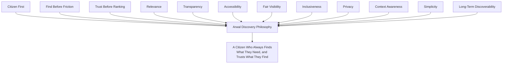

> **Callout — The One-Sentence Discovery Philosophy**
> *"A capability nobody can find does not exist for the citizen who needed it — discovery is the difference between what Arwal has built and what Arwal has actually delivered."*

---

# Discovery Value Chain

| Stage | Business Description |
|---|---|
| **Citizen Intent** | A citizen forms a genuine need — a price, a provider, a scheme, a job — often before they know exactly how to phrase it. |
| **Content Identification** | Every domain's discoverable content (a listing, a provider profile, a scheme, a civic service) is made available to the discovery layer, never siloed inside its own module. |
| **Eligibility Evaluation** | Where a result depends on a citizen's specific eligibility (a scheme, a subsidized service), that evaluation happens transparently and only against consented data, per RULE-003 and RULE-008. |
| **Relevance Assessment** | Every candidate result is assessed against the citizen's actual query, location, and context — never against what would be most convenient for Arwal to surface. |
| **Discovery Presentation** | Results are presented clearly, accessibly, and with visible trust signals (verification status, rating, distance) — never opaquely. |
| **Citizen Selection** | The citizen chooses a result, informed and unmanipulated. |
| **Action** | The citizen proceeds into the relevant journey — a booking, a purchase, an application — handed off cleanly from discovery into fulfillment. |
| **Feedback** | The citizen's selection, completion, or abandonment feeds back into future relevance and trust signals. |
| **Learning** | Aggregate patterns inform genuine improvement to future discovery — never used to manipulate a citizen's future choices. |
| **Continuous Improvement** | Every stage's performance data feeds the next cycle's Discovery Governance review. |

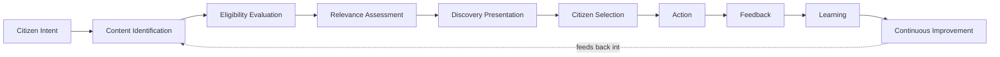

---

# Stakeholder Ecosystem

| Stakeholder | Strategic Role |
|---|---|
| **Citizens** | The primary seekers whose trust in discovery determines whether the platform is worth opening for a given need. |
| **Families** | The household unit through which a shared device or delegated search (per CAP-005) often actually occurs. |
| **Government Departments** | Providers of civic-service and scheme content whose discoverability determines whether a citizen ever learns a benefit exists. |
| **Merchants** | Supply-side participants whose commercial visibility depends entirely on fair, verifiable discovery. |
| **Service Providers** | Tutors, technicians, and healthcare professionals whose reputation and discoverability compound together, per CAP-045. |
| **Healthcare Providers** | The highest-stakes discovery category, where verification credibility matters more than any other ranking signal. |
| **Educational Institutions** | Discoverable tutors, coaching centers, and scholarship sources serving a student's future. |
| **Community Organizations** | NGOs, SHGs, and civic groups whose visibility extends their own trusted reach, per `ai-docs/75-community-social-engagement-strategy.md`. |
| **Farmers** | Both seekers (of price and scheme information) and, through direct-to-buyer listings, discoverable sellers themselves. |
| **Employers** | Supply-side participants in the Jobs discovery category, held to the same fairness standard as every other seller. |
| **Property Owners** | Sellers of a distinct, high-stakes, fraud-sensitive discovery category. |
| **Platform Administrators** | Internal operators accountable for discovery fairness, verification integrity, and anti-manipulation enforcement. |
| **Future Ecosystem Participants** | A second district's local content sources and providers, activated per `ai-docs/50-product-vision-business-strategy.md`'s Strategic Expansion Principles. |

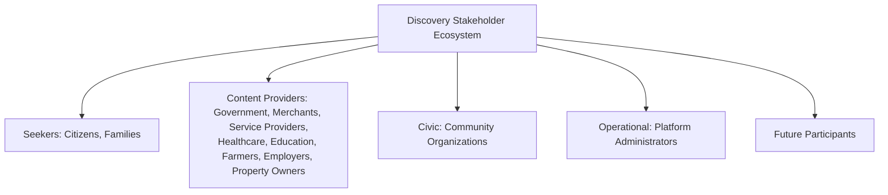

---

# Discovery Lifecycle

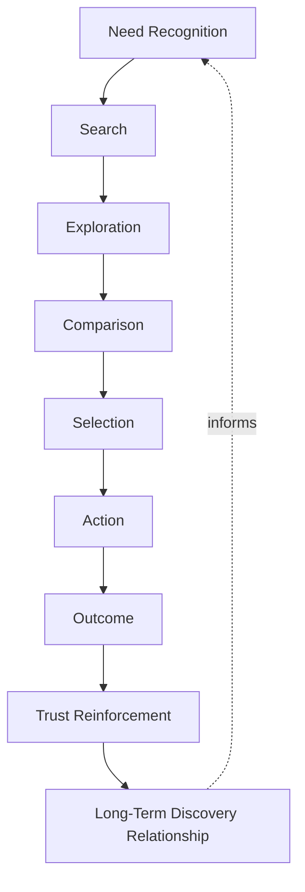

| Stage | Meaning |
|---|---|
| **Need Recognition** | A citizen becomes aware they need something — sometimes vague, sometimes precise. |
| **Search** | The citizen expresses that need, via text or voice, to the platform. |
| **Exploration** | The citizen browses beyond the first result, when the need is not yet fully resolved by a single answer. |
| **Comparison** | The citizen weighs genuinely comparable options — price, rating, verified status, distance. |
| **Selection** | The citizen commits to a specific result. |
| **Action** | The citizen proceeds into the relevant journey — booking, purchase, application. |
| **Outcome** | The citizen's need is met, or is not — either way, the outcome is a signal. |
| **Trust Reinforcement** | A good outcome reinforces the citizen's willingness to search again with confidence next time. |
| **Long-Term Discovery Relationship** | Over years, a citizen's trust in Arwal's discovery layer becomes a durable habit, mirroring the Persona Lifecycle in `ai-docs/52-user-personas-user-segmentation.md`. |

---

# Value Creation

| Question | Answer |
|---|---|
| **How do citizens create value?** | By searching honestly and engaging genuinely, generating the relevance and trust signals every future citizen's discovery experience benefits from. |
| **How do businesses create value?** | By maintaining accurate, verified, genuinely representative listings and profiles that make discovery worth trusting. |
| **How does government create value?** | By keeping civic-service and scheme content accurate and current, ensuring discovery reflects real, actionable benefit. |
| **How does Arwal create value?** | By converting a fragmented, word-of-mouth-dependent district into a single place where any genuine need can be reliably answered. |
| **How does trust develop?** | Through consistent, accurate, unmanipulated results — every honest search that resolves well compounds a citizen's willingness to search again. |
| **How does discovery reduce effort?** | By replacing "who do I know who might know this?" with a direct, fast, and fair answer. |
| **How does district participation increase?** | A citizen who trusts discovery for one need is measurably more likely to try Arwal for a second, unfamiliar need, per `ai-docs/50-product-vision-business-strategy.md`'s Cross-Vertical Adoption Depth. |

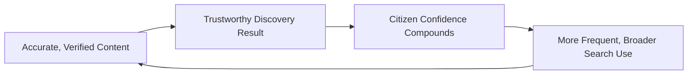

---

# Business Model

Every capability below is described strategically — the business rationale, never the implementation. The enforceable capability logic is owned entirely by `ai-docs/55-business-capability-map.md`'s CAP-030, CAP-032, and CAP-033.

| Capability | Business Rationale |
|---|---|
| **Global Search** | One trusted entry point for any citizen need, regardless of which vertical the answer lives in. |
| **Category Discovery** | Browsable structure for a citizen who does not yet have a specific query — serving the "I don't know what I need yet" moment. |
| **Service Discovery** | Discoverability of skilled local service providers, held to a verification standard proportional to the service's stakes. |
| **Merchant Discovery** | Fair, verified visibility for every local shop and seller, regardless of size or tenure. |
| **Government Scheme Discovery** | Closing the information-asymmetry gap that leaves eligible citizens unaware of benefits they qualify for. |
| **Healthcare Discovery** | The highest-trust discovery category — verification credibility outweighs every other ranking signal. |
| **Education Discovery** | Genuine, unmanipulated discoverability of tutors, coaching centers, and scholarships. |
| **Employment Discovery** | Fraud-screened, hyperlocal job and gig matching. |
| **Property Discovery** | Verified, fraud-resistant listing discovery for a high-value, low-frequency category. |
| **Agriculture Discovery** | A hybrid of informational (price, weather, scheme) and transactional (direct-to-buyer) discovery. |
| **Community Discovery** | Discoverability of genuinely relevant local groups, events, and civic content, per `ai-docs/75`. |
| **Location-Based Discovery** | Hyperlocal ranking reflecting genuine fulfillment feasibility for a district-scale, same-day-oriented platform. |
| **Personalized Discovery** | Discovery adapted to a citizen's own history and context, always explainable and never a substitute for organic relevance. |
| **Navigation Assistance** | Voice- and AI-Assistant-mediated guidance for a citizen who does not yet know how to phrase their need as a search query. |

```mermaid
graph TD
    BizModel5[Discovery Business Model] --> GlobalSearch[Global Search]
    BizModel5 --> CategoryDisc[Category Discovery]
    BizModel5 --> ServiceDisc[Service Discovery]
    BizModel5 --> MerchantDisc[Merchant Discovery]
    BizModel5 --> SchemeDisc[Government Scheme Discovery]
    BizModel5 --> HealthDisc2[Healthcare Discovery]
    BizModel5 --> EduDisc2[Education Discovery]
    BizModel5 --> EmployDisc[Employment Discovery]
    BizModel5 --> PropDisc[Property Discovery]
    BizModel5 --> AgriDisc[Agriculture Discovery]
    BizModel5 --> CommDisc[Community Discovery]
    BizModel5 --> LocationDisc[Location-Based Discovery]
    BizModel5 --> PersonalDisc[Personalized Discovery]
    BizModel5 --> NavAssist[Navigation Assistance]
```

---

# Trust & Quality Strategy

| Mechanism | Strategic Role |
|---|---|
| **Verified Results** | Every discoverable provider, merchant, or listing carries a visible, unspoofable verification status, per CAP-001 and CAP-016. |
| **Fair Visibility** | A new or small participant is never structurally invisible — discovery includes a genuine, evaluated on-ramp for new entrants. |
| **Transparency** | A citizen can understand, in plain language, why a result appeared and in what order — an undisclosed paid boost is never presented as organic relevance. |
| **Fraud Prevention** | Continuous, AI-assisted, always human-confirmed anomaly detection on listings and providers, per CAP-038. |
| **Privacy Protection** | Search history and behavioral signals are used only for the citizen's own consented personalization, per RULE-003. |
| **Accessibility** | Voice-first search and screen-reader-correct result presentation are first-class, not fallback, modes. |
| **Content Quality** | Stale, incomplete, or inaccurate listings are actively identified and either corrected or demoted, never left to mislead a citizen. |
| **Complaint Resolution** | A citizen's report of a misleading or fraudulent result follows the identical Grievance and Appeal disciplines already established in `ai-docs/58-business-rules-policies.md`. |
| **Government Coordination** | Civic-service and scheme content is jointly reviewed with the relevant department before activation, never unilaterally worded or ranked by Arwal alone. |
| **Discovery Trust** | Every mechanism above compounds into one felt outcome: a citizen who never has to wonder whether a search result is genuine or bought. |

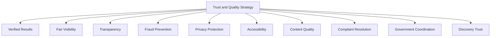

> **Callout — An Undisclosed Paid Result Is a Discovery-Trust Violation, Not a Growth Tactic**
> Per `ai-docs/65-marketplace-strategy.md`'s Marketplace Neutrality principle, any promoted or paid visibility mechanism is always visibly, unambiguously distinguishable from an organic result. Discovery's entire value rests on a citizen's belief that what they are shown is genuinely the best match — this distinction is treated with the same non-negotiable severity as any other Mission-Critical trust guarantee in this handbook.

---

# Economic & Social Impact

| Impact Area | How Arwal Contributes |
|---|---|
| **Improve Service Accessibility** | A citizen who could not previously know what existed nearby can now reliably find it. |
| **Increase Local Commerce** | Fair discoverability expands a merchant's reach beyond their immediate physical footprint. |
| **Support MSMEs** | Small and new sellers gain a genuine, fair on-ramp to visibility they could never achieve through informal channels alone. |
| **Improve Government Scheme Awareness** | Closing the specific "I didn't know this existed" gap already named as a founding failure mode in `ai-docs/00-project-vision.md`. |
| **Increase Employment Access** | Hyperlocal, fraud-screened job discovery reaching informal-sector workers national platforms structurally ignore. |
| **Improve Educational Access** | Genuine, rated discovery of local tutors, coaching centers, and scholarships replacing unreliable word-of-mouth. |
| **Strengthen Community Participation** | Discoverable local groups and events extend an NGO's or a collective's own reach, per `ai-docs/75-community-social-engagement-strategy.md`. |
| **Strengthen District Development** | A district whose commerce, civic services, and community life are all genuinely discoverable is a district better positioned across every development area already named in `ai-docs/64-district-ecosystem-mapping.md`. |

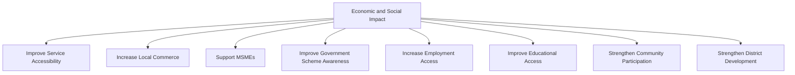

---

# Governance

### Ownership
Search & Discovery Strategy ownership sits with the Head of Platform Engineering (Search domain owner per `ai-docs/53-business-domain-model.md`'s DOM-015), with each vertical's discovery experience accountable to that vertical's own Business Owner, mirroring the Clear Ownership discipline already established throughout `ai-docs/53` through `ai-docs/76`.

### Discovery Council
A standing **Discovery Council** — chaired by the Head of Platform Engineering, with the CPO, Head of Trust & Safety, Head of Accessibility & Inclusion, Head of AI Platform, and rotating vertical Heads as members — holds approval authority over any platform-wide ranking-policy change, any new discoverable content category, and any material deviation from the Anti-Patterns below. The Council meets monthly, with ad hoc sessions for a Discovery Trust Score regression.

### Decision Authority

| Decision | Approves |
|---|---|
| New discoverable content category | Discovery Council + CEO |
| Ranking-policy change | Discovery Council |
| New promoted-visibility mechanism | Discovery Council + Revenue Review Board (`ai-docs/62`) |
| Government scheme/civic-content discovery rules | Discovery Council + Head of Government Partnerships |
| Emergency discovery-integrity response (e.g., a fraud or manipulation wave) | Head of Trust & Safety, immediate, ratified by Council within 5 business days |

### Review Cadence

| Review | Cadence | Owner |
|---|---|---|
| Discovery Health Review | Monthly | Discovery Council |
| Category Performance Review | Quarterly | Vertical Heads |
| Annual Discovery Strategy Review | Annual | CEO, Head of Platform Engineering, CPO |

### Conflict Resolution
A citizen's complaint about a misleading or unfair result follows RULE-009's Grievance discipline and RULE-028's Appeal right in full; a seller's dispute over ranking treatment follows the identical Escalation Paths already established in `ai-docs/51-stakeholder-analysis.md`, never resolved informally.

### Continuous Improvement
Every Feedback signal from the Discovery Value Chain feeds a shared, tracked improvement backlog, reviewed at the next Discovery Health Review, per the identical Continuous Improvement Loop already established in `ai-docs/60-customer-experience-strategy.md`.

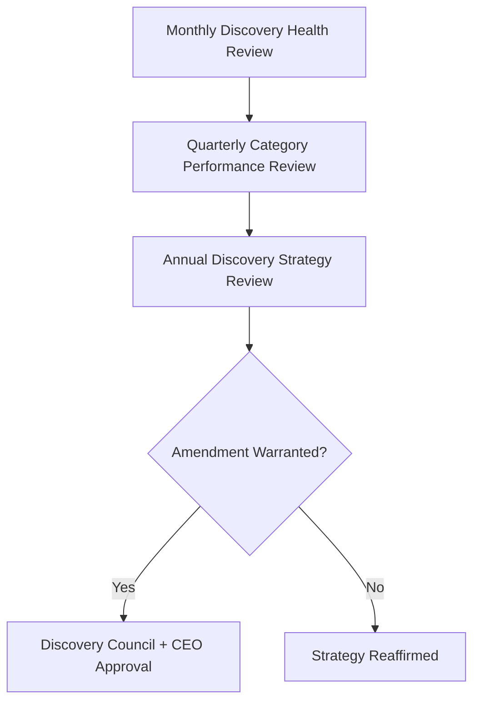

---

# Risks

| Risk | Description | Mitigation |
|---|---|---|
| **Hidden Services** | A genuinely available civic service or provider is never surfaced because it was never properly indexed. | Content Identification discipline; mandatory discoverability check per Module Release Readiness Criteria (`ai-docs/54`). |
| **Search Bias** | Results systematically favor one seller category, size class, or geography. | Fair Visibility monitoring; periodic bias audit per `ai-docs/52`'s Anti-Discrimination Safeguards. |
| **Unfair Ranking** | An undisclosed commercial factor influences ranking without citizen awareness. | Transparency principle; Marketplace Neutrality enforcement per `ai-docs/65`. |
| **Poor Accessibility** | A citizen using voice, a screen reader, or a low-bandwidth device cannot effectively search. | Accessibility-by-default discovery design per `ai-docs/12-accessibility-standards.md`. |
| **Privacy Risks** | Search history used beyond its consented, personalization-only purpose. | RULE-003's Consent Requirement; Restricted/Confidential-tier handling of behavioral data. |
| **Digital Exclusion** | A low-literacy or first-generation smartphone citizen cannot meaningfully use search. | Voice-first, icon-plus-text design; AI Assistant-mediated navigation for citizens who cannot phrase a query. |
| **Fraudulent Listings** | A fake or misrepresented listing appears in discovery results. | Fraud Detection (CAP-038); Verified Results mechanism; RULE-011's Prohibited Content standard. |
| **Information Overload** | Too many undifferentiated results leave a citizen unable to decide. | Simplicity principle; category and location-based narrowing before raw ranking depth. |
| **Trust Erosion** | A single manipulation or bias incident damages citizen trust in search platform-wide. | Transparent, evidence-based complaint resolution; rapid, honest incident communication. |
| **Regulatory Changes** | A data-protection or advertising-disclosure regulation shift invalidates a discovery-monetization assumption. | Configurable, government-reviewed discovery-monetization rules, never a hardcoded assumption. |

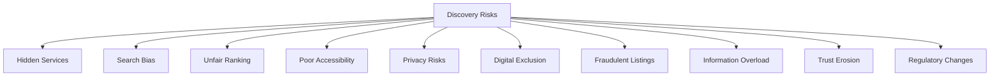

---

# Metrics

| Metric | Definition | Direction |
|---|---|---|
| **Successful Discoveries** | Count of searches resulting in a citizen-confirmed relevant outcome. | Increasing |
| **Search Success Rate** | % of searches resulting in a selected, acted-upon result. | Increasing |
| **Discovery Satisfaction** | Post-search CSAT specific to discovery, per `ai-docs/60-customer-experience-strategy.md`. | Increasing |
| **Time to Discovery** | Median and p95 time from search initiation to citizen selection. | Decreasing |
| **Discovery Trust Score** | District Trust Signal, viewed for discovery interactions specifically. | Increasing |
| **Accessibility Index** | Search-to-action completion parity for voice-first and assisted-mode citizens versus the general population. | Approaching parity |
| **Government Scheme Discovery Rate** | % of eligible citizens who successfully discover a scheme they qualify for. | Increasing |
| **Merchant Visibility Health** | Distribution of discovery exposure across merchant size/tenure segments, monitored for imbalance. | Balanced, never concentrated |
| **Search Ecosystem Health** | A composite index combining Search Success Rate, Discovery Trust Score, and Merchant Visibility Health. | Increasing |

> **Callout — No Discovery Metric Stands Alone**
> Per the North Star Principle already established in `ai-docs/00-project-vision.md`, a rising Search Success Rate alongside a falling Discovery Trust Score, or rising Merchant Visibility concentration alongside falling Fair Visibility, is treated as a regression — never counted as success in isolation.

---

# Anti-Patterns

| Anti-Pattern | Why It's Rejected |
|---|---|
| **Pay-to-rank** | Undisclosed paid ranking violates Trust Before Ranking and Transparency simultaneously. |
| **Hidden government services** | A civic service that exists but cannot be found defeats the entire Government Efficiency Strategic Objective. |
| **Popularity over relevance** | Ranking by raw engagement rather than genuine fit for the citizen's need violates Relevance. |
| **Dark patterns** | A discovery flow nudging a citizen toward Arwal's commercial interest over their own stated need violates Citizen First. |
| **Ignoring accessibility** | A search experience only a literate, well-connected citizen can use has failed Accessibility regardless of technical polish. |
| **Technology without transparency** | A sophisticated ranking system a citizen cannot understand or question violates Transparency, however accurate it may be. |
| **Search manipulation** | Coordinated fake engagement or review-driven ranking inflation directly attacks Trust Before Ranking. |
| **Growth without trust** | A rising Search Success Rate alongside a falling Discovery Trust Score is a regression, never a win. |

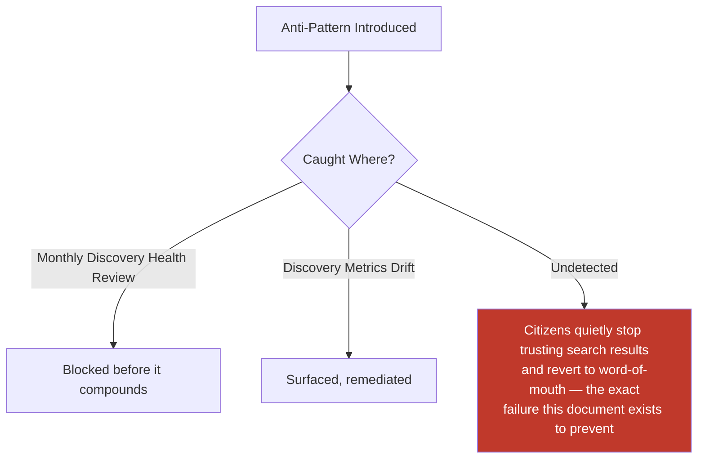

---

# Relationship to Previous Documents

| Prior Document | Relationship |
|---|---|
| **Project Vision (`ai-docs/00`)** | Establishes the founding fragmentation problem this document's discovery layer exists to solve — a citizen finding what they need without juggling twenty apps. |
| **User Personas (`ai-docs/52`)** | Supplies the individual, evidence-grounded citizens (Meena's voice-first needs, Arvind's screen-reader needs) this document's Accessibility commitments serve. |
| **Product Module Catalog (`ai-docs/54`)** | Supplies MOD-037 Search, the user-visible surface this document's strategy is expressed through. |
| **Business Capability Map (`ai-docs/55`)** | Supplies the stable abilities — Search (CAP-030), Recommendation Engine (CAP-032), AI Assistance (CAP-033) — this document's business model is built directly on top of. |
| **User Journey Standards (`ai-docs/56`)** | Supplies JRN-026 Search, the single-interaction experience this document's strategy is felt through. |
| **Customer Experience Strategy (`ai-docs/60`)** | Supplies the Trust Strategy and felt-experience bar every discovery interaction must clear. |
| **District Ecosystem Mapping (`ai-docs/64`)** | Supplies the whole-system Ecosystem Health view this document's discovery-specific health metrics feed into. |
| **Community & Social Engagement Strategy (`ai-docs/75`)** | Supplies the Community Discovery need this document's Community Discovery capability directly serves. |
| **Notification & Communication Strategy (`ai-docs/76`)** | Supplies the complementary "Arwal speaks to you" channel that a citizen's own active discovery ("you find it") is paired with. |

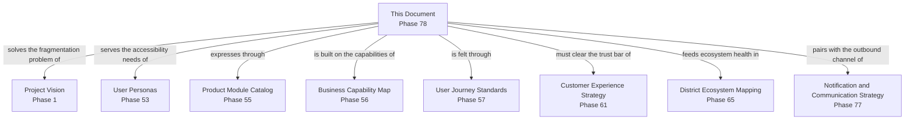

---

# Executive Artifacts

### Search Strategy Framework

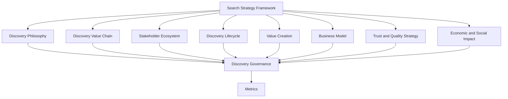

### Discovery Value Chain

See Discovery Value Chain section above — reproduced here by reference per Single Source of Truth, never duplicated.

### Discovery Lifecycle

See Discovery Lifecycle section above.

### Discovery Ecosystem Map

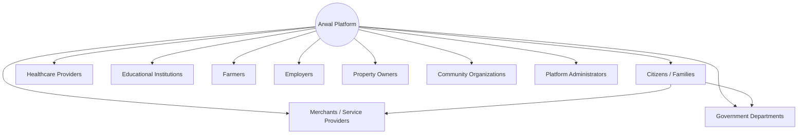

### Governance Model

See Governance section above.

### Discovery Growth Flywheel

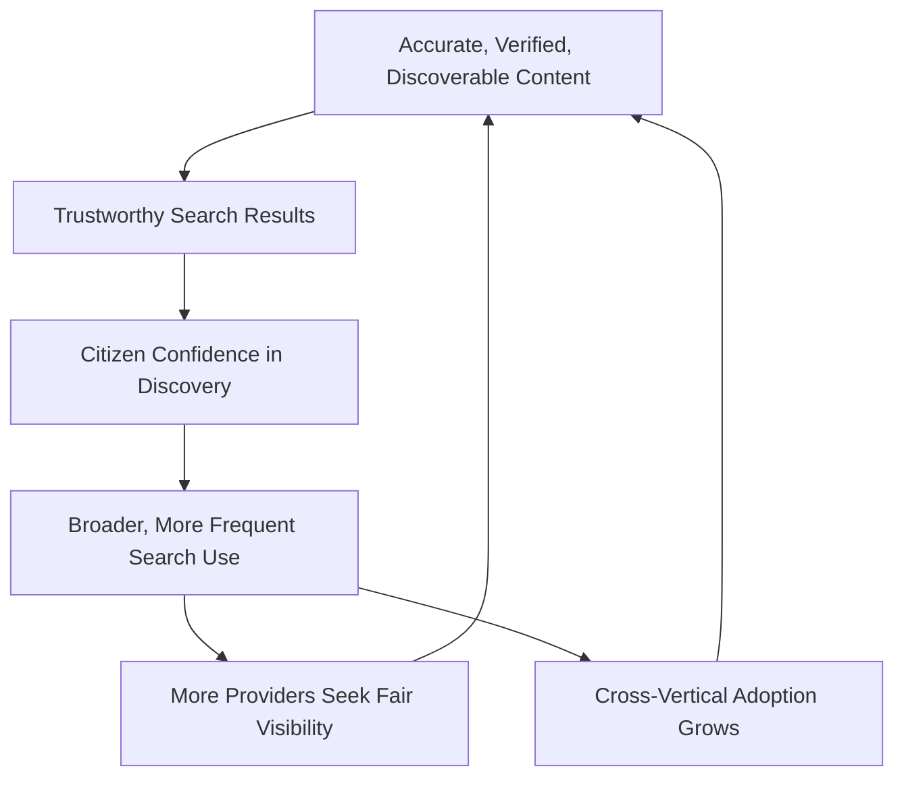

### Executive Dashboards

| Dashboard | Audience | Key Content |
|---|---|---|
| **CEO Dashboard** | CEO | Search Ecosystem Health, Discovery Trust Score, Government Scheme Discovery Rate |
| **Head of Platform Engineering Dashboard** | Head of Platform Engineering | Search Success Rate, Time to Discovery, category-level performance |
| **Trust & Safety Dashboard** | Head of Trust & Safety | Fraudulent-listing trend, ranking-manipulation incidents, complaint resolution rate |
| **Government Partners Dashboard** | Government liaisons | Scheme/civic-service discoverability trend, citizen scheme-awareness rate |

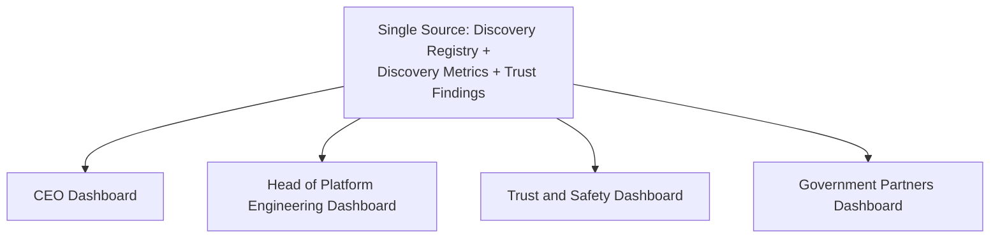

### Decision Matrix

| Decision Type | Approval Authority |
|---|---|
| New discoverable content category | Discovery Council + CEO |
| Ranking-policy change | Discovery Council |
| New promoted-visibility mechanism | Discovery Council + Revenue Review Board |
| Government scheme/civic-content discovery rules | Discovery Council + Head of Government Partnerships |
| Emergency discovery-integrity response | Head of Trust & Safety, ratified within 5 business days |

---

# Closing Statement

> **Callout — Closing Statement**
> Every prior document in this handbook explains what Arwal builds, how it earns trust, and how it sustains itself. This document explains the one layer that determines whether any of that ever reaches the citizen who needed it: the moment a farmer searches for today's price, a parent searches for a tutor, or a citizen searches for a scheme they never knew existed. A capability perfectly built and never found might as well not exist — discovery is the mechanism that turns everything else in this handbook from a possibility into a lived, trusted, everyday reality. A search result a citizen cannot trust is worse than no result at all, because it teaches them to stop searching — and a citizen who stops searching Arwal has quietly withdrawn from the platform's entire promise. Discovery, done honestly and fairly, is what lets a district's full depth — its shops, its doctors, its schemes, its opportunities — actually become visible to the people who need them, one confident search at a time. Where a future phase must deviate from a principle stated here, that deviation is made explicitly — through the Discovery Governance process above — never silently, and never by default.

This document, `ai-docs/77-search-discovery-strategy.md`, is Phase 78 of approximately 415. Every future information-architecture, ranking-policy, and discoverability decision is expected to trace back to a principle defined here, or to justify its deviation in writing.

**End of Phase 78 — `ai-docs/77-search-discovery-strategy.md`**