# AI Product Strategy

**Document:** `ai-docs/78-ai-product-strategy.md`
**Project:** Arwal — The District Super App
**Stage:** 2 — Product & Business Strategy
**Phase:** 79 — AI Product Strategy
**Status:** Approved for Product & Engineering Reference
**Audience:** CEO, CSO, CPO, Chief AI Officer, Enterprise Business Architects, AI Product Strategists, Human-Centered AI Consultants, Government Digital Transformation Consultants, Trust & Safety Strategists, Responsible AI Advisors, Privacy & Compliance Advisors, Accessibility Specialists, Investors

> **Callout — Purpose of This Document**
> `ai-docs/00-project-vision.md` through `ai-docs/77-search-discovery-strategy.md` established why Arwal exists, what it can do, who it serves, what it feels like to use, how it sustains itself, how it partners with government, the whole district ecosystem it operates inside, and how community, communication, and discovery each build trust. None of those documents answers the question that determines whether Arwal's next decade of capability is built responsibly or recklessly: **how does artificial intelligence strengthen every citizen interaction, business capability, and government service Arwal already provides — without ever quietly replacing the human judgment a district depends on?** This document is that answer — the authoritative AI Product Strategy every future AI-assisted feature, model decision, and automation boundary traces back to.

---

# Purpose of this Document

### Why AI Requires Its Own Strategic Layer

AI already appears throughout this handbook — an AI Opportunity field on nearly every capability in `ai-docs/55-business-capability-map.md`, an AI Assistance capability (CAP-033) in the Domain Model, an AI-Assisted Journey classification in `ai-docs/56-user-journey-standards.md`, an absolute automation boundary in RULE-024 of `ai-docs/58-business-rules-policies.md`. Each of those documents treats AI as one input among many, appropriately scoped to its own layer. None of them steps back to ask the question that sits above all of them: **why does Arwal use AI at all, what is it strategically for, and what would make its use worthy of the trust a citizen places in every other part of this platform?** This document is that step back — the single place where Arwal's reasoning about AI, as a strategic capability rather than a scattered feature, is written down once and cited everywhere else.

### This Is Not an Implementation Document

This document contains no model architecture, no prompt design, no vector database strategy, no inference infrastructure, and no API contract. It does not redefine AI Assistance (CAP-033), the AI Automation Boundary (RULE-024), or the AI Gateway Service already named in `ai-docs/09-tech-stack.md` — each remains fully authoritative and is cited, never restated. This document's exclusive territory is: **why AI is a strategic capability, who participates in it, how trust in AI is created and protected, and how that trust is governed and grown across a generation of district service.**

### Why AI Must Be Governed as Strategy, Not Bolted On as Feature

A platform that adds AI feature-by-feature, team-by-team, without a shared strategic reasoning, will inevitably produce inconsistent trust signals — one module's AI is transparent and overridable, another's is opaque and creeping toward unsupervised decision-making. Per the identical Consistency Everywhere principle already established in `ai-docs/60-customer-experience-strategy.md`, a citizen must experience one AI posture across the entire platform, never fifty different ones depending on which team built the screen they are on. This document exists to make that one posture explicit, binding, and permanent.

### The Chain of Reasoning This Document Extends

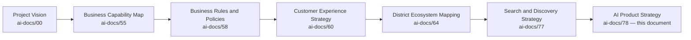

| Layer | Question It Answers |
|---|---|
| Project Vision | Why does a unified civic-commercial platform need to exist? |
| Business Capability Map | What can Arwal do, and where might AI accelerate it? |
| Business Rules & Policies | What, precisely, must a human always decide? |
| Customer Experience Strategy | What must a citizen feel, cumulatively? |
| District Ecosystem Mapping | What is the whole system AI operates inside? |
| Search & Discovery Strategy | How does a citizen find what they need? |
| **AI Product Strategy** (this document) | **Why does AI belong in that system at all, and how does it stay worthy of a citizen's trust?** |

### Scope Boundary

This document does not define a model's technical evaluation harness, a prompt's exact wording, or an inference pipeline's latency budget — those remain engineering territory owned elsewhere. Its territory is strategic: the philosophy, the stakeholder relationships, the value chain, and the governance that keep AI genuinely helpful, genuinely honest, and genuinely accountable to a human, forever.

---

# AI Philosophy

Every principle below exists because an AI strategy designed carelessly does not fail abstractly — it fails a specific farmer given a confidently wrong price, a specific citizen denied a service by a decision nobody can explain, or a specific officer who stops thinking critically because the system "usually gets it right."

### Citizen First
**Why it exists:** Every AI decision is judged first against whether it serves the citizen's actual need, never an internal efficiency or engagement metric, mirroring the identical Citizen-First tie-breaker already established throughout `ai-docs/51` through `ai-docs/77`.

### Human-in-the-Loop
**Why it exists:** AI recommends; a human decides wherever a decision carries civic, financial, or reputational weight. This is not a design preference — it is the operationalization of RULE-024's AI Automation Boundary, restated here as the founding posture of every AI feature Arwal will ever build.

### AI as Assistant
**Why it exists:** AI exists to make a citizen or officer more capable, never to make them unnecessary. An AI feature that quietly removes a human's ability to understand or override an outcome has become something other than an assistant, regardless of how it is marketed.

### Transparency
**Why it exists:** A citizen must be able to see, at any point, that AI was involved in producing what they are looking at — an AI-generated recommendation presented as if it came from an unaided human process is a transparency violation regardless of its accuracy.

### Explainability
**Why it exists:** Every AI-influenced outcome affecting a citizen's access to a service, their finances, or their reputation states, in plain language, the specific factor(s) behind it — never a bare score or an unexplained suggestion, per the identical Explainability requirement already established in `ai-docs/58-business-rules-policies.md`.

### Trust Before Automation
**Why it exists:** Automation is expanded only after the underlying AI capability has demonstrated, with evidence, that it is trustworthy at its current scope — never expanded on the assumption that trust will simply follow. Trust is earned first; automation follows it, never the reverse.

### Privacy
**Why it exists:** A citizen's data used to power an AI feature is used only for the stated, consented purpose, per RULE-003 — never repurposed to train a model on data the citizen did not agree to share, and never sent to an external provider without a reviewed data-handling justification.

### Accessibility
**Why it exists:** Voice-first, low-literacy-friendly AI interaction is the primary design target, not a secondary accommodation — per `ai-docs/12-accessibility-standards.md`'s non-negotiable floor, AI is where Arwal's accessibility commitment is most tested and most valuable.

### Fairness
**Why it exists:** An AI recommendation is evaluated identically regardless of a citizen's gender, caste, religion, disability, migrant status, or device tier, per the Anti-Discrimination Safeguards already established in `ai-docs/52-user-personas-user-segmentation.md`. A disparate outcome across protected groups is a defect, not an acceptable statistical variance.

### Inclusiveness
**Why it exists:** An AI strategy designed around the most digitally fluent, urban citizen has captured a fraction of the population it exists to serve — the low-literacy farmer speaking a regional dialect is a primary design target, never an edge case.

### Accountability
**Why it exists:** Every AI-influenced action is traceable to a specific model version, a specific input, and — where a human confirmed it — a specific named human, per Audit Logging (CAP-035). An AI decision nobody can later reconstruct or defend is a decision Arwal should never have made.

### Continuous Learning
**Why it exists:** An AI capability is never treated as "finished" — its accuracy, fairness, and citizen outcomes are monitored and improved continuously, per the same Continuous Improvement discipline already established throughout `ai-docs/60` through `ai-docs/77`.

### Long-Term Human Benefit
**Why it exists:** Arwal's AI strategy is evaluated on the same multi-decade horizon as every other strategic document in this handbook — an AI feature that boosts a quarter's efficiency metric while eroding a citizen's own judgment, skill, or agency over years is a regression, never a win.

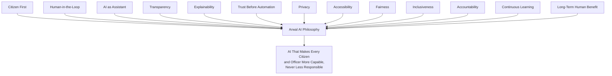

> **Callout — The One-Sentence AI Philosophy**
> *"Arwal's AI earns the right to assist by making a citizen's own judgment stronger — the moment it starts making that judgment unnecessary, it has stopped being an assistant and must stop being deployed."*

---

# AI Value Chain

| Stage | Business Description |
|---|---|
| **Citizen Need** | A citizen has a genuine question, task, or decision to make — a price to check, a form to fill, a service to find. |
| **Context Understanding** | The AI system understands the citizen's situation — their language, location, device, and active journeys — without assuming more than it was consented to know. |
| **Intent Understanding** | The AI system interprets what the citizen is actually asking for, even when phrased imprecisely or in a regional dialect. |
| **Knowledge Retrieval** | Relevant, verified information is retrieved from the appropriate domain — a scheme catalog, a price feed, a provider directory — never invented. |
| **Recommendation Generation** | A candidate answer, suggestion, or next step is generated, always distinguishable from an authoritative fact. |
| **Decision Support** | Where a genuine decision is required, AI presents the relevant considerations to the citizen or officer — never substitutes for their judgment. |
| **Human Review (where required)** | Per RULE-024, any civic, financial, or reputation-affecting outcome passes through a human-reachable review point before it takes final effect. |
| **Citizen Action** | The citizen (or officer) acts — accepting, adjusting, or rejecting the AI's contribution. |
| **Feedback** | The citizen's action and outcome are captured as a signal for whether the AI's assistance was genuinely useful. |
| **Learning** | Aggregate, consented feedback informs the next cycle's model and process improvement. |
| **Continuous Improvement** | Every stage's performance feeds AI Governance review, per the Governance section below. |

```mermaid
graph LR
    Need[Citizen Need] --> Context[Context Understanding]
    Context --> Intent[Intent Understanding]
    Intent --> Retrieval[Knowledge Retrieval]
    Retrieval --> Recommendation[Recommendation Generation]
    Recommendation --> DecisionSupport[Decision Support]
    DecisionSupport --> HumanReview[Human Review — where required]
    HumanReview --> Action[Citizen Action]
    Action --> Feedback[Feedback]
    Feedback --> Learning[Learning]
    Learning --> Improve[Continuous Improvement]
    Improve -.feeds back into.-> Context
```

---

# Stakeholder Ecosystem

| Stakeholder | Strategic Role |
|---|---|
| **Citizens** | The primary beneficiaries whose trust in AI determines whether any AI-assisted feature is actually used, or quietly avoided. |
| **Families** | The household unit through which AI-assisted, delegated interaction (per CAP-005) often actually occurs for an elderly or low-literacy citizen. |
| **Government Departments** | Recipients of AI-assisted triage and drafting support, always retaining final civic decision authority per RULE-024. |
| **Merchants** | Recipients of AI-assisted catalog, demand-forecasting, and copilot tooling that reduces their administrative burden without replacing their business judgment. |
| **Farmers** | Recipients of voice-first, plain-language AI advisory on price, weather, and scheme eligibility — the population this strategy's Accessibility commitment is most tested against. |
| **Healthcare Providers** | Recipients of AI-assisted scheduling and no-show prediction, never AI-assisted clinical decision-making, which remains outside Arwal's scope entirely. |
| **Educational Institutions** | Recipients of AI-assisted discovery matching, never AI-assisted grading or academic judgment. |
| **Businesses** | Recipients of AI-assisted operational tooling scaled to their own size and sophistication, per `ai-docs/54-product-module-catalog.md`'s Module Design Philosophy. |
| **Community Organizations** | Recipients of AI-assisted relevance ranking for community content, per `ai-docs/75-community-social-engagement-strategy.md`'s explicit rejection of virality-optimized ranking. |
| **Human Support Teams** | The guaranteed escalation destination for any AI interaction that cannot resolve a citizen's need, per Human-in-the-Loop above. |
| **AI Product Teams** | The internal function accountable for every AI feature's fairness, accuracy, and adherence to this strategy. |
| **Platform Administrators** | Internal operators accountable for AI-assisted fraud triage and verification support, always retaining final enforcement authority per RULE-026 and RULE-027. |
| **Future AI Participants** | A second district's AI-relevant data sources and government AI-integration partners, activated per `ai-docs/50-product-vision-business-strategy.md`'s Strategic Expansion Principles. |

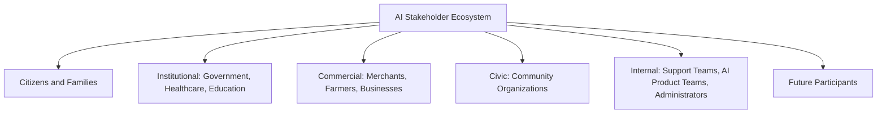

---

# AI Lifecycle

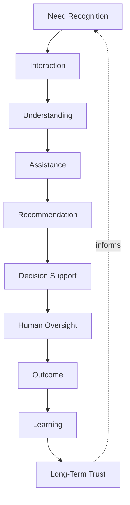

| Stage | Meaning |
|---|---|
| **Need Recognition** | A citizen or officer has a genuine task AI could plausibly help with. |
| **Interaction** | The citizen engages the AI Assistant, via voice, text, or an embedded suggestion. |
| **Understanding** | The AI system correctly interprets the citizen's actual need and context. |
| **Assistance** | The AI system offers guidance, information, or a drafted next step. |
| **Recommendation** | Where relevant, the AI system surfaces a specific, explainable suggestion. |
| **Decision Support** | The citizen or officer is given what they need to decide well — never a decision made for them where RULE-024 requires a human. |
| **Human Oversight** | A human confirms, adjusts, or overrides, per the applicable Business Rule's Human Oversight requirement. |
| **Outcome** | The citizen's need is met, or is not — either way, a signal is generated. |
| **Learning** | The outcome feeds future accuracy and fairness improvement, always with consent. |
| **Long-Term Trust** | A pattern of honest, accurate, respectfully-bounded AI assistance compounds into a citizen's willingness to rely on it again. |

---

# Value Creation

| Question | Answer |
|---|---|
| **How do citizens create value?** | By engaging honestly with AI assistance and providing genuine feedback, improving the system's accuracy and relevance for every future citizen. |
| **How does government create value?** | By supplying accurate, current civic data (scheme catalogs, department workflows) that AI assistance depends on to be genuinely useful rather than merely plausible-sounding. |
| **How do businesses create value?** | By using AI-assisted tooling to operate more efficiently, freeing their own attention for judgment AI cannot and should not replace. |
| **How does AI create value?** | By collapsing the gap between "a citizen has a need" and "a citizen understands their options," at a scale and speed no purely human support model could sustain across a million-citizen district. |
| **How does Arwal create value?** | By making AI assistance a trustworthy, consistent, platform-wide capability rather than a scattered, inconsistent set of features — the same unification advantage `ai-docs/50-product-vision-business-strategy.md` already establishes for the platform as a whole. |
| **How does trust develop?** | Through a sustained pattern of accurate, explainable, honestly-bounded AI assistance — every correctly-flagged uncertainty and every honored human-override request compounds it. |
| **How does AI reduce complexity?** | By translating a citizen's imprecise, plainly-phrased need into the correct capability, module, or civic process, without requiring the citizen to already understand Arwal's internal structure. |
| **How does district transformation accelerate?** | By giving every citizen — regardless of literacy, language, or prior digital experience — a patient, always-available first point of contact for anything Arwal offers, per the Civic Assistant vision already established in `ai-docs/00-project-vision.md`. |

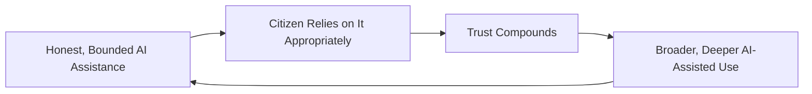

---

# Business Model

Every capability below is described strategically — the business rationale, never the implementation. The enforceable capability logic is owned entirely by `ai-docs/55-business-capability-map.md`'s CAP-033 and the AI Opportunity fields already distributed across every other capability.

| Capability | Business Rationale |
|---|---|
| **Citizen AI Assistant** | A single, voice-capable, patient point of contact for any citizen need, per `ai-docs/00-project-vision.md`'s Civic Assistant vision. |
| **Government AI Assistant** | Drafting and triage support for a government officer, never a substitute for their approval authority, per RULE-024 and `ai-docs/63-government-partnership-strategy.md`. |
| **Merchant Copilot** | Operational assistance (auto-categorized listings, demand nudges) that reduces the technical burden of running a digital storefront, per `ai-docs/67-merchant-ecosystem.md`. |
| **Farmer Assistant** | Voice-first, plainspoken price, weather, and scheme guidance — Arwal's most accessibility-critical AI surface, per PER-002 Meena's stated needs. |
| **Healthcare Guidance** | Scheduling and provider-discovery assistance only — never clinical advice, which remains categorically outside AI's role on this platform. |
| **Education Guidance** | Tutor and scholarship matching assistance, scoped to discovery, never academic judgment. |
| **Employment Guidance** | Job-matching and application-status assistance, scoped to discovery and process, never hiring decisions. |
| **Property Guidance** | Listing discovery and fraud-pattern flagging assistance, never transaction or valuation advice. |
| **AI Search Assistance** | Natural-language mediation over Search (CAP-030), helping a citizen phrase a need they could not otherwise articulate as a query. |
| **Conversational Discovery** | Multi-turn, context-retaining assistance for a citizen exploring an unfamiliar domain, per `ai-docs/77-search-discovery-strategy.md`'s Navigation Assistance capability. |
| **Workflow Assistance** | Step-by-step guided completion of a multi-step civic or commercial process, reducing abandonment without removing the citizen's own control at each step. |
| **Document Understanding** | Assistance extracting and pre-filling structured data from a citizen-submitted document, always subject to the citizen's own review before submission. |
| **Knowledge Assistance** | Plain-language answers to a citizen's general question about how Arwal or a civic process works. |
| **Personalized Guidance** | Recommendations shaped by a citizen's own consented history and context, always explainable and never a substitute for organic, fair discovery. |

```mermaid
graph TD
    BizModel[AI Business Model] --> CitizenAI[Citizen AI Assistant]
    BizModel --> GovAI[Government AI Assistant]
    BizModel --> MerchantCopilot[Merchant Copilot]
    BizModel --> FarmerAssist[Farmer Assistant]
    BizModel --> HealthGuide[Healthcare Guidance]
    BizModel --> EduGuide[Education Guidance]
    BizModel --> EmployGuide[Employment Guidance]
    BizModel --> PropGuide[Property Guidance]
    BizModel --> SearchAssist[AI Search Assistance]
    BizModel --> ConvDiscovery[Conversational Discovery]
    BizModel --> WorkflowAssist[Workflow Assistance]
    BizModel --> DocUnderstand[Document Understanding]
    BizModel --> KnowledgeAssist[Knowledge Assistance]
    BizModel --> PersonalGuide[Personalized Guidance]
```

---

# Trust & Responsible AI Strategy

| Mechanism | Strategic Role |
|---|---|
| **Human Oversight** | Every civic, financial, or reputation-affecting AI-influenced outcome carries a genuinely reachable human override, per RULE-024 — absolute, with no exception for a "low-risk" feature. |
| **AI Transparency** | A citizen always knows when AI produced or contributed to what they are seeing, per the Transparency principle above. |
| **Explainability** | Every AI-influenced recommendation states, in plain language appropriate to the citizen's literacy level, the specific factor(s) behind it. |
| **Bias Mitigation** | Every AI-assisted recommendation is periodically audited across persona segments for disparate outcome rates, per `ai-docs/52-user-personas-user-segmentation.md`'s Periodic Bias Audit. |
| **Privacy Protection** | No Restricted or Confidential-tier data is sent to an external model provider without a reviewed data-processing justification, per `ai-docs/10-security-standards.md`'s AI Security standards. |
| **Consent Management** | AI-assisted personalization draws only on data the citizen has explicitly consented to share for that purpose, per RULE-003. |
| **Hallucination Risk Reduction** | AI-generated content is always distinguishable from retrieved, verified fact — an AI system never presents an invented answer with the same confidence as a sourced one. |
| **Safety Guardrails** | Prompt-injection defenses and content-safety checks are applied consistently across every AI surface, per `ai-docs/10-security-standards.md`'s AI Security section. |
| **Government Coordination** | Any AI feature touching civic content or process is jointly reviewed with the relevant government department before activation, never unilaterally deployed by Arwal alone. |
| **Responsible AI Governance** | Every mechanism above is reviewed at the cadence defined in Governance below, never assumed self-sustaining once implemented. |

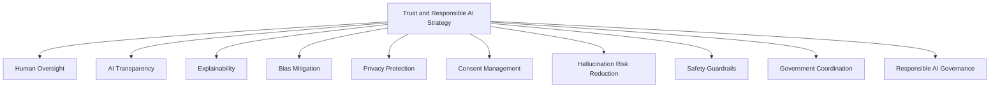

> **Callout — The AI Automation Boundary Is Absolute, Not a Default**
> Per RULE-024 in `ai-docs/58-business-rules-policies.md`, no AI or automated system may issue a final civic, financial, or reputation-affecting determination without a genuinely reachable human override — this is not a starting posture that AI Capability Maturity is expected to relax over time. It is the single most load-bearing guarantee in this entire strategy, held with the same non-negotiable severity Payment Idempotency (`ai-docs/74-payments-financial-services-strategy.md`) receives in the financial domain.

---

# Economic & Social Impact

| Impact Area | How Arwal's AI Strategy Contributes |
|---|---|
| **Increase Citizen Productivity** | Reduced time spent navigating unfamiliar civic and commercial processes, replaced with patient, plain-language guidance. |
| **Improve Government Efficiency** | AI-assisted triage and drafting reduces officer administrative burden without displacing their decision authority. |
| **Improve MSME Productivity** | Merchant Copilot tooling reduces the technical overhead of running a digital storefront for a small, non-technical seller. |
| **Increase Agricultural Productivity** | Timely, accurate, voice-first price and scheme guidance reduces a farmer's dependency on exploitative intermediaries. |
| **Improve Healthcare Access** | Reduced no-show rates and faster provider discovery, never at the expense of clinical judgment remaining entirely human. |
| **Improve Educational Outcomes** | Better-matched tutor and scholarship discovery for a student who would otherwise rely on unreliable word-of-mouth. |
| **Reduce Digital Divide** | Voice-first AI interaction gives a first-generation smartphone user a viable path to every capability a digitally fluent citizen already has. |
| **Strengthen District Development** | An AI layer that measurably improves outcomes across every other vertical reinforces `ai-docs/64-district-ecosystem-mapping.md`'s District Development Strategy across all ten of its areas simultaneously. |

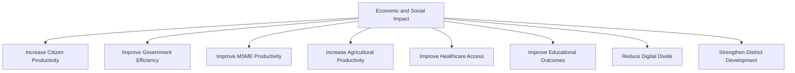

---

# Governance

### Ownership
AI Product Strategy ownership sits with the Chief AI Officer (or Head of AI Platform where the role is not yet split out), with each AI-assisted capability's Business Owner (per `ai-docs/55-business-capability-map.md`) accountable for their own feature's adherence to this strategy, mirroring the Clear Ownership discipline already established throughout `ai-docs/53` through `ai-docs/77`.

### AI Council
A standing **AI Council** — chaired by the Chief AI Officer, with the CPO, Head of Trust & Safety, Head of Accessibility & Inclusion, Compliance Officer, and rotating vertical Heads as members — holds approval authority over any new AI-assisted capability, any change to the AI Automation Boundary's implementation, and any material deviation from the Anti-Patterns below. The Council meets monthly, with ad hoc sessions for an AI Trust Score regression or a suspected boundary breach.

### Decision Authority

| Decision | Approves |
|---|---|
| New AI-assisted capability | AI Council + CEO |
| Any change touching the AI Automation Boundary (RULE-024) | AI Council + CTO + Compliance Officer (unanimous) |
| New model-provider relationship | AI Council + CTO, per `ai-docs/09-tech-stack.md`'s Provider Independence |
| Government-adjacent AI feature (civic content, scheme guidance) | AI Council + Head of Government Partnerships |
| Emergency AI-trust response (e.g., a hallucination incident, a bias finding) | Head of AI Platform, immediate, ratified by Council within 5 business days |

### Model Governance
Every model or provider used in production is registered, versioned, and evaluated against the Responsible AI Governance mechanisms above before deployment; a model change material enough to affect citizen-facing behavior is treated with the same Version Control discipline already established in `ai-docs/58-business-rules-policies.md`'s Rule Governance — never a silent swap.

### Human Escalation
Every AI-assisted journey names an explicit, always-visible path to a human, per the identical Human Escalation requirement already established in `ai-docs/56-user-journey-standards.md`'s AI Journey Strategy — this requirement has no exception for a "low-stakes" interaction.

### Review Cadence

| Review | Cadence | Owner |
|---|---|---|
| AI Trust & Performance Review | Monthly | AI Council |
| Bias & Fairness Audit | Quarterly | Head of AI Platform, Head of Accessibility & Inclusion |
| Annual AI Strategy Review | Annual | CEO, Chief AI Officer, CPO |

### Continuous Improvement
Every Feedback signal from the AI Value Chain feeds a shared, tracked improvement backlog, reviewed at the next AI Trust & Performance Review, per the identical Continuous Improvement Loop already established in `ai-docs/60-customer-experience-strategy.md`.

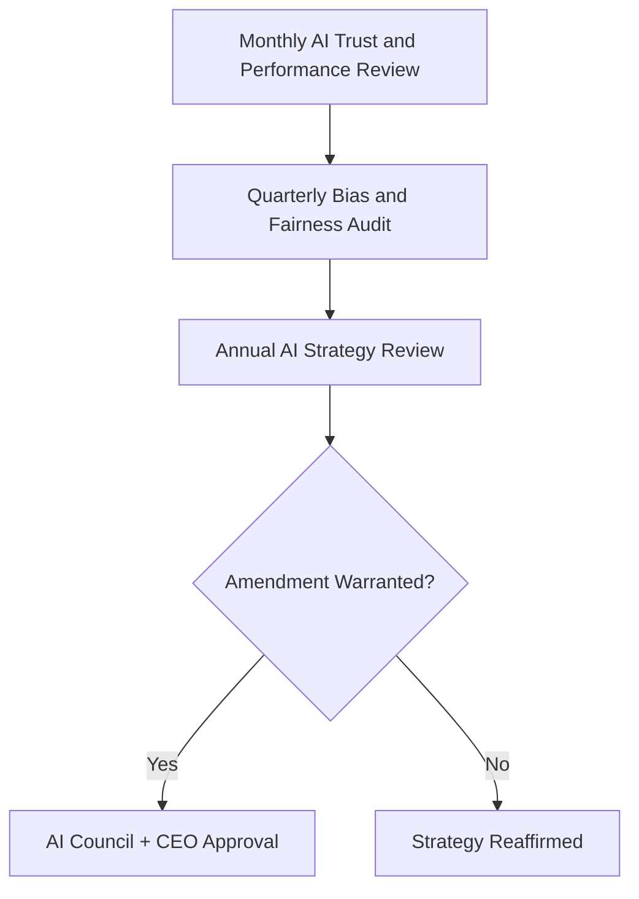

---

# Risks

| Risk | Description | Mitigation |
|---|---|---|
| **Hallucinations** | AI generates a plausible but false answer. | Hallucination Risk Reduction mechanism; retrieved-fact vs. generated-content distinction always visible to the citizen. |
| **Bias** | AI recommendations systematically disadvantage a protected group. | Bias Mitigation's periodic audit, per `ai-docs/52`'s Anti-Discrimination Safeguards. |
| **Privacy Risks** | Citizen data used beyond its consented AI purpose, or exposed to an external provider improperly. | Privacy Protection mechanism; RULE-003's Consent Requirement. |
| **Automation Overreach** | An AI feature begins making a final determination it was never authorized to make. | RULE-024's absolute Automation Boundary; AI Council unanimous approval required for any change near that boundary. |
| **Over-Reliance on AI** | A citizen or officer stops exercising their own judgment because "the AI is usually right." | Explainability and Transparency mechanisms designed to keep the human actively reasoning, never passively accepting. |
| **Digital Exclusion** | AI features assume a device, language, or literacy level a meaningful share of citizens do not have. | Accessibility and Inclusiveness principles; voice-first design as the primary, not secondary, mode. |
| **Loss of Human Judgment** | Officers or citizens gradually defer critical thinking to AI outputs over time. | Human-in-the-Loop's structural, not merely procedural, enforcement; periodic officer training reinforcing independent review. |
| **Regulatory Changes** | A data-protection or AI-specific regulation shift invalidates an existing AI workflow assumption. | Configurable, government-reviewed AI workflows, never a hardcoded assumption, per `ai-docs/01-product-goals.md`'s Regulatory Constraint. |
| **Trust Erosion** | A single mishandled AI incident damages citizen trust in AI features platform-wide. | Transparent, evidence-based incident response; rapid, honest communication per `ai-docs/76-notification-communication-strategy.md`. |
| **Model Drift** | An AI model's accuracy or fairness degrades silently over time as real-world conditions change. | Continuous Learning discipline; scheduled re-evaluation at the AI Trust & Performance Review cadence. |

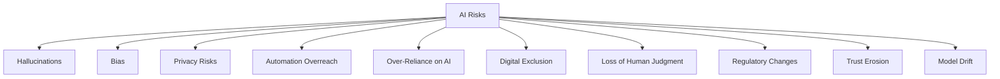

---

# Metrics

| Metric | Definition | Direction |
|---|---|---|
| **AI Adoption Rate** | % of eligible citizens engaging with an AI-assisted feature at least once. | Increasing |
| **Citizen Satisfaction** | CSAT specific to AI interactions, per `ai-docs/60-customer-experience-strategy.md`. | Increasing |
| **Task Success Rate** | % of AI-assisted interactions resulting in the citizen's need being met. | Increasing |
| **Human Escalation Rate** | % of AI interactions escalated to a human — tracked, never minimized as a target in itself. | Monitored for genuine need, not artificially suppressed |
| **AI Trust Score** | District Trust Signal, viewed for AI interactions specifically. | Increasing |
| **Recommendation Acceptance Rate** | % of AI recommendations a citizen or officer chooses to act on. | Increasing, alongside stable override rate |
| **Productivity Improvement** | Measured reduction in time-to-completion for an AI-assisted journey versus its non-assisted baseline. | Increasing |
| **Responsible AI Compliance** | % of AI features passing their scheduled Bias & Fairness Audit without an open finding. | Approaching 100% |
| **AI Ecosystem Health** | A composite index combining Trust Score, Task Success Rate, Human Escalation appropriateness, and Compliance. | Increasing |

> **Callout — No AI Metric Stands Alone**
> Per the North Star Principle already established in `ai-docs/00-project-vision.md`, a rising AI Adoption Rate alongside a falling AI Trust Score, or a falling Human Escalation Rate alongside a rising complaint rate, is treated as a regression — never counted as success in isolation. A near-zero Human Escalation Rate is itself a warning sign, not an achievement, since it may indicate a suppressed rather than a genuinely unnecessary escalation path.

---

# Anti-Patterns

| Anti-Pattern | Why It's Rejected |
|---|---|
| **AI replacing humans** | Any feature that removes, rather than augments, a human's final say on a civic, financial, or reputational matter violates RULE-024 and Human-in-the-Loop absolutely. |
| **Opaque decisions** | An AI-influenced outcome a citizen cannot understand or question violates Transparency and Explainability. |
| **Automation without oversight** | Expanding automated scope without a corresponding, demonstrated trust basis violates Trust Before Automation. |
| **Ignoring accessibility** | An AI feature usable only by a literate, well-connected citizen has failed Accessibility regardless of technical sophistication. |
| **Ignoring consent** | Using citizen data for AI purposes beyond what was explicitly consented to violates Privacy and RULE-003. |
| **Hallucination acceptance** | Treating an AI-generated but unverified answer as equivalent to a sourced fact violates Hallucination Risk Reduction. |
| **Growth without trust** | A rising AI Adoption Rate alongside a falling AI Trust Score is a regression, never a win. |
| **Technology before citizens** | Deploying an AI feature because it is technically impressive rather than because a citizen's Experience Goal requires it violates Citizen First. |
| **Vendor lock-in** | Structuring Arwal's own AI capability so a single model provider becomes existential leverage contradicts the Project Vision's rejection of proprietary lock-in, extended here to AI infrastructure specifically. |

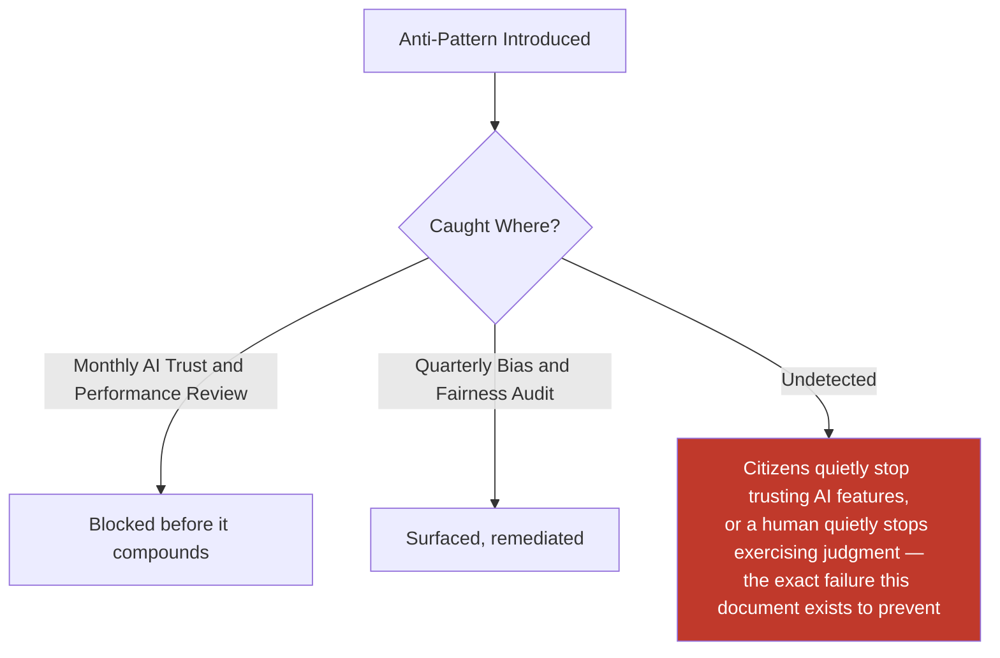

---

# Relationship to Previous Documents

| Prior Document | Relationship |
|---|---|
| **Project Vision (`ai-docs/00`)** | Establishes the founding AI Vision and AI Principle — explainable, overridable, never denying a citizen a service unsupervised — this document's every mechanism operationalizes. |
| **User Personas (`ai-docs/52`)** | Supplies the individual, evidence-grounded citizens (Meena's voice-first needs, Lakshmi's low-literacy needs) this document's Accessibility and Inclusiveness commitments serve, and the Anti-Discrimination Safeguards this document's Bias Mitigation extends. |
| **Business Domain Model (`ai-docs/53`)** | Supplies the AI Assistant domain (DOM-017) this document's strategy is built on top of. |
| **Product Module Catalog (`ai-docs/54`)** | Supplies MOD-039 AI Assistant, the user-visible surface this document's Business Model is expressed through. |
| **Business Capability Map (`ai-docs/55`)** | Supplies CAP-033 AI Assistance and the AI Opportunity field distributed across nearly every other capability, which this document's Business Model consolidates into one coherent strategy. |
| **User Journey Standards (`ai-docs/56`)** | Supplies JRN-027 AI Assistant Interaction and its AI Journey Strategy — Journey Guidance, Context-Aware Assistance, Human Escalation — this document generalizes into a platform-wide strategic posture. |
| **Business Rules & Policies (`ai-docs/58`)** | Supplies RULE-024's AI Automation Boundary, the single most load-bearing rule this entire document is built around. |
| **Customer Experience Strategy (`ai-docs/60`)** | Supplies the "AI Assists, Humans Decide" experience principle and the "Comfortable and Unpatronized" target emotion this document's every AI interaction must achieve. |
| **Revenue & Sustainability Strategy (`ai-docs/62`)** | Supplies the Responsible Innovation principle — a new monetization or automation mechanism evaluated for trust effect before revenue potential — this document extends specifically to AI features. |
| **District Ecosystem Mapping (`ai-docs/64`)** | Supplies the Shared Trust dependency this document's platform-wide AI consistency directly protects. |
| **Payments & Financial Services Strategy (`ai-docs/74`)** | Supplies the absolute-certainty, non-negotiable-guarantee standard (Payment Idempotency) this document's AI Automation Boundary is held to the same severity as. |
| **Community & Social Engagement Strategy (`ai-docs/75`)** | Supplies the explicit rejection of virality-optimized ranking this document's AI-assisted community relevance ranking is bound by. |
| **Notification & Communication Strategy (`ai-docs/76`)** | Supplies the Right Message, Right Time, Right Audience discipline this document's AI-assisted send-time and relevance optimization must never violate. |
| **Search & Discovery Strategy (`ai-docs/77`)** | Supplies Trust Before Ranking and Fair Visibility, the discovery-layer trust commitments this document's AI-assisted personalization and ranking must never undermine. |

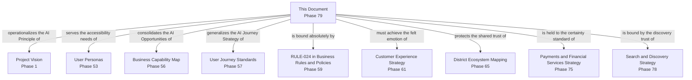

---

# Executive Artifacts

### AI Strategy Framework

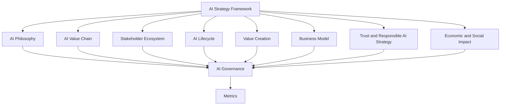

### AI Value Chain

See AI Value Chain section above — reproduced here by reference per Single Source of Truth, never duplicated.

### AI Lifecycle

See AI Lifecycle section above.

### AI Ecosystem Map

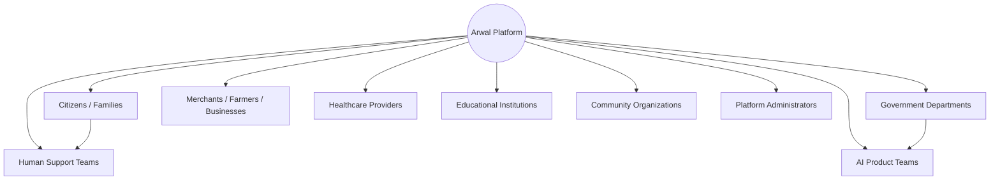

### Responsible AI Governance Model

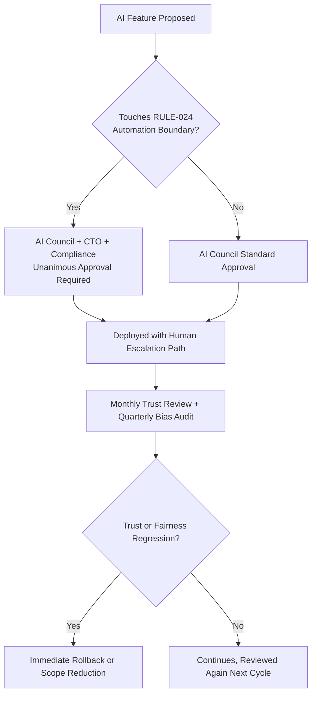

### Human-AI Collaboration Model

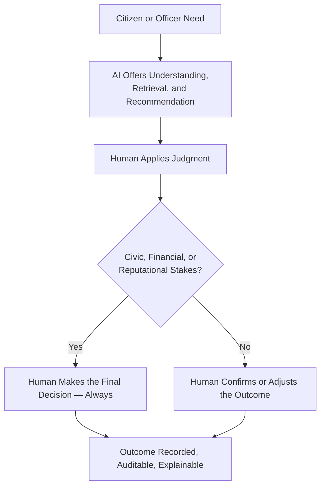

### AI Growth Flywheel

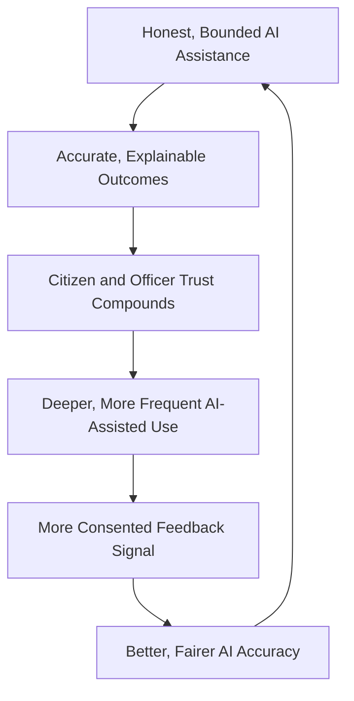

### Executive Dashboards

| Dashboard | Audience | Key Content |
|---|---|---|
| **CEO Dashboard** | CEO | AI Ecosystem Health, AI Trust Score, District Development contribution |
| **Chief AI Officer Dashboard** | Chief AI Officer | AI Adoption Rate, Task Success Rate, Human Escalation Rate |
| **Trust & Safety Dashboard** | Head of Trust & Safety | Bias-audit findings, hallucination-incident trend, boundary-compliance status |
| **Government Partners Dashboard** | Government liaisons | Government AI Assistant performance, joint-reviewed civic AI content status |

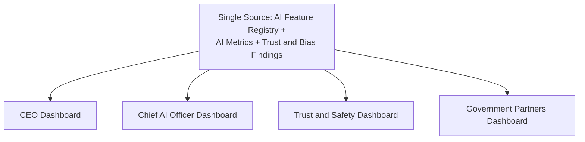

### Decision Matrix

| Decision Type | Approval Authority |
|---|---|
| New AI-assisted capability | AI Council + CEO |
| Change touching the AI Automation Boundary | AI Council + CTO + Compliance Officer (unanimous) |
| New model-provider relationship | AI Council + CTO |
| Government-adjacent AI feature | AI Council + Head of Government Partnerships |
| Emergency AI-trust response | Head of AI Platform, ratified within 5 business days |

---

# Closing Statement

> **Callout — Closing Statement**
> Every prior document in this handbook explains what Arwal builds, how it earns trust, and how it sustains itself. This document explains the layer that could either deepen all of that trust or quietly spend it faster than any other capability on the platform: artificial intelligence, deployed at the scale of an entire district's daily civic and commercial life. A farmer asking a voice assistant today's fair price, a citizen asking why their application is delayed, an officer asking for help drafting a response — each of these moments is an opportunity for AI to make a person more capable, or a risk that it quietly makes them less responsible. Arwal's AI strategy exists to guarantee the former, permanently: every recommendation explainable, every consequential decision human, every model accountable, and every citizen free to trust Arwal's AI precisely because it never asks them to trust it blindly. A platform that gets this right does not just add a feature — it builds the single most scalable form of civic patience a district has ever had access to. Where a future phase must deviate from a principle stated here, that deviation is made explicitly — through the AI Governance process above — never silently, and never by default.

This document, `ai-docs/78-ai-product-strategy.md`, is Phase 79 of approximately 415. Every future AI-assisted feature, model decision, and automation boundary is expected to trace back to a principle defined here, or to justify its deviation in writing.

**End of Phase 79 — `ai-docs/78-ai-product-strategy.md`**