# Trust & Safety Framework

**Document:** `ai-docs/79-trust-safety-framework.md`
**Project:** Arwal — The District Super App
**Stage:** 2 — Product & Business Strategy
**Phase:** 80 — Trust & Safety Framework
**Status:** Approved for Product & Engineering Reference
**Audience:** CEO, CSO, CPO, Chief Trust & Safety Officer, Enterprise Business Architects, Platform Governance Strategists, Digital Trust Consultants, Government Digital Services Advisors, Responsible AI Advisors, Privacy & Compliance Officers, Risk Management Consultants, Accessibility Specialists, Investors

> **Callout — Purpose of This Document**
> `ai-docs/00-project-vision.md` through `ai-docs/78-ai-product-strategy.md` established why Arwal exists, what it can do, who it serves, what it feels like to use, how it sustains itself, how it partners with government, the whole district ecosystem it operates inside, and how marketplace, payments, community, communication, discovery, and AI each build trust within their own territory. None of those documents answers the question that sits above all of them, binding every one of them together: **what is trust, as Arwal's single most valuable long-term asset, and how is it deliberately established, protected, measured, and strengthened — everywhere, all the time, across every citizen, merchant, farmer, provider, department, and AI system that touches the platform?** This document is that answer — the authoritative Trust & Safety Framework every future safety, integrity, and trust decision traces back to.

---

# Purpose of this Document

### Why Trust & Safety Is a Distinct, Superordinate Strategic Layer

Every prior Stage 2 document already contains a Trust & Quality Strategy section of its own — `ai-docs/65-marketplace-strategy.md`'s Trust & Safety Strategy, `ai-docs/74-payments-financial-services-strategy.md`'s Trust & Quality Strategy, `ai-docs/75-community-social-engagement-strategy.md`'s Trust & Quality Strategy, `ai-docs/77-search-discovery-strategy.md`'s Trust & Quality Strategy, `ai-docs/78-ai-product-strategy.md`'s Trust & Responsible AI Strategy. Each of those is deliberately scoped to its own vertical — how a citizen trusts a specific marketplace transaction, a specific payment, a specific community space. None of them answers the question that sits above all of them: **is trust the same thing everywhere on Arwal, and if a citizen trusts Arwal in one place, does that trust genuinely, safely transfer everywhere else?** This document is where that question is answered once, explicitly, and cited by every vertical trust mechanism that came before it. It is the keystone the individual vertical arches all lean against.

### This Is Not a Cybersecurity, IAM, Fraud-Detection, or Moderation Implementation Document

This document contains no encryption standard, no authentication protocol, no fraud-scoring model, no moderation-queue workflow, and no AI-safety implementation. It does not redefine Security Standards (`ai-docs/10`), Identity Verification (CAP-001), Fraud Detection (CAP-038), Content Moderation (CAP-037), or the AI Automation Boundary (RULE-024) — each remains fully authoritative in its own document and is cited, never restated. This document's exclusive territory is: **why trust is Arwal's most valuable asset, who participates in creating and protecting it, how it is created and compounds across every vertical, and how it is governed, measured, and defended for a generation.**

### Why Trust Is Arwal's Single Most Valuable Long-Term Asset

A district's citizens, farmers, merchants, and government departments already had commerce, healthcare, agriculture, and civic administration before Arwal existed — what they lacked was a single, trustworthy layer connecting all of it. Per `ai-docs/00-project-vision.md`'s founding premise, fragmentation is the disease Arwal exists to cure, and trust is the only mechanism capable of curing it: a citizen will not consolidate their commerce, health, civic, and financial life into one platform unless that platform has proven, repeatedly and verifiably, that it is worthy of that consolidation. Every other asset Arwal holds — its technology, its capital, its government relationships — is replicable by a well-funded competitor. Trust, once earned district-wide over years of consistent, safe, fair conduct, is not.

### How Safety Enables Sustainable Growth, Rather Than Constraining It

A platform that grows recklessly — verifying loosely, moderating weakly, automating unsupervised decisions — will show impressive short-term metrics and an inevitable long-term collapse the moment a citizen is harmed in a way that becomes visible to their neighbors. Per the North Star Principle already established in `ai-docs/00-project-vision.md`, growth without trust is not growth at all — it is borrowed time. Safety is not a tax on growth; it is the only kind of growth durable enough to survive a generation, which is the horizon every document in this handbook is written against.

### How Trust Connects Every Business Capability

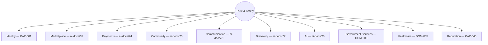

No capability in the Master Capability Registry (`ai-docs/55-business-capability-map.md`) is trust-independent — every one of them either draws on Identity Verification (CAP-001) to know who it is dealing with, on Trust & Safety (CAP-036) to resolve what goes wrong, or on Reputation & Rating Management (CAP-045) to signal who has earned confidence over time. This document is where that shared dependency is reasoned about as a single system rather than fifty scattered implementations.

### The Chain of Reasoning This Document Sits Atop

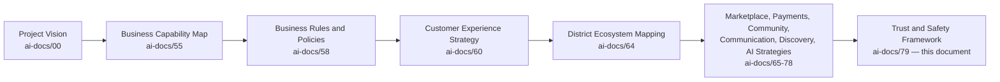

### Scope Boundary

This document does not define a verification workflow's technical steps, a fraud model's scoring logic, a moderation queue's routing rules, or an AI safety guardrail's implementation — each of those is engineering or operational territory owned elsewhere in this handbook. Its territory is strategic and cross-cutting: the philosophy, the value chain, the stakeholder relationships, and the governance that make trust a single, coherent, defensible asset spanning every vertical Arwal will ever build.

---

# Trust Philosophy

Every principle below exists because a trust strategy assembled carelessly does not fail abstractly — it fails a specific citizen defrauded by an unverified seller, a specific farmer whose dispute was never heard, or a specific district that stops believing Arwal is worth depending on.

### Citizen First
**Why it exists:** Every trust and safety decision is judged first against whether it protects the citizen, never against what is most convenient for Arwal's growth metrics, mirroring the identical Citizen-First tie-breaker already established throughout `ai-docs/51` through `ai-docs/78`.

### Trust Before Growth
**Why it exists:** A citizen acquired through weak verification or lax safety standards is not a citizen gained — they are a liability waiting to become an incident. Trust is the precondition every growth number is measured against, never a variable traded against it, restating the North Star Principle already established in `ai-docs/00-project-vision.md`.

### Safety by Design
**Why it exists:** Safety considered after a feature ships is safety considered too late — every capability, journey, and AI feature is designed with its trust and safety implications in mind from its first draft, mirroring the identical Security by Design and Accessibility by Design disciplines already established in `ai-docs/10-security-standards.md` and `ai-docs/56-user-journey-standards.md`.

### Transparency
**Why it exists:** A citizen must be able to see how a trust decision was made — why an account was suspended, why a listing was removed, why a dispute was resolved a certain way — concealment breeds exactly the suspicion `ai-docs/60-customer-experience-strategy.md` already rejects, amplified by the stakes of trust itself.

### Human Accountability
**Why it exists:** Every trust and safety decision affecting a citizen's access, finances, or reputation is traceable to a named, accountable human, per RULE-024's AI Automation Boundary — a decision nobody can defend is a decision Arwal should never have made.

### Privacy
**Why it exists:** Trust and safety work depends on sensitive data — identity documents, dispute evidence, behavioral signals — used only for its stated, consented purpose, per RULE-003, never repurposed or exposed beyond what protecting the citizen genuinely requires.

### Fairness
**Why it exists:** The same evidence, evaluated by any officer, moderator, or system, produces the same category of outcome — a citizen or seller is never treated more harshly or leniently based on size, tenure, or revenue contribution, mirroring `ai-docs/58-business-rules-policies.md`'s Consistency principle.

### Accessibility
**Why it exists:** A trust and safety mechanism only a digitally fluent, literate citizen can use — a complex dispute form, a text-only reporting flow — has failed exactly the citizens most likely to be vulnerable to harm, per `ai-docs/12-accessibility-standards.md`'s non-negotiable floor.

### Responsible AI
**Why it exists:** AI accelerates trust and safety work — fraud triage, anomaly detection, content screening — but never replaces the human judgment a civic, financial, or reputational decision requires, per RULE-024, restated here as a load-bearing trust principle in its own right.

### Verified Participation
**Why it exists:** A platform's trust ceiling is set by its verification floor — every participant granted an elevated role (merchant, provider, officer) has earned that role through a genuine, evidenced verification standard, per CAP-001 and CAP-016, never through convenience or self-attestation alone.

### Least Harm
**Why it exists:** Where a trust and safety intervention carries a risk of over-correction (a wrongly suspended account, an over-aggressive fraud block), the response is calibrated to the least harm that still protects the citizen or platform, never a maximally cautious response that punishes the innocent alongside the guilty.

### Continuous Improvement
**Why it exists:** A trust and safety posture designed once and never revisited decays as fraud patterns, citizen expectations, and regulatory context evolve — improvement is a scheduled, standing discipline, per the same Continuous Improvement Loop already established throughout `ai-docs/60` through `ai-docs/78`.

### Long-Term Public Trust
**Why it exists:** Arwal's trust posture is evaluated on the same generational horizon as every other strategic document in this handbook — a trust decision optimized for this quarter's growth at the cost of the district's confidence over the next decade is a regression, never a win.

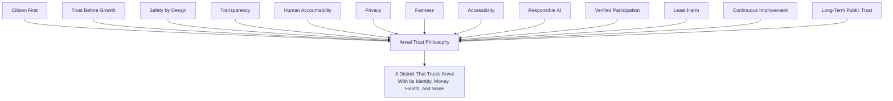

> **Callout — The One-Sentence Trust Philosophy**
> *"Arwal's every other asset can be copied by a well-funded competitor — the only thing that cannot be copied is a decade of a district trusting it was right to depend on this platform, and that trust is spent or grown with every single interaction, never held neutrally in between."*

---

# Trust Value Chain

| Stage | Business Description |
|---|---|
| **Identity Establishment** | A citizen, merchant, provider, or officer establishes a presence on Arwal, the first moment trust begins to be built or withheld. |
| **Verification** | The participant's real-world identity, and where relevant their credentials, are confirmed per CAP-001 and CAP-016, converting an anonymous presence into an accountable one. |
| **Trust Building** | Early, low-stakes interactions — a browse, a first small purchase, a first completed booking — accumulate into a citizen's growing confidence in the platform. |
| **Safe Participation** | A verified participant engages in commerce, civic services, or community life within a system actively monitored for fraud, abuse, and harm. |
| **Transaction Confidence** | A citizen commits to a higher-stakes action — a payment, a certificate application, a healthcare booking — because prior safe participation has earned that confidence. |
| **Issue Detection** | Where something genuinely goes wrong — a fraud pattern, a policy violation, a dispute — it is identified as early and precisely as possible. |
| **Incident Response** | A detected issue is investigated and addressed through a fair, evidence-based, proportionate process. |
| **Recovery** | Both the affected citizen and, where appropriate, the responsible party are brought to a resolved, fair outcome — a refund issued, an account reinstated, a listing corrected. |
| **Continuous Improvement** | Every incident's root cause feeds back into stronger verification, better detection, and clearer policy for every future participant. |
| **Long-Term Trust** | The cumulative pattern of safe, fair, well-resolved interactions compounds into a citizen's — and a district's — durable confidence in the platform. |

```mermaid
graph LR
    Identity2[Identity Establishment] --> Verification2[Verification]
    Verification2 --> TrustBuild2[Trust Building]
    TrustBuild2 --> SafePart[Safe Participation]
    SafePart --> TxnConfidence[Transaction Confidence]
    TxnConfidence --> IssueDetect[Issue Detection]
    IssueDetect --> IncidentResp[Incident Response]
    IncidentResp --> Recovery2[Recovery]
    Recovery2 --> ContImprove2[Continuous Improvement]
    ContImprove2 --> LongTermTrust2[Long-Term Trust]
    LongTermTrust2 -.reinforces.-> TrustBuild2
```

---

# Stakeholder Ecosystem

| Stakeholder | Strategic Role in Trust & Safety |
|---|---|
| **Citizens** | The population whose safety and confidence determine whether the entire platform is worth depending on. |
| **Families** | The household unit through which delegated, assisted trust (per CAP-005) is extended to a citizen who cannot independently verify or transact. |
| **Government** | Both a beneficiary of platform trust (a citizen who trusts Arwal trusts the civic services delivered through it) and a source of regulatory accountability Arwal is measured against. |
| **Merchants** | Supply-side participants whose own verification and fair treatment determine whether commerce on the platform is trustworthy in both directions. |
| **Farmers** | Participants whose trust in fair pricing and safe direct-to-buyer sale determines whether Agriculture's core promise is real. |
| **Healthcare Providers** | Participants held to the highest verification bar on the platform, given the stakes of a citizen's health decisions. |
| **Educational Institutions** | Participants whose trust obligations are elevated by potential minor involvement, per RULE-016. |
| **Businesses** | Commercial participants across every vertical whose fair, consistent treatment sustains their willingness to invest in the platform. |
| **Community Organizations** | NGOs, SHGs, and civic groups whose own trusted local standing either reinforces or is put at risk by their association with Arwal. |
| **Platform Administrators** | Internal operators accountable for verification, enforcement, and platform-integrity operations. |
| **Trust & Safety Teams** | The internal function directly accountable for the health of every mechanism in this document. |
| **Human Support Teams** | The guaranteed escalation destination for any citizen whose trust concern cannot be resolved through self-service. |
| **AI Systems** | A trust and safety accelerant — never a final decision-maker — bounded absolutely by RULE-024. |
| **Regulators** | External authorities whose confidence in Arwal's conduct determines its continued legitimacy to operate at civic scale. |
| **Future District Partners** | A second district's institutions and citizens, who will inherit — and independently re-earn — Arwal's trust reputation, per the Strategic Expansion Principles in `ai-docs/50-product-vision-business-strategy.md`. |

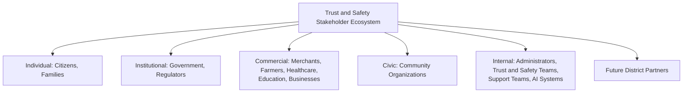

---

# Trust Lifecycle

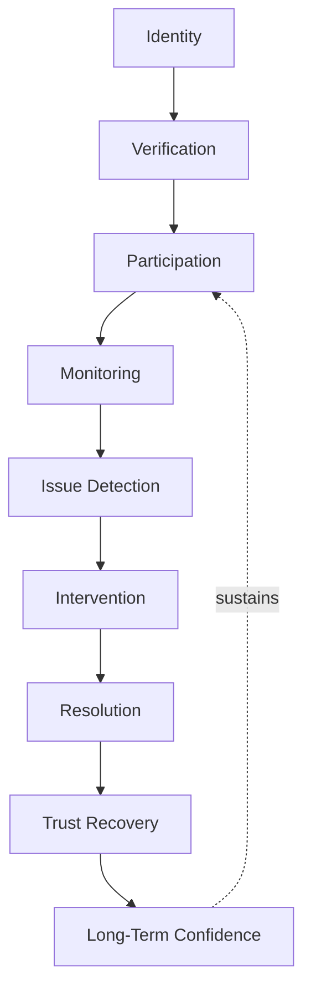

| Stage | Meaning |
|---|---|
| **Identity** | A participant establishes a presence, the first point at which trust begins to be evaluated. |
| **Verification** | Real-world identity and, where relevant, credentials are confirmed, per CAP-001 and CAP-016. |
| **Participation** | The verified participant engages in commerce, civic services, or community life. |
| **Monitoring** | Continuous, proportionate observation for fraud, abuse, or policy violation, per CAP-038. |
| **Issue Detection** | A genuine concern is identified — automatically flagged or citizen-reported. |
| **Intervention** | A proportionate, evidence-based response is taken — a warning, a hold, an investigation. |
| **Resolution** | The issue reaches a fair, documented, appealable outcome, per RULE-013 and RULE-028. |
| **Trust Recovery** | Where appropriate, a citizen's or participant's standing is restored following a resolved dispute or a served consequence. |
| **Long-Term Confidence** | The participant's — and the wider district's — willingness to depend on Arwal compounds with every well-handled cycle. |

---

# Value Creation

| Question | Answer |
|---|---|
| **How do citizens create trust?** | By engaging honestly, reporting genuine concerns, and providing accurate feedback that strengthens the system for every future participant. |
| **How do businesses create trust?** | By maintaining accurate listings, fulfilling their commitments, and accepting fair, consistent enforcement without special treatment. |
| **How does government create trust?** | By backing civic processes with genuine authority and accountability, lending its own institutional legitimacy to the platform's civic modules. |
| **How does AI contribute responsibly?** | By accelerating detection and triage at a scale no purely human team could sustain, while never making a final civic, financial, or reputational determination alone, per RULE-024. |
| **How does Arwal create trust?** | By converting a fragmented, unverifiable set of informal relationships into a single, accountable, evidenced system every participant can rely on identically. |
| **How does trust compound?** | Every safe transaction, fairly resolved dispute, and honestly enforced policy adds to a citizen's confidence, which increases their willingness to bring more of their life onto the platform, per `ai-docs/50-product-vision-business-strategy.md`'s Cross-Vertical Adoption Depth. |
| **How does platform adoption increase?** | A citizen who trusts Arwal for one need is measurably more willing to try Arwal for an unfamiliar one — trust is the mechanism underneath every cross-vertical growth number in this handbook. |
| **How does district resilience improve?** | A district with a trusted, functioning digital layer for commerce, civic services, and communication is better positioned to absorb shocks — economic, administrative, or environmental — per `ai-docs/64-district-ecosystem-mapping.md`'s Long-Term Resilience principle. |

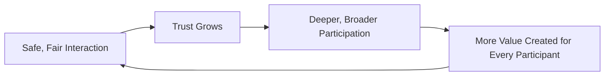

---

# Business Model

Every capability below is described strategically — its business rationale, never its implementation. The enforceable capability logic is owned entirely by `ai-docs/55-business-capability-map.md` and `ai-docs/58-business-rules-policies.md`.

| Capability | Business Rationale |
|---|---|
| **Identity Trust** | The verified, singular foundation every other trust mechanism on the platform is built on top of, per CAP-001. |
| **Verification Services** | Category-appropriate scrutiny — commerce, healthcare, education, government — scaled to each domain's actual stakes, per RULE-002, RULE-010, RULE-014, RULE-016. |
| **Fraud Prevention** | Continuous, AI-assisted, always human-confirmed protection against manipulated transactions, fake listings, and coordinated abuse, per CAP-038. |
| **Marketplace Trust** | The buyer-seller confidence mechanisms — verification, ratings, dispute resolution — that make stranger-to-stranger commerce viable, per `ai-docs/65-marketplace-strategy.md`. |
| **Community Safety** | Moderation and accountability mechanisms that keep community spaces genuinely safe to participate in, per `ai-docs/75-community-social-engagement-strategy.md`. |
| **Content Safety** | Consistent standards against harassment, misinformation, and manipulation across every citizen-generated surface, per RULE-022. |
| **AI Safety** | The absolute, structural boundary ensuring AI accelerates but never replaces human judgment on a consequential decision, per RULE-024. |
| **Financial Trust** | Idempotent, transparent, auditable money movement every citizen can depend on without exception, per RULE-018 and `ai-docs/74-payments-financial-services-strategy.md`. |
| **Reporting Mechanisms** | Low-friction, accessible paths for any citizen to flag a concern, always leading to a tracked outcome, per RULE-009. |
| **Incident Management** | A structured, evidence-based response to a confirmed trust or safety event, scaled to its severity. |
| **Dispute Resolution** | A fair, bidirectional review process protecting both the citizen and the counterparty, per RULE-013 and CAP-036. |
| **Reputation Systems** | A portable, unmanipulated trust signal that compounds across a participant's history on the platform, per CAP-045. |
| **Policy Enforcement** | Consistent, evidence-gated, appealable consequences for a confirmed violation, per RULE-026 and RULE-027. |

```mermaid
graph TD
    BizModel7[Trust and Safety Business Model] --> IdTrust[Identity Trust]
    BizModel7 --> VerifyServ[Verification Services]
    BizModel7 --> FraudPrev4[Fraud Prevention]
    BizModel7 --> MarketTrust[Marketplace Trust]
    BizModel7 --> CommSafety[Community Safety]
    BizModel7 --> ContentSafety[Content Safety]
    BizModel7 --> AISafety[AI Safety]
    BizModel7 --> FinTrust[Financial Trust]
    BizModel7 --> ReportMech[Reporting Mechanisms]
    BizModel7 --> IncidentMgmt[Incident Management]
    BizModel7 --> DisputeRes2[Dispute Resolution]
    BizModel7 --> RepSystems[Reputation Systems]
    BizModel7 --> PolicyEnforce[Policy Enforcement]
```

---

# Trust & Safety Strategy

| Mechanism | Strategic Role |
|---|---|
| **Identity Verification** | Every elevated role is granted only after a genuine, evidenced verification standard is met, per CAP-001 and CAP-016 — never self-attested for a role carrying real stakes. |
| **Fraud Prevention** | Continuous monitoring for manipulated transactions and coordinated abuse, always routed to human confirmation before enforcement, per CAP-038. |
| **Abuse Prevention** | Harassment, exploitation, and manipulation are actively detected and addressed across every citizen-facing surface, never tolerated as an acceptable cost of scale. |
| **Privacy Protection** | Trust and safety operations touch some of the platform's most sensitive data, held to the strictest classification and access standard, per `ai-docs/10-security-standards.md`. |
| **Responsible AI** | Every AI-assisted trust and safety mechanism operates within the absolute human-oversight boundary of RULE-024, with no exception for efficiency. |
| **Content Governance** | Citizen-generated content is held to a consistent, plainly stated standard, enforced with human confirmation before any non-illegal-content removal, per RULE-022. |
| **Incident Response** | A confirmed trust or safety event is investigated and resolved through a proportionate, evidence-based, documented process. |
| **Human Review** | Every consequential trust and safety decision carries a named, accountable human reviewer, per RULE-026 and RULE-027's four-eyes discipline for the highest-severity actions. |
| **Government Coordination** | Civic-adjacent trust and safety policy is developed jointly with the relevant government authority, never unilaterally by Arwal alone. |
| **Platform Integrity** | The cumulative, monitored health of every mechanism above, reported transparently to leadership and, where appropriate, to government partners. |

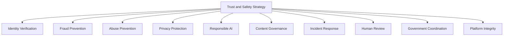

> **Callout — Trust Is Indivisible Across Verticals**
> A citizen who is defrauded in Commerce does not merely distrust Commerce — per `ai-docs/64-district-ecosystem-mapping.md`'s Shared Trust dependency, that citizen's distrust radiates into Healthcare, Government Services, and Payments simultaneously, because every vertical draws on the same Identity and Reputation layer. This is why Trust & Safety is governed as one system in this document, never as fifty independent vertical policies that happen to share a name.

---

# Economic & Social Impact

| Impact Area | How Arwal Contributes |
|---|---|
| **Increase Citizen Confidence** | Verified participants, transparent dispute resolution, and consistent enforcement give a citizen genuine reason to trust an unfamiliar counterparty. |
| **Improve Government Trust** | Auditable, accountable civic-service delivery strengthens a department's own confidence in digital channels as a genuine extension of their authority. |
| **Reduce Fraud** | Continuous, AI-assisted, human-confirmed monitoring closes the gap informal, unverifiable channels leave wide open. |
| **Strengthen Digital Inclusion** | Accessible verification and reporting mechanisms bring a first-generation smartphone user safely into digital participation, per `ai-docs/12-accessibility-standards.md`. |
| **Support MSMEs** | Fair, consistent policy enforcement protects a small merchant from being structurally disadvantaged relative to a larger one. |
| **Improve Marketplace Confidence** | A buyer who trusts verification and dispute resolution is willing to transact with a stranger they would never have risked otherwise, per `ai-docs/65-marketplace-strategy.md`. |
| **Increase Safe Transactions** | Idempotent, transparent payment integrity removes a structural barrier to digital commerce adoption district-wide. |
| **Strengthen District Development** | A district with a trusted digital layer is measurably better positioned across every development area already named in `ai-docs/64-district-ecosystem-mapping.md`'s District Development Strategy. |

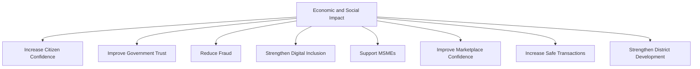

---

# Governance

### Ownership
Trust & Safety Framework ownership sits with the Chief Trust & Safety Officer, with Identity Trust, Marketplace Trust, Community Safety, Content Safety, AI Safety, and Financial Trust each accountable to a named sub-owner, mirroring the Clear Ownership discipline already established throughout `ai-docs/53` through `ai-docs/78`.

### Trust & Safety Council
A standing **Trust & Safety Council** — chaired by the Chief Trust & Safety Officer, with the CPO, CFO, Compliance Officer, Head of AI Platform, Head of Accessibility & Inclusion, Head of Government Partnerships, and rotating vertical Trust leads (Marketplace, Payments, Community, Discovery, AI) as members — holds approval authority over any platform-wide trust or safety policy change, any new enforcement mechanism, and any material deviation from the Anti-Patterns below. The Council meets monthly, with ad hoc sessions for a Citizen Trust Score regression or a confirmed Critical trust incident, per the severity classification already established in `ai-docs/40-engineering-compliance-audit-standards.md`.

### Decision Authority

| Decision | Approves |
|---|---|
| New platform-wide trust or safety mechanism | Trust & Safety Council + CEO |
| Verification-standard change for any category | Council + relevant vertical Head |
| Enforcement-policy change (suspension, four-eyes thresholds) | Council + Compliance Officer |
| AI-assisted trust/safety feature touching RULE-024's boundary | Council + CTO + Compliance Officer (unanimous) |
| Emergency trust/safety incident response | Chief Trust & Safety Officer, immediate, ratified by Council within 5 business days |

### Review Cadence

| Review | Cadence | Owner |
|---|---|---|
| Trust & Safety Health Review | Monthly | Trust & Safety Council |
| Vertical Trust Performance Review | Quarterly | Vertical Trust Leads |
| Annual Trust & Safety Strategy Review | Annual | CEO, Chief Trust & Safety Officer, CPO |

### Human Escalation
Every trust or safety mechanism in this document names an explicit, always-visible path to a human reviewer, per the identical Human Escalation requirement already established in `ai-docs/56-user-journey-standards.md` and `ai-docs/78-ai-product-strategy.md` — this requirement has no exception, regardless of how automated the underlying detection is.

### Continuous Improvement
Every incident, dispute, and appeal outcome feeds a shared, tracked improvement backlog, reviewed at the next Trust & Safety Health Review, per the identical Continuous Improvement Loop already established in `ai-docs/60-customer-experience-strategy.md`.

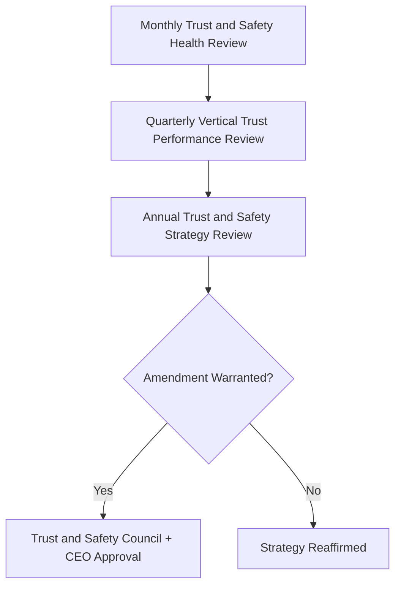

---

# Risks

| Risk | Description | Mitigation |
|---|---|---|
| **Fraud** | Manipulated transactions, fake listings, or coordinated abuse. | Fraud Prevention (CAP-038); four-eyes enforcement per RULE-027. |
| **Identity Theft** | A stolen or spoofed identity used to gain platform access. | Identity Verification (CAP-001); RS256 JWT-authenticated sessions per `ai-docs/10-security-standards.md`. |
| **Abuse** | Exploitation of a vulnerable participant — a citizen, a delivery partner, a small merchant. | Least Harm-calibrated intervention; RULE-016's minor-safeguard standard extended in principle to every vulnerable category. |
| **Harassment** | A citizen targeted, mocked, or intimidated on the platform. | Content Governance per RULE-022; accessible reporting per RULE-009. |
| **Misinformation** | False or misleading content, especially in a civic or health-adjacent context. | Content Governance's verified-source prioritization; joint government review for civic content. |
| **Privacy Violations** | Sensitive trust-and-safety evidence exposed beyond its consented purpose. | RULE-003's Consent Requirement; Restricted-tier classification per `ai-docs/10-security-standards.md`. |
| **Unsafe AI** | An AI system making a consequential decision without genuine human oversight. | RULE-024's absolute Automation Boundary; unanimous Council approval for any change near it. |
| **Marketplace Manipulation** | Coordinated fake reviews, ranking manipulation, or price collusion. | Reputation Systems' anti-manipulation enforcement per RULE-022; Fraud Detection. |
| **Trust Erosion** | A single mishandled incident damages confidence across every vertical simultaneously, per the Shared Trust dependency in `ai-docs/64`. | Transparent, evidence-based resolution; rapid, honest incident communication per `ai-docs/76-notification-communication-strategy.md`. |
| **Regulatory Changes** | A shift in data-protection, financial-services, or platform-liability regulation invalidates an existing trust assumption. | Configurable, government-reviewed policy per `ai-docs/01-product-goals.md`'s Regulatory Constraint. |

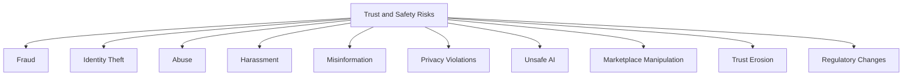

---

# Metrics

| Metric | Definition | Direction |
|---|---|---|
| **Citizen Trust Score** | District Trust Signal (`ai-docs/50`), viewed platform-wide. | Increasing |
| **Safety Incident Rate** | Confirmed safety incidents per active citizen, across every vertical. | Decreasing |
| **Fraud Detection Rate** | % of genuine fraud attempts detected before citizen harm occurs. | Increasing |
| **Dispute Resolution Time** | Mean and p95 time from dispute filing to resolved outcome, per RULE-013. | Decreasing |
| **Identity Verification Success** | % of legitimate verification attempts succeeding without undue friction. | Increasing |
| **Marketplace Trust Score** | Per `ai-docs/65-marketplace-strategy.md`'s Marketplace Health Score. | Increasing |
| **AI Trust Score** | Per `ai-docs/78-ai-product-strategy.md`'s AI Trust Score. | Increasing |
| **Government Trust Index** | Government-partner-reported confidence in platform conduct and accountability. | Increasing |
| **Platform Integrity Index** | A composite index combining Trust Score, Safety Incident Rate, Fraud Detection Rate, and Appeal-Overturn Rate. | Increasing |

> **Callout — No Trust Metric Stands Alone**
> Per the North Star Principle already established in `ai-docs/00-project-vision.md`, a rising Fraud Detection Rate alongside a falling Citizen Trust Score, or rising platform growth alongside a rising Safety Incident Rate, is treated as a regression — never counted as success in isolation.

---

# Anti-Patterns

| Anti-Pattern | Why It's Rejected |
|---|---|
| **Growth before trust** | Acquiring citizens faster than verification and safety capacity can genuinely support violates Trust Before Growth. |
| **Security without usability** | A verification or safety mechanism so burdensome that legitimate citizens abandon it has failed both Accessibility and its own protective purpose. |
| **Unchecked automation** | An AI or automated system making a consequential decision without a genuinely reachable human override violates RULE-024 absolutely. |
| **Ignoring accessibility** | A trust or safety mechanism only a literate, well-connected citizen can use has failed exactly the citizens most likely to need protection. |
| **Opaque enforcement** | An enforcement action with no stated reason violates Transparency and Human Accountability simultaneously. |
| **Ignoring appeals** | A citizen denied a genuine appeal path, or whose appeal is never reviewed independently, violates RULE-028 and Fairness. |
| **Weak verification** | Granting an elevated role without genuine evidence violates Verified Participation and compounds risk into every future interaction that role enables. |
| **Vendor lock-in** | Structuring trust-critical infrastructure so a single vendor becomes existential leverage contradicts the Project Vision's rejection of proprietary lock-in. |
| **Technology before citizens** | Deploying a trust or safety mechanism because it is technically impressive rather than because it genuinely protects a citizen violates Citizen First. |

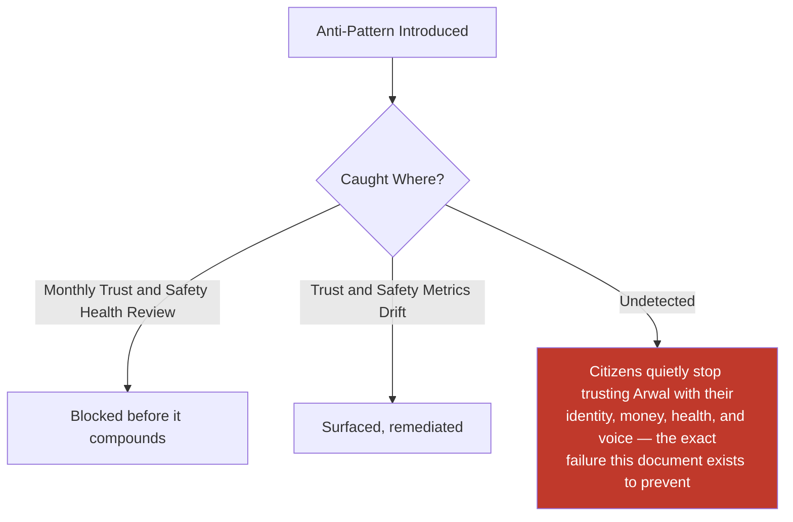

---

# Relationship to Previous Documents

| Prior Document | Relationship |
|---|---|
| **Project Vision (`ai-docs/00`)** | Establishes the founding Trust over Growth-at-all-costs pillar this entire document exists to operationalize as a single, cross-cutting framework. |
| **User Personas (`ai-docs/52`)** | Supplies the individual, evidence-grounded citizens whose Trust Expectations and Vulnerable-tagged needs this document's Least Harm and Accessibility principles serve. |
| **Business Domain Model (`ai-docs/53`)** | Supplies the ownership structure behind the Trust & Safety domain (DOM-020) and Identity domain (DOM-001). |
| **Business Capability Map (`ai-docs/55`)** | Supplies the stable abilities — Trust & Safety (CAP-036), Fraud Detection (CAP-038), Reputation & Rating Management (CAP-045) — this document's strategy is built directly on top of. |
| **User Journey Standards (`ai-docs/56`)** | Supplies the Emotional Experience and Recovery Path discipline every trust-and-safety-adjacent journey must honor. |
| **Business Rules & Policies (`ai-docs/58`)** | Supplies the precise, enforceable logic (RULE-002, RULE-013, RULE-018, RULE-022, RULE-024, RULE-026, RULE-027, RULE-028) this document's every mechanism is bound by. |
| **Customer Experience Strategy (`ai-docs/60`)** | Supplies the felt-trust bar every safety interaction must clear. |
| **District Ecosystem Mapping (`ai-docs/64`)** | Supplies the Shared Trust dependency this document exists to protect at the whole-system level. |
| **Marketplace Strategy (`ai-docs/65`)** | Supplies the buyer-seller trust mechanisms this document generalizes into a platform-wide framework. |
| **Payments & Financial Services Strategy (`ai-docs/74`)** | Supplies the absolute financial-integrity standard this document holds every other trust guarantee to the same severity as. |
| **Community & Social Engagement Strategy (`ai-docs/75`)** | Supplies the community-safety and moderation discipline this document extends platform-wide. |
| **Notification & Communication Strategy (`ai-docs/76`)** | Supplies the authenticity and never-suppressible-emergency-alert discipline this document's trust framework depends on for incident communication. |
| **Search & Discovery Strategy (`ai-docs/77`)** | Supplies the Trust Before Ranking and Fair Visibility principles this document's Marketplace Trust and Reputation Systems mechanisms are built on. |
| **AI Product Strategy (`ai-docs/78`)** | Supplies RULE-024's AI Automation Boundary and the full Responsible AI discipline this document's AI Safety capability inherits without alteration. |

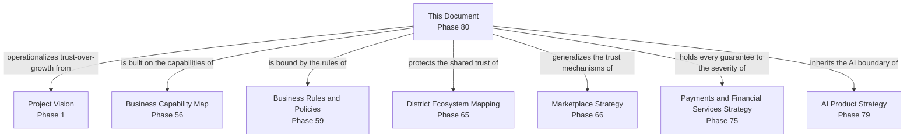

---

# Executive Artifacts

### Trust Framework

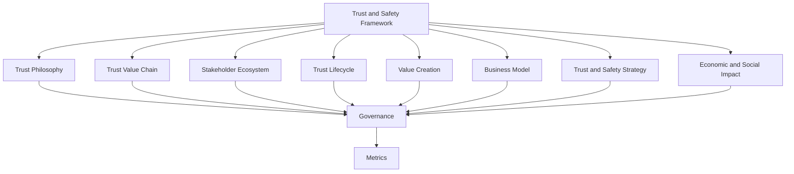

### Trust Value Chain

See Trust Value Chain section above — reproduced here by reference per Single Source of Truth, never duplicated.

### Trust Lifecycle

See Trust Lifecycle section above.

### Trust Ecosystem Map

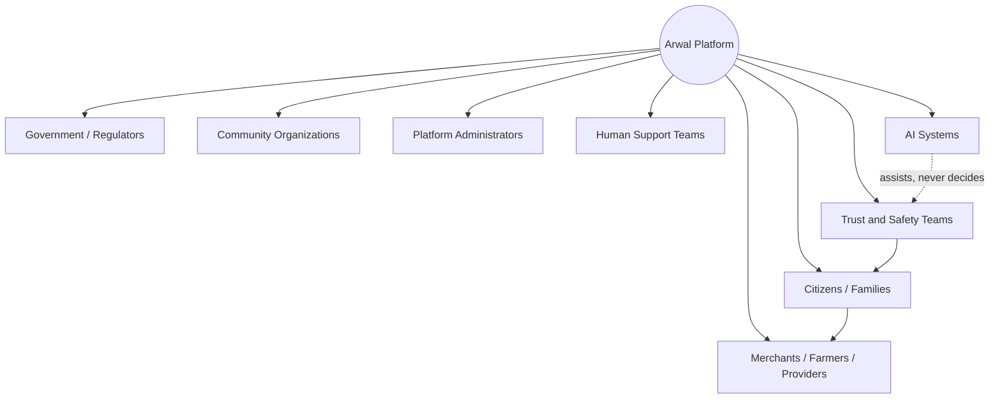

### Trust Governance Model

See Governance section above.

### Trust Flywheel

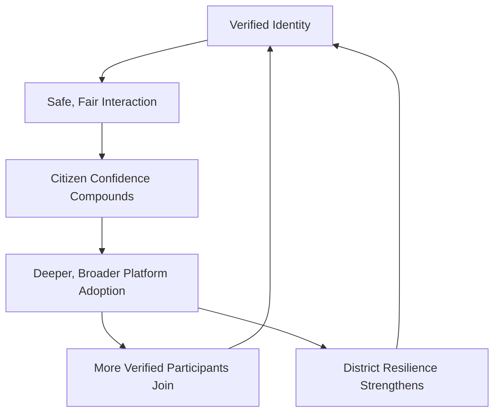

### Executive Dashboards

| Dashboard | Audience | Key Content |
|---|---|---|
| **CEO Dashboard** | CEO | Citizen Trust Score, Platform Integrity Index, Government Trust Index |
| **Chief Trust & Safety Officer Dashboard** | CTSO | Safety Incident Rate, Fraud Detection Rate, Dispute Resolution Time |
| **CPO Dashboard** | CPO | Marketplace Trust Score, AI Trust Score, cross-vertical trust trend |
| **Government Partners Dashboard** | Government liaisons | Government Trust Index, civic-incident response performance |
| **AI Governance Dashboard** | Chief AI Officer, Compliance Officer | AI Safety compliance, RULE-024 boundary-adherence status |

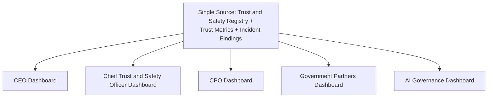

### Decision Matrix

| Decision Type | Approval Authority |
|---|---|
| New platform-wide trust/safety mechanism | Trust and Safety Council + CEO |
| Verification-standard change | Council + relevant vertical Head |
| Enforcement-policy change | Council + Compliance Officer |
| AI-assisted feature touching RULE-024 | Council + CTO + Compliance Officer (unanimous) |
| Emergency trust/safety incident response | Chief Trust and Safety Officer, ratified within 5 business days |

---

# Closing Statement

> **Callout — Closing Statement**
> Every prior document in this handbook explains a piece of what Arwal builds — a marketplace, a payment rail, a community space, a search result, an AI assistant. This document explains the single thread running through every one of them: whether a citizen, a farmer, a merchant, or a government department is right to depend on Arwal at all. Trust is not a feature Arwal ships once — it is the cumulative, compounding result of every verified identity, every fair dispute, every honestly enforced policy, and every AI recommendation a human remained genuinely free to override. A district does not hand its identity, its money, its health decisions, and its civic voice to a platform because that platform is technically impressive — it does so because, interaction after interaction, year after year, the platform proved it was safe to. That proof is never finished; it is renewed every single day this platform operates, and it is the one asset every future phase of this handbook exists, ultimately, to protect. Where a future phase must deviate from a principle stated here, that deviation is made explicitly — through the Trust and Safety Governance process above — never silently, and never by default.

This document, `ai-docs/79-trust-safety-framework.md`, is Phase 80 of approximately 415. Every future safety, integrity, and trust decision is expected to trace back to a principle defined here, or to justify its deviation in writing.

**End of Phase 80 — `ai-docs/79-trust-safety-framework.md`**