# User Growth Strategy

**Document:** `ai-docs/80-user-growth-strategy.md`
**Project:** Arwal — The District Super App
**Stage:** 2 — Product & Business Strategy
**Phase:** 81 — User Growth Strategy
**Status:** Approved for Product & Engineering Reference
**Audience:** CEO, CSO, CPO, Chief Growth Officer, Enterprise Business Architects, Growth Strategy Consultants, Product-Led Growth Specialists, Civic Platform Strategists, Government Digital Adoption Consultants, Customer Experience Strategists, Trust & Safety Advisors, Data-Driven Growth Consultants, Investors

> **Callout — Purpose of This Document**
> `ai-docs/00-project-vision.md` through `ai-docs/79-trust-safety-framework.md` established why Arwal exists, what it can do, who it serves, what it feels like to use, how it sustains itself, how it partners with government, the whole district ecosystem it operates inside, and how every vertical and cross-cutting capability — marketplace, payments, community, communication, discovery, AI, and trust & safety — builds and protects trust. None of those documents answers a question that determines whether any of that ever reaches district-majority scale: **how does Arwal grow — deliberately, sustainably, and without ever spending the trust every other document exists to protect?** This document is that answer — the authoritative User Growth Strategy every future acquisition, activation, retention, and expansion decision traces back to.

---

# Purpose of this Document

### Why Growth Is a Distinct Strategic Capability, Not a Marketing Function

Every prior Stage 2 document explains what Arwal is worth to a stakeholder once they are already using it. None of them explains how a citizen, a merchant, a government department, or a community organization actually comes to use it in the first place, and — far more consequentially — how they come to keep using it, deepen their use of it, and bring someone else along with them. That is a distinct strategic question, and it is answered badly by treating it as a marketing afterthought. Growth at Arwal's scale is not a campaign; it is a **structural capability** — as durable, as governed, and as accountable to trust as Payments (`ai-docs/74`) or Trust & Safety (`ai-docs/79`) themselves. This document exists to make growth exactly that: a deliberate, measured, governed capability, never an improvised chase for a vanity number.

### This Is Not a Marketing, Advertising, or Growth-Hacking Document

This document contains no ad-campaign brief, no paid-acquisition channel plan, no CRM workflow, no growth-hacking playbook, and no analytics-implementation detail. It does not redefine Domains (`ai-docs/53`), Capabilities (`ai-docs/55`), Modules (`ai-docs/54`), Journeys (`ai-docs/56`), Customer Experience (`ai-docs/60`), Revenue (`ai-docs/62`), or Trust & Safety (`ai-docs/79`) — each remains fully authoritative and is cited, never restated. This document's exclusive territory is: **why sustainable growth is strategically necessary, who participates in it, how value compounds through it, and how it is governed so that growth never becomes the thing that erodes the very trust it depends on.**

### Why Sustainable Growth Strengthens District Transformation

Per `ai-docs/00-project-vision.md`'s founding Commercial Discipline, Arwal explicitly rejects vanity growth metrics disconnected from retention, trust, and unit economics — "a district where 200,000 people downloaded the app but only 20,000 return monthly is not a success — it is a warning sign." Growth, done right, is not a number chased for its own sake; it is the mechanism by which district transformation actually reaches everyone it is meant to reach. A citizen who never adopts Arwal is a citizen still paying the fragmentation tax `ai-docs/00-project-vision.md` exists to end. Growth is therefore not adjacent to the civic mission — it is a precondition of it being fulfilled at all.

### How Growth Creates Positive Network Effects

Per `ai-docs/61-value-proposition-framework.md`'s Network Effects reasoning and `ai-docs/65-marketplace-strategy.md`'s Marketplace Network Effects, every additional citizen makes Arwal more valuable to every merchant, and every additional merchant makes it more valuable to every citizen. Growth is the fuel this flywheel runs on — but only when it is *real* growth: verified participants, genuine engagement, durable retention. Growth that is fake, coerced, or short-lived does not turn this flywheel; it merely inflates a number while leaving liquidity, trust, and density exactly where they were.

### The Chain of Reasoning This Document Extends

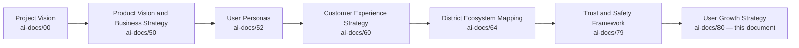

| Layer | Question It Answers |
|---|---|
| Project Vision | Why does a unified civic-commercial platform need to exist? |
| Product Vision & Business Strategy | What is Arwal, and how does it win? |
| User Personas | Who, specifically, does Arwal serve? |
| Customer Experience Strategy | What must every citizen feel, cumulatively? |
| District Ecosystem Mapping | What is the whole living system Arwal operates inside? |
| Trust & Safety Framework | How is trust created, protected, and measured everywhere? |
| **User Growth Strategy** (this document) | **How does Arwal responsibly bring more of the district into that system, and keep them there, without ever spending the trust it took to get them?** |

### Scope Boundary

This document does not define an acquisition channel's technical mechanics, a CRM's workflow, an advertising platform's integration, or a growth-hacking tactic — those are not tools this document endorses at all, per its explicit rejection of dark-pattern and growth-at-any-cost thinking below. Its territory is strategic: the philosophy, the value chain, the stakeholder relationships, and the governance that make Arwal's growth durable, trust-compatible, and genuinely additive to the district it serves.

---

# Growth Philosophy

Every principle below exists because a growth strategy assembled carelessly does not fail abstractly — it fails a specific citizen coerced into a referral they did not want, a specific rural village left behind while a headquarters town's numbers looked good, or a specific district whose trust in Arwal was spent to hit a quarterly target.

### Citizen First
**Why it exists:** Every growth decision is judged first against whether it genuinely serves the citizen being acquired or retained, never against a growth metric in isolation, mirroring the identical Citizen-First tie-breaker already established throughout `ai-docs/51` through `ai-docs/79`.

### Trust Before Growth
**Why it exists:** A citizen acquired through a misleading promise, a coerced referral, or a premature feature is not a citizen gained — they are a citizen who will churn the moment the gap between promise and reality becomes visible, taking their trust in every other vertical down with them, per `ai-docs/64-district-ecosystem-mapping.md`'s Shared Trust dependency. Growth is a consequence of trust already earned, never a substitute for earning it.

### Organic Growth
**Why it exists:** Growth that arises because a citizen genuinely found Arwal useful and told a neighbor is durable; growth manufactured through artificial urgency or manipulated incentive is not. Arwal's default growth posture favors the former and treats the latter as a warning sign, not a tactic.

### Community-Led Growth
**Why it exists:** A district's own trusted structures — a Self-Help Group, an NGO, a village elder, a Resident Welfare Association — already carry more local credibility than any centrally-run campaign ever could, per `ai-docs/75-community-social-engagement-strategy.md`'s Ecosystem Philosophy. Growth that flows through those trusted channels is more durable, more inclusive, and more respectful of existing district relationships than growth that bypasses them.

### Accessibility
**Why it exists:** A growth strategy that only reaches digitally fluent, literate, urban citizens has captured a fraction of the district it exists to serve, per `ai-docs/12-accessibility-standards.md`'s non-negotiable floor extended here to the acquisition and onboarding layer specifically.

### Inclusiveness
**Why it exists:** Growth is measured across every segment of the district population, not merely its most commercially convenient one — a rising aggregate number that conceals a widening gap between urban and rural adoption is not success, per the founding Inclusion over Optimization pillar in `ai-docs/00-project-vision.md`.

### Long-Term Retention
**Why it exists:** A citizen who joins and leaves within a month has not been served — they have been briefly inconvenienced by an app they no longer trust. Retention, not raw registration count, is the metric that actually reflects whether Arwal delivered on its promise.

### Cross-Vertical Adoption
**Why it exists:** Arwal's structural advantage, per `ai-docs/50-product-vision-business-strategy.md`, is that trust compounds across verticals — a citizen who only ever uses one module has realized a fraction of their potential value and a fraction of the trust-compounding effect the whole platform depends on. Growth strategy therefore optimizes for depth of adoption, not merely breadth of registration.

### Transparency
**Why it exists:** A citizen must always understand why they are being invited, what a referral incentive actually offers, and what happens to their data during onboarding — concealment during acquisition breeds exactly the suspicion `ai-docs/60-customer-experience-strategy.md` already rejects at every other interaction.

### Value Before Promotion
**Why it exists:** A feature or module is promoted to a citizen only once it has demonstrated it can genuinely deliver on its promise — promoting an immature, unreliable capability to drive registration numbers trades a citizen's first impression for a metric, and a first impression, once spent, is not recoverable.

### Government Partnership
**Why it exists:** A government department's own endorsement and civic channel, per `ai-docs/63-government-partnership-strategy.md`, is one of the most trusted growth vectors available to a civic platform — growth strategy treats government adoption as a genuine partnership to be earned, never a distribution channel to be exploited.

### Continuous Improvement
**Why it exists:** Citizen expectations, device profiles, and district composition all evolve — a growth strategy fixed at launch and never revisited decays, mirroring the Continuous Improvement discipline already established throughout `ai-docs/60` through `ai-docs/79`.

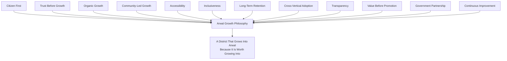

> **Callout — The One-Sentence Growth Philosophy**
> *"Arwal does not grow by convincing a citizen to trust it — it grows by being worth the trust a citizen already extended, so completely that they bring their neighbor along without being asked twice."*

---

# Growth Value Chain

| Stage | Business Description |
|---|---|
| **Awareness** | A citizen, merchant, or department first becomes aware Arwal exists and might be relevant to them — through a field agent, a government announcement, a neighbor, or organic discovery. |
| **Interest** | The citizen forms a genuine, specific reason to consider Arwal — a real need (a price check, a certificate renewal) rather than an abstract curiosity. |
| **First Interaction** | The citizen's first genuine touch with the platform — a demonstration, a single search, an assisted first task. |
| **Onboarding** | The citizen completes the lowest-friction possible path to a usable account, per JRN-001's Citizen Registration standard. |
| **Activation** | The citizen completes their first genuinely useful task — the moment Arwal's value stops being a promise and becomes a lived fact. |
| **Early Success** | The citizen's first task resolves well, reinforcing that the platform delivered what it claimed. |
| **Habit Formation** | The citizen begins returning without being prompted, integrating Arwal into a routine need. |
| **Retention** | The citizen remains an active participant over a sustained period, measured in months and cycles, not days. |
| **Expansion** | The citizen adopts a second, third, and further vertical, deepening Cross-Vertical Adoption Depth per `ai-docs/50`. |
| **Advocacy** | A citizen who trusts Arwal enough to recommend it to a neighbor, family member, or fellow farmer, per `ai-docs/50`'s Community Advocacy stage. |
| **District Network Effects** | Aggregate advocacy and expansion compound into deeper liquidity and trust for every future participant, per `ai-docs/65`'s Marketplace Network Effects. |
| **Continuous Improvement** | Every stage's performance data feeds the next cycle's growth strategy refinement, never treated as a one-time funnel. |

```mermaid
graph LR
    Awareness[Awareness] --> Interest[Interest]
    Interest --> FirstInteract[First Interaction]
    FirstInteract --> Onboarding2[Onboarding]
    Onboarding2 --> Activation[Activation]
    Activation --> EarlySuccess[Early Success]
    EarlySuccess --> Habit[Habit Formation]
    Habit --> Retention3[Retention]
    Retention3 --> Expansion2[Expansion]
    Expansion2 --> Advocacy2[Advocacy]
    Advocacy2 --> NetworkEffects3[District Network Effects]
    NetworkEffects3 --> ContImprove3[Continuous Improvement]
    ContImprove3 -.feeds back into.-> Awareness
```

---

# Stakeholder Ecosystem

| Stakeholder | Strategic Role in Growth |
|---|---|
| **Citizens** | The foundational population whose genuine, retained adoption is the only growth signal that ultimately matters. |
| **Families** | The household unit through which awareness and delegated onboarding (per CAP-005) often actually spreads first. |
| **Merchants** | Supply-side participants whose own growth, per `ai-docs/67-merchant-ecosystem.md`, both depends on and reinforces citizen growth. |
| **Farmers** | A population whose growth-strategy needs are distinctly field-agent- and voice-first-mediated, per PER-002 Meena's stated profile. |
| **Healthcare Providers** | Supply-side participants whose own onboarding expands the platform's most trust-sensitive discovery category. |
| **Educational Institutions** | Participants whose presence extends Arwal's reach into a district's student and parent population. |
| **Government Departments** | The single most credible growth channel available to a civic platform, per `ai-docs/63-government-partnership-strategy.md` — their endorsement carries institutional trust no marketing spend can replicate. |
| **Community Organizations** | NGOs, SHGs, and RWAs whose own trusted local standing, per `ai-docs/75-community-social-engagement-strategy.md`, is the primary vector for Community-Led Growth. |
| **Businesses** | The broader commercial base whose growth is both a target and a reinforcing mechanism for citizen growth. |
| **Service Providers** | Independent professionals whose own reputation-building, per `ai-docs/66-service-provider-ecosystem.md`, draws citizen demand into the platform. |
| **Growth Teams** | The internal function accountable for executing this strategy responsibly, never independently of Trust & Safety or Accessibility oversight. |
| **Platform Operations** | Internal functions (verification, support, field agents) whose capacity bounds how fast growth can be sustainably absorbed. |
| **Future District Partners** | A second district's institutions and citizens, activated per `ai-docs/50-product-vision-business-strategy.md`'s Strategic Expansion Principles — never assumed to inherit trust automatically. |

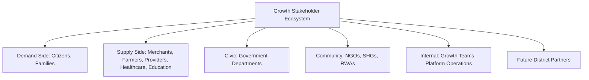

---

# User Growth Lifecycle

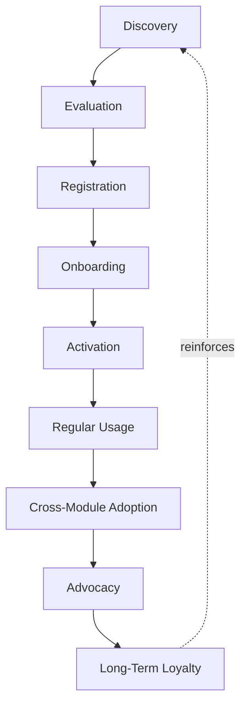

| Stage | Meaning |
|---|---|
| **Discovery** | A citizen becomes aware Arwal exists, through an organic, community, or government-endorsed channel. |
| **Evaluation** | The citizen weighs whether Arwal genuinely fits a real need, often via a trusted intermediary's account rather than abstract marketing. |
| **Registration** | The citizen completes the lowest-friction Identity Verification path, per JRN-001 and JRN-002. |
| **Onboarding** | The citizen is guided to their first meaningful task without being shown every feature at once, per `ai-docs/60-customer-experience-strategy.md`'s Onboarding commitment. |
| **Activation** | The citizen completes a genuinely useful first task. |
| **Regular Usage** | The citizen returns for a routine need without prompting. |
| **Cross-Module Adoption** | The citizen tries a second vertical, deepening their relationship with the platform. |
| **Advocacy** | The citizen recommends Arwal to someone else, organically or through a transparent referral mechanism. |
| **Long-Term Loyalty** | The citizen's relationship with Arwal sustains across years, mirroring the Persona Lifecycle already established in `ai-docs/52-user-personas-user-segmentation.md`. |

---

# Value Creation

| Question | Answer |
|---|---|
| **How do citizens create value?** | By engaging genuinely, providing honest feedback, and — when the platform earns it — recommending Arwal to someone in their own trusted network. |
| **How do businesses create value?** | By onboarding honestly, fulfilling their commitments, and building the reputation that draws further citizen demand into the platform. |
| **How does government create value?** | By lending its own institutional credibility to Arwal's civic modules, making adoption a matter of public confidence, not marketing persuasion. |
| **How do communities create value?** | By extending trusted local relationships — an SHG's own standing, an NGO's field credibility — into genuine, sustainable platform reach. |
| **How does Arwal create value?** | By making growth self-reinforcing: a platform that keeps its promises earns advocacy, and advocacy earns further trust-based growth, without extractive tactics. |
| **How does trust compound?** | Every well-onboarded citizen who has a genuinely good first experience becomes a credible source of trust for the next citizen they tell, per `ai-docs/79-trust-safety-framework.md`'s Trust Value Chain. |
| **How do network effects emerge?** | Growing citizen density draws more merchants and providers; growing supply density draws more citizens — the identical Marketplace Network Effects loop already established in `ai-docs/65-marketplace-strategy.md`, now viewed from the acquisition side. |
| **How does district transformation accelerate?** | Every genuinely retained citizen is one fewer citizen still paying the fragmentation tax `ai-docs/00-project-vision.md` exists to end — growth, done honestly, is the mechanism by which the founding mission actually reaches district-majority scale. |

---

# Business Model

Every capability below is described strategically — its business rationale — never as an implementation. The enforceable capability and rule logic is owned entirely by `ai-docs/55-business-capability-map.md` and `ai-docs/58-business-rules-policies.md`.

| Capability | Business Rationale |
|---|---|
| **Citizen Acquisition** | Reaching a citizen through their genuine need and trusted channels, never through manufactured urgency. |
| **Merchant Acquisition** | Radically simple onboarding, per `ai-docs/01-product-goals.md`'s Must-Have priority, lowering the barrier for a small, non-technical seller to join. |
| **Government Adoption** | Formal, durable partnership pursuit per `ai-docs/63-government-partnership-strategy.md`, never a one-off pilot chased for a press mention. |
| **Community-Led Growth** | Field-agent and NGO/SHG-mediated onboarding extending reach into populations that a purely digital channel cannot reach alone. |
| **Referral Principles** | A citizen may invite another citizen, always transparently, never through a mechanism that pressures or deceives either party. |
| **Cross-Module Adoption** | Contextual, need-triggered surfacing of a second vertical only once the first is genuinely working for the citizen. |
| **Retention Programs** | Continued, genuine value delivery — never an artificial engagement mechanic — as the sole retention strategy Arwal endorses. |
| **User Education** | Contextual, just-in-time guidance at the moment a capability becomes relevant, per `ai-docs/60`'s Customer Success Strategy, never a front-loaded tutorial. |
| **Platform Awareness** | Building genuine district-wide recognition through demonstrated value and government/community endorsement, never through manufactured hype. |
| **Trust-Based Growth** | Every acquisition and retention mechanism is designed and reviewed for its trust impact before its growth impact, per Trust Before Growth above. |
| **Network Effects** | Deliberately reinforced through both citizen and supply-side growth investment in balance, per Balanced Incentives already established in `ai-docs/62-revenue-sustainability-strategy.md`. |
| **District Expansion Readiness** | The evidence-gated discipline determining when a founding district's growth model is mature enough to responsibly replicate elsewhere, per `ai-docs/50-product-vision-business-strategy.md`'s Strategic Expansion Principles. |

```mermaid
graph TD
    BizModel[Growth Business Model] --> CitizenAcq[Citizen Acquisition]
    BizModel --> MerchantAcq[Merchant Acquisition]
    BizModel --> GovAdopt[Government Adoption]
    BizModel --> CommLedGrowth[Community-Led Growth]
    BizModel --> ReferralPrin[Referral Principles]
    BizModel --> CrossModuleAdopt[Cross-Module Adoption]
    BizModel --> RetentionProg[Retention Programs]
    BizModel --> UserEdu[User Education]
    BizModel --> PlatAwareness[Platform Awareness]
    BizModel --> TrustGrowth[Trust-Based Growth]
    BizModel --> NetworkEffects4[Network Effects]
    BizModel --> DistrictReadiness[District Expansion Readiness]
```

---

# Trust & Growth Strategy

| Mechanism | Strategic Role |
|---|---|
| **Trust-Based Growth** | Every growth mechanism is evaluated first for its effect on citizen trust, per the same Responsible Innovation discipline already established in `ai-docs/62-revenue-sustainability-strategy.md`. |
| **Responsible Referrals** | A referral mechanism never pressures a citizen to invite someone, never implies a false urgency, and never rewards volume over genuine value delivered. |
| **Transparent Incentives** | Any referral or growth-adjacent incentive is disclosed in full, plain language before a citizen acts on it, per RULE-032's Accessibility Non-Negotiable Floor extended to growth mechanics. |
| **Accessibility** | Onboarding and growth communication default to voice-first, low-literacy-friendly design, never a later accommodation. |
| **Privacy Protection** | Growth and referral mechanisms use only data a citizen has explicitly consented to share for that purpose, per RULE-003. |
| **Inclusive Growth** | Growth targets and investment are explicitly monitored across urban, semi-urban, and rural segments, never permitted to concentrate silently in the most commercially convenient geography. |
| **Government Collaboration** | Civic-adjacent growth initiatives are pursued jointly with the relevant department, never unilaterally by Arwal alone, per `ai-docs/63-government-partnership-strategy.md`. |
| **Long-Term Retention** | Retention, not registration count, is the metric growth strategy is ultimately held accountable to. |
| **Citizen Confidence** | Every mechanism above compounds into one felt outcome: a citizen who joined because they wanted to, stayed because it worked, and told someone else because they meant it. |

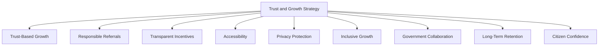

> **Callout — A Referral Is an Endorsement, Never a Transaction**
> Per Responsible Referrals above, a citizen inviting another citizen is treated as a personal endorsement of genuine value — never as a growth-hacking mechanic to be optimized for volume. Any incentive structure that would reward a citizen for inviting people who do not genuinely benefit from Arwal is rejected outright, regardless of its projected effect on registration numbers.

---

# Economic & Social Impact

| Impact Area | How Arwal's Growth Strategy Contributes |
|---|---|
| **Increase Digital Adoption** | Trust-based, accessible onboarding brings a first-generation smartphone user safely and confidently into digital participation. |
| **Strengthen MSMEs** | Radically simple merchant acquisition lowers the barrier for a small business to gain genuine digital reach for the first time. |
| **Improve Government Reach** | Government-partnered growth extends civic-service awareness to citizens who would otherwise never learn a benefit exists. |
| **Increase Citizen Participation** | Community-led, field-agent-mediated growth reaches populations a purely digital channel structurally cannot. |
| **Reduce Digital Divide** | Inclusive growth monitoring ensures rural and low-literacy populations are not left behind while urban adoption accelerates. |
| **Strengthen Community Engagement** | Growth flowing through NGOs, SHGs, and local leaders reinforces, rather than bypasses, a district's existing social fabric, per `ai-docs/75-community-social-engagement-strategy.md`. |
| **Increase Platform Sustainability** | Genuine, retained growth — never inflated registration counts — is what actually funds the platform's long-term investment, per `ai-docs/62-revenue-sustainability-strategy.md`. |
| **Accelerate District Development** | A platform genuinely adopted at district-majority scale realizes every development area already named in `ai-docs/64-district-ecosystem-mapping.md`'s District Development Strategy. |

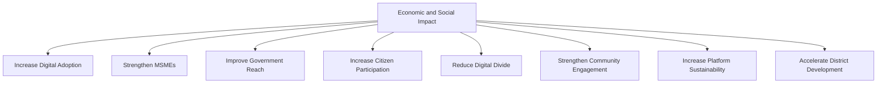

---

# Governance

### Ownership
User Growth Strategy ownership sits with the Chief Growth Officer (or CPO/CSO jointly where the role is not yet separately staffed), with each stakeholder category's growth performance accountable to its own Business Owner per `ai-docs/53`'s Domain Registry, mirroring the Clear Ownership discipline already established throughout `ai-docs/53` through `ai-docs/79`.

### Growth Council
A standing **Growth Council** — chaired by the Chief Growth Officer, with the CPO, CSO, Chief Trust & Safety Officer, Head of Accessibility & Inclusion, Head of Government Partnerships, and rotating vertical Heads as members — holds approval authority over any platform-wide acquisition mechanism, any referral or incentive structure, and any material deviation from the Anti-Patterns below. The Council meets monthly, with ad hoc sessions for a Citizen Trust Score regression tied to a growth initiative.

### Decision Authority

| Decision | Approves |
|---|---|
| New acquisition channel or mechanism | Growth Council + CEO |
| Referral or incentive structure | Growth Council + Chief Trust & Safety Officer |
| Government-partnered growth initiative | Growth Council + Head of Government Partnerships |
| District Expansion Readiness determination | Growth Council + CEO + Board, per `ai-docs/50`'s Strategic Expansion Principles |
| Emergency growth-trust response (e.g., a referral-abuse wave) | Chief Trust & Safety Officer, immediate, ratified by Council within 5 business days |

### Review Cadence

| Review | Cadence | Owner |
|---|---|---|
| Growth Health Review | Monthly | Growth Council |
| Segment Performance Review (urban/semi-urban/rural, by vertical) | Quarterly | Growth Council, vertical Heads |
| Annual Growth Strategy Review | Annual | CEO, Chief Growth Officer, CPO, CSO |

### Continuous Improvement
Every Feedback signal from the Growth Value Chain feeds a shared, tracked improvement backlog, reviewed at the next Growth Health Review, per the identical Continuous Improvement Loop already established in `ai-docs/60-customer-experience-strategy.md`.

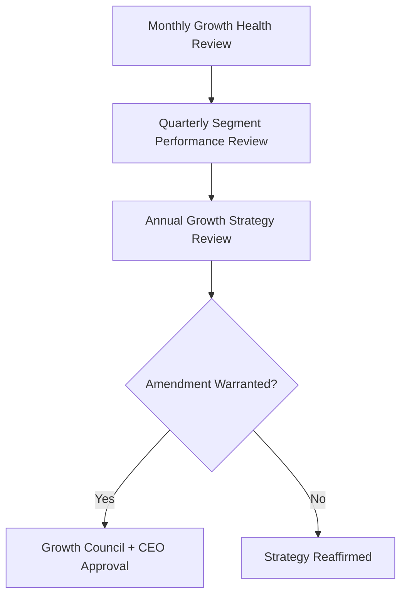

---

# Risks

| Risk | Description | Mitigation |
|---|---|---|
| **Growth Without Trust** | Registration numbers rise while genuine trust and retention quietly fall. | Trust Before Growth principle; North Star Principle discipline evaluating every growth metric jointly with Trust Score. |
| **Fake Accounts** | Bulk or bot-created accounts inflate registration without genuine participation. | Identity Verification (CAP-001); Fraud Detection (CAP-038) applied to registration patterns. |
| **Referral Abuse** | A citizen exploits a referral incentive without delivering genuine value to the invited party. | Responsible Referrals design; anomaly monitoring on referral patterns per CAP-038. |
| **Low Retention** | Citizens register but do not return, indicating Onboarding or Activation failed to deliver genuine value. | Growth Value Chain stage-level monitoring; Activation and Early Success investment prioritized over raw Awareness spend. |
| **Digital Exclusion** | Growth concentrates in digitally fluent, urban segments while rural populations are left behind. | Inclusive Growth monitoring; Community-Led Growth investment in underserved segments. |
| **Uneven Adoption** | One vertical or geography grows disproportionately, distorting the platform's cross-vertical promise. | Cross-Vertical Adoption tracking; Balanced Incentives discipline per `ai-docs/62`. |
| **Government Resistance** | A department declines partnership or growth collaboration, limiting a high-trust growth channel. | Civic modules designed to add standalone value even absent full government integration, per `ai-docs/00-project-vision.md`'s Risk Register. |
| **Privacy Risks** | Growth or referral mechanisms use citizen data beyond its consented purpose. | RULE-003's Consent Requirement; Privacy Protection mechanism above. |
| **Market Saturation** | Growth in the founding district plateaus before expansion readiness is genuinely proven. | Evidence-based District Expansion Readiness gating, never a premature replication decision. |
| **Trust Erosion** | A single mishandled growth incident (a misleading promotion, a referral scandal) damages trust platform-wide. | Transparent, evidence-based incident response; rapid, honest communication per `ai-docs/76-notification-communication-strategy.md`. |

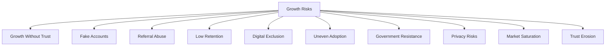

---

# Metrics

| Metric | Definition | Direction |
|---|---|---|
| **Citizen Growth Rate** | Net new, genuinely verified citizens over a defined period. | Increasing, at a sustainable pace |
| **Activation Rate** | % of registered citizens completing a genuinely useful first task. | Increasing |
| **Retention Rate** | WAU/MAU stickiness and multi-month cohort retention, per `ai-docs/60`'s Experience Metrics. | Increasing |
| **Cross-Module Adoption Rate** | Cross-Vertical Adoption Depth, per `ai-docs/50-product-vision-business-strategy.md`. | Increasing |
| **Referral Quality** | Retention rate of referred citizens compared to organically acquired citizens. | At or above organic baseline |
| **Citizen Trust Score** | District Trust Signal, viewed for growth-adjacent interactions specifically. | Increasing |
| **Government Adoption Rate** | Count of departments/services digitally integrated, per `ai-docs/63`. | Increasing |
| **Merchant Growth** | Verified, active merchant count and retention, per `ai-docs/67`. | Increasing |
| **Community Growth** | Active, genuinely engaged community-linked participants, per `ai-docs/75`. | Increasing |
| **District Expansion Readiness Index** | A composite index combining founding-district Trust Score, Retention Rate, and proven unit economics against `ai-docs/50`'s Strategic Success Criteria. | Increasing toward expansion-ready threshold |

> **Callout — No Growth Metric Stands Alone**
> Per the North Star Principle already established in `ai-docs/00-project-vision.md`, a rising Citizen Growth Rate alongside a falling Retention Rate or falling Citizen Trust Score is treated as a regression — never counted as success in isolation.

---

# Anti-Patterns

| Anti-Pattern | Why It's Rejected |
|---|---|
| **Growth at Any Cost** | Pursuing a registration number without regard to trust, retention, or inclusion directly violates Trust Before Growth. |
| **Dark Patterns** | Any onboarding or referral flow that nudges a citizen through confusion or urgency rather than genuine choice violates Citizen First and Transparency simultaneously. |
| **Spam Invitations** | Mass, unsolicited, or repeated invitations sent on a citizen's behalf without their genuine intent violate Responsible Referrals. |
| **Forced Referrals** | Gating a core feature behind a mandatory referral violates Value Before Promotion and Transparent Incentives. |
| **Ignoring Accessibility** | A growth channel or onboarding flow usable only by a literate, well-connected citizen has failed Accessibility and Inclusiveness regardless of its conversion rate. |
| **Ignoring Government Needs** | Pursuing citizen growth while treating government partnership as an afterthought squanders the single most credible growth channel available. |
| **Short-Term Metrics** | Optimizing for a quarter's registration spike at the cost of long-term Retention violates Long-Term Retention above. |
| **Technology Before Citizens** | Adopting a growth tactic because it is novel or technically clever rather than because it genuinely serves a citizen's need violates Citizen First. |
| **Growth Without Trust** | A rising Citizen Growth Rate alongside a falling Trust Score is a regression, never a win, per the North Star Principle. |

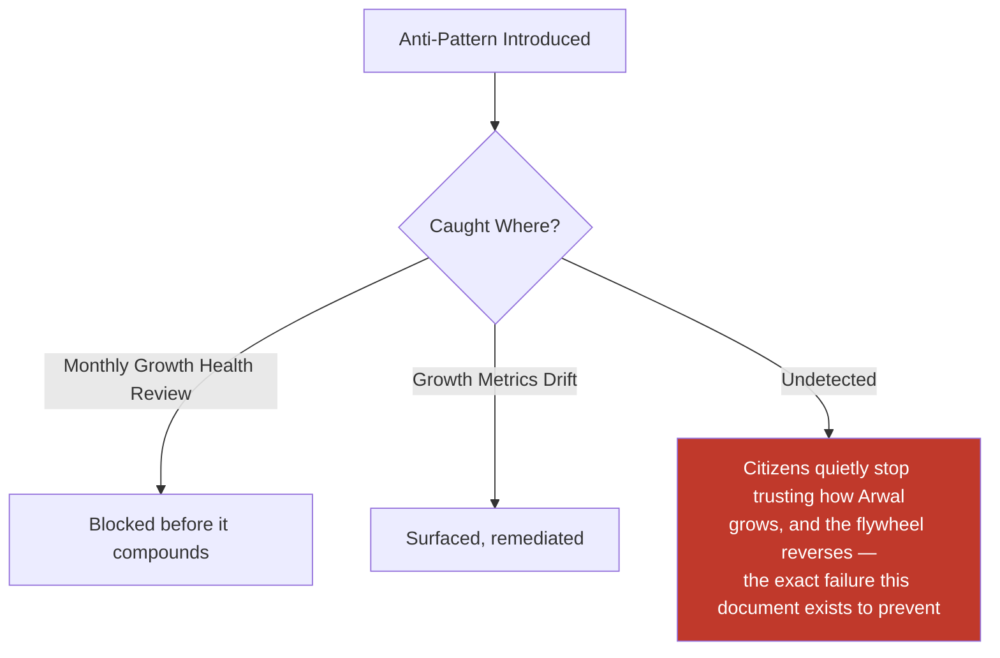

---

# Relationship to Previous Documents

| Prior Document | Relationship |
|---|---|
| **Project Vision (`ai-docs/00`)** | Establishes the founding Commercial Discipline and North Star Principle this document's every growth mechanism is measured against. |
| **Product Vision & Business Strategy (`ai-docs/50`)** | Establishes Strategic Objectives, Cross-Vertical Adoption Depth, and Strategic Expansion Principles this document's growth model directly operationalizes. |
| **User Personas (`ai-docs/52`)** | Supplies the individual, evidence-grounded citizens whose onboarding and accessibility needs this document's Growth Value Chain is designed around. |
| **Business Domain Model (`ai-docs/53`)** | Supplies the ownership structure behind every domain this document's stakeholder ecosystem draws from. |
| **Product Module Catalog (`ai-docs/54`)** | Supplies the user-visible surfaces (Registration, Settings, Help Center) through which growth is actually experienced. |
| **Business Capability Map (`ai-docs/55`)** | Supplies the stable abilities — Identity Verification, Merchant Onboarding, Notifications — this document's Business Model is built directly on top of. |
| **User Journey Standards (`ai-docs/56`)** | Supplies JRN-001 Registration and JRN-003 Profile Completion, the journeys this document's Onboarding and Activation stages are felt through. |
| **Customer Experience Strategy (`ai-docs/60`)** | Supplies the felt-experience bar and Customer Success Strategy this document's Habit Formation and Retention stages must clear. |
| **Revenue & Sustainability Strategy (`ai-docs/62`)** | Supplies the Economic Flywheel and Balanced Incentives discipline this document's growth economics are bound by. |
| **District Ecosystem Mapping (`ai-docs/64`)** | Supplies the whole-system Ecosystem Health view this document's growth metrics feed directly into. |
| **Marketplace Strategy (`ai-docs/65`)** | Supplies the Network Effects reasoning this document's District Network Effects stage extends to the acquisition side specifically. |
| **Community & Social Engagement Strategy (`ai-docs/75`)** | Supplies the Community-Led Growth vector and the trusted-intermediary reasoning this document's Community Organizations stakeholder role directly serves. |
| **Search & Discovery Strategy (`ai-docs/77`)** | Supplies the Discovery mechanism through which organic Awareness often actually begins. |
| **AI Product Strategy (`ai-docs/78`)** | Supplies the Human-in-the-Loop and Accessibility principles this document's AI-assisted onboarding guidance must honor. |
| **Trust & Safety Framework (`ai-docs/79`)** | Supplies the Trust Value Chain and Verified Participation principle this document's every growth mechanism is subordinate to. |

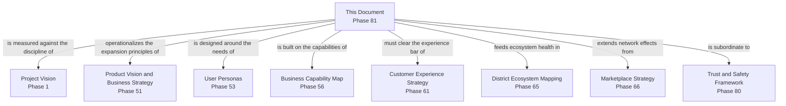

---

# Executive Artifacts

### Growth Strategy Framework

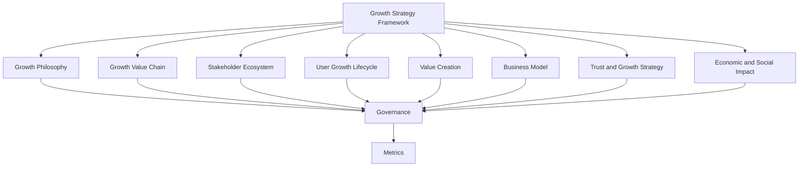

### Growth Value Chain

See Growth Value Chain section above — reproduced here by reference per Single Source of Truth, never duplicated.

### User Growth Lifecycle

See User Growth Lifecycle section above.

### Growth Ecosystem Map

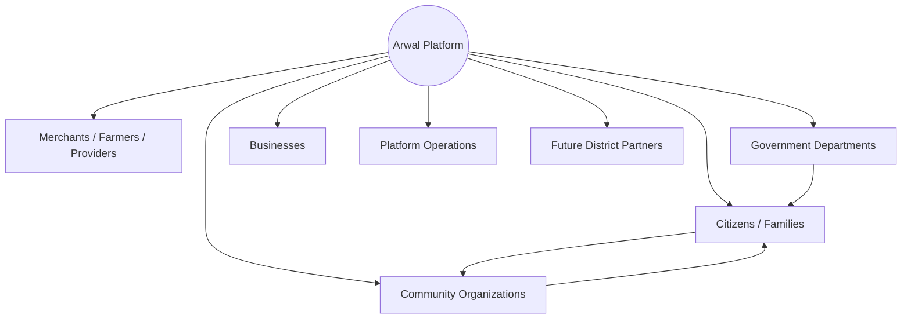

### Growth Governance Model

See Governance section above.

### Growth Flywheel

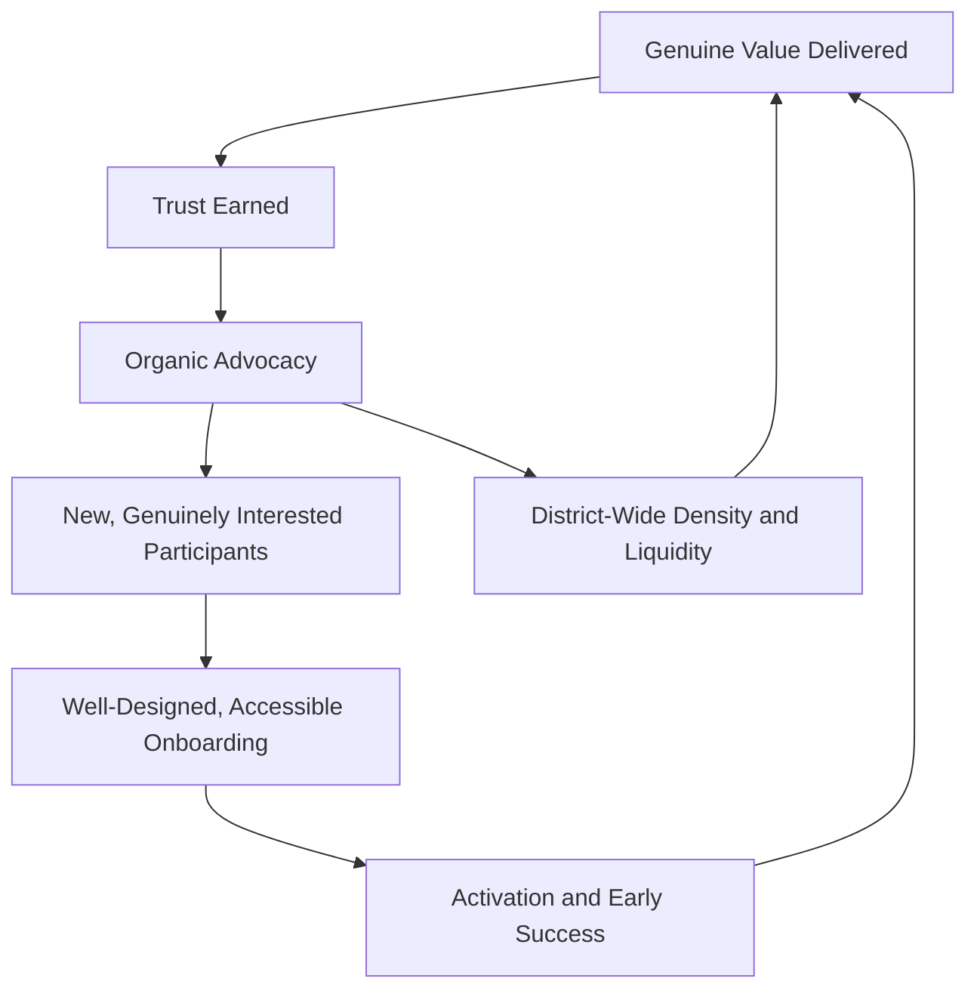

### Executive Dashboards

| Dashboard | Audience | Key Content |
|---|---|---|
| **CEO Dashboard** | CEO | Citizen Growth Rate, District Expansion Readiness Index, Citizen Trust Score |
| **Chief Growth Officer Dashboard** | CGO | Activation Rate, Retention Rate, Cross-Module Adoption Rate, Referral Quality |
| **CPO Dashboard** | CPO | Segment-level (urban/semi-urban/rural) adoption balance, Accessibility Index |
| **Trust & Safety Dashboard** | Chief Trust & Safety Officer | Fake-account and referral-abuse trend, Trust Score impact of growth initiatives |
| **Government Partners Dashboard** | Government liaisons | Government Adoption Rate, joint-growth-initiative performance |

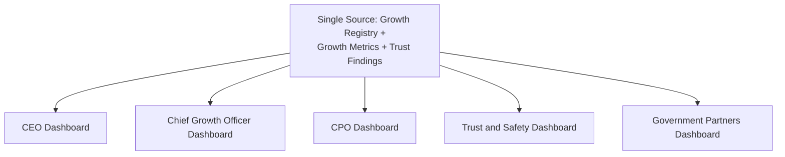

### Decision Matrix

| Decision Type | Approval Authority |
|---|---|
| New acquisition channel or mechanism | Growth Council + CEO |
| Referral or incentive structure | Growth Council + Chief Trust and Safety Officer |
| Government-partnered growth initiative | Growth Council + Head of Government Partnerships |
| District Expansion Readiness determination | Growth Council + CEO + Board |
| Emergency growth-trust response | Chief Trust and Safety Officer, ratified within 5 business days |

---

# Closing Statement

> **Callout — Closing Statement**
> Every prior document in this handbook explains what Arwal builds and how it earns and protects trust once a citizen is already inside the platform. This document explains something that comes before all of that: how a citizen, a merchant, a farmer, or a government department comes to be inside the platform at all, and — far more importantly — why they stay. Growth is not a campaign Arwal runs; it is the visible proof, repeated across a growing share of a district's population, that everything else in this handbook actually works. A district does not grow into Arwal because it was persuaded to — it grows into Arwal because a neighbor's certificate was renewed without a queue, because a farmer's price was finally fair, because a small shop finally had a storefront it could afford. Sustainable growth, done this way, is not separate from Arwal's civic mission — it is the mission's own evidence, accumulating one genuinely well-served citizen at a time. Where a future phase must deviate from a principle stated here, that deviation is made explicitly — through the Growth Governance process above — never silently, and never by default.

This document, `ai-docs/80-user-growth-strategy.md`, is Phase 81 of approximately 415. Every future acquisition, activation, retention, and expansion decision is expected to trace back to a principle defined here, or to justify its deviation in writing.

**End of Phase 81 — `ai-docs/80-user-growth-strategy.md`**