# Product Analytics Strategy

**Document:** `ai-docs/81-product-analytics-strategy.md`
**Project:** Arwal — The District Super App
**Stage:** 2 — Product & Business Strategy
**Phase:** 82 — Product Analytics Strategy
**Status:** Approved for Product & Engineering Reference
**Audience:** CEO, CSO, CPO, Chief Analytics Officer, Enterprise Business Architects, Product Analytics Strategists, Customer Insights Consultants, Government Digital Transformation Advisors, Trust & Safety Strategists, Privacy & Compliance Advisors, Data Governance Specialists, Investors

> **Callout — Purpose of This Document**
> `ai-docs/00-project-vision.md` through `ai-docs/80-user-growth-strategy.md` established why Arwal exists, what it can do, who it serves, what it feels like to use, how it sustains itself, how it partners with government, the whole district ecosystem it operates inside, and how every vertical and cross-cutting capability — marketplace, payments, community, communication, discovery, AI, trust & safety, and growth — creates and protects value. None of those documents answers a question every one of them ultimately depends on being answered honestly: **how does Arwal actually know whether any of it is working — for a citizen, for a merchant, for a government department — without turning citizens into data points and trust into a spreadsheet?** This document is that answer — the authoritative Product Analytics Strategy every future measurement, insight, and evidence-based decision traces back to.

---

# Purpose of this Document

### Why Analytics Is a Strategic Capability, Not a Tracking Function

Every claim made in this handbook — that a citizen trusts Arwal more this year than last, that a merchant's income genuinely improved, that a government department's backlog genuinely shrank — is either evidenced or it is not. Product Analytics is the capability that turns "we believe this is working" into "here is the evidence, and here is what we did because of it." Analytics at Arwal is not a dashboard function bolted onto engineering; it is the evidentiary backbone of every strategic document in this handbook, from `ai-docs/50-product-vision-business-strategy.md`'s Strategic Objectives to `ai-docs/79-trust-safety-framework.md`'s Platform Integrity Index. This document exists to make that evidentiary function itself a governed, trust-respecting, technology-independent strategic capability — never an afterthought bolted on once the product already exists.

### This Is Not an Analytics Implementation Guide

This document contains no event schema, no tool configuration, no SQL, no dashboard wireframe, no telemetry pipeline, and no API contract. It does not redefine Business Capabilities (`ai-docs/55`), Customer Experience Metrics (`ai-docs/60`), or any vertical strategy's own metrics section (`ai-docs/65` through `ai-docs/80`) — each remains fully authoritative for its own metrics and is cited, never restated. This document's exclusive territory is: **why measurement matters strategically, who participates in creating and consuming insight, how evidence is created responsibly, and how the analytics capability itself is governed, protected, and grown for a generation.**

### Why Measurement Serves Citizens Before It Serves Metrics

Per the North Star Principle already established in `ai-docs/00-project-vision.md`, Arwal explicitly rejects vanity metrics disconnected from trust and genuine outcome. Analytics exists to answer one question above every other: *is a citizen's life genuinely, measurably better for having used Arwal?* Every other question — engagement, retention, conversion — is instrumental to that one, never a replacement for it. An analytics capability that optimizes its own numbers instead of citizen outcomes has inverted its own purpose.

### The Chain of Reasoning This Document Extends

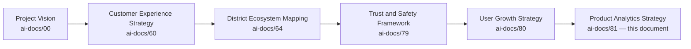

| Layer | Question It Answers |
|---|---|
| Project Vision | Why does a unified civic-commercial platform need to exist? |
| Customer Experience Strategy | What must every citizen feel, cumulatively? |
| District Ecosystem Mapping | What is the whole living system Arwal operates inside? |
| Trust & Safety Framework | How is trust created, protected, and measured? |
| User Growth Strategy | How does Arwal responsibly grow? |
| **Product Analytics Strategy** (this document) | **How does Arwal know, with evidence, whether any of the above is actually true — and use that evidence responsibly?** |

### Scope Boundary

This document does not define a specific metric's calculation formula, a data-warehouse architecture, or a specific dashboard's layout — those belong to each vertical's own metrics section and to future technical-implementation phases. Its territory is strategic: the philosophy, the value chain, the stakeholder relationships, and the governance that make Arwal's measurement capability trustworthy, proportionate, and genuinely useful for a generation of decision-making.

---

# Analytics Philosophy

Every principle below exists because an analytics strategy assembled carelessly does not fail abstractly — it fails a specific citizen whose behavior was tracked without genuine purpose, or a specific product decision made confidently on a number that measured the wrong thing.

### Citizen First
**Why it exists:** Every measurement decision is judged first against whether it serves the citizen being measured, never an internal reporting convenience, mirroring the identical Citizen-First tie-breaker already established throughout `ai-docs/51` through `ai-docs/80`.

### Measure Value, Not Vanity
**Why it exists:** A registration count, a session length, or a click-through rate is only meaningful insofar as it reflects genuine citizen value delivered — per `ai-docs/00-project-vision.md`'s explicit rejection of vanity growth metrics, Arwal measures outcomes a citizen would recognize as mattering to their own life, never a number that merely looks good in a boardroom.

### Privacy by Design
**Why it exists:** Measurement capability is designed, from its first specification, around the minimum data genuinely required to answer a real question — never around "collect everything, decide what it's for later," per the identical Privacy by Design discipline already established in `ai-docs/10-security-standards.md`.

### Trust Before Measurement
**Why it exists:** A citizen's willingness to be measured at all depends entirely on their trust that the measurement serves them, not merely Arwal — analytics capability is built only as fast as that trust genuinely permits, never ahead of it.

### Transparency
**Why it exists:** A citizen can always understand, in plain terms, that Arwal measures product usage to improve the product — concealment of what is measured and why breeds exactly the suspicion `ai-docs/60-customer-experience-strategy.md` already rejects at every other interaction.

### Accessibility
**Why it exists:** Insight generated from analytics must ultimately translate into a product improvement every citizen — including a low-literacy, voice-first, first-generation smartphone user — can actually benefit from, per `ai-docs/12-accessibility-standards.md`'s non-negotiable floor.

### Actionable Insights
**Why it exists:** A metric that does not change a decision is not analytics — it is data exhaust. Every measurement this document endorses is designed, from the outset, to answer a question someone will actually act on.

### Business Alignment
**Why it exists:** Every measurement traces to a Strategic Objective already established in `ai-docs/50-product-vision-business-strategy.md` — a metric collected because it is technically easy to collect, rather than because it answers a real business question, is scope creep, not strategy.

### Responsible Measurement
**Why it exists:** The fact that a behavior *can* be measured does not mean it *should* be — every measurement is evaluated for its necessity and proportionality before it is added to Arwal's analytics surface, mirroring the identical Least Privilege reasoning already established in `ai-docs/10-security-standards.md`.

### Continuous Learning
**Why it exists:** An analytics capability that answers the same questions the same way forever stops being useful the moment citizen needs, product complexity, or district composition shift — measurement itself is iterated on, per the Continuous Improvement discipline already established throughout `ai-docs/60` through `ai-docs/80`.

### Evidence-Based Decisions
**Why it exists:** A decision made by seniority or persuasive narrative alone is a decision analytics exists to replace with evidence — not because judgment is unwelcome, but because the stakes (a citizen's healthcare booking, a farmer's livelihood) are too high to risk on an untested assumption when evidence is available.

### Long-Term Product Health
**Why it exists:** Analytics is evaluated on the same multi-decade horizon as every other strategic document in this handbook — a metric that looks good this quarter while quietly eroding trust or accessibility over years is a regression, never a win.

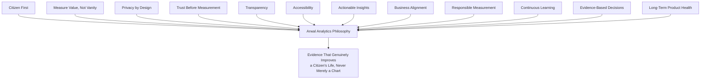

> **Callout — The One-Sentence Analytics Philosophy**
> *"Arwal measures a citizen's experience only as much as it takes to make that experience better, never merely to prove a number went up."*

---

# Analytics Value Chain

| Stage | Business Description |
|---|---|
| **Business Objective** | A genuine strategic question is posed — is Farmer Empowerment actually happening, is Government Efficiency actually improving — traced to a Strategic Objective in `ai-docs/50`. |
| **Measurement Objective** | The business objective is translated into a specific, answerable measurement question, never a vague aspiration to "track everything." |
| **Behavior Observation** | Only the data genuinely necessary to answer that question is observed, consented, and proportionate to the question's stakes. |
| **Insight Generation** | Observed behavior is synthesized into a genuine insight — a pattern, a gap, a trend — never a raw number presented without interpretation. |
| **Decision Support** | The insight is presented to the accountable decision-maker in a form they can actually act on. |
| **Product Improvement** | A genuine product, policy, or process change is made in response to the insight. |
| **Outcome Evaluation** | The change's actual effect is measured against the original business objective, closing the loop honestly — including when the change did not help. |
| **Learning** | What was learned, including any wrong assumption the data corrected, is captured for the next cycle. |
| **Continuous Improvement** | The next Business Objective is informed by what was learned, restarting the chain deliberately rather than reactively. |

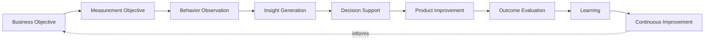

---

# Stakeholder Ecosystem

| Stakeholder | Strategic Role in Analytics |
|---|---|
| **Citizens** | The population whose genuine, consented behavior is the ultimate source of every insight — and whose trust determines whether that behavior can be observed at all. |
| **Families** | The household unit through which a shared device's usage pattern must be interpreted carefully, never conflated with a single individual's behavior. |
| **Government Departments** | Consumers of civic-service analytics (completion time, backlog trend) who hold Arwal accountable to its own Government Efficiency claims. |
| **Merchants** | Consumers of their own storefront's performance data, and contributors of the transaction signal that measures Business Enablement. |
| **Service Providers** | Consumers of their own booking and reputation trend data, informing their own participation decisions. |
| **Healthcare Providers** | Consumers of appointment and no-show analytics, informing their own scheduling practice without ever exposing another provider's data. |
| **Educational Institutions** | Consumers of discovery and enrollment trend data relevant to their own participation. |
| **Community Organizations** | Consumers of beneficiary-reach analytics, per `ai-docs/75-community-social-engagement-strategy.md`, informing their own outreach strategy. |
| **Product Teams** | The primary internal consumers translating insight into a shipped improvement. |
| **Analytics Teams** | The internal function accountable for the integrity, proportionality, and governance of every measurement. |
| **Leadership** | The accountable audience for Strategic Objective-level insight, per the Executive Dashboards below. |
| **Future Analytics Stakeholders** | A second district's own analytics baseline, established independently per `ai-docs/50`'s Strategic Expansion Principles, never inherited by assumption. |

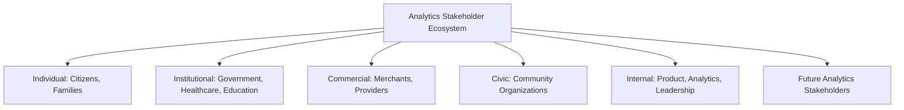

---

# Product Analytics Lifecycle

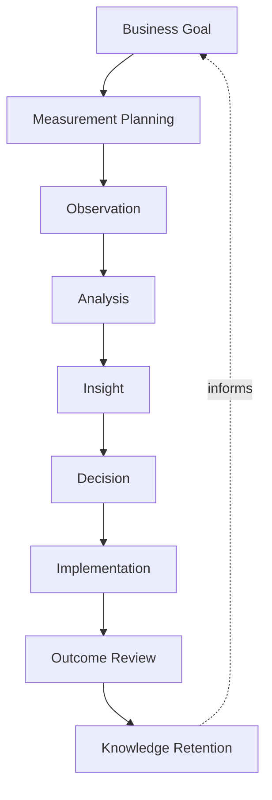

| Stage | Meaning |
|---|---|
| **Business Goal** | A genuine strategic question, traced to `ai-docs/50`'s Strategic Objectives. |
| **Measurement Planning** | The specific, proportionate, consented data required to answer it is defined before any collection begins. |
| **Observation** | Citizen behavior is observed only within that defined, consented scope. |
| **Analysis** | The observed data is examined for genuine pattern, never cherry-picked to support a predetermined conclusion. |
| **Insight** | A clear, decision-relevant finding is produced. |
| **Decision** | An accountable owner decides what to do with the insight. |
| **Implementation** | The decision is executed as a genuine product, policy, or process change. |
| **Outcome Review** | The change's real effect is honestly measured, including a null or negative result. |
| **Knowledge Retention** | The finding — whatever it was — is retained for the next cycle, per the identical Documentation Before Tribal Knowledge principle already established in `ai-docs/24-documentation-standards.md`. |

---

# Value Creation

| Question | Answer |
|---|---|
| **How do citizens create insight?** | By engaging genuinely and, where asked, providing honest feedback — their consented behavior is the foundation every other insight is built from. |
| **How do businesses create insight?** | By transacting honestly, generating the signal that measures whether Business Enablement and Marketplace Health are genuinely improving. |
| **How does government create insight?** | By sharing accurate civic-process data, enabling Government Efficiency to be measured against a real, agreed baseline rather than an assumption. |
| **How do product teams create value?** | By translating insight into a genuine, shipped improvement — an insight that never becomes a change has created no value at all. |
| **How does analytics create value?** | By converting scattered, ambiguous impressions ("citizens seem happier") into a specific, actionable, falsifiable finding leadership and product teams can actually decide on. |
| **How does Arwal create value?** | By closing the loop honestly — measuring not just whether a feature shipped, but whether it genuinely helped, and changing course when it did not. |
| **How does evidence improve decisions?** | By replacing "we believe" with "we verified," reducing the risk that a confidently wrong assumption compounds across the platform's ~415-phase roadmap. |
| **How does district transformation accelerate?** | Every genuine insight that leads to a genuine improvement is one more citizen, farmer, or department whose experience of Arwal measurably improved — analytics is the feedback loop that makes the founding mission self-correcting rather than merely aspirational. |

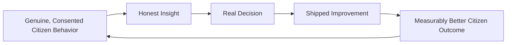

---

# Business Model

Every capability below is described strategically — its business rationale, never its implementation. The enforceable capability logic behind every vertical's own metrics remains owned entirely by its own governing document.

| Capability | Business Rationale |
|---|---|
| **Product Health Analytics** | A composite, cross-vertical view of whether the platform overall is functioning well for citizens, never assessed from a single vertical's metric alone. |
| **User Journey Analytics** | Measuring the specific journeys already catalogued in `ai-docs/56-user-journey-standards.md` — drop-off, completion, and accessibility parity — never a redefinition of those journeys. |
| **Feature Adoption Analytics** | Whether a shipped capability is genuinely being used by the citizens it was built for, distinguishing real adoption from a launch-week novelty spike. |
| **Engagement Analytics** | The depth and genuineness of a citizen's return use, never conflated with an artificially inflated session count. |
| **Retention Analytics** | Whether citizens stay, per `ai-docs/60-customer-experience-strategy.md`'s WAU/MAU discipline — the single most honest signal of durable value delivered. |
| **Marketplace Analytics** | Liquidity, fairness, and trust signals already established in `ai-docs/65-marketplace-strategy.md`'s Marketplace Metrics, consumed here at the cross-vertical level. |
| **Government Service Analytics** | Civic-service completion time and backlog trend, jointly reviewed with the relevant department per `ai-docs/63-government-partnership-strategy.md`. |
| **Community Analytics** | Beneficiary-reach and genuine-engagement signals, per `ai-docs/75-community-social-engagement-strategy.md`, never a virality-optimized metric. |
| **AI Product Analytics** | Task success, human-escalation appropriateness, and fairness signals already established in `ai-docs/78-ai-product-strategy.md`'s Metrics. |
| **Trust Analytics** | The District Trust Signal and its vertical-specific expressions, per `ai-docs/79-trust-safety-framework.md`, treated as a co-equal input alongside every growth or revenue metric. |
| **Cross-Module Analytics** | Cross-Vertical Adoption Depth, per `ai-docs/50-product-vision-business-strategy.md` — the structural signal of whether Arwal's trust-compounding advantage is real. |
| **Strategic Decision Support** | Synthesizing the above into the evidence base `ai-docs/48-engineering-strategic-planning-standards.md`'s Strategic Themes and OKRs are actually reviewed against. |

```mermaid
graph TD
    BizModel9[Analytics Business Model] --> ProdHealth[Product Health Analytics]
    BizModel9 --> JourneyAnalytics[User Journey Analytics]
    BizModel9 --> FeatureAdopt[Feature Adoption Analytics]
    BizModel9 --> EngageAnalytics[Engagement Analytics]
    BizModel9 --> RetentionAnalytics[Retention Analytics]
    BizModel9 --> MarketAnalytics[Marketplace Analytics]
    BizModel9 --> GovAnalytics[Government Service Analytics]
    BizModel9 --> CommAnalytics[Community Analytics]
    BizModel9 --> AIAnalytics[AI Product Analytics]
    BizModel9 --> TrustAnalytics[Trust Analytics]
    BizModel9 --> CrossModuleAnalytics[Cross-Module Analytics]
    BizModel9 --> StrategicSupport[Strategic Decision Support]
```

---

# Responsible Analytics Strategy

| Mechanism | Strategic Role |
|---|---|
| **Privacy Protection** | Every measurement respects the Data Classification tiers already established in `ai-docs/10-security-standards.md` — Restricted and Confidential-tier data is never used for analytics beyond its consented purpose. |
| **Consent Management** | Analytics observation of a citizen's behavior draws only on data they have explicitly consented to share for that purpose, per RULE-003. |
| **Responsible Measurement** | A behavior is measured only when a genuine, named business question requires it — never spec­ulatively, per the identical YAGNI discipline already established in `ai-docs/02-engineering-principles.md`, applied here to data collection. |
| **Bias Awareness** | Every insight is checked against the Anti-Discrimination Safeguards already established in `ai-docs/52-user-personas-user-segmentation.md` — a pattern that looks true in aggregate but conceals a disparate outcome for a vulnerable segment is treated as a finding, not an inconvenience. |
| **Transparency** | A citizen can always learn, in plain language, that Arwal measures usage to improve the product — never concealed in dense legal language alone. |
| **Data Minimization** | Only the data genuinely required for a defined measurement question is retained, per RULE-025's Data Retention standard. |
| **Governance** | Every new measurement passes through the Analytics Council's approval, per Governance below — never added ad hoc by an individual team. |
| **Ethical Analysis** | An insight is never selectively reported to support a predetermined narrative — a finding that contradicts a comfortable assumption is reported with the same rigor as one that confirms it. |
| **Government Coordination** | Civic-service analytics shared with a government partner is reviewed jointly before publication, per `ai-docs/63-government-partnership-strategy.md`. |
| **Citizen Trust** | Every mechanism above compounds into one felt outcome: a citizen who never has reason to suspect they are being watched rather than served. |

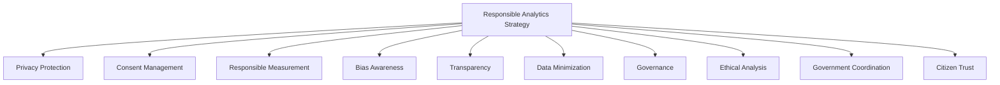

> **Callout — A Metric Nobody Acts On Is a Privacy Cost With No Benefit**
> Per Actionable Insights and Data Minimization above, any measurement that has not informed a genuine decision within a defined review cycle is a candidate for retirement, per the Governance discipline below — collecting a citizen's behavioral signal "just in case it's useful later" is rejected under the identical reasoning `ai-docs/02-engineering-principles.md` already applies to speculative code.

---

# Economic & Social Impact

| Impact Area | How Arwal's Analytics Strategy Contributes |
|---|---|
| **Improve Product Quality** | Evidence-based iteration replaces guesswork, closing genuine usability and accessibility gaps faster. |
| **Increase Citizen Satisfaction** | Insight into genuine friction points feeds directly into `ai-docs/60-customer-experience-strategy.md`'s Continuous Improvement Loop. |
| **Improve Government Services** | Honest completion-time and backlog trend data gives a department genuine evidence to justify continued or deepened partnership. |
| **Increase Business Productivity** | Merchant and provider-facing analytics (their own performance only) help a small seller make better operating decisions. |
| **Improve Marketplace Performance** | Liquidity and fairness signals, per `ai-docs/65`, are caught and corrected before they erode trust at scale. |
| **Support MSMEs** | A small merchant's own dashboard-level insight, scaled to their sophistication, per `ai-docs/54-product-module-catalog.md`'s Module Design Philosophy. |
| **Reduce Waste** | Evidence-based prioritization directs limited engineering and outreach capacity toward what is genuinely underperforming, never toward what merely feels urgent. |
| **Strengthen District Development** | A platform that honestly measures its own civic and economic impact is a platform that can prove, not merely assert, its contribution to `ai-docs/64-district-ecosystem-mapping.md`'s District Development Strategy. |

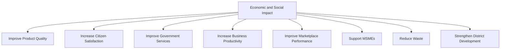

---

# Governance

### Ownership
Product Analytics Strategy ownership sits with the Chief Analytics Officer (or CPO where the role is not yet separately staffed), with each vertical's own metrics accountable to that vertical's Business Owner per `ai-docs/53`'s Domain Registry, mirroring the Clear Ownership discipline already established throughout `ai-docs/53` through `ai-docs/80`.

### Analytics Council
A standing **Analytics Council** — chaired by the Chief Analytics Officer, with the CPO, Chief Trust & Safety Officer, Compliance Officer, Head of Accessibility & Inclusion, and rotating vertical Heads as members — holds approval authority over any new platform-wide measurement, any cross-vertical metric definition change, and any material deviation from the Anti-Patterns below. The Council meets monthly, with ad hoc sessions for a Product Health Index regression.

### Decision Authority

| Decision | Approves |
|---|---|
| New platform-wide measurement | Analytics Council + CPO |
| Cross-vertical metric definition change | Analytics Council |
| Government-shared analytics publication | Analytics Council + Head of Government Partnerships |
| Metric retirement (unused or low-value) | Analytics Council |
| Emergency privacy-integrity response (e.g., an over-collection finding) | Compliance Officer, immediate, ratified by Council within 5 business days |

### Review Cadence

| Review | Cadence | Owner |
|---|---|---|
| Analytics Health Review | Monthly | Analytics Council |
| Metric Portfolio Review (retire unused, add justified) | Quarterly | Analytics Council |
| Annual Analytics Strategy Review | Annual | CEO, Chief Analytics Officer, CPO |

### Continuous Improvement
Every Outcome Review from the Product Analytics Lifecycle feeds a shared, tracked improvement backlog, reviewed at the next Analytics Health Review, per the identical Continuous Improvement Loop already established in `ai-docs/60-customer-experience-strategy.md`.

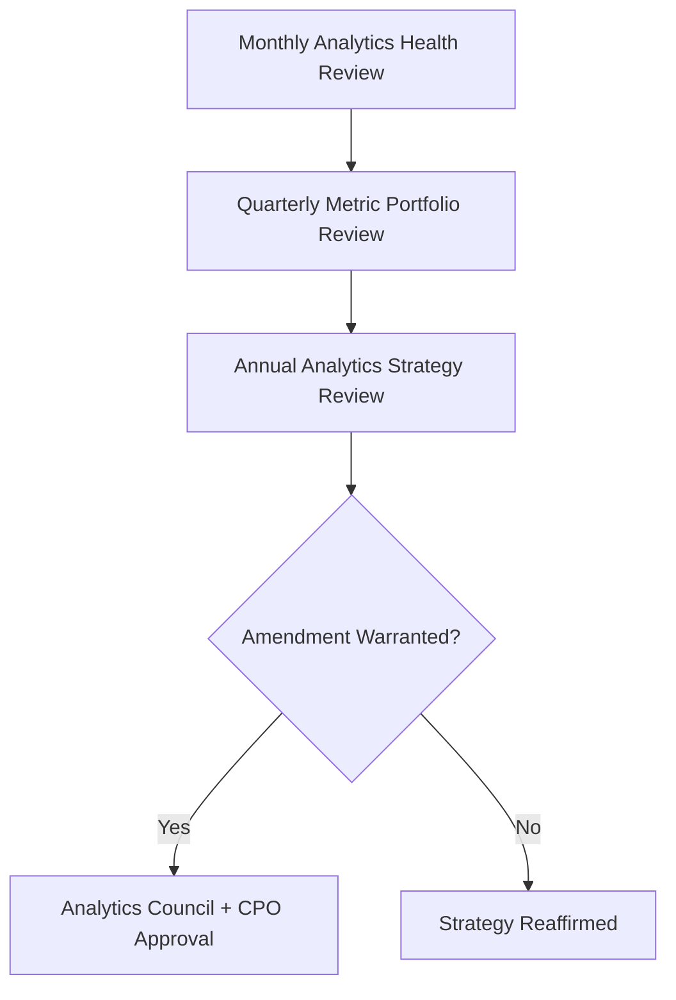

---

# Risks

| Risk | Description | Mitigation |
|---|---|---|
| **Vanity Metrics** | A metric that looks impressive but does not reflect genuine citizen value. | Measure Value, Not Vanity principle; every metric traced to a Strategic Objective before adoption. |
| **Privacy Violations** | Behavioral data used beyond its consented purpose. | RULE-003's Consent Requirement; Privacy by Design and Data Minimization above. |
| **Biased Interpretation** | An insight drawn from data that under-represents a vulnerable segment. | Bias Awareness mechanism; Anti-Discrimination Safeguards per `ai-docs/52`. |
| **Poor Measurement** | A metric that technically measures something but not the thing that actually matters. | Measurement Planning stage discipline; Analytics Council review before adoption. |
| **Metric Manipulation** | A team optimizes a proxy metric in a way that games the number without improving the underlying outcome. | North Star Principle discipline; every metric reviewed jointly with its corresponding Trust and Retention signal. |
| **Data Silos** | Vertical-specific analytics that never inform cross-vertical or strategic decisions. | Cross-Module Analytics and Strategic Decision Support capabilities above. |
| **Digital Exclusion** | Analytics that structurally under-represent rural, low-literacy, or assisted-access citizens because their usage patterns are harder to capture. | Accessibility principle; Bias Awareness extended explicitly to device- and connectivity-tier segments. |
| **Trust Erosion** | A citizen discovers a measurement practice they were not genuinely aware of. | Transparency mechanism; Governance approval required before any new measurement goes live. |
| **Regulatory Changes** | A data-protection regulation shift invalidates an existing measurement assumption. | Configurable, Compliance-reviewed measurement practice, never a hardcoded assumption, per `ai-docs/01-product-goals.md`'s Regulatory Constraint. |

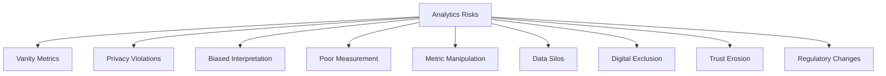

---

# Metrics

| Metric | Definition | Direction |
|---|---|---|
| **Insight Adoption Rate** | % of generated insights that lead to a genuine, traceable decision or change. | Increasing |
| **Decision Accuracy** | The rate at which a decision made on an insight is later confirmed correct by outcome data. | Increasing |
| **Analytics Coverage** | The share of Strategic Objectives (`ai-docs/50`) with a genuine, current measurement in place. | Increasing |
| **Product Health Index** | A composite index combining Retention, Task Success, and Trust signals across every vertical. | Increasing |
| **Citizen Value Index** | Per `ai-docs/61-value-proposition-framework.md`, cross-referenced here as the analytics capability's own north star. | Increasing |
| **Evidence-Based Decision Rate** | % of major product decisions citing a specific, traceable insight before approval. | Increasing |
| **Analytics Trust Score** | District Trust Signal, viewed for analytics/data-use interactions specifically. | Increasing |
| **Data Quality Index** | The completeness, accuracy, and freshness of the data underlying active measurements. | Increasing |
| **Analytics Ecosystem Health** | A composite index combining Insight Adoption Rate, Analytics Trust Score, and Data Quality Index. | Increasing |

> **Callout — No Analytics Metric Stands Alone**
> Per the North Star Principle already established in `ai-docs/00-project-vision.md`, a rising Analytics Coverage number alongside a falling Analytics Trust Score, or a rising Decision volume alongside a flat Insight Adoption Rate, is treated as a regression — never counted as success in isolation.

---

# Anti-Patterns

| Anti-Pattern | Why It's Rejected |
|---|---|
| **Measuring Everything** | Collecting data speculatively, "in case it's useful," violates Responsible Measurement and Data Minimization simultaneously. |
| **Vanity Metrics** | A metric optimized for its own appearance rather than genuine citizen value violates Measure Value, Not Vanity. |
| **Data Without Action** | An insight generated and never acted on has created privacy cost with no corresponding benefit, violating Actionable Insights. |
| **Ignoring Privacy** | Any measurement bypassing consent or exceeding its stated purpose violates Privacy by Design and RULE-003 directly. |
| **Ignoring Accessibility** | Analytics that structurally under-represent assisted, voice-first, or rural citizens produce insight that serves only part of the district. |
| **Metrics Without Context** | A number reported without its relationship to Trust, Retention, or Accessibility signals invites a confidently wrong conclusion. |
| **Technology Before Value** | Adopting a measurement capability because it is technically sophisticated rather than because it answers a genuine business question violates Business Alignment. |
| **Analytics Without Governance** | A measurement added without Analytics Council review risks silently violating Privacy, Fairness, or Proportionality — the exact failure Governance above exists to prevent. |

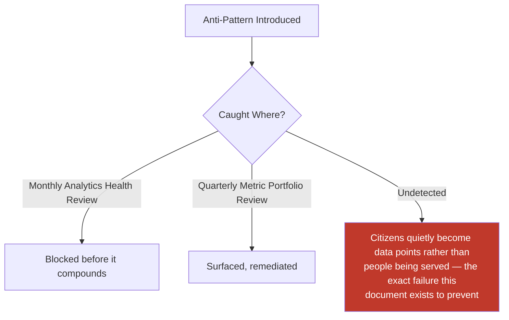

---

# Relationship to Previous Documents

| Prior Document | Relationship |
|---|---|
| **Project Vision (`ai-docs/00`)** | Establishes the founding North Star Principle and rejection of vanity metrics this document's entire philosophy operationalizes. |
| **Product Vision & Business Strategy (`ai-docs/50`)** | Supplies the Strategic Objectives every measurement in this document ultimately traces back to. |
| **User Personas (`ai-docs/52`)** | Supplies the individual, evidence-grounded citizens whose Accessibility and Anti-Discrimination needs this document's Bias Awareness mechanism protects. |
| **Business Domain Model (`ai-docs/53`)** | Supplies the ownership structure behind every domain this document's stakeholder ecosystem draws from. |
| **Product Module Catalog (`ai-docs/54`)** | Supplies the user-visible surfaces this document's Feature Adoption and Journey Analytics measure. |
| **Business Capability Map (`ai-docs/55`)** | Supplies the stable capabilities whose own Success Metrics this document's Product Health Analytics aggregates. |
| **User Journey Standards (`ai-docs/56`)** | Supplies the Journey Analytics discipline (drop-off, completion, accessibility parity) this document's User Journey Analytics capability cites directly. |
| **Business Rules & Policies (`ai-docs/58`)** | Supplies RULE-003's Consent Requirement and RULE-025's Data Retention standard this document's Responsible Analytics Strategy is bound by. |
| **Customer Experience Strategy (`ai-docs/60`)** | Supplies the Experience Metrics and Voice of Customer loop this document's insight generation feeds directly into. |
| **Value Proposition Framework (`ai-docs/61`)** | Supplies the Citizen Value Index this document's own metrics are measured against. |
| **Revenue & Sustainability Strategy (`ai-docs/62`)** | Supplies the Sustainability Metrics this document's Strategic Decision Support consumes alongside product-health signals. |
| **District Ecosystem Mapping (`ai-docs/64`)** | Supplies the whole-system Ecosystem Health view this document's Cross-Module Analytics feeds into. |
| **Marketplace Strategy (`ai-docs/65`)** | Supplies the Marketplace Metrics this document's Marketplace Analytics capability cites, never redefines. |
| **Payments & Financial Services Strategy (`ai-docs/74`)** | Supplies the Payments Metrics this document's cross-vertical view incorporates. |
| **Search & Discovery Strategy (`ai-docs/77`)** | Supplies the Discovery Metrics this document references for cross-vertical findability analysis. |
| **AI Product Strategy (`ai-docs/78`)** | Supplies the AI Metrics — Task Success Rate, Human Escalation Rate — this document's AI Product Analytics capability cites directly. |
| **Trust & Safety Framework (`ai-docs/79`)** | Supplies the District Trust Signal and Platform Integrity Index this document treats as a co-equal, non-negotiable input alongside every growth metric. |
| **User Growth Strategy (`ai-docs/80`)** | Supplies the Growth Metrics this document's evidence base is jointly reviewed against, per the North Star Principle. |

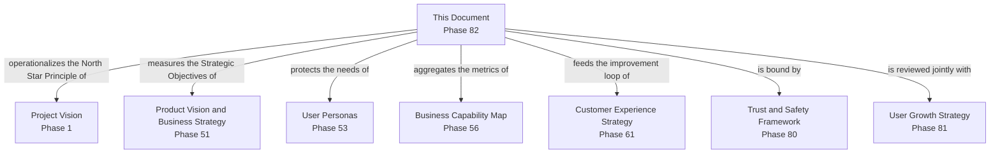

---

# Executive Artifacts

### Product Analytics Framework

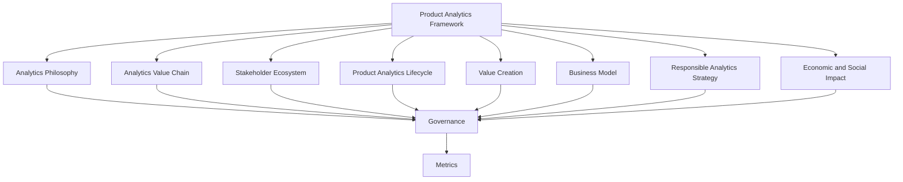

### Analytics Value Chain

See Analytics Value Chain section above — reproduced here by reference per Single Source of Truth, never duplicated.

### Analytics Lifecycle

See Product Analytics Lifecycle section above.

### Analytics Ecosystem Map

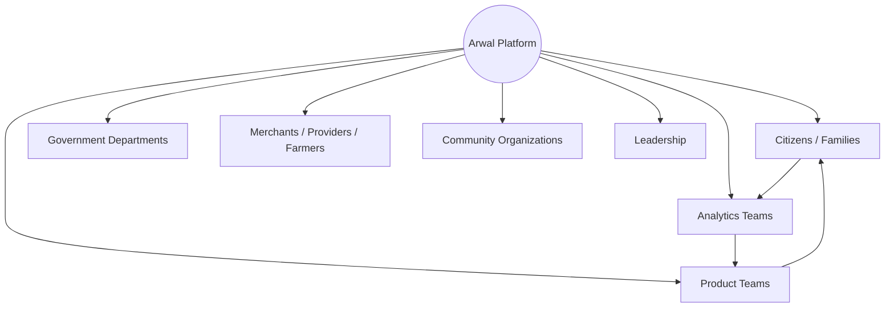

### Analytics Governance Model

See Governance section above.

### Evidence-Based Decision Framework

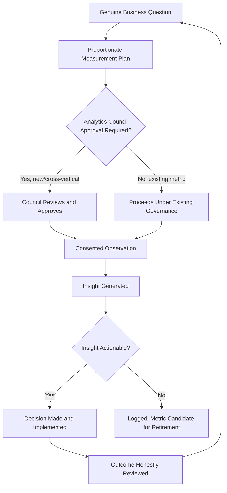

### Executive Dashboards (Conceptual)

| Dashboard | Audience | Key Content |
|---|---|---|
| **CEO Dashboard** | CEO | Product Health Index, Citizen Value Index, Analytics Trust Score |
| **Chief Analytics Officer Dashboard** | CAO | Insight Adoption Rate, Analytics Coverage, Data Quality Index |
| **CPO Dashboard** | CPO | Feature Adoption, Retention, Cross-Module Adoption trend |
| **Trust & Safety Dashboard** | Chief Trust & Safety Officer | Analytics Trust Score, privacy-compliance status of active measurements |
| **Government Partners Dashboard** | Government liaisons | Jointly-reviewed civic-service completion and backlog trend |

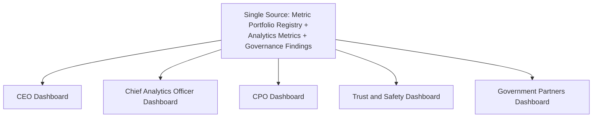

### Decision Matrix

| Decision Type | Approval Authority |
|---|---|
| New platform-wide measurement | Analytics Council + CPO |
| Cross-vertical metric definition change | Analytics Council |
| Government-shared analytics publication | Analytics Council + Head of Government Partnerships |
| Metric retirement | Analytics Council |
| Emergency privacy-integrity response | Compliance Officer, ratified within 5 business days |

---

# Closing Statement

> **Callout — Closing Statement**
> Every prior document in this handbook makes a claim about what Arwal is worth to a citizen, a merchant, a farmer, or a government department. This document is how Arwal keeps itself honest about whether those claims are actually true — not by collecting everything it technically can, but by asking a genuine question, observing only what answering it requires, and acting honestly on what it finds, including when the answer is uncomfortable. A platform that measures its citizens without their trust has already failed the measurement's purpose before a single insight is generated; a platform that measures nothing cannot tell a genuine improvement from a confident guess. Arwal's analytics capability exists in the narrow, disciplined space between those two failures — proportionate, consented, transparent, and always in service of a citizen's actual life, never merely a chart in a boardroom. Where a future phase must deviate from a principle stated here, that deviation is made explicitly — through the Analytics Governance process above — never silently, and never by default.

This document, `ai-docs/81-product-analytics-strategy.md`, is Phase 82 of approximately 415. Every future measurement, insight, and evidence-based decision is expected to trace back to a principle defined here, or to justify its deviation in writing.

**End of Phase 82 — `ai-docs/81-product-analytics-strategy.md`**