# Product KPI Framework

**Document:** `ai-docs/82-product-kpi-framework.md`
**Project:** Arwal — The District Super App
**Stage:** 2 — Product & Business Strategy
**Phase:** 83 — Product KPI Framework
**Status:** Approved for Product & Engineering Reference
**Audience:** CEO, CSO, CPO, Chief Analytics Officer, Enterprise Business Architects, Performance Management Consultants, Product Strategy Consultants, Government Digital Transformation Advisors, Trust & Safety Strategists, Privacy & Compliance Advisors, Investors

> **Callout — Purpose of This Document**
> `ai-docs/00-project-vision.md` through `ai-docs/81-product-analytics-strategy.md` established why Arwal exists, what it can do, who it serves, how it sustains itself, how it partners with government, the whole district ecosystem it operates inside, and how it measures itself honestly. None of those documents answers the specific question every board review, every government renewal conversation, and every product roadmap prioritization ultimately needs answered in one citable place: **which numbers actually matter, why, to whom, and what happens when they move?** This document is that answer — the authoritative Product KPI Framework every future performance review, target-setting exercise, and executive scorecard traces back to.

---

# Purpose of this Document

### Why KPIs Are Strategic Instruments, Not Reporting Artifacts

`ai-docs/81-product-analytics-strategy.md` established *how* Arwal measures — the philosophy, the value chain, and the governance behind honest, consented, proportionate observation. This document sits one layer above that: it defines *which* of those measurements are elevated to the status of a Key Performance Indicator — a number leadership, government partners, and product teams actually hold each other accountable to. A KPI is not merely a metric that exists; it is a metric an organization has deliberately chosen to steer by. That choice is consequential — a KPI shapes what a team optimizes for, what a government partner expects, and what an investor believes Arwal is worth. This document exists to make that choice deliberate, governed, and permanently traceable, rather than an accumulation of whatever numbers happened to be easy to put on a slide.

### Why This Is Not a Dashboard, Reporting, or BI Document

This document contains no SQL, no data warehouse schema, no BI tool configuration, no dashboard wireframe, and no metric calculation formula. It does not redefine the Analytics Value Chain, Analytics Governance, or any vertical's own metrics table already established in `ai-docs/60` through `ai-docs/81` — each remains fully authoritative and is cited, never restated. This document's exclusive territory is: **why KPIs matter strategically, which categories of KPI Arwal governs, how a KPI is born, reviewed, and retired, and how the discipline of KPI governance itself protects citizen value rather than merely tracking it.**

### How KPIs Support Evidence-Based Decision-Making

Per `ai-docs/81-product-analytics-strategy.md`'s Evidence-Based Decisions principle, a decision made on seniority or persuasive narrative alone is a decision analytics exists to replace with evidence. A KPI is the specific, standing instrument that carries that evidence into every recurring leadership conversation — not a one-time analysis, but a number reviewed on a fixed cadence, held to a fixed definition, and trusted precisely because it does not change meaning between one quarter's review and the next.

### How KPIs Align with Arwal's Long-Term Vision

Per `ai-docs/00-project-vision.md`'s founding horizon, Arwal is infrastructure built for a generation, not a product cycle. A KPI framework that only reflects this quarter's convenient signal cannot serve that horizon — every KPI in this document is chosen because it reflects genuine, durable progress toward a Strategic Objective already established in `ai-docs/50-product-vision-business-strategy.md`, never because it is easy to compute or flattering to report.

### How KPIs Protect Citizen Value Instead of Encouraging Vanity Metrics

Per the founding Commercial Discipline in `ai-docs/00-project-vision.md`, Arwal explicitly rejects a district where raw downloads or raw GMV are celebrated while retention, trust, and dispute rates quietly worsen. A KPI framework is the mechanism that makes this rejection operational: every KPI in this document is paired, structurally, with a countervailing trust or quality signal it can never be read in isolation from — a discipline formalized in the Balanced Scorecard Model below.

### Relationship Between Every Stakeholder

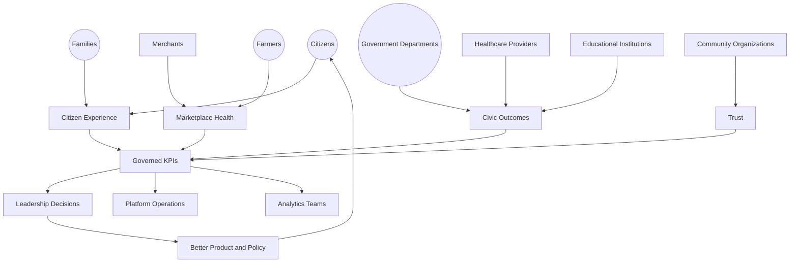

### Scope Boundary

This document does not calculate a KPI, does not specify its data source, and does not design its visualization — those remain the domain of `ai-docs/81-product-analytics-strategy.md`'s Analytics capability and future technical-implementation phases. Its territory is strategic: the philosophy, the categories, the lifecycle, and the governance that make Arwal's KPI portfolio a trustworthy, citizen-protecting instrument of leadership, never a vanity scoreboard.

---

# KPI Philosophy

Every principle below exists because a KPI framework assembled carelessly does not fail abstractly — it fails by quietly rewarding a team for hitting a number that made a citizen's life worse, or by hiding a real decline behind an aggregate that looked fine.

### Citizen Value First
**Why it exists:** Every KPI is evaluated first against whether its movement reflects genuine benefit to a citizen, merchant, farmer, or government partner, mirroring the identical Citizen-First tie-breaker already established throughout `ai-docs/51` through `ai-docs/81`. A KPI that can rise while citizen value falls is a defective KPI, not a success signal.

### Measure Outcomes
**Why it exists:** An output (a feature shipped, a screen viewed) is not the same as an outcome (a citizen's need genuinely met). Per `ai-docs/81-product-analytics-strategy.md`'s Actionable Insights principle, Arwal's KPI portfolio is weighted deliberately toward outcome measures, never output measures alone.

### Trust Before Targets
**Why it exists:** A target set before the underlying trust and quality baseline is understood invites exactly the metric-gaming this framework exists to prevent. A KPI's target is only meaningful once its corresponding trust signal is already being tracked, per the Balanced Scorecard Model below.

### Business Alignment
**Why it exists:** Every KPI traces to a Strategic Objective already established in `ai-docs/50-product-vision-business-strategy.md` — a KPI adopted because it is technically easy to compute, rather than because it answers a genuine strategic question, is scope creep, not governance.

### Evidence-Based Management
**Why it exists:** Leadership decisions are made against KPI evidence, not persuasive narrative alone, extending `ai-docs/81-product-analytics-strategy.md`'s Evidence-Based Decisions principle into the specific, standing instruments this document governs.

### Balanced Scorecards
**Why it exists:** No single KPI, viewed alone, can tell leadership whether Arwal is actually succeeding — growth without trust, revenue without retention, and adoption without accessibility are each, individually, a warning sign rather than a win. Every KPI is read in the company of its counterbalancing signal, never solo.

### Long-Term Thinking
**Why it exists:** A KPI framework is evaluated on the same multi-decade horizon as every other strategic document in this handbook — a target hit this quarter at the cost of the next decade's trust is a regression, never an achievement, per `ai-docs/62-revenue-sustainability-strategy.md`'s Long-Term Sustainability principle applied here to performance management specifically.

### Transparency
**Why it exists:** A KPI's definition, owner, and current value are never concealed from the teams accountable to it — a KPI whose calculation is opaque cannot be trusted to genuinely inform a decision, mirroring `ai-docs/81`'s Transparency principle extended to the KPI layer.

### Accessibility
**Why it exists:** A KPI portfolio that only reflects the experience of digitally fluent, urban, literate citizens has measured a fraction of the district Arwal exists to serve — every citizen-facing KPI is reviewed for whether it structurally represents rural, low-literacy, and assisted-access populations, per `ai-docs/12-accessibility-standards.md`'s non-negotiable floor.

### Responsible Measurement
**Why it exists:** A KPI is adopted only when a genuine, named strategic question requires it — never speculatively, mirroring the identical Responsible Measurement principle already established in `ai-docs/81-product-analytics-strategy.md`.

### Continuous Improvement
**Why it exists:** A KPI portfolio fixed at launch and never revisited decays as Arwal's strategy, scale, and district composition evolve — every KPI is subject to periodic review and, where it no longer serves a genuine question, retirement.

### Strategic Accountability
**Why it exists:** Every KPI has exactly one named, accountable owner who is answerable for its trend, its context, and its honest reporting — an unowned KPI is, in practice, an unmanaged one, mirroring the Clear Ownership discipline already established throughout `ai-docs/53` through `ai-docs/81`.

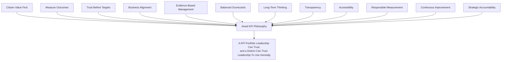

> **Callout — The One-Sentence KPI Philosophy**
> *"A KPI Arwal cannot explain to the citizen it claims to measure has no business steering the platform that citizen depends on."*

---

# KPI Value Chain

| Stage | Business Description |
|---|---|
| **Strategic Objective** | A genuine, board-level ambition already established in `ai-docs/50-product-vision-business-strategy.md` — Citizen Adoption, Government Efficiency, Farmer Empowerment. |
| **Business Outcome** | The specific, real-world change that objective implies — more citizens served without a physical queue, a farmer earning a fairer price. |
| **Success Indicator** | A plain-language statement of what "working" would actually look like, before any number is attached. |
| **KPI Definition** | The Success Indicator converted into a specific, named, ownable, reviewable indicator — entered into the KPI Register (below). |
| **Performance Review** | The KPI's current value and trend are examined against its counterbalancing signal, per the Balanced Scorecard Model. |
| **Decision** | An accountable leader decides what, if anything, the KPI's trend requires — investment, correction, or continued monitoring. |
| **Improvement** | A genuine product, policy, or process change follows the decision. |
| **Outcome Validation** | The change's real effect on both the KPI and its counterbalancing signal is honestly assessed. |
| **Continuous Evolution** | The KPI's definition, target, or continued relevance is revisited at its next scheduled review, never left static indefinitely. |

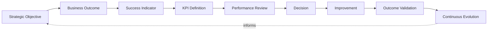

---

# Stakeholder Ecosystem

| Stakeholder | Strategic Role in the KPI Framework |
|---|---|
| **Citizens** | The ultimate reference point every KPI is measured against — a KPI trend that does not correspond to a genuine change in citizen experience has failed regardless of its direction. |
| **Families** | The household unit whose shared, delegated, or assisted usage patterns must be interpreted carefully within any citizen-facing KPI, never conflated with a single individual's behavior. |
| **Government** | Both a KPI subject (Government Efficiency, civic completion time) and a KPI consumer, holding Arwal accountable to its own published civic-impact claims. |
| **Businesses** | The broader commercial base whose collective health is reflected in Marketplace and Financial KPIs. |
| **Merchants** | Direct contributors to, and beneficiaries of, GMV, retention, and income-improvement KPIs, per `ai-docs/67-merchant-ecosystem.md`. |
| **Service Providers** | Contributors to booking-completion and reputation-compounding KPIs, per `ai-docs/66-service-provider-ecosystem.md`. |
| **Healthcare Providers** | Contributors to Healthcare Access KPIs, held to Arwal's highest verification and safety bar. |
| **Educational Institutions** | Contributors to Education Improvement KPIs, especially scholarship and skill-pathway discovery. |
| **Community Organizations** | Contributors to Community KPIs, per `ai-docs/75-community-social-engagement-strategy.md`, measured for genuine reach rather than virality. |
| **Leadership** | The accountable audience for the Executive KPI Hierarchy below, whose decisions this entire framework exists to inform. |
| **Product Teams** | The primary consumers translating a KPI's trend into a genuine roadmap decision. |
| **Analytics Teams** | The internal function accountable for a KPI's data integrity, per `ai-docs/81-product-analytics-strategy.md`'s Analytics Council. |
| **Future District Leadership** | Leadership of a second district's own KPI baseline, established independently per `ai-docs/50`'s Strategic Expansion Principles, never inherited by assumption. |

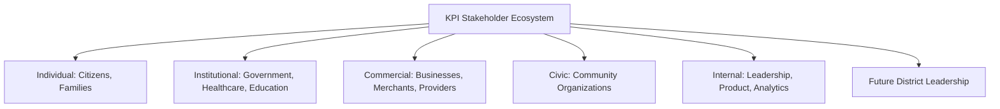

---

# KPI Lifecycle

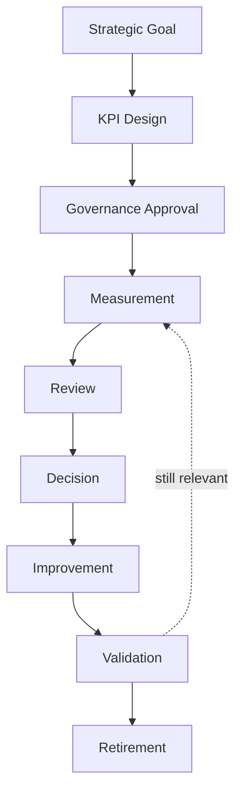

| Stage | Meaning | Exit Criterion |
|---|---|---|
| **Strategic Goal** | A genuine ambition traced to `ai-docs/50-product-vision-business-strategy.md`. | A named Strategic Objective is cited. |
| **KPI Design** | The goal is translated into a specific, ownable, balanced-pair KPI definition. | Definition, owner, counterbalancing signal, and review cadence are all stated. |
| **Governance Approval** | The KPI Council (below) reviews the proposal against this document's Philosophy. | Council sign-off recorded in the KPI Register. |
| **Measurement** | The KPI is observed per `ai-docs/81-product-analytics-strategy.md`'s Responsible Analytics Strategy. | Data collection is consented, proportionate, and live. |
| **Review** | The KPI's trend is examined at its defined cadence, always alongside its counterbalancing signal. | A review record exists for the period. |
| **Decision** | An accountable leader determines what the trend requires. | A decision, including "no action needed," is logged. |
| **Improvement** | A genuine change is made where the decision calls for one. | The change is traceable to the KPI review that prompted it. |
| **Validation** | The change's actual effect on the KPI and its counterbalance is honestly assessed. | Outcome recorded, including a null or negative result. |
| **Retirement** | A KPI no longer answering a genuine strategic question is retired, never left to linger unreviewed. | Retirement logged in the KPI Register; the KPI ID is archived, never reused. |

---

# Value Creation

| Question | Answer |
|---|---|
| **How do KPIs create value for citizens?** | By ensuring the outcomes a citizen actually cares about — a faster certificate, a fairer price, a safer transaction — are the outcomes leadership is structurally required to keep looking at. |
| **How does government benefit?** | By having a shared, jointly-legible measure of whether a civic partnership is genuinely delivering, per `ai-docs/63-government-partnership-strategy.md`, rather than relying on anecdote. |
| **How do businesses benefit?** | By having their own success — income growth, fair ranking, reliable settlement — reflected in the same framework leadership is held accountable to, closing the gap between Arwal's stated commitments and its actual incentives. |
| **How do product teams benefit?** | By having a stable, trusted, non-gameable definition of success to build toward, rather than a shifting or ambiguous target. |
| **How does evidence improve leadership?** | By replacing "I believe this initiative is working" with "here is the KPI, here is its counterbalance, and here is what we did in response" — the same Evidence-Based Decisions discipline already established in `ai-docs/81`, now standing and recurring. |
| **How does district transformation accelerate?** | A KPI framework that honestly tracks Citizen Adoption, Government Efficiency, and Farmer Empowerment together, in balance, is the mechanism by which Arwal's founding mission remains a measured commitment rather than a one-time claim. |

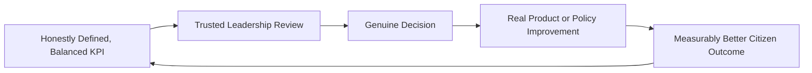

---

# Business Model

Every KPI category below is described strategically — its business rationale — never as a calculation. The enforceable metric definitions behind each category remain owned entirely by their originating governing document.

| KPI Category | Business Rationale |
|---|---|
| **Executive KPIs** | The handful of board-level indicators — District Trust Signal, Cross-Vertical Adoption Depth — summarizing whether Arwal's founding mission is being realized, per `ai-docs/50-product-vision-business-strategy.md`. |
| **Citizen Experience KPIs** | CSAT, CES, and Task Success Rate, per `ai-docs/60-customer-experience-strategy.md`'s Experience Metrics, tracking whether the felt experience matches the promise. |
| **Growth KPIs** | Citizen Growth Rate, Activation Rate, and Retention Rate, per `ai-docs/80-user-growth-strategy.md`, always paired with Citizen Trust Score. |
| **Retention KPIs** | WAU/MAU stickiness and multi-month cohort retention — the single most honest signal of durable value delivered, per `ai-docs/60`. |
| **Marketplace KPIs** | Liquidity, GMV with healthy contribution margin, and Merchant Retention, per `ai-docs/65-marketplace-strategy.md`, always paired with Dispute Rate. |
| **Government Service KPIs** | Application-to-issuance time, backlog reduction, and Scheme Utilization, per `ai-docs/63-government-partnership-strategy.md` and `ai-docs/68-agriculture-business-model.md`. |
| **Financial KPIs** | Transaction Success Rate, Settlement Time, and Revenue Diversity Index, per `ai-docs/74-payments-financial-services-strategy.md` and `ai-docs/62-revenue-sustainability-strategy.md`. |
| **Trust & Safety KPIs** | District Trust Signal, Fraud Detection Rate, and Dispute Resolution Time, per `ai-docs/79-trust-safety-framework.md`. |
| **AI KPIs** | Human-Override-Path Availability (100% target) and Task Success Rate, per `ai-docs/78-ai-product-strategy.md`. |
| **Community KPIs** | Beneficiary Reach and genuine engagement, never a virality-optimized signal, per `ai-docs/75-community-social-engagement-strategy.md`. |
| **Cross-Module KPIs** | Cross-Vertical Adoption Depth — the structural signal of whether Arwal's trust-compounding advantage over single-purpose competitors is real. |
| **Strategic Health KPIs** | District Development Index and Platform Sustainability Score, synthesizing every category above into the evidence base `ai-docs/48-engineering-strategic-planning-standards.md`'s Strategic Themes are reviewed against. |

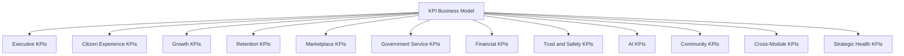

---

# Balanced Scorecard Model

Per Balanced Scorecards above, no KPI in the framework is approved without a named counterbalancing signal it is always reviewed alongside.

| Primary KPI | Mandatory Counterbalance | Why This Pairing |
|---|---|---|
| Citizen Growth Rate | Citizen Trust Score | Growth without trust is a regression, per `ai-docs/80`'s North Star discipline. |
| GMV / Transaction Volume | Dispute Rate | Revenue growth alongside rising disputes signals extraction, not value creation. |
| Feature Adoption Rate | Accessibility Completion Parity | Adoption concentrated in one segment is not genuine platform-wide success. |
| AI Adoption Rate | Human Escalation Appropriateness | Automation growth without preserved human oversight violates RULE-024. |
| Merchant Growth | Merchant Retention | New merchants without retained ones signals a leaky, not a healthy, ecosystem. |
| Government Departments Integrated | Government Trust Index | Breadth of integration without genuine departmental confidence is fragile. |
| Revenue Growth | Accessibility & Compliance Investment | Revenue growth that displaces protected investment categories violates `ai-docs/62`'s Investment Priorities. |

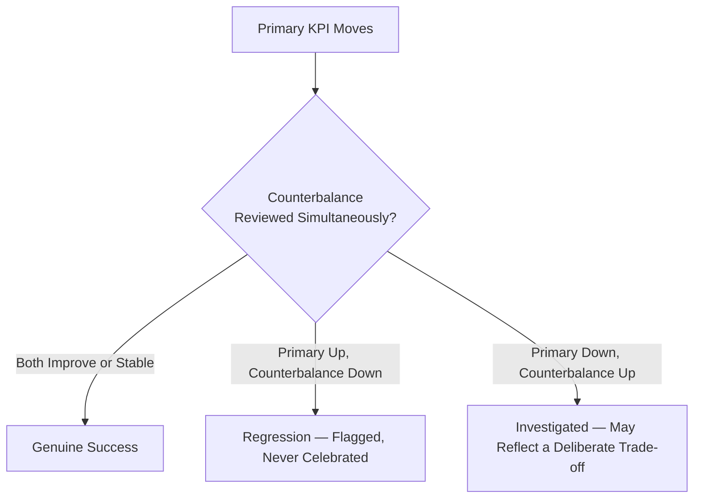

---

# Executive KPI Hierarchy

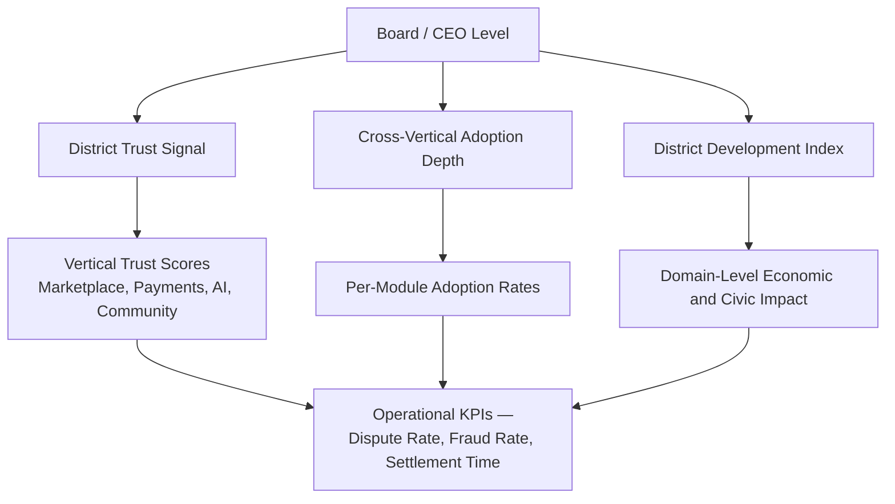

Every KPI at the Operational tier rolls up into exactly one Board-level KPI — no operational metric is tracked without a clear line of sight to a Strategic Objective, per Business Alignment above.

---

# Responsible KPI Strategy

| Mechanism | Strategic Role |
|---|---|
| **Balanced Measurement** | Every KPI is approved only with its counterbalancing signal already defined, per the Balanced Scorecard Model above. |
| **Privacy Protection** | KPI data draws only on consented, proportionate observation, per RULE-003 and `ai-docs/81-product-analytics-strategy.md`'s Privacy by Design. |
| **Context Before Numbers** | A KPI is never reported as a bare number in leadership review — its trend, its counterbalance, and any known confounding factor are reported together. |
| **Responsible Target Setting** | A target is set only once a KPI's baseline and natural variance are genuinely understood, never as an arbitrary round number chosen for ambition alone. |
| **Bias Awareness** | Every citizen-facing KPI is checked against the Anti-Discrimination Safeguards already established in `ai-docs/52-user-personas-user-segmentation.md` — an aggregate improvement concealing a rural or low-literacy decline is treated as a finding, not a footnote. |
| **Governance** | Every new KPI passes through the KPI Council's approval, per Governance below — never adopted informally by a single team. |
| **Periodic KPI Review** | Every KPI's continued relevance, definition, and target are reconfirmed at a fixed cadence, never assumed permanent. |
| **Retiring Obsolete KPIs** | A KPI no longer informing a genuine decision is retired deliberately, per the KPI Lifecycle's Retirement stage — never left to quietly mislead. |
| **Citizen Trust** | Every mechanism above compounds into one felt outcome: a citizen whose life is genuinely, measurably better because leadership was held to honest numbers. |

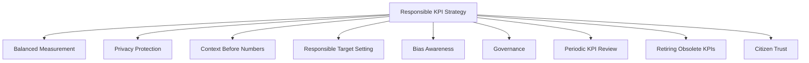

> **Callout — A KPI Without a Counterbalance Is Not Approved**
> Per Balanced Measurement above, the KPI Council does not approve a new KPI proposal that lacks a named counterbalancing signal — a growth or revenue KPI proposed without an accompanying trust or quality pairing is returned for revision, never granted an exception for urgency.

---

# Economic & Social Impact

| Impact Area | How KPI Governance Contributes |
|---|---|
| **Improve Product Quality** | Outcome-weighted KPIs direct engineering and design attention toward what genuinely matters to a citizen, not merely what is easiest to ship. |
| **Improve Government Performance** | Jointly-reviewed civic KPIs give a department genuine, shared evidence of Arwal's contribution, strengthening the case for deeper partnership. |
| **Improve Citizen Outcomes** | A framework that structurally cannot celebrate growth without trust protects the citizen experience from being sacrificed for a number. |
| **Support MSMEs** | Merchant Retention paired with Merchant Growth ensures small-seller success is tracked as rigorously as raw platform expansion. |
| **Improve Marketplace Health** | Dispute Rate as a mandatory GMV counterbalance catches marketplace degradation before it compounds. |
| **Increase Accountability** | Named KPI owners and a standing Governance cadence make it structurally difficult for a concerning trend to go unnoticed or unowned. |
| **Strengthen District Development** | A District Development Index, built from every domain's honest KPI evidence, gives Arwal a defensible, non-anecdotal claim to its own civic impact. |

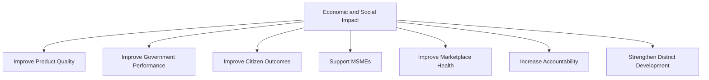

---

# Governance

### Ownership
Product KPI Framework ownership sits with the CPO and Chief Analytics Officer jointly, with each individual KPI's trend and context accountable to a named Business Owner per `ai-docs/53`'s Domain Registry, mirroring the Clear Ownership discipline already established throughout `ai-docs/53` through `ai-docs/81`.

### KPI Council
A standing **KPI Council** — chaired by the CPO, with the CEO, CFO, Chief Analytics Officer, Chief Trust & Safety Officer, Head of Accessibility & Inclusion, and rotating vertical Heads as members — holds approval authority over any new Executive or cross-vertical KPI, any target-setting exercise, and any KPI retirement. The Council meets monthly, with ad hoc sessions for a Strategic Health KPI regression.

### Decision Authority

| Decision | Approves |
|---|---|
| New Executive KPI | KPI Council + CEO |
| New vertical or operational KPI | KPI Council |
| Target-setting or target revision | KPI Council + accountable Business Owner |
| KPI retirement | KPI Council |
| Emergency KPI-integrity response (e.g., a discovered gaming pattern) | Chief Analytics Officer, immediate, ratified by Council within 5 business days |

### Review Cadence

| Review | Cadence | Owner |
|---|---|---|
| KPI Health Review | Monthly | KPI Council |
| Balanced Scorecard Review | Quarterly | KPI Council, vertical Heads |
| Annual KPI Framework Review | Annual | CEO, CPO, Chief Analytics Officer |

### Approval Workflow

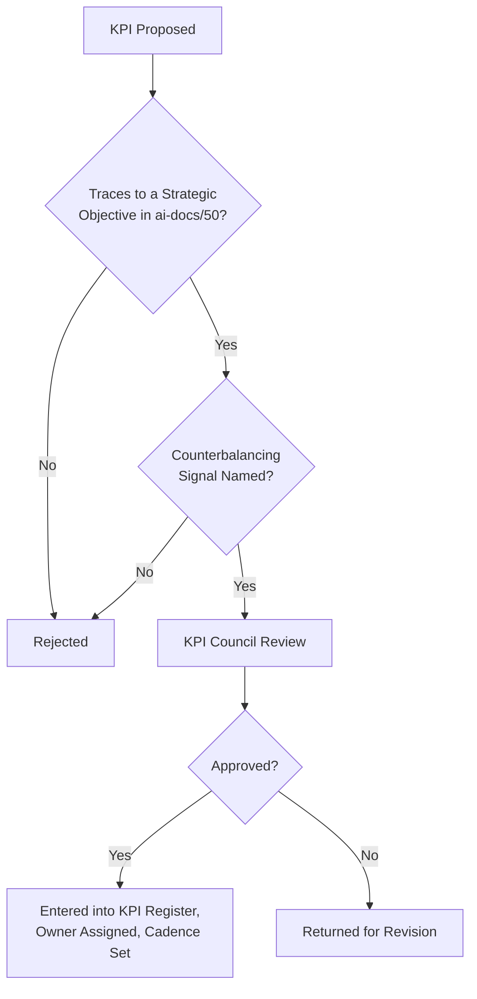

### Continuous Improvement
Every Outcome Validation from the KPI Lifecycle feeds a shared, tracked improvement backlog, reviewed at the next KPI Health Review, per the identical Continuous Improvement Loop already established in `ai-docs/60-customer-experience-strategy.md`.

---

# Risks

| Risk | Description | Mitigation |
|---|---|---|
| **Vanity KPIs** | A KPI that looks impressive but does not reflect genuine citizen value. | Measure Outcomes and Citizen Value First principles; Council review before adoption. |
| **Metric Gaming** | A team optimizes a KPI's number without improving the underlying reality it was meant to represent. | Balanced Scorecard Model's mandatory counterbalance; Context Before Numbers. |
| **Misaligned Incentives** | A KPI target rewards behavior that conflicts with a citizen's genuine interest. | Trust Before Targets; Responsible Target Setting. |
| **Over-Measurement** | Too many KPIs dilute leadership attention until none receive genuine scrutiny. | KPI Overload anti-pattern rejected below; periodic Retirement discipline. |
| **Poor Governance** | A KPI adopted without Council review risks silently violating Balance, Privacy, or Alignment. | Mandatory Governance Approval stage in the KPI Lifecycle. |
| **Bias** | A KPI's aggregate trend conceals a disparate outcome for a vulnerable segment. | Bias Awareness mechanism; Anti-Discrimination Safeguards per `ai-docs/52`. |
| **Privacy Risks** | KPI-supporting data used beyond its consented purpose. | RULE-003's Consent Requirement; Privacy Protection above. |
| **Trust Erosion** | A citizen or partner discovers a KPI was reported selectively or without context. | Transparency and Context Before Numbers; honest reporting even of unfavorable trends. |
| **Regulatory Changes** | A data-protection or civic-reporting regulation shift invalidates an existing KPI's data basis. | Configurable, Compliance-reviewed KPI data sourcing, never a hardcoded assumption. |

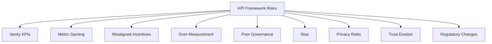

---

# Metrics

KPIs governing the KPI Framework itself — a standing, self-referential discipline mirroring `ai-docs/30-engineering-risk-management-standards.md`'s treatment of risk-management-about-risk-management.

| Metric | Definition | Direction |
|---|---|---|
| **KPI Adoption Rate** | % of approved KPIs actively reviewed at their defined cadence. | Increasing toward 100% |
| **KPI Review Compliance** | % of scheduled KPI reviews completed on time. | Increasing toward 100% |
| **Strategic Alignment Index** | % of active KPIs with a traceable link to a current Strategic Objective. | Increasing toward 100% |
| **Decision Effectiveness** | % of KPI-triggered decisions later confirmed, via Outcome Validation, to have improved the underlying reality. | Increasing |
| **Balanced Scorecard Health** | % of active KPIs with a currently tracked, healthy counterbalancing signal. | Increasing toward 100% |
| **KPI Trust Index** | Leadership- and partner-reported confidence that KPI reporting is honest and complete. | Increasing |
| **KPI Lifecycle Compliance** | % of KPIs with complete, current Register entries (owner, cadence, counterbalance, review history). | Increasing toward 100% |
| **Performance Governance Index** | A composite index combining KPI Review Compliance, Balanced Scorecard Health, and KPI Trust Index. | Increasing |

> **Callout — No KPI-About-KPIs Stands Alone Either**
> A rising KPI Adoption Rate alongside a falling Decision Effectiveness signals a Council rubber-stamping proposals rather than genuinely governing them — this pairing is itself reviewed at every Annual KPI Framework Review.

---

# Anti-Patterns

| Anti-Pattern | Why It's Rejected |
|---|---|
| **Managing by Vanity Metrics** | Steering the platform by a number chosen for its optics rather than its genuine link to citizen value violates Citizen Value First. |
| **KPI Overload** | Too many tracked KPIs dilute leadership attention until none receive genuine scrutiny — violates Strategic Accountability. |
| **Measuring Without Action** | A KPI reviewed repeatedly with no resulting decision has created reporting cost with no corresponding benefit, violating Evidence-Based Management. |
| **Technology Before Purpose** | Adopting a KPI because a new analytics capability makes it easy to compute, rather than because a genuine question requires it, violates Business Alignment. |
| **Ignoring Context** | Reporting a KPI's number without its counterbalance or known confounders violates Context Before Numbers. |
| **Ignoring Accessibility** | A KPI portfolio that never disaggregates by literacy, device, or geography has measured only part of the district, violating Accessibility. |
| **Unreviewed KPIs** | A KPI left unreviewed past its defined cadence is a KPI leadership has quietly stopped being accountable to. |
| **Growth Before Citizen Value** | Any KPI decision that trades a citizen's genuine interest for a faster-moving number violates the North Star Principle already established in `ai-docs/00-project-vision.md`. |

```mermaid
graph TD
    A[Anti-Pattern Introduced] --> B{Caught Where?}
    B -->|Monthly KPI Health Review| C[Blocked before it compounds]
    B -->|Quarterly Balanced Scorecard Review| D[Surfaced, remediated]
    B -->|Undetected| E[Leadership steers by a number that no longer\nreflects a citizen's real life — the exact failure\nthis document exists to prevent]
    style E fill:#c0392b,color:#fff
```

---

# Relationship to Previous Documents

| Prior Document | Relationship |
|---|---|
| **Project Vision (`ai-docs/00`)** | Establishes the founding North Star Principle and rejection of vanity metrics this entire framework operationalizes into standing, governed instruments. |
| **Product Vision & Business Strategy (`ai-docs/50`)** | Supplies the Strategic Objectives every KPI in this document ultimately traces back to. |
| **User Personas (`ai-docs/52`)** | Supplies the individual citizens whose accessibility and inclusion needs this document's Bias Awareness mechanism protects. |
| **Business Domain Model (`ai-docs/53`)** | Supplies the ownership structure every KPI's Business Owner is drawn from. |
| **Product Module Catalog (`ai-docs/54`)** | Supplies the user-visible surfaces this document's Feature and Module Adoption KPIs measure. |
| **Business Capability Map (`ai-docs/55`)** | Supplies the stable capabilities whose own Success Metrics this document elevates into governed KPIs where strategically warranted. |
| **User Journey Standards (`ai-docs/56`)** | Supplies the Completion Rate and Accessibility Parity metrics this document's Citizen Experience KPIs cite directly. |
| **Business Rules & Policies (`ai-docs/58`)** | Supplies RULE-003's Consent Requirement this document's Responsible KPI Strategy is bound by. |
| **Customer Experience Strategy (`ai-docs/60`)** | Supplies the Experience Metrics (CSAT, NPS, CES) this document's Citizen Experience KPI category cites directly. |
| **Value Proposition Framework (`ai-docs/61`)** | Supplies the Citizen Value Index this document's Executive KPIs are measured against. |
| **Revenue & Sustainability Strategy (`ai-docs/62`)** | Supplies the Sustainability Metrics and Investment Priorities this document's Financial KPIs and their protected-category counterbalances cite. |
| **District Ecosystem Mapping (`ai-docs/64`)** | Supplies the District Development Strategy this document's Strategic Health KPIs synthesize evidence toward. |
| **Marketplace Strategy (`ai-docs/65`)** | Supplies the Marketplace Metrics this document's Marketplace KPI category cites, never redefines. |
| **Payments & Financial Services Strategy (`ai-docs/74`)** | Supplies the Payments Metrics this document's Financial KPIs incorporate. |
| **Search & Discovery Strategy (`ai-docs/77`)** | Supplies the Discovery Metrics this document references for cross-vertical findability KPIs. |
| **AI Product Strategy (`ai-docs/78`)** | Supplies the AI Metrics — Task Success Rate, Human Escalation Rate — this document's AI KPI category cites directly. |
| **Trust & Safety Framework (`ai-docs/79`)** | Supplies the District Trust Signal and Platform Integrity Index this document treats as the mandatory counterbalance for nearly every growth-adjacent KPI. |
| **User Growth Strategy (`ai-docs/80`)** | Supplies the Growth Metrics this document's Growth KPI category is built directly on top of. |
| **Product Analytics Strategy (`ai-docs/81`)** | Supplies the entire measurement philosophy, value chain, and governance discipline this document's KPI-specific elevation and Balanced Scorecard Model extend, never duplicate. |

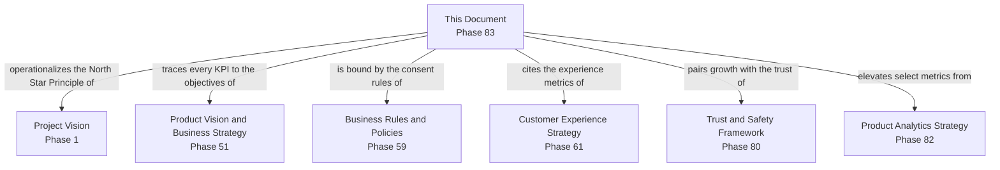

---

# Executive Artifacts

### Product KPI Framework

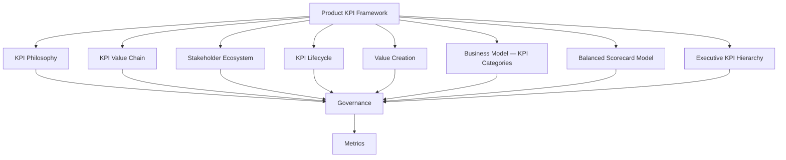

### KPI Value Chain

See KPI Value Chain section above — reproduced here by reference per Single Source of Truth, never duplicated.

### KPI Lifecycle

See KPI Lifecycle section above.

### Balanced Scorecard Model

See Balanced Scorecard Model section above.

### KPI Governance Model

See Governance section above.

### Executive KPI Hierarchy

See Executive KPI Hierarchy section above.

### Executive Dashboards (Conceptual)

| Dashboard | Audience | Key Content |
|---|---|---|
| **CEO / Board Dashboard** | CEO, Board | District Trust Signal, Cross-Vertical Adoption Depth, District Development Index, all paired counterbalances |
| **CPO Dashboard** | CPO | Citizen Experience KPIs, Growth and Retention KPIs, Balanced Scorecard status |
| **Chief Analytics Officer Dashboard** | CAO | KPI Register health, Review Compliance, Data Quality feeding each KPI |
| **Vertical Head Dashboards** | Domain Owners | Vertical-specific KPI and counterbalance trend |
| **Government Partners Dashboard** | Government liaisons | Government Service KPIs, jointly reviewed civic-impact evidence |

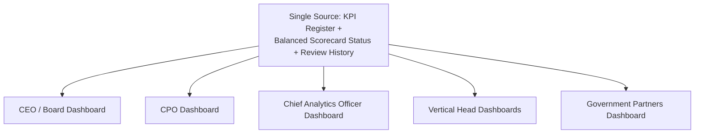

### Decision Matrix

| Decision Type | Approval Authority |
|---|---|
| New Executive KPI | KPI Council + CEO |
| New vertical/operational KPI | KPI Council |
| Target-setting or revision | KPI Council + accountable Business Owner |
| KPI retirement | KPI Council |
| Emergency KPI-integrity response | Chief Analytics Officer, ratified within 5 business days |

---

# Closing Statement

> **Callout — Closing Statement**
> Every prior document in this handbook makes a claim about what Arwal is worth, how it earns trust, and how it measures itself honestly. This document is where those claims are converted into the specific, standing numbers leadership is actually held to — never a scoreboard chosen for how it looks in a boardroom, but a disciplined, balanced, citizen-anchored set of indicators that cannot rise without a corresponding trust or quality signal being reviewed alongside them. A KPI framework that lets growth outrun trust, or revenue outrun retention, is not a performance-management discipline — it is a countdown to the moment the gap becomes visible to the district it was meant to serve. Arwal's KPIs exist to keep that gap from ever opening: every number this framework elevates is one leadership has committed, in advance, to reading honestly, in context, alongside its counterbalance, for as long as this platform exists. Where a future phase must deviate from a principle stated here, that deviation is made explicitly — through the KPI Governance process above — never silently, and never by default.

This document, `ai-docs/82-product-kpi-framework.md`, is Phase 83 of approximately 415. Every future performance review, target-setting exercise, and executive scorecard is expected to trace back to a principle defined here, or to justify its deviation in writing.

**End of Phase 83 — `ai-docs/82-product-kpi-framework.md`**