# Business Intelligence Framework

**Document:** `ai-docs/83-business-intelligence-framework.md`
**Project:** Arwal — The District Super App
**Stage:** 2 — Product & Business Strategy
**Phase:** 84 — Business Intelligence Framework
**Status:** Approved for Product & Engineering Reference
**Audience:** CEO, CSO, CPO, Chief Analytics Officer, Chief Data Officer, Enterprise Business Architects, Business Intelligence Strategists, Government Digital Transformation Advisors, Performance Management Consultants, Trust & Safety Strategists, Enterprise Governance Consultants, Investors

> **Callout — Purpose of This Document**
> `ai-docs/00-project-vision.md` through `ai-docs/81-product-analytics-strategy.md` established why Arwal exists, what it can do, who it serves, how it sustains itself, how it partners with government, the whole district ecosystem it operates inside, and how Product Analytics turns citizen behavior into honest, consented evidence. None of those documents answers the question every executive decision ultimately depends on: **once evidence exists, how does Arwal turn it into a strategic decision that leadership can actually trust — consistently, across every domain, without ever collapsing context into a chart or letting a dashboard replace judgment?** This document is that answer — the authoritative Business Intelligence Framework every future strategic decision, executive review, and governance judgment traces back to.

---

# Purpose of this Document

### Why Business Intelligence Is a Distinct Layer Above Analytics

`ai-docs/81-product-analytics-strategy.md` already established how Arwal observes citizen behavior responsibly and turns it into insight. That document's territory ends at the insight. Business Intelligence begins where analytics ends: **the deliberate, governed act of turning many insights, from many domains, into a single strategic picture leadership can act on.** A metric is not a decision. A dashboard is not a strategy. Business Intelligence is the discipline that keeps the distance between "we have a number" and "we made the right call" as short and as honest as possible, at the scale of an entire district's civic-commercial life.

### This Is Not a BI Tool, Warehouse, or Reporting Implementation

This document contains no BI software selection, no data-warehouse schema, no ETL pipeline, no SQL, no dashboard configuration, and no API contract. It does not redefine Product Analytics Strategy (`ai-docs/81`), any vertical's own Metrics section (`ai-docs/65` through `ai-docs/80`), or Engineering Strategic Planning (`ai-docs/48`) — each remains fully authoritative and is cited, never restated. This document's exclusive territory is: **why business intelligence is a strategic capability, who participates in it, how evidence becomes a strategic decision, and how that capability is governed, protected, and grown for a generation of district leadership.**

### Why Business Intelligence Is a Strategic Capability, Not a Reporting Function

A platform generating thousands of metrics across fifty-plus modules and eighteen risk categories does not automatically produce good decisions — it produces noise unless something deliberately converts fragmented signal into a coherent strategic picture. Per `ai-docs/48-engineering-strategic-planning-standards.md`'s Evidence-Based Planning principle and `ai-docs/00-project-vision.md`'s North Star Principle, Arwal's leadership is expected to reason from evidence, not from the loudest metric or the most recent anecdote. Business Intelligence is the capability that makes that expectation actually achievable at scale — the connective layer between every domain's own analytics and the Engineering Leadership Council, the Board, and the district's own long-term interest.

### The Chain of Reasoning This Document Extends

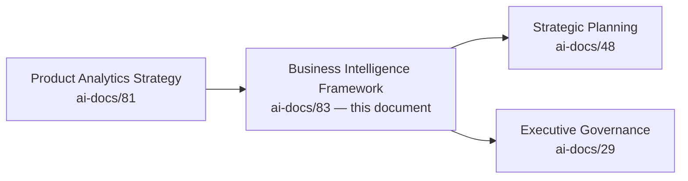

| Layer | Question It Answers |
|---|---|
| Product Analytics Strategy | How does Arwal responsibly observe and understand citizen behavior? |
| **Business Intelligence Framework** (this document) | **How does that understanding become a strategic decision leadership can trust and defend?** |
| Engineering Strategic Planning | Where is Arwal deliberately taking the platform, and how is that plan revised as evidence changes? |

### Scope Boundary

This document does not define a dashboard's layout, a data model, a metric's calculation formula, or a specific tool's configuration — those are either already owned by `ai-docs/81-product-analytics-strategy.md` and each vertical's own metrics sections, or belong to a future technical-implementation phase. Its territory is strategic: the philosophy, the value chain, the stakeholder relationships, and the governance that make Arwal's business intelligence capability trustworthy, proportionate, and genuinely useful across a generation of leadership decisions.

---

# Business Intelligence Philosophy

Every principle below exists because a business intelligence capability assembled carelessly does not fail abstractly — it fails a specific leadership decision made confidently on a number stripped of the context that would have changed it.

### Citizen Value First
**Why it exists:** Every intelligence product is judged first against whether it helps leadership serve citizens better, never against how impressive it looks in a boardroom, mirroring the identical Citizen-First tie-breaker already established throughout `ai-docs/51` through `ai-docs/81`.

### Evidence Before Opinion
**Why it exists:** A strategic claim is only as strong as the evidence behind it — per `ai-docs/48-engineering-strategic-planning-standards.md`'s Evidence-Based Planning, a persuasive narrative from a senior voice never outranks a verified, traceable finding.

### Business Context Before Numbers
**Why it exists:** A number without its surrounding context — what changed, who was affected, what else moved alongside it — invites exactly the wrong conclusion. Business Intelligence never presents a metric without the context required to interpret it honestly.

### Trust Before Optimization
**Why it exists:** A business intelligence practice that optimizes its own numbers rather than genuine citizen and district outcomes has inverted its purpose, mirroring the identical North Star Principle already established in `ai-docs/00-project-vision.md`.

### Transparency
**Why it exists:** A leadership decision made on evidence nobody outside a small circle can see or question is a decision the district is asked to trust blindly — every strategic recommendation states its evidence base openly, per the Transparency principle already established throughout `ai-docs/60` through `ai-docs/81`.

### Privacy by Design
**Why it exists:** Business Intelligence consumes analytics already governed by RULE-003's Consent Requirement and `ai-docs/81`'s Responsible Analytics Strategy — it never re-derives a shortcut around that governance merely because the output is a slide instead of a dashboard.

### Accessibility
**Why it exists:** A strategic insight that cannot ultimately be explained in plain language to a government partner or a citizen-facing team has failed to actually inform anyone — Business Intelligence output is held to the same plain-language floor `ai-docs/12-accessibility-standards.md` sets everywhere else.

### Responsible Intelligence
**Why it exists:** The fact that two metrics *can* be combined into a compelling narrative does not mean they *should* be — every cross-domain synthesis is checked for whether it genuinely reflects a real pattern or merely a coincidence dressed as insight.

### Strategic Alignment
**Why it exists:** Every intelligence product traces to a Strategic Objective already established in `ai-docs/50-product-vision-business-strategy.md` or a Strategic Theme in `ai-docs/48-engineering-strategic-planning-standards.md` — intelligence produced because it is technically interesting, not because it answers a real leadership question, is scope creep.

### Cross-Functional Collaboration
**Why it exists:** No single team holds the full picture of Arwal's district-wide impact — Business Intelligence exists specifically to synthesize Product, Engineering, Trust & Safety, Government Partnerships, and Finance into one coherent, cross-checked view, never a single function's private narrative.

### Continuous Learning
**Why it exists:** A strategic conclusion that was correct last year may not be correct this year as district composition, government policy, and citizen expectations evolve — intelligence is revisited on a defined cadence, never treated as permanently settled.

### Long-Term Public Value
**Why it exists:** Business Intelligence is evaluated on the same generational horizon as every other strategic capability in this handbook — a recommendation that improves this quarter's number while quietly eroding trust, equity, or public confidence over years is a regression, never a win.

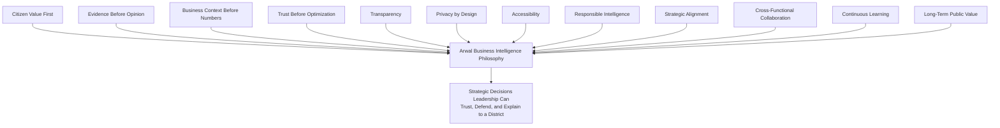

> **Callout — The One-Sentence Business Intelligence Philosophy**
> *"A number leadership cannot explain to the citizen it describes is not intelligence — it is a chart waiting to mislead someone with real authority."*

---

# Business Intelligence Value Chain

| Stage | Business Description |
|---|---|
| **Business Objective** | A genuine strategic question is posed by leadership — traced to a Strategic Objective in `ai-docs/50` or a Strategic Theme in `ai-docs/48`. |
| **Analytics** | The proportionate, consented, domain-specific measurement already governed by `ai-docs/81-product-analytics-strategy.md` and each vertical's own Metrics section. |
| **KPIs** | Analytics distilled into the specific, standing indicators leadership tracks over time, per each domain's already-established KPI tables. |
| **Insight Generation** | Individual KPIs are examined for genuine pattern, trend, and anomaly — never cherry-picked to support a predetermined conclusion. |
| **Business Intelligence** | Insights from multiple domains are synthesized into a single, cross-checked strategic picture — the layer this document owns. |
| **Strategic Recommendation** | The synthesized picture is translated into a specific, actionable recommendation for a named decision-maker. |
| **Leadership Decision** | An accountable executive or governance body decides, per the Decision Authority already established in `ai-docs/29-engineering-governance-decision-authority.md`. |
| **Execution** | The decision becomes a genuine initiative, policy, or process change, governed entirely by its own owning document. |
| **Outcome Evaluation** | The decision's real effect is honestly measured against the original Business Objective, including a null or negative result. |
| **Organizational Learning** | What was learned — correct or wrong — is captured for the next cycle, never discarded once the decision is made. |
| **Continuous Improvement** | The next Business Objective is informed by what was learned, restarting the chain deliberately. |

```mermaid
graph LR
    BizObj[Business Objective] --> Analytics3[Analytics]
    Analytics3 --> KPIs2[KPIs]
    KPIs2 --> Insight3[Insight Generation]
    Insight3 --> BI[Business Intelligence]
    BI --> StratRec[Strategic Recommendation]
    StratRec --> LeadDecision[Leadership Decision]
    LeadDecision --> Execution3[Execution]
    Execution3 --> OutcomeEval[Outcome Evaluation]
    OutcomeEval --> OrgLearning[Organizational Learning]
    OrgLearning --> ContImprove4[Continuous Improvement]
    ContImprove4 -.informs.-> BizObj
```

---

# Stakeholder Ecosystem

| Stakeholder | Strategic Role in Business Intelligence |
|---|---|
| **Citizens** | The population whose consented, aggregated outcomes are the ultimate subject every strategic decision is measured against. |
| **Families** | The household unit whose collective outcome — not merely an individual metric — often best reflects genuine district impact. |
| **Government Departments** | Consumers and co-producers of civic intelligence, holding Arwal accountable to its own Government Efficiency and civic-impact claims. |
| **Businesses** | Contributors of commercial signal and consumers of aggregate market intelligence relevant to their own participation. |
| **Merchants** | Contributors to Marketplace Intelligence; consumers of their own performance context, never another seller's private data. |
| **Farmers** | Contributors to Agricultural Intelligence; beneficiaries of scheme-utilization and price-fairness insight aggregated responsibly. |
| **Healthcare Providers** | Contributors to Healthcare Intelligence; beneficiaries of appointment and access-pattern insight that never exposes clinical detail. |
| **Educational Institutions** | Contributors to Education Intelligence; beneficiaries of enrollment and scholarship-utilization trend data. |
| **Community Organizations** | Contributors to Community Intelligence, per `ai-docs/75-community-social-engagement-strategy.md`; beneficiaries of beneficiary-reach insight. |
| **Leadership** | The primary accountable audience — CEO, CSO, CPO, Board — who make the strategic decisions this framework exists to inform. |
| **Product Teams** | Consumers of intelligence translating strategic direction into shipped capability. |
| **Analytics Teams** | The upstream function supplying the evidence this document's synthesis is built on, per `ai-docs/81`. |
| **Business Intelligence Teams** | The internal function accountable for the integrity, proportionality, and governance of every strategic synthesis. |
| **Future District Leadership** | Leadership of a second district, inheriting this framework's discipline but never its founding-district evidence base by assumption, per `ai-docs/50`'s Strategic Expansion Principles. |

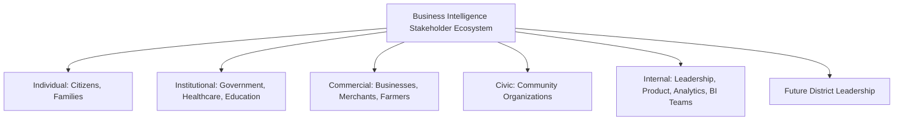

---

# Business Intelligence Lifecycle

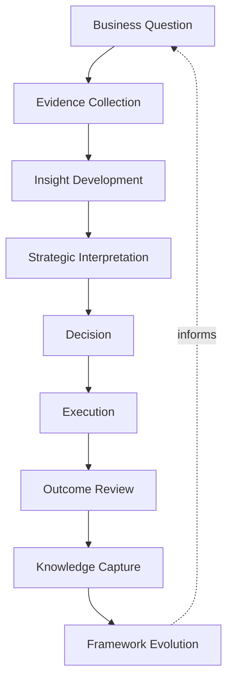

| Stage | Meaning |
|---|---|
| **Business Question** | A genuine, named strategic question leadership needs answered, traced to a Strategic Objective. |
| **Evidence Collection** | Relevant analytics and KPIs are gathered from every domain the question touches, never a single convenient source. |
| **Insight Development** | Individual pieces of evidence are examined for pattern, trend, and contradiction across domains. |
| **Strategic Interpretation** | The Business Intelligence function synthesizes the evidence into a coherent picture, explicitly stating its confidence and its gaps. |
| **Decision** | The accountable leader or governance body decides, informed by — never dictated by — the intelligence provided. |
| **Execution** | The decision is carried out through its own owning process. |
| **Outcome Review** | The decision's actual effect is honestly measured, including when it did not work. |
| **Knowledge Capture** | The finding, and the reasoning behind the original decision, is retained per the Documentation Before Tribal Knowledge principle already established in `ai-docs/24-documentation-standards.md`. |
| **Framework Evolution** | This document's own practice — its categories, its governance, its cadence — is itself periodically revisited, per Governance below. |

---

# Value Creation

| Question | Answer |
|---|---|
| **How do citizens create intelligence?** | By engaging genuinely and consenting to observation, per `ai-docs/81`'s Responsible Analytics Strategy — their aggregated, consented experience is the foundation every strategic picture is built from. |
| **How do businesses create intelligence?** | By transacting honestly, generating the aggregate signal that reveals whether Marketplace Health and Business Enablement are genuinely improving. |
| **How does government create intelligence?** | By sharing accurate civic-process data and its own institutional perspective, giving Business Intelligence a check against Arwal's own possibly self-serving read of its civic impact. |
| **How does leadership create value?** | By making decisions genuinely informed by cross-domain evidence, and by being willing to be told the evidence contradicts what they hoped to hear. |
| **How does BI create value?** | By converting fifty separate domains' worth of honest but scattered analytics into one coherent strategic picture no single team could assemble alone. |
| **How does evidence improve governance?** | By replacing "we believe this policy is working" with "here is what changed, for whom, and why we believe it is because of this policy" — the same evidentiary discipline `ai-docs/40-engineering-compliance-audit-standards.md` already demands of compliance, extended here to strategy. |
| **How does district transformation accelerate?** | Every strategic decision genuinely informed by cross-domain evidence is one fewer decision made on assumption alone — Business Intelligence is the mechanism by which the founding mission's progress becomes verifiable, not merely asserted. |

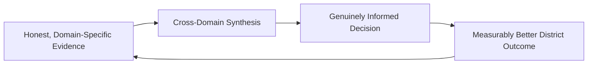

---

# Business Model

Every capability below is described strategically — its business rationale, never its implementation. The enforceable metrics behind every capability remain owned entirely by their own governing vertical documents.

| Capability | Business Rationale |
|---|---|
| **Executive Intelligence** | A single, cross-domain strategic picture for the CEO, Board, and Engineering Leadership Council, synthesizing every vertical's own Executive Dashboard into one coherent view. |
| **Citizen Intelligence** | Aggregate, consented insight into citizen outcomes and satisfaction across every vertical, per `ai-docs/60`'s Experience Metrics and `ai-docs/81`'s Citizen Value Index. |
| **Marketplace Intelligence** | Cross-category liquidity, fairness, and trust synthesis, drawing on `ai-docs/65-marketplace-strategy.md`'s Marketplace Metrics without redefining them. |
| **Government Intelligence** | Civic-service completion, backlog, and scheme-utilization synthesis, jointly reviewed with government partners per `ai-docs/63-government-partnership-strategy.md`. |
| **Financial Intelligence** | Revenue, cost, and sustainability synthesis drawing on `ai-docs/62-revenue-sustainability-strategy.md`'s Sustainability Metrics and `ai-docs/74-payments-financial-services-strategy.md`'s Payments Metrics. |
| **Trust Intelligence** | The District Trust Signal and its vertical expressions, per `ai-docs/79-trust-safety-framework.md`, treated as a mandatory, co-equal lens on every other intelligence product. |
| **Growth Intelligence** | Acquisition, retention, and cross-vertical adoption synthesis, drawing on `ai-docs/80-user-growth-strategy.md`'s Growth Metrics. |
| **AI Intelligence** | Task success, fairness, and human-oversight-compliance synthesis, drawing on `ai-docs/78-ai-product-strategy.md`'s AI Ecosystem Health. |
| **Community Intelligence** | Beneficiary-reach and genuine-engagement synthesis, per `ai-docs/75-community-social-engagement-strategy.md`, never a virality-optimized read. |
| **Operational Intelligence** | Platform reliability, support, and verification-throughput synthesis relevant to day-to-day operational leadership. |
| **Cross-Module Intelligence** | The Cross-Vertical Adoption Depth signal, per `ai-docs/50`, synthesized as the structural proof point of Arwal's trust-compounding advantage. |
| **Strategic Intelligence** | The consolidated evidence base feeding `ai-docs/48-engineering-strategic-planning-standards.md`'s Strategic Themes, OKRs, and Post-Strategy Reviews directly. |

```mermaid
graph TD
    BizModel[Business Intelligence Business Model] --> ExecIntel[Executive Intelligence]
    BizModel --> CitizenIntel[Citizen Intelligence]
    BizModel --> MarketIntel2[Marketplace Intelligence]
    BizModel --> GovIntel[Government Intelligence]
    BizModel --> FinIntel[Financial Intelligence]
    BizModel --> TrustIntel[Trust Intelligence]
    BizModel --> GrowthIntel[Growth Intelligence]
    BizModel --> AIIntel[AI Intelligence]
    BizModel --> CommIntel[Community Intelligence]
    BizModel --> OpsIntel[Operational Intelligence]
    BizModel --> CrossModIntel[Cross-Module Intelligence]
    BizModel --> StratIntel[Strategic Intelligence]
```

---

# Responsible Business Intelligence Strategy

| Mechanism | Strategic Role |
|---|---|
| **Privacy Protection** | Every intelligence product inherits, never bypasses, the Data Classification and Consent discipline already established in `ai-docs/10-security-standards.md` and `ai-docs/81`. |
| **Responsible Interpretation** | A cross-domain correlation is presented as a hypothesis until genuinely verified — never asserted as causation because two lines on a chart moved together. |
| **Bias Awareness** | Every synthesis is checked against the Anti-Discrimination Safeguards already established in `ai-docs/52-user-personas-user-segmentation.md` — an aggregate trend that conceals a disparate outcome for a vulnerable segment is a finding, not noise to be smoothed over. |
| **Governance** | Every strategic intelligence product passes through the Business Intelligence Council's review before reaching leadership, per Governance below. |
| **Transparency** | Every strategic recommendation states its evidence base, its confidence level, and its known gaps openly — never presented as more certain than the underlying data supports. |
| **Context Preservation** | A metric is never stripped of the qualitative or domain-specific context that would change its interpretation — the number and its story travel together. |
| **Ethical Decision Support** | Intelligence informs a decision; it never substitutes for the human judgment and accountability RULE-024 requires wherever a civic, financial, or reputational stake exists. |
| **Human Accountability** | Every strategic recommendation is traceable to a named Business Intelligence Team member and reviewed by a named executive — no recommendation is anonymous. |
| **Government Coordination** | Civic-facing intelligence shared with a government partner is reviewed jointly before publication, per `ai-docs/63-government-partnership-strategy.md`. |
| **Citizen Trust** | Every mechanism above compounds into a single, felt outcome: a citizen who has no reason to suspect their data became a chart used against their own interest. |

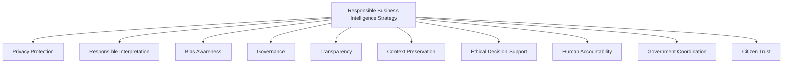

> **Callout — Correlation Presented as Causation Is a Governance Failure, Not a Rounding Error**
> Per Responsible Interpretation above, any strategic recommendation implying one metric caused another's movement, without genuine supporting evidence, is returned by the Business Intelligence Council before it ever reaches a leadership decision — a confidently wrong strategic narrative is treated with the same severity `ai-docs/40-engineering-compliance-audit-standards.md` reserves for unproven compliance claims.

---

# Economic & Social Impact

| Impact Area | How Business Intelligence Contributes |
|---|---|
| **Improve Product Quality** | Cross-domain synthesis surfaces a systemic usability or trust gap no single vertical's own metrics would reveal alone. |
| **Improve Government Performance** | Honest, jointly-reviewed civic intelligence gives a department genuine evidence to justify continued investment or a course correction. |
| **Improve Citizen Outcomes** | Leadership decisions genuinely informed by aggregate citizen impact, not merely commercial performance, keep the civic mission measurably central. |
| **Strengthen MSMEs** | Marketplace and Financial Intelligence surfaced to leadership protects small-seller fairness at a structural level, not merely a per-complaint level. |
| **Improve Marketplace Health** | Cross-category liquidity and trust synthesis catches an emerging imbalance before it becomes an entrenched failure. |
| **Increase Accountability** | Every strategic decision traceable to its evidence base makes leadership genuinely answerable to the district it serves, not merely to its own narrative. |
| **Strengthen District Development** | A leadership team making evidence-based, cross-domain decisions is better positioned across every development area already named in `ai-docs/64-district-ecosystem-mapping.md`'s District Development Strategy. |

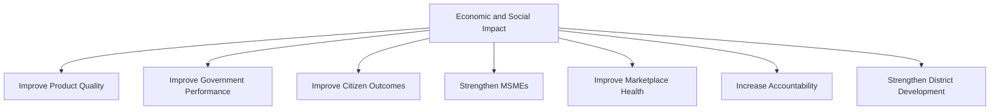

---

# Governance

### Ownership
Business Intelligence Framework ownership sits with the Chief Analytics Officer (or Chief Data Officer where the role is split out), with each intelligence capability — Marketplace, Government, Financial, Trust, Growth, AI, Community — accountable to its own domain's Business Owner per `ai-docs/53`'s Domain Registry, mirroring the Clear Ownership discipline already established throughout `ai-docs/53` through `ai-docs/81`.

### Business Intelligence Council
A standing **Business Intelligence Council** — chaired by the Chief Analytics Officer, with the CEO, CSO, CPO, Chief Trust & Safety Officer, Compliance Officer, and rotating vertical Heads as members — holds approval authority over any cross-domain strategic synthesis reaching leadership, any new intelligence capability, and any material deviation from the Anti-Patterns below. The Council meets monthly, with ad hoc sessions ahead of any major Board or government-partner presentation drawing on synthesized intelligence.

### Decision Authority

| Decision | Approves |
|---|---|
| New cross-domain intelligence capability | Business Intelligence Council + CPO |
| Strategic recommendation reaching the Board | Business Intelligence Council + CEO |
| Government-shared strategic intelligence | Business Intelligence Council + Head of Government Partnerships |
| Intelligence-product retirement (unused or low-value) | Business Intelligence Council |
| Emergency intelligence-integrity response (e.g., a discovered misinterpretation already acted on) | Chief Analytics Officer, immediate, ratified by Council within 5 business days |

### Review Cadence

| Review | Cadence | Owner |
|---|---|---|
| Business Intelligence Health Review | Monthly | Business Intelligence Council |
| Cross-Domain Synthesis Review | Quarterly | Business Intelligence Council, vertical Heads |
| Annual Business Intelligence Strategy Review | Annual | CEO, Chief Analytics Officer, CPO |

### Continuous Improvement
Every Outcome Review from the Business Intelligence Lifecycle feeds a shared, tracked improvement backlog, reviewed at the next Business Intelligence Health Review, per the identical Continuous Improvement Loop already established in `ai-docs/60-customer-experience-strategy.md`.

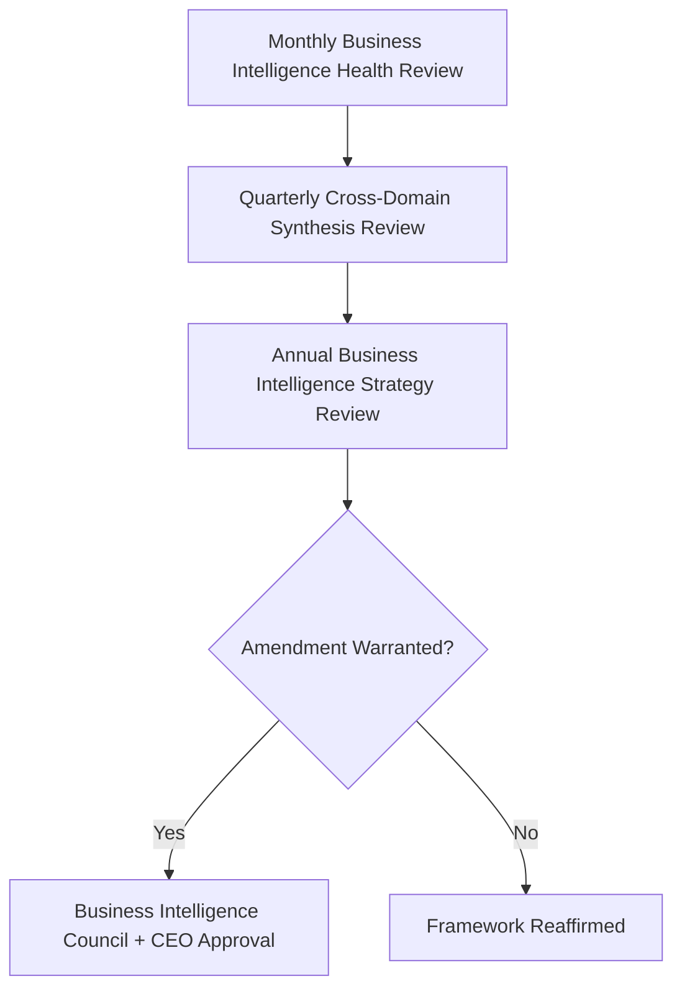

---

# Risks

| Risk | Description | Mitigation |
|---|---|---|
| **Misinterpreted Insights** | A synthesized finding is acted on before its confidence and gaps are genuinely understood. | Strategic Interpretation stage discipline; explicit confidence-and-gap statement required per Transparency above. |
| **Confirmation Bias** | Evidence is selectively gathered or framed to support a predetermined leadership preference. | Cross-Functional Collaboration requirement; Business Intelligence Council review independent of the requesting executive. |
| **Data Silos** | A vertical's own analytics never reach cross-domain synthesis, leaving leadership with an incomplete picture. | Cross-Module Intelligence capability; mandatory domain-evidence inclusion per the Business Intelligence Lifecycle. |
| **Poor Governance** | A strategic recommendation reaches leadership without Council review. | Governance's Decision Authority table; no strategic synthesis proceeds to the Board without Council sign-off. |
| **Privacy Risks** | A cross-domain synthesis re-identifies a citizen or exposes data beyond its consented purpose. | Privacy Protection mechanism; inherited RULE-003 and `ai-docs/10` classification discipline. |
| **Trust Erosion** | A citizen or government partner discovers their data informed a strategic narrative they were not aware of. | Transparency mechanism; joint government review for civic-facing intelligence. |
| **Over-Reliance on Dashboards** | Leadership treats a summary visualization as a substitute for genuine strategic judgment. | Ethical Decision Support principle; intelligence explicitly framed as informing, never replacing, human decision-making. |
| **Incomplete Context** | A metric is presented without the qualitative or domain-specific detail that would change its interpretation. | Context Preservation mechanism; Business Intelligence Council rejects a context-stripped submission. |
| **Regulatory Changes** | A data-protection or civic-data-sharing regulation shift invalidates an existing synthesis practice. | Configurable, Compliance-reviewed practice per `ai-docs/01-product-goals.md`'s Regulatory Constraint. |

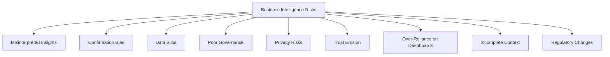

---

# Metrics

| Metric | Definition | Direction |
|---|---|---|
| **Insight Quality Index** | A composite score reflecting how often a delivered insight's confidence and gaps were later confirmed accurate. | Increasing |
| **Decision Adoption Rate** | % of strategic recommendations leadership genuinely acts on, tracked distinctly from those merely acknowledged. | Increasing |
| **Evidence Utilization Rate** | % of major leadership decisions citing a specific, traceable Business Intelligence product before approval. | Increasing |
| **Strategic Intelligence Index** | The share of active Strategic Themes (`ai-docs/48`) with a genuine, current cross-domain intelligence product supporting them. | Increasing |
| **Cross-Functional Alignment Score** | The degree to which Product, Trust & Safety, Finance, and Government Partnerships concur with a given strategic synthesis before it reaches leadership. | Increasing |
| **Business Intelligence Trust Index** | District Trust Signal, viewed for BI-informed decisions and their citizen-facing consequences specifically. | Increasing |
| **Knowledge Reuse Rate** | % of prior Outcome Reviews and Knowledge Capture entries genuinely referenced in a subsequent decision cycle. | Increasing |
| **Decision Governance Score** | % of strategic recommendations reaching leadership having passed full Business Intelligence Council review. | Approaching 100% |

> **Callout — No Business Intelligence Metric Stands Alone**
> Per the North Star Principle already established in `ai-docs/00-project-vision.md`, a rising Decision Adoption Rate alongside a falling Business Intelligence Trust Index, or a rising Insight volume alongside a falling Cross-Functional Alignment Score, is treated as a regression — never counted as success in isolation.

---

# Anti-Patterns

| Anti-Pattern | Why It's Rejected |
|---|---|
| **Dashboards Without Decisions** | A visualization that never informs a genuine decision has produced privacy cost and effort with no corresponding benefit, violating Actionable Insights already established in `ai-docs/81` and extended here. |
| **Evidence Without Context** | A metric stripped of its qualitative or domain-specific story invites a confidently wrong strategic conclusion, violating Context Preservation. |
| **Data Silos** | Vertical-specific intelligence that never reaches cross-domain synthesis leaves leadership working from an incomplete picture. |
| **Technology Before Strategy** | Adopting an intelligence capability because it is technically sophisticated rather than because it answers a genuine leadership question violates Strategic Alignment. |
| **Ignoring Citizen Outcomes** | Synthesizing commercial performance while omitting citizen-experience and trust signals violates Citizen Value First. |
| **Ignoring Accessibility** | A strategic finding that cannot be explained in plain language to a non-specialist stakeholder has failed to actually inform anyone. |
| **Analysis Paralysis** | Delaying a genuinely time-sensitive decision indefinitely in pursuit of more perfect evidence violates the same Fail Fast reasoning already established in `ai-docs/20-error-handling-standards.md`, applied here to strategic timing. |
| **Confirmation Bias** | Framing or selectively gathering evidence to support a predetermined conclusion directly violates Evidence Before Opinion. |
| **Intelligence Without Governance** | A strategic recommendation reaching leadership without Business Intelligence Council review risks silently violating Privacy, Fairness, or Proportionality — the exact failure Governance exists to prevent. |

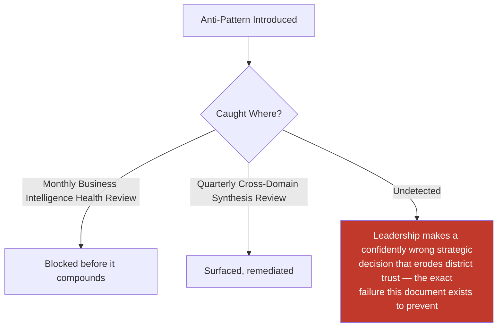

---

# Relationship to Previous Documents

| Prior Document | Relationship |
|---|---|
| **Project Vision (`ai-docs/00`)** | Establishes the founding North Star Principle this document's every synthesis is measured against. |
| **Product Vision & Business Strategy (`ai-docs/50`)** | Supplies the Strategic Objectives every intelligence product ultimately traces back to. |
| **User Personas (`ai-docs/52`)** | Supplies the individual, evidence-grounded citizens whose Anti-Discrimination needs this document's Bias Awareness mechanism protects. |
| **Business Domain Model (`ai-docs/53`)** | Supplies the ownership structure behind every domain this document's stakeholder ecosystem draws from. |
| **Product Module Catalog (`ai-docs/54`)** | Supplies the user-visible surfaces underlying every domain's own analytics this document synthesizes. |
| **Business Capability Map (`ai-docs/55`)** | Supplies the stable capabilities whose Success Metrics feed this document's Executive and Cross-Module Intelligence. |
| **User Journey Standards (`ai-docs/56`)** | Supplies the Journey Analytics discipline underlying Citizen Intelligence. |
| **Business Rules & Policies (`ai-docs/58`)** | Supplies RULE-003's Consent Requirement and RULE-024's Human Oversight boundary this document's Responsible Business Intelligence Strategy is bound by. |
| **Customer Experience Strategy (`ai-docs/60`)** | Supplies the Experience Metrics and Continuous Improvement Loop this document's Citizen Intelligence draws on. |
| **Value Proposition Framework (`ai-docs/61`)** | Supplies the Citizen Value Index this document's Executive Intelligence is measured against. |
| **Revenue & Sustainability Strategy (`ai-docs/62`)** | Supplies the Sustainability Metrics this document's Financial Intelligence synthesizes. |
| **District Ecosystem Mapping (`ai-docs/64`)** | Supplies the whole-system Ecosystem Health view this document's Cross-Module Intelligence feeds into. |
| **Marketplace Strategy (`ai-docs/65`)** | Supplies the Marketplace Metrics this document's Marketplace Intelligence cites, never redefines. |
| **Agriculture Business Model (`ai-docs/68`)** | Supplies the Agriculture Ecosystem Health metrics this document's synthesis draws on for farmer-facing intelligence. |
| **Healthcare Business Model (`ai-docs/69`)** | Supplies the Healthcare Ecosystem Health metrics this document's synthesis draws on for patient-facing intelligence. |
| **Payments & Financial Services Strategy (`ai-docs/74`)** | Supplies the Payments Metrics this document's Financial Intelligence incorporates. |
| **Search & Discovery Strategy (`ai-docs/77`)** | Supplies the Discovery Metrics this document references for cross-vertical findability synthesis. |
| **AI Product Strategy (`ai-docs/78`)** | Supplies the AI Ecosystem Health metrics this document's AI Intelligence cites directly. |
| **Trust & Safety Framework (`ai-docs/79`)** | Supplies the District Trust Signal and Platform Integrity Index this document treats as a mandatory, co-equal lens on every other intelligence product. |
| **Product Analytics Strategy (`ai-docs/81`)** | Supplies the entire evidentiary foundation — Analytics and KPIs — this document's Business Intelligence Value Chain builds directly on top of, never redefining its Responsible Analytics Strategy. |
| **Product KPI Framework** | Where a distinct KPI Framework phase exists in this handbook's numbering, it supplies the standing indicator set this document's Insight Generation stage consumes without redefinition. |

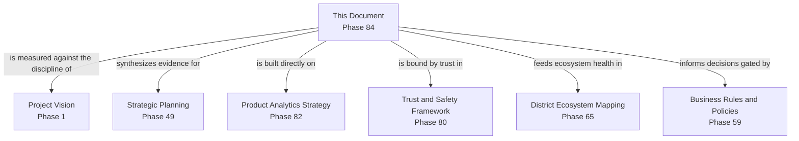

---

# Executive Artifacts

### Business Intelligence Framework

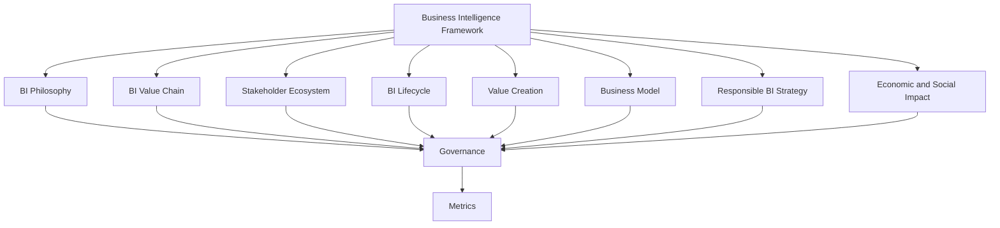

### Business Intelligence Value Chain

See Business Intelligence Value Chain section above — reproduced here by reference per Single Source of Truth, never duplicated.

### Business Intelligence Lifecycle

See Business Intelligence Lifecycle section above.

### Business Intelligence Ecosystem Map

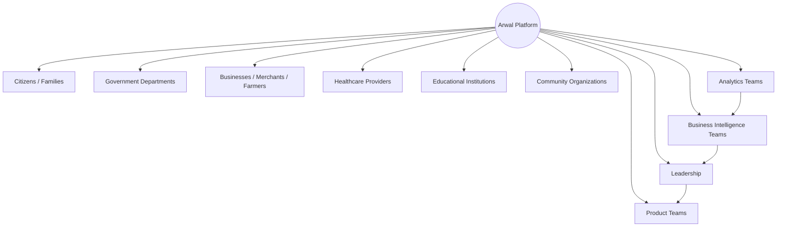

### Business Intelligence Governance Model

See Governance section above.

### Executive Intelligence Hierarchy

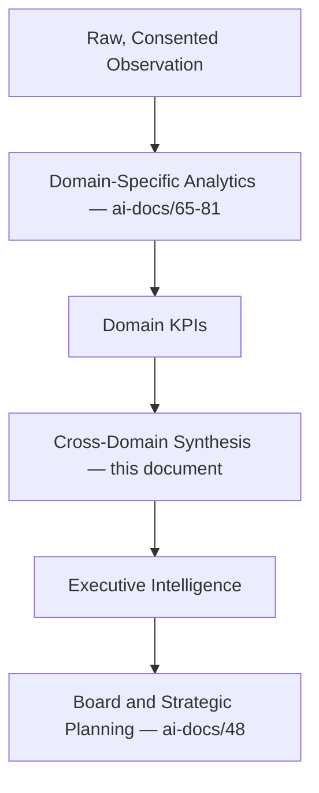

### Decision Intelligence Framework

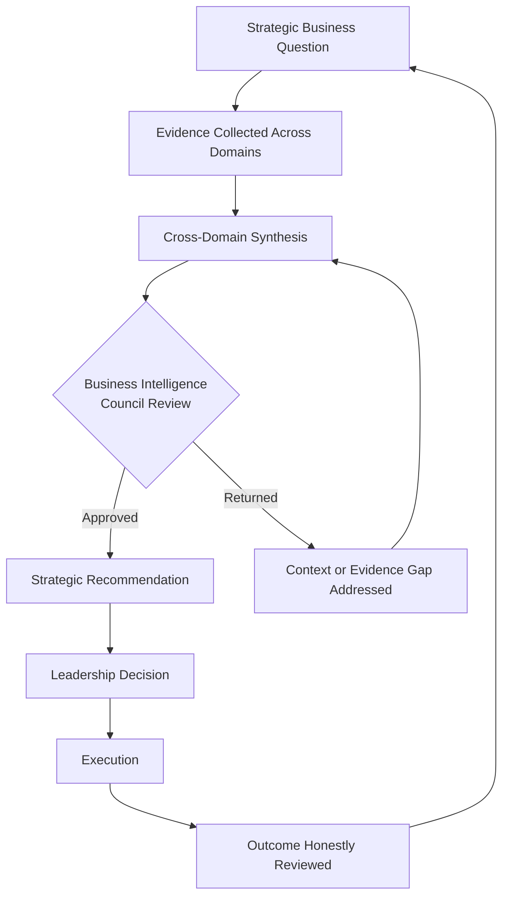

### Executive Dashboards (Conceptual)

| Dashboard | Audience | Key Content |
|---|---|---|
| **CEO Dashboard** | CEO, Board | Cross-domain Strategic Intelligence Index, District Trust Signal, District Development Index |
| **Chief Analytics Officer Dashboard** | CAO | Insight Quality Index, Decision Adoption Rate, Decision Governance Score |
| **CPO Dashboard** | CPO | Citizen Intelligence trend, Cross-Module Intelligence, Product Health synthesis |
| **Trust & Safety Dashboard** | Chief Trust & Safety Officer | Business Intelligence Trust Index, privacy-compliance status of active syntheses |
| **Government Partners Dashboard** | Government liaisons | Jointly-reviewed Government Intelligence, civic-impact evidence |

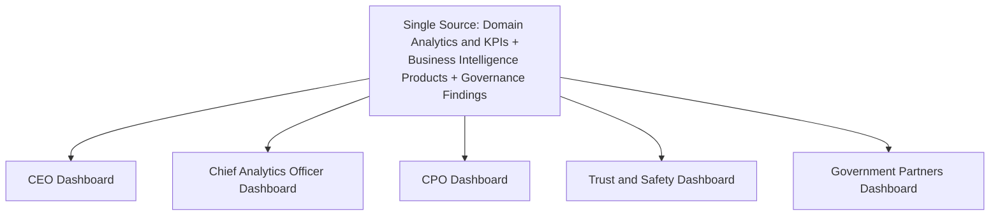

### Decision Matrix

| Decision Type | Approval Authority |
|---|---|
| New cross-domain intelligence capability | Business Intelligence Council + CPO |
| Strategic recommendation reaching the Board | Business Intelligence Council + CEO |
| Government-shared strategic intelligence | Business Intelligence Council + Head of Government Partnerships |
| Intelligence-product retirement | Business Intelligence Council |
| Emergency intelligence-integrity response | Chief Analytics Officer, ratified within 5 business days |

---

# Closing Statement

> **Callout — Closing Statement**
> Every prior document in this handbook explains a piece of what Arwal builds, measures, and protects. This document explains how all of that scattered, honest evidence becomes something a district can actually be led by: a strategic decision made with genuine understanding of what is happening, to whom, and why — never a confident guess dressed up in a chart. A dashboard that nobody acts on has wasted a citizen's trust for nothing; a decision made without evidence has wagered a district's future on a hunch. Business Intelligence exists in the disciplined space between those two failures — synthesizing, never distorting; informing, never replacing judgment; and always, before every recommendation reaches a leader with real authority, asking whether the evidence would still say the same thing if the citizen it describes were in the room to hear it. Where a future phase must deviate from a principle stated here, that deviation is made explicitly — through the Business Intelligence Governance process above — never silently, and never by default.

This document, `ai-docs/83-business-intelligence-framework.md`, is Phase 84 of approximately 415. Every future strategic decision, executive review, and governance judgment is expected to trace back to a principle defined here, or to justify its deviation in writing.

**End of Phase 84 — `ai-docs/83-business-intelligence-framework.md`**