# Product Governance

**Document:** `ai-docs/84-product-governance.md`
**Project:** Arwal — The District Super App
**Stage:** 2 — Product & Business Strategy
**Phase:** 85 — Product Governance
**Status:** Approved for Product & Engineering Reference
**Audience:** CEO, CSO, CPO, Enterprise Business Architects, Product Governance Consultants, Corporate Governance Advisors, Government Digital Transformation Consultants, Trust & Safety Strategists, Risk Management Consultants, Organizational Design Specialists, Compliance Advisors, Investors

> **Callout — Purpose of This Document**
> `ai-docs/00-project-vision.md` through `ai-docs/83-business-intelligence-framework.md` established why Arwal exists, what it can do, who it serves, how it sustains itself, how it partners with government, the whole district ecosystem it operates inside, and how every vertical, trust mechanism, and intelligence capability creates and protects value. None of those documents answers the question that sits above every one of them, binding them into one accountable whole: **who, precisely, has the authority to decide what Arwal becomes next — and how is that authority exercised so that a decision made today still serves the district a decade from now?** This document is that answer — the authoritative Product Governance charter every future strategic decision, policy, escalation, and accountability question traces back to.

---

# Purpose of this Document

### Why Product Governance Is a Distinct, Superordinate Discipline

Every prior Stage 2 document already contains its own governance section — a Marketplace Council, an Agriculture Council, a Healthcare Council, an AI Council, a Trust & Safety Council, a Growth Council, an Analytics Council, a KPI Council, a Business Intelligence Council. Each of those is deliberately scoped to its own vertical or capability. None of them answers the question that sits above all of them: **when two verticals' governance bodies disagree, when a decision touches the platform as a whole, or when nobody yet owns a brand-new question, who actually decides — and by what standing, citable authority?** This document is where that question is answered once, permanently, and cited by every vertical governance body that came before it. It is the constitutional layer the other twenty councils operate underneath.

### This Is Not a Scrum Guide, a Jira Workflow, or a Project Management Handbook

This document contains no sprint cadence, no backlog-grooming ritual, no ticket-status workflow, no story-pointing method, and no software-delivery process. It does not redefine Engineering Governance (`ai-docs/29`), Engineering Strategic Planning (`ai-docs/48`), or any vertical's own Governance section already established in `ai-docs/65` through `ai-docs/83` — each remains fully authoritative in its own territory and is cited, never restated. This document's exclusive territory is: **why product governance exists as a business discipline, who holds decision authority over what, how a decision is proposed, reviewed, approved, and audited, and how that authority itself is protected from drift, capture, or decay across a generation of district service.**

### Why Governance Protects Long-Term Product Quality

A platform built by many teams, across many verticals, over many years, does not stay coherent by accident. Per `ai-docs/00-project-vision.md`'s founding commitment to infrastructure built for a generation, every individually reasonable decision — a new fee, a new AI feature, a new verification shortcut — carries a risk of quietly drifting the platform away from its founding promises if no one is accountable for the whole. Product Governance exists to make coherence a standing, defended property of Arwal, not a hopeful byproduct of good intentions.

### How Governance Balances Innovation With Stability

A governance model that blocks every new idea protects nothing — it merely trades the risk of a bad decision for the certainty of stagnation, leaving citizens underserved by a platform too cautious to improve. A governance model with no real authority invites the opposite failure: reckless, uncoordinated change that erodes the very trust `ai-docs/79-trust-safety-framework.md` exists to protect. Product Governance at Arwal is deliberately built to hold both truths simultaneously — proportionate rigor scaled to a decision's actual stakes, never uniform caution or uniform permissiveness.

### How Governance Enables Scalable Multi-District Operations

Per `ai-docs/50-product-vision-business-strategy.md`'s Strategic Expansion Principles, Arwal's model is replicable to a second district only if the *reasoning* behind every major decision — not merely its outcome — is documented, owned, and auditable. A founding district that governed itself informally, by tribal knowledge and senior-voice persuasion, has nothing genuinely transferable to hand to a second district's leadership. Product Governance is the discipline that converts Arwal's accumulated judgment into an inheritable, replicable institutional asset.

### Relationship Between Every Participant

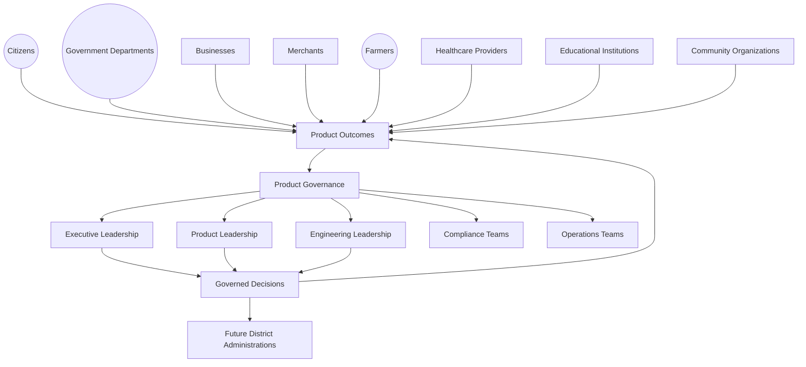

### Scope Boundary

This document does not define a specific product's roadmap, a specific team's delivery process, or a specific engineering practice — those remain the domain of `ai-docs/48-engineering-strategic-planning-standards.md`, `ai-docs/38-engineering-portfolio-program-management-standards.md`, and every vertical's own governing document. Its territory is strategic and constitutional: the philosophy, the value chain, the stakeholder accountability, and the governance-of-governance discipline that keeps Arwal's product decisions coherent, accountable, and trustworthy for a generation.

---

# Product Governance Philosophy

Every principle below exists because a governance model assembled carelessly does not fail abstractly — it fails a specific citizen affected by a decision nobody was actually accountable for, or a specific district partnership jeopardized because two internal teams quietly disagreed and neither had the standing to resolve it.

### Citizen First
**Why it exists:** Every governance decision is judged first against whether it serves the citizen ultimately affected, never against internal convenience or a single team's preference, mirroring the identical Citizen-First tie-breaker already established throughout `ai-docs/51` through `ai-docs/83`.

### Governance Before Complexity
**Why it exists:** Governance structure is added only when a genuine coordination problem demands it, never speculatively — a governance body invented before its need is proven becomes bureaucratic overhead with nothing real to decide, mirroring the identical YAGNI discipline already established in `ai-docs/02-engineering-principles.md`, applied here to organizational design.

### Strategic Alignment
**Why it exists:** Every governed decision traces to a Strategic Objective already established in `ai-docs/50-product-vision-business-strategy.md` or a Strategic Theme in `ai-docs/48-engineering-strategic-planning-standards.md` — a decision that cannot be traced to either is not yet a governance-ready proposal.

### Transparency
**Why it exists:** A decision made behind closed doors, with no visible reasoning, is a decision the district is asked to trust blindly — every governance decision states its reasoning, its dissent (where genuine), and its accountable owner openly, per the Transparency principle already established throughout `ai-docs/60` through `ai-docs/83`.

### Accountability
**Why it exists:** Every governed decision has exactly one named, accountable owner — never a diffuse committee that can later disclaim responsibility, mirroring the Clear Ownership discipline already established throughout `ai-docs/53` through `ai-docs/83`.

### Responsible Decision-Making
**Why it exists:** A decision's rigor scales with its actual stakes — a Mission Critical, platform-wide change is never approved with the same casual process as a low-risk, single-vertical adjustment, mirroring the identical Proportional Rigor principle already established in `ai-docs/30-engineering-risk-management-standards.md`.

### Cross-Functional Collaboration
**Why it exists:** No single function — Product, Engineering, Trust & Safety, Government Partnerships, Finance — holds the full picture of a consequential decision's impact. Governance exists specifically to force that picture into one room before a decision is finalized, never to let one function decide in isolation.

### Risk Awareness
**Why it exists:** Every governed decision is evaluated against its risk profile, per `ai-docs/30-engineering-risk-management-standards.md`'s Risk Classification, before it is approved — a decision's upside is never assessed without its corresponding downside.

### Evidence-Based Governance
**Why it exists:** A governance decision made on persuasive narrative or seniority alone is exactly the failure mode `ai-docs/83-business-intelligence-framework.md`'s Evidence Before Opinion principle already exists to prevent — governance decisions draw on the same evidentiary discipline, never a separate, lower standard.

### Long-Term Sustainability
**Why it exists:** Product Governance is evaluated on the same multi-decade horizon as every other strategic capability in this handbook — a decision that resolves a quarter's pressure at the cost of the next decade's trust or coherence is a governance failure, never a win.

### Continuous Improvement
**Why it exists:** A governance model designed once, at launch, and never revisited decays as Arwal's scale, complexity, and district composition evolve — governance itself is subject to the same Continuous Improvement discipline already established throughout `ai-docs/60` through `ai-docs/83`.

### Institutional Trust
**Why it exists:** A citizen, a merchant, or a government partner does not need to understand Arwal's internal governance structure to benefit from it — but every one of them depends on that structure existing, working honestly, and holding even when a decision is inconvenient for Arwal itself.

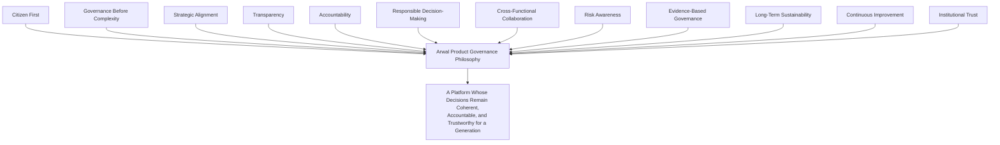

> **Callout — The One-Sentence Product Governance Philosophy**
> *"A decision nobody is accountable for is a decision Arwal has already lost control of — governance exists so that every choice this platform makes can still be explained, defended, and traced back to a named judgment, years after it was made."*

---

# Product Governance Value Chain

| Stage | Business Description |
|---|---|
| **Strategic Vision** | A genuine, board-level ambition already established in `ai-docs/50-product-vision-business-strategy.md` and `ai-docs/48-engineering-strategic-planning-standards.md`, setting the boundary every governed decision must fit within. |
| **Policy Definition** | The Vision is translated into a specific, written, citable policy or standard — a rule, a boundary, a decision right — entered into the governance record. |
| **Decision Proposal** | A specific product, policy, or platform-wide change is proposed by an accountable individual or team, never anonymously. |
| **Governance Review** | The proposal is examined against Strategic Alignment, Risk, Trust impact, and Cross-Functional consequence, per the Decision Authority Matrix below. |
| **Approval** | The classification-appropriate authority approves, rejects, or returns the proposal for revision — never left ambiguous. |
| **Execution** | The approved decision is carried out through its own owning process — an engineering initiative, a policy rollout, a vertical strategy change. |
| **Monitoring** | The decision's real-world effect is tracked against the outcome it was approved to produce, per `ai-docs/81-product-analytics-strategy.md` and `ai-docs/82-product-kpi-framework.md`. |
| **Audit** | The decision and its evidence trail are periodically reviewed for continued validity, per `ai-docs/40-engineering-compliance-audit-standards.md`'s discipline extended here to governance itself. |
| **Continuous Improvement** | A finding from Monitoring or Audit feeds a correction, a policy amendment, or a governance-process refinement. |
| **Institutional Learning** | The reasoning behind the decision — including where it later proved wrong — is retained permanently, never discarded once the decision is made. |

---

# Stakeholder Ecosystem

| Stakeholder | Strategic Responsibility in Product Governance |
|---|---|
| **Executive Leadership** | Sets and protects the Strategic Vision every governed decision is measured against; holds final authority for platform-defining decisions. |
| **Product Leadership** | Owns the day-to-day exercise of product decision rights within the boundaries this document establishes, escalating what it cannot resolve alone. |
| **Engineering Leadership** | Owns technical feasibility, architectural coherence, and execution integrity for every governed decision, per `ai-docs/29-engineering-governance-decision-authority.md`. |
| **Government Partners** | A structurally consulted stakeholder for any decision touching a civic-service commitment, per `ai-docs/63-government-partnership-strategy.md` — never merely informed after the fact. |
| **Businesses** | Beneficiaries of governance's fairness and consistency commitments, and a source of evidence when a governed decision affects commercial fairness. |
| **Citizens** | The ultimate reference point every governed decision is measured against — never a party governance is done *to*, but the party governance exists *for*. |
| **Community Organizations** | A voice for underserved and vulnerable populations in any decision affecting inclusion or accessibility, per the identical representation already established in `ai-docs/68-agriculture-business-model.md`'s and `ai-docs/70-education-business-model.md`'s Councils. |
| **Compliance Teams** | Accountable for verifying that every governed decision satisfies its regulatory and policy obligations before and after approval. |
| **Operations** | Accountable for surfacing a real-world execution or capacity concern before a decision is approved, never only after it has already failed. |
| **Analytics Teams** | Supply the evidence base every governance review depends on, per `ai-docs/81-product-analytics-strategy.md`. |
| **Future Governance Bodies** | A second district's own governance structure, which inherits this document's discipline but never its founding-district decisions by assumption, per `ai-docs/50`'s Strategic Expansion Principles. |

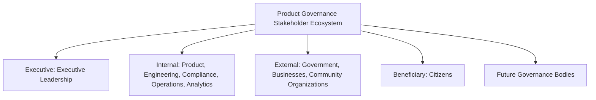

---

# Product Governance Lifecycle

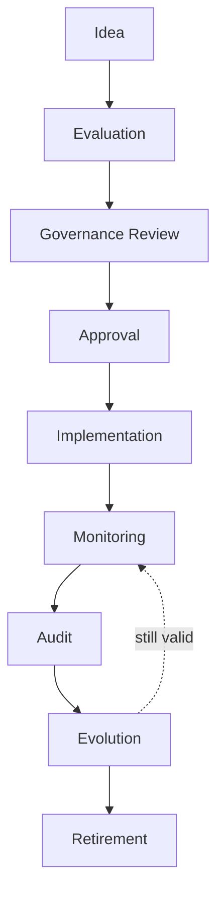

| Stage | Meaning | Exit Criterion |
|---|---|---|
| **Idea** | A genuine product or policy question is raised by any accountable stakeholder. | The idea names its intended citizen or platform benefit. |
| **Evaluation** | The idea is assessed for Strategic Alignment, feasibility, and rough risk tier. | A named proposer and a stated Strategic Objective link exist. |
| **Governance Review** | The proposal is examined per the Decision Authority Matrix, drawing on Cross-Functional input. | Every required reviewer has responded. |
| **Approval** | The classification-appropriate authority decides. | A recorded decision — approved, rejected, or returned — exists. |
| **Implementation** | The decision is executed through its own owning process. | The change is live or the policy is in force. |
| **Monitoring** | The decision's real effect is tracked against its intended outcome. | A Monitoring record exists at the defined review cadence. |
| **Audit** | The decision's continued validity and evidence trail are independently reviewed. | An Audit finding — sustained, amended, or flagged — is recorded. |
| **Evolution** | The decision, policy, or governance structure itself is refined based on Monitoring or Audit findings. | A dated revision is recorded, never a silent edit. |
| **Retirement** | A decision or policy no longer serving a genuine purpose is formally retired. | Retirement is logged; its ID is archived, never reused. |

---

# Value Creation

| Question | Answer |
|---|---|
| **How does governance create value for citizens?** | By ensuring every product decision affecting them was made deliberately, with their interest genuinely weighed, and can later be explained and defended — never an accident of whichever team happened to ship first. |
| **How does government benefit?** | By having a single, stable, citable governance structure to partner with — a department knows exactly which body to escalate a concern to, and that the answer it receives reflects genuine institutional authority, per `ai-docs/63-government-partnership-strategy.md`. |
| **How do businesses benefit?** | By experiencing consistent, non-arbitrary treatment across every interaction with Arwal's platform decisions — the same standard applied to every merchant, provider, and partner regardless of size or tenure. |
| **How do product teams benefit?** | By having a clear, predictable path to get a genuine idea reviewed and decided, rather than navigating an ambiguous, informal, relationship-dependent approval process. |
| **How does governance strengthen trust?** | Every well-governed decision — transparent, evidence-based, accountable — compounds into the same Trust Value Chain already established in `ai-docs/79-trust-safety-framework.md`, at the platform's most consequential layer: the decisions that shape everything else. |
| **How does governance enable long-term district transformation?** | A governance model mature enough to explain its own reasoning is a governance model that can be handed, intact, to a second district's leadership — turning Arwal's accumulated judgment into a genuinely replicable institutional asset, per `ai-docs/50-product-vision-business-strategy.md`'s Strategic Expansion Principles. |

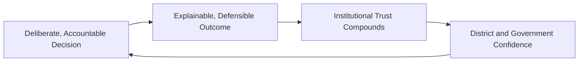

---

# Business Model

Every capability below is described strategically — its business rationale, never its implementation. The enforceable mechanics behind each capability remain owned by the respective governing document already established elsewhere in this handbook.

| Capability | Business Rationale |
|---|---|
| **Product Ownership** | Every product surface, capability, and policy has exactly one named accountable owner, per the Clear Ownership discipline already established throughout `ai-docs/53` through `ai-docs/83`. |
| **Decision Rights** | Explicit, documented authority over who may decide what, at what stakes tier — never inferred from organizational seniority alone. |
| **Strategic Oversight** | Standing executive visibility into whether product decisions, in aggregate, still serve the Strategic Vision, per `ai-docs/48-engineering-strategic-planning-standards.md`. |
| **Portfolio Governance** | Coordination across every vertical's own Council (Marketplace, Agriculture, Healthcare, Education, Employment, Payments, AI, Trust & Safety) to prevent conflicting or duplicated direction. |
| **Policy Governance** | The authoring, versioning, and retirement discipline for every cross-cutting policy, mirroring `ai-docs/58-business-rules-policies.md`'s Rule Governance extended here to product policy generally. |
| **Compliance Governance** | Verification that every governed decision satisfies its regulatory obligation, per `ai-docs/40-engineering-compliance-audit-standards.md`. |
| **Risk Governance** | Every governed decision is scored against `ai-docs/30-engineering-risk-management-standards.md`'s Risk Classification before approval. |
| **Cross-Functional Coordination** | The structural mechanism ensuring Product, Engineering, Trust & Safety, Government Partnerships, and Finance are heard before a consequential decision is finalized. |
| **Change Governance** | The discipline governing how an already-approved decision is later modified — never a silent, unreviewed edit. |
| **Innovation Governance** | A deliberately lighter-weight review path for genuinely exploratory, reversible initiatives, per the same Proportional Rigor principle already established in `ai-docs/30`. |
| **Platform Governance** | Oversight of decisions affecting shared, cross-vertical infrastructure — Identity, Payments, Search, Notifications — where a single vertical's preference must never override platform-wide coherence. |
| **District Expansion Governance** | The evidence-gated discipline determining when Arwal's governance model itself, not merely its product, is mature enough to responsibly extend to a second district. |

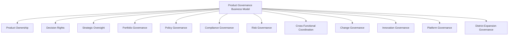

---

# Responsible Governance Strategy

| Mechanism | Strategic Role |
|---|---|
| **Accountability** | Every governed decision names one accountable individual, never a diffuse committee that can later disclaim it. |
| **Transparency** | Governance reasoning, dissent, and outcome are recorded and available to every relevant internal stakeholder — never concealed to avoid discomfort. |
| **Ethical Decision-Making** | A decision that would be commercially convenient but citizen-harmful is rejected regardless of its business case, per Citizen First above. |
| **Risk Management** | Every decision's risk tier is assessed before approval, per `ai-docs/30-engineering-risk-management-standards.md`, never discovered after the fact. |
| **Privacy Protection** | Any governance review touching citizen data draws only on data already governed by RULE-003's Consent Requirement — governance never becomes a backdoor around consent discipline. |
| **Responsible AI Oversight** | Any governed decision touching RULE-024's AI Automation Boundary requires the elevated, near-unanimous review already established in `ai-docs/78-ai-product-strategy.md`'s AI Council — this document never relaxes that standard. |
| **Cross-Functional Reviews** | No consequential decision proceeds on a single function's judgment alone. |
| **Government Coordination** | Any decision touching a civic commitment is reviewed jointly with the relevant department, never unilaterally by Arwal. |
| **Citizen Trust** | Every mechanism above compounds into one felt, if invisible, outcome: a platform whose decisions a citizen can trust were made carefully, even without ever seeing the process. |

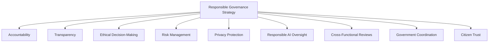

> **Callout — Governance Never Overrides an Absolute Rule**
> Per Responsible AI Oversight above, Product Governance's own authority is itself bounded — no Governance Council decision may waive RULE-024's AI Automation Boundary, RULE-018's Payment Idempotency Enforcement, or any other Mission Critical rule already established in `ai-docs/58-business-rules-policies.md`. Governance decides *how* a policy is applied and evolved within its own bounds; it does not hold authority to suspend a foundational citizen-protection rule for convenience.

---

# Economic & Social Impact

| Impact Area | How Product Governance Contributes |
|---|---|
| **Improve Product Quality** | Deliberate, cross-functionally reviewed decisions catch a usability, fairness, or accessibility gap before it reaches a citizen. |
| **Improve Government Collaboration** | A stable, citable governance structure gives a department confidence that its own escalations reach genuine authority, not a dead end. |
| **Increase Accountability** | Named ownership at every decision tier makes it structurally difficult for a concerning outcome to go unowned. |
| **Reduce Strategic Risk** | Risk-tiered review catches a platform-wide consequence before it is irreversibly shipped, per `ai-docs/30-engineering-risk-management-standards.md`. |
| **Strengthen Platform Stability** | Consistent, coherent decision-making across every vertical prevents the platform from fragmenting into fifty independently-run mini-products. |
| **Improve Citizen Confidence** | A platform whose major decisions are demonstrably deliberate, not reactive, earns exactly the kind of trust `ai-docs/79-trust-safety-framework.md` identifies as Arwal's most valuable long-term asset. |
| **Strengthen District Development** | A governance model mature enough to be handed to a second district accelerates every development area already named in `ai-docs/64-district-ecosystem-mapping.md`'s District Development Strategy. |

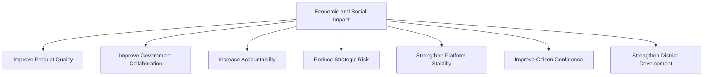

---

# Governance

### Product Governance Council
A standing **Product Governance Council** — chaired by the CEO or a delegated CPO, with the CSO, CTO, Chief Trust & Safety Officer, Compliance Officer, Head of Government Partnerships, and rotating vertical Council chairs (Marketplace, Agriculture, Healthcare, Education, Employment, Payments, AI) as members — holds final authority over any platform-wide, cross-vertical, or otherwise unresolved product decision. The Council meets monthly, with ad hoc sessions for a Mission Critical decision or an unresolved cross-Council conflict.

### Ownership Model
Every product surface has exactly one named Business Owner (accountable for value and strategic relevance) and, where distinct, one named Product Owner (accountable for day-to-day execution), mirroring the identical dual-ownership discipline already established in `ai-docs/55-business-capability-map.md` and `ai-docs/54-product-module-catalog.md`. An unowned product surface is treated as a governance defect, escalated immediately per the Escalation Model below.

### Decision Authority Matrix

| Decision Tier | Example | Approval Authority |
|---|---|---|
| **Platform-Defining** | A new Strategic Theme, a fundamental change to the trust model, entry into a new district. | Product Governance Council + CEO + Board |
| **Cross-Vertical** | A change affecting Identity, Payments, Search, or Notifications shared across every vertical. | Product Governance Council |
| **Vertical-Specific, High Stakes** | A verification-standard change, a new fee mechanism within one vertical. | The vertical's own Council (e.g., Healthcare Council), per its already-established Decision Authority table |
| **Vertical-Specific, Routine** | A feature refinement within an already-approved vertical strategy. | The vertical's Business Owner and Product Owner jointly |
| **Reversible, Exploratory** | A time-boxed pilot with a defined rollback path and no citizen-facing commitment. | Product Owner, informing the Council |

A decision's tier is determined by its Risk Classification (`ai-docs/30-engineering-risk-management-standards.md`) and its Strategic Alignment scope — never self-assigned by its proposer without independent confirmation, mirroring the identical discipline already established in `ai-docs/58-business-rules-policies.md`'s RULE-030.

### Escalation Model
A decision that cannot be resolved at its own tier — a disagreement between two vertical Councils, an ambiguous ownership question, an unresolved risk finding — escalates first to direct discussion between the accountable owners, then to the Product Governance Council, then to CEO/CTO/CPO jointly, and finally, where a Board-level stake exists, to the Board itself — mirroring the identical Escalation Process already established in `ai-docs/51-stakeholder-analysis.md` and `ai-docs/29-engineering-governance-decision-authority.md`. No decision is left unresolved indefinitely; every escalation carries a stated resolution deadline proportional to its risk tier.

### Approval Hierarchy

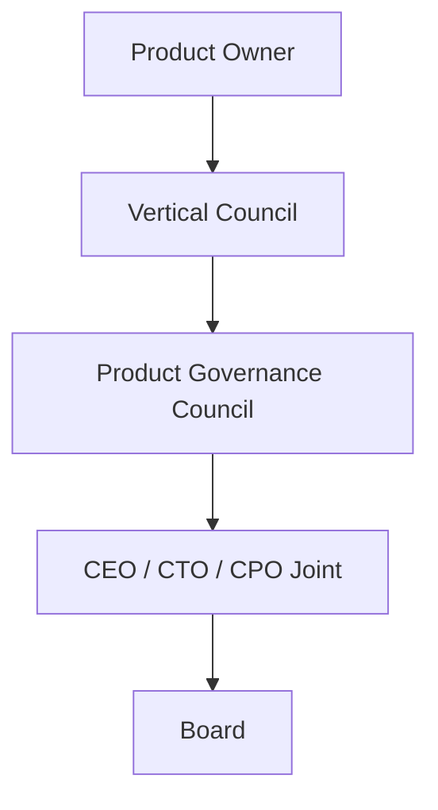

### Review Cadence

| Review | Cadence | Owner |
|---|---|---|
| Product Governance Health Review | Monthly | Product Governance Council |
| Cross-Council Alignment Review | Quarterly | Product Governance Council, vertical Council chairs |
| Annual Product Governance Review | Annual | CEO, CPO, CSO, Board |

### Continuous Governance Improvement
Every Audit finding and every escalation outcome feeds a shared, tracked improvement backlog, reviewed at the next Product Governance Health Review — a recurring escalation pattern, an ownership gap, or a Council-suggested process refinement is never left to informally resolve itself, mirroring the identical Continuous Improvement Loop already established throughout `ai-docs/60` through `ai-docs/83`.

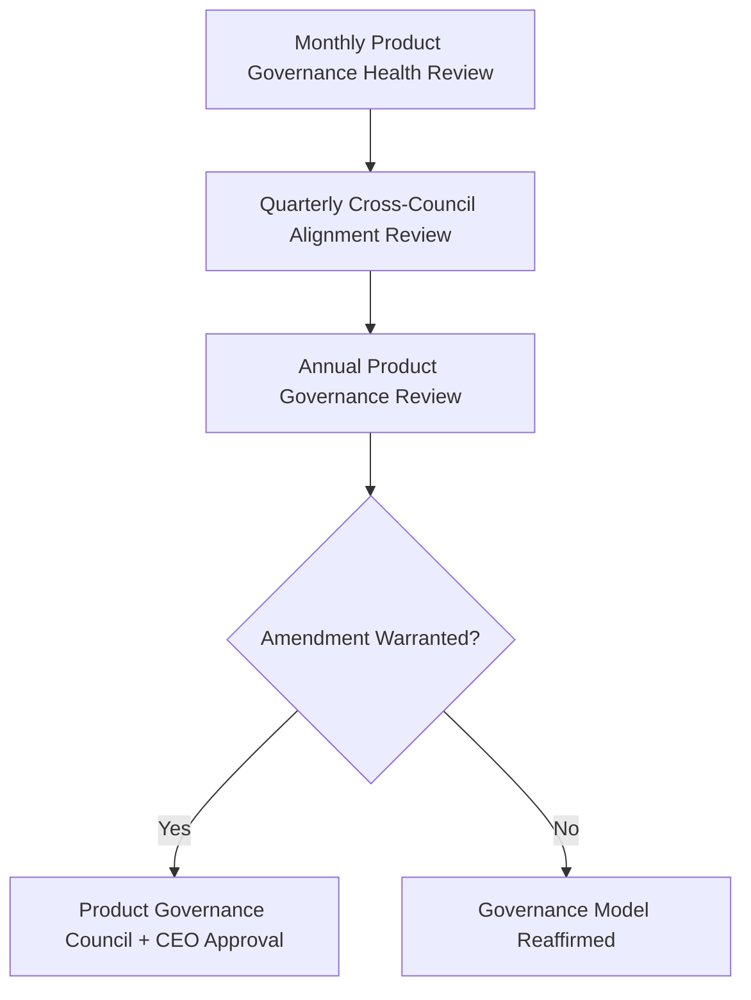

---

# Risks

| Risk | Description | Mitigation |
|---|---|---|
| **Unclear Ownership** | A product surface or decision has no clearly accountable owner. | Ownership Model's mandatory dual-ownership discipline; ownerless surfaces escalated immediately. |
| **Governance Bottlenecks** | Too many decisions routed through the Council, slowing routine work to a crawl. | Decision Authority Matrix's tiered delegation, keeping routine decisions at the lowest sufficient tier. |
| **Conflicting Priorities** | Two verticals or functions pursue incompatible directions without resolution. | Escalation Model's structured, deadline-bound resolution path. |
| **Weak Accountability** | A poor outcome is attributed to "the process" rather than a named decision-maker. | Accountability principle; every decision names one accountable individual. |
| **Policy Drift** | A written policy no longer reflects actual practice, uncorrected. | Policy Governance's version-control discipline; Audit stage catches drift before it compounds. |
| **Compliance Failures** | A governed decision proceeds without satisfying its regulatory obligation. | Compliance Governance's mandatory review gate before approval. |
| **Innovation Stagnation** | Excessive caution blocks genuinely valuable, low-risk experimentation. | Innovation Governance's lighter-weight, reversible-pilot review path. |
| **Trust Erosion** | A poorly governed decision damages citizen or government confidence. | Transparency and Ethical Decision-Making mechanisms; honest, rapid incident communication. |
| **Regulatory Changes** | A shift in applicable law invalidates an existing governance assumption. | Compliance Governance's continuous, never one-time, regulatory review. |

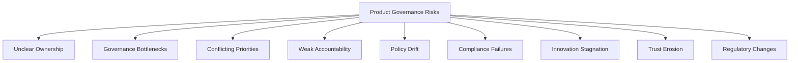

---

# Metrics

| Metric | Definition | Direction |
|---|---|---|
| **Governance Compliance Rate** | % of consequential decisions that passed through the correct tier of review before execution. | Increasing toward 100% |
| **Decision Turnaround Time** | Mean and p95 time from proposal to a recorded governance decision, by tier. | Decreasing, without compromising rigor |
| **Strategic Alignment Index** | % of governed decisions with a traceable link to a current Strategic Objective. | Increasing toward 100% |
| **Policy Compliance** | % of active policies with a current, unexpired Audit finding of "sustained." | Increasing toward 100% |
| **Governance Audit Success** | % of Audited decisions confirmed still valid without a required correction. | Increasing |
| **Cross-Functional Collaboration Score** | The degree to which required reviewers (Trust & Safety, Compliance, Government Partnerships) genuinely participated before a decision's approval. | Increasing |
| **Decision Quality Index** | The rate at which a governed decision's Monitoring outcome matched its intended effect. | Increasing |
| **Governance Maturity Index** | A composite score against the Governance Maturity Model below. | Increasing |

> **Callout — No Governance Metric Stands Alone**
> Per the North Star Principle already established in `ai-docs/00-project-vision.md`, a rising Decision Turnaround Time improvement alongside a falling Governance Audit Success rate is treated as a regression — speed gained by skipping genuine review is never counted as success.

---

# Anti-Patterns

| Anti-Pattern | Why It's Rejected |
|---|---|
| **Governance by Opinion** | A decision made on a senior voice's confidence rather than evidence violates Evidence-Based Governance. |
| **Unclear Ownership** | A product surface with no accountable owner recreates exactly the ambiguity `ai-docs/47-engineering-organizational-scaling-standards.md` already names as a root cause of unresolved incidents. |
| **Decision by Hierarchy Alone** | Approving a decision because a senior title endorsed it, without genuine Cross-Functional review, violates Cross-Functional Collaboration. |
| **Ignoring Citizen Impact** | A decision evaluated purely on internal commercial or technical merit, without weighing citizen consequence, violates Citizen First. |
| **Policy Without Accountability** | A written policy with no named owner to maintain or enforce it decays into Policy Drift. |
| **Innovation Without Governance** | A team shipping a consequential, unreviewed change under the banner of "moving fast" violates Responsible Decision-Making. |
| **Governance Without Transparency** | A decision made and never explained to the teams accountable to it breeds exactly the suspicion Transparency exists to prevent. |
| **Short-Term Thinking** | A decision that resolves this quarter's pressure at the cost of the platform's long-term coherence violates Long-Term Sustainability. |

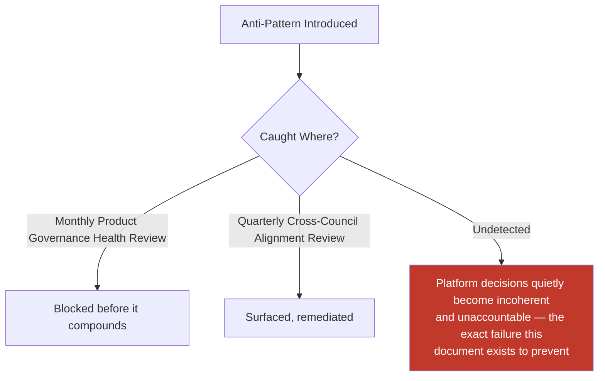

---

# Relationship to Previous Documents

| Prior Document | Relationship |
|---|---|
| **Project Vision (`ai-docs/00`)** | Establishes the founding mission and North Star Principle every governed decision in this document is ultimately measured against. |
| **Product Vision & Business Strategy (`ai-docs/50`)** | Supplies the Strategic Objectives every governed decision traces to before it is eligible for review. |
| **User Personas (`ai-docs/52`)** | Supplies the individual, evidence-grounded citizens this document's Citizen First principle is anchored in. |
| **Business Domain Model (`ai-docs/53`)** | Supplies the ownership structure this document's Ownership Model draws its Business Owner assignments from. |
| **Business Capability Map (`ai-docs/55`)** | Supplies the stable capabilities every governed product decision is ultimately expressed through. |
| **Business Rules & Policies (`ai-docs/58`)** | Supplies the absolute, non-waivable rules (RULE-018, RULE-024) this document's Governance Council authority is explicitly bounded by. |
| **Customer Experience Strategy (`ai-docs/60`)** | Supplies the felt-experience bar every governed decision's outcome is ultimately measured against. |
| **Revenue & Sustainability Strategy (`ai-docs/62`)** | Supplies the Revenue Review Board this document's Decision Authority Matrix coordinates with for any fee-adjacent decision. |
| **District Ecosystem Mapping (`ai-docs/64`)** | Supplies the whole-system Ecosystem Health view this document's Portfolio Governance capability protects. |
| **Marketplace Strategy (`ai-docs/65`)** | Supplies the Marketplace Council this document's Product Governance Council coordinates with, never overrides absent genuine escalation. |
| **Agriculture Business Model (`ai-docs/68`)** | Supplies the Agriculture Council this document's escalation path formally recognizes. |
| **Healthcare Business Model (`ai-docs/69`)** | Supplies the Healthcare Council and its elevated verification-governance standard this document defers to within its own domain. |
| **Education Business Model (`ai-docs/70`)** | Supplies the Education Council and its minor-safeguard-elevated governance standard this document defers to within its own domain. |
| **Employment & Jobs Business Model (`ai-docs/71`)** | Supplies the Employment Council this document's escalation path formally recognizes. |
| **Payments & Financial Services Strategy (`ai-docs/74`)** | Supplies the Payments Council and RULE-018's absolute guarantee this document's authority is explicitly bounded by. |
| **AI Product Strategy (`ai-docs/78`)** | Supplies the AI Council and RULE-024's Automation Boundary this document's Responsible AI Oversight mechanism inherits without alteration. |
| **Trust & Safety Framework (`ai-docs/79`)** | Supplies the Trust & Safety Council this document's Product Governance Council coordinates with as a peer, cross-cutting authority. |
| **Product Analytics Strategy (`ai-docs/81`)** | Supplies the evidentiary discipline this document's Evidence-Based Governance principle is built on. |
| **Product KPI Framework (`ai-docs/82`)** | Supplies the standing indicators this document's Metrics section elevates for governance-specific tracking. |
| **Business Intelligence Framework (`ai-docs/83`)** | Supplies the cross-domain synthesis this document's Strategic Oversight capability consumes before a platform-defining decision. |

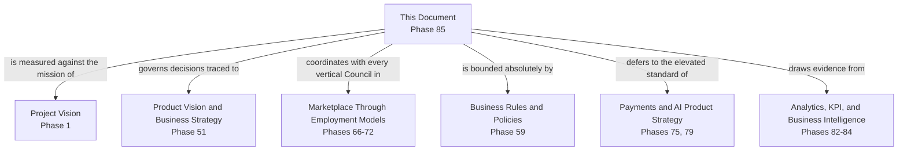

---

# Executive Artifacts

### Product Governance Framework

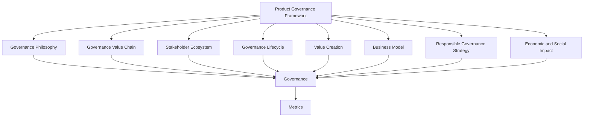

### Governance Value Chain

See Product Governance Value Chain section above — reproduced here by reference per Single Source of Truth, never duplicated.

### Governance Lifecycle

See Product Governance Lifecycle section above.

### Governance Council Structure

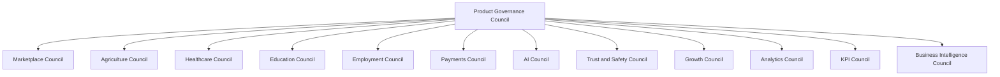

### Decision Authority Matrix

See Decision Authority Matrix table above — reproduced here by reference per Single Source of Truth, never duplicated.

### RACI Matrix (Conceptual)

| Activity | Responsible | Accountable | Consulted | Informed |
|---|---|---|---|---|
| Platform-defining decision | Product Governance Council | CEO | CTO, CPO, Board | All vertical Councils |
| Cross-vertical decision | Product Governance Council | CPO | Affected vertical Councils | Engineering Leadership |
| Vertical-specific decision | Vertical Council | Vertical Business Owner | Product Governance Council (informational) | Adjacent verticals |
| Policy definition | Policy Owner | Product Governance Council | Compliance, Legal | All Product |
| Governance-model amendment | Product Governance Council | CEO | Board | All Leadership |

### Governance Maturity Model

| Level | Name | Characteristics |
|---|---|---|
| **1 — Informal** | Decisions made ad hoc, by whoever is present; no documented authority. | High variance; no institutional memory. |
| **2 — Defined** | Decision tiers and Councils exist on paper but are inconsistently followed. | Governance Compliance Rate below target. |
| **3 — Managed** | Every consequential decision passes through its correct tier; ownership is consistently clear. | This document's standard is fully met. |
| **4 — Measured** | Governance Metrics are actively tracked and reviewed against explicit thresholds. | Monthly Health Review and Quarterly Alignment Review are both live. |
| **5 — Optimized** | Governance itself is evidence-driven, proactively evolving ahead of scale, and genuinely replicable to a second district. | District Expansion Governance capability is proven, not theoretical. |

Arwal's target state at the completion of Stage 2 is **Level 3 (Managed)**, with **Level 4 (Measured)** targeted as `ai-docs/81`'s and `ai-docs/82`'s analytics and KPI tooling mature.

### Executive Dashboards (Conceptual)

| Dashboard | Audience | Key Content |
|---|---|---|
| **CEO / Board Dashboard** | CEO, Board | Governance Maturity Index, Platform-Defining decision log, Strategic Alignment Index |
| **CPO Dashboard** | CPO | Decision Turnaround Time by tier, Cross-Functional Collaboration Score |
| **Compliance Dashboard** | Compliance Officer | Policy Compliance, Governance Audit Success |
| **Vertical Council Dashboards** | Council Chairs | Own-vertical decision log, escalations raised and resolved |

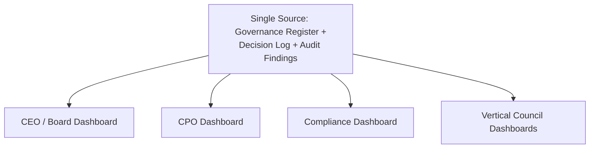

### Decision Matrix

| Decision Type | Approval Authority |
|---|---|
| Platform-defining decision | Product Governance Council + CEO + Board |
| Cross-vertical decision | Product Governance Council |
| Vertical-specific, high-stakes decision | Vertical Council |
| Vertical-specific, routine decision | Business Owner + Product Owner |
| Reversible, exploratory pilot | Product Owner, informing Council |
| Governance-model amendment | Product Governance Council + CEO |

---

# Closing Statement

Every prior document in this handbook explains what Arwal builds, how it sustains itself, and how it earns and protects trust across every vertical. This document explains how Arwal decides — deliberately, accountably, and consistently — what it builds next, who answers for that choice, and how that choice can still be explained years later to a citizen, a government partner, or a second district inheriting the model. A platform without governance does not merely risk a bad decision; it risks becoming a collection of good decisions that no longer add up to anything coherent. Product Governance is the discipline that keeps every one of Arwal's ~415 phases pointed in the same direction, answerable to the same citizen, and defensible to the same district — not because a single person remembers why, but because the reasoning was written down, owned, and reviewed, every time. Where a future phase must deviate from a principle stated here, that deviation is made explicitly — through the Product Governance Council's approval process above — never silently, and never by default.

This document, `ai-docs/84-product-governance.md`, is Phase 85 of approximately 415. Every future strategic decision, policy, escalation, and accountability question is expected to trace back to a principle defined here, or to justify its deviation in writing.

**End of Phase 85 — `ai-docs/84-product-governance.md`**