# Product Lifecycle Management

**Document:** `ai-docs/85-product-lifecycle-management.md`
**Project:** Arwal — The District Super App
**Stage:** 2 — Product & Business Strategy
**Phase:** 86 — Product Lifecycle Management
**Status:** Approved for Product & Engineering Reference
**Audience:** CEO, CSO, CPO, Enterprise Business Architects, Product Lifecycle Management Consultants, Product Strategy Consultants, Government Digital Transformation Advisors, Trust & Safety Strategists, Risk Management Consultants, Compliance Advisors, Organizational Design Specialists, Investors

> **Callout — Purpose of This Document**
> `ai-docs/00-project-vision.md` through `ai-docs/84-product-governance.md` established why Arwal exists, what it can do, who it serves, how it sustains itself, how it partners with government, the whole district ecosystem it operates inside, how every vertical creates and protects value, and who holds authority to decide what Arwal becomes next. None of those documents answers the question that determines whether any single one of Arwal's ~415 phases of capability remains trustworthy five years after it ships: **how does a product, module, capability, or policy move deliberately from idea to retirement — never launched before it is ready, never left running past its usefulness, and never forgotten once it is gone?** This document is that answer — the authoritative Product Lifecycle Management charter every future launch, evolution, and retirement decision traces back to.

---

# Purpose of this Document

### Why Lifecycle Management Is a Strategic Capability, Not a Delivery Process

This document is not a Software Development Lifecycle, not an Agile methodology, not a Scrum guide, not a release process, and not a CI/CD workflow — each of those is engineering-delivery territory owned elsewhere in this handbook and never redefined here. Product Lifecycle Management answers a different, business-level question: **at what point does a product idea deserve investment, at what point does a live capability deserve continued trust, and at what point does an aging capability deserve a dignified retirement rather than a quiet, unmanaged decline?** A platform that ships well but never asks these questions accumulates capability it can no longer explain, verify, or safely retire — exactly the fragmentation `ai-docs/00-project-vision.md` exists to cure, recreated inside Arwal's own product portfolio.

### How Lifecycle Management Protects Long-Term Product Quality

A capability launched under pressure, without genuine validation, does not merely risk a poor first impression — it risks becoming permanent, unexamined technical and trust debt that every future phase must work around. Per `ai-docs/32-technical-debt-management-standards.md`'s founding reasoning applied here at the product layer, a capability's quality is not fixed at launch; it either improves through deliberate lifecycle stewardship or decays through neglect. There is no third, stable state.

### How Lifecycle Management Supports Responsible Innovation

Innovation without a lifecycle discipline is not boldness — it is an unmanaged experiment run on citizens who did not consent to being one. Per `ai-docs/78-ai-product-strategy.md`'s Trust Before Automation principle and `ai-docs/62-revenue-sustainability-strategy.md`'s Responsible Innovation principle, a new capability earns expanded scope only after it has demonstrated, with evidence, that it deserves it. Product Lifecycle Management is the structural mechanism that makes "evidence before expansion" true for every product decision, not only for AI.

### How Lifecycle Management Enables Sustainable Multi-District Growth

Per `ai-docs/50-product-vision-business-strategy.md`'s Strategic Expansion Principles, a second district inherits Arwal's *model*, never its accumulated clutter. A platform that has never practiced retiring what no longer serves a purpose has nothing genuinely replicable to hand to a second district's leadership — only an ever-growing pile of capability nobody can fully account for. Lifecycle discipline is what keeps Arwal's portfolio a coherent, explainable, transferable asset rather than an archaeological site.

### Relationship Between Every Participant

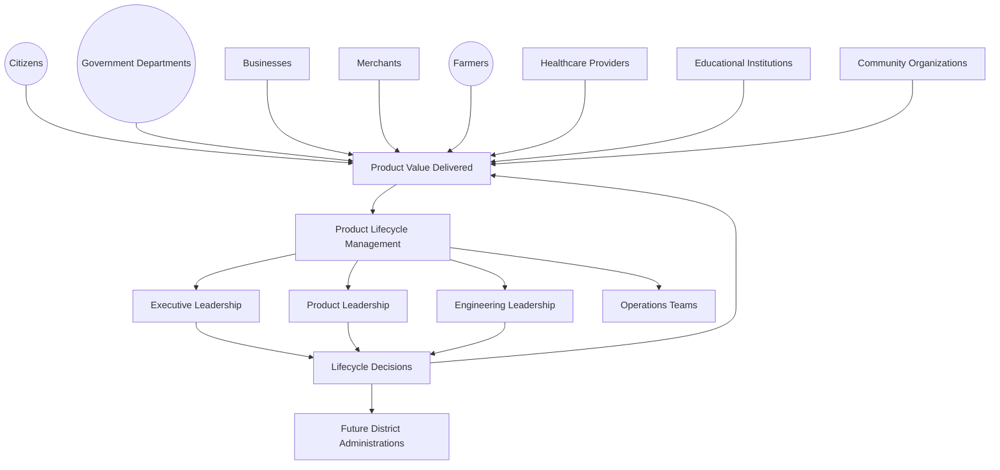

### Scope Boundary

This document does not define a sprint cadence, a backlog ritual, a deployment pipeline, or a specific release mechanic — those remain the domain of Arwal's own engineering-delivery practice, never redefined here. It does not redefine any vertical's own governance (`ai-docs/65` through `ai-docs/80`), Product Governance's Decision Authority Matrix (`ai-docs/84`), or the KPI and Analytics disciplines (`ai-docs/81`–`ai-docs/83`) — each is cited, never restated. Its exclusive territory is: **why a governed lifecycle matters, what stages every product passes through, who is accountable at each stage, and how that discipline itself is protected across a generation.**

---

# Product Lifecycle Philosophy

Every principle below exists because a lifecycle discipline assembled carelessly does not fail abstractly — it fails a citizen who depended on a capability that was launched too early, or left running long after it stopped being safe or useful.

### Citizen Value First
**Why it exists:** Every lifecycle decision — to launch, to expand, to retire — is judged first against whether it serves the citizen who depends on the capability, mirroring the identical Citizen-First tie-breaker already established throughout `ai-docs/51` through `ai-docs/84`.

### Lifecycle Before Delivery
**Why it exists:** A product's delivery mechanics (how it is built, tested, and shipped) are meaningless without a prior, deliberate judgment about *whether* and *when* it should exist at all. Lifecycle thinking precedes and governs delivery, never the reverse.

### Strategic Alignment
**Why it exists:** Every product traces to a Strategic Objective already established in `ai-docs/50-product-vision-business-strategy.md` — a capability built because it was technically interesting, not because it serves a genuine strategic need, is scope creep the moment it ships.

### Evidence-Based Evolution
**Why it exists:** A product's next stage — growth, optimization, transformation, retirement — is decided from `ai-docs/81-product-analytics-strategy.md`'s and `ai-docs/82-product-kpi-framework.md`'s honest evidence, never from seniority or persuasive narrative alone.

### Long-Term Sustainability
**Why it exists:** Every lifecycle decision is evaluated against the same generational horizon as every other strategic document in this handbook — a launch that wins this quarter at the cost of a decade of unmanageable debt is a regression, never a win.

### Responsible Innovation
**Why it exists:** A new capability is expanded in scope only after it has earned that expansion with evidence, mirroring `ai-docs/78-ai-product-strategy.md`'s Trust Before Automation principle, applied here to every product, not only AI.

### Continuous Improvement
**Why it exists:** A live product is never "finished" — its fitness for citizen need is reassessed on a defined cadence for as long as it remains in service, per the Continuous Improvement Loop already established throughout `ai-docs/60` through `ai-docs/84`.

### Transparency
**Why it exists:** A lifecycle decision — especially a retirement — made without visible reasoning is a decision the affected citizens and merchants are asked to simply accept. Every lifecycle transition states its reasoning openly.

### Accountability
**Why it exists:** Every product has exactly one named, accountable owner at every stage of its life, never a diffuse team that can later disclaim responsibility for its decline, mirroring the Clear Ownership discipline already established throughout `ai-docs/53` through `ai-docs/84`.

### Governance Integration
**Why it exists:** Lifecycle decisions are never made outside the Decision Authority Matrix already established in `ai-docs/84-product-governance.md` — a lifecycle stage transition is a governed decision like any other, never an informal team judgment.

### Trust Preservation
**Why it exists:** A citizen's trust in Arwal is not renewed automatically at every stage of a product's life — a capability that degrades quietly, or disappears without warning, spends that trust exactly as surely as a fraud incident does, per `ai-docs/79-trust-safety-framework.md`'s Shared Trust dependency.

### Institutional Learning
**Why it exists:** Every product's full life — including its failures — is retained as an asset for the next decision, never discarded once a product is retired, mirroring the Documentation Before Tribal Knowledge principle already established in `ai-docs/24-documentation-standards.md`.

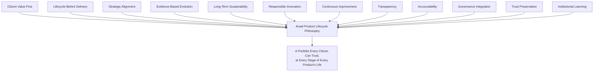

> **Callout — The One-Sentence Lifecycle Philosophy**
> *"A product Arwal cannot explain why it exists, why it is still growing, or why it was retired has already failed the citizen depending on it — lifecycle management exists so that every stage of every product's life has an answer."*

---

# Product Lifecycle Value Chain

| Stage | Business Description |
|---|---|
| **Opportunity Identification** | A genuine citizen, merchant, or civic need is recognized — never invented to justify a team's existing capacity. |
| **Strategic Evaluation** | The opportunity is weighed against `ai-docs/50-product-vision-business-strategy.md`'s Strategic Objectives and `ai-docs/48-engineering-strategic-planning-standards.md`'s Strategic Themes. |
| **Concept Formation** | A specific, testable product concept is drafted, naming its intended beneficiary and success criteria before a single line of investment is committed. |
| **Business Validation** | The concept is checked against real evidence — a pilot, a comparable precedent, a stakeholder consultation — never assumed valid from confidence alone. |
| **Governance Approval** | The validated concept passes through the Decision Authority Matrix already established in `ai-docs/84-product-governance.md`, at the tier its risk and scope warrant. |
| **Product Planning** | The approved concept is scoped into a genuine roadmap commitment, per `ai-docs/48`'s 1-Year Operational Plan discipline. |
| **Product Introduction** | The product reaches citizens for the first time, held to the Launch Readiness criteria below. |
| **Growth** | The product's genuine adoption and value delivery expand, measured per `ai-docs/80-user-growth-strategy.md` and `ai-docs/82-product-kpi-framework.md`. |
| **Optimization** | The product is refined for quality, accessibility, and efficiency without expanding its fundamental scope. |
| **Maturity** | The product delivers stable, well-understood value with low structural change, its continued relevance reconfirmed periodically rather than assumed. |
| **Transformation** | The product is deliberately evolved — a scope change, a technology shift, a merge with an adjacent capability — per a documented rationale. |
| **Retirement** | The product's genuine business need has ended or been absorbed elsewhere; it is withdrawn deliberately, never left to decay silently. |
| **Knowledge Preservation** | The product's full history — decisions, evidence, and lessons — is retained permanently, never discarded at retirement. |
| **Continuous Learning** | Lessons from every stage feed the next Opportunity Identification cycle, closing the loop deliberately. |

---

# Stakeholder Ecosystem

| Stakeholder | Strategic Responsibility in Product Lifecycle Management |
|---|---|
| **Executive Leadership** | Sets and protects the Strategic Vision every lifecycle decision is measured against; holds final authority for a Platform-Defining lifecycle transition, per `ai-docs/84`'s Decision Authority Matrix. |
| **Product Leadership** | Owns the day-to-day stewardship of each product's lifecycle stage, escalating what it cannot resolve alone. |
| **Engineering Leadership** | Owns technical feasibility and architectural coherence at every lifecycle transition, per `ai-docs/29-engineering-governance-decision-authority.md`. |
| **Government Partners** | A structurally consulted stakeholder for any lifecycle transition touching a civic-service commitment, per `ai-docs/63-government-partnership-strategy.md` — never merely informed after a civic capability is retired. |
| **Businesses** | Beneficiaries of a stable, predictable product lifecycle; a source of evidence when a lifecycle decision affects commercial continuity. |
| **Citizens** | The ultimate reference point every lifecycle decision is measured against — the party lifecycle management exists to serve, never a party it is imposed upon. |
| **Community Organizations** | A voice for underserved and vulnerable populations in any lifecycle transition affecting inclusion or accessibility, mirroring the representation already established in `ai-docs/68` and `ai-docs/70`'s Councils. |
| **Compliance Teams** | Verify that every lifecycle transition satisfies its regulatory obligation before and after approval. |
| **Operations** | Surface real-world execution or capacity concerns before a lifecycle transition is approved, never only after it has already strained the platform. |
| **Analytics Teams** | Supply the evidence base every lifecycle review depends on, per `ai-docs/81-product-analytics-strategy.md`. |
| **Future District Leadership** | Inherits this document's discipline, never a founding district's specific product decisions by assumption, per `ai-docs/50`'s Strategic Expansion Principles. |

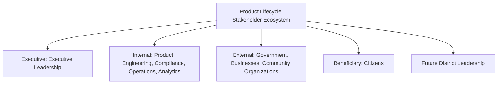

---

# Product Lifecycle Stages

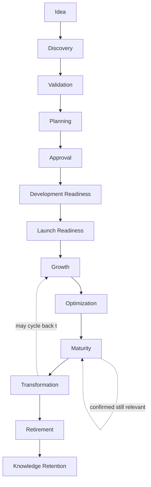

| Stage | Meaning | Exit Criterion |
|---|---|---|
| **Idea** | A genuine opportunity is raised by any accountable stakeholder, naming its intended citizen benefit. | A named proposer and a stated Strategic Objective link exist. |
| **Discovery** | The idea is explored — who is affected, what alternative already exists, what evidence would validate it. | A discovery summary exists, including the "why not build this" case. |
| **Validation** | The idea is tested against real evidence — a pilot, a comparable precedent, a stakeholder consultation. | A validation record exists, positive or negative, never skipped for urgency. |
| **Planning** | A validated idea is scoped into a genuine roadmap commitment, per `ai-docs/48`'s Strategic Investment Governance. | Required Fields (Business Outcome, Technical Outcome, Risks, Dependencies, Budget, KPIs, Review Milestones) are complete. |
| **Approval** | The plan passes through the tier-appropriate Decision Authority, per `ai-docs/84-product-governance.md`. | A recorded decision — approved, rejected, or returned — exists. |
| **Development Readiness** | The approved product is confirmed ready for build — dependencies resolved, capacity confirmed against `ai-docs/36`'s Capacity Forecast. | A Development Readiness checklist is satisfied, never assumed. |
| **Launch Readiness** | The product satisfies the Launch Readiness criteria below before reaching a citizen. | Every readiness criterion is met — accessibility, trust, support readiness — never partially. |
| **Growth** | The product's genuine adoption and value expand, measured against its stated KPIs. | Sustained KPI tracking for 2+ consecutive review cycles. |
| **Optimization** | The product is refined without expanding its fundamental scope. | Quality and accessibility metrics meet or exceed target for its criticality tier. |
| **Maturity** | The product delivers stable value; its continued relevance is reconfirmed, not assumed, at each periodic review. | A Maturity Review confirms continued citizen need. |
| **Transformation** | The product's scope, technology, or boundary is deliberately evolved. | A documented rationale and Impact Assessment exist, mirroring `ai-docs/53`'s Domain Change Impact Assessment. |
| **Retirement** | The product's business need has ended or is absorbed elsewhere; it is withdrawn deliberately. | The Retirement Checklist below is fully satisfied. |
| **Knowledge Retention** | The product's full history is archived, never deleted, per the Archive Never Delete principle already established throughout this handbook. | A permanent knowledge record exists, citable by ID. |

### Launch Readiness Criteria

A product is not introduced to citizens until:

- [ ] It satisfies every applicable Module Onboarding Checklist item already established in `ai-docs/54-product-module-catalog.md`.
- [ ] It meets the accessibility floor in `ai-docs/12-accessibility-standards.md` for its criticality tier.
- [ ] Its human-support and escalation path is live, per `ai-docs/60-customer-experience-strategy.md`'s Human Assistance principle.
- [ ] Its KPIs and counterbalancing trust signal are already defined, per `ai-docs/82-product-kpi-framework.md`'s Balanced Scorecard Model.
- [ ] Any AI-assisted feature carries a functioning human-override path, per RULE-024.
- [ ] Any government-adjacent capability has been jointly reviewed with the relevant department, per `ai-docs/63-government-partnership-strategy.md`.

### Retirement Checklist

A product is not marked Retired until:

- [ ] Its business need is confirmed absent for two consecutive lifecycle reviews, or it is formally merged into a successor.
- [ ] Every dependent capability's dependency map entry is updated to remove or redirect the dependency, mirroring `ai-docs/55`'s Capability Retirement Checklist.
- [ ] A migration path is communicated to every affected citizen, merchant, or government partner, per `ai-docs/34-engineering-communication-standards.md`'s classification tiers.
- [ ] Historical data-retention obligations, per `ai-docs/10-security-standards.md`, are satisfied before any underlying data is purged.
- [ ] The product's ID is archived, never reused, per the Archive Never Delete principle.

---

# Value Creation

| Question | Answer |
|---|---|
| **How does lifecycle management create value?** | By ensuring a citizen only ever depends on a capability that was genuinely validated, is actively maintained, and is retired with warning rather than abandoned without one. |
| **How do citizens benefit?** | By never being the unwitting subject of an unvalidated launch, and never losing a service they depend on without a communicated alternative. |
| **How does government benefit?** | By partnering with a platform whose civic capabilities are demonstrably deliberate — planned, evidenced, and never quietly withdrawn — strengthening the durability already sought in `ai-docs/63`'s Civic Sustainability commitment. |
| **How do businesses benefit?** | By trusting that a capability they build their own operations around (a merchant dashboard, a payment rail) will not disappear without a managed transition. |
| **How do product teams benefit?** | By having a clear, predictable path from idea to launch to eventual retirement, rather than navigating ambiguous, informally-decided product fate. |
| **How does lifecycle management strengthen trust?** | Every well-managed transition — a careful launch, a communicated retirement — compounds into the same Trust Value Chain already established in `ai-docs/79-trust-safety-framework.md`. |
| **How does lifecycle management support district transformation?** | A portfolio that only ever grows, never rationalizes, eventually collapses under its own weight — deliberate lifecycle stewardship is what keeps Arwal's product base coherent enough to keep serving, and expanding to, the district for a generation. |

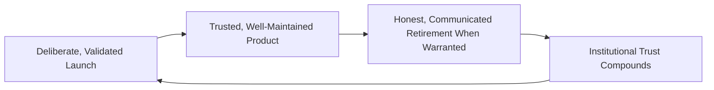

---

# Business Model

Every capability below is described strategically — its business rationale, never its implementation. The enforceable mechanics behind each capability remain owned by the respective governing document already established elsewhere in this handbook.

| Capability | Business Rationale |
|---|---|
| **Portfolio Lifecycle** | Standing visibility into every product's current stage across the entire platform, per `ai-docs/38-engineering-portfolio-program-management-standards.md`. |
| **Product Lifecycle** | The stage-by-stage discipline this document defines, applied to every individual product surface catalogued in `ai-docs/54-product-module-catalog.md`. |
| **Feature Lifecycle** | A lighter-weight variant of this same discipline scoped to a feature within an already-approved product, never a separate framework. |
| **Service Lifecycle** | The identical discipline applied to a Business Capability (`ai-docs/55`), whose own Capability Lifecycle already mirrors this document's stage model. |
| **Policy Lifecycle** | The identical discipline applied to a Business Rule or Policy, mirroring `ai-docs/58-business-rules-policies.md`'s Rule Lifecycle. |
| **Marketplace Lifecycle** | The Cold Start through Regional Expansion progression already established in `ai-docs/65-marketplace-strategy.md`'s Marketplace Lifecycle. |
| **AI Lifecycle** | The Need Recognition through Long-Term Trust progression already established in `ai-docs/78-ai-product-strategy.md`'s AI Lifecycle, governed under this document's same discipline. |
| **Citizen Experience Lifecycle** | The Discovery through Long-Term Retention progression already established in `ai-docs/60-customer-experience-strategy.md`'s Experience Lifecycle. |
| **Governance Lifecycle** | The Idea through Retirement progression already established in `ai-docs/84-product-governance.md`'s own Lifecycle, applied here specifically to product decisions. |
| **Innovation Lifecycle** | A deliberately lighter-weight review path for genuinely exploratory, reversible initiatives, mirroring `ai-docs/48`'s Innovation & Exploration allocation. |
| **Retirement Management** | The formal, evidence-gated, communicated discipline governing how a capability's life ends, never an unmanaged decline. |
| **Knowledge Management** | The permanent retention of every product's full decision history, per `ai-docs/24-documentation-standards.md`'s Documentation Lifecycle. |

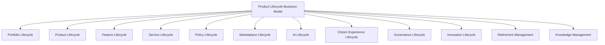

---

# Responsible Lifecycle Strategy

| Mechanism | Strategic Role |
|---|---|
| **Governance Integration** | Every lifecycle stage transition passes through the Decision Authority Matrix already established in `ai-docs/84-product-governance.md` — never an informal, unreviewed judgment. |
| **Risk Management** | Every transition is scored against `ai-docs/30-engineering-risk-management-standards.md`'s Risk Classification before approval. |
| **Privacy Protection** | Any lifecycle review touching citizen data draws only on data already governed by RULE-003's Consent Requirement. |
| **Accessibility** | Launch Readiness and every subsequent Optimization stage are held to `ai-docs/12-accessibility-standards.md`'s non-negotiable floor, never a later accommodation. |
| **Responsible AI Evolution** | Any lifecycle transition touching RULE-024's AI Automation Boundary requires the elevated, near-unanimous review already established in `ai-docs/78-ai-product-strategy.md`'s AI Council. |
| **Cross-Functional Collaboration** | No consequential lifecycle transition proceeds on Product's judgment alone — Engineering, Trust & Safety, Compliance, and Government Partnerships are heard first. |
| **Evidence-Based Reviews** | Every stage transition draws on `ai-docs/81`'s Analytics and `ai-docs/82`'s KPIs, never a persuasive narrative alone. |
| **Citizen Trust** | Every mechanism above compounds into one felt, if invisible, outcome: a platform whose products a citizen can trust were introduced carefully and will not vanish without warning. |
| **Government Coordination** | Any lifecycle transition touching a civic commitment is reviewed jointly with the relevant department, never unilaterally by Arwal alone. |
| **Institutional Learning** | Every transition's reasoning, including where it later proved wrong, is retained permanently, feeding the next Opportunity Identification cycle honestly. |

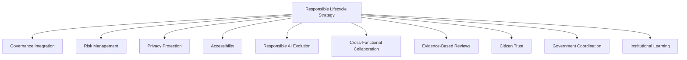

> **Callout — A Retirement Is Governed With the Same Rigor as a Launch**
> Per Governance Integration above, a product's retirement is never a unilateral engineering or product decision made under capacity pressure — it passes through the identical tier-appropriate Decision Authority a launch does, because the citizen-facing consequence of an unmanaged retirement (a merchant's storefront vanishing, a citizen's saved history disappearing) is exactly as serious as the consequence of an unmanaged launch.

---

# Economic & Social Impact

| Impact Area | How Product Lifecycle Management Contributes |
|---|---|
| **Improve Product Quality** | Deliberate Validation and Optimization stages catch a usability or trust gap before, and after, a product reaches scale. |
| **Increase Product Longevity** | A product actively maintained through Maturity, rather than left to decay, serves citizens for years rather than quarters. |
| **Reduce Waste** | Evidence-gated Validation prevents investment in a concept that was never going to serve a genuine need. |
| **Improve Government Collaboration** | A department can trust that a civic capability built jointly with Arwal will not be withdrawn without notice, strengthening the durability `ai-docs/63`'s Civic Sustainability commitment already seeks. |
| **Improve Citizen Outcomes** | Citizens depend only on capabilities that were genuinely validated and are actively stewarded, never an unmanaged experiment. |
| **Support Businesses** | Merchants and providers can build their own operations around Arwal's capabilities with confidence in their continuity or managed transition. |
| **Strengthen District Development** | A coherent, well-governed product portfolio is a genuinely replicable asset, accelerating every development area already named in `ai-docs/64-district-ecosystem-mapping.md`'s District Development Strategy. |

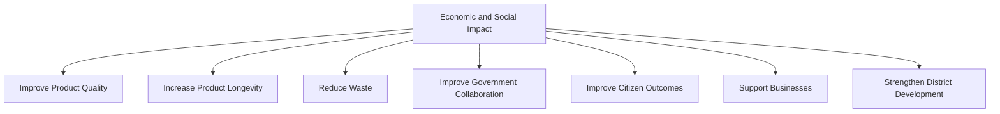

---

# Governance

### Lifecycle Council
A standing **Product Lifecycle Council** — chaired by the CPO, with the CSO, CTO, Chief Trust & Safety Officer, Compliance Officer, Head of Government Partnerships, and rotating vertical Council chairs as members — holds approval authority over any Idea-to-Planning transition for a platform-wide or cross-vertical product, any Retirement decision, and any material deviation from the Anti-Patterns below. The Council meets monthly, with ad hoc sessions for a Mission Critical launch or retirement decision. Where a proposal is vertical-specific, the vertical's own Council (per `ai-docs/65` through `ai-docs/80`) exercises delegated authority, consistent with `ai-docs/84-product-governance.md`'s Decision Authority Matrix.

### Ownership
Every product has exactly one named Business Owner (accountable for lifecycle stage and strategic relevance) and, where distinct, one named Product Owner (accountable for day-to-day stewardship), mirroring the identical dual-ownership discipline already established in `ai-docs/54-product-module-catalog.md` and `ai-docs/55-business-capability-map.md`.

### Decision Authority

| Lifecycle Transition | Approval Authority |
|---|---|
| Idea → Discovery | Product Owner |
| Discovery → Validation | Product Owner + Business Owner |
| Validation → Planning | Vertical Council |
| Planning → Approval | Vertical Council, or Product Lifecycle Council for cross-vertical/platform-wide scope |
| Approval → Development Readiness | Product Lifecycle Council + Engineering Leadership |
| Development Readiness → Launch Readiness | Product Lifecycle Council + Trust & Safety + Accessibility sign-off |
| Growth → Optimization → Maturity | Business Owner, reviewed at Lifecycle Health Review |
| Maturity → Transformation | Vertical Council or Product Lifecycle Council, per scope |
| Any Stage → Retirement | Product Lifecycle Council + CPO, informing CEO for a Mission Critical product |

### Lifecycle Gates

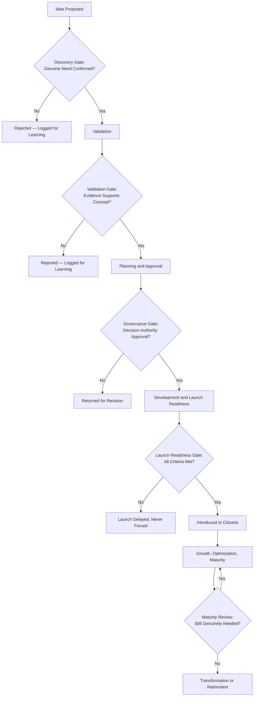

### Review Cadence

| Review | Cadence | Owner |
|---|---|---|
| Lifecycle Health Review | Monthly | Product Lifecycle Council |
| Portfolio Rationalization Review | Quarterly | Product Lifecycle Council, vertical Council chairs |
| Annual Product Lifecycle Strategy Review | Annual | CEO, CPO, CSO, Board |

### Continuous Improvement
Every retirement, every failed Validation, and every Transformation decision feeds a shared, tracked improvement backlog, reviewed at the next Lifecycle Health Review, per the identical Continuous Improvement Loop already established throughout `ai-docs/60` through `ai-docs/84`.

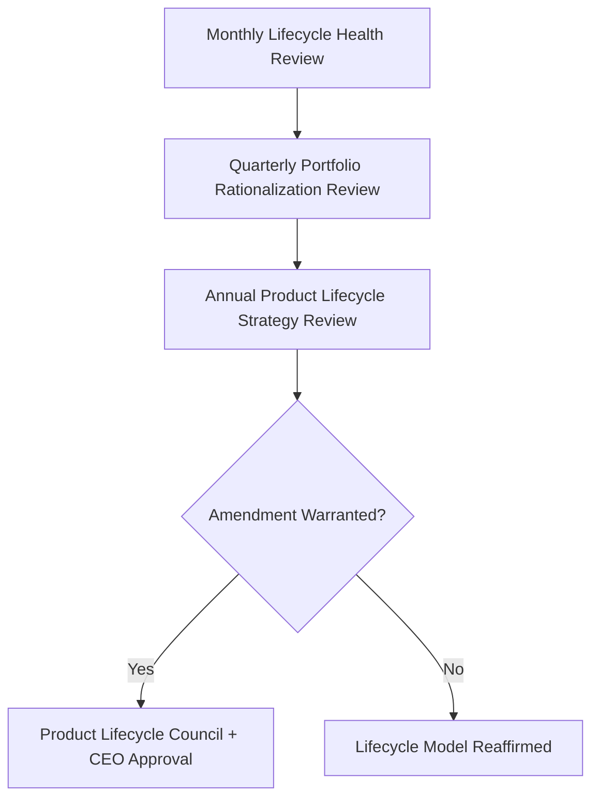

---

# Risks

| Risk | Description | Mitigation |
|---|---|---|
| **Premature Launch** | A product reaches citizens before genuine Validation or Launch Readiness. | Mandatory Launch Readiness checklist; no exception for internal deadline pressure. |
| **Feature Creep** | A product's scope expands quietly during Growth or Optimization without a genuine Transformation review. | Transformation stage's mandatory Impact Assessment before any scope change. |
| **Lifecycle Stagnation** | A mature product is never reassessed, quietly drifting out of relevance. | Mandatory periodic Maturity Review; a product cannot remain in Maturity indefinitely without reconfirmation. |
| **Unmanaged Retirement** | A product is quietly abandoned without a communicated transition. | Retirement Checklist's mandatory migration-path communication before any withdrawal. |
| **Weak Governance** | A lifecycle transition proceeds without the correct tier of review. | Decision Authority table; Governance Integration principle. |
| **Poor Adoption** | A launched product fails to reach its intended citizens. | Growth-stage KPI monitoring per `ai-docs/80-user-growth-strategy.md`; early corrective review, never a silent write-off. |
| **Technical Debt Impact** | A product's underlying debt accumulates unaddressed across its lifecycle. | Continuous Optimization stage discipline; `ai-docs/32-technical-debt-management-standards.md`'s Technical Debt Budget applied at every stage. |
| **Trust Erosion** | A poorly managed launch or retirement damages citizen or government confidence. | Transparency and Trust Preservation mechanisms; honest, proactive communication. |
| **Regulatory Change** | A shift in applicable law invalidates an existing lifecycle assumption for an in-service product. | Compliance Governance's continuous, never one-time, regulatory review, per `ai-docs/40-engineering-compliance-audit-standards.md`. |

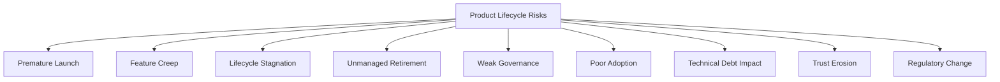

---

# Metrics

| Metric | Definition | Direction |
|---|---|---|
| **Lifecycle Health Index** | A composite score reflecting the proportion of products with a current, up-to-date lifecycle stage assignment and review. | Increasing |
| **Lifecycle Progress Rate** | The rate at which products move deliberately through stages, neither stalled nor rushed. | Stable, proportionate to product complexity |
| **Retirement Effectiveness** | % of retirements completing their full Retirement Checklist without a citizen-facing disruption. | Increasing toward 100% |
| **Innovation Success Rate** | % of Idea-stage proposals that reach a genuinely validated Planning stage. | Monitored for genuine rigor, not maximized artificially |
| **Lifecycle Governance Compliance** | % of stage transitions passing through their correct tier of Decision Authority. | Increasing toward 100% |
| **Knowledge Retention Index** | % of retired products with a complete, permanently archived knowledge record. | Increasing toward 100% |
| **Portfolio Sustainability Index** | The ratio of actively-maintained to stagnant products across the portfolio. | Increasing |
| **Citizen Value Continuity** | The share of citizens affected by a lifecycle transition who experienced no unmanaged disruption. | Increasing toward 100% |

> **Callout — No Lifecycle Metric Stands Alone**
> Per the North Star Principle already established in `ai-docs/00-project-vision.md`, a rising Lifecycle Progress Rate alongside a falling Citizen Value Continuity is treated as a regression — speed through the lifecycle gained by skipping genuine citizen protection is never counted as success.

---

# Anti-Patterns

| Anti-Pattern | Why It's Rejected |
|---|---|
| **Launching Without Validation** | Skipping the Validation stage under deadline pressure violates Evidence-Based Evolution and Lifecycle Before Delivery. |
| **Never Retiring Products** | A product left running indefinitely without a Maturity Review accumulates unmanaged risk and debt, violating Continuous Improvement. |
| **Feature Creep** | Scope expansion without a genuine Transformation review violates Strategic Alignment and Governance Integration. |
| **Innovation Without Governance** | A team shipping a consequential change outside the Decision Authority Matrix violates Governance Integration absolutely. |
| **Ignoring Citizen Feedback** | Advancing a product through Growth or Maturity while dismissing genuine citizen signal violates Citizen Value First. |
| **Ignoring Accessibility** | Treating accessibility as a post-launch patch rather than a Launch Readiness criterion violates the non-negotiable floor already established in `ai-docs/12-accessibility-standards.md`. |
| **Building Without Strategy** | A product pursued because it is technically interesting, with no traceable Strategic Objective, violates Strategic Alignment. |
| **Treating Launch as Success** | Celebrating Product Introduction as the finish line, rather than the start of Growth and Optimization accountability, violates Long-Term Sustainability. |

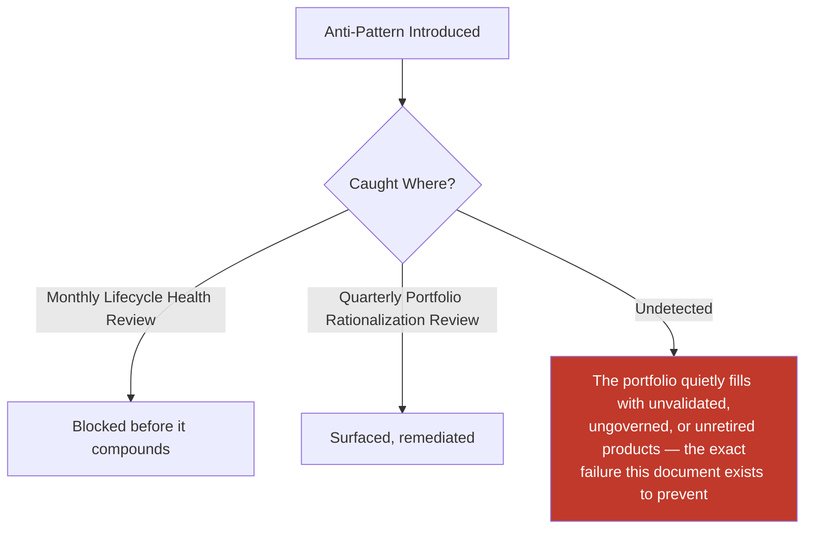

---

# Relationship to Previous Documents

| Prior Document | Relationship |
|---|---|
| **Project Vision (`ai-docs/00`)** | Establishes the founding, generation-long horizon this document's every lifecycle stage is measured against. |
| **Product Vision & Business Strategy (`ai-docs/50`)** | Supplies the Strategic Objectives every product's Opportunity Identification and Strategic Evaluation stages trace to. |
| **Business Domain Model (`ai-docs/53`)** | Supplies the ownership structure this document's product Business Owners are drawn from. |
| **Product Module Catalog (`ai-docs/54`)** | Supplies the Module Lifecycle and Onboarding/Retirement Checklists this document's Launch Readiness and Retirement Checklist directly extend. |
| **Business Capability Map (`ai-docs/55`)** | Supplies the Capability Lifecycle this document's Service Lifecycle capability mirrors without redefinition. |
| **Business Rules & Policies (`ai-docs/58`)** | Supplies the Rule Lifecycle this document's Policy Lifecycle capability mirrors, and RULE-024's absolute AI boundary this document's Responsible AI Evolution inherits. |
| **Customer Experience Strategy (`ai-docs/60`)** | Supplies the Experience Lifecycle this document's Citizen Experience Lifecycle capability cites directly. |
| **Revenue & Sustainability Strategy (`ai-docs/62`)** | Supplies the Long-Term Sustainability principle this document's every stage transition is evaluated against. |
| **District Ecosystem Mapping (`ai-docs/64`)** | Supplies the District Development Strategy this document's Economic & Social Impact section reinforces. |
| **Marketplace Strategy (`ai-docs/65`)** | Supplies the Marketplace Lifecycle this document's Marketplace Lifecycle capability cites, never redefines. |
| **Agriculture, Healthcare, Education, Employment Business Models (`ai-docs/68`–`ai-docs/71`)** | Supply their own vertical Farmer/Patient/Learner/Job Seeker Lifecycles, each governed under this document's same stage discipline. |
| **Payments & Financial Services Strategy (`ai-docs/74`)** | Supplies the Payment Lifecycle this document's discipline extends without redefining RULE-018's absolute guarantees. |
| **AI Product Strategy (`ai-docs/78`)** | Supplies the AI Lifecycle and RULE-024's Automation Boundary this document's Responsible AI Evolution inherits without alteration. |
| **Trust & Safety Framework (`ai-docs/79`)** | Supplies the Trust Value Chain this document's Trust Preservation principle is anchored in. |
| **Product Analytics Strategy (`ai-docs/81`)** | Supplies the evidentiary discipline this document's Evidence-Based Evolution principle is built on. |
| **Product KPI Framework (`ai-docs/82`)** | Supplies the standing indicators this document's Metrics section elevates for lifecycle-specific tracking. |
| **Business Intelligence Framework (`ai-docs/83`)** | Supplies the cross-domain synthesis this document's Portfolio Rationalization Review consumes before a platform-defining lifecycle decision. |
| **Product Governance (`ai-docs/84`)** | Supplies the Decision Authority Matrix, Council structure, and Escalation Model this document's every Governance mechanism is built directly on top of, never duplicated. |

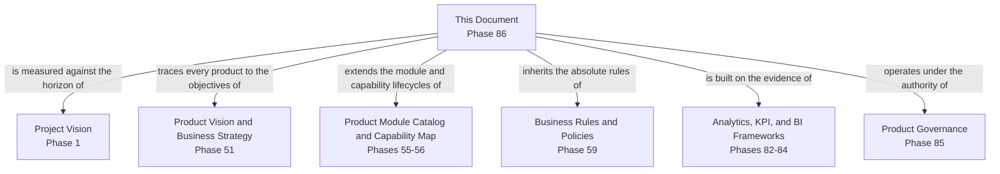

---

# Executive Artifacts

### Product Lifecycle Framework

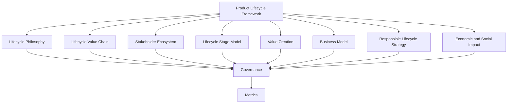

### Lifecycle Value Chain

See Product Lifecycle Value Chain section above — reproduced here by reference per Single Source of Truth, never duplicated.

### Lifecycle Stage Model

See Product Lifecycle Stages section above.

### Lifecycle Governance Model

See Governance section above.

### Lifecycle Decision Gates

See Lifecycle Gates diagram above.

### Lifecycle Maturity Model

| Level | Name | Characteristics |
|---|---|---|
| **1 — Informal** | Products launched and retired ad hoc, with no documented stage discipline. | High variance; no institutional memory. |
| **2 — Defined** | Lifecycle stages exist on paper but are inconsistently followed. | Lifecycle Governance Compliance below target. |
| **3 — Managed** | Every product's stage transition passes through its correct gate; ownership is consistently clear. | This document's standard is fully met. |
| **4 — Measured** | Lifecycle Metrics are actively tracked and reviewed against explicit thresholds. | Monthly Health Review and Quarterly Rationalization Review are both live. |
| **5 — Optimized** | Lifecycle discipline itself is evidence-driven, proactively evolving, and genuinely replicable to a second district. | District Expansion readiness proven, not theoretical. |

Arwal's target state at the completion of Stage 2 is **Level 3 (Managed)**, with **Level 4 (Measured)** targeted as `ai-docs/81`'s and `ai-docs/82`'s tooling matures.

### Executive Lifecycle Dashboard (Conceptual)

| Dashboard | Audience | Key Content |
|---|---|---|
| **CEO / Board Dashboard** | CEO, Board | Lifecycle Health Index, Portfolio Sustainability Index, Platform-Defining transitions log |
| **CPO Dashboard** | CPO | Lifecycle Progress Rate, stage distribution across the portfolio, Innovation Success Rate |
| **Compliance Dashboard** | Compliance Officer | Lifecycle Governance Compliance, Retirement Effectiveness |
| **Vertical Council Dashboards** | Council Chairs | Own-vertical product stage log, upcoming Maturity and Retirement reviews |

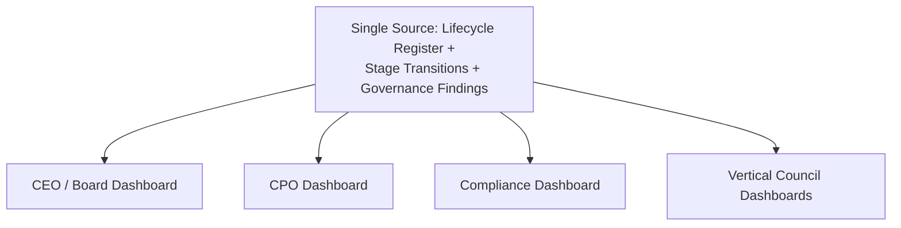

### Decision Matrix

| Decision Type | Approval Authority |
|---|---|
| Idea → Discovery | Product Owner |
| Validation → Planning | Vertical Council |
| Planning → Approval (cross-vertical/platform-wide) | Product Lifecycle Council |
| Development Readiness → Launch Readiness | Product Lifecycle Council + Trust & Safety + Accessibility |
| Maturity → Transformation | Vertical Council or Product Lifecycle Council, per scope |
| Any Stage → Retirement | Product Lifecycle Council + CPO |

---

# Closing Statement

Every prior document in this handbook explains what Arwal builds, how it decides, and how it sustains itself. This document explains how every single thing Arwal builds is born, grows, matures, and — when its time genuinely comes — retires with the same care it was introduced with. A platform that only knows how to launch, never how to retire, becomes a museum of half-remembered decisions no one can safely touch; a platform that launches without validating becomes an experiment run on citizens who never agreed to be its subjects. Product Lifecycle Management exists in the disciplined space between those two failures — ensuring that a citizen who depends on an Arwal capability today can trust it was introduced deliberately, is being actively stewarded, and will never simply vanish without a communicated path forward. Across roughly 415 phases and a multi-generation horizon, this is the discipline that keeps Arwal's product portfolio a living, coherent, trustworthy asset rather than an ever-growing, unaccountable pile of things once shipped. Where a future phase must deviate from a principle stated here, that deviation is made explicitly — through the Product Lifecycle Council's approval process above — never silently, and never by default.

This document, `ai-docs/85-product-lifecycle-management.md`, is Phase 86 of approximately 415. Every future launch, evolution, and retirement decision is expected to trace back to a principle defined here, or to justify its deviation in writing.

**End of Phase 86 — `ai-docs/85-product-lifecycle-management.md`**