# Feature Prioritization Framework

**Document:** `ai-docs/86-feature-prioritization-framework.md`
**Project:** Arwal — The District Super App
**Stage:** 2 — Product & Business Strategy
**Phase:** 87 — Feature Prioritization Framework
**Status:** Approved for Product & Engineering Reference
**Audience:** CEO, CSO, CPO, Enterprise Business Architects, Product Portfolio Strategists, Product Governance Consultants, Strategic Planning Consultants, Government Digital Transformation Advisors, Risk Management Consultants, Trust & Safety Strategists, Organizational Design Specialists, Investors

> **Callout — Purpose of This Document**
> `ai-docs/00-project-vision.md` through `ai-docs/85-product-lifecycle-management.md` established why Arwal exists, what it can do, who it serves, how it sustains itself, how it partners with government, how it measures itself honestly, how it governs its own decisions, and how a product moves deliberately from idea to retirement. None of those documents answers the question every planning cycle, every roadmap meeting, and every resource-constrained tradeoff ultimately forces into the open: **when everything cannot be built at once, what gets built next, why, and who decided?** This document is that answer — the authoritative Feature Prioritization Framework every future evaluation, sequencing, deferral, and rejection decision traces back to.

---

# Purpose of this Document

### Why Prioritization Is a Strategic Capability, Not a Backlog Exercise

Prioritization is frequently reduced to a backlog-grooming ritual — a list re-ordered in a planning tool once a sprint. At Arwal's scale and civic mandate, that reduction is a category error. Every prioritization decision is a decision about which citizen's need is served sooner, which government partnership deepens faster, and which risk is accepted for longer. A platform serving a district's entire civic-commercial life cannot treat that decision as a scheduling convenience. This document exists to make prioritization exactly what its consequences demand: a governed, evidence-based, strategically accountable capability — never a Scrum ceremony, never a Jira triage queue, never a scoring spreadsheet mistaken for judgment.

### This Is Not a Delivery Methodology

This document contains no sprint cadence, no backlog-grooming ritual, no story-point scale, no RICE/ICE/WSJF formula, no Kanban board, and no project-management tooling. It does not redefine Product Governance's Decision Authority Matrix (`ai-docs/84`), Product Lifecycle Management's stage model (`ai-docs/85`), or Engineering Strategic Planning's Strategic Investment Governance (`ai-docs/48`) — each remains fully authoritative and is cited, never restated. This document's exclusive territory is: **why prioritization is a strategic discipline, what principles govern a priority decision, who is accountable for it, and how that discipline itself is protected from drift, politics, and decay across a generation of district service.**

### How Prioritization Protects Long-Term Product Quality

A platform that builds whatever is loudest, newest, or easiest accumulates capability it cannot explain and citizens cannot rely on — precisely the fragmentation `ai-docs/00-project-vision.md` exists to cure, recreated inside Arwal's own roadmap. Per `ai-docs/85-product-lifecycle-management.md`'s Lifecycle Before Delivery principle, a product's quality is not fixed at launch; it is set, first, by whether it deserved to be built before something more valuable to a citizen. Prioritization is where that judgment happens.

### How Prioritization Balances Innovation With Operational Stability

A prioritization discipline that only protects stability never lets Arwal improve; a discipline that only chases the newest idea never lets a citizen depend on anything long enough for trust to compound. Per `ai-docs/48-engineering-strategic-planning-standards.md`'s Sustainable Investment principle and `ai-docs/62-revenue-sustainability-strategy.md`'s Long-Term Sustainability principle, Arwal holds both truths deliberately — proportionate investment in what already works, alongside disciplined, evidence-gated investment in what might work better.

### How Prioritization Supports Multi-District Expansion

Per `ai-docs/50-product-vision-business-strategy.md`'s Strategic Expansion Principles, a second district inherits Arwal's *reasoning*, never merely its feature list. A founding district that prioritized by whoever argued loudest has nothing genuinely transferable to hand a second district's leadership — only an unexplainable roadmap. A documented, evidence-based prioritization framework is what makes Arwal's judgment itself a replicable asset.

### Relationship Between Every Participant

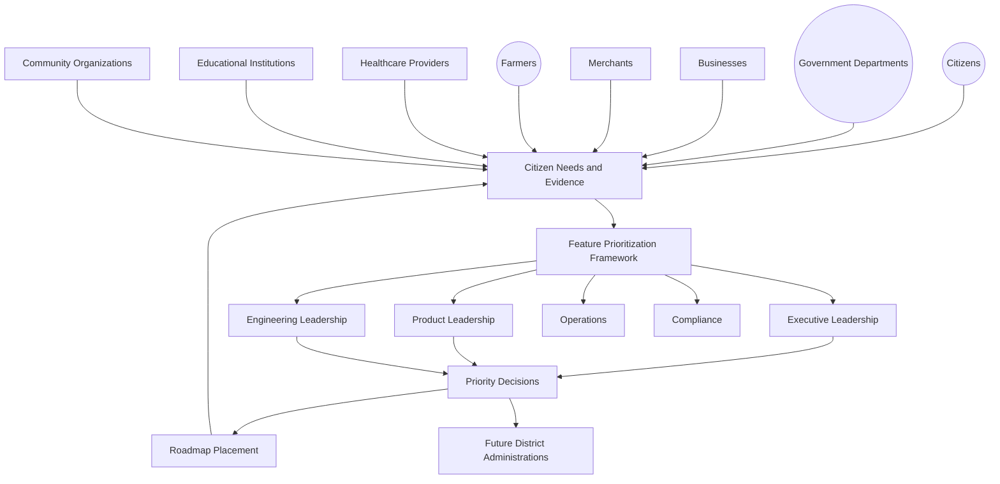

### Scope Boundary

This document does not define a sprint, a ticket, a scoring formula, or a delivery workflow — those belong to Arwal's own engineering-delivery practice and are never redefined here. Its territory is strategic: the philosophy, the value chain, the stakeholder accountability, and the governance that keep every "what gets built next" decision evidence-based, transparent, and traceable to Arwal's mission — never to popularity, internal politics, or short-term pressure.

---

# Feature Prioritization Philosophy

Every principle below exists because a prioritization discipline assembled carelessly does not fail abstractly — it fails a citizen whose genuine need waited behind a louder, less consequential one.

### Citizen Value First
**Why it exists:** Every priority decision is judged first against whether it serves a genuine citizen, merchant, farmer, or government need, mirroring the identical Citizen-First tie-breaker already established throughout `ai-docs/51` through `ai-docs/85`. A feature that serves an internal metric or a single stakeholder's convenience is never prioritized ahead of one that serves the district.

### Strategic Alignment
**Why it exists:** Every prioritized initiative traces to a Strategic Objective already established in `ai-docs/50-product-vision-business-strategy.md` or a Strategic Theme in `ai-docs/48-engineering-strategic-planning-standards.md` — an initiative that cannot be traced to either is not yet eligible for prioritization, regardless of its individual appeal.

### Evidence Before Investment
**Why it exists:** A priority decision made on persuasive narrative or seniority alone is exactly the failure `ai-docs/83-business-intelligence-framework.md`'s Evidence Before Opinion principle already exists to prevent. Prioritization draws on the same evidentiary discipline, never a separate, lower standard.

### Public Benefit Over Popularity
**Why it exists:** The most-requested feature and the most-needed feature are not always the same feature — a vocal, digitally fluent minority can generate disproportionate demand signal while a rural, low-literacy majority's genuine need goes unheard. Prioritization is weighted toward verified public benefit, never mere volume of request.

### Long-Term Sustainability
**Why it exists:** A priority decision is evaluated on the same multi-decade horizon as every other strategic document in this handbook — a feature that wins this quarter's attention at the cost of the platform's long-term coherence or trust is a regression, never a win.

### Responsible Innovation
**Why it exists:** A new capability earns expanded investment only after it has demonstrated, with evidence, that it deserves it, mirroring `ai-docs/78-ai-product-strategy.md`'s Trust Before Automation principle and `ai-docs/85-product-lifecycle-management.md`'s Evidence-Based Evolution principle, applied here to every prioritized initiative.

### Transparency
**Why it exists:** A priority decision made behind closed doors, with no visible reasoning, asks every unprioritized stakeholder to simply accept the outcome. Every priority decision states its reasoning, its evidence, and its accountable owner openly.

### Cross-Functional Collaboration
**Why it exists:** No single function — Product, Engineering, Trust & Safety, Government Partnerships, Finance — holds the full picture of a priority decision's consequence. Prioritization forces that picture into one room before a decision is finalized, never leaving it to one function alone.

### Risk Awareness
**Why it exists:** Every prioritized initiative is evaluated against its risk profile, per `ai-docs/30-engineering-risk-management-standards.md`'s Risk Classification, before it is approved — an initiative's upside is never assessed without its corresponding downside.

### Governance Before Delivery
**Why it exists:** A priority decision is a governed decision like any other, per `ai-docs/84-product-governance.md`'s Decision Authority Matrix — never an informal team judgment that bypasses the tier of review its stakes actually warrant.

### Trust Preservation
**Why it exists:** A citizen's trust in Arwal depends partly on believing the platform is improving in ways that genuinely serve them — a prioritization pattern that visibly serves commercial convenience over civic need spends that trust exactly as surely as a fraud incident does, per `ai-docs/79-trust-safety-framework.md`'s Shared Trust dependency.

### Institutional Learning
**Why it exists:** Every prioritization decision — including one that later proved wrong — is retained as an asset for the next cycle, never discarded once a decision is made, mirroring the Documentation Before Tribal Knowledge principle already established in `ai-docs/24-documentation-standards.md`.

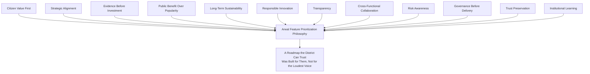

> **Callout — The One-Sentence Prioritization Philosophy**
> *"If Arwal cannot explain, with evidence, why this was built before that, it has not prioritized — it has merely reacted, and a district cannot depend on a platform that reacts instead of choosing."*

---

# Feature Prioritization Value Chain

| Stage | Business Description |
|---|---|
| **Strategic Opportunity** | A genuine possibility for citizen, civic, or commercial value is identified, traced to a Strategic Objective already established in `ai-docs/50-product-vision-business-strategy.md`. |
| **Problem Identification** | The specific, real problem the opportunity addresses is named precisely — never a vague aspiration. |
| **Citizen Need Assessment** | The problem's genuine incidence and severity across the actual population is assessed, drawing on `ai-docs/81-product-analytics-strategy.md`'s evidence discipline, never assumed from anecdote. |
| **Business Value Assessment** | The initiative's contribution to Arwal's sustainability, per `ai-docs/62-revenue-sustainability-strategy.md`, is assessed alongside, never instead of, its citizen value. |
| **Strategic Alignment Review** | The initiative is checked against `ai-docs/48-engineering-strategic-planning-standards.md`'s Strategic Themes and `ai-docs/50`'s Strategic Objectives. |
| **Risk Assessment** | The initiative is scored per `ai-docs/30-engineering-risk-management-standards.md`'s Risk Classification before it proceeds further. |
| **Governance Review** | The initiative passes through the tier-appropriate Decision Authority already established in `ai-docs/84-product-governance.md`. |
| **Priority Decision** | The accountable Council or executive decides — approved, deferred, or rejected — never left ambiguous. |
| **Roadmap Placement** | An approved initiative is sequenced into `ai-docs/48`'s 1-Year Operational Plan or 3-Year Technology Roadmap, at the position its evidenced priority warrants. |
| **Outcome Evaluation** | The initiative's real effect is honestly measured against the need it was prioritized to address, per `ai-docs/82-product-kpi-framework.md`. |
| **Continuous Learning** | What was learned — including a wrongly prioritized initiative — feeds the next Strategic Opportunity cycle. |

```mermaid
graph LR
    Opp2[Strategic Opportunity] --> ProbId[Problem Identification]
    ProbId --> NeedAssess[Citizen Need Assessment]
    NeedAssess --> BizAssess[Business Value Assessment]
    BizAssess --> StratReview[Strategic Alignment Review]
    StratReview --> RiskAssess[Risk Assessment]
    RiskAssess --> GovReview[Governance Review]
    GovReview --> PriorityDecision[Priority Decision]
    PriorityDecision --> RoadmapPlace[Roadmap Placement]
    RoadmapPlace --> OutcomeEval2[Outcome Evaluation]
    OutcomeEval2 --> ContLearn[Continuous Learning]
    ContLearn -.informs.-> Opp2
```

---

# Stakeholder Ecosystem

| Stakeholder | Strategic Responsibility in Feature Prioritization |
|---|---|
| **Executive Leadership** | Sets and protects the Strategic Vision every priority decision is measured against; holds final authority for a Platform-Defining prioritization decision, per `ai-docs/84`'s Decision Authority Matrix. |
| **Product Leadership** | Owns the day-to-day stewardship of the prioritization process, escalating what it cannot resolve at its own tier. |
| **Engineering Leadership** | Owns technical feasibility, capacity reality per `ai-docs/36-engineering-capacity-planning-resource-management-standards.md`, and architectural coherence for every prioritized initiative. |
| **Government Partners** | A structurally consulted stakeholder for any prioritization decision touching a civic-service commitment, per `ai-docs/63-government-partnership-strategy.md` — never merely informed after a roadmap is set. |
| **Businesses** | A source of genuine commercial-need evidence; beneficiaries of a prioritization discipline that treats their interest fairly alongside every other stakeholder's. |
| **Citizens** | The ultimate reference point every priority decision is measured against — the party prioritization exists to serve, never a party a roadmap is imposed upon. |
| **Community Organizations** | A voice for underserved and vulnerable populations whose genuine need is least likely to generate loud demand signal, mirroring the representation already established in `ai-docs/68` and `ai-docs/70`'s Councils. |
| **Compliance Teams** | Verify that a prioritized initiative satisfies its regulatory obligation before it is approved, never only after it ships. |
| **Operations** | Surface real-world execution or capacity concerns before a priority decision is finalized, never only after the initiative has already strained the platform. |
| **Analytics Teams** | Supply the evidence base every priority decision depends on, per `ai-docs/81-product-analytics-strategy.md`. |
| **Future District Leadership** | Inherits this framework's discipline, never a founding district's specific priority decisions by assumption, per `ai-docs/50`'s Strategic Expansion Principles. |

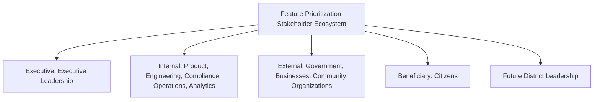

---

# Feature Prioritization Lifecycle

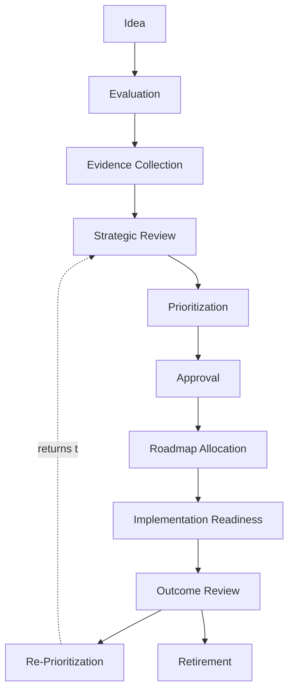

| Stage | Meaning | Exit Criterion |
|---|---|---|
| **Idea** | A genuine opportunity is raised by any accountable stakeholder, naming its intended citizen benefit. | A named proposer and a stated Strategic Objective link exist. |
| **Evaluation** | The idea is assessed for genuine need, feasibility, and rough risk tier. | A preliminary Problem Identification and Citizen Need statement exist. |
| **Evidence Collection** | Evidence for the initiative's Citizen Need and Business Value is gathered, per `ai-docs/81`'s Responsible Analytics Strategy. | Evidence meets the Evidence Sufficiency standard below. |
| **Strategic Review** | The initiative is checked against `ai-docs/48`'s Strategic Themes and `ai-docs/50`'s Strategic Objectives. | A traceable alignment link is confirmed or the initiative is returned. |
| **Prioritization** | The initiative is weighed against the Priority Decision Framework below. | A recorded priority tier and sequencing rationale exist. |
| **Approval** | The tier-appropriate Decision Authority approves, defers, or rejects. | A recorded decision exists, per `ai-docs/84`'s Decision Authority Matrix. |
| **Roadmap Allocation** | The approved initiative is sequenced into a genuine roadmap commitment. | The initiative appears in `ai-docs/48`'s Operational Plan or Technology Roadmap. |
| **Implementation Readiness** | The initiative is confirmed ready to proceed to its own owning delivery process. | Dependencies and capacity are confirmed, per `ai-docs/36`'s Capacity Forecast. |
| **Outcome Review** | The initiative's real effect is honestly measured against its stated Citizen Need. | An Outcome Review record exists, positive or negative. |
| **Re-Prioritization** | The initiative's continued priority is reassessed in light of the Outcome Review. | A renewed priority tier or a Retirement decision is recorded. |
| **Retirement** | The initiative's priority claim is formally withdrawn — never left ambiguous. | Retirement is logged; the initiative's ID is archived, never reused. |

---

# Value Creation

| Question | Answer |
|---|---|
| **How does prioritization create value?** | By ensuring every unit of Arwal's finite engineering, financial, and organizational capacity is spent on what genuinely matters most to the district it serves, rather than on whatever was easiest or loudest. |
| **How do citizens benefit?** | By trusting that the next thing Arwal builds was chosen because it serves a genuine, evidenced need — never an internal convenience dressed up as a roadmap item. |
| **How does government benefit?** | By seeing civic-service improvements sequenced according to a transparent, jointly-reviewed rationale, per `ai-docs/63-government-partnership-strategy.md`, strengthening confidence in the partnership's durability. |
| **How do businesses benefit?** | By experiencing a platform whose evolution is predictable and fair — the same evidentiary standard applied to every merchant, provider, and vertical, regardless of size or tenure. |
| **How do product teams benefit?** | By having a clear, defensible basis for every roadmap decision, reducing the ambiguity and internal politics that otherwise consume a team's energy. |
| **How does prioritization strengthen trust?** | Every transparently reasoned, evidence-based priority decision compounds into the same Trust Value Chain already established in `ai-docs/79-trust-safety-framework.md`, at the layer that shapes everything the platform will ever become. |
| **How does prioritization support district transformation?** | A district transforms only as fast as Arwal correctly chooses what to build next — prioritization is the mechanism that keeps that choice aligned with the district's actual, not merely its loudest, need. |

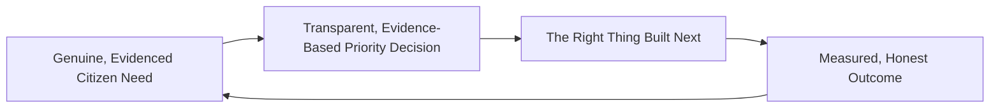

---

# Business Model

Every capability below is described strategically — its business rationale, never a scoring mechanic. The enforceable mechanics behind each capability remain owned by their respective governing document already established elsewhere in this handbook.

| Capability | Business Rationale |
|---|---|
| **Portfolio Prioritization** | Standing, cross-vertical sequencing discipline drawing on `ai-docs/38-engineering-portfolio-program-management-standards.md`'s Quarterly Portfolio Rebalancing, never duplicating its mechanics. |
| **Product Prioritization** | The stage-by-stage discipline determining which product, per `ai-docs/54-product-module-catalog.md`, advances toward Planning next. |
| **Feature Prioritization** | A lighter-weight variant of this same discipline scoped to a feature within an already-approved product, never a separate framework. |
| **Innovation Prioritization** | A deliberately proportionate review path for genuinely exploratory, reversible initiatives, mirroring `ai-docs/48`'s Innovation & Exploration allocation. |
| **Compliance Prioritization** | Regulatory and government-mandated obligations bypass discretionary ranking, per `ai-docs/38`'s Compliance & Regulatory allocation band's own rule. |
| **Risk-Based Prioritization** | An initiative's Risk Classification, per `ai-docs/30-engineering-risk-management-standards.md`, directly informs its urgency — a High or Critical risk-mitigating initiative is never left to compete purely on citizen-value appeal alone. |
| **Citizen Value Prioritization** | The primary lens through which every initiative is weighed, per Citizen Value First above. |
| **Marketplace Prioritization** | Sequencing decisions affecting Commerce, Food, Grocery, or Property, drawing on `ai-docs/65-marketplace-strategy.md`'s Marketplace Health Score. |
| **AI Prioritization** | Every AI-assisted initiative additionally passes through `ai-docs/78-ai-product-strategy.md`'s AI Council review before its priority is finalized. |
| **Infrastructure Prioritization** | Shared, cross-vertical infrastructure (Identity, Payments, Search, Notifications) is prioritized against its platform-wide fan-in, per `ai-docs/55-business-capability-map.md`'s Capability Heat Map. |
| **Cross-Module Prioritization** | Initiatives strengthening Cross-Vertical Adoption Depth, per `ai-docs/50`, are weighted for their structural, compounding value. |
| **Strategic Investment Prioritization** | The highest-tier synthesis feeding `ai-docs/48`'s Strategic Investment Governance directly. |

```mermaid
graph TD
    BizModel[Feature Prioritization Business Model] --> PortPrior[Portfolio Prioritization]
    BizModel --> ProdPrior[Product Prioritization]
    BizModel --> FeatPrior[Feature Prioritization]
    BizModel --> InnovPrior[Innovation Prioritization]
    BizModel --> CompliancePrior[Compliance Prioritization]
    BizModel --> RiskPrior[Risk-Based Prioritization]
    BizModel --> CitizenPrior[Citizen Value Prioritization]
    BizModel --> MarketPrior[Marketplace Prioritization]
    BizModel --> AIPrior[AI Prioritization]
    BizModel --> InfraPrior[Infrastructure Prioritization]
    BizModel --> CrossModPrior[Cross-Module Prioritization]
    BizModel --> StratInvestPrior[Strategic Investment Prioritization]
```

---

# Priority Decision Framework

Per Evidence Before Investment above, every initiative reaching the Prioritization stage is evaluated across four qualitative dimensions — never reduced to a single numeric score, which would invite exactly the false precision this framework rejects.

| Dimension | Guiding Question |
|---|---|
| **Citizen Impact** | How many citizens, and how severely, are affected by the problem this initiative addresses — and does that population include the district's most vulnerable segments? |
| **Strategic Fit** | Does this initiative advance a named Strategic Objective (`ai-docs/50`) or Strategic Theme (`ai-docs/48`), or does it stand apart from Arwal's stated direction? |
| **Risk & Reversibility** | What is this initiative's Risk Classification, per `ai-docs/30`, and how reversible is the decision to proceed with it? |
| **Sustainability Fit** | Does this initiative strengthen or strain Arwal's Cost Structure and Unit Economics, per `ai-docs/62-revenue-sustainability-strategy.md`, over a multi-year horizon? |

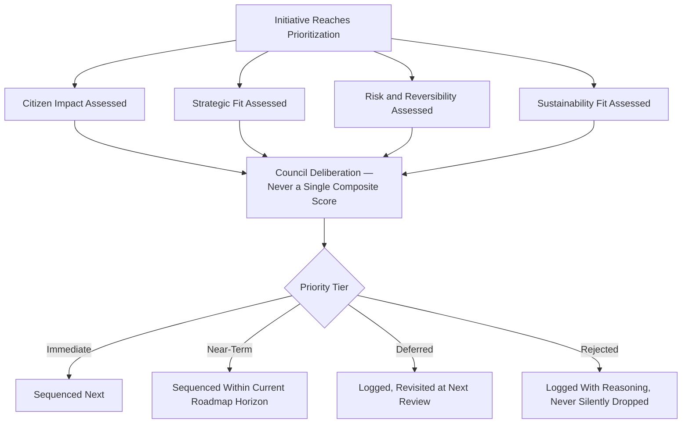

> **Callout — Why This Framework Deliberately Rejects a Single Composite Score**
> A single number produced by weighting and summing the four dimensions above invites exactly the false precision `ai-docs/83-business-intelligence-framework.md`'s Responsible Interpretation principle already warns against — two initiatives with identical scores can carry entirely different real-world consequences. The Priority Decision Framework requires a Council to weigh all four dimensions together, in context, and record its reasoning in prose — never to let an arithmetic shortcut substitute for genuine judgment.

### Evidence Sufficiency Standard

Evidence supporting a priority decision is accepted only if it is contemporaneous, attributable, and traceable to its source, mirroring the identical Evidence Quality Bar already established in `ai-docs/40-engineering-compliance-audit-standards.md` — a claim of citizen need unsupported by analytics, a government consultation, or a documented field observation is treated as absent, not merely weak.

### Strategic Investment Matrix

Every approved initiative is additionally classified across two axes, giving the Council a shared vocabulary for portfolio-level balance discussions, per `ai-docs/38`'s Balancing Strategic Capacity.

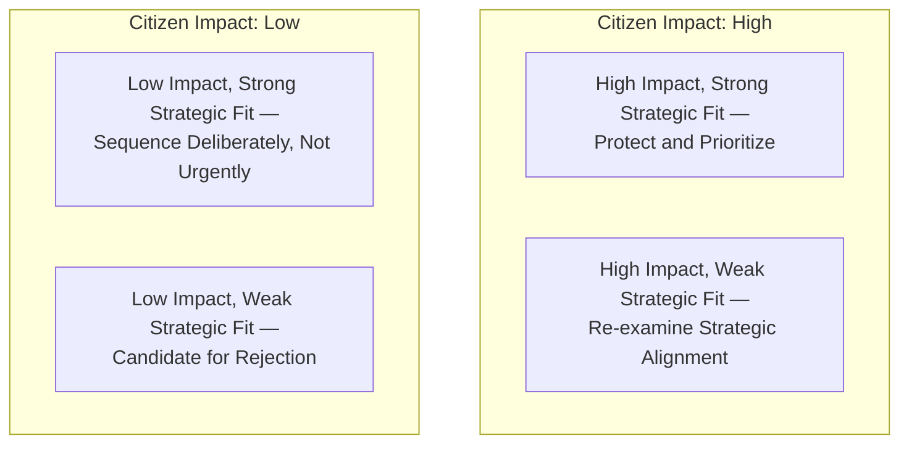

---

# Responsible Prioritization Strategy

| Mechanism | Strategic Role |
|---|---|
| **Evidence-Based Decisions** | Every priority decision cites its Citizen Need and Business Value evidence explicitly, per `ai-docs/81-product-analytics-strategy.md`. |
| **Governance Integration** | Every priority decision passes through the Decision Authority Matrix already established in `ai-docs/84-product-governance.md` — never an informal, unreviewed judgment. |
| **Privacy Protection** | Any evidence drawn from citizen behavior is already governed by RULE-003's Consent Requirement — prioritization never becomes a backdoor around consent discipline. |
| **Accessibility** | Every prioritized initiative's citizen-impact assessment explicitly considers rural, low-literacy, and assisted-access populations, per `ai-docs/12-accessibility-standards.md`'s non-negotiable floor — never only the digitally fluent, urban segment most likely to generate visible demand. |
| **Responsible AI Considerations** | Any AI-assisted initiative is additionally reviewed against RULE-024's Automation Boundary before its priority is finalized, per `ai-docs/78-ai-product-strategy.md`. |
| **Cross-Functional Reviews** | No consequential priority decision proceeds on Product's judgment alone — Engineering, Trust & Safety, Compliance, and Government Partnerships are heard first. |
| **Risk-Based Decision Making** | An initiative's Risk Classification, per `ai-docs/30`, is weighed alongside its citizen value, never considered only after approval. |
| **Citizen Trust** | Every mechanism above compounds into one felt, if invisible, outcome: a citizen who can trust that what Arwal builds next was chosen to serve them. |
| **Government Coordination** | Any priority decision touching a civic commitment is reviewed jointly with the relevant department, never unilaterally by Arwal alone. |
| **Continuous Improvement** | Every Outcome Review and Re-Prioritization finding feeds a shared, tracked improvement backlog, per `ai-docs/85-product-lifecycle-management.md`'s Continuous Improvement discipline. |

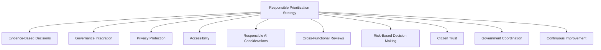

> **Callout — A Deferral Is Not a Rejection, and a Rejection Is Never Silent**
> Per Transparency above, an initiative that does not currently warrant priority is logged as Deferred, with the specific evidence gap or strategic misalignment that would need to change for reconsideration — never simply dropped from view. A Rejected initiative carries the same standard: its reasoning is recorded and remains citable, so a proposer is never left to wonder whether their proposal was genuinely considered.

---

# Economic & Social Impact

| Impact Area | How Feature Prioritization Contributes |
|---|---|
| **Improve Product Quality** | Deliberate, evidence-gated selection prevents investment in a feature that was never going to serve a genuine need, protecting engineering capacity for what does. |
| **Increase Public Value** | Public Benefit Over Popularity ensures the district's underserved majority is not structurally deprioritized in favor of a vocal minority's convenience requests. |
| **Improve Government Collaboration** | A transparent, jointly-reviewed prioritization rationale gives a department genuine confidence that civic commitments are sequenced deliberately, not as an afterthought. |
| **Reduce Waste** | Evidence-gated Prioritization prevents capacity from being spent on an initiative that a rigorous Evidence Collection stage would have shown was never going to matter. |
| **Support Businesses** | Merchants, providers, and farmers experience a platform whose evolution is fair and explainable, never arbitrary or favor-driven. |
| **Improve Citizen Outcomes** | Citizens depend on a platform that visibly, provably improves in the direction of their actual need. |
| **Strengthen District Development** | A prioritization discipline mature enough to be handed to a second district accelerates every development area already named in `ai-docs/64-district-ecosystem-mapping.md`'s District Development Strategy. |

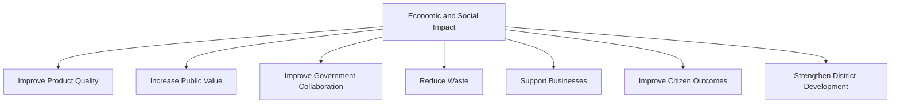

---

# Governance

### Feature Prioritization Council
A standing **Feature Prioritization Council** — chaired by the CPO, with the CSO, CTO, Chief Trust & Safety Officer, Compliance Officer, Head of Government Partnerships, Head of Accessibility & Inclusion, and rotating vertical Council chairs as members — holds approval authority over any cross-vertical or platform-wide priority decision, any Immediate-tier classification, and any material deviation from the Anti-Patterns below. The Council meets monthly, with ad hoc sessions for a Mission Critical or civic-deadline-bound initiative. A vertical-specific, routine priority decision is delegated to that vertical's own Council, per `ai-docs/84-product-governance.md`'s Decision Authority Matrix, never duplicated here.

### Ownership
Every prioritized initiative has exactly one named accountable proposer through Evaluation, transferring to a named Business Owner upon Approval, mirroring the identical dual-ownership discipline already established in `ai-docs/54-product-module-catalog.md` and `ai-docs/85-product-lifecycle-management.md`.

### Decision Authority

| Decision | Approval Authority |
|---|---|
| Platform-wide or cross-vertical priority decision | Feature Prioritization Council + CPO |
| Vertical-specific priority decision | The vertical's own Council, per `ai-docs/84`'s Decision Authority Matrix |
| Compliance-mandated priority (bypasses discretionary ranking) | Compliance Officer, informing the Council |
| AI-assisted initiative priority | Feature Prioritization Council + AI Council (`ai-docs/78`) jointly |
| Emergency re-prioritization (e.g., a Critical risk finding) | CPO, immediate, ratified by Council within 5 business days |

### Priority Review Cadence

| Review | Cadence | Owner |
|---|---|---|
| Priority Health Review | Monthly | Feature Prioritization Council |
| Portfolio Balance Review | Quarterly | Feature Prioritization Council, vertical Council chairs |
| Annual Prioritization Strategy Review | Annual | CEO, CPO, CSO, Board |

### Escalation Model
A priority disagreement between two vertical Councils, or an ambiguous strategic-fit question, escalates first to direct discussion between the accountable owners, then to the Feature Prioritization Council, then to CEO/CTO/CPO jointly, mirroring the identical Escalation Model already established in `ai-docs/84-product-governance.md` — never left unresolved indefinitely.

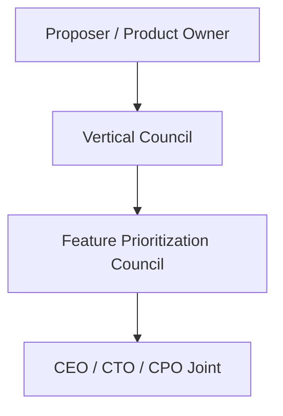

### Continuous Improvement
Every Outcome Review and every escalation outcome feeds a shared, tracked improvement backlog, reviewed at the next Priority Health Review, per the identical Continuous Improvement Loop already established throughout `ai-docs/60` through `ai-docs/85`.

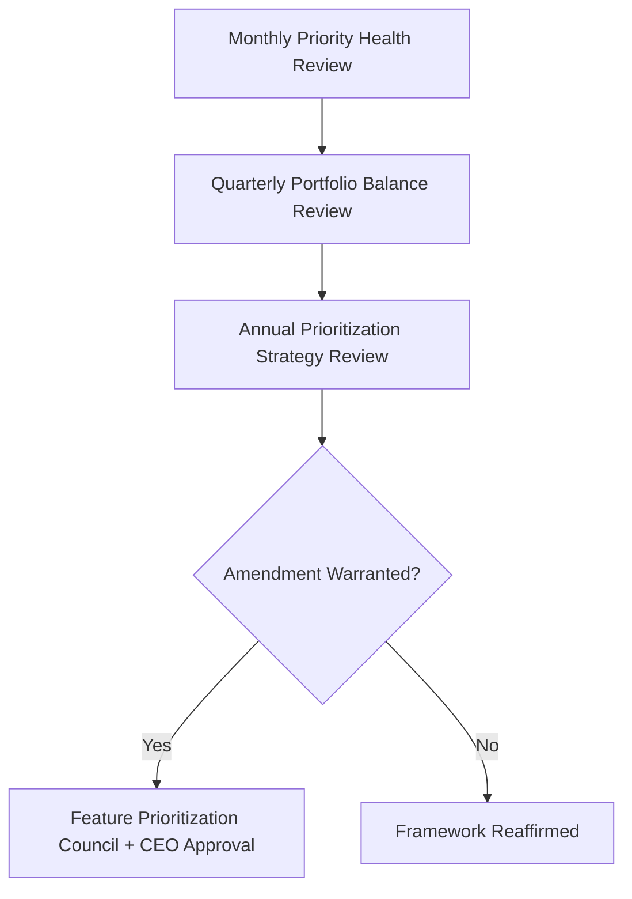

---

# Risks

| Risk | Description | Mitigation |
|---|---|---|
| **Feature Creep** | A prioritized initiative's scope quietly expands beyond its original, evidenced justification. | Roadmap Allocation ties an initiative to its stated Citizen Need; any scope change requires a fresh Strategic Review. |
| **Priority Inflation** | Every proposal is labeled "urgent" until the label becomes meaningless. | The Priority Decision Framework's four-dimension deliberation structurally prevents a single-word urgency claim from substituting for evidence. |
| **Political Influence** | A well-connected internal or external stakeholder secures priority without genuine evidence. | Cross-Functional Reviews and mandatory Evidence Sufficiency standard; Council deliberation recorded and auditable. |
| **Short-Term Thinking** | An initiative chosen for immediate visibility at the cost of long-term platform coherence. | Sustainability Fit dimension; Long-Term Sustainability principle above. |
| **Weak Evidence** | A priority decision proceeds on assumption rather than genuine data. | Evidence Sufficiency Standard; Evidence Collection stage cannot be skipped. |
| **Resource Conflicts** | Two prioritized initiatives compete for the same scarce engineering or field-operations capacity. | Portfolio Balance Review; capacity checked against `ai-docs/36`'s Capacity Forecast before Roadmap Allocation. |
| **Innovation Bias** | A technically novel initiative is prioritized because it is exciting, not because it is needed. | Citizen Impact dimension weighted equally with Strategic Fit; Innovation Prioritization's proportionate review path. |
| **Trust Erosion** | A visible pattern of prioritizing commercial convenience over civic need damages citizen confidence. | Public Benefit Over Popularity principle; Transparency in every deferral and rejection. |
| **Regulatory Change** | A shift in applicable law changes what must be prioritized immediately. | Compliance Prioritization's bypass-discretionary-ranking rule, reviewed continuously per `ai-docs/40-engineering-compliance-audit-standards.md`. |

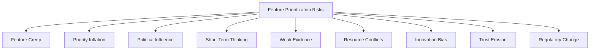

---

# Metrics

| Metric | Definition | Direction |
|---|---|---|
| **Priority Accuracy** | % of prioritized initiatives whose Outcome Review confirmed the citizen need was genuinely as significant as assessed. | Increasing |
| **Strategic Alignment Rate** | % of prioritized initiatives with a traceable link to a current Strategic Objective or Theme. | Increasing toward 100% |
| **Citizen Value Index** | Cross-referenced from `ai-docs/61-value-proposition-framework.md`, applied here to track whether prioritized initiatives, in aggregate, moved this index. | Increasing |
| **Portfolio Balance Index** | The degree to which prioritized capacity is distributed proportionately across Feature Delivery, Platform Investment, Innovation, Technical Debt, Reliability, and Compliance, per `ai-docs/38`'s allocation bands. | Balanced, never concentrated |
| **Investment Effectiveness** | The rate at which a prioritized initiative's actual outcome matched its projected Business Value at Approval. | Increasing |
| **Prioritization Governance Compliance** | % of priority decisions passing through their correct tier of Decision Authority before execution. | Increasing toward 100% |
| **Decision Consistency** | The rate at which comparable initiatives, evaluated at different times, received comparable priority treatment. | Increasing |
| **Innovation Success Rate** | % of Innovation-tier initiatives that generalize into a standing, adopted capability, per `ai-docs/39-engineering-operational-excellence-continuous-improvement-standards.md`'s Continuous Improvement Process. | Monitored for genuine rigor, never maximized artificially |

> **Callout — No Prioritization Metric Stands Alone**
> Per the North Star Principle already established in `ai-docs/00-project-vision.md`, a rising Investment Effectiveness alongside a falling Citizen Value Index, or a rising Innovation Success Rate alongside a falling Portfolio Balance Index, is treated as a regression — never counted as success in isolation.

---

# Anti-Patterns

| Anti-Pattern | Why It's Rejected |
|---|---|
| **Building the Loudest Request** | Prioritizing by volume of demand rather than verified need violates Public Benefit Over Popularity. |
| **Executive Opinion Without Evidence** | A senior voice's confidence substituting for the Evidence Sufficiency Standard violates Evidence Before Investment. |
| **Everything Is High Priority** | A priority label applied universally has ceased to mean anything, violating the Priority Decision Framework's entire purpose. |
| **Innovation for Publicity** | An initiative pursued because it is technically impressive or newsworthy, absent genuine Citizen Impact, violates Responsible Innovation. |
| **Ignoring Accessibility** | A citizen-impact assessment that only reflects a digitally fluent, urban population has measured a fraction of the district, violating Accessibility. |
| **Ignoring Citizen Outcomes** | Advancing an initiative through Approval while its Outcome Review evidence contradicts its original justification violates Citizen Value First. |
| **Ignoring Strategic Alignment** | An initiative pursued with no traceable link to a Strategic Objective is scope creep the moment it enters the roadmap. |
| **Roadmaps Driven by Politics** | A well-connected internal team or external partner securing priority through influence rather than evidence violates Governance Before Delivery and Political Influence's mitigation. |

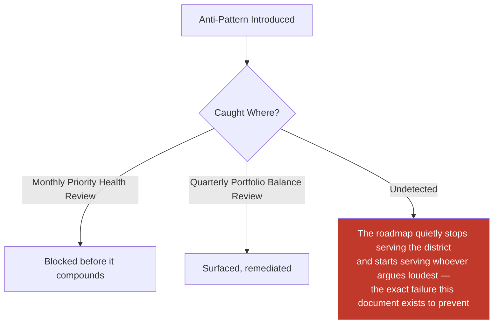

---

# Relationship to Previous Documents

| Prior Document | Relationship |
|---|---|
| **Project Vision (`ai-docs/00`)** | Establishes the founding North Star Principle this document's every priority decision is measured against. |
| **Product Vision & Business Strategy (`ai-docs/50`)** | Supplies the Strategic Objectives every prioritized initiative traces back to. |
| **Business Domain Model (`ai-docs/53`)** | Supplies the ownership structure this document's Business Owners are drawn from. |
| **Product Module Catalog (`ai-docs/54`)** | Supplies the user-visible product surfaces this document's Product and Feature Prioritization capabilities operate on. |
| **Business Capability Map (`ai-docs/55`)** | Supplies the Capability Heat Map this document's Infrastructure Prioritization cites directly. |
| **Business Rules & Policies (`ai-docs/58`)** | Supplies RULE-003's Consent Requirement and RULE-024's AI Automation Boundary this document's Responsible Prioritization Strategy is bound by. |
| **Customer Experience Strategy (`ai-docs/60`)** | Supplies the felt-experience bar every prioritized initiative's outcome is ultimately measured against. |
| **Revenue & Sustainability Strategy (`ai-docs/62`)** | Supplies the Sustainability Fit dimension and Cost Structure this document's Priority Decision Framework weighs. |
| **District Ecosystem Mapping (`ai-docs/64`)** | Supplies the District Development Strategy this document's Economic & Social Impact section reinforces. |
| **Marketplace Strategy (`ai-docs/65`)** | Supplies the Marketplace Health Score this document's Marketplace Prioritization capability cites. |
| **Agriculture, Healthcare, Education, Employment Business Models (`ai-docs/68`–`ai-docs/71`)** | Supply their own vertical Councils, whose delegated priority authority this document's Governance section formally recognizes. |
| **Payments & Financial Services Strategy (`ai-docs/74`)** | Supplies the absolute guarantees (RULE-018) this document's prioritization can never override. |
| **AI Product Strategy (`ai-docs/78`)** | Supplies the AI Council and RULE-024's boundary this document's AI Prioritization capability inherits without alteration. |
| **Trust & Safety Framework (`ai-docs/79`)** | Supplies the Trust Value Chain this document's Trust Preservation principle is anchored in. |
| **Product Analytics Strategy (`ai-docs/81`)** | Supplies the evidentiary discipline this document's Evidence Before Investment principle is built on. |
| **Product KPI Framework (`ai-docs/82`)** | Supplies the standing indicators this document's Metrics section extends for prioritization-specific tracking. |
| **Business Intelligence Framework (`ai-docs/83`)** | Supplies the cross-domain synthesis this document's Strategic Review stage consumes before a platform-wide priority decision. |
| **Product Governance (`ai-docs/84`)** | Supplies the Decision Authority Matrix, Council structure, and Escalation Model this document's Governance section is built directly on top of, never duplicated. |
| **Product Lifecycle Management (`ai-docs/85`)** | Supplies the Idea-through-Retirement stage model this document's Feature Prioritization Lifecycle extends specifically to the "what gets built next" decision within it. |

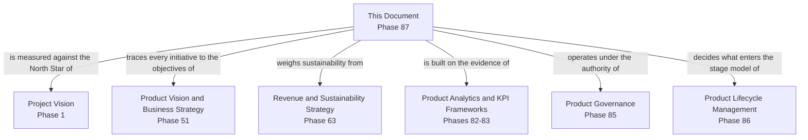

---

# Executive Artifacts

### Feature Prioritization Framework

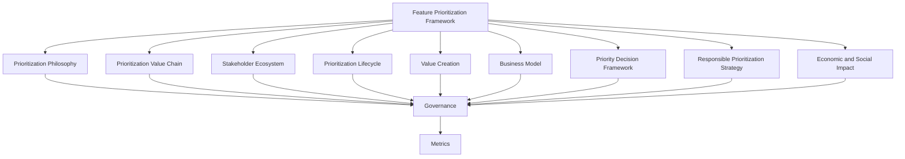

### Prioritization Value Chain

See Feature Prioritization Value Chain section above — reproduced here by reference per Single Source of Truth, never duplicated.

### Prioritization Lifecycle

See Feature Prioritization Lifecycle section above.

### Priority Decision Framework

See Priority Decision Framework section above.

### Prioritization Governance Model

See Governance section above.

### Strategic Investment Matrix

See Strategic Investment Matrix diagram above.

### Priority Review Workflow

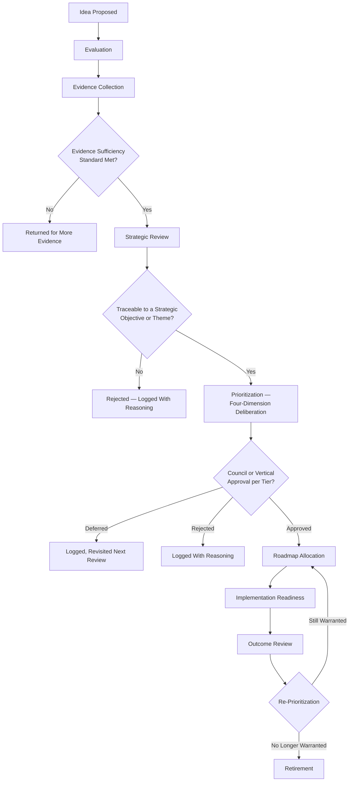

### Cross-Reference Table

| Governing Document | What This Framework Consumes From It |
|---|---|
| `ai-docs/48-engineering-strategic-planning-standards.md` | Strategic Themes, Roadmap Levels, Strategic Investment Governance |
| `ai-docs/30-engineering-risk-management-standards.md` | Risk Classification, Risk Assessment Framework |
| `ai-docs/36-engineering-capacity-planning-resource-management-standards.md` | Capacity Forecasting |
| `ai-docs/38-engineering-portfolio-program-management-standards.md` | Allocation Bands, Quarterly Portfolio Rebalancing |
| `ai-docs/62-revenue-sustainability-strategy.md` | Cost Structure, Unit Economics |
| `ai-docs/78-ai-product-strategy.md` | AI Council, RULE-024 Automation Boundary |
| `ai-docs/81-product-analytics-strategy.md` | Evidence discipline, Responsible Analytics Strategy |
| `ai-docs/82-product-kpi-framework.md` | Balanced Scorecard Model, standing KPIs |
| `ai-docs/83-business-intelligence-framework.md` | Cross-domain synthesis |
| `ai-docs/84-product-governance.md` | Decision Authority Matrix, Escalation Model |
| `ai-docs/85-product-lifecycle-management.md` | Stage model, Launch Readiness, Retirement Checklist |

### Executive Dashboards (Conceptual)

| Dashboard | Audience | Key Content |
|---|---|---|
| **CEO / Board Dashboard** | CEO, Board | Portfolio Balance Index, Citizen Value Index, Platform-Defining priority log |
| **CPO Dashboard** | CPO | Priority Accuracy, Strategic Alignment Rate, Decision Consistency |
| **Vertical Council Dashboards** | Council Chairs | Own-vertical priority queue, Deferred and Rejected log with reasoning |
| **Government Partners Dashboard** | Government liaisons | Civic-commitment sequencing status, jointly reviewed priority rationale |

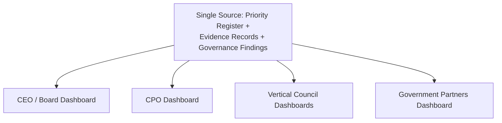

### Decision Matrix

| Decision Type | Approval Authority |
|---|---|
| Platform-wide or cross-vertical priority decision | Feature Prioritization Council + CPO |
| Vertical-specific priority decision | The vertical's own Council |
| Compliance-mandated priority | Compliance Officer, informing the Council |
| AI-assisted initiative priority | Feature Prioritization Council + AI Council (jointly) |
| Emergency re-prioritization | CPO, ratified within 5 business days |

---

# Closing Statement

> **Callout — Closing Statement**
> Every prior document in this handbook explains what Arwal builds, how it decides, and how a product lives and eventually retires. This document explains the choice that precedes all of that: when a district's needs outnumber the capacity to serve them at once — which is every day, for every platform this ambitious — what gets built next, and why. A roadmap chosen by volume of complaint, by internal seniority, or by whichever idea happens to be newest is not a strategy; it is a coin flip wearing the appearance of judgment. Feature prioritization at Arwal exists to make sure that coin is never flipped — that every "yes, now" and every "not yet" can be explained, defended, and traced back to genuine evidence of what the district actually needs, weighed openly against what Arwal can actually sustain. A citizen will never see this framework directly. They will only ever see its result: whether the thing Arwal built next was the thing that mattered most to them. Where a future phase must deviate from a principle stated here, that deviation is made explicitly — through the Feature Prioritization Council's approval process above — never silently, and never by default.

This document, `ai-docs/86-feature-prioritization-framework.md`, is Phase 87 of approximately 415. Every future evaluation, sequencing, deferral, and rejection decision is expected to trace back to a principle defined here, or to justify its deviation in writing.

**End of Phase 87 — `ai-docs/86-feature-prioritization-framework.md`**