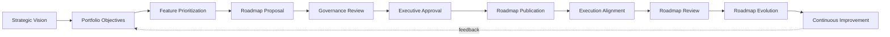
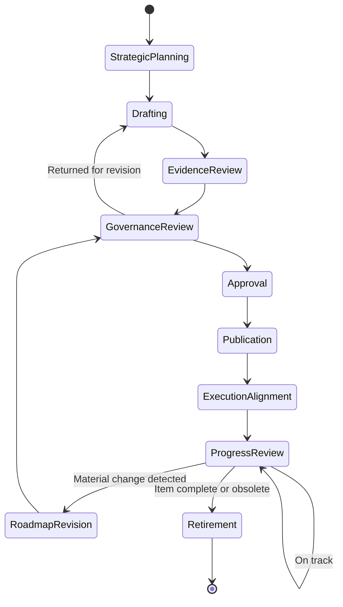
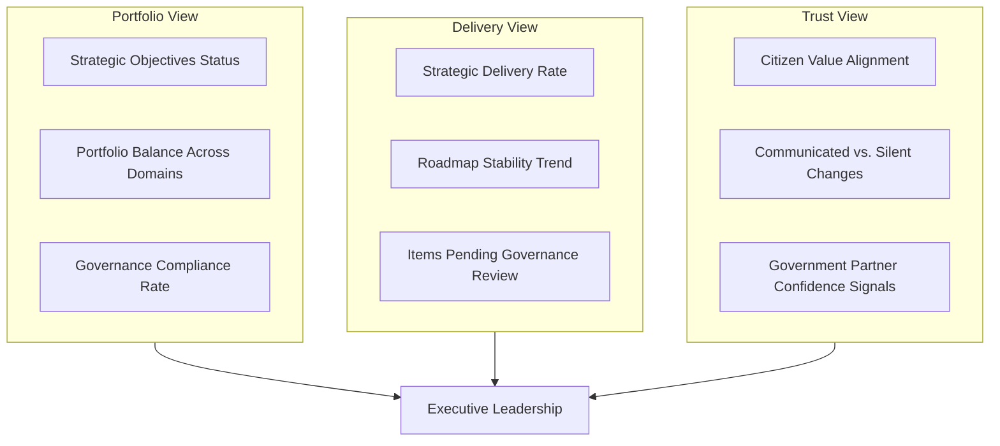

# Product Roadmap Governance
### Arwal — The District Super App
**Document ID:** ARWAL-GOV-087
**Stage:** 2 — Governance & Strategic Alignment
**Phase:** 88
**Status:** Approved Standard
**Owner:** Chief Product Officer, in coordination with Chief Executive Officer and Chief Strategy Officer
**Classification:** Executive / Governance — Binding

---

## 1. Purpose & Scope

This document establishes how Arwal governs its strategic product roadmaps — the mechanisms by which long-term vision is translated into sequenced investment, cross-functional alignment, and accountable execution across a multi-district civic platform.

This document is **not** a scheduling tool, a sprint plan, a release calendar, or a project management methodology. It does not define Jira workflows, Gantt charts, or Agile ceremonies — those are engineering-execution concerns addressed elsewhere in the handbook. This document governs the **strategic layer above execution**: how Arwal decides what belongs on a roadmap, who approves it, how it evolves, and how it remains accountable to citizens, government partners, and institutional stakeholders over the life of the platform.

> **Why this exists:** Arwal is civic infrastructure, not a conventional product. A roadmap decision here does not just affect a backlog — it affects whether a farmer receives a promised payment feature on time, whether a district government can plan around a compliance capability, and whether public trust in the platform is preserved or eroded. Roadmap governance exists to make sure strategic commitments are made deliberately, evidenced, and honored responsibly — or changed transparently when they must be.

### Relationship to Prior Phases

This document builds directly on, and does not restate:

- **Project Vision** — the founding "why" that all roadmap decisions must trace back to
- **Product Vision & Business Strategy** — the strategic destination roadmaps sequence toward
- **Business Domain Model** and **Product Module Catalog** — the structural inventory roadmaps allocate investment across
- **Business Capability Map** — the capability-level view roadmap governance uses to detect gaps and overlaps
- **Business Rules & Policies** — constraints roadmap decisions must respect
- **Customer Experience Strategy** — the citizen-outcome lens roadmap prioritization applies
- **Revenue & Sustainability Strategy** — the financial sustainability constraints roadmaps operate within
- **District Ecosystem Mapping** — the multi-stakeholder map roadmap governance coordinates across
- **Marketplace, Agriculture, Healthcare, Education, Employment & Jobs, and Payments & Financial Services Business Models** — domain-specific roadmaps that this document's governance model applies uniformly to
- **AI Product Strategy** — the responsible-AI lens applied to any AI-related roadmap item
- **Trust & Safety Framework** — the non-negotiable constraints no roadmap may compromise
- **Product Analytics Strategy, Product KPI Framework, Business Intelligence Framework** — the evidence base roadmap decisions must draw on
- **Product Governance, Product Lifecycle Management, Feature Prioritization Framework** — the adjacent governance layers this document sits alongside and references rather than duplicates

Where this document references decision authority, escalation, or review cadence, it defers to the **Engineering Governance** and **Architecture Governance (ARB)** documents from Stage 1 for structural precedent, while establishing product-specific governance bodies where none yet exist.

---

## 2. Why Roadmap Governance Is a Strategic Capability

A roadmap is not a list of features in order. For Arwal, a roadmap is the primary instrument by which:

- **Strategy becomes commitment.** Vision statements do not deliver services to citizens — sequenced, resourced, governed roadmaps do.
- **Public trust becomes measurable.** Government partners and citizens judge Arwal not by its stated mission but by whether promised capabilities materialize on a credible, honestly communicated timeline.
- **Multi-district expansion becomes coordinated rather than chaotic.** Without governed roadmaps, each district negotiation risks producing conflicting, uncoordinated commitments that fragment the platform.
- **Cross-functional teams synchronize.** Engineering, compliance, operations, and government-relations functions all depend on a single governed roadmap as their shared source of truth for sequencing.

> **Principle:** A roadmap that is not governed is not a roadmap — it is a wish list with a false appearance of authority. Governance is what gives a roadmap its legitimacy.

### Stakeholder Relationships Roadmap Governance Serves

| Stakeholder | Relationship to Roadmap Governance |
|---|---|
| Citizens | Ultimate beneficiaries; roadmap sequencing must reflect their evidenced needs, not internal convenience |
| Government Departments | Depend on roadmap commitments for policy planning, budget cycles, and regulatory coordination |
| Businesses & Merchants | Plan their own operations around platform capability timelines (e.g., payments, marketplace features) |
| Farmers | Depend on agriculture-domain roadmap items for seasonal-critical capabilities |
| Healthcare Providers | Require predictable roadmap sequencing for clinical and safety-critical features |
| Educational Institutions | Plan academic-year rollouts around education-domain roadmap commitments |
| Community Organizations | Provide grounded feedback that roadmap governance must evidence-check and incorporate |
| Executive Leadership | Own final roadmap approval and strategic trade-off authority |
| Product Leadership | Own roadmap construction, evidence assembly, and stakeholder facilitation |
| Engineering Leadership | Own feasibility assessment and execution-capacity input |
| Operations & Compliance | Validate operational and regulatory readiness before roadmap commitments are published |
| Future District Administrations | Inherit and extend existing roadmap governance rather than renegotiating it from scratch |

---

## 3. Roadmap Governance Philosophy

These principles are binding on every roadmap decision, regardless of domain or district.

### 3.1 Citizen Value First
Every roadmap item must trace to a citizen, government, or public-value outcome. Internal convenience, technical curiosity, or competitive imitation are insufficient justification on their own.

### 3.2 Strategy Before Schedule
A roadmap sequences strategic intent. It is not a schedule generated from available capacity. Capacity informs pacing; strategy determines priority.

### 3.3 Roadmaps Are Living Documents
A roadmap reflects current best understanding, not a permanent contract. It **is** expected to change as evidence, context, and constraints evolve — but changes must be governed and communicated, not silent.

### 3.4 Evidence-Based Planning
Roadmap items are justified with evidence — usage data, government requirements, citizen feedback, market analysis — not solely executive intuition or internal advocacy.

### 3.5 Transparency
Roadmap status, rationale, and changes are documented and available to relevant stakeholders at an appropriate level of detail. Silent reprioritization is a governance failure.

### 3.6 Cross-Functional Alignment
No roadmap is valid until product, engineering, compliance, and operations perspectives have each been incorporated into its formation.

### 3.7 Responsible Innovation
New capability, particularly AI-driven capability, is roadmapped only after passing the Trust & Safety and AI Product Strategy review gates — innovation velocity never overrides responsible deployment.

### 3.8 Governance Before Commitment
No roadmap item is publicly or contractually committed (to government partners, businesses, or citizens) before passing governance review. Premature commitment is one of the most damaging anti-patterns this document exists to prevent.

### 3.9 Risk Awareness
Roadmap governance explicitly surfaces and documents risk — political, technical, regulatory, financial — rather than assuming it away.

### 3.10 Long-Term Sustainability
Roadmap decisions weigh long-term platform and financial sustainability (see Revenue & Sustainability Strategy) against short-term stakeholder pressure.

### 3.11 Institutional Learning
Every roadmap cycle produces documented lessons that inform the next cycle. Roadmap governance is expected to improve itself over time.

### 3.12 Trust Preservation
When trade-offs must be made, preserving citizen and government trust takes precedence over preserving a previously stated timeline. Honest schedule change is preferred over quietly missed commitments.

---

## 4. Roadmap Value Chain

| Stage | Description | Primary Owner |
|---|---|---|
| Strategic Vision | Long-term direction set by executive leadership | CEO / CSO |
| Portfolio Objectives | Translation of vision into portfolio-level goals across domains | CPO |
| Feature Prioritization | Application of the Feature Prioritization Framework to candidate items | Product Leadership |
| Roadmap Proposal | Draft roadmap assembled with evidence and cross-functional input | Product Leadership |
| Governance Review | Structured review against this document's criteria | Roadmap Governance Council |
| Executive Approval | Formal sign-off on scope, sequencing, and trade-offs | Executive Leadership |
| Roadmap Publication | Roadmap made available at appropriate detail to each stakeholder tier | Product Leadership |
| Execution Alignment | Engineering and operations translate roadmap into execution plans | Engineering Leadership |
| Roadmap Review | Scheduled reassessment against evidence and progress | Roadmap Governance Council |
| Roadmap Evolution | Governed revision in response to new evidence or constraints | Roadmap Governance Council + Executive Leadership |
| Continuous Improvement | Institutional learning fed back into the next cycle | CPO |

---

## 5. Roadmap Lifecycle

| Phase | Description |
|---|---|
| Strategic Planning | Executive leadership sets or reaffirms strategic direction and portfolio objectives |
| Roadmap Drafting | Product leadership assembles candidate items using the Feature Prioritization Framework |
| Evidence Review | Analytics, KPI, and BI teams validate the evidentiary basis of proposed items |
| Governance Review | The Roadmap Governance Council assesses alignment, risk, feasibility, and compliance |
| Approval | Executive Leadership formally approves scope and sequencing |
| Publication | Roadmap is published at stakeholder-appropriate detail |
| Execution Alignment | Engineering leadership translates approved items into execution-ready plans |
| Progress Review | Scheduled cadence review of delivery against roadmap commitments |
| Roadmap Revision | Governed change process triggered by evidence, risk, or constraint shifts |
| Retirement | Items are formally closed out — delivered, superseded, or deliberately abandoned — with documented rationale |

> **Rationale:** A defined lifecycle exists because informal roadmap management — where items are added, dropped, or reprioritized without traceable process — is the single most common cause of roadmap governance failure in large public-facing platforms.

---

## 6. Stakeholder Ecosystem & Responsibilities

| Stakeholder | Responsibility |
|---|---|
| Executive Leadership | Set strategic direction; approve roadmaps; own final trade-off authority; own trust-preservation decisions |
| Product Leadership | Draft roadmaps; facilitate cross-functional input; maintain the Feature Prioritization Framework; own roadmap communication |
| Engineering Leadership | Assess feasibility; provide capacity and technical-risk input; own execution alignment |
| Government Partners | Provide regulatory and policy input; receive appropriately scoped roadmap visibility; validate compliance-relevant items |
| Businesses & Merchants | Provide market and operational feedback; receive roadmap visibility relevant to commerce-facing capability |
| Citizens | Provide usage evidence and feedback via product analytics and community channels |
| Community Organizations | Represent grassroots and underserved-population perspectives in roadmap evidence review |
| Compliance Teams | Validate regulatory readiness of roadmap items before governance approval |
| Operations | Validate operational readiness and capacity before commitments are published |
| Analytics Teams | Supply the evidentiary basis — usage, KPI, BI data — that grounds roadmap prioritization |
| Future District Leadership | Inherit governed roadmap structures; propose district-specific extensions through the same governance process rather than parallel processes |

---

## 7. Value Creation

| Beneficiary | How Roadmap Governance Creates Value |
|---|---|
| Citizens | Receive capabilities sequenced by evidenced need rather than internal politics; benefit from honest communication when timelines shift |
| Government | Gains a predictable, evidence-based partner whose commitments can be planned around |
| Businesses | Can plan operational and financial decisions around credible platform timelines |
| Product Teams | Operate against a clear, defensible mandate rather than ad hoc pressure |
| Institutional Trust | Strengthened by transparency and by governance discipline that prevents overpromising |
| District Transformation | Supported by a governance model that scales consistently as new districts join, rather than requiring reinvention each time |

---

## 8. Business Model — Roadmap Categories

Arwal governs the following distinct but interrelated roadmap types under a single governance model:

| Roadmap Type | Purpose |
|---|---|
| Portfolio Roadmap | Top-level view across all domains and strategic investment areas |
| Product Roadmap | Domain-specific roadmaps (Healthcare, Payments, Marketplace, etc.) |
| Platform Roadmap | Shared infrastructure and platform-capability sequencing |
| Innovation Roadmap | Exploratory and emerging-capability items, including AI, subject to heightened governance |
| Compliance Roadmap | Regulatory and legal-obligation-driven items with externally imposed timelines |
| Infrastructure Roadmap | Underlying technical infrastructure evolution supporting product roadmaps |
| AI Roadmap | AI-specific capability sequencing, governed jointly with the AI Product Strategy and Trust & Safety Framework |
| Citizen Experience Roadmap | Cross-domain experience improvements not owned by a single product vertical |
| District Expansion Roadmap | Sequencing of new-district onboarding and localization |
| Strategic Investment Roadmap | Major, executive-sponsored initiatives requiring dedicated investment cases |
| Cross-Module Roadmap | Items spanning multiple domains that require coordinated sequencing |
| Long-Term Vision Roadmap | Multi-year directional roadmap reviewed at lower frequency, anchoring shorter-term roadmaps |

> **Rationale:** Naming these categories explicitly prevents the common failure mode where all roadmap items are treated identically regardless of their governance weight — a compliance-mandated item and an experimental AI feature carry very different risk profiles and must be governed accordingly.

---

## 9. Responsible Roadmap Strategy

| Principle | Application |
|---|---|
| Evidence-Based Planning | No roadmap item advances past drafting without documented evidentiary basis |
| Governance Integration | Roadmap governance operates in coordination with, not parallel to, Product Governance and Architecture Governance |
| Risk-Based Planning | Higher-risk items (AI, payments, healthcare) receive proportionally deeper review |
| Privacy Protection | Roadmap items are screened against privacy implications before approval |
| Accessibility | Roadmap prioritization accounts for accessibility impact, not just majority-use-case value |
| Responsible AI Considerations | AI-related roadmap items require sign-off referencing the AI Product Strategy and Trust & Safety Framework |
| Cross-Functional Reviews | No roadmap is approved on product judgment alone |
| Citizen Trust | Roadmap communication is calibrated to preserve trust even when timelines change |
| Government Coordination | Compliance- and policy-relevant items are cross-checked with government partners before external commitment |
| Continuous Improvement | Each governance cycle's lessons are documented and incorporated |

---

## 10. Economic & Social Impact

Roadmap governance contributes measurably to:

- **Improved product quality** — by preventing under-evidenced, reactive feature additions
- **Increased public value** — by keeping citizen outcomes as the primary prioritization lens
- **Improved government collaboration** — by making Arwal a predictable, accountable partner
- **Reduced strategic waste** — by preventing investment in items that do not survive evidence review
- **Support for businesses** — through predictable platform-capability timelines
- **Improved citizen outcomes** — through evidence-driven sequencing of high-impact capabilities
- **Strengthened district development** — through a governance model that scales without requiring renegotiation per district

---

## 11. Governance Structure

### 11.1 Roadmap Governance Council

A standing cross-functional body responsible for reviewing roadmap proposals and revisions before executive approval.

**Composition (RACI for Roadmap Governance Review):**

| Role | Responsibility |
|---|---|
| Chief Product Officer (Chair) | Accountable for council output and quality of review |
| Chief Strategy Officer | Consulted on strategic alignment |
| Engineering Leadership Representative | Responsible for feasibility assessment |
| Compliance Representative | Responsible for regulatory-readiness assessment |
| Operations Representative | Responsible for operational-readiness assessment |
| Analytics/BI Representative | Responsible for evidence validation |
| Trust & Safety Representative | Responsible for risk and responsible-AI review where applicable |
| Executive Leadership (CEO) | Informed; holds final approval authority outside the council |

### 11.2 Ownership & Decision Authority

| Decision | Authority |
|---|---|
| Portfolio-level strategic direction | Executive Leadership |
| Roadmap item drafting and sequencing proposal | Product Leadership |
| Feasibility and technical-risk assessment | Engineering Leadership |
| Governance review and recommendation | Roadmap Governance Council |
| Final roadmap approval | Executive Leadership |
| Emergency/expedited roadmap change | CEO + CPO joint authority, retroactively reviewed by the Council |

### 11.3 Roadmap Review Cadence

| Roadmap Type | Review Frequency |
|---|---|
| Long-Term Vision Roadmap | Annually |
| Portfolio Roadmap | Quarterly |
| Product / Platform / Domain Roadmaps | Quarterly, with monthly progress checkpoints |
| Compliance Roadmap | As regulatory timelines require, minimum quarterly |
| Innovation / AI Roadmap | Monthly, given elevated risk profile |

### 11.4 Roadmap Change Management

All roadmap changes are classified and handled as follows:

| Change Type | Process |
|---|---|
| Minor sequencing adjustment within approved scope | Product Leadership approval, logged |
| Material scope or timeline change | Full Governance Review cycle required |
| Addition of a new strategic investment item | Full lifecycle from Strategic Planning stage |
| Emergency change (regulatory, security, safety-driven) | Expedited joint CEO/CPO approval, retroactive Council review within one cycle |

### 11.5 Escalation Model

Disagreements unresolved at the Roadmap Governance Council level escalate to Executive Leadership. Disagreements involving trust, safety, or regulatory risk escalate directly to the Trust & Safety Strategist and Compliance leadership in parallel, regardless of council status.

### 11.6 Continuous Improvement

Each roadmap cycle concludes with a documented retrospective covering: forecast accuracy, evidence quality, governance friction points, and stakeholder communication effectiveness. Findings feed the next Strategic Planning stage.

---

## 12. Risks & Mitigation

| Risk | Description | Mitigation |
|---|---|---|
| Roadmap Drift | Gradual, ungoverned deviation from approved scope | Mandatory change classification and logging (Section 11.4) |
| Overcommitment | Promising more than capacity or evidence supports | Engineering feasibility sign-off required before approval |
| Changing Priorities | Legitimate strategic shifts destabilizing execution | Governed revision process rather than ad hoc reprioritization |
| Political Influence | External pressure overriding evidence-based prioritization | Council review requires documented evidence for all items regardless of sponsor |
| Weak Governance | Review reduced to a formality | Council composition and RACI enforced; retrospectives audit review quality |
| Unvalidated Assumptions | Items proceeding on unverified belief rather than evidence | Evidence Review stage is a mandatory lifecycle gate |
| Resource Constraints | Roadmap exceeding realistic capacity | Portfolio Objectives stage explicitly balances scope against known capacity |
| Trust Erosion | Missed commitments communicated poorly or late | Trust Preservation principle mandates proactive, transparent communication |
| Regulatory Change | External legal shifts invalidating prior roadmap assumptions | Compliance representation is permanent, not consultative-only, on the Council |

---

## 13. Metrics Framework

| Metric | Definition |
|---|---|
| Roadmap Alignment Index | Proportion of active roadmap items traceable to documented strategic objectives |
| Roadmap Stability | Frequency and magnitude of material changes per review cycle |
| Roadmap Adaptability | Time from new evidence/constraint emergence to governed roadmap response |
| Strategic Delivery Rate | Proportion of approved roadmap items delivered within governed timeline tolerance |
| Portfolio Balance | Distribution of investment across domains relative to strategic objectives |
| Governance Compliance | Proportion of roadmap items that passed through full governance review prior to commitment |
| Decision Traceability | Proportion of roadmap decisions with retrievable rationale and evidence records |
| Citizen Value Alignment | Proportion of roadmap items with documented citizen-outcome justification |

---

## 14. Anti-Patterns

| Anti-Pattern | Why It Is Harmful |
|---|---|
| Roadmaps as Promises | Treating roadmap items as binding contracts rather than governed intent invites either overcommitment or trust-damaging breakage |
| Roadmaps Driven by Politics | Prioritization by sponsor influence rather than evidence undermines the Citizen Value First principle |
| Roadmaps Without Evidence | Items advancing on assumption rather than data waste investment and erode credibility |
| Static Roadmaps | A roadmap that never changes despite changing evidence is not being governed — it is being ignored |
| Ignoring Citizen Feedback | Excluding grassroots and community input produces roadmaps disconnected from actual need |
| Ignoring Strategic Alignment | Items pursued for local team interest without portfolio-level justification fragment the platform |
| Everything Is Urgent | Absence of genuine prioritization discipline collapses the roadmap into an unsequenced list |
| Planning Without Governance | Drafting roadmaps outside this document's lifecycle produces shadow roadmaps that undermine institutional trust |

---

## 15. Executive Roadmap Dashboard (Conceptual)

> This dashboard is conceptual and technology-independent; its implementation is a Business Intelligence Framework concern, not specified here.

---

## 16. Roadmap Decision Matrix

| Factor | Weight in Governance Review |
|---|---|
| Citizen/Public Value Evidence | High |
| Strategic Alignment | High |
| Regulatory/Compliance Necessity | High (mandatory where applicable) |
| Technical Feasibility | High |
| Financial Sustainability Impact | Medium-High |
| Cross-Domain Dependency Complexity | Medium |
| Innovation/Responsible-AI Risk | Weighted by risk tier |
| Operational Readiness | Medium |
| Stakeholder Sponsor Influence | Explicitly excluded as a standalone factor |

---

## 17. Roadmap Maturity Model

| Level | Characteristics |
|---|---|
| Level 1 — Ad Hoc | Roadmap items proposed and pursued without consistent governance |
| Level 2 — Documented | Items are logged and loosely reviewed, but evidence and governance gates are inconsistent |
| Level 3 — Governed | Full lifecycle applied consistently; Council review is substantive, not procedural |
| Level 4 — Evidence-Optimized | Governance decisions are consistently traceable to strong evidence and measurable outcomes |
| Level 5 — Adaptive Institution | Roadmap governance itself evolves systematically based on retrospective learning across districts and cycles |

Arwal's target maturity level at multi-district scale is **Level 4**, with **Level 5** as the long-term institutional goal.

---

## 18. Engineering Review Checklist

Before any roadmap item is published or committed externally, confirm:

- [ ] Item traces to a documented citizen, government, or business-value outcome
- [ ] Item is supported by evidence from Analytics/KPI/BI sources
- [ ] Item has passed Engineering feasibility assessment
- [ ] Item has passed Compliance review where regulatory relevance exists
- [ ] Item has passed Operations readiness assessment
- [ ] AI-related items have passed Trust & Safety and AI Product Strategy review
- [ ] Item has been reviewed by the Roadmap Governance Council
- [ ] Item has received Executive Leadership approval
- [ ] Item's rationale, evidence, and decision record are documented and traceable
- [ ] Communication plan for the item (including risk of change) has been defined
- [ ] Item is correctly classified by roadmap type (Section 8)
- [ ] Review cadence for the item's roadmap type is scheduled (Section 11.3)

---

*This document is the authoritative Product Roadmap Governance standard for the Arwal platform. It carries binding authority from the date of approval and governs all current and future roadmap activity across all districts, domains, and product areas until formally superseded.*