# Product Success Measurement

**Document:** `ai-docs/88-product-success-measurement.md`
**Project:** Arwal — The District Super App
**Stage:** 2 — Product & Business Strategy
**Phase:** 89 — Product Success Measurement
**Status:** Approved for Product & Engineering Reference
**Audience:** CEO, CSO, CPO, Enterprise Business Architects, Product Strategy Consultants, Business Intelligence Consultants, Product Analytics Consultants, Government Digital Transformation Advisors, Performance Management Consultants, Trust & Safety Strategists, Organizational Design Specialists, Investors

> **Callout — Purpose of This Document**
> `ai-docs/00-project-vision.md` through `ai-docs/87-product-roadmap-governance.md` established why Arwal exists, what it can do, who it serves, how it sustains itself, how it partners with government, the whole district ecosystem it operates inside, how every vertical creates and protects value, how evidence becomes analytics, KPIs, and business intelligence, and how governance decides what gets built and when. None of those documents answers the question every one of them ultimately depends on being answered honestly: **once something ships, how does Arwal know — genuinely, not merely optimistically — whether it actually succeeded?** This document is that answer — the authoritative Product Success Measurement framework every future evaluation of a product, capability, or strategic initiative traces back to.

---

# Purpose of this Document

### Why Success Measurement Is a Distinct Capability From Analytics, KPIs, and Business Intelligence

`ai-docs/81-product-analytics-strategy.md` established how Arwal observes citizen behavior responsibly. `ai-docs/82-product-kpi-framework.md` established which of those observations are elevated into standing, governed indicators. `ai-docs/83-business-intelligence-framework.md` established how those indicators are synthesized into strategic evidence. Each of those documents is infrastructure — the plumbing that makes evidence available. None of them answers a distinct, closing question: **for this specific product, this specific capability, this specific strategic bet — did it work?** Product Success Measurement is where that verdict is rendered — deliberately, on a defined cadence, against criteria set *before* the answer was known, never reverse-engineered afterward to flatter whatever happened to occur.

### This Is Not a Dashboard, an OKR System, or an Experimentation Guide

This document contains no dashboard wireframe, no OKR-setting ritual, no A/B-testing statistical methodology, no analytics-tool configuration, and no reporting-software specification. It does not redefine Product Analytics Strategy (`ai-docs/81`), the Product KPI Framework (`ai-docs/82`), Business Intelligence (`ai-docs/83`), Product Governance (`ai-docs/84`), Product Lifecycle Management (`ai-docs/85`), Feature Prioritization (`ai-docs/86`), or Roadmap Governance (`ai-docs/87`) — each remains fully authoritative and is cited, never restated. This document's exclusive territory is: **why success measurement is a strategic capability in its own right, what a genuine verdict of success requires, who is accountable for rendering it honestly, and how that discipline is governed and protected across a generation of district service.**

### Why Success Measurement Is a Strategic Capability, Not a Retrospective Ritual

A platform that ships and moves on without asking whether it succeeded is a platform optimizing for output, never outcome — exactly the failure `ai-docs/85-product-lifecycle-management.md`'s Lifecycle Before Delivery principle already exists to prevent one layer earlier. Success Measurement is the mechanism that closes the loop `ai-docs/86-feature-prioritization-framework.md`'s Priority Decision Framework and `ai-docs/87-product-roadmap-governance.md`'s Roadmap Value Chain both leave open: a decision was made, evidence justified it, capacity was spent — and now, honestly, was the district actually better off?

### How Success Measurement Supports Continuous Improvement

Per the Continuous Improvement discipline already established throughout `ai-docs/60` through `ai-docs/87`, an organization only improves what it is willing to measure honestly, including its own failures. Success Measurement gives every prior document's Continuous Improvement Loop its actual raw material — not a vague sense that "things are going well," but a specific, evidenced verdict that can be acted on.

### How Evidence Improves Strategic Decision-Making

Per `ai-docs/83-business-intelligence-framework.md`'s Evidence Before Opinion principle, a strategic claim is only as strong as the evidence behind it. Success Measurement is where that discipline becomes retrospective as well as prospective — every future roadmap decision, prioritization call, and governance review is made stronger by a growing, honest body of "here is what actually happened last time," never merely "here is what we hoped would happen this time."

### How Success Measurement Enables Responsible Multi-District Growth

Per `ai-docs/50-product-vision-business-strategy.md`'s Strategic Expansion Principles, a second district inherits Arwal's *proven judgment*, never its unverified assumptions. A founding district that never rigorously asked whether its own initiatives succeeded has nothing genuinely evidenced to replicate — only a hopeful narrative. Success Measurement is what converts the founding district's experience into a defensible, transferable body of institutional knowledge.

### Relationship Between Every Participant

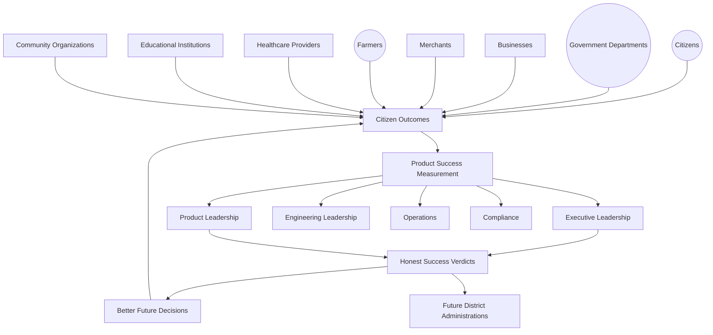

### Scope Boundary

This document does not calculate a metric, does not specify a data pipeline, and does not design a scorecard's visual layout — those remain the domain of `ai-docs/81` through `ai-docs/83`. Its territory is strategic: the philosophy, the value chain, the stakeholder accountability, and the governance that make every verdict of "this succeeded" or "this did not" honest, evidenced, and genuinely useful to the district Arwal exists to serve.

---

# Product Success Philosophy

Every principle below exists because a success-measurement discipline assembled carelessly does not fail abstractly — it fails by declaring victory over a number that made a citizen's life no better, or by quietly burying a failure that a citizen is still living with.

### Citizen Outcomes Before Vanity Metrics
**Why it exists:** A success verdict is judged first against whether a citizen, merchant, farmer, or government partner is genuinely better off, never against an activity count or a metric that merely looks impressive, mirroring the identical Citizen-First tie-breaker already established throughout `ai-docs/51` through `ai-docs/87`. Registrations, screen views, and session counts are outputs; a citizen's certificate arriving faster is an outcome — only the latter is eligible to be called success.

### Mission Alignment
**Why it exists:** Every success criterion traces to a Strategic Objective already established in `ai-docs/50-product-vision-business-strategy.md` — a criterion invented because it is easy to measure, rather than because it reflects genuine mission progress, is measurement theater, not governance.

### Evidence-Based Evaluation
**Why it exists:** A success verdict is rendered from `ai-docs/81`'s Analytics and `ai-docs/82`'s KPIs, cross-checked through `ai-docs/83`'s Business Intelligence synthesis — never from a confident narrative or a single enthusiastic anecdote, mirroring the identical Evidence Before Opinion principle already established in `ai-docs/83-business-intelligence-framework.md`.

### Long-Term Value Creation
**Why it exists:** Success Measurement is evaluated on the same generational horizon as every other strategic document in this handbook — a verdict of success reached this quarter, at the cost of the next decade's trust or sustainability, is not success; it is a deferred failure, per `ai-docs/62-revenue-sustainability-strategy.md`'s Long-Term Sustainability principle.

### Transparency
**Why it exists:** A success verdict reached behind closed doors, with no visible evidence trail, asks every stakeholder affected by the underlying initiative to simply accept the conclusion. Every verdict states its evidence, its criteria, and its accountable reviewer openly.

### Cross-Functional Accountability
**Why it exists:** No single function — Product alone, Engineering alone, Marketing alone — is positioned to honestly judge whether an initiative it built or championed actually succeeded. Success Measurement forces Trust & Safety, Compliance, Government Partnerships, and Analytics into the same room before a verdict is finalized, never leaving the interested party to grade its own work.

### Continuous Learning
**Why it exists:** A verdict — including "this failed" — is retained permanently as an asset for the next decision, never discarded once rendered, mirroring the Documentation Before Tribal Knowledge principle already established in `ai-docs/24-documentation-standards.md`.

### Responsible Innovation
**Why it exists:** An exploratory or AI-assisted initiative earns continued or expanded investment only after its success is genuinely evidenced, mirroring `ai-docs/78-ai-product-strategy.md`'s Trust Before Automation principle, applied here to every initiative's own graduation decision.

### Governance Integration
**Why it exists:** A success verdict is never rendered outside the Decision Authority Matrix already established in `ai-docs/84-product-governance.md` — a verdict with real consequence (continued funding, expanded scope, retirement) is a governed decision like any other, never an informal team judgment.

### Trust Preservation
**Why it exists:** A citizen's trust in Arwal depends partly on believing the platform is honest with itself about what is and is not working — a pattern of declaring premature or inflated success spends that trust exactly as surely as a fraud incident does, per `ai-docs/79-trust-safety-framework.md`'s Shared Trust dependency.

### Institutional Memory
**Why it exists:** Arwal's roadmap spans roughly 415 phases and a multi-decade horizon — a success verdict rendered once and forgotten is a lesson the organization will have to relearn, at real cost, when a similar initiative is proposed again years later.

### Public Value
**Why it exists:** Arwal is public-purpose private infrastructure, per `ai-docs/00-project-vision.md` — a success verdict is ultimately answerable to the district it serves, not only to Arwal's own internal stakeholders, and is written so that a government partner or a citizen advocate could, in principle, read and understand it.

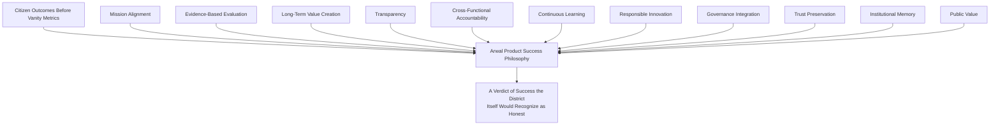

> **Callout — The One-Sentence Product Success Philosophy**
> *"If Arwal cannot show its work — the criteria set in advance, the evidence gathered honestly, and the verdict reached even when it was inconvenient — it has not measured success. It has merely announced it."*

---

# Success Measurement Value Chain

| Stage | Business Description |
|---|---|
| **Strategic Vision** | The genuine, board-level ambition already established in `ai-docs/50-product-vision-business-strategy.md` that gives any initiative its reason to exist. |
| **Expected Outcomes** | The specific, plain-language statement of what "this worked" would actually look like — written before launch, never reconstructed after the fact. |
| **Success Criteria** | Expected Outcomes converted into specific, evidenced, reviewable criteria, entered into the initiative's record at Planning, per `ai-docs/85-product-lifecycle-management.md`'s Required Fields discipline. |
| **Evidence Collection** | Proportionate, consented observation per `ai-docs/81-product-analytics-strategy.md`'s Responsible Analytics Strategy, gathered against the stated criteria — never gathered opportunistically to support a predetermined conclusion. |
| **Performance Analysis** | The evidence is examined for genuine pattern, trend, and confounding factor — the same rigor already established in `ai-docs/83-business-intelligence-framework.md`'s Insight Generation stage. |
| **Business Intelligence Review** | Where the initiative spans multiple domains, the analysis is synthesized cross-functionally, per `ai-docs/83`'s Business Intelligence Value Chain, never assessed by one vertical's own narrow lens. |
| **Governance Review** | The synthesized verdict is reviewed by the Product Success Council (below), at the tier its stakes warrant, per `ai-docs/84-product-governance.md`'s Decision Authority Matrix. |
| **Strategic Decision** | An accountable leader or governance body decides what the verdict requires — continuation, expansion, correction, or retirement. |
| **Improvement Planning** | A genuine follow-on action is defined, traceable to the verdict that produced it. |
| **Continuous Learning** | The verdict, its evidence, and its consequence are retained permanently, informing the next Strategic Vision cycle. |

---

# Success Measurement Lifecycle

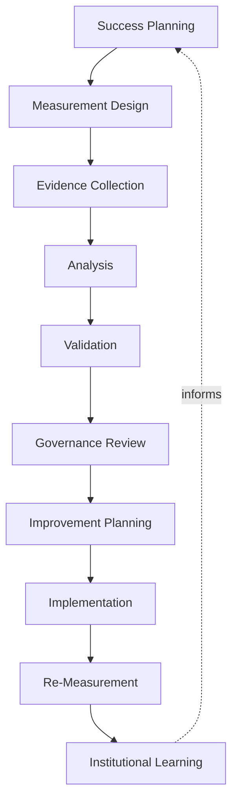

| Stage | Meaning | Exit Criterion |
|---|---|---|
| **Success Planning** | Success Criteria are defined and recorded before the initiative launches, never retrofitted afterward. | Criteria are traceable to a Strategic Objective and recorded at Planning, per `ai-docs/85`. |
| **Measurement Design** | The specific evidence sources, cadence, and counterbalancing signal (per `ai-docs/82`'s Balanced Scorecard Model) are chosen. | A measurement plan exists, reviewed for proportionality and consent. |
| **Evidence Collection** | Observation proceeds per `ai-docs/81`'s Responsible Analytics Strategy. | Data collection is live, consented, and proportionate. |
| **Analysis** | The evidence is examined honestly for what it actually shows, including a null or negative result. | An analysis record exists, never selectively reported. |
| **Validation** | The analysis is checked for bias, confounding, and completeness before it is trusted. | A named reviewer independent of the initiative's own team confirms the analysis. |
| **Governance Review** | The validated verdict is reviewed by the Product Success Council at its appropriate tier. | A recorded governance decision exists. |
| **Improvement Planning** | A specific, owned follow-on action is defined. | The action is traceable to the verdict, with a named owner and date. |
| **Implementation** | The follow-on action is executed through its own owning process. | The change is live or the decision is enacted. |
| **Re-Measurement** | The initiative's success is reassessed after the follow-on action, closing the loop honestly. | A fresh verdict confirms whether the correction worked. |
| **Institutional Learning** | The full cycle — criteria, evidence, verdict, action, outcome — is archived permanently. | A citable, permanent record exists, per the Archive Never Delete principle already established throughout this handbook. |

---

# Value Creation

| Question | Answer |
|---|---|
| **How does success measurement create value?** | By ensuring every unit of Arwal's investment is followed by an honest verdict, converting hope into evidence and evidence into better future decisions. |
| **How do citizens benefit?** | By trusting that a capability which does not genuinely serve them will eventually be corrected or retired, never left running indefinitely because nobody checked. |
| **How does government benefit?** | By receiving an honest, evidenced account of whether a jointly pursued civic initiative delivered what was promised, strengthening the partnership's durability per `ai-docs/63-government-partnership-strategy.md`. |
| **How do businesses benefit?** | By experiencing a platform that genuinely learns from what worked and what did not, rather than repeating the same mistake across every vertical independently. |
| **How do product teams benefit?** | By having a clear, non-punitive, evidence-based process for learning whether their own initiative succeeded — protected from both false credit and unfair blame by the same Cross-Functional Accountability discipline. |
| **How does success measurement strengthen trust?** | Every honestly rendered verdict — including an uncomfortable one — compounds into the same Trust Value Chain already established in `ai-docs/79-trust-safety-framework.md`, because a citizen or partner can see Arwal correcting itself rather than only ever claiming victory. |
| **How does success measurement support district transformation?** | A district transforms only as fast as Arwal correctly learns which of its own initiatives genuinely worked — success measurement is the mechanism that keeps that learning honest rather than self-congratulatory. |

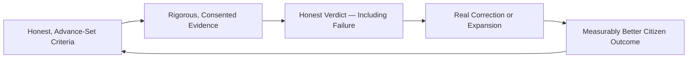

---

# Business Model

Every capability below is described strategically — its business rationale — never as a calculation. The enforceable metric definitions behind each capability remain owned by their originating governing document.

| Success Measurement Capability | Business Rationale |
|---|---|
| **Citizen Success Measurement** | Verdicts on whether a citizen-facing capability genuinely improved convenience, dignity, or access, per `ai-docs/60-customer-experience-strategy.md`'s Experience Metrics and `ai-docs/61-value-proposition-framework.md`'s Citizen Value Index. |
| **Government Success Measurement** | Verdicts on whether a civic-service initiative delivered its promised efficiency or access gain, jointly reviewed with the relevant department per `ai-docs/63-government-partnership-strategy.md`. |
| **Business Success Measurement** | Verdicts on whether a merchant, provider, or farmer-facing initiative delivered genuine income or operational improvement, per `ai-docs/67`, `ai-docs/68`, and `ai-docs/71`'s Economic Impact sections. |
| **Marketplace Success Measurement** | Verdicts on liquidity, fairness, and trust impact, drawing on `ai-docs/65-marketplace-strategy.md`'s Marketplace Health Score without redefining it. |
| **AI Success Measurement** | Verdicts on whether an AI-assisted feature genuinely improved task success while preserving human oversight, per `ai-docs/78-ai-product-strategy.md`'s AI Ecosystem Health, subject to elevated Council review. |
| **Platform Success Measurement** | Verdicts on shared, cross-vertical infrastructure (Identity, Payments, Search, Notifications), weighted by fan-in per `ai-docs/55-business-capability-map.md`'s Capability Heat Map. |
| **Financial Success Measurement** | Verdicts on whether a revenue or cost initiative genuinely strengthened sustainability without eroding fairness, per `ai-docs/62-revenue-sustainability-strategy.md`. |
| **Community Success Measurement** | Verdicts on genuine beneficiary reach and engagement, never a virality-optimized signal, per `ai-docs/75-community-social-engagement-strategy.md`. |
| **Operational Success Measurement** | Verdicts on whether an operational or reliability initiative genuinely improved platform stability and support responsiveness. |
| **Portfolio Success Measurement** | Aggregate verdicts across a Strategic Theme's full set of initiatives, feeding `ai-docs/48-engineering-strategic-planning-standards.md`'s Post-Strategy Reviews directly. |
| **Strategic Success Measurement** | The highest-tier, board-facing verdict on whether Arwal's founding mission is being realized, synthesizing every capability above. |

```mermaid
graph TD
    BizModel[Success Measurement Business Model] --> CitizenSucc[Citizen Success Measurement]
    BizModel --> GovSucc[Government Success Measurement]
    BizModel --> BizSucc[Business Success Measurement]
    BizModel --> MarketSucc[Marketplace Success Measurement]
    BizModel --> AISucc[AI Success Measurement]
    BizModel --> PlatSucc[Platform Success Measurement]
    BizModel --> FinSucc[Financial Success Measurement]
    BizModel --> CommSucc[Community Success Measurement]
    BizModel --> OpsSucc[Operational Success Measurement]
    BizModel --> PortSucc[Portfolio Success Measurement]
    BizModel --> StratSucc[Strategic Success Measurement]
```

---

# Responsible Success Strategy

| Mechanism | Strategic Role |
|---|---|
| **Evidence-Based Reviews** | Every verdict cites its Success Criteria and the specific evidence supporting or contradicting them, never a persuasive summary alone. |
| **Privacy Protection** | Evidence gathered for a success verdict draws only on data already governed by RULE-003's Consent Requirement and `ai-docs/81`'s Privacy by Design. |
| **Accessibility** | Every citizen-facing success verdict disaggregates its evidence by literacy, device, and geography, per `ai-docs/12-accessibility-standards.md`'s non-negotiable floor — an aggregate "success" concealing a rural or low-literacy shortfall is not accepted as success. |
| **Responsible AI Evaluation** | Any AI-assisted initiative's success verdict is additionally reviewed against RULE-024's Automation Boundary and `ai-docs/78`'s AI Council before being finalized. |
| **Cross-Functional Reviews** | No consequential verdict is rendered by the initiative's own team alone — Trust & Safety, Compliance, and, where relevant, Government Partnerships are heard first. |
| **Risk Awareness** | A verdict's downside risk — a false positive that extends a harmful initiative, a false negative that retires a genuinely useful one — is explicitly weighed, per `ai-docs/30-engineering-risk-management-standards.md`'s Risk Classification. |
| **Citizen Trust** | Every mechanism above compounds into one felt, if invisible, outcome: a citizen who can trust that what Arwal keeps building was genuinely proven to help them. |
| **Government Coordination** | A civic-adjacent success verdict is reviewed jointly with the relevant department before it is finalized or published. |
| **Continuous Improvement** | Every verdict's Improvement Planning stage feeds a shared, tracked backlog, reviewed at the next Success Health Review. |
| **Institutional Learning** | Every verdict — positive, negative, or inconclusive — is retained permanently and citable, never quietly discarded because it was inconvenient. |

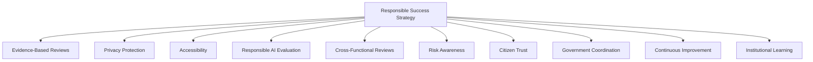

> **Callout — An Inconclusive Verdict Is Not a Failure to Report**
> Per Evidence-Based Reviews above, a verdict that the evidence is genuinely insufficient or ambiguous is recorded exactly as such — never forced into a false "success" or "failure" to satisfy a governance body's preference for a clean answer. An honest "we do not yet know" protects citizen trust far better than a confident conclusion the evidence does not actually support.

---

# Economic & Social Impact

| Impact Area | How Success Measurement Contributes |
|---|---|
| **Improve Product Quality** | Honest verdicts direct correction toward what genuinely underperforms, rather than allowing a flawed initiative to persist unexamined. |
| **Increase Public Value** | Citizen Outcomes Before Vanity Metrics ensures leadership attention stays anchored to genuine district benefit, not internally flattering numbers. |
| **Strengthen Government Collaboration** | Jointly reviewed civic verdicts give a department genuine, defensible evidence of Arwal's contribution, per `ai-docs/63-government-partnership-strategy.md`. |
| **Support Businesses** | Merchants, providers, and farmers benefit from a platform that demonstrably learns from and corrects what does not serve them. |
| **Improve Citizen Outcomes** | A citizen depends only on capabilities that have been honestly evaluated and, where necessary, improved. |
| **Improve Platform Sustainability** | Success Measurement protects `ai-docs/62-revenue-sustainability-strategy.md`'s Investment Priorities by directing continued investment toward what is genuinely working. |
| **Strengthen District Development** | A leadership team that honestly measures its own success is better positioned across every development area already named in `ai-docs/64-district-ecosystem-mapping.md`'s District Development Strategy. |

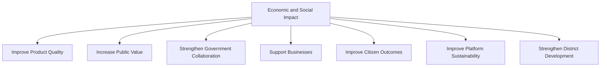

---

# Governance

### Product Success Council
A standing **Product Success Council** — chaired by the CPO, with the CEO, CSO, Chief Analytics Officer, Chief Trust & Safety Officer, Compliance Officer, Head of Government Partnerships, and rotating vertical Council chairs as members — holds approval authority over any Strategic-tier success verdict, any verdict recommending an initiative's retirement or major expansion, and any material deviation from the Anti-Patterns below. The Council meets monthly, with ad hoc sessions ahead of a Mission Critical initiative's scheduled Re-Measurement.

### Ownership
Every initiative's Success Criteria and eventual verdict are accountable to the same named Business Owner already established for the initiative itself, per `ai-docs/84-product-governance.md`'s Ownership Model — success measurement never introduces a second, competing accountability structure.

### Decision Authority

| Decision | Approval Authority |
|---|---|
| New Success Criteria at Planning | Business Owner + Product Success Council (informational) |
| Vertical-specific success verdict | The initiative's own vertical Council, per `ai-docs/84`'s Decision Authority Matrix |
| Cross-vertical or platform-wide success verdict | Product Success Council |
| Verdict recommending retirement or major expansion | Product Success Council + CPO, per `ai-docs/85`'s Retirement Checklist |
| Emergency success-integrity response (e.g., a discovered false-positive verdict already acted on) | Chief Analytics Officer, immediate, ratified by Council within 5 business days |

### Measurement Review Cadence

| Review | Cadence | Owner |
|---|---|---|
| Success Health Review | Monthly | Product Success Council |
| Initiative Re-Measurement | Per the initiative's own Review Milestone, per `ai-docs/48`'s Strategic Investment Governance | Business Owner |
| Portfolio Success Review | Quarterly | Product Success Council, vertical Council chairs |
| Annual Success Measurement Strategy Review | Annual | CEO, CPO, CSO, Board |

### Escalation Model
A disagreement over a verdict's validity — between an initiative's own team and an independent reviewer, or between two vertical Councils — escalates first to direct discussion, then to the Product Success Council, then to CEO/CPO/CSO jointly, mirroring the identical Escalation Model already established in `ai-docs/84-product-governance.md`. No disputed verdict is left unresolved indefinitely.

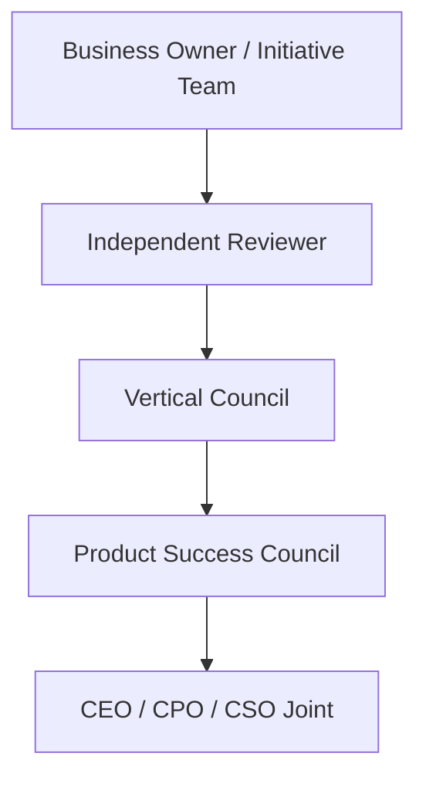

### Continuous Improvement
Every Institutional Learning record feeds a shared, tracked improvement backlog, reviewed at the next Success Health Review, per the identical Continuous Improvement Loop already established throughout `ai-docs/60` through `ai-docs/87`.

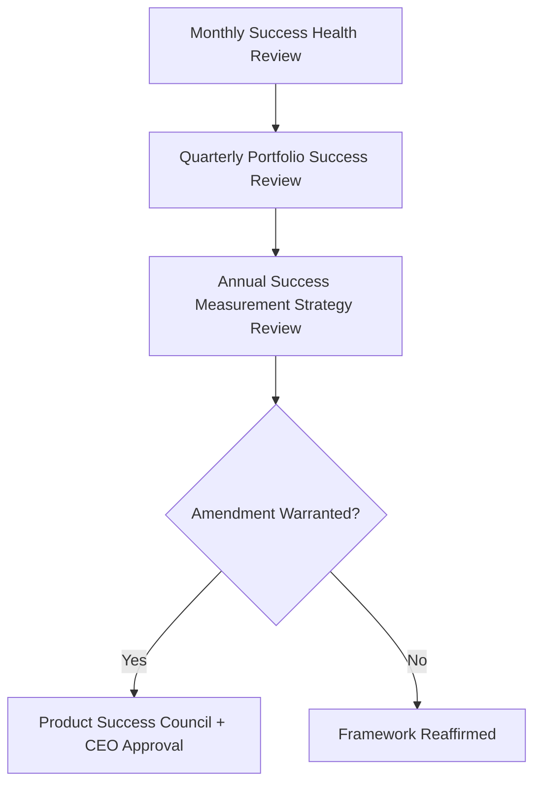

---

# Risks

| Risk | Description | Mitigation |
|---|---|---|
| **Vanity Metrics** | A verdict is anchored to an impressive-looking but non-outcome metric. | Citizen Outcomes Before Vanity Metrics principle; Mission Alignment traceability requirement. |
| **Biased Evaluation** | The initiative's own team renders its own success verdict without independent check. | Cross-Functional Accountability; mandatory Validation stage with an independent reviewer. |
| **Incomplete Evidence** | A verdict is rendered before sufficient evidence genuinely exists. | Evidence Sufficiency-equivalent discipline inherited from `ai-docs/40`'s Evidence Quality Bar; an inconclusive verdict is recorded honestly rather than forced. |
| **Ignoring Citizen Outcomes** | A verdict privileges internal or commercial metrics over genuine citizen benefit. | Citizen Outcomes Before Vanity Metrics; Accessibility's disaggregation requirement. |
| **Metric Manipulation** | An initiative's evidence collection is shaped to guarantee a favorable verdict. | Validation stage's independent review; Responsible Success Strategy's Evidence-Based Reviews. |
| **Short-Term Optimization** | A verdict favors an initiative's immediate performance over its long-term trust or sustainability effect. | Long-Term Value Creation principle; counterbalancing signal inherited from `ai-docs/82`'s Balanced Scorecard Model. |
| **Trust Erosion** | A citizen or partner discovers a declared "success" did not reflect genuine outcomes. | Transparency mechanism; honest, proactive communication of an unfavorable verdict. |
| **Regulatory Change** | A shift in applicable law invalidates an existing measurement assumption. | Configurable, Compliance-reviewed measurement practice per `ai-docs/01-product-goals.md`'s Regulatory Constraint. |

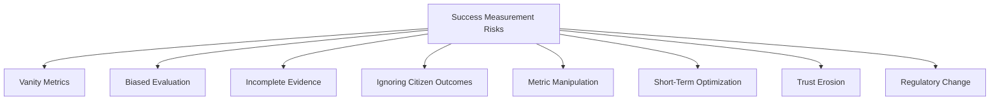

---

# Metrics

Metrics governing the Success Measurement discipline itself — a standing, self-referential practice mirroring `ai-docs/82-product-kpi-framework.md`'s treatment of KPIs-about-KPIs.

| Metric | Definition | Direction |
|---|---|---|
| **Citizen Value Index** | Cross-referenced from `ai-docs/61-value-proposition-framework.md`, applied here to track whether measured initiatives, in aggregate, genuinely moved this index. | Increasing |
| **Government Satisfaction Index** | Government-partner-reported confidence that jointly reviewed success verdicts were honest and complete. | Increasing |
| **Business Impact Index** | Merchant, provider, and farmer-reported confidence that Arwal's own success reviews reflect their genuine experience. | Increasing |
| **Platform Sustainability Index** | Cross-referenced from `ai-docs/62-revenue-sustainability-strategy.md`, tracking whether success verdicts protected, not eroded, long-term sustainability. | Increasing |
| **Strategic Success Score** | The share of active Strategic Themes (`ai-docs/48`) with a genuinely evidenced, current success verdict supporting continued investment. | Increasing |
| **Evidence Quality Index** | The proportion of rendered verdicts meeting the Evidence Sufficiency standard, per `ai-docs/40`'s Evidence Quality Bar. | Increasing toward 100% |
| **Improvement Effectiveness** | The rate at which an Improvement Planning action, once implemented, was confirmed by Re-Measurement to have genuinely corrected the shortfall it targeted. | Increasing |
| **Governance Compliance** | The proportion of success verdicts that passed through their correct tier of Product Success Council review before being acted upon. | Increasing toward 100% |

> **Callout — No Success Metric Stands Alone**
> Per the North Star Principle already established in `ai-docs/00-project-vision.md`, a rising Strategic Success Score alongside a falling Citizen Value Index, or a rising Governance Compliance rate alongside a falling Evidence Quality Index, is treated as a regression — never counted as success in isolation.

---

# Anti-Patterns

| Anti-Pattern | Why It's Rejected |
|---|---|
| **Measuring Activity Instead of Outcomes** | Counting what was done rather than what changed for a citizen violates Citizen Outcomes Before Vanity Metrics. |
| **Optimizing for Vanity Metrics** | Steering an initiative toward a metric chosen for its optics rather than its genuine link to citizen value violates Mission Alignment. |
| **Ignoring Negative Feedback** | Discounting or omitting evidence that contradicts a hoped-for verdict violates Evidence-Based Evaluation and Transparency simultaneously. |
| **Reporting Without Action** | A verdict reviewed repeatedly with no resulting Improvement Planning has produced cost with no corresponding benefit, violating Continuous Learning. |
| **Success Without Evidence** | Declaring an initiative successful without a genuinely completed Evidence Collection and Validation stage violates Evidence-Based Evaluation outright. |
| **Short-Term Wins Over Long-Term Value** | Celebrating an initiative's immediate metric while its trust or sustainability effect is still unknown violates Long-Term Value Creation. |
| **Ignoring Accessibility** | A success verdict that never disaggregates by literacy, device, or geography has measured only part of the district it claims to serve. |
| **Ignoring Trust** | Rendering a favorable verdict while the initiative's Trust Score or Dispute Rate is quietly worsening violates Trust Preservation and the North Star Principle. |

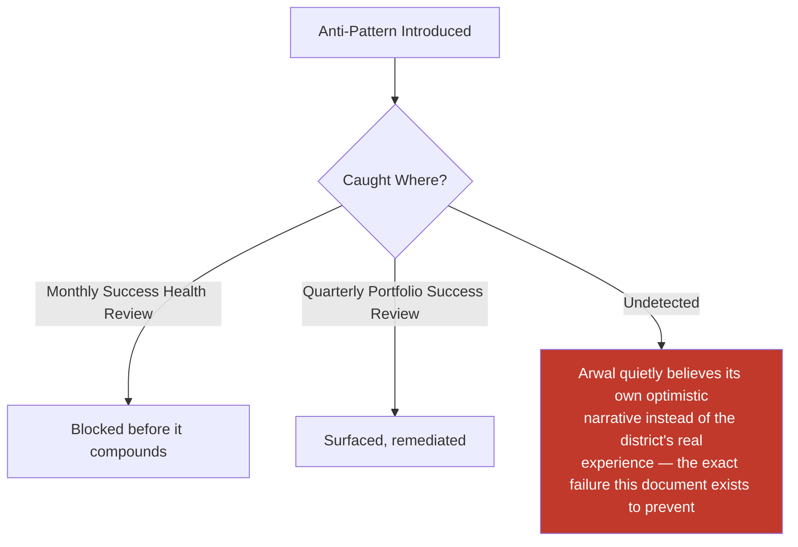

---

# Relationship to Previous Documents

| Prior Document | Relationship |
|---|---|
| **Project Vision (`ai-docs/00`)** | Establishes the founding North Star Principle this entire framework operationalizes into a standing, honest verdict discipline. |
| **Product Vision & Business Strategy (`ai-docs/50`)** | Supplies the Strategic Objectives every Success Criterion traces back to. |
| **Business Domain Model (`ai-docs/53`)** | Supplies the ownership structure every initiative's Business Owner is drawn from. |
| **Business Capability Map (`ai-docs/55`)** | Supplies the stable capabilities whose own Success Metrics this document elevates into governed verdicts where warranted. |
| **Customer Experience Strategy (`ai-docs/60`)** | Supplies the Experience Metrics this document's Citizen Success Measurement cites directly. |
| **Revenue & Sustainability Strategy (`ai-docs/62`)** | Supplies the Sustainability Metrics and Investment Priorities this document's Financial Success Measurement protects. |
| **District Ecosystem Mapping (`ai-docs/64`)** | Supplies the District Development Strategy this document's Economic & Social Impact section reinforces. |
| **Marketplace Strategy (`ai-docs/65`)** | Supplies the Marketplace Health Score this document's Marketplace Success Measurement cites, never redefines. |
| **Agriculture Business Model (`ai-docs/68`)** | Supplies the Agriculture Ecosystem Health metrics this document's Business Success Measurement draws on for farmer-facing verdicts. |
| **Healthcare Business Model (`ai-docs/69`)** | Supplies the Healthcare Ecosystem Health metrics this document's verdicts draw on for patient-facing initiatives. |
| **Education Business Model (`ai-docs/70`)** | Supplies the Education Ecosystem Health metrics this document's verdicts draw on for learner-facing initiatives. |
| **Employment & Jobs Business Model (`ai-docs/71`)** | Supplies the Employment Ecosystem Health metrics this document's verdicts draw on for job-seeker and employer-facing initiatives. |
| **Payments & Financial Services Strategy (`ai-docs/74`)** | Supplies the Payments Metrics this document's Financial Success Measurement incorporates. |
| **AI Product Strategy (`ai-docs/78`)** | Supplies the AI Ecosystem Health metrics and RULE-024's Automation Boundary this document's Responsible AI Evaluation is bound by. |
| **Trust & Safety Framework (`ai-docs/79`)** | Supplies the District Trust Signal and Platform Integrity Index this document treats as a mandatory, co-equal lens on every verdict. |
| **Product Analytics Strategy (`ai-docs/81`)** | Supplies the entire evidentiary foundation this document's Evidence Collection stage is built directly on top of. |
| **Product KPI Framework (`ai-docs/82`)** | Supplies the standing indicators and Balanced Scorecard Model this document's verdicts are measured against. |
| **Business Intelligence Framework (`ai-docs/83`)** | Supplies the cross-domain synthesis discipline this document's Business Intelligence Review stage consumes directly. |
| **Product Governance (`ai-docs/84`)** | Supplies the Decision Authority Matrix and Council structure this document's Governance section is built directly on top of. |
| **Product Lifecycle Management (`ai-docs/85`)** | Supplies the Growth, Maturity, and Retirement stages this document's verdicts directly inform the transition between. |
| **Feature Prioritization Framework (`ai-docs/86`)** | Supplies the Outcome Evaluation stage this document's verdicts feed directly, closing that framework's own loop. |
| **Product Roadmap Governance (`ai-docs/87`)** | Supplies the Progress Review and Roadmap Revision stages this document's verdicts are the evidentiary trigger for. |

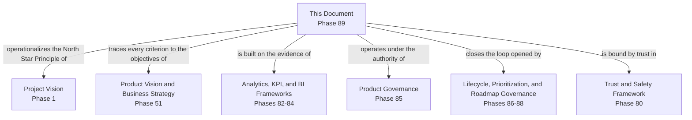

---

# Executive Artifacts

### Product Success Measurement Framework

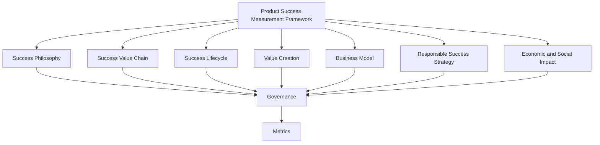

### Success Value Chain

See Success Measurement Value Chain section above — reproduced here by reference per Single Source of Truth, never duplicated.

### Success Lifecycle

See Success Measurement Lifecycle section above.

### Success Governance Model

See Governance section above.

### Strategic Success Matrix

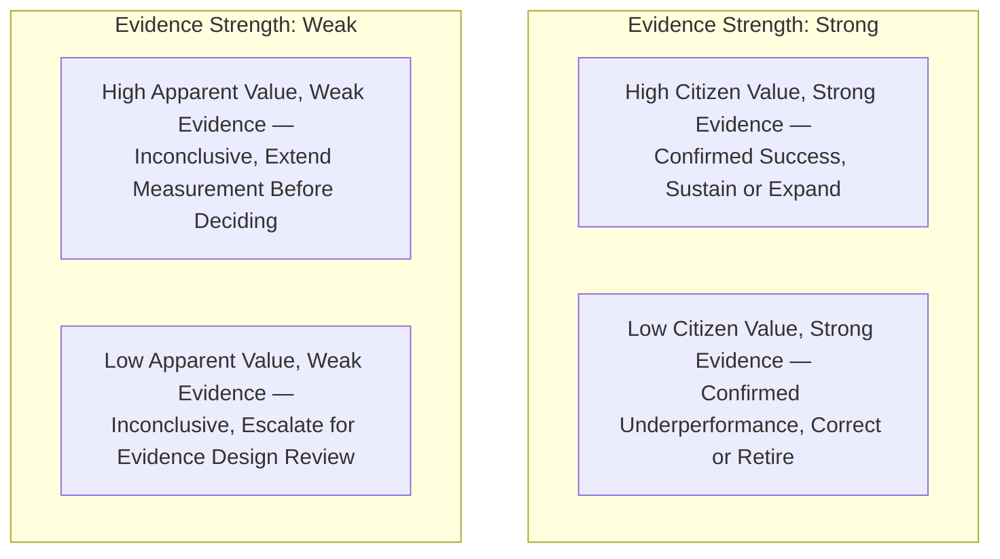

### Success Review Framework

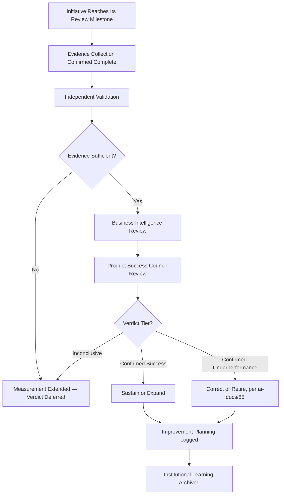

### Success Maturity Model

| Level | Name | Characteristics |
|---|---|---|
| **1 — Informal** | Success is asserted by the initiative's own team, with no consistent criteria or independent review. | High variance; no institutional memory. |
| **2 — Defined** | Success Criteria exist on paper but are inconsistently set before launch or reviewed independently. | Evidence Quality Index below target. |
| **3 — Managed** | Every consequential initiative's success verdict passes through Validation and the correct Council tier. | This document's standard is fully met. |
| **4 — Measured** | Success Metrics are actively tracked against explicit thresholds, with counterbalancing signals live for every verdict. | Monthly Success Health Review and Quarterly Portfolio Success Review are both active. |
| **5 — Optimized** | Success measurement itself is evidence-driven, proactively evolving, and genuinely replicable to a second district's own governance. | District Expansion readiness proven, not theoretical. |

Arwal's target state at the completion of Stage 2 is **Level 3 (Managed)**, with **Level 4 (Measured)** targeted as `ai-docs/81`'s and `ai-docs/82`'s tooling matures.

### Executive Success Dashboard (Conceptual)

| Dashboard | Audience | Key Content |
|---|---|---|
| **CEO / Board Dashboard** | CEO, Board | Strategic Success Score, Citizen Value Index, Platform Sustainability Index |
| **CPO Dashboard** | CPO | Portfolio-level verdict distribution (confirmed success / underperformance / inconclusive), Improvement Effectiveness |
| **Chief Analytics Officer Dashboard** | CAO | Evidence Quality Index, Governance Compliance, Validation throughput |
| **Vertical Council Dashboards** | Council Chairs | Own-vertical initiative verdicts, pending Re-Measurement schedule |
| **Government Partners Dashboard** | Government liaisons | Jointly-reviewed civic-initiative verdicts, evidence base |

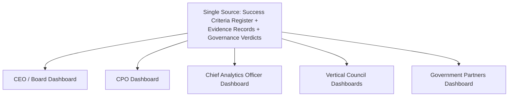

### Cross-Reference Table

| Governing Document | What This Framework Consumes From It |
|---|---|
| `ai-docs/50-product-vision-business-strategy.md` | Strategic Objectives every Success Criterion traces to |
| `ai-docs/81-product-analytics-strategy.md` | Evidence discipline, Responsible Analytics Strategy |
| `ai-docs/82-product-kpi-framework.md` | Balanced Scorecard Model, standing KPIs |
| `ai-docs/83-business-intelligence-framework.md` | Cross-domain synthesis, Responsible Interpretation |
| `ai-docs/84-product-governance.md` | Decision Authority Matrix, Escalation Model |
| `ai-docs/85-product-lifecycle-management.md` | Growth/Maturity/Retirement stage transitions this document's verdicts inform |
| `ai-docs/86-feature-prioritization-framework.md` | Outcome Evaluation stage this document closes the loop on |
| `ai-docs/87-product-roadmap-governance.md` | Progress Review and Roadmap Revision triggers |

### Decision Matrix

| Decision Type | Approval Authority |
|---|---|
| New Success Criteria at Planning | Business Owner + Product Success Council (informational) |
| Vertical-specific success verdict | The initiative's own vertical Council |
| Cross-vertical or platform-wide verdict | Product Success Council |
| Verdict recommending retirement or major expansion | Product Success Council + CPO |
| Emergency success-integrity response | Chief Analytics Officer, ratified within 5 business days |

---

# Closing Statement

> **Callout — Closing Statement**
> Every prior document in this handbook explains what Arwal builds, how it decides, and how it measures the evidence beneath every decision. This document explains the moment all of that either earns its keep or does not: the honest, evidenced verdict on whether a specific product, capability, or strategic bet actually made the district better off. A platform that only ever announces success has stopped listening to the citizens it claims to serve; a platform that measures itself honestly — including the uncomfortable verdicts — is a platform still capable of improving for as long as it exists. Product Success Measurement is not a report card Arwal writes for itself. It is the standing discipline that keeps every one of the roughly 415 phases in this handbook accountable to the only judge that ultimately matters: whether a citizen's life, a farmer's harvest, a merchant's storefront, or a government department's service delivery is genuinely, measurably better because Arwal exists. Where a future phase must deviate from a principle stated here, that deviation is made explicitly — through the Product Success Council's approval process above — never silently, and never by default.

This document, `ai-docs/88-product-success-measurement.md`, is Phase 89 of approximately 415. Every future evaluation of a product, capability, or strategic initiative is expected to trace back to a principle defined here, or to justify its deviation in writing.

**End of Phase 89 — `ai-docs/88-product-success-measurement.md`**