# Product Handbook Governance

**Document:** `ai-docs/89-product-handbook-governance.md`
**Project:** Arwal — The District Super App
**Stage:** 2 — Product & Business Strategy
**Phase:** 90 — Product Handbook Governance
**Status:** Approved for Executive & Enterprise Reference
**Audience:** CEO, CSO, CPO, Enterprise Business Architects, Enterprise Governance Consultants, Documentation Governance Specialists, Knowledge Management Consultants, Government Digital Transformation Advisors, Compliance Consultants, Organizational Design Specialists, Enterprise Documentation Architects

> **Callout — Purpose of This Document**
> `ai-docs/00-project-vision.md` through `ai-docs/88-product-success-measurement.md` established why Arwal exists, what it can do, who it serves, how it sustains itself, how it partners with government, the whole district ecosystem it operates inside, how every vertical creates and protects value, and how Arwal governs, prioritizes, sequences, and measures the success of everything it builds. None of those documents answers the question that sits above every one of them, binding all ~90 phases so far — and the roughly 325 still to come — into a single, trustworthy body of knowledge: **how is the handbook itself governed, so that a document written at Phase 3 and a document written at Phase 300 still agree with each other, still mean what they said, and can still be trusted by an engineer, a government partner, or a second district who was not present when either was written?** This document is that answer — the authoritative Product Handbook Governance framework every future phase, amendment, and cross-reference traces back to.

---

# Purpose of this Document

### Why Handbook Governance Is a Strategic Capability, Not a Documentation Chore

A handbook of ~415 phases is not a filing cabinet — it is the accumulated institutional judgment of a platform meant to serve a district for a generation. Every prior phase in this handbook exists because Arwal's founders judged that writing the reasoning down, once, precisely, and citably, was cheaper than re-litigating it a hundred times across a multi-year roadmap, per the Documentation-Driven Development commitment already established in `ai-docs/00-project-vision.md`. Handbook Governance is the discipline that keeps that judgment trustworthy as the handbook grows from 90 phases to 415 — because a body of knowledge nobody actively protects does not stay coherent by accident; it drifts, contradicts itself, and eventually stops being trusted by the very engineers and partners it exists to guide.

### This Is Not a Git Workflow, a Markdown Guide, or a Documentation Tool Manual

This document contains no branching strategy, no commit-message convention, no Markdown linting rule, no static-site-generator configuration, and no knowledge-base software specification. It does not redefine `ai-docs/06-git-workflow.md`'s mechanics, `ai-docs/24-documentation-standards.md`'s Markdown Standards and Writing Style Guide, or `ai-docs/49`'s future ADR-authoring standard — each remains fully authoritative for its own layer and is cited, never restated. This document's exclusive territory is: **why the handbook, as a whole, must be governed as a single institutional asset; who holds authority over its truth; how a phase is amended, versioned, and retired; and how that governance itself survives a team, a decade, and a second district.**

### How Handbook Governance Preserves Institutional Knowledge

Per `ai-docs/24-documentation-standards.md`'s Documentation Before Tribal Knowledge principle, any operational or strategic knowledge that exists only in an engineer's or executive's head is a standing risk — the moment that person is unavailable, the knowledge is gone. At ~415 phases and a team scaling toward hundreds of people, this risk compounds daily. Handbook Governance is what converts that risk into an asset: a governed, versioned, cross-referenced body of reasoning that survives every individual departure, reorganization, and leadership transition the platform will ever experience.

### How Handbook Governance Protects Consistency Across All Phases

A handbook this large inevitably develops internal tension — Phase 12's engineering principle and Phase 280's product decision may quietly begin to disagree unless something actively checks for it. Handbook Governance is the standing discipline that catches that disagreement before a citizen, an engineer, or a government partner discovers it the hard way — mirroring the identical reasoning `ai-docs/02-engineering-principles.md` already applies to code-level consistency, elevated here to the level of the entire institutional record.

### How Handbook Governance Supports Long-Term Multi-District Growth

Per `ai-docs/50-product-vision-business-strategy.md`'s Strategic Expansion Principles, a second district inherits Arwal's *reasoning*, never merely its features. A handbook that is internally consistent, version-controlled, and governed is a genuinely transferable institutional asset; a handbook that has drifted into silent contradiction is not something any second district's leadership can safely inherit. Handbook Governance is what makes the entire ~415-phase body of work replicable, not merely descriptive.

### Relationship Between Every Participant

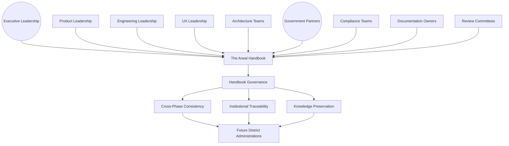

### Scope Boundary

This document does not define how a Markdown file is formatted, how a Git branch is named, or how an ADR is numbered — those remain the domain of `ai-docs/06-git-workflow.md`, `ai-docs/24-documentation-standards.md`, and the future ADR-authoring standard referenced in `ai-docs/24`. Its territory is strategic and constitutional: the philosophy, the lifecycle, the stakeholder accountability, and the governance-of-governance discipline that keeps the entire Arwal Handbook a single, trustworthy, evolving source of truth.

---

# Handbook Governance Philosophy

Every principle below exists because a handbook governed carelessly does not fail abstractly — it fails a specific engineer who built on a stale assumption, a specific government partner who was shown two documents that quietly disagreed, or a specific successor team that inherited 300 phases of reasoning nobody could still explain.

### Single Source of Truth
**Why it exists:** Every fact, principle, and standard has exactly one authoritative statement in the handbook — never restated with subtle variation across two phases, mirroring the identical Single Source of Truth principle already established in `ai-docs/02-engineering-principles.md` and `ai-docs/24-documentation-standards.md`, elevated here to govern the handbook as a whole rather than any single document.

### Documentation Before Assumptions
**Why it exists:** A decision, standard, or commitment that exists only as a shared team assumption is not yet real for Arwal's purposes — it is written down, reviewed, and cited, or it does not yet govern anything. This is the handbook-wide expression of `ai-docs/24`'s Documentation Before Tribal Knowledge principle.

### Evidence-Based Amendments
**Why it exists:** A phase document is amended because evidence — a discovered contradiction, a changed regulation, a validated new practice — demands it, never because a single voice preferred a different phrasing. Mirrors `ai-docs/83-business-intelligence-framework.md`'s Evidence Before Opinion principle, applied here to the handbook's own evolution.

### Version Transparency
**Why it exists:** Anyone reading a phase document must be able to tell, at a glance, its current status, its last-reviewed date, and whether it has been amended since they last relied on it — concealment of a document's own history breeds exactly the misplaced confidence this governance exists to prevent.

### Traceability
**Why it exists:** Every phase document is traceable both forward (which later phases depend on it) and backward (which earlier phases it was built on) — a phase that cannot be placed in this web of dependency is a phase whose true scope nobody can verify.

### Governance Before Change
**Why it exists:** No phase document is amended outside a defined, proportionate review process — an informally edited phase is a phase the rest of the handbook can no longer trust, mirroring `ai-docs/84-product-governance.md`'s Governance Before Complexity principle, applied here to documentation change itself.

### Consistency Across Phases
**Why it exists:** A term, a principle, or a standard means the same thing in Phase 5 as it does in Phase 305 — the Common Engineering Vocabulary commitment already established in `ai-docs/02-engineering-principles.md`, extended here to the entire 415-phase corpus, not merely the engineering-standards subset.

### Institutional Knowledge Preservation
**Why it exists:** A phase document, once approved, is never silently deleted — its reasoning is preserved permanently, per the Archive Never Delete principle already established throughout this handbook, because the question "why was this built this way?" must always have an answer, even decades later.

### Long-Term Maintainability
**Why it exists:** The handbook is designed to be read, amended, and extended by someone who was not present when it was written — every governance mechanism in this document exists to make that possible at Phase 415 exactly as it is at Phase 90.

### Public Value Alignment
**Why it exists:** Arwal is public-purpose private infrastructure, per `ai-docs/00-project-vision.md` — the handbook's own governance is answerable, ultimately, to the district it serves, not merely to Arwal's internal convenience. A governance shortcut that serves an internal deadline at the cost of the handbook's own integrity is rejected regardless of the pressure behind it.

### Continuous Improvement
**Why it exists:** A governance model designed once, at Phase 90, and never revisited decays as the handbook's scale and complexity grow toward 415 phases — Handbook Governance is itself subject to the identical Continuous Improvement discipline already established throughout `ai-docs/60` through `ai-docs/88`.

### Accountability
**Why it exists:** Every phase document has exactly one named, accountable owner — never a diffuse "the team" that can later disclaim responsibility for a stale or contradictory standard, mirroring the Clear Ownership discipline already established throughout `ai-docs/53` through `ai-docs/88`.

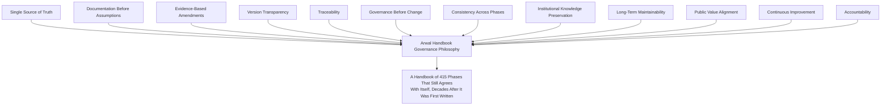

> **Callout — The One-Sentence Handbook Governance Philosophy**
> *"A handbook nobody actively protects does not stay a handbook — it becomes an archive of good intentions that quietly stopped being true, and governance exists so that Phase 3 and Phase 300 can still shake hands."*

---

# Handbook Value Chain

| Stage | Business Description |
|---|---|
| **Knowledge Creation** | A genuine institutional decision, standard, or strategic reasoning is identified as needing a durable, citable home. |
| **Documentation** | The knowledge is written into a new or amended phase document, following `ai-docs/24-documentation-standards.md`'s Writing Style Guide and Markdown Standards without restating them here. |
| **Cross-Reference Validation** | Every citation the new or amended phase makes into another phase — and every existing phase's citation into it — is checked for accuracy, per the Cross-Reference Governance capability below. |
| **Governance Review** | The phase passes through the Handbook Governance Council's review, at the tier its scope and risk warrant. |
| **Executive Approval** | The classification-appropriate authority formally approves the phase for publication. |
| **Publication** | The phase is published as the current, authoritative version, per Publication discipline below. |
| **Operational Adoption** | Engineering, Product, UX, and every other function begins citing and relying on the published phase in their own work. |
| **Feedback Collection** | Discrepancies, stale references, and ambiguities surfaced by real use are captured, never discarded informally. |
| **Continuous Improvement** | Feedback is triaged into a genuine amendment cycle, per the Handbook Lifecycle below. |
| **Institutional Learning** | Every amendment's reasoning — including where an earlier phase was found to be wrong — is retained permanently, feeding the next Knowledge Creation cycle honestly. |

```mermaid
graph LR
    KnowCreate[Knowledge Creation] --> Documentation2[Documentation]
    Documentation2 --> CrossRefVal[Cross-Reference Validation]
    CrossRefVal --> GovReview3[Governance Review]
    GovReview3 --> ExecApprove[Executive Approval]
    ExecApprove --> Publication2[Publication]
    Publication2 --> OpAdopt[Operational Adoption]
    OpAdopt --> FeedbackCollect[Feedback Collection]
    FeedbackCollect --> ContImprove7[Continuous Improvement]
    ContImprove7 --> InstLearn4[Institutional Learning]
    InstLearn4 -.informs.-> KnowCreate
```

---

# Handbook Lifecycle

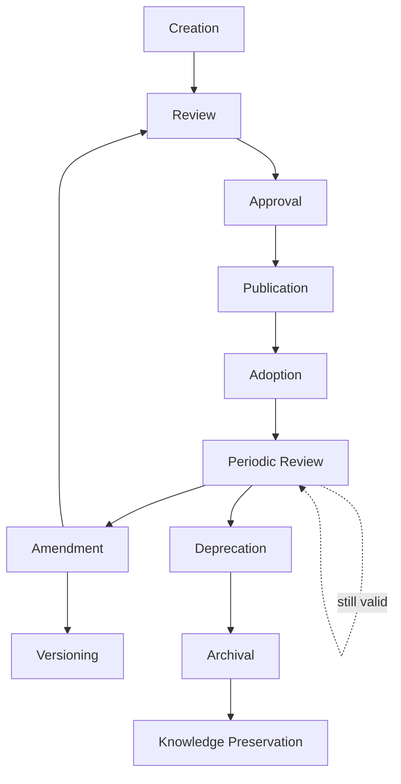

| Stage | Meaning | Exit Criterion |
|---|---|---|
| **Creation** | A new phase is drafted to capture a genuine, previously undocumented institutional decision. | A named author and a stated scope/purpose exist. |
| **Review** | The draft is examined for accuracy, consistency with existing phases, and completeness. | Every required reviewer, per the phase's classification, has responded. |
| **Approval** | The classification-appropriate authority formally signs off. | A recorded decision — approved, rejected, or returned — exists. |
| **Publication** | The phase becomes the live, citable, authoritative version. | The phase is added to the handbook's index with its Phase number and Status. |
| **Adoption** | Every relevant function begins genuinely relying on the phase in real decisions. | The phase is cited in at least one subsequent phase or real operational decision. |
| **Periodic Review** | The phase's continued accuracy is reconfirmed on its defined cadence, never assumed indefinitely. | A dated review record exists, confirming "still accurate" or triggering Amendment. |
| **Amendment** | A phase is revised in response to a genuine finding — a contradiction, a regulatory change, a corrected assumption. | A new version is recorded with its rationale, per Version Governance below. |
| **Versioning** | Every amendment increments the phase's version, never silently overwriting its prior content. | The prior version remains retrievable, per Institutional Knowledge Preservation. |
| **Deprecation** | A phase no longer reflects current, recommended practice but retains historical relevance. | The phase is marked Deprecated, with a pointer to its successor, never silently left in place. |
| **Archival** | A deprecated phase no longer actively referenced is moved to a clearly labeled archive location. | The phase remains retrievable by ID, never deleted. |
| **Knowledge Preservation** | The phase's full history — every version, every amendment's rationale — is retained permanently. | A citable, permanent record exists for the life of the platform. |

> **Callout — Amendment Re-Enters Review, Never Bypasses It**
> Per Governance Before Change above, an Amendment is never a direct edit to a published phase — it re-enters the Review stage at the tier appropriate to its scope, exactly as a brand-new phase would, per the Handbook Governance Council's Decision Authority below.

---

# Stakeholder Ecosystem

| Stakeholder | Responsibility in Handbook Governance |
|---|---|
| **Executive Leadership** | Sets the handbook's overall integrity standard as a board-level concern; holds final authority for a Foundational-tier amendment, per Decision Authority below. |
| **Product Leadership** | Owns the accuracy and currency of every Stage 2 phase document, escalating what it cannot resolve at its own tier. |
| **Engineering Leadership** | Owns the accuracy and currency of every Stage 1 engineering-standards phase, per the same discipline already established in `ai-docs/29-engineering-governance-decision-authority.md`. |
| **UX Leadership** | Owns the accuracy of every phase touching citizen-facing experience standards, ensuring `ai-docs/12`, `ai-docs/56`, and `ai-docs/60`'s commitments remain internally consistent as the handbook grows. |
| **Architecture Teams** | Verify that every phase's technical implications remain architecturally coherent with `ai-docs/03-system-architecture-principles.md` and its successors, never silently diverging. |
| **Government Partners** | A structurally consulted stakeholder for any phase amendment touching a civic commitment, per `ai-docs/63-government-partnership-strategy.md` — never merely informed after a civic-relevant phase changes. |
| **Compliance Teams** | Verify that every phase, and every amendment, satisfies its regulatory obligation before and after publication, per `ai-docs/40-engineering-compliance-audit-standards.md`. |
| **Documentation Owners** | The named, accountable individual or team for each specific phase's ongoing accuracy, per Accountability above. |
| **Review Committees** | The Handbook Governance Council and its delegated sub-reviewers, holding the actual review authority defined in Governance below. |
| **Future District Administrations** | Inherit the governed, versioned handbook as a genuinely transferable asset, never a founding district's informal tribal knowledge, per `ai-docs/50`'s Strategic Expansion Principles. |

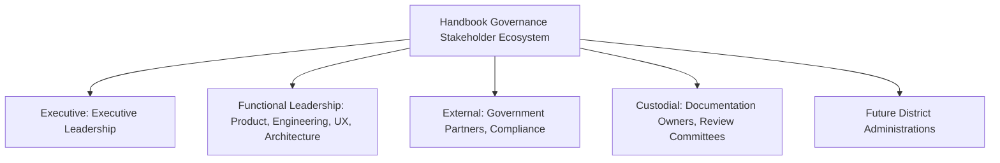

---

# Value Creation

| Question | Answer |
|---|---|
| **How does handbook governance create value?** | By ensuring every one of Arwal's ~415 phases remains something an engineer, a product leader, or a government partner can genuinely trust and act on, years after it was written. |
| **How does it reduce organizational risk?** | By catching a contradiction between two phases before it becomes a citizen-facing failure, a compliance gap, or a costly rebuild caused by an undetected drift. |
| **How does it improve engineering quality?** | By keeping the standards engineers build against — `ai-docs/02` through `ai-docs/48` — internally consistent and current, never a source of conflicting instructions. |
| **How does it improve product quality?** | By keeping the Stage 2 business and product reasoning — `ai-docs/50` through `ai-docs/88` — traceable and mutually reinforcing, so a product decision at Phase 300 does not quietly contradict a commitment made at Phase 51. |
| **How does it support government collaboration?** | By giving a government partner a single, stable, version-transparent body of reference material to negotiate and plan against, per `ai-docs/63-government-partnership-strategy.md`. |
| **How does it preserve institutional memory?** | By ensuring that the reasoning behind a decision — not merely its outcome — survives every individual's departure from the organization. |
| **How does it support long-term scalability?** | By making the entire handbook a genuinely replicable institutional asset a second district's leadership can inherit intact, rather than reconstruct from memory. |

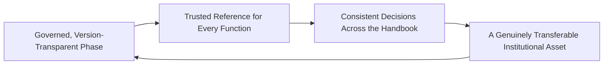

---

# Business Model

Every capability below is described strategically — its governance rationale, never a tooling specification.

| Capability | Business Rationale |
|---|---|
| **Documentation Governance** | The standing discipline ensuring every phase document meets its required structure, ownership, and quality bar, extending `ai-docs/24-documentation-standards.md`'s Quality Standards to the handbook's own self-governance. |
| **Version Governance** | The discipline ensuring every phase's amendment history is transparent, sequential, and never silently overwritten. |
| **Architecture Governance Alignment** | Coordination with `ai-docs/03-system-architecture-principles.md`'s and `ai-docs/46`'s Architecture Review Board, ensuring a handbook amendment never silently contradicts an architectural commitment. |
| **Product Governance Alignment** | Coordination with `ai-docs/84-product-governance.md`'s Decision Authority Matrix, ensuring a handbook amendment touching product strategy is never approved outside that document's own tiered authority. |
| **Engineering Governance Alignment** | Coordination with `ai-docs/29-engineering-governance-decision-authority.md`, ensuring an engineering-standards amendment is never approved outside that document's own authority structure. |
| **Compliance Governance** | Verification that every phase and amendment satisfies its regulatory obligation, per `ai-docs/40-engineering-compliance-audit-standards.md`. |
| **Knowledge Governance** | The discipline ensuring every phase's reasoning — not only its conclusion — is captured and retained, per Institutional Knowledge Preservation above. |
| **Cross-Reference Governance** | The standing check that every citation between phases resolves correctly and remains accurate as either phase evolves — a broken or stale cross-reference is treated with the same severity `ai-docs/24`'s Documentation Quality Standards already assign a broken link. |
| **Change Governance** | The tiered, proportionate review process every amendment passes through, per Decision Authority below. |
| **Archive Governance** | The discipline ensuring a deprecated phase is retired deliberately, remains retrievable, and is never silently deleted. |
| **Institutional Learning Governance** | The standing mechanism that captures what every amendment cycle taught the organization, feeding the next Knowledge Creation cycle, per `ai-docs/85-product-lifecycle-management.md`'s Continuous Learning principle applied here to the handbook itself. |

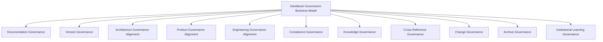

---

# Responsible Handbook Strategy

| Mechanism | Strategic Role |
|---|---|
| **Controlled Amendments** | No phase is edited outside the Handbook Lifecycle's Amendment stage — every change, however small, re-enters Review at its appropriate tier. |
| **Approval Hierarchy** | Every amendment's approval authority scales to its scope — a single-phase clarification and a cross-phase, foundational change are never held to the same review bar, mirroring the Proportional Rigor principle already established throughout `ai-docs/29` through `ai-docs/84`. |
| **Version Integrity** | A phase's version history is permanent and tamper-evident — no prior version is ever overwritten or deleted, only superseded. |
| **Cross-Reference Validation** | Every amendment triggers a check of every phase that cites it and every phase it cites, catching a break before it silently misleads a future reader. |
| **Evidence Requirements** | An amendment's justification is evidence-based, per Evidence-Based Amendments above — a stylistic preference alone is insufficient grounds for a Foundational-tier change. |
| **Documentation Quality** | Every phase, new or amended, is held to `ai-docs/24-documentation-standards.md`'s Documentation Quality Standards, never a lower bar because the content is "just governance." |
| **Accessibility** | Every phase is written in plain, professional language a new engineer or a government partner can genuinely understand, per `ai-docs/24`'s Writing Style Guide, never assumed self-evident to insiders alone. |
| **Transparency** | A phase's Status, Phase number, and last-reviewed date are always visible and accurate — concealment of a phase's true currency is a governance failure in its own right. |
| **Institutional Learning** | Every amendment's rationale, including a correction of an earlier phase's mistake, is retained and citable, never quietly smoothed over. |
| **Continuous Improvement** | The Handbook Governance framework itself is reviewed and improved on a fixed cadence, per Governance below, never assumed permanent at Phase 90. |

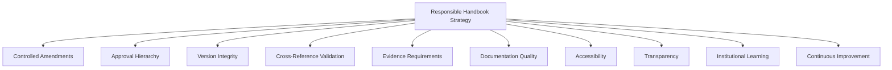

> **Callout — A Stale "Approved" Status Is a Governance Failure, Not a Rounding Error**
> Per Transparency above, a phase whose Periodic Review has lapsed past its defined cadence is treated with the same severity as an incorrect statement inside it — a reader has no way to distinguish "this was reviewed recently and is trustworthy" from "this has not been checked in years" unless the handbook's own governance makes that distinction visible and current.

---

# Economic & Social Impact

| Impact Area | How Handbook Governance Contributes |
|---|---|
| **Reduce Rework** | A consistent, trustworthy handbook prevents an engineer or product leader from building against a stale or contradicted assumption, avoiding the cost of later discovering and unwinding that work. |
| **Improve Decision Quality** | Every governed decision throughout `ai-docs/84`, `ai-docs/86`, and `ai-docs/87` depends on the handbook it cites being accurate — Handbook Governance is what keeps that dependency trustworthy. |
| **Improve Product Consistency** | A citizen, merchant, or government partner experiences one coherent Arwal, never a platform whose different teams quietly followed different, contradicted versions of the same standard. |
| **Strengthen Government Partnerships** | A government partner negotiating against a stable, version-transparent handbook can trust that a commitment made in one conversation will not be silently reinterpreted in the next. |
| **Improve Engineering Efficiency** | Engineers spend their judgment on genuinely novel problems, per `ai-docs/02-engineering-principles.md`'s founding purpose, rather than re-litigating a standard that should have already been settled and consistent. |
| **Improve Organizational Learning** | Every amendment's captured rationale — including a corrected earlier mistake — becomes a citable lesson for the next 300+ phases, rather than a lesson relearned at real cost. |
| **Support District Expansion** | A governed, internally consistent handbook is the specific asset that makes Arwal's model genuinely replicable to a second district, per `ai-docs/50`'s Strategic Expansion Principles. |

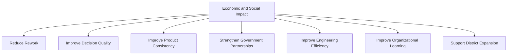

---

# Governance

### Handbook Governance Council
A standing **Handbook Governance Council** — chaired by the CPO or a delegated Chief Documentation Officer, with the CTO, CSO, Head of Compliance, Head of Architecture, Head of UX, Head of Government Partnerships, and rotating phase-owning leads as members — holds approval authority over any Foundational-tier amendment, any new cross-phase standard, and any material deviation from the Anti-Patterns below. The Council meets monthly, with ad hoc sessions for a discovered cross-phase contradiction requiring urgent correction.

### Ownership
Every phase document has exactly one named accountable owner — its originating function's leadership (Engineering Leadership for Stage 1 phases, Product Leadership for Stage 2 phases) — mirroring the Clear Ownership discipline already established throughout `ai-docs/53` through `ai-docs/88`. An unowned phase is treated as a governance defect, escalated immediately.

### Decision Authority

| Amendment Tier | Example | Approval Authority |
|---|---|---|
| **Foundational** | A change to a Project Vision commitment, a cross-cutting principle cited by dozens of phases. | Handbook Governance Council + CEO + Board |
| **Cross-Phase** | A change affecting a standard shared across multiple phases (e.g., a Data Classification tier, a Decision Authority tier). | Handbook Governance Council |
| **Single-Phase, Material** | A substantive revision to one phase's rule, standard, or strategy. | The phase's owning function's leadership + one Council-designated reviewer |
| **Single-Phase, Clarification** | A wording clarification with no rule or standard change. | The phase's named Documentation Owner |

A phase's amendment tier is determined by its actual cross-reference fan-in (per Cross-Reference Governance) and its Risk Classification (per `ai-docs/30-engineering-risk-management-standards.md`) — never self-assigned by its proposer without independent confirmation, mirroring the identical discipline already established in `ai-docs/58-business-rules-policies.md`'s RULE-030.

### Review Cadence

| Review | Cadence | Owner |
|---|---|---|
| Handbook Health Review | Monthly | Handbook Governance Council |
| Cross-Reference Integrity Audit | Quarterly | Handbook Governance Council, Documentation Owners |
| Annual Handbook Governance Review | Annual | CEO, CPO, CTO, Board |

### Amendment Process

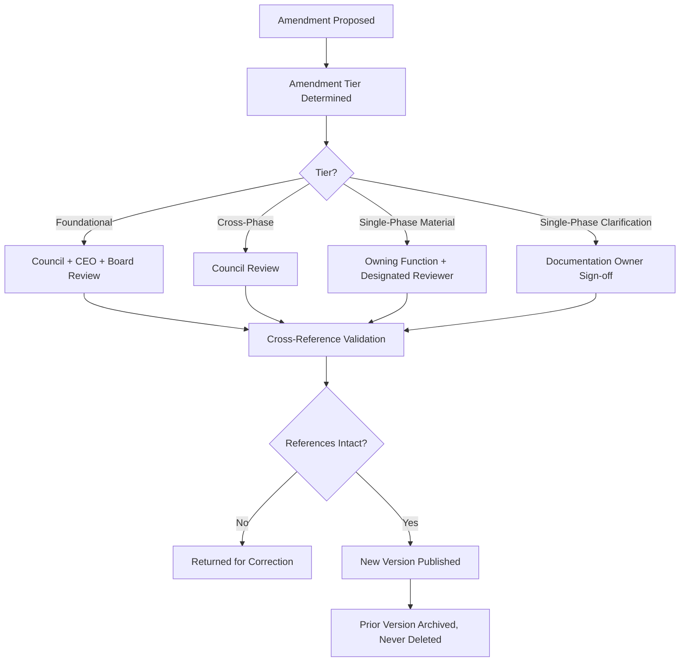

### Escalation Model
A disagreement over an amendment's necessity, tier, or content escalates first to direct discussion between the proposer and the phase's Documentation Owner, then to the Handbook Governance Council, then to CEO/CTO/CPO jointly — mirroring the identical Escalation Model already established in `ai-docs/84-product-governance.md`. No amendment dispute is left unresolved indefinitely; every escalation carries a resolution deadline proportional to its tier.

### Continuous Improvement
Every Cross-Reference Integrity Audit finding and every amendment's own retrospective feeds a shared, tracked improvement backlog, reviewed at the next Handbook Health Review, per the identical Continuous Improvement Loop already established throughout `ai-docs/60` through `ai-docs/88`.

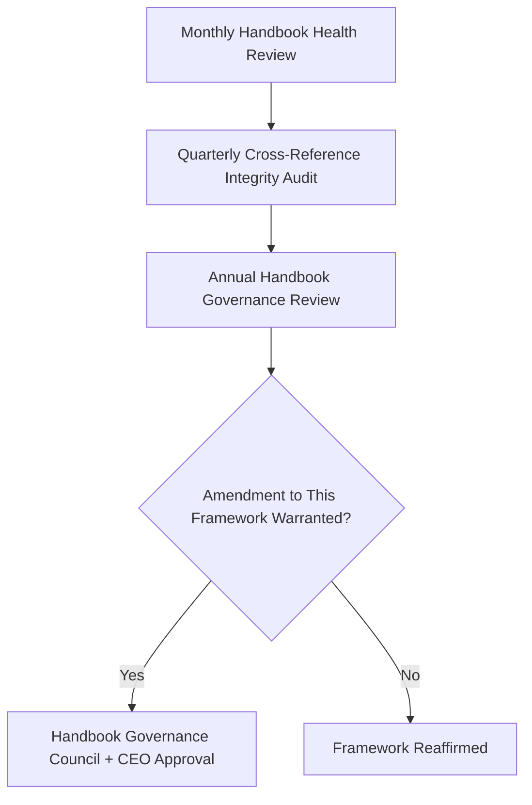

---

# Risks

| Risk | Description | Mitigation |
|---|---|---|
| **Documentation Drift** | A phase's actual, lived practice diverges silently from its written content. | Periodic Review stage's mandatory reconfirmation cadence; Cross-Reference Integrity Audit. |
| **Conflicting Guidance** | Two phases state incompatible standards on the same topic. | Cross-Reference Validation at every amendment; Handbook Governance Council review for any cross-phase change. |
| **Outdated Policies** | A phase reflects a regulation, technology, or practice no longer current. | Mandatory Periodic Review cadence, never left indefinite. |
| **Knowledge Loss** | Institutional reasoning exists only informally, never captured in a governed phase. | Documentation Before Assumptions principle; Knowledge Governance capability. |
| **Weak Traceability** | A phase's dependency on, or relevance to, other phases is unclear or undocumented. | Traceability principle; mandatory cross-reference tables in every phase, per existing handbook convention. |
| **Uncontrolled Amendments** | A phase is edited informally, bypassing the Amendment Process. | Governance Before Change principle; Controlled Amendments mechanism. |
| **Version Confusion** | Two versions of a phase circulate simultaneously with no clear indication of which is current. | Version Integrity mechanism; Publication stage's single-current-version discipline. |
| **Governance Breakdown** | The Handbook Governance Council itself becomes a rubber stamp, no longer genuinely reviewing amendments. | Annual Handbook Governance Review explicitly audits review quality, not merely review completion. |

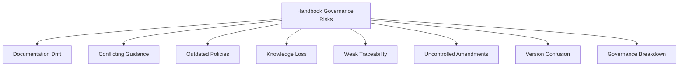

---

# Metrics

| Metric | Definition | Direction |
|---|---|---|
| **Documentation Quality Index** | The proportion of phases meeting `ai-docs/24-documentation-standards.md`'s full Documentation Quality Standards. | Increasing toward 100% |
| **Cross-Reference Integrity** | The proportion of citations between phases that resolve correctly and accurately at any given audit. | Increasing toward 100% |
| **Version Compliance** | The proportion of phases with a complete, accurate, current version history. | Increasing toward 100% |
| **Review Completion Rate** | The proportion of phases reviewed within their defined Periodic Review cadence. | Increasing toward 100% |
| **Knowledge Retention Index** | The proportion of deprecated or retired phases with a complete, permanently archived record. | Increasing toward 100% |
| **Amendment Accuracy** | The rate at which an amendment's stated rationale is later confirmed genuinely correct upon subsequent review. | Increasing |
| **Governance Compliance** | The proportion of amendments that passed through their correct tier of Decision Authority before publication. | Increasing toward 100% |
| **Institutional Learning Index** | The proportion of amendment retrospectives genuinely referenced in a later, comparable decision. | Increasing |

> **Callout — No Handbook Metric Stands Alone**
> Per the North Star Principle already established in `ai-docs/00-project-vision.md`, a rising Review Completion Rate alongside a falling Amendment Accuracy is treated as a regression — reviews completed quickly but without genuine rigor are not success, they are the Governance Breakdown risk materializing quietly.

---

# Anti-Patterns

| Anti-Pattern | Why It's Rejected |
|---|---|
| **Documentation by Tribal Knowledge** | A standard that exists only in a senior engineer's or executive's memory, never written into a governed phase, violates Documentation Before Assumptions and recreates the exact risk `ai-docs/24-documentation-standards.md` already exists to prevent. |
| **Silent Changes** | A phase edited without passing through the Amendment Process violates Governance Before Change and destroys Version Transparency simultaneously. |
| **Conflicting Documents** | Two phases stating incompatible guidance on the same topic, left uncorrected, violates Consistency Across Phases and Single Source of Truth. |
| **Duplicate Guidance** | The same standard restated independently in two phases, inevitably drifting apart, violates Single Source of Truth exactly as `ai-docs/24`'s own Duplicate Documentation anti-pattern already warns. |
| **Unapproved Amendments** | A change proceeding without its tier-appropriate Decision Authority sign-off violates Governance Before Change absolutely. |
| **Broken Cross-References** | A citation into a retired, renumbered, or contradicted phase left unfixed violates Cross-Reference Governance and misleads every future reader who trusts it. |
| **Version Confusion** | Two circulating copies of a phase with no clear indication of which is current violates Version Integrity. |
| **Ignoring Reviews** | A phase's Periodic Review lapsing past its defined cadence, unnoticed, violates Documentation Quality and Transparency simultaneously. |

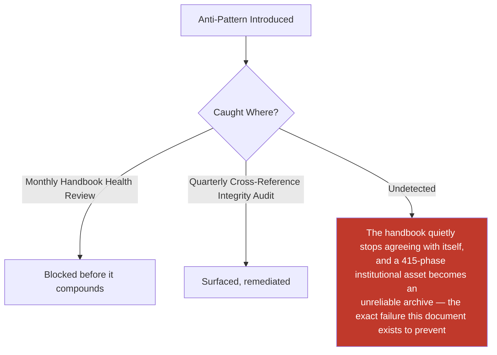

---

# Relationship to Previous Documents

This Handbook Governance framework does not redefine any prior phase's content — it protects all of them equally, by name, from Phase 1 through Phase 89.

| Prior Document Cluster | Relationship |
|---|---|
| **Stage 1 Foundation (`ai-docs/00`–`ai-docs/49`)** | Project Vision, Product Goals, Engineering Principles, Architecture Principles, and every coding, security, testing, deployment, observability, logging, configuration, dependency, ADR, governance, risk, change-management, financial, capacity, portfolio, career, operational-excellence, compliance, communication, knowledge-management, architecture-governance, organizational-scaling, and strategic-planning standard remain fully authoritative for their own engineering domain — this document ensures every one of them stays internally consistent, current, and correctly cross-referenced as the handbook grows around them. |
| **Stage 2 Product & Business Strategy (`ai-docs/50`–`ai-docs/88`)** | Product Vision, Stakeholder Analysis, Personas, Business Domain Model, Product Module Catalog, Business Capability Map, User Journey Standards, Business Process Standards, Business Rules & Policies, Customer Experience Strategy, Value Proposition Framework, Revenue & Sustainability Strategy, Government Partnership Strategy, District Ecosystem Mapping, Marketplace Strategy, every vertical Business Model (Service Provider, Merchant, Agriculture, Healthcare, Education, Employment, Property), Logistics & Delivery, Payments & Financial Services, Community & Social Engagement, Notification & Communication, Search & Discovery, AI Product Strategy, Trust & Safety Framework, User Growth Strategy, Product Analytics Strategy, Product KPI Framework, Business Intelligence Framework, Product Governance, Product Lifecycle Management, Feature Prioritization Framework, Roadmap Governance, and Product Success Measurement each remain fully authoritative for their own strategic domain — this document is the constitutional layer ensuring all of them remain mutually consistent, correctly versioned, and permanently traceable. |
| **`ai-docs/24-documentation-standards.md`** | Supplies the Markdown Standards, Writing Style Guide, and Documentation Quality Standards this document cites but never restates — this document governs the handbook's *institutional* discipline; `ai-docs/24` governs any document's *content-craft* discipline. |
| **`ai-docs/06-git-workflow.md`** | Supplies the mechanical change-tracking discipline (branches, commits, PRs) this document's Amendment Process is executed through, never redefined here. |
| **`ai-docs/84-product-governance.md`** | Supplies the Decision Authority Matrix and Council structure this document's own Decision Authority table mirrors and coordinates with, never duplicates, for product-strategy-specific amendments. |
| **`ai-docs/29-engineering-governance-decision-authority.md`** | Supplies the identical coordination point for engineering-standards-specific amendments. |

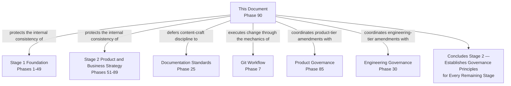

---

# Executive Artifacts

### Handbook Governance Framework

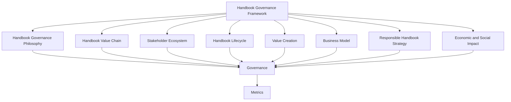

### Handbook Lifecycle

See Handbook Lifecycle section above — reproduced here by reference per Single Source of Truth, never duplicated.

### Documentation Governance Model

See Business Model's Documentation Governance capability above.

### Amendment Workflow

See Amendment Process diagram above.

### Version Governance Model

| Element | Discipline |
|---|---|
| **Version Identifier** | Every phase's Phase number is its permanent identifier; a version increments within that Phase number, never replacing it. |
| **Version History** | Every prior version remains retrievable, per Institutional Knowledge Preservation. |
| **Current-Version Marking** | Exactly one version of any phase is marked current at any time — never two simultaneously. |
| **Amendment Rationale** | Every version increment carries a stated, evidence-based reason, per Evidence-Based Amendments. |

### Knowledge Governance Framework

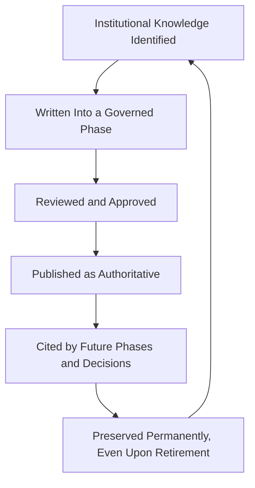

### Executive Governance Dashboard (Conceptual)

| Dashboard | Audience | Key Content |
|---|---|---|
| **CEO / Board Dashboard** | CEO, Board | Handbook Maturity Level, Documentation Quality Index, Foundational-tier amendment log |
| **CPO Dashboard** | CPO | Cross-Reference Integrity, Review Completion Rate for Stage 2 phases |
| **CTO Dashboard** | CTO | Review Completion Rate for Stage 1 phases, Version Compliance |
| **Compliance Dashboard** | Compliance Officer | Regulatory-relevant phase currency, Amendment Accuracy |
| **Government Partners Dashboard** | Government liaisons | Civic-relevant phase stability, jointly reviewed amendment status |

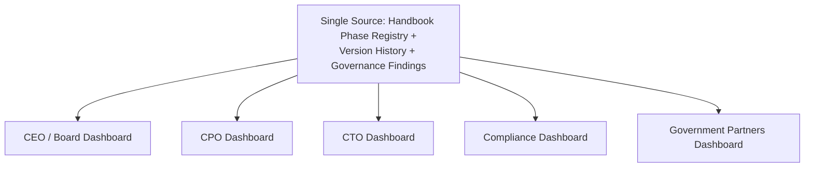

### Handbook Maturity Model

| Level | Name | Characteristics |
|---|---|---|
| **1 — Informal** | Phases exist but are amended ad hoc, with no consistent review or version discipline. | High variance; no institutional memory. |
| **2 — Defined** | A governance process exists on paper but is inconsistently followed. | Governance Compliance below target. |
| **3 — Managed** | Every amendment passes through its correct tier; ownership and versioning are consistently clear. | This document's standard is fully met. |
| **4 — Measured** | Handbook Metrics are actively tracked and reviewed against explicit thresholds. | Monthly Health Review and Quarterly Integrity Audit are both live. |
| **5 — Optimized** | Handbook governance itself evolves systematically and is genuinely replicable to a second district's own handbook. | District Expansion readiness proven, not theoretical. |

Arwal's target state at the conclusion of Stage 2 is **Level 3 (Managed)**, with **Level 4 (Measured)** targeted as the handbook's tooling and cadence mature through Stage 3 and beyond.

### Decision Matrix

| Decision Type | Approval Authority |
|---|---|
| Foundational-tier amendment | Handbook Governance Council + CEO + Board |
| Cross-phase amendment | Handbook Governance Council |
| Single-phase, material amendment | Owning function's leadership + designated reviewer |
| Single-phase, clarification amendment | Named Documentation Owner |
| New phase creation | Owning function's leadership, informing the Council |
| Phase deprecation or archival | Handbook Governance Council |

---

# Closing Statement

> **Callout — Closing Statement**
> Every one of the eighty-nine phase documents preceding this one exists because Arwal's founders judged that writing reasoning down, once, precisely, and citably, was cheaper than re-litigating it across a multi-year, ~415-phase roadmap. This document is the discipline that makes that judgment durable — the standing, governed practice that keeps a decision made at Phase 3 and a decision made at Phase 305 still able to shake hands, still able to be trusted by an engineer who joins after every one of today's authors has moved on, and still able to be handed, intact, to a second district's leadership as a genuine institutional inheritance rather than an unexplainable pile of good intentions. A handbook this ambitious does not stay trustworthy by accident — it stays trustworthy because every amendment was governed, every version was preserved, every contradiction was caught before a citizen ever felt its consequence, and every phase's reasoning remained answerable, forever, to the question "why was this built this way?" This document concludes Stage 2 of the Arwal Handbook and establishes the governance principles every remaining stage — Stage 3 and beyond, through Phase 415 — is expected to operate under. Where a future phase must deviate from a principle stated here, that deviation is made explicitly — through the Handbook Governance Council's Amendment Process above — never silently, and never by default.

This document, `ai-docs/89-product-handbook-governance.md`, is Phase 90 of approximately 415. Every future phase, amendment, and cross-reference across the entire remaining handbook is expected to trace back to a principle defined here, or to justify its deviation in writing.

**End of Phase 90 — `ai-docs/89-product-handbook-governance.md`**