# UX Vision & Experience Strategy

**Document:** `ai-docs/90-ux-vision-experience-strategy.md`
**Project:** Arwal — The District Super App
**Stage:** 3 — Experience & Design Strategy
**Phase:** 91 — UX Vision & Experience Strategy
**Status:** Approved for Executive & Enterprise Reference
**Audience:** CEO, CXO, CPO, UX Strategy Director, Human-Centered Design Consultants, Service Design Consultants, Enterprise UX Architects, Government Digital Transformation Advisors, Accessibility Specialists, Trust & Safety Strategists, Product Strategists, Enterprise Documentation Architects

> **Callout — Purpose of This Document**
> `ai-docs/00-project-vision.md` through `ai-docs/89-product-handbook-governance.md` established why Arwal exists, what it can do, who it serves, how it sustains itself, how it partners with government, the whole district ecosystem it operates inside, how every vertical creates and protects value, and how the handbook itself stays trustworthy across roughly 415 phases. None of those documents answers the question every citizen actually experiences, every single time they open the app: **what should it feel like?** This document is that answer — the authoritative UX Vision & Experience Strategy every future design, interaction, and experience decision traces back to.

---

# Purpose of this Document

### Why UX Is a Strategic Capability, Not a Downstream Design Task

`ai-docs/60-customer-experience-strategy.md` already established the platform-wide experience philosophy and pillars a citizen's cumulative relationship with Arwal must honor. This document sits one layer more specific and one layer more durable than that: it is the constitutional UX document every future wireframe, prototype, interaction pattern, and design-system decision (all deferred to later phases) must trace back to. Where `ai-docs/60` asks "what must a citizen feel, cumulatively, across every touchpoint," this document asks the question that must be answered *before* a single screen is drawn: **why does Arwal design experiences the way it does, and what is the strategic reasoning no individual designer, product manager, or engineer is permitted to silently override?**

### This Is Not a UI Guide, a Design System, or an Implementation Document

This document defines no colors, no typography, no components, no icons, no spacing, no grids, no layouts, and no animations — those are the deliberate territory of later phases, built *from* this document, never substituting for it. This document contains no wireframe, no prototype, and no frontend framework decision. Its exclusive territory is: **why UX is a strategic capability, what Arwal's experience must feel like, the philosophy and principles governing every future experience decision, and how that strategy is governed, measured, and protected for a generation.**

### Why UX Determines Whether Every Other Document in This Handbook Succeeds

A citizen never directly experiences a Business Capability (`ai-docs/55`), a Business Rule (`ai-docs/58`), or a Business Process (`ai-docs/57`) — they experience only the interface standing between themselves and those things. A perfectly designed capability, a perfectly fair rule, and a perfectly governed process all fail the moment a citizen cannot understand, trust, or complete the interaction built on top of them. UX is therefore not a downstream concern applied after the "real" work is done — it is the layer where every other document's civic and commercial promise either becomes real for a citizen or quietly fails to.

### How UX Supports Arwal's Founding Mission

Per `ai-docs/00-project-vision.md`'s founding Problem Statement, digital fragmentation is itself a form of inequality, and the citizens who suffer most are those with the least time, bandwidth, and digital literacy to navigate it. UX is the mechanism by which that founding commitment becomes concrete: every design decision either widens or narrows the population that can succeed unassisted, and this document exists to make that choice deliberate, governed, and permanent rather than left to whichever team happens to build a given screen.

### The Chain of Reasoning This Document Extends

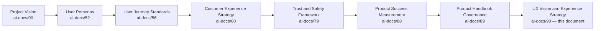

| Layer | Question It Answers |
|---|---|
| Project Vision | Why does a unified civic-commercial platform need to exist? |
| User Personas | Who, specifically, does Arwal serve? |
| User Journey Standards | What does one interaction feel like? |
| Customer Experience Strategy | What must a citizen feel, cumulatively, across the platform? |
| Trust & Safety Framework | How is trust created and protected everywhere? |
| Product Success Measurement | How does Arwal know whether something actually worked? |
| Product Handbook Governance | How does the handbook itself stay trustworthy? |
| **UX Vision & Experience Strategy** (this document) | **What is the durable, strategic reasoning behind how every future experience is designed?** |

### Relationship Between Every Participant

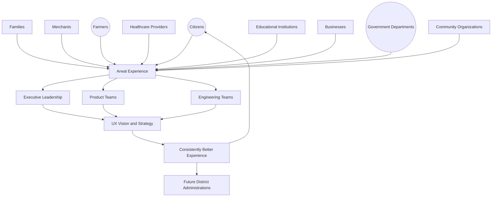

### Scope Boundary

This document does not define a component's visual treatment, a screen's layout, or an interaction pattern's exact mechanics — those belong to future phases building explicitly on top of this one. Its territory is strategic: the vision, the philosophy, the principles, the value chain, and the governance that make every future experience decision traceable to a single, coherent, citizen-first reasoning.

---

# UX Vision

> **Callout — The Experience Arwal Commits to Delivering**
> *"Whatever a citizen needs — a price, a certificate, a doctor, a delivery, a moment of belonging to their own district — using Arwal should feel effortless, safe, and unmistakably theirs, regardless of their literacy, language, device, or income."*

### How the Platform Should Feel

Arwal should feel like a **calm, capable, and trustworthy presence** in a citizen's daily life — never anxious-making, never confusing, never condescending. It should feel the way a well-run local institution feels: present when needed, unobtrusive otherwise, and always honest about what is happening and why, mirroring and extending the felt-experience commitment already established in `ai-docs/60-customer-experience-strategy.md`.

### The Desired Citizen Experience

A citizen using Arwal should be able to form an accurate mental model of what the platform can do for them within their first few interactions, complete their first genuine task without assistance wherever their own capability allows it, and never feel that the platform was designed for someone else — a more literate, more urban, more affluent version of themselves — and merely tolerated their own participation.

### Emotional Outcomes

| Emotional Outcome | What It Means in Practice |
|---|---|
| **Confidence** | A citizen believes they understand what will happen next, before they commit to an action. |
| **Trust** | A citizen believes the platform is honest about cost, status, and consequence, every time. |
| **Simplicity** | A citizen never needs to hold more than one new concept in mind at once to complete a task. |
| **Safety** | A citizen never fears an irreversible mistake is one accidental tap away. |
| **Accessibility** | A citizen's literacy, language, device, or ability is never the reason a task cannot be completed. |
| **Transparency** | A citizen can always see why something happened, what it cost, and what to do next. |
| **Reliability** | A citizen experiences the same category of outcome every time they attempt the same action. |
| **Empowerment** | A citizen feels more capable after using Arwal, never more dependent or more confused. |
| **Community** | A citizen feels part of something larger than a single transaction — a shared district life. |
| **Delight** | A citizen occasionally experiences a genuine, unexpected moment of ease or warmth, never manufactured or manipulative. |

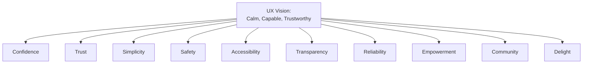

### The Long-Term UX Ambition

By its maturity, Arwal's experience should be recognized, district by district, as the standard against which every other digital civic-commercial experience is measured — not because it is the most visually elaborate, but because it is the most genuinely usable by the widest possible range of citizens, verified continuously rather than assumed.

---

# UX Philosophy

Every principle below exists because an experience strategy assembled carelessly does not fail abstractly — it fails a specific citizen who could not complete a task that mattered to them, in a moment they could least afford the friction.

### Human-Centered Design
**Why it exists:** Every experience decision begins with a genuine, evidenced understanding of a real citizen's need, context, and constraint — never with what is technically convenient to build or aesthetically appealing to a designer, mirroring the identical Citizen-First tie-breaker already established throughout `ai-docs/51` through `ai-docs/89`.

### Citizen First
**Why it exists:** Where an experience decision would serve an internal metric, a commercial upsell, or a convenient engineering shortcut at the citizen's expense, the citizen's genuine need prevails, without exception, restating the founding discipline already established in `ai-docs/00-project-vision.md`.

### Accessibility by Default
**Why it exists:** An experience is not accessible because an accessible component was used somewhere inside it — it is accessible because the experience was designed, from its first concept, for a citizen using a screen reader, a citizen with low vision, or a citizen navigating by voice, per the non-negotiable floor already established in `ai-docs/12-accessibility-standards.md`. Accessibility is never a pass applied afterward.

### Trust by Design
**Why it exists:** Trust is not a marketing outcome layered on top of an experience — it is a property engineered into the experience itself, per `ai-docs/79-trust-safety-framework.md`'s Safety by Design principle, applied here to the specific discipline of experience strategy.

### Inclusive Experiences
**Why it exists:** An experience designed around the median urban, literate, digitally fluent citizen and "made accessible" afterward has already excluded the citizens Arwal exists to serve first — inclusion is the starting design constraint, never a downstream patch, mirroring `ai-docs/00-project-vision.md`'s Inclusion over Optimization pillar.

### Consistency
**Why it exists:** A citizen who has learned how one interaction category works should never have to relearn a subtly different version of it elsewhere on the platform — consistency is what lets trust earned in one moment transfer to the next, per the identical Consistency Everywhere principle already established in `ai-docs/60-customer-experience-strategy.md`.

### Simplicity
**Why it exists:** Every experience decision defaults to the simplest form that correctly and durably solves the actual citizen need — complexity is introduced only when a demonstrated requirement justifies it, mirroring the Simple Before Powerful principle already established in `ai-docs/60`.

### Evidence-Based Design
**Why it exists:** A design decision is validated against genuine citizen behavior and outcome data, per `ai-docs/81-product-analytics-strategy.md`'s evidentiary discipline — never assumed correct because it seemed intuitive to the team that built it.

### Privacy by Design
**Why it exists:** An experience requests and reveals only the data a citizen has genuinely consented to share for the task at hand, per RULE-003's Consent Requirement — never structured to nudge a citizen into revealing more than a task requires.

### Transparency
**Why it exists:** A citizen can always see what is happening, why a decision was made, and what a given action will cost or change — concealment in experience design breeds exactly the suspicion `ai-docs/60-customer-experience-strategy.md` already rejects.

### Continuous Improvement
**Why it exists:** An experience that was well-designed at launch and never revisited decays as citizen needs, device profiles, and literacy patterns evolve — improvement is a scheduled, standing discipline, never an accident of a team happening to notice a problem.

### Long-Term Public Value
**Why it exists:** Arwal's UX strategy is evaluated on the same generational horizon as every other strategic document in this handbook — an experience decision optimized for this quarter's engagement metric at the cost of a citizen's long-term trust or capability is a regression, never a win.

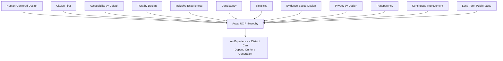

> **Callout — The One-Sentence UX Philosophy**
> *"If a citizen would not tell a neighbor 'it just works, and I never felt stupid using it,' the experience is not yet done — no matter how complete or elegant it looks in a review."*

---

# Experience Principles

Every principle below is a strategic commitment against which every future interaction, screen, and flow — designed in later phases — is measured.

| Principle | Strategic Commitment |
|---|---|
| **Clarity** | A citizen understands what an interface is asking of them and what will happen next, without needing to guess or experiment. |
| **Predictability** | The same category of action produces the same category of outcome, every time, across every module. |
| **Efficiency** | The path to a genuine citizen goal is the shortest one that does not compromise any other principle in this table. |
| **Learnability** | A first-time citizen can form a working mental model of a new capability within their first attempt, without external instruction. |
| **Discoverability** | A citizen can find a capability relevant to their need through an obvious, predictable path — never a hidden menu or an undocumented gesture. |
| **Responsiveness** | An interface acknowledges a citizen's action immediately, even when the underlying process takes longer to complete. |
| **Feedback** | Every citizen action produces a clear, immediate signal of what happened — success, failure, or a state in progress. |
| **Error Prevention** | An interface is designed to make a costly mistake difficult to make by accident, before it is designed to explain that mistake afterward. |
| **Forgiveness** | Where an error does occur, a citizen has a clear, low-cost path to correct it — never a dead end. |
| **Accessibility** | Every principle above holds equally for a citizen using assistive technology, a low-end device, or a low-bandwidth connection. |
| **Respect** | An interface never wastes a citizen's time, attention, or trust for Arwal's own convenience. |
| **Empathy** | An interface is designed with genuine understanding of the citizen's context — their stress, their urgency, their unfamiliarity — never merely their technical capability. |

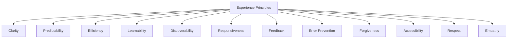

> **Callout — Principles Are Ordered by Priority When They Conflict**
> Where two principles in this table would suggest different design directions, Accessibility and Error Prevention are never subordinated to Efficiency or Delight — a faster flow that excludes a citizen or invites a costly mistake has not actually improved the experience, it has merely improved a metric that does not reflect the citizen's real outcome.

---

# User Experience Ecosystem

Every stakeholder below traces to its full Persona (`ai-docs/52`) and Stakeholder (`ai-docs/51`) record; this section states only the stakeholder's UX-specific responsibility and expectation.

| Stakeholder | UX Responsibility Arwal Holds Toward Them |
|---|---|
| **Citizens** | The foundational experience obligation — every principle in this document exists first and primarily for them. |
| **Families** | Design that genuinely supports delegated and assisted use, per CAP-005, without treating a shared device as an edge case. |
| **Merchants** | An operational experience that never assumes technical sophistication beyond what running a small local business genuinely requires. |
| **Businesses** | Experience depth that scales with a business's own size and complexity, never one-size-fits-all. |
| **Farmers** | Voice-first, low-literacy-friendly design as a primary mode, never a secondary accommodation, per PER-002 Meena. |
| **Healthcare Providers** | An experience that reduces administrative burden without ever inserting itself into clinical judgment. |
| **Education** | An experience that supports discovery and trust-building for students, parents, and educators alike, with elevated care for minor-involving flows. |
| **Government** | Officer-facing tooling held to the same clarity and error-prevention standard as any citizen-facing screen, never treated as an internal, lower-priority surface. |
| **Community** | Experiences that strengthen, rather than bypass, a citizen's existing local and social structures, per `ai-docs/75-community-social-engagement-strategy.md`. |
| **Platform Administrators** | Tooling that makes a consequential decision's basis clear and auditable, never a black box even to Arwal's own internal operators. |
| **Support Teams** | Full context carried into every escalation, so a citizen never has to re-explain themselves to a human after an experience already failed them. |

---

# Experience Value Chain

| Stage | Business Description |
|---|---|
| **Citizen Need** | A genuine, evidenced citizen need is identified — never assumed from internal intuition alone. |
| **Research** | The need is understood in its real context — literacy, device, connectivity, language, urgency — per `ai-docs/52-user-personas-user-segmentation.md`'s Evidence-Based Research principle. |
| **Experience Design** | A candidate experience is shaped against the Experience Principles above, deferring visual and technical specification to later phases. |
| **Validation** | The candidate experience is tested with real, representative citizens — especially a Vulnerable-tagged persona where relevant — before being trusted. |
| **Implementation Alignment** | The validated experience is handed to engineering and design-system phases with its intent, not merely its shape, preserved. |
| **Feedback** | Real citizen behavior and sentiment, per `ai-docs/81-product-analytics-strategy.md`, are gathered honestly against what was intended. |
| **Continuous Improvement** | Genuine gaps between intent and outcome are corrected, never left to accumulate. |
| **Institutional Learning** | Every cycle's finding — including a failed hypothesis — is retained permanently, per the Archive Never Delete principle already established throughout this handbook. |

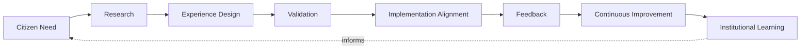

---

# Experience Lifecycle

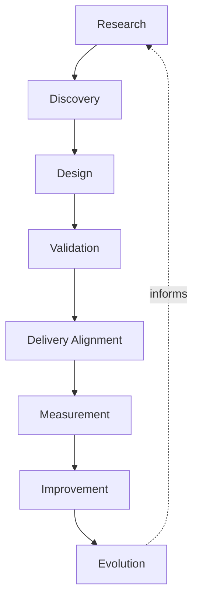

| Stage | Meaning |
|---|---|
| **Research** | Genuine citizen need, context, and constraint are understood before any design begins. |
| **Discovery** | The specific problem worth solving is framed precisely, distinguishing a genuine citizen need from an assumed one. |
| **Design** | A candidate experience is shaped against the Experience Principles, technology-independent at this stage. |
| **Validation** | The candidate is tested against real, representative citizens, including vulnerable and low-literacy segments. |
| **Delivery Alignment** | The validated experience's intent is preserved through implementation, never diluted by convenience. |
| **Measurement** | The delivered experience's real-world performance is measured honestly, per `ai-docs/88-product-success-measurement.md`'s discipline. |
| **Improvement** | A genuine gap between intent and outcome is corrected. |
| **Evolution** | The experience matures over years as citizen needs, devices, and literacy patterns shift. |

---

# Value Creation

| Question | Answer |
|---|---|
| **How does UX improve adoption?** | A citizen who succeeds on their first attempt is a citizen who returns — adoption is a direct, measurable consequence of experience quality, never a separate marketing concern. |
| **How does UX improve trust?** | Every principle in this document — Transparency, Predictability, Error Prevention — compounds into the Trust Value Chain already established in `ai-docs/79-trust-safety-framework.md`. |
| **How does UX improve accessibility?** | Accessibility by Default and Inclusive Experiences convert Arwal's civic mandate from an aspiration into a tested, verified property of every shipped experience. |
| **How does UX improve productivity?** | Efficiency and Learnability reduce the time a citizen, merchant, or officer spends fighting an interface rather than accomplishing their genuine goal. |
| **How does UX improve government services?** | Clarity and Error Prevention applied to officer-facing tooling directly reduce backlog and processing error, per `ai-docs/63-government-partnership-strategy.md`. |
| **How does UX strengthen communities?** | Respect and Empathy, applied to community-facing experiences, reinforce rather than bypass a district's own existing social structures, per `ai-docs/75-community-social-engagement-strategy.md`. |
| **How does UX create long-term public value?** | A citizen who experiences Arwal as genuinely respectful of their time, literacy, and dignity is a citizen who trusts the platform with more of their civic and commercial life over years, compounding exactly the value `ai-docs/61-value-proposition-framework.md` already establishes as Arwal's core structural advantage. |

---

# Responsible UX Strategy

| Mechanism | Strategic Role |
|---|---|
| **Privacy** | An experience never nudges a citizen toward revealing more data than their task genuinely requires, per RULE-003. |
| **Accessibility** | Every experience is verified, not merely assumed, to meet the non-negotiable floor already established in `ai-docs/12-accessibility-standards.md`. |
| **Ethical UX** | An experience decision is never justified by its conversion impact alone — it must also honor Citizen First and Trust by Design. |
| **Responsible AI Experience** | Any AI-mediated experience honors the absolute Human-in-the-Loop and Explainability commitments already established in `ai-docs/78-ai-product-strategy.md`, with no exception for a "smoother" experience. |
| **Inclusive Design** | Design research explicitly includes low-literacy, rural, elderly, and disabled citizens as primary research subjects, never an afterthought validation pass. |
| **Trust** | Every experience decision is evaluated for its effect on the Citizen Trust Score already established in `ai-docs/79-trust-safety-framework.md`. |
| **Government Collaboration** | A civic-facing experience is reviewed jointly with the relevant department before launch, never designed unilaterally by Arwal alone. |
| **Transparency** | A citizen can always understand why an experience behaves the way it does, never left to infer intent from an opaque interface. |

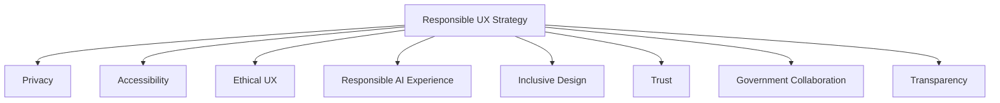

> **Callout — Dark Patterns Are Never an Acceptable Trade-Off**
> No experience decision in Arwal's history is permitted to increase a commercial metric through manufactured urgency, disguised cost, hidden opt-outs, or any other manipulation of a citizen's attention or understanding — this is not a style preference; it is an absolute floor beneath every other principle in this document, mirroring the identical Dark Patterns rejection already established in `ai-docs/60-customer-experience-strategy.md`.

---

# Economic & Social Impact

| Impact Area | How UX Contributes |
|---|---|
| **Citizen Satisfaction** | Clarity, Predictability, and Error Prevention directly raise CSAT, per `ai-docs/60-customer-experience-strategy.md`'s Experience Metrics. |
| **Business Growth** | A merchant who can operate their storefront without technical assistance grows their business faster and more confidently. |
| **Merchant Success** | Radically simple, respectful tooling lowers the barrier to genuine digital participation, per `ai-docs/67-merchant-ecosystem.md`. |
| **Healthcare Access** | Unambiguous booking confirmation and clear provider verification reduce anxiety at the platform's highest-stakes moments. |
| **Education Access** | Encouraging, judgment-free discovery experiences widen genuine access to tutoring and scholarships. |
| **Employment Opportunities** | Clear, honest listing and application experiences reduce exploitation risk for a vulnerable job seeker. |
| **Government Efficiency** | Officer-facing clarity directly reduces processing time and error, strengthening `ai-docs/63-government-partnership-strategy.md`'s civic promise. |
| **District Development** | A district whose citizens can genuinely, confidently use their own civic-commercial infrastructure is a district better positioned across every development area already named in `ai-docs/64-district-ecosystem-mapping.md`. |

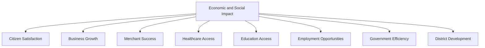

---

# Governance

### UX Council
A standing **UX Council** — chaired by the Chief Experience Officer (or CPO where the role is combined), with the Head of Accessibility & Inclusion, Head of Trust & Safety, Head of Government Partnerships, and rotating vertical UX leads as members — holds approval authority over any platform-wide experience-principle change, any material deviation from the Anti-Patterns below, and any experience decision materially affecting a Vulnerable-tagged persona's access. The Council meets monthly, with ad hoc sessions for an Experience Quality Index regression.

### Ownership
Every experience domain has exactly one named accountable owner, mirroring the Clear Ownership discipline already established throughout `ai-docs/53` through `ai-docs/89`. An unowned experience surface is treated as a governance defect, escalated immediately.

### Decision Authority

| Decision | Approval Authority |
|---|---|
| New Experience Principle | UX Council + CPO |
| Platform-wide experience-consistency change | UX Council |
| Vertical-specific experience decision | Vertical UX Lead + UX Council (informational) |
| Experience decision affecting a Vulnerable persona | UX Council + Head of Accessibility & Inclusion |
| Emergency experience-trust regression response | Chief Experience Officer, immediate, ratified by Council within 5 business days |

### Experience Reviews
Every material experience decision passes through a documented review against this document's Experience Principles before implementation, mirroring the identical review discipline already established in `ai-docs/56-user-journey-standards.md`'s Quality Gates.

### Design Governance
Detailed design-system and component-level governance is deferred entirely to later phases; this document's governance role is limited to protecting the strategic principles those later phases must build from, never their specific execution.

### Review Cadence

| Review | Cadence | Owner |
|---|---|---|
| Experience Health Review | Monthly | UX Council |
| Accessibility Parity Review | Quarterly | Head of Accessibility & Inclusion |
| Annual UX Strategy Review | Annual | CEO, CXO, CPO |

### Continuous Improvement
Every Feedback signal from the Experience Value Chain feeds a shared, tracked improvement backlog, reviewed at the next Experience Health Review, per the identical Continuous Improvement Loop already established throughout `ai-docs/60` through `ai-docs/89`.

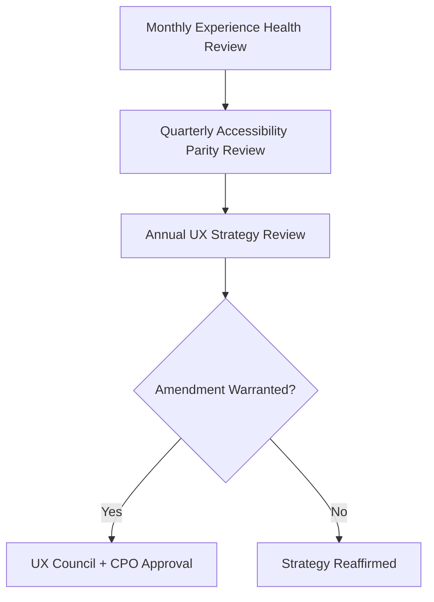

---

# Risks

| Risk | Description | Mitigation |
|---|---|---|
| **Inconsistent Experiences** | The same interaction category behaves differently across modules. | Consistency principle; UX Council review of cross-module patterns. |
| **Poor Accessibility** | An experience excludes a citizen using assistive technology or a low-end device. | Accessibility by Default; mandatory Validation stage with representative citizens. |
| **Dark Patterns** | A design nudges a citizen toward Arwal's commercial interest over their own stated goal. | Absolute, ungoverned prohibition per Responsible UX Strategy above. |
| **Trust Erosion** | A confusing or misleading experience damages citizen confidence platform-wide. | Trust by Design; Transparency principle; Experience Health Review monitoring. |
| **Complex Interfaces** | An experience demands more cognitive effort than the citizen's actual task requires. | Simplicity and Efficiency principles; Learnability validation. |
| **Fragmented Experiences** | A citizen experiences Arwal as a federation of loosely related mini-apps rather than one coherent platform. | Consistency principle; UX Council cross-vertical review. |
| **Poor Discoverability** | A citizen cannot find a capability relevant to their genuine need. | Discoverability principle; research-validated navigation patterns. |
| **Digital Exclusion** | An experience implicitly assumes a device, language, or literacy level a meaningful share of citizens do not have. | Inclusive Experiences; Accessibility by Default; research explicitly including vulnerable segments. |

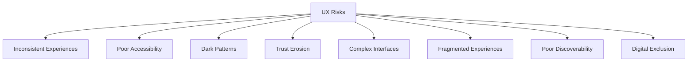

---

# Metrics

| Metric | Definition | Direction |
|---|---|---|
| **Experience Quality Index** | A composite index combining Task Success Rate, CSAT, and Accessibility Compliance. | Increasing |
| **Task Success Rate** | % of attempted citizen tasks reaching completion without abandonment or error. | Increasing |
| **Citizen Satisfaction Index** | CSAT specific to experience quality, cross-referenced from `ai-docs/60-customer-experience-strategy.md`. | Increasing |
| **Accessibility Compliance** | % of experiences meeting the non-negotiable floor in `ai-docs/12-accessibility-standards.md`. | Increasing toward 100% |
| **Trust Index** | District Trust Signal, viewed for experience-driven interactions specifically. | Increasing |
| **Usability Score** | A composite of Learnability and Error Rate across representative usability testing. | Increasing |
| **Experience Consistency Index** | The proportion of interaction categories behaving identically across every module that has one. | Increasing toward 100% |

> **Callout — No Experience Metric Stands Alone**
> Per the North Star Principle already established in `ai-docs/00-project-vision.md`, a rising Task Success Rate alongside a falling Accessibility Compliance, or a rising Usability Score alongside a falling Trust Index, is treated as a regression — never counted as success in isolation.

---

# Anti-Patterns

| Anti-Pattern | Why It's Rejected |
|---|---|
| **Design for Designers** | An experience optimized for aesthetic sophistication rather than genuine citizen usability violates Human-Centered Design. |
| **Dark Patterns** | Any manipulation of a citizen's attention or understanding for commercial gain violates Ethical UX absolutely. |
| **Inconsistent Experiences** | The same interaction category behaving differently across modules violates Consistency. |
| **Complex Workflows** | More steps or decisions than a citizen's genuine goal requires violates Simplicity and Efficiency. |
| **Ignoring Accessibility** | Treating accessibility as a checkbox rather than a design floor violates Accessibility by Default. |
| **Ignoring Feedback** | Real citizen behavior and sentiment collected but never acted on violates Continuous Improvement. |
| **Feature Overload** | Adding capability because it is possible, not because it serves a genuine citizen need, violates Citizen First. |
| **Visual Noise** | An interface crowded with competing signals violates Clarity and Respect for a citizen's attention. |

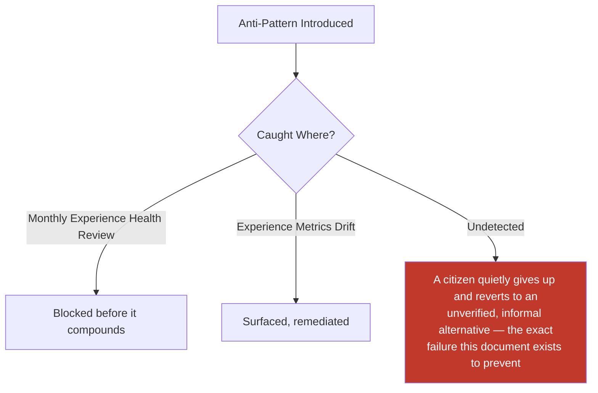

---

# Relationship to Previous Documents

| Prior Document | Relationship |
|---|---|
| **Project Vision (`ai-docs/00`)** | Establishes the founding Inclusion over Optimization pillar this document's every principle operationalizes at the experience-strategy layer. |
| **Product Vision & Business Strategy (`ai-docs/50`)** | Supplies the Strategic Objectives every UX decision ultimately traces to. |
| **User Personas (`ai-docs/52`)** | Supplies the individual, evidence-grounded citizens this document's Research and Validation stages are built directly around. |
| **Business Capability Map (`ai-docs/55`)** | Supplies the stable abilities every experience this document governs is ultimately expressing to a citizen. |
| **Business Rules & Policies (`ai-docs/58`)** | Supplies the precise logic (RULE-032's Accessibility Non-Negotiable Floor) this document's Accessibility by Default principle operationalizes at the experience-strategy layer. |
| **Customer Experience Strategy (`ai-docs/60`)** | Supplies the platform-wide, cumulative experience philosophy this document extends into a durable, design-facing strategic constitution. |
| **Trust & Safety Framework (`ai-docs/79`)** | Supplies the Trust Value Chain this document's Trust by Design principle is built directly on top of. |
| **Product Success Measurement (`ai-docs/88`)** | Supplies the evidentiary discipline this document's Measurement stage inherits directly, never redefining it. |
| **Product Handbook Governance (`ai-docs/89`)** | Supplies the governance-of-governance discipline this document's own Governance section is held to. |

### How UX Transforms Business Strategy Into Citizen Experience

Every prior document in this handbook establishes a business truth — a domain Arwal owns, a capability it can perform, a rule it follows, a value it creates. None of those truths reach a citizen directly; they reach a citizen only through an experience a human being can actually see, understand, and act on. This document is the deliberate translation layer: it takes the accumulated business, civic, and trust reasoning of eighty-nine prior phases and commits Arwal to rendering all of it, every time, as something a citizen — regardless of literacy, language, device, or income — can genuinely use with confidence.

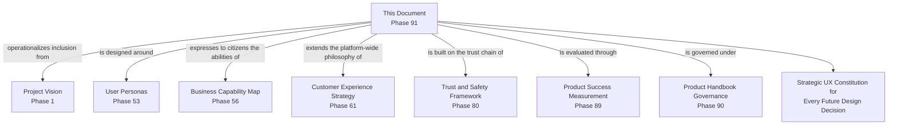

---

# Executive Artifacts

### UX Vision Framework

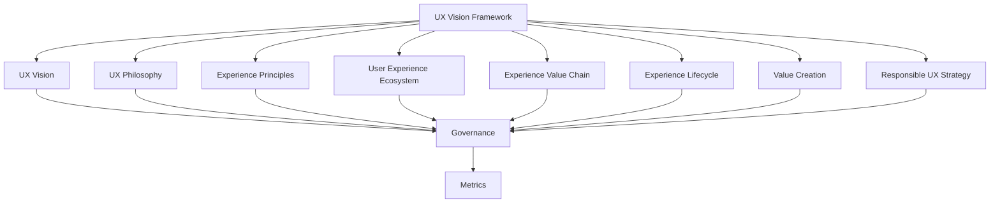

### Experience Value Chain

See Experience Value Chain section above — reproduced here by reference per Single Source of Truth, never duplicated.

### Experience Lifecycle

See Experience Lifecycle section above.

### UX Governance Model

See Governance section above.

### Experience Principles Matrix

| Principle | Primary Beneficiary | Conflict Resolution Priority |
|---|---|---|
| Accessibility | Vulnerable, low-literacy, rural citizens | Highest — never subordinated |
| Error Prevention | Every citizen, especially in high-stakes flows | Highest — never subordinated |
| Clarity | Every citizen | High |
| Trust by Design | Every citizen and institutional partner | High |
| Consistency | Every citizen across every module | Medium-High |
| Efficiency | Every citizen, once safety and clarity are satisfied | Medium |
| Delight | Every citizen, as a bonus, never a requirement | Lowest |

### Experience Maturity Model

| Level | Name | Characteristics |
|---|---|---|
| **1 — Informal** | Experience quality varies by team; no shared strategic standard. | High variance; anecdote-driven. |
| **2 — Developing** | Experience Principles are documented; inconsistently applied across verticals. | Uneven adoption. |
| **3 — Defined** | Every experience decision is measured against this document's Principles; Validation is routine. | This document's standard is fully met. |
| **4 — Measured** | Experience Metrics are actively tracked against explicit thresholds; deviations trigger a defined response. | Proactive, not reactive. |
| **5 — Optimized** | UX Strategy actively informs product and business strategy; genuinely replicable to a second district. | Experience is a durable competitive and civic advantage. |

Arwal's target state at the opening of Stage 3 is **Level 3 (Defined)**, with **Level 4 (Measured)** targeted as analytics tooling and design-system phases mature.

### Executive UX Dashboard (Conceptual)

| Dashboard | Audience | Key Content |
|---|---|---|
| **CEO / Board Dashboard** | CEO, Board | Experience Quality Index, Trust Index, District Development contribution |
| **CXO Dashboard** | CXO | Full UX Metrics suite, Experience Consistency Index, Council findings |
| **CPO Dashboard** | CPO | Task Success Rate by vertical, Feature-to-Experience-Principle traceability |
| **Accessibility Dashboard** | Head of Accessibility & Inclusion | Accessibility Compliance trend, Vulnerable-persona parity findings |
| **Government Partners Dashboard** | Government liaisons | Officer-facing experience performance, jointly reviewed civic-experience status |

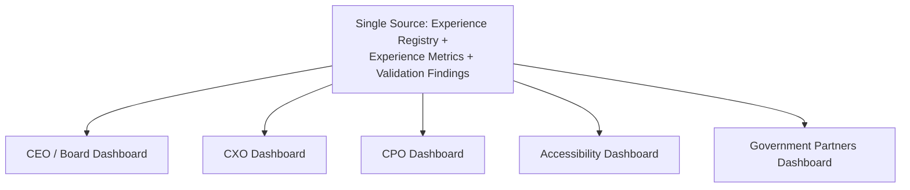

### Cross-Reference Table

| Governing Document | What This Strategy Consumes From It |
|---|---|
| `ai-docs/00-project-vision.md` | Inclusion over Optimization, founding accessibility commitments |
| `ai-docs/52-user-personas-user-segmentation.md` | The specific citizens every experience is designed for |
| `ai-docs/56-user-journey-standards.md` | Journey-level Failure Scenario and Recovery Path discipline |
| `ai-docs/58-business-rules-policies.md` | RULE-032's Accessibility Non-Negotiable Floor |
| `ai-docs/60-customer-experience-strategy.md` | Platform-wide, cumulative experience philosophy |
| `ai-docs/79-trust-safety-framework.md` | The Trust Value Chain this document's Trust by Design principle builds on |
| `ai-docs/88-product-success-measurement.md` | Evidentiary discipline for Measurement |
| `ai-docs/89-product-handbook-governance.md` | Governance-of-governance discipline |

### Decision Matrix

| Decision Type | Approval Authority |
|---|---|
| New Experience Principle | UX Council + CPO |
| Platform-wide consistency change | UX Council |
| Vertical-specific experience decision | Vertical UX Lead + UX Council (informational) |
| Decision affecting a Vulnerable persona | UX Council + Head of Accessibility & Inclusion |
| Emergency experience-trust response | Chief Experience Officer, ratified within 5 business days |

---

# Closing Statement

> **Callout — Closing Statement**
> Every prior document in this handbook explains what Arwal is, what it can do, and why a district should trust it. This document explains the one thing a citizen actually experiences, every single time they open the app: not a business domain, not a capability, not a rule — a feeling. Confidence that it will work. Trust that it is honest. Simplicity that respects their time. Safety that protects their mistakes. Accessibility that never makes their literacy, language, device, or income the reason they are left behind. This is the strategic UX constitution every future wireframe, prototype, and interaction pattern must trace back to — not because a designer is told to comply, but because a citizen's dignity depends on it being true, screen after screen, for as long as this platform exists. Where a future phase must deviate from a principle stated here, that deviation is made explicitly — through the UX Council's Governance process above — never silently, and never by default.

This document, `ai-docs/90-ux-vision-experience-strategy.md`, is Phase 91 of approximately 425. Every future design decision across the entire platform is expected to trace back to a principle defined here, or to justify its deviation in writing.

**End of Phase 91 — `ai-docs/90-ux-vision-experience-strategy.md`**