# Human-Centered Design Principles & UX Philosophy

**Document:** `ai-docs/91-human-centered-design-principles-ux-philosophy.md`
**Project:** Arwal — The District Super App
**Stage:** 3 — Experience & Design Strategy
**Phase:** 92 — Human-Centered Design Principles & UX Philosophy
**Status:** Approved for Executive & Enterprise Reference
**Audience:** CXO, CPO, Human-Centered Design Director, UX Strategy Consultants, Service Design Consultants, Design Ethics Consultants, Accessibility Specialists, Enterprise UX Architects, Government Digital Transformation Advisors, Trust & Safety Strategists, Product Strategists, Enterprise Documentation Architects

> **Callout — Purpose of This Document**
> `ai-docs/90-ux-vision-experience-strategy.md` established Arwal's UX Vision — what the platform must feel like, and the Experience Principles governing every future interaction. This document sits one layer deeper: it is the **constitutional design philosophy** underneath that vision — the permanent, technology-independent reasoning every designer, product manager, and engineer applies when a specific decision must be made and no wireframe yet exists to guide them. Where `ai-docs/90` says *what* Arwal's experience must feel like, this document says *why*, and gives every future design decision a citable standard to be judged against.

---

# Purpose of this Document

### Why Human-Centered Design Is a Strategic Capability, Not a Design-Team Habit

A design team can produce beautiful, technically excellent interfaces and still fail Arwal's mission if those interfaces were built around what was convenient to engineer rather than what a citizen genuinely needs. Human-Centered Design (HCD) is the discipline that inverts that default — starting every decision from a real citizen's context, capability, and dignity, and only then asking what technology can do to serve it. This document exists to make that inversion permanent, institutional, and binding, never dependent on which individual designer happens to be in the room.

### This Is Not a UI Guideline, Design System, or Component Library

This document defines no colors, no typography, no icons, no components, no grids, no layouts, no wireframes, no animations, and no frontend code — those are the deliberate territory of future phases, built *from* this document, never substituting for it. Its exclusive territory is: **why human-centered design governs Arwal, what constitutional principles every design decision must honor, how those principles are applied and evaluated, and how this philosophy is governed and protected for a generation.**

### Why Citizens, Not Technology, Are the Starting Point

Per `ai-docs/00-project-vision.md`'s founding premise, digital fragmentation is a form of inequality, and the citizens who suffer most from bad design are those with the least time, bandwidth, and digital literacy to work around it. A technology-first design process — "we have this capability, what can we build with it" — inevitably serves the engineer's convenience before the citizen's need. Human-Centered Design at Arwal begins every decision with the opposite question: what does this citizen, in this context, actually need — and only then, what technology serves that need best.

### How Design Philosophy Protects Long-Term Public Trust

Per `ai-docs/79-trust-safety-framework.md`, trust is Arwal's single most valuable long-term asset, and it is spent or grown with every interaction. A design decision that prioritizes short-term engagement over long-term citizen dignity — a confusing flow that increases session time, a manipulative prompt that increases conversion — spends that trust for a metric that will not survive the moment a citizen or a journalist notices the manipulation. Human-Centered Design exists specifically to make that trade-off structurally unavailable, never merely discouraged.

### How Design Principles Remain Consistent Across Multiple Districts

Per `ai-docs/50-product-vision-business-strategy.md`'s Strategic Expansion Principles, a second district inherits Arwal's *reasoning*, never its unverified assumptions. A design philosophy grounded in durable, technology-independent principles — accessibility, dignity, transparency — travels intact to a new district's different language, literacy profile, and device reality, whereas a design philosophy grounded in a specific visual style or a specific founding-district assumption does not. This document is written to be exactly that durable.

### Relationship Between Every Participant

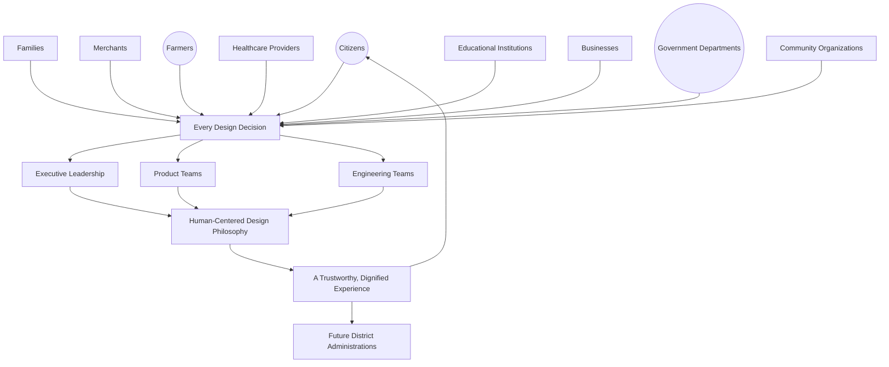

### Scope Boundary

This document does not define a component's visual treatment, a screen's layout, an interaction's exact mechanics, or a design system's tokens — those belong to future phases building explicitly on top of this one. Its territory is philosophical and constitutional: the principles, the decision framework, the ethics, and the governance every future design decision must be measured against.

---

# Human-Centered Design Philosophy

Every principle below is constitutional — permanent unless formally amended per Governance below, and binding on every designer, product manager, and engineer regardless of seniority.

### Design for Human Needs
**Why it exists:** A design decision begins with a genuine, evidenced human need — never a technical capability in search of a use case. Per `ai-docs/52-user-personas-user-segmentation.md`'s Evidence-Based Research principle, a need is confirmed through real citizen context, never assumed from a design team's own intuition.

### Citizen Before Technology
**Why it exists:** Where a technically elegant solution and a citizen-accessible solution diverge, the citizen-accessible solution wins, without exception. Technology serves the citizen's need; it is never permitted to define the need on the citizen's behalf.

### Accessibility First
**Why it exists:** Accessibility is the starting design constraint, never a downstream audit, per the non-negotiable floor already established in `ai-docs/12-accessibility-standards.md`. A design that must be "made accessible" after the fact has already failed this principle, regardless of how successfully it is later patched.

### Inclusion by Default
**Why it exists:** A design's default state serves the least digitally fluent citizen it will encounter, per `ai-docs/00-project-vision.md`'s Inclusion over Optimization pillar — power and complexity are revealed progressively, never assumed as the baseline.

### Trust by Design
**Why it exists:** Trust is a structural property engineered into an experience, never a marketing outcome layered on top of it, per `ai-docs/79-trust-safety-framework.md`'s Safety by Design principle applied here specifically to interface design.

### Privacy by Design
**Why it exists:** A design reveals and requests only the data a citizen has genuinely consented to share for the task at hand, per RULE-003's Consent Requirement — never structured to nudge disclosure beyond what the task requires.

### Transparency
**Why it exists:** A citizen can always see what is happening, why, and what a given action costs or changes — concealment in interface design is a trust violation regardless of its commercial convenience.

### Consistency
**Why it exists:** The same category of interaction behaves the same way everywhere it appears, per `ai-docs/90-ux-vision-experience-strategy.md`'s Consistency principle — a citizen who has learned one pattern should never have to relearn a subtly different one elsewhere.

### Simplicity
**Why it exists:** Every design decision defaults to the simplest form that correctly and durably solves the actual citizen need — complexity is introduced only when a demonstrated requirement justifies it, never speculatively.

### Evidence-Based Design
**Why it exists:** A design decision is validated against genuine citizen behavior and outcome data, per `ai-docs/81-product-analytics-strategy.md`'s evidentiary discipline — never assumed correct because it seemed intuitive to the team that built it.

### Ethical Decision Making
**Why it exists:** A design decision is never justified by its conversion or engagement impact alone — it must also honor every other principle in this document, especially where a business incentive and a citizen's genuine interest diverge.

### Long-Term Public Value
**Why it exists:** Design decisions are evaluated on the same generational horizon as every other strategic capability in this handbook — a decision optimized for this quarter's metric at the cost of a citizen's long-term trust or capability is a regression, never a win.

### Continuous Learning
**Why it exists:** A design that was correct at launch decays as citizen needs, devices, and literacy patterns evolve — this philosophy is applied continuously, never treated as a one-time certification.

### Institutional Responsibility
**Why it exists:** Arwal is public-purpose private infrastructure, per `ai-docs/00-project-vision.md` — every design decision is answerable, ultimately, to the district it serves, not merely to an internal roadmap or a commercial target.

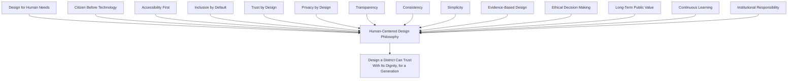

> **Callout — The One-Sentence Human-Centered Design Philosophy**
> *"A design decision that would embarrass Arwal if a citizen fully understood why it was made has already failed this philosophy — the test is never 'did it work,' it is 'was it honest, and was it built for them.'"*

---

# Design Decision Principles

Every design decision — however small — is evaluated against the following questions before it is considered acceptable. A decision that fails any question is returned for revision, never shipped on the assumption the answer is probably fine.

| Question | What It Protects Against |
|---|---|
| **Does this reduce cognitive load?** | A decision that adds an unnecessary choice, field, or concept a citizen must hold in mind. |
| **Does this increase citizen confidence?** | A decision that leaves a citizen unsure whether an action succeeded. |
| **Does this improve accessibility?** | A decision that quietly excludes a citizen using assistive technology, a low-end device, or a weak connection. |
| **Does this reduce errors?** | A decision that makes a costly mistake easier to make by accident. |
| **Does this improve trust?** | A decision that leaves a citizen uncertain about cost, consequence, or data use. |
| **Does this protect privacy?** | A decision that requests or reveals more than the task genuinely requires. |
| **Does this respect the citizen's time?** | A decision that adds a step, a wait, or a re-entry the citizen's goal did not require. |
| **Does this help vulnerable users?** | A decision evaluated specifically against a low-literacy, elderly, or first-generation smartphone citizen, never only a digitally fluent one. |
| **Would this still be acceptable if a family member used it?** | The final, plain-language test — would the designer be comfortable watching their own parent or child use this flow without assistance? |

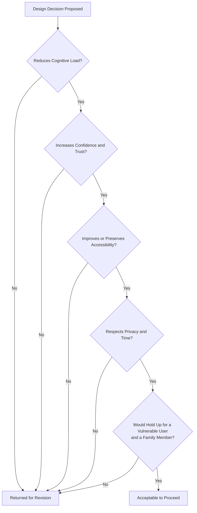

---

# Human Experience Framework

| Stage | Description |
|---|---|
| **Citizen Context** | The real conditions a citizen brings to the interaction — literacy, language, device, connectivity, urgency, emotional state. |
| **Research** | Genuine, evidenced understanding of that context, per `ai-docs/52-user-personas-user-segmentation.md`'s Evidence-Based Research principle — never assumed from internal intuition. |
| **Empathy** | A designer's genuine, disciplined attempt to reason from the citizen's actual situation, not a projection of their own. |
| **Problem Definition** | The specific, real citizen need is framed precisely, distinguishing it from an assumed or a technically convenient one. |
| **Experience Design** | A candidate experience is shaped against the Design Decision Principles above, technology-independent at this stage. |
| **Validation** | The candidate is tested with real, representative citizens — especially a Vulnerable-tagged persona — before being trusted. |
| **Measurement** | The delivered experience's real-world performance is measured honestly, per `ai-docs/88-product-success-measurement.md`'s discipline. |
| **Continuous Improvement** | A genuine gap between intent and outcome is corrected, never left to accumulate. |

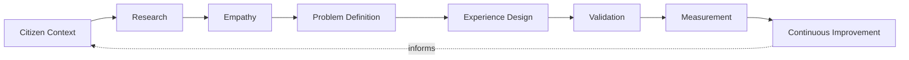

---

# Design Ethics

| Principle | Strategic Commitment |
|---|---|
| **Ethical UX** | A design decision is never justified by its commercial impact alone — it must also honor every constitutional principle above. |
| **Responsible Persuasion** | A design may encourage a genuinely beneficial action, but never through pressure, false urgency, or concealment. |
| **No Dark Patterns** | Absolute, ungoverned prohibition — no design decision manipulates a citizen's attention or understanding for Arwal's commercial gain, mirroring the identical prohibition already established in `ai-docs/60-customer-experience-strategy.md`. |
| **Respect for Attention** | A citizen's attention is treated as finite and valuable, never captured through notification noise or manufactured novelty. |
| **Respect for Time** | A design never adds friction a citizen's genuine goal did not require. |
| **Respect for Consent** | A citizen's consent is genuine, informed, and revocable — never assumed, bundled, or buried. |
| **Responsible AI Experiences** | Every AI-mediated experience honors the absolute Human-in-the-Loop and Explainability commitments already established in `ai-docs/78-ai-product-strategy.md`, with no exception for a "smoother" experience. |
| **Government Transparency** | A civic-facing design is held to the same, or a higher, ethical bar as any commercial surface — a citizen's government interaction is never the place experimentation with persuasion techniques is acceptable. |

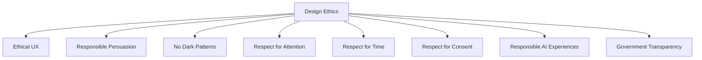

> **Callout — Dark Patterns Are Never a Style Preference**
> No design decision in Arwal's history is permitted to increase a commercial metric through manufactured urgency, disguised cost, hidden opt-outs, or any other manipulation of a citizen's understanding. This is a floor beneath every other principle in this document — it is the single anti-pattern the Human-Centered Design Council reviews with zero tolerance for exception.

---

# Value Creation

| Question | Answer |
|---|---|
| **How does HCD improve adoption?** | A citizen who succeeds on their first attempt is a citizen who returns — every constitutional principle above compounds directly into adoption. |
| **How does HCD improve accessibility?** | Accessibility First and Inclusion by Default convert Arwal's civic mandate into a tested, verified property of every shipped experience. |
| **How does HCD improve trust?** | Trust by Design and Transparency compound directly into the Trust Value Chain already established in `ai-docs/79-trust-safety-framework.md`. |
| **How does HCD improve government services?** | Simplicity and Error reduction applied to officer-facing tooling directly reduce backlog and processing error. |
| **How does HCD improve merchant success?** | Respect for Time and Simplicity lower the barrier to a small merchant operating their storefront without technical assistance. |
| **How does HCD improve healthcare access?** | Trust by Design and Error Prevention reduce anxiety and mistakes at the platform's highest-stakes moments. |
| **How does HCD improve education access?** | Ethical Decision Making ensures discovery experiences remain judgment-free and genuinely serve a student's interest. |
| **How does HCD improve employment?** | Transparency ensures a job seeker never applies to a listing whose true nature was concealed. |
| **How does HCD create long-term public value?** | A citizen who experiences Arwal as genuinely respectful of their dignity trusts the platform with more of their civic and commercial life over years — the same structural advantage `ai-docs/61-value-proposition-framework.md` names as Arwal's core moat. |

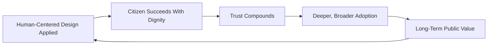

---

# Responsible Design Strategy

| Mechanism | Strategic Role |
|---|---|
| **Inclusive Design** | Design research explicitly includes low-literacy, rural, elderly, and disabled citizens as primary research subjects, never an afterthought validation pass. |
| **Accessibility** | Every design is verified, not merely assumed, to meet the non-negotiable floor already established in `ai-docs/12-accessibility-standards.md`. |
| **Privacy** | A design never nudges a citizen toward revealing more data than their task genuinely requires. |
| **Trust** | Every design decision is evaluated for its effect on the Citizen Trust Score already established in `ai-docs/79-trust-safety-framework.md`. |
| **Responsible AI** | AI-mediated design decisions are held to RULE-024's Automation Boundary without exception. |
| **Government Collaboration** | A civic-facing design is reviewed jointly with the relevant department before launch. |
| **Continuous Learning** | Design research and validation are recurring, standing disciplines, never a one-time certification. |
| **Institutional Responsibility** | Every design decision is answerable, ultimately, to the district Arwal serves. |

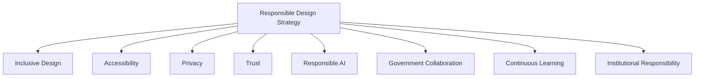

---

# Economic & Social Impact

| Impact Area | How Human-Centered Design Contributes |
|---|---|
| **Citizen Satisfaction** | Simplicity and Trust by Design directly raise CSAT, per `ai-docs/60-customer-experience-strategy.md`. |
| **Business Growth** | A merchant who can operate confidently without technical assistance grows their business faster. |
| **Government Efficiency** | Officer-facing clarity directly reduces processing time and error. |
| **Community Engagement** | Ethical, respectful design reinforces rather than bypasses a district's existing social structures. |
| **District Development** | A district whose citizens can genuinely, confidently use their own civic-commercial infrastructure is better positioned across every development area already named in `ai-docs/64-district-ecosystem-mapping.md`. |
| **Digital Inclusion** | Accessibility First and Inclusion by Default widen, not narrow, the population that can succeed unassisted. |

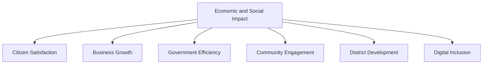

---

# Governance

### Human-Centered Design Council
A standing **Human-Centered Design Council** — chaired by the CXO, with the CPO, Head of Accessibility & Inclusion, Head of Trust & Safety, Head of Government Partnerships, and rotating vertical UX leads as members — holds approval authority over any constitutional principle change, any material deviation from the Anti-Patterns below, and any design decision materially affecting a Vulnerable-tagged persona. The Council meets monthly, with ad hoc sessions for a Human Experience Index regression.

### Ownership
Every design domain has exactly one named accountable owner, mirroring the Clear Ownership discipline already established throughout `ai-docs/53` through `ai-docs/90`.

### Decision Authority

| Decision | Approval Authority |
|---|---|
| New constitutional design principle | HCD Council + CPO + CEO |
| Platform-wide design-decision-framework change | HCD Council |
| Vertical-specific design decision | Vertical UX Lead + HCD Council (informational) |
| Decision affecting a Vulnerable persona | HCD Council + Head of Accessibility & Inclusion |
| Suspected dark-pattern or ethics violation | HCD Council, immediate review, no exception |

### Design Reviews
Every material design decision passes through a documented review against the Design Decision Principles before implementation.

### Ethics Reviews
Every design decision touching persuasion, urgency, or data disclosure passes an explicit Ethics Review against the Design Ethics section above, independent of the proposing team.

### Review Cadence

| Review | Cadence | Owner |
|---|---|---|
| Design Philosophy Health Review | Monthly | HCD Council |
| Ethics & Dark-Pattern Audit | Quarterly | HCD Council, Head of Trust & Safety |
| Annual HCD Philosophy Review | Annual | CEO, CXO, CPO |

### Continuous Improvement
Every Feedback signal from the Human Experience Framework feeds a shared, tracked improvement backlog, reviewed at the next Design Philosophy Health Review.

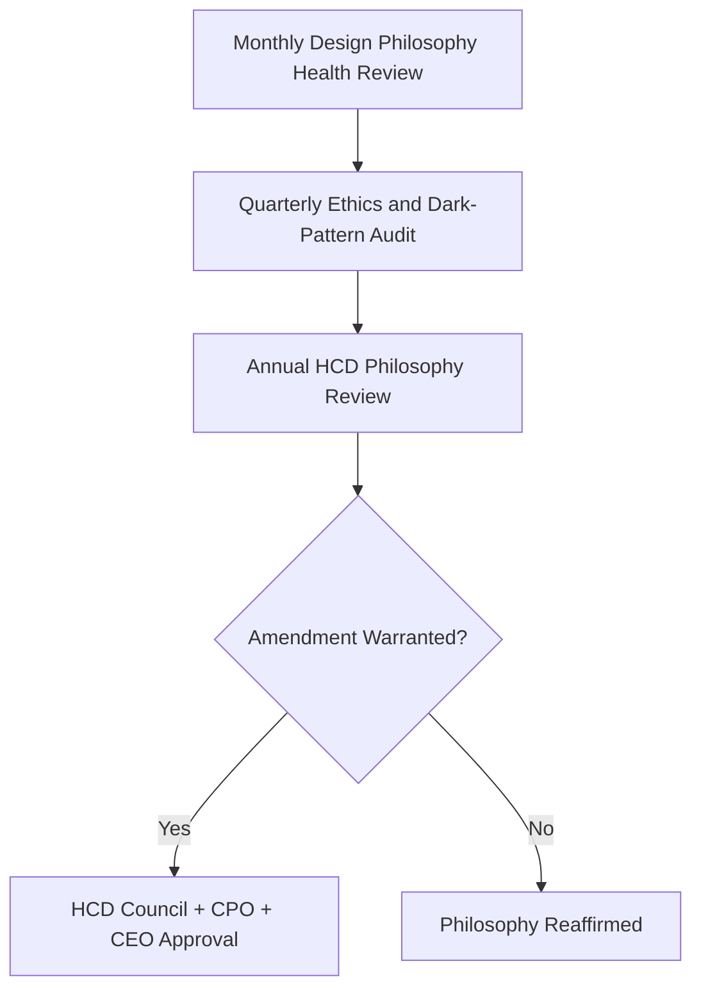

---

# Risks

| Risk | Description | Mitigation |
|---|---|---|
| **Technology-First Design** | A capability is built because it is technically possible, not because a citizen need requires it. | Citizen Before Technology principle; mandatory Research stage before Design. |
| **Designer Bias** | A design reflects the designer's own habits and device capability rather than a genuine citizen's. | Evidence-Based Design; mandatory Validation with representative, vulnerable citizens. |
| **Dark Patterns** | A design manipulates citizen attention or understanding for commercial gain. | Absolute, zero-tolerance prohibition per Design Ethics. |
| **Accessibility Debt** | Accessibility is deferred as a "later" pass rather than a starting constraint. | Accessibility First; Design Reviews block a non-compliant decision before ship. |
| **Over-Complexity** | A design accumulates unnecessary steps, fields, or concepts over time. | Simplicity principle; periodic Continuous Improvement review. |
| **Feature Creep** | Capability is added because it is possible, not because it serves a genuine citizen need. | Design for Human Needs; HCD Council review of scope. |
| **Trust Erosion** | A confusing or misleading design damages citizen confidence platform-wide. | Trust by Design; Transparency; Design Philosophy Health Review monitoring. |
| **Digital Exclusion** | A design implicitly assumes a device, language, or literacy level a meaningful share of citizens do not have. | Inclusion by Default; Accessibility First; research explicitly including vulnerable segments. |

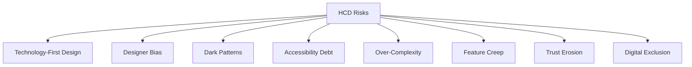

---

# Metrics

| Metric | Definition | Direction |
|---|---|---|
| **Human Experience Index** | A composite score reflecting how well delivered experiences honor the constitutional principles above. | Increasing |
| **Citizen Confidence Index** | The rate at which citizens report certainty that an action succeeded. | Increasing |
| **Accessibility Index** | % of experiences meeting `ai-docs/12-accessibility-standards.md`'s non-negotiable floor. | Increasing toward 100% |
| **Ethical Design Score** | The proportion of design decisions passing Ethics Review with no dark-pattern finding. | Approaching 100% |
| **Trust Index** | District Trust Signal, viewed for design-driven interactions specifically. | Increasing |
| **Usability Maturity** | A composite of Learnability, Error Rate, and Task Success across representative usability testing. | Increasing |
| **Design Consistency Score** | The proportion of interaction categories behaving identically across every module that has one. | Increasing toward 100% |

> **Callout — No HCD Metric Stands Alone**
> Per the North Star Principle already established in `ai-docs/00-project-vision.md`, a rising Human Experience Index alongside a falling Accessibility Index, or a rising Usability Maturity alongside a falling Trust Index, is treated as a regression — never counted as success in isolation.

---

# Anti-Patterns

| Anti-Pattern | Why It's Rejected |
|---|---|
| **Designing for Internal Teams** | An interface optimized for what is easy to build or review, rather than what a citizen needs, violates Citizen Before Technology. |
| **Technology Looking for a Problem** | A capability introduced because it is technically novel, not because a genuine citizen need requires it, violates Design for Human Needs. |
| **Dark Patterns** | Any manipulation of citizen attention or understanding for commercial gain violates Design Ethics absolutely. |
| **Ignoring Accessibility** | Treating accessibility as a checkbox rather than a starting constraint violates Accessibility First. |
| **Ignoring Research** | Shipping a design without genuine citizen context understanding violates Evidence-Based Design. |
| **Ignoring Feedback** | Real citizen behavior and sentiment collected but never acted on violates Continuous Learning. |
| **Over-Engineering** | A solution more complex than the citizen's genuine need requires violates Simplicity. |
| **Visual Complexity** | An interface crowded with competing signals violates Respect for Attention and Simplicity. |

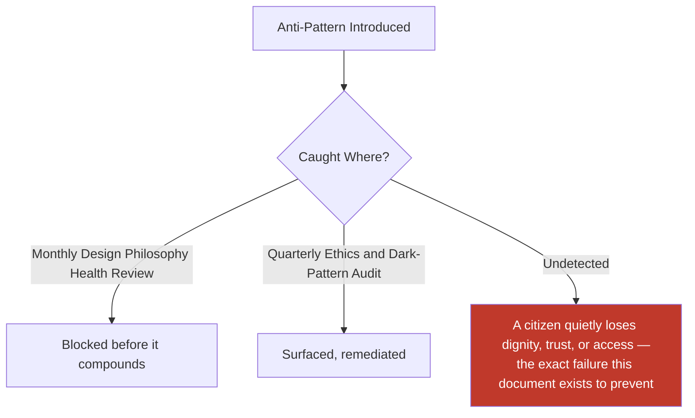

---

# Relationship to Previous Documents

| Prior Document | Relationship |
|---|---|
| **Project Vision (`ai-docs/00`)** | Establishes the founding Inclusion over Optimization pillar this document's every constitutional principle operationalizes at the design-decision layer. |
| **User Personas (`ai-docs/52`)** | Supplies the individual, evidence-grounded citizens this document's Human Experience Framework is built directly around. |
| **Customer Experience Strategy (`ai-docs/60`)** | Supplies the platform-wide, cumulative experience philosophy this document translates into decision-level design principles. |
| **Trust & Safety Framework (`ai-docs/79`)** | Supplies the Trust Value Chain this document's Trust by Design principle is built directly on top of. |
| **Product Success Measurement (`ai-docs/88`)** | Supplies the evidentiary discipline this document's Measurement stage inherits directly. |
| **Product Handbook Governance (`ai-docs/89`)** | Supplies the governance-of-governance discipline this document's own Governance section is held to. |
| **UX Vision & Experience Strategy (`ai-docs/90`)** | Supplies the strategic UX constitution — Vision, Philosophy, Experience Principles — this document extends into the specific, everyday Design Decision Principles a designer applies at the moment of a real decision. |

### How This Document Transforms UX Vision Into Everyday Design Decisions

`ai-docs/90-ux-vision-experience-strategy.md` establishes what Arwal's experience must feel like and the durable principles governing it. This document is the layer where those principles become a usable decision tool — a designer facing a specific, concrete choice does not re-derive Accessibility by Default from first principles; they apply the Design Decision Principles above, directly, in the moment, with a citable standard behind every answer.

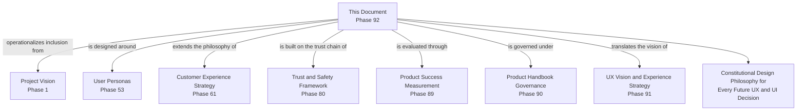

---

# Executive Artifacts

### Human-Centered Design Framework

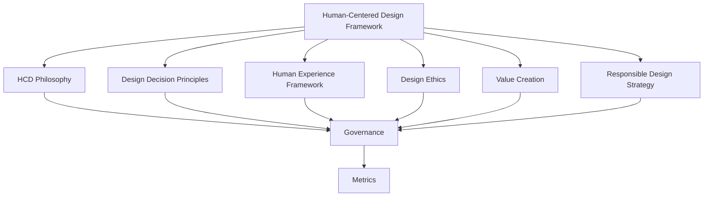

### Design Decision Framework

See Design Decision Principles section above — reproduced here by reference per Single Source of Truth, never duplicated.

### Design Ethics Framework

See Design Ethics section above.

### Experience Validation Framework

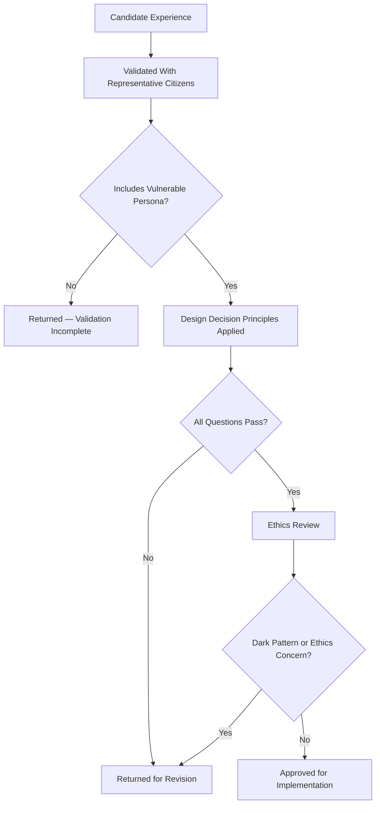

### Design Governance Model

See Governance section above.

### Human-Centered Design Maturity Model

| Level | Name | Characteristics |
|---|---|---|
| **1 — Informal** | Design decisions vary by individual designer; no shared constitutional standard. | High variance; anecdote-driven. |
| **2 — Developing** | Constitutional principles are documented; inconsistently applied across teams. | Uneven adoption. |
| **3 — Defined** | Every design decision is measured against this document's Design Decision Principles. | This document's standard is fully met. |
| **4 — Measured** | HCD Metrics are actively tracked against explicit thresholds; deviations trigger a defined response. | Proactive, not reactive. |
| **5 — Optimized** | Human-Centered Design actively informs product and business strategy; genuinely replicable to a second district. | HCD is a durable civic and competitive advantage. |

Arwal's target state at this stage is **Level 3 (Defined)**, with **Level 4 (Measured)** targeted as design-system and analytics tooling mature in subsequent phases.

### Executive UX Philosophy Dashboard (Conceptual)

| Dashboard | Audience | Key Content |
|---|---|---|
| **CEO / Board Dashboard** | CEO, Board | Human Experience Index, Trust Index, District Development contribution |
| **CXO Dashboard** | CXO | Full HCD Metrics suite, Ethics Audit findings, Council decisions |
| **CPO Dashboard** | CPO | Design Decision Framework compliance by vertical |
| **Accessibility Dashboard** | Head of Accessibility & Inclusion | Accessibility Index trend, Vulnerable-persona validation findings |
| **Government Partners Dashboard** | Government liaisons | Civic-facing design ethics status, jointly reviewed experience decisions |

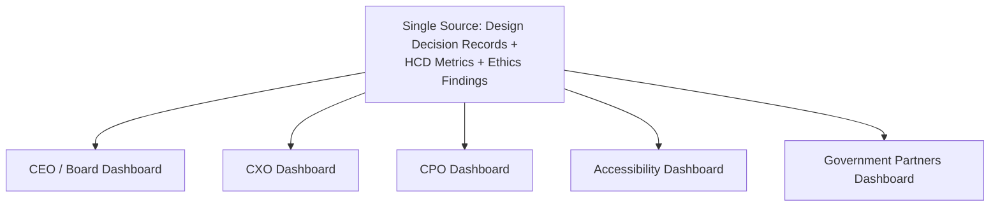

### Cross-Reference Table

| Governing Document | What This Philosophy Consumes From It |
|---|---|
| `ai-docs/00-project-vision.md` | Inclusion over Optimization, founding accessibility commitments |
| `ai-docs/52-user-personas-user-segmentation.md` | The specific citizens every design decision is evaluated against |
| `ai-docs/60-customer-experience-strategy.md` | Platform-wide, cumulative experience philosophy |
| `ai-docs/78-ai-product-strategy.md` | RULE-024's Automation Boundary for Responsible AI Experiences |
| `ai-docs/79-trust-safety-framework.md` | The Trust Value Chain this document's Trust by Design principle builds on |
| `ai-docs/88-product-success-measurement.md` | Evidentiary discipline for Measurement |
| `ai-docs/89-product-handbook-governance.md` | Governance-of-governance discipline |
| `ai-docs/90-ux-vision-experience-strategy.md` | The strategic UX constitution this document translates into decision-level principles |

### Decision Matrix

| Decision Type | Approval Authority |
|---|---|
| New constitutional design principle | HCD Council + CPO + CEO |
| Platform-wide design-decision-framework change | HCD Council |
| Vertical-specific design decision | Vertical UX Lead + HCD Council (informational) |
| Decision affecting a Vulnerable persona | HCD Council + Head of Accessibility & Inclusion |
| Suspected dark-pattern or ethics violation | HCD Council, immediate review |

---

# Closing Statement

> **Callout — Closing Statement**
> Every prior document in this handbook explains what Arwal is, what it can do, and what it must feel like. This document explains the reasoning a designer, a product manager, or an engineer actually reaches for in the moment a real decision must be made and no wireframe yet exists to guide them: is this built for a human being's actual need, or for a technology's convenience? Does it respect a citizen's time, attention, and dignity, or merely their attention span? Would it still be acceptable if the designer's own parent, using their first smartphone, had to complete it alone? Human-Centered Design is not a department at Arwal — it is the standing, constitutional test every interface must pass before it is allowed to stand between a citizen and something that matters to their life. Where a future phase must deviate from a principle stated here, that deviation is made explicitly — through the Human-Centered Design Council's Governance process above — never silently, and never by default.

This document, `ai-docs/91-human-centered-design-principles-ux-philosophy.md`, is Phase 92 of approximately 425. Every future UX and UI decision across the entire platform is expected to trace back to a principle defined here, or to justify its deviation in writing.

**End of Phase 92 — `ai-docs/91-human-centered-design-principles-ux-philosophy.md`**