# Information Architecture

**Document:** `ai-docs/92-information-architecture.md`
**Project:** Arwal — The District Super App
**Stage:** 3 — Experience & Design Strategy
**Phase:** 93 — Information Architecture
**Status:** Approved for Executive & Enterprise Reference
**Audience:** CXO, CPO, Enterprise Information Architect, Enterprise UX Architect, Digital Transformation Consultants, Government Digital Services Advisors, Human-Centered Design Consultants, Content Strategy Consultants, Accessibility Specialists, Enterprise Knowledge Architects, Design Governance Consultants, Enterprise Documentation Architects

> **Callout — Purpose of This Document**
> `ai-docs/90-ux-vision-experience-strategy.md` established what Arwal's experience must feel like. `ai-docs/91-human-centered-design-principles-ux-philosophy.md` established the constitutional reasoning behind every design decision. Neither document answers a question that sits beneath both: **how is the information itself — every domain, capability, module, page, and piece of content Arwal will ever contain — organized, labeled, classified, and connected so that a citizen can actually find it?** This document is that answer — the authoritative Information Architecture every future navigation, content model, taxonomy, and discoverability decision traces back to.

---

# Purpose of this Document

### Why Information Architecture Is Foundational, Not Decorative

A citizen does not experience Arwal's Business Domains (`ai-docs/53`), Business Capabilities (`ai-docs/55`), or Business Rules (`ai-docs/58`) directly — they experience an organized (or disorganized) space of labels, categories, and pathways standing between themselves and everything those documents describe. Information Architecture (IA) is the discipline that determines whether that space is legible or bewildering. A platform can have a perfectly reasoned domain model and still fail a citizen if a certificate, a doctor, or a mandi price cannot be found within it. IA is the structural layer beneath every screen this handbook's future phases will design — it exists before a wireframe, and every wireframe depends on it being right.

### How IA Supports Human-Centered Design

`ai-docs/91-human-centered-design-principles-ux-philosophy.md` establishes that a design decision begins with a genuine citizen need, never a technical convenience. IA is the mechanism that carries that commitment from a single screen into the whole platform: it organizes information around how a citizen actually thinks about their need — "renew my certificate," "find a doctor," "check today's price" — never around Arwal's own internal team structure, database design, or org chart. An IA organized around internal convenience recreates, at the structural level, the exact Technology-First anti-pattern `ai-docs/91` already rejects at the decision level.

### How Structured Information Reduces Cognitive Load and Builds Trust

Every additional category a citizen must parse, every unlabeled icon, and every inconsistent term is a real cost paid disproportionately by the citizens Arwal exists to serve first — a first-generation smartphone user, a low-literacy farmer, an elderly citizen. A clear, predictable, consistent information structure lowers that cost to nearly zero for a confident citizen and makes the difference between success and abandonment for an unconfident one. Structure is also a trust signal in its own right: a citizen who can predict where something will be, and finds it there, has one more reason to believe the platform is honest and competent — the same Predictability and Trust by Design principles already established in `ai-docs/90` and `ai-docs/91`, now expressed structurally.

### How IA Enables Scalability, Multi-District Expansion, and Governance

Per `ai-docs/50-product-vision-business-strategy.md`'s Strategic Expansion Principles, a second district inherits Arwal's reasoning, never its unexamined assumptions. An Information Architecture built around durable, technology-independent organizing principles — domain-anchored categories, consistent labeling conventions, governed taxonomy — travels intact to a new district's language and civic structure, whereas an IA built as an accumulation of ad hoc navigation decisions does not. IA is also what makes governance possible at all: `ai-docs/49-engineering-handbook-governance-evolution-standards.md`'s discipline of a single, citable, ownable artifact applies here exactly as it applies to every other layer of this handbook — an ungoverned information structure degrades identically to an ungoverned domain, module, or rule.

### The Chain of Reasoning This Document Extends

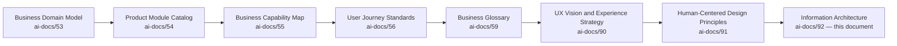

| Layer | Question It Answers |
|---|---|
| Business Domain Model | Who owns this business concern? |
| Product Module Catalog | What does a citizen open? |
| Business Capability Map | What can Arwal do? |
| User Journey Standards | What does one interaction feel like? |
| Business Glossary | What does each word mean, precisely? |
| UX Vision & Experience Strategy | What must a citizen feel, cumulatively? |
| Human-Centered Design Principles | What is the reasoning behind every design decision? |
| **Information Architecture** (this document) | **How is every piece of information organized, labeled, classified, and connected so a citizen can actually find it?** |

### Scope Boundary

This document contains no frontend routing, no Next.js App Router structure, no folder layout, no database schema, no backend API, no microservice boundary, no CMS platform choice, no search-engine implementation, and no programming framework. Every one of those remains the deliberate territory of future, technology-facing phases building explicitly on top of this one. This document's exclusive territory is: **why Information Architecture matters, the enterprise information model, content taxonomy and classification, labeling strategy, content relationships, discovery principles, scalability, accessibility, and governance** — the business- and citizen-facing structure every future technical implementation must express faithfully, never redefine independently.

---

# Information Architecture Philosophy

Every principle below exists because an information structure assembled carelessly does not fail abstractly — it fails a specific citizen who could not find the one thing they opened the app to do.

### People Before Structure
**Why it exists:** An information structure is built around how a real citizen thinks about their need, never around how Arwal's internal teams, domains, or databases happen to be organized. Where an internal domain boundary and a citizen's mental model diverge, the citizen's mental model governs the visible structure, per the identical Citizen-First tie-breaker already established throughout `ai-docs/51` through `ai-docs/91`.

### Structure Around User Mental Models
**Why it exists:** A citizen searching for "a doctor" does not think in terms of a "Healthcare Discovery Capability" — they think "I need to see a doctor." Every category, label, and pathway in this architecture is validated against genuine citizen language and expectation, per `ai-docs/52-user-personas-user-segmentation.md`'s Evidence-Based Research principle, never assumed from an internal team's own vocabulary.

### Clarity Before Complexity
**Why it exists:** A structure that is technically comprehensive but not immediately legible has failed its purpose. Every organizing decision defaults to the clearest structure that correctly serves the actual need, complexity introduced only when a demonstrated requirement justifies it, mirroring the Simplicity principle already established in `ai-docs/91-human-centered-design-principles-ux-philosophy.md`.

### Consistency Across Modules
**Why it exists:** A citizen who has learned how "track an order" is organized in Marketplace should never have to relearn a differently structured equivalent in Grocery or Food, per the identical Consistency principle already established in `ai-docs/54-product-module-catalog.md` and `ai-docs/90-ux-vision-experience-strategy.md`.

### Predictability
**Why it exists:** A citizen who understands one part of the structure should be able to correctly guess the shape of an unfamiliar part — the same Predictability discipline already established for API design in `ai-docs/13-api-design-guidelines.md`, applied here to the citizen-facing information space.

### Progressive Disclosure
**Why it exists:** Information reveals depth only as it becomes relevant — a citizen is never confronted with every category, filter, or option a domain contains before they have expressed a need for it, mirroring `ai-docs/00-project-vision.md`'s Progressive Complexity principle.

### Scalable Organization
**Why it exists:** A structure that only accommodates today's twenty modules will not gracefully absorb the next two hundred — every category is designed with headroom for growth, per the same Future Scalability discipline already established in `ai-docs/55-business-capability-map.md`.

### Minimal Cognitive Load
**Why it exists:** Every additional category, label, or decision point a citizen must process is a real cost, paid disproportionately by exactly the citizens Arwal exists to serve first, mirroring `ai-docs/56-user-journey-standards.md`'s Minimal Cognitive Load principle extended to the structural layer.

### Accessibility by Default
**Why it exists:** An information structure is accessible because its hierarchy, labeling, and reading order were designed for a screen-reader user and a voice-first user from the first draft, never patched in afterward, per the non-negotiable floor already established in `ai-docs/12-accessibility-standards.md`.

### Inclusive Information Design
**Why it exists:** A structure that assumes literacy, a shared national language, or digital fluency has already excluded a meaningful share of Arwal's population, per the founding Inclusion over Optimization pillar in `ai-docs/00-project-vision.md`.

### Trust Through Clarity
**Why it exists:** A citizen who can predict, correctly, where something will be, and finds it there, has one more reason to trust the platform generally — structural clarity is a trust mechanism, not merely a usability one, per `ai-docs/79-trust-safety-framework.md`'s Trust Value Chain.

### Long-Term Maintainability
**Why it exists:** An information structure that can only be understood by whoever built it decays the moment that person moves to other work — every category and label is documented, owned, and governed so a future architect, unfamiliar with today's reasoning, can maintain it correctly.

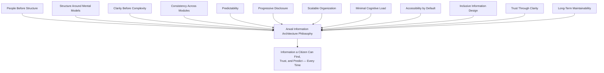

> **Callout — The One-Sentence Information Architecture Philosophy**
> *"If a citizen cannot correctly guess where something lives before they look for it, the structure was built for the organization that made it, not for the person who needs it."*

---

# Enterprise Information Model

The Enterprise Information Model defines the durable hierarchy every piece of Arwal information belongs to, distinct from — and mapped onto — the Business Domain Model (`ai-docs/53`), Product Module Catalog (`ai-docs/54`), and Business Capability Map (`ai-docs/55`) already established in this handbook.

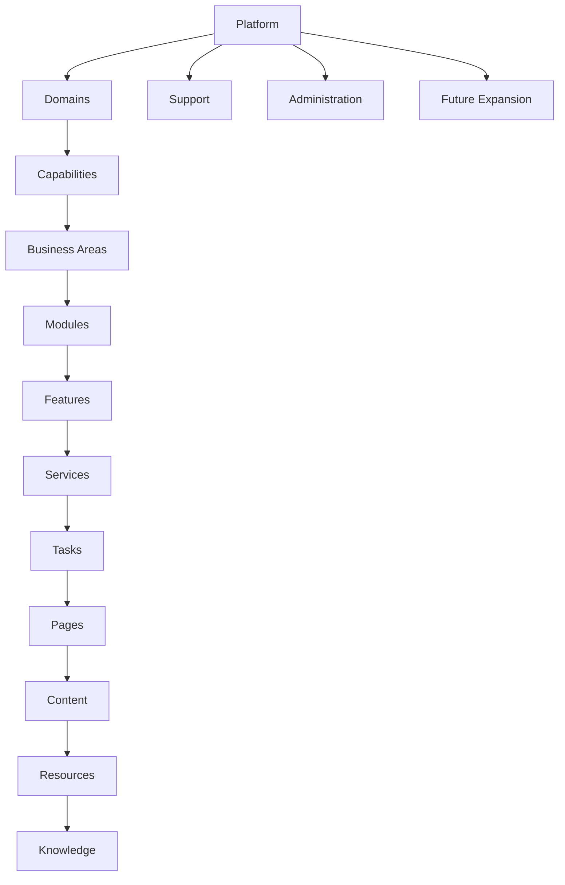

| Layer | Definition | Business Anchor |
|---|---|---|
| **Platform** | The single, unified Arwal experience a citizen recognizes as one coherent whole. | `ai-docs/50-product-vision-business-strategy.md` |
| **Domains** | The information territories mirroring Arwal's Business Domains — Government, Agriculture, Healthcare, Commerce, and so on. | `ai-docs/53-business-domain-model.md` |
| **Capabilities** | The abilities a citizen can invoke within a domain — verify identity, book an appointment, check a price. | `ai-docs/55-business-capability-map.md` |
| **Business Areas** | A citizen-facing grouping of related capabilities, forming the basis for top-level navigation categories. | Derived from Domain-to-Capability mapping |
| **Modules** | The user-visible product surfaces a citizen actually opens. | `ai-docs/54-product-module-catalog.md` |
| **Features** | A specific, named capability increment within a module (e.g., "reschedule an appointment" within Appointment Booking). | Roadmap-level, not separately catalogued |
| **Services** | A discrete, invocable unit of value a citizen requests (a price check, a certificate application). | Maps to Business Capabilities |
| **Tasks** | The specific action a citizen performs to progress a Journey (`ai-docs/56`) — "upload a document," "select a slot." | `ai-docs/56-user-journey-standards.md` |
| **Pages** | The conceptual, technology-independent screen or view a task occurs within. | Structural only — no layout implied |
| **Content** | The actual words, data, and media a citizen reads or acts on. | Governed per Content Governance below |
| **Resources** | Reusable, cross-cutting assets — help articles, glossary entries, downloadable forms. | `ai-docs/24-documentation-standards.md`'s Knowledge Base analog |
| **Knowledge** | Durable, referenceable information a citizen consults rather than acts on — a scheme's eligibility rules, a certificate's requirements. | `ai-docs/59-business-glossary.md`, `ai-docs/58-business-rules-policies.md` |
| **Support** | The help, escalation, and human-assistance layer reachable from anywhere in the structure. | `ai-docs/60-customer-experience-strategy.md` |
| **Administration** | The internal-operator information space — verification queues, moderation consoles, dashboards. | `ai-docs/54-product-module-catalog.md`'s Administrative Modules |
| **Future Expansion** | Anticipated but not-yet-active information territories — a second district, a new vertical. | `ai-docs/50`'s Strategic Expansion Principles |

### Layer Relationships

Every layer's relationship to its neighbors is strict and one-directional in visibility terms: a citizen encounters a Business Area before a Module, a Module before a Feature, a Feature before a Task, and a Task before the specific Content it displays — progressive disclosure applied structurally, per the Philosophy above. A Domain may realize several Business Areas; a Business Area may span more than one Module (mirroring `ai-docs/55`'s observation that a Domain typically realizes several Capabilities). Knowledge and Resources are cross-cutting — reachable from any Module that needs them — never owned exclusively by one Business Area, per Cross-Domain Content below.

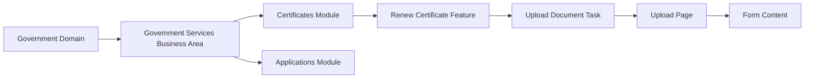

---

# Content Taxonomy

The Content Taxonomy is the enterprise-wide classification scheme every discoverable piece of content belongs to, structured around the Business Area groupings citizens actually navigate by rather than internal domain names alone.

| Taxonomy Branch | Scope |
|---|---|
| **Citizen Services** | Identity, profile, settings, delegated access, notifications — the cross-cutting "about me and my account" territory. |
| **Government Services** | Applications, certificates, grievances, scheme discovery — every civic interaction. |
| **Agriculture** | Market prices, weather advisory, scheme eligibility for farmers, direct-to-buyer produce sale. |
| **Healthcare** | Doctor and hospital discovery, appointment booking, pharmacy stock visibility. |
| **Education** | Tutor and coaching-center discovery, scholarships, skill-development opportunities. |
| **Employment** | Job and gig discovery, applications, employer tooling. |
| **Property & Housing** | Sale and rental listing discovery and management. |
| **Marketplace** | General retail, food delivery, and grocery discovery, cart, and order tracking. |
| **Merchants** | Storefront management, catalog, inventory, order fulfillment — the supply-side operational territory. |
| **Service Providers** | Verification, booking management, and reputation for tutors, doctors, and skilled workers. |
| **Payments** | Wallet, transaction history, refunds, payouts. |
| **Community** | Groups, cooperatives, local events, civic campaigns. |
| **Notifications** | The unified, preference-aware alert and messaging territory. |
| **Search** | The cross-cutting discovery entry point spanning every other branch. |
| **AI** | The AI Assistant and every AI-mediated guidance surface. |
| **Analytics** | Internal dashboards and reporting — administrator- and officer-facing only. |
| **Administration** | Verification queues, fraud/policy enforcement, platform-operations tooling. |
| **Legal** | Terms, policies, and regulatory disclosures a citizen or partner may need to reference. |
| **Privacy** | Consent management, data-use disclosure, and citizen data-rights information. |
| **Support** | Help articles, contact channels, and grievance/dispute escalation. |

```mermaid
graph TD
    Root[Arwal Content Taxonomy] --> Citizen4[Citizen Services]
    Root --> Gov5[Government Services]
    Root --> Agri4[Agriculture]
    Root --> Health4[Healthcare]
    Root --> Edu5[Education]
    Root --> Employ4[Employment]
    Root --> Property2[Property and Housing]
    Root --> Market2[Marketplace]
    Root --> Merch[Merchants]
    Root --> ServProv[Service Providers]
    Root --> Pay2[Payments]
    Root --> Comm3[Community]
    Root --> Notif2[Notifications]
    Root --> Search2[Search]
    Root --> AI2[AI]
    Root --> Analytics2[Analytics]
    Root --> Admin2[Administration]
    Root --> Legal[Legal]
    Root --> Privacy4[Privacy]
    Root --> Support2[Support]
```

> **Callout — Taxonomy Branches Are Not a Restatement of Business Domains**
> `ai-docs/53-business-domain-model.md`'s twenty Business Domains describe internal ownership. This taxonomy's branches describe what a citizen actually browses — several branches (Citizen Services, Search, Legal, Privacy, Support) are cross-cutting concerns with no single owning Business Domain, and several Business Domains (Trust & Safety, Analytics) surface primarily through Administration rather than as a citizen-facing branch of their own.

---

# Content Classification

Every piece of content in the taxonomy above is additionally classified along the following dimensions, mirroring the multi-axis classification discipline already established in `ai-docs/55-business-capability-map.md`'s Capability Taxonomy and `ai-docs/57-business-process-standards.md`'s Process Taxonomy.

| Classification | Definition |
|---|---|
| **Primary Category** | The single taxonomy branch a piece of content is most fundamentally about — the "home" a citizen would expect to find it in first. |
| **Secondary Category** | An additional, genuinely relevant branch a piece of content is cross-listed under, never more than two or three to avoid diluting Primary Category discoverability. |
| **Cross-Domain Content** | Content genuinely relevant across multiple Business Areas (a scheme eligibility page relevant to both Government Services and Agriculture) — owned by one Primary Category, discoverable from every relevant Secondary Category. |
| **Reusable Content** | Content authored once and referenced everywhere it applies (a glossary entry, a standard rejection-reason explanation) — never duplicated, per Single Source of Truth already established in `ai-docs/59-business-glossary.md`. |
| **Reference Content** | Durable, rarely changing content a citizen consults for understanding (a scheme's eligibility rules, a certificate's required documents). |
| **Dynamic Content** | Content that changes frequently and reflects a live state (an order's delivery status, a mandi price). |
| **Static Content** | Content that changes rarely and is safe to cache aggressively (a help article, a terms-of-service page). |
| **Contextual Content** | Content whose relevance depends on a citizen's specific situation (a delegated-access prompt shown only to an eligible citizen). |
| **Personalized Content** | Content shaped by a citizen's own consented history and preferences, always explainable per `ai-docs/78-ai-product-strategy.md`'s Explainability principle. |
| **Administrative Content** | Content visible only to an internal operator or government officer, never citizen-facing. |

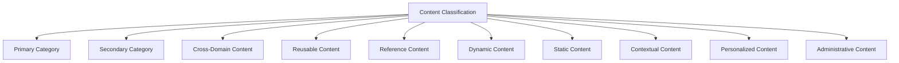

### Content Classification Matrix (Illustrative)

| Content Item | Primary Category | Secondary Category | Content Type |
|---|---|---|---|
| Certificate eligibility rules | Government Services | — | Reference, Static |
| Today's mandi price | Agriculture | — | Dynamic |
| Crop-insurance scheme details | Agriculture | Government Services | Cross-Domain, Reference |
| Doctor verification badge explanation | Healthcare | Support | Reusable, Reference |
| Order delivery status | Marketplace | — | Dynamic, Contextual |
| Delegated-access prompt | Citizen Services | Support | Contextual |
| Recommended tutors | Education | AI | Personalized |
| Fraud enforcement queue | Administration | — | Administrative |

---

# Labeling Strategy

Every label a citizen encounters — a navigation item, a page title, a button, a field name — is governed by the same discipline this section defines, extending `ai-docs/59-business-glossary.md`'s vocabulary governance to the specific act of labeling.

| Label Type | Standard |
|---|---|
| **Navigation Labels** | Short, citizen-recognizable noun phrases matching the taxonomy branch or module name exactly ("Healthcare," never "Health Services Discovery Portal"). |
| **Page Titles** | State the specific task or content the page serves, front-loading the most identifying term first, per the identical Search Optimization discipline already established in `ai-docs/24-documentation-standards.md`. |
| **Feature Names** | A verb-noun phrase describing the citizen action ("Book an Appointment," never "Appointment Scheduling Module"). |
| **Module Names** | Cite the Product Module Catalog (`ai-docs/54`) name exactly, never an internally invented variant. |
| **Actions** | Imperative, plain-language verbs ("Apply," "Track," "Cancel") — never a technical or ambiguous term ("Submit Request Object"). |
| **Descriptions** | One or two plain-language sentences stating what the citizen gets, never marketing language or jargon. |
| **Metadata** | Structured, machine-parseable labels (category, tags, owner) used for governance and discoverability, never citizen-facing directly. |
| **Citizen-Friendly Language** | Every label is tested against a first-generation smartphone user's vocabulary, never an internal team's shorthand. |
| **Government Terminology** | Where a label describes a civic service, it matches the issuing department's own published terminology exactly, per `ai-docs/59-business-glossary.md`'s Government-Friendly Terminology principle — never an Arwal-invented civic term. |
| **Plain Language** | Every label avoids unexplained acronyms, legal phrasing, and technical vocabulary, mirroring `ai-docs/24-documentation-standards.md`'s Plain Language discipline. |
| **Terminology Governance** | Every label's underlying term is drawn from the Business Glossary (`ai-docs/59`) Master Registry — a new label introducing an undefined term is returned for correction before publication. |

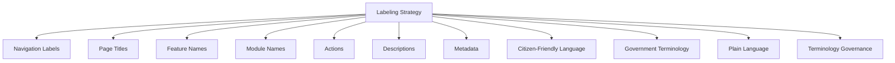

> **Callout — A Label Is a Promise**
> A citizen who taps "Certificates" expects certificates, not a mixed list of certificates and unrelated civic forms. Every label in this architecture is a promise about what a citizen will find behind it — a mislabeled category is a broken promise regardless of how good the content behind it actually is, mirroring the identical Trust and Transparency principle already established in `ai-docs/60-customer-experience-strategy.md`.

---

# Content Relationships

Information does not exist in isolation — every piece of content is connected to the stakeholders, domains, and other content it relates to, mirroring the Traceability discipline already established across `ai-docs/53` through `ai-docs/91`.

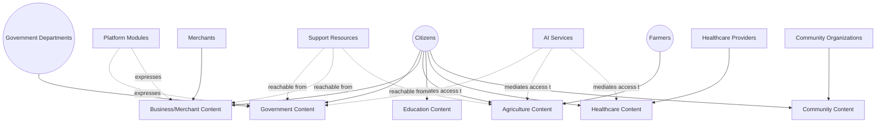

| Relationship | Nature |
|---|---|
| **Citizens ↔ Government Departments** | Content flows from a department's published rule set (certificate requirements, scheme eligibility) to a citizen's application content, per `ai-docs/58-business-rules-policies.md`. |
| **Citizens ↔ Businesses/Merchants** | Content flows from a merchant's catalog to a citizen's discovery and order content. |
| **Citizens ↔ Farmers** | Content flows bidirectionally through Agriculture's Direct-to-Buyer content, and unidirectionally through Market Intelligence content a Farmer consumes. |
| **Citizens ↔ Students** | Shared Education content (tutors, scholarships) serving both a student's own discovery and a parent's oversight. |
| **Citizens ↔ Healthcare Providers** | Content flows from a provider's verified profile to a citizen's discovery and booking content. |
| **Citizens ↔ Community Organizations** | Content flows from an NGO's or SHG's registered group content to a citizen's community-participation content, per `ai-docs/75-community-social-engagement-strategy.md`. |
| **AI Services ↔ Platform Modules** | AI mediates a citizen's access to content across every branch, always transparently and never replacing the underlying content's own authoritative source, per `ai-docs/78-ai-product-strategy.md`. |
| **Platform Modules ↔ Support Resources** | Every module's content carries a reachable path to Support content, never a dead end, per `ai-docs/56-user-journey-standards.md`'s No Dead Ends principle. |

---

# Discovery Framework

| Principle | Strategic Commitment |
|---|---|
| **Information Findability** | Every piece of citizen-facing content is reachable through at least one obvious, predictable path — browsing, search, or a direct link from a related task — never orphaned. |
| **Browsing** | A citizen who does not yet have a specific query can explore the taxonomy's Business Areas and narrow progressively, per Progressive Disclosure above. |
| **Exploration** | A citizen encountering an unfamiliar domain (their first Government Services visit) is guided by clear category structure, never assumed to already understand Arwal's internal organization. |
| **Contextual Navigation** | A citizen mid-task sees content relevant to their current step, never an undifferentiated list of everything the module contains. |
| **Related Content** | A citizen viewing one piece of content (a scheme) is shown genuinely related content (an application path, an eligibility check) without needing to search for it separately. |
| **Recommendations** | Personalized surfacing is always explainable and never a substitute for organic, fair discoverability, per `ai-docs/77-search-discovery-strategy.md`'s Trust Before Ranking principle. |
| **Cross-Linking** | Cross-Domain Content (above) is explicitly linked from every Secondary Category it is relevant to, never left discoverable only from its Primary Category. |
| **Future Search Readiness** | The taxonomy and classification scheme in this document are structured so a future search implementation (owned by a later, technology-facing phase) can index and rank content without requiring the underlying information structure to be redesigned. |
| **Knowledge Discovery** | Durable Reference and Knowledge content (a glossary term, a rule's plain-language explanation) is reachable both directly and as a supporting reference from any Task that depends on it. |

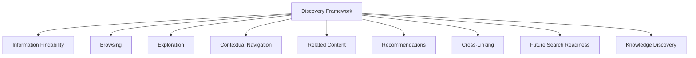

---

# Scalability

| Dimension | How Information Architecture Supports It |
|---|---|
| **Future Modules** | A new Product Module (`ai-docs/54`) is onboarded by mapping it to an existing Business Area wherever possible, per `ai-docs/54`'s Module Reuse Strategy — the taxonomy is never redesigned per new module. |
| **Future Districts** | A second district's civic-service names and local terminology are configured within the existing taxonomy structure, per `ai-docs/50`'s Configuration-Driven Expansion Model — never requiring a new information hierarchy. |
| **Future Government Services** | A new civic service is added as content within the existing Government Services branch, using the existing Application/Certificate/Scheme content types, never a bespoke new category. |
| **Platform Growth** | The Enterprise Information Model's layered hierarchy (Domain → Capability → Module → Feature → Task) absorbs growth at the lower layers without requiring the upper layers to change. |
| **AI Integration** | AI Assistance (CAP-033) is structured as a cross-cutting mediator over the existing taxonomy, per `ai-docs/78-ai-product-strategy.md`, never a parallel information structure of its own. |
| **Localization** | Labels and content are externalized from structure — a translated label never requires a taxonomy or classification change, per `ai-docs/12-accessibility-standards.md`'s Multilingual Accessibility standard. |
| **Internationalization** | The Enterprise Information Model's layers are technology- and geography-independent, allowing a future state- or national-level deployment to extend the same structure. |
| **Enterprise Governance** | A stable, documented taxonomy is the precondition for the Content Governance discipline below to function at all — governance cannot hold a structure accountable that changes unpredictably. |

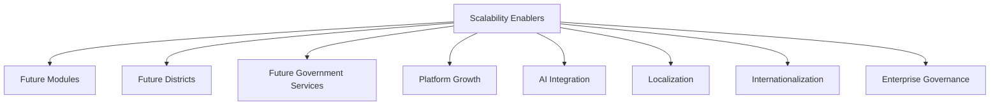

---

# Accessibility

| Consideration | IA Commitment |
|---|---|
| **Semantic Structure** | Every content hierarchy maps to a genuine, logical structure (a heading outline, a landmark region) rather than a purely visual arrangement, per `ai-docs/12-accessibility-standards.md`'s Semantic HTML Standards. |
| **Logical Reading Order** | The order content is organized in this architecture matches the order a screen-reader user would encounter it — never a visually reordered structure that breaks linear navigation. |
| **Screen Readers** | Every category and label is written to be meaningful when read aloud, without relying on visual grouping alone to convey relationship. |
| **Keyboard Navigation** | The hierarchy's depth is kept shallow enough that a keyboard-only citizen can reach any Task within a reasonable number of steps, per `ai-docs/56-user-journey-standards.md`'s Keyboard Navigation Standards. |
| **Clear Headings** | Every Business Area, Module, and Feature carries a single, unambiguous heading-equivalent label, never a heading chosen for visual size alone. |
| **Accessible Labels** | Every label in the Labeling Strategy above is written to be understandable without visual context (an icon alone is never a label). |
| **Inclusive Structures** | The taxonomy explicitly accounts for a low-literacy citizen's navigation pattern (voice-first, icon-plus-text) as a primary path, never a secondary one. |
| **Low Cognitive Load** | Every layer of the Enterprise Information Model is scoped to hold no more categories than a citizen can reasonably scan, per Minimal Cognitive Load above — a Business Area exceeding a manageable number of Modules is split, never left to sprawl. |

---

# Content Governance

### Ownership
Every taxonomy branch, classification rule, and naming convention has exactly one named accountable owner, mirroring the Clear Ownership discipline already established throughout `ai-docs/53` through `ai-docs/91`. An unowned category is treated as a governance defect.

### Content Stewardship
Each Business Area's content is stewarded by that area's Business Owner (per `ai-docs/54-product-module-catalog.md`'s Module Ownership), accountable for content accuracy, currency, and continued alignment with this architecture's classification rules.

### Classification Governance
A change to the Content Classification scheme (above) requires Information Architecture Council approval (see Governance Review below), never an informal, team-local reinterpretation.

### Taxonomy Governance
A new taxonomy branch, or a change to an existing branch's scope, follows the identical New Domain/New Module Creation Criteria already established in `ai-docs/53-business-domain-model.md` and `ai-docs/54-product-module-catalog.md` — a reuse check is required before a new branch is approved.

### Naming Governance
Every label follows the Labeling Strategy above and cites a term from the Business Glossary (`ai-docs/59`) Master Registry; a new term required for labeling purposes is proposed through that document's own Change Request process, never invented independently within this document.

### Version Control
Every taxonomy, classification, or labeling-standard change is versioned (Major.Minor.Patch), mirroring `ai-docs/49-engineering-handbook-governance-evolution-standards.md`'s Version Management — a Major change (a taxonomy branch split, merge, or rename) requires Council approval; a Minor or Patch change (a new content item classified within an existing scheme) does not.

### Review Cycles
| Review | Cadence | Owner |
|---|---|---|
| Quarterly Taxonomy Review | Quarterly | Information Architecture Council |
| Content Accuracy Audit | Quarterly | Business Area Stewards |
| Annual Information Architecture Review | Annual | CXO, CPO, Enterprise Information Architect |

### Quality Assurance
Every new or changed content item is checked against the Engineering Review Checklist below before publication — no content is published without a confirmed Primary Category, a validated label, and a named steward.

### Change Management
A taxonomy or classification change affecting more than one Business Area follows the identical Cross-Domain Governance discipline already established in `ai-docs/53-business-domain-model.md`, requiring an Information Architecture Impact Assessment before approval.

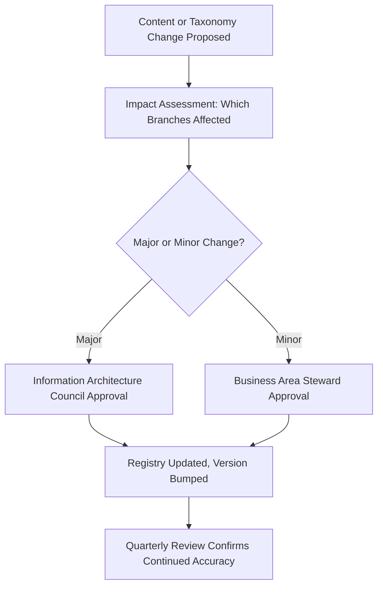

---

# Risks

| Risk | Description | Mitigation |
|---|---|---|
| **Information Overload** | Too many categories or options presented at once overwhelm a citizen. | Minimal Cognitive Load principle; Progressive Disclosure enforced structurally. |
| **Duplicate Content** | The same information independently maintained in two places, inevitably drifting apart. | Reusable Content classification; Single Source of Truth per `ai-docs/59-business-glossary.md`. |
| **Inconsistent Taxonomy** | Different teams classify similar content differently over time. | Taxonomy Governance; Quarterly Taxonomy Review. |
| **Poor Classification** | Content misfiled under the wrong Primary Category, becoming effectively unfindable. | Content Classification Matrix reviewed at publication; QA checklist. |
| **Hidden Information** | A genuinely available service or piece of content has no discoverable path to it. | Information Findability principle; mandatory discoverability check per `ai-docs/54`'s Release Readiness Criteria. |
| **Content Silos** | A Business Area's content is never cross-linked to genuinely related content elsewhere. | Cross-Domain Content and Cross-Linking disciplines above. |
| **Navigation Complexity** | A hierarchy grows too deep or too broad for a citizen to reason about. | Scalable Organization; Low Cognitive Load layer-size limits. |
| **Governance Gaps** | A taxonomy branch or label has no accountable owner. | Ownership discipline; Quarterly Ownership Review, mirroring `ai-docs/54`'s Module Ownership Review. |
| **Content Sprawl** | New content categories proliferate for narrow, one-off needs that could reasonably extend an existing branch. | Reuse check required before a new taxonomy branch is approved. |

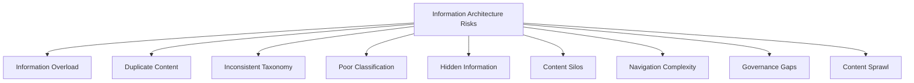

---

# Metrics

| Metric | Definition | Direction |
|---|---|---|
| **Information Findability** | % of citizen attempts to locate a specific, genuinely available piece of content that succeed without external help. | Increasing |
| **Content Accuracy** | % of content items confirmed current and correct at their scheduled review. | Increasing toward 100% |
| **Navigation Success** | % of citizens reaching their intended destination via browsing without backtracking. | Increasing |
| **Task Completion** | % of Tasks (per the Enterprise Information Model) completed once a citizen reaches the relevant Page. | Increasing |
| **Search Readiness** | % of content items carrying complete, structured classification metadata. | Increasing toward 100% |
| **Content Reuse** | % of Reusable Content items referenced from more than one location versus independently duplicated. | Increasing |
| **Content Freshness** | Average time since a content item's last confirmed review, per its Review Cycle. | Decreasing |
| **Classification Quality** | % of content items correctly filed under their genuine Primary Category, per periodic audit. | Increasing toward 100% |
| **Cognitive Load Indicators** | Average number of categories or decisions a citizen must process to reach a Task, per layer. | Decreasing or stable within defined thresholds |

> **Callout — No Information Architecture Metric Stands Alone**
> Per the North Star Principle already established in `ai-docs/00-project-vision.md`, a rising Navigation Success rate alongside a falling Content Accuracy score, or rising Content Reuse alongside falling Classification Quality, is treated as a regression — never counted as success in isolation.

---

# Anti-Patterns

| Anti-Pattern | Description | Why It's Rejected |
|---|---|---|
| **Everything at One Level** | Every Module or Feature flattened into a single, undifferentiated list. | Violates Scalable Organization and Minimal Cognitive Load; overwhelms a citizen instead of guiding them. |
| **Deep Information Hierarchies** | A citizen must navigate through many nested layers to reach a genuine Task. | Violates Clarity Before Complexity; contradicts the one-level-nesting discipline already established in `ai-docs/13-api-design-guidelines.md`'s URI Design, applied here to information structure. |
| **Department-Centric Organization** | The visible structure mirrors Arwal's internal Business Domains or teams rather than a citizen's mental model. | Violates Structure Around User Mental Models; forces a citizen to already understand Arwal's org chart. |
| **Technical Terminology** | Labels use internal, engineering, or jargon vocabulary a citizen would not recognize. | Violates Plain Language and Citizen-Friendly Language. |
| **Duplicate Categories** | Two taxonomy branches independently cover overlapping content. | Violates Single Source of Truth; the two inevitably drift apart. |
| **Hidden Information** | A genuinely available service has no discoverable path. | Violates Information Findability; functionally equivalent to the service not existing. |
| **Unmanaged Growth** | New content and categories are added without any reuse check or governance review. | Violates Taxonomy Governance; produces Content Sprawl. |
| **Inconsistent Labels** | The same concept is labeled differently across modules. | Violates Consistency Across Modules and Terminology Governance. |
| **Content Without Ownership** | A content item or category has no accountable steward. | Violates Ownership; degrades silently until a citizen or auditor forces attention. |

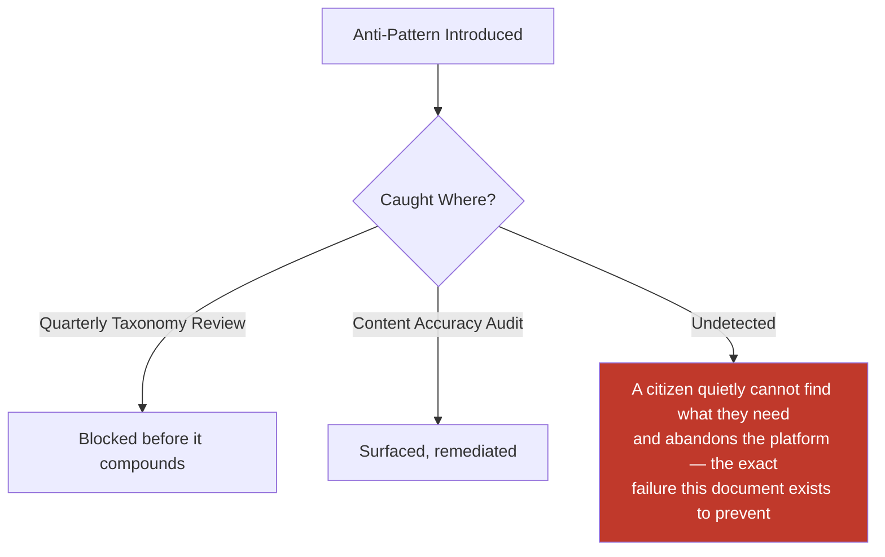

---

# Relationship to Previous Documents

| Prior Document | Relationship |
|---|---|
| **Project Vision (`ai-docs/00`)** | Establishes the founding fragmentation problem and Inclusion over Optimization pillar this architecture's every organizing principle serves. |
| **Product Goals (`ai-docs/01`)** | Establishes the Target Audience and device/literacy profile this architecture's accessibility commitments are calibrated against. |
| **Engineering Principles (`ai-docs/02`)** | Supplies the SOLID, DRY, and Single Source of Truth disciplines this document applies to information rather than code. |
| **System Architecture Principles (`ai-docs/03`)** | Supplies the Domain-Driven Design vocabulary (Bounded Context, Ubiquitous Language) this architecture's taxonomy branches are structurally aligned with, never redefined. |
| **Accessibility Standards (`ai-docs/12`)** | Supplies the non-negotiable accessibility floor this document's Accessibility section extends to the structural layer. |
| **Documentation Standards (`ai-docs/24`)** | Supplies the Plain Language, Naming Conventions, and Searchability disciplines this document's Labeling Strategy directly inherits. |
| **Architecture Decision Records (`ai-docs/25`)** | Supplies the governed-decision discipline a Major taxonomy change follows. |
| **Engineering Governance & Decision Authority (`ai-docs/29`)** | Supplies the Decision Authority Matrix pattern this document's Content Governance mirrors. |
| **Engineering Compliance & Audit Standards (`ai-docs/40`)** | Supplies the Evidence Quality Bar this document's Content Accuracy metric is measured against. |
| **Engineering Architecture Governance Standards (`ai-docs/46`)** | Supplies the Board-and-Council governance pattern this document's Information Architecture Council mirrors. |
| **Engineering Handbook Governance & Evolution Standards (`ai-docs/49`)** | Supplies the Version Management and Document Lifecycle disciplines this document's Content Governance directly inherits. |
| **Product Vision & Business Strategy (`ai-docs/50`)** | Supplies the Strategic Expansion Principles this document's Scalability section is built around. |
| **Stakeholder Analysis (`ai-docs/51`)** | Supplies the stakeholder registry every Content Relationship in this document traces to. |
| **User Personas & User Segmentation (`ai-docs/52`)** | Supplies the Evidence-Based Research discipline this document's People Before Structure principle is grounded in. |
| **Business Domain Model (`ai-docs/53`)** | Supplies the Domain Registry the Enterprise Information Model's Domains layer is anchored to. |
| **Product Module Catalog (`ai-docs/54`)** | Supplies the Module Registry the Enterprise Information Model's Modules layer cites directly. |
| **Business Capability Map (`ai-docs/55`)** | Supplies the Capability Registry the Enterprise Information Model's Capabilities layer cites directly. |
| **User Journey Standards (`ai-docs/56`)** | Supplies the Task-level granularity this document's Enterprise Information Model's Tasks layer is built from. |
| **Business Process Standards (`ai-docs/57`)** | Supplies the organizational sequence standing behind Administrative content. |
| **Business Rules & Policies (`ai-docs/58`)** | Supplies the precise Reference Content (eligibility rules, validation criteria) this document's Knowledge layer surfaces. |
| **Business Glossary (`ai-docs/59`)** | Supplies the singular vocabulary this document's Labeling Strategy and Terminology Governance are entirely built on. |
| **Customer Experience Strategy (`ai-docs/60`)** | Supplies the felt-experience bar this document's structural clarity is designed to support. |
| **Government Partnership Strategy (`ai-docs/63`)** | Supplies the Government Terminology alignment discipline this document's Labeling Strategy inherits. |
| **District Ecosystem Mapping (`ai-docs/64`)** | Supplies the whole-system participant view this document's Content Relationships section situates information within. |
| **Community & Social Engagement Strategy (`ai-docs/75`)** | Supplies the Community taxonomy branch's underlying business rationale. |
| **Search & Discovery Strategy (`ai-docs/77`)** | Supplies the Trust Before Ranking and Fair Visibility principles this document's Discovery Framework is bound by. |
| **AI Product Strategy (`ai-docs/78`)** | Supplies the Explainability and Human-in-the-Loop principles this document's AI-mediated content relationships must honor. |
| **Trust & Safety Framework (`ai-docs/79`)** | Supplies the Trust Value Chain this document's Trust Through Clarity principle is built on. |
| **UX Vision & Experience Strategy (`ai-docs/90`)** | Supplies the strategic UX constitution — Vision, Philosophy, Principles — this document's structural organization exists to express faithfully. |
| **Human-Centered Design Principles & UX Philosophy (`ai-docs/91`)** | Supplies the Design Decision Principles this document's every organizing choice is evaluated against before publication. |

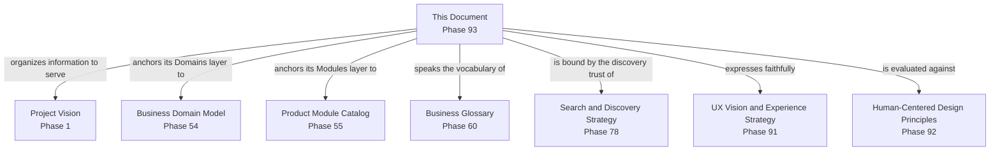

---

# Executive Artifacts

### Enterprise Information Architecture Framework

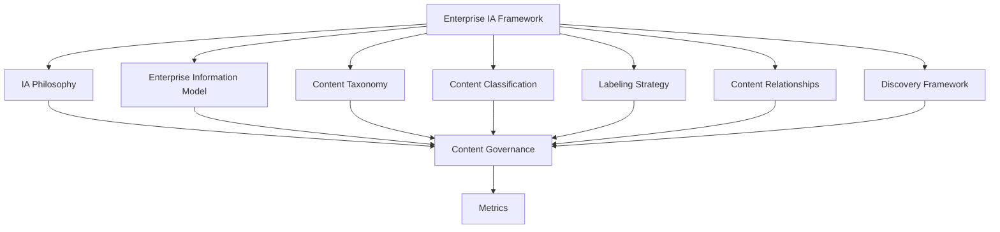

### Enterprise Content Taxonomy

See Content Taxonomy section above — reproduced here by reference per Single Source of Truth, never duplicated.

### Information Hierarchy Model

See Enterprise Information Model section above.

### Content Classification Matrix

See Content Classification section above.

### Information Relationship Model

See Content Relationships section above.

### Content Governance Framework

See Content Governance section above.

### Information Lifecycle

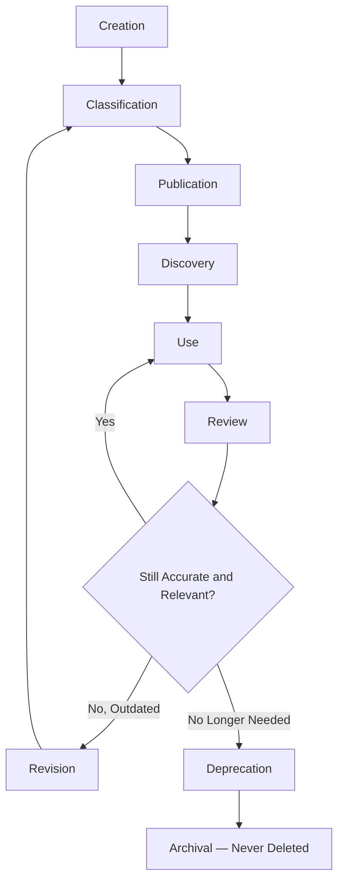

### Conceptual Enterprise Sitemap

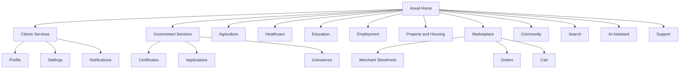

### Content Ownership Matrix

| Taxonomy Branch | Steward | Governance Authority |
|---|---|---|
| Citizen Services | CPO (delegate: Citizen Experience PM) | Information Architecture Council |
| Government Services | Head of Government Partnerships | IA Council + Head of Government Partnerships |
| Agriculture | Head of Agriculture Vertical | IA Council |
| Healthcare | Head of Healthcare Vertical | IA Council |
| Education | Head of Education Vertical | IA Council |
| Employment | Head of Jobs Vertical | IA Council |
| Property & Housing | Head of Classifieds/Property | IA Council |
| Marketplace | Head of Merchant Success | IA Council |
| Merchants | Head of Merchant Success | IA Council |
| Service Providers | Head of Trust & Safety | IA Council |
| Payments | Head of Payments | IA Council |
| Community | Head of Community Engagement | IA Council |
| Notifications | Head of Platform Engineering | IA Council |
| Search | Head of Platform Engineering | IA Council |
| AI | Head of AI Platform | IA Council + AI Council (`ai-docs/78`) |
| Analytics | Head of Data/Analytics | IA Council |
| Administration | Head of Operations | IA Council |
| Legal | Compliance Officer | IA Council + Legal |
| Privacy | Compliance Officer | IA Council + Compliance |
| Support | Head of Customer Success | IA Council |

### Information Architecture Maturity Model

| Level | Name | Characteristics |
|---|---|---|
| **1 — Informal** | Structure varies by team; no shared taxonomy or classification standard. | High variance; navigation inconsistent across modules. |
| **2 — Developing** | A taxonomy exists but is inconsistently applied; labeling varies. | Uneven adoption across verticals. |
| **3 — Defined** | This document's full taxonomy, classification, and labeling standard is applied consistently. | This document's standard is fully met. |
| **4 — Measured** | Findability, Accuracy, and Classification Quality metrics are actively tracked against explicit thresholds. | Proactive, not reactive. |
| **5 — Optimized** | Information Architecture actively informs product strategy and is genuinely replicable to a second district's civic structure. | IA is a durable civic and competitive advantage. |

Arwal's target state at the opening of Stage 3 is **Level 3 (Defined)**, with **Level 4 (Measured)** targeted as analytics tooling from later phases matures.

### Decision Matrix

| Decision Type | Approval Authority |
|---|---|
| New taxonomy branch | Information Architecture Council + CPO |
| Classification scheme change | Information Architecture Council |
| Labeling-standard change | Information Architecture Council + Business Glossary Owner (`ai-docs/59`) |
| Cross-Business-Area content relationship change | Information Architecture Council + affected Business Area Stewards |
| Government-terminology alignment change | Information Architecture Council + Head of Government Partnerships |

### Executive Dashboards (Conceptual)

| Dashboard | Audience | Key Content |
|---|---|---|
| **CXO/CPO Dashboard** | CXO, CPO | Information Findability, Navigation Success, IA Maturity Level |
| **Business Area Steward Dashboard** | Vertical Heads | Content Accuracy, Classification Quality for their own branch |
| **Accessibility Dashboard** | Head of Accessibility & Inclusion | Cognitive Load Indicators, structural accessibility compliance |
| **Government Partners Dashboard** | Government liaisons | Government Services branch findability and terminology-alignment status |

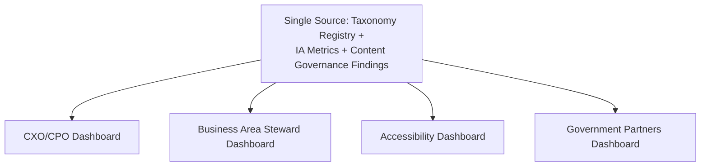

---

# Closing Statement

> **Callout — Closing Statement**
> Every prior document in this handbook explains what Arwal is, what it can do, how it earns trust, and what its experience must feel like. This document explains the structure standing beneath all of it — the reason a citizen can open the app for the first time and correctly guess, before they even look, where a certificate lives, where a doctor is found, and where today's mandi price will be. A platform can be built with perfect capabilities and still fail a citizen who could not find them; Information Architecture is what turns a complete platform into a genuinely usable one. This taxonomy, this classification scheme, this labeling discipline, and this governance model are not a cosmetic layer applied after the real work is done — they are the load-bearing structure every future navigation, every future search implementation, and every future district's civic terminology must be built on top of, faithfully, for as long as this platform exists. Where a future phase must deviate from a principle stated here, that deviation is made explicitly — through the Information Architecture Council's Governance process above — never silently, and never by default.

This document, `ai-docs/92-information-architecture.md`, is Phase 93 of approximately 425. Every future navigation, content model, taxonomy, and discoverability decision is expected to trace back to a principle defined here, or to justify its deviation in writing.

**End of Phase 93 — `ai-docs/92-information-architecture.md`**