# Navigation Architecture & Wayfinding

**Document:** `ai-docs/93-navigation-architecture-wayfinding.md`
**Project:** Arwal — The District Super App
**Stage:** 3 — Experience & Design Strategy
**Phase:** 94 — Navigation Architecture & Wayfinding
**Status:** Approved for Executive & Enterprise Reference
**Audience:** CXO, CPO, Enterprise UX Architect, Enterprise Information Architect, Navigation Design Specialists, Human-Centered Design Consultants, Government Digital Services Advisors, Accessibility Specialists, Product Strategists, Enterprise Documentation Architects

> **Callout — Purpose of This Document**
> `ai-docs/92-information-architecture.md` established how information is organized, classified, and labeled — the answer to "what exists and where does it belong?" It deliberately stopped short of a different question: **once that structure exists, how does a citizen actually move through it?** How do they know where they are, how do they get back, and how do they discover something they did not know to look for? This document is that answer — the authoritative Navigation Architecture & Wayfinding standard every future navigation pattern, menu structure, and user-movement decision traces back to.

---

# Purpose of this Document

### Why Navigation Architecture Is Distinct From Information Architecture

`ai-docs/92-information-architecture.md` is the map. This document is the journey across the map. A perfectly organized taxonomy can still strand a citizen if there is no predictable, trustworthy way to travel between its branches — a Business Area correctly classified is worthless to a citizen who cannot find their way into it, or worse, who finds it once and can never reliably return. Information Architecture answers *what exists and where it belongs*; Navigation Architecture answers *how a citizen moves, orients, and recovers* within that structure. The two are inseparable but never interchangeable — a change to one is never assumed to automatically satisfy the other.

### How Navigation Translates Information Architecture Into User Movement

Every layer of `ai-docs/92`'s Enterprise Information Model — Domain, Capability, Business Area, Module, Feature, Task, Page, Content — is a static classification until Navigation Architecture gives a citizen an actual, predictable path through it. Navigation is the mechanism that converts a taxonomy into a lived, walkable space: it decides which categories are always visible, which are revealed only when relevant, how a citizen returns to a known point, and how a citizen discovers a related capability they did not think to search for.

### Why Predictable Navigation Builds Trust

A citizen who correctly predicts where a control will be, and finds it there, has one more reason to believe the platform is honest and competently built — the same Trust Through Clarity discipline already established in `ai-docs/92-information-architecture.md`, now expressed as movement rather than structure. Conversely, a citizen who cannot predict navigation must expend attention re-learning the platform on every visit, which is a direct tax on the trust `ai-docs/79-trust-safety-framework.md` names as Arwal's single most valuable asset.

### How Navigation Reduces Cognitive Load, Affects Success, and Enables Discoverability

Every navigation decision a citizen must make — which menu to open, which label to trust, which path leads back — is a real cost, paid disproportionately by exactly the citizens Arwal exists to serve first: a first-generation smartphone user, a low-literacy farmer, an anxious elderly citizen. Consistent, minimal, predictable navigation lowers this cost to near zero for a confident citizen and is the difference between success and abandonment for an unconfident one. Discoverability is the positive expression of the same discipline: a citizen who does not yet know a capability exists must still be able to stumble onto it through ordinary, unremarkable exploration, never only through a lucky guess or an external explanation.

### How Navigation Enables Accessibility and Supports Multi-District Expansion

A navigation structure is accessible because its hierarchy, order, and labeling were designed for a screen-reader user, a keyboard-only user, and a voice-first user from the first draft — never patched in afterward, per the non-negotiable floor already established in `ai-docs/12-accessibility-standards.md`. Per `ai-docs/50-product-vision-business-strategy.md`'s Strategic Expansion Principles, a second district inherits Arwal's navigation *reasoning*, never an unexamined set of menu items — a navigation architecture grounded in durable, technology-independent principles travels intact to a new district's language and civic structure; one grown as an accumulation of ad hoc menu additions does not.

### The Chain of Reasoning This Document Extends

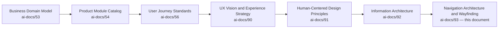

| Layer | Question It Answers |
|---|---|
| Business Domain Model | Who owns this business concern? |
| Product Module Catalog | What does a citizen open? |
| User Journey Standards | What does one interaction feel like? |
| UX Vision & Experience Strategy | What must a citizen feel, cumulatively? |
| Human-Centered Design Principles | What is the reasoning behind every design decision? |
| Information Architecture | How is information organized, classified, and labeled? |
| **Navigation Architecture & Wayfinding** (this document) | **How does a citizen actually move through that information, always knowing where they are, where they came from, and where they can go next?** |

### Scope Boundary

This document contains no routing table, no URL design, no frontend component, no sidebar or navbar implementation, no CSS, no React or Next.js pattern, and no API. Every one of those remains the deliberate territory of a future, technology-facing phase building explicitly on top of this one. This document's exclusive territory is: **why navigation architecture matters, the enterprise navigation model, wayfinding principles, navigation hierarchy, contextual and cross-module navigation, task navigation, search navigation, mobile navigation, accessibility, error recovery, scalability, and governance** — the structure every future technical navigation implementation must express faithfully, never redefine independently.

---

# Relationship to Information Architecture

| Information Architecture (`ai-docs/92`) Determines | Navigation Architecture (this document) Determines |
|---|---|
| What information exists | How a citizen moves toward that information |
| Where information belongs in the taxonomy | How a citizen understands where they currently are |
| How information is classified | How a citizen recovers from a wrong turn |
| How content relates to other content | How a citizen discovers something they did not search for |
| The Enterprise Information Model's static hierarchy | The dynamic, walkable path through that hierarchy |

A citizen navigating Arwal must, at every moment, be able to answer three questions correctly and without effort:

1. **Where am I?** — Orientation within the Enterprise Information Model.
2. **Where did I come from?** — A reliable, reversible path back.
3. **Where can I go next?** — A visible, predictable set of onward options.

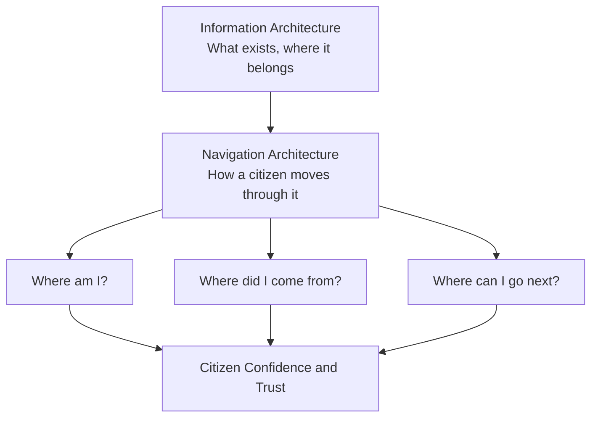

> **Callout — A Correct Taxonomy Does Not Guarantee Correct Navigation**
> `ai-docs/92-information-architecture.md`'s taxonomy can be perfectly reasoned and a citizen can still get lost if the navigation layer built on top of it is inconsistent, unpredictable, or silent about location. This document exists precisely because the two failure modes are independent — a navigation review is never satisfied merely because the underlying taxonomy passed its own review.

---

# Navigation Philosophy

Every principle below exists because a navigation structure assembled carelessly does not fail abstractly — it fails a specific citizen who tapped the wrong thing, could not find their way back, and quietly closed the app.

### Citizen First Navigation
**Why it exists:** Every navigation decision is judged first against whether it helps a real citizen move confidently toward their actual goal, never against what is convenient to build or what exposes the most product surface, mirroring the identical Citizen-First tie-breaker already established throughout `ai-docs/51` through `ai-docs/92`.

### Predictability
**Why it exists:** The same category of navigation action produces the same category of outcome, everywhere on the platform, every time — a citizen who has learned one pattern should never have to relearn a subtly different one elsewhere, per `ai-docs/90-ux-vision-experience-strategy.md`'s Predictability principle applied here structurally.

### Recognition Over Recall
**Why it exists:** A citizen should be able to recognize the correct next step when they see it, never be required to remember a path from a prior visit — every navigation surface presents its options visibly rather than depending on a citizen's memory of a hidden gesture or menu.

### Progressive Disclosure
**Why it exists:** Navigation reveals depth only as it becomes relevant — a citizen is never confronted with every category, sub-category, and option a domain contains before they have expressed a need for it, mirroring `ai-docs/00-project-vision.md`'s Progressive Complexity principle.

### Navigation Consistency
**Why it exists:** A citizen who has learned how "go back," "search," or "get help" behaves in one part of the platform must find that same behavior everywhere else, per the identical Consistency principle already established in `ai-docs/90-ux-vision-experience-strategy.md`.

### Minimal Cognitive Load
**Why it exists:** Every additional navigation decision a citizen must make is a real cost paid disproportionately by exactly the citizens Arwal exists to serve first — navigation is designed to minimize the number of decisions between a citizen's need and their goal, never to maximize product exposure along the way.

### No Dead Ends
**Why it exists:** Every navigation state has a clear, reachable next step — restating the founding No Dead Ends product principle already established in `ai-docs/00-project-vision.md`, applied here specifically to the structural layer of movement itself.

### Clear Destinations
**Why it exists:** A citizen can tell, before committing to a navigation action, roughly what they will find on the other side of it — an ambiguous label or an unlabeled icon is a navigation failure regardless of how accurate the destination content turns out to be.

### Trust Through Predictability
**Why it exists:** Every successful, predictable navigation action compounds a citizen's confidence that the platform is honest and competently built, per the identical Trust Through Clarity principle already established in `ai-docs/92-information-architecture.md`.

### Accessible Navigation
**Why it exists:** Navigation is accessible because its structure, order, and labeling were designed for a screen-reader user, a keyboard-only user, and a voice-first user from the first draft, per `ai-docs/12-accessibility-standards.md`'s non-negotiable floor — never patched in after a visually-oriented structure was already locked in.

### Inclusive Navigation
**Why it exists:** A navigation structure that assumes literacy, a shared national language, or digital fluency has already excluded a meaningful share of Arwal's population, per the founding Inclusion over Optimization pillar in `ai-docs/00-project-vision.md`.

### Cross-Domain Continuity
**Why it exists:** A citizen's need routinely spans more than one Business Area in a single sitting — a scheme-linked civic application, a paid healthcare booking — and navigation must carry them across that boundary without forcing them to re-orient from scratch, per `ai-docs/64-district-ecosystem-mapping.md`'s Cross-Domain Collaboration reasoning.

### Scalable Navigation
**Why it exists:** A navigation structure that only accommodates today's modules will not gracefully absorb the next two hundred — every navigation layer is designed with headroom for growth, per the same Future Scalability discipline already established in `ai-docs/92-information-architecture.md`.

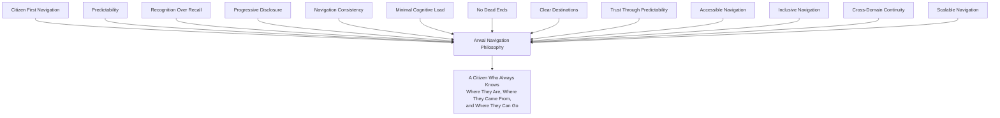

> **Callout — The One-Sentence Navigation Philosophy**
> *"If a citizen has to stop and think about how to get back, the navigation has already failed — the destination being correct is not enough if the path there and back was never trustworthy."*

---

# Enterprise Navigation Model

Arwal's navigation is composed of eleven distinct navigation types, each with its own purpose, ownership, and place in the citizen's movement — never blended into one undifferentiated menu.

| Navigation Type | Purpose | Ownership | Typical Usage |
|---|---|---|---|
| **Global Navigation** | The persistent, always-reachable entry point to every major Business Area, per `ai-docs/92`'s taxonomy branches. | Head of Platform Engineering (Navigation Steward) | Reached from anywhere on the platform, at any time. |
| **Primary Navigation** | The top-level structure within a single Business Area or Module, orienting a citizen once they have arrived. | The Business Area's Steward, per `ai-docs/92`'s Content Ownership Matrix | Used continuously while a citizen remains within one Business Area. |
| **Secondary Navigation** | Sub-categories or filters within a Primary Navigation section, revealed progressively per Progressive Disclosure. | The Module Owner, per `ai-docs/54`'s Module Ownership | Used to narrow a citizen's focus within an already-entered section. |
| **Contextual Navigation** | Options surfaced because of a citizen's current task or state, never globally visible. | The owning Journey's Product Owner, per `ai-docs/56` | Used mid-task, to offer a genuinely relevant next step. |
| **Task Navigation** | The sequence of steps within a single Journey (`ai-docs/56`), including progress indication and step recovery. | The Journey Owner | Used exclusively within a bounded, multi-step task. |
| **Utility Navigation** | Account-level, non-domain-specific controls — profile, settings, language. | CPO (delegate: Citizen Experience PM) | Reached persistently, but used infrequently relative to Global Navigation. |
| **Support Navigation** | The path to help, escalation, and human assistance, reachable from anywhere. | Head of Customer Success | Used when self-service navigation has genuinely failed a citizen. |
| **Administrative Navigation** | Internal-operator and government-officer navigation — verification queues, moderation consoles, dashboards. | Head of Operations / Head of Government Partnerships | Used exclusively by an authenticated internal or civic role. |
| **AI Navigation** | The entry point to, and navigation within, AI Assistant-mediated interaction, per `ai-docs/78-ai-product-strategy.md`. | Head of AI Platform | Used as a parallel, always-available path alongside conventional browsing. |
| **Search Navigation** | The entry point to, and results-handling within, platform-wide Search, per `ai-docs/77-search-discovery-strategy.md`. | Head of Platform Engineering | Used when a citizen has a specific need but does not know its Business Area. |
| **Emergency Navigation** | A distinct, always-reachable path to safety-critical or Disaster Management Authority content, per `ai-docs/64-district-ecosystem-mapping.md`. | Head of Trust & Safety | Used rarely, but must never be obstructed, delayed, or hidden behind another navigation layer. |

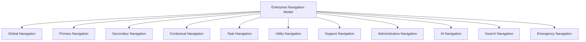

### Hierarchy and Relationships

Global, Utility, Support, AI, Search, and Emergency Navigation are **persistent** — reachable from any point on the platform without first navigating elsewhere. Primary and Secondary Navigation are **scoped** — they exist only once a citizen has entered a Business Area or Module and disappear (or change) as that citizen moves elsewhere. Contextual and Task Navigation are **ephemeral** — they exist only for the duration of a specific need or Journey and are never left behind as clutter once that need is resolved. Administrative Navigation is **role-gated** — it never appears to a citizen without the corresponding authenticated role, per RULE-031's Role Assignment Authority already established in `ai-docs/58-business-rules-policies.md`.

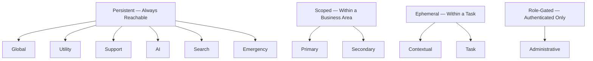

---

# Wayfinding Principles

| Principle | Enterprise Standard |
|---|---|
| **Orientation** | A citizen can determine their current location within the Enterprise Information Model at every point, without needing to scroll or search for a clue. |
| **Location Awareness** | The current Business Area, Module, and — where relevant — Task step is always indicated through a consistent, predictable signal, never left implicit. |
| **Navigation Memory** | A citizen returning to a previously visited location finds it in the state and position they left it, wherever preserving that state genuinely serves their goal. |
| **Progress Indicators** | Every multi-step Task states, at each step, how far the citizen has come and how much remains, per `ai-docs/56-user-journey-standards.md`'s Journey State Model. |
| **Breadcrumb Philosophy** | A citizen can trace their path backward through the Enterprise Information Model's layers at any point, never only forward. |
| **Context Awareness** | Navigation adapts to a citizen's genuine situation — their role, their in-progress Task, their consented history — without ever assuming context it was not given. |
| **Destination Clarity** | A navigation option states plainly what a citizen will find on the other side of it before they commit to it. |
| **Decision Points** | Every moment a citizen must choose between paths presents a small, genuinely distinct set of options — never an undifferentiated list requiring the citizen to evaluate every possibility. |
| **Exit Strategy** | A citizen can always leave a Task, a Business Area, or the platform itself cleanly, without an unresolved or ambiguous state left behind. |
| **Recovery** | A citizen who takes a wrong turn has an immediate, obvious way to correct it, never a dead end or a forced restart. |
| **User Confidence** | Every wayfinding mechanism above compounds into one felt outcome: a citizen who trusts their own ability to navigate the platform, per `ai-docs/90-ux-vision-experience-strategy.md`'s Confidence emotional outcome. |

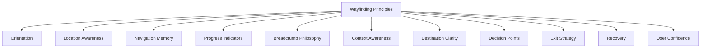

---

# Navigation Hierarchy

The Navigation Hierarchy expresses `ai-docs/92-information-architecture.md`'s Enterprise Information Model as a sequence of citizen-facing movement transitions.

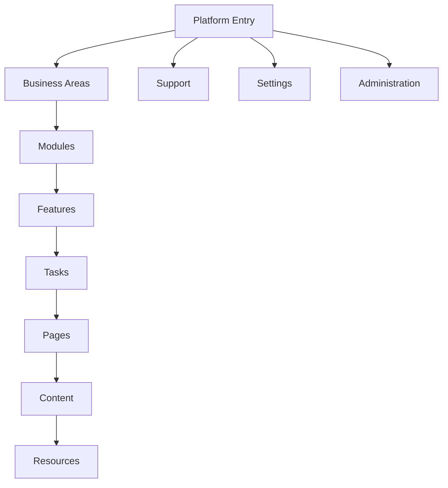

| Transition | What Changes for the Citizen |
|---|---|
| **Platform Entry → Business Areas** | The citizen leaves the platform-wide Home context and commits to one taxonomy branch, per `ai-docs/92`'s Content Taxonomy. |
| **Business Areas → Modules** | The citizen enters a specific, user-visible product surface, per `ai-docs/54-product-module-catalog.md`. |
| **Modules → Features** | The citizen selects a specific capability increment within the module. |
| **Features → Tasks** | The citizen begins a bounded sequence of actions toward a specific goal, per `ai-docs/56-user-journey-standards.md`. |
| **Tasks → Pages** | The citizen moves through the concrete, technology-independent views a Task is composed of. |
| **Pages → Content** | The citizen reads or acts on the specific words, data, or media a Page presents. |
| **Content → Resources** | The citizen optionally branches into durable, reusable supporting material — a glossary term, a help article. |
| **Entry → Support / Settings / Administration** | The citizen leaves the domain-specific hierarchy entirely for a persistent, cross-cutting layer. |

A citizen is never required to descend through every layer to reach a goal — Search Navigation and AI Navigation exist specifically to shortcut this hierarchy when a citizen already knows what they want, per Progressive Disclosure and Recognition Over Recall above.

---

# Global Navigation

| Element | Standard |
|---|---|
| **Platform Home** | The single, unmistakable starting point every citizen recognizes as "the beginning" — never one of several equally-weighted top-level destinations. |
| **Main Navigation** | The persistent structure exposing every Business Area a citizen is entitled to see, per RULE-031's role-scoped access. |
| **Primary Sections** | A small, curated set of top-level entries — never an exhaustive list of every Business Area at equal visual weight, per Minimal Cognitive Load. |
| **Persistent Navigation** | Utility, Support, AI, Search, and Emergency entries remain reachable regardless of how deep a citizen has descended into the Navigation Hierarchy. |
| **Quick Access** | Frequently and recently used destinations are surfaced without requiring a citizen to re-traverse the full hierarchy, per Contextual Navigation below. |
| **Universal Search Entry** | A single, obvious Search entry point exists from every screen, never buried within one Business Area alone. |
| **Profile Entry** | A citizen's own Identity and Profile (per `ai-docs/59-business-glossary.md`'s GLOSS-018/GLOSS-047 distinction) is reachable from one consistent, persistent location. |
| **Notifications Entry** | A citizen's Notification inbox is reachable from a consistent, persistent location, never nested inside an unrelated Business Area. |
| **Help Entry** | Support Navigation's entry point is always visible, never conditional on a citizen already being lost. |
| **Emergency Access** | Emergency Navigation is never obstructed by, hidden behind, or de-prioritized relative to any commercial navigation element. |
| **AI Assistant Entry** | A persistent, low-friction entry point to AI Navigation exists from every screen, per `ai-docs/78-ai-product-strategy.md`'s Citizen AI Assistant. |

---

# Contextual Navigation

| Element | Enterprise Standard |
|---|---|
| **Contextual Navigation** | Options surfaced specifically because of what a citizen is currently doing — never a generic, undifferentiated menu repeated at every point. |
| **Related Services** | A citizen engaged with one capability sees genuinely related capabilities (a scheme linked to an application) without needing to search separately, per `ai-docs/92`'s Cross-Domain Content and Cross-Linking disciplines. |
| **Contextual Recommendations** | Suggestions are always explainable and never a substitute for organic discoverability, per `ai-docs/77-search-discovery-strategy.md`'s Trust Before Ranking principle. |
| **Cross-Domain Suggestions** | A citizen's need spanning more than one Business Area is bridged explicitly, per Cross-Domain Continuity above. |
| **Frequently Used Services** | A citizen's own repeated navigation pattern is reflected back to them as a shortcut, never as a way of narrowing what they are shown by default. |
| **Recently Used Services** | A citizen resuming an interrupted Task or a recent destination finds it without re-navigating the full hierarchy. |
| **Location-Based Navigation** | Hyperlocal relevance (a nearby verified provider, a district-specific civic service) is surfaced where genuinely useful, per `ai-docs/77`'s Location-Based Discovery. |
| **Role-Based Navigation** | A merchant, a citizen, and a government officer each see a navigation structure scoped to their own role, per RULE-031, never a single undifferentiated structure requiring manual filtering. |
| **Personalized Navigation** | Shaped by a citizen's own consented history, always explainable, per `ai-docs/78-ai-product-strategy.md`'s Explainability principle — never a substitute for the same fair, organic navigation every citizen can access. |
| **Adaptive Navigation** | Navigation degrades gracefully for a citizen's actual device, connectivity, and literacy context, per `ai-docs/12-accessibility-standards.md`, never assuming uniform capability. |

**How contextual navigation improves discoverability while avoiding overload:** Every contextual surface above is bounded — a small, genuinely relevant set of options, never an expanding list competing with the citizen's current Task. Contextual Navigation is additive to, never a replacement for, the predictable Global and Primary Navigation a citizen already trusts; a citizen who ignores every contextual suggestion must still be able to complete their goal through the ordinary hierarchy alone.

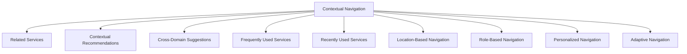

---

# Cross-Module Navigation

| Business Area Pair | Navigation Relationship |
|---|---|
| **Citizen Services ↔ Every Other Area** | The Utility layer (Profile, Settings, Notifications) is reachable identically from within every Business Area, never re-implemented per area. |
| **Government Services ↔ Agriculture** | A Scheme discovered in Agriculture navigates directly into Government Services' Application flow without requiring the citizen to re-orient. |
| **Government Services ↔ Education** | Scholarship discovery bridges into the same Application Task navigation pattern used civic-wide. |
| **Healthcare ↔ Payments** | A booking's confirmation step navigates directly into Payment Navigation without leaving the Healthcare context conceptually. |
| **Marketplace ↔ Property ↔ Employment** | Each area shares the identical discovery-to-detail-to-action navigation pattern, differing only in domain-specific content, never in navigation shape. |
| **Community ↔ Government Services** | Civic campaigns surfaced in Community Navigation route cleanly into the relevant Government Services content, per `ai-docs/75-community-social-engagement-strategy.md`. |
| **Every Area ↔ Emergency Services** | Emergency Navigation is reachable identically regardless of which Business Area a citizen is currently within. |
| **Every Area ↔ Administration** | Administrative Navigation is entirely separate and role-gated, never intermixed with citizen-facing navigation even for a dual-role user. |
| **Every Area ↔ AI Services** | AI Navigation mediates access into any Business Area consistently, per `ai-docs/78-ai-product-strategy.md`'s cross-cutting design. |
| **Every Area ↔ Analytics** | Analytics Navigation is internal-facing only, reachable exclusively through Administrative Navigation, never surfaced to a citizen. |

### Navigation Consistency, Module Independence, and Shared Principles

Every Business Area implements its own Primary and Secondary Navigation independently — per `ai-docs/54-product-module-catalog.md`'s Module Independence discipline — but every one of those implementations honors the identical Wayfinding Principles above without exception. Module Independence governs *what* each area's navigation contains; Navigation Consistency governs *how* it behaves. A citizen who has never used Healthcare before should still correctly predict how its navigation behaves purely from having used Marketplace, because the underlying shared principles — not the specific content — are what repeat.

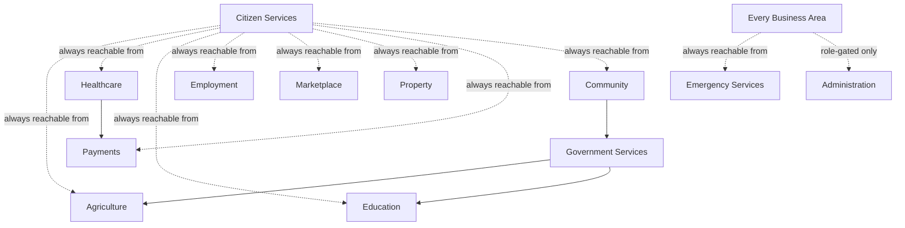

---

# Task Navigation

| Task Pattern | Navigation Standard |
|---|---|
| **Linear Tasks** | A fixed sequence of steps, each with a single obvious next step and a single obvious back step, per `ai-docs/56`'s Journey Steps discipline. |
| **Multi-Step Workflows** | Every step states its position within the whole sequence, per Progress Indicators above. |
| **Branching Workflows** | A genuine decision point is presented with a small, distinct set of paths, each stating its consequence before commitment. |
| **Decision Trees** | Complex eligibility or configuration logic (per `ai-docs/58-business-rules-policies.md`'s rule evaluation) is navigated one decision at a time, never presented as a single overwhelming form. |
| **Wizard Navigation** | A bounded, guided sequence for a genuinely complex Task, always exitable cleanly at any step. |
| **Progressive Navigation** | Later steps' options are informed by earlier answers, never requiring the citizen to re-enter already-provided information. |
| **Confirmation Navigation** | A consequential action (a payment, a submission) always presents a final, explicit confirmation step before it is irreversible, per RULE-018's Payment Idempotency Enforcement. |
| **Cancellation Paths** | A citizen can abandon a Task at any step without penalty or ambiguity, unless a stated Business Rule (per `ai-docs/58`) genuinely requires otherwise. |
| **Recovery Paths** | A citizen who encounters an error mid-Task returns to the last valid state, never forced to restart from the beginning. |
| **Completion Experience** | A finished Task states clearly that it succeeded, what happens next, and offers an obvious path back to a relevant destination — never leaving the citizen stranded on a terminal screen with no onward option. |

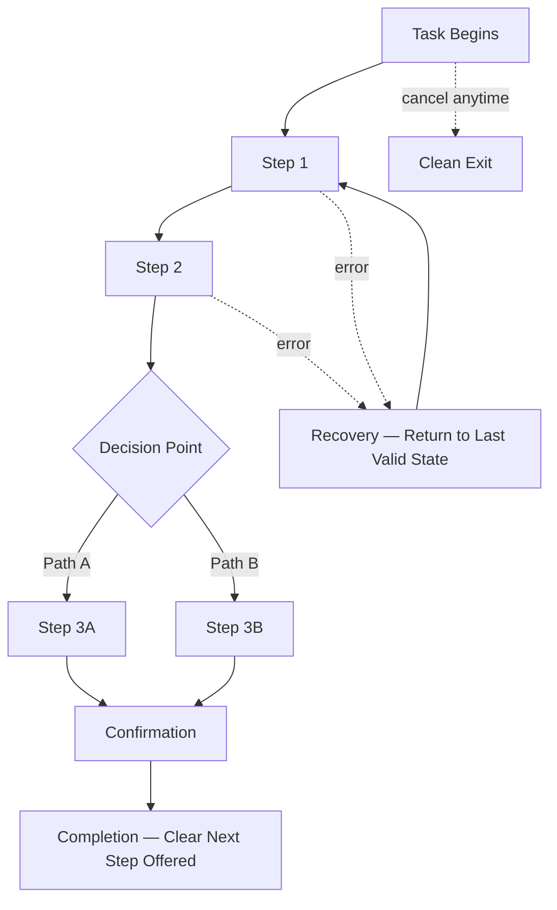

---

# Search & Discovery Navigation

| Element | Standard |
|---|---|
| **Enterprise Search** | The single, trusted entry point for any citizen need regardless of Business Area, per `ai-docs/77-search-discovery-strategy.md`'s Global Search capability. |
| **Global Search** | Reachable from every screen via Search Navigation, never nested inside one Business Area alone. |
| **Module Search** | A narrower, in-context search scoped to the Business Area a citizen is already within, distinct from but consistent with Global Search's behavior. |
| **Smart Suggestions** | Query assistance offered transparently, never presented as if it were the citizen's own unaided search intent. |
| **Autocomplete** | Reduces typing effort without ever silently narrowing what a citizen can search for. |
| **Filters** | Every applied filter is explicitly visible and removable, per `ai-docs/56-user-journey-standards.md`'s Search rule that an unrecognized filter is never silently ignored. |
| **Categories** | Search results are organized along the same Content Taxonomy already established in `ai-docs/92-information-architecture.md`, never a parallel, inconsistent categorization. |
| **Recommendations** | Personalized ranking is always explainable, per `ai-docs/77`'s Trust Before Ranking principle. |
| **AI Assisted Discovery** | AI Navigation may mediate a search a citizen could not otherwise phrase, per `ai-docs/78-ai-product-strategy.md`'s Navigation Assistance capability. |
| **Knowledge Discovery** | Durable Reference and Knowledge content (per `ai-docs/92`) is reachable both directly from Search and as supporting reference from any Task that depends on it. |
| **Search Recovery** | A search returning no genuine results states so plainly and offers a broadened or alternative path, never a bare, unexplained empty result. |

---

# Mobile Navigation

| Consideration | Strategic Commitment |
|---|---|
| **Small Screens** | Navigation depth and breadth are scoped to what a small viewport can present clearly, never a desktop-first structure compressed after the fact. |
| **One-Handed Usage** | Frequently used navigation controls are positioned for comfortable single-thumb reach, reflecting the majority device-holding pattern in Arwal's target population. |
| **Bottom Navigation** | A small, stable set of Global Navigation destinations remains within easy reach regardless of scroll position. |
| **Gesture Navigation** | Any gesture-based shortcut always carries a visible, discoverable alternative — a gesture is never the only path to a destination, per Recognition Over Recall. |
| **Context Menus** | Secondary actions are reachable without cluttering the primary navigation surface. |
| **Quick Actions** | A citizen's most common next steps are surfaced directly, reducing the number of navigation layers a routine action requires. |
| **Responsive Navigation** | The same underlying navigation hierarchy adapts its presentation to the citizen's actual device, never omitting a destination on a smaller screen. |
| **Offline Navigation** | Core browse and draft navigation remains available without connectivity, per `ai-docs/00-project-vision.md`'s Offline-First commitment, queuing state changes for sync on reconnect. |
| **Low Connectivity** | Navigation never blocks on a network round-trip to render its own structure — the shell of "where can I go" is always available even when content is still loading. |

---

# Accessibility

| Standard | Requirement |
|---|---|
| **Keyboard Navigation** | Every navigation element is reachable and operable via keyboard alone, in a logical order, per `ai-docs/12-accessibility-standards.md`'s Keyboard Navigation Standards. |
| **Screen Readers** | Every navigation landmark, label, and state change is announced correctly and meaningfully. |
| **Semantic Navigation** | Navigation structure maps to genuine semantic landmarks, never a purely visual arrangement. |
| **Focus Management** | Focus moves deliberately on every navigation transition, never left stranded on a now-irrelevant element. |
| **Visible Focus** | Every focusable navigation element displays a visible, sufficiently contrasted focus indicator at all times. |
| **Navigation Order** | The order of navigation elements matches a citizen's logical reading and reasoning order, never a purely visual arrangement that breaks linear traversal. |
| **Motor Accessibility** | Every navigation target meets the minimum touch-target standard already established in `ai-docs/12-accessibility-standards.md`'s Mobile Accessibility section. |
| **Cognitive Accessibility** | Navigation avoids unexplained jargon, minimizes simultaneous choices, and never relies on a citizen holding more than one new concept in mind at once. |
| **Visual Accessibility** | Navigation state (current location, available paths) is never conveyed by color alone, per Color Independence. |
| **Language Accessibility** | Every navigation label is available in the citizen's registered language and regional dialect, per `ai-docs/12`'s Multilingual Accessibility standard. |
| **WCAG Alignment** | Every navigation standard above meets or exceeds WCAG 2.2 AA, the floor already established in `ai-docs/12-accessibility-standards.md`, never treated as a target. |

---

# Error Recovery

| Failure Scenario | Navigation Recovery |
|---|---|
| **Broken Journeys** | A citizen mid-Task who encounters a failure is returned to the last valid, navigable state, never left on an undefined screen. |
| **Lost Users** | A citizen who has navigated somewhere unexpected always retains a visible path back to a known, trusted destination (Platform Home or the last Business Area). |
| **Missing Information** | A citizen blocked by an incomplete profile or unmet precondition is navigated directly to the specific step needed to resolve it, never left to guess. |
| **Unavailable Modules** | A citizen attempting to reach a temporarily unavailable Business Area or Module receives a plain explanation and an alternative path, never a silent failure. |
| **Permission Restrictions** | A citizen without the role or verification needed for a destination is told why, plainly, and offered the path to obtain it where one exists. |
| **Empty States** | A Business Area or search with genuinely no content states so honestly and offers a next step, never an unexplained blank screen. |
| **Network Problems** | Navigation communicates connectivity loss honestly and preserves the citizen's place, resuming cleanly on reconnect. |
| **Session Expiration** | A citizen whose session expires mid-Task is returned to their exact prior step upon re-authentication wherever feasible, never forced to restart entirely. |
| **Recovery Navigation** | Every failure state above names an explicit next step — retry, go back, contact support — never a dead end. |
| **Fallback Navigation** | Where a citizen's specific need cannot be resolved through normal navigation, Support Navigation is always the guaranteed fallback, per `ai-docs/60-customer-experience-strategy.md`'s No Dead Ends commitment. |

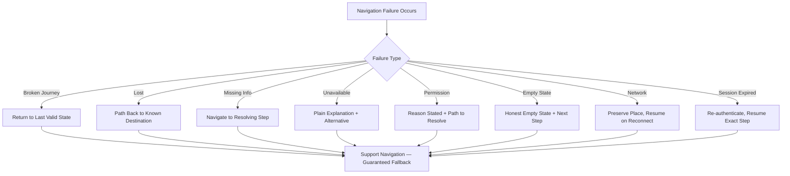

---

# Navigation Governance

### Ownership
Every navigation type in the Enterprise Navigation Model has exactly one named accountable owner, per the table in that section — mirroring the Clear Ownership discipline already established throughout `ai-docs/53` through `ai-docs/92`.

### Navigation Council
A standing **Navigation Council** — chaired by the Enterprise UX Architect, with the CPO, Head of Accessibility & Inclusion, Head of Platform Engineering, Head of Government Partnerships, and rotating Business Area navigation stewards as members — holds approval authority over any platform-wide navigation-standard change, any new persistent (Global/Utility/Support/AI/Search/Emergency) navigation element, and any material deviation from the Anti-Patterns below. The Council meets monthly, with ad hoc sessions for a Navigation Success Rate regression.

### Decision Authority

| Decision | Approves |
|---|---|
| New persistent navigation element | Navigation Council + CPO |
| Business-Area-local navigation change | Business Area Steward + Navigation Council (informational) |
| Cross-module navigation relationship change | Navigation Council + affected Business Area Stewards |
| Navigation-accessibility standard change | Navigation Council + Head of Accessibility & Inclusion |
| Emergency Navigation change | Navigation Council + Head of Trust & Safety |

### Review Process, Standards, and Audits
Every navigation change passes through a documented review against this document's Wayfinding Principles and Navigation Philosophy before implementation, mirroring `ai-docs/90-ux-vision-experience-strategy.md`'s Experience Reviews discipline. A Navigation Audit — checking Consistency, Click Depth, and Accessibility Compliance across every Business Area — is performed quarterly, distinct from and complementary to the Content Accuracy Audit already established in `ai-docs/92-information-architecture.md`.

### Documentation, Versioning, and Lifecycle
Every navigation standard and structural change is documented and versioned (Major.Minor.Patch), mirroring `ai-docs/49-engineering-handbook-governance-evolution-standards.md`'s Version Management. A navigation element's lifecycle mirrors the Content Governance Lifecycle already established in `ai-docs/92` — Creation, Review, Publication, Maintenance, Deprecation, Archival — never silently removed without a stated migration path for the citizens who relied on it.

### Continuous Improvement
Every Navigation Metric finding (below) feeds a shared, tracked improvement backlog, reviewed at the next Navigation Council meeting, per the identical Continuous Improvement Loop already established throughout `ai-docs/60` through `ai-docs/92`.

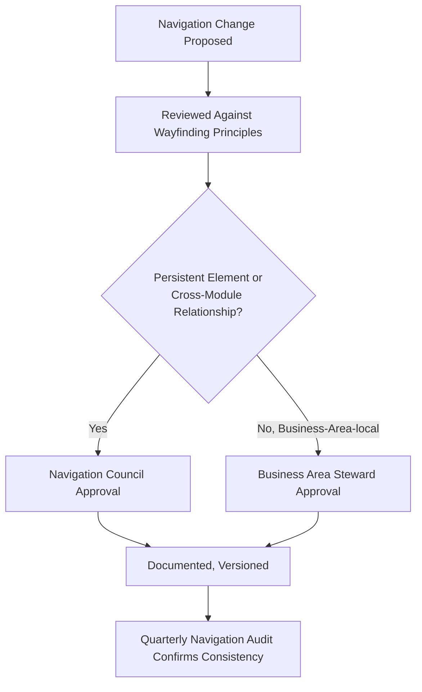

---

# Scalability

| Dimension | How Navigation Architecture Supports It |
|---|---|
| **Future Modules** | A new Product Module is onboarded into an existing Business Area's Primary Navigation wherever possible, per `ai-docs/54`'s Module Reuse Strategy — the Global Navigation structure is never redesigned per new module. |
| **Future Districts** | A second district's civic-service names and local navigation labels are configured within the existing hierarchy, per `ai-docs/50`'s Configuration-Driven Expansion Model — never requiring a new navigation model. |
| **Future States** | The same layered Navigation Hierarchy extends to a state-level deployment without structural redesign, per `ai-docs/59-business-glossary.md`'s GLOSS-054 State Administrator future term. |
| **AI Integration** | AI Navigation is structured as a cross-cutting mediator over the existing hierarchy, never a parallel navigation system of its own. |
| **Localization** | Navigation labels are externalized from structure — a translated label never requires a hierarchy or wayfinding-principle change. |
| **Internationalization** | The Enterprise Navigation Model's layers are technology- and geography-independent, allowing future expansion beyond a single state. |
| **Enterprise Growth** | The Navigation Hierarchy's layered design absorbs growth at the lower layers (Features, Tasks) without requiring Global or Primary Navigation to change. |
| **Future Navigation Models** | A genuinely novel navigation pattern (e.g., a future voice-only interaction mode) is evaluated against this document's Wayfinding Principles before adoption, never against convenience alone. |
| **Emerging Technologies** | Any future interaction medium is required to honor Orientation, Recovery, and Accessibility exactly as any other navigation surface does — this document's principles are technology-independent by design. |
| **Long-Term Maintainability** | A stable, documented, governed navigation structure is the precondition for a future architect, unfamiliar with today's reasoning, to extend it correctly. |

---

# Risks

| Risk | Description | Mitigation |
|---|---|---|
| **Navigation Sprawl** | New navigation elements accumulate without a reuse check, diluting the clarity of Global Navigation. | Navigation Council reuse check before any new persistent element is approved. |
| **Deep Hierarchies** | A citizen must traverse too many layers to reach a genuine Task. | Navigation Hierarchy's layer-size discipline; Click Depth metric monitored below. |
| **Hidden Features** | A genuinely available capability has no discoverable navigation path. | Information Findability cross-check per `ai-docs/92`; mandatory discoverability review at Module Release Readiness. |
| **Duplicate Navigation** | Two navigation paths lead to the same destination inconsistently, confusing a citizen about which is authoritative. | Navigation Consistency principle; Quarterly Navigation Audit. |
| **Dead Ends** | A navigation state offers no onward or backward path. | No Dead Ends principle; enforced at Task Navigation's Completion Experience standard. |
| **Inconsistent Navigation** | The same interaction category behaves differently across Business Areas. | Cross-Module Navigation's Shared Principles discipline. |
| **Conflicting Labels** | Two navigation elements use ambiguous or overlapping labels for different destinations. | Terminology Governance per `ai-docs/59-business-glossary.md`, cross-checked at Navigation Review. |
| **Navigation Drift** | Navigation structure silently diverges from this document's standard over time. | Quarterly Navigation Audit; Version Control on every structural change. |
| **User Disorientation** | A citizen cannot answer "where am I, where did I come from, where can I go" at a given point. | Wayfinding Principles' Orientation and Location Awareness standards. |
| **Accessibility Failures** | A navigation element is unusable by a screen-reader, keyboard-only, or voice-first citizen. | Accessibility section's WCAG Alignment; mandatory Accessibility Audit. |
| **Search Dependence** | Navigation structure is so weak that citizens can only find content through Search, never through browsing. | Discoverability principle; Search Dependency metric tracked below as a warning signal, never a target. |

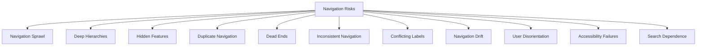

---

# Metrics

| Metric | Definition | Direction |
|---|---|---|
| **Navigation Success Rate** | % of citizen navigation attempts reaching the intended destination without backtracking or abandonment. | Increasing |
| **Task Completion Rate** | % of Tasks completed once a citizen reaches the relevant entry point, per `ai-docs/92`'s Task Completion metric. | Increasing |
| **Navigation Efficiency** | Median number of navigation actions between a citizen's need and their goal. | Decreasing |
| **Click Depth** | Average number of layers traversed to reach a genuine destination. | Decreasing or stable within a defined threshold |
| **Time to Destination** | Median and p95 time from navigation initiation to arrival at the intended content. | Decreasing |
| **Search Dependency** | % of successful navigations that required Search rather than browsing. | Monitored, never minimized as a target in itself — a genuinely high dependency signals a browsing-structure weakness. |
| **Navigation Error Rate** | % of navigation attempts resulting in a dead end, an error state, or an unintended destination. | Decreasing |
| **Backtracking Rate** | % of navigation sessions including a "go back" action following an incorrect forward step. | Decreasing |
| **User Confidence** | Citizen-reported certainty that they know where they are and how to proceed, per periodic research. | Increasing |
| **Navigation Learnability** | Rate at which a first-time citizen's Navigation Success Rate approaches that of a returning citizen. | Increasing |
| **Accessibility Compliance** | % of navigation elements meeting the WCAG 2.2 AA floor. | Increasing toward 100% |

> **Callout — No Navigation Metric Stands Alone**
> Per the North Star Principle already established in `ai-docs/00-project-vision.md`, a rising Navigation Efficiency alongside a falling Accessibility Compliance, or a decreasing Click Depth achieved by hiding genuine options, is treated as a regression — never counted as success in isolation.

---

# Anti-Patterns

| Anti-Pattern | Description | Why It's Rejected |
|---|---|---|
| **Navigation by Organization Chart** | The visible structure mirrors Arwal's internal Business Domains or teams rather than a citizen's mental model. | Violates Citizen First Navigation; mirrors the identical Department-Centric Organization anti-pattern already rejected in `ai-docs/92-information-architecture.md`. |
| **Department-Centric Navigation** | A citizen must already understand Arwal's internal ownership to find a destination. | Violates Structure Around Mental Models, extended here to movement. |
| **Deep Nested Menus** | A citizen must traverse many layers to reach a genuine Task. | Violates Minimal Cognitive Load and Clarity Before Complexity. |
| **Duplicate Navigation** | Two inconsistent paths lead to the same destination. | Violates Navigation Consistency and Single Source of Truth. |
| **Unclear Labels** | A navigation label does not accurately predict its destination. | Violates Destination Clarity and the Labeling Strategy already established in `ai-docs/92`. |
| **Hidden Features** | A genuinely available capability has no discoverable path. | Violates Information Findability; functionally equivalent to the capability not existing. |
| **Dead Ends** | A navigation state offers no onward or backward path. | Directly violates No Dead Ends. |
| **Navigation Loops** | A citizen is returned to a prior state with no genuine progress, unable to escape a cycle. | Violates Exit Strategy and Recovery. |
| **Broken Breadcrumbs** | A citizen's traced-back path does not match their actual navigation history. | Violates Breadcrumb Philosophy and Trust Through Predictability. |
| **Inconsistent Menu Structures** | The same interaction category is organized differently across Business Areas. | Violates Cross-Module Navigation's Shared Principles discipline. |
| **Unmanaged Growth** | New navigation elements and destinations proliferate without governance or a reuse check. | Violates Navigation Governance; produces Navigation Sprawl. |

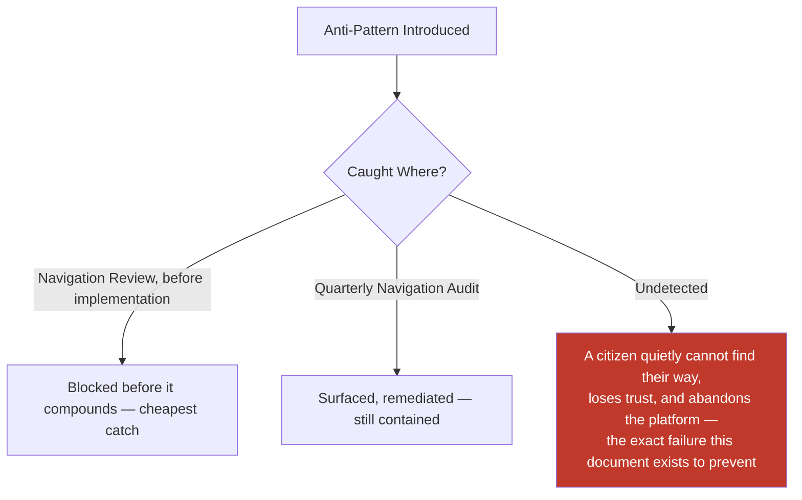

---

# Relationship to Previous Documents

| Prior Document | Relationship |
|---|---|
| **Project Vision (`ai-docs/00`)** | Establishes No Dead Ends, Progressive Complexity, and Inclusion over Optimization — this document's Navigation Philosophy operationalizes each at the movement layer. |
| **Product Goals (`ai-docs/01`)** | Supplies the Target Audience device/literacy profile this document's Mobile Navigation and Accessibility sections are calibrated against. |
| **Engineering Principles (`ai-docs/02`)** | Supplies DRY and Single Source of Truth, applied here to navigation structure rather than code. |
| **System Architecture Principles (`ai-docs/03`)** | Supplies the Domain-Driven vocabulary this document's Cross-Module Navigation is structurally aligned with, never redefined. |
| **Security Standards (`ai-docs/10`)** | Supplies the Authorization discipline behind Administrative Navigation's role-gating. |
| **Performance Standards (`ai-docs/11`)** | Supplies the latency and offline-resilience targets this document's Mobile and Low-Connectivity Navigation are bound by. |
| **Accessibility Standards (`ai-docs/12`)** | Supplies the non-negotiable WCAG 2.2 AA floor this document's Accessibility section extends to the structural, movement-specific layer. |
| **Documentation Standards (`ai-docs/24`)** | Supplies the Plain Language and Naming Conventions this document's labeling references inherit. |
| **Architecture Decision Records (`ai-docs/25`)** | Supplies the governed-decision discipline a Major navigation-standard change follows. |
| **Engineering Governance & Decision Authority (`ai-docs/29`)** | Supplies the Decision Authority Matrix pattern this document's Navigation Governance mirrors. |
| **Engineering Compliance & Audit Standards (`ai-docs/40`)** | Supplies the Evidence Quality Bar this document's Navigation Audit is measured against. |
| **Engineering Architecture Governance Standards (`ai-docs/46`)** | Supplies the Board-and-Council governance pattern this document's Navigation Council mirrors. |
| **Engineering Handbook Governance & Evolution Standards (`ai-docs/49`)** | Supplies the Version Management and Document Lifecycle disciplines this document's Navigation Governance directly inherits. |
| **Product Vision & Business Strategy (`ai-docs/50`)** | Supplies the Strategic Expansion Principles this document's Scalability section is built around. |
| **Stakeholder Analysis (`ai-docs/51`)** | Supplies the stakeholder registry every role-based navigation distinction traces to. |
| **User Personas & User Segmentation (`ai-docs/52`)** | Supplies the Evidence-Based Research discipline this document's Citizen First Navigation principle is grounded in. |
| **Business Domain Model (`ai-docs/53`)** | Supplies the Domain Registry that Cross-Module Navigation's relationships are anchored to, never mirrored directly in citizen-facing structure. |
| **Product Module Catalog (`ai-docs/54`)** | Supplies the Module Registry the Navigation Hierarchy's Modules layer cites directly. |
| **Business Capability Map (`ai-docs/55`)** | Supplies the Capability Registry underlying the Features layer of the Navigation Hierarchy. |
| **User Journey Standards (`ai-docs/56`)** | Supplies the Task-level granularity and Journey State Model this document's Task Navigation is built from. |
| **Business Process Standards (`ai-docs/57`)** | Supplies the organizational sequence standing behind Administrative Navigation. |
| **Business Rules & Policies (`ai-docs/58`)** | Supplies the precise Role Assignment (RULE-031) and Idempotency (RULE-018) logic this document's Administrative Navigation and Task Navigation confirmation steps are bound by. |
| **Business Glossary (`ai-docs/59`)** | Supplies the singular vocabulary this document's every navigation label must draw from. |
| **Customer Experience Strategy (`ai-docs/60`)** | Supplies the platform-wide felt-experience bar every navigation interaction must clear. |
| **District Ecosystem Mapping (`ai-docs/64`)** | Supplies the Cross-Domain Collaboration reasoning this document's Cross-Domain Continuity principle extends. |
| **Community & Social Engagement Strategy (`ai-docs/75`)** | Supplies the Community taxonomy branch's navigation relationship to Government Services. |
| **Search & Discovery Strategy (`ai-docs/77`)** | Supplies the Trust Before Ranking and Fair Visibility principles this document's Search & Discovery Navigation is bound by. |
| **AI Product Strategy (`ai-docs/78`)** | Supplies the Explainability and Human-in-the-Loop principles this document's AI Navigation must honor. |
| **Trust & Safety Framework (`ai-docs/79`)** | Supplies the Trust Value Chain this document's Trust Through Predictability principle is built on. |
| **Product Governance** | Supplies the governance-of-governance discipline this document's own Navigation Governance section is held to. |
| **UX Vision & Experience Strategy (`ai-docs/90`)** | Supplies the Experience Principles (Clarity, Predictability, Discoverability) this document's Wayfinding Principles directly extend. |
| **Human-Centered Design Principles & UX Philosophy (`ai-docs/91`)** | Supplies the Design Decision Principles every navigation decision in this document is evaluated against before publication. |
| **Information Architecture (`ai-docs/92`)** | Supplies the Enterprise Information Model and Content Taxonomy this document's entire Navigation Hierarchy is built directly on top of — the immediate predecessor this document exists to complete. |

### How Navigation Architecture Transforms Information Architecture Into Predictable User Movement

`ai-docs/92-information-architecture.md` gives Arwal a correct, governed structure of what exists and where it belongs. That structure remains latent — theoretically correct but practically inert — until this document's Global, Primary, Contextual, and Task Navigation give a citizen an actual, walkable, recoverable path through it. Every layer of the Enterprise Information Model becomes real to a citizen only at the moment Navigation Architecture renders it reachable, orientable, and reversible. This is the precise, non-overlapping division of labor between the two documents: Information Architecture is the map; this document is the compass, the signage, and the return path.

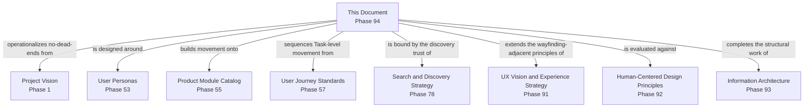

---

# Executive Artifacts

### Enterprise Navigation Framework

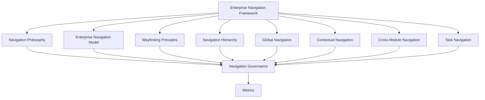

### Navigation Hierarchy Model

See Navigation Hierarchy section above — reproduced here by reference per Single Source of Truth, never duplicated.

### Navigation Decision Framework

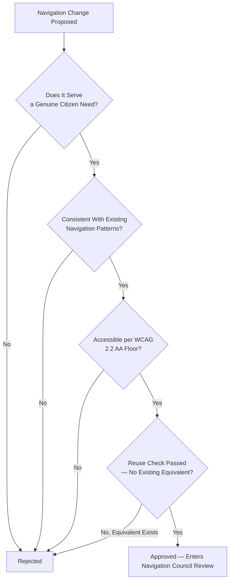

### Wayfinding Model

See Wayfinding Principles section above.

### Navigation Governance Framework

See Navigation Governance section above.

### Navigation Lifecycle

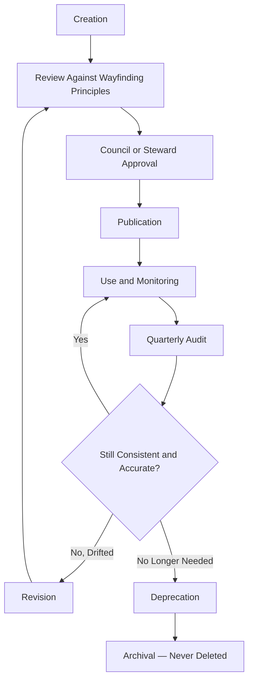

### Navigation Ownership Matrix

| Navigation Type | Owner | Governance Authority |
|---|---|---|
| Global Navigation | Head of Platform Engineering | Navigation Council |
| Primary Navigation | Business Area Steward | Navigation Council (informational) |
| Secondary Navigation | Module Owner | Business Area Steward |
| Contextual Navigation | Journey Product Owner | Navigation Council |
| Task Navigation | Journey Owner | Navigation Council |
| Utility Navigation | CPO (delegate: Citizen Experience PM) | Navigation Council |
| Support Navigation | Head of Customer Success | Navigation Council |
| Administrative Navigation | Head of Operations / Head of Government Partnerships | Navigation Council + Compliance |
| AI Navigation | Head of AI Platform | Navigation Council + AI Council (`ai-docs/78`) |
| Search Navigation | Head of Platform Engineering | Navigation Council |
| Emergency Navigation | Head of Trust & Safety | Navigation Council |

### Cross-Module Navigation Matrix

See Cross-Module Navigation section above — reproduced here by reference per Single Source of Truth, never duplicated.

### Navigation Maturity Model

| Level | Name | Characteristics |
|---|---|---|
| **1 — Informal** | Navigation varies by Business Area; no shared wayfinding standard. | High variance; citizens relearn navigation per module. |
| **2 — Developing** | Wayfinding Principles are documented; inconsistently applied. | Uneven adoption across verticals. |
| **3 — Defined** | This document's full model, hierarchy, and principles are applied consistently. | This document's standard is fully met. |
| **4 — Measured** | Navigation Success Rate, Click Depth, and Accessibility Compliance are actively tracked against explicit thresholds. | Proactive, not reactive. |
| **5 — Optimized** | Navigation Architecture actively informs product strategy and is genuinely replicable to a second district's civic structure. | Navigation is a durable civic and competitive advantage. |

Arwal's target state at this stage is **Level 3 (Defined)**, with **Level 4 (Measured)** targeted as analytics tooling from later phases matures.

### Enterprise Navigation Checklist

- [ ] Traceable to a genuine citizen need, never a technical or internal convenience.
- [ ] Consistent with every existing Wayfinding Principle above.
- [ ] Reachable within the Navigation Hierarchy's layer-depth discipline.
- [ ] Labeled per `ai-docs/92`'s Labeling Strategy and `ai-docs/59`'s Business Glossary.
- [ ] Accessible per the WCAG 2.2 AA floor.
- [ ] Named, accountable owner assigned per the Navigation Ownership Matrix.
- [ ] No anti-pattern present, per the Anti-Patterns table above.

### Navigation Review Checklist

- [ ] Orientation, Location Awareness, and Recovery are all satisfied for every new navigation state.
- [ ] No dead end introduced at any step.
- [ ] Consistent with the equivalent pattern in every other Business Area that has one.
- [ ] Contextual or Task Navigation additions remain genuinely bounded, never sprawling.
- [ ] Reuse check completed — no existing equivalent navigation element serves the same need.

### Navigation Audit Framework

| Audit Dimension | What Is Checked | Cadence |
|---|---|---|
| Consistency | Same interaction category behaves identically across Business Areas | Quarterly |
| Click Depth | No Task requires excessive layer traversal | Quarterly |
| Accessibility Compliance | WCAG 2.2 AA floor met across every navigation element | Quarterly |
| Label Accuracy | Every label's destination matches citizen expectation | Quarterly |
| Dead End Detection | Every navigation state has a genuine onward or backward path | Quarterly |
| Ownership Completeness | Every navigation element has a current, active named owner | Quarterly |

### Navigation Principles Matrix

| Principle | Primary Beneficiary | Conflict Resolution Priority |
|---|---|---|
| Accessible Navigation | Vulnerable, low-literacy, rural citizens | Highest — never subordinated |
| No Dead Ends | Every citizen | Highest — never subordinated |
| Predictability | Every citizen | High |
| Trust Through Predictability | Every citizen and institutional partner | High |
| Navigation Consistency | Every citizen across every module | Medium-High |
| Minimal Cognitive Load | Every citizen, once safety and clarity are satisfied | Medium |
| Scalable Navigation | Future districts and future citizens | Medium |

### Decision Matrix

| Decision Type | Approval Authority |
|---|---|
| New persistent navigation element | Navigation Council + CPO |
| Business-Area-local navigation change | Business Area Steward + Navigation Council (informational) |
| Cross-module navigation relationship change | Navigation Council + affected Business Area Stewards |
| Navigation-accessibility standard change | Navigation Council + Head of Accessibility & Inclusion |
| Emergency Navigation change | Navigation Council + Head of Trust & Safety |

### Executive Dashboards (Conceptual)

| Dashboard | Audience | Key Content |
|---|---|---|
| **CXO/CPO Dashboard** | CXO, CPO | Navigation Success Rate, Navigation Maturity Level |
| **Business Area Steward Dashboard** | Vertical Heads | Click Depth, Backtracking Rate for their own area |
| **Accessibility Dashboard** | Head of Accessibility & Inclusion | Accessibility Compliance trend |
| **Government Partners Dashboard** | Government liaisons | Government Services branch Navigation Success Rate |

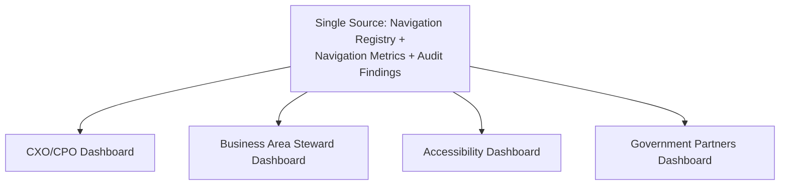

---

# Closing Statement

> **Callout — Closing Statement**
> Every prior document in this handbook explains what Arwal is, what it can do, how it earns trust, and how its information is organized. This document explains something a citizen never consciously names but feels on every single visit: whether they know where they are, whether they can get back, and whether they can find their way to something they did not even know to look for. A perfectly organized taxonomy still fails a citizen who cannot walk through it — Navigation Architecture is the difference between a platform that is theoretically complete and one that is actually usable, screen after screen, visit after visit, for as long as this platform exists. A citizen who always knows where they are is a citizen who trusts the ground beneath them, and that trust, compounded over years and eventually over districts, is what this document exists to protect. Where a future phase must deviate from a principle stated here, that deviation is made explicitly — through the Navigation Council's Governance process above — never silently, and never by default.

This document, `ai-docs/93-navigation-architecture-wayfinding.md`, is Phase 94 of approximately 425. Every future navigation pattern, menu structure, and user-movement decision is expected to trace back to a principle defined here, or to justify its deviation in writing.

**End of Phase 94 — `ai-docs/93-navigation-architecture-wayfinding.md`**