# User Flow Standards

**Document:** `ai-docs/94-user-flow-standards.md`
**Project:** Arwal — The District Super App
**Stage:** 3 — Experience & Design Strategy
**Phase:** 95 — User Flow Standards
**Status:** Approved for Executive & Enterprise Reference
**Audience:** CXO, CPO, Enterprise UX Architect, Enterprise Service Design Architect, Human-Centered Design Consultants, Government Digital Services Advisors, Enterprise Journey Architects, Product Strategy Consultants, Accessibility Specialists, Enterprise Design Governance Leads, Digital Transformation Consultants, Enterprise Documentation Architects

> **Callout — Purpose of This Document**
> `ai-docs/92-information-architecture.md` established how information is organized. `ai-docs/93-navigation-architecture-wayfinding.md` established how a citizen moves through that organization — orientation, movement, and return. Neither document answers the question that determines whether a citizen's actual goal was ever accomplished: **once a citizen has arrived at the right place, how do they successfully complete what they came to do?** This document is that answer — the authoritative User Flow Standards every future goal-completion sequence, decision point, validation rule, and recovery path traces back to.

---

# Purpose of this Document

### Why User Flows Are Different From Navigation Architecture

`ai-docs/93-navigation-architecture-wayfinding.md` answers *how a citizen gets somewhere and knows where they are*. This document answers a different, subsequent question: *once they have arrived, how do they actually get the thing done?* Navigation ends the moment a citizen reaches the correct destination — a Task, a Feature, a Module. User Flow Standards begin at that exact point and govern everything that happens until the citizen's genuine goal is accomplished: what decisions they must make, what information they must provide, how their progress is communicated, how a mistake is recovered from, and how completion is confirmed. A citizen can navigate perfectly and still fail if the flow waiting at the destination is confusing, punitive, or incomplete.

### Why Navigation Ends Where User Flows Begin

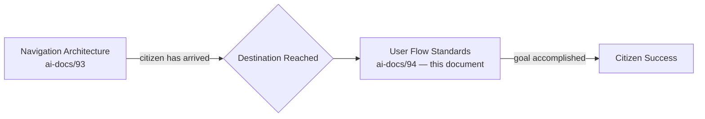

| Navigation Architecture Determines | User Flow Standards Determine |
|---|---|
| How a citizen reaches a destination | How a citizen accomplishes a goal once there |
| How a citizen orients themselves | How a citizen makes a decision |
| How a citizen discovers a service | How information is collected and validated |
| Where a citizen currently is | How progress toward completion is communicated |
| How a citizen returns to a known point | How a citizen recovers from a mistake |
| — | How completion is confirmed and what happens next |

### Why Goal Completion Matters More Than Screen Completion

A citizen does not open Arwal to view a screen — they open it to renew a certificate, book a doctor, or check a price. A flow measured only by "did the screen render correctly" can pass every technical check and still fail the citizen if the certificate was never actually renewed. This document exists to hold every flow accountable to the citizen's real goal, never merely to the mechanical completion of a screen sequence, mirroring the identical Citizen-First discipline already established throughout `ai-docs/51` through `ai-docs/93`.

### How Efficient Flows Increase Trust, Reduce Friction, and Improve Confidence

Every unnecessary step, redundant field, or ambiguous decision point is a real cost paid disproportionately by exactly the citizens Arwal exists to serve first — a first-generation smartphone user, a low-literacy farmer, an anxious elderly citizen. A flow that respects a citizen's time and never asks for what it already knows compounds directly into the Trust Value Chain already established in `ai-docs/79-trust-safety-framework.md`: a citizen who completes a flow smoothly once is a citizen who approaches the next one with confidence rather than dread. Friction is not merely an inconvenience — per `ai-docs/90-ux-vision-experience-strategy.md`'s Confidence emotional outcome, it is the specific mechanism by which trust is spent or grown.

### How User Flows Support Accessibility and Enable Enterprise Consistency

A flow is accessible because its decision points, validation messages, and recovery paths were designed for a screen-reader user, a voice-first user, and a low-literacy user from the first draft — never patched in afterward, per the non-negotiable floor already established in `ai-docs/12-accessibility-standards.md`. Standardizing flow patterns once, here, and reusing them everywhere is what lets a citizen who has completed one government application correctly predict how a second, unfamiliar one will behave — the same Consistency Across Modules discipline already established in `ai-docs/90` and `ai-docs/93`, applied now to goal completion itself.

### The Chain of Reasoning This Document Extends

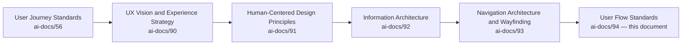

| Layer | Question It Answers |
|---|---|
| User Journey Standards | What does one interaction feel like, end to end? |
| UX Vision & Experience Strategy | What must a citizen feel, cumulatively? |
| Human-Centered Design Principles | What is the reasoning behind every design decision? |
| Information Architecture | How is information organized, classified, and labeled? |
| Navigation Architecture & Wayfinding | How does a citizen move through that information? |
| **User Flow Standards** (this document) | **How does a citizen actually accomplish their goal, once they have arrived?** |

### Scope Boundary

This document contains no wireframes, no UI components, no frontend code, no backend logic, no screen layouts, no React or Next.js patterns, no animations, no API design, and no workflow-engine implementation. Every one of those remains the deliberate territory of a future, technology-facing phase building explicitly on top of this one. This document's exclusive territory is: **why user flows are a distinct discipline, the enterprise user flow model, flow states, goal-oriented flow design, decision points, progress communication, multi-step flow standards, validation, error recovery, accessibility, cross-module consistency, AI-assisted flows, and governance** — the goal-completion structure every future implementation must express faithfully, never redefine independently.

---

# User Flow Philosophy

Every principle below exists because a flow assembled carelessly does not fail abstractly — it fails a specific citizen who gave up one step before their certificate was renewed.

### Goal Before Screens
**Why it exists:** A flow is designed backward from the citizen's genuine goal, never forward from a convenient sequence of screens a team happened to build. A flow that technically renders every screen correctly but never gets the citizen to their goal has not succeeded, mirroring `ai-docs/91-human-centered-design-principles-ux-philosophy.md`'s Design for Human Needs principle.

### Citizen Success First
**Why it exists:** Every flow decision is judged first against whether it helps a real citizen reach their actual goal, never against what is convenient to build or what exposes the most product surface, restating the Citizen-First tie-breaker already established throughout `ai-docs/51` through `ai-docs/93`.

### Minimal Friction
**Why it exists:** Every additional field, click, or wait is a real cost — a flow asks only for what the citizen's goal genuinely requires, at the moment it is genuinely needed, never speculatively or redundantly, per `ai-docs/56-user-journey-standards.md`'s Minimal Cognitive Load principle applied here to goal completion specifically.

### Progressive Disclosure
**Why it exists:** A flow reveals its next requirement only once the current one is satisfied — a citizen is never confronted with the full complexity of a multi-step process before they have committed to the first step, per `ai-docs/00-project-vision.md`'s Progressive Complexity principle.

### Recognition Over Recall
**Why it exists:** A citizen should recognize the correct next action when they see it, never be required to remember a rule or a prior instruction — every decision point presents its options visibly, never depending on a citizen's memory of something told to them earlier in the flow.

### Clear Decision Points
**Why it exists:** A citizen facing a choice within a flow understands, in plain language, what each option means and what it commits them to, before they choose — an ambiguous decision point is a flow failure regardless of how correct the underlying logic is.

### Error Prevention
**Why it exists:** A flow is designed to make a costly mistake difficult to make by accident, before it is designed to explain that mistake afterward, per `ai-docs/90-ux-vision-experience-strategy.md`'s Error Prevention principle — prevention is always preferred over correction.

### Recovery Without Punishment
**Why it exists:** A citizen who makes a mistake within a flow is guided back to a valid state without losing their prior progress, without a shaming tone, and without being forced to restart from the beginning, mirroring `ai-docs/56-user-journey-standards.md`'s Error Recovery discipline and `ai-docs/90`'s Forgiveness principle.

### Consistency Across Modules
**Why it exists:** A citizen who has completed one government application should recognize the same underlying flow shape in an unrelated healthcare booking — the specific content differs, the flow discipline never does, per the identical Consistency principle already established in `ai-docs/90-ux-vision-experience-strategy.md` and `ai-docs/93-navigation-architecture-wayfinding.md`.

### Trust Through Predictability
**Why it exists:** A citizen who correctly predicts what a flow will ask of them next, and finds that prediction confirmed, has one more reason to trust the platform generally, per `ai-docs/93`'s Trust Through Predictability principle extended here from movement to goal completion.

### Accessibility by Default
**Why it exists:** A flow is accessible because its structure, language, and recovery paths were designed for a screen-reader user, a keyboard-only user, and a voice-first user from the first draft, per the non-negotiable floor already established in `ai-docs/12-accessibility-standards.md` — never a pass applied after a visually-oriented flow was already locked in.

### Inclusive Flow Design
**Why it exists:** A flow that assumes literacy, a shared national language, sustained connectivity, or digital fluency has already excluded a meaningful share of Arwal's population, per the founding Inclusion over Optimization pillar in `ai-docs/00-project-vision.md`.

### Scalable Flow Design
**Why it exists:** A flow pattern that only works for today's twenty modules will not gracefully absorb the next two hundred — every flow pattern is designed with headroom for reuse across future verticals and future districts, per the same Future Scalability discipline already established in `ai-docs/92` and `ai-docs/93`.

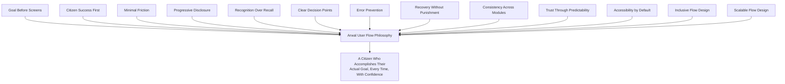

> **Callout — The One-Sentence User Flow Philosophy**
> *"A flow that renders every screen correctly but never gets the citizen to their goal has not succeeded — the only honest measure of a flow is whether the thing the citizen came to do actually got done."*

---

# Enterprise User Flow Model

Every flow in Arwal is composed of the same ten stages, regardless of which vertical or Business Area it belongs to.

| Stage | Purpose | Ownership | Success Criteria |
|---|---|---|---|
| **Entry** | The citizen arrives at the flow, handed off from Navigation Architecture (`ai-docs/93`). | The owning Journey's Product Owner, per `ai-docs/56` | The citizen understands, within seconds, what this flow will accomplish for them. |
| **Goal Identification** | The flow confirms, explicitly or implicitly, what the citizen is trying to achieve. | Journey Product Owner | The citizen's actual goal matches the flow's assumed goal — never guessed incorrectly. |
| **Context Collection** | The flow gathers only the information genuinely required, drawing first from what is already known and consented, per RULE-003. | Journey Product Owner + Business Area Steward | No citizen is asked for data Arwal already has and may consent-check rather than re-collect. |
| **Decision Points** | The citizen makes any genuine choices the flow requires, per the Decision Point Framework below. | Journey Product Owner | Every decision is clear, timely, and confidently made. |
| **Task Execution** | The citizen performs the substantive action — entering data, uploading a document, selecting a slot. | Journey Product Owner | The citizen completes the action without confusion or unnecessary repetition. |
| **Validation** | The flow checks the citizen's input against Business Rules (`ai-docs/58`) before proceeding, per the Flow Validation section below. | Business Area Steward | An invalid input is caught before submission, never discovered only afterward. |
| **Confirmation** | The citizen is shown, explicitly, what they are about to commit to before an irreversible action proceeds. | Journey Product Owner | No consequential action proceeds without a citizen's informed, explicit confirmation. |
| **Completion** | The flow's goal is genuinely achieved, and the citizen is told so, plainly. | Journey Product Owner | The citizen knows, without doubt, that their goal was accomplished. |
| **Next Actions** | The flow offers a clear, relevant onward path — a related service, a status check, a return to a known destination. | Journey Product Owner + Navigation Council (`ai-docs/93`) | The citizen is never left on a terminal screen with no next step. |
| **Exit** | The citizen leaves the flow, whether by completion, cancellation, or navigation elsewhere. | Journey Product Owner | The citizen's state is preserved or cleanly closed, never left ambiguous. |

### Relationships Between Stages

Every stage's output is the next stage's input — a flow never skips Context Collection to reach Task Execution, and never reaches Completion without passing through Validation. Where a stage is genuinely unnecessary for a specific flow (a simple, single-field flow may have no meaningful Decision Points), it is explicitly marked absent rather than silently omitted, so a future reviewer can distinguish "not needed here" from "forgotten."

---

# Flow States

Every flow instance, regardless of which Enterprise User Flow Model stage it is in, occupies exactly one of the following states at any moment — mirroring and extending the Journey State Model already established in `ai-docs/56-user-journey-standards.md` to the finer-grained level of an individual flow.

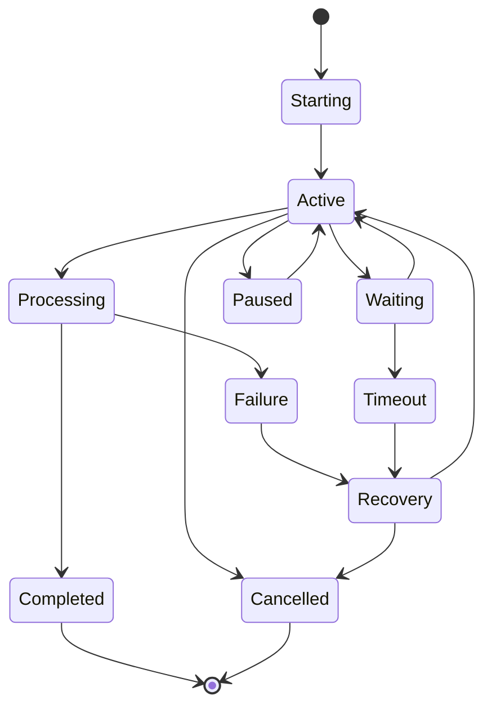

| State | Meaning | Transition Rules |
|---|---|---|
| **Starting** | The flow has been entered but the citizen has not yet taken a meaningful action. | Transitions to Active on the citizen's first genuine input. |
| **Active** | The citizen is actively progressing through Context Collection, Decision Points, or Task Execution. | Transitions to Waiting (an external dependency), Processing (a submission), Paused (a deliberate citizen pause), or Cancelled (a deliberate exit). |
| **Waiting** | The flow is paused pending an external party — an officer's review, a payment gateway, a document authority. | Transitions back to Active once the external dependency resolves, or to Timeout if it does not resolve within a defined window. |
| **Processing** | The citizen's submitted input is being validated or executed. | Transitions to Completed on success, or Failure on an unrecoverable error. |
| **Paused** | The citizen has deliberately stepped away, with their progress preserved. | Transitions back to Active when the citizen resumes, never silently expiring without a defined grace window. |
| **Completed** | The flow's goal has been genuinely achieved. | Terminal — the flow instance ends here. |
| **Cancelled** | The citizen has deliberately exited before completion. | Terminal — no partial side effect is left in an ambiguous state. |
| **Recovery** | The flow is guiding the citizen back to a valid state following a Failure or Timeout. | Transitions back to Active once recovered, or to Cancelled if the citizen chooses not to continue. |
| **Failure** | A validation, business-rule, or system failure has occurred. | Always transitions to Recovery — a Failure state is never left as a dead end. |
| **Timeout** | A Waiting state has exceeded its defined grace window with no resolution. | Always transitions to Recovery, never silently discarded. |

> **Callout — No State Is Ever a Dead End**
> Per the No Dead Ends principle already established in `ai-docs/00-project-vision.md` and restated for navigation in `ai-docs/93-navigation-architecture-wayfinding.md`, every Flow State above has a defined, non-ambiguous transition — a citizen is never left in Failure or Timeout with no path forward. Recovery is not one option among several; it is the mandatory next state for every failure condition.

---

# Goal-Oriented Flow Design

Every flow category below is designed around the citizen's actual goal, never around an internal process step — the specific enforceable logic behind each is owned entirely by `ai-docs/55-business-capability-map.md`, `ai-docs/57-business-process-standards.md`, and `ai-docs/58-business-rules-policies.md`, cited here, never restated.

| Flow Category | The Citizen's Actual Goal |
|---|---|
| **Citizen Goals** | "I want to check my status, update my information, or manage my account" — never framed as "navigate the Citizen Services module." |
| **Business Goals** | "I want my storefront to be live and my orders to arrive" — never framed as "complete Merchant Onboarding." |
| **Government Services** | "I want my certificate, my scheme benefit, or my grievance resolved" — never framed as "submit an Application object." |
| **Payments** | "I want my money to move correctly, once, and know it happened" — never framed as "process a transaction." |
| **Applications** | "I want to know I qualify and that my submission is being handled" — never framed as "complete the eligibility form." |
| **Bookings** | "I want a confirmed appointment I can trust is real" — never framed as "reserve a slot record." |
| **Marketplace Transactions** | "I want to receive what I ordered, correctly and on time" — never framed as "complete checkout." |
| **Healthcare Journeys** | "I want to see a trustworthy doctor without wasted time" — never framed as "browse the provider directory." |
| **Educational Processes** | "I want to find a tutor or scholarship that genuinely fits me" — never framed as "filter the education catalog." |
| **Administrative Processes** | "I want to process my queue accurately and defensibly" — never framed as "clear the dashboard." |

> **Callout — A Flow Named After Its Goal, Not Its Mechanism**
> Every flow in this catalog is named and evaluated by the citizen's actual outcome, never by its internal implementation step — a flow that successfully submits a form but leaves the citizen unsure whether their certificate is actually being processed has not achieved its goal, regardless of how cleanly the submission itself executed.

---

# Decision Point Framework

A Decision Point is any moment within a flow where the citizen — or, on their behalf, the system — must choose between two or more paths.

| Decision Type | Definition | Standard |
|---|---|---|
| **Binary Decisions** | A simple yes/no or two-option choice. | Both options stated in plain, parallel language — never one option worded neutrally and the other persuasively. |
| **Multi-Option Decisions** | A choice among three or more genuinely distinct paths. | Options are limited to a citizen-manageable number; where more exist, they are grouped or filtered rather than listed exhaustively at once, per Minimal Friction. |
| **Conditional Decisions** | A decision whose available options depend on the citizen's prior answers. | The flow never asks a citizen to answer a question already rendered irrelevant by an earlier answer. |
| **Role-Based Decisions** | A decision whose available options depend on the citizen's role (citizen, merchant, officer), per RULE-031. | An option unavailable to the citizen's role is never shown as if selectable and then rejected afterward. |
| **Context-Aware Decisions** | A decision informed by the citizen's genuine context (location, device, prior consented history). | Context narrows or pre-selects an option only where it demonstrably serves the citizen — never used to hide a genuinely available choice. |
| **AI-Assisted Decisions** | A decision where the AI Assistant (CAP-033) surfaces a recommendation. | The recommendation is always explainable and never presented as the only option, per `ai-docs/78-ai-product-strategy.md`. |
| **Government Approval Decisions** | A decision made by a government officer on a citizen's behalf, per PROC-004/PROC-007. | The decision is documented and reasoned per `ai-docs/58-business-rules-policies.md`, never presented to the citizen as if it were their own choice. |
| **Business Workflow Decisions** | A decision within a merchant or provider's own operational flow (confirm an order, accept a booking). | Held to the identical clarity and confirmation standard as any citizen-facing decision. |
| **Citizen Confirmation Decisions** | A final, explicit confirmation before an irreversible action. | Never bundled with an unrelated decision, and never defaulted to the irreversible option. |

### Decision Clarity, Timing, Confidence, Transparency, and Consistency

| Dimension | Standard |
|---|---|
| **Decision Clarity** | Every option's consequence is stated in plain language before the citizen commits, never discoverable only after choosing. |
| **Decision Timing** | A decision is presented only once the citizen has the information needed to make it confidently — never before, never delayed past the point it becomes relevant. |
| **Decision Confidence** | A citizen can change a decision before it becomes irreversible, without penalty, per Recovery Without Punishment. |
| **Decision Transparency** | Where a decision has downstream consequence (a fee, a binding commitment, a data-sharing implication), that consequence is stated explicitly at the point of decision, never buried elsewhere. |
| **Decision Consistency** | The same category of decision (a cancellation choice, a confirmation choice) is presented identically in shape and language across every module that has one. |

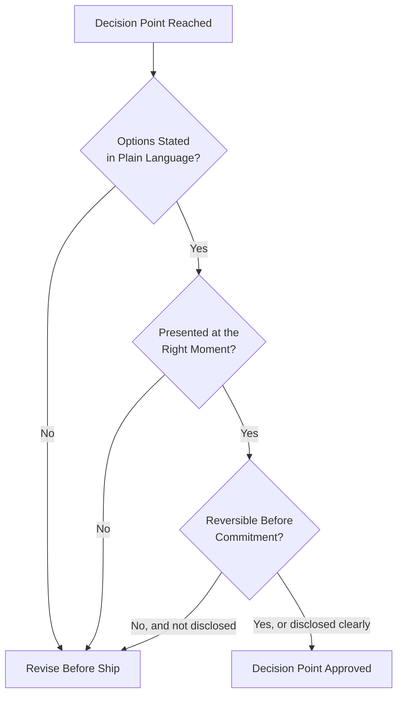

---

# Progress Communication

Every multi-step flow communicates a citizen's position within it continuously, never leaving them to wonder how much remains.

| Element | Standard |
|---|---|
| **Progress Indicators** | A visible, consistent signal of how far the citizen has come, present at every step of a multi-step flow. |
| **Completion Percentage** | Used where a flow's total step count is stable and known in advance — never fabricated for a flow whose length genuinely varies by citizen answer. |
| **Step Indicators** | A citizen can see which specific step they are on and how many are expected, per `ai-docs/56-user-journey-standards.md`'s Journey State Model. |
| **Milestones** | A long or complex flow (a government application spanning document upload, review, and issuance) marks genuine milestones a citizen can recognize as real progress, not merely mechanical steps. |
| **Estimated Time** | Where a flow includes a genuine external wait (an officer's review, a settlement window), the citizen is given an honest estimate, never a falsely reassuring one. |
| **Current Position** | The citizen's exact current step is always visible, never requiring them to scroll or infer it. |
| **Remaining Tasks** | What is left to do is stated plainly, never left to the citizen to calculate from what has already happened. |
| **Success Indicators** | Every successfully completed step is confirmed immediately, however small, per `ai-docs/90-ux-vision-experience-strategy.md`'s Feedback principle. |
| **Completion Confirmation** | The flow's final, genuine success is stated unambiguously — never implied by the mere disappearance of a form. |
| **Next Recommended Action** | Every completed flow states the single most relevant next step, never leaving the citizen to independently figure out what comes next. |

> **Callout — Progress Communication Builds Confidence Continuously, Not Only at the End**
> A citizen's confidence in a flow is built cumulatively, at every step — not manufactured retroactively by a single celebratory completion screen. A flow that is silent for several steps and then declares success has not built trust; it has merely avoided losing it. Every stage of the Enterprise User Flow Model above carries its own, specific progress signal.

---

# Multi-Step Flow Standards

| Flow Pattern | Standard |
|---|---|
| **Linear Flows** | A fixed sequence of steps, each with one obvious next step and one obvious back step, per `ai-docs/56`'s Journey Steps discipline. |
| **Branching Flows** | A genuine decision point splits the flow into distinct paths, each independently held to every standard in this document. |
| **Conditional Flows** | Later steps are shaped by earlier answers — a citizen is never asked an already-answered or now-irrelevant question again. |
| **Approval Flows** | A flow whose completion depends on a human decision-maker (PROC-004, PROC-007) states plainly that the citizen's part is done and what happens next, never implying the citizen must "keep checking" with no defined resolution path. |
| **Submission Flows** | A final submission is always preceded by a Confirmation stage per the Enterprise User Flow Model, and is idempotency-protected per RULE-018 where the submission has financial or civic consequence. |
| **Renewal Flows** | A renewal pre-fills every already-known, still-valid fact from the citizen's prior record, never re-collecting it from scratch. |
| **Application Flows** | Government Application flows follow RULE-006's Eligibility Baseline before entering departmental review, per `ai-docs/57`'s PROC-004. |
| **Booking Flows** | Appointment flows confirm a slot with the same certainty standard as a Payment flow — a "pending" booking is never presented indistinguishably from a "confirmed" one. |
| **Payment Flows** | Every payment flow honors RULE-018's Payment Idempotency Enforcement absolutely — a retried submission never produces a duplicate charge. |
| **Verification Flows** | Identity and credential verification flows state clearly what document is needed, why, and what happens if it is rejected, per RULE-002. |
| **Document Upload Flows** | Upload flows validate file type and size before submission where feasible, and state a rejection's specific reason immediately, never only after a delay. |

### Transition Standards

Every transition between stages of a multi-step flow satisfies three conditions: the citizen's already-provided information is carried forward without re-entry; the citizen's current position is restated at the start of the new stage; and a reliable path back to the prior stage exists without data loss, per Recovery Without Punishment.

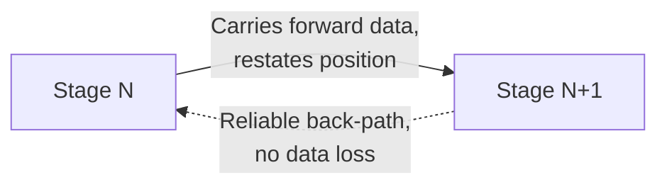

---

# Flow Validation

Validation protects a citizen from discovering an error only after real cost has already been incurred — mirroring and extending `ai-docs/05-coding-standards.md`'s two-place validation discipline (schema at the boundary, business rule in the domain) to the citizen-facing flow layer.

| Validation Type | Standard |
|---|---|
| **Input Validation** | Format and completeness are checked as close to the point of entry as feasible, never deferred silently to a later stage. |
| **Business Rule Validation** | A flow's input is checked against the applicable Business Rule (`ai-docs/58-business-rules-policies.md`) before it is allowed to proceed toward submission. |
| **Eligibility Validation** | Where a flow depends on Scheme or Certificate eligibility (RULE-008), the citizen is told their eligibility status before investing further effort in the flow, never only at the final step. |
| **Identity Validation** | A flow requiring identity confirmation applies RULE-002's Document Acceptance Criteria consistently, regardless of which module the flow belongs to. |
| **Document Validation** | An uploaded document is checked for legibility and completeness before the flow proceeds, per RULE-002. |
| **Context Validation** | A flow confirms that its assumed context (the citizen's role, location, prior state) still holds before acting on it, never assuming staleness-free context indefinitely. |
| **Real-Time Validation** | Where feasible, an error is surfaced at the moment of entry, not only at submission — but never in a way that interrupts an in-progress, not-yet-complete entry, per `ai-docs/12-accessibility-standards.md`'s Validation Feedback standard. |
| **Submission Validation** | A final, comprehensive check occurs immediately before submission, catching anything a real-time check may have missed. |
| **Final Review** | For a consequential flow (a payment, a civic submission), the citizen is shown a complete summary of what they are about to submit, per the Confirmation stage. |
| **Completion Validation** | The flow confirms, after submission, that the citizen's goal was genuinely achieved — never assuming success merely because no error was thrown. |

---

# Error Recovery

Every failure scenario below is designed with its recovery path decided in advance — never improvised in production, mirroring `ai-docs/20-error-handling-standards.md`'s Fail Fast and Recover Where Safe principles applied to the citizen-facing flow layer.

| Failure Scenario | Recovery Standard |
|---|---|
| **Validation Errors** | The specific field and the specific reason are stated together, and the citizen's other, valid input is preserved untouched. |
| **Business Rule Failures** | The specific unmet rule is named in plain language, per RULE-032's Accessibility Non-Negotiable Floor, never a generic rejection. |
| **Permission Issues** | The citizen is told why an action is unavailable to their role and, where one exists, how to obtain the needed permission. |
| **Missing Information** | The flow routes the citizen directly to the specific step needed to supply what is missing, never back to the beginning. |
| **Network Interruptions** | The citizen's progress is preserved locally where feasible, per `ai-docs/00-project-vision.md`'s Offline-First commitment, and resumes cleanly on reconnect. |
| **Timeouts** | A citizen waiting on an external dependency past its expected window is proactively told, never left to wonder silently. |
| **Cancelled Flows** | A citizen who deliberately cancels is not penalized, and any already-entered data is either safely discarded or offered for later resumption, per the citizen's own choice. |
| **Duplicate Actions** | A resubmission is detected and treated per RULE-018's idempotency discipline, never producing a duplicate outcome. |
| **Partial Completion** | A flow interrupted partway through is resumable from its last valid state wherever the underlying goal allows it, never forcing a full restart by default. |
| **System Failures** | A citizen-facing message states plainly that something went wrong on Arwal's side, never blaming the citizen, and offers a retry or an escalation to Support Navigation. |

### Recovery, Rollback, Resume, State Preservation, Graceful Failure

| Discipline | Standard |
|---|---|
| **Recovery** | Every failure state transitions to a defined Recovery state, per Flow States above — never left as a dead end. |
| **Rollback** | Where a partially executed action must be undone (a reserved slot never confirmed), the rollback is complete and leaves no orphaned side effect. |
| **Resume Capability** | A citizen returning to an interrupted flow finds it in the state and position they left it, wherever preserving that state genuinely serves their goal. |
| **State Preservation** | A flow's in-progress data is retained across a session interruption for a reasonable grace window, never discarded the moment a citizen navigates away. |
| **Graceful Failure** | A failure that cannot be fully recovered still leaves the citizen informed, oriented, and pointed toward a genuine next step — never confused about what happened or what to do now. |

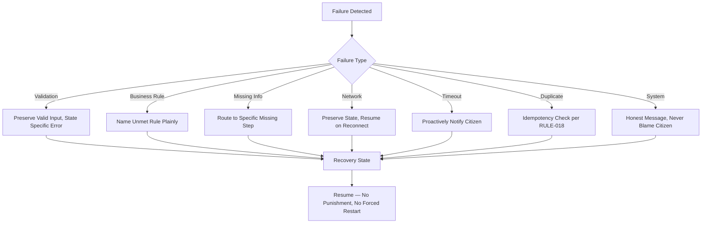

---

# Flow Accessibility

| Standard | Requirement |
|---|---|
| **Keyboard Navigation** | Every step, decision point, and control within a flow is reachable and operable via keyboard alone, in a logical order, per `ai-docs/12-accessibility-standards.md`. |
| **Screen Readers** | Every progress indicator, validation message, and confirmation is announced correctly and meaningfully as it appears. |
| **Logical Focus Order** | Focus moves deliberately to the next relevant element at every stage transition, never left stranded on a now-irrelevant control. |
| **Accessible Instructions** | Every instruction within a flow is available to a screen-reader user without relying on visual layout alone to convey meaning. |
| **Simple Language** | Every flow instruction, decision option, and error message is written in plain, jargon-free language, per RULE-032. |
| **Motor Accessibility** | Every interactive control within a flow meets the minimum touch-target standard already established in `ai-docs/12-accessibility-standards.md`. |
| **Visual Accessibility** | Flow state (valid, invalid, in-progress) is never conveyed by color alone. |
| **Cognitive Accessibility** | A flow never requires a citizen to hold more than one new concept in mind at once, per Minimal Friction. |
| **Language Accessibility** | Every flow is available in the citizen's registered language and regional dialect, per `ai-docs/12`'s Multilingual Accessibility standard. |
| **Low Digital Literacy** | Voice-first completion is a first-class path for a flow serving a low-literacy population, per PER-002 Meena's and PER-021 Lakshmi's established needs — never a secondary accommodation. |
| **WCAG Alignment** | Every flow standard above meets or exceeds WCAG 2.2 AA, the floor already established in `ai-docs/12-accessibility-standards.md`, never treated as a target. |

---

# Cross-Module Flow Consistency

The same underlying flow shape — Entry, Goal Identification, Context Collection, Decision Points, Task Execution, Validation, Confirmation, Completion, Next Actions, Exit — repeats identically across every Business Area below, differing only in domain-specific content, never in flow discipline.

| Module | Flow Consistency Expression |
|---|---|
| **Citizen Services** | Profile and consent flows follow the identical Confirmation-before-commit standard as any transacting flow. |
| **Agriculture** | A scheme-eligibility flow shares its Decision Point and Validation shape with a Government Services application flow. |
| **Healthcare** | Appointment booking shares its Confirmation-certainty standard with a Payment flow. |
| **Education** | Tutor and scholarship discovery flows share their Progressive Disclosure shape with Marketplace discovery. |
| **Employment** | Job application flows share their minimal-data-at-first-step standard with every other supply-side onboarding flow. |
| **Marketplace** | Checkout shares its idempotency and Confirmation standard with every other payment-bearing flow. |
| **Property** | Listing and inquiry flows share their dual-verification-before-contact-exchange standard with Employment's listing verification. |
| **Payments** | The single most consistent flow shape on the platform — every payment-bearing flow across every vertical honors RULE-018 identically. |
| **Community** | Group registration flows share their field-agent-assisted accessibility standard with Agriculture's assisted flows. |
| **Administration** | Officer-facing review flows are held to the identical Clarity and Error Prevention standard as any citizen-facing flow, never treated as an internal, lower-priority surface. |
| **AI Services** | AI-assisted flows share their Explainability and human-override standard identically regardless of which vertical they mediate. |
| **Analytics** | Internal reporting flows follow the identical Progress Communication standard as any citizen-facing multi-step flow. |
| **Support** | Escalation flows share their no-re-explanation standard (full context carried forward) with every other flow's Resume Capability. |
| **Emergency Services** | Emergency-relevant flows are held to the same Error Prevention and Recovery standard as any other flow, with an even lower tolerance for ambiguity given the stakes. |

> **Callout — A Citizen Should Never Have to Relearn Flow Discipline**
> A citizen who has successfully completed a Marketplace checkout should recognize, without instruction, how a Healthcare payment flow behaves — because the underlying Enterprise User Flow Model, Decision Point Framework, and Progress Communication standards are identical across both. Module Independence (per `ai-docs/54-product-module-catalog.md`) governs what each flow contains; Cross-Module Flow Consistency governs how it behaves.

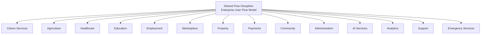

---

# AI-Assisted User Flows

| Element | Standard |
|---|---|
| **AI Guidance** | The AI Assistant (CAP-033) may guide a citizen through a flow's steps in conversational, voice-first form, per `ai-docs/78-ai-product-strategy.md`. |
| **Smart Recommendations** | A recommended option within a Decision Point is always distinguishable from an organically presented one, per `ai-docs/77-search-discovery-strategy.md`'s Trust Before Ranking principle. |
| **Context Awareness** | AI guidance draws on the citizen's genuine, current flow state — never requiring them to re-explain what step they are on. |
| **Predictive Assistance** | The AI Assistant may anticipate a citizen's likely next need (a related scheme, a follow-up booking) without ever pre-selecting it on the citizen's behalf. |
| **Smart Prefill** | Fields are pre-filled only from the citizen's own consented, verified data, per RULE-003 — never from an inferred or unconsented source. |
| **Flow Optimization** | AI-surfaced insight into where citizens commonly struggle feeds the Continuous Improvement discipline below, never used to silently alter a flow without governance review. |
| **AI Explanations** | Every AI-influenced suggestion within a flow states, in plain language, why it was made, per `ai-docs/78`'s Explainability principle. |
| **Human Override** | A citizen may always disregard an AI recommendation and proceed manually — the flow never requires AI mediation to complete. |
| **Confidence Indicators** | Where an AI suggestion carries genuine uncertainty, that uncertainty is communicated honestly, never presented with false certainty. |
| **Responsible AI Assistance** | Per RULE-024's absolute AI Automation Boundary, no AI-assisted flow may itself issue a final civic, financial, or reputation-affecting determination — it may only guide, suggest, and pre-fill, with a human confirming every consequential step. |

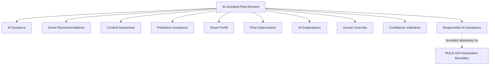

---

# User Flow Governance

### Ownership
Every flow has exactly one named accountable owner — its owning Journey's Product Owner, per `ai-docs/56-user-journey-standards.md`'s Journey Ownership — mirroring the Clear Ownership discipline already established throughout `ai-docs/53` through `ai-docs/93`. An unowned flow is treated as a governance defect, escalated immediately.

### Flow Review Process
Every new or materially changed flow passes through a documented review against this document's User Flow Philosophy, Decision Point Framework, and Flow Validation standards before implementation, mirroring `ai-docs/93-navigation-architecture-wayfinding.md`'s Navigation Council review discipline.

### Flow Documentation
Every flow's Enterprise User Flow Model stages, Decision Points, and Recovery paths are documented before a flow is considered ready for implementation — an undocumented flow is not eligible for Approval.

### Flow Versioning
Every flow standard and structural change is versioned (Major.Minor.Patch), mirroring `ai-docs/49-engineering-handbook-governance-evolution-standards.md`'s Version Management — a Major change (a new Decision Point, a changed validation rule) requires Council approval; a Minor or Patch change (a wording clarification) does not.

### Flow Audits
A Flow Audit — checking Consistency, Completion Rate, and Accessibility Compliance across every Business Area — is performed quarterly, distinct from and complementary to the Navigation Audit already established in `ai-docs/93-navigation-architecture-wayfinding.md`.

### Flow Approval
| Decision | Approves |
|---|---|
| New flow pattern (reused across modules) | User Flow Council + CPO |
| Business-Area-local flow change | Business Area Steward + User Flow Council (informational) |
| Cross-module flow-consistency change | User Flow Council + affected Business Area Stewards |
| Flow-accessibility standard change | User Flow Council + Head of Accessibility & Inclusion |
| AI-assisted flow element touching RULE-024's boundary | User Flow Council + AI Council (`ai-docs/78`), unanimous |

### Continuous Improvement
Every Flow Metric finding (below) feeds a shared, tracked improvement backlog, reviewed at the next User Flow Council meeting, per the identical Continuous Improvement Loop already established throughout `ai-docs/60` through `ai-docs/93`.

### Cross-Functional Collaboration
No consequential flow decision is approved by Product alone — Engineering (feasibility), Trust & Safety (fraud/abuse exposure), Accessibility (compliance), and, where civic-relevant, Government Partnerships all participate in review before a Major flow change is approved.

### Flow Lifecycle
Every flow moves through Creation, Review, Approval, Publication, Adoption, Periodic Review, Amendment, and Retirement — mirroring the identical Handbook Lifecycle already established in `ai-docs/89-product-handbook-governance.md`, applied here to a flow rather than a document.

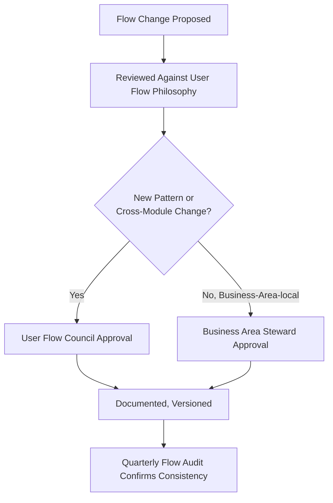

### Governance Responsibilities

| Role | Responsibility |
|---|---|
| **User Flow Council** | Chaired by the Enterprise UX Architect, with the CPO, Head of Accessibility & Inclusion, Head of Trust & Safety, Head of AI Platform, and rotating Business Area flow stewards as members — holds approval authority over any platform-wide flow-pattern change and any material Anti-Pattern deviation. Meets monthly, with ad hoc sessions for a Flow Completion Rate regression. |
| **Business Area Steward** | Accountable for their own area's flows meeting every standard in this document. |
| **Journey Product Owner** | Accountable for a specific flow's day-to-day accuracy and currency. |
| **Head of Accessibility & Inclusion** | Accountable for verifying every flow's accessibility compliance. |

---

# Scalability

| Dimension | How User Flow Standards Support It |
|---|---|
| **Future Modules** | A new Product Module's flows are built by reusing an existing flow pattern wherever possible, per the Reuse Strategy already established in `ai-docs/54-product-module-catalog.md` — never a bespoke flow shape per new module. |
| **Future Services** | A new government service or civic offering is expressed through the existing Application/Certificate flow pattern, per `ai-docs/58`'s RULE-006, never a new flow model. |
| **Future Districts** | A second district's flows are configured within the existing Enterprise User Flow Model — local terminology and eligibility rules change; flow discipline does not, per `ai-docs/50`'s Configuration-Driven Expansion Model. |
| **Future States** | The same flow model extends to a state-level deployment without structural redesign. |
| **Localization** | Flow language is externalized from flow structure — a translated instruction never requires a Decision Point or Validation-rule change. |
| **Internationalization** | The Enterprise User Flow Model's stages are technology- and geography-independent, supporting expansion beyond a single state. |
| **AI Integration** | AI-Assisted Flow elements are layered onto the existing flow model as a mediator, never a parallel flow system of their own. |
| **Workflow Expansion** | A genuinely new flow category (a future Micro-Lending application, per CAP-046) is evaluated against this document's philosophy before adoption, never against convenience alone. |
| **Enterprise Growth** | The layered Enterprise User Flow Model absorbs growth in flow count without requiring the model itself to change. |
| **Long-Term Maintainability** | A stable, documented, governed flow standard is the precondition for a future designer, unfamiliar with today's reasoning, to build a new flow correctly. |

---

# Risks

| Risk | Description | Mitigation |
|---|---|---|
| **Flow Complexity** | A flow accumulates more steps or decisions than the citizen's genuine goal requires. | Minimal Friction principle; Flow Review before implementation. |
| **Too Many Steps** | A flow's step count grows over time without a genuine need justifying each addition. | Goal Before Screens; Quarterly Flow Audit tracking step count against goal complexity. |
| **Hidden Decisions** | A citizen is asked to choose without understanding the consequence of each option. | Clear Decision Points; Decision Clarity standard enforced at Flow Review. |
| **Inconsistent Flows** | The same category of flow behaves differently across Business Areas. | Cross-Module Flow Consistency; Quarterly Flow Audit. |
| **Duplicate Work** | A citizen is asked to re-enter information Arwal already has and has consent to use. | Context Collection stage's consent-check-first standard. |
| **User Confusion** | A citizen cannot tell what a flow is asking of them or why. | Simple Language; Goal Identification stage's explicit-goal-confirmation standard. |
| **Flow Abandonment** | A citizen exits a flow before completing their genuine goal. | Minimal Friction, Progress Communication, and Error Recovery combined; Abandonment Rate tracked below. |
| **Accessibility Gaps** | A flow element is unusable by a screen-reader, keyboard-only, or voice-first citizen. | Flow Accessibility section's WCAG Alignment; mandatory Accessibility Audit. |
| **Unclear Recovery** | A citizen who encounters an error does not know how to proceed. | Recovery Without Punishment; every Failure state's mandatory transition to Recovery. |
| **Poor Validation** | An error is discovered only after real cost (a rejected submission, a wasted wait) has already occurred. | Real-Time and Business Rule Validation applied as early as feasible. |

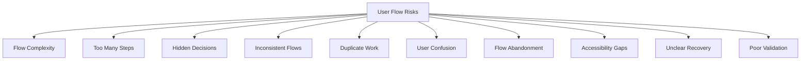

---

# Metrics

| Metric | Definition | Direction |
|---|---|---|
| **Flow Completion Rate** | % of started flows reaching genuine Completion, per the Flow State Model. | Increasing |
| **Flow Success Rate** | % of completed flows that genuinely achieved the citizen's stated goal, distinct from mere mechanical completion. | Increasing |
| **Task Completion Time** | Median and p95 time from Entry to Completion for a given flow. | Decreasing, without compromising Accessibility or Error Prevention |
| **Abandonment Rate** | % of started flows ending in Cancelled or an unrecovered Timeout. | Decreasing |
| **Validation Error Rate** | % of flow attempts encountering at least one validation failure. | Decreasing |
| **Recovery Success Rate** | % of Failure or Timeout states successfully returning the citizen to Active and eventually Completed. | Increasing |
| **Average Decision Time** | Median time a citizen spends at a Decision Point before choosing. | Monitored — a very high time may signal an unclear decision; a very low time on a consequential decision may signal insufficient information. |
| **Citizen Satisfaction** | Post-flow CSAT specific to goal completion, per `ai-docs/60-customer-experience-strategy.md`. | Increasing |
| **Accessibility Compliance** | % of flow elements meeting the WCAG 2.2 AA floor. | Increasing toward 100% |
| **Flow Consistency Score** | The proportion of flow categories behaving identically in shape across every module that has one. | Increasing toward 100% |

> **Callout — No Flow Metric Stands Alone**
> Per the North Star Principle already established in `ai-docs/00-project-vision.md`, a rising Task Completion Time improvement alongside a falling Flow Success Rate, or a decreasing Average Decision Time achieved by removing genuine information a citizen needed, is treated as a regression — never counted as success in isolation.

---

# Anti-Patterns

| Anti-Pattern | Description | Why It's Rejected |
|---|---|---|
| **Screen-Centric Design** | A flow is designed around a sequence of screens rather than the citizen's actual goal. | Violates Goal Before Screens; produces exactly the "technically complete, citizen unserved" failure this document exists to prevent. |
| **Too Many Decisions** | A flow asks a citizen to choose more often, or with more options, than their genuine goal requires. | Violates Minimal Friction and Clear Decision Points. |
| **Repeated Data Entry** | A citizen is asked to re-enter information Arwal already has and may use with consent. | Violates Context Collection's consent-check-first standard and `ai-docs/50`'s One Identity principle. |
| **Hidden Validation** | An error is discovered only after submission, when it could have been caught earlier. | Violates Real-Time and Business Rule Validation. |
| **Unexpected Navigation** | A flow silently redirects a citizen somewhere they did not expect. | Violates Trust Through Predictability and `ai-docs/93`'s Destination Clarity. |
| **Long Uninterrupted Forms** | A single, undifferentiated form collects everything at once with no progressive structure. | Violates Progressive Disclosure and Minimal Cognitive Load. |
| **Punitive Error Handling** | An error message blames the citizen or discards their prior progress. | Violates Recovery Without Punishment. |
| **No Progress Feedback** | A multi-step flow gives no indication of position or remaining work. | Violates Progress Communication. |
| **Dead-End Flows** | A flow reaches a state with no onward or backward path. | Violates the identical No Dead Ends principle already established in `ai-docs/00-project-vision.md`. |
| **Department-Centric Workflows** | A civic flow mirrors an internal departmental process rather than the citizen's mental model of their own goal. | Violates Citizen Success First, mirroring `ai-docs/93`'s Department-Centric Navigation anti-pattern. |
| **Unmanaged Flow Growth** | New flow variants proliferate without a reuse check or governance review. | Violates Flow Governance; produces Cross-Module inconsistency over time. |

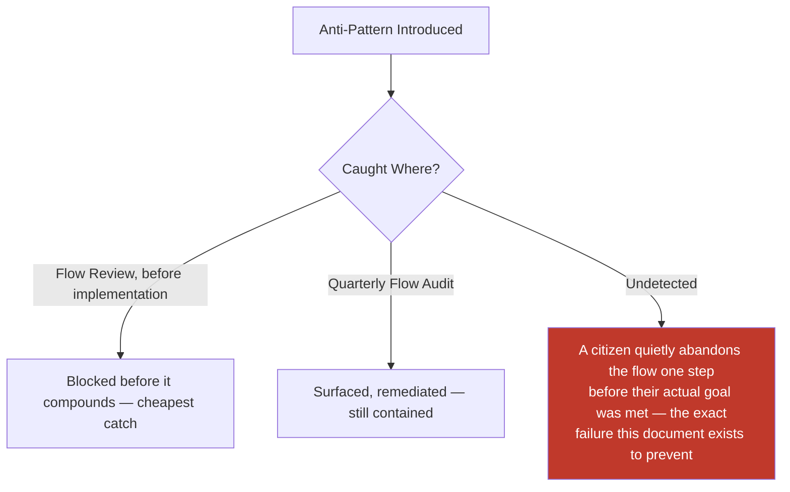

---

# Relationship to Previous Documents

| Prior Document | Relationship |
|---|---|
| **Project Vision (`ai-docs/00`)** | Establishes No Dead Ends, Progressive Complexity, and Inclusion over Optimization — this document's User Flow Philosophy operationalizes each at the goal-completion layer. |
| **Product Goals (`ai-docs/01`)** | Supplies the Target Audience device/literacy profile this document's Accessibility section is calibrated against. |
| **Engineering Principles (`ai-docs/02`)** | Supplies DRY and Single Source of Truth, applied here to flow patterns rather than code. |
| **System Architecture Principles (`ai-docs/03`)** | Supplies the layered dependency discipline this document's Enterprise User Flow Model stages mirror at the citizen-facing layer. |
| **Security Standards (`ai-docs/10`)** | Supplies the validation-at-the-boundary discipline this document's Flow Validation section extends to citizen-facing flows. |
| **Performance Standards (`ai-docs/11`)** | Supplies the latency targets this document's Task Completion Time metric is measured against. |
| **Accessibility Standards (`ai-docs/12`)** | Supplies the non-negotiable WCAG 2.2 AA floor this document's Flow Accessibility section extends to the goal-completion layer. |
| **Documentation Standards (`ai-docs/24`)** | Supplies the Plain Language discipline this document's Simple Language standard directly inherits. |
| **Architecture Decision Records (`ai-docs/25`)** | Supplies the governed-decision discipline a Major flow-standard change follows. |
| **Engineering Governance & Decision Authority (`ai-docs/29`)** | Supplies the Decision Authority Matrix pattern this document's Flow Governance mirrors. |
| **Engineering Compliance & Audit Standards (`ai-docs/40`)** | Supplies the Evidence Quality Bar this document's Flow Audit is measured against. |
| **Engineering Architecture Governance Standards (`ai-docs/46`)** | Supplies the Board-and-Council governance pattern this document's User Flow Council mirrors. |
| **Engineering Handbook Governance & Evolution Standards (`ai-docs/49`)** | Supplies the Version Management and Document Lifecycle disciplines this document's Flow Governance directly inherits. |
| **Product Vision & Business Strategy (`ai-docs/50`)** | Supplies the Strategic Expansion Principles this document's Scalability section is built around, and the One Identity principle behind Repeated Data Entry's rejection. |
| **User Personas & User Segmentation (`ai-docs/52`)** | Supplies the specific citizens (Meena, Lakshmi, Devendra) this document's Inclusive Flow Design and Accessibility sections are calibrated against. |
| **Business Domain Model (`ai-docs/53`)** | Supplies the Domain Registry underlying every flow's business context, never redefined here. |
| **Product Module Catalog (`ai-docs/54`)** | Supplies the Module Registry and Reuse Strategy this document's Scalability section is built on. |
| **Business Capability Map (`ai-docs/55`)** | Supplies the stable capabilities every Goal-Oriented Flow ultimately expresses to a citizen. |
| **User Journey Standards (`ai-docs/56`)** | Supplies the Journey State Model and Failure Scenario/Recovery Path discipline this document's Flow States and Error Recovery sections directly extend to the finer-grained flow layer. |
| **Business Process Standards (`ai-docs/57`)** | Supplies the organizational sequence (PROC-004, PROC-007) standing behind Government Approval Decisions. |
| **Business Rules & Policies (`ai-docs/58`)** | Supplies the precise, enforceable logic (RULE-002, RULE-003, RULE-006, RULE-008, RULE-018, RULE-024, RULE-031, RULE-032) this document's every Validation, Decision, and Recovery standard is bound by. |
| **Business Glossary (`ai-docs/59`)** | Supplies the singular vocabulary this document's flow labels and instructions must draw from. |
| **Customer Experience Strategy (`ai-docs/60`)** | Supplies the platform-wide felt-experience bar every flow interaction must clear. |
| **District Ecosystem Mapping (`ai-docs/64`)** | Supplies the whole-system participant view this document's Goal-Oriented Flow Design situates flows within. |
| **Community & Social Engagement Strategy (`ai-docs/75`)** | Supplies the field-agent-assisted flow standard this document's Community flow consistency references. |
| **Search & Discovery Strategy (`ai-docs/77`)** | Supplies the Trust Before Ranking principle this document's AI-Assisted Flows section is bound by. |
| **Trust & Safety Framework (`ai-docs/79`)** | Supplies the Trust Value Chain this document's Trust Through Predictability principle is built on. |
| **Product Governance** | Supplies the governance-of-governance discipline this document's own User Flow Governance section is held to. |
| **UX Vision & Experience Strategy (`ai-docs/90`)** | Supplies the Experience Principles (Clarity, Predictability, Error Prevention, Forgiveness) this document's flow-level standards directly extend. |
| **Human-Centered Design Principles & UX Philosophy (`ai-docs/91`)** | Supplies the Design Decision Principles every flow decision in this document is evaluated against before publication. |
| **Information Architecture (`ai-docs/92`)** | Supplies the Enterprise Information Model and Content Taxonomy every flow's Context Collection and Task Execution stages draw content from. |
| **Navigation Architecture & Wayfinding (`ai-docs/93`)** | Supplies the movement and orientation layer this document begins exactly where that document ends — the immediate predecessor this document exists to complete. |

### How User Flow Standards Convert Navigation Architecture Into Successful Goal Completion

`ai-docs/93-navigation-architecture-wayfinding.md` gets a citizen to the correct destination, oriented and confident about their position. That arrival remains an empty accomplishment — a citizen standing in the right place with nothing resolved — until this document's Enterprise User Flow Model, Decision Point Framework, Validation, and Error Recovery standards actually walk them through to their genuine goal. This is the precise, non-overlapping division of labor completing Stage 3's structural chain: Information Architecture is the map, Navigation Architecture is the compass and the path, and User Flow Standards is the doing — the actual accomplishment of the thing the citizen came to do.

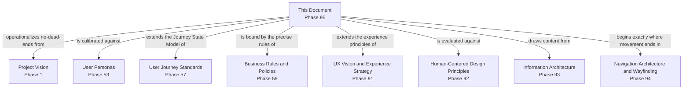

---

# Executive Artifacts

### Enterprise User Flow Framework

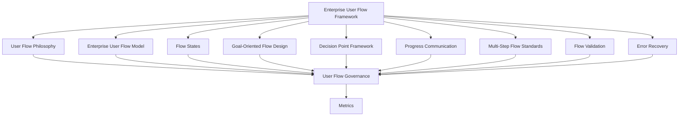

### User Flow Lifecycle

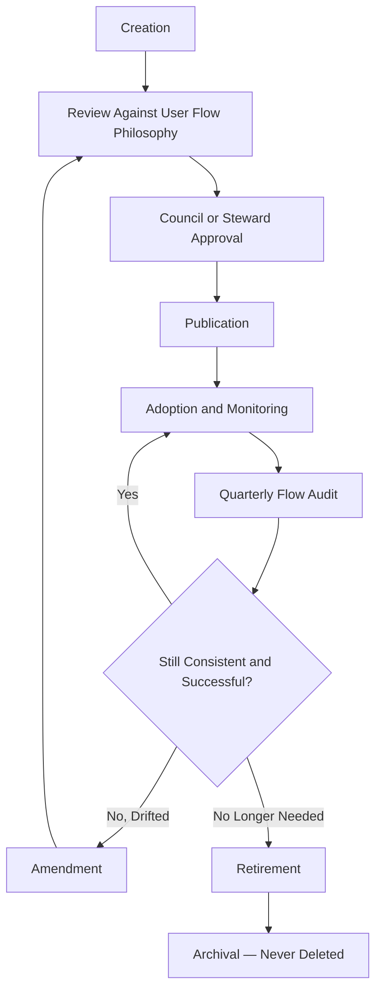

### Goal Completion Model

See Enterprise User Flow Model section above — reproduced here by reference per Single Source of Truth, never duplicated.

### Decision Point Framework

See Decision Point Framework section above.

### Flow State Model

See Flow States section above.

### Multi-Step Flow Framework

See Multi-Step Flow Standards section above.

### Cross-Module Flow Matrix

See Cross-Module Flow Consistency section above.

### Flow Governance Framework

See User Flow Governance section above.

### Flow Ownership Matrix

| Flow Category | Owner | Governance Authority |
|---|---|---|
| Citizen Services flows | CPO (delegate: Citizen Experience PM) | User Flow Council |
| Government Services flows | Head of Government Partnerships | User Flow Council + Head of Government Partnerships |
| Agriculture flows | Head of Agriculture Vertical | User Flow Council |
| Healthcare flows | Head of Healthcare Vertical | User Flow Council |
| Education flows | Head of Education Vertical | User Flow Council |
| Employment flows | Head of Jobs Vertical | User Flow Council |
| Marketplace flows | Head of Merchant Success | User Flow Council |
| Property flows | Head of Classifieds/Property | User Flow Council |
| Payments flows | Head of Payments | User Flow Council (Mission Critical review) |
| Community flows | Head of Community Engagement | User Flow Council |
| Administration flows | Head of Operations | User Flow Council + Compliance |
| AI-assisted flows | Head of AI Platform | User Flow Council + AI Council (`ai-docs/78`) |
| Support flows | Head of Customer Success | User Flow Council |
| Emergency flows | Head of Trust & Safety | User Flow Council |

### Flow Review Checklist

- [ ] Traceable to a genuine citizen goal, never a technical or internal convenience.
- [ ] Every stage of the Enterprise User Flow Model is present or explicitly marked not applicable.
- [ ] Every Decision Point is clear, timely, and reversible before commitment where feasible.
- [ ] Progress Communication is present at every step of a multi-step flow.
- [ ] Validation occurs as early as feasible, never discovered only at submission.
- [ ] Every Failure and Timeout state transitions to a defined Recovery state.
- [ ] Accessible per the WCAG 2.2 AA floor.
- [ ] Consistent with the equivalent flow pattern in every other Business Area that has one.
- [ ] Named, accountable owner assigned per the Flow Ownership Matrix.
- [ ] No anti-pattern present, per the Anti-Patterns table above.

### Flow Audit Framework

| Audit Dimension | What Is Checked | Cadence |
|---|---|---|
| Consistency | Same flow category behaves identically in shape across Business Areas | Quarterly |
| Completion Rate | Flow Completion Rate meets or exceeds its defined target | Quarterly |
| Accessibility Compliance | WCAG 2.2 AA floor met across every flow element | Quarterly |
| Decision Clarity | Every Decision Point's options are stated in plain, parallel language | Quarterly |
| Recovery Completeness | Every Failure/Timeout state has a working Recovery transition | Quarterly |
| Ownership Completeness | Every flow has a current, active named owner | Quarterly |

### User Flow Maturity Model

| Level | Name | Characteristics |
|---|---|---|
| **1 — Informal** | Flows vary by team; no shared Enterprise User Flow Model. | High variance; citizens relearn flow discipline per module. |
| **2 — Developing** | The Enterprise User Flow Model is documented; inconsistently applied. | Uneven adoption across verticals. |
| **3 — Defined** | This document's full model, states, and standards are applied consistently. | This document's standard is fully met. |
| **4 — Measured** | Flow Completion Rate, Success Rate, and Accessibility Compliance are actively tracked against explicit thresholds. | Proactive, not reactive. |
| **5 — Optimized** | User Flow Standards actively inform product strategy and are genuinely replicable to a second district's civic structure. | Flow design is a durable civic and competitive advantage. |

Arwal's target state at this stage is **Level 3 (Defined)**, with **Level 4 (Measured)** targeted as analytics tooling from later phases matures.

### Enterprise User Flow Principles Matrix

| Principle | Primary Beneficiary | Conflict Resolution Priority |
|---|---|---|
| Accessibility by Default | Vulnerable, low-literacy, rural citizens | Highest — never subordinated |
| Error Prevention | Every citizen, especially in high-stakes flows | Highest — never subordinated |
| Recovery Without Punishment | Every citizen who makes a mistake | High |
| Clear Decision Points | Every citizen facing a choice | High |
| Trust Through Predictability | Every citizen and institutional partner | High |
| Consistency Across Modules | Every citizen across every module | Medium-High |
| Minimal Friction | Every citizen, once safety and clarity are satisfied | Medium |
| Scalable Flow Design | Future districts and future citizens | Medium |

### Decision Matrix

| Decision Type | Approval Authority |
|---|---|
| New flow pattern (reused across modules) | User Flow Council + CPO |
| Business-Area-local flow change | Business Area Steward + User Flow Council (informational) |
| Cross-module flow-consistency change | User Flow Council + affected Business Area Stewards |
| Flow-accessibility standard change | User Flow Council + Head of Accessibility & Inclusion |
| AI-assisted flow element touching RULE-024 | User Flow Council + AI Council, unanimous |

### Executive Dashboards (Conceptual)

| Dashboard | Audience | Key Content |
|---|---|---|
| **CXO/CPO Dashboard** | CXO, CPO | Flow Completion Rate, Flow Success Rate, User Flow Maturity Level |
| **Business Area Steward Dashboard** | Vertical Heads | Task Completion Time, Abandonment Rate for their own area |
| **Accessibility Dashboard** | Head of Accessibility & Inclusion | Accessibility Compliance trend across flows |
| **Government Partners Dashboard** | Government liaisons | Government Services flow completion and recovery-success trend |

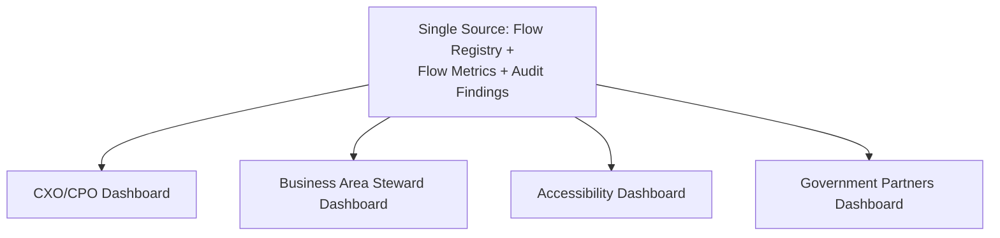

---

# Closing Statement

> **Callout — Closing Statement**
> Every prior document in this handbook explains what Arwal is, how it earns trust, how its information is organized, and how a citizen moves through it. This document explains the moment all of that either becomes real or quietly fails: the actual accomplishment of the thing a citizen came to do. A citizen who navigated perfectly to the right destination has accomplished nothing yet if the flow waiting there is confusing, punitive, or incomplete — User Flow Standards is where a platform stops being merely navigable and starts being genuinely useful. Every decision made clearly, every step validated honestly, every mistake recovered without punishment, every completion confirmed plainly — is one more citizen who trusted Arwal with something that mattered to them, and was not let down. This is the standard every future flow, in every module, for every citizen, for as long as Arwal exists, is built to honor.

**End of Phase 95 — `ai-docs/94-user-flow-standards.md`**