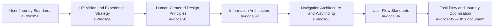
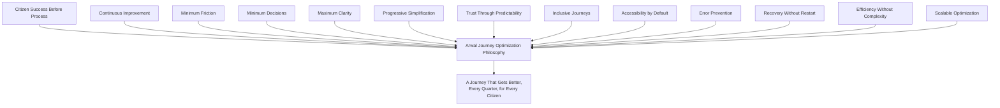
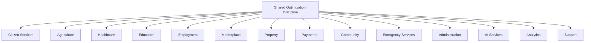
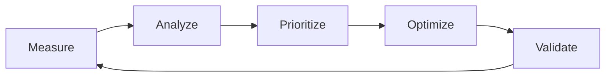
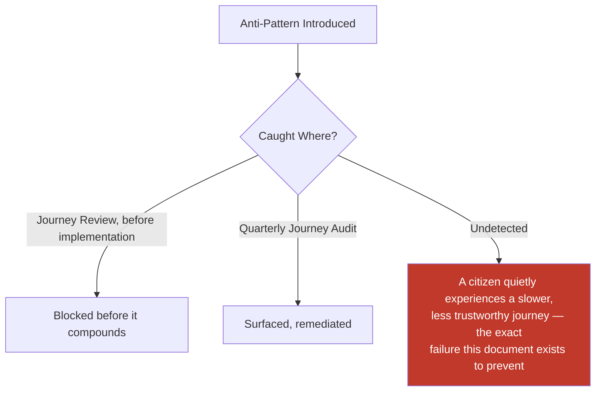
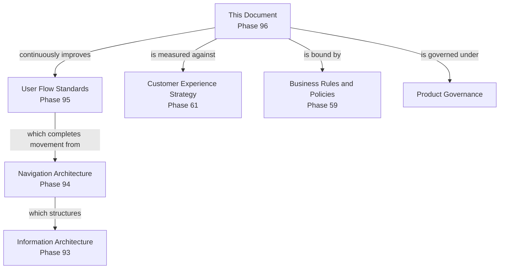
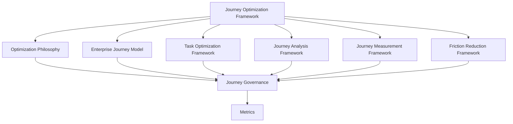
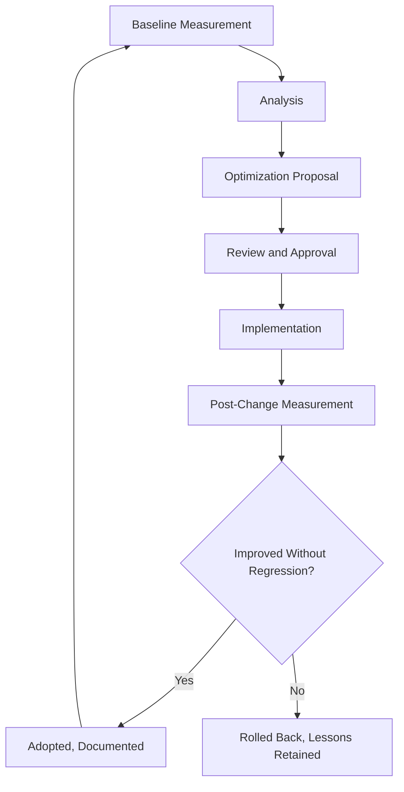

# Task Flow & Journey Optimization

**Document:** `ai-docs/95-task-flow-journey-optimization.md`
**Project:** Arwal — The District Super App
**Stage:** 3 — Experience & Design Strategy
**Phase:** 96 — Task Flow & Journey Optimization
**Status:** Approved for Executive & Enterprise Reference
**Audience:** CXO, CPO, Enterprise UX Architect, Enterprise Service Design Architect, Human-Centered Design Consultants, Government Digital Services Advisors, Accessibility Specialists, Product Strategists, Enterprise Documentation Architects

> **Callout — Purpose of This Document**
> `ai-docs/94-user-flow-standards.md` established how a citizen accomplishes a goal — the Enterprise User Flow Model, Decision Points, Validation, and Recovery. This document answers a different, subsequent question: **once a flow works correctly, how does it get better — faster, simpler, more learnable, more forgiving — every quarter, for as long as Arwal exists?** This is the authoritative Task Flow & Journey Optimization standard every future optimization decision, friction-reduction initiative, and continuous-improvement cycle traces back to.

---

# Purpose of this Document

### Why Optimization Is a Distinct Discipline From Flow Standards

`ai-docs/94-user-flow-standards.md` guarantees a flow is *correct* — every stage present, every decision clear, every failure recoverable. Correctness is a floor, not a ceiling. A flow can satisfy every User Flow Standard and still take a citizen twice as long as necessary, ask for one field too many, or quietly confuse a first-time user in a way no validation rule catches. Task Flow & Journey Optimization is the standing discipline that takes a *correct* flow and makes it *better*, continuously, using evidence rather than assumption.

### How Standardized User Flows Become Optimized Journeys

A User Flow is a governed structure. A Journey is that structure as actually lived, measured, and improved over time. Optimization does not change what a flow must contain — it changes how efficiently, clearly, and confidently a citizen moves through what is already there, per the identical Evidence-Based Design discipline already established in `ai-docs/91-human-centered-design-principles-ux-philosophy.md`.

### Why This Matters — Citizen Success, Trust, Accessibility, Business Value

Every unnecessary step, every unclear decision, every avoidable wait is a real cost paid disproportionately by exactly the citizens Arwal exists to serve first — a first-generation smartphone user, a low-literacy farmer, an anxious elderly citizen. Optimization reduces cognitive load, compounds trust per `ai-docs/79-trust-safety-framework.md`'s Trust Value Chain, widens who can succeed unassisted per `ai-docs/12-accessibility-standards.md`, and produces measurable business outcomes — higher completion, lower support cost, higher retention — never pursued in isolation from citizen benefit.

### The Chain of Reasoning This Document Extends

### Scope Boundary

This document contains no UI components, wireframes, frontend code, backend logic, workflow-engine implementation, or APIs. Its exclusive territory is: **why journey optimization is a distinct enterprise discipline, the optimization model, task-level and journey-level optimization frameworks, measurement, friction reduction, personalization, AI-assisted optimization, cross-module consistency, error recovery optimization, accessibility, continuous improvement, and governance.**

---

# Relationship to User Flow Standards

| User Flow Standards Determine | Task Flow & Journey Optimization Determines |
|---|---|
| How a task should be completed correctly | How that same task becomes faster |
| The required stages, decisions, and recovery paths | How steps and decisions are reduced without losing correctness |
| A flow's structural completeness | A flow's measured efficiency, learnability, and satisfaction |
| A one-time governed design | A continuously re-evaluated, evidence-driven design |
| Correctness as the finish line | Correctness as the starting line |

> **Callout — Optimization Never Removes a Required Standard**
> Optimization may never remove a Confirmation step, a Validation check, or an Accessibility requirement already mandated by `ai-docs/94-user-flow-standards.md` — it only removes what was never genuinely necessary in the first place. A "faster" flow achieved by skipping a required safeguard is not optimization; it is a regression wearing an efficiency metric.

---

# Journey Optimization Philosophy

| Principle | Why It Exists |
|---|---|
| **Citizen Success Before Process** | Optimization is judged by whether the citizen's genuine goal was reached, never by an internal process metric alone. |
| **Continuous Improvement** | A journey optimized once and never revisited decays as citizen needs, devices, and literacy patterns evolve. |
| **Minimum Friction** | Every step, wait, or re-entry not genuinely required by the citizen's goal is a cost to eliminate. |
| **Minimum Decisions** | Every decision a citizen must make is real cognitive cost — reduced to only what is genuinely theirs to decide. |
| **Maximum Clarity** | Speed is never pursued at the expense of a citizen understanding what is happening. |
| **Progressive Simplification** | Complexity is removed incrementally, evidence-first, never through a single speculative redesign. |
| **Trust Through Predictability** | An optimized journey still behaves exactly as a citizen learned to expect, per `ai-docs/93`'s Trust Through Predictability. |
| **Inclusive Journeys** | An optimization that speeds up a digitally fluent citizen while excluding a low-literacy one is rejected outright. |
| **Accessibility by Default** | Every optimization is verified, not merely assumed, to preserve the WCAG 2.2 AA floor. |
| **Error Prevention** | Optimization favors preventing a mistake over explaining it afterward. |
| **Recovery Without Restart** | A faster journey is never one that punishes an interrupted citizen with a forced restart. |
| **Efficiency Without Complexity** | A shorter flow achieved by hiding necessary information is not efficient — it is deceptive. |
| **Scalable Optimization** | Every optimization pattern is designed for reuse across future modules and future districts, never as a one-off local fix. |

> **Callout — The One-Sentence Optimization Philosophy**
> *"A correct flow that never gets faster, clearer, or kinder has stopped serving the citizen the moment it stopped improving."*

---

# Enterprise Journey Model

| Stage | Purpose | Ownership | Optimization Goal | Success Criteria |
|---|---|---|---|---|
| **Journey Entry** | The citizen arrives, handed off from Navigation (`ai-docs/93`). | Journey Product Owner | Minimize time-to-orientation. | Citizen understands the journey's purpose within seconds. |
| **Intent Recognition** | The journey confirms what the citizen is trying to achieve. | Journey Product Owner | Reduce misdirected effort. | The assumed goal matches the citizen's actual goal. |
| **Context Collection** | Only genuinely required, not-already-known information is gathered. | Business Area Steward | Eliminate redundant entry. | No re-collection of already-consented data. |
| **Task Execution** | The citizen performs the substantive action. | Journey Product Owner | Reduce manual effort and steps. | The action completes without confusion or rework. |
| **Decision Optimization** | Genuine decisions are minimized, clarified, and sequenced sensibly. | Journey Product Owner | Reduce decision count and time. | Every remaining decision is fast and confident. |
| **Validation** | Input is checked as early as feasible. | Business Area Steward | Catch errors before cost is incurred. | No error discovered only at submission. |
| **Progress** | The citizen's position is always visible. | Journey Product Owner | Sustain confidence throughout. | No silent, unexplained wait. |
| **Completion** | The goal is genuinely achieved and confirmed. | Journey Product Owner | Confirm unambiguously. | Citizen knows, without doubt, the goal was met. |
| **Next Best Action** | A relevant onward step is offered. | Journey Product Owner + Navigation Council | Reduce the citizen's own search for "what next." | Citizen is never left on a terminal, purposeless screen. |
| **Journey Exit** | The citizen leaves, cleanly, at any point. | Journey Product Owner | Preserve state or close cleanly. | No ambiguous or orphaned state remains. |

---

# Task Optimization Framework

| Dimension | Standard |
|---|---|
| **Step Reduction** | Every step is checked against whether it is genuinely necessary for the citizen's goal; a step that exists only for internal convenience is removed. |
| **Decision Reduction** | Decisions are consolidated, defaulted sensibly, or deferred until genuinely relevant — never presented merely because a system happens to support the option. |
| **Context Preservation** | A citizen's prior answers and consented data carry forward across every step and, wherever the goal allows, across sessions. |
| **Reusable Information** | Data already known and consented (per RULE-003) is reused, never re-collected. |
| **Smart Defaults** | A sensible, citizen-favorable default is pre-selected wherever one genuinely exists, always visibly overridable. |
| **Guided Experiences** | A complex task is broken into a sequence a citizen can follow without external instruction. |
| **Adaptive Assistance** | Help is offered precisely where citizens are observed to struggle, never uniformly injected everywhere. |
| **Reduced Waiting** | Any wait a citizen experiences is minimized, and where unavoidable, explained honestly with an estimate. |
| **Reduced Manual Work** | Any action a system can safely perform on the citizen's behalf — with consent — replaces a manual step. |
| **Journey Confidence** | Every optimization is validated to increase, never decrease, a citizen's confidence that the action succeeded. |

---

# Journey Analysis Framework

| Dimension | What Is Analyzed |
|---|---|
| **Journey Mapping** | The full, current, actual path a citizen takes — not the theoretical designed path — documented against the Enterprise Journey Model. |
| **Pain Point Identification** | Specific moments of hesitation, confusion, or frustration, drawn from analytics and direct citizen feedback. |
| **Drop-Off Analysis** | The specific stage where citizens most often abandon a journey, and the evidenced reason why. |
| **Bottleneck Detection** | Any stage taking disproportionately longer than its neighbors, signaling friction. |
| **Decision Analysis** | Every Decision Point's actual time-to-decide and reversal rate, checked against the Decision Point Framework in `ai-docs/94`. |
| **Journey Complexity** | Step count, decision count, and field count, tracked against a defined, justified budget per journey category. |
| **Journey Efficiency** | Time and effort required relative to the citizen's actual goal, never relative to what the platform happens to offer. |
| **Journey Consistency** | Whether the journey's shape matches its equivalent pattern in every other Business Area, per `ai-docs/94`'s Cross-Module Flow Consistency. |
| **Journey Accessibility** | Whether every optimization holds equally for a screen-reader, voice-first, and low-literacy citizen. |
| **Journey Satisfaction** | Post-journey CSAT specific to the analyzed journey, per `ai-docs/60-customer-experience-strategy.md`. |

---

# Journey Measurement Framework

| Metric | Definition |
|---|---|
| **Journey Success Measurement** | Whether the citizen's genuine goal, not merely the final screen, was achieved. |
| **Journey Completion Rate** | % of started journeys reaching genuine Completion. |
| **Journey Duration** | Median and p95 time from Entry to Completion. |
| **Journey Efficiency** | Steps and decisions actually required versus the journey's defined efficient baseline. |
| **Drop-Off Rate** | % of journeys abandoned before Completion, by stage. |
| **Retry Rate** | % of journeys requiring a repeated attempt at the same step. |
| **Recovery Success** | % of Failure/Timeout states successfully returning a citizen to Completion. |
| **Citizen Satisfaction** | Post-journey CSAT/NPS-equivalent. |
| **Task Confidence** | Citizen-reported certainty that an action succeeded. |
| **Journey Learnability** | Rate at which a first-time citizen's success approaches a returning citizen's. |
| **Business Outcome Achievement** | Whether the journey's underlying Strategic Objective (`ai-docs/50`) shows measurable improvement. |

> **Callout — Measurement Drives Optimization, Never Justifies It Retroactively**
> A metric is gathered *before* an optimization is proposed, used to identify where friction genuinely exists, and gathered again *after* to confirm the change worked — never assembled after the fact to justify a decision already made on instinct, per `ai-docs/91`'s Evidence-Based Design.

---

# Friction Reduction Framework

| Friction Source | Reduction Standard |
|---|---|
| **Manual Steps** | Removed wherever a system can safely perform the action with consent. |
| **Waiting Time** | Minimized; where unavoidable, explained honestly with a realistic estimate. |
| **Repeated Data Entry** | Eliminated via Reusable Information (see Task Optimization Framework). |
| **Decision Fatigue** | Reduced via Decision Reduction and Smart Defaults. |
| **Navigation Complexity** | Reduced via consistency with `ai-docs/93`'s Wayfinding Principles. |
| **Context Switching** | Minimized by keeping a citizen within one coherent journey rather than bouncing between unrelated surfaces. |
| **User Confusion** | Reduced through Clear Decision Points and plain-language progress communication. |
| **Cognitive Load** | Reduced by holding no more than one new concept in the citizen's mind at once. |
| **Error Frequency** | Reduced through earlier, clearer Validation. |
| **Recovery Effort** | Reduced by preserving state and never forcing a full restart. |

Friction is identified continuously through the Journey Analysis Framework, prioritized by citizen impact and frequency, and closed through the Continuous Improvement loop below — never treated as a one-time audit.

---

# Journey Personalization

| Element | Standard |
|---|---|
| **Role-Based Journeys** | A citizen, merchant, and officer each see a journey shaped to their role, per RULE-031. |
| **Citizen Preferences** | Language, accessibility mode, and notification preference (per `ai-docs/59`'s GLOSS-042 Settings) shape the journey consistently. |
| **Adaptive Experiences** | A journey adapts to a citizen's device and connectivity context, never assuming uniform capability. |
| **Returning User Optimization** | A returning citizen's known, consented context shortens the journey wherever genuinely helpful. |
| **Context-Aware Journeys** | Location, prior task, and current need shape what is surfaced, never what is withheld. |
| **Personalized Recommendations** | Always explainable, per `ai-docs/78-ai-product-strategy.md`, never a substitute for organic access. |
| **Saved Progress** | A citizen may leave and resume a journey without loss, per `ai-docs/94`'s Resume Capability. |
| **Frequently Used Tasks** | Surfaced as a shortcut, never as a narrowing of what else is available. |
| **Recently Completed Tasks** | Available for quick reference or repetition (e.g., reordering). |
| **Location-Aware Experiences** | Hyperlocal relevance applied only where it genuinely serves the citizen's goal. |

---

# AI-Assisted Journey Optimization

| Element | Standard |
|---|---|
| **AI Guidance** | The AI Assistant (CAP-033) may guide a citizen through an optimized journey conversationally. |
| **Smart Recommendations** | Always distinguishable from an organic option, per `ai-docs/77`'s Trust Before Ranking. |
| **Predictive Assistance** | Anticipates a likely next need without pre-selecting it. |
| **Context Awareness** | Draws on the citizen's current journey state without requiring re-explanation. |
| **Journey Shortcuts** | AI may offer a faster path to a goal a citizen has stated plainly, always with a manual alternative. |
| **Dynamic Help** | Surfaced precisely where citizens are observed to struggle. |
| **Smart Prefill** | Only from consented, verified data, per RULE-003. |
| **Journey Personalization** | AI-informed personalization is always explainable. |
| **Confidence Indicators** | Genuine uncertainty is communicated honestly, never with false certainty. |
| **Human Override** | A citizen may always bypass AI guidance and proceed manually. |
| **Responsible AI Optimization** | Per RULE-024's absolute Automation Boundary, AI may optimize a path to a decision but never make the decision itself where it is civic, financial, or reputation-affecting. |

---

# Cross-Module Journey Consistency

The same Enterprise Journey Model repeats identically across Citizen Services, Agriculture, Healthcare, Education, Employment, Marketplace, Property, Payments, Community, Emergency Services, Administration, AI Services, Analytics, and Support — differing only in domain-specific content, never in optimization discipline. A citizen who has experienced an optimized Marketplace checkout should recognize the same discipline — minimal steps, clear decisions, honest progress — in an unfamiliar Healthcare payment flow, mirroring `ai-docs/94`'s Cross-Module Flow Consistency extended here to optimization itself.

---

# Error Recovery Optimization

| Failure Scenario | Optimization Standard |
|---|---|
| **Validation Errors** | Caught as early as feasible, never only at submission. |
| **Business Rule Failures** | Explained in plain language, per RULE-032. |
| **Permission Issues** | Explained with a path to resolve, where one exists. |
| **Network Interruptions** | State preserved locally; resumes cleanly on reconnect. |
| **System Failures** | Honest, non-blaming message with a retry or escalation path. |
| **Incomplete Journeys** | Resumable from the last valid state wherever the goal allows. |
| **Cancelled Tasks** | No penalty; data safely discarded or offered for resumption. |
| **Duplicate Actions** | Detected and handled per RULE-018's idempotency discipline. |
| **Lost Progress** | Minimized through continuous state preservation; never silently discarded. |
| **Unexpected Interruptions** | Graceful continuation, never a forced restart. |

Recovery, Resume Capability, State Preservation, Rollback, and Graceful Continuation are held to the identical standard already established in `ai-docs/94-user-flow-standards.md`'s Error Recovery section — this document adds the optimization discipline of continuously reducing *how often* recovery is needed in the first place.

---

# Accessibility

Every optimization standard above is verified, not assumed, against Keyboard Users, Screen Readers, Low Vision, Motor Accessibility, Hearing Accessibility, Cognitive Accessibility, Language Accessibility, and Low Digital Literacy citizens — never optimized for a digitally fluent majority at their expense. Every optimization meets or exceeds WCAG 2.2 AA, per `ai-docs/12-accessibility-standards.md`, and Inclusive Optimization requires that an efficiency gain for one segment is never a regression for another; where a genuine trade-off exists, accessibility wins by default, mirroring `ai-docs/11-performance-standards.md`'s Accessibility vs. Performance Trade-offs.

---

# Continuous Improvement

| Element | Standard |
|---|---|
| **Journey Reviews** | Scheduled, standing reviews of every Mission Critical journey's metrics. |
| **Citizen Feedback** | Collected continuously per `ai-docs/60-customer-experience-strategy.md`'s Voice of Customer. |
| **Analytics Review** | Journey Measurement Framework metrics reviewed at a defined cadence. |
| **Optimization Backlog** | Every identified friction point is tracked, prioritized, and never left informally remembered. |
| **Usability Findings** | Findings from representative, vulnerable-inclusive testing feed the backlog directly. |
| **A/B Experiment Governance** | Any experiment is time-boxed, evidence-gated, and never run at the cost of a citizen's genuine outcome. |
| **Journey Evolution** | A journey's shape evolves incrementally, never through an ungoverned rewrite. |
| **Version Control** | Every material journey change is versioned (Major.Minor.Patch), mirroring `ai-docs/49`'s Version Management. |
| **Continuous Learning** | Every cycle's finding — including a failed hypothesis — is retained permanently. |
| **Improvement Prioritization** | Prioritized by citizen impact and frequency first, business convenience last. |

---

# Journey Governance

### Ownership
Every journey has exactly one named accountable owner — its Journey Product Owner, per `ai-docs/56`'s Journey Ownership — mirroring the Clear Ownership discipline established throughout `ai-docs/53` through `ai-docs/94`.

### Journey Optimization Council
A standing **Journey Optimization Council** — chaired by the Enterprise UX Architect, with the CPO, Head of Accessibility & Inclusion, Head of AI Platform, and rotating Business Area optimization stewards as members — approves any platform-wide optimization pattern, any material Anti-Pattern deviation, and any AI-assisted optimization touching RULE-024's boundary. The Council meets monthly, with ad hoc sessions for a Journey Success Rate regression.

### Decision Authority

| Decision | Approves |
|---|---|
| New optimization pattern (reused across modules) | Journey Optimization Council + CPO |
| Business-Area-local optimization | Business Area Steward + Council (informational) |
| Cross-module optimization-consistency change | Council + affected Stewards |
| Accessibility-affecting optimization | Council + Head of Accessibility & Inclusion |
| AI-assisted optimization touching RULE-024 | Council + AI Council, unanimous |

### Reviews, Audits, Documentation
Every optimization passes a documented review against this document's Philosophy before implementation. A Journey Audit — checking Success Rate, Consistency, and Accessibility Compliance — runs quarterly, distinct from and complementary to `ai-docs/94`'s Flow Audit. Every optimization is documented before it is considered ready for implementation.

### Cross-Functional Collaboration
No consequential optimization proceeds on Product's judgment alone — Engineering, Trust & Safety, Accessibility, and, where civic-relevant, Government Partnerships participate in review.

### Lifecycle Management
Every optimization moves through Proposal, Review, Approval, Implementation, Measurement, and Retirement (where superseded) — never a silent, undocumented change.

---

# Scalability

Optimization patterns are designed with headroom for reuse — a new module reuses an existing optimization pattern wherever possible, per `ai-docs/54`'s Reuse Strategy; a second district's journeys inherit the same optimization discipline while local terminology and eligibility rules change, per `ai-docs/50`'s Configuration-Driven Expansion Model; the same discipline extends to a future state-level deployment, future localization, future AI integration, and long-term platform evolution without requiring the Enterprise Journey Model itself to change.

---

# Risks

| Risk | Mitigation |
|---|---|
| **Journey Complexity** | Continuous Complexity tracking per Journey Analysis Framework. |
| **Optimization Bias** | Evidence-Based Design; no optimization proceeds without measured baseline data. |
| **Over-Automation** | RULE-024's absolute Automation Boundary; Human Override always available. |
| **Hidden Decisions** | Clear Decision Points required for every remaining decision. |
| **Loss of Transparency** | Trust Through Predictability; Progress Communication never reduced for speed. |
| **Accessibility Regression** | Mandatory Accessibility verification before any optimization ships. |
| **Journey Fragmentation** | Cross-Module Journey Consistency; Quarterly Journey Audit. |
| **Optimization Without Evidence** | Journey Measurement Framework required before and after every change. |
| **Inconsistent Experiences** | Journey Optimization Council review of cross-module patterns. |
| **AI Overdependence** | Human Override and Responsible AI Optimization enforced absolutely. |

---

# Metrics

| Metric | Direction |
|---|---|
| Journey Success Rate | Increasing |
| Average Journey Duration | Decreasing, without compromising accessibility |
| Drop-Off Rate | Decreasing |
| Recovery Rate | Increasing |
| Citizen Satisfaction | Increasing |
| Task Confidence | Increasing |
| Accessibility Compliance | Increasing toward 100% |
| Optimization Impact | Increasing (measured pre/post) |
| Business Outcome Achievement | Increasing |
| Journey Consistency Score | Increasing toward 100% |

> **Callout — No Optimization Metric Stands Alone**
> Per the North Star Principle in `ai-docs/00-project-vision.md`, a rising Duration improvement alongside a falling Accessibility Compliance, or a rising Success Rate achieved by hiding genuine information, is a regression — never counted as success in isolation.

---

# Anti-Patterns

| Anti-Pattern | Why It's Rejected |
|---|---|
| **Optimization Without User Research** | Violates Evidence-Based Design. |
| **Over-Automation** | Violates RULE-024's Automation Boundary. |
| **Too Many Personalization Rules** | Produces unpredictable, untestable journeys, violating Trust Through Predictability. |
| **Optimization That Increases Complexity** | A "faster" flow with hidden complexity is not optimization. |
| **Hidden AI Decisions** | Violates Transparency and Responsible AI Optimization. |
| **Unmeasured Improvements** | Violates the Journey Measurement Framework's mandatory before/after discipline. |
| **Ignoring Accessibility** | Violates Accessibility by Default. |
| **Department-Centric Journeys** | Mirrors `ai-docs/93`'s rejected Department-Centric Navigation. |
| **Repeated Data Collection** | Violates Reusable Information and `ai-docs/50`'s One Identity principle. |
| **No Continuous Improvement** | Violates the standing Continuous Improvement discipline. |

---

# Relationship to Previous Documents

This document does not redefine Project Vision, Product Goals, Engineering Principles, System Architecture Principles, Security Standards, Performance Standards, Accessibility Standards, Documentation Standards, Architecture Decision Records, Engineering Governance & Decision Authority, Engineering Compliance & Audit Standards, Engineering Architecture Governance Standards, or Engineering Handbook Governance & Evolution Standards — each remains fully authoritative and is cited, never restated.

- **Product Vision & Business Strategy** supplies the Strategic Objectives every optimization traces to.
- **User Personas & User Segmentation** supplies the citizens (Meena, Lakshmi, Devendra) every optimization is evaluated against.
- **Business Domain Model, Product Module Catalog, Business Capability Map** supply the ownership, surfaces, and abilities every optimized journey expresses.
- **User Journey Standards** supplies the Journey State Model this document's Enterprise Journey Model extends into continuous improvement.
- **Business Process Standards & Business Rules and Policies** supply the precise organizational sequence and rules (RULE-003, RULE-018, RULE-024, RULE-031, RULE-032) every optimization is bound by.
- **Business Glossary** supplies the singular vocabulary every optimized label must draw from.
- **Customer Experience Strategy** supplies the platform-wide felt-experience bar every optimization must clear.
- **District Ecosystem Mapping** supplies the whole-system view optimization outcomes feed back into.
- **Community & Social Engagement Strategy, Search & Discovery Strategy, Trust & Safety Framework** supply the trust, discovery, and safety disciplines optimization must never compromise.
- **Product Governance** supplies the governance-of-governance discipline this document's own Journey Governance is held to.
- **UX Vision & Experience Strategy, Human-Centered Design Principles, Information Architecture, Navigation Architecture & Wayfinding, User Flow Standards** together supply the full Stage 3 chain this document is the continuous-improvement capstone of — Information Architecture is the map, Navigation is the path, User Flow Standards is the accomplishment, and Task Flow & Journey Optimization is what makes that accomplishment faster, clearer, and kinder every quarter thereafter.

---

# Executive Artifacts

### Enterprise Journey Optimization Framework

### Journey Optimization Lifecycle

### Task Optimization Model
See Task Optimization Framework above.

### Journey Measurement Framework
See Journey Measurement Framework above.

### Friction Reduction Framework
See Friction Reduction Framework above.

### Journey Governance Framework
See Journey Governance above.

### Optimization Ownership Matrix

| Journey Category | Owner | Governance Authority |
|---|---|---|
| Citizen Services | CPO (delegate: Citizen Experience PM) | Journey Optimization Council |
| Government Services | Head of Government Partnerships | Council + Head of Government Partnerships |
| Agriculture / Healthcare / Education / Employment | Respective Vertical Head | Council |
| Marketplace / Property / Payments | Respective Vertical Head | Council (Payments: Mission Critical review) |
| Community / Emergency Services | Head of Community Engagement / Head of Trust & Safety | Council |
| Administration / Analytics | Head of Operations / Head of Data & Analytics | Council + Compliance |
| AI Services | Head of AI Platform | Council + AI Council |
| Support | Head of Customer Success | Council |

### Journey Review Checklist
- [ ] Baseline metrics captured before the change.
- [ ] Every removed step or decision confirmed genuinely unnecessary.
- [ ] No required Confirmation, Validation, or Accessibility standard removed.
- [ ] Post-change metrics confirm improvement without regression.
- [ ] Consistent with the equivalent pattern in every other Business Area.
- [ ] Named, accountable owner assigned.
- [ ] No anti-pattern present.

### Journey Audit Framework

| Dimension | Cadence |
|---|---|
| Journey Success Rate | Quarterly |
| Consistency | Quarterly |
| Accessibility Compliance | Quarterly |
| Friction Backlog Health | Quarterly |
| Ownership Completeness | Quarterly |

### Journey Optimization Maturity Model

| Level | Characteristics |
|---|---|
| **1 — Informal** | Optimization happens ad hoc, unmeasured. |
| **2 — Developing** | Metrics exist but are inconsistently reviewed. |
| **3 — Defined** | This document's model and cadence are consistently applied. |
| **4 — Measured** | Optimization Impact is tracked against explicit thresholds. |
| **5 — Optimized** | Optimization is evidence-driven, proactive, and replicable to a second district. |

Arwal's target state is **Level 3 (Defined)**, with **Level 4 (Measured)** targeted as analytics tooling matures.

### Continuous Improvement Framework
See Continuous Improvement above.

### Journey KPI Dashboard (Conceptual)

| Dashboard | Audience | Key Content |
|---|---|---|
| CXO/CPO Dashboard | CXO, CPO | Journey Success Rate, Optimization Impact, Maturity Level |
| Business Area Steward Dashboard | Vertical Heads | Duration, Drop-Off, Friction Backlog |
| Accessibility Dashboard | Head of Accessibility & Inclusion | Accessibility Compliance trend |
| Government Partners Dashboard | Government liaisons | Government Services journey trend |

### Optimization Decision Matrix

| Decision Type | Approval Authority |
|---|---|
| New optimization pattern | Journey Optimization Council + CPO |
| Business-Area-local optimization | Business Area Steward + Council (informational) |
| Cross-module consistency change | Council + affected Stewards |
| Accessibility-affecting optimization | Council + Head of Accessibility & Inclusion |
| AI-assisted optimization near RULE-024 | Council + AI Council, unanimous |

---

# Closing Statement

> **Callout — Closing Statement**
> Every prior document in this handbook explains how Arwal is organized, how a citizen moves through it, and how a goal is correctly accomplished. This document explains the discipline that never lets that accomplishment stand still: every quarter, the same certificate renewal, the same doctor booking, the same price check should take a little less effort, ask a little less of the citizen, and confuse a little fewer people than it did before — never at the cost of trust, safety, or accessibility. A platform that is correct today and unimproved in five years has quietly fallen behind the citizens it serves. Task Flow & Journey Optimization is what keeps Arwal's promise current, measured, and honest — proof, renewed continuously, that this platform is still worth a district's trust.

This document, `ai-docs/95-task-flow-journey-optimization.md`, is Phase 96 of approximately 425. Every future optimization decision, friction-reduction initiative, and continuous-improvement cycle is expected to trace back to a principle defined here, or to justify its deviation in writing.

**End of Phase 96 — `ai-docs/95-task-flow-journey-optimization.md`**