# Interaction Design Framework

**Document:** `ai-docs/96-interaction-design-framework.md`
**Project:** Arwal — The District Super App
**Stage:** 3 — Experience & Design Strategy
**Phase:** 97 — Interaction Design Framework
**Status:** Approved for Executive & Enterprise Reference
**Audience:** CXO, CPO, Enterprise UX Architect, Interaction Design Specialists, Human-Centered Design Consultants, Service Design Consultants, Government Digital Services Advisors, Accessibility Specialists, Cognitive Psychology Consultants, Enterprise Design Governance Leads, AI Experience Strategists, Digital Transformation Consultants, Enterprise Documentation Architects

> **Callout — Purpose of This Document**
> `ai-docs/94-user-flow-standards.md` established how a citizen accomplishes a goal. `ai-docs/95-task-flow-journey-optimization.md` established how that accomplishment gets faster, clearer, and kinder over time. Neither document answers the question a citizen experiences at the smallest possible grain, dozens of times within a single flow: **when I tap, type, wait, or speak, what happens, and does the platform tell me honestly and immediately?** This document is that answer — the authoritative Interaction Design Framework every future system response, feedback mechanism, state transition, and moment of user control traces back to.

---

# Purpose of this Document

### Why Interaction Design Differs From Journey Optimization

`ai-docs/95-task-flow-journey-optimization.md` governs whether a journey, taken as a whole, is efficient, learnable, and improving over time. That document operates at the scale of steps, decisions, and completed goals. Interaction Design operates one level beneath that — at the scale of a single tap, a single keystroke, a single moment of waiting for a response. A journey can be optimally short, with the minimum number of steps a citizen's goal genuinely requires, and still fail if any single interaction within it is unpredictable, silent, or untrustworthy. Journey Optimization asks "is this the right sequence of steps?" Interaction Design asks a narrower, more immediate question: "does this specific action, right now, behave the way a citizen has every right to expect?"

### How Interaction Quality Shapes User Confidence

A citizen does not build trust in Arwal from a single grand gesture — they build it, or lose it, one interaction at a time. Every tap that produces an immediate, honest response is a small deposit into the Trust Value Chain already established in `ai-docs/79-trust-safety-framework.md`. Every tap that produces silence, ambiguity, or an unexpected outcome is a withdrawal. Confidence is not a single feeling formed once — it is the running total of thousands of small, individually forgettable interactions that a citizen never consciously tallies but always, cumulatively, feels.

### How Interactions Reduce Cognitive Load and Improve Accessibility

An interaction that behaves predictably requires no thought — a citizen's attention is freed for their actual goal rather than spent verifying that the platform did what it appeared to do. This is Recognition Over Recall and Minimal Cognitive Load, already established as principles in `ai-docs/90-ux-vision-experience-strategy.md` and `ai-docs/93-navigation-architecture-wayfinding.md`, applied here at the finest possible grain. Accessibility depends on this same discipline: a screen-reader user, a voice-first farmer, and a keyboard-only citizen all depend on an interaction's state being genuinely knowable, not merely visually implied — an interaction designed only for a sighted, mouse-using citizen has already excluded a meaningful share of Arwal's population before a single word of content is written.

### How Interactions Support Enterprise Consistency

A citizen who has learned that a "Confirm" button always requires a second, explicit tap before an irreversible action proceeds should never encounter a module where a single accidental tap commits them irreversibly. Interaction consistency is what lets trust earned in one Business Area transfer, intact, to every other one a citizen has never used before — the same Consistency Across Modules discipline already established throughout `ai-docs/90` through `ai-docs/95`, now expressed at the level of the individual gesture.

### Why Every Interaction Communicates Something to the Citizen

There is no such thing as a neutral interaction. A button that does nothing visible when tapped communicates, whether intended or not, that the platform may not have registered the tap — and a citizen who cannot tell whether their action was received will tap again, worry, or abandon the task entirely. Every interaction in Arwal, by its very existence, tells a citizen something about whether the platform heard them, understood them, and is honestly reporting what happened next. This document exists to make that communication deliberate, honest, and consistent, never accidental.

### The Chain of Reasoning This Document Extends

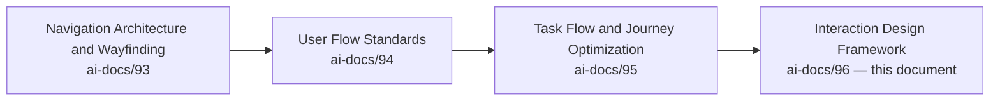

| Layer | Question It Answers |
|---|---|
| Navigation Architecture & Wayfinding | How does a citizen move, and always know where they are? |
| User Flow Standards | How does a citizen accomplish a goal, correctly? |
| Task Flow & Journey Optimization | How does that accomplishment get better over time? |
| **Interaction Design Framework** (this document) | **How does every single action — a tap, a keystroke, a wait — feel, respond, and build or spend trust?** |

> **Callout — Navigation, Flow, Journey, and Interaction Are Four Distinct Grains**
> Navigation determines *how a citizen moves*. User Flow determines *how a citizen completes work*. Journey Optimization determines *how that work gets faster and clearer over time*. Interaction Design determines *how every individual action feels and responds*. None of the four is a restatement of another — a platform can move correctly, complete work correctly, and improve steadily, and still fail a citizen through a single button that gives no feedback when pressed. This document exists to close that specific, narrowest gap.

### Scope Boundary

This document contains no UI components, no buttons, no forms, no layouts, no typography, no colors, no animations, no React, no Next.js, no frontend code, no backend code, no APIs, and no implementation detail of any kind. Every one of those remains the deliberate territory of a future, technology-facing phase building explicitly on top of this one. This document's exclusive territory is: **why interaction design is a distinct discipline, the interaction philosophy, the enterprise interaction model, interaction states, system feedback, user control, error prevention, cognitive load management, AI interaction standards, cross-module consistency, accessibility, and governance** — the behavioral standard every future interaction implementation must express faithfully, never redefine independently.

---

# Interaction Design Philosophy

Every principle below exists because an interaction assembled carelessly does not fail abstractly — it fails a specific citizen who tapped once, saw nothing happen, and tapped again, unsure whether they had just paid twice.

### Immediate Feedback
**Why it exists:** Every citizen action receives an acknowledgment within a perceptible instant — never left to wonder whether the platform registered what they did. Silence is never a valid response to an action, per `ai-docs/90-ux-vision-experience-strategy.md`'s Responsiveness and Feedback principles.

### Predictability
**Why it exists:** The same action produces the same category of response, every time, everywhere on the platform — a citizen who has learned one interaction's behavior should never be surprised by a subtly different version elsewhere, per `ai-docs/93-navigation-architecture-wayfinding.md`'s Predictability principle extended here to the gesture level.

### Clarity
**Why it exists:** A citizen understands, without needing to guess, what an interaction is offering and what will happen if they proceed — an ambiguous control is a failed control regardless of how visually polished it appears.

### Consistency
**Why it exists:** An interaction pattern behaves identically wherever it recurs across the platform, per the identical Consistency principle already established throughout `ai-docs/90` through `ai-docs/95`, now the finest-grained expression of that discipline.

### Forgiveness
**Why it exists:** A citizen's mistake within an interaction is recoverable without punishment, without losing prior progress, and without a shaming tone, mirroring `ai-docs/90`'s Forgiveness principle and `ai-docs/94-user-flow-standards.md`'s Recovery Without Punishment.

### User Control
**Why it exists:** A citizen remains the author of every consequential action — an interaction never proceeds irreversibly without the citizen's genuine, informed participation, per the Autonomous User Decisions standard below.

### Visibility of System Status
**Why it exists:** A citizen can always tell, at a glance, what state the system is currently in — waiting, processing, succeeded, failed — restating the oldest and most load-bearing usability heuristic in the discipline, made binding here as an enterprise standard rather than a suggestion.

### Recognition Over Recall
**Why it exists:** A citizen recognizes the correct next action when they see it, never required to remember an instruction given several steps earlier, per `ai-docs/94-user-flow-standards.md`'s identical principle applied at the interaction level.

### Minimal Cognitive Load
**Why it exists:** Every interaction is designed to require the least mental effort a citizen's genuine task allows — complexity is never introduced for its own sake, mirroring `ai-docs/56-user-journey-standards.md`'s Minimal Cognitive Load principle.

### Respect User Intent
**Why it exists:** An interaction never assumes it knows better than the citizen what they meant to do — a genuine ambiguity is clarified through a question, never resolved silently on the citizen's behalf in a way they did not choose.

### Accessibility by Default
**Why it exists:** An interaction is accessible because its state, feedback, and control were designed for a screen-reader user, a keyboard-only user, and a voice-first user from the first draft, per the non-negotiable floor already established in `ai-docs/12-accessibility-standards.md` — never patched in after a visually-oriented interaction was already locked in.

### Trust Through Transparency
**Why it exists:** A citizen can always understand why an interaction behaved the way it did — an opaque or unexplained system response is a trust violation regardless of whether the underlying outcome was correct, per `ai-docs/79-trust-safety-framework.md`'s Transparency principle.

### Progressive Disclosure
**Why it exists:** An interaction reveals its full complexity only as it becomes relevant — a citizen is never confronted with every possible state or option before they have a genuine reason to encounter it, per `ai-docs/00-project-vision.md`'s Progressive Complexity principle.

### Scalable Interaction Design
**Why it exists:** An interaction pattern designed for today's twenty modules must gracefully absorb the next two hundred and a future district's different language and literacy profile — every pattern in this document is designed with that headroom deliberately built in, per the same Future Scalability discipline already established in `ai-docs/92` through `ai-docs/95`.

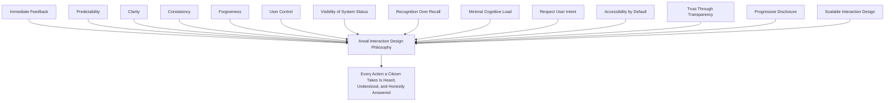

> **Callout — The One-Sentence Interaction Design Philosophy**
> *"An interaction that leaves a citizen unsure whether it worked has already failed, no matter how correct the underlying outcome turns out to be — the citizen cannot trust what they cannot perceive."*

---

# Enterprise Interaction Model

Every interaction on the Arwal platform, regardless of Business Area or Module, is composed of the same nine stages.

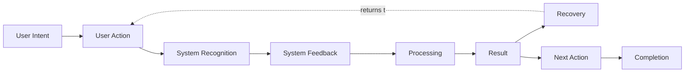

| Stage | Purpose | Ownership | Success Criteria |
|---|---|---|---|
| **User Intent** | The citizen forms a genuine goal for this specific action — "I want to submit this," "I want to see more." | The owning Journey Product Owner, per `ai-docs/56` | The subsequent interaction correctly serves the intent the citizen actually holds, never an assumed one. |
| **User Action** | The citizen performs a discrete gesture — a tap, a keystroke, a voice command, a swipe. | Business Area Steward | The action is unambiguous and within the citizen's genuine capability, per Accessibility below. |
| **System Recognition** | The platform detects and correctly interprets the action as the specific intent it represents. | Business Area Steward | No action is misread as a different one, and no action is silently dropped. |
| **System Feedback** | The platform acknowledges the recognized action immediately, before any further processing completes. | Business Area Steward | The citizen perceives, within an imperceptibly short interval, that their action was received. |
| **Processing** | The platform performs the substantive work the action requested. | Business Area Steward | Processing state is visible for any duration a citizen could reasonably notice, per Interaction States below. |
| **Result** | The platform reports what genuinely happened — success, failure, or a state requiring further input. | Journey Product Owner | The reported result matches the actual outcome exactly, never optimistically assumed. |
| **Recovery** | Where the result was not success, the citizen is guided back to a valid, continuable state. | Journey Product Owner | No citizen is left in an undefined or unrecoverable state. |
| **Next Action** | The citizen is offered, or independently identifies, their next genuine step. | Journey Product Owner + Navigation Council (`ai-docs/93`) | The citizen is never left without a clear onward path. |
| **Completion** | The citizen's original Intent is genuinely satisfied, and they know it. | Journey Product Owner | The citizen holds no residual doubt about whether their goal was achieved. |

### Relationships and Ownership

Every stage's output is the next stage's input — System Feedback is never skipped in favor of jumping straight to Result, even where Processing is near-instantaneous, because a citizen's perception of responsiveness depends on the *acknowledgment* existing as a distinct, perceivable moment separate from the *outcome*. Each stage is owned by the same Business Area Steward or Journey Product Owner accountable for the enclosing flow under `ai-docs/94-user-flow-standards.md`, ensuring interaction-level accountability never diffuses away from the flow-level accountability already established there.

---

# Interaction States

Every interactive element on the platform occupies exactly one of the following states at any moment, and every transition between them is governed, never accidental.

| State | Meaning | Citizen-Perceivable Signal Required |
|---|---|---|
| **Idle** | Available, awaiting a citizen's action. | The element is recognizable as available and inviting the expected action. |
| **Hover** | A pointing-device citizen is indicating attention without yet committing. | A gentle, reversible signal — never a state change with consequence. |
| **Focus** | The element is the current target of keyboard, switch, or assistive-technology navigation. | A clearly visible, sufficiently contrasted focus indicator, per `ai-docs/12-accessibility-standards.md`. |
| **Active** | The citizen is in the act of engaging the element — a press held, a field being typed into. | A distinct signal from Idle and Hover, confirming the engagement is registered. |
| **Processing** | The platform is performing the requested work. | An explicit, honest signal that work is underway — never indistinguishable from Idle. |
| **Success** | The requested work completed as intended. | An unambiguous, positive confirmation distinguishable from every other state. |
| **Warning** | The action succeeded but carries a caveat the citizen should know. | A distinct, non-alarming signal paired with plain-language explanation. |
| **Error** | The requested work did not complete as intended. | A distinct, non-punitive signal paired with a specific, actionable reason. |
| **Disabled** | The element is currently unavailable for a stated reason. | A visibly distinct-from-Idle state, paired with the reason where the citizen might reasonably expect availability. |
| **Offline** | The platform cannot currently reach the network resource the interaction depends on. | An honest signal distinct from Error, since the cause and recovery path differ per `ai-docs/00-project-vision.md`'s Offline-First commitment. |
| **Recovery** | The platform is guiding the citizen back to a valid state following Error, Warning, or Offline. | A signal that clearly connects to the failure it is recovering from, never appearing as an unrelated fresh state. |
| **Completed** | The interaction's purpose has been genuinely, permanently fulfilled. | A terminal, unambiguous signal — never confusable with Success for a repeatable action. |

### State Transition Rules

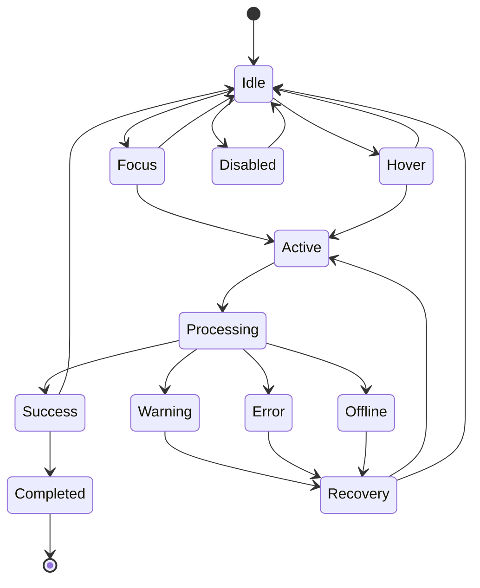

Every transition above is deliberate and citizen-perceivable — no state is ever entered or exited silently. A transition from Processing directly to Idle (bypassing Success, Warning, or Error) is never permitted, since it leaves the citizen with no report of what happened to their request. A transition into Disabled always states, where the citizen might reasonably expect availability, the specific reason and — where one exists — the path to make the element available again.

---

# System Feedback Framework

| Feedback Type | Standard |
|---|---|
| **Immediate Feedback** | Delivered the instant an action is recognized, before any substantive processing begins — confirms the platform heard the citizen, independent of whether the request will ultimately succeed. |
| **Processing Feedback** | Delivered continuously while Processing is underway, distinguishing "still working" from "finished" or "stalled," per Visibility of System Status. |
| **Progress Feedback** | For any Processing duration a citizen could reasonably notice, states how much has been done and how much remains, mirroring `ai-docs/94-user-flow-standards.md`'s Progress Communication. |
| **Confirmation Feedback** | Delivered before an irreversible action proceeds, stating plainly what the citizen is about to commit to, per User Control Principles below. |
| **Warning Feedback** | Delivered when an action will succeed but carries a genuine caveat the citizen should know before or immediately after proceeding. |
| **Error Feedback** | States the specific cause in plain, non-technical, non-blaming language, per RULE-032's Accessibility Non-Negotiable Floor, and is always paired with a concrete next step. |
| **Recovery Feedback** | Connects explicitly to the failure it addresses, guiding the citizen to a valid state without requiring them to re-diagnose what went wrong. |
| **Completion Feedback** | States, unambiguously, that the citizen's original intent was genuinely fulfilled — never implied by a screen simply changing. |
| **Accessibility Feedback** | Every feedback type above is delivered through a channel a screen reader, a voice interface, and a low-bandwidth connection can all genuinely receive — never a purely visual signal with no accessible equivalent. |
| **AI Feedback** | Where an AI system (CAP-033) contributes to a result, the feedback states plainly that AI was involved and what confidence or basis the contribution carries, per AI Interaction Standards below. |

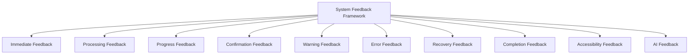

> **Callout — Feedback Is Never Optional, Only Ever Calibrated**
> Every interaction produces feedback of some kind; the only design decision is which type and at what intensity. A "quiet" interaction that appears to skip feedback has not actually done so — it has chosen the feedback type "nothing changed, your action was not needed," which is itself a claim the citizen will believe, correctly or not. This is why silence is never treated as a neutral default in this framework.

---

# User Control Principles

| Principle | Standard |
|---|---|
| **User Control** | The citizen remains the deciding party for every consequential action — the platform assists, recommends, and executes only what the citizen has genuinely authorized. |
| **Undo Actions** | Wherever an action's effect can be safely reversed, an Undo path is offered for a reasonable window following completion. |
| **Cancel Actions** | A citizen may abandon an in-progress interaction at any point before Confirmation, without penalty or ambiguity. |
| **Reversible Operations** | An operation is designed to be reversible wherever the underlying Business Rule (`ai-docs/58`) permits — irreversibility is never a default chosen for engineering convenience. |
| **Confirmation Before Critical Actions** | Every consequential, hard-to-reverse action (a payment, a civic submission, an account change) requires an explicit, separate confirmation step, per RULE-018's Payment Idempotency Enforcement and `ai-docs/94`'s Confirmation stage. |
| **Progressive Commitment** | A citizen's commitment deepens gradually across a flow — an early, low-stakes step never silently locks in a later, high-stakes consequence. |
| **Safe Defaults** | Where a default value or option must be pre-selected, it is the option least likely to harm the citizen if left unchanged, never the option most convenient for Arwal. |
| **Explicit Consent** | Any action touching consented data honors RULE-003 precisely — consent is never assumed from a citizen's proximity to an option. |
| **Autonomous User Decisions** | A citizen's decision, once genuinely and informedly made, is respected and executed faithfully — the platform never silently substitutes its own judgment for the citizen's stated choice. |
| **Human Override** | Wherever an AI or automated recommendation is involved, the citizen retains the ability to proceed manually instead, per RULE-024's absolute Automation Boundary. |

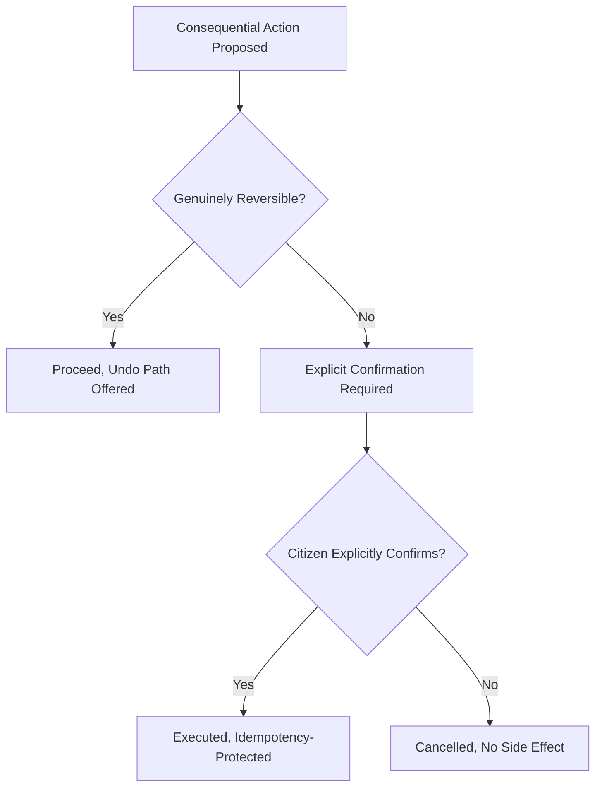

> **Callout — Agency Is Never Traded for Convenience**
> A faster interaction achieved by removing a citizen's genuine opportunity to reconsider, confirm, or decline is not an improvement — it is a transfer of control away from the citizen, and it is rejected regardless of its measured efficiency gain, mirroring `ai-docs/91-human-centered-design-principles-ux-philosophy.md`'s absolute prohibition on dark patterns.

---

# Error Prevention Framework

| Standard | Description |
|---|---|
| **Preventive Design** | An interaction is designed first to make a costly mistake difficult to make by accident, before it is designed to explain that mistake afterward, per `ai-docs/90`'s Error Prevention principle. |
| **Input Guidance** | A citizen is shown, before they act, what format or content is expected — never left to discover a requirement only after a rejection. |
| **Real-Time Validation** | Feedback on an input's validity is offered as early as feasible without interrupting a citizen's in-progress, not-yet-complete entry, per `ai-docs/12-accessibility-standards.md`'s Validation Feedback standard. |
| **Business Rule Awareness** | An interaction reflects the applicable Business Rule (`ai-docs/58`) before submission, never allowing a citizen to invest effort toward an outcome the rule will inevitably reject. |
| **Smart Defaults** | A sensible, citizen-favorable default reduces the chance of an unintended selection, always visibly overridable. |
| **Predictive Assistance** | Where a platform can genuinely anticipate a citizen's likely need, it offers — never imposes — a shortcut. |
| **Confirmation Patterns** | Reserved for genuinely consequential actions — never applied so broadly that a citizen learns to dismiss confirmations reflexively, per Confirmation Fatigue in Anti-Patterns below. |
| **Duplicate Prevention** | A resubmission of an already-processed action is detected and handled per RULE-018's idempotency discipline, never producing a duplicate outcome. |
| **Risk Awareness** | An interaction whose consequence is genuinely high-stakes (a large payment, an irreversible civic submission) is visually and linguistically distinguished from a routine, low-stakes one. |
| **Safe Recovery** | Where prevention fails and an error occurs anyway, the recovery path never compounds the original mistake. |

---

# Cognitive Load Management

| Standard | Description |
|---|---|
| **Recognition Over Recall** | Every interaction presents its own options and requirements visibly, never depending on a citizen's memory of an earlier instruction. |
| **Chunking Information** | Complex input is broken into small, digestible units a citizen can process one at a time, never a single dense block. |
| **Progressive Disclosure** | Advanced or rarely needed options remain available but hidden until genuinely relevant. |
| **Clear Affordances** | An interactive element's appearance honestly signals what it does — an element that looks actionable but is not, or vice versa, is rejected. |
| **Reduced Decision Fatigue** | The number of genuine decisions a citizen must make within a single interaction sequence is held to the minimum their actual goal requires. |
| **Focused Attention** | An interaction never competes for a citizen's attention with an unrelated, simultaneous demand. |
| **Simple Mental Models** | An interaction behaves the way a citizen would reasonably predict from everyday, non-technical experience, never requiring a citizen to learn Arwal-specific logic to use it correctly. |
| **Context Preservation** | A citizen's prior input and progress are never lost or require re-entry because of an unrelated interaction elsewhere. |
| **Consistent Behaviors** | The identical interaction pattern, once learned, behaves identically everywhere it recurs, per Cross-Module Interaction Consistency below. |
| **Learnability** | A first-time citizen can correctly predict an interaction's outcome after a single encounter, without external instruction. |

---

# AI Interaction Standards

| Standard | Description |
|---|---|
| **AI Guidance** | The AI Assistant (CAP-033) may guide a citizen through an interaction conversationally, always as an addition to, never a replacement for, the conventional interaction path. |
| **Explainable Responses** | Every AI-influenced interaction outcome states, in plain language, the basis for its suggestion or action, per `ai-docs/78-ai-product-strategy.md`'s Explainability principle. |
| **Confidence Indicators** | Where an AI contribution carries genuine uncertainty, that uncertainty is communicated honestly, never presented with false certainty. |
| **Human Review** | Any AI-influenced interaction affecting a civic, financial, or reputational outcome is subject to human confirmation before it takes effect, per RULE-024. |
| **Human Override** | A citizen may always disregard an AI suggestion and interact with the platform manually instead. |
| **Transparent Recommendations** | An AI-surfaced option is always visually and linguistically distinguishable from an organically presented one, per `ai-docs/77-search-discovery-strategy.md`'s Trust Before Ranking principle. |
| **Responsible Automation** | Automation accelerates a citizen's routine, low-risk interaction but never makes a final consequential decision unsupervised, per RULE-024's absolute boundary. |
| **Adaptive Assistance** | AI-mediated help is offered precisely where a citizen is observed to be struggling, never uniformly injected regardless of need. |
| **AI Error Recovery** | Where an AI-mediated interaction fails or misunderstands, recovery follows the identical Recovery Without Punishment standard as any other interaction failure. |
| **User Trust** | Every AI interaction standard above exists to ensure a citizen's trust in an AI-mediated moment is never higher, and never lower, than the genuine reliability of what is actually happening. |

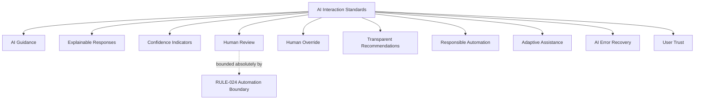

---

# Cross-Module Interaction Consistency

The same Enterprise Interaction Model, Interaction States, and System Feedback Framework repeat identically across every Business Area — differing only in the specific content an interaction carries, never in its behavioral shape.

| Business Area | Interaction Consistency Expression |
|---|---|
| **Citizen Services** | A profile update follows the identical Confirmation-before-commit standard as any transacting interaction elsewhere. |
| **Agriculture** | A voice-first price query honors the identical Immediate Feedback and Processing Feedback standard as a typed search. |
| **Healthcare** | A booking confirmation carries the identical certainty-of-outcome standard as a Payment interaction. |
| **Education** | A tutor-selection interaction shares its Recognition Over Recall shape with Marketplace product selection. |
| **Employment** | A job-application submission shares its Confirmation and Duplicate Prevention standard with any other consequential submission. |
| **Marketplace** | Checkout interactions define the platform's strictest Confirmation and Idempotency standard, inherited by every other payment-bearing interaction. |
| **Property** | A listing inquiry shares its verification-gated contact-exchange interaction shape with Employment's listing interactions. |
| **Payments** | Every payment-bearing interaction, regardless of originating Business Area, honors RULE-018 identically, with no vertical-specific exception. |
| **Community** | Group-registration interactions share their field-agent-assisted accessibility standard with Agriculture's assisted interactions. |
| **Emergency Services** | Emergency-relevant interactions are held to the same Error Prevention standard as any other, with a stricter, never looser, tolerance for ambiguity given the stakes. |
| **Administration** | Officer-facing interactions are held to the identical Clarity and Feedback standard as any citizen-facing interaction, never treated as a lower-priority internal surface. |
| **AI Services** | Every AI-mediated interaction, regardless of which vertical it serves, honors the identical AI Interaction Standards above without local variation. |
| **Analytics** | Internal reporting interactions follow the identical Progress Feedback standard as any citizen-facing multi-step interaction. |
| **Support** | Escalation interactions carry forward full context, never requiring a citizen to re-explain an interaction that already failed once. |

> **Callout — A Citizen Should Never Have to Relearn What a Confirmation Means**
> A citizen who has learned that a double-tap confirmation protects them from an accidental payment should find the identical protection, identically expressed, protecting them from an accidental civic submission. Module Independence (per `ai-docs/54-product-module-catalog.md`) governs what each interaction's content is; Cross-Module Interaction Consistency governs how it behaves — the two are never conflated.

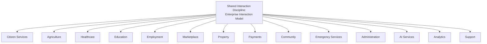

---

# Accessibility

| Consideration | Standard |
|---|---|
| **Keyboard Users** | Every interaction is fully operable via keyboard alone, in a logical order, with a visible focus state at every stage, per `ai-docs/12-accessibility-standards.md`. |
| **Screen Readers** | Every Interaction State and every System Feedback message is announced correctly, meaningfully, and at the moment it changes. |
| **Motor Accessibility** | Every interactive target meets the minimum touch-target standard already established in `ai-docs/12`'s Mobile Accessibility section, and no interaction depends on a gesture a citizen with limited fine motor control cannot perform. |
| **Visual Accessibility** | No Interaction State is conveyed by color alone — every state carries a text or icon-based signal independent of color perception. |
| **Hearing Accessibility** | Any audio-based feedback (a confirmation tone, a voice response) carries an equally complete visual or textual equivalent. |
| **Cognitive Accessibility** | An interaction never requires a citizen to hold more than one new concept in mind at once, per Cognitive Load Management above. |
| **Language Accessibility** | Every feedback message and instruction is available in the citizen's registered language and regional dialect, per `ai-docs/12`'s Multilingual Accessibility standard. |
| **Low Digital Literacy** | Voice-first interaction is a first-class path for an interaction serving a low-literacy population, per PER-002 Meena's and PER-021 Lakshmi's established needs — never a secondary accommodation. |
| **Assistive Technologies** | Every interaction is tested against genuine assistive-technology usage, never assumed compatible from visual inspection alone. |
| **WCAG Alignment** | Every interaction standard above meets or exceeds WCAG 2.2 AA, the floor already established in `ai-docs/12-accessibility-standards.md`, never treated as an aspirational target. |

---

# Interaction Governance

### Ownership
Every interaction pattern has exactly one named accountable owner — the Business Area Steward or Journey Product Owner accountable for the enclosing flow, mirroring the Clear Ownership discipline already established throughout `ai-docs/53` through `ai-docs/95`.

### Interaction Design Council
A standing **Interaction Design Council** — chaired by the Enterprise UX Architect, with the CPO, Head of Accessibility & Inclusion, Head of AI Platform, and rotating Business Area interaction stewards as members — holds approval authority over any platform-wide interaction-pattern change, any new Interaction State, and any material Anti-Pattern deviation. The Council meets monthly, with ad hoc sessions for an Interaction Success Rate regression.

### Decision Authority

| Decision | Approves |
|---|---|
| New reusable interaction pattern | Interaction Design Council + CPO |
| Business-Area-local interaction variation | Business Area Steward + Council (informational) |
| Cross-module interaction-consistency change | Council + affected Business Area Stewards |
| Interaction-accessibility standard change | Council + Head of Accessibility & Inclusion |
| AI-assisted interaction touching RULE-024's boundary | Council + AI Council (`ai-docs/78`), unanimous |

### Interaction Reviews, Documentation, and Audits
Every new or materially changed interaction pattern passes a documented review against this document's Interaction Philosophy, Interaction States, and Error Prevention Framework before implementation. Every interaction pattern is documented — its states, feedback, and recovery paths — before it is considered ready for reuse across modules. An Interaction Audit, checking Consistency, Feedback Completeness, and Accessibility Compliance, runs quarterly, distinct from and complementary to the Flow Audit already established in `ai-docs/94-user-flow-standards.md`.

### Version Control
Every interaction standard and pattern change is versioned (Major.Minor.Patch), mirroring `ai-docs/49-engineering-handbook-governance-evolution-standards.md`'s Version Management — a Major change (a new Interaction State, a changed Confirmation requirement) requires Council approval; a Minor or Patch change (a wording clarification) does not.

### Governance Responsibilities

| Role | Responsibility |
|---|---|
| **Interaction Design Council** | Platform-wide interaction-pattern approval and consistency oversight. |
| **Business Area Steward** | Their own area's interactions meeting every standard in this document. |
| **Journey Product Owner** | A specific interaction's day-to-day accuracy and currency. |
| **Head of Accessibility & Inclusion** | Verifying every interaction's accessibility compliance. |

### Continuous Improvement and Cross-Functional Collaboration
Every Interaction Metric finding feeds a shared, tracked improvement backlog, reviewed at the next Council meeting, per the identical Continuous Improvement Loop already established throughout `ai-docs/60` through `ai-docs/95`. No consequential interaction-pattern change is approved by Product alone — Engineering, Trust & Safety, and Accessibility all participate before a Major change proceeds.

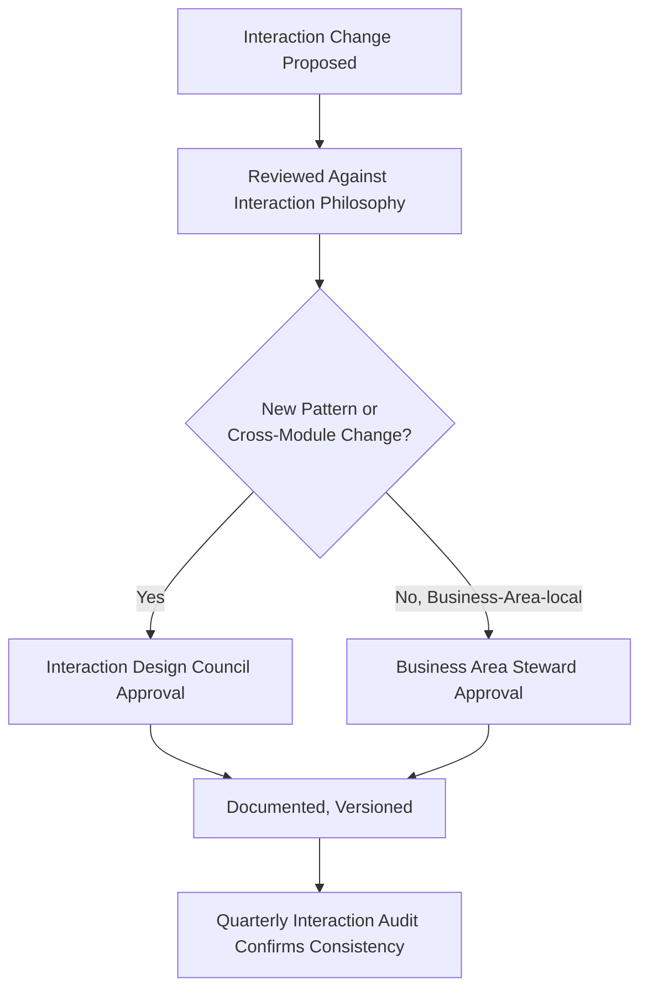

---

# Scalability

| Dimension | How Interaction Design Supports It |
|---|---|
| **Future Modules** | A new Module reuses an existing interaction pattern wherever possible, per `ai-docs/54`'s Reuse Strategy — the Enterprise Interaction Model is never redesigned per new module. |
| **Future Districts** | A second district's feedback language and terminology are configured within the existing model, per `ai-docs/50`'s Configuration-Driven Expansion Model — interaction behavior itself does not change. |
| **Future States** | The same Interaction States and Feedback Framework extend to a state-level deployment without structural redesign. |
| **Localization** | Feedback messages are externalized from interaction structure — a translated message never requires a state-model change. |
| **Internationalization** | The Enterprise Interaction Model is technology- and geography-independent, supporting expansion beyond a single state. |
| **AI Evolution** | AI Interaction Standards are structured as a layer over the existing model, never a parallel interaction system, as AI capability matures per `ai-docs/78`'s AI Capability Maturity scale. |
| **Emerging Interaction Models** | A genuinely novel interaction medium (a future gesture or ambient interface) is evaluated against this document's Philosophy before adoption, never against novelty alone. |
| **Enterprise Growth** | The layered Enterprise Interaction Model absorbs growth in interaction-pattern count without requiring the model itself to change. |
| **Long-Term Maintainability** | A stable, documented, governed interaction standard is the precondition for a future designer, unfamiliar with today's reasoning, to build a new interaction correctly. |

---

# Risks

| Risk | Description | Mitigation |
|---|---|---|
| **Inconsistent Feedback** | The same action produces different feedback shapes across modules. | Cross-Module Interaction Consistency; Quarterly Interaction Audit. |
| **Hidden System States** | A citizen cannot tell what state an interaction is currently in. | Visibility of System Status principle; mandatory state-transition documentation. |
| **Delayed Responses** | Feedback is not perceived as immediate, leaving a citizen uncertain whether an action registered. | Immediate Feedback standard; Interaction Review before implementation. |
| **Unexpected Behaviors** | An interaction produces an outcome a citizen could not have reasonably predicted. | Predictability principle; Learnability verification at Interaction Review. |
| **Interaction Complexity** | An interaction demands more cognitive effort than the citizen's genuine action requires. | Cognitive Load Management; Minimal Cognitive Load principle. |
| **Accessibility Regression** | A change to an interaction silently breaks its screen-reader, keyboard, or voice-first equivalent. | Mandatory Accessibility Audit before any interaction-pattern change ships. |
| **Over-Automation** | An automated or AI-assisted interaction removes genuine citizen decision-making. | RULE-024's absolute Automation Boundary; Human Override always available. |
| **Loss of User Control** | An interaction proceeds irreversibly without adequate confirmation. | User Control Principles; Confirmation Before Critical Actions. |
| **Poor Recovery** | A citizen encountering Error, Warning, or Offline states has no clear path forward. | Recovery state's mandatory, non-dead-end transition rules. |
| **Interaction Drift** | An interaction's actual behavior silently diverges from this document's standard over time. | Version Control on every structural change; Quarterly Interaction Audit. |

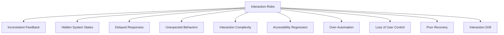

---

# Metrics

| Metric | Definition | Direction |
|---|---|---|
| **Interaction Success Rate** | % of interactions producing the citizen's genuinely intended outcome. | Increasing |
| **Task Confidence** | Citizen-reported certainty, immediately post-interaction, that their action succeeded. | Increasing |
| **Time to Feedback** | Interval between a citizen's action and the first perceivable System Feedback. | Decreasing toward imperceptibly short |
| **Recovery Success** | % of Error, Warning, or Offline states successfully returning a citizen to a valid, continuable state. | Increasing |
| **Accessibility Compliance** | % of interactions meeting the WCAG 2.2 AA floor. | Increasing toward 100% |
| **Interaction Consistency** | % of interaction categories behaving identically in shape across every Business Area that has one. | Increasing toward 100% |
| **Error Prevention Rate** | % of citizen attempts that would have failed a Business Rule, caught before submission rather than after. | Increasing |
| **User Satisfaction** | Post-interaction CSAT specific to interaction quality, per `ai-docs/60-customer-experience-strategy.md`. | Increasing |
| **Interaction Learnability** | Rate at which a first-time citizen's correct prediction of an interaction's outcome approaches a returning citizen's. | Increasing |
| **Trust Indicators** | The District Trust Signal, viewed for interaction-driven moments specifically. | Increasing |

> **Callout — No Interaction Metric Stands Alone**
> Per the North Star Principle already established in `ai-docs/00-project-vision.md`, a decreasing Time to Feedback achieved by skipping a genuine Confirmation, or a rising Interaction Success Rate alongside falling Accessibility Compliance, is treated as a regression — never counted as success in isolation.

---

# Anti-Patterns

| Anti-Pattern | Description | Why It's Rejected |
|---|---|---|
| **Hidden Feedback** | An action produces no perceivable signal, leaving the citizen to guess whether it registered. | Violates Immediate Feedback and Visibility of System Status. |
| **Unpredictable Behavior** | The same action produces different outcomes in different contexts with no stated reason. | Violates Predictability and Trust Through Transparency. |
| **Unexpected State Changes** | An interaction's state changes without a citizen-initiated cause. | Violates Respect User Intent and User Control. |
| **Irreversible Actions** | A consequential action proceeds with no confirmation and no undo path. | Violates Confirmation Before Critical Actions and Reversible Operations. |
| **Confirmation Fatigue** | Confirmation is applied so broadly that citizens learn to dismiss it reflexively, defeating its protective purpose. | Violates the Confirmation Patterns standard's requirement that confirmation be reserved for genuine consequence. |
| **Silent Failures** | An action fails with no Error feedback, leaving the citizen to believe it succeeded. | Violates Error Feedback and Trust Through Transparency, directly. |
| **Overloaded Interfaces** | Too many simultaneous decisions or signals compete for a citizen's attention at once. | Violates Cognitive Load Management and Focused Attention. |
| **Inconsistent Interaction Patterns** | The same interaction category behaves differently across Business Areas. | Violates Cross-Module Interaction Consistency. |
| **Accessibility Ignored** | An interaction is usable only by a sighted, mouse-using, literate citizen. | Violates Accessibility by Default, the non-negotiable floor. |
| **AI Decisions Without Transparency** | An AI-influenced outcome is presented with no basis stated and no human review path. | Violates Explainable Responses and RULE-024's Human Oversight requirement absolutely. |

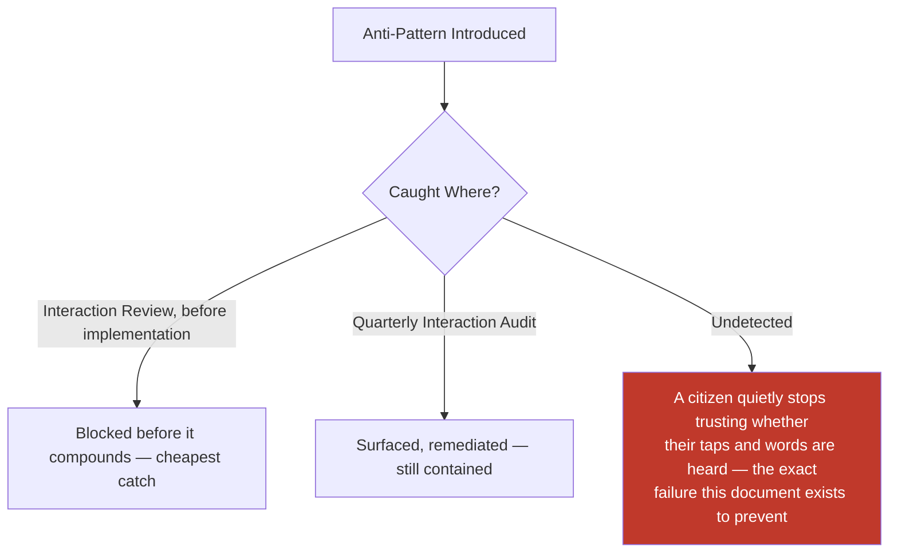

---

# Relationship to Previous Documents

| Prior Document | Relationship |
|---|---|
| **Project Vision (`ai-docs/00`)** | Establishes No Dead Ends, Progressive Complexity, and Trust over Growth-at-all-costs — this document's Interaction Philosophy operationalizes each at the single-gesture layer. |
| **Product Goals (`ai-docs/01`)** | Supplies the Target Audience device/literacy profile this document's Accessibility section is calibrated against. |
| **Engineering Principles (`ai-docs/02`)** | Supplies DRY, Consistency, and Single Source of Truth, applied here to interaction behavior rather than code. |
| **System Architecture Principles (`ai-docs/03`)** | Supplies the layered dependency discipline this document's Enterprise Interaction Model stages mirror at the citizen-facing layer. |
| **Security Standards (`ai-docs/10`)** | Supplies the Fail Securely and Least Privilege disciplines this document's Error Prevention Framework extends to the interaction layer. |
| **Performance Standards (`ai-docs/11`)** | Supplies the latency targets this document's Time to Feedback metric is measured against. |
| **Accessibility Standards (`ai-docs/12`)** | Supplies the non-negotiable WCAG 2.2 AA floor this document's Accessibility section extends to the individual-interaction layer. |
| **Documentation Standards (`ai-docs/24`)** | Supplies the Plain Language discipline this document's feedback-message standards directly inherit. |
| **Architecture Decision Records (`ai-docs/25`)** | Supplies the governed-decision discipline a Major interaction-standard change follows. |
| **Engineering Governance & Decision Authority (`ai-docs/29`)** | Supplies the Decision Authority Matrix pattern this document's Interaction Governance mirrors. |
| **Engineering Compliance & Audit Standards (`ai-docs/40`)** | Supplies the Evidence Quality Bar this document's Interaction Audit is measured against. |
| **Engineering Architecture Governance Standards (`ai-docs/46`)** | Supplies the Board-and-Council governance pattern this document's Interaction Design Council mirrors. |
| **Engineering Handbook Governance & Evolution Standards (`ai-docs/49`)** | Supplies the Version Management and Document Lifecycle disciplines this document's Interaction Governance directly inherits. |
| **Product Vision & Business Strategy (`ai-docs/50`)** | Supplies the Strategic Expansion Principles this document's Scalability section is built around. |
| **User Personas & User Segmentation (`ai-docs/52`)** | Supplies the specific citizens (Meena, Lakshmi, Devendra) this document's Accessibility and Cognitive Load standards are calibrated against. |
| **Business Domain Model (`ai-docs/53`)** | Supplies the Domain Registry underlying every interaction's business context. |
| **Product Module Catalog (`ai-docs/54`)** | Supplies the Module Registry and Reuse Strategy this document's Scalability section is built on. |
| **Business Capability Map (`ai-docs/55`)** | Supplies the stable capabilities every interaction ultimately expresses to a citizen. |
| **User Journey Standards (`ai-docs/56`)** | Supplies the Journey State Model this document's Interaction States extend to the finer-grained gesture layer. |
| **Business Process Standards (`ai-docs/57`)** | Supplies the organizational sequence standing behind Administrative interaction contexts. |
| **Business Rules & Policies (`ai-docs/58`)** | Supplies the precise, enforceable logic (RULE-003, RULE-018, RULE-024, RULE-031, RULE-032) this document's every feedback, confirmation, and recovery standard is bound by. |
| **Business Glossary (`ai-docs/59`)** | Supplies the singular vocabulary every feedback message must draw from. |
| **Customer Experience Strategy (`ai-docs/60`)** | Supplies the platform-wide felt-experience bar every interaction must clear. |
| **District Ecosystem Mapping (`ai-docs/64`)** | Supplies the whole-system participant view this document's interaction standards ultimately serve. |
| **Community & Social Engagement Strategy (`ai-docs/75`)** | Supplies the field-agent-assisted interaction standard this document's Community consistency references. |
| **Search & Discovery Strategy (`ai-docs/77`)** | Supplies the Trust Before Ranking principle this document's AI Interaction Standards are bound by. |
| **Trust & Safety Framework (`ai-docs/79`)** | Supplies the Trust Value Chain this document's Trust Through Transparency principle is built directly on. |
| **Product Governance** | Supplies the governance-of-governance discipline this document's own Interaction Governance section is held to. |
| **UX Vision & Experience Strategy (`ai-docs/90`)** | Supplies the Experience Principles (Clarity, Predictability, Feedback, Error Prevention, Forgiveness) this document's Interaction Philosophy directly extends to the individual-gesture layer. |
| **Human-Centered Design Principles & UX Philosophy (`ai-docs/91`)** | Supplies the Design Decision Principles every interaction standard in this document is evaluated against before publication. |
| **Information Architecture (`ai-docs/92`)** | Supplies the Enterprise Information Model every interaction's content ultimately draws from. |
| **Navigation Architecture & Wayfinding (`ai-docs/93`)** | Supplies the Wayfinding Principles and Predictability discipline this document extends from movement to the individual gesture. |
| **User Flow Standards (`ai-docs/94`)** | Supplies the Enterprise User Flow Model, Decision Point Framework, and Error Recovery this document's Interaction States and Feedback Framework operate within. |
| **Task Flow & Journey Optimization (`ai-docs/95`)** | Supplies the Continuous Improvement discipline this document's Interaction Governance mirrors, and the immediate predecessor whose optimized journeys this document renders trustworthy at the gesture level. |

### How Interaction Design Transforms Optimized Journeys Into Trustworthy Moments

`ai-docs/95-task-flow-journey-optimization.md` ensures a journey, taken as a whole, becomes faster, clearer, and kinder over time. That improvement remains theoretical until this document's Enterprise Interaction Model, Interaction States, and System Feedback Framework render every individual action within that journey predictable, honest, and humane. A journey can be measurably efficient and still betray a citizen's trust through a single silent button — this document exists to ensure that never happens, completing Stage 3's chain from structure (Information Architecture), to movement (Navigation Architecture), to accomplishment (User Flow Standards), to continuous improvement (Journey Optimization), to the trustworthy, human-centered feel of every single tap, keystroke, and spoken word a citizen ever directs at Arwal.

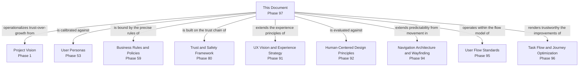

---

# Executive Artifacts

### Enterprise Interaction Framework

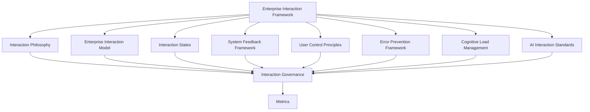

### Interaction Lifecycle Model

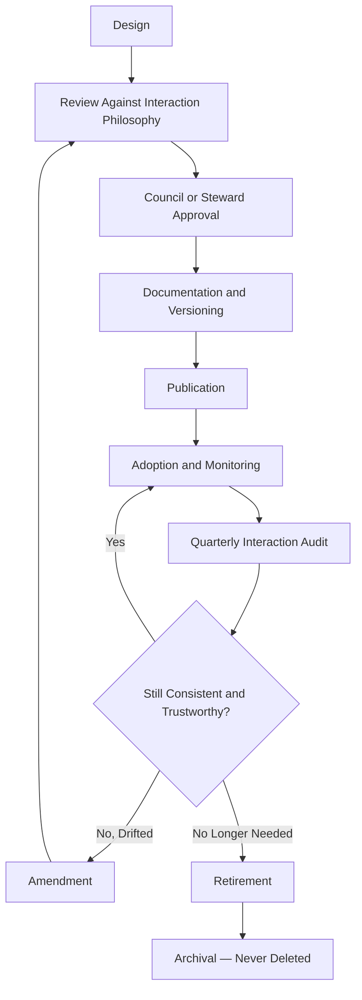

### Interaction State Model

See Interaction States section above — reproduced here by reference per Single Source of Truth, never duplicated.

### System Feedback Framework

See System Feedback Framework section above.

### User Control Framework

See User Control Principles section above.

### Error Prevention Framework

See Error Prevention Framework section above.

### Interaction Governance Framework

See Interaction Governance section above.

### Interaction Ownership Matrix

| Interaction Category | Owner | Governance Authority |
|---|---|---|
| Citizen Services interactions | CPO (delegate: Citizen Experience PM) | Interaction Design Council |
| Government Services interactions | Head of Government Partnerships | Council + Head of Government Partnerships |
| Agriculture / Healthcare / Education / Employment interactions | Respective Vertical Head | Council |
| Marketplace / Property / Payments interactions | Respective Vertical Head | Council (Payments: Mission Critical review) |
| Community / Emergency Services interactions | Head of Community Engagement / Head of Trust & Safety | Council |
| Administration / Analytics interactions | Head of Operations / Head of Data & Analytics | Council + Compliance |
| AI-assisted interactions | Head of AI Platform | Council + AI Council (`ai-docs/78`) |
| Support interactions | Head of Customer Success | Council |

### Interaction Review Checklist

- [ ] Traceable to a genuine citizen intent, never a technical or internal convenience.
- [ ] Every stage of the Enterprise Interaction Model is present or explicitly marked not applicable.
- [ ] Every Interaction State transition is deliberate, citizen-perceivable, and documented.
- [ ] Immediate Feedback is present for every action, with no silent state.
- [ ] Confirmation is applied only where genuine consequence warrants it, never reflexively.
- [ ] Every Error, Warning, and Offline state transitions to a defined Recovery path.
- [ ] Accessible per the WCAG 2.2 AA floor.
- [ ] Consistent with the equivalent interaction pattern in every other Business Area that has one.
- [ ] Named, accountable owner assigned per the Interaction Ownership Matrix.
- [ ] No anti-pattern present, per the Anti-Patterns table above.

### Interaction Audit Framework

| Audit Dimension | What Is Checked | Cadence |
|---|---|---|
| Consistency | Same interaction category behaves identically across Business Areas | Quarterly |
| Feedback Completeness | Every action produces perceivable Immediate, Processing, and Result feedback | Quarterly |
| Accessibility Compliance | WCAG 2.2 AA floor met across every interaction element | Quarterly |
| Confirmation Discipline | Confirmation is reserved for genuinely consequential actions only | Quarterly |
| Recovery Completeness | Every Error/Warning/Offline state has a working Recovery transition | Quarterly |
| Ownership Completeness | Every interaction pattern has a current, active named owner | Quarterly |

### Interaction Design Maturity Model

| Level | Name | Characteristics |
|---|---|---|
| **1 — Informal** | Interactions vary by team; no shared state model or feedback standard. | High variance; citizens relearn interaction behavior per module. |
| **2 — Developing** | The Enterprise Interaction Model is documented; inconsistently applied. | Uneven adoption across verticals. |
| **3 — Defined** | This document's full model, states, and standards are applied consistently. | This document's standard is fully met. |
| **4 — Measured** | Interaction Success Rate, Time to Feedback, and Accessibility Compliance are actively tracked against explicit thresholds. | Proactive, not reactive. |
| **5 — Optimized** | Interaction Design actively informs product strategy and is genuinely replicable to a second district. | Interaction quality is a durable civic and competitive advantage. |

Arwal's target state at this stage is **Level 3 (Defined)**, with **Level 4 (Measured)** targeted as analytics tooling from later phases matures.

### Interaction Principles Matrix

| Principle | Primary Beneficiary | Conflict Resolution Priority |
|---|---|---|
| Accessibility by Default | Vulnerable, low-literacy, rural citizens | Highest — never subordinated |
| Visibility of System Status | Every citizen | Highest — never subordinated |
| User Control | Every citizen facing a consequential action | High |
| Trust Through Transparency | Every citizen and institutional partner | High |
| Consistency | Every citizen across every module | Medium-High |
| Minimal Cognitive Load | Every citizen, once safety and clarity are satisfied | Medium |
| Scalable Interaction Design | Future districts and future citizens | Medium |

### Enterprise Interaction Decision Matrix

| Decision Type | Approval Authority |
|---|---|
| New reusable interaction pattern | Interaction Design Council + CPO |
| Business-Area-local interaction variation | Business Area Steward + Council (informational) |
| Cross-module interaction-consistency change | Council + affected Business Area Stewards |
| Interaction-accessibility standard change | Council + Head of Accessibility & Inclusion |
| AI-assisted interaction touching RULE-024 | Council + AI Council, unanimous |

### Executive Dashboards (Conceptual)

| Dashboard | Audience | Key Content |
|---|---|---|
| **CXO/CPO Dashboard** | CXO, CPO | Interaction Success Rate, Trust Indicators, Interaction Maturity Level |
| **Business Area Steward Dashboard** | Vertical Heads | Time to Feedback, Recovery Success for their own area |
| **Accessibility Dashboard** | Head of Accessibility & Inclusion | Accessibility Compliance trend across interactions |
| **Government Partners Dashboard** | Government liaisons | Government Services interaction consistency and recovery-success trend |

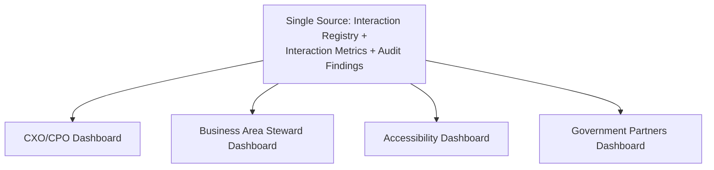

---

# Closing Statement

> **Callout — Closing Statement**
> Every prior document in this handbook explains what Arwal is, how it earns trust, how its information is organized, how a citizen moves through it, how a goal is accomplished, and how that accomplishment gets better over time. This document explains the smallest, most frequently repeated unit of all of that: the single tap, the single word spoken, the single moment a citizen waits to learn whether the platform heard them. A journey can be perfectly structured and still lose a citizen's trust through one silent button, one ambiguous confirmation, one error that blamed them instead of explaining itself. Interaction Design is where Arwal's civic promise is either kept or quietly broken, thousands of times a day, one gesture at a time — and it is the standard every future action, response, and moment of feedback across this platform is built to honor, for as long as Arwal exists.

This document, `ai-docs/96-interaction-design-framework.md`, is Phase 97 of approximately 425. Every future system response, feedback mechanism, state transition, and moment of user control is expected to trace back to a principle defined here, or to justify its deviation in writing.

**End of Phase 97 — `ai-docs/96-interaction-design-framework.md`**