# Screen Architecture Standards

**Document:** `ai-docs/97-screen-architecture-standards.md`
**Project:** Arwal — The District Super App
**Stage:** 3 — Experience & Design Strategy
**Phase:** 98 — Screen Architecture Standards
**Status:** Approved for Executive & Enterprise Reference
**Audience:** CXO, CPO, Enterprise UX Architect, Enterprise Information Architect, Screen Architecture Specialists, Human-Centered Design Consultants, Government Digital Services Advisors, Enterprise Design Governance Leads, Accessibility Specialists, Service Design Consultants, Digital Transformation Consultants, Enterprise Documentation Architects

> **Callout — Purpose of This Document**
> `ai-docs/92-information-architecture.md` established what information exists and where it belongs. `ai-docs/93-navigation-architecture-wayfinding.md` established how a citizen moves between those places. `ai-docs/94-user-flow-standards.md` established how a citizen accomplishes a goal once they arrive. `ai-docs/95-task-flow-journey-optimization.md` established how that accomplishment gets better over time. `ai-docs/96-interaction-design-framework.md` established how every individual tap, keystroke, and moment of feedback behaves. None of those five documents answers the question a citizen encounters the instant a single screen renders in front of them: **once I am here, on this one screen, how is everything on it organized — what do I see first, what matters most, and where does everything else belong?** This document is that answer — the authoritative Screen Architecture Standards every future screen, layout decision, and content-placement choice traces back to.

---

# Purpose of this Document

### Why Screen Architecture Differs From Interaction Design

`ai-docs/96-interaction-design-framework.md` governs the smallest unit of citizen experience — a single tap, a single state transition, a single moment of feedback. Screen Architecture governs a different, larger unit: the complete, structured surface a citizen perceives all at once, before they take any action at all. Interaction Design asks "when I act, what happens?" Screen Architecture asks a prior question: "before I act, what am I looking at, and does it make sense?" A screen can contain flawlessly designed individual interactions — every button predictable, every state honest — and still fail a citizen if those interactions are scattered without hierarchy, if the critical action is visually indistinguishable from a decorative one, or if the citizen cannot tell, at a glance, what the screen is actually for. Screen Architecture is the discipline that makes a screen legible as a whole, not merely correct in its parts.

### How Screen Architecture Supports User Goals

A citizen opens a screen already carrying a goal from the Journey and Flow that brought them there — per `ai-docs/94-user-flow-standards.md`'s Enterprise User Flow Model, they have arrived at a specific Task Execution or Decision Point. Screen Architecture's job is to present exactly what that goal requires, prioritized correctly, with everything unrelated to that goal pushed to a secondary or supporting position. A screen architected around the citizen's actual goal gets out of the way; a screen architected around what was easiest to build, or around every feature a module happens to offer, makes the citizen do the work of finding their own goal inside a cluttered space.

### How Structural Consistency Improves Learnability

A citizen who has learned that the primary action always sits in the same structural position, that status is always communicated in the same zone, and that supporting detail is always available below the fold rather than competing for primary attention, can transfer that learning to every new screen they encounter — including one in a Business Area they have never used before. This is the Consistency principle already established throughout `ai-docs/90` through `ai-docs/96`, expressed now at the level of the screen's own physical organization rather than its content or its interactions.

### How Proper Screen Organization Reduces Cognitive Load

Every additional decision a citizen must make about *where to look* — before they even decide *what to do* — is a real cost, paid disproportionately by exactly the citizens Arwal exists to serve first: a first-generation smartphone user, a low-literacy farmer, an anxious elderly citizen. A well-architected screen answers "where do I look" instantly and consistently, so a citizen's limited attention is spent entirely on their actual task, mirroring `ai-docs/56-user-journey-standards.md`'s Minimal Cognitive Load principle applied here to the physical structure of a single screen.

### How Architecture Improves Accessibility

A screen is accessible because its structure — its reading order, its landmark regions, its hierarchy of headings — was designed correctly before a single color or font was chosen, per the non-negotiable floor already established in `ai-docs/12-accessibility-standards.md`. A screen-reader user experiences a screen's *structure* directly, often before or instead of its visual presentation; a screen whose structure is sound is substantially accessible before any visual styling decision is made at all. Screen Architecture is therefore not merely compatible with accessibility — it is one of the primary places accessibility either succeeds or fails.

### How Architecture Supports Scalability and Enterprise Governance

A screen structure pattern defined once, here, and reused across every Business Area is a pattern that a new Product Module (`ai-docs/54`) can adopt without inventing its own layout logic, and that a future district's civic terminology can populate without a structural redesign, per `ai-docs/50-product-vision-business-strategy.md`'s Configuration-Driven Expansion Model. Enterprise governance depends on exactly this reusability: a screen architecture that cannot be named, audited, and cited consistently cannot be governed at all — the same Governable Structure discipline already established in `ai-docs/92-information-architecture.md` and `ai-docs/93-navigation-architecture-wayfinding.md`, applied now to the screen as the final, citizen-visible unit of structure.

### The Chain of Reasoning This Document Completes

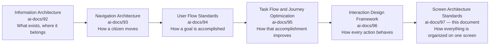

| Layer | Question It Answers |
|---|---|
| Information Architecture | What exists, and where does it belong? |
| Navigation Architecture & Wayfinding | How does a citizen move, and always know where they are? |
| User Flow Standards | How does a citizen accomplish a goal? |
| Task Flow & Journey Optimization | How does that accomplishment get better over time? |
| Interaction Design Framework | How does every individual action behave? |
| **Screen Architecture Standards** (this document) | **How is everything on one screen structurally organized — what is seen first, what matters most, and where does everything else belong?** |

> **Callout — A Screen Is Where Five Prior Disciplines Converge**
> A single screen is never designed from a blank canvas — it is the point where Information Architecture's content, Navigation Architecture's wayfinding cues, User Flow Standards' current stage, Journey Optimization's measured improvements, and Interaction Design's states and feedback all appear together, at once, to a citizen. Screen Architecture does not create any of that content — it organizes it. A screen architecture review that finds content misplaced is never a content problem; it is a structural one, and this document, not any of its five predecessors, is where that structural correctness is governed.

### Scope Boundary

This document contains no colors, no typography, no icons, no illustrations, no components, no responsive grid systems, no animations, no React, no Next.js, no frontend code, no backend code, no APIs, and no implementation detail of any kind. Every one of those remains the deliberate territory of a future, technology-facing phase building explicitly on top of this one. This document's exclusive territory is: **why screen architecture is a distinct discipline, the enterprise screen model, screen hierarchy, screen zones, content organization, progressive disclosure, context preservation, cross-screen consistency, multi-device screen architecture, accessibility, scalability, and governance** — the structural standard every future screen implementation must express faithfully, never redefine independently.

---

# Screen Architecture Philosophy

Every principle below exists because a screen assembled carelessly does not fail abstractly — it fails a specific citizen who opened a screen to accomplish one thing and could not tell, at a glance, where that one thing lived.

### Content Before Decoration
**Why it exists:** A screen's structure is determined by what a citizen genuinely needs to see and do, never by what would look visually impressive. A decorative element that displaces or competes with genuine content has inverted the screen's purpose, mirroring `ai-docs/91-human-centered-design-principles-ux-philosophy.md`'s Citizen Before Technology principle applied here to visual composition.

### Hierarchy Before Styling
**Why it exists:** What matters most on a screen is decided structurally — through position, grouping, and sequence — before any typographic or color treatment is applied. A screen whose hierarchy depends entirely on a font-weight choice to be legible has no genuine structural hierarchy at all; styling may reinforce a hierarchy, but it may never be the only thing establishing one.

### Structure Supports Tasks
**Why it exists:** A screen's organization is derived directly from the Task it serves within `ai-docs/94-user-flow-standards.md`'s Enterprise User Flow Model — never from an internal team's convenience or a generic template applied uniformly regardless of purpose. A screen supporting Task Execution is structured differently from a screen supporting Completion, because the citizen's need at each stage is genuinely different.

### Consistency Across Screens
**Why it exists:** A citizen who has learned where the primary action sits on one screen should find it in the same structural position on every other screen that has one, per the identical Consistency principle already established throughout `ai-docs/90` through `ai-docs/96`, now expressed as physical screen organization.

### Progressive Disclosure
**Why it exists:** A screen reveals its full depth only as it becomes relevant — essential information is immediately visible; advanced, optional, or rarely needed detail is available but never forced into the citizen's first view, per `ai-docs/00-project-vision.md`'s Progressive Complexity principle.

### Clear Information Priority
**Why it exists:** Every element on a screen has an explicit, deliberate priority relative to every other element — nothing is placed by accident, and no two elements of genuinely different importance are ever presented with equal visual and structural weight.

### Context Preservation
**Why it exists:** A citizen arriving at a screen mid-Task never loses the thread of what they were doing, where they came from, or what they had already provided — a screen that discards context forces the citizen to reconstruct their own situation, a direct tax on the trust `ai-docs/79-trust-safety-framework.md` names as Arwal's most valuable asset.

### Minimal Cognitive Load
**Why it exists:** A screen presents the fewest genuinely necessary elements a citizen's task requires, at the moment they are needed — never the maximum a module happens to be capable of displaying, mirroring `ai-docs/56-user-journey-standards.md`'s Minimal Cognitive Load principle applied at the screen-composition layer.

### Accessibility by Structure
**Why it exists:** A screen is accessible because its underlying structure — reading order, landmark regions, heading hierarchy — is sound before any visual treatment exists, per the non-negotiable floor already established in `ai-docs/12-accessibility-standards.md`. Accessibility achieved only through a later visual pass is accessibility achieved too late.

### Scalable Screen Organization
**Why it exists:** A screen pattern designed for today's twenty modules must gracefully absorb the next two hundred and a future district's different civic terminology — every pattern in this document is designed with that headroom deliberately built in, per the same Future Scalability discipline already established in `ai-docs/92` through `ai-docs/96`.

### Enterprise Consistency
**Why it exists:** The same screen pattern, once approved, is reused everywhere its purpose recurs — never independently reinvented per Business Area, mirroring the Reuse Strategy already established in `ai-docs/54-product-module-catalog.md` and extended here to screen structure itself.

### Trust Through Familiarity
**Why it exists:** A citizen who opens an unfamiliar screen and immediately recognizes its shape — because it follows the same structural pattern as every other screen they have used — trusts it faster than one that looks and behaves like an entirely new invention, per `ai-docs/93-navigation-architecture-wayfinding.md`'s Trust Through Predictability principle extended here from movement to structure.

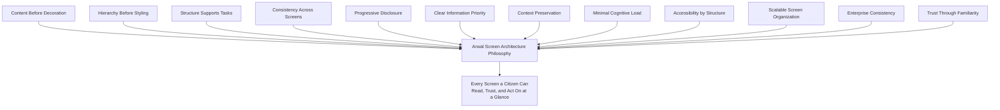

> **Callout — The One-Sentence Screen Architecture Philosophy**
> *"A screen a citizen must study before they understand it has already failed — the correct structure is the one that makes understanding automatic, not the one that looks most complete."*

---

# Enterprise Screen Model

Every screen on the Arwal platform, regardless of Business Area or Module, is composed of the same ten structural areas.

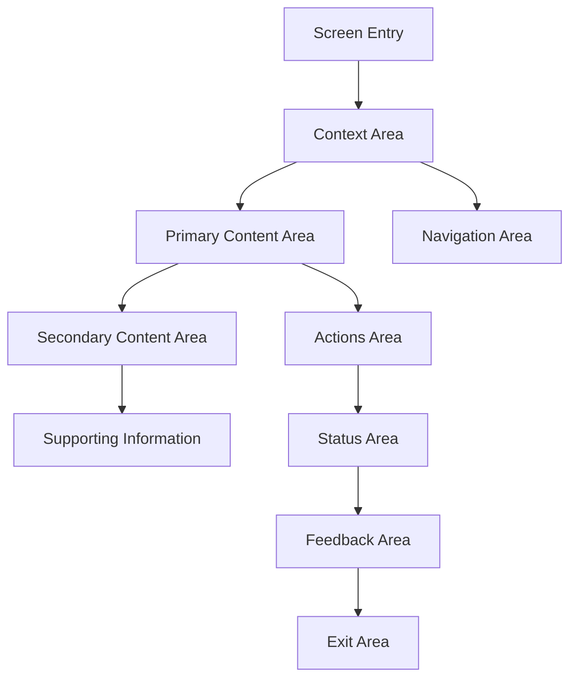

| Area | Purpose | Ownership | Success Criteria |
|---|---|---|---|
| **Screen Entry** | The moment a citizen's attention first lands on the screen, handed off from Navigation (`ai-docs/93`) or a prior screen's Exit Area. | Journey Product Owner, per `ai-docs/56` | The citizen understands, within seconds, what this screen is for. |
| **Context Area** | States where the citizen is (per `ai-docs/93`'s Orientation), what Task they are in, and what step they are on. | Journey Product Owner | The citizen never has to guess their current position. |
| **Primary Content Area** | The single most important content or decision the screen exists to present — the reason this screen was built. | Business Area Steward | A citizen's eyes are drawn here first, without instruction. |
| **Secondary Content Area** | Genuinely relevant content that supports but does not compete with the Primary Content Area. | Business Area Steward | Present, but never mistaken for the primary purpose. |
| **Supporting Information** | Reference or explanatory content a citizen may need but does not require to proceed. | Journey Product Owner | Available without demanding attention. |
| **Actions Area** | Every action a citizen may take from this screen, prioritized per the Screen Hierarchy below. | Journey Product Owner | The critical action is unmistakable; secondary actions never compete with it visually. |
| **Status Area** | The current state of the screen or the citizen's data — per `ai-docs/96`'s Interaction States. | Business Area Steward | A citizen can always tell, at a glance, what state they are in. |
| **Feedback Area** | Where a result of a citizen's action is communicated — success, warning, or error, per `ai-docs/96`'s System Feedback Framework. | Journey Product Owner | Feedback is never missed, buried, or ambiguous. |
| **Navigation Area** | The persistent and contextual navigation elements reachable from this screen, per `ai-docs/93`'s Enterprise Navigation Model. | Head of Platform Engineering | A citizen always has a reliable path elsewhere. |
| **Exit Area** | Where and how a citizen leaves this screen — completion, cancellation, or navigation onward. | Journey Product Owner | No citizen is left without a clear, honest way to leave. |

### Relationships and Ownership

Every area's presence is deliberate — an area genuinely not needed for a specific screen (a simple confirmation screen may have no meaningful Secondary Content Area) is explicitly marked absent, never silently omitted, so a future reviewer can distinguish "not needed here" from "forgotten," mirroring the identical discipline already established in `ai-docs/94-user-flow-standards.md`'s Enterprise User Flow Model. Ownership of each area on a given screen is inherited from the owning Journey Product Owner or Business Area Steward already accountable under `ai-docs/94` and `ai-docs/96`, ensuring screen-level accountability never diffuses away from flow-level and interaction-level accountability already established there.

---

# Screen Hierarchy

Every element on a screen occupies exactly one tier of the following hierarchy, and no two elements of genuinely different tiers are ever presented with equal visual or structural weight.

| Tier | Definition | Standard |
|---|---|---|
| **Primary Content** | The single most important thing the screen exists to show. | Occupies the most prominent structural position; never shares that position with a competing element. |
| **Secondary Content** | Genuinely relevant content supporting the primary purpose. | Present but subordinate — never equal in structural prominence to Primary Content. |
| **Supporting Content** | Reference, explanatory, or optional detail. | Available on request or below the primary fold, per Progressive Disclosure. |
| **Critical Actions** | An action central to the citizen's genuine goal on this screen (submit, confirm, book). | Structurally distinct and unmistakable — never visually indistinguishable from a Secondary Action. |
| **Secondary Actions** | A genuinely available but non-primary action (save for later, view details). | Present without competing for the citizen's first glance. |
| **Persistent Information** | Information that remains true and visible for the duration of the screen's relevance (a citizen's current balance, their current Task step). | Consistently positioned across every screen where it recurs. |
| **Temporary Information** | Information relevant only briefly (a just-confirmed action, a transient status). | Clearly time-bound and never confused with Persistent Information. |
| **System Messages** | A platform-originated message — an error, a warning, a notice. | Distinct from citizen-originated or business content, per `ai-docs/96`'s System Feedback Framework. |
| **Contextual Information** | Information relevant specifically because of the citizen's current situation. | Present only where genuinely relevant, never shown unconditionally. |
| **Background Information** | Information available for a citizen who wants deeper understanding but is not required for the immediate task. | Lowest priority tier — always accessible, never prominent. |

### Prioritization Rules

1. A screen has exactly one Primary Content element at any given moment — never two competing for the citizen's first attention.
2. A Critical Action is never subordinate, in visual or structural weight, to a Secondary Action.
3. System Messages are never blended indistinguishably into ordinary content — a citizen must always be able to tell a platform-originated message from business content, per `ai-docs/96`'s Trust Through Transparency principle.
4. Persistent Information occupies a stable, predictable structural position that does not shift between screens sharing the same pattern.
5. Background Information is never placed above Primary or Secondary Content in reading or visual order, regardless of how much of it exists.

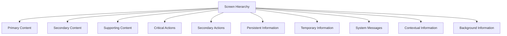

---

# Screen Zones

Every screen consistently organizes the following zones, regardless of Business Area or Module.

| Zone | Standard |
|---|---|
| **Header Zone** | Identifies the screen's purpose and, where relevant, the citizen's current location per `ai-docs/93`'s Orientation principle. |
| **Navigation Zone** | Houses the persistent and contextual navigation elements reachable from this screen, per `ai-docs/93`'s Enterprise Navigation Model. |
| **Context Zone** | States what Task, step, or situation the citizen is currently in — the structural home of Context Preservation below. |
| **Primary Content Zone** | The dominant structural area, reserved exclusively for the screen's Primary Content tier. |
| **Secondary Content Zone** | A clearly subordinate area for Secondary and Supporting Content tiers. |
| **Action Zone** | Houses every Critical and Secondary Action, always structured so the Critical Action is unmistakable. |
| **Support Zone** | The structural home for Support Navigation (`ai-docs/93`) and Supporting Information — reachable without displacing primary content. |
| **Status Zone** | A consistent, predictable location for the screen's current state, per `ai-docs/96`'s Visibility of System Status principle. |
| **Footer Zone** | Houses persistent, low-priority elements — legal references, secondary utility links — never a competing action. |
| **Safe Areas** | Structural margins reserved to protect critical content and actions from being obscured by device-level chrome, notification overlays, or assistive-technology interfaces. |

> **Callout — Zones Are Structural, Not Visual**
> A Screen Zone is a structural role, never a pixel region defined by a specific layout implementation — the same Zone Model applies whether a screen is rendered on an entry-level Android phone, a tablet, or read aloud by a screen reader with no visual layout at all. A future, technology-facing phase decides how each zone is rendered; this document decides only that the zone exists, what belongs in it, and how it relates to every other zone.

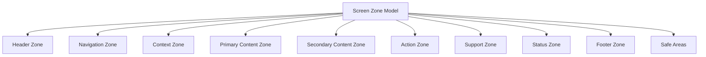

---

# Content Organization Framework

| Standard | Description |
|---|---|
| **Content Grouping** | Genuinely related content is placed together, structurally adjacent — never scattered across a screen because it happened to be added at different times. |
| **Content Sequencing** | Content appears in the order a citizen would naturally need it — the order of their own reasoning, never the order of an internal database's field list. |
| **Content Prioritization** | Every group's position reflects its Screen Hierarchy tier, per the Prioritization Rules above. |
| **Information Chunking** | Complex content is broken into small, digestible groups a citizen can process one at a time, per `ai-docs/96`'s Cognitive Load Management principle. |
| **Related Information** | Content genuinely related to the Primary Content (per `ai-docs/92`'s Cross-Domain Content) is placed nearby, never requiring a citizen to navigate away to see it. |
| **Supporting Information** | Present but structurally subordinate, reachable without becoming the screen's dominant visual weight. |
| **Reference Information** | Durable, rarely changing content (per `ai-docs/92`'s Reference Content classification) is available but never competes with dynamic, task-relevant content. |
| **Contextual Information** | Shown only where the citizen's current situation makes it genuinely relevant, never displayed unconditionally. |
| **Progressive Information** | Deeper detail is revealed only as a citizen expresses interest, per Progressive Disclosure below. |
| **Content Density** | The amount of content per screen is calibrated to what a citizen can genuinely absorb in one view — never maximized simply because space is available. |

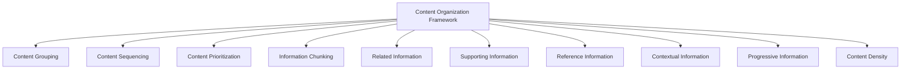

---

# Progressive Disclosure

| Standard | Description |
|---|---|
| **Essential Information First** | The information a citizen genuinely needs to understand the screen's purpose and take their first action is visible immediately, with no interaction required to reveal it. |
| **Advanced Information** | Detail relevant only to a citizen's deeper or unusual need is available but not shown by default. |
| **Expandable Content** | A citizen may deliberately reveal additional detail through an explicit, predictable action — never automatically or unexpectedly. |
| **Optional Details** | Content genuinely optional to the citizen's task is visually and structurally distinguished from what is required. |
| **Contextual Details** | Detail relevant only in a specific situation appears only in that situation, never persistently regardless of relevance. |
| **Conditional Information** | Content whose relevance depends on an earlier citizen answer appears only once that condition is met, per `ai-docs/94-user-flow-standards.md`'s Conditional Decisions. |
| **Role-Based Disclosure** | A citizen, merchant, and officer each see a screen's depth calibrated to their role, per RULE-031. |
| **Task-Based Disclosure** | The depth of a screen adjusts to the specific Task it is serving, per the Enterprise User Flow Model — a screen in Context Collection differs in depth from one in Confirmation. |
| **Personalized Disclosure** | Shaped by a citizen's own consented history where genuinely helpful, always explainable, per `ai-docs/78-ai-product-strategy.md`'s Explainability principle. |
| **AI-Assisted Disclosure** | The AI Assistant (CAP-033) may surface a citizen-relevant detail proactively, always distinguishable from organically presented content and always overridable, per RULE-024. |

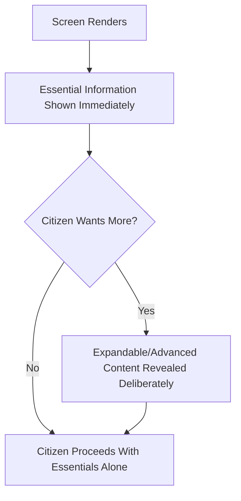

---

# Context Preservation

| Standard | Description |
|---|---|
| **Current Context** | A citizen's present Task, step, and screen purpose are always visible, per the Context Zone above. |
| **Previous Context** | What the citizen just did or saw remains traceable, never discarded the moment a new screen renders. |
| **Next Context** | Where a citizen is headed, where relevant, is signaled honestly rather than left to surprise them. |
| **Navigation Context** | A citizen's place within `ai-docs/93`'s Navigation Hierarchy is preserved and reflected structurally on every screen. |
| **Task Context** | A citizen's position within a multi-step Task (per `ai-docs/94`'s Flow States) is never lost between screens. |
| **User Context** | A citizen's role, device, and connectivity context shape what is shown, never assumed uniform. |
| **Business Context** | The specific Business Area and Module a citizen is within remains legible throughout, per `ai-docs/54-product-module-catalog.md`. |
| **System Context** | The platform's current state (Processing, Waiting, Offline, per `ai-docs/96`'s Interaction States) is always visible where relevant. |
| **Historical Context** | Where genuinely useful, a citizen's relevant prior activity (a past order, a prior application) is available without re-navigation. |
| **Session Continuity** | A citizen's in-progress data and position survive an interruption wherever the underlying goal allows, per `ai-docs/94`'s State Preservation standard. |

> **Callout — A Citizen Should Never Have to Reconstruct Their Own Situation**
> Every standard above exists to prevent one specific failure: a citizen arriving at a screen and being unable to answer, from the screen alone, "what was I doing, and where am I in it?" Context Preservation is what makes a complex, multi-screen civic or commercial workflow feel like one continuous conversation rather than a series of disconnected encounters.

---

# Cross-Screen Consistency

The same Enterprise Screen Model, Screen Hierarchy, and Screen Zones repeat identically across every Business Area below — differing only in the specific content a screen carries, never in its structural shape.

| Business Area | Structural Consistency Expression |
|---|---|
| **Citizen Services** | A profile screen's Primary Content Zone holds identity/preference content with the identical Action Zone structure as any transacting screen elsewhere. |
| **Agriculture** | A price-check screen's Status Zone communicates data freshness with the same structural discipline as an Order screen's fulfillment status. |
| **Healthcare** | An appointment confirmation screen's Action Zone carries the identical Critical Action prominence as a Payment screen's confirm action. |
| **Education** | A tutor-profile screen's Secondary Content Zone holds ratings and availability with the same subordination discipline as a Marketplace listing screen. |
| **Employment** | A job-listing screen's Context Zone states application status identically in shape to a Government Application's status screen. |
| **Marketplace** | Checkout screens define the platform's strictest Action Zone and Status Zone discipline, inherited by every other payment-bearing screen. |
| **Property** | A listing-detail screen's Supporting Information holds verification and disclosure content with the same subordinate placement as any other verified-listing screen. |
| **Payments** | Every payment-bearing screen, regardless of originating Business Area, honors the identical Status Zone and Feedback Area discipline, with no vertical-specific exception. |
| **Community** | A group-registration screen's Context Preservation carries a field-agent-assisted state identically to Agriculture's assisted screens. |
| **Emergency Services** | Emergency-relevant screens hold the same Action Zone prominence discipline as any other Critical Action screen, with a stricter, never looser, tolerance for ambiguity. |
| **Administration** | Officer-facing screens are held to the identical Hierarchy and Zone discipline as any citizen-facing screen, never treated as a lower-priority internal surface. |
| **AI Services** | Every AI-mediated screen surfaces its contribution in a structurally consistent Supporting or Contextual position, never blended indistinguishably into organic content. |
| **Analytics** | Internal reporting screens follow the identical Primary/Secondary Content Zone discipline as any citizen-facing multi-content screen. |
| **Support** | Escalation screens carry forward full Context Preservation, never requiring a citizen to reconstruct a situation that already failed once. |

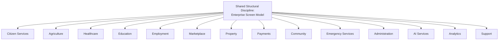

> **Callout — Module Content Varies; Screen Structure Never Does**
> Module Independence, per `ai-docs/54-product-module-catalog.md`, governs what a screen contains. Cross-Screen Consistency governs how that content is structurally organized. A citizen who has never opened Healthcare should still correctly predict where the Critical Action sits, purely from having used Marketplace — because the underlying Screen Model, not the domain content, is what repeats.

---

# Multi-Device Screen Architecture

| Device Category | Architectural Principle |
|---|---|
| **Mobile Screens** | The Enterprise Screen Model's zones stack in priority order for a narrow viewport — Primary Content and the Critical Action remain reachable without excessive scrolling, per `ai-docs/93`'s Mobile Navigation discipline. |
| **Tablet Screens** | Additional structural width may reveal Secondary Content alongside Primary Content without displacing it, never at the cost of hierarchy clarity. |
| **Desktop Screens** | Greater available space is used to reduce progressive-disclosure interaction, never to introduce content unrelated to the screen's Primary purpose. |
| **Large Displays** | A shared or kiosk-style large display preserves the identical Screen Hierarchy, with an added structural allowance for readability at distance. |
| **Public Kiosks** | Structure defaults to the most conservative Progressive Disclosure setting — essential content only, given a public, potentially unassisted, time-limited citizen interaction. |
| **Assistive Devices** | The Enterprise Screen Model's structural order is the *primary* experience for a screen-reader or switch-access citizen, never a secondary accommodation layered on afterward. |
| **Offline Usage** | The Status Zone communicates offline state honestly; the Primary Content Zone remains available wherever `ai-docs/00-project-vision.md`'s Offline-First commitment applies to the underlying content. |
| **Low Connectivity** | Screen structure renders its shell — zones and hierarchy — before content finishes loading, per `ai-docs/93`'s Low Connectivity Navigation principle applied here to screen composition. |
| **Future Device Categories** | A genuinely new device category is evaluated against the Enterprise Screen Model's zones and hierarchy before any device-specific accommodation is designed, never against novelty alone. |

> **Callout — Structural Consistency Survives the Device; Presentation Adapts to It**
> The same ten Screen Areas and the same Screen Hierarchy tiers exist on every device — what changes across a mobile phone, a tablet, and a screen reader is never *what belongs where structurally*, only *how much of it is visible at once and in what physical arrangement*. This is the identical principle already established in `ai-docs/93-navigation-architecture-wayfinding.md`'s Responsive Navigation, extended here to full-screen composition.

---

# Accessibility

| Standard | Requirement |
|---|---|
| **Logical Reading Order** | A screen's structural order matches the order a screen-reader user would encounter it — content is never visually reordered in a way that breaks logical, linear traversal. |
| **Semantic Structure** | Every Screen Zone maps to a genuine semantic landmark or heading level, per `ai-docs/12-accessibility-standards.md`'s Semantic HTML Standards — never a purely visual arrangement with no structural equivalent. |
| **Keyboard Navigation** | Every element within every Zone is reachable and operable via keyboard alone, in an order matching the screen's logical hierarchy. |
| **Screen Readers** | A screen's Context Zone, Status Zone, and Feedback Area are announced meaningfully and at the correct moment, never silently updated. |
| **Visual Hierarchy** | The Screen Hierarchy's tiers are conveyed through more than visual weight alone — a Critical Action is distinguishable even without color or size cues, per Color Independence already established in `ai-docs/12`. |
| **Motor Accessibility** | Every actionable element within the Action Zone meets the minimum touch-target standard already established in `ai-docs/12-accessibility-standards.md`. |
| **Cognitive Accessibility** | A screen never requires a citizen to hold more than one new concept in mind at once, per Minimal Cognitive Load above. |
| **Language Accessibility** | Every zone's content is available in the citizen's registered language and regional dialect, per `ai-docs/12`'s Multilingual Accessibility standard. |
| **Low Digital Literacy** | A screen's Essential Information (per Progressive Disclosure) is expressed in plain, icon-plus-text language a first-generation smartphone citizen can act on unassisted. |
| **WCAG Alignment** | Every screen architecture standard above meets or exceeds WCAG 2.2 AA, the floor already established in `ai-docs/12-accessibility-standards.md`, never treated as an aspirational target. |

> **Callout — Structure Is the First Accessibility Pass, Not the Last**
> A screen whose Enterprise Screen Model is correctly applied is substantially accessible before a single visual decision is made — a sound structure gives a screen-reader user a coherent experience by default. A screen architecture review finding a structural defect is therefore always also an accessibility finding, and is treated with the corresponding severity, never deferred to a later visual-accessibility pass.

---

# Screen Governance

### Ownership
Every screen pattern has exactly one named accountable owner — the Business Area Steward or Journey Product Owner accountable for the enclosing flow, mirroring the Clear Ownership discipline already established throughout `ai-docs/53` through `ai-docs/96`.

### Screen Architecture Council
A standing **Screen Architecture Council** — chaired by the Enterprise UX Architect, with the CPO, Head of Accessibility & Inclusion, Head of AI Platform, and rotating Business Area screen stewards as members — holds approval authority over any platform-wide screen-pattern change, any new reusable Screen Zone arrangement, and any material Anti-Pattern deviation. The Council meets monthly, with ad hoc sessions for a Screen Comprehension Rate regression.

### Decision Authority

| Decision | Approves |
|---|---|
| New reusable screen pattern | Screen Architecture Council + CPO |
| Business-Area-local screen variation | Business Area Steward + Council (informational) |
| Cross-module screen-consistency change | Council + affected Business Area Stewards |
| Screen-accessibility standard change | Council + Head of Accessibility & Inclusion |
| AI-surfaced content placement touching RULE-024's boundary | Council + AI Council (`ai-docs/78`), unanimous |

### Architecture Reviews, Documentation, and Audits
Every new or materially changed screen pattern passes a documented review against this document's Screen Architecture Philosophy, Screen Hierarchy, and Screen Zones before implementation. Every screen pattern is documented — its ten Screen Areas, its Hierarchy tier assignments, and its Zone arrangement — before it is considered ready for reuse across modules. A Screen Audit, checking Consistency, Hierarchy Clarity, and Accessibility Compliance, runs quarterly, distinct from and complementary to the Interaction Audit already established in `ai-docs/96-interaction-design-framework.md`.

### Version Control
Every screen standard and pattern change is versioned (Major.Minor.Patch), mirroring `ai-docs/49-engineering-handbook-governance-evolution-standards.md`'s Version Management — a Major change (a new Screen Area, a changed Hierarchy rule) requires Council approval; a Minor or Patch change (a wording clarification) does not.

### Governance Responsibilities

| Role | Responsibility |
|---|---|
| **Screen Architecture Council** | Platform-wide screen-pattern approval and consistency oversight. |
| **Business Area Steward** | Their own area's screens meeting every standard in this document. |
| **Journey Product Owner** | A specific screen's day-to-day accuracy and currency. |
| **Head of Accessibility & Inclusion** | Verifying every screen's structural accessibility compliance. |

### Continuous Improvement and Cross-Functional Collaboration
Every Screen Metric finding feeds a shared, tracked improvement backlog, reviewed at the next Council meeting, per the identical Continuous Improvement Loop already established throughout `ai-docs/60` through `ai-docs/96`. No consequential screen-pattern change is approved by Product alone — Engineering, Trust & Safety, and Accessibility all participate before a Major change proceeds.

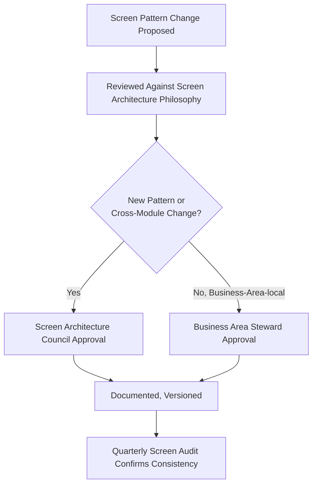

---

# Scalability

| Dimension | How Screen Architecture Supports It |
|---|---|
| **Future Modules** | A new Module reuses an existing screen pattern wherever possible, per `ai-docs/54`'s Reuse Strategy — the Enterprise Screen Model is never redesigned per new module. |
| **Future Services** | A new government service or civic offering is expressed through the existing screen pattern for its category (application, confirmation, status), never a bespoke structure. |
| **Future Districts** | A second district's terminology and civic content are configured within the existing Screen Zones — local content changes; screen structure does not, per `ai-docs/50`'s Configuration-Driven Expansion Model. |
| **Future States** | The same Enterprise Screen Model extends to a state-level deployment without structural redesign. |
| **Localization** | Zone content is externalized from zone structure — a translated label never requires a Hierarchy or Zone change. |
| **Internationalization** | The Enterprise Screen Model is technology- and geography-independent, supporting expansion beyond a single state. |
| **AI Integration** | AI-surfaced content is layered into the existing Contextual and Supporting Content tiers, never a parallel screen model of its own. |
| **Enterprise Growth** | The layered Enterprise Screen Model absorbs growth in screen-pattern count without requiring the model itself to change. |
| **Platform Evolution** | A genuinely novel screen purpose is evaluated against this document's Philosophy before a new pattern is approved, never against convenience alone. |
| **Long-Term Maintainability** | A stable, documented, governed screen standard is the precondition for a future designer, unfamiliar with today's reasoning, to build a new screen correctly. |

---

# Risks

| Risk | Description | Mitigation |
|---|---|---|
| **Screen Clutter** | A screen accumulates more content or actions than its purpose genuinely requires. | Content Before Decoration; Content Density standard; Screen Review before implementation. |
| **Poor Hierarchy** | A citizen cannot tell what matters most on a screen. | Clear Information Priority; the Prioritization Rules under Screen Hierarchy. |
| **Information Overload** | Too much content competes for a citizen's attention at once. | Progressive Disclosure; Minimal Cognitive Load. |
| **Hidden Critical Information** | A citizen must search for what should have been immediately visible. | Essential Information First; mandatory Screen Review checklist item. |
| **Inconsistent Structure** | The same screen category is organized differently across Business Areas. | Cross-Screen Consistency; Quarterly Screen Audit. |
| **Accessibility Regression** | A change to a screen silently breaks its structural accessibility. | Mandatory Accessibility Audit before any screen-pattern change ships. |
| **Uncontrolled Growth** | New screen patterns proliferate without a reuse check or governance review. | Screen Governance's reuse-check requirement before new pattern approval. |
| **Context Loss** | A citizen loses track of their situation moving between screens. | Context Preservation's mandatory standards. |
| **Structural Drift** | A screen's actual organization silently diverges from its documented pattern over time. | Version Control on every structural change; Quarterly Screen Audit. |
| **Screen Fragmentation** | A citizen experiences the platform as a set of unrelated screen designs rather than one coherent structural system. | Enterprise Consistency principle; Screen Architecture Council cross-vertical review. |

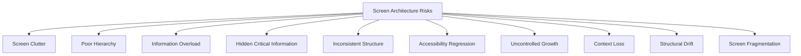

---

# Metrics

| Metric | Definition | Direction |
|---|---|---|
| **Screen Comprehension Rate** | % of citizens correctly identifying a screen's purpose within seconds of arrival, per usability testing. | Increasing |
| **Task Success Rate** | % of screen-mediated tasks reaching genuine completion, per `ai-docs/94`'s Flow Success Rate. | Increasing |
| **Time to Information** | Median time for a citizen to locate the specific content their goal requires. | Decreasing |
| **Content Discoverability** | % of genuinely available screen content a citizen can locate without external help. | Increasing |
| **Interaction Efficiency** | Number of interactions required to progress from a screen's arrival to its exit. | Decreasing, without compromising Hierarchy Clarity |
| **Accessibility Compliance** | % of screens meeting the WCAG 2.2 AA structural floor. | Increasing toward 100% |
| **Consistency Score** | % of screen categories behaving identically in structure across every Business Area that has one. | Increasing toward 100% |
| **Information Density Score** | Content volume per screen relative to its defined, justified budget per screen category. | Stable within a defined, evidenced threshold |
| **User Satisfaction** | Post-screen CSAT specific to structural clarity, per `ai-docs/60-customer-experience-strategy.md`. | Increasing |
| **Screen Learnability** | Rate at which a first-time citizen's screen comprehension approaches a returning citizen's. | Increasing |

> **Callout — No Screen Metric Stands Alone**
> Per the North Star Principle already established in `ai-docs/00-project-vision.md`, a decreasing Time to Information achieved by removing genuinely necessary content, or a rising Interaction Efficiency alongside falling Accessibility Compliance, is treated as a regression — never counted as success in isolation.

---

# Anti-Patterns

| Anti-Pattern | Description | Why It's Rejected |
|---|---|---|
| **Content Without Hierarchy** | Every element presented with equal visual and structural weight. | Violates Clear Information Priority; leaves a citizen to guess what matters. |
| **Visual Decoration Before Structure** | A screen's appeal depends on ornamentation rather than genuine organization. | Violates Content Before Decoration and Hierarchy Before Styling. |
| **Hidden Critical Actions** | The action a citizen most needs is visually or structurally subordinate to a secondary one. | Violates the Prioritization Rules under Screen Hierarchy directly. |
| **Inconsistent Screen Organization** | The same screen category is structured differently across modules. | Violates Cross-Screen Consistency and Trust Through Familiarity. |
| **Information Overload** | A screen presents more than a citizen can genuinely process at once. | Violates Minimal Cognitive Load and Progressive Disclosure. |
| **Context Switching** | A citizen loses track of their Task or position moving between screens. | Violates Context Preservation directly. |
| **Duplicate Information** | The same content is independently repeated in more than one Zone with no genuine reason. | Violates Single Source of Truth already established in `ai-docs/59-business-glossary.md`, applied here to screen content. |
| **Screen Sprawl** | New screen variants proliferate without a reuse check. | Violates Screen Governance's reuse-check requirement; produces Structural Drift. |
| **Accessibility Ignored** | A screen is legible and operable only for a sighted, literate, mouse-using citizen. | Violates Accessibility by Structure, the non-negotiable floor. |
| **Department-Centric Layouts** | A screen's structure mirrors an internal team's organization rather than a citizen's mental model. | Violates Structure Supports Tasks; mirrors the identical Department-Centric anti-patterns already rejected in `ai-docs/92` and `ai-docs/93`. |

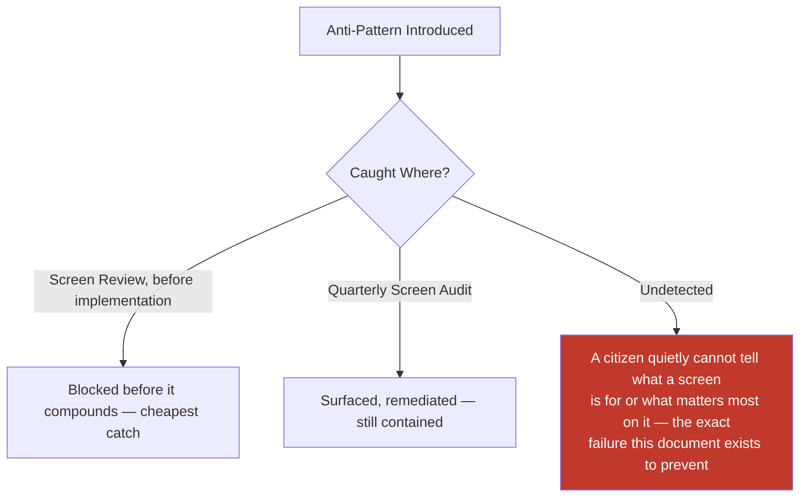

---

# Relationship to Previous Documents

| Prior Document | Relationship |
|---|---|
| **Project Vision (`ai-docs/00`)** | Establishes No Dead Ends, Progressive Complexity, and Inclusion over Optimization — this document's Screen Architecture Philosophy operationalizes each at the single-screen layer. |
| **Product Goals (`ai-docs/01`)** | Supplies the Target Audience device/literacy profile this document's Accessibility and Multi-Device sections are calibrated against. |
| **Engineering Principles (`ai-docs/02`)** | Supplies DRY, Consistency, and Single Source of Truth, applied here to screen structure rather than code. |
| **System Architecture Principles (`ai-docs/03`)** | Supplies the layered dependency discipline this document's Enterprise Screen Model areas mirror at the citizen-facing layer. |
| **Security Standards (`ai-docs/10`)** | Supplies the Least Privilege and Data Classification disciplines this document's role-based Progressive Disclosure honors. |
| **Performance Standards (`ai-docs/11`)** | Supplies the latency and bundle-size disciplines this document's Content Density standard is bound by. |
| **Accessibility Standards (`ai-docs/12`)** | Supplies the non-negotiable WCAG 2.2 AA floor this document's Accessibility section extends to the whole-screen structural layer. |
| **Documentation Standards (`ai-docs/24`)** | Supplies the Plain Language discipline this document's zone-content standards directly inherit. |
| **Architecture Decision Records (`ai-docs/25`)** | Supplies the governed-decision discipline a Major screen-pattern change follows. |
| **Engineering Governance & Decision Authority (`ai-docs/29`)** | Supplies the Decision Authority Matrix pattern this document's Screen Governance mirrors. |
| **Engineering Compliance & Audit Standards (`ai-docs/40`)** | Supplies the Evidence Quality Bar this document's Screen Audit is measured against. |
| **Engineering Architecture Governance Standards (`ai-docs/46`)** | Supplies the Board-and-Council governance pattern this document's Screen Architecture Council mirrors. |
| **Engineering Handbook Governance & Evolution Standards (`ai-docs/49`)** | Supplies the Version Management and Document Lifecycle disciplines this document's Screen Governance directly inherits. |
| **Product Vision & Business Strategy (`ai-docs/50`)** | Supplies the Strategic Expansion Principles this document's Scalability section is built around. |
| **User Personas & User Segmentation (`ai-docs/52`)** | Supplies the specific citizens (Meena, Lakshmi, Devendra) this document's Accessibility and Low Digital Literacy standards are calibrated against. |
| **Business Domain Model (`ai-docs/53`)** | Supplies the Domain Registry underlying every screen's business context. |
| **Product Module Catalog (`ai-docs/54`)** | Supplies the Module Registry and Reuse Strategy this document's Scalability section is built on. |
| **Business Capability Map (`ai-docs/55`)** | Supplies the stable capabilities every screen ultimately expresses to a citizen. |
| **User Journey Standards (`ai-docs/56`)** | Supplies the Journey State Model this document's Context Preservation extends to the finer-grained screen layer. |
| **Business Process Standards (`ai-docs/57`)** | Supplies the organizational sequence standing behind Administrative screens. |
| **Business Rules & Policies (`ai-docs/58`)** | Supplies the precise, enforceable logic (RULE-003, RULE-018, RULE-024, RULE-031, RULE-032) this document's every Hierarchy, Disclosure, and Status standard is bound by. |
| **Business Glossary (`ai-docs/59`)** | Supplies the singular vocabulary every screen's zone content must draw from. |
| **Customer Experience Strategy (`ai-docs/60`)** | Supplies the platform-wide felt-experience bar every screen must clear. |
| **District Ecosystem Mapping (`ai-docs/64`)** | Supplies the whole-system participant view this document's structural standards ultimately serve. |
| **Community & Social Engagement Strategy (`ai-docs/75`)** | Supplies the field-agent-assisted screen standard this document's Community consistency references. |
| **Search & Discovery Strategy (`ai-docs/77`)** | Supplies the Trust Before Ranking principle this document's AI-surfaced content placement is bound by. |
| **Trust & Safety Framework (`ai-docs/79`)** | Supplies the Trust Value Chain this document's Trust Through Familiarity principle is built directly on. |
| **Product Governance** | Supplies the governance-of-governance discipline this document's own Screen Governance section is held to. |
| **UX Vision & Experience Strategy (`ai-docs/90`)** | Supplies the Experience Principles (Clarity, Consistency, Respect) this document's Screen Architecture Philosophy directly extends to the whole-screen layer. |
| **Human-Centered Design Principles & UX Philosophy (`ai-docs/91`)** | Supplies the Design Decision Principles every screen standard in this document is evaluated against before publication. |
| **Information Architecture (`ai-docs/92`)** | Supplies the Enterprise Information Model and Content Taxonomy every screen's content ultimately draws from — screen architecture organizes, but never redefines, that content. |
| **Navigation Architecture & Wayfinding (`ai-docs/93`)** | Supplies the Wayfinding Principles and Enterprise Navigation Model this document's Context Zone and Navigation Area are built directly on top of. |
| **User Flow Standards (`ai-docs/94`)** | Supplies the Enterprise User Flow Model and Flow States this document's Screen Entry, Actions Area, and Exit Area operate within. |
| **Task Flow & Journey Optimization (`ai-docs/95`)** | Supplies the Continuous Improvement discipline this document's Screen Governance mirrors, and the measured baseline every screen-pattern optimization is validated against. |
| **Interaction Design Framework (`ai-docs/96`)** | Supplies the Enterprise Interaction Model, Interaction States, and System Feedback Framework this document's Status Area and Feedback Area directly house — the immediate predecessor whose individual interactions this document structurally organizes. |

### How Screen Architecture Completes Stage 3's Structural Chain

`ai-docs/92-information-architecture.md` decided what exists and where it belongs. `ai-docs/93-navigation-architecture-wayfinding.md` decided how a citizen moves toward it. `ai-docs/94-user-flow-standards.md` decided how a citizen accomplishes their goal once they arrive. `ai-docs/95-task-flow-journey-optimization.md` decided how that accomplishment keeps improving. `ai-docs/96-interaction-design-framework.md` decided how every individual action along the way behaves. This document is where all five converge onto the one surface a citizen actually perceives at any given moment — the screen — and decides, structurally, what is seen first, what matters most, and where everything else belongs. A screen built on a correct Information Architecture, reachable through correct Navigation, executing a correct Flow, continuously optimized, and composed of trustworthy Interactions can still confuse a citizen if it is not also correctly *architected* as a single, legible whole. This document exists to ensure that never happens, completing Stage 3's full chain from structure, to movement, to accomplishment, to improvement, to interaction, to the final, citizen-visible screen itself.

```mermaid
graph TD
    A[This Document<br/>Phase 98] -->|"operationalizes clarity from"| B[Project Vision<br/>Phase 1]
    A -->|"is calibrated against"| C[User Personas<br/>Phase 53]
    A -->|"is bound by the precise rules of"| D[Business Rules and Policies<br/>Phase 59]
    A -->|"is built on the trust chain of"| E[Trust and Safety Framework<br/>Phase 80]
    A -->|"extends the experience principles of"| F[UX Vision and Experience Strategy<br/>Phase 91]
    A -->|"is evaluated against"| G[Human-Centered Design Principles<br/>Phase 92]
    A -->|"organizes the content of"| H[Information Architecture<br/>Phase 93]
    A -->|"houses the wayfinding cues of"| I[Navigation Architecture and Wayfinding<br/>Phase 94]
    A -->|"structures the accomplishment of"| J[User Flow Standards<br/>Phase 95]
    A -->|"is validated against the measured baselines of"| K[Task Flow and Journey Optimization<br/>Phase 96]
    A -->|"structurally houses the interactions of"| L[Interaction Design Framework<br/>Phase 97]
```

---

# Executive Artifacts

### Enterprise Screen Architecture Framework

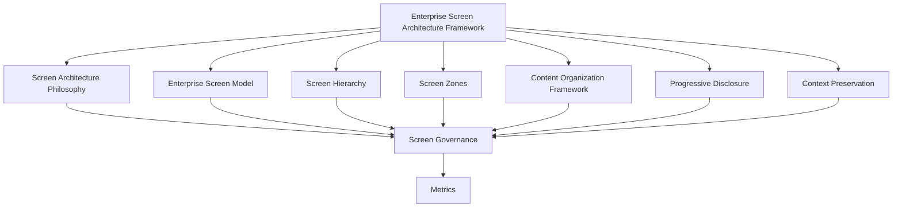

### Screen Architecture Lifecycle

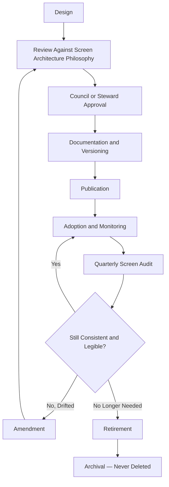

### Screen Zone Model

See Screen Zones section above — reproduced here by reference per Single Source of Truth, never duplicated.

### Screen Hierarchy Model

See Screen Hierarchy section above.

### Content Organization Framework

See Content Organization Framework section above.

### Progressive Disclosure Framework

See Progressive Disclosure section above.

### Screen Governance Framework

See Screen Governance section above.

### Screen Ownership Matrix

| Screen Category | Owner | Governance Authority |
|---|---|---|
| Citizen Services screens | CPO (delegate: Citizen Experience PM) | Screen Architecture Council |
| Government Services screens | Head of Government Partnerships | Council + Head of Government Partnerships |
| Agriculture / Healthcare / Education / Employment screens | Respective Vertical Head | Council |
| Marketplace / Property / Payments screens | Respective Vertical Head | Council (Payments: Mission Critical review) |
| Community / Emergency Services screens | Head of Community Engagement / Head of Trust & Safety | Council |
| Administration / Analytics screens | Head of Operations / Head of Data & Analytics | Council + Compliance |
| AI-mediated screens | Head of AI Platform | Council + AI Council (`ai-docs/78`) |
| Support screens | Head of Customer Success | Council |

### Screen Review Checklist

- [ ] Traceable to a genuine citizen goal within an existing Flow or Journey, never a technical or internal convenience.
- [ ] Every applicable Screen Area of the Enterprise Screen Model is present or explicitly marked not applicable.
- [ ] Exactly one Primary Content element is identifiable at a glance.
- [ ] The Critical Action is structurally and visually unmistakable from any Secondary Action.
- [ ] Content is organized per the Content Organization Framework, with no orphaned or misplaced element.
- [ ] Progressive Disclosure is applied — no screen forces Advanced or Background content into the first view.
- [ ] Context Preservation standards are satisfied — a citizen can answer "what was I doing" from the screen alone.
- [ ] Structurally accessible per the WCAG 2.2 AA floor, verified before any visual treatment is applied.
- [ ] Consistent with the equivalent screen pattern in every other Business Area that has one.
- [ ] Named, accountable owner assigned per the Screen Ownership Matrix.
- [ ] No anti-pattern present, per the Anti-Patterns table above.

### Screen Audit Framework

| Audit Dimension | What Is Checked | Cadence |
|---|---|---|
| Consistency | Same screen category structured identically across Business Areas | Quarterly |
| Hierarchy Clarity | Primary Content and Critical Actions are unambiguous on every audited screen | Quarterly |
| Accessibility Compliance | WCAG 2.2 AA structural floor met across every screen | Quarterly |
| Content Density | Screens remain within their defined, evidenced content budget | Quarterly |
| Context Preservation | Every multi-screen flow preserves citizen context between screens | Quarterly |
| Ownership Completeness | Every screen pattern has a current, active named owner | Quarterly |

### Screen Architecture Maturity Model

| Level | Name | Characteristics |
|---|---|---|
| **1 — Informal** | Screens vary by team; no shared structural model. | High variance; citizens relearn screen structure per module. |
| **2 — Developing** | The Enterprise Screen Model is documented; inconsistently applied. | Uneven adoption across verticals. |
| **3 — Defined** | This document's full model, hierarchy, and zones are applied consistently. | This document's standard is fully met. |
| **4 — Measured** | Screen Comprehension Rate, Consistency Score, and Accessibility Compliance are actively tracked against explicit thresholds. | Proactive, not reactive. |
| **5 — Optimized** | Screen Architecture actively informs product strategy and is genuinely replicable to a second district. | Screen structure is a durable civic and competitive advantage. |

Arwal's target state at this stage is **Level 3 (Defined)**, with **Level 4 (Measured)** targeted as analytics tooling from later phases matures.

### Screen Design Principles Matrix

| Principle | Primary Beneficiary | Conflict Resolution Priority |
|---|---|---|
| Accessibility by Structure | Vulnerable, low-literacy, rural citizens | Highest — never subordinated |
| Clear Information Priority | Every citizen | Highest — never subordinated |
| Context Preservation | Every citizen mid-Task | High |
| Trust Through Familiarity | Every citizen and institutional partner | High |
| Consistency Across Screens | Every citizen across every module | Medium-High |
| Minimal Cognitive Load | Every citizen, once safety and clarity are satisfied | Medium |
| Scalable Screen Organization | Future districts and future citizens | Medium |

### Enterprise Screen Decision Matrix

| Decision Type | Approval Authority |
|---|---|
| New reusable screen pattern | Screen Architecture Council + CPO |
| Business-Area-local screen variation | Business Area Steward + Council (informational) |
| Cross-module screen-consistency change | Council + affected Business Area Stewards |
| Screen-accessibility standard change | Council + Head of Accessibility & Inclusion |
| AI-surfaced content placement near RULE-024 | Council + AI Council, unanimous |

### Screen Structure Decision Tree

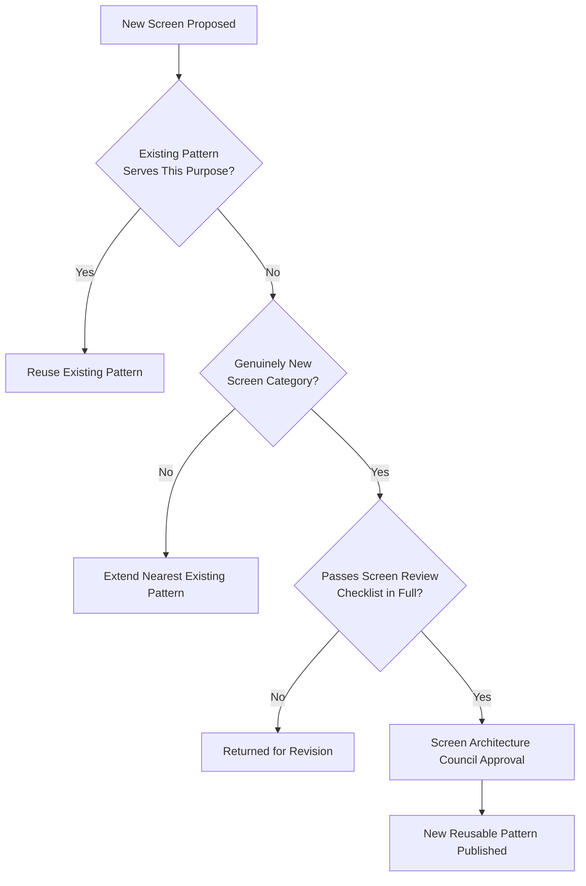

### Executive Dashboards (Conceptual)

| Dashboard | Audience | Key Content |
|---|---|---|
| **CXO/CPO Dashboard** | CXO, CPO | Screen Comprehension Rate, Consistency Score, Screen Architecture Maturity Level |
| **Business Area Steward Dashboard** | Vertical Heads | Time to Information, Information Density Score for their own area |
| **Accessibility Dashboard** | Head of Accessibility & Inclusion | Structural Accessibility Compliance trend across screens |
| **Government Partners Dashboard** | Government liaisons | Government Services screen consistency and comprehension trend |

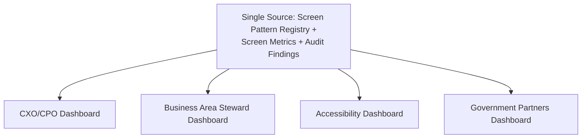

---

# Closing Statement

> **Callout — Closing Statement**
> Every prior document in this handbook explains what Arwal is, how it earns trust, how its information is organized, how a citizen moves through it, how a goal is accomplished, how that accomplishment improves, and how every individual action behaves. This document explains the one surface where all of that finally becomes visible at once: a single screen, seen for the first time, in the half-second before a citizen decides whether they understand it or not. A screen built on flawless information, correct navigation, a well-designed flow, continuous optimization, and honest interactions can still fail a citizen if it is structurally cluttered, if its hierarchy is unclear, or if the one thing they came to do is not the first thing they see. Screen Architecture is where every discipline in this handbook either becomes legible to a real person or quietly does not — and it is the standard every future screen, in every module, for every citizen, for as long as Arwal exists, is built to honor.

This document, `ai-docs/97-screen-architecture-standards.md`, is Phase 98 of approximately 425. Every future screen, layout decision, and content-placement choice is expected to trace back to a principle defined here, or to justify its deviation in writing.

**End of Phase 98 — `ai-docs/97-screen-architecture-standards.md`**