# Layout & Responsive Grid System

**Document:** `ai-docs/98-layout-responsive-grid-system.md`
**Project:** Arwal — The District Super App
**Stage:** 3 — Experience & Design Strategy
**Phase:** 99 — Layout & Responsive Grid System
**Status:** Approved for Executive & Enterprise Reference
**Audience:** CXO, CPO, Enterprise UX Architect, Enterprise Layout Architect, Responsive Design Strategists, Human-Centered Design Consultants, Government Digital Services Advisors, Accessibility Specialists, Enterprise Design Governance Leads, Digital Transformation Consultants, Enterprise Documentation Architects

> **Callout — Purpose of This Document**
> `ai-docs/97-screen-architecture-standards.md` established how everything on a single screen is structurally organized — what a citizen sees first, what matters most, and where everything else belongs. It deliberately stopped short of a different question: **once that structure is decided, how does it actually occupy space, and how does it hold together correctly across a five-inch entry-level phone, a shared tablet, a desktop government dashboard, and a public kiosk?** This document is that answer — the authoritative Layout & Responsive Grid System every future spatial, responsive, and device-adaptation decision traces back to.

---

# Purpose of this Document

### Why Layout Architecture Differs From Screen Architecture

`ai-docs/97-screen-architecture-standards.md` decided the *logical* structure of a screen — its ten Screen Areas, its Hierarchy tiers, its Zones. That structure is device-independent by design; it says nothing about how much physical space anything occupies, how content behaves when the viewport shrinks, or how a citizen's eye is guided through space rather than through a heading outline. Layout Architecture is where that logical structure becomes a genuinely spatial one — where Primary Content, Critical Actions, and Status signals are actually arranged, proportioned, and adapted so that the same logical screen remains legible whether it renders on a cracked entry-level Android phone in a field with one bar of signal or a desktop monitor in a district administration office. Screen Architecture decides *what belongs where, structurally*; Layout Architecture decides *how that structure occupies and adapts across physical space*.

### How Layout Supports Information Comprehension

A citizen does not read a screen the way a machine parses a heading tree — they scan it, spatially, guided by proximity, alignment, and rhythm long before they consciously process a single word. A Primary Content element that is logically first in `ai-docs/97`'s Hierarchy but spatially buried beneath dense, competing content has not actually communicated its priority to a real citizen. Layout is the mechanism that converts a correct logical hierarchy into a genuinely perceivable one — the same Hierarchy Before Styling principle already established in `ai-docs/97-screen-architecture-standards.md`, now given its spatial expression.

### How Responsive Layouts Improve Usability

Per `ai-docs/01-product-goals.md`'s Target Audience, Arwal's population spans an extreme range of device capability — from a feature-phone-adjacent Android handset to a desktop government workstation. A layout that behaves correctly only at one viewport width has, by construction, failed a meaningful share of that population. Responsive Adaptation is not a cosmetic accommodation layered on afterward — it is the mechanism by which the identical logical screen remains genuinely usable, not merely visible, across every device a real citizen actually owns.

### How Spatial Consistency Reduces Cognitive Load

A citizen who has learned that the Critical Action always sits in a predictable spatial position, that related content is always grouped with consistent proximity, and that whitespace always separates genuinely distinct sections, spends no conscious effort re-learning a new screen's spatial logic — that effort is available instead for their actual task. This is `ai-docs/56-user-journey-standards.md`'s Minimal Cognitive Load principle, expressed now as the physical, repeatable rhythm of space itself, mirroring the identical Consistency discipline already established throughout `ai-docs/90` through `ai-docs/97`.

### How Layouts Contribute to Accessibility

A layout's spatial order and a screen's logical reading order must correspond — a citizen using a screen reader experiences content in the order it is structurally defined, and a sighted citizen experiences content in the order it is spatially arranged; where these two orders diverge, one of the two citizens is experiencing a platform that does not match the other's. Layout Architecture is therefore one of the primary places WCAG 2.2 AA compliance is won or lost, per the non-negotiable floor already established in `ai-docs/12-accessibility-standards.md` — a correct visual layout with a mismatched reading order is not accessible, regardless of how attractive it appears.

### How Responsive Design Supports Future Platform Growth

Per `ai-docs/50-product-vision-business-strategy.md`'s Strategic Expansion Principles, a second district and, eventually, a state-level deployment inherit Arwal's spatial reasoning, never an unexamined pixel arrangement. A layout system built around durable, technology-independent proportional and spatial principles travels intact to a new district's device profile and language; a layout grown as an accumulation of screen-specific, device-specific fixes does not. Grid-based, proportional thinking is what lets tomorrow's two hundred additional modules and a future foldable or ambient device category be absorbed without a structural rewrite.

### How Layout Standards Improve Enterprise Consistency

A layout pattern approved once and reused everywhere its purpose recurs is what lets `ai-docs/97`'s Cross-Screen Consistency actually hold true in practice — a citizen who has learned the spatial shape of a Marketplace checkout screen should recognize, without instruction, the spatial shape of an unfamiliar Healthcare payment screen, because the same Grid, Spacing, and Density standards govern both, mirroring the Reuse Strategy already established in `ai-docs/54-product-module-catalog.md`.

### The Chain of Reasoning This Document Completes

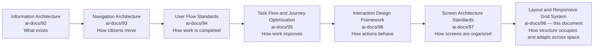

| Layer | Question It Answers |
|---|---|
| Information Architecture | What exists, and where does it belong? |
| Navigation Architecture & Wayfinding | How does a citizen move? |
| User Flow Standards | How does a citizen complete work? |
| Task Flow & Journey Optimization | How does that work get better over time? |
| Interaction Design Framework | How does every individual action behave? |
| Screen Architecture Standards | How is everything on one screen structurally organized? |
| **Layout & Responsive Grid System** (this document) | **How does that structure actually occupy, proportion, and adapt spatially across every device a citizen might use?** |

### Scope Boundary

This document contains no CSS Grid, no Flexbox, no Tailwind CSS, no Bootstrap, no pixel-based breakpoints, no frontend code, no backend code, no React, no Next.js, no APIs, and no implementation detail of any kind. Every one of those remains the deliberate territory of a future, technology-facing phase building explicitly on top of this one. This document's exclusive territory is: **why layout architecture is a distinct discipline, the enterprise layout model, grid principles, responsive adaptation, spacing and alignment, layout density, multi-device layout principles, cross-module consistency, accessibility, scalability, and governance** — the spatial standard every future technical implementation must express faithfully, never redefine independently.

---

# Layout Philosophy

Every principle below exists because a layout assembled carelessly does not fail abstractly — it fails a specific citizen whose screen, correct in structure, became unreadable or unusable the moment it rendered on their actual device.

### Structure Before Styling
**Why it exists:** A layout's spatial arrangement is derived from `ai-docs/97`'s Screen Hierarchy and Zones before any visual treatment is chosen — a layout decision that only becomes coherent once a specific color or font is applied has no genuine spatial logic of its own.

### Consistency Across Devices
**Why it exists:** The same logical screen must feel like the same platform regardless of which device renders it — a citizen moving from a shared household phone to a desktop kiosk should never experience Arwal as two different products, mirroring the identical Consistency principle already established throughout `ai-docs/90` through `ai-docs/97`.

### Content-First Layouts
**Why it exists:** Space is allocated to serve the content and actions a citizen's goal genuinely requires — never to a decorative arrangement that happens to look complete, restating `ai-docs/97`'s Content Before Decoration principle at the spatial layer.

### Spatial Hierarchy
**Why it exists:** Proximity, scale, and position communicate priority before a citizen reads a single word — a layout's spatial hierarchy must match, never contradict, the logical Screen Hierarchy already established in `ai-docs/97`.

### Balanced Density
**Why it exists:** A layout holds neither too little content (wasting a citizen's limited attention span on excess scrolling) nor too much (overwhelming their genuine capacity to process it) — density is calibrated deliberately, per Layout Density Standards below, never left to whatever happens to fit.

### Predictable Alignment
**Why it exists:** Elements align to a consistent, invisible structure a citizen never consciously perceives but always benefits from — misaligned content signals, even subconsciously, that a platform was not built with care.

### Scalable Grid Systems
**Why it exists:** A grid designed for today's twenty modules and known device profiles must gracefully absorb the next two hundred modules and an unknown future device category, per the same Future Scalability discipline already established in `ai-docs/92` through `ai-docs/97`.

### Accessibility Through Layout
**Why it exists:** A layout's spatial order and a screen's logical reading order must correspond exactly — accessibility is won or lost at the layout layer before a single accessible component exists, per the non-negotiable floor already established in `ai-docs/12-accessibility-standards.md`.

### Flexible Adaptation
**Why it exists:** A layout adapts to its actual rendering context — device, orientation, connectivity — never assuming a single, fixed canvas, mirroring `ai-docs/93-navigation-architecture-wayfinding.md`'s Responsive Navigation principle extended here to full spatial composition.

### Minimal Cognitive Load
**Why it exists:** Every layout decision is evaluated against whether it reduces or increases the effort a citizen spends simply locating what they need, per `ai-docs/56-user-journey-standards.md`'s Minimal Cognitive Load principle applied at the spatial layer.

### Responsive Consistency
**Why it exists:** A layout that adapts to a smaller viewport reduces or reorganizes content — it never silently hides a citizen's genuine capability or Critical Action purely because a device is smaller, mirroring `ai-docs/93`'s Responsive Navigation standard that no destination is omitted on a smaller screen.

### Enterprise Maintainability
**Why it exists:** A stable, documented, governed layout standard is the precondition for a future designer, unfamiliar with today's reasoning, to build a new screen correctly across every device Arwal will ever support, per the identical Long-Term Maintainability discipline already established in `ai-docs/92` through `ai-docs/97`.

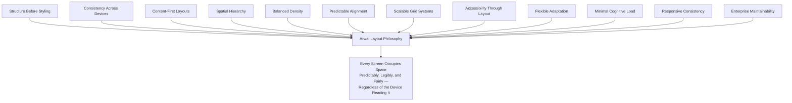

> **Callout — The One-Sentence Layout Philosophy**
> *"A screen that is structurally correct but spatially unreadable on the device a citizen actually owns has not been built for that citizen at all."*

---

# Enterprise Layout Model

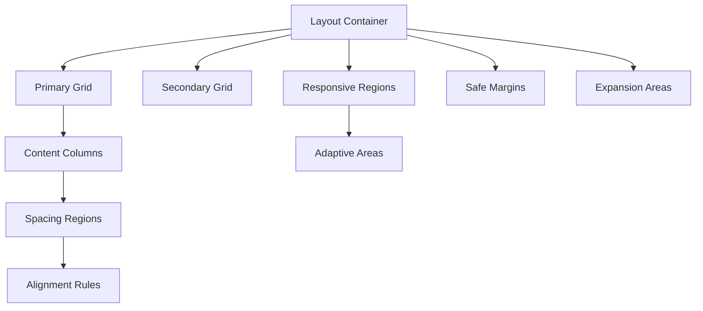

| Element | Purpose | Ownership | Success Criteria |
|---|---|---|---|
| **Layout Container** | The outermost spatial boundary a screen's content occupies, scoped to the citizen's actual viewport. | Enterprise UX Architect | Content never exceeds or is clipped by its own container across any supported device. |
| **Primary Grid** | The dominant structural grid a screen's Primary and Secondary Content Zones (per `ai-docs/97`) are placed within. | Business Area Steward | Primary Content occupies the grid's most prominent proportional position on every device. |
| **Secondary Grid** | A subordinate grid nested within or adjacent to the Primary Grid, hosting Supporting Information and Secondary Actions. | Business Area Steward | Never competes visually or proportionally with the Primary Grid. |
| **Content Columns** | The proportional divisions a grid is composed of, into which content is placed. | Journey Product Owner | Column count and width scale predictably with viewport, never arbitrarily. |
| **Spacing Regions** | The deliberate gaps separating columns, rows, and content groups. | Enterprise UX Architect | Consistent spacing scale applied uniformly, per the Spacing & Alignment Framework below. |
| **Alignment Rules** | The invisible lines every element's edges and baselines are held to. | Business Area Steward | No element floats independently of the shared alignment structure. |
| **Responsive Regions** | Areas of a layout explicitly designed to reorganize as viewport conditions change. | Enterprise UX Architect | Reorganization preserves Screen Hierarchy; nothing is silently lost. |
| **Adaptive Areas** | Content regions whose visibility or prominence shifts based on device, role, or context, per Progressive Disclosure (`ai-docs/97`). | Journey Product Owner | Adaptation always serves the citizen's genuine need, never engineering convenience. |
| **Safe Margins** | Structural buffers protecting content from being obscured by device chrome, notches, or assistive-technology overlays. | Enterprise UX Architect | Critical content and actions are never rendered inside an unsafe margin. |
| **Expansion Areas** | Reserved spatial headroom allowing a future module or content type to be absorbed without redesigning the grid itself. | Enterprise UX Architect | A new module fits within existing Expansion Areas in the overwhelming majority of cases. |

### Relationships

The Layout Container is the sole ancestor of every other element in this model — the Primary and Secondary Grids exist within it, Content Columns exist within those grids, and Spacing Regions and Alignment Rules govern the relationships between every element at every level. Responsive Regions and Adaptive Areas are cross-cutting concerns applied to any element in the hierarchy, never a separate, parallel layout system of their own. Where an element is genuinely not needed for a specific screen (a simple confirmation screen may have no Secondary Grid), it is explicitly marked absent, mirroring the identical discipline already established in `ai-docs/94-user-flow-standards.md` and `ai-docs/97-screen-architecture-standards.md`.

---

# Grid Principles

| Principle | Enterprise Standard |
|---|---|
| **Grid Consistency** | The same proportional grid logic applies across every Business Area — a grid is never independently reinvented per module. |
| **Column Organization** | Columns are allocated in proportion to content priority, per `ai-docs/97`'s Screen Hierarchy — Primary Content never shares a column's proportional weight with Supporting Information. |
| **Row Organization** | Rows sequence content in the citizen's natural reading and reasoning order, never in the order a database happens to return fields. |
| **Content Alignment** | Every element aligns to the shared grid's column and row structure — nothing is positioned by visual instinct alone. |
| **Content Flow** | Content flows in a single, predictable direction matching the citizen's reading order, never requiring the eye to jump unpredictably across the layout. |
| **Visual Rhythm** | A consistent, repeating spatial pattern (spacing, alignment, proportion) is established once and honored throughout a screen, giving a citizen an implicit, felt sense of order. |
| **Whitespace Philosophy** | Empty space is a deliberate structural tool — separating distinct content groups and giving the eye rest — never an accident of unused space. |
| **Proportional Layout** | Relative proportion, not fixed measurement, governs how space is divided, so the same relationships hold true regardless of viewport size. |
| **Structural Balance** | No single region of a screen is disproportionately dense or empty relative to its actual content need. |
| **Layout Predictability** | A citizen who has learned one screen's grid logic can correctly predict an unfamiliar screen's grid logic, per `ai-docs/93`'s Trust Through Predictability principle extended to spatial structure. |

> **Callout — Why Grids Improve Usability, Not Merely Aesthetics**
> A grid is not a decorative constraint — it is the mechanism that lets a citizen's eye locate related content without conscious searching. A citizen scanning a grid-organized screen unconsciously predicts where the next piece of relevant content will be, because the grid has trained that expectation on every prior screen sharing the same logic. This is the spatial equivalent of `ai-docs/93-navigation-architecture-wayfinding.md`'s Recognition Over Recall principle — a citizen recognizes the pattern rather than having to relearn it.

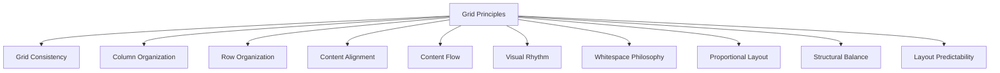

---

# Responsive Adaptation

| Context | Enterprise Standard |
|---|---|
| **Mobile Adaptation** | The Primary Grid collapses to a single, dominant column; Content Columns stack in priority order; the Critical Action remains reachable without excessive scrolling, per `ai-docs/93`'s Mobile Navigation discipline. |
| **Tablet Adaptation** | Additional proportional width may reveal a Secondary Grid alongside the Primary Grid without displacing it — never at the cost of Hierarchy clarity. |
| **Desktop Adaptation** | Greater available space is used to reduce reliance on Progressive Disclosure interaction, never to introduce content unrelated to the screen's Primary purpose. |
| **Large Display Adaptation** | A shared or presentation-style large display preserves the identical grid logic, with an added structural allowance for readability at distance. |
| **Public Kiosk Adaptation** | Layout defaults to the most conservative density and largest touch targets, given a public, potentially unassisted, time-limited citizen interaction. |
| **Accessibility Adaptation** | The Layout Container's reading order is the *primary* experience for a screen-reader or switch-access citizen — never a secondary accommodation calculated after a visual layout is finalized. |
| **Offline Adaptation** | The layout shell — grid, spacing, and structural regions — renders immediately, with content populating as it becomes available, per `ai-docs/00-project-vision.md`'s Offline-First commitment. |
| **Future Device Adaptation** | A genuinely new device category is evaluated against the Enterprise Layout Model's proportional logic before any device-specific accommodation is designed, never against novelty alone. |

> **Callout — The Same Experience, Not the Same Pixels**
> Responsive Adaptation never means a citizen on a smaller device receives a lesser experience — it means the identical logical screen, with its identical Screen Hierarchy intact, is proportionally reorganized so that every genuine capability remains reachable. A destination or action omitted purely because a viewport is small is a layout failure, never an acceptable trade-off, mirroring `ai-docs/93-navigation-architecture-wayfinding.md`'s Responsive Navigation standard exactly.

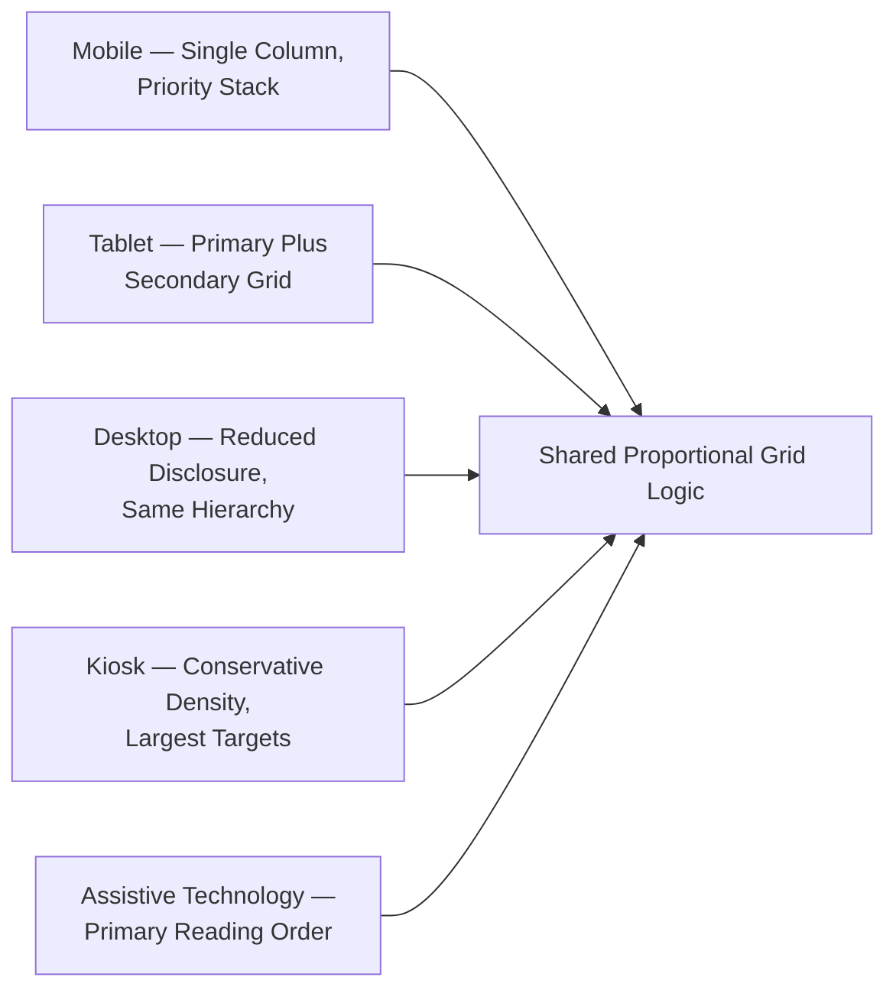

---

# Spacing & Alignment Framework

| Standard | Description |
|---|---|
| **Spacing Hierarchy** | A small set of proportionally related spacing values governs every gap on the platform — never an arbitrary, per-screen spacing choice. |
| **Content Separation** | Individually related pieces of content are separated by the smallest spacing value, signaling their close relationship. |
| **Section Separation** | Distinct sections are separated by a visibly larger spacing value than content within a section, so grouping is perceivable without a citizen reading a single word. |
| **Component Separation** | Interactive elements maintain sufficient separation to prevent an accidental adjacent selection, extending `ai-docs/12-accessibility-standards.md`'s Touch Target Sizes to the spatial relationships between targets. |
| **Alignment Consistency** | Every element's edge aligns to the same shared grid structure across every screen sharing a pattern. |
| **Visual Rhythm** | Spacing and alignment together produce a repeating, predictable cadence a citizen unconsciously relies on to parse a screen quickly. |
| **Whitespace Management** | Whitespace is allocated deliberately to separate, emphasize, and give visual rest — never treated as leftover space to be filled. |
| **Reading Comfort** | Line length, spacing, and grouping are calibrated so sustained reading (a scheme's eligibility rules, a certificate's requirements) does not fatigue a citizen. |
| **Balanced Composition** | No single area of a screen appears crowded while an adjacent area appears sparse without a genuine, content-driven reason. |
| **Adaptive Spacing** | Spacing scales proportionally with viewport and density mode, never fixed absolutely regardless of context. |

> **Callout — Spacing Is Information, Not Decoration**
> The distance between two elements tells a citizen, before they read either one, whether those elements are related. A layout that spaces unrelated content closely together, or related content far apart, actively misleads a citizen's spatial reasoning — this is why Spacing and Alignment are governed with the same rigor as content itself, never treated as a cosmetic afterthought.

---

# Layout Density Standards

| Density Mode | Standard |
|---|---|
| **Comfortable Density** | The default for citizen-facing discovery and browsing screens — generous spacing favoring ease of scanning over information volume per view. |
| **Compact Density** | Reserved for a citizen's own returning, frequent-use context (an order history, a transaction list) where familiarity permits a denser, more efficient view. |
| **Data-Dense Layouts** | Used only where a genuine need for simultaneous comparison exists (an officer's case queue, an analytics dashboard) — never applied to a citizen-facing discovery screen by default. |
| **Task-Focused Layouts** | Density is minimized during active Task Execution (per `ai-docs/94`'s Enterprise User Flow Model) so a citizen's attention is not divided. |
| **Reading-Focused Layouts** | Reference and Knowledge content (per `ai-docs/92`'s classification) uses Comfortable Density with generous line spacing, prioritizing comprehension over compactness. |
| **Administrative Interfaces** | May adopt Compact or Data-Dense modes where a government officer or internal operator's genuine efficiency need justifies it — never at the cost of the Clarity standard already established in `ai-docs/96-interaction-design-framework.md`. |
| **Citizen Interfaces** | Default to Comfortable Density as a floor, given `ai-docs/01-product-goals.md`'s low-literacy, first-generation-smartphone Target Audience. |
| **Accessibility Density** | A citizen may select a lower-density, larger-target mode regardless of the screen's default, per `ai-docs/12-accessibility-standards.md`'s Settings-level accessibility toggles. |
| **Adaptive Density** | Density may adjust to viewport size, but never below the Comfortable Density floor for a citizen-facing screen on any device. |
| **Future Density Models** | A genuinely new density need (a future ambient or voice-primary interface) is evaluated against this document's Philosophy before a new mode is approved. |

> **Callout — Density Is a Trade-Off, Never a Default Maximized**
> More content per screen is not inherently better — every increase in density is a deliberate trade against readability, made only where a specific, evidenced citizen or officer need justifies it, never chosen because it was technically possible to fit more in.

---

# Multi-Device Layout Principles

| Device Category | Layout Principle |
|---|---|
| **Mobile Phones** | The primary design target — the Enterprise Layout Model's single-column mobile pattern is the baseline every other device adapts upward from, per `ai-docs/01-product-goals.md`'s device profile. |
| **Large Phones** | The same single-column baseline, with proportionally increased spacing rather than an entirely new column structure. |
| **Tablets** | The first viewport where a genuine Secondary Grid may appear alongside the Primary Grid without compromising Hierarchy. |
| **Laptops** | Full multi-column proportional layout, with Progressive Disclosure reduced relative to mobile, never eliminated. |
| **Desktop Monitors** | The same proportional grid logic, scaled with generous whitespace rather than simply expanded content volume. |
| **Large Displays** | Identical grid logic with increased scale for distance readability, used for shared or presentation contexts. |
| **Public Information Kiosks** | Conservative density, maximum touch-target size, and minimal reliance on Progressive Disclosure, given an unassisted, time-pressured citizen. |
| **Assistive Devices** | The Layout Container's logical reading order — never its visual arrangement — is the primary experience, per Accessibility below. |
| **Foldable Devices** | The layout gracefully reflows between single- and multi-column states as the physical viewport changes, without content loss or an unrecoverable state. |
| **Future Device Categories** | Evaluated against the Enterprise Layout Model's proportional and hierarchical logic before any bespoke accommodation is designed. |

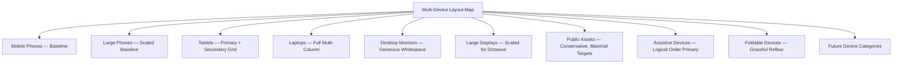

---

# Cross-Module Layout Consistency

The same Enterprise Layout Model, Grid Principles, and Density Standards repeat identically across every Business Area — differing only in the specific content occupying the grid, never in its spatial logic.

| Business Area | Layout Consistency Expression |
|---|---|
| **Citizen Services** | Profile and settings screens use Comfortable Density with the identical single-column mobile pattern as any transacting screen. |
| **Agriculture** | A price-check screen's Primary Grid holds the price prominently, with the same proportional weighting as a Healthcare booking confirmation. |
| **Healthcare** | Appointment screens use Task-Focused density during booking, shifting to Comfortable density for post-booking reference content. |
| **Education** | Tutor discovery uses the identical grid and card-proportion logic as Marketplace product discovery. |
| **Employment** | Listing screens share their Column Organization and Spacing Hierarchy with Property listing screens. |
| **Marketplace** | Checkout defines the platform's strictest Alignment and Spacing discipline, inherited by every other payment-bearing screen. |
| **Property** | Listing-detail screens share their Secondary Grid placement of Supporting Information with any other verified-listing screen. |
| **Payments** | Every payment-bearing screen honors identical Spacing and Density standards, with no vertical-specific exception. |
| **Community** | Group-registration screens use Comfortable Density with the field-agent-assisted layout pattern shared with Agriculture's assisted screens. |
| **Emergency Services** | Uses the platform's most conservative density and largest touch targets, given the stakes. |
| **Administration** | May adopt Compact or Data-Dense modes for genuine officer efficiency, while sharing the identical Grid Principles as any citizen-facing screen. |
| **AI Services** | AI-surfaced content occupies a structurally consistent Secondary Grid position across every Business Area it mediates. |
| **Analytics** | Internal dashboards use Data-Dense layouts, sharing the same underlying proportional grid logic as citizen-facing screens. |
| **Support** | Escalation screens preserve the identical Comfortable Density and spacing as the originating citizen-facing flow. |

> **Callout — Module Content Varies; Layout Logic Never Does**
> Module Independence (`ai-docs/54-product-module-catalog.md`) governs what a screen contains. Cross-Module Layout Consistency governs how that content occupies and is proportioned in space. A citizen who has never opened Healthcare should still correctly predict its spatial rhythm purely from having used Marketplace — because the underlying grid, spacing, and density logic, not the domain content, is what repeats.

---

# Accessibility

| Standard | Requirement |
|---|---|
| **Logical Reading Order** | A layout's spatial arrangement matches its underlying logical reading order exactly — a screen-reader user and a sighted user must experience content in the identical sequence. |
| **Visual Hierarchy** | Priority is conveyed through more than position alone — size, spacing, and grouping reinforce Hierarchy independently of any single visual cue. |
| **Content Reflow** | Content reflows correctly from a 320px viewport upward with no horizontal scrolling required, per `ai-docs/12-accessibility-standards.md`'s Reflow standard. |
| **Zoom Compatibility** | A layout remains fully usable at 200% zoom and up to 400% text-only zoom, with no clipped or overlapping content. |
| **Keyboard Navigation** | The layout's tab order matches its visual and logical order exactly, per `ai-docs/12`'s Keyboard Navigation Standards. |
| **Screen Readers** | Every Layout Region maps to a genuine semantic landmark, never a purely visual grouping with no structural equivalent. |
| **Motor Accessibility** | Spacing between interactive elements meets the minimum separation standard already established in `ai-docs/12`'s Mobile Accessibility section. |
| **Cognitive Accessibility** | A layout never demands a citizen hold more than one new spatial relationship in mind at once. |
| **Low Vision** | High-contrast, large-target layout modes are available and preserve the identical grid logic, per `ai-docs/12`'s Visual Accessibility standards. |
| **Low Digital Literacy** | Comfortable Density and generous spacing are the default for every citizen-facing screen, never an opt-in accommodation. |
| **WCAG Alignment** | Every layout standard above meets or exceeds WCAG 2.2 AA, the floor already established in `ai-docs/12-accessibility-standards.md`, never treated as an aspirational target. |

---

# Layout Governance

### Ownership
Every layout pattern has exactly one named accountable owner — the Enterprise UX Architect for platform-wide patterns, the Business Area Steward for local variations — mirroring the Clear Ownership discipline already established throughout `ai-docs/53` through `ai-docs/97`.

### Layout Governance Council
A standing **Layout Governance Council** — chaired by the Enterprise UX Architect, with the CPO, Head of Accessibility & Inclusion, and rotating Business Area layout stewards as members — holds approval authority over any platform-wide grid, spacing, or density change, and any material Anti-Pattern deviation. The Council meets monthly, with ad hoc sessions for a Layout Consistency Score regression.

### Decision Authority

| Decision | Approves |
|---|---|
| New reusable layout pattern | Layout Governance Council + CPO |
| Business-Area-local layout variation | Business Area Steward + Council (informational) |
| Cross-module layout-consistency change | Council + affected Business Area Stewards |
| Layout-accessibility standard change | Council + Head of Accessibility & Inclusion |
| New device-category adaptation | Council + Enterprise UX Architect |

### Reviews, Documentation, and Audits
Every new or materially changed layout pattern passes a documented review against this document's Layout Philosophy, Grid Principles, and Accessibility standards before implementation. A Layout Audit — checking Consistency, Alignment, Density Appropriateness, and Accessibility Compliance — runs quarterly, distinct from and complementary to the Screen Audit already established in `ai-docs/97-screen-architecture-standards.md`.

### Version Control
Every layout standard and pattern change is versioned (Major.Minor.Patch), mirroring `ai-docs/49-engineering-handbook-governance-evolution-standards.md`'s Version Management — a Major change (a new grid proportion, a changed density floor) requires Council approval; a Minor or Patch change does not.

### Continuous Improvement
Every Layout Metric finding feeds a shared, tracked improvement backlog, reviewed at the next Council meeting, per the identical Continuous Improvement Loop already established throughout `ai-docs/60` through `ai-docs/97`. No consequential layout-pattern change is approved by Product alone — Engineering, Accessibility, and Trust & Safety all participate before a Major change proceeds.

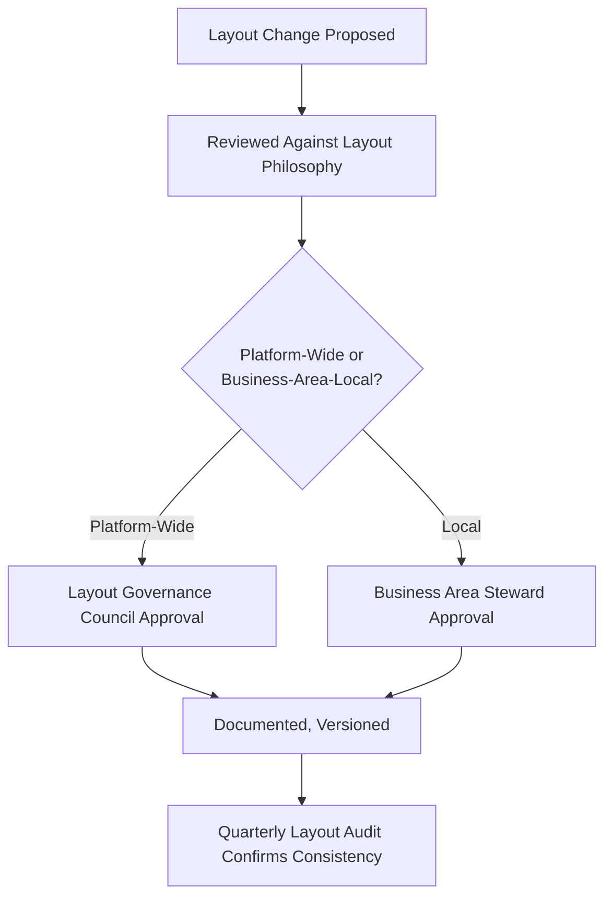

---

# Scalability

| Dimension | How Layout & Responsive Grid System Supports It |
|---|---|
| **Future Modules** | A new Module occupies the existing Enterprise Layout Model's Expansion Areas wherever possible, per `ai-docs/54`'s Reuse Strategy — the grid is never redesigned per new module. |
| **Future Services** | A new government service is expressed through an existing layout pattern for its category, never a bespoke spatial structure. |
| **Future Districts** | A second district's content populates the existing grid and density standards unchanged, per `ai-docs/50`'s Configuration-Driven Expansion Model. |
| **Future States** | The same proportional Enterprise Layout Model extends to a state-level deployment without structural redesign. |
| **Localization** | Proportional, non-fixed spacing accommodates longer or shorter translated text without breaking alignment. |
| **Internationalization** | The Enterprise Layout Model is technology- and geography-independent, supporting expansion beyond a single state. |
| **AI Integration** | AI-surfaced content occupies existing Adaptive Areas, never a parallel layout system of its own. |
| **Enterprise Expansion** | The layered model absorbs growth in layout-pattern count without requiring the model itself to change. |
| **Platform Evolution** | A genuinely novel layout need is evaluated against this document's Philosophy before a new pattern is approved. |
| **Long-Term Maintainability** | A stable, documented, governed layout standard is the precondition for a future designer, unfamiliar with today's reasoning, to build correctly across every device. |

---

# Risks

| Risk | Description | Mitigation |
|---|---|---|
| **Layout Fragmentation** | Different Business Areas independently invent incompatible spatial logic. | Cross-Module Layout Consistency; Quarterly Layout Audit. |
| **Inconsistent Alignment** | Elements drift from the shared grid over time. | Alignment Rules enforced at Layout Review. |
| **Crowded Interfaces** | Density exceeds a citizen's genuine capacity to process a screen. | Layout Density Standards; Comfortable Density floor for citizen-facing screens. |
| **Poor Whitespace Usage** | Whitespace is either eliminated to fit more content or left as unintentional clutter. | Whitespace Philosophy; Structural Balance principle. |
| **Accessibility Regression** | A layout change silently breaks reading order or zoom behavior. | Mandatory Accessibility Audit before any layout-pattern change ships. |
| **Device-Specific Design** | A layout is designed for one device and awkwardly retrofitted to others. | Mobile-baseline-first Multi-Device Layout Principles. |
| **Rigid Layouts** | A fixed, non-proportional layout breaks at an unanticipated viewport. | Proportional Layout principle; Responsive Adaptation standards. |
| **Content Overflow** | Content exceeds its allocated region, clipping or breaking the grid. | Safe Margins; mandatory reflow verification at Layout Review. |
| **Visual Imbalance** | One region of a screen is disproportionately dense relative to another. | Structural Balance; Quarterly Layout Audit. |
| **Layout Drift** | A pattern's actual implementation silently diverges from its documented standard over time. | Version Control on every structural change; Quarterly Layout Audit. |

---

# Metrics

| Metric | Definition | Direction |
|---|---|---|
| **Layout Consistency Score** | % of layout categories behaving identically in structure across every Business Area that has one. | Increasing toward 100% |
| **Content Discoverability** | % of citizens locating a specific, genuinely available screen element without external help. | Increasing |
| **Reading Efficiency** | Time required for a citizen to correctly parse a screen's Primary Content. | Decreasing |
| **Task Completion Efficiency** | Interactions required to progress through a layout-mediated task, per `ai-docs/94`'s Flow metrics. | Decreasing, without compromising Density floors |
| **Accessibility Compliance** | % of layouts meeting the WCAG 2.2 AA floor. | Increasing toward 100% |
| **Responsive Consistency** | % of screens preserving identical Hierarchy and content availability across every supported device. | Increasing toward 100% |
| **Visual Balance Score** | Deviation of any single screen region from its defined, justified density budget. | Stable within evidenced thresholds |
| **Information Density Score** | Content volume per screen relative to its category's density standard. | Stable within defined, evidenced thresholds |
| **User Satisfaction** | Post-screen CSAT specific to spatial clarity, per `ai-docs/60-customer-experience-strategy.md`. | Increasing |
| **Layout Learnability** | Rate at which a first-time citizen's spatial comprehension approaches a returning citizen's. | Increasing |

> **Callout — No Layout Metric Stands Alone**
> Per the North Star Principle already established in `ai-docs/00-project-vision.md`, a rising Task Completion Efficiency achieved by exceeding a Density floor, or a rising Content Discoverability alongside falling Accessibility Compliance, is treated as a regression — never counted as success in isolation.

---

# Anti-Patterns

| Anti-Pattern | Description | Why It's Rejected |
|---|---|---|
| **Layout Without Hierarchy** | Every region given equal spatial weight regardless of content priority. | Violates Spatial Hierarchy; leaves a citizen to guess what matters. |
| **Crowded Interfaces** | Content density exceeds a citizen's genuine processing capacity. | Violates Balanced Density and Minimal Cognitive Load. |
| **Inconsistent Alignment** | Elements drift from the shared grid across screens. | Violates Predictable Alignment and Trust Through Familiarity (`ai-docs/97`). |
| **Whitespace Misuse** | Whitespace either eliminated entirely or left as accidental clutter. | Violates Whitespace Philosophy. |
| **Desktop-Only Thinking** | A layout designed first for a large viewport, retrofitted downward. | Violates Mobile-baseline Multi-Device Layout Principles, given `ai-docs/01`'s device profile. |
| **Mobile-Only Thinking** | A layout that fails to use additional space productively on larger viewports. | Violates Flexible Adaptation and Desktop Adaptation standards. |
| **Rigid Fixed Layouts** | A layout that breaks or clips at an unanticipated viewport width. | Violates Proportional Layout and Scalable Grid Systems. |
| **Visual Balance Ignored** | One screen region disproportionately dense relative to an adjacent one with no content-driven reason. | Violates Structural Balance. |
| **Accessibility Ignored** | A layout's reading order diverges from its visual order. | Violates Accessibility Through Layout, the non-negotiable floor. |
| **Module-Specific Layout Rules** | A Business Area invents its own spatial logic rather than reusing the Enterprise Layout Model. | Violates Consistency Across Devices and Enterprise Maintainability. |

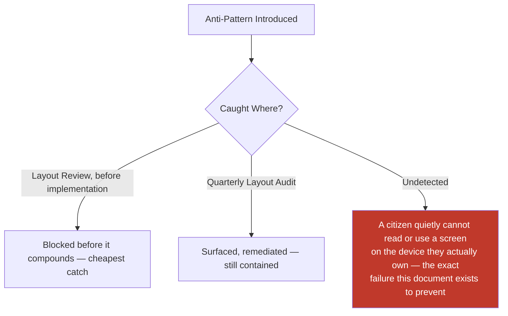

---

# Relationship to Previous Documents

| Prior Document | Relationship |
|---|---|
| **Project Vision (`ai-docs/00`)** | Establishes Design for the Slowest Device and Weakest Signal, and Inclusion over Optimization — this document's Layout Philosophy operationalizes both at the spatial layer. |
| **Product Goals (`ai-docs/01`)** | Supplies the Target Audience device profile this document's Multi-Device Layout Principles are calibrated against. |
| **Engineering Principles (`ai-docs/02`)** | Supplies DRY and Single Source of Truth, applied here to layout patterns rather than code. |
| **System Architecture Principles (`ai-docs/03`)** | Supplies the layered dependency discipline this document's Enterprise Layout Model mirrors structurally. |
| **Security Standards (`ai-docs/10`)** | Supplies the Least Privilege discipline behind Adaptive Areas' role-based visibility. |
| **Performance Standards (`ai-docs/11`)** | Supplies the bundle-size and rendering-budget targets this document's density and reflow standards are bound by. |
| **Accessibility Standards (`ai-docs/12`)** | Supplies the non-negotiable WCAG 2.2 AA floor this document's Accessibility section extends to the spatial layer. |
| **Documentation Standards (`ai-docs/24`)** | Supplies the Plain Language and structural documentation discipline this document's own authoring follows. |
| **Architecture Decision Records (`ai-docs/25`)** | Supplies the governed-decision discipline a Major layout-standard change follows. |
| **Engineering Governance & Decision Authority (`ai-docs/29`)** | Supplies the Decision Authority Matrix pattern this document's Layout Governance mirrors. |
| **Engineering Compliance & Audit Standards (`ai-docs/40`)** | Supplies the Evidence Quality Bar this document's Layout Audit is measured against. |
| **Engineering Architecture Governance Standards (`ai-docs/46`)** | Supplies the Board-and-Council governance pattern this document's Layout Governance Council mirrors. |
| **Engineering Handbook Governance & Evolution Standards (`ai-docs/49`)** | Supplies the Version Management and Document Lifecycle disciplines this document's Layout Governance directly inherits. |
| **Product Vision & Business Strategy (`ai-docs/50`)** | Supplies the Strategic Expansion Principles this document's Scalability section is built around. |
| **User Personas & User Segmentation (`ai-docs/52`)** | Supplies the specific citizens (Meena, Lakshmi, Devendra) this document's Density and Accessibility standards are calibrated against. |
| **Business Domain Model (`ai-docs/53`)** | Supplies the Domain Registry underlying every layout's business context. |
| **Product Module Catalog (`ai-docs/54`)** | Supplies the Module Registry and Reuse Strategy this document's Scalability section is built on. |
| **Business Capability Map (`ai-docs/55`)** | Supplies the stable capabilities every layout ultimately expresses to a citizen. |
| **User Journey Standards (`ai-docs/56`)** | Supplies the Minimal Cognitive Load principle this document extends to spatial composition. |
| **Business Process Standards (`ai-docs/57`)** | Supplies the organizational sequence standing behind Administrative layout density needs. |
| **Business Rules & Policies (`ai-docs/58`)** | Supplies RULE-031 and RULE-032, binding this document's Adaptive Areas and Accessibility standards. |
| **Business Glossary (`ai-docs/59`)** | Supplies the singular vocabulary this document's every standard is expressed in. |
| **Customer Experience Strategy (`ai-docs/60`)** | Supplies the platform-wide felt-experience bar every layout must clear. |
| **District Ecosystem Mapping (`ai-docs/64`)** | Supplies the whole-system participant view this document's standards ultimately serve. |
| **Community & Social Engagement Strategy (`ai-docs/75`)** | Supplies the field-agent-assisted layout standard this document's Community consistency references. |
| **Search & Discovery Strategy (`ai-docs/77`)** | Supplies the Trust Before Ranking principle this document's AI-surfaced content placement is bound by. |
| **Trust & Safety Framework (`ai-docs/79`)** | Supplies the Trust Value Chain this document's Consistency Across Devices principle is built directly on. |
| **Product Governance** | Supplies the governance-of-governance discipline this document's own Layout Governance section is held to. |
| **UX Vision & Experience Strategy (`ai-docs/90`)** | Supplies the Experience Principles this document's Layout Philosophy directly extends to spatial composition. |
| **Human-Centered Design Principles & UX Philosophy (`ai-docs/91`)** | Supplies the Design Decision Principles every layout standard in this document is evaluated against. |
| **Information Architecture (`ai-docs/92`)** | Supplies the Enterprise Information Model every layout's content ultimately draws from. |
| **Navigation Architecture & Wayfinding (`ai-docs/93`)** | Supplies the Responsive Navigation and Trust Through Predictability principles this document extends to spatial structure. |
| **User Flow Standards (`ai-docs/94`)** | Supplies the Enterprise User Flow Model this document's Task-Focused density standards operate within. |
| **Task Flow & Journey Optimization (`ai-docs/95`)** | Supplies the Continuous Improvement discipline this document's Layout Governance mirrors. |
| **Interaction Design Framework (`ai-docs/96`)** | Supplies the Interaction States and Feedback this document's layout regions structurally house. |
| **Screen Architecture Standards (`ai-docs/97`)** | Supplies the Enterprise Screen Model, Screen Hierarchy, and Screen Zones this document renders spatially and responsively — the immediate predecessor whose structure this document exists to occupy correctly across every device. |

### How Layout & Responsive Grid System Completes Stage 3

`ai-docs/97-screen-architecture-standards.md` decided what belongs where, structurally, on a single screen. That decision remains an abstraction — correct on paper, unverified in the world — until this document's Enterprise Layout Model, Grid Principles, and Responsive Adaptation standards give it genuine, legible, adaptable physical form across every device a citizen might actually hold. A screen can be correctly structured and still fail a citizen the instant it renders unreadably on their own phone; this document exists to ensure that never happens, closing Stage 3's full chain from structure, to movement, to accomplishment, to improvement, to interaction, to screen organization, to the final, spatially adaptive reality a citizen actually perceives.

```mermaid
graph TD
    A[This Document<br/>Phase 99] -->|"operationalizes design-for-the-slowest-device from"| B[Project Vision<br/>Phase 1]
    A -->|"is calibrated against"| C[User Personas<br/>Phase 53]
    A -->|"is bound by the precise rules of"| D[Business Rules and Policies<br/>Phase 59]
    A -->|"is built on the trust chain of"| E[Trust and Safety Framework<br/>Phase 80]
    A -->|"extends the experience principles of"| F[UX Vision and Experience Strategy<br/>Phase 91]
    A -->|"is evaluated against"| G[Human-Centered Design Principles<br/>Phase 92]
    A -->|"spatially renders the content of"| H[Information Architecture<br/>Phase 93]
    A -->|"extends predictability from"| I[Navigation Architecture and Wayfinding<br/>Phase 94]
    A -->|"houses the accomplishment of"| J[User Flow Standards<br/>Phase 95]
    A -->|"mirrors the improvement discipline of"| K[Task Flow and Journey Optimization<br/>Phase 96]
    A -->|"structurally houses the interactions of"| L[Interaction Design Framework<br/>Phase 97]
    A -->|"gives spatial form to"| M[Screen Architecture Standards<br/>Phase 98]
```

---

# Executive Artifacts

### Enterprise Layout Framework

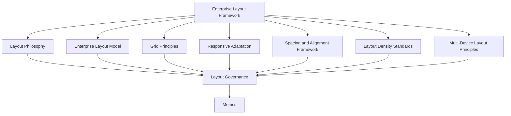

### Responsive Layout Lifecycle

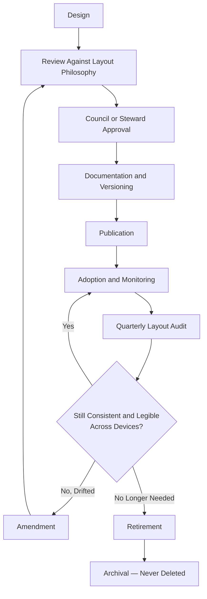

### Grid Architecture Model
See Enterprise Layout Model section above — reproduced here by reference per Single Source of Truth, never duplicated.

### Layout Hierarchy Model
See Grid Principles section above.

### Spacing & Alignment Framework
See Spacing & Alignment Framework section above.

### Responsive Adaptation Framework
See Responsive Adaptation section above.

### Layout Governance Framework
See Layout Governance section above.

### Layout Ownership Matrix

| Layout Category | Owner | Governance Authority |
|---|---|---|
| Citizen Services layouts | CPO (delegate: Citizen Experience PM) | Layout Governance Council |
| Government Services layouts | Head of Government Partnerships | Council + Head of Government Partnerships |
| Agriculture / Healthcare / Education / Employment layouts | Respective Vertical Head | Council |
| Marketplace / Property / Payments layouts | Respective Vertical Head | Council (Payments: Mission Critical review) |
| Community / Emergency Services layouts | Head of Community Engagement / Head of Trust & Safety | Council |
| Administration / Analytics layouts | Head of Operations / Head of Data & Analytics | Council + Compliance |
| AI-mediated layout regions | Head of AI Platform | Council + AI Council (`ai-docs/78`) |
| Support layouts | Head of Customer Success | Council |

### Layout Review Checklist

- [ ] Traceable to an existing Screen Architecture pattern per `ai-docs/97`, never invented independently.
- [ ] Every applicable Layout Model element is present or explicitly marked not applicable.
- [ ] Spatial Hierarchy matches the underlying logical Screen Hierarchy exactly.
- [ ] Density mode matches its category's defined standard, never exceeding the Comfortable Density floor for citizen-facing screens without justification.
- [ ] Spacing and Alignment follow the shared, documented scale — no arbitrary values.
- [ ] Reflows correctly from 320px to desktop widths with no clipped or overlapping content.
- [ ] Reading order matches visual order exactly.
- [ ] Consistent with the equivalent layout pattern in every other Business Area that has one.
- [ ] Named, accountable owner assigned per the Layout Ownership Matrix.
- [ ] No anti-pattern present, per the Anti-Patterns table above.

### Layout Audit Framework

| Audit Dimension | What Is Checked | Cadence |
|---|---|---|
| Consistency | Same layout category structured identically across Business Areas | Quarterly |
| Alignment | Elements adhere to the shared grid across every audited screen | Quarterly |
| Density Appropriateness | Screens remain within their defined density standard | Quarterly |
| Accessibility Compliance | WCAG 2.2 AA structural and reflow floor met | Quarterly |
| Responsive Integrity | No content or capability lost at any supported viewport | Quarterly |
| Ownership Completeness | Every layout pattern has a current, active named owner | Quarterly |

### Layout Maturity Model

| Level | Name | Characteristics |
|---|---|---|
| **1 — Informal** | Layouts vary by team; no shared grid or spacing standard. | High variance; citizens relearn spatial logic per module. |
| **2 — Developing** | The Enterprise Layout Model is documented; inconsistently applied. | Uneven adoption across verticals. |
| **3 — Defined** | This document's full model, grid, and density standards are applied consistently. | This document's standard is fully met. |
| **4 — Measured** | Layout Consistency Score, Reading Efficiency, and Accessibility Compliance are actively tracked against explicit thresholds. | Proactive, not reactive. |
| **5 — Optimized** | Layout Architecture actively informs product strategy and is genuinely replicable to a second district's device and language profile. | Layout is a durable civic and competitive advantage. |

Arwal's target state at this stage is **Level 3 (Defined)**, with **Level 4 (Measured)** targeted as analytics tooling from later phases matures.

### Enterprise Layout Principles Matrix

| Principle | Primary Beneficiary | Conflict Resolution Priority |
|---|---|---|
| Accessibility Through Layout | Vulnerable, low-literacy, rural citizens | Highest — never subordinated |
| Consistency Across Devices | Every citizen | Highest — never subordinated |
| Spatial Hierarchy | Every citizen | High |
| Balanced Density | Every citizen, especially low-literacy segments | High |
| Predictable Alignment | Every citizen across every module | Medium-High |
| Flexible Adaptation | Every citizen's actual device | Medium |
| Scalable Grid Systems | Future districts and future citizens | Medium |

### Responsive Decision Matrix

| Decision Type | Approval Authority |
|---|---|
| New reusable layout pattern | Layout Governance Council + CPO |
| Business-Area-local layout variation | Business Area Steward + Council (informational) |
| Cross-module layout-consistency change | Council + affected Business Area Stewards |
| Layout-accessibility standard change | Council + Head of Accessibility & Inclusion |
| New device-category adaptation | Council + Enterprise UX Architect |

### Device Adaptation Map

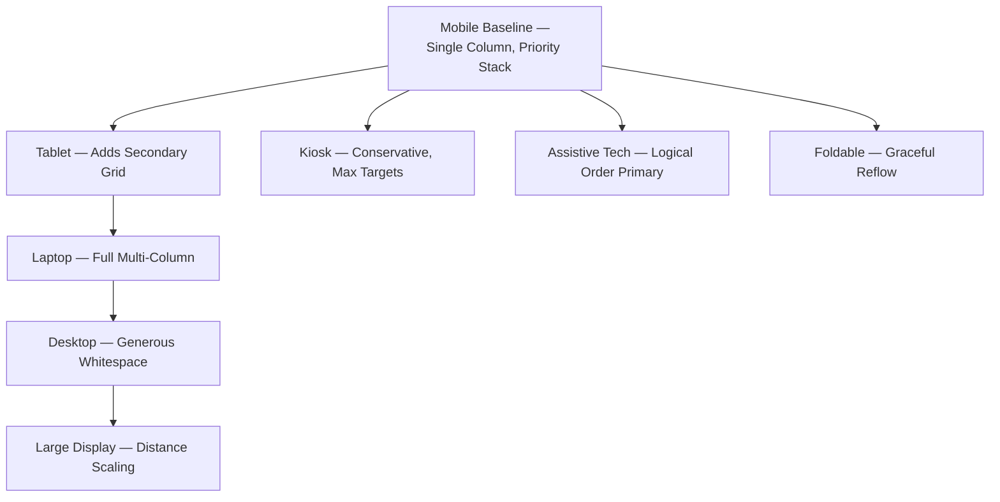

### Executive Dashboards (Conceptual)

| Dashboard | Audience | Key Content |
|---|---|---|
| **CXO/CPO Dashboard** | CXO, CPO | Layout Consistency Score, Layout Maturity Level |
| **Business Area Steward Dashboard** | Vertical Heads | Reading Efficiency, Density Appropriateness for their own area |
| **Accessibility Dashboard** | Head of Accessibility & Inclusion | Structural and reflow Accessibility Compliance trend |
| **Government Partners Dashboard** | Government liaisons | Government Services layout consistency and comprehension trend |

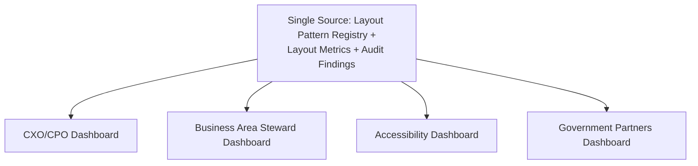

---

# Closing Statement

> **Callout — Closing Statement**
> Every prior document in this handbook explains what Arwal is, how it earns trust, how its information is organized, how a citizen moves through it, how a goal is accomplished, how that accomplishment improves, how every action behaves, and how a single screen is structurally organized. This document explains the final, physical reality a citizen actually meets: the space itself — how much room a certificate's requirements occupy on a cracked five-inch screen, whether a Critical Action is still reachable with one thumb, whether a doctor's confirmation is still unmistakable on a shared tablet passed between a citizen and their child. A platform can be perfectly structured and still fail the moment it renders illegibly on the only device a citizen actually owns. Layout & Responsive Grid System is where every discipline in this handbook either survives contact with the real, uneven, imperfect diversity of devices a district actually holds — or quietly does not. This is the standard every future screen, on every device, for every citizen, for as long as Arwal exists, is built to honor.

This document, `ai-docs/98-layout-responsive-grid-system.md`, is Phase 99 of approximately 425. Every future spatial, responsive, and device-adaptation decision is expected to trace back to a principle defined here, or to justify its deviation in writing.

**End of Phase 99 — `ai-docs/98-layout-responsive-grid-system.md`**