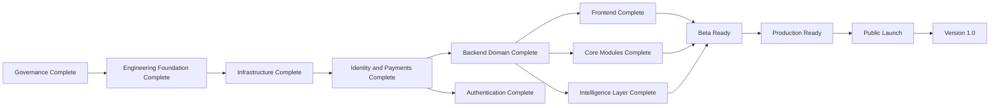
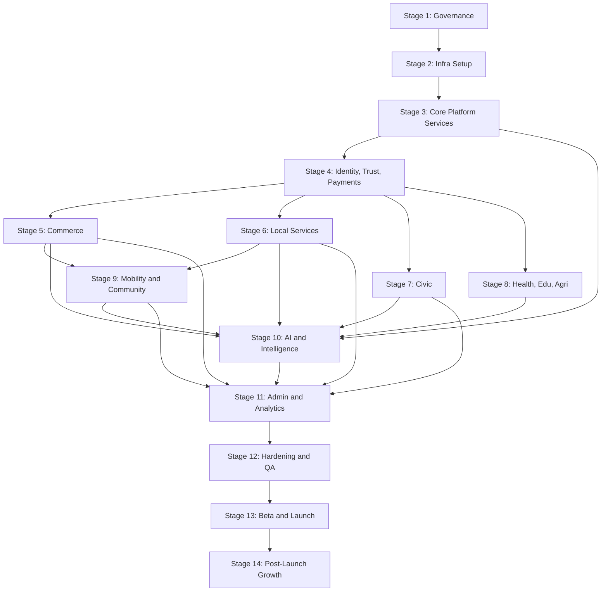
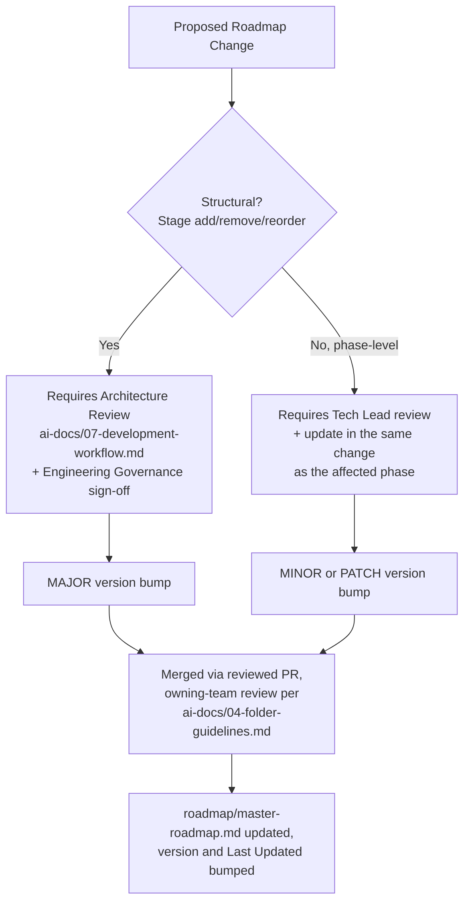
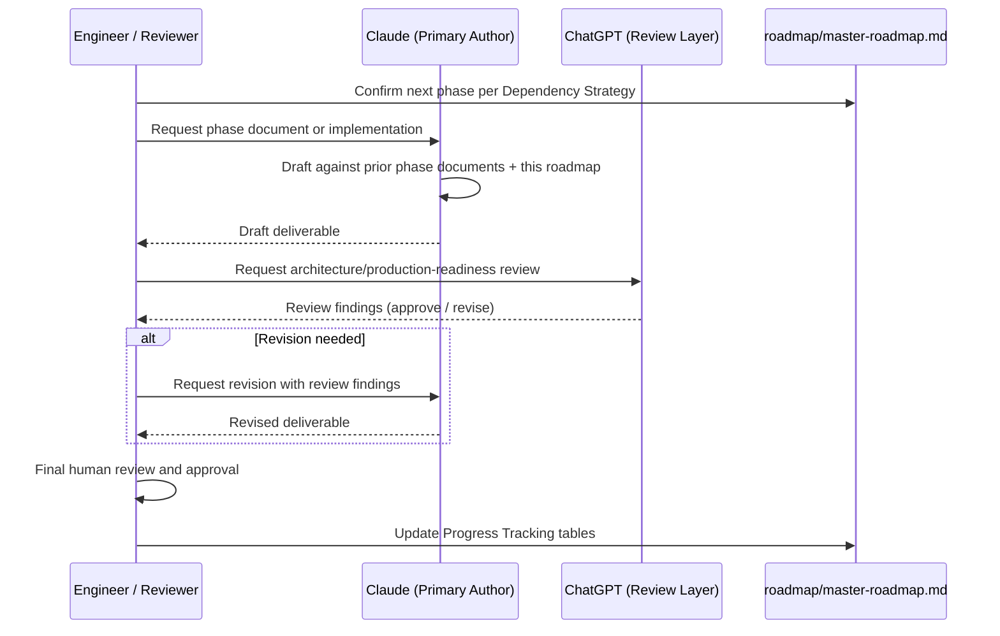

# Master Roadmap

**Document:** `roadmap/master-roadmap.md`
**Project:** Arwal — The District Super App
**Version:** 1.0.0
**Status:** Approved — Governing Reference for the Entire Project
**Owner:** Chief Software Architect / Engineering Leadership
**Audience:** Investors, Architects, Engineers, Designers, Product Managers, QA Engineers, DevOps Engineers, Security Engineers, Government Technical Partners, AI Development Tooling (Claude, ChatGPT, Gemini), Project Management
**Last Updated:** Phase 15 completion checkpoint (see Progress Tracking)
**Scope:** This document governs the entire Arwal project across all stages, all ~300+ micro-phases, and the full multi-year engineering lifecycle. It sits **above** every stage and every phase document — including `ai-docs/00` through `ai-docs/14` and every phase still to come.

> **Callout — This Document Is Not Part of Stage 1**
> `ai-docs/00-project-vision.md` through `ai-docs/14-database-design-guidelines.md` are Stage 1 deliverables — phase-numbered, sequential, and scoped to foundational documentation. `roadmap/master-roadmap.md` is a **project governance document**. It does not carry a phase number because it is not a phase; it is the map every phase is plotted on. It is versioned independently, reviewed on its own cadence, and amended only through the Change Management process defined later in this document.

---

# Purpose of this Roadmap

### Why This Roadmap Exists

A project spanning ~300+ micro-phases, multiple engineering disciplines, several years of continuous delivery, and — per `ai-docs/00-project-vision.md` — a mandate to become civic-grade infrastructure for over a million citizens, cannot be held together by memory, by a single engineer's mental model, or by the most recent conversation in a chat thread. It requires a single, durable, versioned document that answers, at any point in the project's life, five questions without ambiguity:

1. Where are we right now, in the full 300-phase journey?
2. What comes next, and why does it come in this order?
3. What has already been decided, and where is that decision recorded?
4. What is still undecided, and who decides it?
5. What does "the project is on track" actually mean, measurably?

This roadmap exists to answer all five, permanently, for every person and every AI tool that will ever touch Arwal.

### Why Every Engineering Phase References It

Every phase document produced across the life of Arwal — from `ai-docs/00-project-vision.md` to the final production-launch phase — is a **leaf** on a tree whose shape this roadmap defines. A phase document explains *what was decided and why, within its own scope*. This roadmap explains *where that phase sits, what depends on it, and what it unlocks*. Without this roadmap, each phase document would be locally coherent but globally orphaned — a correct answer to a question no one could see the shape of. Every phase document produced from this point forward is expected to open by confirming its phase number and stage against this roadmap, exactly as it already confirms its position against the phase documents that precede it.

### Why Phase Numbering Must Remain Stable

Phase numbers are not labels — they are **addresses**. `ai-docs/03-system-architecture-principles.md` is cited by number, not by title, in eleven other phase documents already produced. If phase numbers were renumbered every time the roadmap was revisited, every existing citation across every existing document would silently become wrong, and no reviewer could trust a phase reference without re-verifying it by hand. Phase numbers are therefore treated with the same permanence Git commit hashes are treated with in `ai-docs/06-git-workflow.md`: once assigned and published, a phase number is never reassigned to a different deliverable. A phase may be amended, deprecated, or superseded — but never renumbered. New work is always inserted as a new, higher-numbered phase, never squeezed between two existing ones.

### Why This Document Acts as the Project's Single Source of Truth

Per the Single Source of Truth principle already established in `ai-docs/02-engineering-principles.md` and `ai-docs/03-system-architecture-principles.md`, every fact in Arwal's system has exactly one authoritative owner. Applied at the project-governance level: **this roadmap is the single authoritative owner of "what stage and phase the project is in, and what the full journey looks like."** No sprint board, no standup note, no individual engineer's private tracking sheet is permitted to compete with it. Where a scheduling tool or a project-management board is used operationally, it is always a *derived view* of this document, never a second source of truth for it — the same discipline already required of caches and read models in `ai-docs/03-system-architecture-principles.md`.

---

# Project Vision Summary

Arwal is a unified digital civilization layer for a district — a single application replacing twenty disconnected apps, informal service economies, and physical government queues with one coherent, trusted platform for commerce, local services, civic governance, healthcare, education, agriculture, and community life. Built to enterprise-grade standards from Phase 1 rather than retrofitted later, Arwal is engineered to serve **over one million residents** without compromise on speed, security, or dignity of access — treated as public-purpose infrastructure, not a disposable consumer app.

Arwal's founding commitments, established in full in `ai-docs/00-project-vision.md` and `ai-docs/01-product-goals.md`, are:

- **Unification** — one identity, one wallet, one trust system, for every essential service a district needs.
- **Inclusion** — designed first for the lowest-bandwidth, lowest-literacy, most rural citizen, never the urban power user.
- **Trust** — every growth decision filtered through whether it preserves citizen trust and data dignity.
- **Endurance** — architected to survive a decade of growth and technology shifts, not a startup MVP.

This roadmap exists to carry that vision, phase by phase, from a founding charter into a running system a district depends on.

---

# Roadmap Principles

These principles govern how the roadmap itself is built and maintained — they are to project planning what `ai-docs/02-engineering-principles.md` is to code.

### Incremental Development

The project advances in the smallest slice that delivers real, reviewable value — a ~300-micro-phase structure exists specifically because a single 300-item undertaking cannot be reasoned about, reviewed, or recovered from a mistake in, while 300 small, sequential phases can be. This mirrors the Incremental Development commitment in `ai-docs/07-development-workflow.md`, applied one level up, to the shape of the entire project.

### One Objective Per Phase

Every phase in this roadmap has exactly one primary objective. A phase that tries to accomplish two unrelated things is, by definition, two phases wearing one number — and is split before it is scheduled. This exists because a phase with a single, nameable objective is reviewable, testable, and revertible in isolation; a phase with several tangled objectives is none of those things, exactly as the Scope Discipline principle in `ai-docs/02-engineering-principles.md` requires at the level of a single pull request.

### Production Quality from Day One

No phase — including the earliest documentation-only phases — is treated as a "throwaway draft" to be redone properly later. Per the Definition of Done established in `ai-docs/08-definition-of-done.md`, "complete" and "done" are different claims, and this roadmap holds every phase to "done." This exists because Arwal's founding vision explicitly rejects the "retrofitted later" pattern common to consumer MVPs — civic and financial infrastructure cannot be built on a first draft that everyone privately agrees will be rewritten.

### No Skipped Phases

Phases are not reordered opportunistically to chase a more exciting deliverable. A phase later in the sequence may begin only once every phase it depends on (see Dependency Strategy) has reached a Done state. This exists because skipping ahead is exactly how architectural debt compounds silently — a UI built before its API contract is documented, or a payments feature built before its security standard is written, is a liability wearing the appearance of progress.

### Documentation-First Approach

Per the Documentation-First commitment in `ai-docs/07-development-workflow.md` and the Documentation-Driven Development culture in `ai-docs/00-project-vision.md`, a non-trivial phase is documented — its contract, its architecture, its acceptance criteria — **before** implementation begins, never reconstructed from finished code afterward. This is why Stage 1 of this roadmap is fifty phases of foundational documentation before a single production feature is built: every subsequent phase inherits a stable, written reference rather than tribal knowledge.

### Review Before Completion

No phase is marked complete by its own author's declaration alone. Every phase passes through the same review discipline `ai-docs/02-engineering-principles.md` and `ai-docs/06-git-workflow.md` require of a pull request — independent verification against a citable standard, not self-certification. This exists because the single most expensive failure mode across a 300-phase roadmap is a phase that was marked "done" prematurely and silently propagated a defect into every phase built on top of it.

### Architecture Before Implementation

Every module, every service boundary, and every data model is architected — per `ai-docs/03-system-architecture-principles.md` and `ai-docs/14-database-design-guidelines.md` — before its implementation phase begins. This roadmap sequences Stage 1 (Governance & Foundation), the early phases of Stage 2 (Engineering & Infrastructure Setup), and dedicated architecture phases within every subsequent domain stage specifically to protect this ordering; an implementation phase that has no preceding architecture phase to reference is a scheduling defect in this roadmap, not an acceptable shortcut.

### Maintainability Over Speed

Where a choice must be made between finishing a phase faster and finishing it in a way a different engineer can safely extend six months later, this roadmap — like `ai-docs/05-coding-standards.md` and `ai-docs/08-definition-of-done.md` before it — chooses maintainability, every time. A roadmap that optimizes for the fastest path to Phase 300 at the expense of Phase 150 being comprehensible is optimizing for the wrong metric entirely, given Arwal's multi-year, multi-team horizon.

---

# Overall Project Structure

```mermaid
graph TD
    Project[Arwal — The District Super App]
    Project --> S1[Stage 1: Governance and Foundation]
    Project --> S2[Stage 2: Engineering and Infrastructure Setup]
    Project --> S3[Stage 3: Core Platform Services]
    Project --> S4[Stage 4: Identity, Trust and Payments]
    Project --> S5[Stage 5: Commerce and Marketplace]
    Project --> S6[Stage 6: Local Services and Bookings]
    Project --> S7[Stage 7: Civic and Government Services]
    Project --> S8[Stage 8: Healthcare, Education and Agriculture]
    Project --> S9[Stage 9: Mobility, Logistics and Community]
    Project --> S10[Stage 10: AI, Search and Intelligence Layer]
    Project --> S11[Stage 11: Admin, Analytics and Operations]
    Project --> S12[Stage 12: Hardening, QA and Compliance]
    Project --> S13[Stage 13: Beta, Launch and Stabilization]
    Project --> S14[Stage 14: Post-Launch Growth and Expansion]

    S1 --> P1["Phases 1-50<br/>Foundational Documentation"]
    S2 --> P2["Phases 51-~85<br/>Infra, CI/CD, Scaffolding"]
    S3 --> P3["Phases ~86-~115<br/>Shared Platform Services"]
    S4 --> P4["Phases ~116-~140<br/>Identity, Wallet, Trust"]
    S5 --> P5["Phases ~141-~170<br/>Commerce Modules"]
    S6 --> P6["Phases ~171-~195<br/>Local Services Modules"]
    S7 --> P7["Phases ~196-~215<br/>Civic Modules"]
    S8 --> P8["Phases ~216-~235<br/>Health, Education, Agri"]
    S9 --> P9["Phases ~236-~250<br/>Mobility and Community"]
    S10 --> P10["Phases ~251-~265<br/>AI and Search"]
    S11 --> P11["Phases ~266-~278<br/>Admin and Analytics"]
    S12 --> P12["Phases ~279-~290<br/>Hardening and Compliance"]
    S13 --> P13["Phases ~291-~300<br/>Beta and Launch"]
    S14 --> P14["Phase 301+<br/>Ongoing Expansion"]

    P1 --> D1[50 Approved Phase Documents]
    P2 --> D2[Deployable Skeleton, CI/CD, Environments]
    P3 --> D3[Shared Services: Auth, Notifications, Search, Files]
    P4 --> D4[Identity, Wallet, Reputation Systems]
    P5 --> D5[Commerce, Food, Grocery, Classifieds]
    P6 --> D6[Booking, Scheduling, Provider Tools]
    P7 --> D7[Application Intake, Grievance, Officer Dashboards]
    P8 --> D8[Provider Discovery, Scheme Discovery, Mandi Prices]
    P9 --> D9[Delivery, Transport, Community Feed]
    P10 --> D10[AI Gateway, Ranking, Civic Assistant]
    P11 --> D11[Admin Console, Dashboards, Reporting]
    P12 --> D12[Security Audit, Load Testing, Compliance Sign-off]
    P13 --> D13[Public Launch, v1.0]
    P14 --> D14[Multi-District Expansion]
```

---

# Stage Overview

The roadmap is organized into **fourteen stages**, progressing from governance through to public launch and beyond. The total phase count across all stages is approximately **300–310 phases**, consistent with the ~300-micro-phase commitment established in `ai-docs/00-project-vision.md`.

| Stage | Name | Objective | Approx. Phases | Major Deliverables | Dependencies |
|---|---|---|---|---|---|
| **1** | Governance & Foundation | Establish the complete, citable documentation foundation every future phase builds on. | 50 (fixed) | Vision, goals, principles, architecture, standards, and workflow documents (`ai-docs/00`–`ai-docs/49`) | None — this is the root of the dependency tree |
| **2** | Engineering & Infrastructure Setup | Stand up the deployable skeleton: monorepo, CI/CD, environments, observability, the empty Modular Monolith. | ~35 | Working `apps/api`, `apps/web`, `apps/admin-web` skeletons; CI/CD pipelines; local dev environment; base observability stack | Stage 1 complete |
| **3** | Core Platform Services | Build the shared platform services every domain module depends on. | ~30 | Authentication, Authorization, Notifications, Search, File Storage, Event Bus, API Gateway | Stage 2 complete |
| **4** | Identity, Trust & Payments | Build the identity, wallet, reputation, and payments backbone. | ~25 | Unified identity, KYC, Wallet, Payment Gateway integration, Trust & Reputation system | Stage 3 complete |
| **5** | Commerce & Marketplace | Build the commerce, food delivery, grocery, and classifieds modules. | ~30 | Catalog, cart, checkout, order tracking, food ordering, classifieds | Stages 3–4 complete |
| **6** | Local Services & Bookings | Build the local services marketplace: discovery, booking, scheduling. | ~25 | Service provider profiles, booking engine, scheduling, dispute resolution | Stages 3–4 complete |
| **7** | Civic & Government Services | Build the civic services module and government-officer tooling. | ~20 | Application intake, status tracking, grievance redress, officer dashboards | Stages 3–4 complete |
| **8** | Healthcare, Education & Agriculture | Build the healthcare, education, and agricultural intelligence modules. | ~20 | Provider discovery, scheme discovery, mandi prices, weather intelligence | Stages 3–4 complete |
| **9** | Mobility, Logistics & Community | Build the delivery/transport layer and community features. | ~15 | Delivery partner tooling, route assignment, community feed | Stages 3–6 complete |
| **10** | AI, Search & Intelligence Layer | Build the AI Gateway Service, ranking, and the civic assistant. | ~15 | AI Gateway, search ranking, fraud intelligence, civic assistant (with human-appeal path) | Stages 3–9 complete |
| **11** | Admin, Analytics & Operations | Build platform-administrator and reporting tooling. | ~13 | Admin console, operational dashboards, analytics pipeline | Stages 3–10 complete |
| **12** | Hardening, QA & Compliance | Full-platform security audit, load testing, accessibility audit, regulatory sign-off. | ~12 | Penetration test results, load test results, compliance certification | All prior stages substantially complete |
| **13** | Beta, Launch & Stabilization | Controlled beta, progressive rollout, public launch, v1.0 tag. | ~10 | Public launch, v1.0 release | Stage 12 complete |
| **14** | Post-Launch Growth & Expansion | Ongoing feature growth, adjacent-district replication, state integration. | Open-ended (301+) | Multi-district rollout, new verticals, state-government integration | Stage 13 complete |

> **Callout — Why Fourteen Stages, Not Fewer**
> A smaller number of large stages would obscure exactly the dependency structure this roadmap exists to make explicit — "build the backend" is not a stage a reviewer can meaningfully approve or reject. Fourteen stages, each with a single clear objective and an explicit dependency list, lets every stage be independently reviewed, exactly as the One Objective Per Phase principle requires one level up.

---

# Detailed Stage 1 — Governance & Foundation

**Objective:** Establish, phase by phase, the complete foundational documentation set that every subsequent stage of Arwal is measured against — vision, goals, principles, architecture, folder structure, coding standards, workflow, and every domain-specific enforceable standard (security, performance, accessibility, API design, database design, and beyond) required before a single production feature is implemented.

**Total Phases:** 50 (fixed — Stage 1 does not expand beyond fifty phases; any additional foundational need identified after Phase 50 is scheduled as an early Stage 2 phase instead, per the Change Management section below).

**Status Legend:** ✅ Completed · 🔵 Next (in progress / up next) · ⚪ Planned

| Phase | Title | Deliverable Filename | Status | Dependency |
|---|---|---|---|---|
| 1 | Project Vision | `ai-docs/00-project-vision.md` | ✅ Completed | None |
| 2 | Product Goals | `ai-docs/01-product-goals.md` | ✅ Completed | Phase 1 |
| 3 | Engineering Principles | `ai-docs/02-engineering-principles.md` | ✅ Completed | Phase 2 |
| 4 | System Architecture Principles | `ai-docs/03-system-architecture-principles.md` | ✅ Completed | Phase 3 |
| 5 | Folder Guidelines | `ai-docs/04-folder-guidelines.md` | ✅ Completed | Phase 4 |
| 6 | Coding Standards | `ai-docs/05-coding-standards.md` | ✅ Completed | Phase 5 |
| 7 | Git & Version Control Standards | `ai-docs/06-git-workflow.md` | ✅ Completed | Phase 6 |
| 8 | Development Workflow | `ai-docs/07-development-workflow.md` | ✅ Completed | Phase 7 |
| 9 | Definition of Done | `ai-docs/08-definition-of-done.md` | ✅ Completed | Phases 3–8 |
| 10 | Technology Stack Standards | `ai-docs/09-tech-stack.md` | ✅ Completed | Phases 3–4 |
| 11 | Security Standards | `ai-docs/10-security-standards.md` | ✅ Completed | Phases 3–4, 9–10 |
| 12 | Performance Standards | `ai-docs/11-performance-standards.md` | ✅ Completed | Phases 3–4, 9–10 |
| 13 | Accessibility Standards | `ai-docs/12-accessibility-standards.md` | ✅ Completed | Phases 2–3, 6, 9 |
| 14 | API Design Guidelines | `ai-docs/13-api-design-guidelines.md` | ✅ Completed | Phases 3–6, 9–11 |
| 15 | Database Design Guidelines | `ai-docs/14-database-design-guidelines.md` | ✅ Completed | Phases 2–3, 6, 9–11 |
| 16 | Testing Strategy & Quality Assurance Standards | `ai-docs/15-testing-strategy-qa-standards.md` | 🔵 Next | Phases 3, 6, 8–9 |
| 17 | Error Handling & Logging Standards | `ai-docs/16-error-handling-logging-standards.md` | ⚪ Planned | Phases 3, 6, 10–11 |
| 18 | Observability & Monitoring Standards | `ai-docs/17-observability-monitoring-standards.md` | ⚪ Planned | Phases 3–4, 9–12, 17 |
| 19 | CI/CD Pipeline & Release Engineering Standards | `ai-docs/18-cicd-release-engineering-standards.md` | ⚪ Planned | Phases 6–9, 16 |
| 20 | Environment & Configuration Management Standards | `ai-docs/19-environment-configuration-management.md` | ⚪ Planned | Phases 4, 9–10 |
| 21 | Internationalization & Localization Standards | `ai-docs/20-i18n-l10n-standards.md` | ⚪ Planned | Phases 2, 5, 13 |
| 22 | Notification System Design Standards | `ai-docs/21-notification-system-standards.md` | ⚪ Planned | Phases 4, 9, 14–15 |
| 23 | Search & Discovery Standards | `ai-docs/22-search-discovery-standards.md` | ⚪ Planned | Phases 4, 9, 14–15 |
| 24 | Payments & Wallet Standards | `ai-docs/23-payments-wallet-standards.md` | ⚪ Planned | Phases 4, 9–11, 14–15 |
| 25 | AI & Machine Learning Integration Standards | `ai-docs/24-ai-ml-integration-standards.md` | ⚪ Planned | Phases 4, 9–11 |
| 26 | Data Privacy & Regulatory Compliance Standards | `ai-docs/25-data-privacy-compliance-standards.md` | ⚪ Planned | Phases 2, 11, 15 |
| 27 | Third-Party Integration & Vendor Standards | `ai-docs/26-third-party-integration-standards.md` | ⚪ Planned | Phases 9, 11 |
| 28 | Mobile Application Standards (Android & iOS) | `ai-docs/27-mobile-application-standards.md` | ⚪ Planned | Phases 4, 6, 9, 13–14 |
| 29 | Design System & Component Library Standards | `ai-docs/28-design-system-standards.md` | ⚪ Planned | Phases 5–6, 13 |
| 30 | Content Management & Editorial Standards | `ai-docs/29-content-management-standards.md` | ⚪ Planned | Phases 2, 20 |
| 31 | Analytics & Reporting Standards | `ai-docs/30-analytics-reporting-standards.md` | ⚪ Planned | Phases 2, 15, 17 |
| 32 | Disaster Recovery & Business Continuity Standards | `ai-docs/31-disaster-recovery-bcp-standards.md` | ⚪ Planned | Phases 4, 9, 15, 17 |
| 33 | Scalability & Capacity Planning Standards | `ai-docs/32-scalability-capacity-planning.md` | ⚪ Planned | Phases 4, 9, 11, 15, 17 |
| 34 | Developer Onboarding & Developer Experience Standards | `ai-docs/33-developer-onboarding-dx-standards.md` | ⚪ Planned | Phases 5–8 |
| 35 | Release Management & Versioning Standards | `ai-docs/34-release-management-standards.md` | ⚪ Planned | Phases 7–9, 18 |
| 36 | Customer Support & Grievance Redress Standards | `ai-docs/35-customer-support-standards.md` | ⚪ Planned | Phases 2, 21 |
| 37 | Legal Framework & Terms of Service Guidelines | `ai-docs/36-legal-framework-standards.md` | ⚪ Planned | Phases 2, 26 |
| 38 | Vendor & Procurement Governance | `ai-docs/37-vendor-procurement-governance.md` | ⚪ Planned | Phases 26, 27 |
| 39 | Team Structure, Ownership & RACI Framework | `ai-docs/38-team-structure-raci.md` | ⚪ Planned | Phases 1–2, 5 |
| 40 | Engineering Governance & Decision-Making Framework | `ai-docs/39-engineering-governance-framework.md` | ⚪ Planned | Phases 3–4, 39 |
| 41 | Cost Management & FinOps Standards | `ai-docs/40-cost-management-finops.md` | ⚪ Planned | Phases 9, 32 |
| 42 | Sustainability & Environmental Impact Standards | `ai-docs/41-sustainability-standards.md` | ⚪ Planned | Phase 1 |
| 43 | Brand, Voice & Marketing Guidelines | `ai-docs/42-brand-marketing-guidelines.md` | ⚪ Planned | Phases 1–2, 20 |
| 44 | Community & Open Governance Standards | `ai-docs/43-community-open-governance.md` | ⚪ Planned | Phases 1, 39–40 |
| 45 | Innovation & R&D Framework | `ai-docs/44-innovation-rd-framework.md` | ⚪ Planned | Phases 1, 24, 40 |
| 46 | Module Specification Template & Standards | `ai-docs/45-module-specification-template.md` | ⚪ Planned | Phases 3–5, 13–15 |
| 47 | Service Level Agreement (SLA) Framework | `ai-docs/46-sla-framework.md` | ⚪ Planned | Phases 11, 17, 31 |
| 48 | Documentation Style Guide & Authoring Standards | `ai-docs/47-documentation-style-guide.md` | ⚪ Planned | Phases 1–47 (style consolidation) |
| 49 | Cross-Phase Traceability & Audit Framework | `ai-docs/48-cross-phase-traceability-framework.md` | ⚪ Planned | Phases 1–48 |
| 50 | Stage 1 Foundation Review & Governance Sign-off | `ai-docs/49-stage-1-foundation-signoff.md` | ⚪ Planned | Phases 1–49 (all of Stage 1) |

> **Callout — Why Phase 50 Is a Review, Not a New Standard**
> Stage 1 closes with a sign-off phase rather than a forty-ninth standards document, on purpose. Phase 50 exists to verify — against the Master Engineering Checklist pattern already established in `ai-docs/08-definition-of-done.md` — that every one of Phases 1–49 is internally consistent, that no two documents make contradictory claims, and that Stage 2 can begin without inheriting an unresolved foundation-level ambiguity. This mirrors the Architecture Review discipline in `ai-docs/07-development-workflow.md` applied to the foundation itself.

---

# Remaining Stages (Stage 2 Onward)

Stages 2 through 14 are summarized here at the stage level. Individual phase-by-phase breakdowns for each stage are produced during that stage's own planning cycle (per the Dependency Strategy below), not pre-committed in this document — consistent with the YAGNI discipline in `ai-docs/02-engineering-principles.md`: this roadmap plans what is known now in useful detail, and plans what is distant only at the resolution that is actually actionable today.

## Stage 2 — Engineering & Infrastructure Setup

**Objective:** Translate the fifty foundational documents into a working, deployable, empty skeleton — the Modular Monolith shell, CI/CD pipeline, environments, and observability stack — so that Stage 3 begins with infrastructure already proven, not improvised alongside the first real feature.

**Estimated Phases:** ~35 (Phases 51–~85)

**Expected Deliverables:**
- Monorepo scaffolded per `ai-docs/04-folder-guidelines.md`, with `apps/api`, `apps/web`, `apps/admin-web`, `apps/mobile` (placeholder), `apps/workers`, and the initial `packages/*` set.
- NestJS Modular Monolith bootstrapped with the Identity, Commerce, Local Services, Civic, Payments, and Notifications module folders created empty but structurally correct, per the Module Folder Template.
- PostgreSQL, Redis, PgBouncer, and Docker Compose local development environment, matching `ai-docs/09-tech-stack.md`.
- GitHub Actions CI/CD pipeline: lint, type-check, test, build, circular-dependency check, secret scan — fully wired per `ai-docs/06-git-workflow.md`.
- OpenTelemetry, Prometheus, and Grafana base observability stack, with a first "Hello World" dashboard proving the pipeline works end to end.
- Staging and production environment provisioning (Nginx, TLS, environment isolation) per `ai-docs/09-tech-stack.md` and `ai-docs/10-security-standards.md`.

## Stage 3 — Core Platform Services

**Objective:** Build the Shared Platform Services every domain module in later stages depends on, so no domain-module phase is ever blocked waiting on a shared capability that should already exist.

**Estimated Phases:** ~30 (Phases ~86–~115)

**Expected Deliverables:** Authentication service (OAuth2/OIDC, JWT, refresh-token rotation), Authorization service (RBAC + resource ownership), Notifications service (SMS/WhatsApp/push/email), Search service (indexing + ranking foundation), File Storage service (KYC/document handling), the shared Event Bus (BullMQ-backed Integration Events), and the API Gateway module.

## Stage 4 — Identity, Trust & Payments

**Objective:** Build the identity, wallet, reputation, and payments backbone that every commerce, services, and civic transaction in later stages transacts through.

**Estimated Phases:** ~25 (Phases ~116–~140)

**Expected Deliverables:** Unified citizen/merchant/provider/officer identity and profile system; KYC document capture and verification workflow; the Wallet module and Payments Gateway integration; the Trust & Reputation system (ratings, verification badges, dispute-resolution workflow) shared across every future module.

## Stage 5 — Commerce & Marketplace

**Objective:** Build the local commerce marketplace, food and restaurant ordering, grocery, and classifieds modules.

**Estimated Phases:** ~30 (Phases ~141–~170)

**Expected Deliverables:** Shop discovery and catalog browsing, cart and checkout, order tracking and returns/refunds, food/restaurant ordering with delivery tracking, classifieds/peer-to-peer listings, and the initial B2B/wholesale marketplace foundation.

## Stage 6 — Local Services & Bookings

**Objective:** Build the local services marketplace — discovery, booking, scheduling, and secure payment for skilled local service providers.

**Estimated Phases:** ~25 (Phases ~171–~195)

**Expected Deliverables:** Service provider profiles and verification, the booking/scheduling engine, availability management, service-specific pricing, and dispute resolution integrated with the Trust & Reputation system.

## Stage 7 — Civic & Government Services

**Objective:** Build the civic services module — the first genuinely civic-integration-dependent stage — for a pilot set of government services.

**Estimated Phases:** ~20 (Phases ~196–~215)

**Expected Deliverables:** Application submission and document upload, status tracking, grievance redress workflow, government-officer dashboards with workflow automation and audit trails.

## Stage 8 — Healthcare, Education & Agriculture

**Objective:** Build the three domain-specific "Should Have" verticals from `ai-docs/01-product-goals.md`'s prioritization: healthcare discovery/booking, education/skills discovery, and agricultural intelligence.

**Estimated Phases:** ~20 (Phases ~216–~235)

**Expected Deliverables:** Healthcare provider/diagnostics/pharmacy discovery and appointment booking; tutor/coaching-center/skill-resource discovery; mandi price feeds, weather intelligence, government scheme discovery, and a direct-to-buyer produce marketplace.

## Stage 9 — Mobility, Logistics & Community

**Objective:** Build the unified delivery/transport coordination layer underpinning every fulfillment-dependent module already shipped, plus initial community features.

**Estimated Phases:** ~15 (Phases ~236–~250)

**Expected Deliverables:** Delivery partner tooling (route assignment, earnings dashboard), unified logistics coordination across Commerce and Local Services, and a community feed/discussion layer.

## Stage 10 — AI, Search & Intelligence Layer

**Objective:** Layer AI capability across the platform via the provider-agnostic AI Gateway Service established in `ai-docs/09-tech-stack.md`, including the civic assistant with its mandatory human-appeal path.

**Estimated Phases:** ~15 (Phases ~251–~265)

**Expected Deliverables:** AI Gateway Service, intelligent/ranked search and discovery, fraud and trust anomaly detection, the AI-powered civic assistant (conversational guidance with human override, per the AI Principle in `ai-docs/00-project-vision.md`), and accessibility-amplifying voice/text-to-speech features.

## Stage 11 — Admin, Analytics & Operations

**Objective:** Build the internal operational tooling platform administrators and trust/safety teams depend on.

**Estimated Phases:** ~13 (Phases ~266–~278)

**Expected Deliverables:** Unified admin console, merchant/provider verification workflow tooling, fraud/dispute operational dashboards, and the analytics/reporting pipeline feeding the KPIs defined in `ai-docs/01-product-goals.md`.

## Stage 12 — Hardening, QA & Compliance

**Objective:** Full-platform verification against every enforceable standard established in Stage 1 before any citizen-facing launch — security, performance, accessibility, and regulatory compliance, all independently audited.

**Estimated Phases:** ~12 (Phases ~279–~290)

**Expected Deliverables:** Full penetration test and remediation cycle (`ai-docs/10-security-standards.md`), full load/stress/soak/spike testing cycle (`ai-docs/11-performance-standards.md`), full accessibility audit (`ai-docs/12-accessibility-standards.md`), regulatory and government-compliance sign-off, and a disaster-recovery drill.

## Stage 13 — Beta, Launch & Stabilization

**Objective:** Controlled beta rollout, progressive production delivery, and the official v1.0 public launch.

**Estimated Phases:** ~10 (Phases ~291–~300)

**Expected Deliverables:** Closed beta with a defined citizen cohort, staged canary rollout, public launch communications, `v1.0.0` tag per `ai-docs/06-git-workflow.md`'s Semantic Versioning scheme, and a post-launch stabilization bake-in period.

## Stage 14 — Post-Launch Growth & Expansion

**Objective:** Ongoing feature growth, adjacent-district replication, and state-government integration, per the Future Expansion Strategy in `ai-docs/00-project-vision.md`.

**Estimated Phases:** Open-ended (Phase 301 onward, planned in dedicated future roadmap revisions)

**Expected Deliverables:** Adjacent-district configuration-driven rollout, deepened vertical functionality, state-level government integration, and — in later years — the Open Ecosystem Phase's third-party API access.

---

# Milestones

| Milestone | Definition | Target Stage Completion |
|---|---|---|
| **Governance Complete** | All 50 Stage 1 phases approved and internally consistent, sign-off phase (Phase 50) passed. | End of Stage 1 |
| **Engineering Foundation Complete** | Monorepo, CI/CD, and empty Modular Monolith skeleton deployable to staging. | End of Stage 2 |
| **Infrastructure Complete** | Shared Platform Services (Auth, Authorization, Notifications, Search, File Storage, Event Bus, Gateway) live in staging. | End of Stage 3 |
| **Identity & Payments Complete** | Unified identity, KYC, Wallet, and Payment Gateway integration live in staging. | End of Stage 4 |
| **Backend Domain Complete** | Commerce, Local Services, Civic, Healthcare/Education/Agriculture, and Mobility modules functionally complete against their API contracts. | End of Stage 9 |
| **Frontend Complete** | PWA and Admin Dashboard clients achieve full functional parity with the backend contract, per Platform Parity in `ai-docs/01-product-goals.md`. | Spans Stages 3–11, confirmed at Stage 11 |
| **Authentication Complete** | Unified identity/auth flow live across every client surface, MFA enforced per role, per `ai-docs/10-security-standards.md`. | End of Stage 4 |
| **Core Modules Complete** | Commerce, Local Services, and Civic Services — the three Must-Have verticals from `ai-docs/01-product-goals.md` — fully live in staging. | End of Stage 7 |
| **Intelligence Layer Complete** | AI Gateway Service and civic assistant live, with human-appeal paths verified. | End of Stage 10 |
| **Beta Ready** | All functional modules complete, full QA/security/performance/accessibility audit passed. | End of Stage 12 |
| **Production Ready** | Beta stabilized, no open Sev 1/Sev 2 defects, Release Readiness Checklist (`ai-docs/08-definition-of-done.md`) satisfied. | Mid-Stage 13 |
| **Public Launch** | `v1.0.0` tagged and deployed to production via progressive delivery. | End of Stage 13 |
| **Version 1.0** | Public launch stabilized through its full bake-in period with no rollback required. | Start of Stage 14 |

---

# Progress Tracking

> **Callout — Maintenance Instructions**
> The tables in this section are living data, not narrative. They are updated at the close of every phase, per the Cross-Phase Traceability & Audit Framework (Phase 49). Values below reflect the state of the project **as of the completion of Phase 15**, the most recent phase confirmed Done at the time of this roadmap's authoring.

### Phase-Level Progress

| Metric | Value |
|---|---|
| Total planned phases (current estimate) | ~300–310 |
| Phases completed | 15 |
| Current phase | 16 — Testing Strategy & Quality Assurance Standards |
| Current stage | Stage 1 — Governance & Foundation |
| Phases remaining in Stage 1 | 35 (Phases 16–50) |
| Phases remaining project-wide (estimate) | ~285–295 |
| Overall project completion (phase-count basis) | ≈ 5% |
| Stage 1 completion | 30% (15 of 50 phases) |

### Stage-Level Progress

| Stage | Status | Phases Complete | Phases Total (Est.) | % Complete |
|---|---|---|---|---|
| 1 — Governance & Foundation | 🔵 In Progress | 15 | 50 | 30% |
| 2 — Engineering & Infrastructure Setup | ⚪ Not Started | 0 | ~35 | 0% |
| 3 — Core Platform Services | ⚪ Not Started | 0 | ~30 | 0% |
| 4 — Identity, Trust & Payments | ⚪ Not Started | 0 | ~25 | 0% |
| 5 — Commerce & Marketplace | ⚪ Not Started | 0 | ~30 | 0% |
| 6 — Local Services & Bookings | ⚪ Not Started | 0 | ~25 | 0% |
| 7 — Civic & Government Services | ⚪ Not Started | 0 | ~20 | 0% |
| 8 — Healthcare, Education & Agriculture | ⚪ Not Started | 0 | ~20 | 0% |
| 9 — Mobility, Logistics & Community | ⚪ Not Started | 0 | ~15 | 0% |
| 10 — AI, Search & Intelligence Layer | ⚪ Not Started | 0 | ~15 | 0% |
| 11 — Admin, Analytics & Operations | ⚪ Not Started | 0 | ~13 | 0% |
| 12 — Hardening, QA & Compliance | ⚪ Not Started | 0 | ~12 | 0% |
| 13 — Beta, Launch & Stabilization | ⚪ Not Started | 0 | ~10 | 0% |
| 14 — Post-Launch Growth & Expansion | ⚪ Not Started | 0 | Open-ended | N/A |

### Update Protocol

Each row above is updated by whichever engineer or reviewer closes a phase, in the same change that marks the phase Done — never as a separate, deferred "update the roadmap" task, per the same discipline the Documentation Workflow in `ai-docs/07-development-workflow.md` applies to every other documentation artifact. A phase is not considered fully closed until this table reflects it.

---

# Dependency Strategy

### Phase Dependencies

Every phase in this roadmap declares its dependencies explicitly (see the Dependency column in the Stage 1 table above, and the per-stage summaries for later stages). A phase's dependencies are the minimum set of prior phases whose deliverables it directly relies on — never a defensive over-listing of "everything before it," which would make the dependency graph meaningless. A phase may begin only once every phase in its declared dependency list has reached a Done state per `ai-docs/08-definition-of-done.md`.

### Stage Dependencies

A stage's dependency is the set of prior stages whose deliverables its own phases directly consume — as declared in the Stage Overview table. Stage 2 depends only on Stage 1 (it needs the foundation documented, not any feature built). Stage 5 (Commerce) depends on Stages 3–4 (it needs shared services and payments/identity, not civic services). This is deliberate: stage dependencies are drawn as narrowly as true necessity requires, exactly as Domain Boundaries are drawn narrowly in `ai-docs/03-system-architecture-principles.md`, so that unrelated stages are never blocked on each other by an artificially broad dependency claim.

### Cross-Stage Dependencies

Some capabilities are genuinely cross-cutting and are called out explicitly rather than left implicit:

- Every domain-module stage (5 through 9) depends on the Trust & Reputation system built in Stage 4 — a booking, an order, and a civic application all share the same reputation and dispute-resolution backbone.
- Stage 10 (AI) depends on every stage that produces the data it ranks, recommends against, or assists with — Stages 3 through 9 — since an AI Gateway Service with nothing to rank or assist with cannot be meaningfully built or tested.
- Stage 12 (Hardening) depends on **every** functional stage being substantially complete, since a security or performance audit of a partially-built platform produces findings that will be invalidated by the remaining work.

### Parallel Work Rules

1. **Two phases within the same stage may run in parallel only if neither appears in the other's dependency list.** Phases 21 (i18n Standards) and 22 (Notification Standards) in Stage 1, for example, may be authored in parallel, since neither depends on the other.
2. **A stage may begin its earliest phases before the prior stage's very last phase closes**, provided the specific phases relied upon are already Done — e.g., Stage 3's Authentication-service phases may begin once Stage 2's CI/CD and skeleton phases are Done, without waiting for every remaining Stage 2 phase (such as a later-scheduled observability refinement) to close, as long as that later phase is not itself a declared dependency.
3. **No phase may be marked Done while a phase it depends on is still open.** This is enforced the same way a merge is blocked on a failing CI check in `ai-docs/06-git-workflow.md` — mechanically, not by good-faith agreement alone.
4. **Cross-stage parallel work across independent domain verticals is encouraged once Stage 4 is Done.** Stages 5 (Commerce), 6 (Local Services), 7 (Civic), and 8 (Health/Education/Agriculture) share no direct dependency on one another — per the Modular Monolith and Bounded Context discipline in `ai-docs/03-system-architecture-principles.md`, separate teams may build them concurrently once their shared prerequisites (Stages 3–4) are complete.

---

# Risk Register

| Risk | Description | Mitigation Strategy |
|---|---|---|
| **Scope Creep** | A phase or stage silently accumulates additional, undeclared objectives beyond its stated scope, violating the One Objective Per Phase principle. | Every phase's objective is stated once, here or in its own phase document, and any expansion requires a new phase per the Change Management process below — never a silent in-place expansion. |
| **AI-Generated Inconsistencies** | AI-assisted phase authorship (per the AI Development Workflow below) introduces a claim that contradicts an earlier phase document without either party noticing. | The Cross-Phase Traceability & Audit Framework (Phase 49) and periodic full-foundation reviews (Phase 50, and subsequent stage-closing reviews) exist specifically to catch this; every AI-assisted phase is human-reviewed per the AI-Assisted Development Guidelines in `ai-docs/07-development-workflow.md`. |
| **Technical Debt Accumulation** | Shortcuts taken under schedule pressure compound silently across 300 phases. | The Technical Debt Policy and Continuous Refactoring Budget already established in `ai-docs/00-project-vision.md` and `ai-docs/02-engineering-principles.md` apply project-wide; every deliberate shortcut is tracked, never hidden, per `ai-docs/08-definition-of-done.md`. |
| **Performance Degradation at Scale** | A design decision made early (Stages 2–4) does not hold up once real citizen-scale load arrives in later stages. | Every phase from Stage 2 onward is evaluated against the 1,000,000+ user target per `ai-docs/11-performance-standards.md`; load testing is scheduled deliberately ahead of scale milestones, not reactively. |
| **Security Vulnerabilities** | A vulnerability is introduced in an early stage and remains undiscovered until Stage 12's audit, or worse, until production. | Security review is a checkpoint at every stage, per the Security Review Workflow in `ai-docs/07-development-workflow.md`, not deferred entirely to Stage 12 — Stage 12 is a comprehensive final audit, not the first security check. |
| **Documentation Drift** | Later-stage implementation diverges from the standards set in Stage 1's documents, and no one notices until a citation is challenged in review. | Every phase document and every code-level artifact cites the specific Stage 1 document and section it implements, per the citation discipline already modeled in `ai-docs/03`–`ai-docs/14`; drift is a Blocking Issue in code review, per `ai-docs/05-coding-standards.md`. |
| **Third-Party Dependency Risk** | A critical SaaS integration (payment gateway, SMS provider, AI model provider) changes terms, degrades reliability, or becomes unavailable. | The Third-Party Service Policy in `ai-docs/09-tech-stack.md` and the forthcoming Third-Party Integration Standards (Phase 27) require an abstraction layer and a credible exit path for every such dependency, evaluated before adoption. |
| **Schedule Delays** | The 300-phase estimate proves optimistic as domain complexity is discovered mid-stage. | Phase and stage counts in this roadmap are explicitly estimates (see the "Est." markers throughout), revisited at every stage boundary per the Change Management process — the roadmap is designed to be corrected, not defended past the point of accuracy. |
| **Government Partnership Dependency** | Stage 7 (Civic) and later state-integration work in Stage 14 depend on administrative cooperation outside Arwal's control. | Per the Government Dependency Risk mitigation already established in `ai-docs/00-project-vision.md`, the civic module is designed to add standalone value even without full government integration, decoupling Arwal's own schedule from government timelines wherever possible. |
| **Team Scaling Risk** | The team scales across years and disciplines; new engineers inherit 300 phases of context they were not present for. | This roadmap, together with the Documentation-Driven Development culture and the Folder Ownership Rules in `ai-docs/04-folder-guidelines.md`, is the explicit mechanism by which context survives team turnover — no phase's reasoning depends on a specific individual's memory. |

---

# Change Management

### Roadmap Versioning

This document follows Semantic Versioning, per the convention already established in `ai-docs/06-git-workflow.md`:

- **MAJOR** — A change to the stage structure itself (adding, removing, merging, or fundamentally reordering a stage).
- **MINOR** — A change to phase counts, phase titles, or dependency declarations within an existing stage structure (e.g., inserting new phases, as happened when Phases 16–50 were detailed in this version).
- **PATCH** — Corrections to progress-tracking data, milestone dates, or non-structural clarifications.

### Phase Modifications

An existing, already-completed phase's *deliverable* (its `ai-docs/*.md` file) may be amended after the fact only through the same phase-document amendment discipline already established in each phase document's own closing statement — "through a documented review exception, or an ADR where the deviation is structural — never silently, and never by default." This roadmap's *entry* for that phase (its row in the Stage 1 table, or its stage summary) is updated in the same change, so the roadmap never describes a phase differently than the phase document itself does.

### Adding New Phases

A new phase is added only at the **next available, unused phase number** in its stage — never inserted between two existing phase numbers, per the Phase Numbering Stability principle established earlier in this document. If Stage 1's fifty-phase allocation proves insufficient, the overflow is scheduled as an early Stage 2 phase rather than expanding Stage 1 past fifty, preserving the "Stage 1 is fixed at fifty phases" commitment stated in the Detailed Stage 1 section.

### Deprecating Phases

A phase is never silently deleted from this roadmap or from `ai-docs/`, per the ADR retention discipline in `ai-docs/02-engineering-principles.md` — "a superseded ADR is marked as superseded and linked to its replacement, preserving the full decision history." A deprecated phase's roadmap entry is marked `Deprecated`, with a note pointing to its replacement phase number, and its underlying document remains in place with the same deprecation marking applied to its own header.

### Approval Workflow

No change to this document merges without at least one qualified reviewer's approval, exactly as no code change merges without one, per `ai-docs/06-git-workflow.md` — this document is held to the same review discipline as the codebase it governs, not a lesser one.

---

# AI Development Workflow

Arwal's ~300-phase roadmap is built with the explicit, structured assistance of multiple AI tools, each assigned a distinct, non-overlapping responsibility so that AI assistance strengthens consistency across hundreds of phases rather than introducing drift, per the AI-Assisted Development Guidelines already established in `ai-docs/07-development-workflow.md`.

### Claude — Primary Implementation and Document Generation

Claude is the primary author of phase documents, code, and structured deliverables across the project. Responsibilities:

- Drafting new phase documents (`ai-docs/*.md`) against this roadmap's stage/phase structure and against every previously approved phase document's established conventions.
- Implementing application code — backend modules, frontend components, database migrations — against the standards set in `ai-docs/05-coding-standards.md` through `ai-docs/14-database-design-guidelines.md`.
- Generating tests, documentation updates, and ADRs alongside the code or document they accompany, never as a deferred follow-up.
- Flagging, in its own output, any point where a requested change appears to conflict with an existing phase document, rather than silently resolving the conflict unilaterally.

### ChatGPT — Architecture Review and Production Readiness Validation

ChatGPT serves as an independent second reviewer, structurally separated from the primary authorship role to preserve the Defense in Depth principle already established in `ai-docs/10-security-standards.md`, applied here to documentation and architecture quality rather than security controls alone. Responsibilities:

- **Architecture review** — evaluating a proposed phase or implementation against `ai-docs/03-system-architecture-principles.md`'s Modular Monolith strategy, DDD boundaries, and dependency rules.
- **Engineering review** — evaluating code and documents against `ai-docs/02-engineering-principles.md` and `ai-docs/05-coding-standards.md`.
- **Production readiness validation** — evaluating a phase against the Definition of Done (`ai-docs/08-definition-of-done.md`) before it is marked complete in this roadmap's Progress Tracking tables.
- **Roadmap consistency checking** — verifying that a newly proposed or completed phase's roadmap entry (stage, phase number, dependency list) is internally consistent with this document.
- **Technical guidance** — offering a second perspective on ambiguous design trade-offs before they are locked in via an ADR.

### Gemini and Other AI Tools

Where used, additional AI tools (Gemini or others) are assigned a specific, bounded role for a given task — never a blanket, undifferentiated "help with the project" mandate — and are held to the identical AI-Assisted Development Definition of Done in `ai-docs/08-definition-of-done.md` as Claude and ChatGPT: full human review, no unsupervised generation of security-sensitive logic, and no relaxed scrutiny because the origin was an AI tool.

### Workflow Integration

### Why This Workflow Supports Consistency Across Hundreds of Phases

A single AI tool authoring and reviewing its own output across 300 phases has no structural mechanism to catch its own blind spots — the same failure mode `ai-docs/02-engineering-principles.md` identifies in unreviewed human-authored code. Splitting authorship and review across two independently-prompted tools, both anchored to the same durable, versioned documents (this roadmap and every `ai-docs/*.md` file), gives Arwal a Defense in Depth for documentation and architecture quality, not just for security controls — exactly the same logic already applied to every other layer of the system.

---

# Success Metrics

Success is measured across the same four dimensions established in `ai-docs/00-project-vision.md` and `ai-docs/01-product-goals.md` — Reach, Trust, Reliability, and Impact — extended here with roadmap-execution-specific indicators.

| Category | Metric | Target Direction |
|---|---|---|
| **Roadmap Execution** | Phases closed per engineering cycle, measured against this roadmap's stage estimates | Sustained, predictable cadence — not spiking then stalling |
| **Roadmap Execution** | Number of phases requiring rework after being marked Done | Trending toward zero — a rising trend signals a review-discipline failure |
| **Roadmap Execution** | Roadmap-to-reality drift (phases whose actual scope diverged from their roadmap entry) | Minimal, and always resolved via the Change Management process, never left silently inconsistent |
| **Foundation Quality** | Cross-phase contradictions found during stage-closing reviews (Phase 50 and beyond) | Zero at each stage-closing review |
| **Reach** | Monthly Active Users as % of district population (post-launch) | Growing toward district-majority penetration, per `ai-docs/01-product-goals.md` |
| **Trust** | Dispute resolution time, fraud incident rate, citizen satisfaction score (post-launch) | Consistently healthy alongside growth, per the North Star Principle in `ai-docs/00-project-vision.md` |
| **Reliability** | Platform uptime, API latency percentiles, incident MTTR (post-launch) | Meeting the enterprise-grade targets in `ai-docs/11-performance-standards.md` |
| **Impact** | Reduction in time to complete a government service; merchant/worker income improvement (post-launch) | Measurable and durable, per `ai-docs/01-product-goals.md`'s Success Criteria |

> **Callout — Roadmap Success Is a Leading Indicator, Not the Goal**
> Executing 300 phases on schedule is meaningless if the resulting platform does not serve citizens per the Definition of Success in `ai-docs/01-product-goals.md`. The Roadmap Execution and Foundation Quality metrics above exist to catch process failure early; the Reach, Trust, Reliability, and Impact metrics are the actual measure of whether Arwal succeeded. This roadmap is a means, never an end in itself.

---

# Long-Term Vision

This roadmap governs Arwal through Stage 13 — public launch and `v1.0.0`. Beyond that point, per the 10-Year Vision Arc in `ai-docs/00-project-vision.md`, the roadmap does not end; it enters **Stage 14 and beyond**, re-planned at each major horizon rather than pre-committed today, consistent with the Evidence over Prediction principle already established in `ai-docs/03-system-architecture-principles.md`.

- **Years 1–2 (Stages 1–13 of this roadmap):** Foundation, trust, and the founding district's core commerce, services, and civic pilot — the scope this document plans in full.
- **Years 3–4 (Stage 14, early phases):** Deepened civic coverage, healthcare and education maturity, early AI-assisted discovery — planned in a Version 2.0 revision of this roadmap once Stage 13 closes.
- **Years 5–6 (Stage 14, later phases):** Regional expansion to adjacent districts via the configuration-driven replication model, cross-district logistics, broader language/accessibility maturity.
- **Years 7–8:** State-level government integration, responsible fintech/micro-lending expansion, an advanced AI civic assistant — each gated by the same trust-before-automation discipline established throughout Stage 1.
- **Years 9–10:** Arwal's architecture and this very roadmap structure become a template — a national reference model — for replicating a district-super-app to other regions, with this document itself as the governance artifact handed to each new deployment.

This roadmap will be revised — never silently, always through the Change Management process above — at the close of every stage, so that the document guiding Year 7 reflects what was actually learned in Years 1 through 6, not merely what Phase 1 originally guessed.

---

# Closing Statement

> **Callout — Closing Statement**
> `roadmap/master-roadmap.md` is the official navigation guide for the entire Arwal project. Every future stage, every future phase, every future engineer, and every future AI-assisted contribution is expected to remain aligned with the structure, principles, dependencies, and standards defined here — unless a change has been formally approved through the Change Management process defined in this document. This roadmap does not describe a plan that will be reconsidered the moment it becomes inconvenient; it describes the disciplined, sequenced, dependency-respecting path by which fifty pages of founding documentation become a working civic-commerce platform serving over a million citizens, phase by phase, stage by stage, without ever losing track of why each step comes before the next.

This document, `roadmap/master-roadmap.md`, sits above every stage and every phase of the Arwal project. It is not Phase 1 of Stage 1 — it is the map Phase 1, and Phase 300, and every phase in between, are drawn on.

**End of `roadmap/master-roadmap.md`**
